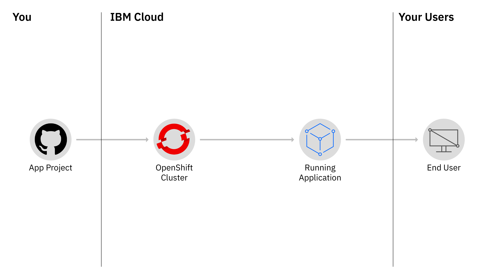
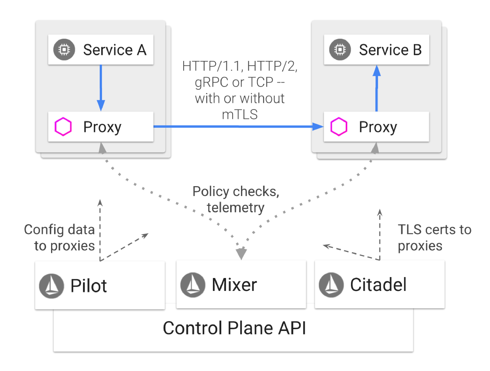
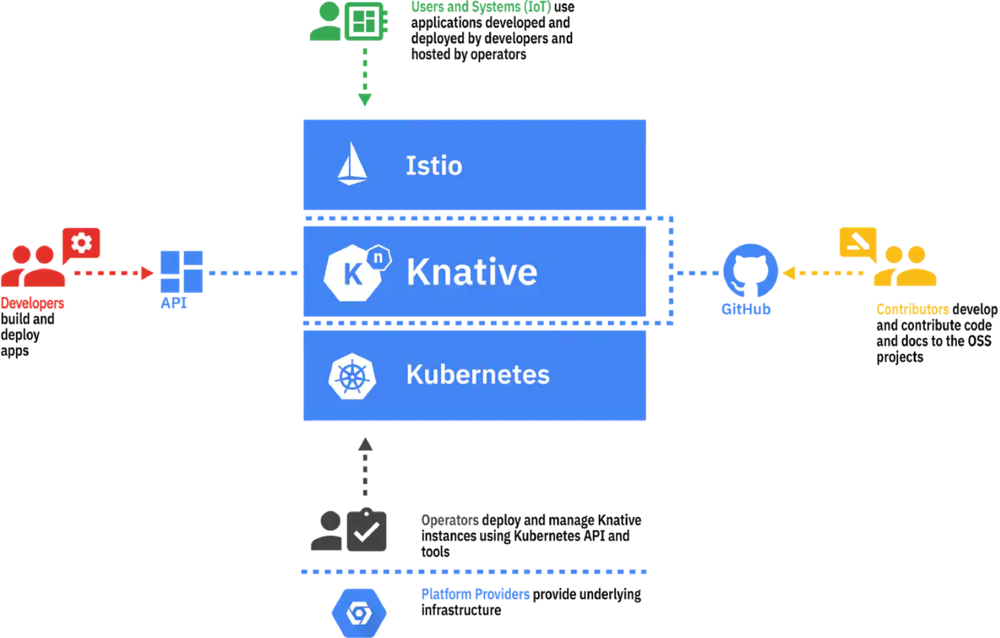
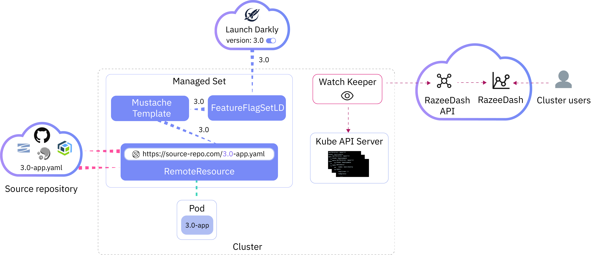

---

copyright:
  years: 2014, 2019
lastupdated: "2019-07-19"

keywords: kubernetes, iks

subcollection: containers

---

{:codeblock: .codeblock}
{:deprecated: .deprecated}
{:download: .download}
{:external: target="_blank" .external}
{:faq: data-hd-content-type='faq'}
{:gif: data-image-type='gif'}
{:help: data-hd-content-type='help'}
{:important: .important}
{:new_window: target="_blank"}
{:note: .note}
{:pre: .pre}
{:preview: .preview}
{:screen: .screen}
{:shortdesc: .shortdesc}
{:support: data-reuse='support'}
{:table: .aria-labeledby="caption"}
{:tip: .tip}
{:troubleshoot: data-hd-content-type='troubleshoot'}
{:tsCauses: .tsCauses}
{:tsResolve: .tsResolve}
{:tsSymptoms: .tsSymptoms}

# Tutorial overview
{: #tutorials-ov}

## Create a cluster and deploy your first app
{: #tutorials-create-cluster-deploy-app}

  <a href = "/docs/containers?topic=containers-cs_cluster_tutorial">
  

      

        Community Kubernetes cluster
        

              

                 
Create a Kubernetes cluster on managed {{site.data.keyword.containerlong_notm}} with Classic infrastructure worker nodes that run an Ubuntu operating system. 
 
              

              

                  
              

          

      

  

  </a>
  <a href = "/docs/containers?topic=containers-vpc_ks_tutorial">
    

        

          Virtual Private Cloud cluster
            

                

                   
Create a classic cluster in your Virtual Private Cloud (VPC). 
 
                

                

                     
                

            

        

    

  </a>
  <a href = "/docs/openshift?topic=openshift-openshift_tutorial">
    

        

          OpenShift cluster
            

                

                   
Create an {{site.data.keyword.containerlong_notm}} cluster with worker nodes that come installed with the OpenShift container orchestration platform software. 
 
                

                

                     
                

            

        

    

    </a>

## Deploy apps to a cluster
{: #tutorials-deploy-app}

    <a href = "/docs/tutorials?topic=solution-tutorials-scalable-webapp-kubernetes">
    

        

                Scalable web application on Kubernetes
          

                

                    
Scaffold a web app, deploy it to a cluster, and learn how to scale your app and monitor its health. 
 
                

                

                    
                

            

        

    

    </a>
    <a href = "https://github.com/IBM-Cloud/logistics-wizard-kubernetes">
    

        

                Run Kubernetes and Cloud Foundry apps
          

                

                    
Create a Logistics Wizard deployment where the ERP and Controller services are deployed in Kubernetes, and the web user interface stays deployed as a Cloud Foundry app. 
 
                

                

                    
                

            

        

    

    </a>
    <a href = "/docs/tutorials?topic=solution-tutorials-pub-sub-object-storage#pub-sub-object-storage">
    

        

                Asynchronous data processing for apps
          

                

                    
Use an Apache Kafka-based messaging service to orchestrate long running workloads to apps that run in a Kubernetes cluster. 
 
                

                

                    
                

            

        

    

    </a>
    <a href = "/docs/containers?topic=containers-tutorial-starterkit-kube">
    

        

                Deploy a starter kit app to a cluster
          

                

                    
Create a containerized app from an {{site.data.keyword.cloud_notm}} starter kit and deploy your app by using a DevOps toolchain. 
 
                

                

                    
                

            

        

    

    </a>

## Set up high availability and security
{: #tutorials-ov-ha-network-security}

    <a href = "/docs/tutorials?topic=solution-tutorials-multi-region-k8s-cis#multi-region-k8s-cis">
    

        

                Resilient and secure multi-region clusters with Cloud Internet Services
          

                

                    
Integrate Cloud Internet Services with Kubernetes clusters to deliver a resilient and secure solution across multiple {{site.data.keyword.cloud_notm}} regions. 
 
                

                

                    
                

            

        

    

    </a>
    <a href = "/docs/tutorials?topic=solution-tutorials-strategies-for-resilient-applications">
    

        

                Strategies for resilient applications in the cloud
          

                

                    
Learn what to consider when creating resilient apps in the cloud and what {{site.data.keyword.cloud_notm}} services you can use. 
 
                

                

                    
                

            

        

    

    </a>
    <a href = "/docs/containers?topic=containers-policy_tutorial">
    

        

                Block unwanted network traffic with Calico policies
          

                

                    
Learn how to use Calico policies to whitelist or blacklist network traffic from and to certain IP addresses. 
 
                

                

                    
                

            

        

    

    </a>
    <a href = "/docs/containers?topic=containers-istio">
    

        

                Secure, manage, and monitor a network of microservices with Istio
          

                

                    
Explore the intelligent routing and monitoring capability of Istio to control and secure your microservices in the cloud. 
 
                

                

                     
                

            

        

    

    </a>
    <a href = "/docs/tutorials?topic=solution-tutorials-cloud-e2e-security#cloud-e2e-security">
    

        

                Apply end to end security to an {{site.data.keyword.cloud_notm}} app
          

                

                    
Learn how to use authentication and encryption to protect your app, and how to monitor and audit cluster activities. 
 
                

                

                     
                

            

        

    

    </a>
    <a href = "/docs/tutorials?topic=solution-tutorials-users-teams-applications#users-teams-applications">
    

        

                Organizing users and teams with {{site.data.keyword.cloud_notm}} Identity and Access Management
          

                

                    
Set up cluster access for users and teams and learn how to replicate this setup across environments. 
 
                

                

                     
                

            

        

    

    </a>

## Automate app and cluster deployments
{: #tutorials-ov-app-cluster-deployments}

    <a href = "/docs/containers?topic=containers-serverless-apps-knative">
    

        

                Deploy serverless apps with Knative services
          

                

                   
Create modern, source-centric, containerized, and serverless apps on top of your Kubernetes cluster. 
 
                

                

                    
                

            

        

    

    </a>
    <a href = "/docs/tutorials?topic=solution-tutorials-continuous-deployment-to-kubernetes#continuous-deployment-to-kubernetes">
    

        

                Continuous deployment to Kubernetes clusters
          

                

                     
Set up a DevOps pipeline for containerized apps that run in Kubernetes and add integrations such as security scanner, Slack notifications, and analytics.  
 
                

                

                    
                

            

        

    

    </a>
    <a href = "/docs/containers?topic=containers-tutorial-byoc-kube">
    

        

                Set up a DevOps delivery pipeline for your app
          

                

                     
Set up a DevOps toolchain for your GitHub app and learn how to configure pipeline stages to build an image from a Dockerfile, push it to a container registry, and deploy the app to a cluster.
             
 
                

                

                    
                

            

        

    

    </a>
    <a href = "https://github.com/razee-io/Razee">
    

        

                Automate multi-cluster deployments with Razee
            

                

                     
Automate, manage, and visualize the deployment of Kubernetes resources across clusters, environments, and cloud providers with Razee.
 
                

                

                    
                

            

        

    

    </a>

## Monitor and log cluster activity
{: #tutorials-ov-monitor-log}

    <a href = "/docs/Log-Analysis-with-LogDNA?topic=LogDNA-kube#kube">
    

        

                Managing Kubernetes cluster logs with {{site.data.keyword.la_full_notm}}
          

                

                    
Configure a logging agent in your cluster and monitor different log sources with  {{site.data.keyword.la_full_notm}}. 
 
                

                

                    
                

            

        

    

    </a>
  <a href = "/docs/Monitoring-with-Sysdig?topic=Sysdig-kubernetes_cluster#kubernetes_cluster">
    

        

                Analyze cluster metrics with {{site.data.keyword.mon_full_notm}}
            

                

                   
Set up a Sysdig metrics agent in your cluster and explore how you can monitor your cluster's health.  
 
                

                

                    
                

            

        

    

    </a>

## Migrate apps to the cloud
{: #tutorials-ov-migrate-apps}

    <a href = "/docs/containers?topic=containers-cf_tutorial">
    

        

                Containerize a Cloud Foundry app
          

                

                    
Learn how to create a Docker image from a Python Cloud Foundry app, push this image to {{site.data.keyword.registryshort_notm}}, and deploy your app to a Kubernetes cluster.  
 
                

                

                    
                

            

        

    

    </a>
  <a href = "/docs/tutorials?topic=solution-tutorials-vm-to-containers-and-kubernetes#move-a-vm-based-application-to-kubernetes">
    

        

                Migrate a VM-based app
            

                

                   
Prepare your app code, containerize your VM-based app, and deploy this app to a Kubernetes cluster.  
 
                

                

                    
                

            

        

    

    </a>
    <a href = "https://github.com/IBM-Cloud/jpetstore-kubernetes">
    

        

                Modernize a Java web app
            

                

                   
Containerize the JPetStore app and extend it with Watson Visual Recognition and Twilio text messaging.
 
                

                

                    
                

            

        

    

    </a>

