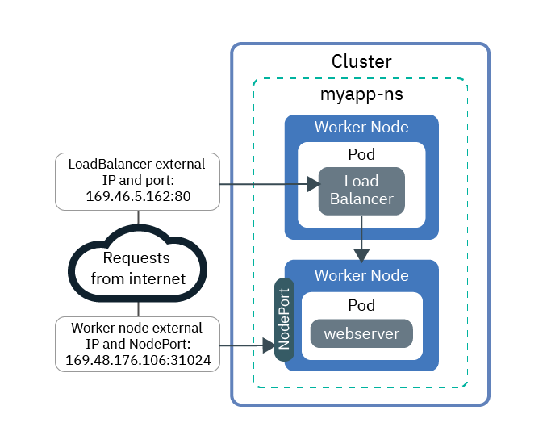
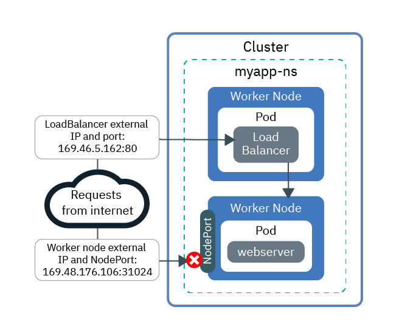

---

copyright:
  years: 2014, 2018
lastupdated: "2018-07-16"

---

{:new_window: target="_blank"}
{:shortdesc: .shortdesc}
{:screen: .screen}
{:pre: .pre}
{:table: .aria-labeledby="caption"}
{:codeblock: .codeblock}
{:tip: .tip}
{:download: .download}


# Tutorial: Using Calico network policies to block traffic
{: #policy_tutorial}

By default, Kubernetes NodePort, LoadBalancer, and Ingress services make your app available on all public and private cluster network interfaces. The `allow-node-port-dnat` default Calico policy permits incoming traffic from NodePort, LoadBalancer, and Ingress services to the app pods that those services expose. However, for security reasons, you might need to allow traffic to the networking services from certain source IP addresses only. [Calico Pre-DNAT policies ](https://docs.projectcalico.org/v3.1/getting-started/bare-metal/policy/pre-dnat) are applied before DNAT and can be used to whitelist or blacklist traffic from or to certain IP addresses.

The lessons in this tutorial walk you through creating a sample web server app, exposing the app by using a LoadBalancer service, and protecting the app with Calico policies. When you create Calico policies, you choose whether to whitelist or blacklist source IP addresses. For most scenarios, whitelisting provides the most secure configuration because all traffic is blocked except traffic from known, permitted source IP addresses. Blacklisting is typically useful only in scenarios such as preventing an attack from a small set of IP addresses. In this tutorial, you create both whitelist and blacklist policies.

## Objectives

- Create a high-order Pre-DNAT policy to block all incoming traffic to all NodePorts
- Create a low-order Pre-DNAT policy to allow whitelisted source IP addresses to access the LoadBalancer public IP and port
- Create a low-order Pre-DNAT policy to block blacklisted source IP addresses from accessing the LoadBalancer public IP and port

## Time required
40 minutes

## Audience
This tutorial is intended for software developers and network administrators who want to manage network traffic to an app.

## Prerequisites

- [Create a version 1.10 cluster](cs_clusters.html#clusters_ui) or [update an existing cluster to version 1.10](cs_versions.html#cs_v110). A Kubernetes version 1.10 or later cluster is required to use the 3.1.1 Calico CLI and Calico v3 policy syntax in this tutorial.
- [Target your CLI to the cluster](cs_cli_install.html#cs_cli_configure).
- [Install and configure the Calico CLI](cs_network_policy.html#1.10_install).

<br />


## Lesson 1: Deploy an app and expose it by using a LoadBalancer
{: #lesson1}

Start by deploying a sample web server app to use throughout the tutorial. The `echoserver` web server shows data about the connection being made to the cluster from the client. Then, expose the app by creating a LoadBalancer service. A LoadBalancer service makes your app available over both the LoadBalancer service IP address and the app's NodePorts.

1. Create a test namespace to use throughout this tutorial.
    ```
    kubectl create ns myapp-ns
    ```
    {: pre}

2. Deploy the sample web server app. When a connection is made to the `echoserver` web server app, the app responds with the HTTP headers it received in the connection.
    ```
    kubectl run webserver -n myapp-ns --image=k8s.gcr.io/echoserver:1.10 --replicas=3
    ```
    {: pre}

3. Verify that the web server app pods are running.
    ```
    kubectl get pods -n myapp-ns -o wide
    ```
    {: pre}

    Example output:
    ```
    NAME                         READY     STATUS    RESTARTS   AGE       IP               NODE
    webserver-855556f688-6dbsn   1/1       Running   0          1m        172.30.xxx.xxx   10.176.48.78
    webserver-855556f688-76rkp   1/1       Running   0          1m        172.30.xxx.xxx   10.176.48.78
    webserver-855556f688-xd849   1/1       Running   0          1m        172.30.xxx.xxx   10.176.48.78
    ```
    {: screen}

4. To expose the app to the public internet, create a LoadBalancer service.
    ```
    kubectl apply -f - << EOF
    apiVersion: v1
    kind: Service
    metadata:
      labels:
        run: webserver
      name: webserver-lb
      namespace: myapp-ns
    spec:
      externalTrafficPolicy: Cluster
      ports:
      - name: webserver-port
        port: 80
        protocol: TCP
        targetPort: 8080
      selector:
        run: webserver
      type: LoadBalancer
    EOF
    ```
    {: pre}

5. Verify access to the LoadBalancer.

    1. Get the public **EXTERNAL-IP** address of the LoadBalancer.
        ```
        kubectl get svc -n myapp-ns -o wide
        ```
        {: pre}

        Example output:
        ```
        NAME           CLUSTER-IP       EXTERNAL-IP        PORT(S)        AGE       SELECTOR
        webserver-lb   172.21.xxx.xxx   169.xx.xxx.xxx     80:31024/TCP   2m        run=webserver
        ```
        {: screen}

    2. Verify that you can publicly access the external IP for the LoadBalancer.
        ```
        curl --connect-timeout 10 169.xx.xxx.xxx:80
        ```
        {: pre}

        The following example output confirms that the LoadBalancer exposes your app on the `169.46.5.162` public LoadBalancer IP address. The `webserver-855556f688-76rkp` app pod received the curl request:
        ```
        Hostname: webserver-855556f688-76rkp
        Pod Information:
            -no pod information available-
        Server values:
            server_version=nginx: 1.13.3 - lua: 10008
        Request Information:
            client_address=10.1.1.1
            method=GET
            real path=/
            query=
            request_version=1.1
            request_scheme=http
            request_uri=http://169.46.5.162:8080/
        Request Headers:
            accept=*/*
            host=169.46.5.162
            user-agent=curl/7.54.0
        Request Body:
            -no body in request-
        ```
        {: screen}

6. Verify access to the NodePorts.

    1. Get the NodePort that the LoadBalancer assigned to the worker nodes. The NodePort is in the 30000 - 32767 range.
        ```
        kubectl get svc -n myapp-ns -o wide
        ```
        {: pre}

        In the following example output, the NodePort is `31024`:
        ```
        NAME           CLUSTER-IP       EXTERNAL-IP        PORT(S)        AGE       SELECTOR
        webserver-lb   172.21.xxx.xxx   169.xx.xxx.xxx     80:31024/TCP   2m        run=webserver
        ```
        {: screen}  

    2. Get the **Public IP** addresses of the worker nodes.
        ```
        ibmcloud cs workers <cluster_name>
        ```
        {: pre}

        Example output:
        ```
        ID                                                 Public IP         Private IP     Machine Type        State    Status   Zone    Version   
        kube-dal10-cr18e61e63c6e94b658596ca93d087eed9-w1   169.xx.xxx.xxx   10.176.48.67   u2c.2x4.encrypted   normal   Ready    dal10   1.10.3_1513*   
        kube-dal10-cr18e61e63c6e94b658596ca93d087eed9-w2   169.xx.xxx.xxx   10.176.48.79   u2c.2x4.encrypted   normal   Ready    dal10   1.10.3_1513*   
        kube-dal10-cr18e61e63c6e94b658596ca93d087eed9-w3   169.xx.xxx.xxx   10.176.48.78   u2c.2x4.encrypted   normal   Ready    dal10   1.10.3_1513*   
        ```
        {: screen}

    3. Verify that you can access the public IP address of each worker node through the NodePort.
        ```
        curl  --connect-timeout 10 169.xx.xxx.xxx:<NodePort>
        ```
        {: pre}

        The following example output confirms that your app is exposed on the `10.176.48.67` worker node private IP address through the `31024` NodePort. The `webserver-855556f688-xd849` app pod received the curl request:
        ```
        Hostname: webserver-855556f688-xd849
        Pod Information:
            -no pod information available-
        Server values:
            server_version=nginx: 1.13.3 - lua: 10008
        Request Information:
            client_address=10.176.48.67
            method=GET
            real path=/
            query=
            request_version=1.1
            request_scheme=http
            request_uri=http://10.176.48.67:8080/
        Request Headers:
            accept=*/*
            host=10.176.48.67:31024
            user-agent=curl/7.60.0
        Request Body:
            -no body in request-
        ```
        {: screen}

At this point, your app is exposed from multiple IP addresses and ports. Most of these IPs are internal to the cluster and can be accessed only over the private network. Only the public NodePort and public LoadBalancer port are exposed to the public internet:



Next, you can start creating and applying Calico policies to block public traffic.

## Lesson 2: Block all incoming traffic to all NodePorts
{: #lesson2}

To secure your app, you must block public access to both the LoadBalancer service exposing the app and the app NodePorts. Start by blocking access to NodePorts.

1. In a text editor, create a high-order Pre-DNAT policy to _deny_ incoming TCP and UDP traffic from any source IP to all NodePorts. **Note**: When you apply this policy to your cluster, all NodePort services are no longer available. If you have other NodePorts for apps in this cluster that you need to leave open, first create lower order policies to allow access to these NodePorts. Lower order policies override higher-order policies.
    ```
    apiVersion: projectcalico.org/v3
    kind: GlobalNetworkPolicy
    metadata:
      name: deny-nodeports
    spec:
      applyOnForward: true
      ingress:
      - action: Deny
        destination:
          ports:
          - 30000:32767
        protocol: TCP
        source: {}
      - action: Deny
        destination:
          ports:
          - 30000:32767
        protocol: UDP
        source: {}
      preDNAT: true
      selector: ibm.role=='worker_public'
      order: 1100
      types:
      - Ingress
    ```
    {: codeblock}

2. Apply the policy.
    - Linux and OS X:

      ```
      calicoctl apply -f deny-nodeports.yaml
      ```
      {: pre}

    - Windows:

      ```
      calicoctl apply -f deny-nodeports.yaml --config=filepath/calicoctl.cfg
      ```
      {: pre}

2. Verify that you can't publicly access the public NodePort IP addresses.
    ```
    curl  --connect-timeout 10 169.xx.xxx.xxx:<NodePort>
    ```
    {: pre}

    The connection times out because the Calico policy you created is blocking traffic to NodePorts.
    ```
    curl: (28) Connection timed out after 10016 milliseconds
    ```
    {: screen}

3. Change the `externalTrafficPolicy` of the LoadBalancer you created in the previous lesson from `Cluster` to `Local`. `Local` ensures that the source IP is preserved when you curl the external IP of the LoadBalancer in the next step.
    ```
    kubectl patch svc -n some-app webserver -p '{"spec":{"externalTrafficPolicy":"Local"}}'
    ```
    {: pre}

4. Verify that you can still publicly access the external IP for the LoadBalancer.
    ```
    curl --connect-timeout 10 169.xx.xxx.xxx:80
    ```
    {: pre}

    Example output:
    ```
    Hostname: webserver-855556f688-76rkp
    Pod Information:
        -no pod information available-
    Server values:
        server_version=nginx: 1.13.3 - lua: 10008
    Request Information:
        client_address=1.1.1.1
        method=GET
        real path=/
        query=
        request_version=1.1
        request_scheme=http
        request_uri=http://169.46.5.162:8080/
    Request Headers:
        accept=*/*
        host=169.46.5.162
        user-agent=curl/7.54.0
    Request Body:
        -no body in request-
    ```
    {: screen}
    In the `Request Information` section of the output, note that the source IP address is, for example, `client_address=1.1.1.1`. The source IP address is the public IP of the system that you're using to run curl. Otherwise, if you are connecting to the internet through a proxy or VPN, the proxy or VPN might be obscuring your system's actual IP address. In either case, this public IP is the IP that the LoadBalancer sees as its client. You'll use this IP address in the next lesson to filter connections.

At this point, your app is exposed to the public internet from the public LoadBalancer port only. Traffic to the public NodePorts is blocked.



Next, you can create and apply Calico policies to whitelist traffic from certain source IPs.

## Lesson 3: Allow incoming traffic from a whitelisted IP to the LoadBalancer
{: #lesson3}

You can now allow traffic from whitelisted IPs, or restrict traffic from blacklisted IPs. In this lesson, you'll start by whitelisting an IP address. First, in addition to the NodePorts, you must block all incoming traffic to the LoadBalancer exposing the app. Then, you can create a policy that whitelists your system's IP address.

1. In a text editor, create a high-order Pre-DNAT policy to _deny_ all incoming TCP and UDP traffic from any source IP to the LoadBalancer IP address and port.
    ```
    apiVersion: projectcalico.org/v3
    kind: GlobalNetworkPolicy
    metadata:
      name: deny-lb-port-80
    spec:
      applyOnForward: true
      ingress:
      - action: Deny
        destination:
          nets:
          - 169.xx.xxx.xxx/32
          ports:
          - 80
        protocol: TCP
        source: {}
      - action: Deny
        destination:
          nets:
          - 169.xx.xxx.xxx/32
          ports:
          - 80
        protocol: UDP
        source: {}
      preDNAT: true
      selector: ibm.role=='worker_public'
      order: 1100
      types:
      - Ingress
    ```
    {: codeblock}

2. Apply the policy.
    - Linux and OS X:

      ```
      calicoctl apply -f deny-lb-port-80.yaml
      ```
      {: pre}

    - Windows:

      ```
      calicoctl apply -f deny-lb-port-80.yaml --config=filepath/calicoctl.cfg
      ```
      {: pre}

2. Verify that you now can't access the public LoadBalancer IP address. The connection times out because the Calico policy you created is blocking traffic to the LoadBalancer.
    ```
    curl --connect-timeout 10 169.xx.xxx.xxx:80
    ```
    {: pre}

3. In a text editor, create a low-order Pre-DNAT policy to _allow_ traffic from your system's IP (listed as the `client_address` in your successful curl commands) to the LoadBalancer IP address and port.
    ```
    apiVersion: projectcalico.org/v3
    kind: GlobalNetworkPolicy
    metadata:
      name: whitelist
    spec:
      applyOnForward: true
      ingress:
      - action: Allow
        destination:
          nets:
          - 169.xx.xxx.xxx/32
          ports:
          - 80
        protocol: TCP
        source:
          nets:
          - <client_address>/32
      preDNAT: true
      selector: ibm.role=='worker_public'
      order: 500
      types:
      - Ingress
    ```
    {: codeblock}

4. Apply the policy.
    - Linux and OS X:

      ```
      calicoctl apply -f whitelist.yaml
      ```
      {: pre}

    - Windows:

      ```
      calicoctl apply -f whitelist.yaml --config=filepath/calicoctl.cfg
      ```
      {: pre}
    Your system's IP address is now whitelisted.

4. Verify that you now _can_ access the public LoadBalancer IP address.
    ```
    curl --connect-timeout 10 169.xx.xxx.xxx:80
    ```
    {: pre}

5. If you have access to another system that has a different IP address, try to access the LoadBalancer from that system.
    ```
    curl --connect-timeout 10 169.xx.xxx.xxx:80
    ```
    {: pre}
    The connection times out because that system's IP address isn't whitelisted. At this point, all traffic to the public NodePorts and LoadBalancer is blocked. Only traffic from your whitelisted system IP is allowed.
    

6. You can also test whitelisting by changing the source IPs in the Calico policy. For example, modify this policy to whitelist `2.2.2.0/24` and `3.3.3.0/24`:
    ```
    apiVersion: projectcalico.org/v3
    kind: GlobalNetworkPolicy
    metadata:
      name: whitelist
    spec:
      applyOnForward: true
      ingress:
      - action: Allow
        destination:
          nets:
          - 169.xx.xxx.xxx/32
          ports:
          - 80
        protocol: TCP
        source:
          nets:
          - 2.2.2.0/24
          - 3.3.3.0/24
      preDNAT: true
      selector: ibm.role=='worker_public'
      order: 500
      types:
      - Ingress
    ```
    {: pre}

7. Apply the modified policy.
    - Linux and OS X:

      ```
      calicoctl apply -f whitelist.yaml
      ```
      {: pre}

    - Windows:

      ```
      calicoctl apply -f whitelist.yaml --config=filepath/calicoctl.cfg
      ```
      {: pre}

8. Verify from your own system that you now can't access the LoadBalancer IP because your system's IP is no longer whitelisted.
    ```
    curl --connect-timeout 10 169.xx.xxx.xxx:80
    ```
    {: pre}

9. To try blacklisting IPs instead, clean up these policies before moving on to the next lesson.
    ```
    calicoctl delete GlobalNetworkPolicy deny-lb-port-80
    ```
    {: pre}
    ```
    calicoctl delete GlobalNetworkPolicy whitelist
    ```
    {: pre}

## Lesson 4: Deny incoming traffic from blacklisted IPs to the LoadBalancer
{: #lesson4}

In the previous lesson, you blocked all traffic and whitelisted only a few IPs. In this lesson, you can instead allow traffic from all IPs _except_ from a few blacklisted IPs. Blacklisting is typically useful in scenarios such as preventing an attack from a small set of IP addresses.

1. In a text editor, create a low-order Pre-DNAT policy to _deny_ all incoming TCP and UDP traffic from your system's IP address (listed as the "client_address" in your successful curl commands) to the LoadBalancer IP address and port.
    ```
    apiVersion: projectcalico.org/v3
    kind: GlobalNetworkPolicy
    metadata:
      name: blacklist
    spec:
      applyOnForward: true
      ingress:
      - action: Deny
        destination:
          nets:
          - 169.xx.xxx.xxx/32
          ports:
          - 80
        protocol: TCP
        source:
          nets:
          - <client_address>/32
      - action: Deny
        destination:
          nets:
          - 169.xx.xxx.xxx/32
          ports:
          - 80
        protocol: UDP
        source:
          nets:
          - <client_address>/32
      preDNAT: true
      selector: ibm.role=='worker_public'
      order: 500
      types:
      - Ingress
    ```
    {: codeblock}

2. Apply the policy.
    - Linux and OS X:

      ```
      calicoctl apply -f blacklist.yaml
      ```
      {: pre}

    - Windows:

      ```
      calicoctl apply -f blacklist.yaml --config=filepath/calicoctl.cfg
      ```
      {: pre}

    Your system's IP address is now blacklisted.

2. Verify from your system that you can't access the LoadBalancer IP because your system's IP is blacklisted.
    ```
    curl --connect-timeout 10 169.xx.xxx.xxx:80
    ```
    {: pre}
    At this point, all traffic to the public NodePorts is blocked, and all traffic to the public LoadBalancer is allowed. Only traffic from your blacklisted system IP to the LoadBalancer is blocked.
    

3. You can also test blacklisting by changing the source IPs in the Calico policy. For example, modify the `blacklist` policy to blacklist the `2.2.2.0/24` subnet and the `3.3.3.3/32` IP address:
    ```
    apiVersion: projectcalico.org/v3
    kind: GlobalNetworkPolicy
    metadata:
      name: blacklist
    spec:
      applyOnForward: true
      ingress:
      - action: Deny
        destination:
          nets:
          - 169.xx.xxx.xxx/32
          ports:
          - 80
        protocol: TCP
        source:
          nets:
          - 2.2.2.0/24
          - 3.3.3.3/32
      - action: Deny
        destination:
          nets:
          - 169.xx.xxx.xxx/32
          ports:
          - 80
        protocol: UDP
        source:
          nets:
          - 2.2.2.0/24
          - 3.3.3.3/32
      preDNAT: true
      selector: ibm.role=='worker_public'
      order: 500
      types:
      - Ingress
    ```
    {: codeblock}

4. Apply the policy.
    - Linux and OS X:

      ```
      calicoctl apply -f blacklist.yaml
      ```
      {: pre}

    - Windows:

      ```
      calicoctl apply -f blacklist.yaml --config=filepath/calicoctl.cfg
      ```
      {: pre}

4. Verify from your system that you can access the LoadBalancer IP because your system's IP isn't on the blacklist anymore.
    ```
    curl --connect-timeout 10 169.xx.xxx.xxx:80
    ```
    {: pre}

5. To clean up this blacklist policy:
    ```
    calicoctl delete GlobalNetworkPolicy blacklist
    ```
    {: pre}

Great work! You've successfully controlled traffic into your app by using Calico Pre-DNAT policies to whitelist and blacklist source IPs.

## What's next?
{: #whats_next}

* Read more about [controlling traffic with network policies](cs_network_policy.html).
* For more example Calico network policies that control traffic to and from your cluster, you can check out the [stars policy demo ](https://docs.projectcalico.org/v3.1/getting-started/kubernetes/tutorials/stars-policy/) and the [advanced network policy ](https://docs.projectcalico.org/v3.1/getting-started/kubernetes/tutorials/advanced-policy/).
