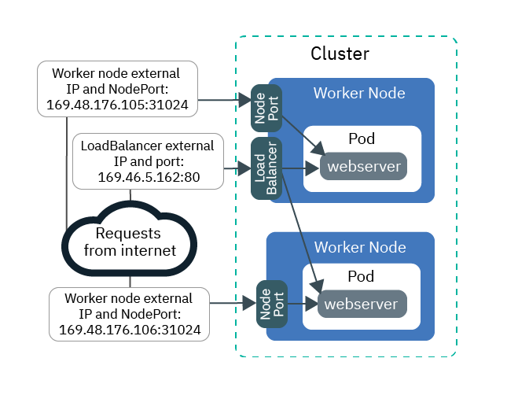
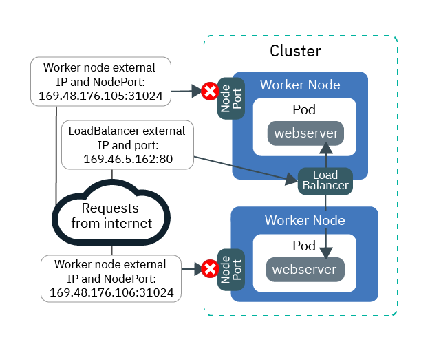
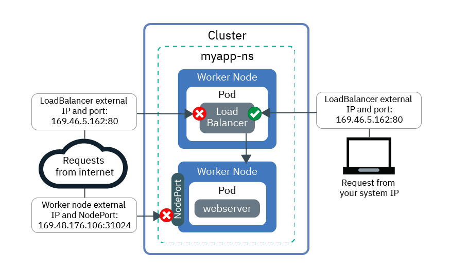
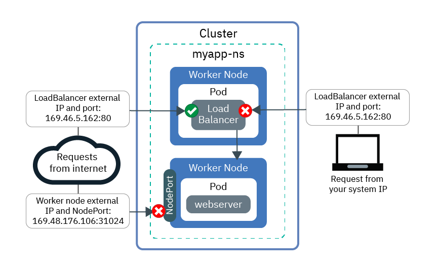

---

copyright:
  years: 2014, 2023
lastupdated: "2023-02-13"

keywords: kubernetes

subcollection: containers

content-type: tutorial
services: containers
account-plan: paid
completion-time: 60m

---

{{site.data.keyword.attribute-definition-list}}


# Using Calico network policies to control traffic on Classic clusters
{: #policy_tutorial}
{: toc-content-type="tutorial"}
{: toc-services="containers"}
{: toc-completion-time="60m"}

Learn how to use Calico policies to allow network traffic from and to certain IP addresses.
{: shortdesc}

Note that the follow steps are for Classic clusters with Classic LoadBalancers.
{: note}

By default, Kubernetes NodePort, LoadBalancer, and Ingress services make your app available on all public and private cluster network interfaces. The `allow-node-port-dnat` default Calico policy permits incoming traffic from NodePort, network load balancer (NLB), and Ingress application load balancer (ALB) services to the app pods that those services expose. Kubernetes uses destination network address translation (DNAT) to forward service requests to the correct pods.

However, for security reasons, you might need to allow traffic to the networking services from certain source IP addresses only. You can use [Calico Pre-DNAT policies](https://docs.tigera.io/calico/3.25/reference/host-endpoints/pre-dnat){: external} to allow or block traffic from or to certain IP addresses. Pre-DNAT policies prevent specified traffic from reaching your apps because they are applied before Kubernetes uses regular DNAT to forward traffic to pods. When you create Calico Pre-DNAT policies, you choose whether to allow or block source IP addresses. For most scenarios, allowing specific traffic provides the most secure configuration because all traffic is blocked except traffic from known, permitted source IP addresses. denying specific traffic is typically useful only in scenarios such as preventing an attack from a small set of IP addresses.

In this scenario, you play the role of a networking administrator for a PR firm, and you notice some unusual traffic that hits your apps. The lessons in this tutorial walk you through creating a sample web server app, exposing the app by using a network load balancer (NLB) service, and protecting the app from unwanted unusual traffic with both allowlist and blocklist Calico policies.

## Objectives
{: #policies_objectives}

- Learn to block all incoming traffic to all node ports by creating a high-order Pre-DNAT policy.
- Learn to allow specific source IP addresses to access the NLB public IP and port by creating a low-order Pre-DNAT policy. Lower-order policies override higher-order policies.
- Learn to block specific source IP addresses from accessing the NLB public IP and port by creating a low-order Pre-DNAT policy.

## Audience
{: #policies_audience}

This tutorial is intended for software developers and network administrators who want to manage network traffic to an app.

## Prerequisites
{: #policies_prereqs}

- [Create a classic cluster with at least 3 worker nodes. Free clusters, or single worker node clusters don’t have the required resources to complete this tutorial](/docs/containers?topic=containers-clusters). This tutorial is not available for VPC clusters.
- [Target your CLI to the cluster](/docs/containers?topic=containers-cs_cli_install#cs_cli_configure).
- [Install and configure the Calico CLI](/docs/containers?topic=containers-network_policies#cli_install).
- Ensure that you have the following {{site.data.keyword.cloud_notm}} IAM access policies for {{site.data.keyword.containerlong_notm}}:
    - [Any platform access role](/docs/containers?topic=containers-users#checking-perms)
    - [The **Writer** or **Manager** service access role](/docs/containers?topic=containers-users#checking-perms)


## Deploy an app and expose it by using an NLB
{: #lesson1}
{: step}

The first lesson shows you how your app is exposed from multiple IP addresses and ports, and where public traffic is coming into your cluster.
{: shortdesc}

Start by deploying a sample web server app to use throughout the tutorial. The `echoserver` web server shows data about the connection that is made to the cluster from the client, and you can test access to the PR firm's cluster. Then, expose the app by creating a network load balancer (NLB) 1.0 service. An NLB 1.0 service makes your app available over both the NLB service IP address and the worker nodes' node ports.

Want to use an Ingress application load balancer (ALB)? Instead of creating an NLB in steps 3 and 4, [create a service for the web server app](/docs/containers?topic=containers-managed-ingress-setup) and [create an Ingress resource for the web server app](/docs/containers?topic=containers-managed-ingress-setup). Then get the public IPs of your ALBs by running `ibmcloud ks ingress alb ls --cluster <cluster_name>` and use these IPs throughout the tutorial in place of the `<loadbalancer_IP>.`
{: tip}

The following image shows how the web server app is exposed to the internet by the public node port and public NLB at the end of Lesson 1.

{: caption="Figure 1. The web server app is exposed to the internet by the public node port and public NLB." caption-side="bottom"}

1. Deploy the sample web server app. When a connection is made to the web server app, the app responds with the HTTP headers that it received in the connection.
    ```sh
    kubectl apply -f https://raw.githubusercontent.com/IBM-Cloud/kube-samples/master/deploy-apps-clusters/webserver.yaml
    ```
    {: pre}

2. Verify that the web server app pods have a **STATUS** of `Running`.
    ```sh
    kubectl get pods -o wide
    ```
    {: pre}

    Example output
    ```sh
    NAME                         READY     STATUS    RESTARTS   AGE       IP               NODE
    webserver-855556f688-6dbsn   1/1       Running   0          1m        172.30.xxx.xxx   10.176.48.78
    webserver-855556f688-76rkp   1/1       Running   0          1m        172.30.xxx.xxx   10.176.48.78
    webserver-855556f688-xd849   1/1       Running   0          1m        172.30.xxx.xxx   10.176.48.78
    ```
    {: screen}

3. To expose the app to the public internet, create an NLB 1.0 service configuration file called `webserver-lb.yaml` in a text editor.

    ```yaml
    apiVersion: v1
    kind: Service
    metadata:
      labels:
        run: webserver                               
      name: webserver-lb
    spec:
      type: LoadBalancer
      selector:
        run: webserver
      ports:
      - name: webserver-port
        protocol: TCP
        port: 8080
        targetPort: 8080 # Optional. By default, the `targetPort` is set to match the `port` value unless specified otherwise. 
    ```
    {: codeblock}

4. Deploy the NLB.
    ```sh
    kubectl apply -f filepath/webserver-lb.yaml
    ```
    {: pre}

5. Verify that you can publicly access the app that is exposed by the NLB from your computer.

    1. Get the public **EXTERNAL-IP** address of the NLB.
        ```sh
        kubectl get svc -o wide
        ```
        {: pre}

        Example output
        ```sh
        NAME           CLUSTER-IP       EXTERNAL-IP        PORT(S)        AGE       SELECTOR
        webserver-lb   172.21.xxx.xxx   169.xx.xxx.xxx     80:31024/TCP   2m        run=webserver
        ```
        {: screen}

    2. Create a cheat sheet text file, and copy the NLB IP into the text file. The cheat sheet helps you more quickly use values in later lessons.

    3. Verify that you can publicly access the external IP for the NLB.
        ```sh
        curl --connect-timeout 10 <loadbalancer_IP>:80
        ```
        {: pre}

        The following example output confirms that the NLB exposes your app on the `169.1.1.1` public NLB IP address. The `webserver-855556f688-76rkp` app pod received the curl request.
        
        ```sh
        Hostname: webserver-855556f688-76rkp
        Pod Information:
            -no pod information available-
        Server values:
            server_version=nginx: 1.13.3 - lua: 10008
        Request Information:
            client_address=1.1.1.1
            method=GET
            real path=/
            query=
            request_version=1.1
            request_scheme=http
            request_uri=http://169.1.1.1:8080/
        Request Headers:
            accept=*/*
            host=169.1.1.1
            user-agent=curl/7.54.0
        Request Body:
            -no body in request-
        ```
        {: screen}

6. Verify that you can publicly access the app that is exposed by the node port from your computer. An NLB service makes your app available over both the NLB service IP address and the worker nodes' node ports.

    1. Get the node port that the NLB assigned to the worker nodes. The node port is in the 30000 - 32767 range.
        ```sh
        kubectl get svc -o wide
        ```
        {: pre}

        In the following example output, the node port is `31024`:
        ```sh
        NAME           CLUSTER-IP       EXTERNAL-IP        PORT(S)        AGE       SELECTOR
        webserver-lb   172.21.xxx.xxx   169.xx.xxx.xxx     80:31024/TCP   2m        run=webserver
        ```
        {: screen}  

    2. For classic clusters, get the **Public IP** address of a worker node. For VPC clusters, get the **Private IP** address instead.
        ```sh
        ibmcloud ks worker ls --cluster <cluster_name>
        ```
        {: pre}

        Example output
        
        ```sh
        ID                                                 Public IP        Private IP     Machine Type        State    Status   Zone    Version   
        kube-dal10-cr18e61e63c6e94b658596ca93d087eed9-w1   169.xx.xxx.xxx   10.176.48.67   u3c.2x4.encrypted   normal   Ready    dal10   1.25_1513*   
        kube-dal10-cr18e61e63c6e94b658596ca93d087eed9-w2   169.xx.xxx.xxx   10.176.48.79   u3c.2x4.encrypted   normal   Ready    dal10   1.25_1513*   
        kube-dal10-cr18e61e63c6e94b658596ca93d087eed9-w3   169.xx.xxx.xxx   10.176.48.78   u3c.2x4.encrypted   normal   Ready    dal10   1.25_1513*   
        ```
        {: screen}

    3. Copy the public IP of the worker node and the node port into your text cheat sheet to use in later lessons.

    4. Verify that you can access the public IP address the worker node through the node port. **Note**: Because worker nodes in VPC clusters don't have a public IP address, you can access an app through a NodePort only if you are connected to your private VPC network, such as through a VPN connection. Then, you can use the worker node's private IP address and NodePort: `<worker_private_IP>:<NodePort>`.
        ```sh
        curl  --connect-timeout 10 <worker_IP>:<NodePort>
        ```
        {: pre}

        The following example output confirms that the request to your app came through the private IP address `10.1.1.1` for the worker node and the `31024` node port. The `webserver-855556f688-xd849` app pod received the curl request:
        ```sh
        Hostname: webserver-855556f688-xd849
        Pod Information:
            -no pod information available-
        Server values:
            server_version=nginx: 1.13.3 - lua: 10008
        Request Information:
            client_address=1.1.1.1
            method=GET
            real path=/
            query=
            request_version=1.1
            request_scheme=http
            request_uri=http://10.1.1.1:8080/
        Request Headers:
            accept=*/*
            host=10.1.1.1:31024
            user-agent=curl/7.60.0
        Request Body:
            -no body in request-
        ```
        {: screen}

At this point, your app is exposed from multiple IP addresses and ports. Most of these IPs are internal to the cluster and can be accessed only over the private network. Only the public node port and public NLB port are exposed to the public internet.

Next, you can start creating and applying Calico policies to block public traffic.

## Block all incoming traffic to all node ports
{: #lesson2}
{: step}

To secure the PR firm's cluster, you must block public access to both the NLB service and node ports that are exposing your app. Start by blocking access to node ports.
{: shortdesc}

The following image shows how traffic is permitted to the NLB but not to node ports at the end of Lesson 2:

{: caption="Figure 2. The webserver app is exposed to the internet by public NLB only." caption-side="bottom"}

1. In a text editor, create a high-order Pre-DNAT policy called `deny-nodeports.yaml` to deny incoming TCP and UDP traffic from any source IP to all node ports.
    ```yaml
    apiVersion: projectcalico.org/v3
    kind: GlobalNetworkPolicy
    metadata:
      name: deny-nodeports
    spec:
      applyOnForward: true
      preDNAT: true
      ingress:
      - action: Deny
        destination:
          ports:
          - 30000:32767
        protocol: TCP
        source: {}
      - action: Deny
        destination:
          ports:
          - 30000:32767
        protocol: UDP
        source: {}
      selector: ibm.role=='worker_public'
      order: 1100
      types:
      - Ingress
    ```
    {: codeblock}

2. Apply the policy.
    - Linux:

        ```sh
        calicoctl apply -f filepath/deny-nodeports.yaml
        ```
        {: pre}

    - Windows and OS X:

        ```sh
        calicoctl apply -f filepath/deny-nodeports.yaml --config=filepath/calicoctl.cfg
        ```
        {: pre}

    Example output
    ```sh
    Successfully applied 1 'GlobalNetworkPolicy' resource(s)
    ```
    {: screen}

3. Using the values from your cheat sheet, verify that you can't publicly access the worker node public IP address and node port.
    ```sh
    curl  --connect-timeout 10 <worker_IP>:<NodePort>
    ```
    {: pre}

    The connection times out because the Calico policy you created is blocking traffic to node ports.
    ```sh
    curl: (28) Connection timed out after 10016 milliseconds
    ```
    {: screen}

4. Change the externalTrafficPolicy of the LoadBalancer you created in the previous lesson from `Cluster` to `Local`. `Local` ensures that the source IP of your system is preserved when you curl the external IP of the LoadBalancer in the next step.
    ```sh
    kubectl patch svc webserver-lb -p '{"spec":{"externalTrafficPolicy":"Local"}}'
    ```
    {: pre}

5. Using the value from your cheat sheet, verify that you can still publicly access the NLB external IP address.
    ```sh
    curl --connect-timeout 10 <loadbalancer_IP>:80
    ```
    {: pre}

    Example output
    ```sh
    Hostname: webserver-855556f688-76rkp
    Pod Information:
        -no pod information available-
    Server values:
        server_version=nginx: 1.13.3 - lua: 10008
    Request Information:
        client_address=1.1.1.1
        method=GET
        real path=/
        query=
        request_version=1.1
        request_scheme=http
        request_uri=http://<loadbalancer_IP>:8080/
    Request Headers:
        accept=*/*
        host=<loadbalancer_IP>
        user-agent=curl/7.54.0
    Request Body:
        -no body in request-
    ```
    {: screen}

    In the `Request Information` section of the output, the source IP address is, for example, `client_address=1.1.1.1`. The source IP address is the public IP of the system that you're using to run curl. Otherwise, if you are connecting to the internet through a proxy or VPN, the proxy or VPN might be obscuring your system's actual IP address. In either case, the NLB sees your system's source IP address as the client IP address.

6. Copy your system's source IP address (`client_address=1.1.1.1` in the previous step output) into your cheat sheet to use in later lessons.

Great! At this point, your app is exposed to the public internet from the public NLB port only. Traffic to the public node ports is blocked. Your cluster is partially locked down from unwanted traffic.

Next, you can create and apply Calico policies to allow traffic from only certain source IPs.

## Allow incoming traffic from a specific IP to the NLB
{: #lesson3}
{: step}

You now decide to completely lock down traffic to the PR firm's cluster and test access by allowing only your own computer's IP address.
{: shortdesc}

First, in addition to the node ports, you must block all incoming traffic to the NLB exposing the app. Then, you can create a policy that allows your system's IP address. At the end of Lesson 3, all traffic to the public node ports and NLB is blocked and only traffic from your allowed system IP is allowed.

{: caption="Figure 3. The webserver app is exposed by public NLB to your system IP only." caption-side="bottom"}

1. In a text editor, create a high-order Pre-DNAT policy called `deny-lb-port-80.yaml` to deny all incoming TCP and UDP traffic from any source IP to the NLB IP address and port. Replace `<loadbalancer_IP>` with the NLB public IP address from your cheat sheet.

    ```yaml
    apiVersion: projectcalico.org/v3
    kind: GlobalNetworkPolicy
    metadata:
      name: deny-lb-port-80
    spec:
      applyOnForward: true
      preDNAT: true
      ingress:
      - action: Deny
        destination:
          nets:
          - <loadbalancer_IP>/32
          ports:
          - 80
        protocol: TCP
        source: {}
      - action: Deny
        destination:
          nets:
          - <loadbalancer_IP>/32
          ports:
          - 80
        protocol: UDP
        source: {}
      selector: ibm.role=='worker_public'
      order: 800
      types:
      - Ingress
    ```
    {: codeblock}

2. Apply the policy.
    - Linux:

        ```sh
        calicoctl apply -f filepath/deny-lb-port-80.yaml
        ```
        {: pre}

    - Windows and OS X:

        ```sh
        calicoctl apply -f filepath/deny-lb-port-80.yaml --config=filepath/calicoctl.cfg
        ```
        {: pre}

3. Using the value from your cheat sheet, verify that you now can't access the public NLB IP address. The connection times out because the Calico policy you created is blocking traffic to the NLB.
    ```sh
    curl --connect-timeout 10 <loadbalancer_IP>:80
    ```
    {: pre}

4. In a text editor, create a low-order Pre-DNAT policy called `allowlist.yaml` to allow traffic from your system's IP to the NLB IP address and port. Using the values from your cheat sheet, replace `<loadbalancer_IP>` with the public IP address of the NLB and `<client_address>` with the public IP address of your system's source IP. If you can't remember your system IP, you can run `curl ifconfig.co`.
    ```yaml
    apiVersion: projectcalico.org/v3
    kind: GlobalNetworkPolicy
    metadata:
      name: allowlist
    spec:
      applyOnForward: true
      preDNAT: true
      ingress:
      - action: Allow
        destination:
          nets:
          - <loadbalancer_IP>/32
          ports:
          - 80
        protocol: TCP
        source:
          nets:
          - <client_address>/32
      selector: ibm.role=='worker_public'
      order: 500
      types:
      - Ingress
    ```
    {: codeblock}

5. Apply the policy.
    - Linux:

        ```sh
        calicoctl apply -f filepath/allowlist.yaml
        ```
        {: pre}

    - Windows and OS X:

        ```sh
        calicoctl apply -f filepath/allowlist.yaml --config=filepath/calicoctl.cfg
        ```
        {: pre}

    Your system's IP address is now allowed.

6. Using the value from your cheat sheet, verify that you now can access the public NLB IP address.
    ```sh
    curl --connect-timeout 10 <loadbalancer_IP>:80
    ```
    {: pre}

7. If you have access to another system that has a different IP address, try to access the NLB from that system.
    ```sh
    curl --connect-timeout 10 <loadbalancer_IP>:80
    ```
    {: pre}

    The connection times out because that system's IP address isn't allowed.

At this point, all traffic to the public node ports and NLB is blocked. Only traffic from your allowed system IP is allowed.

## Deny incoming traffic from specific IPs to the NLB
{: #lesson4}
{: step}

In the previous lesson, you blocked all traffic and allowed only a few IPs. That scenario works well for testing purposes when you want to limit access to only a few controlled source IP addresses. However, the PR firm has apps that need to be widely available to the public. You need to make sure that all traffic is permitted except for the unusual traffic you are seeing from a few IP addresses. A denylist is useful in a scenario like this one because it can help you prevent an attack from a small set of IP addresses.
{: shortdesc}

In this lesson, block traffic from your own system's source IP address. At the end of Lesson 4, all traffic to the public node ports is blocked, and all traffic to the public NLB is allowed. Only traffic from your specific system IP to the NLB is blocked.

{: caption="Figure 4. The webserver app is exposed by public NLB to the internet." caption-side="bottom"}

1. Clean up the allowlist policies you created in the previous lesson.
    - Linux:
        ```sh
        calicoctl delete GlobalNetworkPolicy deny-lb-port-80
        ```
        {: pre}

        ```sh
        calicoctl delete GlobalNetworkPolicy allowlist
        ```
        {: pre}

    - Windows and OS X:
        ```sh
        calicoctl delete GlobalNetworkPolicy deny-lb-port-80 --config=filepath/calicoctl.cfg
        ```
        {: pre}

        ```sh
        calicoctl delete GlobalNetworkPolicy allowlist --config=filepath/calicoctl.cfg
        ```
        {: pre}

    Now, all incoming TCP and UDP traffic from any source IP to the NLB IP address and port is permitted again.

2. To deny all incoming TCP and UDP traffic from your system's source IP address to the NLB IP address and port, create a low-order pre-DNAT policy called `blocklist.yaml` in a text editor. Using the values from your cheat sheet, replace `<loadbalancer_IP>` with the public IP address of the NLB and `<client_address>` with the public IP address of your system's source IP.
    ```yaml
    apiVersion: projectcalico.org/v3
    kind: GlobalNetworkPolicy
    metadata:
      name: blocklist
    spec:
      applyOnForward: true
      preDNAT: true
      ingress:
      - action: Deny
        destination:
          nets:
          - <loadbalancer_IP>/32
          ports:
          - 80
        protocol: TCP
        source:
          nets:
          - <client_address>/32
      - action: Deny
        destination:
          nets:
          - <loadbalancer_IP>/32
          ports:
          - 80
        protocol: UDP
        source:
          nets:
          - <client_address>/32
     selector: ibm.role=='worker_public'
     order: 500
     types:
     - Ingress
    ```
    {: codeblock}

3. Apply the policy.
    - Linux:

        ```sh
        calicoctl apply -f filepath/blocklist.yaml
        ```
        {: pre}

    - Windows and OS X:

        ```sh
        calicoctl apply -f filepath/blocklist.yaml --config=filepath/calicoctl.cfg
        ```
        {: pre}

    Your system's IP address is now blocked.

4. Using the value from your cheat sheet, verify from your system that you can't access the NLB IP because your system's IP is blocked.
    ```sh
    curl --connect-timeout 10 <loadbalancer_IP>:80
    ```
    {: pre}

    At this point, all traffic to the public node ports is blocked, and all traffic to the public NLB is allowed. Only traffic from your specific system IP to the NLB is blocked.

Great work! You successfully controlled traffic into your app by using Calico Pre-DNAT policies to block source IPs.

## Logging blocked traffic from specific IPs to the NLB
{: #lesson5}
{: step}

In the previous lesson, you blocked traffic from your system IP to the NLB. In this lesson, you can learn how to log the denied traffic requests.
{: shortdesc}

In our example scenario, the PR firm you work for wants you to set up a logging trail for any unusual traffic that is continuously being denied by one of your network policies. To monitor the potential security threat, you set up logging to record every time that your blocklist policy denies an attempted action on the NLB IP.

1. Create a Calico NetworkPolicy named `log-denied-packets`. This log policy uses the same selector as the `blocklist` policy, which adds this policy to the Calico Iptables rule chain. By using a lower-order number, such as `300`, you can ensure that this rule is added to the Iptables rule chain before the blocklist policy. Packets from your IP are logged by this policy before they try to match the `blocklist` policy rule and are denied.
    ```yaml
    apiVersion: projectcalico.org/v3
    kind: GlobalNetworkPolicy
    metadata:
        name: log-denied-packets
     spec:
      applyOnForward: true
      preDNAT: true
      ingress:
      - action: Log
        destination:
          nets:
          - <loadbalancer_IP>/32
          ports:
          - 80
        protocol: TCP
        source:
          nets:
          - <client_address>/32
      - action: Log
        destination:
          nets:
          - <loadbalancer_IP>/32
          ports:
          - 80
        protocol: UDP
        source:
          nets:
          - <client_address>/32
      selector: ibm.role=='worker_public'
      order: 300
      types:
      - Ingress
    ```
    {: codeblock}

2. Apply the policy.
    - Linux:

        ```sh
        calicoctl apply -f /log-denied-packets.yaml
        ```
        {: pre}

    - Windows and OS X:

        ```sh
        calicoctl apply -f /log-denied-packets.yaml --config=<filepath>/calicoctl.cfg
        ```

3. Generate log entries by sending requests from your system IP to the NLB IP. These request packets are logged before they are denied.
    ```sh
    curl --connect-timeout 10 <loadbalancer_IP>:80
    ```
    {: pre}

4. Check for log entries that are written to the `/var/log/syslog` path. The log entry looks similar to the following.
    ```sh
    Sep 5 14:34:40 <worker_hostname> kernel: [158271.044316] calico-packet: IN=eth1 OUT= MAC=08:00:27:d5:4e:57:0a:00:27:00:00:00:08:00 SRC=192.XXX.XX.X DST=192.XXX.XX.XX LEN=60 TOS=0x00 PREC=0x00 TTL=64 ID=52866 DF PROTO=TCP SPT=42962 DPT=22 WINDOW=29200 RES=0x00 SYN URGP=0
    ```
    {: screen}

Nice! You set up logging so that blocked traffic can be monitored more easily.

If you want to clean up the blocklist and the log policies:
1. Clean up the blocklist policy.
    - Linux:
        ```sh
        calicoctl delete GlobalNetworkPolicy blocklist
        ```
        {: pre}

    - Windows and OS X:
        ```sh
        calicoctl delete GlobalNetworkPolicy blocklist --config=filepath/calicoctl.cfg
        ```
        {: pre}

2. Clean up the log policy.
    - Linux:
        ```sh
        calicoctl delete GlobalNetworkPolicy log-denied-packets
        ```
        {: pre}

    - Windows and OS X:
        ```sh
        calicoctl delete GlobalNetworkPolicy log-denied-packets --config=filepath/calicoctl.cfg
        ```
        {: pre}

## What's next?
{: #whats_next}

- Read more about [controlling traffic with network policies](/docs/containers?topic=containers-network_policies).
- For more example Calico network policies that control traffic to and from your cluster, you can check out the [Calico tutorials](https://www.tigera.io/tutorials/){: external}.


