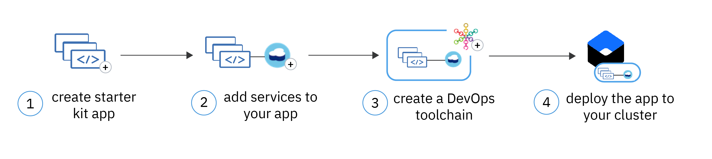

---

copyright:
  years: 2014, 2022
lastupdated: "2022-11-11"

keywords: kubernetes

subcollection: containers

content-type: tutorial
services: containers, apps, ContinuousDelivery, Cloudant
account-plan:
completion-time: 45m

---

{{site.data.keyword.attribute-definition-list}}


# Deploy a starter kit app to a Kubernetes cluster
{: #tutorial-starterkit-kube}
{: toc-content-type="tutorial"}
{: toc-services="containers, apps, ContinuousDelivery, Cloudant"}
{: toc-completion-time="45m"}

Create a containerized app from an {{site.data.keyword.cloud_notm}} starter kit and deploy your app by using a DevOps toolchain.
{: shortdesc}

{{site.data.keyword.cloud_notm}} offers starter kits that help you build the foundation of an app that runs on Kubernetes. When you use a starter kit, it's easy to follow a cloud native programming model that uses {{site.data.keyword.cloud_notm}} best practices for app development. Starter kits generate apps that follow the cloud native programming model, and they include test cases and a health check in each programming language. You can also provision {{site.data.keyword.cloud_notm}} services to add extra capabilities to your app.

## Objectives
{: #objectives-starterkit-kube}

- Create a Java + Spring app by using an {{site.data.keyword.cloud_notm}} starter kit.
- Add an {{site.data.keyword.cloudant_short_notm}} service instance to your app.
- Set up a continuous integration and continuous delivery pipeline for your app and connect the pipeline to a Kubernetes cluster in {{site.data.keyword.containerlong_notm}}.
- Explore the DevOps tools, such as GitLab or the DevOps delivery pipeline.
- View deployment information and verify that your app is up and running.

{: caption="Figure 1. Flow diagram for starter kit objectives" caption-side="bottom"}

## Audience
{: #audience-starterkit-kube}

This tutorial is intended for software developers who want to learn how to create a Java app from an {{site.data.keyword.cloud_notm}} starter kit and to deploy the app to a Kubernetes cluster by using a continuous delivery pipeline.

## Prerequisites
{: #prereqs-starterkit-kube}

- Create a **Java + Spring** app by using a [starter kit](/docs/apps/tutorials?topic=apps-tutorial-starterkit).
- Install the [{{site.data.keyword.cloud_notm}} CLI](/docs/cli?topic=cli-getting-started#idt-prereq).
- Create a [classic](/docs/containers?topic=containers-cluster-create-classic&interface=ui) or [VPC](/docs/containers?topic=containers-cluster-create-vpc-gen2&interface=ui) cluster.

## Add services to your app
{: #resources-starterkit-kube}
{: step}

Provision an {{site.data.keyword.cloudant_short_notm}} service instance, create service credentials, and bind the service to your starter kit app.
{: shortdesc}

1. Open your starter kit app and select the **App details** tab.
2. Click **Create service**.
3. Select **Databases** and click **Next**.
4. Select **Cloudant** and click **Next**.
5. On the **Add Cloudant** page, select the {{site.data.keyword.cloud_notm}} region and resource group that your cluster is in. Then, select a pricing plan. For example, use **Lite** to create a free {{site.data.keyword.cloudant_short_notm}} database instance.
6. Click **Create**. The **App details** page is displayed, and the Cloudant instance is provisioned and bound to your app. After the database is set up, you can see the credentials to access your database in the **Credentials** field on the **App details** page. This field might take a few minutes to display.

## Deploy your app by using a DevOps toolchain
{: #deploy-starterkit-kube}
{: step}

Attach a DevOps toolchain to your starter kit app, and configure a delivery pipeline to automatically deploy your app to your cluster in {{site.data.keyword.containerlong_notm}}.
{: shortdesc}

1. On the **App details** page, click **Deploy your app**.
2. On the **Deploy your app** page, select **IBM Cloud Kubernetes Service**.
3. Select the region and the name of the cluster, for which you want to set up a continuous delivery pipeline. If you don't have a cluster, click **Create cluster**. For more information about creating a cluster, see the instructions for creating a [classic cluster](/docs/containers?topic=containers-cluster-create-classic&interface=ui) or [VPC cluster](/docs/containers?topic=containers-cluster-create-vpc-gen2&interface=ui).
4. Provide a name for your toolchain.
5. Select the region to create your toolchain in, and then select the [resource group](/docs/ContinuousDelivery?topic=ContinuousDelivery-toolchains-iam-security) that provides access to your new toolchain.
6. Click **Create**. The **App details** page is displayed, along with deployment information about your toolchain.

## Explore the toolchain tools, logs, and history
{: #view-logs-starterkit-kube}
{: step}

With your toolchain set up, explore how you can use each tool to automate the deployment of your app.
{: shortdesc}

1. On the **App details** page, click the toolchain name. The **Overview** tab of the toolchain page is displayed, which shows the tools that are included with the toolchain. This example includes the following tools that were preselected in the starter kit when the toolchain was created:
    - An issues tracker in GitLab to track project updates and changes.
    - A GitLab repo that contains the source code of your app.
    - An Eclipse Orion instance, which is a web-based IDE to edit your app.
    - A Delivery Pipeline that consists of a customizable **BUILD** and **DEPLOY** stage.
2. Configure your GitLab repo.
    1. From the toolchain overview page, select the **Git** card.
    2. From your project overview page, select **Repository** > **Files** to review your app code and dependencies.
    3. From your project overview page, select **Issues** to find or create your issues.
    4. Optional. Configure SSH on your desktop by following the on-screen instructions so that you can push and pull code changes by using the CLI.
    5. Optional. To allow apps to access the Git API, create a personal access token for your account.
        1. From your user profile, click **Settings**.
        2. Select **Access Tokens**.
        3. Follow the on-screen instructions to set up your personal access token.
3. Review your **Delivery Pipeline** stages.
    1. From the toolchain overview page, select **Delivery Pipeline**. The pipeline stages are displayed.
        - The **BUILD** stage clones your GitLab repository, builds your Docker image, and pushes the image to your namespace in {{site.data.keyword.registrylong_notm}}.
        - The **DEPLOY** stage retrieves the container image from {{site.data.keyword.registrylong_notm}} and deploys your app to your Kubernetes cluster.
    2. To find the details of what happened in each deployment stage, click **View logs and history**.

## Verify the health of your app
{: #verify-starterkit-kube}
{: step}

Access your app to verify that your app is up and running.
{: shortdesc}

1. From your DevOps toolchain, click **Delivery Pipeline**, and then find the **Deploy Stage**.
2. Click **View logs and history**.
3. At the end of your log file, find the public URL that is assigned to your app.

    Example log entry:
    ```sh
    View the application health at: http://<ipaddress>:<port>/health.
    ```
    {: screen}

4. In your preferred web browser, enter the URL. If your app is up and running, you see a `Congratulations` or `{"status":"UP"}` message in your web browser.


## What's next?
{: #next-steps-startkit-kube}
{: notoc}

* **Troubleshoot deployment errors**: If you encounter errors during the app deployment, check the troubleshooting topic for known issues like [exceeding storage quota](/docs/apps?topic=apps-managingapps#exceed_quota), or learn how to [access Kubernetes logs](/docs/apps?topic=apps-managingapps#access_kube_logs) to look for errors.

* **Access service credentials from your app**: You can use the _@Value_ annotation, or use the Spring framework environment class _getProperty()_ method. For more information, see [Accessing credentials](/docs/java?topic=java-spring-configuration#spring-access-credentials).

* **Add more capabilities to your app**: When you add another service to your app after the DevOps toolchain is created, those service credentials aren't automatically updated to your deployed app and GitLab repository. You must [manually add the credentials to the deployment environment](/docs/apps?topic=apps-credentials_overview).


