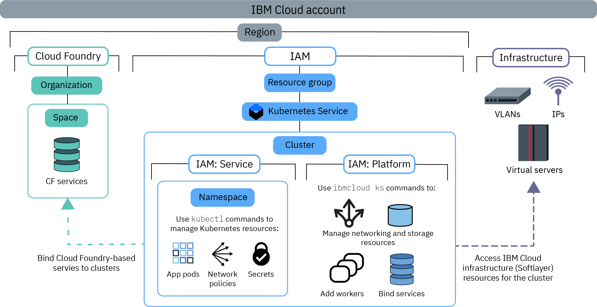

---

copyright:
  years: 2014, 2020
lastupdated: "2020-07-31"

keywords: kubernetes, iks, access, permissions, api key

subcollection: containers

---

{:beta: .beta}
{:codeblock: .codeblock}
{:deprecated: .deprecated}
{:download: .download}
{:external: target="_blank" .external}
{:faq: data-hd-content-type='faq'}
{:gif: data-image-type='gif'}
{:help: data-hd-content-type='help'}
{:important: .important}
{:new_window: target="_blank"}
{:note: .note}
{:pre: .pre}
{:preview: .preview}
{:screen: .screen}
{:shortdesc: .shortdesc}
{:support: data-reuse='support'}
{:table: .aria-labeledby="caption"}
{:tip: .tip}
{:troubleshoot: data-hd-content-type='troubleshoot'}
{:tsCauses: .tsCauses}
{:tsResolve: .tsResolve}
{:tsSymptoms: .tsSymptoms}


# Assigning cluster access
{: #users}

As a cluster administrator, you can define access policies for your {{site.data.keyword.containerlong}} clusters to create different levels of access for different users. For example, you can authorize certain users to work with cluster infrastructure resources and others to deploy only containers.
{: shortdesc}

## Setting up access to your cluster
{: #access-checklist}

Use the following checklist to configure user access in your cluster.
{: shortdesc}

1. [Understand how roles, users, and resources in your account](#access_policies) can be managed.
1. [Set the API key](#api_key) for all the regions and resource groups that you want to create clusters in.
2. Invite users to your account and [assign them {{site.data.keyword.cloud_notm}} IAM roles](#platform) for the service (**containers-kubernetes** in the API or CLI, and **Kubernetes Service** in the console).<p class="note">Do not assign {{site.data.keyword.cloud_notm}} IAM platform roles at the same time as a service role. You must assign platform and service roles separately.</p>
3. To allow users to bind services to the cluster or to view logs that are forwarded from cluster logging configurations, [grant users Cloud Foundry roles](/docs/account?topic=account-mngcf) for the org and space that the services are deployed to or where logs are collected.
4. If you use Kubernetes namespaces to isolate resources within the cluster, grant access to namespaces by [assigning users {{site.data.keyword.cloud_notm}} IAM service roles for the namespaces](#platform).
5. For any automation tooling such as in your CI/CD pipeline, set up service accounts and [assign the service accounts Kubernetes RBAC permissions](#rbac).
6. For other advanced configurations to control access to your cluster resources at the pod level, see [Configuring pod security policies (PSPs)](/docs/containers?topic=containers-psp).

</br>

For more information about setting up your account and resources, try out this tutorial about the [best practices for organizing users, teams, and applications](/docs/solution-tutorials?topic=solution-tutorials-users-teams-applications).
{: tip}

<br />


## Understanding access policies and roles
{: #access_policies}
{: help}
{: support}

Access policies determine the level of access that users in your {{site.data.keyword.cloud_notm}} account have to resources across the {{site.data.keyword.cloud_notm}} platform. A policy assigns a user one or more roles that define the scope of access to a single service or to a set of services and resources that are organized together in a resource group. Each service in {{site.data.keyword.cloud_notm}} might require its own set of access policies.
{: shortdesc}

### Pick the right access policy and role for your users
{: #access_roles}

You must define access policies for every user that works with {{site.data.keyword.containerlong_notm}}. The scope of an access policy is based on a user's defined role or roles, which determine the actions that the user can perform. Some policies are pre-defined but others can be customized. The same policy is enforced whether the user makes the request from the {{site.data.keyword.cloud_notm}} console or through the CLI.
{: shortdesc}

The following image shows the different types of permissions and roles, the actions a role can perform, and how the roles relate to each other.



To see the specific {{site.data.keyword.containerlong_notm}} permissions that can be performed with each role, check out the [User access permissions](/docs/containers?topic=containers-access_reference) reference topic.
{: tip}

<dl>
<dt><a href="#platform">{{site.data.keyword.cloud_notm}} IAM platform and service roles</a></dt>
<dd>{{site.data.keyword.containerlong_notm}} uses {{site.data.keyword.cloud_notm}} Identity and Access Management (IAM) platform and service access roles to grant users access to the cluster.
<ul><li>**Platform**: Platform roles determine the actions that users can perform on cluster infrastructure by using the {{site.data.keyword.containerlong_notm}} API, console, and CLI (`ibmcloud ks`). Platform roles do not grant access to the Kubernetes API. Although platform roles authorize you to perform infrastructure actions on the cluster, they do not grant access to the IBM Cloud infrastructure resources. Access to the IBM Cloud infrastructure resources is determined by the [API key that is set for the region](#api_key). Example actions that are permitted by platform roles are creating or removing clusters, binding services to a cluster, managing networking and storage resources, or adding extra worker nodes.<br><br>You can set the policies for these roles by resource group, region, or cluster instance. You cannot scope a platform role by namespace within a cluster.<br><br>If you assign only platform roles to users, they cannot interact with Kubernetes resources within the cluster. They can, however, still perform the `ibmcloud ks cluster config` command. Then, you can authorize the users to perform select Kubernetes actions by using [custom RBAC policies](/docs/containers?topic=containers-users#role-binding). You might do this if your organization currently uses custom RBAC policies to control Kubernetes access and plans to continue using custom RBAC instead of service roles.</li>
<li>**Service**: Service roles grant corresponding Kubernetes RBAC policies that a user is given within a cluster. As such, service roles grant access to the Kubernetes API, dashboard, and CLI (`kubectl`).  Example actions that are permitted by service roles are creating app deployments, adding namespaces, or setting up configmaps.<br><br> You can scope the policy for service roles by resource group, region, or cluster instance. Further, you can also scope service roles to Kubernetes namespaces that are in all, individual, or region-wide clusters. When you scope a service role to a namespace, you cannot apply the policy to a resource group or assign a platform role at the same time.<br><br>If you assigned only service roles to users, the users must [launch the Kubernetes dashboard from the CLI](/docs/containers?topic=containers-deploy_app#db_cli) instead of the {{site.data.keyword.cloud_notm}} console. Otherwise, [give the users the platform **Viewer** role](#add_users_cli_platform).</li></ul><p class="note">When you configure permissions for {{site.data.keyword.containerlong_notm}} in IAM, use the name **containers-kubernetes** for the API or CLI, and **Kubernetes Service** for the console.</p></dd>
<dt><a href="#role-binding">RBAC</a></dt>
<dd>In Kubernetes, role-based access control (RBAC) is a way of securing the resources inside your cluster. RBAC roles determine the Kubernetes actions that users can perform on those resources. Every user who is assigned a service role is automatically assigned a corresponding RBAC cluster role. This RBAC cluster role is applied either in a specific namespace or in all namespaces, depending on whether you scope the policy to a namespace.</br></br>
Example actions that are permitted by RBAC roles are creating objects such as pods or reading pod logs.</dd>
<dt><a href="#api_key">Classic infrastructure</a></dt>
<dd>Classic infrastructure roles enable access to your classic IBM Cloud infrastructure resources. Set up a user with **Super User** infrastructure role, and store this user's infrastructure credentials in an API key. Then, set the API key in each region and resource group that you want to create clusters in. After you set up the API key, other users that you grant access to {{site.data.keyword.containerlong_notm}} do not need infrastructure roles as the API key is shared for all users within the region. Instead, {{site.data.keyword.cloud_notm}} IAM platform roles determine the infrastructure actions that users are allowed to perform. If you don't want to set up the API key with full <strong>Super User</strong> infrastructure permissions or you need to grant specific device access to users, you can [customize infrastructure permissions](#infra_access). </br></br>
Example actions that are permitted by infrastructure roles are viewing the details of cluster worker node machines or editing networking and storage resources.<p class="note">VPC clusters do not need classic infrastructure permissions. Instead, you assign **Administrator** platform access to the **VPC Infrastructure** service in {{site.data.keyword.cloud_notm}}. Then, these credentials are stored in the API key for each region and resource group that you create clusters in.</p></dd>
<dt>Cloud Foundry</dt>
<dd>Not all services can be managed with {{site.data.keyword.cloud_notm}} IAM. If you're using one of these services, you can continue to use Cloud Foundry user roles to control access to those services. Cloud Foundry roles grant access to organizations and spaces within the account. To see the list of Cloud Foundry-based services in {{site.data.keyword.cloud_notm}}, run <code>ibmcloud service list</code>.</br></br>
Example actions that are permitted by Cloud Foundry roles are creating a new Cloud Foundry service instance or binding a Cloud Foundry service instance to a cluster. To learn more, see the available [org and space roles](/docs/account?topic=account-cfaccess) or the steps for [managing Cloud Foundry access](/docs/account?topic=account-mngcf) in the {{site.data.keyword.cloud_notm}} IAM documentation.</dd>
</dl>
</br>

### Assign access roles to individual or groups of users in {{site.data.keyword.cloud_notm}} IAM
{: #iam_individuals_groups}

When you set {{site.data.keyword.cloud_notm}} IAM policies, you can assign roles to an individual user or to a group of users.
{: shortdesc}

<dl>
<dt>Individual users</dt>
<dd>You might have a specific user that needs more or less permissions than the rest of your team. You can customize permissions on an individual basis so that each person has the permissions that they need to complete their tasks. You can assign more than one {{site.data.keyword.cloud_notm}} IAM role to each user.</dd>
<dt>Multiple users in an access group</dt>
<dd>You can create a group of users and then assign permissions to that group. For example, you can group all team leaders and assign administrator access to the group. Then, you can group all developers and assign only write access to that group. You can assign more than one {{site.data.keyword.cloud_notm}} IAM role to each access group. When you assign permissions to a group, any user that is added or removed from that group is affected. If you add a user to the group, then they also have the additional access. If they are removed, their access is revoked.</dd>
</dl>

{{site.data.keyword.cloud_notm}} IAM roles can't be assigned to a service account. Instead, you can directly [assign RBAC roles to service accounts](#rbac).
{: tip}

You must also specify whether users have access to one cluster in a resource group, all clusters in a resource group, or all clusters in all resource groups in your account.


### Scope user access to cluster instances, namespaces, or resource groups
{: #resource_groups}

In {{site.data.keyword.cloud_notm}} IAM, you can assign user access roles to resource instances, Kubernetes namespaces, or resource groups.
{: shortdesc}

When you create your {{site.data.keyword.cloud_notm}} account, the default resource group is created automatically. If you do not specify a resource group when you create the resource, resource instances (clusters) automatically belong to the default resource group. In {{site.data.keyword.cloud_notm}} IAM, a Kubernetes namespace is a resource type of a resource instance (cluster). If you want to add a resource group in your account, see [Best practices for setting up your account](/docs/account?topic=account-account_setup) and [Setting up your resource groups](/docs/account?topic=account-rgs).

<dl>
<dt>Resource instance</dt>
  <dd><p>Each {{site.data.keyword.cloud_notm}} service in your account is a resource that has instances. The instance differs by service. For example, in {{site.data.keyword.containerlong_notm}}, the instance is a cluster, but in {{site.data.keyword.cloudcerts_long_notm}}, the instance is a certificate. By default, resources belong to the default resource group in your account. You can assign users an access role to a resource instance to grant permissions as described in the following scenarios.
  <ul><li>All {{site.data.keyword.cloud_notm}} IAM services in your account, including all clusters in {{site.data.keyword.containerlong_notm}} and images in {{site.data.keyword.registrylong_notm}}.</li>
  <li>All instances within a service, such as all the clusters in {{site.data.keyword.containerlong_notm}}.</li>
  <li>All instances within a region of a service, such as all the clusters in the **US South** region of {{site.data.keyword.containerlong_notm}}.</li>
  <li>To an individual instance, such as one cluster.</li></ul></dd>
  <dt>Kubernetes namespace</dt>
  <dd><p>As part of cluster resource instances in {{site.data.keyword.cloud_notm}} IAM, you can assign users with service access roles to namespaces within your clusters.</p>
  <p>When you assign access to a namespace, the policy applies to all current and future instances of the namespace in all the clusters that you authorize. For example, say that you want a `dev` group of users to be able to deploy Kubernetes resources in a `test` namespace in all your clusters in AP North. If you assign the `dev` access group the **Writer** service access role for the Kubernetes namespace `test` in all clusters in the AP North region within the `default` resource group, the `dev` group can access the `test` namespace in any AP North cluster in the `default` resource group that currently has or eventually has a `test` namespace.</p>
  <p class="important">If you scope a service role to a namespace, you cannot apply the policy to a resource group or assign a platform role at the same time.</p></dd>
<dt>Resource group</dt>
  <dd><p>You can organize your account resources in customizable groupings so that you can quickly assign individual or groups of users access to more than one resource at a time. Resource groups can help operators and administrators filter resources to view their current usage, troubleshoot issues, and manage teams.</p>
  <p class="important">A cluster can be created in only one resource group that you can't change afterward. If you create a cluster in the wrong resource group, you must delete the cluster and re-create it in the correct resource group. Furthermore, if you need to use the `ibmcloud ks cluster service bind` command to [integrate with an {{site.data.keyword.cloud_notm}} service](/docs/containers?topic=containers-service-binding#bind-services), that service must be in the same resource group as the cluster. Services that do not use resource groups like {{site.data.keyword.registrylong_notm}} or that do not need service binding like {{site.data.keyword.la_full_notm}} work even if the cluster is in a different resource group.</p>
  <p>Consider giving clusters unique names across resource groups and regions in your account to avoid naming conflicts. You cannot rename a cluster.</p>
  <p>You can assign users an access role to a resource group to grant permissions as described in the following scenarios. Note that unlike resource instances, you cannot grant access to an individual instance within a resource group.</p>
  <ul><li>All {{site.data.keyword.cloud_notm}} IAM services in the resource group, including all clusters in {{site.data.keyword.containerlong_notm}} and images in {{site.data.keyword.registrylong_notm}}.</li>
  <li>All instances within a service in the resource group, such as all the clusters in {{site.data.keyword.containerlong_notm}}.</li>
  <li>All instances within a region of a service in the resource group, such as all the clusters in the **US South** region of {{site.data.keyword.containerlong_notm}}.</li></ul></dd>
</dl>

<br />


## Setting up the API key to enable access to the infrastructure portfolio
{: #api_key}
{: help}
{: support}

To successfully provision and work with clusters, you must ensure that your {{site.data.keyword.cloud_notm}} account is correctly set up to access {{site.data.keyword.cloud_notm}} infrastructure in each resource group and region that your clusters are in. In most cases, you can set up infrastructure access by [using the API key](#api_key_most_cases). For other options, see [Understanding other options than the API key](#api_key_other)
{: shortdesc}

### Setting up the API key in most cases
{: #api_key_most_cases}

Your {{site.data.keyword.cloud_notm}} Pay-As-You-Go or Subscription account is already set up with access to {{site.data.keyword.cloud_notm}} infrastructure. To use this infrastructure in {{site.data.keyword.containerlong_notm}}, the **account owner** must make sure that the [API key](#api_key_about) is set up for each region and resource group.
{: shortdesc}

The quickest way to set up the API key is to ask the account owner, who already has the required infrastructure permissions. However, the account owner might want to create a functional ID with all the required infrastructure permissions. Then, if the account owner is unavailable or changes, the API key owner remains the functional ID.
{: tip}

1.  As the account owner, [invite a functional ID](/docs/account?topic=account-iamuserinv) to your {{site.data.keyword.cloud_notm}} account to use to set the API key infrastructure credentials, instead of a personal user.
2.  [Assign the functional ID the the correct permissions](#owner_permissions).
3.  Log in as the functional ID.
    ```
    ibmcloud login
    ```
    {: pre}
4. Target the resource group where you want to set the API key. If you do not target a resource group, the API key is set for the default resource group. To list available resource groups, run `ibmcloud resource groups`.
    ```
    ibmcloud target -g <resource_group_name>
    ```
    {:pre}
5. Set the API key for the region and resource group.
    ```
    ibmcloud ks api-key reset --region <region>
    ```
    {: pre}    
6. Verify that the API key is set.
    ```
    ibmcloud ks api-key info --cluster <cluster_name_or_ID>
    ```
    {: pre}
7. Repeat these steps for each region and resource group that you want to create clusters in.

### Understanding other options than the API key
{: #api_key_other}

For different ways to access the IBM Cloud infrastructure portfolio, check out the following sections.
{: shortdesc}

* If you aren't sure whether your account already has access to the IBM Cloud infrastructure portfolio, see [Understanding access to the infrastructure portfolio](#understand_infra).
* If the account owner does not set the API key, [ensure that the user who sets the API key has the correct permissions](#owner_permissions).
* For more information about using your Pay-As-You-Go or Subscription account to set the API key, see [Accessing the infrastructure portfolio with your {{site.data.keyword.cloud_notm}} Pay-As-You-Go or Subscription account](#default_account).
* If you don't have a Pay-As-You-Go or Subscription account or need to use a different IBM Cloud infrastructure account, see [Accessing a different IBM Cloud infrastructure account](#credentials).

### Understanding access to the infrastructure portfolio
{: #understand_infra}

Determine whether your account has access to the IBM Cloud infrastructure portfolio and learn about how {{site.data.keyword.containerlong_notm}} uses the API key to access the portfolio.
{: shortdesc}

**Does the classic or VPC infrastructure provider for my cluster affect what access I need to the portfolio?**<br>
Access to {{site.data.keyword.cloud_notm}} infrastructure works differently in classic and VPC clusters. Infrastructure resources for classic clusters are created in a separate {{site.data.keyword.cloud_notm}} infrastructure account. In most cases, your Pay-As-You-Go or Subscription account is linked to the {{site.data.keyword.cloud_notm}} infrastructure account so that account owners can access classic {{site.data.keyword.cloud_notm}} infrastructure automatically. To authorize other users to access classic compute, storage, and networking resources, you must assign [classic infrastructure roles](/docs/containers?topic=containers-access_reference#infra).

VPC infrastructure resources are integrated into IAM and as such, you must have the {{site.data.keyword.cloud_notm}} IAM **Administrator** platform access role to the [**VPC Infrastructure** service](/docs/vpc?topic=vpc-iam-getting-started) to create and list VPC resources.

For both [classic and VPC clusters](/docs/containers?topic=containers-infrastructure_providers), the credentials to access infrastructure resources are stored in an API key for the region and resource group of the cluster. To create and manage clusters after the infrastructure permissions are set, assign users IAM access roles to {{site.data.keyword.containerlong_notm}}.

Unlike classic, VPC does not support manually setting infrastructure credentials (`ibmcloud ks credential set`) to use another IBM Cloud infrastructure account to provision worker nodes. You must use your {{site.data.keyword.cloud_notm}} account's linked infrastructure account.
{: important}

**Does my account already have access to the IBM Cloud infrastructure portfolio?**</br>

To access the IBM Cloud infrastructure portfolio, you use an {{site.data.keyword.cloud_notm}} Pay-As-You-Go or Subscription account. If you have a different type of account, view your options in the following table.

<table summary="The table shows the standard cluster creation options by account type. Rows are to be read from the left to right, with the account description in column one, and the options to create a standard cluster in column two.">
<caption>Standard cluster creation options by account type</caption>
  <thead>
  <th>Account description</th>
  <th>Options to create a standard cluster</th>
  </thead>
  <tbody>
    <tr>
      <td>**Lite accounts** cannot provision clusters.</td>
      <td>Upgrade your Lite account to an {{site.data.keyword.cloud_notm}} [Pay-As-You-Go](/docs/account?topic=account-accounts#paygo) or [Subscription](/docs/account?topic=account-accounts#subscription-account) account.</td>
    </tr>
    <tr>
      <td>**Pay-As-You-Go** accounts come with access to the infrastructure portfolio.</td>
      <td>You can create standard clusters. Use an API key to set up infrastructure permissions for your clusters. </br></br><p class="tip">To use a different classic infrastructure account for classic clusters, [manually set {{site.data.keyword.cloud_notm}} infrastructure credentials for your {{site.data.keyword.cloud_notm}} account](/docs/containers?topic=containers-users#credentials). You cannot set up your {{site.data.keyword.cloud_notm}} account to use the VPC infrastructure of a different account.</p> </td>
    </tr>
    <tr>
      <td>**Subscription** accounts come with access to the infrastructure portfolio.</td>
      <td>You can create standard clusters. Use an API key to set up infrastructure permissions for your clusters. </br></br><p class="tip">To use a different classic infrastructure account for classic clusters, [manually set {{site.data.keyword.cloud_notm}} infrastructure credentials for your {{site.data.keyword.cloud_notm}} account](/docs/containers?topic=containers-users#credentials). You cannot set up your {{site.data.keyword.cloud_notm}} account to use the VPC infrastructure of a different account.</p> </td>
    </tr>
    <tr>
      <td>**IBM Cloud infrastructure accounts**, no {{site.data.keyword.cloud_notm}} account</td>
      <td><p>Create an {{site.data.keyword.cloud_notm}} [Pay-As-You-Go](/docs/account?topic=account-accounts#paygo) or [Subscription](/docs/account?topic=account-accounts#subscription-account) account. You have two separate IBM Cloud infrastructure accounts and billing.</p><p>By default, your new {{site.data.keyword.cloud_notm}} account uses the new infrastructure account. To continue using the previous classic infrastructure account, manually set the credentials. You can manually set credentials for only classic clusters, not VPC clusters.</p></td>
    </tr>
  </tbody>
  </table>

**Now that my infrastructure portfolio is set up, how does {{site.data.keyword.containerlong_notm}} access the portfolio?**</br>
{: #api_key_about}

{{site.data.keyword.containerlong_notm}} accesses the IBM Cloud infrastructure portfolio by using an [API key](/docs/account?topic=account-manapikey). The API key impersonates, or stores the credentials of, a user with access to an IBM Cloud infrastructure account. API keys are set by region within a resource group, and are shared by users in that region. To check if an API key is already set for the region and resource group, you can use the following command.

```
ibmcloud ks api-key info --cluster <cluster_name_or_ID>
```
{: pre}

To enable all users to access the infrastructure portfolio, the user whose credentials are stored in the API key, such as a functional ID, must have the appropriate permissions to the [infrastructure provider](/docs/containers?topic=containers-infrastructure_providers).
* Classic clusters: **Super User** role or the [minimum required permissions](/docs/containers?topic=containers-access_reference#infra) for classic infrastructure.
* VPC clusters: [**Administrator** platform role for VPC Infrastructure](/docs/vpc?topic=vpc-iam-getting-started).
* [**Administrator** platform role](/docs/containers?topic=containers-users#platform) for {{site.data.keyword.containerlong_notm}} at the account level.
* [**Writer** or **Manager** service role](/docs/containers?topic=containers-users#platform) for {{site.data.keyword.containerlong_notm}}.
* [**Administrator** platform role](/docs/containers?topic=containers-users#platform) for Container Registry at the account level.

Then, log in as the user or functional ID and perform the first admin action in a region and resource group or [reset the API key](#api_key_most_cases). The user's infrastructure credentials are stored in an API key for that region and resource group.

Other users within the account share the API key for accessing the infrastructure. When users log in to the {{site.data.keyword.cloud_notm}} account, an {{site.data.keyword.cloud_notm}} IAM token that is based on the API key is generated for the CLI session and enables infrastructure-related commands to be run in a cluster.

To see the {{site.data.keyword.cloud_notm}} IAM token for a CLI session, you can run `ibmcloud iam oauth-tokens`. {{site.data.keyword.cloud_notm}} IAM tokens can also be used to [make calls directly to the {{site.data.keyword.containerlong_notm}} API](/docs/containers?topic=containers-cs_api_install#cs_api).
{: tip}

**If users have access to the portfolio through an {{site.data.keyword.cloud_notm}} IAM token, how do I limit which commands a user can run?**

After you set up access to the portfolio for users in your account, you can then control which infrastructure actions the users can perform by assigning the appropriate [platform role](#platform). By assigning {{site.data.keyword.cloud_notm}} IAM roles to users, they are limited in which commands they can run against a cluster. For example, because the API key owner has all the required infrastructure roles, all infrastructure-related commands can be run in a cluster. But, depending on the {{site.data.keyword.cloud_notm}} IAM role that is assigned to a user, the user can run only some of those infrastructure-related commands.

For example, if you want to create a cluster in a new region, make sure that the first cluster is created by a user with the **Super User** infrastructure role, such as the account owner. After verification, you can invite individual users or users in {{site.data.keyword.cloud_notm}} IAM access groups to that region by setting platform management policies for them in that region. A user with a **Viewer** platform role isn't authorized to add a worker node. Therefore, the `worker-add` action fails, even though the API key has the correct infrastructure permissions. If you change the user's platform role to **Operator**, the user is authorized to add a worker node. The `worker-add` action succeeds because the user is authorized and the API key is set correctly. You don't need to edit the user's IBM Cloud infrastructure permissions.

To audit the actions that users in your account run, you can use [{{site.data.keyword.cloudaccesstrailshort}}](/docs/containers?topic=containers-at_events) to view all cluster-related events.
{: tip}

**What if I don't want to assign the API key owner or credentials owner the Super User infrastructure role?**</br>

For compliance, security, or billing reasons, you might not want to give the **Super User** infrastructure role to the user who sets the API key or whose credentials are set with the `ibmcloud ks credential set` command. However, if this user doesn't have the **Super User** role, then infrastructure-related actions, such as creating a cluster or reloading a worker node, can fail. Instead of using {{site.data.keyword.cloud_notm}} IAM platform roles to control users' infrastructure access, you must [set specific IBM Cloud infrastructure permissions](#infra_access) for users.

**What happens if the user who set the API key for a region and resource group leaves the company?**

If the user is leaving your organization, the {{site.data.keyword.cloud_notm}} account owner can remove that user's permissions. However, before you remove a user's specific access permissions or remove a user from your account completely, you must reset the API key with another user's infrastructure credentials. Otherwise, the other users in the account might lose access to the IBM Cloud infrastructure portal and infrastructure-related commands might fail. For more information, see [Removing user permissions](#removing).

**How can I lock down my cluster if my API key becomes compromised?**

If an API key that is set for a region and resource group in your cluster is compromised, [delete it](/docs/account?topic=account-userapikey#delete_user_key) so that no further calls can be made by using the API key as authentication. For more information about securing access to the Kubernetes API server, see the [Kubernetes API server and etcd](/docs/containers?topic=containers-security#apiserver) security topic.

**How do I set up the API key for my cluster?**</br>

It depends on what type of account that you're using to access the IBM Cloud infrastructure portfolio:
* [An {{site.data.keyword.cloud_notm}} Pay-As-You-Go or Subscription account](#default_account) that comes with automatic access to the {{site.data.keyword.cloud_notm}} portfolio.
* [A different IBM Cloud infrastructure account that is not linked to your {{site.data.keyword.cloud_notm}} Pay-As-You-Go or Subscription account](#credentials)

### Ensuring that the API key or infrastructure credentials owner has the correct permissions
{: #owner_permissions}

To ensure that all infrastructure-related actions can be successfully completed in the cluster, the user whose credentials you want to set for the API key must have the proper permissions. Consider using a functional ID user for the API key owner instead of a personal user. In case the person leaves the team, the functional ID user remains the API key owner.
{: shortdesc}

1. Log in to the [{{site.data.keyword.cloud_notm}} console](https://cloud.ibm.com/){: external}.

2. To make sure that all account-related actions can be successfully performed, verify that the user has the correct {{site.data.keyword.cloud_notm}} IAM platform roles.
    1. From the menu bar, select **Manage > Access (IAM)**, and then click the **Users** page.
    2. Click the name of the user who you want to set the API key for or whose credentials you want to set for the API key, and then click the **Access policies** tab.
    3.  [Assign the user](#platform) the [minimum permissions that are needed to create and manage clusters](/docs/containers?topic=containers-access_reference#cluster_create_permissions).

3. To make sure that all infrastructure-related actions in your cluster can be successfully performed, verify that the user has the correct infrastructure access policies.
  1. From the menu bar, select **Manage > Access (IAM)**.
  2. Select the **Users** tab, click on the user. The required infrastructure permissions vary depending on what type of [cluster infrastructure provider](/docs/containers?topic=containers-infrastructure_providers) you use, classic or VPC.
    * **For classic clusters**:
      1. In the **API keys** pane, verify that the user has a **Classic infrastructure API key**, or click **Create an IBM Cloud API key**. For more information, see [Managing classic infrastructure API keys](/docs/account?topic=account-classic_keys#classic_keys).
      2. Click the **Classic infrastructure** tab and then click the **Permissions** tab.
      3. If the user doesn't have each category checked, you can use the **Permission sets** drop-down list to assign the **Super User** role. Or you can expand each category and give the user the required [infrastructure permissions](/docs/containers?topic=containers-access_reference#infra).
    * **For VPC clusters**: Assign the user the [**Administrator** platform role for VPC Infrastructure](/docs/vpc?topic=vpc-iam-getting-started).

### Accessing the infrastructure portfolio with your {{site.data.keyword.cloud_notm}} Pay-As-You-Go or Subscription account
{: #default_account}

{{site.data.keyword.cloud_notm}} Pay-As-You-Go and Subscription accounts are automatically set up with an IBM Cloud infrastructure account that allows access to classic infrastructure resources. The API key that you set is used to order infrastructure resources from this infrastructure account, such as new worker nodes or VLANs.
{: shortdec}

You can find the current API key owner by running [`ibmcloud ks api-key info --cluster <cluster>`](/docs/containers?topic=containers-cli-plugin-kubernetes-service-cli#cs_api_key_info). If you find that you need to update the API key that is stored for a region, you can do so by running the [`ibmcloud ks api-key reset --region <region>`](/docs/containers?topic=containers-cli-plugin-kubernetes-service-cli#cs_api_key_reset) command. This command requires the {{site.data.keyword.containerlong_notm}} admin access policy and stores the API key of the user that executes this command in the account.

Be sure that you want to reset the key and understand the impact to your app. The key is used in several different places and can cause breaking changes if it's unnecessarily changed.
{: note}

**Before you begin**:
- If the account owner does not set the API key, [ensure that the user who sets the API key has the correct permissions](#owner_permissions).
- Consider using a functional ID user for the API key owner instead of a personal user. In case the person leaves the team, the functional ID user remains the API key owner.
- [Log in to your account. If applicable, target the appropriate resource group. Set the context for your cluster.](/docs/containers?topic=containers-cs_cli_install#cs_cli_configure)

To set the API key to access the IBM Cloud infrastructure portfolio:

1.  Set the API key for the region and resource group that the cluster is in.
    1.  Log in to the terminal with the user whose infrastructure permissions you want to use.
    2.  Target the resource group where you want to set the API key. If you do not target a resource group, the API key is set for the default resource group.
        ```
        ibmcloud target -g <resource_group_name>
        ```
        {:pre}
    4.  Set the user's API key for the region.
        ```
        ibmcloud ks api-key reset --region <region>
        ```
        {: pre}    
    5.  Verify that the API key is set.
        ```
        ibmcloud ks api-key info --cluster <cluster_name_or_ID>
        ```
        {: pre}

2. [Create a cluster](/docs/containers?topic=containers-clusters). To create the cluster, the API key credentials that you set for the region and resource group are used.

### Accessing a different classic infrastructure account
{: #credentials}

Instead of using the default linked IBM Cloud infrastructure account to order infrastructure for clusters within a region, you might want to use a different IBM Cloud infrastructure account that you already have. You can link this infrastructure account to your {{site.data.keyword.cloud_notm}} account by using the [`ibmcloud ks credential set`](/docs/containers?topic=containers-cli-plugin-kubernetes-service-cli#cs_credentials_set) command. The IBM Cloud infrastructure credentials are used instead of the default Pay-As-You-Go or Subscription account's credentials that are stored for the region.
{: shortdesc}

You can manually set infrastructure credentials to a different account only for classic clusters, not for VPC clusters.
{: note}

The IBM Cloud infrastructure credentials that are set by the `ibmcloud ks credential set` command persist after your session ends. If you remove IBM Cloud infrastructure credentials that were manually set with the [`ibmcloud ks credential unset --region <region>`](/docs/containers?topic=containers-cli-plugin-kubernetes-service-cli#cs_credentials_unset) command, the credentials of the Pay-As-You-Go or Subscription account are used instead. However, this change in infrastructure account credentials might cause [orphaned clusters](/docs/containers?topic=containers-cs_troubleshoot_clusters#orphaned).
{: important}

**Before you begin**:
- If you are not using the account owner's credentials, [ensure that the user whose credentials you want to set for the API key has the correct permissions](#owner_permissions).
- [Log in to your account. If applicable, target the appropriate resource group. Set the context for your cluster.](/docs/containers?topic=containers-cs_cli_install#cs_cli_configure)

To set infrastructure account credentials to access the IBM Cloud infrastructure portfolio:

1. Get the infrastructure account that you want to use to access the IBM Cloud infrastructure portfolio. You have different options that depend on your [current account type](#understand_infra).

2.  Set the infrastructure API credentials with the user for the correct account.

    1.  Get the user's infrastructure API credentials. Note that the credentials differ from the IBMid.

        1.  From the [{{site.data.keyword.cloud_notm}}](https://cloud.ibm.com/){: external} console, select **Manage** > **Access (IAM)** > **Users** table and click the username.

        2.  In the **API Keys** section, find or create a classic infrastructure API key.   

    2.  Set the infrastructure API credentials to use.
        ```
        ibmcloud ks credential set --infrastructure-username <infrastructure_API_username> --infrastructure-api-key <infrastructure_API_authentication_key> --region <region>
        ```
        {: pre}

    3. Verify that the correct credentials are set.
        ```
        ibmcloud ks credential get --region <region>
        ```
        Example output:
        ```
        Infrastructure credentials for user name user@email.com set for resource group default.
        ```
        {: screen}

3. [Create a cluster](/docs/containers?topic=containers-clusters). To create the cluster, the infrastructure credentials that you set for the region and resource group are used.

4. Verify that your cluster uses the infrastructure account credentials that you set.
  1. Open the [{{site.data.keyword.cloud_notm}} clusters console](https://cloud.ibm.com/kubernetes/clusters){: external} and select your cluster. 
  2. In the Overview tab, look for an **Infrastructure User** field. 
  3. If you see that field, you do not use the default infrastructure credentials that come with your Pay-As-You-Go or Subscription account in this region. Instead, the region is set to use the different infrastructure account credentials that you set.

<br />

<br>

## Granting users access to your cluster through {{site.data.keyword.cloud_notm}} IAM
{: #platform}

Set {{site.data.keyword.cloud_notm}} IAM platform management and service access policies in the {{site.data.keyword.cloud_notm}} console or CLI so that users can work with clusters in {{site.data.keyword.containerlong_notm}}. Before you begin, check out [Understanding access policies and roles](#access_policies) to review what policies are, whom you can assign policies to, and what resources can be granted policies.
{: shortdesc}

{{site.data.keyword.cloud_notm}} IAM roles can't be assigned to a service account. Instead, you can directly [assign RBAC roles to service accounts](#rbac).
{: note}

### Example use cases and roles
{: #example-iam}

Wondering which access roles to assign to your cluster users? Use the examples in following table to determine which roles and scope to assign. You can find more information about what roles authorize which types of actions on the user access reference page in the table's links.
{: shortdesc}

| Use case | Example roles and scope |
| --- | --- |
| App auditor | [Viewer platform role for a cluster, region, or resource group](/docs/containers?topic=containers-access_reference#iam_platform), [Reader service role for a cluster, region, or resource group](/docs/containers?topic=containers-access_reference#service). |
| App developers | [Editor platform role for a cluster](/docs/containers?topic=containers-access_reference#iam_platform), [Writer service role scoped to a namespace](/docs/containers?topic=containers-access_reference#service), [Cloud Foundry developer space role](/docs/containers?topic=containers-access_reference#cloud-foundry). |
| Billing | [Viewer platform role for a cluster, region, or resource group](/docs/containers?topic=containers-access_reference#iam_platform). |
| Create a cluster | See [Permissions to create a cluster](/docs/containers?topic=containers-access_reference#cluster_create_permissions).|
| Cluster administrator | [Administrator platform role for a cluster](/docs/containers?topic=containers-access_reference#iam_platform), [Manager service role not scoped to a namespace (for the whole cluster)](/docs/containers?topic=containers-access_reference#service).|
| DevOps operator | [Operator platform role for a cluster](/docs/containers?topic=containers-access_reference#iam_platform), [Writer service role not scoped to a namespace (for the whole cluster)](/docs/containers?topic=containers-access_reference#service), [Cloud Foundry developer space role](/docs/containers?topic=containers-access_reference#cloud-foundry).  |
| Operator or site reliability engineer | [Administrator platform role for a cluster, region, or resource group](/docs/containers?topic=containers-access_reference#iam_platform), [Reader service role for a cluster or region](/docs/containers?topic=containers-access_reference#service) or [Manager service role for all cluster namespaces](/docs/containers?topic=containers-access_reference#service) to be able to use `kubectl top nodes,pods` commands. |
{: summary="The first column contains the use case, which is typically the role of a user. The second column is the example role and scope of the role that you assign the user in {{site.data.keyword.cloud_notm}} IAM."}
{: caption="Types of roles you might assign to meet different use cases." caption-side="top"}

### Assigning {{site.data.keyword.cloud_notm}} IAM roles with the console
{: #add_users}

Grant users access to your {{site.data.keyword.containerlong_notm}} clusters by assigning {{site.data.keyword.cloud_notm}} IAM platform management and service access roles with the {{site.data.keyword.cloud_notm}} console.
{: shortdesc}

<p class="tip">Do not assign platform roles at the same time as a service role. You must assign platform and service roles separately.</p>

Before you begin, verify that you're assigned the **Administrator** platform role for the {{site.data.keyword.cloud_notm}} account in which you're working.

1. Log in to the [{{site.data.keyword.cloud_notm}} console](https://cloud.ibm.com/){: external}. From the menu bar, select **Manage > Access (IAM)**.

2. Select users individually or create an access group of users.
    * **To assign roles to an individual user**:
      1. In the left navigation, click the **Users** page, and then click the name of the user that you want to set permissions for. If the user isn't shown, click **Invite users** to add them to the account.
      2. Click the **Access policies** tab, and then click **Assign access**. Now, the breadcrumbs on the page are **Users / Manage User**.
      3. Optional: Add the user to an access group that has access to {{site.data.keyword.containerlong_notm}}.
    * **To assign roles to multiple users in an access group**:
      1. In the left navigation, click the **Access groups** page.
      2. Click **Create** and give your group a **Name** and **Description**. Click **Create**.
      3. Click **Add users** to add people to your access group. A list of users that have access to your account is shown.
      4. Check the box next to the users that you want to add to the group. A dialog box displays.
      5. Click **Add to group**.
      6. Click the **Access policies** tab.
      7. Click **Assign access**. Now, the breadcrumbs on the page are **Groups / Manage Group**.

3. Assign an access policy to {{site.data.keyword.containerlong_notm}}.
   1. Click the **IAM services** tile.
   2. In the services drop-down list, select **Kubernetes Service**. You can enter text in the drop-down list instead of scrolling through the list.
   3. **Optional**: To scope the access policy to a resource group, select the resource group from the resource group drop-down list. If you want to scope the policy to a Kubernetes namespace, make sure to clear the resource group drop-down list. You cannot scope an access policy to both a Kubernetes namespace and a resource group at the same time.
   4. From the **Region** list, select one or all regions.
   5. From the **Cluster** `string equals` drop-down list, select the cluster that you want to scope the access policy to. To scope the policy to all clusters, clear or leave the field blank.
   6. From the **Namespace** `string equals` field, enter the Kubernetes namespace that you want to scope the access policy to.<p class="note">You cannot scope an access policy to a namespace if you also scope the access policy to a resource group. Additionally, if you scope an access policy to a namespace, you must assign only a **service access** role. Do not assign a **platform access** role at the same time as you assign a service access role. Assign a platform role separately.</p>
   7. Select roles for the access policy.
      * **Platform access role**: Grants access to {{site.data.keyword.containerlong_notm}} so that users can manage infrastructure resources such as clusters, worker nodes, worker pools, Ingress application load balancers, and storage. To find a list of supported actions per role, see [platform roles reference page](/docs/containers?topic=containers-access_reference#iam_platform).<p class="note">If you assign a user the **Administrator** platform role for only one cluster, you must also assign the user the **Viewer** platform role for all clusters in that region in the resource group.</p>
      * **Service access role**: Grants access to the Kubernetes API from within a cluster so that users can manage Kubernetes resources such as pods, deployments, services, and namespaces. To find a list of supported actions per role, see [service roles reference page](/docs/containers?topic=containers-access_reference#service).<p class="note">Do not assign a platform role at the same time as you assign a service role. If you also want the user to have a platform role, repeat these steps but leave the namespace field blank and assign only a platform role (do not assign a service access role again).</p>
   8. Click **Add**.
   9.  If you assigned only service roles to users, the users must [launch the Kubernetes dashboard from the CLI](/docs/containers?topic=containers-deploy_app#db_cli) instead of the {{site.data.keyword.cloud_notm}} console. Otherwise, [give the users the platform **Viewer** role](#add_users_cli_platform).
   
4.  Assign the users **Viewer** access to the resource group so that they can work with clusters in resource groups other than default. Note that users must have access to the resource group to create clusters.
    1.  Click the **IAM services** tile.
    2.  In the services drop-down list, select **No service access**.
    3.  In the next drop-down list, scope the policy to **All resource groups** or to particular resource groups.
    4.  Select **Viewer**.
    5.  Click **Add**.

5.  In the side panel, review the **Access summary** of your changes, and click **Assign**.

6.  For the user to be added, the RBAC permissions must be synced to the cluster. The user who is granted access must [launch the Kubernetes dashboard](/docs/containers?topic=containers-deploy_app#db_gui) to initiate the sync. RBAC permissions are cached, so the sync might not be instantaneous.

### Assigning {{site.data.keyword.cloud_notm}} IAM roles with the CLI
{: #add_users_cli}

Grant users access to your {{site.data.keyword.containerlong_notm}} clusters by assigning {{site.data.keyword.cloud_notm}} IAM platform management and service access roles with the CLI.
{: shortdesc}

**Before you begin**:

- Verify that you're assigned the `cluster-admin` {{site.data.keyword.cloud_notm}} IAM platform role for the {{site.data.keyword.cloud_notm}} account in which you're working.
- Verify that the user is added to the account. If the user is not, invite the user to your account by running `ibmcloud account user-invite <user@email.com>`.
- [Log in to your account. If applicable, target the appropriate resource group. Set the context for your cluster.](/docs/containers?topic=containers-cs_cli_install#cs_cli_configure)
- Decide whether to assign [platform or service access](/docs/containers?topic=containers-users#access_policies) roles. The CLI steps vary depending on which access role you want to assign:
  * [Assign platform roles from the CLI](#add_users_cli_platform)
  * [Assign service roles from the CLI](#add_users_cli_service)

<br>

**To assign {{site.data.keyword.cloud_notm}} IAM _platform_ roles from the CLI:**
{: #add_users_cli_platform}

1.  Create an {{site.data.keyword.cloud_notm}} IAM access policy to set permissions for {{site.data.keyword.containerlong_notm}} (**`--service-name containers-kubernetes`**). Scope the access policy based on what you want to assign access to.

    <table summary="The table describes the access areas that you can scope the policy to by using CLI flags. Rows are to be read from the left to right, with the scope in column one, the CLI flag in column two, and the description in column three.">
    <caption>Options to scope the access policy</caption>
      <thead>
      <th>Scope</th>
      <th>CLI flag</th>
      <th>Description</th>
      </thead>
      <tbody>
        <tr>
        <td>User</td>
        <td>N/A</td>
        <td>You can assign the policy to an individual or group of users. Place this positional argument immediately following the command.
        <ul><li>**Individual user**: Enter the email address of the user.</li>
        <li>**Access group**: Enter the name of the access group of users. You can create an access group with the `ibmcloud iam access-group-create` command. To list available access groups, run `ibmcloud iam access-groups`. To add a user to an access group, run `ibmcloud iam access-group-user-add <access_group_name> <user_email>`.</li></ul></td>
        </tr>
        <tr>
        <td>Resource group</td>
        <td>`--resource-group-name`</td>
        <td>You can grant a policy for a resource group. If you do not specify a resource group or a specific cluster ID, the policy applies to all clusters for all resource groups. To list available resource groups, run `ibmcloud resource groups`.</td>
        </tr>
        <tr>
        <td>Cluster</td>
        <td>`--service-instance`</td>
        <td>You can limit the policy to a single cluster. To list your cluster IDs, run `ibmcloud ks cluster ls`. **Note**: If you assign a user the **Administrator** platform role for only one cluster, you must also assign the user the **Viewer** platform role for all clusters in the region within the resource group.</td>
        </tr>
        <tr>
        <td>Region</td>
        <td>`--region`</td>
        <td>You can scope the policy to apply to clusters within a particular region. If you do not specify a region or specific cluster ID, the policy applies to all clusters for all regions. To list available regions, review the [Previous region](/docs/containers?topic=containers-regions-and-zones#zones) column in the {{site.data.keyword.containerlong_notm}} locations table.</td>
        </tr>
        <tr>
        <td>Role</td>
        <td>`--role`</td>
        <td>Choose the [platform role](/docs/containers?topic=containers-access_reference#iam_platform) that you want to assign. Possible values are: `Administrator`, `Operator`, `Editor`, or `Viewer`.</td>
        </tr>
      </tbody>
      </table>

    **Example commands**:

    *  Assign an individual user the **Viewer** platform role to one cluster in the default resource group and US East region:
       ```
       ibmcloud iam user-policy-create user@email.com --resource-group-name default --service-name containers-kubernetes --region us-east --service-instance clusterID-1111aa2b2bb22bb3333c3c4444dd4ee5 --roles Viewer
       ```
       {: pre}

    *  Assign an individual user **Administrator** platform access to all clusters in a `HR` resource group:
       ```
       ibmcloud iam user-policy-create user@email.com --resource-group-name HR --service-name containers-kubernetes [--region <region>] --roles Administrator
       ```
       {: pre}

    *  Assign an `auditors` group of users the **Viewer** platform role to all clusters in all resource groups:
       ```
       ibmcloud iam access-group-policy-create auditors --service-name containers-kubernetes --roles Viewer
       ```
       {: pre}

2. Assign the users **Viewer** access to the resource group so that they can work with clusters in resource groups other than default. Note that users must have access to the resource group to create clusters. You can find the resource group ID by running `ibmcloud resource group <resource_group_name> --id`.
    *   For individual users:
        ```
        ibmcloud iam user-policy-create <user@email.com> --resource-type resource-group --resource <resource_group_ID> --roles Viewer
        ```
        {: pre}
    *   For access groups:
        ```
        ibmcloud iam access-group-policy-create <access_group> --resource-type resource-group --resource <resource_group_ID> --roles Viewer
        ```
        {: pre}

3.  Verify that the user or access group has the assigned platform role.
    *   For individual users:
        ```
        ibmcloud iam user-policies <user@email.com>
        ```
        {: pre}
    *   For access groups:
        ```
        ibmcloud iam access-group-policies <access_group>
        ```
        {: pre}

<br>
<br>

**To assign {{site.data.keyword.cloud_notm}} IAM _service_ roles from the CLI:**
{: #add_users_cli_service}

1.  Get the user information for the individual user or access group that you want to assign the service role to.

    1.  Get your **Account ID**.
        ```
        ibmcloud account show
        ```
        {: pre}
    2.  For individual users, get the user's **userID** and **ibmUniqueId**.
        ```
        ibmcloud account users --account-id <account_ID> --output JSON
        ```
        {: pre}
    3.  For access groups, get the **Name** and **ID**.
        ```
        ibmcloud iam access-groups
        ```
        {: pre}

2.  Create a `policy.json` file that scopes the service access role to a Kubernetes namespace in your cluster.

    ```json
    {
        "subjects": [
            {
                "attributes": [
                    {
                        "name": "(iam_id|access_group_id)",
                        "value": "<user_or_group_ID>"
                    }
                ]
            }
        ],
        "roles": [
            {
                "role_id": "crn:v1:bluemix:public:iam::::serviceRole:<(Manager|Writer|Reader)>"
            }
        ],
        "resources": [
            {
                "attributes": [
                    {
                        "name": "accountId",
                        "value": "<account_ID>"
                    },
                    {
                        "name": "serviceName",
                        "value": "containers-kubernetes"
                    },
                    {
                        "name": "serviceInstance",
                        "value": "<cluster_ID1,cluster_ID2>"
                    },
                    {
                        "name": "namespace",
                        "value": "<namespace_name>"
                    }
                ]
            }
        ]
    }
    ```
    {: codeblock}

    <table summary="The table describes the fields to fill in for the JSON file. Rows are to be read from the left to right, with the scope in column one, the CLI flag in column two, and the description in column three.">
    <caption>Understanding the JSON file components</caption>
      <thead>
      <col width="25%">
      <th>Component</th>
      <th>Description</th>
      </thead>
      <tbody>
        <tr>
        <td>`subjects.attributes`</td>
        <td>Enter the {{site.data.keyword.cloud_notm}} IAM details for the individual user or access group that you previously retrieved.
        <ul><li>For individual users, set `iam_id` for the `name` field. Enter the previously retrieved **ibmUniqueId** for the `value` field.</li>
        <li>For access groups, set `access_group_id` for the `name` field. Enter the previously retrieved **ID** for the `value` field.</li></ul></td>
        </tr>
        <tr>
        <td>`roles.role_id`</td>
        <td>Choose the [IAM service access role](/docs/containers?topic=containers-access_reference#service) that you want to assign. Possible values are:
        <ul><li>`crn:v1:bluemix:public:iam::::serviceRole:Manager`</li>
        <li>`crn:v1:bluemix:public:iam::::serviceRole:Writer`</li>
        <li>`crn:v1:bluemix:public:iam::::serviceRole:Reader`</li></ul></td>
        </tr>
        <tr>
        <td>`resources.attributes`</td>
        <td>Configure the scope of the policy to your account, cluster, and namespace. Leave the `"name"` fields as given in the example, and enter certain `"value"` fields as follows.
        <ul><li>**For `"accountId"`**: Enter your {{site.data.keyword.cloud_notm}} account ID that you previously retrieved</li>
        <li>**For `"serviceName"`**: Leave the service name as given: `containers-kubernetes`.</li>
        <li>**For `"serviceInstance"`**: Enter your cluster ID. For multiple clusters, separate with a comma. To get your cluster ID, run `ibmcloud ks cluster ls`.</li>
        <li>**For `"namespace"`**: Enter a Kubernetes namespace in your cluster. To list the namespaces in your cluster, run `kubectl get namespaces`. <p class="note">To assign the access policy to all namespaces in a cluster, remove the entire `{"name": "namespace", "value": "<namespace_name"}` entry.</p></li></td>
        </tr>
      </tbody>
      </table>

3.  Apply the {{site.data.keyword.cloud_notm}} IAM policy to an individual user or access group.
    *   For individual users:
        ```
        ibmcloud iam user-policy-create <user@email.com> --file <filepath>/policy.json
        ```
        {: pre}
    *   For access groups:
        ```
        ibmcloud iam access-group-policy-create <access_group> --file <filepath>/policy.json
        ```
        {: pre}

4.  If you assigned only service roles to users, the users must [launch the Kubernetes dashboard from the CLI](/docs/containers?topic=containers-deploy_app#db_cli) instead of the {{site.data.keyword.cloud_notm}} console. Otherwise, [give the users the platform **Viewer** role](#add_users_cli_platform).

5.  For the changes to take effect, the user that is granted access must refresh the cluster configuration. Users are not added to the role bindings until they individually refresh the cluster configuration, even if you added multiple users at the same time. Users are also not added to a role binding if they have a higher permission. For example, if users have a cluster role and are in a cluster role binding, they are not added to each individual namespace role binding as well.
    ```
    ibmcloud ks cluster config --cluster <cluster_name_or_id>
    ```
    {: pre}

6.  **Optional**: Verify that the user is added to the corresponding [RBAC role binding or cluster role binding](#role-binding). Note that you must be a cluster administrator (**Manager** service role in all namespaces) to check role bindings and cluster role bindings.
    Check the role binding or cluster role binding for the role.
    *   Reader:
        ```
        kubectl get rolebinding ibm-view -o yaml -n <namespace>
        ```
        {: pre}
    *   Writer:
        ```
        kubectl get rolebinding ibm-edit -o yaml -n <namespace>
        ```
        {: pre}
    *   Manager, scoped to a namespace:
        ```
        kubectl get rolebinding ibm-operate -o yaml -n <namespace>
        ```
        {: pre}
    *   Manager, all namespaces:
        ```
        kubectl get clusterrolebinding ibm-admin -o yaml
        ```
        {: pre}

    **Example output**: You get the following example output if you assign user `user@email.com` and access group `team1` the **Reader** service role, and then run `kubectl get rolebinding ibm-view -o yaml -n default`.

    ```
    apiVersion: rbac.authorization.k8s.io/v1
    kind: RoleBinding
    metadata:
      creationTimestamp: 2018-05-23T14:34:24Z
      name: ibm-view
      namespace: default
      resourceVersion: "8192510"
      selfLink: /apis/rbac.authorization.k8s.io/v1/namespaces/default/rolebindings/ibm-view
      uid: 63f62887-5e96-11e8-8a75-b229c11ba64a
    roleRef:
      apiGroup: rbac.authorization.k8s.io
      kind: ClusterRole
      name: view
    subjects:
    - apiGroup: rbac.authorization.k8s.io
      kind: User
      name: IAM#user@email.com
    - apiGroup: rbac.authorization.k8s.io
      kind: group
      name: team1
    ```
    {: screen}

<br />


## Assigning RBAC permissions
{: #role-binding}

Use RBAC roles to define the actions that a user can take to work with the Kubernetes resources in your cluster.
{: shortdesc}

### Understanding RBAC permissions
{: #understand-rbac}

**What are RBAC roles and cluster roles?**</br>
RBAC roles and cluster roles define a set of permissions for how users can interact with Kubernetes resources in your cluster. A role is scoped to resources within a specific namespace, like a deployment. A cluster role is scoped to cluster-wide resources, like worker nodes, or to namespace-scoped resources that can be found in each namespace, like pods.

**What are RBAC role bindings and cluster role bindings?**</br>
Role bindings apply RBAC roles or cluster roles to a specific namespace. When you use a role binding to apply a role, you give a user access to a specific resource in a specific namespace. When you use a role binding to apply a cluster role, you give a user access to namespace-scoped resources that can be found in each namespace, like pods, but only within a specific namespace.

Cluster role bindings apply RBAC cluster roles to all namespaces in the cluster. When you use a cluster role binding to apply a cluster role, you give a user access to cluster-wide resources, like worker nodes, or to namespace-scoped resources in every namespace, like pods.

**What do these roles look like in my cluster?**</br>
If you want users to be able to interact with Kubernetes resources from within a cluster, you must assign user access to one or more namespaces through [{{site.data.keyword.cloud_notm}} IAM service roles](#platform). Every user who is assigned a service role is automatically assigned a corresponding RBAC cluster role. These RBAC cluster roles are predefined and permit users to interact with Kubernetes resources in your cluster. Additionally, a role binding is created to apply the cluster role to a specific namespace, or a cluster role binding is created to apply the cluster role to all namespaces.

To learn more about the actions permitted by each RBAC role, check out the [{{site.data.keyword.cloud_notm}} IAM service roles](/docs/containers?topic=containers-access_reference#service) reference topic. To see the permissions that are granted by each RBAC role to individual Kubernetes resources, check out [Kubernetes resource permissions per RBAC role](/docs/containers?topic=containers-access_reference#rbac_ref).

**Can I create custom roles or cluster roles?**</br>
The `view`, `edit`, `admin`, and `cluster-admin` cluster roles are predefined roles that are automatically created when you assign a user the corresponding {{site.data.keyword.cloud_notm}} IAM service role. To grant other Kubernetes permissions, you can [create custom RBAC permissions](#rbac). Custom RBAC roles are in addition to and do not change or override any RBAC roles that you might have assigned with service access roles. Note that to create custom RBAC permissions, you must have the IAM **Manager** service access role that gives you the `cluster-admin` Kubernetes RBAC role. However, the other users do not need an IAM service access role if you manage your own custom Kubernetes RBAC roles.

Making your own custom RBAC policies? Be sure not to edit the existing IBM role bindings that are in the cluster, or name new role bindings with the same name. Any changes to IBM-provided RBAC role bindings are overwritten periodically. Instead, create your own role bindings.
{: tip}

**When do I need to use cluster role bindings and role bindings that are not tied to the {{site.data.keyword.cloud_notm}} IAM permissions that I set?**</br>
You might want to authorize who can create and update pods in your cluster. With [pod security policies (PSPs)](/docs/containers?topic=containers-psp), you can use existing cluster role bindings that come with your cluster, or create your own.

You might also want to integrate add-ons to your cluster. For example, when you [set up Helm in your cluster](/docs/containers?topic=containers-helm#public_helm_install), you must create a service account for Tiller in the `kube-system` namespace and a Kubernetes RBAC cluster role binding for the `tiller-deploy` pod.

### Creating custom RBAC permissions for users, groups, or service accounts
{: #rbac}

The `view`, `edit`, `admin`, and `cluster-admin` cluster roles are automatically created when you assign the corresponding {{site.data.keyword.cloud_notm}} IAM service role. Do you need your cluster access policies to be more granular than these predefined permissions allow? No problem! You can create custom RBAC roles and cluster roles.
{: shortdesc}

You can assign custom RBAC roles and cluster roles to individual users, groups of users, or service accounts. When a binding is created for a group, it affects any user that is added or removed from that group. When you add users to a group, they get the access rights of the group in addition to any individual access rights that you grant them. If they are removed, their access is revoked. Note that you can't add service accounts to access groups.

If you want to assign access to a process that runs in pods, such as a continuous delivery toolchain, you can use [Kubernetes `ServiceAccounts`](https://kubernetes.io/docs/reference/access-authn-authz/service-accounts-admin/){: external}. To follow a tutorial that demonstrates how to set up service accounts for Travis and Jenkins and to assign custom RBAC roles to the service accounts, see the blog post [Kubernetes `ServiceAccounts` for use in automated systems](https://medium.com/@jakekitchener/kubernetes-serviceaccounts-for-use-in-automated-systems-515297974982){: external}.

To prevent breaking changes, do not change the predefined `view`, `edit`, `admin`, and `cluster-admin` cluster roles. Custom RBAC roles are in addition to and do not change or override any RBAC roles that you might have assigned with {{site.data.keyword.cloud_notm}} IAM service access roles.
{: important}

**Do I create a role or a cluster role? Do I apply it with a role binding or a cluster role binding?**

* **Namespace access**: To allow a user, access group, or service account to access a resource within a specific namespace, choose one of the following combinations:
  * Create a role, and apply it with a role binding. This option is useful for controlling access to a unique resource that exists only in one namespace, like an app deployment.
  * Create a cluster role, and apply it with a role binding. This option is useful for controlling access to general resources in one namespace, like pods.
* **Cluster-wide access**: To allow a user or an access group to access cluster-wide resources or resources in all namespaces, create a cluster role, and apply it with a cluster role binding. This option is useful for controlling access to resources that are not scoped to namespaces, like worker nodes, or resources in all namespaces in your cluster, like pods in each namespace.

**Before you begin**:

- Target the [Kubernetes CLI](/docs/containers?topic=containers-cs_cli_install#cs_cli_configure) to your cluster.
- Ensure you that have the [**Manager** {{site.data.keyword.cloud_notm}} IAM service role](/docs/containers?topic=containers-users#platform) for all namespaces.
- To assign access to individual users or users in an access group, ensure that the user or group has been assigned at least one [{{site.data.keyword.cloud_notm}} IAM platform role](#platform) at the {{site.data.keyword.containerlong_notm}} service level.

**To create custom RBAC permissions**:

1. Create the role or cluster role with the access that you want to assign.

    1. Create a `.yaml` file to define the role or cluster role.

        ```yaml
        kind: Role
        apiVersion: rbac.authorization.k8s.io/v1
        metadata:
          namespace: default
          name: my_role
        rules:
        - apiGroups: [""]
          resources: ["pods"]
          verbs: ["get", "watch", "list"]
        - apiGroups: ["apps", "extensions"]
          resources: ["daemonsets", "deployments"]
          verbs: ["get", "list", "watch", "create", "update", "patch", "delete"]
        ```
        {: codeblock}

        <table>
        <caption>Understanding the YAML components</caption>
          <col width="25%">
          <thead>
          <th>Parameter</th>
          <th>Description</th>
          </thead>
          <tbody>
          <tr>
          <td><code>kind</code></td>
          <td>Use `Role` to grant access to resources within a specific namespace. Use `ClusterRole` to grant access to cluster-wide resources such as worker nodes, or to namespace-scoped resources such as pods in all namespaces.</td>
          </tr>
          <tr>
          <td><code>apiVersion</code></td>
          <td><ul><li>For clusters that run Kubernetes 1.8 or later, use `rbac.authorization.k8s.io/v1`. </li><li>For earlier versions, use `apiVersion: rbac.authorization.k8s.io/v1beta1`.</li></ul></td>
          </tr>
          <tr>
          <td><code>metadata.namespace</code></td>
          <td>For kind `Role` only: Specify the Kubernetes namespace to which access is granted.</td>
          </tr>
          <tr>
          <td><code>metadata.name</code></td>
          <td>Name the role or cluster role.</td>
          </tr>
          <tr>
          <td><code>rules.apiGroups</code></td>
          <td>Specify the Kubernetes [API groups ](https://kubernetes.io/docs/reference/using-api/api-overview/#api-groups) that you want users to be able to interact with, such as `"apps"`, `"batch"`, or `"extensions"`. For access to the core API group at REST path `api/v1`, leave the group blank: `[""]`.</td>
          </tr>
          <tr>
          <td><code>rules.resources</code></td>
          <td>Specify the Kubernetes [resource types ](https://kubernetes.io/docs/reference/kubectl/cheatsheet/) to which you want to grant access, such as `"daemonsets"`, `"deployments"`, `"events"`, or `"ingresses"`. If you specify `"nodes"`, then the kind must be `ClusterRole`.</td>
          </tr>
          <tr>
          <td><code>rules.verbs</code></td>
          <td>Specify the types of [actions ](https://kubectl.docs.kubernetes.io/) that you want users to be able to do, such as `"get"`, `"list"`, `"describe"`, `"create"`, or `"delete"`.</td>
          </tr>
          </tbody>
        </table>

    2. Create the role or cluster role in your cluster.

        ```
        kubectl apply -f my_role.yaml
        ```
        {: pre}

    3. Verify that the role or cluster role is created.
      * Role:
          ```
          kubectl get roles -n <namespace>
          ```
          {: pre}

      * Cluster role:
          ```
          kubectl get clusterroles
          ```
          {: pre}

2. Bind users to the role or cluster role.

    1. Create a `.yaml` file to bind users to your role or cluster role. Note the unique URL to use for each subject's name.

        ```yaml
        kind: RoleBinding
        apiVersion: rbac.authorization.k8s.io/v1
        metadata:
          name: my_role_binding
          namespace: default
        subjects:
        - kind: User
          name: IAM#user1@example.com
          apiGroup: rbac.authorization.k8s.io
        - kind: Group
          name: team1
          apiGroup: rbac.authorization.k8s.io
        - kind: ServiceAccount
          name: <service_account_name>
          namespace: <kubernetes_namespace>
        roleRef:
          kind: Role
          name: my_role
          apiGroup: rbac.authorization.k8s.io
        ```
        {: codeblock}

        <table>
        <caption>Understanding the YAML components</caption>
          <col width="25%">
          <thead>
          <th>Parameter</th>
          <th>Description</th>
          </thead>
          <tbody>
          <tr>
          <td><code>kind</code></td>
          <td><ul><li>Specify `RoleBinding` for a namespace-specific `Role` or `ClusterRole`.</li><li>Specify `ClusterRoleBinding` for a cluster-wide `ClusterRole`.</li></ul></td>
          </tr>
          <tr>
          <td><code>apiVersion</code></td>
          <td><ul><li>For clusters that run Kubernetes 1.8 or later, use `rbac.authorization.k8s.io/v1`. </li><li>For earlier versions, use `apiVersion: rbac.authorization.k8s.io/v1beta1`.</li></ul></td>
          </tr>
          <tr>
          <td><code>metadata.namespace</code></td>
          <td><ul><li>For kind `RoleBinding`: Specify the Kubernetes namespace to which access is granted.</li><li>For kind `ClusterRoleBinding`: don't use the `namespace` field.</li></ul></td>
          </tr>
          <tr>
          <td><code>metadata.name</code></td>
          <td>Name the role binding or cluster role binding.</td>
          </tr>
          <tr>
          <td><code>subjects.kind</code></td>
          <td>Specify the kind as one of the following:
          <ul><li>`User`: Bind the RBAC role or cluster role to an individual user in your account.</li>
          <li>`Group`: Bind the RBAC role or cluster role to an [{{site.data.keyword.cloud_notm}} IAM access group](/docs/account?topic=account-groups#groups) in your account.</li>
          <li>`ServiceAccount`: Bind the RBAC role or cluster role to a service account in a namespace in your cluster.</li></ul></td>
          </tr>
          <tr>
          <td><code>subjects.name</code></td>
          <td><ul><li>For `User`: Append the individual user's email address to `IAM#` as follows: <code>IAM#user@email.com</code>.</li>
          <li>For `Group`: Specify the name of the [{{site.data.keyword.cloud_notm}} IAM access group](/docs/account?topic=account-groups#groups) in your account.</li>
          <li>For `ServiceAccount`: Specify the service account name.</li></ul></td>
          </tr>
          <tr>
          <td><code>subjects.apiGroup</code></td>
          <td><ul><li>For `User` or `Group`: use `rbac.authorization.k8s.io`.</li>
          <li>For `ServiceAccount`: don't include this field.</li></ul></td>
          </tr>
          <tr>
          <td><code>subjects.namespace</code></td>
          <td>For `ServiceAccount` only: Specify the name of the Kubernetes namespace that the service account is deployed to.</td>
          </tr>
          <tr>
          <td><code>roleRef.kind</code></td>
          <td>Enter the same value as the `kind` in the role `.yaml` file: `Role` or `ClusterRole`.</td>
          </tr>
          <tr>
          <td><code>roleRef.name</code></td>
          <td>Enter the name of the role `.yaml` file.</td>
          </tr>
          <tr>
          <td><code>roleRef.apiGroup</code></td>
          <td>Use `rbac.authorization.k8s.io`.</td>
          </tr>
          </tbody>
        </table>

    2. Create the role binding or cluster role binding resource in your cluster.

        ```
        kubectl apply -f my_role_binding.yaml
        ```
        {: pre}

    3.  Verify that the binding is created.

        ```
        kubectl get rolebinding -n <namespace>
        ```
        {: pre}

3. Optional: To enforce the same level of user access in other namespaces, you can copy the role bindings for those roles or cluster roles to other namespaces.
    1. Copy the role binding from one namespace to another namespace.
        ```
        kubectl get rolebinding <role_binding_name> -o yaml | sed 's/<namespace_1>/<namespace_2>/g' | kubectl -n <namespace_2> create -f -
        ```
        {: pre}

        For example, to copy the `custom-role` role binding from the `default` namespace to the `testns` namespace:
        ```
        kubectl get rolebinding custom-role -o yaml | sed 's/default/testns/g' | kubectl -n testns create -f -
        ```
        {: pre}

    2. Verify that the role binding is copied. If you added an {{site.data.keyword.cloud_notm}} IAM access group to the role binding, each user in that group is added individually, not as an access group ID.
        ```
        kubectl get rolebinding -n <namespace_2>
        ```
        {: pre}

Now that you created and bound a custom Kubernetes RBAC role or cluster role, follow up with users. Ask them to test an action that they have permission to complete due to the role, such as deleting a pod.

### Extending existing permissions by aggregating cluster roles
{: #rbac_aggregate}

You can extend your users' existing permissions by aggregating, or combining, cluster roles with other cluster roles. When you assign a user an {{site.data.keyword.cloud_notm}} service role, the user is added to a [corresponding Kubernetes RBAC cluster role](/docs/containers?topic=containers-access_reference#service). However, you might want to allow certain users to perform additional operations.
{: shortdesc}

For example, a user with the namespace-scoped `admin` cluster role cannot use the `kubectl top pods` command to view pod metrics for all the pods in the namespace. You might aggregate a cluster role so that users in the `admin` cluster role are authorized to run the `top pods` command. For more information, [see the Kubernetes docs](https://kubernetes.io/docs/reference/access-authn-authz/rbac/#aggregated-clusterroles){: external}.

**What are some common operations that I might want to extend permissions for a default cluster role?**<br>
Review [the operations that each default RBAC cluster role permits](/docs/containers?topic=containers-access_reference#rbac_ref) to get a good idea of what your users can do, and then compare the permitted operations to what you want them to be able to do.

If your users in the same cluster role encounter errors similar to the following for the same type of operation, you might want to extend the cluster role to include this operation.

```
Error from server (Forbidden): pods.metrics.k8s.io is forbidden: User "IAM#myname@example.com" cannot list resource "pods" in API group "metrics.k8s.io" in the namespace "mynamespace"
```
{: screen}

**To aggregate cluster roles**:

Before you begin: [Log in to your account. If applicable, target the appropriate resource group. Set the context for your cluster.](/docs/containers?topic=containers-cs_cli_install#cs_cli_configure)

1.  Create a cluster role YAML file. In the `labels` section, specify the existing cluster role that you want to aggregate permissions to. The following example extends the predefined `admin` cluster role to allow users to run `kubectl top pods`. For more examples, [see the Kubernetes docs](https://kubernetes.io/docs/reference/access-authn-authz/rbac/#aggregated-clusterroles){: external}.
    ```yaml
    apiVersion: rbac.authorization.k8s.io/v1
    kind: ClusterRole
    metadata:
      name: view-pod-metrics
      labels:
        rbac.authorization.k8s.io/aggregate-to-admin: "true"
    rules:
    - apiGroups:
      - "metrics.k8s.io"
      resources:
      - pods
      verbs:
      - list
    ```
    {: codeblock}

    <table>
    <caption>Understanding the YAML components</caption>
      <col width="25%">
      <thead>
      <th>Parameter</th>
      <th>Description</th>
      </thead>
      <tbody>
      <tr>
      <td><code>metadata.name</code></td>
      <td>Enter a name for the cluster role. **Do not** use the predefined cluster role names: `view`, `edit`, `admin`, and `cluster-admin`.</td>
      </tr>
      <tr>
      <td><code>metadata.labels</code></td>
      <td>Add a label that matches the cluster role that you want to aggregate to in the format `rbac.authorization.k8s.io/aggregate-to-<cluster_role>: "true"`. The labels for the predefined cluster roles are as follows.<ul>
      <li>IAM **Manager** service role, scoped to a namespace: `rbac.authorization.k8s.io/aggregate-to-admin: "true"`</li>
      <li>IAM **Writer** service role: `rbac.authorization.k8s.io/aggregate-to-edit: "true"`</li>
      <li>IAM **Reader** service role: `rbac.authorization.k8s.io/aggregate-to-view: "true"`</li></ul></td>
      </tr>
      <tr>
      <td><code>rules.apiGroups</code></td>
      <td>Specify the Kubernetes [API groups ](https://kubernetes.io/docs/reference/using-api/api-overview/#api-groups) that you want users to be able to interact with, such as `"apps"`, `"batch"`, or `"extensions"`. For access to the core API group at REST path `api/v1`, leave the group blank: `[""]`.</td>
      </tr>
      <tr>
      <td><code>rules.resources</code></td>
      <td>Specify the Kubernetes [resource types ](https://kubernetes.io/docs/reference/kubectl/cheatsheet/) to which you want to grant access, such as `"daemonsets"`, `"deployments"`, `"events"`, or `"ingresses"`.</td>
      </tr>
      <tr>
      <td><code>rules.verbs</code></td>
      <td>Specify the types of [actions ](https://kubectl.docs.kubernetes.io/) that you want users to be able to do, such as `"get"`, `"list"`, `"describe"`, `"create"`, or `"delete"`.</td>
      </tr>
      </tbody>
    </table>
2.  Create the cluster role in your cluster. Any users that have a role binding to the `admin` cluster role now have the additional permissions from the `view-pod-metrics` cluster role.
    ```
    kubectl apply -f <cluster_role_file.yaml>
    ```
    {: pre}
3.  Follow up with users that have the `admin` cluster role. Ask them to [refresh their cluster configuration](/docs/containers?topic=containers-cs_cli_install#cs_cli_configure) and test the action, such as `kubectl top pods`.


<br />


## Customizing classic infrastructure permissions
{: #infra_access}

When you assign the **Super User** infrastructure role to the admin or functional ID that sets the API key or whose infrastructure credentials are set, other users within the account share the API key or credentials for performing infrastructure actions. You can then control which infrastructure actions the users can perform by assigning the appropriate [{{site.data.keyword.cloud_notm}} IAM platform role](#platform). You don't need to edit the user's IBM Cloud infrastructure permissions.
{: shortdesc}

Classic infrastructure permissions apply only to classic clusters. For VPC clusters, see [Granting user permissions for VPC resources](/docs/vpc?topic=vpc-managing-user-permissions-for-vpc-resources).
{: note}

For compliance, security, or billing reasons, you might not want to give the **Super User** infrastructure role to the user who sets the API key or whose credentials are set with the `ibmcloud ks credential set` command. However, if this user doesn't have the **Super User** role, then infrastructure-related actions, such as creating a cluster or reloading a worker node, can fail. Instead of using {{site.data.keyword.cloud_notm}} IAM platform roles to control users' infrastructure access, you must set specific IBM Cloud infrastructure permissions for users.

For example, if your account is not VRF-enabled, your IBM Cloud infrastructure account owner must turn on VLAN spanning. The account owner can also assign a user the **Network > Manage Network VLAN Spanning** permission so that the user can enable VLAN spanning. For more information, see [VLAN spanning for cross-VLAN communication](/docs/containers?topic=containers-subnets#basics_segmentation).

### Assigning infrastructure access through the console
{: #infra_console}

Classic infrastructure permissions apply only to classic clusters. For VPC clusters, see [Granting user permissions for VPC resources](/docs/vpc?topic=vpc-managing-user-permissions-for-vpc-resources).
{: note}

Before you begin:
*   Make sure that you have the **Super User** role and all device access. You can't grant a user access that you don't have.
*   Review the [required and suggested classic infrastructure permissions](/docs/containers?topic=containers-access_reference#infra) to know what to assign the personal user or functional ID.

To customize classic infrastructure permissions through the console:

1. Log in to the [{{site.data.keyword.cloud_notm}} console](https://cloud.ibm.com){: external}. From the menu bar, select **Manage > Access (IAM)**.
2. Click the **Users** page, and then click the name of the user that you want to set permissions for.
3. Click the **Classic infrastructure** tab, and then click the **Permissions** tab.
4. Customize the user's access. The permissions that users need depend on what infrastructure resources they need to use. You have two options for assigning access:
    * Use the **Permission sets** drop-down list to assign one of the following predefined roles. After selecting a role, click **Set**.
        * **View Only** gives the user permissions to view infrastructure details only.
        * **Basic User** gives the user some, but not all, infrastructure permissions.
        * **Super User** gives the user all infrastructure permissions.
    * Select individual permissions for each category. To review permissions that are needed to perform common tasks in {{site.data.keyword.containerlong_notm}}, see [User access permissions](/docs/containers?topic=containers-access_reference#infra).
5.  Click **Save**.
6.  In the **Device** tab, select the devices to grant access to.
    * In the **Select type** group, you can grant access to all bare metal, dedicated, and virtual servers so that users can work with all [flavors for worker nodes](/docs/containers?topic=containers-planning_worker_nodes#planning_worker_nodes).
    * In the **Enable future access** group, you can grant the user access to all future bare metal, dedicated, and virtual servers.
    * In the table of devices, make sure that the appropriate devices are selected.
7. To save your changes, click **Set**.
8. **Important**: If you are assigning permissions so that a user can manage clusters and worker nodes, you must assign the user access for working with support cases.
  1. Click the **Access policies** tab, and then click **Assign access**.
  2. Click the **Account management** card.
  3. Select **Support Center**.
  4. To allow the user to view, add, and edit support cases, select **Administrator**.
  5. Click **Assign**.

Downgrading permissions? The action can take a few minutes to complete.
{: tip}

### Assigning infrastructure access through the CLI
{: #infra_cli}

Classic infrastructure permissions apply only to classic clusters. For VPC clusters, see [Granting user permissions for VPC resources](/docs/vpc?topic=vpc-managing-user-permissions-for-vpc-resources).
{: note}

Before you begin:
*   Make sure that you are the account owner or have **Super User** and all device access. You can't grant a user access that you don't have.
*   Review the [required and suggested classic infrastructure permissions](/docs/containers?topic=containers-access_reference#infra).

To customize classic infrastructure permissions through the CLI:

1.  Check whether the credentials for classic infrastructure access for {{site.data.keyword.containerlong_notm}} in the region and resource group have any missing required or suggested permissions.
    ```
    ibmcloud ks infra-permissions get --region <region>
    ```
    {: pre}

    Example output if classic infrastructure access is based on an API key.
    ```
    ...with infrastructure access set up by linked account API key.
    ```
    {: screen}

    Example output if classic infrastructure access is based on manually-set credentials.
    ```
    ...with infrastructure access set up by manually-set IaaS credentials.
    ```
    {: screen}

2.  Get the user whose classic infrastructure credentials are used.
    *   **API key**: Check the API key that is used for the region and resource group of the cluster. Note the **Name** and **Email** of the API key owner in the output of the following command.
        ```
        ibmcloud ks api-key info --cluster <cluster_name_or_ID>
        ```
        {: pre}
    *  **Manually-set credentials**: Get the username in the output of the following command.    
        ```
        ibmcloud ks credential get --region <region>
        ```
        {: pre}

    Need to change the infrastructure credential owner? Check out the `ibmcloud ks api-key reset` [command](/docs/containers?topic=containers-cli-plugin-kubernetes-service-cli#cs_api_key_reset) or the `ibmcloud ks credential set` [command](/docs/containers?topic=containers-cli-plugin-kubernetes-service-cli#cs_credentials_set).
    {: tip}

3.  List the users in your classic infrastructure account and note the **id** of the user whose credentials are set manually or by the API key.
    ```
    ibmcloud sl user list
    ```
    {: pre}
4.  List the current classic infrastructure permissions that the user has. Note the **KeyName** of the permission that you want to change.
    ```
    ibmcloud sl user permissions <user_id>
    ```
    {: pre}
5.  Edit the permission of the user. For the `--enable` flag, enter `true` to assign the permission or `false` to remove the permission.
    ```
    ibmcloud sl user permission-edit <user_id> --permission <permission_keyname> --enable (true|false)
    ```
    {: pre}

    To assign or remove user access to all permissions:
    ```
    ibmcloud sl user permission-edit <user_id> --permission ALL --enable (true|false)
    ```
    {: pre}

6.  For individual required or suggested permissions, see the [Infrastructure roles](/docs/containers?topic=containers-access_reference#infra) table.

<br />


## Removing user permissions
{: #removing}

If a user no longer needs specific access permissions, or if the user is leaving your organization, the {{site.data.keyword.cloud_notm}} account owner can remove that user's permissions.
{: shortdesc}

### Checking if the user's credentials are used for infrastructure permissions
{: #removing_check_infra}

Before you remove a user's specific access permissions or remove a user from your account completely, ensure that the user's infrastructure credentials are not used to set the API key or for the `ibmcloud ks credential set` command. Otherwise, the other users in the account might lose access to the IBM Cloud infrastructure portal and infrastructure-related commands might fail.
{: shortdesc}

To avoid this issue for future users, consider using a functional ID user for the API key owner instead of a personal user. In case the person leaves the team, the functional ID user remains the API key owner.
{: tip}

1. Target your CLI context to a region and resource group where you have clusters.
    ```
    ibmcloud target -g <resource_group_name> -r <region>
    ```
    {: pre}

2. Check the owner of the API key or infrastructure credentials set for that region and resource group.
    * If you use the [API key to access the IBM Cloud infrastructure portfolio](#default_account):
        ```
        ibmcloud ks api-key info --cluster <cluster_name_or_id>
        ```
        {: pre}
    * If you set [infrastructure credentials to access the IBM Cloud infrastructure portfolio](#credentials):
        ```
        ibmcloud ks credential get --region <region>
        ```
        {: pre}

3.  **API key**: If the user's username is returned, use another user's credentials to set the API key.
    1.  [Invite a functional ID user](/docs/account?topic=account-iamuserinv) to your {{site.data.keyword.cloud_notm}} account to use to set the API key infrastructure credentials, instead of a personal user. In case a person leaves the team, the functional ID user remains the API key owner.
    2.  [Ensure that the functional ID user who sets the API key has the correct permissions](#owner_permissions).
    3.  Log in as the functional ID.
        ```
        ibmcloud login
        ```
        {: pre}
    4.  Change the infrastructure credentials to the functional ID user.
        ```
        ibmcloud ks api-key reset --region <region>
        ```
        {: pre}
    5.  Refresh the clusters in the region to pick up on the new API key configuration.
        ```
        ibmcloud ks cluster master refresh -c <cluster_name_or_ID>
        ```
        {: pre}
4.  **Infrastructure account**: If the user's username is returned as the owner of the infrastructure account, migrate your existing clusters to a different infrastructure account before removing the user. For each cluster that the user created, follow these steps:
    1. Check which infrastructure account the user used to provision the cluster.
        1.  In the **Worker Nodes** tab, select a worker node and note its **ID**.
        2.  Open the menu  and click **Classic Infrastructure**.
        3.  From the infrastructure navigation pane, click **Devices > Device List**.
        4.  Search for the worker node ID that you previously noted.
        5.  If you do not find the worker node ID, the worker node is not provisioned into this infrastructure account. Switch to a different infrastructure account and try again.
    2. Determine what happens to the infrastructure account that the user used to provision the clusters after the user leaves.
        * If the user does not own the infrastructure account, then other users have access to this infrastructure account and it persists after the user leaves. You can continue to work with these clusters in your account. Make sure that at least one other user has the [**Administrator** platform role](#platform) for the clusters.
        * If the user owns the infrastructure account, then the infrastructure account is deleted when the user leaves. You cannot continue to work with these clusters. To prevent the cluster from becoming orphaned, the user must delete the clusters before the user leaves. If the user has left but the clusters were not deleted, you must use the `ibmcloud ks credential set` command to change your infrastructure credentials to the account that the cluster worker nodes are provisioned in, and delete the cluster. For more information, see [Unable to modify or delete infrastructure in an orphaned cluster](/docs/containers?topic=containers-cs_troubleshoot_clusters#orphaned).
5. Repeat these steps for each combination of resource groups and regions where you have clusters.

### Removing a user from your account
{: #remove_user}

If a user in your account is leaving your organization, you must remove permissions for that user carefully to ensure that you do not orphan clusters or other resources. After you remove permissions, you can remove the user from your {{site.data.keyword.cloud_notm}} account.
{: shortdesc}

1.  [Check that the user's infrastructure credentials are not used](#removing_check_infra) for any {{site.data.keyword.containerlong_notm}} resources.
2.  If you have other service instances in your {{site.data.keyword.cloud_notm}} account that the user might have provisioned, check the documentation for those services for any steps that you must complete before you remove the user from the account.
3.  [Remove the user from the {{site.data.keyword.cloud_notm}} account](/docs/account?topic=account-remove). When you remove a user, the user's assigned {{site.data.keyword.cloud_notm}} IAM platform roles, Cloud Foundry roles, and IBM Cloud infrastructure roles are automatically removed.
4.  When {{site.data.keyword.cloud_notm}} IAM platform permissions are removed, the user's permissions are also automatically removed from the associated predefined RBAC roles. However, if you created custom RBAC roles or cluster roles, [remove the user from those RBAC role bindings or cluster role bindings](#remove_custom_rbac).<p class="note">The {{site.data.keyword.cloud_notm}} IAM permission removal process is asynchronous and can take some time to complete.</p>

### Removing specific permissions
{: #remove_permissions}

If you want to remove specific permissions for a user, you can remove individual access policies that have been assigned to the user.
{: shortdesc}

Before you begin, [check that the user's infrastructure credentials are not used](#removing_check_infra) for any {{site.data.keyword.containerlong_notm}} resources. After checking, you can remove:
* [a user from an access group](/docs/account?topic=account-assign-access-resources#removing_access)
* [a user's {{site.data.keyword.cloud_notm}} IAM platform and associated RBAC permissions](#remove_iam_rbac)
* [a user's custom RBAC permissions](#remove_custom_rbac)
* [a user's Cloud Foundry permissions](#remove_cloud_foundry)
* [a user's infrastructure permissions](#remove_infra)

#### Remove {{site.data.keyword.cloud_notm}} IAM platform permissions and the associated pre-defined RBAC permissions
{: #remove_iam_rbac}

1. Log in to the [{{site.data.keyword.cloud_notm}} console](https://cloud.ibm.com/){: external}. From the menu bar, select **Manage > Access (IAM)**.
2. Click the **Users** page, and then click the name of the user that you want to remove permissions from.
3. In the table entry for the user, click the **Actions menu**  **> Remove user**.
5. When {{site.data.keyword.cloud_notm}} IAM platform permissions are removed, the user's permissions are also automatically removed from the associated predefined RBAC roles. To update the RBAC roles with the changes, run `ibmcloud ks cluster config`. However, if you created [custom RBAC roles or cluster roles](#rbac), you must remove the user from the `.yaml` files for those RBAC role bindings or cluster role bindings. See steps to remove custom RBAC permissions in the next section.

#### Remove custom RBAC permissions
{: #remove_custom_rbac}

If you do not need custom RBAC permissions anymore, you can remove them.
{: shortdesc}

1. Open the `.yaml` file for the role binding or cluster role binding that you created.
2. In the `subjects` section, remove the section for the user.
3. Save the file.
4. Apply the changes in the role binding or cluster role binding resource in your cluster.
    ```
    kubectl apply -f my_role_binding.yaml
    ```
    {: pre}

#### Remove Cloud Foundry permissions
{: #remove_cloud_foundry}

To remove all of a user's Cloud Foundry permissions, you can remove the user's organization roles. If you want to remove only a user's ability, for example, to bind services in a cluster, then remove only the user's space roles.
{: shortdesc}

1. Log in to the [{{site.data.keyword.cloud_notm}} console](https://cloud.ibm.com/). From the menu bar, select **Manage > Access (IAM)**.
2. Click the **Users** page, and then click the name of the user that you want to remove permissions from.
3. Click the **Cloud Foundry access** tab.
    * To remove the user's space role:
        1. Expand the table entry for the organization that the space is in.
        2. In the table entry for the space role, click the actions menu and select **Edit space role**.
        3. Delete a role by clicking the close button.
        4. To remove all space roles, select **No space role** in the drop-down list.
        5. Click **Save role**.
    * To remove the user's organization role:
        1. In the table entry for the organization role, click the actions menu and select **Edit organization role**.
        3. Delete a role by clicking the close button.
        4. To remove all organization roles, select **No organization role** in the drop-down list.
        5. Click **Save role**.

#### Remove classic infrastructure permissions
{: #remove_infra}

You can remove IBM Cloud infrastructure permissions for a user by using the {{site.data.keyword.cloud_notm}} console.
{: shortdesc}

Classic infrastructure permissions apply only to classic clusters. For VPC clusters, see [Granting user permissions for VPC resources](/docs/vpc?topic=vpc-managing-user-permissions-for-vpc-resources).
{: note}

1. Log in to the [{{site.data.keyword.cloud_notm}} console](https://cloud.ibm.com/){: external}. From the menu bar, select **Manage > Access (IAM)**.
2. Click the **Users** page, and then click the name of the user that you want to remove permissions from.
3. Click the **Classic infrastructure** tab, then click the **Permissions, Devices, or VPN subnets** tabs.
4. In each tab, deselect specific permissions.
5. To save your changes, click **Set** and **Save**. Permissions are downgraded after a few minutes.


