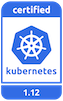

---

copyright:
  years: 2014, 2019
lastupdated: "2019-11-01"

keywords: kubernetes, iks, versions, update, upgrade

subcollection: containers

---

{:new_window: target="_blank"}
{:shortdesc: .shortdesc}
{:screen: .screen}
{:pre: .pre}
{:table: .aria-labeledby="caption"}
{:codeblock: .codeblock}
{:tip: .tip}
{:note: .note}
{:important: .important}
{:deprecated: .deprecated}
{:note: .note}
{:external: target="_blank" .external}


# Version information and update actions   
{: #cs_versions}

## Kubernetes version types
{: #version_types}

{{site.data.keyword.containerlong}} concurrently supports multiple versions of Kubernetes. When a latest version (n) is released, versions up to 2 behind (n-2) are supported. Versions more than 2 behind the latest (n-3) are first deprecated and then unsupported.
{:shortdesc}

**Supported Kubernetes versions**:
*   Latest: 1.15.5
*   Default: 1.14.8
*   Other: 1.13.12

**Deprecated and unsupported Kubernetes versions**:
*   Deprecated: 1.12.10
*   Unsupported: 1.5, 1.7, 1.8, 1.9, 1.10, 1.11

</br>

**Deprecated versions**: When clusters are running on a deprecated Kubernetes version, you have a minimum of 45 days to review and update to a supported Kubernetes version before the version becomes unsupported. During the deprecation period, your cluster is still functional, but might require updates to a supported release to fix security vulnerabilities. For example, you can add and reload worker nodes, but you cannot create new clusters that use the deprecated version when the unsupported date is 45 or less days away.

**Unsupported versions**: If your clusters run a Kubernetes version that is not supported, review the following potential update impacts and then immediately [update the cluster](/docs/containers?topic=containers-update#update) to continue receiving important security updates and support. Unsupported clusters cannot add or reload existing worker nodes. You can find out whether your cluster is **unsupported** by reviewing the **State** field in the output of the `ibmcloud ks cluster ls` command or in the [{{site.data.keyword.containerlong_notm}} console ](https://cloud.ibm.com/kubernetes/clusters).

If you wait until your cluster is three or more minor versions behind the oldest supported version, you cannot update the cluster. Instead, [create a new cluster](/docs/containers?topic=containers-clusters#clusters), [deploy your apps](/docs/containers?topic=containers-app#app) to the new cluster, and [delete](/docs/containers?topic=containers-remove) the unsupported cluster.<br><br>To avoid this issue, update deprecated clusters to a supported version less than three ahead of the current version, such as 1.11 to 1.12 and then update to the latest version, 1.14. If the worker nodes run a version three or more behind the master, you might see your pods fail by entering a state such as `MatchNodeSelector`, `CrashLoopBackOff`, or `ContainerCreating` until you update the worker nodes to the same version as the master. After you update from a deprecated to a supported version, your cluster can resume normal operations and continue receiving support.
{: important}

</br>

To check the server version of a cluster, run the following command.
```
kubectl version  --short | grep -i server
```
{: pre}

Example output:
```
Server Version: v1.14.8+IKS
```
{: screen}

## Update types
{: #update_types}

Your Kubernetes cluster has three types of updates: major, minor, and patch.
{:shortdesc}

|Update type|Examples of version labels|Updated by|Impact
|-----|-----|-----|-----|
|Major|1.x.x|You|Operation changes for clusters, including scripts or deployments.|
|Minor|x.9.x|You|Operation changes for clusters, including scripts or deployments.|
|Patch|x.x.4_1510|IBM and you|Kubernetes patches, as well as other {{site.data.keyword.cloud_notm}} Provider component updates such as security and operating system patches. IBM updates masters automatically, but you apply patches to worker nodes. See more about patches in the following section.|
{: caption="Impacts of Kubernetes updates" caption-side="top"}

As updates become available, you are notified when you view information about the worker nodes, such as with the `ibmcloud ks worker ls --cluster <cluster>` or `ibmcloud ks worker get --cluster <cluster> --worker <worker>` commands.
-  **Major and minor updates (1.x)**: First, [update your master node](/docs/containers?topic=containers-update#master) and then [update the worker nodes](/docs/containers?topic=containers-update#worker_node). Worker nodes cannot run a Kubernetes major or minor version that is greater than the masters.
   - You cannot update a Kubernetes master three or more minor versions ahead. For example, if your current master is version 1.11 and you want to update to 1.14, you must update to 1.12 first.
   - If you use a `kubectl` CLI version that does match at least the `major.minor` version of your clusters, you might experience unexpected results. Make sure to keep your Kubernetes cluster and [CLI versions](/docs/containers?topic=containers-cs_cli_install#kubectl) up-to-date.
-  **Patch updates (x.x.4_1510)**: Changes across patches are documented in the [Version changelog](/docs/containers?topic=containers-changelog). Master patches are applied automatically, but you initiate worker node patches updates. Worker nodes can also run patch versions that are greater than the masters. As updates become available, you are notified when you view information about the master and worker nodes in the {{site.data.keyword.cloud_notm}} console or CLI, such as with the following commands: `ibmcloud ks cluster ls`, `cluster get`, `workers`, or `worker get`.
   - **Worker node patches**: Check monthly to see whether an update is available, and use the `ibmcloud ks worker update` [command](/docs/containers?topic=containers-cli-plugin-kubernetes-service-cli#cs_worker_update) or the `ibmcloud ks worker reload` [command](/docs/containers?topic=containers-cli-plugin-kubernetes-service-cli#cs_worker_reload) to apply these security and operating system patches. During an update or reload, your worker node machine is reimaged, and data is deleted if not [stored outside the worker node](/docs/containers?topic=containers-storage_planning#persistent_storage_overview).
   - **Master patches**: Master patches are applied automatically over the course of several days, so a master patch version might show up as available before it is applied to your master. The update automation also skips clusters that are in an unhealthy state or have operations currently in progress. Occasionally, IBM might disable automatic updates for a specific master fix pack, as noted in the changelog, such as a patch that is only needed if a master is updated from one minor version to another. In any of these cases, you can choose to safely use the `ibmcloud ks cluster master update` [command](/docs/containers?topic=containers-cli-plugin-kubernetes-service-cli#cs_cluster_update) yourself without waiting for the update automation to apply.

</br>

{: #prep-up}
This information summarizes updates that are likely to have impact on deployed apps when you update a cluster to a new version from the previous version.
-  Version 1.15 [preparation actions](#cs_v115).
-  Version 1.14 [preparation actions](#cs_v114).
-  Version 1.13 [preparation actions](#cs_v113).
-  **Deprecated**: Version 1.12 [preparation actions](#cs_v112).
-  [Archive](#k8s_version_archive) of unsupported versions.

<br/>

For a complete list of changes, review the following information:
* [Kubernetes changelog ](https://github.com/kubernetes/kubernetes/blob/master/CHANGELOG.md).
* [IBM version changelog](/docs/containers?topic=containers-changelog).

</br>

## Release history
{: #release-history}

The following table records {{site.data.keyword.containerlong_notm}} version release history. You can use this information for planning purposes, such as to estimate general time frames when a certain release might become unsupported. After the Kubernetes community releases a version update, the IBM team begins a process of hardening and testing the release for {{site.data.keyword.containerlong_notm}} environments. Availability and unsupported release dates depend on the results of these tests, community updates, security patches, and technology changes between versions. Plan to keep your cluster master and worker node version up-to-date according to the `n-2` version support policy.
{: shortdesc}

{{site.data.keyword.containerlong_notm}} was first generally available with Kubernetes version 1.5. Projected release or unsupported dates are subject to change. To go to the version update preparation steps, click the version number.

Dates that are marked with a dagger (`†`) are tentative and subject to change.
{: important}

<table summary="This table shows the release history for {{site.data.keyword.containerlong_notm}}.">
<caption>Release history for {{site.data.keyword.containerlong_notm}}.</caption>
<col width="20%" align="center">
<col width="20%">
<col width="30%">
<col width="30%">
<thead>
<tr>
<th>Supported?</th>
<th>Version</th>
<th>{{site.data.keyword.containerlong_notm}}<br>release date</th>
<th>{{site.data.keyword.containerlong_notm}}<br>unsupported date</th>
</tr>
</thead>
<tbody>
  <tr>
  <td></td>
  <td>[1.15](#cs_v115)</td>
  <td>05 Aug 2019</td>
  <td>Aug 2020 `†`</td>
</tr>
<tr>
  <td></td>
  <td>[1.14](#cs_v114)</td>
  <td>07 May 2019</td>
  <td>May 2020 `†`</td>
</tr>
<tr>
  <td></td>
  <td>[1.13](#cs_v113)</td>
  <td>05 Feb 2019</td>
  <td>19 Feb 2020 `†`</td>
</tr>
  <tr>
  <td></td>
  <td>[1.12](#cs_v112)</td>
  <td>07 Nov 2018</td>
  <td>03 Nov 2019</td>
</tr>
<tr>
  <td></td>
  <td>[1.11](#cs_v111)</td>
  <td>14 Aug 2018</td>
  <td>20 Jul 2019</td>
</tr>
<tr>
  <td></td>
  <td>[1.10](#cs_v110)</td>
  <td>01 May 2018</td>
  <td>16 May 2019</td>
</tr>
<tr>
  <td></td>
  <td>[1.9](#cs_v19)</td>
  <td>08 Feb 2018</td>
  <td>27 Dec 2018</td>
</tr>
<tr>
  <td></td>
  <td>[1.8](#cs_v18)</td>
  <td>08 Nov 2017</td>
  <td>22 Sep 2018</td>
</tr>
<tr>
  <td></td>
  <td>[1.7](#cs_v17)</td>
  <td>19 Sep 2017</td>
  <td>21 Jun 2018</td>
</tr>
<tr>
  <td></td>
  <td>1.6</td>
  <td>N/A</td>
  <td>N/A</td>
</tr>
<tr>
  <td></td>
  <td>[1.5](#cs_v1-5)</td>
  <td>23 May 2017</td>
  <td>04 Apr 2018</td>
</tr>
</tbody>
</table>

<br />


## Version 1.15
{: #cs_v115}

<p> {{site.data.keyword.containerlong_notm}} is a Certified Kubernetes product for version 1.15 under the CNCF Kubernetes Software Conformance Certification program. _Kubernetes® is a registered trademark of The Linux Foundation in the United States and other countries, and is used pursuant to a license from The Linux Foundation._</p>

Review changes that you might need to make when you update from the previous Kubernetes version to 1.15.
{: shortdesc}

### Update before master
{: #115_before}

The following table shows the actions that you must take before you update the Kubernetes master.
{: shortdesc}

<table summary="Kubernetes updates for version 1.15">
<caption>Changes to make before you update the master to Kubernetes 1.15</caption>
<thead>
<tr>
<th>Type</th>
<th>Description</th>
</tr>
</thead>
<tbody>
<tr>
<td>`kubelet` cgroup metrics collection</td>
<td>`kubelet` now collects only cgroups metrics for the node, container runtime, kubelet, pods, and containers. If any automation or components rely on additional cgroup metrics, update the components to reflect these changes.</td>
</tr>
<tr>
<td>Default Calico policy change</td>
<td>If you created custom Calico HostEndpoints that refer to an `iks.worker.interface == 'private'` label, a new default Calico policy, `allow-all-private-default`, might disrupt network traffic. You must create a Calico policy with the `iks.worker.interface == 'private'` label to override the default policy. For more information, see [Default Calico and Kubernetes network policies](/docs/containers?topic=containers-network_policies#default_policy).</td>
</tr>
  </tbody>
</table>

### Update after master
{: #115_after}

The following table shows the actions that you must take after you update the Kubernetes master.
{: shortdesc}

<table summary="Kubernetes updates for version 1.15">
<caption>Changes to make after you update the master to Kubernetes 1.15</caption>
<thead>
<tr>
<th>Type</th>
<th>Description</th>
</tr>
</thead>
<tbody>
<tr>
<td>Unsupported: `kubectl exec --pod`</td>
<td>The `kubectl exec` command's `--pod` and shorthand `-p` flags are no longer supported. If your scripts rely on these flags, update them.</td>
</tr>
<tr>
<td>Unsupported: `kubectl scale job`</td>
<td>The `kubectl scale job` command is removed. If your scripts rely on this command, update them.</td>
</tr>
  </tbody>
</table>

### Update after worker nodes
{: #115_after_worker}

The following table shows the actions that you must take after you update your worker nodes.
{: shortdesc}

<table summary="Kubernetes updates for version 1.15">
<caption>Changes to make after you update the worker nodes to Kubernetes 1.15</caption>
<thead>
<tr>
<th>Type</th>
<th>Description</th>
</tr>
</thead>
<tbody>
<tr>
<td>`kubelet probe metrics` type are now counters rather than gauge</td>
<td>The previous method of using the gauge type for probe metrics is replaced by the counters type. The gauge type returned `0` for success and `1` for failed operations. Now, the counters type keeps track of the number of times that the metric returns `successful`, `failure`, or `unknown`. If your automation processes rely on a `0` successful or `1` failed gauge response, update the processes to use the counters response statuses. The numerical response value can now indicate the number of times that the counters response statuses are reported.<br><br>Additionally, to reflect this change in functionality, the `prober_probe_result` metric is replaced by the `prober_probe_total` metric.</td>
</tr>
</tbody>
</table>

<br />


## Version 1.14
{: #cs_v114}

<p> {{site.data.keyword.containerlong_notm}} is a Certified Kubernetes product for version 1.14 under the CNCF Kubernetes Software Conformance Certification program. _Kubernetes® is a registered trademark of The Linux Foundation in the United States and other countries, and is used pursuant to a license from The Linux Foundation._</p>

Review changes that you might need to make when you update from the previous Kubernetes version to 1.14.
{: shortdesc}

Kubernetes 1.14 introduces new capabilities for you to explore. Try out the new [`kustomize` project ](https://github.com/kubernetes-sigs/kustomize) that you can use to hep write, customize, and reuse your Kubernetes resource YAML configurations. Or take a look at the new [`kubectl` CLI docs ](https://kubectl.docs.kubernetes.io/).
{: tip}

### Update before master
{: #114_before}

The following table shows the actions that you must take before you update the Kubernetes master.
{: shortdesc}

<table summary="Kubernetes updates for version 1.14">
<caption>Changes to make before you update the master to Kubernetes 1.14</caption>
<thead>
<tr>
<th>Type</th>
<th>Description</th>
</tr>
</thead>
<tbody>
<tr>
<td>CRI pod log directory structure change</td>
<td>The container runtime interface (CRI) changed the pod log directory structure from `/var/log/pods/<UID>` to `/var/log/pods/<NAMESPACE_NAME_UID>`. If your apps bypass Kubernetes and the CRI to access pod logs directly on worker nodes, update them to handle both directory structures. Accessing pod logs via Kubernetes, for example by running `kubectl logs`, is not impacted by this change.</td>
</tr>
<tr>
<td>Health checks no longer follow redirects</td>
<td>Health check liveness and readiness probes that use an `HTTPGetAction` no longer follow redirects to hostnames that are different from the original probe request. Instead, these non-local redirects return a `Success` response and an event with reason `ProbeWarning` is generated to indicate that the redirect was ignored. If you previously relied on the redirect to run health checks against different hostname endpoints, you must perform the health check logic outside the `kubelet`. For example, you might proxy the external endpoint instead of redirecting the probe request.</td>
</tr>
<tr>
<td>Unsupported: KubeDNS cluster DNS provider</td>
<td>CoreDNS is now the only supported cluster DNS provider for clusters that run Kubernetes version 1.14 and later. If you update an existing cluster that uses KubeDNS as the cluster DNS provider to version 1.14, KubeDNS is automatically migrated to CoreDNS during the update. Thus before you update the cluster, consider [setting up CoreDNS as the cluster DNS provider](/docs/containers?topic=containers-cluster_dns#set_coredns) and testing it. For example, if your app relies on an older DNS client, you might need to [update the app or customize CoreDNS](/docs/containers?topic=containers-cs_troubleshoot_network#coredns_issues).<br><br>CoreDNS supports [cluster DNS specification ](https://github.com/kubernetes/dns/blob/master/docs/specification.md#25---records-for-external-name-services) to enter a domain name as the Kubernetes service `ExternalName` field. The previous cluster DNS provider, KubeDNS, does not follow the cluster DNS specification, and as such, allows IP addresses for `ExternalName`. If any Kubernetes services use IP addresses instead of DNS, you must update the `ExternalName` to DNS for continued functionality.</td>
</tr>
<tr>
<td>Unsupported: Kubernetes `Initializers` alpha feature</td>
<td>The Kubernetes `Initializers` alpha feature, `admissionregistration.k8s.io/v1alpha1` API version, `Initializers` admission controller plug-in, and use of the `metadata.initializers` API field are removed. If you use `Initializers`, switch to use [Kubernetes admission webhooks ](https://kubernetes.io/docs/reference/access-authn-authz/extensible-admission-controllers/) and delete any existing `InitializerConfiguration` API objects before you update the cluster.</td>
</tr>
<tr>
<td>Unsupported: Node alpha taints</td>
<td>The use of taints `node.alpha.kubernetes.io/notReady` and `node.alpha.kubernetes.io/unreachable` are no longer supported. If you rely on these taints, update your apps to use the `node.kubernetes.io/not-ready` and `node.kubernetes.io/unreachable` taints instead.</td>
</tr>
<tr>
<td>Unsupported: The Kubernetes API swagger documents</td>
<td>The `swagger/*`, `/swagger.json`, and `/swagger-2.0.0.pb-v1` schema API docs are now removed in favor of the `/openapi/v2` schema API docs. The swagger docs were deprecated when the OpenAPI docs became available in Kubernetes version 1.10. Additionally, the Kubernetes API server now aggregates only OpenAPI schemas from `/openapi/v2` endpoints of aggregated API servers. The fallback to aggregate from `/swagger.json` is removed. If you installed apps that provide Kubernetes API extensions, ensure that your apps support the `/openapi/v2` schema API docs.</td>
</tr>
<tr>
<td>Unsupported and deprecated: Select metrics</td>
<td>Review the [removed and deprecated Kubernetes metrics ](https://github.com/kubernetes/kubernetes/blob/master/CHANGELOG-1.14.md#removed-and-deprecated-metrics). If you use any of these deprecated metrics, change to the available replacement metric.</td>
</tr>
</tbody>
</table>

### Update after master
{: #114_after}

The following table shows the actions that you must take after you update the Kubernetes master.
{: shortdesc}

<table summary="Kubernetes updates for version 1.14">
<caption>Changes to make after you update the master to Kubernetes 1.14</caption>
<thead>
<tr>
<th>Type</th>
<th>Description</th>
</tr>
</thead>
<tbody>
<tr>
<td>Unsupported: `kubectl --show-all`</td>
<td>The `--show-all` and shorthand `-a` flags are no longer supported. If your scripts rely on these flags, update them.</td>
</tr>
<tr>
<td>Kubernetes default RBAC policies for unauthenticated users</td>
<td>The Kubernetes default role-based access control (RBAC) policies no longer grant access to [discovery and permission-checking APIs to unauthenticated users ](https://kubernetes.io/docs/reference/access-authn-authz/rbac/#discovery-roles). This change applies only to new version 1.14 clusters. If you update a cluster from a prior version, unauthenticated users still have access to the discovery and permission-checking APIs. If you want to update to the more secure default for unauthenticated users, remove the `system:unauthenticated` group from the `system:basic-user` and `system:discovery` cluster role bindings.</td>
</tr>
<tr>
<td>Deprecated: Prometheus queries that use `pod_name` and `container_name` labels</td>
<td>Update any Prometheus queries that match `pod_name` or `container_name` labels to use `pod` or `container` labels instead. Example queries that might use these deprecated labels include kubelet probe metrics. The deprecated `pod_name` and `container_name` labels become unsupported in the next Kubernetes release.</td>
</tr>
</tbody>
</table>

<br />


## Version 1.13
{: #cs_v113}

<p> {{site.data.keyword.containerlong_notm}} is a Certified Kubernetes product for version 1.13 under the CNCF Kubernetes Software Conformance Certification program. _Kubernetes® is a registered trademark of The Linux Foundation in the United States and other countries, and is used pursuant to a license from The Linux Foundation._</p>

Review changes that you might need to make when you update from the previous Kubernetes version to 1.13.
{: shortdesc}

### Update before master
{: #113_before}

The following table shows the actions that you must take before you update the Kubernetes master.
{: shortdesc}

<table summary="Kubernetes updates for version 1.13">
<caption>Changes to make before you update the master to Kubernetes 1.13</caption>
<thead>
<tr>
<th>Type</th>
<th>Description</th>
</tr>
</thead>
<tbody>
<tr>
<td>N/A</td>
<td></td>
</tr>
</tbody>
</table>

### Update after master
{: #113_after}

The following table shows the actions that you must take after you update the Kubernetes master.
{: shortdesc}

<table summary="Kubernetes updates for version 1.13">
<caption>Changes to make after you update the master to Kubernetes 1.13</caption>
<thead>
<tr>
<th>Type</th>
<th>Description</th>
</tr>
</thead>
<tbody>
<tr>
<td>CoreDNS available as the new default cluster DNS provider</td>
<td>CoreDNS is now the default cluster DNS provider for new clusters in Kubernetes 1.13 and later. If you update an existing cluster to 1.13 that uses KubeDNS as the cluster DNS provider, KubeDNS continues to be the cluster DNS provider. However, you can choose to [use CoreDNS instead](/docs/containers?topic=containers-cluster_dns#dns_set). For example, you might test your apps on CoreDNS in preparation for the next Kubernetes version update to make sure that you do not need to [update the app, or to customize CoreDNS](/docs/containers?topic=containers-cs_troubleshoot_network#coredns_issues).
<br><br>CoreDNS supports [cluster DNS specification ](https://github.com/kubernetes/dns/blob/master/docs/specification.md#25---records-for-external-name-services) to enter a domain name as the Kubernetes service `ExternalName` field. The previous cluster DNS provider, KubeDNS, does not follow the cluster DNS specification, and as such, allows IP addresses for `ExternalName`. If any Kubernetes services use IP addresses instead of DNS, you must update the `ExternalName` to DNS for continued functionality.</td>
</tr>
<tr>
<td>`kubectl` output for `Deployment` and `StatefulSet`</td>
<td>The `kubectl` output for `Deployment` and `StatefulSet` now includes a `Ready` column and is more human-readable. If your scripts rely on the previous behavior, update them.</td>
</tr>
<tr>
<td>`kubectl` output for `PriorityClass`</td>
<td>The `kubectl` output for `PriorityClass` now includes a `Value` column. If your scripts rely on the previous behavior, update them.</td>
</tr>
<tr>
<td>`kubectl get componentstatuses`</td>
<td>The `kubectl get componentstatuses` command does not properly report the health of some Kubernetes master components because these components are no longer accessible from the Kubernetes API server now that `localhost` and insecure (HTTP) ports are disabled. After introducing highly available (HA) masters in Kubernetes version 1.10, each Kubernetes master is set up with multiple `apiserver`, `controller-manager`, `scheduler`, and `etcd` instances. Instead, review the cluster healthy by checking the [{{site.data.keyword.cloud_notm}} console ](https://cloud.ibm.com/kubernetes/landing) or by using the `ibmcloud ks cluster get` [command](/docs/containers?topic=containers-cli-plugin-kubernetes-service-cli#cs_cluster_get).</td>
</tr>
<tr>
<tr>
<td>Unsupported: `kubectl run-container`</td>
<td>The `kubectl run-container` command is removed. Instead, use the `kubectl run` command.</td>
</tr>
<tr>
<td>`kubectl rollout undo`</td>
<td>When you run `kubectl rollout undo` for a revision that does not exist, an error is returned. If your scripts rely on the previous behavior, update them.</td>
</tr>
<tr>
<td>Deprecated: `scheduler.alpha.kubernetes.io/critical-pod` annotation</td>
<td>The `scheduler.alpha.kubernetes.io/critical-pod` annotation is now deprecated. Change any pods that rely on this annotation to use [pod priority](/docs/containers?topic=containers-pod_priority#pod_priority) instead.</td>
</tr>
</tbody>
</table>

### Update after worker nodes
{: #113_after_workers}

The following table shows the actions that you must take after you update your worker nodes.
{: shortdesc}

<table summary="Kubernetes updates for version 1.13">
<caption>Changes to make after you update your worker nodes to Kubernetes 1.13</caption>
<thead>
<tr>
<th>Type</th>
<th>Description</th>
</tr>
</thead>
<tbody>
<tr>
<td>containerd `cri` stream server</td>
<td>In containerd version 1.2, the `cri` plug-in stream server now serves on a random port, `http://localhost:0`. This change supports the `kubelet` streaming proxy and provides a more secure streaming interface for container `exec` and `logs` operations. Previously, the `cri` stream server listened on the worker node's private network interface by using port 10010. If your apps use the container `cri` plug-in and rely on the previous behavior, update them.</td>
</tr>
</tbody>
</table>

<br />


## Deprecated: Version 1.12
{: #cs_v112}

<p> {{site.data.keyword.containerlong_notm}} is a Certified Kubernetes product for version 1.12 under the CNCF Kubernetes Software Conformance Certification program. _Kubernetes® is a registered trademark of The Linux Foundation in the United States and other countries, and is used pursuant to a license from The Linux Foundation._</p>

Review changes that you might need to make when you update from the previous Kubernetes version to 1.12.
{: shortdesc}

### Update before master
{: #112_before}

The following table shows the actions that you must take before you update the Kubernetes master.
{: shortdesc}

<table summary="Kubernetes updates for version 1.12">
<caption>Changes to make before you update the master to Kubernetes 1.12</caption>
<thead>
<tr>
<th>Type</th>
<th>Description</th>
</tr>
</thead>
<tbody>
<tr>
<td>Kubernetes Metrics Server</td>
<td>If you currently have the Kubernetes `metric-server` deployed in your cluster, you must remove the `metric-server` before you update the cluster to Kubernetes 1.12. This removal prevents conflicts with the `metric-server` that is deployed during the update.</td>
</tr>
<tr>
<td>Role bindings for `kube-system` `default` service account</td>
<td>The `kube-system` `default` service account no longer has **cluster-admin** access to the Kubernetes API. If you deploy features or add-ons such as [Helm](/docs/containers?topic=containers-helm#public_helm_install) that require access to processes in your cluster, set up a [service account ](https://kubernetes.io/docs/reference/access-authn-authz/service-accounts-admin/). If you need time to create and set up individual service accounts with the appropriate permissions, you can temporarily grant the **cluster-admin** role with the following cluster role binding: `kubectl create clusterrolebinding kube-system:default --clusterrole=cluster-admin --serviceaccount=kube-system:default`</td>
</tr>
</tbody>
</table>

### Update after master
{: #112_after}

The following table shows the actions that you must take after you update the Kubernetes master.
{: shortdesc}

<table summary="Kubernetes updates for version 1.12">
<caption>Changes to make after you update the master to Kubernetes 1.12</caption>
<thead>
<tr>
<th>Type</th>
<th>Description</th>
</tr>
</thead>
<tbody>
<tr>
<td>APIs for Kubernetes</td>
<td>The Kubernetes API replaces deprecated APIs as follows:
<ul><li><strong>apps/v1</strong>: The `apps/v1` Kubernetes API replaces the `apps/v1beta1` and `apps/v1alpha` APIs. The `apps/v1` API also replaces the `extensions/v1beta1` API for `daemonset`, `deployment`, `replicaset`, and `statefulset` resources. The Kubernetes project is deprecating and phasing out support for the previous APIs from the Kubernetes `apiserver` and the `kubectl` client.</li>
<li><strong>networking.k8s.io/v1</strong>: The `networking.k8s.io/v1` API replaces the `extensions/v1beta1` API for NetworkPolicy resources.</li>
<li><strong>policy/v1beta1</strong>: The `policy/v1beta1` API replaces the `extensions/v1beta1` API for `podsecuritypolicy` resources.</li></ul>
<br><br>Update all your YAML `apiVersion` fields to use the appropriate Kubernetes API before the deprecated APIs become unsupported. Also, review the [Kubernetes docs ](https://kubernetes.io/docs/concepts/workloads/controllers/deployment/) for changes that are related to `apps/v1`, such as the following.
<ul><li>After creating a deployment, the `.spec.selector` field is immutable.</li>
<li>The `.spec.rollbackTo` field is deprecated. Instead, use the `kubectl rollout undo` command.</li></ul></td>
</tr>
<tr>
<td>CoreDNS available as cluster DNS provider</td>
<td>The Kubernetes project is in the process of transitioning to support CoreDNS instead of the current Kubernetes DNS (KubeDNS). In version 1.12, the default cluster DNS remains KubeDNS, but you can [choose to use CoreDNS](/docs/containers?topic=containers-cluster_dns#dns_set).</td>
</tr>
<tr>
<td>`kubectl apply --force`</td>
<td>Now, when you force an apply action (`kubectl apply --force`) on resources that cannot be updated, such as immutable fields in YAML files, the resources are recreated instead. If your scripts rely on the previous behavior, update them.</td>
</tr>
<tr>
<td>`kubectl get componentstatuses`</td>
<td>The `kubectl get componentstatuses` command does not properly report the health of some Kubernetes master components because these components are no longer accessible from the Kubernetes API server now that `localhost` and insecure (HTTP) ports are disabled. After introducing highly available (HA) masters in Kubernetes version 1.10, each Kubernetes master is set up with multiple `apiserver`, `controller-manager`, `scheduler`, and `etcd` instances. Instead, review the cluster healthy by checking the [{{site.data.keyword.cloud_notm}} console ](https://cloud.ibm.com/kubernetes/landing) or by using the `ibmcloud ks cluster get` [command](/docs/containers?topic=containers-cli-plugin-kubernetes-service-cli#cs_cluster_get).</td>
</tr>
<tr>
<td>`kubectl logs --interactive`</td>
<td>The `--interactive` flag is no longer supported for `kubectl logs`. Update any automation that uses this flag.</td>
</tr>
<tr>
<td>`kubectl patch`</td>
<td>If the `patch` command results in no changes (a redundant patch), the command no longer exits with a `1` return code. If your scripts rely on the previous behavior, update them.</td>
</tr>
<tr>
<td>`kubectl version -c`</td>
<td>The `-c` shorthand flag is no longer supported. Instead, use the full `--client` flag. Update any automation that uses this flag.</td>
</tr>
<tr>
<td>`kubectl wait`</td>
<td>If no matching selectors are found, the command now prints an error message and exits with a `1` return code. If your scripts rely on the previous behavior, update them.</td>
</tr>
<tr>
<td>kubelet cAdvisor port</td>
<td>The [Container Advisor (cAdvisor) ](https://github.com/google/cadvisor) web UI that the kubelet used by starting the `--cadvisor-port` is removed from Kubernetes 1.12. If you still need to run cAdvisor, [deploy cAdvisor as a daemon set ](https://github.com/google/cadvisor/tree/master/deploy/kubernetes).<br><br>In the daemon set, specify the ports section so that cAdvisor can be reached via `http://node-ip:4194`, such as follows. The cAdvisor pods fail until the worker nodes are updated to 1.12 because earlier versions of kubelet use host port 4194 for cAdvisor.
<pre class="screen"><code>ports:
          - name: http
            containerPort: 8080
            hostPort: 4194
            protocol: TCP</code></pre></td>
</tr>
<tr>
<td>Kubernetes dashboard</td>
<td>If you access the dashboard via `kubectl proxy`, the **SKIP** button on the login page is removed. Instead, [use a **Token** to log in](/docs/containers?topic=containers-app#cli_dashboard).</td>
</tr>
<tr>
<td id="metrics-server">Kubernetes Metrics Server</td>
<td>Kubernetes Metrics Server replaces Kubernetes Heapster (deprecated since Kubernetes version 1.8) as the cluster metrics provider. If you run more than 30 pods per worker node in your cluster, [adjust the `metrics-server` configuration for performance](/docs/containers?topic=containers-kernel#metrics).
<p>The Kubernetes dashboard does not work with the `metrics-server`. If you want to display metrics in a dashboard, choose from the following options.</p>
<ul><li>[Set up Grafana to analyze metrics](/docs/services/cloud-monitoring/tutorials?topic=cloud-monitoring-container_service_metrics#container_service_metrics) by using the Cluster Monitoring Dashboard.</li>
<li>Deploy [Heapster ](	https://github.com/kubernetes/heapster) to your cluster.
<ol><li>Copy the `heapster-rbac` [YAML ](https://github.com/kubernetes/kubernetes/blob/release-1.12/cluster/addons/cluster-monitoring/heapster-rbac.yaml), `heapster-service` [YAML ](https://github.com/kubernetes/kubernetes/blob/release-1.12/cluster/addons/cluster-monitoring/standalone/heapster-service.yaml), and `heapster-controller` [YAML ](https://github.com/kubernetes/kubernetes/blob/release-1.12/cluster/addons/cluster-monitoring/standalone/heapster-controller.yaml) files.</li>
<li>Edit the `heapster-controller` YAML by replacing the following strings.
<ul><li>Replace `{{ nanny_memory }}` with `90Mi`</li>
<li>Replace `{{ base_metrics_cpu }}` with `80m`</li>
<li>Replace `{{ metrics_cpu_per_node }}` with `0.5m`</li>
<li>Replace `{{ base_metrics_memory }}` with `140Mi`</li>
<li>Replace `{{ metrics_memory_per_node }}` with `4Mi`</li>
<li>Replace `{{ heapster_min_cluster_size }}` with `16`</li></ul></li>
<li>Apply the `heapster-rbac`, `heapster-service`, and `heapster-controller` YAML files to your cluster by running the `kubectl apply -f` command.</li></ol></li></ul></td>
</tr>
<tr>
<td>`rbac.authorization.k8s.io/v1` Kubernetes API</td>
<td>The `rbac.authorization.k8s.io/v1` Kubernetes API (supported since Kubernetes 1.8) is replacing the `rbac.authorization.k8s.io/v1alpha1` and `rbac.authorization.k8s.io/v1beta1` API. You can no longer create RBAC objects such as roles or role bindings with the unsupported `v1alpha` API. Existing RBAC objects are converted to the `v1` API.</td>
</tr>
</tbody>
</table>

<br />


## Archive
{: #k8s_version_archive}

Find an overview of Kubernetes versions that are unsupported in {{site.data.keyword.containerlong_notm}}.
{: shortdesc}

### Version 1.11 (Unsupported)
{: #cs_v111}

As of 20 July 2019, {{site.data.keyword.containerlong_notm}} clusters that run [Kubernetes version 1.11](/docs/containers?topic=containers-changelog#changelog_archive) are unsupported. Version 1.11 clusters cannot receive security updates or support unless they are updated to the next most recent version.
{: shortdesc}

[Review the potential impact](/docs/containers?topic=containers-cs_versions#cs_versions) of each Kubernetes version update, and then [update your clusters](/docs/containers?topic=containers-update#update) immediately to [Kubernetes 1.13](#cs_v113).

### Version 1.10 (Unsupported)
{: #cs_v110}

As of 16 May 2019, {{site.data.keyword.containerlong_notm}} clusters that run [Kubernetes version 1.10](/docs/containers?topic=containers-changelog#changelog_archive) are unsupported. Version 1.10 clusters cannot receive security updates or support unless they are updated to the next most recent version.
{: shortdesc}

[Review the potential impact](/docs/containers?topic=containers-cs_versions#cs_versions) of each Kubernetes version update, and then [update your clusters](/docs/containers?topic=containers-update#update) to [Kubernetes 1.12](#cs_v112).

### Version 1.9 (Unsupported)
{: #cs_v19}

As of 27 December 2018, {{site.data.keyword.containerlong_notm}} clusters that run [Kubernetes version 1.9](/docs/containers?topic=containers-changelog#changelog_archive) are unsupported. Version 1.9 clusters cannot receive security updates or support unless they are updated to the next most recent version.
{: shortdesc}

To continue running your apps in {{site.data.keyword.containerlong_notm}}, [create a new cluster](/docs/containers?topic=containers-clusters#clusters) and [deploy your apps](/docs/containers?topic=containers-app#app) to the new cluster.

### Version 1.8 (Unsupported)
{: #cs_v18}

As of 22 September 2018, {{site.data.keyword.containerlong_notm}} clusters that run [Kubernetes version 1.8](/docs/containers?topic=containers-changelog#changelog_archive) are unsupported. Version 1.8 clusters cannot receive security updates or support.
{: shortdesc}

To continue running your apps in {{site.data.keyword.containerlong_notm}}, [create a new cluster](/docs/containers?topic=containers-clusters#clusters) and [deploy your apps](/docs/containers?topic=containers-app#app) to the new cluster.

### Version 1.7 (Unsupported)
{: #cs_v17}

As of 21 June 2018, {{site.data.keyword.containerlong_notm}} clusters that run [Kubernetes version 1.7](/docs/containers?topic=containers-changelog#changelog_archive) are unsupported. Version 1.7 clusters cannot receive security updates or support.
{: shortdesc}

To continue running your apps in {{site.data.keyword.containerlong_notm}}, [create a new cluster](/docs/containers?topic=containers-clusters#clusters) and [deploy your apps](/docs/containers?topic=containers-app#app) to the new cluster.

### Version 1.5 (Unsupported)
{: #cs_v1-5}

As of 4 April 2018, {{site.data.keyword.containerlong_notm}} clusters that run [Kubernetes version 1.5](https://github.com/kubernetes/kubernetes/blob/master/CHANGELOG-1.5.md) are unsupported. Version 1.5 clusters cannot receive security updates or support.
{: shortdesc}

To continue running your apps in {{site.data.keyword.containerlong_notm}}, [create a new cluster](/docs/containers?topic=containers-clusters#clusters) and [deploy your apps](/docs/containers?topic=containers-app#app) to the new cluster.
