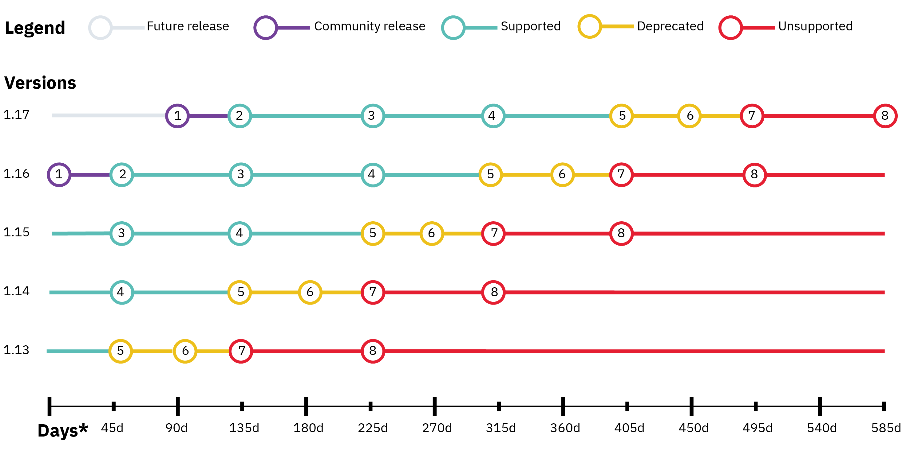
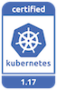
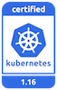
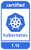
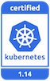

---

copyright:
  years: 2014, 2020
lastupdated: "2020-03-10"

keywords: kubernetes, iks, versions, update, upgrade

subcollection: containers

---

{:codeblock: .codeblock}
{:deprecated: .deprecated}
{:download: .download}
{:external: target="_blank" .external}
{:faq: data-hd-content-type='faq'}
{:gif: data-image-type='gif'}
{:help: data-hd-content-type='help'}
{:important: .important}
{:new_window: target="_blank"}
{:note: .note}
{:pre: .pre}
{:preview: .preview}
{:screen: .screen}
{:shortdesc: .shortdesc}
{:support: data-reuse='support'}
{:table: .aria-labeledby="caption"}
{:tip: .tip}
{:troubleshoot: data-hd-content-type='troubleshoot'}
{:tsCauses: .tsCauses}
{:tsResolve: .tsResolve}
{:tsSymptoms: .tsSymptoms}


# Kubernetes version information and update actions   
{: #cs_versions}

Review information about supported Kubernetes versions for {{site.data.keyword.containerlong}} clusters.
{: shortdesc}

## Update types
{: #update_types}

Your Kubernetes cluster has three types of updates: major, minor, and patch. As updates become available, you are notified when you view information about the cluster master or worker nodes, such as with the `ibmcloud ks cluster ls`, `cluster get`, `worker ls`, or `worker get` commands.
{:shortdesc}

|Update type|Examples of version labels|Updated by|Impact
|-----|-----|-----|-----|
|Major|1.x.x|You|Operation changes for clusters, including scripts or deployments.|
|Minor|x.9.x|You|Operation changes for clusters, including scripts or deployments.|
|Patch|x.x.4_1510|IBM and you|Kubernetes patches, as well as other {{site.data.keyword.cloud_notm}} Provider component updates such as security and operating system patches. IBM updates masters automatically, but you apply patches to worker nodes. See more about patches in the following section.|
{: caption="Impacts of Kubernetes updates" caption-side="top"}

<dl>
  <dt>Major and minor updates (1.x)</dt>
    <dd>First, [update your master node](/docs/containers?topic=containers-update#master) and then [update the worker nodes](/docs/containers?topic=containers-update#worker_node). Worker nodes cannot run a Kubernetes major or minor version that is greater than the masters.
    <ul><li>You cannot update a Kubernetes master two or more minor versions ahead (n+2). For example, if your current master is version 1.15 and you want to update to 1.17, you must update to 1.16 first.</li>
    <li>If you use a `kubectl` CLI version that does match at least the `major.minor` version of your clusters, you might experience unexpected results. Make sure to keep your Kubernetes cluster and [CLI versions](/docs/containers?topic=containers-cs_cli_install#kubectl) up-to-date.</li></ul></dd>
  <dt>Patch updates (x.x.4_1510)</dt>
    <dd>Changes across patches are documented in the [Version changelog](/docs/containers?topic=containers-changelog). Master patches are applied automatically, but you initiate worker node patches updates. Worker nodes can also run patch versions that are greater than the masters. As updates become available, you are notified when you view information about the master and worker nodes in the {{site.data.keyword.cloud_notm}} console or CLI, such as with the following commands: `ibmcloud ks cluster ls`, `cluster get`, `worker ls`, or `worker get`.<br>
    Patches can be for worker nodes, masters, or both.
    <ul><li>**Worker node patches**: Check monthly to see whether an update is available, and use the `ibmcloud ks worker update` [command](/docs/containers?topic=containers-cli-plugin-kubernetes-service-cli#cs_worker_update) or the `ibmcloud ks worker reload` [command](/docs/containers?topic=containers-cli-plugin-kubernetes-service-cli#cs_worker_reload) to apply these security and operating system patches. During an update or reload, your worker node machine is reimaged, and data is deleted if not [stored outside the worker node](/docs/containers?topic=containers-storage_planning#persistent_storage_overview).</li>
    <li>**Master patches**: Master patches are applied automatically over the course of several days, so a master patch version might show up as available before it is applied to your master. The update automation also skips clusters that are in an unhealthy state or have operations currently in progress. Occasionally, IBM might disable automatic updates for a specific master fix pack, as noted in the changelog, such as a patch that is only needed if a master is updated from one minor version to another. In any of these cases, you can choose to safely use the `ibmcloud ks cluster master update` [command](/docs/containers?topic=containers-cli-plugin-kubernetes-service-cli#cs_cluster_update) yourself without waiting for the update automation to apply.</li></ul></dd>
</dl>

## Kubernetes versions
{: #version_types}

{{site.data.keyword.containerlong_notm}} concurrently supports multiple versions of Kubernetes. When a latest version (`n`) is released, versions up to 2 behind (`n-2`) are supported. Versions more than 2 behind the latest (`n-3`) are first deprecated and then unsupported. For more information, see [Release lifecycle](#release_lifecycle).
{:shortdesc}

To continue receiving important security patch updates, make sure that your clusters run a supported Kubernetes version at all times. Deprecated clusters might not receive security updates.
{: important}

Review the supported versions of {{site.data.keyword.containerlong_notm}}. In the CLI, you can run `ibmcloud ks versions`.

**Supported Kubernetes versions**:
*   Latest: 1.17.3
*   Default: 1.16.7
*   Other: 1.15.10

**Deprecated and unsupported Kubernetes versions**:
*   Deprecated: 1.14
*   Unsupported: 1.5, 1.7, 1.8, 1.9, 1.10, 1.11, 1.12, 1.13

<br>

To check the server version of a cluster, log in to the cluster and run the following command.
```
kubectl version  --short | grep -i server
```
{: pre}

Example output:
```
Server Version: v1.16.7+IKS
```
{: screen}

## Release history
{: #release-history}
{: help}
{: support}

The following table records {{site.data.keyword.containerlong_notm}} version release history. You can use this information for planning purposes, such as to estimate general time frames when a certain release might become unsupported. After the Kubernetes community releases a version update, the IBM team begins a process of hardening and testing the release for {{site.data.keyword.containerlong_notm}} environments. Availability and unsupported release dates depend on the results of these tests, community updates, security patches, and technology changes between versions. Plan to keep your cluster master and worker node version up-to-date according to the `n-2` version support policy.
{: shortdesc}

{{site.data.keyword.containerlong_notm}} was first generally available with Kubernetes version 1.5. Projected release or unsupported dates are subject to change. To go to the version update preparation steps, click the version number.

Dates that are marked with a dagger (`†`) are tentative and subject to change.
{: important}

<table summary="This table shows the release history for {{site.data.keyword.containerlong_notm}}.">
<caption>Release history for {{site.data.keyword.containerlong_notm}}.</caption>
<col width="20%" align="center">
<col width="20%">
<col width="30%">
<col width="30%">
<thead>
<tr>
<th>Supported?</th>
<th>Version</th>
<th>{{site.data.keyword.containerlong_notm}}<br>release date</th>
<th>{{site.data.keyword.containerlong_notm}}<br>unsupported date</th>
</tr>
</thead>
<tbody>
  <tr>
  <td></td>
  <td>[1.17](#cs_v117)</td>
  <td>10 Feb 2020</td>
  <td>Feb 2021 `†`</td>
</tr>
  <tr>
  <td></td>
  <td>[1.16](#cs_v116)</td>
  <td>04 Nov 2019</td>
  <td>Nov 2020 `†`</td>
</tr>
  <tr>
  <td></td>
  <td>[1.15](#cs_v115)</td>
  <td>05 Aug 2019</td>
  <td>Aug 2020 `†`</td>
</tr>
<tr>
  <td></td>
  <td>[1.14](#cs_v114)</td>
  <td>07 May 2019</td>
  <td>21 May 2020 `†`</td>
</tr>
<tr>
  <td></td>
  <td>[1.13](#cs_v113)</td>
  <td>05 Feb 2019</td>
  <td>22 Feb 2020</td>
</tr>
  <tr>
  <td></td>
  <td>[1.12](#cs_v112)</td>
  <td>07 Nov 2018</td>
  <td>03 Nov 2019</td>
</tr>
<tr>
  <td></td>
  <td>[1.11](#cs_v111)</td>
  <td>14 Aug 2018</td>
  <td>20 Jul 2019</td>
</tr>
<tr>
  <td></td>
  <td>[1.10](#cs_v110)</td>
  <td>01 May 2018</td>
  <td>16 May 2019</td>
</tr>
<tr>
  <td></td>
  <td>[1.9](#cs_v19)</td>
  <td>08 Feb 2018</td>
  <td>27 Dec 2018</td>
</tr>
<tr>
  <td></td>
  <td>[1.8](#cs_v18)</td>
  <td>08 Nov 2017</td>
  <td>22 Sep 2018</td>
</tr>
<tr>
  <td></td>
  <td>[1.7](#cs_v17)</td>
  <td>19 Sep 2017</td>
  <td>21 Jun 2018</td>
</tr>
<tr>
  <td></td>
  <td>1.6</td>
  <td>N/A</td>
  <td>N/A</td>
</tr>
<tr>
  <td></td>
  <td>[1.5](#cs_v1-5)</td>
  <td>23 May 2017</td>
  <td>04 Apr 2018</td>
</tr>
</tbody>
</table>

## Release lifecycle
{: #release_lifecycle}

{{site.data.keyword.containerlong_notm}} concurrently supports select versions of community Kubernetes releases. When a latest community version is released, {{site.data.keyword.containerlong_notm}} deprecates its oldest supported version (`n-3`) and begins preparing to release the version of the community release.
{: shortdesc}

Each supported version of {{site.data.keyword.containerlong_notm}} goes through a lifecycle of testing, development, general release, support, deprecation, and becoming unsupported. Review the following diagram to understand how the community Kubernetes and {{site.data.keyword.cloud_notm}} provider version lifecycles interact across time.



Estimated days and versions are provided for general understanding. Actual availability and release dates are subject to change and depend on various factors, such as community updates, security patches, and technology changes between versions.
{: note}

1.  The Kubernetes community releases version `n`. IBM engineers begin a process of testing and hardening the community version in preparation to release a supported {{site.data.keyword.containerlong_notm}} version.
2.  Version `n` is released as the latest supported {{site.data.keyword.containerlong_notm}} version.
3.  Version `n` becomes the default supported {{site.data.keyword.containerlong_notm}} version.
4.  Version `n` becomes the oldest supported {{site.data.keyword.containerlong_notm}} version.
5.  Version `n` is deprecated, and security patch updates might not be provided. Depending on the community release cycle and version testing, you have 45 days or less until the next phase of deprecation starts in step 6. During the deprecation period, your cluster is still functional, but might require updating to a supported release to fix security vulnerabilities. For example, you can add and reload worker nodes.
6.  You cannot create clusters at the deprecated version `n`. You have 45 days to update your cluster to a supported version before version `n` becomes unsupported. Similar to step 5, your cluster is still functional, but might require updating to a supported release to fix security vulnerabilities.
7.  Version `n` is unsupported. Review the following potential impacts and then immediately [update the cluster](/docs/containers?topic=containers-update#update) to continue receiving important security updates and support. Unsupported clusters cannot add or reload existing worker nodes.
8. The cluster master runs two or more versions behind the oldest supported version. You cannot update the cluster. Delete the cluster, and create a new one.

If you wait until your cluster is two or more minor versions behind the oldest supported version, you cannot update the cluster. Instead, [create a new cluster](/docs/containers?topic=containers-clusters#clusters), [deploy your apps](/docs/containers?topic=containers-app#app) to the new cluster, and [delete](/docs/containers?topic=containers-remove) the unsupported cluster.<br><br>To avoid this issue, update deprecated clusters to a supported version less than two ahead of the current version, such as 1.15 to 1.16 and then update to the latest version, 1.17. If the worker nodes run a version two or more behind the master, you might see your pods fail by entering a state such as `MatchNodeSelector`, `CrashLoopBackOff`, or `ContainerCreating` until you update the worker nodes to the same version as the master. After you update from a deprecated to a supported version, your cluster can resume normal operations and continue receiving support.<br><br>You can find out whether your cluster is **unsupported** by reviewing the **State** field in the output of the `ibmcloud ks cluster ls` command or in the [{{site.data.keyword.containerlong_notm}} console](https://cloud.ibm.com/kubernetes/clusters){: external}.
{: important}

<br />


## Preparing to update
{: #prep-up}
This information summarizes updates that are likely to have impact on deployed apps when you update a cluster to a new version from the previous version. For a complete list of changes, review the [community Kubernetes](https://github.com/kubernetes/kubernetes/tree/master/CHANGELOG) and [IBM version](/docs/containers?topic=containers-changelog){: external} changelogs.
{: shortdesc}

-  Version 1.17 [preparation actions](#cs_v117).
-  Version 1.16 [preparation actions](#cs_v116).
-  Version 1.15 [preparation actions](#cs_v115).
-  **Deprecated**: Version 1.14 [preparation actions](#cs_v114).
-  [Archive](#k8s_version_archive) of unsupported versions.

<br />


## Version 1.17
{: #cs_v117}

<p> {{site.data.keyword.containerlong_notm}} is a Certified Kubernetes product for version 1.17 under the CNCF Kubernetes Software Conformance Certification program. _Kubernetes® is a registered trademark of The Linux Foundation in the United States and other countries, and is used pursuant to a license from The Linux Foundation._</p>

Review changes that you might need to make when you update from the previous Kubernetes version to 1.17.
{: shortdesc}

### Update before master
{: #117_before}

The following table shows the actions that you must take before you update the Kubernetes master.
{: shortdesc}

| Type | Description |
| ---- | ----------- |
| **Gateway-enabled clusters only**: Public traffic is blocked on node ports | If you have a gateway-enabled cluster and use a public node port to expose your app, public traffic on the node port is now blocked by default. Instead, use a [load balancer service](/docs/containers?topic=containers-loadbalancer-qs) or [create a preDNAT Calico policy](/docs/containers?topic=containers-policy_tutorial) with an order number that is lower than `1800` and with a selector `ibm.role == 'worker_public'` so that public traffic is explicitly allowed to the node port. |
| Removed Kubernetes built-in cluster roles | Kubernetes built-in `system:csi-external-provisioner` and `system:csi-external-attacher` cluster roles are removed. Update any role or cluster role bindings that rely on these built-in cluster roles to use different cluster roles. |
| **Unsupported:** Select Kubernetes API server metrics | The following Kubernetes API service metrics available via the `/metrics` endpoint are unsupported and removed. If you use any of these [removed and deprecated Kubernetes metrics](https://github.com/kubernetes/kubernetes/blob/master/CHANGELOG/CHANGELOG-1.14.md#removed-and-deprecated-metrics){: external}, change to the available replacement metric.<ul><li>`apiserver_request_count`</li><li>`apiserver_request_latencies`</li><li> `apiserver_request_latencies_summary`</li><li>`apiserver_dropped_requests`</li><li>`etcd_request_latencies_summary`</li><li>`apiserver_storage_transformation_latencies_microseconds`</li><li>`apiserver_storage_data_key_generation_latencies_microseconds`</li><li>`apiserver_storage_transformation_failures_total`</li><li>`rest_client_request_latency_seconds`</li></ul> |
{: caption="Changes to make before you update the master to Kubernetes 1.17" caption-side="top"}
{: summary="The rows are read from left to right. The type of update action is in the first column, and a description of the update action type is in the second column."}


### Update after master
{: #117_after}

The following table shows the actions that you must take after you update the Kubernetes master.
{: shortdesc}

| Type | Description |
| ---- | ----------- |
| Kubernetes configuration | The OpenID Connect configuration for the cluster's Kubernetes API server now uses the {{site.data.keyword.iamlong}} (IAM) `iam.cloud.ibm.com` endpoint. As a result, you must refresh the cluster's Kubernetes configuration by using the [`ibmcloud ks cluster config` command](/docs/containers?topic=containers-cli-plugin-kubernetes-service-cli#cs_cluster_config) after you update the master to Kubernetes version 1.17. If you continue to use an old Kubernetes configuration, you see an error message similar to the following: `You must be logged in to the server (Unauthorized).` |
| **Unsupported:** `kubectl` commands `--include-uninitialized` flag | The `kubectl` command `--include-uninitialized` flag is no longer supported. If your scripts rely on this flag, update them by removing the flag. |
{: caption="Changes to make after you update the master to Kubernetes 1.17" caption-side="top"}
{: summary="The rows are read from left to right. The type of update action is in the first column, and a description of the update action type is in the second column."}

### Update after worker nodes
{: #117_after_worker}

The following table shows the actions that you must take after you update your worker nodes.
{: shortdesc}

| Type | Description |
| ---- | ----------- |
| **Unsupported or changed:** Select Kubernetes `kube-proxy` metrics | Select Kubernetes kube-proxy metrics available via the `/metrics` endpoint are unsupported or are changed. Update your `kube-proxy` metrics usage accordingly.<ul><li>**Removed**: The `kubeproxy_sync_proxy_rules_latency_microseconds` metric is removed.</li><li>**Changed**: The `sync_proxy_rules_last_timestamp_seconds` metric now updates only when services or endpoints change. To monitor for `iptables` update failures, use the `sync_proxy_rules_iptables_restore_failures_total` metric instead.</li></ul> |
{: caption="Changes to make after you update the worker nodes to Kubernetes 1.17" caption-side="top"}
{: summary="The rows are read from left to right. The type of update action is in the first column, and a description of the update action type is in the second column."}

<br />


## Version 1.16
{: #cs_v116}

<p> {{site.data.keyword.containerlong_notm}} is a Certified Kubernetes product for version 1.16 under the CNCF Kubernetes Software Conformance Certification program. _Kubernetes® is a registered trademark of The Linux Foundation in the United States and other countries, and is used pursuant to a license from The Linux Foundation._</p>

Review changes that you might need to make when you update from the previous Kubernetes version to 1.16.
{: shortdesc}

### Update before master
{: #116_before}

The following table shows the actions that you must take before you update the Kubernetes master.
{: shortdesc}

| Type | Description |
| ---- | ----------- |
| **Unsupported**: Deprecated Kubernetes APIs are removed |<p class="important">Kubernetes version 1.16 removes several common, deprecated APIs. Follow the [blog update tips](https://www.ibm.com/cloud/blog/announcements/kubernetes-version-1-16-removes-deprecated-apis){: external}, then take the following steps to mitigate impact to your Kubernetes resources.</p><ol><li>Update the configuration files for any impacted Kubernetes resources, such as daemon sets, deployments, replica sets, stateful sets, pod security policies, and network policies.</li><li>If you [add services to your cluster by using Helm charts](/docs/containers?topic=containers-helm), update to Helm version 2.15.2 or later.</li><li>If you rely on the [Kubernetes dashboard](/docs/containers?topic=containers-deploy_app#cli_dashboard), prepare for a temporary outage during the master update.</li></ol> |
| Kubernetes scheduler events | The Kubernetes scheduler now sends events by using the `events.k8s.io/v1beta1` API. If your tooling targets events that are sent by the Kubernetes scheduler, update it to handle scheduling events with either the `core/v1` or `events.k8s.io/v1beta1` APIs. |
| **Unsupported**: Kubernetes annotation `scheduler.alpha.kubernetes.io/critical-pod` | Support for the `scheduler.alpha.kubernetes.io/critical-pod` annotation is removed. If your pods rely on this annotation, update the pods to use [pod priority](/docs/containers?topic=containers-pod_priority#pod_priority) instead. |
| CoreDNS configuration | CoreDNS version 1.6 no longer supports the `proxy` plug-in, which is replaced by the `forward` plug-in. In addition, the CoreDNS `kubernetes` plug-in no longer supports the `resyncperiod` option and ignores the `upstream` option. The Kubernetes 1.16 master update automatically migrates these unsupported and deprecated CoreDNS configurations. However, if you want to test any potential impact to your workloads, you can also update your CoreDNS configuration now. For more information about updating your CoreDNS configuration, see [Customizing the cluster DNS provider](/docs/containers?topic=containers-cluster_dns#dns_customize). |
| CoreDNS minimum pods | To improve cluster DNS availability, you can [scale up the minimum number of CoreDNS pods to `3`](/docs/containers?topic=containers-cluster_dns#dns_autoscale). |
| **Unsupported**: KubeDNS cluster DNS provider | Since Kubernetes version 1.14, CoreDNS is the only supported cluster DNS provider for {{site.data.keyword.containerlong_notm}} clusters. With Kubernetes version 1.16, all KubeDNS resources that are provided by {{site.data.keyword.containerlong_notm}} are now removed. Change any apps or configurations that rely on the existence of these KubeDNS resources in the cluster. |
| Private network policy | The default private network policy is changed. If you created Calico private `HostEndpoints` and private network policies, see the following section about [Preparing private network policies](#116_networkpolicies). |
{: caption="Changes to make before you update the master to Kubernetes 1.16" caption-side="top"}
{: summary="The rows are read from left to right. The type of update action is in the first column, and a description of the update action type is in the second column."}

### Update after master
{: #116_after}

The following table shows the actions that you must take after you update the Kubernetes master.
{: shortdesc}

| Type | Description |
| ---- | ----------- |
| CoreDNS `cache` plug-in | CoreDNS caching is updated to better support older DNS clients. If you disabled the CoreDNS `cache` plug-in due to [the known issue](/docs/containers?topic=containers-cs_troubleshoot_network#coredns_issues), you can now re-enable the plug-in. |
| Kubernetes Dashboard metrics | The latest Kubernetes Dashboard version works with `metrics-server` to display metrics in the Kubernetes Dashboard. If you deployed [Heapster](https://github.com/kubernetes-retired/heapster){: external} to your cluster to enable metrics in the Kubernetes Dashboard, you can now remove `heapster` to conserve cluster resources. |
| Connection between gateway-enabled clusters and classic virtual or bare metal server instances | [Update your server instance connection](/docs/containers?topic=containers-add_workers#update_connection) to use the latest latest version of the `ibm-external-compute-job.yaml` manifest file from the `IBM-Cloud/kube-samples/gateway-clusters` repository. |
| **Unsupported**: `kubectl cp` to copy symbolic links from containers | The `kubectl cp` command no longer supports copying symbolic links from containers. If your scripts rely on this, update them to use `kubectl exec` with `tar` instead. For an example, run `kubectl cp --help` in the `kubectl` 1.16 CLI version. |
| **Unsupported**: `kubectl log` | The `kubectl log` command is removed. If your scripts rely on this command, update them to use the `kubectl logs` command instead. |
| **Unsupported**: Prometheus queries that use `pod_name` and `container_name` labels | Update any Prometheus queries that match `pod_name` or `container_name` labels to use `pod` or `container` labels instead. Example queries that might use these deprecated labels include `kubelet` probe metrics. |
{: caption="Changes to make after you update the master to Kubernetes 1.16" caption-side="top"}
{: summary="The rows are read from left to right. The type of update action is in the first column, and a description of the update action type is in the second column."}

### Preparing private network policies
{: #116_networkpolicies}

Before you update the Kubernetes master, you might need to make changes to your Calico private network policies.
{: shortdesc}

To determine whether you must change your policies:

1. [Log in to your account. If applicable, target the appropriate resource group. Set the context for your cluster.](/docs/containers?topic=containers-cs_cli_install#cs_cli_configure) Include the `--admin` and `--network` options with the `ibmcloud ks cluster config` command. The `--admin` option downloads the infrastructure access keys to run Calico commands on your worker nodes. The `--network` option downloads the Calico configuration file to run all Calico commands.
  ```
  ibmcloud ks cluster config --cluster <cluster_name_or_ID> --admin --network
  ```
  {: pre}

2. Check whether you have any Calico host endpoints that use the `iks.worker.interface == 'private'` label. Previously, in version 1.15 clusters, the default `allow-all-private-default` private network policy used this host endpoint label. However, for version 1.16 clusters, the`allow-all-private-default` private network policy instead uses a new `ibm.role == 'worker_private'` label.
  ```
  calicoctl get hep -o yaml | grep 'iks.worker.interface.*private'
  ```
  {: pre}

  **Windows**: Use the `--config` flag to point to the network configuration file that you got in step 1: `calicoctl get hep -o yaml --config=<filepath>/calicoctl.cfg | grep 'iks.worker.interface.*private'`. Include this flag each time you run a `calicoctl` command.
  {: tip}
  * If no output is returned, continue to step 3.
  * If any host endpoints with this label are returned, then your default `allow-all-private-default` private network policy is replaced when you update the Kubernetes master to 1.16. If you use this policy to control traffic to your cluster on the private network, create a duplicate file of the `allow-all-private-default` policy and give the duplicate file a different name. After you create the duplicate file, apply it to your cluster. When the `allow-all-private-default` policy is modified during the upgrade to 1.16 to use the new label, your duplicate policy still exists and operates with the old label.

3. Check whether you have any Calico host endpoints that use the `ibm.role == 'worker_private'` label. For example, if you followed the steps in [Isolating clusters on the private network](/docs/containers?topic=containers-network_policies#isolate_workers), you created private host endpoints with this label for the worker nodes in your cluster.
  ```
  calicoctl get hep -o yaml | grep 'ibm.role.*worker_private'
  ```
  {: pre}

  **Windows**: Use the `--config` flag to point to the network configuration file that you got in step 1: `calicoctl get hep -o yaml --config=<filepath>/calicoctl.cfg | grep 'ibm.role.*worker_private`. Include this flag each time you run a `calicoctl` command.
  {: tip}
  * If no output is returned, no action is required. Continue to update your Kubernetes master to 1.16.
  * If any host endpoints with this label are returned, then both a default `allow-all-private-default` and a `deny-all-private-default` private network policy are created in your cluster so that any Calico private network policies continue to operate unaffected after the update. However, you might need to make the following changes:
    * In a future version 1.16 patch update, private host endpoints are created by default for worker nodes. To prevent future version patch updates from overwriting your custom private host endpoints, add the label `user.customized=true` to each private host endpoint before you update the master to 1.16.
    * Ensure you have a private host endpoint for each worker node in your cluster. If private host endpoints exist for all worker nodes in your cluster, no action is required. Continue to update your Kubernetes master to 1.16. If private host endpoints exist for only some worker nodes in your cluster, [create a private host endpoint with the `ibm.role == 'worker_private'` label for each worker node in your cluster](/docs/containers?topic=containers-network_policies#isolate_workers). The Calico policies in these steps are designed to apply to all worker nodes in the cluster. Applying the policies to only some worker nodes is not supported, because communication between worker nodes can be blocked.

<br />


## Version 1.15
{: #cs_v115}

<p> {{site.data.keyword.containerlong_notm}} is a Certified Kubernetes product for version 1.15 under the CNCF Kubernetes Software Conformance Certification program. _Kubernetes® is a registered trademark of The Linux Foundation in the United States and other countries, and is used pursuant to a license from The Linux Foundation._</p>

Review changes that you might need to make when you update from the previous Kubernetes version to 1.15.
{: shortdesc}

### Update before master
{: #115_before}

The following table shows the actions that you must take before you update the Kubernetes master.
{: shortdesc}

<table summary="Kubernetes updates for version 1.15">
<caption>Changes to make before you update the master to Kubernetes 1.15</caption>
<thead>
<tr>
<th>Type</th>
<th>Description</th>
</tr>
</thead>
<tbody>
<tr>
<td>`kubelet` cgroup metrics collection</td>
<td>`kubelet` now collects only cgroups metrics for the node, container runtime, kubelet, pods, and containers. If any automation or components rely on additional cgroup metrics, update the components to reflect these changes.</td>
</tr>
<tr>
<td>Default Calico policy change</td>
<td>If you created custom Calico HostEndpoints that refer to an `iks.worker.interface == 'private'` label, a new default Calico policy, `allow-all-private-default`, might disrupt network traffic. You must create a Calico policy with the `iks.worker.interface == 'private'` label to override the default policy. For more information, see [Default Calico and Kubernetes network policies](/docs/containers?topic=containers-network_policies#default_policy).</td>
</tr>
<tr>
<td>Minimum Helm version</td>
<td>If you [add services to your cluster by using Helm charts](/docs/containers?topic=containers-helm), update to Helm version 2.8 or later.</td>
</tr>
</tbody>
</table>

### Update after master
{: #115_after}

The following table shows the actions that you must take after you update the Kubernetes master.
{: shortdesc}

<table summary="Kubernetes updates for version 1.15">
<caption>Changes to make after you update the master to Kubernetes 1.15</caption>
<thead>
<tr>
<th>Type</th>
<th>Description</th>
</tr>
</thead>
<tbody>
<tr>
<td>Unsupported: `kubectl exec --pod`</td>
<td>The `kubectl exec` command's `--pod` and shorthand `-p` flags are no longer supported. If your scripts rely on these flags, update them.</td>
</tr>
<tr>
<td>Unsupported: `kubectl scale job`</td>
<td>The `kubectl scale job` command is removed. If your scripts rely on this command, update them.</td>
</tr>
  </tbody>
</table>

### Update after worker nodes
{: #115_after_worker}

The following table shows the actions that you must take after you update your worker nodes.
{: shortdesc}

<table summary="Kubernetes updates for version 1.15">
<caption>Changes to make after you update the worker nodes to Kubernetes 1.15</caption>
<thead>
<tr>
<th>Type</th>
<th>Description</th>
</tr>
</thead>
<tbody>
<tr>
<td>`kubelet probe metrics` type are now counters rather than gauge</td>
<td>The previous method of using the gauge type for probe metrics is replaced by the counters type. The gauge type returned `0` for success and `1` for failed operations. Now, the counters type keeps track of the number of times that the metric returns `successful`, `failure`, or `unknown`. If your automation processes rely on a `0` successful or `1` failed gauge response, update the processes to use the counters response statuses. The numerical response value can now indicate the number of times that the counters response statuses are reported.<br><br>Additionally, to reflect this change in functionality, the `prober_probe_result` metric is replaced by the `prober_probe_total` metric.</td>
</tr>
</tbody>
</table>

<br />


## Version 1.14
{: #cs_v114}

<p> {{site.data.keyword.containerlong_notm}} is a Certified Kubernetes product for version 1.14 under the CNCF Kubernetes Software Conformance Certification program. _Kubernetes® is a registered trademark of The Linux Foundation in the United States and other countries, and is used pursuant to a license from The Linux Foundation._</p>

Review changes that you might need to make when you update from the previous Kubernetes version to 1.14.
{: shortdesc}

Version 1.14 is deprecated. [Review the potential impact](/docs/containers?topic=containers-cs_versions#cs_versions) of each Kubernetes version update, and then [update your clusters](/docs/containers?topic=containers-update#update) immediately to at least 1.15.
{: deprecated}

Kubernetes 1.14 introduces new capabilities for you to explore. Try out the new [`kustomize` project](https://github.com/kubernetes-sigs/kustomize){: external} that you can use to hep write, customize, and reuse your Kubernetes resource YAML configurations. Or take a look at the new [`kubectl` CLI docs](https://kubectl.docs.kubernetes.io/){: external}.
{: tip}

### Update before master
{: #114_before}

The following table shows the actions that you must take before you update the Kubernetes master.
{: shortdesc}

<table summary="Kubernetes updates for version 1.14">
<caption>Changes to make before you update the master to Kubernetes 1.14</caption>
<thead>
<tr>
<th>Type</th>
<th>Description</th>
</tr>
</thead>
<tbody>
<tr>
<td>CRI pod log directory structure change</td>
<td>The container runtime interface (CRI) changed the pod log directory structure from `/var/log/pods/<UID>` to `/var/log/pods/<NAMESPACE_NAME_UID>`. If your apps bypass Kubernetes and the CRI to access pod logs directly on worker nodes, update them to handle both directory structures. Accessing pod logs via Kubernetes, for example by running `kubectl logs`, is not impacted by this change.</td>
</tr>
<tr>
<td>Health checks no longer follow redirects</td>
<td>Health check liveness and readiness probes that use an `HTTPGetAction` no longer follow redirects to hostnames that are different from the original probe request. Instead, these non-local redirects return a `Success` response and an event with reason `ProbeWarning` is generated to indicate that the redirect was ignored. If you previously relied on the redirect to run health checks against different hostname endpoints, you must perform the health check logic outside the `kubelet`. For example, you might proxy the external endpoint instead of redirecting the probe request.</td>
</tr>
<tr>
<td>Unsupported: KubeDNS cluster DNS provider</td>
<td>CoreDNS is now the only supported cluster DNS provider for clusters that run Kubernetes version 1.14 and later. If you update an existing cluster that uses KubeDNS as the cluster DNS provider to version 1.14, KubeDNS is automatically migrated to CoreDNS during the update. Thus before you update the cluster, consider [setting up CoreDNS as the cluster DNS provider](/docs/containers?topic=containers-cluster_dns#set_coredns) and testing it. For example, if your app relies on an older DNS client, you might need to [update the app or customize CoreDNS](/docs/containers?topic=containers-cs_troubleshoot_network#coredns_issues).<br><br>CoreDNS supports [cluster DNS specification ](https://github.com/kubernetes/dns/blob/master/docs/specification.md#25---records-for-external-name-services) to enter a domain name as the Kubernetes service `ExternalName` field. The previous cluster DNS provider, KubeDNS, does not follow the cluster DNS specification, and as such, allows IP addresses for `ExternalName`. If any Kubernetes services use IP addresses instead of DNS, you must update the `ExternalName` to DNS for continued functionality.</td>
</tr>
<tr>
<td>Unsupported: Kubernetes `Initializers` alpha feature</td>
<td>The Kubernetes `Initializers` alpha feature, `admissionregistration.k8s.io/v1alpha1` API version, `Initializers` admission controller plug-in, and use of the `metadata.initializers` API field are removed. If you use `Initializers`, switch to use [Kubernetes admission webhooks ](https://kubernetes.io/docs/reference/access-authn-authz/extensible-admission-controllers/) and delete any existing `InitializerConfiguration` API objects before you update the cluster.</td>
</tr>
<tr>
<td>Unsupported: Node alpha taints</td>
<td>The use of taints `node.alpha.kubernetes.io/notReady` and `node.alpha.kubernetes.io/unreachable` are no longer supported. If you rely on these taints, update your apps to use the `node.kubernetes.io/not-ready` and `node.kubernetes.io/unreachable` taints instead.</td>
</tr>
<tr>
<td>Unsupported: The Kubernetes API swagger documents</td>
<td>The `swagger/*`, `/swagger.json`, and `/swagger-2.0.0.pb-v1` schema API docs are now removed in favor of the `/openapi/v2` schema API docs. The swagger docs were deprecated when the OpenAPI docs became available in Kubernetes version 1.10. Additionally, the Kubernetes API server now aggregates only OpenAPI schemas from `/openapi/v2` endpoints of aggregated API servers. The fallback to aggregate from `/swagger.json` is removed. If you installed apps that provide Kubernetes API extensions, ensure that your apps support the `/openapi/v2` schema API docs.</td>
</tr>
<tr>
<td>Unsupported and deprecated: Select metrics</td>
<td>Review the [removed and deprecated Kubernetes metrics ](https://github.com/kubernetes/kubernetes/blob/master/CHANGELOG/CHANGELOG-1.14.md#removed-and-deprecated-metrics). If you use any of these deprecated metrics, change to the available replacement metric.</td>
</tr>
</tbody>
</table>

### Update after master
{: #114_after}

The following table shows the actions that you must take after you update the Kubernetes master.
{: shortdesc}

<table summary="Kubernetes updates for version 1.14">
<caption>Changes to make after you update the master to Kubernetes 1.14</caption>
<thead>
<tr>
<th>Type</th>
<th>Description</th>
</tr>
</thead>
<tbody>
<tr>
<td>Unsupported: `kubectl --show-all`</td>
<td>The `--show-all` and shorthand `-a` flags are no longer supported. If your scripts rely on these flags, update them.</td>
</tr>
<tr>
<td>Kubernetes default RBAC policies for unauthenticated users</td>
<td>The Kubernetes default role-based access control (RBAC) policies no longer grant access to [discovery and permission-checking APIs to unauthenticated users ](https://kubernetes.io/docs/reference/access-authn-authz/rbac/#discovery-roles). This change applies only to new version 1.14 clusters. If you update a cluster from a prior version, unauthenticated users still have access to the discovery and permission-checking APIs. If you want to update to the more secure default for unauthenticated users, remove the `system:unauthenticated` group from the `system:basic-user` and `system:discovery` cluster role bindings.</td>
</tr>
<tr>
<td>Process ID (PID) reservations and limits</td>
<td>Worker nodes now reserve PIDs for the `kubelet` and other {{site.data.keyword.containerlong_notm}} system components. Similarly, worker nodes now limit the number of PIDs that are available to pods. These reservations and limits help prevent malicious or runaway apps from consuming all available PIDs on a worker node. The values for these reservations and limits are based on the [worker node flavor](/docs/containers?topic=containers-planning_worker_nodes#resource_limit_node).</td>
</tr>
<tr>
<td>Deprecated: Prometheus queries that use `pod_name` and `container_name` labels</td>
<td>Update any Prometheus queries that match `pod_name` or `container_name` labels to use `pod` or `container` labels instead. Example queries that might use these deprecated labels include kubelet probe metrics. The deprecated `pod_name` and `container_name` labels become unsupported in the next Kubernetes release.</td>
</tr>
</tbody>
</table>

<br />


## Archive
{: #k8s_version_archive}

Find an overview of Kubernetes versions that are unsupported in {{site.data.keyword.containerlong_notm}}.
{: shortdesc}

### Version 1.13 (Unsupported)
{: #cs_v113}

As of 22 February 2020, {{site.data.keyword.containerlong_notm}} clusters that run [Kubernetes version 1.13](/docs/containers?topic=containers-changelog#changelog_archive) are unsupported. Version 1.13 clusters cannot receive security updates or support unless they are updated to the next most recent version.
{: shortdesc}

[Review the potential impact](/docs/containers?topic=containers-cs_versions#cs_versions) of each Kubernetes version update, and then [update your clusters](/docs/containers?topic=containers-update#update) immediately to [Kubernetes 1.14](#cs_v114), and then to a supported version, such as [Kubernetes 1.15](#cs_v115).

### Version 1.12 (Unsupported)
{: #cs_v112}

As of 3 November 2019, {{site.data.keyword.containerlong_notm}} clusters that run [Kubernetes version 1.12](/docs/containers?topic=containers-changelog#changelog_archive) are unsupported. Version 1.12 clusters cannot receive security updates or support unless they are updated to the next most recent version.
{: shortdesc}

To continue running your apps in {{site.data.keyword.containerlong_notm}}, [create a new cluster](/docs/containers?topic=containers-clusters#clusters) and [copy your deployments](/docs/containers?topic=containers-update_app#copy_apps_cluster) from the unsupported cluster to the new cluster.

### Version 1.11 (Unsupported)
{: #cs_v111}

As of 20 July 2019, {{site.data.keyword.containerlong_notm}} clusters that run [Kubernetes version 1.11](/docs/containers?topic=containers-changelog#changelog_archive) are unsupported. Version 1.11 clusters cannot receive security updates or support unless they are updated to the next most recent version.
{: shortdesc}

To continue running your apps in {{site.data.keyword.containerlong_notm}}, [create a new cluster](/docs/containers?topic=containers-clusters#clusters) and [copy your deployments](/docs/containers?topic=containers-update_app#copy_apps_cluster) from the unsupported cluster to the new cluster.

### Version 1.10 (Unsupported)
{: #cs_v110}

As of 16 May 2019, {{site.data.keyword.containerlong_notm}} clusters that run [Kubernetes version 1.10](/docs/containers?topic=containers-changelog#changelog_archive) are unsupported. Version 1.10 clusters cannot receive security updates or support.
{: shortdesc}

To continue running your apps in {{site.data.keyword.containerlong_notm}}, [create a new cluster](/docs/containers?topic=containers-clusters#clusters) and [deploy your apps](/docs/containers?topic=containers-app#app) to the new cluster.

### Version 1.9 (Unsupported)
{: #cs_v19}

As of 27 December 2018, {{site.data.keyword.containerlong_notm}} clusters that run [Kubernetes version 1.9](/docs/containers?topic=containers-changelog#changelog_archive) are unsupported. Version 1.9 clusters cannot receive security updates or support.
{: shortdesc}

To continue running your apps in {{site.data.keyword.containerlong_notm}}, [create a new cluster](/docs/containers?topic=containers-clusters#clusters) and [deploy your apps](/docs/containers?topic=containers-app#app) to the new cluster.

### Version 1.8 (Unsupported)
{: #cs_v18}

As of 22 September 2018, {{site.data.keyword.containerlong_notm}} clusters that run [Kubernetes version 1.8](/docs/containers?topic=containers-changelog#changelog_archive) are unsupported. Version 1.8 clusters cannot receive security updates or support.
{: shortdesc}

To continue running your apps in {{site.data.keyword.containerlong_notm}}, [create a new cluster](/docs/containers?topic=containers-clusters#clusters) and [deploy your apps](/docs/containers?topic=containers-app#app) to the new cluster.

### Version 1.7 (Unsupported)
{: #cs_v17}

As of 21 June 2018, {{site.data.keyword.containerlong_notm}} clusters that run [Kubernetes version 1.7](/docs/containers?topic=containers-changelog#changelog_archive) are unsupported. Version 1.7 clusters cannot receive security updates or support.
{: shortdesc}

To continue running your apps in {{site.data.keyword.containerlong_notm}}, [create a new cluster](/docs/containers?topic=containers-clusters#clusters) and [deploy your apps](/docs/containers?topic=containers-app#app) to the new cluster.

### Version 1.5 (Unsupported)
{: #cs_v1-5}

As of 4 April 2018, {{site.data.keyword.containerlong_notm}} clusters that run [Kubernetes version 1.5](https://github.com/kubernetes/kubernetes/blob/master/CHANGELOG/CHANGELOG-1.5.md) are unsupported. Version 1.5 clusters cannot receive security updates or support.
{: shortdesc}

To continue running your apps in {{site.data.keyword.containerlong_notm}}, [create a new cluster](/docs/containers?topic=containers-clusters#clusters) and [deploy your apps](/docs/containers?topic=containers-app#app) to the new cluster.
