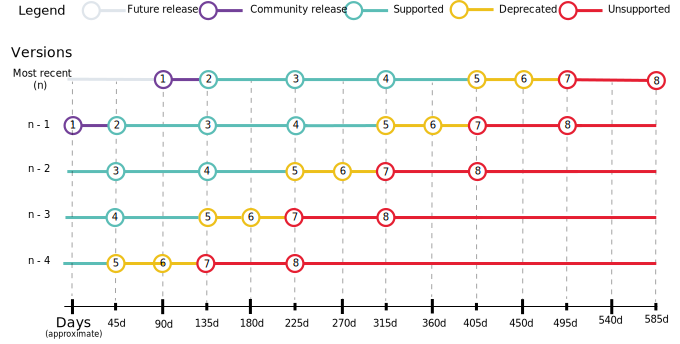
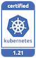
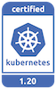

---

copyright:
  years: 2014, 2021
lastupdated: "2021-10-05"

keywords: kubernetes, iks, versions, update, upgrade

subcollection: containers

---

{{site.data.keyword.attribute-definition-list}}


# Kubernetes version information and update actions  
{: #cs_versions}

Review information about supported Kubernetes versions for {{site.data.keyword.containerlong}} clusters.
{: shortdesc}

For more information about the Kubernetes project versions, see the Kubernetes changelog.
* [Kubernetes 1.22 release notes](https://kubernetes.io/releases/notes/.){: external}
* [Kubernetes 1.21 release notes](https://v1-21.docs.kubernetes.io/releases/notes/){: external}
* [Kubernetes 1.20 release notes](https://v1-20.docs.kubernetes.io/docs/setup/release/notes/){: external}
* **Deprecated**: [Kubernetes 1.19 release notes](https://v1-19.docs.kubernetes.io/docs/setup/release/notes/){: external}
* **Deprecated**: [Kubernetes 1.18 release notes](https://v1-18.docs.kubernetes.io/docs/setup/release/notes/){: external}
* [Kubernetes changelogs](https://github.com/kubernetes/kubernetes/tree/master/CHANGELOG){: external}

## Update types
{: #update_types}

Your Kubernetes cluster has three types of updates: major, minor, and patch. As updates become available, you are notified when you view information about the cluster master or worker nodes, such as with the `ibmcloud ks cluster ls`, `cluster get`, `worker ls`, or `worker get` commands.
{: shortdesc}

|Update type|Examples of version labels|Updated by|Impact
|-----|-----|-----|-----|
|Major|1.x.x|You|Operation changes for clusters, including scripts or deployments.|
|Minor|x.21.x|You|Operation changes for clusters, including scripts or deployments.|
|Patch|x.x.4_1510|IBM and you|Kubernetes patches, as well as other {{site.data.keyword.cloud_notm}} Provider component updates such as security and operating system patches. IBM updates masters automatically, but you apply patches to worker nodes. See more about patches in the following section.|
{: caption="Impacts of Kubernetes updates" caption-side="top"}

<dl>
    <dt>Major and minor updates (1.x)</dt>
        <dd>First, [update your master node](/docs/containers?topic=containers-update#master) and then [update the worker nodes](/docs/containers?topic=containers-update#worker_node).
    <ul><li>You cannot update a Kubernetes master two or more minor versions ahead (n+2). For example, if your current master is version 1.19 and you want to update to 1.21, you must update to 1.20 first.</li>
    <li>Worker nodes cannot run a Kubernetes major or minor version that is greater than the masters. Additionally, your worker nodes can be only up to two versions behind the master version (<code>n-2</code>).</li>
    <li>If you use a <code>kubectl</code> CLI version that does not match at least the <code>major.minor</code> version of your clusters, you might experience unexpected results. Make sure to keep your Kubernetes cluster and <a href="/docs/containers?topic=containers-cs_cli_install#kubectl">CLI versions</a> up-to-date.
    <dt>Patch updates (x.x.4_1510)</dt>
        <dd>Changes across patches are documented in the [Version changelog](/docs/containers?topic=containers-changelog). Master patches are applied automatically, but you initiate worker node patches updates. Worker nodes can also run patch versions that are greater than the masters. As updates become available, you are notified when you view information about the master and worker nodes in the {{site.data.keyword.cloud_notm}} console or CLI, such as with the following commands: `ibmcloud ks cluster ls`, `cluster get`, `worker ls`, or `worker get`.<br>
    Patches can be for worker nodes, masters, or both.
    <ul><li><strong>Worker node patches</strong>: Check monthly to see whether an update is available, and use the <code>ibmcloud ks worker update</code> <a href="/docs/containers?topic=containers-kubernetes-service-cli#cs_worker_update">command</a> or the <code>ibmcloud ks worker reload</code> <a href="/docs/containers?topic=containers-kubernetes-service-cli#cs_worker_reload">command</a> to apply these security and operating system patches. During an update or reload, your worker node machine is reimaged, and data is deleted if not <a href="/docs/containers?topic=containers-storage_planning#persistent_storage_overview">stored outside the worker node</a>.</li>
    <li><strong>Master patches</strong>: Master patches are applied automatically over the course of several days, so a master patch version might show up as available before it is applied to your master. The update automation also skips clusters that are in an unhealthy state or have operations currently in progress. Occasionally, IBM might disable automatic updates for a specific master fix pack, as noted in the changelog, such as a patch that is only needed if a master is updated from one minor version to another. In any of these cases, you can choose to safely use the <code>ibmcloud ks cluster master update</code> <a href="/docs/containers?topic=containers-kubernetes-service-cli#cs_cluster_update">command</a> yourself without waiting for the update automation to apply.</li></ul></dd>
</dl>

## Kubernetes versions
{: #version_types}

{{site.data.keyword.containerlong_notm}} concurrently supports multiple versions of Kubernetes. When a latest version (`n`) is released, versions up to 2 behind (`n-2`) are supported. Versions more than 2 behind the latest (`n-3`) are first deprecated and then unsupported. For more information, see [Release lifecycle](#release_lifecycle).
{: shortdesc}

To continue receiving important security patch updates, make sure that your clusters run a supported Kubernetes version at all times. Deprecated clusters might not receive security updates.
{: important}

Review the supported versions of {{site.data.keyword.containerlong_notm}}. In the CLI, you can run `ibmcloud ks versions`.

**Supported Kubernetes versions**:
*   Latest: 1.22.2
*   Default: 1.20.11
*   Other: 1.21.5

**Deprecated and unsupported Kubernetes versions**:
*   Deprecated: 1.18.19
*   Unsupported: 1.5, 1.7, 1.8, 1.9, 1.10, 1.11, 1.12, 1.13, 1.14, 1.15, 1.16, 1.17


To check the server version of a cluster, log in to the cluster and run the following command.
```sh
kubectl version  --short | grep -i server
```
{: pre}

Example output
```
Server Version: v1.20.11+IKS
```
{: screen}

## Release history
{: #release-history}
{: help}
{: support}

The following table records {{site.data.keyword.containerlong_notm}} version release history. You can use this information for planning purposes, such as to estimate general time frames when a certain release might become unsupported. After the Kubernetes community releases a version update, the IBM team begins a process of hardening and testing the release for {{site.data.keyword.containerlong_notm}} environments. Availability and unsupported release dates depend on the results of these tests, community updates, security patches, and technology changes between versions. Plan to keep your cluster master and worker node version up-to-date according to the `n-2` version support policy.
{: shortdesc}

{{site.data.keyword.containerlong_notm}} was first generally available with Kubernetes version 1.5. Projected release or unsupported dates are subject to change. To go to the version update preparation steps, click the version number.

Dates that are marked with a dagger (`†`) are tentative and subject to change.
{: important}

|  Version | Supported? | {{site.data.keyword.containerlong_notm}}<br>release date | {{site.data.keyword.containerlong_notm}}<br>unsupported date |
|------|------|----------|----------|
| [1.22](#cs_v122) | Yes | 29 Sep 2021 |Sep 2022 `†` |
| [1.21](#cs_v121) | Yes | 09 Jun 2021 | Jun 2022 `†` |
| [1.20](#cs_v120) | Yes | 16 Feb 2021 | Feb 2022 `†` |
| [1.19](#cs_v119) | Deprecated | 13 Oct 2020 | 31 Dec 2021 `†` |
| [1.18](#cs_v118) | Deprecated | 11 May 2020 | 10 Oct 2021`†` |
{: caption="Release history for {{site.data.keyword.containerlong_notm}}" caption-side="top"}

Earlier versions of {{site.data.keyword.containerlong_notm}} are [unsupported](#k8s_version_archive).

## Release lifecycle
{: #release_lifecycle}

{{site.data.keyword.containerlong_notm}} concurrently supports select versions of community Kubernetes releases. When a latest community version is released, {{site.data.keyword.containerlong_notm}} deprecates its oldest supported version (`n-3`) and begins preparing to release the version of the community release.
{: shortdesc}

Each supported version of {{site.data.keyword.containerlong_notm}} goes through a lifecycle of testing, development, general release, support, deprecation, and becoming unsupported. Review the following diagram to understand how the community Kubernetes and {{site.data.keyword.cloud_notm}} provider version lifecycles interact across time.



Estimated days and versions are provided for general understanding. Actual availability and release dates are subject to change and depend on various factors, such as community updates, security patches, and technology changes between versions.
{: note}

1. The Kubernetes community releases version `n`. IBM engineers begin a process of testing and hardening the community version in preparation to release a supported {{site.data.keyword.containerlong_notm}} version.
2. Version `n` is released as the latest supported {{site.data.keyword.containerlong_notm}} version.
3. Version `n-1` becomes the default supported {{site.data.keyword.containerlong_notm}} version.
4. Version `n-2` becomes the oldest supported {{site.data.keyword.containerlong_notm}} version.
5. Version `n-3` is deprecated, and security patch updates might not be provided. Depending on the community release cycle and version testing, you have 45 days or less until the next phase of deprecation starts in step 6. During the deprecation period, your cluster is still functional, but might require updating to a supported release to fix security vulnerabilities. For example, you can add and reload worker nodes.
6. You receive a notification in the console and CLI that you have 45 days to update your cluster to a supported version before version `n` becomes unsupported. Similar to step 5, your cluster is still functional, but might require updating to a supported release to fix security vulnerabilities.
7. Version `n-4` is unsupported. Unsupported clusters are not provided with security and patch updates and are not supported by {{site.data.keyword.cloud_notm}} Support. Although your cluster and apps might continue to run for a time, you can no longer create, reload, or take other corrective actions on your cluster master or worker nodes when an issue occurs. You can still delete the cluster or worker nodes, or update the cluster to the next version. Review the potential impacts and immediately [update the cluster](/docs/containers?topic=containers-update#update) to continue receiving important security updates and support.
8. The cluster master runs two or more versions behind the oldest supported version. You cannot update the cluster. Delete the cluster, and create a new one.

If you wait until your cluster is two or more minor versions behind the oldest supported version, you cannot update the cluster. Instead, [create a new cluster](/docs/containers?topic=containers-clusters#clusters), [deploy your apps](/docs/containers?topic=containers-app#app) to the new cluster, and [delete](/docs/containers?topic=containers-remove) the unsupported cluster.<br><br>To avoid this issue, update deprecated clusters to a supported version less than two ahead of the current version, such as 1.20 or 1.21 and then update to the latest version, 1.22. If the worker nodes run a version two or more behind the master, you might see your pods fail by entering a state such as `MatchNodeSelector`, `CrashLoopBackOff`, or `ContainerCreating` until you update the worker nodes to the same version as the master. After you update from a deprecated to a supported version, your cluster can resume normal operations and continue receiving support.<br><br>You can find out whether your cluster is **unsupported** by reviewing the **State** field in the output of the `ibmcloud ks cluster ls` command or in the [{{site.data.keyword.containerlong_notm}} console](https://cloud.ibm.com/kubernetes/clusters){: external}.
{: important}


## Preparing to update
{: #prep-up}
This information summarizes updates that are likely to have impact on deployed apps when you update a cluster to a new version from the previous version. For a complete list of changes, review the [community Kubernetes changelogs](https://github.com/kubernetes/kubernetes/tree/master/CHANGELOG), [IBM version changelogs](/docs/containers?topic=containers-changelog){: external}, and [Kubernetes helpful warnings](https://kubernetes.io/blog/2020/09/03/warnings/){: external}.
{: shortdesc}

-  Version 1.22 [preparation actions](#cs_v122).
-  Version 1.21 [preparation actions](#cs_v121).
-  Version 1.20 [preparation actions](#cs_v120).
-  **Deprecated**: Version 1.19 [preparation actions](#cs_v119).
-  **Deprecated**: Version 1.18 [preparation actions](#cs_v118).
-  [Archive](#k8s_version_archive) of unsupported versions.


## Version 1.22
{: #cs_v122}

<p> {{site.data.keyword.containerlong_notm}} is a Certified Kubernetes product for version 1.22 under the CNCF Kubernetes Software Conformance Certification program. _Kubernetes® is a registered trademark of The Linux Foundation in the United States and other countries, and is used pursuant to a license from The Linux Foundation._</p>

Review changes that you might need to make when you update from the previous Kubernetes version to 1.22.
{: shortdesc}

### Update before master
{: #122_before}

The following table shows the actions that you must take before you update the Kubernetes master.
{: shortdesc}

| Type | Description|
| --- | --- |
| **Unsupported:**  Beta versions of `ValidatingWebhookConfiguration` and `MutatingWebhookConfiguration` APIs | Migrate manifests and API clients to use the `admissionregistration.k8s.io/v1` API version, available since Kubernetes version 1.16. For more information, see [Kubernetes API and Feature Removals In 1.22: Here’s What You Need To Know](https://kubernetes.io/blog/2021/07/14/upcoming-changes-in-kubernetes-1-22/){: external}. |
| **Unsupported:**  Beta version of `CustomResourceDefinition` API | Migrate manifests and API clients to use the `apiextensions.k8s.io/v1` API version, available since Kubernetes version 1.16. For more information, see [Kubernetes API and Feature Removals In 1.22: Here’s What You Need To Know](https://kubernetes.io/blog/2021/07/14/upcoming-changes-in-kubernetes-1-22/){: external}. |
| **Unsupported:**  Beta version of `APIService` API | Migrate manifests and API clients to use the `apiregistration.k8s.io/v1` API version, available since Kubernetes version 1.10. For more information, see [Kubernetes API and Feature Removals In 1.22: Here’s What You Need To Know](https://kubernetes.io/blog/2021/07/14/upcoming-changes-in-kubernetes-1-22/){: external}. |
| **Unsupported:**  Beta version of `TokenReview` API | Migrate manifests and API clients to use the `authentication.k8s.io/v1` API version, available since Kubernetes version 1.10. For more information, see [Kubernetes API and Feature Removals In 1.22: Here’s What You Need To Know](https://kubernetes.io/blog/2021/07/14/upcoming-changes-in-kubernetes-1-22/){: external}. |
| **Unsupported:**  Beta versions of `SubjectAccessReview`, `LocalSubjectAccessReview`, `SelfSubjectAccessReview` APIs | Migrate manifests and API clients to use the `authorization.k8s.io/v1` API version, available since Kubernetes version 1.6. For more information, see [Kubernetes API and Feature Removals In 1.22: Here’s What You Need To Know](https://kubernetes.io/blog/2021/07/14/upcoming-changes-in-kubernetes-1-22/){: external}. |
| **Unsupported:**  Beta version of `CertificateSigningRequest` API | Migrate manifests and API clients to use the `certificates.k8s.io/v1` API version, available since Kubernetes version 1.19. For more information, see [Kubernetes API and Feature Removals In 1.22: Here’s What You Need To Know](https://kubernetes.io/blog/2021/07/14/upcoming-changes-in-kubernetes-1-22/){: external}. |
| **Unsupported:**  Beta version of `Lease` API | Migrate manifests and API clients to use the `coordination.k8s.io/v1` API version, available since Kubernetes version 1.14. For more information, see [Kubernetes API and Feature Removals In 1.22: Here’s What You Need To Know](https://kubernetes.io/blog/2021/07/14/upcoming-changes-in-kubernetes-1-22/){: external}. |
| **Unsupported:**  Beta versions of `Ingress` API | Migrate manifests and API clients to use the `networking.k8s.io/v1` API version, available since Kubernetes version 1.19. For more information, see [Kubernetes API and Feature Removals In 1.22: Here’s What You Need To Know](https://kubernetes.io/blog/2021/07/14/upcoming-changes-in-kubernetes-1-22/){: external}. |
| **Unsupported:** IBM Cloud Kubernetes Ingress Controller | As of 1 Jun 2021, the IBM Cloud Kubernetes Ingress Controller is no longer supported on {{site.data.keyword.containerlong_notm}}. Migrate your IBM Cloud Kubernetes Ingress Controller based ALBs to the Kubernetes Ingress Controller. |
| Ingress | Kubernetes 1.22 supports Ingress and IngressClass resources with `networking.k8s.io/v1` version, which is only available on Kubernetes Ingress Controller version 1.0.0 and newer. Kubernetes Ingress Controller version 1.0.0 is supported on {{site.data.keyword.containerlong_notm}} cluster versions 1.19 or newer.<ul><li>**Cluster versions prior to 1.19**: Update your Ingress and IngressClass resources and Kubernetes clusters as soon as possible to avoid disruptions. For more information, review the migration guide.</li><li>**Cluster versions 1.19, 1.20, and 1.21**: Ingress and IngressClass resources that were created on clusters that run on Kubernetes versions 1.19, 1.20 or 1.21 and Ingress Controller version 1.0.0 are automatically updated during the cluster update to 1.22. The Kubernetes API Server dynamically manages the conversion from the earlier `extensions/v1beta1` and `networking.k8s.io/v1beta1` Ingresses to the new `networking.k8s.io/v1`.</li><li>**External Ingress resources**: For Ingress resources that are stored outside of Kubernetes clusters, such as in a version control system or any other external storage, the `extensions/v1beta1` and `networking.k8s.io/v1beta1` descriptors cannot be used with Kubernetes 1.22. Convert these descriptors to `networking.k8s.io/v1` Ingresses and IngressClasses.</li><li> If you have ALB auto updates enabled, you don't need to manually update your ALBs.</li><li> If you have ALB auto updates disabled, you must update your Kubernetes Ingress Controller based ALBs to a supported 0.4.x version before updating to 1.0.0 or newer. To check your auto update settings, run the ibmcloud ks ingress alb autoupdate get command.</li><li>**ALB OAuth-Proxy add-on**: `networking.k8s.io/v1beta1` is compatible with ALB OAuth-Proxy add-on version 2.0.0 only. If you use the ALB OAuth-Proxy add-on you must update the add-on to version 2.0.0 before updating your cluster to 1.22.</li></ul> |
| **Unsupported:** Service `service.alpha.kubernetes.io/tolerate-unready-endpoints` annotation | Services no longer support the `service.alpha.kubernetes.io/tolerate-unready-endpoints` annotation. The annotation has been deprecated since Kubernetes version 1.11 and has been replaced by the `Service` `spec.publishNotReadyAddresses` field. If your services rely on this annotation, update them to use the `spec.publishNotReadyAddresses` field instead. For more information on this field, see [DNS for Services and Pods](https://kubernetes.io/docs/concepts/services-networking/dns-pod-service/){: external} |
{: caption="Changes to make before you update the master to Kubernetes 1.22" caption-side="top"}
{: summary="The rows are read from left to right. The type of update action is in the first column, and a description of the update action type is in the second column."}

### Update after master
{: #122_after}

The following table shows the actions that you must take after you update the Kubernetes master.
{: shortdesc}

| Type | Description|
| --- | --- |
| **Unsupported:**  `kubectl autoscale` removed deprecated flag | The `kubectl austoscale` command removes the deprecated `--generator` flag. If your scripts rely on this flag, update them. |
| **Unsupported:** `kubectl create deployment` removed deprecated flag | The `kubectl create deployment` command removes the deprecated `--generator` flag. If your scripts rely on this flag, update them. |
| Fix how nulls are handled in array and objects in json patches | In prior releases, using `kubectl` to modify a resource resulted in the loss of the "null" values in arrays. This bug fix maintains the null entries in arrays. |
| `system:aggregate-to-edit` role | The `system:aggregate-to-edit` role no longer includes write access to the Endpoints API. Existing clusters that are upgraded to Kubernetes 1.22 are not impacted. However, in new Kubernetes 1.22 clusters, the edit and admin roles do not have write access to the Endpoints API. For instructions to retain this access in the aggregated edit and admin roles in newly created 1.22 clusters, refer to https://github.com/kubernetes/website/pull/29025. |
{: caption="Changes to make after you update the master to Kubernetes 1.22" caption-side="top"}
{: summary="The rows are read from left to right. The type of update action is in the first column, and a description of the update action type is in the second column."}


## Version 1.21
{: #cs_v121}

<p> {{site.data.keyword.containerlong_notm}} is a Certified Kubernetes product for version 1.21 under the CNCF Kubernetes Software Conformance Certification program. _Kubernetes® is a registered trademark of The Linux Foundation in the United States and other countries, and is used pursuant to a license from The Linux Foundation._</p>

Review changes that you might need to make when you update from the previous Kubernetes version to 1.21.
{: shortdesc}

There is a known issue when updating an existing classic cluster to version 1.21. If your classic cluster has both private and public service endpoints enabled, but you do not have both VRF and Service Endpoint enabled in your account, do not update to 1.21. For more information, see [After upgrading my classic cluster to version 1.21, I'm finding connectivity issues](/docs/containers?topic=containers-ts-network-classic121).
{: note}

### Update before master
{: #121_before}

The following table shows the actions that you must take before you update the Kubernetes master.
{: shortdesc}

| Type | Description|
| --- | --- |
| `kubectl exec` session timeout | For kubectl version 1.21, there is a known issue where failed `kubectl exec` commands do not automatically time out. Update your `kubectl client` to use version 1.20 instead. |
| **Unsupported**: Kubernetes REST API `export` query parameter removed | The `export` query parameter is removed from the Kubernetes REST API and now returns a `400` error status response. If you use this query parameter, remove it from your API requests. |
| **Unsupported**: Kubernetes external IP services | The Kubernetes [DenyServiceExternalIPs admission controller](https://kubernetes.io/docs/reference/access-authn-authz/admission-controllers/#denyserviceexternalips){: external} is enabled, which prevents creating or updating Kubernetes external IP services. If you use Kubernetes external IP services, migrate to a supported service type. For more information, see the [IBM security bulletin](https://www.ibm.com/support/pages/node/6428013){: external}. |
| Kubernetes snapshot CRDs | {{site.data.keyword.containerlong_notm}} installs Kubernetes snapshot custom resource definition (CRD) version `v1beta1`. If you use other Kubernetes snapshot CRD versions `v1` or `v1alpha1`, you must change the version to `v1beta1`. To check the currently installed version of your snapshot CRDs, run `grep snapshot.storage.k8s.io <<(kubectl get apiservices)`. Follow the Kubernetes documentation to [Upgrade from v1alpha1 to v1beta1](https://github.com/kubernetes-csi/external-snapshotter#upgrade-from-v1alpha1-to-v1beta1){: external} to make sure that your snapshot CRDs are at the correct `v1beta1` version. The steps to downgrade from version `v1` to `v1beta1` are the same as those to upgrade from `v1alpha1`. Do not follow the instructions to upgrade from version `v1beta1` to version `v1`. |
| OpenVPN replaced by Konnectivity | [Konnectivity](https://kubernetes.io/docs/tasks/extend-kubernetes/setup-konnectivity/){: external} replaces OpenVPN as the network proxy that is used to secure the communication of the Kubernetes API server master to worker nodes in the cluster. If your apps rely on the OpenVPN implementation of Kubernetes master to worker node communication, update them to support [Konnectivity](https://kubernetes.io/docs/tasks/extend-kubernetes/setup-konnectivity/){: external}. |
| Pod access via service account token | For clusters that run Kubernetes 1.21 and later, the service account tokens that pods use to communicate with the Kubernetes API server are time-limited, automatically refreshed, scoped to a particular audience of users (the pod), and invalidated after the pod is deleted. To continue communicating with the API server, you must design your apps to read the refreshed token value on a regular basis, such as every minute. For applications that invoke the `setuid` internally, you must [manually set the `fsGroup` in the pod security context](https://kubernetes.io/docs/tasks/configure-pod-container/security-context/#set-the-security-context-for-a-pod){: external}. For more information, see [Bound Service Account Tokens](https://github.com/kubernetes/enhancements/blob/master/keps/sig-auth/1205-bound-service-account-tokens/README.md){: external}. |
| **Unsupported:** Service `service.alpha.kubernetes.io/tolerate-unready-endpoints` annotation | Services no longer support the `service.alpha.kubernetes.io/tolerate-unready-endpoints` annotation. The annotation has been deprecated since Kubernetes version 1.11 and has been replaced by the `Service` `spec.publishNotReadyAddresses` field. If your services rely on this annotation, update them to use the `spec.publishNotReadyAddresses` field instead. For more information on this field, see [DNS for Services and Pods](https://kubernetes.io/docs/concepts/services-networking/dns-pod-service/){: external} |
{: caption="Changes to make before you update the master to Kubernetes 1.21" caption-side="top"}
{: summary="The rows are read from left to right. The type of update action is in the first column, and a description of the update action type is in the second column."}

### Update after master
{: #121_after}

The following table shows the actions that you must take after you update the Kubernetes master.
{: shortdesc}

| Type | Description|
| --- | --- |
| **Unsupported:** `kubect alpha debug` removed | The `kubectl alpha debug` command is removed. Instead, use the `kubectl debug` command. |
| **Unsupported:** `kubectl run` removed deprecated flags | The `kubectl run` command removes the following deprecated flags: `--generator`, `--replicas`, `--service-generator`, `--service-overrides` and `--schedule`. If your scripts use `kubectl run` to create resources other than pods, such as deployments, or if your scripts use the removed flags, update the scripts to use the `kubectl create` or `kubectl apply` commands instead. |
| `kubectl get` removes `managedFields` by default  | Now, the `kubectl get` command omits `managedFields` in the `-o json` or `-o yaml` output by default. If you use `kubectl get` to retrieve `managedFields` by using `-o json` or `-o yaml` output, update your `kubectl get` calls to include the `--show-managed-fields=true` flag.  |
| **Unsupported**: Select `kubelet` metrics | The following cAdvisor `kubelet` metrics are removed: `/stats/container`, `/stats/<pod_name>/<container_name>`, and `/stats/<namespace>/<pod_name>/<pod_uid>/<container_name>`. Stop using these metrics. |
| Ingress resource API version | The support for `networking.k8s.io/v1beta1` and `extensions/v1beta1` API versions in Ingress resources are deprecated and are planned for removal in Kubernetes version 1.22. The `networking.k8s.io/v1` API version is supported instead. Although not required in version 1.21, you can begin converting your existing resources in preparation for the removal of the API versions before version 1.22. |
{: caption="Changes to make after you update the master to Kubernetes 1.21" caption-side="top"}
{: summary="The rows are read from left to right. The type of update action is in the first column, and a description of the update action type is in the second column."}


## Version 1.20
{: #cs_v120}

<p> {{site.data.keyword.containerlong_notm}} is a Certified Kubernetes product for version 1.20 under the CNCF Kubernetes Software Conformance Certification program. _Kubernetes® is a registered trademark of The Linux Foundation in the United States and other countries, and is used pursuant to a license from The Linux Foundation._</p>

Review changes that you might need to make when you update from the previous Kubernetes version to 1.20.
{: shortdesc}

### Update before master
{: #120_before}

The following table shows the actions that you must take before you update the Kubernetes master.
{: shortdesc}

| Type | Description|
| --- | --- |
| Kubernetes snapshot CRDs | {{site.data.keyword.containerlong_notm}} installs Kubernetes snapshot custom resource definition (CRD) version `v1beta1`. If you use other Kubernetes snapshot CRD versions `v1` or `v1alpha1`, you must change the version to `v1beta1`. To check the currently installed version of your snapshot CRDs, run `grep snapshot.storage.k8s.io <<(kubectl get apiservices)`. Follow the Kubernetes documentation to [Upgrade from v1alpha1 to v1beta1](https://github.com/kubernetes-csi/external-snapshotter#upgrade-from-v1alpha1-to-v1beta1){: external} to make sure that your snapshot CRDs are at the correct `v1beta1` version. The steps to downgrade from version `v1` to `v1beta1` are the same as those to upgrade from `v1alpha1`. Do not follow the instructions to upgrade from version `v1beta1` to version `v1`. |
| **Unsupported:** Open access to the Kubernetes Dashboard metrics scraper | A Kubernetes network policy is added to protect access to the Kubernetes Dashboard metrics scraper. If a pod requires access to the dashboard metrics scraper, deploy the pod in a namespace that has the `dashboard-metrics-scraper-policy: allow` label. For more information, see [Controlling traffic with network policies](/docs/containers?topic=containers-network_policies). |
| Pod exec probe timeout handling | [Pod exec probes now honor the `timeoutSeconds` field](https://kubernetes.io/blog/2020/12/08/kubernetes-1-20-release-announcement/#exec-probe-timeout-handling){: external}. If an exec probe does not set the `timeoutSeconds` field, the default of `1` second is used. If the default value is not sufficient for your app, update the pod exec probe.|
| Resolve non-deterministic behavior of owner references | Kubernetes garbage collector is updated to resolve non-deterministic behavior of owner references. Before you update your cluster, review the [Kubernetes community recommendation](https://github.com/kubernetes/kubernetes/blob/master/CHANGELOG/CHANGELOG-1.20.md#urgent-upgrade-notes){: external} that you run the [kubectl-check-ownerreferences](https://github.com/kubernetes-sigs/kubectl-check-ownerreferences){: external} tool to locate existing objects with invalid owner references. |
| VPC clusters: App URL character length | DNS resolution is managed by the cluster's [virtual private endpoint (VPE)](/docs/containers?topic=containers-vpc-subnets#vpc_basics_vpe), which can resolve URLs up to 130 characters. If you expose apps in your cluster with URLs, such as the Ingress subdomain, ensure that the URLs are 130 characters or fewer. |
{: caption="Changes to make before you update the master to Kubernetes 1.20" caption-side="top"}
{: summary="The rows are read from left to right. The type of update action is in the first column, and a description of the update action type is in the second column."}

### Update after master
{: #120_after}

The following table shows the actions that you must take after you update the Kubernetes master.
{: shortdesc}

| Type | Description|
| --- | --- |
| **Unsupported:** `kubectl autoscale --generator` removed | The deprecated `--generator` flag is removed from the `kubectl autoscale` command. If your scripts rely on this flag, update them. |
{: caption="Changes to make after you update the master to Kubernetes 1.20" caption-side="top"}
{: summary="The rows are read from left to right. The type of update action is in the first column, and a description of the update action type is in the second column."}


## Deprecated: Version 1.19
{: #cs_v119}

<p> {{site.data.keyword.containerlong_notm}} is a Certified Kubernetes product for version 1.19 under the CNCF Kubernetes Software Conformance Certification program. _Kubernetes® is a registered trademark of The Linux Foundation in the United States and other countries, and is used pursuant to a license from The Linux Foundation._</p>

Kubernetes version 1.19 is deprecated, with a tentative unsupported date of 31 Dec 2021. Update your cluster to at least [version 1.20](#cs_v120) as soon as possible.
{: deprecated}

Review changes that you might need to make when you update from the previous Kubernetes version to 1.19.
{: shortdesc}

### Update before master
{: #119_before}

The following table shows the actions that you must take before you update the Kubernetes master.
{: shortdesc}

| Type | Description|
| ---- | ---------- |
| Calico data store driver change | When you update your cluster to version 1.19, Calico is updated to use the Kubernetes data store driver (KDD). During the update, you can request resources that require Calico, such as pods that are subject to Calico policies, but the resources remain pending until the update is complete.  \n - Before the update, you must delete any `NetworkPolicy` resources that are scoped to namespaces that no longer exist. When you delete a namespace, Kubernetes cleans up all resources that are associated with that namespace. However, resources that you created for Calico by using the `calicoctl` CLI, such as `NetworkPolicy` resources that you scoped to that namespace, are not cleaned up and remain in your cluster even after the namespace is deleted. To find and delete any of these policies, list all `NetworkPolicy` resources by running `calicoctl get NetworkPolicy -A -o wide`. In the output, check if the namespace for each policy still exists in your cluster. You can list existing namespaces by running `kubectl get namespaces`. If any policy is scoped to a non-existent namespace, delete the policy by running `calicoctl delete networkpolicy &lt;policy_name&gt; -n &lt;namespace&gt;`.  \n - As part of the update to KDD and going forward, access to the `etcd` port in the cluster master is blocked. If you use the `etcd` port, such as in firewall rules or Calico policies that allow worker nodes to access `etcd`, update these resources to use the `apiserver` port instead. To get the `apiserver` port, run `ibmcloud ks cluster get -c &lt;cluster_name_or_ID&gt;` and look for the node port that is listed for the **Master URL**.  \n - Complete the steps in [Releasing individual IP addresses](/docs/containers?topic=containers-ts-app-container-start#individual-ips) to ensure that any pod IP addresses that are incorrectly detected as in use by the Calico IP address manager (IPAM) are released. |
| **Unsupported:** CoreDNS `federations` plug-in | CoreDNS version 1.7 and later no longer support the `federations` plug-in. If you customized your CoreDNS configuration to use this plug-in, you must remove the plug-in and any related configurations before updating. For more information about updating your CoreDNS configuration, see [Customizing the cluster DNS provider](/docs/containers?topic=containers-cluster_dns#dns_customize). |
| **Unsupported:** Select CoreDNS metrics | CoreDNS version 1.7 and later [metrics changed](https://coredns.io/2020/06/15/coredns-1.7.0-release/#metric-changes){: external}. If you rely on these changed metrics, update accordingly. For example, you might update a Prometheus query of CoreDNS metrics to handle both the old and new metrics. |
| **Unsupported:** Select Kubernetes API server metrics | The following Kubernetes API service metric label names for `kubernetes_build_info` changed. These metrics, available via the `/metrics` endpoint, changed as follows. If you rely on these changed metrics, update accordingly.  \n - From `gitVersion` to `git_version`  \n - From `gitCommit` to `git_commit`  \n - From `gitTreeState` to `git_tree_state`  \n - From `buildDate` to `build_date`  \n - From `goVersion` to `go_version`. |
{: caption="Changes to make before you update the master to Kubernetes 1.19" caption-side="top"}
{: summary="The rows are read from left to right. The type of update action is in the first column, and a description of the update action type is in the second column."}

### Update after master
{: #119_after}

The following table shows the actions that you must take after you update the Kubernetes master.
{: shortdesc}

| Type | Description|
| ---- | ---------- |
| Calico data store driver change | When you update your cluster to version 1.19, Calico is updated to use Kubernetes data store driver (KDD). If you have any automation that depends on the Calico configuration file for your cluster, first download the new KDD-based Calico configuration file by running `ibmcloud ks cluster config -c <cluster_name_or_ID> --network`. Then, update your automation to use the new Calico configuration file. Additionally, because worker nodes can no longer access etcd with admin keys, ensure that you update your worker nodes so that the previous etcd secrets are removed. |
| Certificate signing request (CSR) | The `CertificateSigningRequest` API is promoted to `certificates.k8s.io/v1`. You can use the `CertificateSigningRequest` API to generate server certificates that are signed by the cluster certificate authority (CA) for TLS communication within the cluster. For more details, see the [Kubernetes version 1.19 changelog](https://github.com/kubernetes/kubernetes/blob/master/CHANGELOG/CHANGELOG-1.19.md#api-change-1){: external} and [Kubernetes CSR documentation](https://kubernetes.io/docs/reference/access-authn-authz/certificate-signing-requests/){: external}. If you are currently using the `v1beta CertificateSigningRequest` API, make the following changes before you update to `v1`. For an example, see [Manage TLS Certificates in a Cluster](https://kubernetes.io/docs/tasks/tls/managing-tls-in-a-cluster/){: external}.  \n - The Kubernetes `CertificateSigningRequest` API includes a mandatory `signerName` field. Use `kubernetes.io/kubelet-serving` when you create server certificates.  \n - The CSR subjects must include `organizations` that are exactly `["system:nodes"]`.  \n - The CSR common name must start with `system:node:`.  \n - The CSR subject alternative names must include the service or pod DNS hosts names and IP addresses that are used to connect to the server.|
| CoreDNS pod autoscaling configuration | Kubernetes DNS autoscaler configuration is updated to include unschedulable worker nodes in scaling calculations. To improve cluster DNS availability, you can set the `"includeUnschedulableNodes":true` parameter when [Autoscaling the cluster DNS provider](/docs/containers?topic=containers-cluster_dns#dns_autoscale). |
| Ingress resource fields | In the Ingress resource definition, several fields are changed, including the API version, service name, and service port, and added the `pathType` field. To update your Ingress resources to the new format, see the example YAML file in the documentation for the [community Kubernetes Ingress setup](/docs/containers?topic=containers-ingress-types#alb-comm-create). |
| Kubernetes `seccomp` support graduates to general availability (GA) | The support for `seccomp.security.alpha.kubernetes.io/pod` and `container.seccomp.security.alpha.kubernetes.io/...` annotations are now deprecated, and are planned for removal in Kubernetes version 1.22. A `seccompProfile` field is now added to the pod and container `securityContext` objects. The Kubernetes version skew handling automatically converts the new field into the annotations and vice versa. You do not have to change your existing workloads, but you can begin the conversion in preparation for the removal of the annotations before version 1.22. For more information, see [Configure a Security Context for a Pod or Container](https://kubernetes.io/docs/tasks/configure-pod-container/security-context/){: external}. |
| **Unsupported:** `kubectl apply --server-dry-run` removed | The deprecated `--server-dry-run` flag is removed from the `kubectl apply` command. If your scripts rely on this flag, update them to use the `--dry-run=server` flag instead. |
| **Unsupported:** `kubectl get --export` removed | The deprecated `--export` flag is removed from the `kubectl get` command. If your scripts rely on this flag, refer to the [Deprecate --export flag from get command pull request](https://github.com/kubernetes/kubernetes/pull/73787){: external} issue for discussion and references to scripts that handle various use cases. |
| `kubectl --output jsonpath` format changes  | The `kubectl get` `--o jsonpath` (or `-o jsonpath`) option now returns a JSON object for complex types such as structs, arrays, and slices. Previously, the option returned output in `go` format. If you use `kubectl get` to retrieve such fields using `--output jsonpath`, update your scripts to handle JSON objects. You might try using the `-o go-template` option to maintain compatibility with the previous behavior. |
| Temporary `kubectl` latency | RBAC operations are now performed asynchronously. After you run `ibmcloud ks cluster config` for the first time after the update, `kubectl` commands might fail for a few seconds while RBAC synchronizes for the first time. Afterward, `kubectl` commands perform as expected. If you use automation to access the cluster with `kubectl` commands, add retry logic for `kubectl` commands after a `kubeconfig` file is successfully retrieved. |
| **Unsupported:** Select `kubelet` metrics | The following `kubelet` metrics that were available via the `/metrics` and `/metrics/resource` endpoints are unsupported and removed. If you use any of these removed and deprecated `kubelet` metrics, change to use the available replacement metric.  \n - From `kubelet_running_container_count` to `kubelet_running_containers`  \n - From `kubelet_running_pod_count` to `kubelet_running_pods`  \n - From `node_cpu_usage_seconds` to `node_cpu_usage_seconds_total`  \n - From `container_cpu_usage_seconds` to `container_cpu_usage_seconds_total`. |
| **Unsupported:** Select `kube-proxy` metrics | The following `kube-proxy` metric label names for `kubernetes_build_info`, available via the `/metrics` endpoint, are changed. If you rely on these changed metrics, update accordingly.  \n - From `gitVersion` to `git_version`  \n - From `gitCommit` to `git_commit`  \n - From `gitTreeState` to `git_tree_state`  \n - From `buildDate` to `build_date`  \n - From `goVersion` to `go_version` |
{: caption="Changes to make after you update the master to Kubernetes 1.19" caption-side="top"}
{: summary="The rows are read from left to right. The type of update action is in the first column, and a description of the update action type is in the second column."}

### Update after worker nodes
{: #119_after_worker}

The following table shows the actions that you must take after you update your worker nodes.
{: shortdesc}

| Type | Description|
| ---- | ---------- |
| **Deprecated:** Beta worker node labels | The following beta worker node labels are deprecated and replaced. For now, both sets of labels are supported, but update your workloads to use the new labels, such as in affinity rules for deployments.  \n - From `beta.kubernetes.io/os` to `kubernetes.io/os`  \n - From `beta.kubernetes.io/arch` to `kubernetes.io/arch`  \n - From `failure-domain.beta.kubernetes.io/zone` to `topology.kubernetes.io/zone`  \n - From `failure-domain.beta.kubernetes.io/region` to `topology.kubernetes.io/region`  \n - From `beta.kubernetes.io/instance-type` to `node.kubernetes.io/instance-type` |
{: caption="Changes to make after you update the worker nodes to Kubernetes 1.19" caption-side="top"}
{: summary="The rows are read from left to right. The type of update action is in the first column, and a description of the update action type is in the second column."}


## Deprecated: Version 1.18
{: #cs_v118}

<p> {{site.data.keyword.containerlong_notm}} is a Certified Kubernetes product for version 1.18 under the CNCF Kubernetes Software Conformance Certification program. _Kubernetes® is a registered trademark of The Linux Foundation in the United States and other countries, and is used pursuant to a license from The Linux Foundation._</p>

Review changes that you might need to make when you update from the previous Kubernetes version to 1.18.
{: shortdesc}

Kubernetes version 1.18 is deprecated, with a tentative unsupported date of 10 October 2021. Update your cluster to at least [version 1.19](#cs_v119) as soon as possible.
{: deprecated}

### Update before master
{: #118_before}

The following table shows the actions that you must take before you update the Kubernetes master.
{: shortdesc}

| Type | Description|
| --- | --- |
| Add-ons and plug-ins | For each add-on and plug-in that you installed in your cluster, check for any impacts that might be caused by updating the cluster version. For instructions, see [Steps to update the cluster master](/docs/containers?topic=containers-update#master-steps) and refer to the add-on and plug-in documentation. |
| **Unsupported:** CoreDNS `federations` plug-in | CoreDNS version 1.7 and later no longer support the `federations` plug-in. If you customized your CoreDNS configuration to use this plug-in, you must remove the plug-in and any related configurations before updating. For more information about updating your CoreDNS configuration, see [Customizing the cluster DNS provider](/docs/containers?topic=containers-cluster_dns#dns_customize). |
| **Unsupported:** Select CoreDNS metrics | CoreDNS version 1.7 and later [metrics changed](https://coredns.io/2020/06/15/coredns-1.7.0-release/#metric-changes){: external}. If you rely on these changed metrics, update accordingly. For example, you might update a Prometheus query of CoreDNS metrics to handle both the old and new metrics. |
| **Unsupported:** Select `kubelet` metrics | The following `kubelet` metrics that were available via the `/metrics` endpoint are unsupported and removed. If you use any of these [removed and deprecated kubelet metrics](https://kubernetes.io/releases/notes/#client-go){: external}, change to use the available replacement metric: `kubelet_cgroup_manager_latency_microseconds`, `kubelet_cgroup_manager_latency_microseconds_count`, `kubelet_cgroup_manager_latency_microseconds_sum`, `kubelet_pleg_relist_interval_microseconds`, `kubelet_pleg_relist_interval_microseconds_count`, `kubelet_pleg_relist_interval_microseconds_sum`, `kubelet_pleg_relist_latency_microseconds`, `kubelet_pleg_relist_latency_microseconds_count`, `kubelet_pleg_relist_latency_microseconds_sum`, `kubelet_pod_start_latency_microseconds`, `kubelet_pod_start_latency_microseconds_count`, `kubelet_pod_start_latency_microseconds_sum`, `kubelet_pod_worker_latency_microseconds`, `kubelet_pod_worker_latency_microseconds_count`, `kubelet_pod_worker_latency_microseconds_sum`, `kubelet_pod_worker_start_latency_microseconds`, `kubelet_pod_worker_start_latency_microseconds_count`, `kubelet_pod_worker_start_latency_microseconds_sum`, `kubelet_runtime_operations`, `kubelet_runtime_operations_errors`, `kubelet_runtime_operations_latency_microseconds`, `kubelet_runtime_operations_latency_microseconds_count`, `kubelet_runtime_operations_latency_microseconds_sum` |
| **Unsupported:** Kubernetes API `batch/v2alpha1` | Kubernetes API `batch/v2alpha1` is no longer supported. If your apps rely on this API, update them to use `batch/v1beta1` instead. |
{: caption="Changes to make before you update the master to Kubernetes 1.18" caption-side="top"}
{: summary="The rows are read from left to right. The type of update action is in the first column, and a description of the update action type is in the second column."}

### Update after master
{: #118_after}

The following table shows the actions that you must take after you update the Kubernetes master.
{: shortdesc}

| Type | Description|
| --- | --- |
| Registry image pull secret includes all domains | Previously, separate image pull secrets were created for each regional, public `icr.io` registry domain to enable your cluster to [pull images from {{site.data.keyword.registrylong_notm}}](/docs/containers?topic=containers-registry#cluster_registry_auth). Now, all the public and private `icr.io` registry domains for all regions are stored in a single `all-icr-io` image pull secret that is automatically created in the `default` namespace. Update your apps to use the new single `all-icr-io` image pull secret. |
| `kubectl diff` return code | The [`kubectl diff` command](https://kubernetes.io/docs/reference/generated/kubectl/kubectl-commands#diff){: external} now returns `0` when no differences are found, `1` when differences are found, and greater than `1` when an error occurs. If your scripts rely on the previous return code behavior, update them. |
| `kubectl get` includes `managedFields` | The [Server Side Apply](https://kubernetes.io/docs/reference/using-api/api-concepts/#server-side-apply){: external} feature adds the `managedFields` field that is part of a resource's `metadata`.  If your scripts use `grep`, `awk`, or similar commands to parse the output of the `kubectl get` command, update your scripts to handle the addition of `managedFields`. For example, you might select fields by using the `kubectl get <resource> -o jsonpath` command or by using the [`jq` package](https://stedolan.github.io/jq/){: external} to parse the JSON output from the `kubectl get <resource> -o json` command. |
| **Unsupported:** `kubectl rolling-update` | The `kubectl rolling-update` command is removed. If your scripts rely on this command, update them to use the [`kubectl rollout` command](https://kubernetes.io/docs/reference/generated/kubectl/kubectl-commands#rollout){: external} instead. |
| **Unsupported:** `kubectl run` removed deprecated flags | The [`kubectl run` command](https://kubernetes.io/docs/reference/generated/kubectl/kubectl-commands#run){: external} removed deprecated flags that are not used to create pods. If your scripts use `kubectl run` to create resources other than pods, such as deployments, update them to use the `kubectl create` or `kubectl apply` commands instead. |
| Kubernetes `Go` client updates | The Kubernetes `Go` client, `k8s.io/client-go` version 0.18.0 and later, is updated.  Signatures on methods in generated `clientsets`, `dynamic`, `metadata`, and `scale` clients are modified to accept `context.Context` as a first argument. Signatures of `Create`, `Update`, and `Patch` methods are updated to accept `CreateOptions`, `UpdateOptions` and `PatchOptions`. Signatures of `Delete` and `DeleteCollection` methods now accept `DeleteOptions` by value instead of by reference. Generated `clientsets` with the previous interface are added in new `deprecated` packages to allow incremental migration to the new APIs. The `deprecated` packages are scheduled to be removed in the Kubernetes version 1.21 release. For help to rewrite method invocations with the new signatures, try the [`clientgofix` tool](http://sigs.k8s.io/clientgofix){: external}. |
| Temporary `kubectl` latency | RBAC operations are now performed asynchronously. After you run `ibmcloud ks cluster config` for the first time after the update, `kubectl` commands might fail for a few seconds while RBAC synchronizes for the first time. Afterward, `kubectl` commands perform as expected. If you use automation to access the cluster with `kubectl` commands, add retry logic for `kubectl` commands after a `kubeconfig` file is successfully retrieved. |
| **Unsupported**: `kubelet` statistics | The `kubelet` statistics that were available via the `/stats` endpoint are unsupported and removed. The cluster insights panel in the cluster console no longer reports statistics from this endpoint. |
{: caption="Changes to make after you update the master to Kubernetes 1.18" caption-side="top"}
{: summary="The rows are read from left to right. The type of update action is in the first column, and a description of the update action type is in the second column."}

### Update after worker nodes
{: #118_after_worker}

The following table shows the actions that you must take after you update your worker nodes.
{: shortdesc}

| Type | Description|
| --- | --- |
| Format of the `CPUManager` state file | The format of the [`CPUManager`](https://kubernetes.io/docs/tasks/administer-cluster/cpu-management-policies/){: external} state file is changed. Update any tools that rely on previous format. |
{: caption="Changes to make after you update the worker nodes to Kubernetes 1.18" caption-side="top"}
{: summary="The rows are read from left to right. The type of update action is in the first column, and a description of the update action type is in the second column."}


## Archive
{: #k8s_version_archive}

Find an overview of Kubernetes versions that are unsupported in {{site.data.keyword.containerlong_notm}}.
{: shortdesc}

### Version 1.17 (Unsupported)
{: #cs_v117}

As of 2 July 2021, {{site.data.keyword.containerlong_notm}} clusters that run [Kubernetes version 1.17](/docs/containers?topic=containers-changelog_archive) are unsupported.
{: shortdesc}

Unsupported clusters are not provided with security and patch updates and are not supported by {{site.data.keyword.cloud_notm}} Support. Although your cluster and apps might continue to run for a time, you can no longer create, reload, or take other corrective actions on your cluster master or worker nodes when an issue occurs. You can still delete the cluster or worker nodes, or update the cluster to the next version. Review the potential impacts and immediately [update the cluster](/docs/containers?topic=containers-update#update) to continue receiving important security updates and support.

### Version 1.16 (Unsupported)
{: #cs_v116}

As of 31 January 2021, {{site.data.keyword.containerlong_notm}} clusters that run [Kubernetes version 1.16](/docs/containers?topic=containers-changelog_archive) are unsupported.
{: shortdesc}

Unsupported clusters are not provided with security and patch updates and are not supported by {{site.data.keyword.cloud_notm}} Support. Although your cluster and apps might continue to run for a time, you can no longer create, reload, or take other corrective actions on your cluster master or worker nodes when an issue occurs. You can still delete the cluster or worker nodes. To continue running your apps in {{site.data.keyword.containerlong_notm}}, [make a new cluster](/docs/containers?topic=containers-clusters#clusters) and [deploy your apps](/docs/containers?topic=containers-app#app) to the new cluster.

### Version 1.15 (Unsupported)
{: #cs_v115}

As of 22 September 2020, {{site.data.keyword.containerlong_notm}} clusters that run [Kubernetes version 1.15](/docs/containers?topic=containers-changelog_archive) are unsupported.
{: shortdesc}

Unsupported clusters are not provided with security and patch updates and are not supported by {{site.data.keyword.cloud_notm}} Support. Although your cluster and apps might continue to run for a time, you can no longer create, reload, or take other corrective actions on your cluster master or worker nodes when an issue occurs. You can still delete the cluster or worker nodes. To continue running your apps in {{site.data.keyword.containerlong_notm}}, [make a new cluster](/docs/containers?topic=containers-clusters#clusters) and [deploy your apps](/docs/containers?topic=containers-app#app) to the new cluster.

### Version 1.14 (Unsupported)
{: #cs_v114}

As of 31 May 2020, {{site.data.keyword.containerlong_notm}} clusters that run [Kubernetes version 1.14](/docs/containers?topic=containers-changelog_archive) are unsupported.
{: shortdesc}

Unsupported clusters are not provided with security and patch updates and are not supported by {{site.data.keyword.cloud_notm}} Support. Although your cluster and apps might continue to run for a time, you can no longer create, reload, or take other corrective actions on your cluster master or worker nodes when an issue occurs. You can still delete the cluster or worker nodes. To continue running your apps in {{site.data.keyword.containerlong_notm}}, [make a new cluster](/docs/containers?topic=containers-clusters#clusters) and [deploy your apps](/docs/containers?topic=containers-app#app) to the new cluster.

### Version 1.13 (Unsupported)
{: #cs_v113}

As of 22 February 2020, {{site.data.keyword.containerlong_notm}} clusters that run [Kubernetes version 1.13](/docs/containers?topic=containers-changelog_archive) are unsupported.
{: shortdesc}

Unsupported clusters are not provided with security and patch updates and are not supported by {{site.data.keyword.cloud_notm}} Support. Although your cluster and apps might continue to run for a time, you can no longer create, reload, or take other corrective actions on your cluster master or worker nodes when an issue occurs. You can still delete the cluster or worker nodes. To continue running your apps in {{site.data.keyword.containerlong_notm}}, [make a new cluster](/docs/containers?topic=containers-clusters#clusters) and [deploy your apps](/docs/containers?topic=containers-app#app) to the new cluster.

### Version 1.12 (Unsupported)
{: #cs_v112}

As of 3 November 2019, {{site.data.keyword.containerlong_notm}} clusters that run [Kubernetes version 1.12](/docs/containers?topic=containers-changelog_archive) are unsupported.
{: shortdesc}

Unsupported clusters are not provided with security and patch updates and are not supported by {{site.data.keyword.cloud_notm}} Support. Although your cluster and apps might continue to run for a time, you can no longer create, reload, or take other corrective actions on your cluster master or worker nodes when an issue occurs. You can still delete the cluster or worker nodes. To continue running your apps in {{site.data.keyword.containerlong_notm}}, [make a new cluster](/docs/containers?topic=containers-clusters#clusters) and [deploy your apps](/docs/containers?topic=containers-app#app) to the new cluster.

### Version 1.11 (Unsupported)
{: #cs_v111}

As of 20 July 2019, {{site.data.keyword.containerlong_notm}} clusters that run [Kubernetes version 1.11](/docs/containers?topic=containers-changelog_archive) are unsupported.
{: shortdesc}

Unsupported clusters are not provided with security and patch updates and are not supported by {{site.data.keyword.cloud_notm}} Support. Although your cluster and apps might continue to run for a time, you can no longer create, reload, or take other corrective actions on your cluster master or worker nodes when an issue occurs. You can still delete the cluster or worker nodes. To continue running your apps in {{site.data.keyword.containerlong_notm}}, [make a new cluster](/docs/containers?topic=containers-clusters#clusters) and [deploy your apps](/docs/containers?topic=containers-app#app) to the new cluster.

### Version 1.10 (Unsupported)
{: #cs_v110}

As of 16 May 2019, {{site.data.keyword.containerlong_notm}} clusters that run [Kubernetes version 1.10](/docs/containers?topic=containers-changelog_archive) are unsupported.
{: shortdesc}

Unsupported clusters are not provided with security and patch updates and are not supported by {{site.data.keyword.cloud_notm}} Support. Although your cluster and apps might continue to run for a time, you can no longer create, reload, or take other corrective actions on your cluster master or worker nodes when an issue occurs. You can still delete the cluster or worker nodes. To continue running your apps in {{site.data.keyword.containerlong_notm}}, [make a new cluster](/docs/containers?topic=containers-clusters#clusters) and [deploy your apps](/docs/containers?topic=containers-app#app) to the new cluster.

### Version 1.9 (Unsupported)
{: #cs_v19}

As of 27 December 2018, {{site.data.keyword.containerlong_notm}} clusters that run [Kubernetes version 1.9](/docs/containers?topic=containers-changelog_archive) are unsupported.
{: shortdesc}

Unsupported clusters are not provided with security and patch updates and are not supported by {{site.data.keyword.cloud_notm}} Support. Although your cluster and apps might continue to run for a time, you can no longer create, reload, or take other corrective actions on your cluster master or worker nodes when an issue occurs. You can still delete the cluster or worker nodes. To continue running your apps in {{site.data.keyword.containerlong_notm}}, [make a new cluster](/docs/containers?topic=containers-clusters#clusters) and [deploy your apps](/docs/containers?topic=containers-app#app) to the new cluster.

### Version 1.8 (Unsupported)
{: #cs_v18}

As of 22 September 2018, {{site.data.keyword.containerlong_notm}} clusters that run [Kubernetes version 1.8](/docs/containers?topic=containers-changelog_archive) are unsupported.
{: shortdesc}

Unsupported clusters are not provided with security and patch updates and are not supported by {{site.data.keyword.cloud_notm}} Support. Although your cluster and apps might continue to run for a time, you can no longer create, reload, or take other corrective actions on your cluster master or worker nodes when an issue occurs. You can still delete the cluster or worker nodes. To continue running your apps in {{site.data.keyword.containerlong_notm}}, [make a new cluster](/docs/containers?topic=containers-clusters#clusters) and [deploy your apps](/docs/containers?topic=containers-app#app) to the new cluster.

### Version 1.7 (Unsupported)
{: #cs_v17}

As of 21 June 2018, {{site.data.keyword.containerlong_notm}} clusters that run [Kubernetes version 1.7](/docs/containers?topic=containers-changelog_archive) are unsupported.
{: shortdesc}

Unsupported clusters are not provided with security and patch updates and are not supported by {{site.data.keyword.cloud_notm}} Support. Although your cluster and apps might continue to run for a time, you can no longer create, reload, or take other corrective actions on your cluster master or worker nodes when an issue occurs. You can still delete the cluster or worker nodes. To continue running your apps in {{site.data.keyword.containerlong_notm}}, [make a new cluster](/docs/containers?topic=containers-clusters#clusters) and [deploy your apps](/docs/containers?topic=containers-app#app) to the new cluster.

### Version 1.5 (Unsupported)
{: #cs_v1-5}

As of 4 April 2018, {{site.data.keyword.containerlong_notm}} clusters that run [Kubernetes version 1.5](https://github.com/kubernetes/kubernetes/blob/master/CHANGELOG/CHANGELOG-1.5.md) are unsupported.
{: shortdesc}

Unsupported clusters are not provided with security and patch updates and are not supported by {{site.data.keyword.cloud_notm}} Support. Although your cluster and apps might continue to run for a time, you can no longer create, reload, or take other corrective actions on your cluster master or worker nodes when an issue occurs. You can still delete the cluster or worker nodes. To continue running your apps in {{site.data.keyword.containerlong_notm}}, [make a new cluster](/docs/containers?topic=containers-clusters#clusters) and [deploy your apps](/docs/containers?topic=containers-app#app) to the new cluster.


