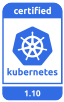

---

copyright:
  years: 2014, 2018
lastupdated: "2018-12-27"

---

{:new_window: target="_blank"}
{:shortdesc: .shortdesc}
{:screen: .screen}
{:pre: .pre}
{:table: .aria-labeledby="caption"}
{:codeblock: .codeblock}
{:tip: .tip}
{:note: .note}
{:important: .important}
{:deprecated: .deprecated}
{:note: .note}
{:important: .important}
{:deprecated: .deprecated}
{:download: .download}


# Version information and update actions
{: #cs_versions}

## Kubernetes version types
{: #version_types}

{{site.data.keyword.containerlong}} concurrently supports multiple versions of Kubernetes. When a latest version (n) is released, versions up to 2 behind (n-2) are supported. Versions more than 2 behind the latest (n-3) are first deprecated and then unsupported.
{:shortdesc}

**Supported Kubernetes versions**:
- Latest: 1.12.3
- Default: 1.10.11
- Other: 1.11.5

</br>

**Deprecated versions**: When clusters are running on a deprecated Kubernetes version, you have 30 days to review and update to a supported Kubernetes version before the version becomes unsupported. During the deprecation period, your cluster is still functional, but might require updates to a supported release to fix security vulnerabilities. You cannot create new clusters that use the deprecated version.

**Unsupported versions**: If you are running clusters on a Kubernetes version that is not supported, review potential impacts for updates below and then immediately [update the cluster](cs_cluster_update.html#update) to continue receiving important security updates and support.
*  **Attention**: If you wait until your cluster is three or more minor versions behind a supported version, you must force the update, which might cause unexpected results or failure.
*  Unsupported clusters cannot add or reload existing worker nodes.
*  After you update the cluster to a supported version, your cluster can resume normal operations and continue receiving support.

</br>

To check the server version of a cluster, run the following command.

```
kubectl version  --short | grep -i server
```
{: pre}

Example output:

```
Server Version: v1.10.11+IKS
```
{: screen}


## Update types
{: #update_types}

Your Kubernetes cluster has three types of updates: major, minor, and patch.
{:shortdesc}

|Update type|Examples of version labels|Updated by|Impact
|-----|-----|-----|-----|
|Major|1.x.x|You|Operation changes for clusters, including scripts or deployments.|
|Minor|x.9.x|You|Operation changes for clusters, including scripts or deployments.|
|Patch|x.x.4_1510|IBM and you|Kubernetes patches, as well as other {{site.data.keyword.Bluemix_notm}} Provider component updates such as security and operating system patches. IBM updates masters automatically, but you apply patches to worker nodes. See more about patches in the following section.|
{: caption="Impacts of Kubernetes updates" caption-side="top"}

As updates become available, you are notified when you view information about the worker nodes, such as with the `ibmcloud ks workers <cluster>` or `ibmcloud ks worker-get <cluster> <worker>` commands.
-  **Major and minor updates**: First, [update your master node](cs_cluster_update.html#master) and then [update the worker nodes](cs_cluster_update.html#worker_node).
   - By default, you cannot update a Kubernetes master three or more minor versions ahead. For example, if your current master is version 1.9 and you want to update to 1.12, you must update to 1.10 first. You can force the update to continue, but updating more than two minor versions might cause unexpected results or failure.
   - If you use a `kubectl` CLI version that does match at least the `major.minor` version of your clusters, you might experience unexpected results. Make sure to keep your Kubernetes cluster and [CLI versions](cs_cli_install.html#kubectl) up-to-date.
-  **Patch updates**: Changes across patches are documented in the [Version changelog](cs_versions_changelog.html). As updates become available, you are notified when you view information about the master and worker nodes in the {{site.data.keyword.Bluemix_notm}} console or CLI, such as with the following commands: `ibmcloud ks clusters`, `cluster-get`, `workers`, or `worker-get`.
   - **Worker node patches**: Check monthly to see whether an update is available, and use the `ibmcloud ks worker-update` [command](cs_cli_reference.html#cs_worker_update) or the `ibmcloud ks worker-reload` [command](cs_cli_reference.html#cs_worker_reload) to apply these security and operating system patches. Note that during an update or reload, your worker node machine is reimaged, and data is deleted if not [stored outside the worker node](cs_storage_planning.html#persistent_storage_overview).
   - **Master patches**: Master patches are applied automatically over the course of several days, so a master patch version might show up as available before it is applied to your master. The update automation also skips clusters that are in an unhealthy state or have operations currently in progress. Occasionally, IBM might disable automatic updates for a specific master fix pack, as noted in the changelog, such as a patch that is only needed if a master is updated from one minor version to another. In any of these cases, you can choose to safely use the `ibmcloud ks cluster-update` [command](cs_cli_reference.html#cs_cluster_update) yourself without waiting for the update automation to apply.

</br>

This information summarizes updates that are likely to have impact on deployed apps when you update a cluster to a new version from the previous version.
-  Version 1.12 [preparation actions](#cs_v112).
-  Version 1.11 [preparation actions](#cs_v111).
-  Version 1.10 [preparation actions](#cs_v110).
-  [Archive](#k8s_version_archive) of deprecated or unsupported versions.

<br/>

For a complete list of changes, review the following information:
* [Kubernetes changelog ](https://github.com/kubernetes/kubernetes/blob/master/CHANGELOG.md).
* [IBM version changelog](cs_versions_changelog.html).

</br>

## Version 1.12
{: #cs_v112}

<p> {{site.data.keyword.containerlong_notm}} is a Certified Kubernetes product for version 1.12 under the CNCF Kubernetes Software Conformance Certification program. _Kubernetes® is a registered trademark of The Linux Foundation in the United States and other countries, and is used pursuant to a license from The Linux Foundation._</p>

Review changes that you might need to make when you are updating from the previous Kubernetes version to 1.12.
{: shortdesc}

### Update before master
{: #112_before}

The following table shows the actions that you must take before you update the Kubernetes master. 
{: shortdesc}

<table summary="Kubernetes updates for version 1.12">
<caption>Changes to make before you update the master to Kubernetes 1.12</caption>
<thead>
<tr>
<th>Type</th>
<th>Description</th>
</tr>
</thead>
<tbody>
<tr>
<td>Kubernetes Metrics Server</td>
<td>If you currently have the Kubernetes `metric-server` deployed in your cluster, you must remove the `metric-server` before you update the cluster to Kubernetes 1.12. This removal prevents conflicts with the `metric-server` that is deployed during the update.</td>
</tr>
<tr>
<td>Role bindings for `kube-system` `default` service account</td>
<td>The `kube-system` `default` service account no longer has **cluster-admin** access to the Kubernetes API. If you deploy features or add-ons such as [Helm](cs_integrations.html#helm) that require access to processes in your cluster, set up a [service account ](https://kubernetes.io/docs/reference/access-authn-authz/service-accounts-admin/). If you need time to create and set up individual service accounts with the appropriate permissions, you can temporarily grant the **cluster-admin** role with the following cluster role binding: `kubectl create clusterrolebinding kube-system:default --clusterrole=cluster-admin --serviceaccount=kube-system:default`</td>
</tr>
</tbody>
</table>

### Update after master
{: #112_after}

The following table shows the actions that you must take after you update the Kubernetes master. 
{: shortdesc}

<table summary="Kubernetes updates for version 1.12">
<caption>Changes to make after you update the master to Kubernetes 1.12</caption>
<thead>
<tr>
<th>Type</th>
<th>Description</th>
</tr>
</thead>
<tbody>
<tr>
<td>`apps/v1` Kubernetes API</td>
<td>The `apps/v1` Kubernetes API is replacing the `extensions`, `apps/v1beta1`, and `apps/v1alpha` APIs. The Kubernetes project is deprecating and phasing out support for the previous APIs from the Kubernetes `apiserver` and the `kubectl` client.<br><br>You must update all your YAML `apiVersion` fields to use `apps/v1`. Also, review the [Kubernetes docs ](https://kubernetes.io/docs/concepts/workloads/controllers/deployment/) for changes related to `apps/v1`, such as the following.
<ul><li>After creating a deployment, the `.spec.selector` field is immutable.</li>
<li>The `.spec.rollbackTo` field is deprecated. Instead, use the `kubectl rollout undo` command.</li></ul></td>
</tr>
<tr>
<td>CoreDNS available as cluster DNS provider</td>
<td>The Kubernetes project is in the process of transitioning to support CoreDNS instead of the current Kubernetes DNS (KubeDNS). In version 1.12, the default cluster DNS remains KubeDNS, but you can [choose to use CoreDNS](cs_cluster_update.html#dns).</td>
</tr>
<tr>
<td>`kubectl apply --force`</td>
<td>Now, when you force an apply action (`kubectl apply --force`) on resources that cannot be updated, such as immutable fields in YAML files, the resources are recreated instead. If your scripts rely on the previous behavior, update them.</td>
</tr>
<tr>
<td>`kubectl logs --interactive`</td>
<td>The `--interactive` flag is no longer supported for `kubectl logs`. Update any automation that uses this flag.</td>
</tr>
<tr>
<td>`kubectl patch`</td>
<td>If the `patch` command results in no changes (a redundant patch), the command no longer exits with a `1` return code. If your scripts rely on the previous behavior, update them.</td>
</tr>
<tr>
<td>`kubectl version -c`</td>
<td>The `-c` shorthand flag is no longer supported. Instead, use the full `--client` flag. Update any automation that uses this flag.</td>
</tr>
<tr>
<td>`kubectl wait`</td>
<td>If no matching selectors are found, the command now prints an error message and exits with a `1` return code. If your scripts rely on the previous behavior, update them.</td>
</tr>
<tr>
<td>kubelet cAdvisor port</td>
<td>The [Container Advisor (cAdvisor) ](https://github.com/google/cadvisor) web UI that the kubelet used by starting the `--cadvisor-port` is removed from Kubernetes 1.12. If you still need to run cAdvisor, [deploy cAdvisor as a daemon set ](https://github.com/google/cadvisor/tree/master/deploy/kubernetes).<br><br>In the daemon set, specify the ports section so that cAdvisor can be reached via `http://node-ip:4194`, such as follows. Note that the cAdvisor pods fail until the worker nodes are updated to 1.12, because earlier versions of kubelet use host port 4194 for cAdvisor.
<pre class="screen"><code>ports:
          - name: http
            containerPort: 8080
            hostPort: 4194
            protocol: TCP</code></pre></td>
</tr>
<tr>
<td>Kubernetes dashboard</td>
<td>If you access the dashboard via `kubectl proxy`, the **SKIP** button on the login page is removed. Instead, use a **Token** to log in.</td>
</tr>
<tr>
<td id="metrics-server">Kubernetes Metrics Server</td>
<td>Kubernetes Metrics Server replaces Kubernetes Heapster (deprecated since Kubernetes version 1.8) as the cluster metrics provider. If you run more than 30 pods per worker node in your cluster, [adjust the `metrics-server` configuration for performance](cs_performance.html#metrics).
<p>The Kubernetes dashboard does not work with the `metrics-server`. If you want to display metrics in a dashboard, choose from the following options.</p>
<ul><li>[Set up Grafana to analyze metrics](/docs/services/cloud-monitoring/tutorials/container_service_metrics.html#container_service_metrics) by using the Cluster Monitoring Dashboard.</li>
<li>Deploy [Heapster ](https://github.com/kubernetes/heapster) to your cluster.
<ol><li>Copy the `heapster-rbac` [YAML ](https://github.com/kubernetes/kubernetes/blob/release-1.12/cluster/addons/cluster-monitoring/heapster-rbac.yaml), `heapster-service` [YAML ](https://github.com/kubernetes/kubernetes/blob/release-1.12/cluster/addons/cluster-monitoring/standalone/heapster-service.yaml), and `heapster-controller` [YAML ](https://github.com/kubernetes/kubernetes/blob/release-1.12/cluster/addons/cluster-monitoring/standalone/heapster-controller.yaml) files.</li>
<li>Edit the `heapster-controller` YAML by replacing the following strings.
<ul><li>Replace `{{ nanny_memory }}` with `90Mi`</li>
<li>Replace `{{ base_metrics_cpu }}` with `80m`</li>
<li>Replace `{{ metrics_cpu_per_node }}` with `0.5m`</li>
<li>Replace `{{ base_metrics_memory }}` with `140Mi`</li>
<li>Replace `{{ metrics_memory_per_node }}` with `4Mi`</li>
<li>Replace `{{ heapster_min_cluster_size }}` with `16`</li></ul></li>
<li>Apply the `heapster-rbac`, `heapster-service`, and `heapster-controller` YAML files to your cluster by running the `kubectl apply -f` command.</li></ol></li></ul></td>
</tr>
<tr>
<td>`rbac.authorization.k8s.io/v1` Kubernetes API</td>
<td>The `rbac.authorization.k8s.io/v1` Kubernetes API (supported since Kubernetes 1.8) is replacing the `rbac.authorization.k8s.io/v1alpha1` and `rbac.authorization.k8s.io/v1beta1` API. You can no longer create RBAC objects such as roles or rolebindings with the unsupported `v1alpha` API. Existing RBAC objects are converted to the `v1` API.</td>
</tr>
</tbody>
</table>

## Version 1.11
{: #cs_v111}

<p> {{site.data.keyword.containerlong_notm}} is a Certified Kubernetes product for version 1.11 under the CNCF Kubernetes Software Conformance Certification program. _Kubernetes® is a registered trademark of The Linux Foundation in the United States and other countries, and is used pursuant to a license from The Linux Foundation._</p>

Review changes that you might need to make when you are updating from the previous Kubernetes version to 1.11.
{: shortdesc}

Before you can successfully update a cluster from Kubernetes version 1.9 or earlier to version 1.11, you must follow the steps listed in [Preparing to update to Calico v3](#111_calicov3).
{: important}

### Update before master
{: #111_before}

The following table shows the actions that you must take before you update the Kubernetes master. 
{: shortdesc}

<table summary="Kubernetes updates for version 1.11">
<caption>Changes to make before you update the master to Kubernetes 1.11</caption>
<thead>
<tr>
<th>Type</th>
<th>Description</th>
</tr>
</thead>
<tbody>
<tr>
<td>Cluster master high availability (HA) configuration</td>
<td>Updated the cluster master configuration to increase high availability (HA). Clusters now have three Kubernetes master replicas that are set up with each master deployed on separate physical hosts. Further, if your cluster is in a multizone-capable zone, the masters are spread across zones.<br><br>For actions that you must take, see [Updating to highly available cluster masters](#ha-masters). These preparation actions apply:<ul>
<li>If you have a firewall or custom Calico network policies.</li>
<li>If you are using host ports `2040` or `2041` on your worker nodes.</li>
<li>If you used the cluster master IP address for in-cluster access to the master.</li>
<li>If you have automation that calls the Calico API or CLI (`calicoctl`), such as to create Calico policies.</li>
<li>If you use Kubernetes or Calico network policies to control pod egress access to the master.</li></ul></td>
</tr>
<tr>
<td>`containerd` new Kubernetes container runtime</td>
<td><p class="important">`containerd` replaces Docker as the new container runtime for Kubernetes. For actions that you must take, see [Updating to `containerd` as the container runtime](#containerd).</p></td>
</tr>
<tr>
<td>Encrypting data in etcd</td>
<td>Previously, etcd data was stored on a master’s NFS file storage instance that was encrypted at rest. Now, etcd data is stored on the master’s local disk and backed up to {{site.data.keyword.cos_full_notm}}. Data is encrypted during transit to {{site.data.keyword.cos_full_notm}} and at rest. However, the etcd data on the master’s local disk is not encrypted. If you want your master’s local etcd data to be encrypted, [enable {{site.data.keyword.keymanagementservicelong_notm}} in your cluster](cs_encrypt.html#keyprotect).</td>
</tr>
<tr>
<td>Kubernetes container volume mount propagation</td>
<td>The default value for the [`mountPropagation` field ](https://kubernetes.io/docs/concepts/storage/volumes/#mount-propagation) for a container `VolumeMount` changed from `HostToContainer` to `None`. This change restores the behavior that existed in Kubernetes version 1.9 and earlier. If your pod specs rely on `HostToContainer` being the default, update them.</td>
</tr>
<tr>
<td>Kubernetes API server JSON deserializer</td>
<td>The Kubernetes API server JSON deserializer is now case-sensitive. This change restores the behavior that existed in Kubernetes version 1.7 and earlier. If your JSON resource definitions use the incorrect case, update them. <br><br>Only direct Kubernetes API server requests are impacted. The `kubectl` CLI continued to enforce case-sensitive keys in Kubernetes version 1.7 and later, so if you strictly manage your resources with `kubectl`, you are not impacted.</td>
</tr>
</tbody>
</table>

### Update after master
{: #111_after}

The following table shows the actions that you must take after you update the Kubernetes master. 
{: shortdesc}

<table summary="Kubernetes updates for version 1.11">
<caption>Changes to make after you update the master to Kubernetes 1.11</caption>
<thead>
<tr>
<th>Type</th>
<th>Description</th>
</tr>
</thead>
<tbody>
<tr>
<td>Cluster logging configuration</td>
<td>The `fluentd` cluster add-on is automatically updated with version 1.11, even when `logging-autoupdate` is disabled.<br><br>
The container log directory changed from `/var/lib/docker/` to `/var/log/pods/`. If you use your own logging solution that monitors the previous directory, update accordingly.</td>
</tr>
<tr>
<td>Refresh Kubernetes configuration</td>
<td>The OpenID Connect configuration for the cluster's Kubernetes API server is updated to support {{site.data.keyword.Bluemix_notm}} Identity and Access Management (IAM) access groups. As a result, you must refresh your cluster's Kubernetes configuration after the master Kubernetes v1.11 update by running `ibmcloud ks cluster-config --cluster <cluster_name_or_ID>`. With this command, the configuration is applied to role bindings in the `default` namespace. If you use namespaces other than `default`, [reapply the role bindings](cs_users.html#rbac_copy) to each namespace.<br><br>If you do not refresh the configuration, cluster actions fail with the following error message: `You must be logged in to the server (Unauthorized).`</td>
</tr>
<tr>
<td>`kubectl` CLI</td>
<td>The `kubectl` CLI for Kubernetes version 1.11 requires the `apps/v1` APIs. As a result, the v1.11 `kubectl` CLI does not work for clusters that run Kubernetes version 1.8 or earlier. Use the version of the `kubectl` CLI that matches the Kubernetes API server version of your cluster.</td>
</tr>
<tr>
<td>`kubectl auth can-i`</td>
<td>Now, when a user is not authorized, the `kubectl auth can-i` command fails with `exit code 1`. If your scripts rely on the previous behavior, update them.</td>
</tr>
<tr>
<td>`kubectl delete`</td>
<td>Now, when deleting resources by using selection criteria such as labels, the `kubectl delete` command ignores `not found` errors by default. If your scripts rely on the previous behavior, update them.</td>
</tr>
<tr>
<td>Kubernetes `sysctls` feature</td>
<td>The `security.alpha.kubernetes.io/sysctls` annotation is now ignored. Instead, Kubernetes added fields to the `PodSecurityPolicy` and `Pod` objects for specifying and controlling `sysctls`. For more information, see [Using sysctls in Kubernetes ](https://kubernetes.io/docs/tasks/administer-cluster/sysctl-cluster/). <br><br>After you update the cluster master and workers, update your `PodSecurityPolicy` and `Pod` objects to use the new `sysctls` fields.</td>
</tr>
</tbody>
</table>

### Updating to highly available cluster masters in Kubernetes 1.11
{: #ha-masters}

For clusters that run Kubernetes version [1.10.8_1530](#110_ha-masters), 1.11.3_1531, or later, the cluster master configuration is updated to increase high availability (HA). Clusters now have three Kubernetes master replicas that are set up with each master deployed on separate physical hosts. Further, if your cluster is in a multizone-capable zone, the masters are spread across zones.
{: shortdesc}

When you update your cluster to this Kubernetes version from version 1.9 or an earlier patch of 1.10 or 1.11, you need to take these preparation steps. To give you time, automatic updates of the master are temporarily disabled. For more information and the timeline, check out the [HA master blog post](https://www.ibm.com/blogs/bluemix/2018/10/increased-availability-with-ha-masters-in-the-kubernetes-service-actions-you-must-take/).
{: tip}

Review the following situations in which you must make changes to take full advantage of HA master configuration:
* If you have a firewall or custom Calico network policies.
* If you are using host ports `2040` or `2041` on your worker nodes.
* If you used the cluster master IP address for in-cluster access to the master.
* If you have automation that calls the Calico API or CLI (`calicoctl`), such as to create Calico policies.
* If you use Kubernetes or Calico network policies to control pod egress access to the master.

<br>
**Updating your firewall or custom Calico host network policies for HA masters**:</br>
{: #ha-firewall}
If you use a firewall or custom Calico host network policies to control egress from your worker nodes, allow outgoing traffic to the ports and IP addresses for all the zones within the region that your cluster is in. See [Allowing the cluster to access infrastructure resources and other services](cs_firewall.html#firewall_outbound).

<br>
**Reserving host ports `2040` and `2041` on your worker nodes**:</br>
{: #ha-ports}
To allow access to the cluster master in an HA configuration, you must leave host ports `2040` and `2041` available on all worker nodes.
* Update any pods with `hostPort` set to `2040` or `2041` to use different ports.
* Update any pods with `hostNetwork` set to `true` that listen on ports `2040` or `2041` to use different ports.

To check if your pods are currently using ports `2040` or `2041`, target your cluster and run the following command.

```
kubectl get pods --all-namespaces -o yaml | grep "hostPort: 204[0,1]"
```
{: pre}

<br>
**Using `kubernetes` service cluster IP or domain for in-cluster access to the master**:</br>
{: #ha-incluster}
To access the cluster master in an HA configuration from within the cluster, use one of the following:
* The `kubernetes` service cluster IP address, which by default is: `https://172.21.0.1`
* The `kubernetes` service domain name, which by default is: `https://kubernetes.default.svc.cluster.local`

If you previously used the cluster master IP address, this method continues to work. However, for improved availability, update to use the `kubernetes` service cluster IP address or domain name.

<br>
**Configuring Calico for out-of-cluster access to master with HA configuration**:</br>
{: #ha-outofcluster}
The data that is stored in the `calico-config` configmap in the `kube-system` namespace is changed to support HA master configuration. In particular, the `etcd_endpoints` value now supports in-cluster access only. Using this value to configure Calico CLI for access from outside the cluster no longer works.

Instead, use the data that is stored in the `cluster-info` configmap in the `kube-system` namespace. In particular, use the `etcd_host` and `etcd_port` values to configure the endpoint for the [Calico CLI](cs_network_policy.html#cli_install) to access the master with HA configuration from outside the cluster.

<br>
**Updating Kubernetes or Calico network policies**:</br>
{: #ha-networkpolicies}
You need to take additional actions if you use [Kubernetes or Calico network policies](cs_network_policy.html#network_policies) to control pod egress access to the cluster master and you are currently using:
*  The Kubernetes service cluster IP, which you can get by running `kubectl get service kubernetes -o yaml | grep clusterIP`.
*  The Kubernetes service domain name, which by default is `https://kubernetes.default.svc.cluster.local`.
*  The cluster master IP, which you can get by running `kubectl cluster-info | grep Kubernetes`.

The following steps describe how to update your Kubernetes network policies. To update Calico network policies, repeat these steps with some minor policy syntax changes and `calicoctl` to search policies for impacts.
{: note}

Before you begin: [Log in to your account. Target the appropriate region and, if applicable, resource group. Set the context for your cluster](cs_cli_install.html#cs_cli_configure).

1.  Get your cluster master IP address.
    ```
    kubectl cluster-info | grep Kubernetes
    ```
    {: pre}

2.  Search your Kubernetes network policies for impacts. If no YAML is returned, your cluster is not impacted and you do not need to make additional changes.
    ```
    kubectl get networkpolicies --all-namespaces -o yaml | grep <cluster-master-ip>
    ```
    {: pre}

3.  Review the YAML. For example, if your cluster uses the following Kubernetes network policy to allow pods in the `default` namespace to access the cluster master via the `kubernetes` service cluster IP or the cluster master IP, then you must update the policy.
    ```
    apiVersion: extensions/v1beta1
    kind: NetworkPolicy
    metadata:
      name: all-master-egress
      namespace: default
    spec:
      egress:
      # Allow access to cluster master using kubernetes service cluster IP address
      # or domain name or cluster master IP address.
      - ports:
        - protocol: TCP
        to:
        - ipBlock:
            cidr: 161.202.126.210/32
      # Allow access to Kubernetes DNS in order to resolve the kubernetes service
      # domain name.
      - ports:
        - protocol: TCP
          port: 53
        - protocol: UDP
          port: 53
      podSelector: {}
      policyTypes:
      - Egress
    ```
    {: screen}

4.  Revise the Kubernetes network policy to allow egress to the in-cluster master proxy IP address `172.20.0.1`. For now, keep the cluster master IP address. For example, the previous network policy example changes to the following.

    If you previously set up your egress policies to open up only the single IP address and port for the single Kubernetes master, now use the in-cluster master proxy IP address range 172.20.0.1/32 and port 2040.
    {: tip}

    ```
    apiVersion: extensions/v1beta1
    kind: NetworkPolicy
    metadata:
      name: all-master-egress
      namespace: default
    spec:
      egress:
      # Allow access to cluster master using kubernetes service cluster IP address
      # or domain name.
      - ports:
        - protocol: TCP
        to:
        - ipBlock:
            cidr: 172.20.0.1/32
        - ipBlock:
            cidr: 161.202.126.210/32
      # Allow access to Kubernetes DNS in order to resolve the kubernetes service domain name.
      - ports:
        - protocol: TCP
          port: 53
        - protocol: UDP
          port: 53
      podSelector: {}
      policyTypes:
      - Egress
    ```
    {: screen}

5.  Apply the revised network policy to your cluster.
    ```
    kubectl apply -f all-master-egress.yaml
    ```
    {: pre}

6.  After you complete all the [preparation actions](#ha-masters) (including these steps), [update your cluster master](cs_cluster_update.html#master) to the HA master fix pack.

7.  After the update is complete, remove the cluster master IP address from the network policy. For example, from the previous network policy, remove the following lines, and then reapply the policy.

    ```
    - ipBlock:
        cidr: 161.202.126.210/32
    ```
    {: screen}

    ```
    kubectl apply -f all-master-egress.yaml
    ```
    {: pre}

### Updating to `containerd` as the container runtime
{: #containerd}

For clusters that run Kubernetes version 1.11 or later, `containerd` replaces Docker as the new container runtime for Kubernetes to enhance performance. If your pods rely on Docker as the Kubernetes container runtime, you must update them to handle `containerd` as the container runtime. For more information, see the [Kubernetes containerd announcement ](https://kubernetes.io/blog/2018/05/24/kubernetes-containerd-integration-goes-ga/).
{: shortdesc}

**How do I know if my apps rely on `docker` instead of `containerd`?**<br>
Examples of times that you might rely on Docker as the container runtime:
*  If you access the Docker engine or API directly by using privileged containers, update your pods to support `containerd` as the runtime. For example, you might call the Docker socket directly to launch containers or perform other Docker operations. The Docker socket changed from `/var/run/docker.sock` to `/run/containerd/containerd.sock`. The protocol that is used in the `containerd` socket is slightly different to the one in Docker. Try to update your app to the `containerd` socket. If you want to continue using the Docker socket, look into using [Docker-inside-Docker (DinD) ](https://hub.docker.com/_/docker/).
*  Some third-party add-ons, such as logging and monitoring tools, that you install in your cluster might rely on the Docker engine. Check with your provider to make sure the tools are compatible with containerd. Possible use cases include:
   - Your logging tool might use the container `stderr/stdout` directory `/var/log/pods/<pod_uuid>/<container_name>/*.log` to access logs. In Docker, this directory is a symlink to `/var/data/cripersistentstorage/containers/<container_uuid>/<container_uuid>-json.log` whereas in `containerd` you access the directory directly without a symlink.
   - Your monitoring tool accesses the Docker socket directly. The Docker socket changed from `/var/run/docker.sock` to `/run/containerd/containerd.sock`.

<br>

**Besides reliance on the runtime, do I need to take other preparation actions?**<br>

**Manifest tool**: If you have multi-platform images that are built with the experimental `docker manifest` [tool ](https://docs.docker.com/edge/engine/reference/commandline/manifest/) before Docker version 18.06, you cannot pull the image from DockerHub by using `containerd`.

When you check the pod events, you might see an error such as the following.
```
failed size validation
```
{: screen}

To use an image that is built by using the manifest tool with `containerd`, choose from the following options.

*  Rebuild the image with the [manifest tool ](https://github.com/estesp/manifest-tool).
*  Rebuild the image with the `docker-manifest` tool after you update to Docker version 18.06 or later.

<br>

**What is not affected? Do I need to change how I deploy my containers?**<br>
In general, your container deployment processes do not change. You can still use a Dockerfile to define a Docker image and build a Docker container for your apps. If you use `docker` commands to build and push images to a registry, you can continue to use `docker` or use `ibmcloud cr` commands instead.

### Preparing to update to Calico v3
{: #111_calicov3}

If you are updating a cluster from Kubernetes version 1.9 or earlier to version 1.11, prepare for the Calico v3 update before you update the master. During the master upgrade to Kubernetes v1.11, new pods and new Kubernetes or Calico network policies are not scheduled. The amount of time that the update prevents new scheduling varies. Small clusters can take a few minutes, with a few extra minutes for every 10 nodes. Existing network policies and pods continue to run.
{: shortdesc}

If you are updating a cluster from Kubernetes version 1.10 to version 1.11, skip these steps because you completed these steps when you updated to 1.10.
{: note}

Before you begin, your cluster master and all worker nodes must be running Kubernetes version 1.8 or 1.9, and must have at least one worker node.

1.  Verify that your Calico pods are healthy.
    ```
    kubectl get pods -n kube-system -l k8s-app=calico-node -o wide
    ```
    {: pre}

2.  If any pod is not in a **Running** state, delete the pod and wait until it is in a **Running** state before you continue. If the pod does not return to a **Running** state:
    1.  Check the **State** and **Status** of the worker node.
        ```
        ibmcloud ks workers --cluster <cluster_name_or_ID>
        ```
        {: pre}
    2.  If the worker node state is not **Normal**, follow the [Debugging worker nodes](cs_troubleshoot.html#debug_worker_nodes) steps. For example, a **Critical** or **Unknown** state is often resolved by [reloading the worker node](cs_cli_reference.html#cs_worker_reload).

3.  If you auto-generate Calico policies or other Calico resources, update your automation tooling to generate these resources with [Calico v3 syntax ](https://docs.projectcalico.org/v3.1/reference/calicoctl/resources/).

4.  If you use [strongSwan](cs_vpn.html#vpn-setup) for VPN connectivity, the strongSwan 2.0.0 Helm chart does not work with Calico v3 or Kubernetes 1.11. [Update strongSwan](cs_vpn.html#vpn_upgrade) to the 2.1.0 Helm chart, which is backward compatible with Calico 2.6, and Kubernetes 1.7, 1.8, and 1.9.

5.  [Update your cluster master to Kubernetes v1.11](cs_cluster_update.html#master).

<br />


## Version 1.10
{: #cs_v110}

<p> {{site.data.keyword.containerlong_notm}} is a Certified Kubernetes product for version 1.10 under the CNCF Kubernetes Software Conformance Certification program. _Kubernetes® is a registered trademark of The Linux Foundation in the United States and other countries, and is used pursuant to a license from The Linux Foundation._</p>

Review changes that you might need to make when you are updating from the previous Kubernetes version to 1.10.
{: shortdesc}

Before you can successfully update to Kubernetes 1.10, you must follow the steps listed in [Preparing to update to Calico v3](#110_calicov3).
{: important}

<br/>

### Update before master
{: #110_before}

The following table shows the actions that you must take before you update the Kubernetes master. 
{: shortdesc}

<table summary="Kubernetes updates for version 1.10">
<caption>Changes to make before you update the master to Kubernetes 1.10</caption>
<thead>
<tr>
<th>Type</th>
<th>Description</th>
</tr>
</thead>
<tbody>
<tr>
<td>Calico v3</td>
<td>Updating to Kubernetes version 1.10 also updates Calico from v2.6.5 to v3.1.1. <strong>Important</strong>: Before you can successfully update to Kubernetes v1.10, you must follow the steps listed in [Preparing to update to Calico v3](#110_calicov3).</td>
</tr>
<tr>
<td>Cluster master high availability (HA) configuration</td>
<td>Updated the cluster master configuration to increase high availability (HA). Clusters now have three Kubernetes master replicas that are set up with each master deployed on separate physical hosts. Further, if your cluster is in a multizone-capable zone, the masters are spread across zones.<br><br>For actions that you must take, see [Updating to highly available cluster masters](#110_ha-masters). These preparation actions apply:<ul>
<li>If you have a firewall or custom Calico network policies.</li>
<li>If you are using host ports `2040` or `2041` on your worker nodes.</li>
<li>If you used the cluster master IP address for in-cluster access to the master.</li>
<li>If you have automation that calls the Calico API or CLI (`calicoctl`), such as to create Calico policies.</li>
<li>If you use Kubernetes or Calico network policies to control pod egress access to the master.</li></ul></td>
</tr>
<tr>
<td>Kubernetes Dashboard network policy</td>
<td>In Kubernetes 1.10, the <code>kubernetes-dashboard</code> network policy in the <code>kube-system</code> namespace blocks all pods from accessing the Kubernetes dashboard. However, this does <strong>not</strong> impact the ability to access the dashboard from the {{site.data.keyword.Bluemix_notm}} console or by using <code>kubectl proxy</code>. If a pod requires access to the dashboard, you can add a <code>kubernetes-dashboard-policy: allow</code> label to a namespace and then deploy the pod to the namespace.</td>
</tr>
<tr>
<td>Kubelet API access</td>
<td>Kubelet API authorization is now delegated to the <code>Kubernetes API server</code>. Access to the Kubelet API is based on <code>ClusterRoles</code> that grant permission to access <strong>node</strong> subresources. By default, Kubernetes Heapster has <code>ClusterRole</code> and <code>ClusterRoleBinding</code>. However, if the Kubelet API is used by other users or apps, you must grant them permission to use the API. Refer to the Kubernetes documentation on [Kubelet authorization](https://kubernetes.io/docs/reference/command-line-tools-reference/kubelet-authentication-authorization/).</td>
</tr>
<tr>
<td>Cipher suites</td>
<td>The supported cipher suites to the <code>Kubernetes API server</code> and Kubelet API are now restricted to a subset with high strength encryption (128 bits or more). If you have existing automation or resources that use weaker ciphers and rely on communicating with the <code>Kubernetes API server</code> or Kubelet API, enable stronger cipher support before you update the master.</td>
</tr>
<tr>
<td>strongSwan VPN</td>
<td>If you use [strongSwan](cs_vpn.html#vpn-setup) for VPN connectivity, you must remove the chart before you update the cluster by running `helm delete --purge <release_name>`. After the cluster update is complete, reinstall the strongSwan Helm chart.</td>
</tr>
</tbody>
</table>

### Update after master
{: #110_after}

The following table shows the actions that you must take after you update the Kubernetes master. 
{: shortdesc}

<table summary="Kubernetes updates for version 1.10">
<caption>Changes to make after you update the master to Kubernetes 1.10</caption>
<thead>
<tr>
<th>Type</th>
<th>Description</th>
</tr>
</thead>
<tbody>
<tr>
<td>Calico v3</td>
<td>When the cluster is updated, all existing Calico data that is applied to the cluster is automatically migrated to use Calico v3 syntax. To view, add, or modify Calico resources with Calico v3 syntax, update your [Calico CLI configuration to version 3.1.1](#110_calicov3).</td>
</tr>
<tr>
<td>Node <code>ExternalIP</code> address</td>
<td>The <code>ExternalIP</code> field of a node is now set to the public IP address value of the node. Review and update any resources that depend on this value.</td>
</tr>
<tr>
<td><code>kubectl port-forward</code></td>
<td>Now when you use the <code>kubectl port-forward</code> command, it no longer supports the <code>-p</code> flag. If your scripts rely on the previous behavior, update them to replace the <code>-p</code> flag with the pod name.</td>
</tr>
<tr>
<td>`kubectl --show-all, -a` flag</td>
<td>The `--show-all, -a` flag, which applied only to human-readable pod commands (not API calls), is deprecated and is unsupported in future versions. The flag is used to display pods in a terminal state. To track information about terminated apps and containers, [set up log forwarding in your cluster](cs_health.html#health).</td>
</tr>
<tr>
<td>Read-only API data volumes</td>
<td>Now `secret`, `configMap`, `downwardAPI`, and projected volumes are mounted read-only.
Previously, apps were allowed to write data to these volumes that might be
reverted automatically by the system. This change is required to fix
security vulnerability [CVE-2017-1002102](https://cve.mitre.org/cgi-bin/cvename.cgi?name=2017-1002102).
If your apps rely on the previous insecure behavior, modify them accordingly.</td>
</tr>
<tr>
<td>strongSwan VPN</td>
<td>If you use [strongSwan](cs_vpn.html#vpn-setup) for VPN connectivity and deleted your chart before updating your cluster, you can now re-install your strongSwan Helm chart.</td>
</tr>
</tbody>
</table>

### Updating to highly available cluster masters in Kubernetes 1.10
{: #110_ha-masters}

For clusters that run Kubernetes version 1.10.8_1530, [1.11.3_1531](#ha-masters), or later, the cluster master configuration is updated to increase high availability (HA). Clusters now have three Kubernetes master replicas that are set up with each master deployed on separate physical hosts. Further, if your cluster is in a multizone-capable zone, the masters are spread across zones.
{: shortdesc}

When you update your cluster to this Kubernetes version from version 1.9 or an earlier patch of 1.10, you need to take these preparation steps. To give you time, automatic updates of the master are temporarily disabled. For more information and the timeline, check out the [HA master blog post](https://www.ibm.com/blogs/bluemix/2018/10/increased-availability-with-ha-masters-in-the-kubernetes-service-actions-you-must-take/).
{: tip}

Review the following situations in which you must make changes to take full advantage of HA master configuration:
* If you have a firewall or custom Calico network policies.
* If you are using host ports `2040` or `2041` on your worker nodes.
* If you used the cluster master IP address for in-cluster access to the master.
* If you have automation that calls the Calico API or CLI (`calicoctl`), such as to create Calico policies.
* If you use Kubernetes or Calico network policies to control pod egress access to the master.

<br>
**Updating your firewall or custom Calico host network policies for HA masters**:</br>
{: #110_ha-firewall}
If you use a firewall or custom Calico host network policies to control egress from your worker nodes, allow outgoing traffic to the ports and IP addresses for all the zones within the region that your cluster is in. See [Allowing the cluster to access infrastructure resources and other services](cs_firewall.html#firewall_outbound).

<br>
**Reserving host ports `2040` and `2041` on your worker nodes**:</br>
{: #110_ha-ports}
To allow access to the cluster master in an HA configuration, you must leave host ports `2040` and `2041` available on all worker nodes.
* Update any pods with `hostPort` set to `2040` or `2041` to use different ports.
* Update any pods with `hostNetwork` set to `true` that listen on ports `2040` or `2041` to use different ports.

To check if your pods are currently using ports `2040` or `2041`, target your cluster and run the following command.

```
kubectl get pods --all-namespaces -o yaml | grep "hostPort: 204[0,1]"
```
{: pre}

<br>
**Using `kubernetes` service cluster IP or domain for in-cluster access to the master**:</br>
{: #110_ha-incluster}
To access the cluster master in an HA configuration from within the cluster, use one of the following:
* The `kubernetes` service cluster IP address, which by default is: `https://172.21.0.1`
* The `kubernetes` service domain name, which by default is: `https://kubernetes.default.svc.cluster.local`

If you previously used the cluster master IP address, this method continues to work. However, for improved availability, update to use the `kubernetes` service cluster IP address or domain name.

<br>
**Configuring Calico for out-of-cluster access to master with HA configuration**:</br>
{: #110_ha-outofcluster}
The data that is stored in the `calico-config` configmap in the `kube-system` namespace is changed to support HA master configuration. In particular, the `etcd_endpoints` value now supports in-cluster access only. Using this value to configure Calico CLI for access from outside the cluster no longer works.

Instead, use the data that is stored in the `cluster-info` configmap in the `kube-system` namespace. In particular, use the `etcd_host` and `etcd_port` values to configure the endpoint for the [Calico CLI](cs_network_policy.html#cli_install) to access the master with HA configuration from outside the cluster.

<br>
**Updating Kubernetes or Calico network policies**:</br>
{: #110_ha-networkpolicies}
You need to take additional actions if you use [Kubernetes or Calico network policies](cs_network_policy.html#network_policies) to control pod egress access to the cluster master and you are currently using:
*  The Kubernetes service cluster IP, which you can get by running `kubectl get service kubernetes -o yaml | grep clusterIP`.
*  The Kubernetes service domain name, which by default is `https://kubernetes.default.svc.cluster.local`.
*  The cluster master IP, which you can get by running `kubectl cluster-info | grep Kubernetes`.

The following steps describe how to update your Kubernetes network policies. To update Calico network policies, repeat these steps with some minor policy syntax changes and use `calicoctl` to search policies for impacts.
{: note}

Before you begin: [Log in to your account. Target the appropriate region and, if applicable, resource group. Set the context for your cluster](cs_cli_install.html#cs_cli_configure).

1.  Get your cluster master IP address.
    ```
    kubectl cluster-info | grep Kubernetes
    ```
    {: pre}

2.  Search your Kubernetes network policies for impacts. If no YAML is returned, your cluster is not impacted and you do not need to make additional changes.
    ```
    kubectl get networkpolicies --all-namespaces -o yaml | grep <cluster-master-ip>
    ```
    {: pre}

3.  Review the YAML. For example, if your cluster uses the following Kubernetes network policy to allow pods in the `default` namespace to access the cluster master via the `kubernetes` service cluster IP or the cluster master IP, then you must update the policy.
    ```
    apiVersion: extensions/v1beta1
    kind: NetworkPolicy
    metadata:
      name: all-master-egress
      namespace: default
    spec:
      egress:
      # Allow access to cluster master using kubernetes service cluster IP address
      # or domain name or cluster master IP address.
      - ports:
        - protocol: TCP
        to:
        - ipBlock:
            cidr: 161.202.126.210/32
      # Allow access to Kubernetes DNS in order to resolve the kubernetes service
      # domain name.
      - ports:
        - protocol: TCP
          port: 53
        - protocol: UDP
          port: 53
      podSelector: {}
      policyTypes:
      - Egress
    ```
    {: screen}

4.  Revise the Kubernetes network policy to allow egress to the in-cluster master proxy IP address `172.20.0.1`. For now, keep the cluster master IP address. For example, the previous network policy example changes to the following.

    If you previously set up your egress policies to open up only the single IP address and port for the single Kubernetes master, now use the in-cluster master proxy IP address range 172.20.0.1/32 and port 2040.
    {: tip}

    ```
    apiVersion: extensions/v1beta1
    kind: NetworkPolicy
    metadata:
      name: all-master-egress
      namespace: default
    spec:
      egress:
      # Allow access to cluster master using kubernetes service cluster IP address
      # or domain name.
      - ports:
        - protocol: TCP
        to:
        - ipBlock:
            cidr: 172.20.0.1/32
        - ipBlock:
            cidr: 161.202.126.210/32
      # Allow access to Kubernetes DNS in order to resolve the kubernetes service domain name.
      - ports:
        - protocol: TCP
          port: 53
        - protocol: UDP
          port: 53
      podSelector: {}
      policyTypes:
      - Egress
    ```
    {: screen}

5.  Apply the revised network policy to your cluster.
    ```
    kubectl apply -f all-master-egress.yaml
    ```
    {: pre}

6.  After you complete all the [preparation actions](#ha-masters) (including these steps), [update your cluster master](cs_cluster_update.html#master) to the HA master fix pack.

7.  After the update is complete, remove the cluster master IP address from the network policy. For example, from the previous network policy, remove the following lines, and then reapply the policy.

    ```
    - ipBlock:
        cidr: 161.202.126.210/32
    ```
    {: screen}

    ```
    kubectl apply -f all-master-egress.yaml
    ```
    {: pre}

### Preparing to update to Calico v3
{: #110_calicov3}

Before you begin, your cluster master and all worker nodes must be running Kubernetes version 1.8 or later, and must have at least one worker node.
{: shortdesc}

Prepare for the Calico v3 update before you update the master. During the master upgrade to Kubernetes v1.10, new pods and new Kubernetes or Calico network policies are not scheduled. The amount of time that the update prevents new scheduling varies. Small clusters can take a few minutes, with a few extra minutes for every 10 nodes. Existing network policies and pods continue to run.
{: important}

1.  Verify that your Calico pods are healthy.
    ```
    kubectl get pods -n kube-system -l k8s-app=calico-node -o wide
    ```
    {: pre}

2.  If any pod is not in a **Running** state, delete the pod and wait until it is in a **Running** state before you continue. If the pod does not return to a **Running** state:
    1.  Check the **State** and **Status** of the worker node.
        ```
        ibmcloud ks workers --cluster <cluster_name_or_ID>
        ```
        {: pre}
    2.  If the worker node state is not **Normal**, follow the [Debugging worker nodes](cs_troubleshoot.html#debug_worker_nodes) steps. For example, a **Critical** or **Unknown** state is often resolved by [reloading the worker node](cs_cli_reference.html#cs_worker_reload).

3.  If you auto-generate Calico policies or other Calico resources, update your automation tooling to generate these resources with [Calico v3 syntax ](https://docs.projectcalico.org/v3.1/reference/calicoctl/resources/).

4.  If you use [strongSwan](cs_vpn.html#vpn-setup) for VPN connectivity, the strongSwan 2.0.0 Helm chart does not work with Calico v3 or Kubernetes 1.10. [Update strongSwan](cs_vpn.html#vpn_upgrade) to the 2.1.0 Helm chart, which is backward compatible with Calico 2.6, and Kubernetes 1.7, 1.8, and 1.9.

5.  [Update your cluster master to Kubernetes v1.10](cs_cluster_update.html#master).

<br />


## Archive
{: #k8s_version_archive}

Find an overview of Kubernetes versions that are unsupported in {{site.data.keyword.containerlong_notm}}. 
{: shortdesc}

### Version 1.9 (Unsupported)
{: #cs_v19}

As of 27 December 2018, {{site.data.keyword.containerlong_notm}} clusters that run [Kubernetes version 1.9](cs_versions_changelog.html#changelog_archive) are unsupported. Version 1.9 clusters cannot receive security updates or support unless they are updated to the next most recent version ([Kubernetes 1.10](#cs_v110)).
{: shortdesc}

[Review potential impact](cs_versions.html#cs_versions) of each Kubernetes version update, and then [update your clusters](cs_cluster_update.html#update) immediately to at least 1.10.

### Version 1.8 (Unsupported)
{: #cs_v18}

As of 22 September 2018, {{site.data.keyword.containerlong_notm}} clusters that run [Kubernetes version 1.8](cs_versions_changelog.html#changelog_archive) are unsupported. Version 1.8 clusters cannot receive security updates or support unless they are updated to the next most recent version ([Kubernetes 1.10](#cs_v110)).
{: shortdesc}

[Review potential impact](cs_versions.html#cs_versions) of each Kubernetes version update, and then [update your clusters](cs_cluster_update.html#update) immediately to at least 1.10.

### Version 1.7 (Unsupported)
{: #cs_v17}

As of 21 June 2018, {{site.data.keyword.containerlong_notm}} clusters that run [Kubernetes version 1.7](cs_versions_changelog.html#changelog_archive) are unsupported. Version 1.7 clusters cannot receive security updates or support unless they are updated to the next most recently supported version ([Kubernetes 1.10](#cs_v110)).
{: shortdesc}

[Review potential impact](cs_versions.html#cs_versions) of each Kubernetes version update, and then [update your clusters](cs_cluster_update.html#update) immediately to at least 1.10.

### Version 1.5 (Unsupported)
{: #cs_v1-5}

As of 4 April 2018, {{site.data.keyword.containerlong_notm}} clusters that run [Kubernetes version 1.5](https://github.com/kubernetes/kubernetes/blob/master/CHANGELOG-1.5.md) are unsupported. Version 1.5 clusters cannot receive security updates or support.
{: shortdesc}

To continue running your apps in {{site.data.keyword.containerlong_notm}}, [create a new cluster](cs_clusters.html#clusters) and [deploy your apps](cs_app.html#app) to the new cluster.
