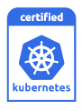
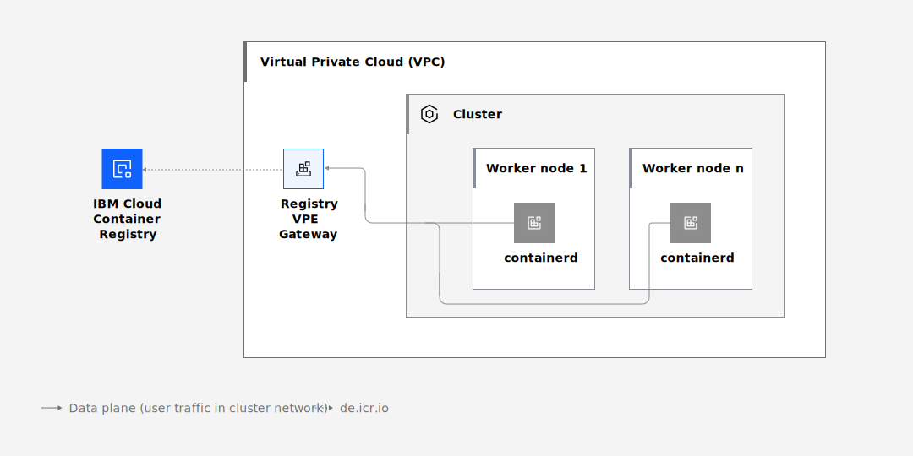

---

copyright: 
  years: 2023, 2024
lastupdated: "2024-10-09"


keywords: kubernetes, containers, 128, version 128, 128 update actions

subcollection: containers


---

{{site.data.keyword.attribute-definition-list}}


# 1.28 version information and update actions
{: #cs_versions_128}


This version is deprecated. Update your cluster to a [supported version](/docs/containers?topic=containers-cs_versions) as soon as possible.
{: deprecated}


Review information about version 1.28 of {{site.data.keyword.containerlong}}. For more information about Kubernetes project version 1.28, see the [Kubernetes change log](https://kubernetes.io/releases/notes/.){: external}.
{: shortdesc}

{: caption="Kubernetes version 1.28 certification badge" caption-side="bottom"} 

{{site.data.keyword.containerlong_notm}} is a Certified Kubernetes product for version 1.28 under the CNCF Kubernetes Software Conformance Certification program. _Kubernetes® is a registered trademark of The Linux Foundation in the United States and other countries, and is used pursuant to a license from The Linux Foundation._


## Release timeline 
{: #release_timeline_128}

The following table includes the expected release timeline for version 1.28 of {{site.data.keyword.containerlong}}. You can use this information for planning purposes, such as to estimate the general time that the version might become unsupported. 
{: shortdesc}

Dates that are marked with a dagger (`†`) are tentative and subject to change.
{: important}

| Version | Supported? | Release date | Unsupported date |
|------|------|----------|----------|
| 1.28 | Yes | {{site.data.keyword.kubernetes_128_release_date}} | {{site.data.keyword.kubernetes_128_unsupported_date}} `†` |
{: caption="Release timeline for {{site.data.keyword.containerlong_notm}} version 1.28" caption-side="bottom"}


## Preparing to update
{: #prep-up-128}

This information summarizes updates that are likely to have and impact on deployed apps when you update a cluster to version 1.28. For a complete list of changes, review the [community Kubernetes change log](https://github.com/kubernetes/kubernetes/blob/master/CHANGELOG/CHANGELOG-1.28.md){: external} and [IBM version change log](/docs/containers?topic=containers-changelog_128) for version 1.28. You can also review the [Kubernetes helpful warnings](https://kubernetes.io/blog/2020/09/03/warnings/){: external}.
{: shortdesc}


{{site.data.keyword.containerlong_notm}} version 1.28 has **not** expanded its supported skew between core node and control plane components by one minor version.  The supported skew remains `n-2`. For more information, see [Changes to supported skew between control plane and node versions](https://kubernetes.io/blog/2023/08/15/kubernetes-v1-28-release/#changes-to-supported-skew-between-control-plane-and-node-versions) for the Kubernetes community information.
{: important}


### Update before master
{: #before_128}

The following table shows the actions that you must take before you update the Kubernetes master.


| Type | Description |
| --- | --- |
| Pod `hostPort` | Pods that set `hostNetwork: true` and declare ports, get the `hostPort` field set automatically. Previously `hostPort` would be set in the pod template of a `Deployment`, `DaemonSet` or other workload resource. Now `hostPort` will only be set on the `Pod` resource. If your apps rely on the previous behavior, update them accordingly. |
| Networking changes to VPC clusters | In version 1.27 and earlier, VPC clusters pull images from the IBM Cloud Container Registry through a private cloud service endpoint for the Container Registry. For version 1.28 and later, this network path is updated so that images are pulled through a VPE gateway instead of a private service endpoint. For update actions, see [Networking changes for VPC clusters](#networking_128). |
{: caption="Changes to make before you update the master to Kubernetes 1.28" caption-side="bottom"}


### Update after master
{: #after_128}


| Type | Description |
| --- | --- |
| `kubectl version` output and `--short` option | The `kubectl version` output has been changed to match the previous `kubectl version --short` output.  In addition, the `--short` option has been removed.  If your scripts rely on the previous behavior, update them. |
| `kubelet` legacy iptables chains | `kubelet` no longer creates the `KUBE-MARK-DROP` nor `KUBE-MARK-MASQ` iptables chains. If your apps rely on these chains, update them accordingly.  For more information, see [Kubernetes’s IPTables Chains Are Not API](https://kubernetes.io/blog/2022/09/07/iptables-chains-not-api/). |
{: caption="Changes to make after you update the master to Kubernetes 1.28" caption-side="bottom"}


## Networking changes for VPC clusters
{: #networking_128}

In version 1.27 and earlier, VPC clusters pull images from the IBM Cloud Container Registry through a private cloud service endpoint for the Container Registry. For version 1.28 and later, this network path is updated so that images are pulled through a VPE gateway instead of a private service endpoint. This change affects all clusters in a VPC; when you create or update a single cluster in a VPC to version 1.28, all clusters in that VPC, regardless of their version, have their network path updated. Depending on the setup of your security groups, network ACLs, and network policies, you might need to make changes to ensure that your workers continue to successfully pull container images after updating to version 1.28. 
{: shortdesc}

The following image shows the new network path for version 1.28, which uses a VPE Gateway for Registry instead of the private service endpoint.

{: caption="VPE Gateway for Registry in 1.28 and later clusters."}


With the network path updates in version 1.28, creating or updating a VPC cluster to run at version 1.28 adds a new VPE gateway to your VPC. This VPE gateway is specifically used for pulling images from the IBM Cloud Container Registry and is assigned one IP address for each zone in the VPC that has at least one cluster worker. DNS entries are added to the entire VPC that resolve all `icr.io` domain names to the new VPE gateway IP addresses. Depending on how you have configured your network security components, you might need to act to ensure that connections to the new VPE are allowed. 


### What do I need to do?
{: #networking_steps}

The steps you need to take to ensure that your VPC cluster worker nodes continue pulling images from the Container Registry depend on your network security setup. 
{: shortdesc}

- If you use the default network rules for all security groups, network ACLs, and network policies, you do not need to take any action. 
- If you have a customized network security setup that blocks certain TCP connections within the VPC, you must take additional actions before updating to or creating a new cluster at version 1.28. Make the adjustments in the following sections to ensure that connections to the new VPE Gateway for Registry are allowed.

Regardless of whether you need to take additional steps, if you keep other clusters in the VPC that do not run version 1.28 you must [refresh the cluster master](/docs/containers?topic=containers-kubernetes-service-cli#cs_apiserver_refresh) on those clusters. This ensures that the correct updates are applied to the non-1.28 clusters so that traffic to the new VPE is allowed. 
{: important}


### I have custom security groups. What do I change?
{: #networking_steps_sg}

The necessary allow rules are automatically added to the IBM-managed `kube-<cluster_ID>` cluster security group when you update to or create a cluster at version 1.28. However, if you created a VPC cluster that does **NOT** use the `kube-<cluster_ID>` cluster security group rules, you must make sure that the following security group rules are implemented to allow traffic to the VPE gateway for registry. If the rules are not already implemented in your custom setup, [add them](/docs/containers?topic=containers-vpc-security-group-manage&interface=cli#security_groups_cli). Each of these rules must be created for each zone in the VPC and must specify the entire VPC address prefix range for the zone as the destination CIDR. To find the VPC address prefix range for each zone in the VPC, run `ibmcloud is vpc-address-prefixes <vpc_name_or_id>`.

Add the following rules to your custom security group.

| Rule type | Protocol | Destination IP or CIDR | Destination Port |
|---|---|---|---|
| Outbound | TCP | Entire VPC address prefix range | 443 |
{: caption="Outbound security group rules to add for version 1.28" caption-side="bottom"}

To make these rules more restrictive, you can set the destination to the security group used by the VPE Gateway or you can specify the exact VPE Gateway reserved IP address. Note that these IP addresses can change if all cluster workers in a VPC are removed. 

### I have custom ACLs. What do I change?
{: #networking_steps_acl}

If VPC networks ACLs that apply to your cluster workers have been customized to only allow certain egress and ingress traffic, make sure that the following ACL rules, or equivalent rules, are implemented to allow connections to and from the VPE Gateway for Registry. If the rules are not already implemented, [add them](/docs/containers?topic=containers-vpc-acls&interface=ui). Each of these rules must be created for each zone in the VPC and must specify the entire VPC address prefix range for the zone as the source (for outbound rules) or destination (for inbound rules) CIDR. To find the VPC address prefix range for each zone in the VPC, run `ibmcloud is vpc-address-prefixes <vpc_name_or_id>`. The priority for each rule should be higher than any rule that would otherwise deny this traffic, such as a rule that denies all traffic.

Add the following rules to your custom ACLs.

| Rule type | Protocol | Source IP or CIDR | Source Port | Destination IP or CIDR | Destination Port  |
|---|---|---|---|---|---|
| Outbound/Allow | TCP | Entire VPC address prefix range | Any | Entire VPC address prefix range | 443 |
| Inbound/Allow | TCP | Entire VPC address prefix range | 443 | Entire VPC address prefix range | Any |
{: caption="Outbound and inbound ACL rules to add for version 1.28" caption-side="bottom"}


### I have custom network policies. What do I change?
{: #networking_steps_policy}

If you use Calico policies to restrict outbound connections from cluster workers, you must add the following policy rule to allow connections to the VPE Gateway for Registry. This policy must be created for each zone in the VPC and must specify the entire VPC address prefix range for the zone as the destination CIDR. To find the VPC address prefix range for each zone in the VPC, run `ibmcloud is vpc-address-prefixes <vpc_name_or_id>`.

```yaml
apiVersion: projectcalico.org/v3
kind: GlobalNetworkPolicy
metadata:
  name: allow-vpe-gateway-registry
spec:
  egress:
  - action: Allow
    destination:
      nets:
      - <entire-vpc-address-prefix-range> # example: 10.245.0.0/16
      ports:
      - 443
    protocol: TCP
    source: {}
  order: 500
  selector: ibm.role == 'worker_private'
  types:
  - Egress
```
{: codeblock}
