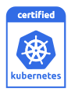

---

copyright: 
  years: 2025, 2026
lastupdated: "2026-03-05"

keywords: kubernetes, containers, 135, version 135, 135 update actions

subcollection: containers

---

{{site.data.keyword.attribute-definition-list}}

# 1.35 version information and update actions
{: #cs_versions_135}

Review information about version 1.35 of {{site.data.keyword.containerlong}}. For more information about Kubernetes project version 1.35, see the [Kubernetes change log](https://kubernetes.io/releases/notes/.){: external}.
{: shortdesc}

{: caption="Kubernetes version 1.35 certification badge" caption-side="bottom"} 

{{site.data.keyword.containerlong_notm}} is a Certified Kubernetes product for version 1.35 under the CNCF Kubernetes Software Conformance Certification program. _Kubernetes® is a registered trademark of The Linux Foundation in the United States and other countries, and is used pursuant to a license from The Linux Foundation._

## Release timeline 
{: #release_timeline_135}

The following table includes the expected release timeline for version 1.35 of {{site.data.keyword.containerlong}}. You can use this information for planning purposes, such as to estimate the general time that the version might become unsupported. 
{: shortdesc}

Dates that are marked with a dagger (`†`) are tentative and subject to change.
{: important}

| Version | Supported? | Release date | Unsupported date |
|------|------|----------|----------|
| 1.35 | Yes | {{site.data.keyword.kubernetes_135_release_date}} | {{site.data.keyword.kubernetes_135_unsupported_date}} `†` |
{: caption="Release timeline for {{site.data.keyword.containerlong_notm}} version 1.35" caption-side="bottom"}

## Preparing to update
{: #prep-up-135}

For a complete list of changes that might impact your deployed apps when you update your cluster, review the [community Kubernetes change log](https://github.com/kubernetes/kubernetes/blob/master/CHANGELOG/CHANGELOG-1.35.md){: external} and [IBM version change log](/docs/containers?topic=containers-changelog_135) for version 1.35. You can also review the [Kubernetes helpful warnings](https://kubernetes.io/blog/2020/09/03/warnings/){: external}.
{: shortdesc}

[Cluster autoscaler](https://cloud.ibm.com/docs/containers?topic=containers-cluster-scaling-classic-vpc) does not yet support version 1.35. Do not upgrade your cluster to version 1.35 if your cluster uses cluster autoscaler.
{: important}

Istio add-on version 1.26 is not supported for IBM Cloud Kubernetes Service version 1.35 because the Istio add-on does not support Istio 1.29. Do not update to IBM Cloud Kubernetes Service version 1.35 if you use the add-on in your cluster. As an alternative, you can [migrate from the Istio add-on to community Istio](https://cloud.ibm.com/docs/containers?topic=containers-istio&interface=ui#migrate).
{: important}

