---

copyright:
  years: 2014, 2025

lastupdated: "2025-12-04"

keywords: kubernetes, versions, update, upgrade

subcollection: containers

---

{{site.data.keyword.attribute-definition-list}}

# Kubernetes version information  
{: #cs_versions}

Review this page for general information about {{site.data.keyword.containerlong}} versions and updating to newer versions. 
{: shortdesc}

For more information about the Kubernetes project versions, see the [Kubernetes change logs](https://github.com/kubernetes/kubernetes/tree/master/CHANGELOG){: external}.

## Available {{site.data.keyword.containerlong_notm}} versions
{: #cs_versions_available}

<!--<qna:latest-version>-->{{site.data.keyword.containerlong_notm}} concurrently supports multiple versions of Kubernetes. When a latest version (`n`) is released, versions up to 2 behind (`n-2`) are supported. Versions more than 2 behind the latest (`n-3`) are first deprecated and then unsupported. To continue receiving important security patch updates, make sure that your clusters always run a supported Kubernetes version. Deprecated clusters might not receive security updates. For more information, see [Release lifecycle](#release_lifecycle).

{: caption="Kubernetes version support timeline" caption-side="bottom"}

Dates that are marked with a dagger (`†`) are tentative and subject to change. Operating systems that are marked with an asterisk (`*`) are deprecated. [Migrate any worker nodes](/docs/containers?topic=containers-ubuntu-migrate) that use a deprecated operating system to a newer operating system version. 
{: note}

|Version|Release date|End of support|Operating systems|Related links|
|---|---|---|---|---|
|1.33 [Default]{: tag-purple} |31 July 2025|14 October 2026†|UBUNTU 24| - [1.33 details and update actions](/docs/containers?topic=containers-cs_versions_133)  \n - [Change log](/docs/containers?topic=containers-changelog_133)|
|1.32|29 January 2025|22 April 2026†|UBUNTU 24| - [1.32 details and update actions](/docs/containers?topic=containers-cs_versions_132)  \n - [Change log](/docs/containers?topic=containers-changelog_132)|
|1.31 [Deprecated]{: tag-deprecated} |18 September 2024|18 March 2026|UBUNTU 24| - [1.31 details and update actions](/docs/containers?topic=containers-cs_versions_131)  \n - [Change log](/docs/containers?topic=containers-changelog_131)|
{: caption="Available versions for Kubernetes" caption-side="bottom"}

<!--</qna:latest-version>-->

## Update types
{: #update_types}

Your Kubernetes cluster has three types of updates: major, minor, and patch. As updates become available, you are notified when you view information about the cluster master or worker nodes, such as with the `ibmcloud ks cluster ls`, `cluster get`, `worker ls`, or `worker get` commands.
{: shortdesc}

IBM provides bi-weekly worker node fix packs. IBM's goal is to remediate detected, legitimate vulnerabilities within an appropriate time for the risks they represent. To ensure the quality and stability of the release, fix packs might be delayed.

Fix packs are applied to the latest upstream stable kernel version that is provided by Canonical.

To keep your nodes secure, you must install worker node fix packs as soon as possible. You can subscribe to notifications to be alerted when a new update is available.

|Update type|Examples of version labels|Updated by|Impact
|-----|-----|-----|-----|
|Major|1.x.x|You|Operation changes for clusters, including scripts or deployments.|
|Minor|x.22.x|You|Operation changes for clusters, including scripts or deployments.|
|Patch|x.x.4_1510|IBM and you|Kubernetes patches, as well as other {{site.data.keyword.cloud_notm}} Provider component updates such as security and operating system patches. IBM updates masters automatically, but you apply patches to worker nodes. See more about patches in the following section.|
{: caption="Impacts of Kubernetes updates" caption-side="bottom"}

Major and minor updates (1.x)
:   First, [update your master node](/docs/containers?topic=containers-update#master) and then [update the worker nodes](/docs/containers?topic=containers-update#worker_node).
    - You can't update a Kubernetes master two or more minor versions ahead (n+2). For example, if your current master is version 1.22 and you want to update to 1.24, you must update to 1.23 first.
    - Worker nodes can't run a Kubernetes major or minor version that is greater than the masters. Additionally, your worker nodes can be only up to two versions behind the master version (`n-2`).
    - If you use a `kubectl` CLI version that does not match at least the `major.minor` version of your clusters, you might experience unexpected results. Make sure to keep your Kubernetes cluster and [CLI versions](/docs/containers?topic=containers-cli-install) up-to-date.

Patch updates (x.x.4_1510)
:   Changes across patches are documented in the change log of each version. Master patches are applied automatically, but you initiate worker node patches and updates. Worker nodes can also run patch versions that are greater than the masters. As updates become available, you are notified when you view information about the master and worker nodes in the {{site.data.keyword.cloud_notm}} console or CLI, such as with the following commands: `ibmcloud ks cluster ls`, `cluster get`, `worker ls`, or `worker get`.
:   Patches can be for worker nodes, masters, or both.
    - **Worker node patches**: Check monthly to see whether an update is available, and use the [`ibmcloud ks worker update`](/docs/containers?topic=containers-kubernetes-service-cli#cs_worker_update) command or the [`ibmcloud ks worker reload`](/docs/containers?topic=containers-kubernetes-service-cli#cs_worker_reload) command to apply these security and operating system patches. During an update or reload, your worker node machine is reimaged, and data is deleted if not [stored outside the worker node](/docs/containers?topic=containers-storage-plan).
    - **Master patches**: Master patches are applied automatically over the course of several days, so a master patch version might show up as available before it is applied to your master. The update automation also skips clusters that are in an unhealthy state or have operations currently in progress. Occasionally, IBM might disable automatic updates for a specific master fix pack, as noted in the change log, such as a patch that is only needed if a master is updated from one minor version to another. In any of these cases, you can choose to safely use the [`ibmcloud ks cluster master update`](/docs/containers?topic=containers-kubernetes-service-cli#cs_cluster_update) command yourself without waiting for the update automation to apply.

## Release lifecycle
{: #release_lifecycle}

Each supported version of {{site.data.keyword.containerlong_notm}} goes through a lifecycle of testing, development, general release, support, deprecation, and becoming unsupported. Review the descriptions of each phase of a version's lifecycle. 

Estimated days and versions are provided for general understanding. Actual availability and release dates are subject to change and depend on various factors, such as community updates, security patches, and technology changes between versions.
{: note}

1. **Community release**: The community releases the new version. IBM engineers begin testing and hardening the community version in preparation to release a supported {{site.data.keyword.containerlong_notm}} version.
2. **Supported version lifecycle**:
    
    Development release
    :   Release is under development and might be available as a Beta to select customers. IBM provides best effort support for the release.

    General availability
    :   Release is generally available (GA). IBM provides full support for the release. IBM provides a tentative target date for the release to be unsupported. Release becomes the default version used during cluster creation once there are minimal restrictions and a reasonable adoption rate for the release.

    Maintenance
    :   Release has entered maintenance support as defined by the Kubernetes community. IBM provides maintenance support for Kubernetes based on community policy. IBM provides full support otherwise.

3. **Deprecated version**: The version is deprecated. IBM provides an updated unsupported target date for the release. An unsupported countdown to this date is provided at least 45 days before the release becomes unsupported. IBM provides minimal support for the release in alignment with the Kubernetes community. This support phase is generally the final phase before the release becomes unsupported and overrides the maintenance and extended support phases should there be any overlap. Security patch updates might not be provided. During the deprecation period, the version is still supported and your cluster is still functional, but might require updating to a supported release to fix security vulnerabilities. For example, by adding or reloading worker nodes.

4. **Unsupported version**: The version is unsupported. IBM only provides support to upgrade to a supported release. The version is unsupported. Unsupported clusters are not provided with security and patch updates and are not supported by {{site.data.keyword.cloud_notm}} Support. Although your cluster and apps might continue to run for a time, you can no longer create, reload, or take other corrective actions on your cluster master or worker nodes when an issue occurs. You can still delete the cluster or worker nodes, or update the cluster to the next version. Review the potential impacts and immediately [update the cluster](/docs/containers?topic=containers-update#update) to continue receiving important security updates and support. If the cluster master runs two or more versions behind the oldest supported version, you can no longer apply updates and must delete the cluster and create a new one.

Clusters running an unsupported version will eventually fail because cluster certificates expire. Failures might include, but aren't limited to, an unavailable cluster control plane, `NotReady` worker nodes, or an unhealthy Ingress.
{: important}

5. **Archived**: The version is unsupported with no upgrade path. IBM provides no support. IBM reserves the right to shut down the control planes for such clusters.

{{site.data.keyword.containerlong_notm}} has **not** expanded its supported skew between core node and control plane components by one minor version.  The supported skew remains `n-2`. For more information, see [Changes to supported skew between control plane and node versions](https://kubernetes.io/blog/2023/08/15/kubernetes-v1-28-release/#changes-to-supported-skew-between-control-plane-and-node-versions) for the Kubernetes community information.
{: note}

If you wait until your cluster is two or more minor versions behind the oldest supported version, you can't update the cluster. Instead, [create a new cluster](/docs/containers?topic=containers-clusters#clusters), [deploy your apps](/docs/containers?topic=containers-app#app) to the new cluster, and [delete](/docs/containers?topic=containers-remove) the unsupported cluster. To avoid this issue, update deprecated clusters to a supported version that is one or two behind the current version, such as 1.21 or 1.22 and then update to the latest version, 1.23. If the worker nodes run a version two or more behind the master, you might see your pods fail by entering a state such as `MatchNodeSelector`, `CrashLoopBackOff`, or `ContainerCreating` until you update the worker nodes to the same version as the master. After you update from a deprecated to a supported version, your cluster can resume normal operations and continue receiving support. You can find out whether your cluster is **unsupported** by reviewing the **State** field in the output of the `ibmcloud ks cluster ls` command or in the [{{site.data.keyword.containerlong_notm}} console](https://cloud.ibm.com/kubernetes/clusters){: external}.
{: important}

## Preparing to update
{: #prep-up}

 Updating a cluster to a new version from the previous version is likely to have an impact on deployed apps. For a complete list of changes, review the [community Kubernetes change logs](https://github.com/kubernetes/kubernetes/tree/master/CHANGELOG){: external}, [IBM version change logs](/docs/containers?topic=containers-cs_versions), and [Kubernetes helpful warnings](https://kubernetes.io/blog/2020/09/03/warnings/){: external}.
{: shortdesc}

For actions you should take before and after updating your cluster, see the version information links in [Available {{site.data.keyword.containerlong}} versions](#cs_versions_available).

## Archive
{: #k8s_version_archive}

Unsupported clusters are not provided with security and patch updates and are not supported by {{site.data.keyword.cloud_notm}} Support. Although your cluster and apps might continue to run for a time, you can no longer create, reload, or take other corrective actions on your cluster master or worker nodes when an issue occurs. You can still delete the cluster or worker nodes, or update the cluster to the next version. Review the potential impacts and immediately [update the cluster](/docs/containers?topic=containers-update#update) to continue receiving important security updates and support. If your cluster master is two or more versions behind the oldest supported version, you must [make a new cluster](/docs/containers?topic=containers-clusters#clusters) and [deploy your apps](/docs/containers?topic=containers-app#app) to the new cluster.
{: shortdesc}

Unsupported Kubernetes versions
:   [Archived version history](/docs/containers?topic=containers-cs_sitemap#sitemap_archived_version_history)
