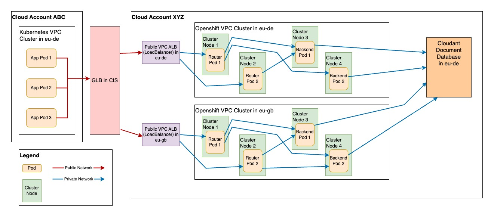
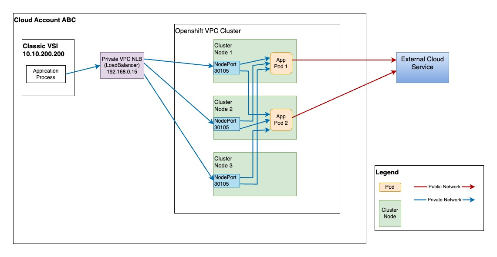

---

copyright: 
  years: 2024, 2025
lastupdated: "2025-05-29"


keywords: kubernetes, help, connectivity, debugging, containers, apps, support, network

subcollection: containers

content-type: troubleshoot

---

{{site.data.keyword.attribute-definition-list}}


# Documenting your environment architecture
{: #document-environment}
{: support}

As a best practice, create architecture diagrams for your apps. These diagrams can be used as part of the initial design work, training new team members, or educating new and existing team members. Keeping diagrams like this up to date saves time when problems need to be investigated quickly.
{: shortdesc}

By documenting your app architecture, you can ensure that you and your team throughly understand all the components in your architecture setup.

You can create an architecture diagram as part of your initial environment planning or after your environment is up and running. Review the following steps to document your environment. The examples provided are based on real-world apps.


## Step 1: Understanding your app and architecture
{: #understand-arch}

Troubleshooting apps in {{site.data.keyword.containerlong_notm}} clusters can be complicated, especially if the problem involves a network flow that spans different clusters, components, pods, or services. Documenting your app architecture can help your team thoroughly understand all the components in your setup. 

For an app with a simple network flow, architecture can be described in text. For more complicated scenarios, a detailed architecture diagram is helpful so that various teams involved with troubleshooting can understand the flow. It is also important to make sure that your architecture documentation stays up-to-date if your setup changes. 

Troubleshooting apps in {{site.data.keyword.containerlong_notm}} clusters can be difficult, especially if one or more of the following are true.

1. The app is not well understood or does not have good logging.
1. The problem is intermittent or doesn't occur often.
1. The problem involves a network flow that spans different clusters, components, pods, or services.


The following example architecture diagrams are taken from real-world scenarios. You can use these examples as a guide when creating your own architecture diagrams.


### Example 1: A basic app running in a single OpenShift cluster
{: #example-arch-1}

In this example, the entire app is running inside a single OpenShift cluster. It is a simple app where a single client pod makes a request to an in-cluster service, which then connects to an etcd instance handled by three pods.

```txt
Client                Application Service             Etcd Instance
                                             |------> [Etcd Pod 1]
                |---> [Application Pod 1] ---|
                |                            | 
[Client pod] ---|                            |------> [Etcd Pod 2]
                |                            |
                |---> [Application Pod 2] ---|
                                             |------> [Etcd Pod 3]
```
{: screen}


### Example 2: A multi-cluster architecture with a global load balancer and Cloudant service
{: #example-arch-2}

In the following diagram, the connection is initiated by one of three client pods in an cluster in the `eu-de` region. The client pods connect to a global load balancer (GLB) which then load balances the connection to one of two public VPC application load balancers (ALBs) in `eu-de` and `eu-gb`.

Each of these VPC ALBs is a part of a separate cluster in their regions. These ALBs route traffic to the OpenShift router pods, which then forward that traffic to the backend pods in the cluster. Those backend pods connect to a Cloudant database to handle the request.

Note that some of these connections are over the public network. Some are over a private network in the same VPC, and some use the private network in {{site.data.keyword.cloud_notm}} between components in a VPC and a service in {{site.data.keyword.cloud_notm}}.

{: caption="Multi-cluster architecture" caption-side="bottom"}

### Example 3: A VSI client contacting a VPC network load balancer with an external service backend
{: #example-arch-3}

In the following example, the client is a Classic VSI in {{site.data.keyword.cloud_notm}}. The VSI connects via the private network to a private VPC network load balancer (NLB) created for an VPC cluster. This NLB balances traffic to one of the three VPC worker nodes via the NodePort for the cluster Load Balancer service. The cluster Load Balancer service then sends the traffic to one of the app pods which connect to an external cloud service outside of {{site.data.keyword.cloud_notm}} over the public network.

{: caption="NLB with external service" caption-side="bottom"}


## Step 2: Choose a tool
{: #choose-arch-tool}

You can use any of the following tools to create your architecture diagram.


- [IBM Design tools](https://www.ibm.com/design/language/infographics/technical-diagrams/design/){: external}
- [Draw.io](https://app.diagrams.net/){: external}
- [Mural](https://mural.co){: external}
- [Mermaid](https://mermaid.js.org/){: external}
- Adobe Illustrator
- PowerPoint
- Keynote

There are many diagramming tools available. Choose the tool that works best for you.

## Step 3: Create the diagram
{: #create-arch-diagram}

You can use one of the examples mentioned earlier as a reference, or create a diagram from scratch.

For more information and reference architectures, see [IBM Architectures](https://www.ibm.com/architectures).


## Next steps
{: #plan-prepare}

[Prepare your account to create clusters](/docs/containers?topic=containers-clusters). 
