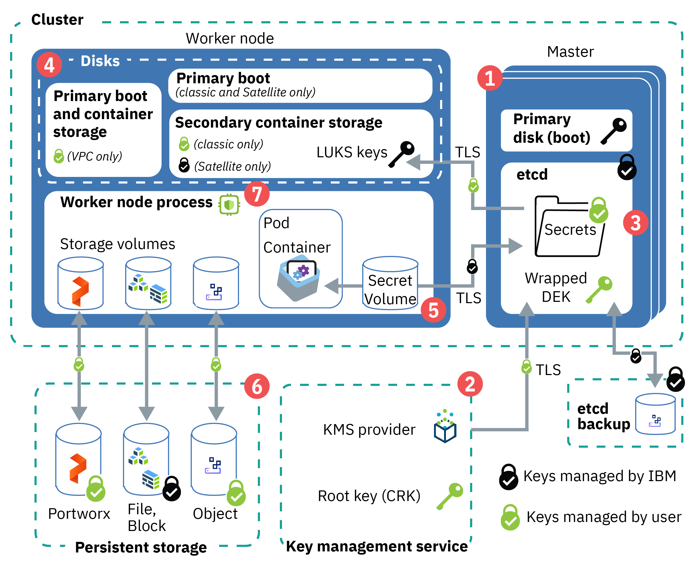

---

copyright: 
  years: 2014, 2022
lastupdated: "2022-12-01"

keywords: kubernetes, encrypt, security, kms, root key, crk

subcollection: containers


---

{{site.data.keyword.attribute-definition-list}}


# Protecting sensitive information in your cluster
{: #encryption}

Protect sensitive information in your {{site.data.keyword.containerlong}} cluster to ensure data integrity and to prevent your data from being exposed to unauthorized users.
{: shortdesc}

For more information about securing your cluster and personal information, see [Security for {{site.data.keyword.containerlong_notm}}](/docs/containers?topic=containers-security#security) and [Storing personal information](/docs/containers?topic=containers-security#pi).

## Overview of cluster encryption
{: #encrypt_ov}

The following image and description outline default and optional data encryption for {{site.data.keyword.containerlong_notm}} clusters.


{: caption="Figure 1. Overview of cluster encryption" caption-side="bottom"}


1. **Kubernetes master control plane**: Components in the Kubernetes master boot up on a LUKS-encrypted drive using an IBM-managed key. The etcd component of the master stores the configuration files of your Kubernetes resources, such as deployments and secrets. Data in etcd is stored on the local disk of the Kubernetes master and is backed up to {{site.data.keyword.cos_full_notm}}. Data is encrypted during transit to {{site.data.keyword.cos_full_notm}} and at rest. 
2. **Bring your own key (BYOK)**: When you [enable a key management service (KMS) provider](#keyprotect) for your cluster, you bring your own root key. The root key is used to encrypt the data encryption keys (DEKs) which are then used to encrypt the secrets in your cluster. The root key is stored in the KMS provider instance that you control. The encrypted DEKs are stored in etcd and can only be unencrypted using the root key from the KMS provider. For more information about how key encryption works, see [Envelope encryption](/docs/key-protect/concepts?topic=key-protect-envelope-encryption#envelope-encryption).
3. **Worker node disks**: Attached disks are used to boot your worker node, host the container file system, and store locally pulled images. The encryption and number of disks varies by infrastructure provider.

    * **VPC**: See [VPC worker nodes](#worker-encryption-vpc).
    * **Classic**: See [Classic worker nodes](#worker-encryption-classic).

4. **Cluster secrets**: When you deploy your app, don't store confidential information, such as credentials or keys, in the YAML configuration file, configmaps, or scripts. Instead, use [Kubernetes secrets](https://kubernetes.io/docs/concepts/configuration/secret/){: external}, which are base64 encoded by default. To enable encyption of your Kubernetes secrets, [enable a key management service (KMS) provider](#keyprotect) for your cluster.

5. **Persistent storage encryption**: You can choose to store data by [setting up file, block, object, or software-defined Portworx persistent storage](/docs/containers?topic=containers-storage_planning#persistent_storage_overview). If you store your data on file or block storage, your data is automatically encrypted at rest. If you use object storage, your data is also encrypted during transit. With Portworx, you can choose to [set up volume encryption](/docs/containers?topic=containers-portworx#encrypt_volumes) to protect your data during transit and at rest. The IBM Cloud infrastructure storage instances save the data on encrypted disks, so your data at rest is encrypted.
6. **Data-in-use encryption**: For select, SGX-enabled classic worker node flavors, you can use [{{site.data.keyword.datashield_short}}](#datashield) to encrypt data-in-use within the worker node.


## Understanding Key Management Service (KMS) providers
{: #kms}


You can protect Kubernetes secrets and any credentials stored in a secret by enabling a [key management service (KMS) provider](https://kubernetes.io/docs/tasks/administer-cluster/kms-provider/){: external} which provides an encryption solution using a root key you control.


### Available KMS providers
{: #kms-providers}

By default, {{site.data.keyword.containerlong_notm}} supports the following KMS providers.


* {{site.data.keyword.keymanagementservicefull}} for [public cloud](/docs/key-protect?topic=key-protect-getting-started-tutorial) or [on-prem](https://www.ibm.com/docs/en/cloud-private/3.2.0?topic=apis-key-management-service){: external} environments.
* [{{site.data.keyword.hscrypto}}](https://cloud.ibm.com/catalog/services/hyper-protect-crypto-services){: external} for keep your own key (KYOK) crypto unit support.

Because adding a different KMS provider requires updating the managed master default configuration, you can't add other KMS providers to the cluster.

You can have one KMS provider enabled in the cluster. You can switch the KMS provider, but you can't disable KMS provider encryption after it is enabled. For example, if you enabled a key management service (KMS) provider in your cluster, but want to use {{site.data.keyword.hscrypto}} instead, you can [enable](#keyprotect) {{site.data.keyword.hscrypto}} as the KMS provider.

You can't disable KMS provider encryption. Do not delete root keys in your KMS instance, even if you rotate to use a new key. If you delete a root key that a cluster uses, the cluster becomes unusable, loses all its data, and can't be recovered. Similarly, if you disable a root key, operations that rely on reading secrets fail. Unlike deleting a root key, however, you can reenable a disabled key to make your cluster usable again.
{: important}

### Controlling encryption
{: #kms-encrypt-control}

When you enable a KMS provider in your cluster, your own KMS root key is used to encrypt data encryption keys (DEKs) which are used to encrypt Kubernetes secrets. Using your own encryption root key adds a layer of security to Kubernetes secrets and gives you more granular control of who can access sensitive cluster information. For more information, see the [overview](#encrypt_ov) and your KMS provider's documentation, such as [{{site.data.keyword.keymanagementserviceshort}} envelope encryption](/docs/key-protect?topic=key-protect-envelope-encryption).

### Features and limitations of KMS providers
{: #kms-keyprotect-features}

Review the following known limitations:
* Customizing the IP addresses that are allowed to connect to your key management service, such as a {{site.data.keyword.keymanagementserviceshort}} instance, is not supported.

Additionally, your cluster version impacts the functionality of the KMS provider. To see what KMS features are available for different cluster versions of {{site.data.keyword.containerlong_notm}}, review the following table.

To check your cluster version, run the following command.
```sh
ibmcloud ks cluster ls
```
{: pre}


To take advantage of all the KMS features, encryption must be enabled on version `1.19.4_1527` or later. 

If KMS was enabled before this version, [update your cluster](/docs/containers?topic=containers-update) to at least version `1.19.4_1527` and then [reenable KMS encryption](#keyprotect) with a new root key. If you are unsure when KMS was enabled, log in to the IBM Cloud console and click on your KMS instance under [Resources](https://cloud.ibm.com/resources){: external}. Find your root key and click the **Actions** icon  > **Key associated resources**. If a CRN number is listed for your root key, then you do not need to upgrade your cluster. 
{: tip}

- Enable the cluster to use root keys to encrypt secrets. 
- Cluster secrets are automatically updated after rotating root keys. **Note** For versions before `1.19.4_1527`, you must rewrite cluster secrets manually after rotating root keys. You can rewrite secrets by using the `kubectl get secrets --all-namespaces -o json | kubectl replace -f -` command.
- You can view clusters that use the root key from the KMS provider interface.
- Clusters automatically respond if you disable, enable, or restore root keys.
- Disabling a root key restricts cluster functionality until you reenable the key.
- Deleting a root key makes the cluster unusable and unrecoverable.
- Root keys can't be deleted if the key is used by a cluster.


## Encrypting the Kubernetes secrets by using a KMS provider
{: #keyprotect}


Enable a [key management service (KMS) provider](#kms) to encrypt the Kubernetes secrets in your cluster.


### Prerequisites
{: #kms_prereqs}

Before you enable a key management service (KMS) provider in your cluster, create a KMS instance and complete the following steps.

Setting up cross-account encryption by using a KMS in a different account is supported in the CLI or API. 
{: note}

1. Create a KMS instance, such as [{{site.data.keyword.keymanagementserviceshort}}](/docs/key-protect?topic=key-protect-provision#provision) or [{{site.data.keyword.hscrypto}}](https://cloud.ibm.com/catalog/services/hyper-protect-crypto-services){: external}.
2. Create a customer root key (CRK) in your KMS instance.
    - [{{site.data.keyword.keymanagementserviceshort}} root key](/docs/key-protect?topic=key-protect-create-root-keys#create-root-keys).
    - [{{site.data.keyword.hscrypto}} root key](/docs/hs-crypto?topic=hs-crypto-create-root-keys). By default, the root key is created without an expiration date.

    **{{site.data.keyword.keymanagementserviceshort}}:** Need to set an expiration date to comply with internal security policies? [Create the root key by using the API](/docs/key-protect?topic=key-protect-create-root-keys#create-root-key-api) and include the `expirationDate` parameter. **Important**: Before your root key expires, repeat these steps to update your cluster to use a new root key. When a root key expires, the cluster secrets can't be decrypted and your cluster becomes unusable. Depending on the cluster version, the time lapse between the root key expiring and the cluster no longer being able to decrypt secrets might be about an hour, or when the master is refreshed.
    {: tip}

3. Make sure that you have the correct permissions in {{site.data.keyword.cloud_notm}} Identity and Access Management (IAM) to enable KMS in your cluster.
    * Ensure that you have the [**Administrator** {{site.data.keyword.cloud_notm}} IAM platform access role](/docs/containers?topic=containers-users#checking-perms) for the cluster.
    * Ensure that the API key owner of the [API key](/docs/containers?topic=containers-access-creds#api_key_about) that is set for the region and resource group that your cluster is in has the correct permissions for the KMS provider. For more information on granting access in IAM to the KMS provider, see the [{{site.data.keyword.keymanagementserviceshort}} user access documentation](/docs/key-protect?topic=key-protect-manage-access) or [{{site.data.keyword.hscrypto}} user access documentation](/docs/hs-crypto?topic=hs-crypto-manage-access#platform-mgmt-roles).
        * For example, to create an instance and root key, you need at least the **Editor** platform and **Writer** service access roles for your KMS provider.
        * If you plan to use an existing KMS instance and root key, you need at least the **Viewer** platform and **Reader** service access roles for your KMS provider.
    * **For clusters that run Kubernetes 1.18.8_1525 or later**: An additional **Reader** [service-to-service authorization policy](/docs/account?topic=account-serviceauth) between {{site.data.keyword.containerlong_notm}} and {{site.data.keyword.keymanagementserviceshort}} is automatically created for your cluster, if the policy does not already exist. Without this policy, your cluster can't use all the [{{site.data.keyword.keymanagementserviceshort}} features](#kms-keyprotect-features).
    {: note}

4. Consider [updating your cluster](/docs/openshift?topic=openshift-update) to at least version `1.19.4_1527` to get the latest features.
5. Enable KMS encryption.

### Enabling KMS encryption for the cluster through the CLI
{: #kms_cli}

You can enable a KMS provider, update the KMS provider instance, or update the root key through the CLI.

Setting up cross-account encryption by using a KMS in a different account is supported in the CLI or API. 
{: note}

1. Complete the [prerequisite steps](#kms_prereqs) to create a KMS instance and root key. If you want to use cross account KMS encryption, make sure to create the KMS and root key in the account whose KMS instance you want to use.
1. Get the ID of the KMS instance that you previously created.
    ```sh
    ibmcloud ks kms instance ls
    ```
    {: pre}

1. Get the **ID** of the root key that you previously created.
    ```sh
    ibmcloud ks kms crk ls --instance-id <KMS_instance_ID>
    ```
    {: pre}

1. Enable the KMS provider to encrypt secrets in your cluster. Fill in the flags with the information that you previously retrieved. The KMS provider's private cloud service endpoint is used by default to download the encryption keys. To use the public cloud service endpoint instead, include the `--public-endpoint` flag. The enablement process can take some time to complete.
    ```sh
    ibmcloud ks kms enable -c <cluster_name_or_ID> --instance-id <kms_instance_ID> --crk <root_key_ID> [--public-endpoint]
    ```
    {: pre}
    
    During the enablement, you might not be able to access the Kubernetes master such as to update YAML configurations for deployments.
    {: important}

1. Verify that the KMS enablement process is finished. The process is finished when that the **Master Status** is **Ready** and **Key management service** is **enabled**.
    ```sh
    ibmcloud ks cluster get -c <cluster_name_or_ID>
    ```
    {: pre}

    Example output when the enablement is in progress
    ```sh
    NAME:                   <cluster_name>   
    ID:                     <cluster_ID>   
    ...
    Master Status:          Key management service feature enablement in progress.  
    ```
    {: screen}

    Example output when the master is ready
    ```sh
    NAME:                   <cluster_name>   
    ID:                     <cluster_ID>   
    ...
    Master Status:          Ready (1 min ago)
    ...
    Key Management Service: enabled   
    ```
    {: screen}

    After the KMS provider is enabled in the cluster, all cluster secrets are automatically encrypted.
    {: note}

1. Optional: [Verify that your secrets are encrypted](#verify_kms).

Do not delete root keys in your KMS instance, even if you rotate to use a new key. If you delete a root key that a cluster uses, the cluster becomes unusable, loses all its data, and can't be recovered. When you rotate a root key, you can't reuse a previous root key for the same cluster. Similarly, if you disable a root key, operations that rely on reading secrets fail. Unlike deleting a root key, however, you can reenable a disabled key to make your cluster usable again.
{: important}

### Enabling KMS encryption for the cluster through the console
{: #kms_ui}

You can enable a KMS provider, update the KMS provider instance, or update the root key through the {{site.data.keyword.cloud_notm}} console.


1. Complete the [prerequisite steps](#kms_prereqs) to create a KMS instance and root key.
1. From the [Kubernetes clusters console](https://cloud.ibm.com/kubernetes/clusters){: external}, select the cluster that you want to enable encryption for.
1. From the **Overview** tab, in the **Summary > Key management service** section, click **Enable**. If you already enabled the KMS provider, click **Update**.
1. Select the **Key management service instance** and **Root key** that you want to use for the encryption.

    During the enablement, you might not be able to access the Kubernetes master such as to update YAML configurations for deployments.
    {: important}
    
1. Click **Enable** (or **Update**).
1. Verify that the KMS enablement process is finished. From the **Summary > Master status** section, you can check the progress.
    Example output when the enablement is in progress.
    ```sh
    Master status   KMS feature enablement in progress.  
    ```
    {: screen}

    Example output when the master is ready.
    ```sh
    Master status   Ready
    ```
    {: screen}

    After the KMS provider is enabled in the cluster, all cluster secrets are automatically encrypted.
    {: note}

1. Optional: [Verify that your secrets are encrypted](#verify_kms).

Do not delete root keys in your KMS instance, even if you rotate to use a new key. If you delete a root key that a cluster uses, the cluster becomes unusable, loses all its data, and can't be recovered. When you rotate a root key, you can't reuse a previous root key for the same cluster. Similarly, if you disable a root key, operations that rely on reading secrets fail. Unlike deleting a root key, however, you can reenable a disabled key to make your cluster usable again.
{: important}

### Rotating the root key for your cluster
{: #kms_rotate}

To rotate the root key that is used to encrypt your cluster, you can repeat the steps to enable KMS encryption from the [CLI](#kms_cli) or [console](#kms_ui). When you rotate a root key, you can't reuse a previous root key for the same cluster.


Additionally, if your cluster runs version `1.19.4_1527` or later, you can [rotate the root key](/docs/key-protect?topic=key-protect-rotate-keys) from your KMS instance. This action automatically re-enables KMS in your cluster with the new root key.

## Verifying secret encryption
{: #verify_kms}

After you enable a KMS provider in your {{site.data.keyword.containerlong_notm}} cluster, you can verify that your cluster secrets are encrypted by disabling the root key. When you disable the root key, the cluster can no longer decrypt the secrets and becomes unusable, which signifies that your secrets were encrypted.


Before you begin
- Consider [updating your cluster](/docs/containers?topic=containers-update) to at least Kubernetes version `1.19`. If you don't update your cluster to this version, changes to the root key are not reported in the cluster health status and take longer to take effect in your cluster.
- Make sure that you have the {{site.data.keyword.cloud_notm}} IAM **Administrator** platform and **Manager** service access role for the cluster.

To verify secret encryption by disabling a root key

1. [Enable KMS encryption in your cluster](#keyprotect). To check that KMS encryption is enabled, verify that the **Key Management Service** status is set to `enabled` in the output of the following command.
    ```sh
    ibmcloud ks cluster get -c <cluster_name_or_ID>
    ```
    {: pre}

2. [Log in to your account. If applicable, target the appropriate resource group. Set the context for your cluster.](/docs/containers?topic=containers-cs_cli_install#cs_cli_configure)
3. Verify that you can list the secrets in your cluster.
    ```sh
    kubectl get secrets --all-namespaces
    ```
    {: pre}

4. In your KMS instance, [disable the root key](/docs/key-protect?topic=key-protect-disable-keys) that is used to encrypt your cluster. If you encrypted your cluster with a KMS and CRK from a different account, the CRK can only be disabled from the account where it is located.
5. Wait for the cluster to detect the change to your root key.

    In clusters that run a version earlier than `1.19`, you might need to wait for an hour or longer.
    {: note}

6. Try to list your secrets. You get a timeout error because you can no longer connect to your cluster. If you try to set the context for your cluster by running `ibmcloud ks cluster config`, the command fails.
    ```sh
    kubectl get secrets --all-namespaces
    ```
    {: pre}

    Example output

    ```sh
    Unable to connect to the server: dial tcp 169.48.110.250:32346: i/o timeout
    ```
    {: screen}

7. For clusters that run Kubernetes version `1.19` or later, check that your cluster is in a **warning** state. Your cluster remains in this state and is unusable until you enable your root key again.
    ```sh
    ibmcloud ks cluster get -c <cluster_name_or_ID>
    ```
    {: pre}

8. In your KMS instance, [enable the root key](/docs/key-protect?topic=key-protect-disable-keys) so that your cluster returns to a **normal** state and becomes usable again.


## Managing encryption for the worker nodes in your cluster
{: #worker-encryption}

You can manage the encryption of the local disks in your worker nodes by using a [key management service (KMS) provider](#kms) such as [{{site.data.keyword.keymanagementserviceshort}}](/docs/key-protect?topic=key-protect-getting-started-tutorial){: external}. The way that you manage encryption for worker nodes depends on the infrastructure provider.


### Classic worker nodes
{: #worker-encryption-classic}

**Classic infrastructure**: Classic worker nodes have two disks, and you can manage encryption for the second disk.


- The primary disk has the kernel images to boot your worker node. This disk is unencrypted.
- The secondary disk has the container file system and locally pulled images. This disk is AES 256-bit encrypted with an IBM-managed LUKS encryption key that is unique to the worker node and stored as a Kubernetes secret in your cluster. When you reload or update your worker nodes, the LUKS keys are rotated. 

### VPC worker nodes
{: #worker-encryption-vpc}

**VPC infrastructure**: By default, the one primary disk of VPC worker nodes is AES-256 bit encrypted at rest by the [underlying VPC infrastructure provider](/docs/vpc?topic=vpc-block-storage-about#vpc-storage-encryption).


You can manage the encryption of the worker nodes by enabling a KMS provider at the worker pool level.

1. Complete the same [prerequisite steps](#kms_prereqs) for enabling a KMS provider at the cluster level, including to create your own KMS instance and root key. You don't have to enable encryption at the cluster level, but you might want to so that you manage the encryption of cluster secrets.
2. Make sure that you have [service authorization policies in {{site.data.keyword.cloud_notm}} IAM](https://cloud.ibm.com/iam/authorizations){: external}, created under the account where the KMS instance resides, with the following details:
    - **Required service access policy for Kubernetes Service and the KMS provider**
        1. Set the **Source account** for **This account** if the cluster you want to authorize accessing KMS resides in the current account, otherwise if the cluster located under a different account, select **Other account** and provide the account ID.
        2. Set the **Source service** to **Kubernetes Service**.
        3. Set the **Target service** to your KMS provider, such as **Key Protect**.
        4. Include at least **Reader** service access.
        5. Enable the authorization to be delegated by the source and dependent services.
    - **Required service access policy for Cloud Block Storage and the KMS provider**
        1. Set the **Source account** for **This account** if the cluster you want to authorize accessing KMS resides in the current account, otherwise if the cluster located under a different account, select **Other account** and provide the account ID.
        2. Set the **Source service** to **Cloud Block Storage**.
        3. Set the **Target service** to your KMS provider, such as **Key Protect**.
        4. Include at least **Reader** service access.

    {{site.data.keyword.containerlong_notm}} automatically creates a service-to-service delegation policy for the Cloud Block Storage service in the IBM-managed service account to the KMS provider instance under the account where the KMS instance and CRK reside. This delegation policy is required so that the VPC infrastructure can encrypt the boot volume of the worker nodes in the IBM-managed service account with your customer-provided root key of the KMS provider. 
    {: note}

3. Create a cluster or worker pool that includes the account where the KMS instance resides, the KMS provider instance and root key. Each worker node in the worker pool then is encrypted by the KMS provider that you manage. Each worker pool in your cluster can use the same KMS instance and root key, the same KMS instance with different root keys, or different instances.
    - **Creating a cluster**: Only the `default` worker pool's nodes are encrypted. After you create the cluster, if you create more worker pools, you must enable encryption in each pool separately. For more information, see [Creating clusters](/docs/containers?topic=containers-cluster-create-vpc-gen2&interface=ui) or the [CLI reference documentation](/docs/containers?topic=containers-kubernetes-service-cli#cli_cluster-create-vpc-gen2).
        - **UI**: From the [cluster creation page](https://cloud.ibm.com/kubernetes/catalog/create){: external}, make sure to include the **KMS instance**, **Root key** and optionally, if the KMS instance resides in a different account, the **KMS account** fields.
        - **CLI**: Make sure to include the `--kms-instance-id`, `--crk` fields and also the optional`--kms-account-id` field if the KMS instance resides in an account different from the clusters account, such as in the following VPC example.
            ```sh
            ibmcloud ks cluster create vpc-gen2 --name <cluster_name> --zone <vpc_zone> --vpc-id <vpc_ID> --subnet-id <vpc_subnet> --flavor <flavor> --workers <number_of_workers_per_zone> --kms-account-id <kms_account_ID> --kms-instance-id <kms_instance_ID> --crk <kms_root_key_ID>
            ```
            {: codeblock}

    - **Creating a worker pool**: For more information, see [Creating VPC worker pools](/docs/containers?topic=containers-add_workers#vpc_add_pool) or the [CLI reference documentation](/docs/containers?topic=containers-kubernetes-service-cli#cli_worker_pool_create_vpc_gen2).
        - **UI**: After selecting your cluster from the [Kubernetes clusters console](https://cloud.ibm.com/kubernetes/clusters){: external}, click **Worker pools > Add**. Then,  make sure to include the **KMS instance**, **Root key** and optionally, if the KMS instance resides in a different account, the **KMS account** fields.
        - **CLI**: Make sure to include the `--kms-instance-id`, `--crk` fields and also the optional`--kms-account-id` field if the KMS instance resides in an account different from the clusters account, such as in the following VPC example.
            ```sh
            ibmcloud ks worker-pool create vpc-gen2 --name <worker_pool_name> --cluster  <cluster_name_or_ID> --flavor <flavor> --size-per-zone <number_of_workers_per_zone> --vpc-id <VPC ID> --kms-account-id <kms_account_ID> --kms-instance-id <kms_instance_ID> --crk <kms_root_key_ID>
            ```
            {: codeblock}

4. Verify that your worker pool is encrypted by reviewing the worker pool details.
    - **UI**: After selecting your cluster from the [Kubernetes clusters console](https://cloud.ibm.com/kubernetes/clusters){: external}, click **Worker pools**. Then, click your worker pool.
    - **CLI**: Review the **KMS** and **CRK** fields in the output of the following command.
        ```sh
        ibmcloud ks worker-pool get --name <worker_pool_name> --cluster <cluster_name_or_ID>
        ```
        {: codeblock}

5. Optional: [Rotate the root key](/docs/vpc?topic=vpc-vpc-encryption-managing&interface=ui) periodically per your company's security compliance guidelines. For more information, see the [Managing encryption topic in the VPC documentation](/docs/vpc?topic=vpc-vpc-encryption-managing).

    Do not delete your KMS instance. You can't change the KMS instance that is used to encrypt the worker pool. If you disable or delete the root key, your worker nodes enter a `critical` state until you restore the root key and [reboot](/docs/containers?topic=containers-kubernetes-service-cli#cs_worker_reboot) the worker nodes.
    {: important}

The encryption for the disks of the worker nodes in your worker pool are now managed by the root key in your KMS provider. If you created a cluster, the worker pool is the `default` worker pool.


## Encrypting data in classic clusters by using IBM Cloud Data Shield 
{: #datashield}

{{site.data.keyword.datashield_short}} is integrated with Intel® Software Guard Extensions (SGX) and Fortanix® technology so that the app code and data of your containerized workloads are protected in use. The app code and data run in CPU-hardened enclaves, which are trusted areas of memory on the worker node that protect critical aspects of the app, which helps to keep the code and data confidential and unmodified.


Applies to only classic clusters. VPC clusters can't have bare metal worker nodes, which are required to use {{site.data.keyword.datashield_short}}.
{: note}

When it comes to protecting your data, encryption is one of the most popular and effective controls. But, the data must be encrypted at each step of its lifecycle for your data to be protected. During its lifecycle, data has three phases. It can be at rest, in motion, or in use. Data at rest and in motion are generally the area of focus when you think of securing your data. But, after an application starts to run, data that is in use by CPU and memory is vulnerable to various attacks. The attacks might include malicious insiders, root users, credential compromise, OS zero-day, network intruders, and others. Taking that protection one step further, you can now encrypt data in use.

If you or your company require data sensitivity due to internal policies, government regulations, or industry compliance requirements, this solution might help you to move to the cloud. Example solutions include financial and healthcare institutions, or countries with government policies that require on-premises cloud solutions.

To get started, provision an SGX-enabled bare metal worker cluster with a [supported flavor for {{site.data.keyword.datashield_short}}](/docs/data-shield?topic=data-shield-getting-started).

