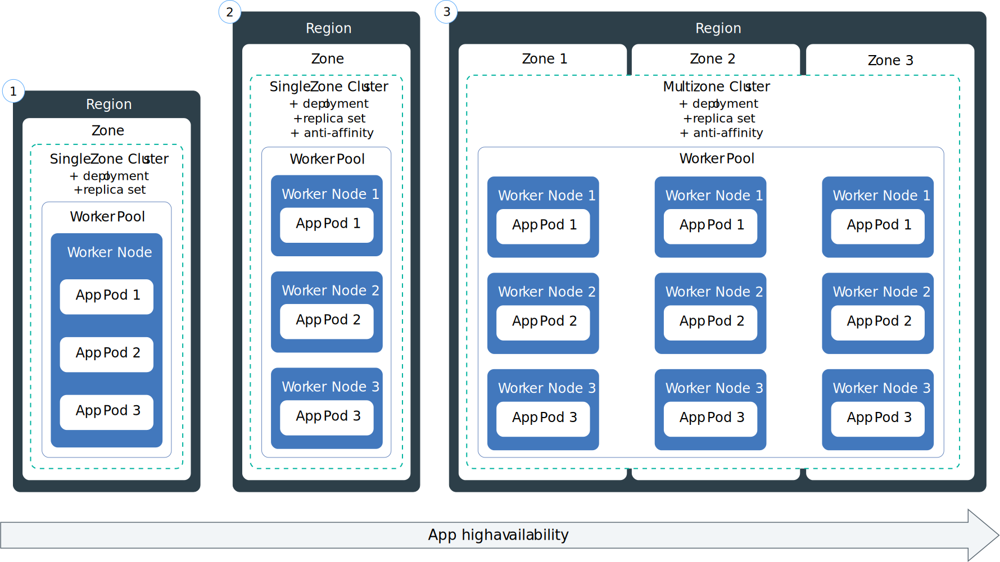

---

copyright: 
  years: 2025, 2025
lastupdated: "2025-03-28"

keywords: high availability, disaster recover, HA, DR, responsibilities

subcollection: containers

---

{{site.data.keyword.attribute-definition-list}}

# Understanding high availability and disaster recovery for {{site.data.keyword.containerlong_notm}}
{: #iks-ha-dr}

High availability{: term} (HA) is the ability for a service to remain operational and accessible in the presence of unexpected failures. Disaster recovery{: term} is the process of recovering the service instance to a working state. {: shortdesc}

{{site.data.keyword.containerlong_notm}} is a highly available regional or zonal service designed for availability during a regional or zonal outage. Kubernetes Service is designed to meet the Service Level Objectives (SLO) with the Standard plan.

For more information about the available region and data center locations, see Service and infrastructure availability by location.

## High availability architecture
{: #ha-architecture}

{{site.data.keyword.containerlong_notm}} architecture creates high availability at the regional, zone, and cluster levels. 

Region availability
:    Every region is set up with a highly available load balancer that is accessible from the region-specific API endpoint. The load balancer routes incoming and outgoing requests to clusters in the regional zones. The likelihood of a full regional failure is low. However, to account for this failure, you can set up multiple clusters in different regions and connect them by using an external load balancer. If an entire region fails, the cluster in the other region can take over the workload.

Cluster and zone availability
:    A zone failure affects all physical compute hosts and NFS storage. Failures include power, cooling, networking, or storage outages, and natural disasters, like flooding, earthquakes, and hurricanes. To protect against a zone failure, you must have clusters in two different zones that are load balanced by an external load balancer. Create a cluster in a multizone location, which spreads the master across zones. Or, consider setting up a second cluster in another zone.

Multizone availability
:    Multizone clusters distribute workloads across multiple worker nodes and zones, creating additional protection against zone failures. Worker nodes are automatically deployed with three replicas spread across multiple zones. If an entire zone experiences an outage, your workload is scheduled onto worker nodes in the other zones, protecting your app from the outage.

Global load balancing
:    To protect your app from a master failure or for classic clusters that must reside in one of the supported multizone regions, you can create multiple clusters in different zones within a region, and connect them with a global load balancer. 

### Resource distribution for high availability. 
{: #ha-architecture-dist}

Your users are less likely to experience downtime when you distribute your apps across multiple worker nodes, zones, and clusters. Built-in capabilities, like load balancing and isolation, increase resiliency against potential failures with hosts, networks, or apps. Review these potential cluster setups that are ordered with increasing degrees of availability. For more information on how IBM Cloud resources are distributed across geographic zones and regions, review the [Locations documentation](/docs/containers?topic=containers-regions-and-zones).

{: caption="High availability for clusters" caption-side="bottom"}

Single zone clusters 
:    [Classic only]{: tag-classic-inf} 
:    Single zone clusters have worker nodes that are distributed across separate physical hosts within the same zone. This option protects against certain outages, such as during a master update, and is simpler to manage. However, it does not protect your apps if an entire zone experiences an outage.

Multi zone clusters 
:    [Classic]{: tag-classic-inf} [VPC]{: tag-vpc} 
:    Multi zone clusters have worker nodes automatically deployed with three replicas spread across multiple zones. If an entire zone experiences an outage, your workload is scheduled onto worker nodes in the other zones, protecting your app from the outage.

Multiple clusters linked with load balancers 
:    [Classic]{: tag-classic-inf} [VPC]{: tag-vpc} 
:    Multiple clusters can be set up in the same zone or in different zones and connected via a global load balancer. This option is useful if you must provision a cluster in a single zone region, but you still want the benefits of multi zone availability.

## High availability features
{: #ha-features}

Review the features available to you to provide high availability for your apps and services. 

| Feature | Description |
|---------| ----------- |
| [Anti-affinity options](/docs/containers?topic=containers-app#affinity) | Use anti-affinity rules to spread pod deployment across worker nodes instead of restricting deployment to specific nodes. This provides additional flexibility for your workload.  |
| [Replica sets](/docs/containers?topic=containers-app#replicaset) | To increase the availability of your app, you can specify a replica set in your deployment. If one app instance goes down, Kubernetes automatically spins up a new instance of your app to maintain the specified number of app instances. |
| Multizone load balancing (Classic) | When you create a multizone classic cluster, a multizone load balancer is automatically created in each zone that your cluster resides in to handle all incoming requests to your apps and load balance requests among application load balancers (ALBs) in your cluster's zones. It also enables health checks for the public Ingress IP addresses. |
| VPC load balancing (VPC)| When you create a VPC cluster, a VPC load balancer is automatically created for you to handle all incoming requests to your apps and load balance requests among application load balancers (ALBs) in your cluster's zones. It also enables health checks for the public Ingress IP addresses.
| [Cluster autoscaler](/docs/containers?topic=containers-cluster-scaling-classic-vpc&interface=ui) | The cluster autoscaler add-on automatically scales the worker pools in your cluster to increase or decrease the number of worker nodes in the worker pool based on the sizing needs of your scheduled workloads. |
{: caption="HA features for IBM Cloud Kubernetes Service" caption-side="bottom"}

## Disaster recovery features
{: #dr-features}

The general strategy for disaster recovery is to configure storage and backups of your data with solutions such as Portworx.

Kubernetes Service supports the following disaster recovery features:

| Feature | Description |
|---------| ----------- |
| [Cloud Object Storage (COS)](/docs/cloud-object-storage) | A persistent, highly available storage option that mounts to your apps, available as a plug-in. Review the [limitations](/docs/openshift?topic=openshift-storage-cos-understand#cos_limitations).|
| [Autorecovery](/docs/containers?topic=containers-health-monitor#autorecovery) | The Autorecovery system uses various checks to query worker node health status. If Autorecovery detects an unhealthy worker node based on the configured checks, Autorecovery triggers a corrective action like rebooting a VPC worker node or reloading the operating system in a classic worker node.|
| [Data portability with Velero](/docs/containers?topic=containers-data-portability&q=velero&tags=containers#export-velero) | A third-party option for exporting data from your cluster to an IBM COS instance or another s3 provider. | Requires an IBM COS instance and bucket. |
| [Data portability using the `kubectl` CLI](/docs/containers?topic=containers-data-portability&q=velero&tags=containers#export-procedure-kubectl) | Export data by using the `kubectl` CLI. |
{: caption="DR features for IBM Cloud Kubernetes Service" caption-side="bottom"}

Review [additional options for exporting data](/docs/openshift?topic=openshift-data-portability#data-other), such as `rclone` or OADP.
{: note}

## Recovery time objective (RTO) and recovery point objective (RPO)
{: #rto-rpo-features}

| Feature | RTO and RPO | Considerations
| -------------- | -------------- | ----------- |
| Cloud Object Storage | See the [object storage docs](/docs/cloud-object-storage?topic=cloud-object-storage-cos-ha-dr#rto-rpo-features). | 
{: caption="RTO/RPO features for IBM Cloud Kubernetes Service" caption-side="bottom"}

## How {{site.data.keyword.IBM}} helps ensure disaster recovery
{: #ibm-disaster-recovery}

{{site.data.keyword.IBM}} takes specific recovery actions for {{site.data.keyword.containerlong_notm}} if a disaster occurs. 

### How {{site.data.keyword.IBM_notm}} recovers from failures
{: #ibm-zone-failure}

In the event of a zone or regional failure, IBM is responsible for the recovery of  components. IBM will attempt to restore the cluster in the same region based on the last state in internal persistent storage. IBM updates and recovers operational components within the cluster, such as the Ingress application load balancer and file storage plug-in.

IBM also provides the ability to integrate with other IBM Cloud services such as storage providers so that data can be backed up and restored. It is your responsibility to implement these integrations. 

## How {{site.data.keyword.IBM_notm}} maintains services
{: #ibm-service-maintenance}

All upgrades follow {{site.data.keyword.IBM_notm}} service best practices, including recovery plans and rollback processes. Regular maintenance might cause short interruptions, mitigated by [client availability retry logic](/docs/resiliency?topic=resiliency-high-availability-design#client-retry-logic-for-ha). Changes are rolled out sequentially, region by region, and zone by zone within a region. {{site.data.keyword.IBM_notm}} reverts updates at the first sign of a defect.

Complex changes are enabled and disabled with feature flags to control exposure.

Changes that impact customer workloads are detailed in {{site.data.keyword.cloud_notm}} notifications. For more information about planned maintenance, announcements, and release notes that impact this service, see [Monitoring notifications and status](/docs/account?topic=account-viewing-cloud-status).

## Your responsibilities for high availability and disaster recovery
{: #feature-responsibilities}

It is your responsibility to continuously test your plan for HA and DR.

Interruptions in network connectivity and short periods of unavailability of a service might occur. It is your responsibility to make sure that application source code includes [client availability retry logic](/docs/resiliency?topic=resiliency-high-availability-design#client-retry-logic-for-ha) to maintain high availability of the application.
{: note}

You are responsible for configuring your cluster to achieve the appropriate level of availability for your apps and services. The level of availability that you set up for your cluster impacts your coverage under the [{{site.data.keyword.cloud_notm}} HA service level agreement terms](/docs/overview?topic=overview-slas). For example, to receive full HA coverage under the SLA terms, you must set up a multizone cluster with a total of at least 6 worker nodes, two worker nodes per zone that are evenly spread across three zones.

You are responsible for the recovery of the workloads that run the cluster and your application data. For more information on your responsibilities for disaster recovery, see [Your responsibilities with using IBM Cloud Kubernetes Service](/docs/containers?topic=containers-responsibilities_iks#disaster-recovery).

## Change management
{: #change-management-hadr}

Change management includes tasks such as upgrades, configuration changes, and deletion. Keep the following points in mind to reduce downtime or data loss for your workload. 

- It is recommended that you grant users and processes the IAM roles and actions with the least privilege required for their work. For example, limit the ability to delete production resources.

- Use the API, CLI, or console tools to apply the provided worker node updates that include operating system patches, or to request that worker nodes are rebooted, reloaded, or replaced.

- Use the API, CLI, or console tools to apply the provided major and minor [Kubernetes master updates](/docs/containers?topic=containers-cs_versions#cs_versions_available) and major, minor, and [patch worker node updates](/docs/containers?topic=containers-cs_versions#update_types). Make sure to review the information and requirements for each version update to prevent issues or downtime. 

- Make sure your cluster worker nodes run the latest [Ubuntu](/docs/containers?topic=containers-ubuntu-migrate) version. 

- Make sure to understand the [release schedules](/docs/containers?topic=containers-supported-cluster-addon-versions) for any add-ons you run in your cluster. 

## Considerations for app and service deployment
{: #app-considerations}

How you configure your cluster impacts the level of availability you achieve for your apps and services. The more widely you distribute your setup across multiple worker nodes and clusters, the less likely your users are to experience downtime with your app.

Review the following potential app setups that are ordered with increasing degrees of availability.

{: caption="Stages of high availability for an app" caption-side="bottom"}

1. A deployment with n+2 pods that are managed by a replica set on a single node.
2. A deployment with n+2 pods that are managed by a replica set and spread across multiple nodes (anti-affinity) in a single zone cluster.
3. A deployment with n+2 pods that are managed by a replica set and spread across multiple nodes (anti-affinity) in a multizone cluster across zones.

 Review the following documentation for information on creating a highly available work load. 

- [Planning highly available deployments](/docs/containers?topic=containers-plan_deploy#highly_available_apps)
- [Cluster high availability strategy](/docs/containers?topic=containers-strategy)
- [Your responsibilities with using IBM Cloud Kubernetes Service](/docs/containers?topic=containers-responsibilities_iks)
