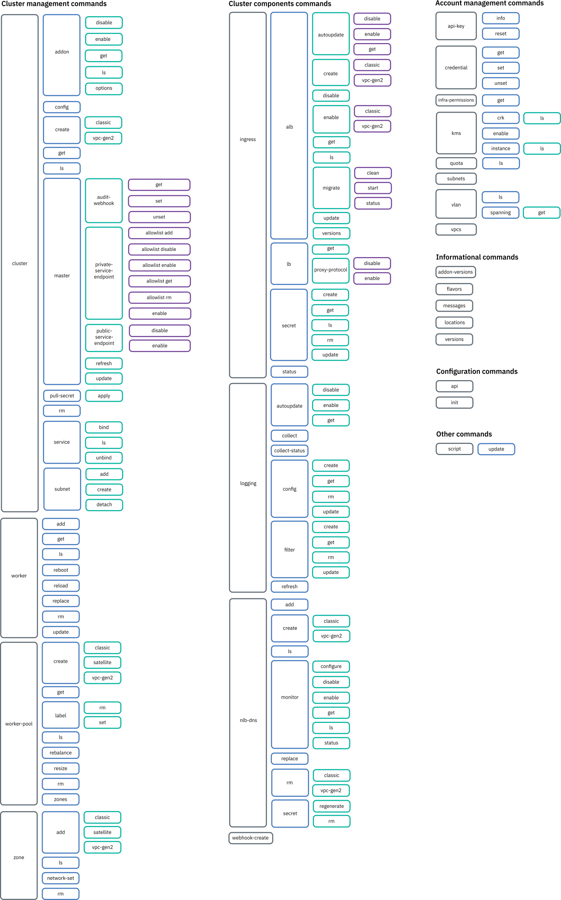

---

copyright:
  years: 2014, 2021
lastupdated: "2021-08-12"

keywords: kubernetes, iks, ibmcloud, ic, ks, ibmcloud ks, ibmcloud oc, oc

subcollection: containers

---

{:DomainName: data-hd-keyref="APPDomain"}
{:DomainName: data-hd-keyref="DomainName"}
{:android: data-hd-operatingsystem="android"}
{:api: .ph data-hd-interface='api'}
{:apikey: data-credential-placeholder='apikey'}
{:app_key: data-hd-keyref="app_key"}
{:app_name: data-hd-keyref="app_name"}
{:app_secret: data-hd-keyref="app_secret"}
{:app_url: data-hd-keyref="app_url"}
{:audio: .audio}
{:authenticated-content: .authenticated-content}
{:beta: .beta}
{:c#: .ph data-hd-programlang='c#'}
{:c#: data-hd-programlang="c#"}
{:cli: .ph data-hd-interface='cli'}
{:codeblock: .codeblock}
{:curl: #curl .ph data-hd-programlang='curl'}
{:curl: .ph data-hd-programlang='curl'}
{:deprecated: .deprecated}
{:dotnet-standard: .ph data-hd-programlang='dotnet-standard'}
{:download: .download}
{:external: .external target="_blank"}
{:external: target="_blank" .external}
{:faq: data-hd-content-type='faq'}
{:fuzzybunny: .ph data-hd-programlang='fuzzybunny'}
{:generic: data-hd-operatingsystem="generic"}
{:generic: data-hd-programlang="generic"}
{:gif: data-image-type='gif'}
{:go: .ph data-hd-programlang='go'}
{:help: data-hd-content-type='help'}
{:hide-dashboard: .hide-dashboard}
{:hide-in-docs: .hide-in-docs}
{:important: .important}
{:ios: data-hd-operatingsystem="ios"}
{:java: #java .ph data-hd-programlang='java'}
{:java: .ph data-hd-programlang='java'}
{:java: data-hd-programlang="java"}
{:javascript: .ph data-hd-programlang='javascript'}
{:javascript: data-hd-programlang="javascript"}
{:middle: .ph data-hd-position='middle'}
{:navgroup: .navgroup}
{:new_window: target="_blank"}
{:node: .ph data-hd-programlang='node'}
{:note: .note}
{:note:.deprecated}
{:objectc: .ph data-hd-programlang='Objective C'}
{:objectc: data-hd-programlang="objectc"}
{:org_name: data-hd-keyref="org_name"}
{:php: .ph data-hd-programlang='PHP'}
{:php: data-hd-programlang="php"}
{:pre: .pre}
{:preview: .preview}
{:python: .ph data-hd-programlang='python'}
{:python: data-hd-programlang="python"}
{:right: .ph data-hd-position='right'}
{:route: data-hd-keyref="route"}
{:row-headers: .row-headers}
{:ruby: .ph data-hd-programlang='ruby'}
{:ruby: data-hd-programlang="ruby"}
{:runtime: architecture="runtime"}
{:runtimeIcon: .runtimeIcon}
{:runtimeIconList: .runtimeIconList}
{:runtimeLink: .runtimeLink}
{:runtimeTitle: .runtimeTitle}
{:screen: .screen}
{:script: data-hd-video='script'}
{:service: architecture="service"}
{:service_instance_name: data-hd-keyref="service_instance_name"}
{:service_name: data-hd-keyref="service_name"}
{:shortdesc: .shortdesc}
{:space_name: data-hd-keyref="space_name"}
{:step: data-tutorial-type='step'}
{:step: data-tutorial-type='step'} 
{:subsection: outputclass="subsection"}
{:support: data-reuse='support'}
{:swift: #swift .ph data-hd-programlang='swift'}
{:swift: .ph data-hd-programlang='swift'}
{:swift: data-hd-programlang="swift"}
{:table: .aria-labeledby="caption"}
{:term: .term}
{:terraform: .ph data-hd-interface='terraform'}
{:tip: .tip}
{:tooling-url: data-tooling-url-placeholder='tooling-url'}
{:topicgroup: .topicgroup}
{:troubleshoot: data-hd-content-type='troubleshoot'}
{:tsCauses: .tsCauses}
{:tsResolve: .tsResolve}
{:tsSymptoms: .tsSymptoms}
{:tutorial: data-hd-content-type='tutorial'}
{:ui: .ph data-hd-interface='ui'}
{:unity: .ph data-hd-programlang='unity'}
{:url: data-credential-placeholder='url'}
{:user_ID: data-hd-keyref="user_ID"}
{:vbnet: .ph data-hd-programlang='vb.net'}
{:video: .video}

 
  

# {{site.data.keyword.containerlong_notm}} CLI
{: #kubernetes-service-cli}

Refer to these commands to create and manage **both community Kubernetes or {{site.data.keyword.openshiftshort}} clusters** in {{site.data.keyword.containerlong}}.
{: shortdesc}

* **Community Kubernetes**: [Install the CLI plug-in](/docs/containers?topic=containers-cs_cli_install#cs_cli_install_steps), which uses the `ibmcloud ks` alias.
* **OpenShift**: [Install the CLI plug-in](/docs/openshift?topic=openshift-openshift-cli), which uses the `ibmcloud oc` alias.

In the command line, you are notified when updates to the `ibmcloud` CLI and plug-ins are available. Be sure to keep your CLI up-to-date so that you can use all available commands and flags.

Looking for `ibmcloud cr` commands? See the [{{site.data.keyword.registrylong_notm}} CLI reference](/docs/Registry?topic=container-registry-cli-plugin-containerregcli). Looking for `kubectl` commands? See the [Kubernetes documentation](https://kubectl.docs.kubernetes.io/){: external}.
{: tip}

The following image depicts the structure and grouping of the `ibmcloud ks` commands.
{: shortdesc}

{: caption="Image of the structure and groupings of commands in {{site.data.keyword.containerlong_notm}} plug-in" caption-side="bottom"}

## `cluster` commands
{: #cluster}

Create, view, and modify clusters and cluster settings, such as add-on, subnet, and master settings.
{: shortdesc}

### `ibmcloud ks cluster addon disable`
{: #cs_cluster_addon_disable}

Disable a managed add-on in an existing cluster. This command must be combined with one of the following subcommands for the managed add-on that you want to disable.
{: shortdesc}

#### `ibmcloud ks cluster addon disable alb-oauth-proxy`
{: #cs_cluster_addon_disable_alb-oauth-proxy}


Disable the add-on for the [ALB OAuth Proxy](/docs/containers?topic=containers-debug-tool) in a cluster.
{: shortdesc}

```sh
ibmcloud ks cluster addon disable alb-oauth-proxy --cluster CLUSTER
```
{: pre}

**Supported infrastructure provider**:
*  Classic
*  VPC

**Minimum required permissions**: **Administrator** platform access role for the cluster in {{site.data.keyword.containerlong_notm}}

**Command options**:
<dl>
<dt><code>-c, --cluster <em>CLUSTER</em></code></dt>
<dd>Required: The name or ID of the cluster.</dd>
</dl>

**Example**:
  ```sh
  ibmcloud ks cluster addon disable alb-oauth-proxy --cluster my_cluster
  ```
  {: pre}

#### `ibmcloud ks cluster addon disable debug-tool`
{: #cs_cluster_addon_disable_debug}

Disable the add-on for the {{site.data.keyword.containerlong_notm}} Diagnostics and Debug Tool.
{: shortdesc}

```sh
ibmcloud ks cluster addon disable debug-tool --cluster CLUSTER [-f]
```
{: pre}

**Supported infrastructure provider**:
*  Classic
*  VPC

**Minimum required permissions**: **Administrator** platform access role for the cluster in {{site.data.keyword.containerlong_notm}}

**Command options**:
<dl>
<dt><code>-c, --cluster <em>CLUSTER</em></code></dt>
<dd>Required: The name or ID of the cluster.</dd>

<dt><code>-f</code>
<dd>Optional: Force the command to run with no user prompts.</dd>
</dl>

#### `ibmcloud ks cluster addon disable istio`
{: #cs_cluster_addon_disable_istio}

Disable the managed Istio add-on. Removes all Istio core components from the cluster, including Prometheus.
{: shortdesc}

```sh
ibmcloud ks cluster addon disable istio --cluster CLUSTER [-f]
```
{: pre}

**Supported infrastructure provider**:
*  Classic

**Minimum required permissions**: **Administrator** platform access role for the cluster in {{site.data.keyword.containerlong_notm}}

**Command options**:
<dl>
<dt><code>-c, --cluster <em>CLUSTER</em></code></dt>
<dd>Required: The name or ID of the cluster.</dd>

<dt><code>-f</code></dt>
<dd>Optional: This Istio add-on is a dependency for the <code>istio-extras</code> and <code>istio-sample-bookinfo</code> managed add-ons. Include this flag to also disable those add-ons.</dd>
</dl>

#### `ibmcloud ks cluster addon disable istio-extras`
{: #cs_cluster_addon_disable_istio_extras}

Disable the managed Istio extras add-on, which is unsupported. Removes Grafana, Jeager, and Kiali from the cluster.
{: shortdesc}

```sh
ibmcloud ks cluster addon disable istio-extras --cluster CLUSTER [-f]
```
{: pre}

**Supported infrastructure provider**:
*  Classic

**Minimum required permissions**: **Administrator** platform access role for the cluster in {{site.data.keyword.containerlong_notm}}

**Command options**:
<dl>
<dt><code>-c, --cluster <em>CLUSTER</em></code></dt>
<dd>Required: The name or ID of the cluster.</dd>

<dt><code>-f</code></dt>
<dd>Optional: This Istio add-on is a dependency for the <code>istio-sample-bookinfo</code> managed add-on. Include this flag to also disable that add-on.</dd>
</dl>

#### `ibmcloud ks cluster addon disable istio-sample-bookinfo`
{: #cs_cluster_addon_disable_istio_sample_bookinfo}

Disable the managed Istio BookInfo add-on, which is unsupported. Removes all deployments, pods, and other BookInfo app resources from the cluster.
{: shortdesc}

```sh
ibmcloud ks cluster addon disable istio-sample-bookinfo --cluster CLUSTER
```
{: pre}

**Supported infrastructure provider**:
*  Classic

**Minimum required permissions**: **Administrator** platform access role for the cluster in {{site.data.keyword.containerlong_notm}}

**Command options**:
<dl>
<dt><code>-c, --cluster <em>CLUSTER</em></code></dt>
<dd>Required: The name or ID of the cluster.</dd>
</dl>

#### `ibmcloud ks cluster addon disable kube-terminal`
{: #cs_cluster_addon_disable_kube-terminal}

Disable the [Kubernetes web terminal](/docs/containers?topic=containers-cs_cli_install#cli_web) add-on. To use the Kubernetes web terminal in the {{site.data.keyword.containerlong_notm}} cluster console, you must re-enable the add-on first.
{: shortdesc}

The Kubernetes web terminal add-on is deprecated and becomes unsupported 1 July 2021. Instead, use the [{{site.data.keyword.cloud-shell_notm}}](/docs/containers?topic=containers-cs_cli_install#cloud-shell).
{: deprecated}

```sh
ibmcloud ks cluster addon disable kube-terminal --cluster CLUSTER [-f]
```
{: pre}

**Supported infrastructure provider**:
*  Classic
*  VPC

**Minimum required permissions**: **Administrator** platform access role for the cluster in {{site.data.keyword.containerlong_notm}}

**Command options**:
<dl>
<dt><code>-c, --cluster <em>CLUSTER</em></code></dt>
<dd>Required: The name or ID of the cluster.</dd>

<dt><code>-f</code>
<dd>Optional: Force the command to run with no user prompts.</dd>
</dl>

#### `ibmcloud ks cluster addon disable static-route`
{: #cs_cluster_addon_disable_static-route}

Disable the [static route](/docs/containers?topic=containers-static-routes) add-on.
{: shortdesc}

```sh
ibmcloud ks cluster addon disable static-route --cluster CLUSTER
```
{: pre}

**Supported infrastructure provider**:
*  Classic
*  VPC

**Minimum required permissions**: **Administrator** platform access role for the cluster in {{site.data.keyword.containerlong_notm}}

</br>

#### `ibmcloud ks cluster addon disable vpc-block-csi-driver`
{: #cs_cluster_addon_disable_vpc-block-csi-driver}

Disable the [{{site.data.keyword.vpc_short}} Block Storage CSI Driver](/docs/containers?topic=containers-vpc-block) add-on.
{: shortdesc}

```sh
ibmcloud ks cluster addon disable vpc-block-csi-driver --cluster CLUSTER [-f]
```
{: pre}

**Supported infrastructure provider**:
*  Classic

**Minimum required permissions**: **Administrator** platform access role for the cluster in {{site.data.keyword.containerlong_notm}}

**Command options**:
<dl>
<dt>`--cluster <em>CLUSTER</em>`</dt>
<dd>Required: The name or ID of the cluster.</dd>

<dt><code>-f</code>
<dd>Optional: Force the command to run with no user prompts.</dd>
</dl>

</br>


### `ibmcloud ks cluster addon enable`
{: #cs_cluster_addon_enable}

Enable a managed add-on in an existing cluster. This command must be combined with one of the following subcommands for the managed add-on that you want to enable.
{: shortdesc}

#### `ibmcloud ks cluster addon enable alb-oauth-proxy`
{: #cs_cluster_addon_enable_alb-oauth-proxy}

Enable the add-on for the [ALB OAuth Proxy](/docs/containers?topic=containers-debug-tool) in a cluster. When your ALBs run the Kubernetes Ingress image, you can use the ALB OAuth proxy to enforce authentication for your apps by configuring Ingress with {{site.data.keyword.appid_full_notm}}.
{: shortdesc}

```sh
ibmcloud ks cluster addon enable alb-oauth-proxy --cluster CLUSTER [--version VERSION]
```
{: pre}

**Supported infrastructure provider**:
*  Classic
*  VPC

**Minimum required permissions**: **Administrator** platform access role for the cluster in {{site.data.keyword.containerlong_notm}}

**Command options**:
<dl>
<dt><code>-c, --cluster <em>CLUSTER</em></code></dt>
<dd>Required: The name or ID of the cluster.</dd>

<dt><code>--version <em>VERSION</em></code></dt>
<dd>Optional: Specify the version of the add-on to install. If no version is specified, the default version is installed.</dd>
</dl>

**Example**:
  ```sh
  ibmcloud ks cluster addon enable alb-oauth-proxy --cluster my_cluster
  ```
  {: pre}

#### `ibmcloud ks cluster addon enable debug-tool`
{: #cs_cluster_addon_enable_debug}

Enable the add-on for the [{{site.data.keyword.containerlong_notm}} Diagnostics and Debug Tool](/docs/containers?topic=containers-debug-tool) in a cluster.
{: shortdesc}

```sh
ibmcloud ks cluster addon enable debug-tool --cluster CLUSTER [--version VERSION]
```
{: pre}

**Supported infrastructure provider**:
*  Classic
*  VPC

**Minimum required permissions**: **Administrator** platform access role for the cluster in {{site.data.keyword.containerlong_notm}}

**Command options**:
<dl>
<dt><code>-c, --cluster <em>CLUSTER</em></code></dt>
<dd>Required: The name or ID of the cluster.</dd>

<dt><code>--version <em>VERSION</em></code></dt>
<dd>Optional: Specify the version of the add-on to install. If no version is specified, the default version is installed.</dd>
</dl>

**Example**:
  ```
  ibmcloud ks cluster addon enable debug-tool --cluster my_cluster
  ```
  {: pre}

#### `ibmcloud ks cluster addon enable istio`
{: #cs_cluster_addon_enable_istio}

Enable the managed [Istio add-on](/docs/containers?topic=containers-istio). Installs the core components of Istio, including Prometheus.
{: shortdesc}

```sh
ibmcloud ks cluster addon enable istio --cluster CLUSTER [--version VERSION]
```
{: pre}

**Supported infrastructure provider**:
*  Classic

**Minimum required permissions**: **Administrator** platform access role for the cluster in {{site.data.keyword.containerlong_notm}}

**Command options**:
<dl>
<dt><code>-c, --cluster <em>CLUSTER</em></code></dt>
<dd>Required: The name or ID of the cluster.</dd>

<dt><code>--version <em>VERSION</em></code></dt>
<dd>Optional: Specify the version of the add-on to install. If no version is specified, the default version is installed. Note that Istio version 1.3 is supported only in Kubernetes version 1.15 and earlier clusters, and Istio versions 1.4 and later are supported only in Kubernetes version 1.16 and later clusters.</dd>
</dl>

#### `ibmcloud ks cluster addon enable static-route`
{: #cs_cluster_addon_enable_static-route}

Enable the [static route](/docs/containers?topic=containers-static-routes) add-on.
{: shortdesc}

```sh
ibmcloud ks cluster addon enable static-route --cluster CLUSTER [--version VERSION]
```
{: pre}

**Supported infrastructure provider**:
*  Classic
*  VPC

**Minimum required permissions**: **Administrator** platform access role for the cluster in {{site.data.keyword.containerlong_notm}}

**Command options**:
<dl>
<dt>`--cluster <em>CLUSTER</em>`</dt>
<dd>Required: The name or ID of the cluster.</dd>

<dt><code>--version <em>VERSION</em></code></dt>
<dd>Optional: Specify the version of the add-on to install. If no version is specified, the default version is installed.</dd>
</dl>

</br>

#### `ibmcloud ks cluster addon enable vpc-block-csi-driver`
{: #cs_cluster_addon_enable_vpc-block-csi-driver}

Enable the [{{site.data.keyword.vpc_short}} Block Storage CSI Driver](/docs/containers?topic=containers-vpc-block) add-on.
{: shortdesc}

```sh
ibmcloud ks cluster addon enable vpc-block-csi-driver --cluster CLUSTER [--version VERSION]
```
{: pre}

**Supported infrastructure provider**:  VPC

**Minimum required permissions**: **Administrator** platform access role for the cluster in {{site.data.keyword.containerlong_notm}}

**Command options**:
<dl>
<dt>`--cluster <em>CLUSTER</em>`</dt>
<dd>Required: The name or ID of the cluster.</dd>

<dt><code>--version <em>VERSION</em></code></dt>
<dd>Optional: Specify the version of the add-on to install. If no version is specified, the default version is installed.</dd>
</dl>

</br>


### `ibmcloud ks cluster addon get`
{: #cs_cluster_addon_get}

View the details of an installed add-on.
{: shortdesc}

```sh
ibmcloud ks get --addon ADDON --cluster CLUSTER [--output OUTPUT] [-q]
```
{: pre}

**Supported infrastructure provider**:
*  Classic
*  VPC

**Minimum required permissions**: **Viewer** platform access role for the cluster in {{site.data.keyword.containerlong_notm}}

**Command options**:
<dl>
<dt><code>--addon <em>ADDON</em></code></dt>
<dd>Required: The name of the addon. To list installed add-ons, run `ibmcloud ks cluster addon ls`.</dd>

<dt><code>-c, --cluster <em>CLUSTER</em></code></dt>
<dd>Required: The name or ID of the cluster.</dd>

<dt><code>--output json</code></dt>
<dd>Optional: Prints the command output in JSON format.</dd>

<dt><code>-q</code></dt>
<dd>Optional: Do not show the message of the day or update reminders.</dd>
</dl>

</br>

### `ibmcloud ks cluster addon ls`
{: #cs_cluster_addons}

List any managed add-ons that are enabled in a cluster.
{: shortdesc}

```sh
ibmcloud ks cluster addon ls --cluster CLUSTER
```
{: pre}

**Supported infrastructure provider**:
*  Classic
*  VPC

**Minimum required permissions**: **Viewer** platform access role for the cluster in {{site.data.keyword.containerlong_notm}}

**Command options**:
<dl>
<dt><code>-c, --cluster <em>CLUSTER</em></code></dt>
<dd>Required: The name or ID of the cluster.</dd>

<dt><code>--output json</code></dt>
<dd>Optional: Prints the command output in JSON format.</dd>
</dl>

### `ibmcloud ks cluster addon options`
{: #cs_cluster_addon_options}

Before you enable an add-on, view its installation options.
{: shortdesc}

```sh
ibmcloud ks cluster addon options --addon ADDON [--output OUTPUT] [-q] [--version VERSION]
```
{: pre}

**Supported infrastructure provider**:
*  Classic
*  VPC

**Minimum required permissions**: **Viewer** platform access role for the cluster in {{site.data.keyword.containerlong_notm}}

**Command options**:
<dl>
<dt><code>--addon <em>ADDON</em></code></dt>
<dd>Required: The name of the addon. To list available add-ons, run `ibmcloud ks cluster addon versions`.</dd>

<dt><code>--output json</code></dt>
<dd>Optional: Prints the command output in JSON format.</dd>

<dt><code>-q</code></dt>
<dd>Optional: Do not show the message of the day or update reminders.</dd>

<dt><code>--version <em>VERSION</em></code></dt>
<dd>Optional: Specify an add-on version to display options for. If no version is specified, the default version's options are displayed. To list available add-on versions, run `ibmcloud ks cluster addon versions`.</dd>
</dl>

</br>

### `ibmcloud ks cluster addon update`
{: #cs_cluster_addon_update}

Update an installed add-on.
{: shortdesc}

```sh
ibmcloud ks cluster addon update --addon ADD-ON_NAME --cluster CLUSTER [-f] [-q] [--version VERSION] [-y]
```
{: pre}

**Supported infrastructure provider**:
*  Classic
*  VPC

**Minimum required permissions**: None

**Command options**:
<dl>
<dt><code>--addon <em>ADD-ON_NAME</em></code></dt>
<dd>Required: Specify an add-on name, such as <code>istio</code>, to update. To see installed add-ons, run `ibmcloud ks cluster addon ls --cluster <cluster_name_or_ID>`.</dd>

<dt><code>-c, --cluster <em>CLUSTER</em></code></dt>
<dd>Required: The name or ID of the cluster.</dd>

<dt><code>-f</code>
<dd>Optional: Force the command to run with no user prompts.</dd>

<dt><code>-q</code></dt>
<dd>Optional: Do not show the message of the day or update reminders.</dd>

<dt><code>--version <em>VERSION</em></code></dt>
<dd>Optional: Specify the version to update the add-on to. If no version is specified, the add-on is updated to the default version. To list available add-on versions, run `ibmcloud ks cluster addon versions`.</dd>
</dl>

</br>

### `ibmcloud ks cluster addon versions`
{: #cs_addon_versions}

View a list of supported versions for managed add-ons in {{site.data.keyword.containerlong_notm}}.
{: shortdesc}

```sh
ibmcloud ks cluster addon versions [--addon ADD-ON_NAME] [--output json] [-q]
```
{: pre}

**Supported infrastructure provider**:
*  Classic
*  VPC

**Minimum required permissions**: None

**Command options**:
<dl>
<dt><code>--addon <em>ADD-ON_NAME</em></code></dt>
<dd>Optional: Specify an add-on name such as <code>istio</code> to filter versions for.</dd>

<dt><code>--output json</code></dt>
<dd>Optional: Prints the command output in JSON format.</dd>

<dt><code>-q</code></dt>
<dd>Optional: Do not show the message of the day or update reminders.</dd>
</dl>

**Example**:

  ```
  ibmcloud ks cluster addon versions --addon istio
  ```
  {: pre}


### `ibmcloud ks cluster ca create`
{: #cs_cluster_ca_create}

Create a new certificate authority (CA) for your cluster. After the CA is created and new CA certificates are issued for components in your cluster, the API server of the cluster is automatically refreshed.
{: shortdesc}

After you run this command and before you run the `ibmcloud ks cluster ca rotate` command, follow the steps in [Rotating CA certificates in your cluster](/docs/containers?topic=containers-security#cert-rotate) to ensure that any tooling that uses certificates that are signed by the old CA is updated to use the new certificates and to update your worker nodes.
{: important}

```sh
ibmcloud ks cluster ca create --cluster CLUSTER [-f] [-q]
```
{: pre}

**Supported infrastructure provider**:
*  Classic
*  VPC

**Minimum required permissions**: **Administrator** platform access role for the cluster in {{site.data.keyword.containerlong_notm}}

**Command options**:
<dl>
<dt><code>-c, --cluster <em>CLUSTER</em></code></dt>
<dd>Required: The name or ID of the cluster.</dd>

<dt><code>-f</code></dt>
<dd>Optional: Force the command to run with no user prompts.</dd>

<dt><code>-q</code></dt>
<dd>Optional: Do not show the message of the day or update reminders.</dd>
</dl>

**Example**:
```sh
ibmcloud ks cluster ca create --cluster my_cluster
```
{: pre}

</br>

### `ibmcloud ks cluster ca rotate`
{: #cs_cluster_ca_rotate}

Rotate the certificate authority (CA) certificates of a cluster. Rotating invalidates certificates signed by the cluster's previous CA and issues certificates signed by the cluster's new CA to worker nodes.
{: shortdesc}

Before you run this command, follow the steps in [Rotating CA certificates in your cluster](/docs/containers?topic=containers-security#cert-rotate) to ensure that any tooling that uses the old CA certificates is updated to use the new certificates and to update your worker nodes.
{: important}

```sh
ibmcloud ks cluster ca rotate --cluster CLUSTER [-f] [-q]
```
{: pre}

**Supported infrastructure provider**:
*  Classic
*  VPC

**Minimum required permissions**: **Administrator** platform access role for the cluster in {{site.data.keyword.containerlong_notm}}

**Command options**:
<dl>
<dt><code>-c, --cluster <em>CLUSTER</em></code></dt>
<dd>Required: The name or ID of the cluster.</dd>

<dt><code>-f</code></dt>
<dd>Optional: Force the command to run with no user prompts.</dd>

<dt><code>-q</code></dt>
<dd>Optional: Do not show the message of the day or update reminders.</dd>
</dl>

**Example**:
```sh
ibmcloud ks cluster ca rotate --cluster my_cluster
```
{: pre}

</br>

### `ibmcloud ks cluster ca status`
{: #cs_cluster_ca_status}

After you run [`ibmcloud ks cluster ca rotate`](#cs_cluster_ca_rotate), view the rotation status of certificate authority (CA) certificates for a cluster.
{: shortdesc}

```sh
ibmcloud ks cluster ca status --cluster CLUSTER [-q]
```
{: pre}

**Supported infrastructure provider**:
*  Classic
*  VPC

**Minimum required permissions**: **Viewer** platform access role for the cluster in {{site.data.keyword.containerlong_notm}}

**Command options**:
<dl>
<dt><code>-c, --cluster <em>CLUSTER</em></code></dt>
<dd>Required: The name or ID of the cluster.</dd>

<dt><code>-q</code></dt>
<dd>Optional: Do not show the message of the day or update reminders.</dd>
</dl>

**Example**:
```sh
ibmcloud ks cluster ca status --cluster my_cluster
```
{: pre}

</br>

### `ibmcloud ks cluster config`
{: #cs_cluster_config}

After logging in to {{site.data.keyword.cloud_notm}}, download the Kubernetes configuration data and certificates as a `kubeconfig` file to your local machine so that you can connect to your cluster and run `kubectl` commands.
{: shortdesc}

The `kubeconfig` file is merged to your existing `kubeconfig` file in `~/.kube/config` (`<user_profile>/.kube/config` in Windows), or to the last file that is set by the `KUBECONFIG` environment variable in your command line session. After you run `ibmcloud ks cluster config`, you can interact with your cluster immediately, and quickly [change the context to other clusters in the Kubernetes context](/docs/containers?topic=containers-cs_cli_install#cli_config_multiple).

```sh
ibmcloud ks cluster config --cluster CLUSTER [--admin] [--endpoint ENDPOINT_TYPE] [--network] [--skip-rbac] [-q] [--yaml]
```
{: pre}

**Supported infrastructure provider**:
*  Classic
*  VPC

**Minimum required permissions**: **Viewer** or **Reader** {{site.data.keyword.cloud_notm}} IAM service access role for the cluster in {{site.data.keyword.containerlong_notm}}. Further, if you have only a platform access role or only a service access role, additional constraints apply.
* **Platform**: If you have only a platform access role, you can perform this command, but you need a [service access role](/docs/containers?topic=containers-users#checking-perms) or a [custom RBAC policy](/docs/containers?topic=containers-access-overview#role-binding) to perform Kubernetes actions in the cluster.
* **Service**: If you have only a service access role, you can perform this command. However, your cluster admin must give you the cluster name and ID because you cannot run the `ibmcloud ks cluster ls` command or open the {{site.data.keyword.containerlong_notm}} console to view clusters. After you receive the cluster name and ID, you can [launch the Kubernetes dashboard from the CLI](/docs/containers?topic=containers-deploy_app#db_cli) and work with Kubernetes.

**Command options**:
<dl>
<dt><code>-c, --cluster <em>CLUSTER</em></code></dt>
<dd>Required: The name or ID of the cluster.</dd>

<dt><code>--admin</code></dt>
<dd>Optional: Download the TLS certificates and permission files for the Super User role. You can use the certs to automate tasks in a cluster without having to reauthenticate. The files are downloaded to `<user_home_directory>/.bluemix/plugins/kubernetes-service/clusters/<cluster_name>-admin`.</dd>

<dt><code>--endpoint <em>ENDPOINT_TYPE</em></code></dt>
<dd>Optional: Specify the type of endpoint to use to connect to the cluster. If you do not specify this flag, the default service endpoint for your cluster is used.<ul><li><code>private</code>: If the private cloud service endpoint is enabled for your cluster, set to `private` to use the private cloud service endpoint for your cluster context. Note you must be in your {{site.data.keyword.cloud_notm}} private network or connected to the private network through a [VPC VPN connection](/docs/vpc?topic=vpc-vpn-onprem-example), or for classic infrastructure, a [classic VPN connection](/docs/iaas-vpn?topic=iaas-vpn-getting-started) or [{{site.data.keyword.dl_full_notm}}](/docs/dl?topic=dl-get-started-with-ibm-cloud-dl).</li></ul></dd>

<dt><code>--network</code></dt>
<dd>Optional: Download the Calico configuration file, TLS certificates, and permission files that are required to run <code>calicoctl</code> commands in your cluster. **Note**: This option cannot be used with the <code>--yaml</code> option.</dd>

<dt><code>--skip-rbac</code></dt>
<dd>Skip adding user Kubernetes RBAC roles based on the {{site.data.keyword.cloud_notm}} IAM service access roles to the cluster configuration. Include this option only if you [manage your own Kubernetes RBAC roles](/docs/containers?topic=containers-users#rbac). If you use [{{site.data.keyword.cloud_notm}} IAM service access roles](/docs/containers?topic=containers-access_reference#service) to manage all your RBAC users, do not include this option.</dd>

<dt><code>-q</code></dt>
<dd>Optional: Do not show the message of the day or update reminders.</dd>

<dt><code>--yaml</code></dt>
<dd>Optional: Prints the command output in YAML format.</dd>
</dl>

**Example**:
```sh
ibmcloud ks cluster config --cluster my_cluster
```
{: pre}

</br>

### `ibmcloud ks cluster create classic`
{: #cs_cluster_create}

Create a cluster with worker nodes on classic infrastructure. For free clusters, you specify the cluster name; everything else is set to a default value. A free cluster is automatically deleted after 30 days. You can have one free cluster at a time. To take advantage of the full capabilities of Kubernetes, create a standard cluster.
{: shortdesc}

```sh
ibmcloud ks cluster create classic [--hardware HARDWARE] --zone ZONE --flavor FLAVOR --name NAME [--version MAJOR.MINOR.PATCH] [--no-subnet] [--private-vlan PRIVATE_VLAN] [--public-vlan PUBLIC_VLAN] [--private-only] [--gateway-enabled] [--private-service-endpoint] [--public-service-endpoint] [--workers WORKER] [--disable-disk-encrypt] [--pod-subnet SUBNET] [--service-subnet SUBNET] [--skip-advance-permissions-check] [-q]
```
{: pre}

**Supported infrastructure provider**:  Classic. To create a VPC cluster, use the [`ibmcloud ks cluster create vpc-gen2` command](#cli_cluster-create-vpc-gen2) instead.

**Minimum required permissions**:
* **Administrator** platform access role for {{site.data.keyword.containerlong_notm}} at the account level
* **Administrator** platform access role for {{site.data.keyword.registrylong_notm}} at the account level
* **Super User** role for IBM Cloud infrastructure

**Command options**

<dl>

<dt><code>--hardware <em>HARDWARE</em></code></dt>
<dd>The level of hardware isolation for your worker node. Use `dedicated` so that available physical resources are dedicated to you only, or `shared` to allow physical resources to be shared with other IBM customers. The default is `shared`. This value is optional for VM standard clusters and is not available for free clusters. For bare metal flavors, specify `dedicated`.</dd>

<dt><code>--zone <em>ZONE</em></code></dt>
<dd>The zone where you want to create the cluster. This value is required for standard clusters. Free clusters can be created in the region that you target with the <code>ibmcloud ks init</code> command, but you cannot specify the zone.

<p>Review available [classic](/docs/containers?topic=containers-regions-and-zones#zones-mz) or [VPC](/docs/containers?topic=containers-regions-and-zones#zones-vpc) zones.</p>

<p class="note">When you select a zone that is located outside your country, keep in mind that you might require legal authorization before data can be physically stored in a foreign country.</p>
</dd>

<dt><code>--flavor <em>FLAVOR</em></code></dt>
<dd>Choose a flavor, or machine type, for your worker nodes. You can deploy your worker nodes as virtual machines on shared or dedicated hardware, or as physical machines on bare metal. Available physical and virtual flavors vary by the zone in which you deploy the cluster. For more information, see the documentation for the `ibmcloud ks flavors (machine-types)` [command](#cs_machine_types). This value is required for standard clusters and is not available for free clusters. In gateway-enabled classic clusters, you can choose the flavor for compute worker nodes only. Gateway worker nodes are created with the `u3c.2x4` flavor by default.</dd>

<dt><code>--name <em>NAME</em></code></dt>
<dd>Required: The name for the cluster. The name must start with a letter, can contain letters, numbers, periods (.), and hyphen (-), and must be 35 characters or fewer. Use a name that is unique across regions. The cluster name and the region in which the cluster is deployed form the fully qualified domain name for the Ingress subdomain. To ensure that the Ingress subdomain is unique within a region, the cluster name might be truncated and appended with a random value within the Ingress domain name.</dd>

<dt><code>--version <em>MAJOR.MINOR.PATCH</em></code></dt>
<dd>Optional: The Kubernetes version for the cluster master node. When the version is not specified, the cluster is created with the default of supported Kubernetes versions. To see available versions, run <code>ibmcloud ks versions</code>.</dd>

<dt><code>--no-subnet</code></dt>
<dd>By default, a public and a private portable subnet are created on the VLAN associated with the cluster. Include the <code>--no-subnet</code> flag to avoid creating subnets with the cluster. You can [create](#cs_cluster_subnet_create) or [add](#cs_cluster_subnet_add) subnets to a cluster later.</dd>

<dt><code>--private-vlan <em>PRIVATE_VLAN</em></code></dt>
<dd>
<ul>
<li>This parameter is not available for free clusters.</li>
<li>If this standard cluster is the first standard cluster that you create in this zone, do not include this flag. A private VLAN is created for you when the cluster is created.</li>
<li>If you created a standard cluster before in this zone or created a private VLAN in IBM Cloud infrastructure before, you must specify that private VLAN. Private VLAN routers always begin with <code>bcr</code> (back-end router) and public VLAN routers always begin with <code>fcr</code> (front-end router). When you create a cluster and specify the public and private VLANs, the number and letter combination after those prefixes must match.</li>
</ul>
<p>To find out whether you already have a private VLAN for a specific zone or to find the name of an existing private VLAN, run <code>ibmcloud ks vlan ls --zone <em>&lt;zone&gt;</em></code>.</p></dd>

<dt><code>--public-vlan <em>PUBLIC_VLAN</em></code></dt>
<dd>
<ul>
<li>This parameter is not available for free clusters.</li>
<li>If this standard cluster is the first standard cluster that you create in this zone, do not use this flag. A public VLAN is created for you when the cluster is created.</li>
<li>If you created a standard cluster before in this zone or created a public VLAN in IBM Cloud infrastructure before, specify that public VLAN. If you want to connect your worker nodes to a private VLAN only, do not specify this option. Private VLAN routers always begin with <code>bcr</code> (back-end router) and public VLAN routers always begin with <code>fcr</code> (front-end router). When you create a cluster and specify the public and private VLANs, the number and letter combination after those prefixes must match.</li>
</ul>

<p>To find out whether you already have a public VLAN for a specific zone or to find the name of an existing public VLAN, run <code>ibmcloud ks vlan ls --zone <em>&lt;zone&gt;</em></code>.</p></dd>

<dt><code>--private-only</code></dt>
<dd>Use this option to prevent a public VLAN from being created. Required only when you specify the `--private-vlan` flag and do not include the `--public-vlan` flag.<p class="note">If worker nodes are set up with a private VLAN only, you must enable the private cloud service endpoint or configure a gateway appliance. For more information, see [Worker-to-master and user-to-master communication](/docs/containers?topic=containers-plan_clusters#workeruser-master).</p></dd>

<dt><code>--gateway-enabled</code></dt>
<dd>Create a cluster with a `gateway` worker pool of two gateway worker nodes that are connected to public and private VLANs to provide limited public access, and a `compute` worker pool of compute worker nodes that are connected to the private VLAN only. You can specify the number of compute nodes that are created in the `--workers` option. Note that you can later resize both the `compute` and `gateway` worker nodes by using the `ibmcloud ks worker-pool resize` command. For more information about gateway-enabled clusters, see [Using a gateway-enabled cluster](/docs/containers?topic=containers-plan_clusters#gateway).</dd>

<dt><code>--private-service-endpoint</code></dt>
<dd>**Standard clusters in [accounts that are enabled with VRF and service endpoints](/docs/account?topic=account-vrf-service-endpoint)**: Enable the [private cloud service endpoint](/docs/containers?topic=containers-plan_clusters#workeruser-master) so that your Kubernetes master and the worker nodes communicate over the private VLAN. In addition, you can choose to enable the public cloud service endpoint by using the `--public-service-endpoint` flag to access your cluster over the internet. If you enable the private cloud service endpoint only, you must be connected to the private VLAN to communicate with your Kubernetes master. After you enable a private cloud service endpoint, you cannot later disable it.<br><br>After you create the cluster, you can get the endpoint by running `ibmcloud ks cluster get --cluster <cluster_name_or_ID>`.</dd>

<dt><code>--public-service-endpoint</code></dt>
<dd>Enable the [public cloud service endpoint](/docs/containers?topic=containers-plan_clusters#workeruser-master) so that your Kubernetes master can be accessed over the public network, for example to run `kubectl` commands from your command line. If you have an [account that is enabled with VRF and service endpoints](/docs/account?topic=account-vrf-service-endpoint) and also include the `--private-service-endpoint` flag, master-worker node communication goes over the private and the public network. You can later disable the public cloud service endpoint if you want a private-only cluster.<br><br>After you create the cluster, you can get the endpoint by running `ibmcloud ks cluster get --cluster <cluster_name_or_ID>`.</dd>


<dt><code>--workers WORKER</code></dt>
<dd>Optional: Specify the number of worker nodes to include in the cluster. If you do not specify this option, a cluster with the minimum value of 1 is created. For more information, see [What is the smallest size cluster that I can make?](/docs/containers?topic=containers-faqs#smallest_cluster).
<p class="important">If you create a cluster with only one worker node per zone, you might experience issues with Ingress. For high availability, create a cluster with at least two workers per zone.</br>
</br>Every worker node is assigned a unique worker node ID and domain name that must not be manually changed after the cluster is created. Changing the ID or domain name prevents the Kubernetes master from managing your cluster.</p></dd>

<dt><code><strong>--disable-disk-encrypt</strong></code></br></dt>
<dd>Worker nodes feature AES 256-bit disk encryption by default; [learn more](/docs/containers?topic=containers-security#encrypted_disk). To disable encryption, include this option.</dd>

<dt id="pod-subnet"><code><strong>--pod-subnet <em>SUBNET</em></strong></code></br></dt>
<dd>All pods that are deployed to a worker node are assigned a private IP address in the 172.30.0.0/16 range by default. If you plan to connect your cluster to on-premises networks through {{site.data.keyword.BluDirectLink}} or a VPN service, you can avoid subnet conflicts by specifying a custom subnet CIDR that provides the private IP addresses for your pods.
<p>When you choose a subnet size, consider the size of the cluster that you plan to create and the number of worker nodes that you might add in the future. The subnet must have a CIDR of at least <code>/23</code>, which provides enough pod IPs for a maximum of four worker nodes in a cluster. For larger clusters, use <code>/22</code> to have enough pod IP addresses for eight worker nodes, <code>/21</code> to have enough pod IP addresses for 16 worker nodes, and so on.</p>
<p>The subnet that you choose must be within one of the following ranges:
<ul><li><code>172.17.0.0 - 172.17.255.255</code></li>
<li><code>172.21.0.0 - 172.31.255.255</code></li>
<li><code>192.168.0.0 - 192.168.254.255</code></li>
<li><code>198.18.0.0 - 198.19.255.255</code></li></ul>Note that the pod and service subnets cannot overlap. The service subnet is in the 172.21.0.0/16 range by default.</p></dd>

<dt id="service-subnet"><code><strong>--service-subnet <em>SUBNET</em></strong></code></br>
<dd>All services that are deployed to the cluster are assigned a private IP address in the 172.21.0.0/16 range by default. If you plan to connect your cluster to on-premises networks through {{site.data.keyword.dl_full_notm}} or a VPN service, you can avoid subnet conflicts by specifying a custom subnet CIDR that provides the private IP addresses for your services.
<p>The subnet must be specified in CIDR format with a size of at least <code>/24</code>, which allows a maximum of 255 services in the cluster, or larger. The subnet that you choose must be within one of the following ranges:
<ul><li><code>172.17.0.0 - 172.17.255.255</code></li>
<li><code>172.21.0.0 - 172.31.255.255</code></li>
<li><code>192.168.0.0 - 192.168.254.255</code></li>
<li><code>198.18.0.0 - 198.19.255.255</code></li></ul>Note that the pod and service subnets cannot overlap. The pod subnet is in the 172.30.0.0/16 range by default.</p></dd>

<dt><code><strong>--skip-advance-permissions-check</strong></code></dt>
<dd>Optional: Skip [the check for infrastructure permissions](/docs/containers?topic=containers-kubernetes-service-cli#infra_permissions_get) before creating the cluster. Note that if you do not have the correct infrastructure permissions, the cluster creation might only partially succeed, such as the master provisioning but the worker nodes unable to provision. You might skip the permissions check if you want to continue an otherwise blocked operation, such as when you use multiple infrastructure accounts and can handle the infrastructure resources separately from the master, if needed later.</dd>

<dt><code>-q</code></dt>
<dd>Optional: Do not show the message of the day or update reminders.</dd>

</dl>

**Examples**:


**Create a free cluster**: Specify the cluster name only; everything else is set to a default value. A free cluster is automatically deleted after 30 days. You can have one free cluster at a time. To take advantage of the full capabilities of Kubernetes, create a standard cluster.

```sh
ibmcloud ks cluster create classic --name my_cluster
```
{: pre}

**Create your first standard cluster**: The first standard cluster that is created in a zone also creates a private VLAN. Therefore, do not include the `--public-vlan` flag.
{: #example_cluster_create}

```sh
ibmcloud ks cluster create classic --zone dal10 --private-vlan my_private_VLAN_ID --flavor b3c.4x16 --name my_cluster --hardware shared --workers 2
```
{: pre}

**Create subsequent standard clusters**: If you already created a standard cluster in this zone or created a public VLAN in IBM Cloud infrastructure before, specify that public VLAN with the `--public-vlan` flag. To find out whether you already have a public VLAN for a specific zone or to find the name of an existing public VLAN, run `ibmcloud ks vlan ls --zone <zone>`.

```sh
ibmcloud ks cluster create classic --zone dal10 --public-vlan my_public_VLAN_ID --private-vlan my_private_VLAN_ID --flavor b3c.4x16 --name my_cluster --hardware shared --workers 2
```
{: pre}

</br>

### `ibmcloud ks cluster create vpc-gen2`
{: #cli_cluster-create-vpc-gen2}

Create a Virtual Private Cloud (VPC) cluster with worker nodes on Generation 2 infrastructure. When you log in to your {{site.data.keyword.cloud_notm}} account, target the {{site.data.keyword.cloud_notm}} region and resource group where you want to create your VPC cluster. For supported regions, see [Creating a VPC in a different region](/docs/vpc?topic=vpc-creating-a-vpc-in-a-different-region). The cluster's resource group can differ from the VPC resource group.
{: shortdesc}

Free clusters are not available in VPC.
{: note}

```sh
ibmcloud ks cluster create vpc-gen2 --name NAME --zone ZONE --vpc-id VPC_ID --subnet-id VPC_SUBNET_ID --flavor WORKER_FLAVOR [--version MAJOR.MINOR.PATCH] [--workers NUMBER_WORKERS_PER_ZONE] [--disable-public-service-endpoint] [--pod-subnet SUBNET] [--service-subnet SUBNET] [--skip-advance-permissions-check] [-q]
```
{: pre}

**Supported infrastructure provider**:  VPC

**Minimum required permissions**:
* [**Administrator** platform access role for VPC Infrastructure](/docs/vpc?topic=vpc-iam-getting-started).
* [**Administrator** platform access role](/docs/containers?topic=containers-users#checking-perms) for {{site.data.keyword.containerlong_notm}} at the account level.
* [**Writer** or **Manager** service access role](/docs/containers?topic=containers-users#checking-perms) for {{site.data.keyword.containerlong_notm}}.
* [**Administrator** platform access role](/docs/containers?topic=containers-users#checking-perms) for {{site.data.keyword.registrylong_notm}} at the account level.

**Command options**

<dl>
<dt><code>--name <em>NAME</em></code></dt>
<dd>Required: The name for the cluster. The name must start with a letter, can contain letters, numbers, periods (.), and hyphen (-), and must be 35 characters or fewer. Use a name that is unique across regions. The cluster name and the region in which the cluster is deployed form the fully qualified domain name for the Ingress subdomain. To ensure that the Ingress subdomain is unique within a region, the cluster name might be truncated and appended with a random value within the Ingress domain name.</dd>

<dt><code>--zone <em>ZONE</em></code></dt>
<dd>Required: Select a zone to deploy the initial cluster worker pool in. If you create the cluster in a multizone metro, you can add a zone to the worker pool later. To list available VPC zones, run `ibmcloud ks zone ls --provider vpc-gen2`.</p>

<p class="note">When you select a zone that is located outside your country, keep in mind that you might require legal authorization before data can be physically stored in a foreign country.</p>
</dd>

<dt><code>--vpc-id <em>VPC_ID</em></code></dt>
<dd>Required: The ID of the VPC in which to create the cluster and worker nodes. To list available IDs, run `ibmcloud ks vpcs`.</dd>

<dt><code>--subnet-id <em>VPC_SUBNET_ID</em></code></dt>
<dd>Required: The VPC subnet to assign the cluster. To list available VPC subnets, run `ibmcloud ks subnets --provider vpc-gen2`.</dd>

<dt><code>--version <em>MAJOR.MINOR.PATCH</em></code></dt>
<dd>The Kubernetes version for the cluster master node. To see available versions, run <code>ibmcloud ks versions</code>.</dd>

<dt><code>--flavor <em>FLAVOR</em></code></dt>
<dd>Choose a flavor for your worker nodes. You can deploy your worker nodes as virtual machines on shared or dedicated hardware. To see flavors that are available in a zone, run `ibmcloud ks flavors --zone <vpc_zone> --provider vpc-gen2`.</dd>

<dt><code>--workers <em>NUMBER_WORKERS_PER_ZONE</em></code></dt>
<dd>Optional: Specify the number of worker nodes to include in the cluster. If you do not specify this option, a cluster with the minimum value of 1 is created. For more information, see [What is the smallest size cluster that I can make?](/docs/containers?topic=containers-faqs#smallest_cluster).
<p class="important">Every worker node is assigned a unique worker node ID and domain name that must not be manually changed after the cluster is created. Changing the ID or domain name prevents the Kubernetes master from managing your cluster.</p></dd>

<dt><code>--disable-public-service-endpoint</code></dt>
<dd>To ensure that worker nodes and authorized cluster users communicate with the master through the private cloud service endpoint only, include this flag to create the cluster without the public cloud service endpoint.</dd>

<dt><code>--pod-subnet <em>SUBNET</em></code></dt>
<dd>In the first cluster that you create in a VPC, the default pod subnet is `172.17.0.0/18`. In the second cluster that you create in that VPC, the default pod subnet is `172.17.64.0/18`. In each subsequent cluster, the pod subnet range is the next available, non-overlapping `/18` subnet. If you plan to connect your cluster to on-premises networks through {{site.data.keyword.BluDirectLink}} or a VPN service, you can avoid subnet conflicts by specifying a custom subnet CIDR that provides the private IP addresses for your pods.
<p>When you choose a subnet size, consider the size of the cluster that you plan to create and the number of worker nodes that you might add in the future. The subnet must have a CIDR of at least <code>/23</code>, which provides enough pod IPs for a maximum of four worker nodes in a cluster. For larger clusters, use <code>/22</code> to have enough pod IP addresses for eight worker nodes, <code>/21</code> to have enough pod IP addresses for 16 worker nodes, and so on.</p>
<p>The subnet that you choose must be within one of the following ranges:
<ul><li><code>172.17.0.0 - 172.17.255.255</code></li>
<li><code>172.21.0.0 - 172.31.255.255</code></li>
<li><code>192.168.0.0 - 192.168.254.255</code></li>
<li><code>198.18.0.0 - 198.19.255.255</code></li></ul>Note that the pod and service subnets cannot overlap. If you use custom-range subnets for your worker nodes, you must [ensure that your worker node subnets do not overlap with your cluster's pod subnet](/docs/containers?topic=containers-vpc-subnets#vpc-ip-range).</p></dd>

<dt><code>--service-subnet <em>SUBNET</em></code></dt>
<dd>All services that are deployed to the cluster are assigned a private IP address in the 172.21.0.0/16 range by default. If you plan to connect your cluster to on-premises networks through {{site.data.keyword.dl_full_notm}} or a VPN service, you can avoid subnet conflicts by specifying a custom subnet CIDR that provides the private IP addresses for your services.
<p>The subnet must be specified in CIDR format with a size of at least <code>/24</code>, which allows a maximum of 255 services in the cluster, or larger. The subnet that you choose must be within one of the following ranges:
<ul><li><code>172.17.0.0 - 172.17.255.255</code></li>
<li><code>172.21.0.0 - 172.31.255.255</code></li>
<li><code>192.168.0.0 - 192.168.254.255</code></li>
<li><code>198.18.0.0 - 198.19.255.255</code></li></ul>Note that the pod and service subnets cannot overlap.</p></dd>

<dt><code><strong>--skip-advance-permissions-check</strong></code></dt>
<dd>Optional: Skip [the check for infrastructure permissions](/docs/containers?topic=containers-kubernetes-service-cli#infra_permissions_get) before creating the cluster. Note that if you do not have the correct infrastructure permissions, the cluster creation might only partially succeed, such as the master provisioning but the worker nodes unable to provision. You might skip the permissions check if you want to continue an otherwise blocked operation, such as when you use multiple infrastructure accounts and can handle the infrastructure resources separately from the master, if needed later.</dd>

<dt><code>-q</code></dt>
<dd>Optional: Do not show the message of the day or update reminders.</dd>

</dl>

**Example**:
```sh
ibmcloud ks cluster create vpc-gen2 --name mycluster --version 1.20.7 --zone us-south-1 --vpc-id a0123456-78b9-0c1d-23d4-567890123ef4 --subnet-id 1ab23c45-6789-0123-456d-789ef01gh234 --flavor bx2.4x16 --workers 3
```
{: pre}

</br>

### `ibmcloud ks cluster get`
{: #cs_cluster_get}

View the details of a cluster.
{: shortdesc}

```sh
ibmcloud ks cluster get --cluster CLUSTER [--show-resources] [--output json] [-q]
```
{: pre}

**Supported infrastructure provider**:
*  Classic
*  VPC

**Minimum required permissions**: **Viewer** platform access role for the cluster in {{site.data.keyword.containerlong_notm}}

**Command options**:
<dl>
<dt><code>-c, --cluster <em>CLUSTER</em></code></dt>
<dd>Required: The name or ID of the cluster.</dd>

<dt><code><em>--show-resources</em></code></dt>
<dd>Show more cluster resources such as add-ons, VLANs, subnets, and storage.</dd>

<dt><code>--output json</code></dt>
<dd>Optional: Prints the command output in JSON format.</dd>

<dt><code>-q</code></dt>
<dd>Optional: Do not show the message of the day or update reminders.</dd>
</dl>

**Example**:
```sh
ibmcloud ks cluster get --cluster my_cluster --show-resources
```
{: pre}

</br>

### `ibmcloud ks cluster image-security disable`
{: #cs-image-security-disable}

Disable [image security enforcement](/docs/containers?topic=containers-images#portieris-image-sec). When you disable the feature, the underlying `ClusterImagePolicy` CRD is removed, which removes all of the default image policies and any custom images policies that you created.
{: shortdesc}

```
ibmcloud ks cluster image-security disable --cluster CLUSTER [-q]
```
{: pre}

**Supported infrastructure provider**:
*  Classic
*  VPC

**Minimum required permissions**: **Administrator** platform access role for the cluster in {{site.data.keyword.containerlong_notm}}

**Command options**:
<dl>
<dt><code>-c, --cluster <em>CLUSTER</em></code></dt>
<dd>Required: The name or ID of the cluster.</dd>

<dt><code>-q</code></dt>
<dd>Optional: Do not show the message of the day or update reminders.</dd>
</dl>

**Example**:
  ```
  ibmcloud ks cluster image-security disable --cluster my_cluster
  ```
  {: pre}

### `ibmcloud ks cluster image-security enable`
{: #cs-image-security-enable}

Enable [image security enforcement](/docs/containers?topic=containers-images#portieris-image-sec) by installing the Portieris Kubernetes admission controller and the associated default image policies in your cluster.
{: shortdesc}

```
ibmcloud ks cluster image-security enable --cluster CLUSTER [-f] [-q]
```
{: pre}

**Supported infrastructure provider**:
*  Classic
*  VPC

**Minimum required permissions**: **Administrator** platform access role for the cluster in {{site.data.keyword.containerlong_notm}}

**Command options**:
<dl>
<dt><code>-c, --cluster <em>CLUSTER</em></code></dt>
<dd>Required: The name or ID of the cluster.</dd>

<dt><code>-f</code></dt>
<dd>Optional: Force the command to run with no user prompts.</dd>

<dt><code>-q</code></dt>
<dd>Optional: Do not show the message of the day or update reminders.</dd>
</dl>

**Example**:
  ```
  ibmcloud ks cluster image-security enable --cluster my_cluster
  ```
  {: pre}

### `ibmcloud ks cluster ls`
{: #cs_clusters}

List all clusters in your {{site.data.keyword.cloud_notm}} account.
{: shortdesc}

Clusters in all locations are returned. To filter clusters by a specific location, include the `--location` flag. For example, if you filter clusters for the `dal` metro, multizone clusters in that metro and single-zone clusters in data centers (zones) within that metro are returned. If you filter clusters for the `dal10` data center (zone), multizone clusters that have a worker node in that zone and single-zone clusters in that zone are returned. You can pass one location or a comma-separated list of locations.

```sh
ibmcloud ks cluster ls [--provider (classic | vpc-gen2)] [--location LOCATION] [--output json] [-q]
```
{: pre}

**Supported infrastructure provider**:
*  Classic
*  VPC

**Minimum required permissions**: **Viewer** platform access role for the cluster in {{site.data.keyword.containerlong_notm}}

**Command options**:
<dl>
<dt><code>--provider <em>(classic | vpc-gen2)</em></code></dt>
<dd>Optional: Filter output based on infrastructure provider type.</dd>

<dt><code>-l, --location <em>LOCATION</em></code></dt>
<dd>Filter output by a specific location. To see supported locations, run <code>ibmcloud ks locations</code>. To specify multiple locations, use one flag for each location, such as `-l dal -l seo`.</dd>

<dt><code>--output json</code></dt>
<dd>Optional: Prints the command output in JSON format. **Note**: If you do not include the `--provider` flag, only classic clusters are returned.</dd>

<dt><code>-q</code></dt>
<dd>Optional: Do not show the message of the day or update reminders.</dd>
</dl>

**Example**:
```sh
ibmcloud ks cluster ls -l ams03 -l wdc -l ap
```
{: pre}

</br>

### `ibmcloud ks cluster master audit-webhook`
{: #cluster_master_audit_webhook}

Modify the webhook back end that forwards API server audit logs to a remote server.
{: shprtdesc}

The `apiserver-config-get|set|unset audit-webhook` aliases for these commands are deprecated.
{: note}

#### `ibmcloud ks cluster master audit-webhook get`
{: #cs_apiserver_config_get}

View the URL for the remote logging service that you are sending API server audit logs to. The URL was specified when you created the webhook back end for the API server configuration.
{: shortdesc}

```sh
ibmcloud ks cluster master audit-webhook get --cluster CLUSTER [-q]
```
{: pre}

**Supported infrastructure provider**:
*  Classic

**Minimum required permissions**: **Viewer** platform access role for the cluster in {{site.data.keyword.containerlong_notm}}

**Command options**:
<dl>
<dt><code>-c, --cluster <em>CLUSTER</em></code></dt>
<dd>Required: The name or ID of the cluster.</dd>

<dt><code>--output json</code></dt>
<dd>Optional: Prints the command output in JSON format.</dd>

<dt><code>-q</code></dt>
<dd>Optional: Do not show the message of the day or update reminders.</dd>

</dl>

</br>

#### `ibmcloud ks cluster master audit-webhook set`
{: #cs_apiserver_config_set}

Set the webhook back end for the API server configuration. The webhook back end forwards API server audit logs to a remote server. After you set the webhook, you must run the `ibmcloud ks cluster master refresh` command to apply the changes to the Kubernetes master.
{: shortdesc}

```sh
ibmcloud ks cluster master audit-webhook set --cluster CLUSTER [--remote-server SERVER_URL_OR_IP] [--ca-cert CA_CERT_PATH] [--client-cert CLIENT_CERT_PATH] [--client-key CLIENT_KEY_PATH] [-q]
```
{: pre}

**Supported infrastructure provider**:
*  Classic

**Minimum required permissions**: **Editor** platform access role for the cluster in {{site.data.keyword.containerlong_notm}}

**Command options**:
<dl>
<dt><code>-c, --cluster <em>CLUSTER</em></code></dt>
<dd>Required: The name or ID of the cluster.</dd>

<dt><code>--remote-server <em>SERVER_URL</em></code></dt>
<dd>Optional: The URL or IP address for the remote logging service you want to send audit logs to. If you provide an insecure server URL, any certificates are ignored. If you provide an IP address, add the `http://` prefix to the IP.</dd>

<dt><code>--ca-cert <em>CA_CERT_PATH</em></code></dt>
<dd>Optional: The file path for the CA certificate that is used to verify the remote logging service.</dd>

<dt><code>--client-cert <em>CLIENT_CERT_PATH</em></code></dt>
<dd>Optional: The file path for the client certificate that is used to authenticate against the remote logging service.</dd>

<dt><code>--client-key <em> CLIENT_KEY_PATH</em></code></dt>
<dd>Optional: The file path for the corresponding client key that is used to connect to the remote logging service.</dd>

<dt><code>-q</code></dt>
<dd>Optional: Do not show the message of the day or update reminders.</dd>
</dl>

**Example**:
```sh
ibmcloud ks cluster master audit-webhook set --cluster my_cluster --remote-server https://audit.example.com/audit --ca-cert /mnt/etc/kubernetes/apiserver audit/ca.pem --client-cert /mnt/etc/kubernetes/apiserver audit/cert.pem --client-key /mnt/etc/kubernetes/apiserver audit/key.pem
```
{: pre}

</br>

#### `ibmcloud ks cluster master audit-webhook unset`
{: #cs_apiserver_config_unset}

Disable the webhook back-end configuration for the cluster's API server. Disabling the webhook back end stops forwarding API server audit logs to a remote server.
{: shortdesc}

```sh
ibmcloud ks cluster master audit-webhook unset --cluster CLUSTER [-q]
```
{: pre}

**Supported infrastructure provider**:
*  Classic

**Minimum required permissions**: **Editor** platform access role for the cluster in {{site.data.keyword.containerlong_notm}}

**Command options**:
<dl>
<dt><code>-c, --cluster <em>CLUSTER</em></code></dt>
<dd>Required: The name or ID of the cluster.</dd>

<dt><code>-q</code></dt>
<dd>Optional: Do not show the message of the day or update reminders.</dd>
</dl>

</br>

### `ibmcloud ks cluster master private-service-endpoint allowlist`
{: #cs_master_pse_allowlist}

Manage a private cloud service endpoint allowlist so that authorized users can access your private cloud service endpoint from only the subnets that are specified in the allowlist.
{: shortdesc}

#### `ibmcloud ks cluster master private-service-endpoint allowlist add`
{: #cs_master_pse_allowlist_add}

After you enable a private cloud service endpoint allowlist, add subnets from which authorized users can access your private cloud service endpoint to the allowlist.
{: shortdesc}

For example, to access your cluster's private cloud service endpoint, you must connect to your {{site.data.keyword.cloud_notm}} classic network or your VPC network through a VPN or {{site.data.keyword.dl_full_notm}}. You can add the subnet for the VPN or {{site.data.keyword.dl_full_notm}} tunnel so that authorized users in your organization can only access the private cloud service endpoint from that subnet.

Worker node subnets are automatically added to and removed from your allowlist so that worker nodes can always access the master through the private cloud service endpoint.

```sh
ibmcloud ks cluster master private-service-endpoint allowlist add --cluster CLUSTER --subnet SUBNET [--subnet SUBNET ...] [-q]
```
{: pre}

**Supported infrastructure provider**:
*  Classic
*  VPC

**Minimum required permissions**: **Editor** platform access role for the cluster in {{site.data.keyword.containerlong_notm}}

**Command options**:
<dl>
<dt><code>-c, --cluster <em>CLUSTER</em></code></dt>
<dd>Required: The name or ID of the cluster.</dd>

<dt><code>--subnet SUBNET</code></dt>
<dd>Required: The subnet in CIDR format. Specify more than one subnet by using multiple repeated flags.</dd>

<dt><code>-q</code></dt>
<dd>Optional: Do not show the message of the day or update reminders.</dd>
</dl>

**Example**:
```sh
ibmcloud ks cluster master private-service-endpoint allowlist add --cluster mycluster --subnet 1.1.1.1/16
```
{: pre}

#### `ibmcloud ks cluster master private-service-endpoint allowlist disable`
{: #cs_master_pse_allowlist_disable}

Disable the subnet allowlist feature for a cluster's private cloud service endpoint.
{: shortdesc}

After you disable this feature, authorized requests to your cluster master through the cluster's private cloud service endpoint can originate from any subnet.

```sh
ibmcloud ks cluster master private-service-endpoint allowlist disable --cluster CLUSTER [-f] [-q]
```
{: pre}

**Supported infrastructure provider**:
*  Classic
*  VPC

**Minimum required permissions**: **Editor** platform access role for the cluster in {{site.data.keyword.containerlong_notm}}

**Command options**:
<dl>
<dt><code>-c, --cluster <em>CLUSTER</em></code></dt>
<dd>Required: The name or ID of the cluster.</dd>

<dt><code>-f</code></dt>
<dd>Optional: Force the command to run without user prompts.</dd>

<dt><code>-q</code></dt>
<dd>Optional: Do not show the message of the day or update reminders.</dd>
</dl>

**Example**:
```sh
ibmcloud ks cluster master private-service-endpoint allowlist disable --cluster mycluster
```
{: pre}

#### `ibmcloud ks cluster master private-service-endpoint allowlist enable`
{: #cs_master_pse_allowlist_enable}

Enable the subnet allowlist feature for a cluster's private cloud service endpoint.
{: shortdesc}

After you run this command, use the [`ibmcloud ks cluster master private-service-endpoint allowlist` command](#cs_master_pse_allowlist_add) to add subnets to the allowlist. Only authorized requests to your cluster master that originate from subnets in the allowlist are permitted through the cluster's private cloud service endpoint. If the public cloud service endpoint is enabled for your cluster, authorized requests are still permitted through the public cloud service endpoint.

```sh
ibmcloud ks cluster master private-service-endpoint allowlist enable --cluster CLUSTER [-f] [-q]
```
{: pre}

**Supported infrastructure provider**:
*  Classic
*  VPC

**Minimum required permissions**: **Editor** platform access role for the cluster in {{site.data.keyword.containerlong_notm}}

**Command options**:
<dl>
<dt><code>-c, --cluster <em>CLUSTER</em></code></dt>
<dd>Required: The name or ID of the cluster.</dd>

<dt><code>-f</code></dt>
<dd>Optional: Force the command to run without user prompts.</dd>

<dt><code>-q</code></dt>
<dd>Optional: Do not show the message of the day or update reminders.</dd>
</dl>

**Example**:
```sh
ibmcloud ks cluster master private-service-endpoint allowlist enable --cluster mycluster
```
{: pre}

#### `ibmcloud ks cluster master private-service-endpoint allowlist get`
{: #cs_master_pse_allowlist_get}

List all subnets in the allowlist for a cluster's private cloud service endpoint.
{: shortdesc}

This list includes subnets that you manually added by using the `ibmcloud ks cluster master private-service-endpoint allowlist add` command and subnets that are automatically added and managed by IBM, such as worker node subnets.

```sh
ibmcloud ks cluster master private-service-endpoint allowlist get --cluster CLUSTER [-q]
```
{: pre}

**Supported infrastructure provider**:
*  Classic
*  VPC

**Minimum required permissions**: **Viewer** platform access role for the cluster in {{site.data.keyword.containerlong_notm}}

**Command options**:
<dl>
<dt><code>-c, --cluster <em>CLUSTER</em></code></dt>
<dd>Required: The name or ID of the cluster.</dd>

<dt><code>-q</code></dt>
<dd>Optional: Do not show the message of the day or update reminders.</dd>
</dl>

**Example**:
```sh
ibmcloud ks cluster master private-service-endpoint allowlist add --cluster mycluster
```
{: pre}

#### `ibmcloud ks cluster master private-service-endpoint allowlist rm`
{: #cs_master_pse_allowlist_rm}

Remove subnets that you previously added to the allowlist for a cluster's private cloud service endpoint.
{: shortdesc}

After a subnet is removed, any requests that originate from this subnet to the cluster master through the private cloud service endpoint are denied.

```sh
ibmcloud ks cluster master private-service-endpoint allowlist rm --cluster CLUSTER --subnet SUBNET [--subnet SUBNET ...] [-q]
```
{: pre}

**Supported infrastructure provider**:
*  Classic
*  VPC

**Minimum required permissions**: **Editor** platform access role for the cluster in {{site.data.keyword.containerlong_notm}}

**Command options**:
<dl>
<dt><code>-c, --cluster <em>CLUSTER</em></code></dt>
<dd>Required: The name or ID of the cluster.</dd>

<dt><code>--subnet SUBNET</code></dt>
<dd>Required: The subnet CIDR. Specify more than one subnet by using multiple repeated flags.</dd>

<dt><code>-f</code></dt>
<dd>Optional: Force the command to run without user prompts.</dd>

<dt><code>-q</code></dt>
<dd>Optional: Do not show the message of the day or update reminders.</dd>
</dl>

**Example**:
```sh
ibmcloud ks cluster master private-service-endpoint allowlist rm --cluster mycluster --subnet 1.1.1.1/16
```
{: pre}

</br>

### `ibmcloud ks cluster master private-service-endpoint enable`
{: #cs_cluster_master_pse_enable}

Enable the [private cloud service endpoint](/docs/containers?topic=containers-plan_clusters#workeruser-master) to make your cluster master privately accessible.
{: shortdesc}

To run this command:
1. Enable [VRF](/docs/account?topic=account-vrf-service-endpoint#vrf) in your IBM Cloud infrastructure account. To check whether a VRF is already enabled, use the `ibmcloud account show` command.
2. [Enable your {{site.data.keyword.cloud_notm}} account to use service endpoints](/docs/account?topic=account-vrf-service-endpoint#service-endpoint).
3. Run `ibmcloud ks cluster master private-service-endpoint enable --cluster <cluster_name>`.
4. Follow the prompt in the CLI to refresh the Kubernetes master API server.
5. [Reload all the worker nodes](#cs_worker_reload) in your cluster to pick up the private endpoint configuration.

```sh
ibmcloud ks cluster master private-service-endpoint enable --cluster CLUSTER [-q]
```
{: pre}

**Supported infrastructure provider**:  Classic. The private cloud service endpoint is permanently enabled by default for VPC clusters.

**Minimum required permissions**: **Administrator** platform access role for the cluster in {{site.data.keyword.containerlong_notm}}

**Command options**:
<dl>
<dt><code>-c, --cluster <em>CLUSTER</em></code></dt>
<dd>Required: The name or ID of the cluster.</dd>

<dt><code>-q</code></dt>
<dd>Optional: Do not show the message of the day or update reminders.</dd>

<dt><code>-y</code></dt>
<dd>Optional: Refresh the cluster master and reload worker nodes with no user prompts.</dd>
</dl>

**Example**:
```sh
ibmcloud ks cluster master private-service-endpoint enable --cluster my_cluster
```
{: pre}

</br>

### `ibmcloud ks cluster master public-service-endpoint disable`
{: #cs_cluster_master_pub_se_disable}

Disable the public cloud service endpoint for a cluster.
{: shortdesc}

**Important**: Before you disable the public endpoint, you first must complete the following steps to enable the private cloud service endpoint:
1. Enable the private cloud service endpoint by running `ibmcloud ks cluster master private-service-endpoint enable --cluster <cluster_name>`.
2. Follow the prompt in the CLI to refresh the Kubernetes master API server.
3. [Reload all the worker nodes in your cluster to pick up the private endpoint configuration.](#cs_worker_reload)

```sh
ibmcloud ks cluster master public-service-endpoint disable --cluster CLUSTER [-q] [-f]
```
{: pre}

**Supported infrastructure provider**:
*  Classic
*  VPC

**Minimum required permissions**: **Administrator** platform access role for the cluster in {{site.data.keyword.containerlong_notm}}

**Command options**:
<dl>
<dt><code>-c, --cluster <em>CLUSTER</em></code></dt>
<dd>Required: The name or ID of the cluster.</dd>

<dt><code>-f</code></dt>
<dd>Optional: Force the command to run with no user prompts.</dd>

<dt><code>-y</code></dt>
<dd>Optional: Refresh the cluster master and reload worker nodes with no user prompts.</dd>
</dl>

**Example**:
```sh
ibmcloud ks cluster master public-service-endpoint disable --cluster my_cluster
```
{: pre}

</br>

### `ibmcloud ks cluster master public-service-endpoint enable`
{: #cs_cluster_master_pub_se_enable}

Enable the [public cloud service endpoint](/docs/containers?topic=containers-plan_clusters#workeruser-master) to make your cluster master publicly accessible.
{: shortdesc}

After you run this command, you must refresh the API server to use the service endpoint by following the prompt in the CLI.

```sh
ibmcloud ks cluster master public-service-endpoint enable --cluster CLUSTER [-q]
```
{: pre}

**Supported infrastructure provider**:
*  Classic
*  VPC

**Minimum required permissions**: **Administrator** platform access role for the cluster in {{site.data.keyword.containerlong_notm}}

**Command options**:
<dl>
<dt><code>-c, --cluster <em>CLUSTER</em></code></dt>
<dd>Required: The name or ID of the cluster.</dd>

<dt><code>-q</code></dt>
<dd>Optional: Do not show the message of the day or update reminders.</dd>

<dt><code>-y</code></dt>
<dd>Optional: Refresh the cluster master with no user prompts.</dd>
</dl>

**Example**:
```sh
ibmcloud ks cluster master public-service-endpoint enable --cluster my_cluster
```
{: pre}

</br>

### `ibmcloud ks cluster master refresh`
{: #cs_apiserver_refresh}

Apply configuration changes for the Kubernetes master that are requested with the `ibmcloud ks cluster master` commands. The highly available Kubernetes master components are restarted in a rolling restart. Your worker nodes, apps, and resources are not modified and continue to run.
{: shortdesc}

The `apiserver-refresh` and `cluster-refresh` aliases for this command are deprecated.
{: note}

```sh
ibmcloud ks cluster master refresh --cluster CLUSTER [-q]
```
{: pre}

**Supported infrastructure provider**:
*  Classic
*  VPC

**Minimum required permissions**: **Operator** platform access role for the cluster in {{site.data.keyword.containerlong_notm}}

**Command options**:
<dl>
<dt><code>-c, --cluster <em>CLUSTER</em></code></dt>
<dd>Required: The name or ID of the cluster.</dd>

<dt><code>-q</code></dt>
<dd>Optional: Do not show the message of the day or update reminders.</dd>
</dl>

</br>

### `ibmcloud ks cluster master update`
{: #cs_cluster_update}

Update the Kubernetes master to the default API version. During the update, you cannot access or change the cluster. Worker nodes, apps, and resources that were deployed by the user are not modified and continue to run.
{: shortdesc}

You might need to change your YAML files for future deployments. Review this [release note](/docs/containers?topic=containers-cs_versions) for details.

The `cluster-update` alias for this command is deprecated.
{: note}

```sh
ibmcloud ks cluster master update --cluster CLUSTER [--version MAJOR.MINOR.PATCH] [--force-update] [-f] [-q]
```
{: pre}

**Supported infrastructure provider**:
*  Classic
*  VPC

**Minimum required permissions**: **Operator** platform access role for the cluster in {{site.data.keyword.containerlong_notm}}

**Command options**:
<dl>
<dt><code>-c, --cluster <em>CLUSTER</em></code></dt>
<dd>Required: The name or ID of the cluster.</dd>

<dt><code>--version <em>MAJOR.MINOR.PATCH</em></code></dt>
<dd>Optional: The Kubernetes version of the cluster. If you do not specify a version, the Kubernetes master is updated to the default API version. To see available versions, run [ibmcloud ks versions](#cs_versions_command).</dd>

<dt><code>--force-update</code></dt>
<dd>Optional: Attempt the update even if the change is greater than two minor versions from the worker node version.</dd>

<dt><code>-f</code></dt>
<dd>Optional: Force the command to run with no user prompts.</dd>

<dt><code>-q</code></dt>
<dd>Optional: Do not show the message of the day or update reminders.</dd>
</dl>

**Example**:
```sh
ibmcloud ks cluster master update --cluster my_cluster
```
{: pre}

</br>

### `ibmcloud ks cluster pull-secret apply`
{: #cs_cluster_pull_secret_apply}

Make an {{site.data.keyword.cloud_notm}} IAM service ID for the cluster, create a policy for the service ID that assigns the **Reader** service access role in {{site.data.keyword.registrylong_notm}}, and then create an API key for the service ID. The API key is then stored in a Kubernetes image pull secret so that you can pull images from your {{site.data.keyword.registrylong_notm}} namespaces for containers that are in the `default` Kubernetes namespace. This process happens automatically when you create a cluster. If you got an error during the cluster creation process or have an existing cluster, you can use this command to apply the process again.
{: shortdesc}

This API key method replaces the previous method of authorizing a cluster to access {{site.data.keyword.registrylong_notm}} by automatically creating a [token](https://www.ibm.com/cloud/blog/announcements/announcing-end-of-ibm-cloud-container-registry-support-for-uaa-tokens){: external} and storing the token in an image pull secret. Now, by using IAM API keys to access {{site.data.keyword.registrylong_notm}}, you can customize IAM policies for the service ID to restrict access to your namespaces or specific images. For example, you can change the service ID policies in the cluster's image pull secret to pull images from only a certain registry region or namespace. Before you can customize IAM policies, you must [enable {{site.data.keyword.cloud_notm}} IAM policies for {{site.data.keyword.registrylong_notm}}](/docs/Registry?topic=Registry-user#existing_users).

For more information, see [Understanding how your cluster is authorized to pull images from {{site.data.keyword.registrylong_notm}}](/docs/containers?topic=containers-registry#cluster_registry_auth).

<p class="important">When you run this command, the creation of IAM credentials and image pull secrets is initiated and can take some time to complete. You cannot deploy containers that pull an image from the {{site.data.keyword.registrylong_notm}} `icr.io` domains until the image pull secrets are created. To check the image pull secrets, run `kubectl get secrets | grep icr-io`.</br></br>If you added IAM policies to an existing service ID, such as to restrict access to a regional registry, the service ID, IAM policies, and API key for the image pull secret are reset by this command.</p>

```sh
ibmcloud ks cluster pull-secret apply --cluster CLUSTER
```
{: pre}

**Supported infrastructure provider**:
*  Classic
*  VPC

**Minimum required permissions**:
*  **Operator or Administrator** platform access role for the cluster in {{site.data.keyword.containerlong_notm}}
*  **Administrator** platform access role in {{site.data.keyword.registrylong_notm}} across all regions and resource groups. The policy cannot be scoped to a particular region or resource group.

**Command options**:

<dl>
<dt><code>-c, --cluster <em>CLUSTER</em></code></dt>
<dd>Required: The name or ID of the cluster.</dd>
</dl>

</br>

### `ibmcloud ks cluster rm`
{: #cs_cluster_rm}

Delete a cluster. All worker nodes, apps, and containers are permanently deleted. This action cannot be undone.
{: shortdesc}

```sh
ibmcloud ks cluster rm --cluster CLUSTER [--force-delete-storage] [--skip-advance-permissions-check] [-f] [-q]
```
{: pre}

**Supported infrastructure provider**:
*  Classic
*  VPC

**Minimum required permissions**: **Administrator** platform access role for the cluster in {{site.data.keyword.containerlong_notm}}

**Command options**:
<dl>
<dt><code>-c, --cluster <em>CLUSTER</em></code></dt>
<dd>Required: The name or ID of the cluster.</dd>

<dt><code>--force-delete-storage</code></dt>
<dd>Optional: Deletes the cluster and any persistent storage that the cluster uses. **Attention**: If you include this flag, the data that is stored in the cluster or its associated storage instances cannot be recovered.</dd>

<dt><code><strong>--skip-advance-permissions-check</strong></code></dt>
<dd>Optional: Skip [the check for infrastructure permissions](/docs/containers?topic=containers-kubernetes-service-cli#infra_permissions_get) before deleting the cluster. Note that if you do not have the correct infrastructure permissions, the cluster deletion might only partially succeed, such as the IBM-managed master being removed but the worker nodes unable to be removed from your infrastructure account. You might skip the permissions check if you want to continue an otherwise blocked operation, such as when you use multiple infrastructure accounts and can handle the infrastructure resources separately from the master, if needed later.</dd>

<dt><code>-f</code></dt>
<dd>Optional: Force the command to run with no user prompts.</dd>

<dt><code>-q</code></dt>
<dd>Optional: Do not show the message of the day or update reminders.</dd>
</dl>

**Example**:
```sh
ibmcloud ks cluster rm --cluster my_cluster
```
{: pre}

</br>

### `ibmcloud ks cluster service bind`
{: #cs_cluster_service_bind}

Add an IBM Cloud service to a cluster by binding the service instance to a Kubernetes namespace. This command creates service credentials of an {{site.data.keyword.cloud_notm}} service and stores these credentials in a Kubernetes secret in your cluster.
{: shortdesc}

To view available {{site.data.keyword.cloud_notm}} services from the {{site.data.keyword.cloud_notm}} catalog, run `ibmcloud service offerings`. **Note**: You can add only {{site.data.keyword.cloud_notm}} services that support service keys. For more information about service binding and what services you can add to your cluster, see [Adding services by using IBM Cloud service binding](/docs/containers?topic=containers-service-binding).

```sh
ibmcloud ks cluster service bind --cluster CLUSTER --namespace KUBERNETES_NAMESPACE [--key SERVICE_INSTANCE_KEY] [--role IAM_SERVICE_ROLE] --service SERVICE_INSTANCE [-q]
```
{: pre}

**Supported infrastructure provider**:
*  Classic
*  VPC

**Minimum required permissions**: **Editor** platform access role for the cluster in {{site.data.keyword.containerlong_notm}} and **Developer** Cloud Foundry role

**Command options**:
<dl>
<dt><code>-c, --cluster <em>CLUSTER</em></code></dt>
<dd>Required: The name or ID of the cluster.</dd>

<dt><code>-n, --namespace <em>KUBERNETES_NAMESPACE</em></code></dt>
<dd>Required: The name of the Kubernetes namespace where you want to create the Kubernetes secret for your service credentials.</dd>

<dt><code>--key <em>SERVICE_INSTANCE_KEY</em></code></dt>
<dd>Optional: The name or GUID of an existing service key. When you use the `service-binding` command, new service credentials are automatically created for your service instance and assigned the IAM **Writer** service access role for IAM-enabled services. If you want to use an existing service key that you created earlier, use this option. If you define a service key, you cannot set the `--role` option at the same time because your service keys are already created with a specific IAM service access role.</dd>

<dt><code>--role <em>IAM_SERVICE_ROLE</em></code></dt>
<dd>The {{site.data.keyword.cloud_notm}} IAM role that you want the service key to have. This value is optional and can be used for IAM-enabled services only. If you do not set this option, your service credentials are automatically created and assigned the IAM **Writer** service access role. If you want to use existing service keys by specifying the `--key` option, do not include this option.<br><br>
To list available roles for the service, run `ibmcloud iam roles --service <service_name>`. The service name is the name of the service in the catalog, which you can get by running `ibmcloud catalog search`.</dd>

<dt><code>--service <em>SERVICE_INSTANCE</em></code></dt>
<dd>Required: The name of the {{site.data.keyword.cloud_notm}} service instance that you want to bind. To find the name, run <code>ibmcloud service list</code> for Cloud Foundry services, and <code>ibmcloud resource service-instances</code> for IAM-enabled services.</dd>

<dt><code>-q</code></dt>
<dd>Optional: Do not show the message of the day or update reminders.</dd>
</dl>

**Example**:
```sh
ibmcloud ks cluster service bind --cluster my_cluster --namespace my_namespace --service my_service_instance
```
{: pre}

</br>

### `ibmcloud ks cluster service ls`
{: #cs_cluster_services}

List the services that are bound to one or all of the Kubernetes namespace in a cluster. If no options are specified, the services for the default namespace are displayed.
{: shortdesc}

```sh
ibmcloud ks cluster service ls --cluster CLUSTER [--namespace KUBERNETES_NAMESPACE] [--all-namespaces] [--output json] [-q]
```
{: pre}

**Supported infrastructure provider**:
*  Classic
*  VPC

**Minimum required permissions**: **Viewer** platform access role for the cluster in {{site.data.keyword.containerlong_notm}}

**Command options**:
<dl>
<dt><code>-c, --cluster <em>CLUSTER</em></code></dt>
<dd>Required: The name or ID of the cluster.</dd>

<dt><code>-n, --namespace <em>KUBERNETES_NAMESPACE</em></code></dt>
<dd>Optional: Include the services that are bound to a specific namespace in a cluster.</dd>

<dt><code>--all-namespaces</code></dt>
<dd>Optional: Include the services that are bound to all of the namespaces in a cluster.</dd>

<dt><code>--output json</code></dt>
<dd>Optional: Prints the command output in JSON format.</dd>

<dt><code>-q</code></dt>
<dd>Optional: Do not show the message of the day or update reminders.</dd>
</dl>

**Example**:
```sh
ibmcloud ks cluster service ls --cluster my_cluster --namespace my_namespace
```
{: pre}

</br>

### `ibmcloud ks cluster service unbind`
{: #cs_cluster_service_unbind}

Remove an {{site.data.keyword.cloud_notm}} service from a cluster by unbinding it from a Kubernetes namespace.
{: shortdesc}

When you remove an {{site.data.keyword.cloud_notm}} service, the service credentials are removed from the cluster. If a pod is still using the service, it fails because the service credentials cannot be found.
{: tip}

```sh
ibmcloud ks cluster service unbind --cluster CLUSTER --namespace KUBERNETES_NAMESPACE --service SERVICE_INSTANCE [-q]
```
{: pre}

**Supported infrastructure provider**:
*  Classic
*  VPC

**Minimum required permissions**: **Editor** platform access role for the cluster in {{site.data.keyword.containerlong_notm}} and **Developer** Cloud Foundry role

**Command options**:
<dl>
<dt><code>-c, --cluster <em>CLUSTER</em></code></dt>
<dd>Required: The name or ID of the cluster.</dd>

<dt><code>-n, --namespace <em>KUBERNETES_NAMESPACE</em></code></dt>
<dd>Required: The name of the Kubernetes namespace.</dd>

<dt><code>--service <em>SERVICE_INSTANCE</em></code></dt>
<dd>Required: The name of the {{site.data.keyword.cloud_notm}} service instance that you want to remove. To find the name of the service instance, run `ibmcloud ks cluster service ls --cluster <cluster_name_or_ID>`.</dd>

<dt><code>-q</code></dt>
<dd>Optional: Do not show the message of the day or update reminders.</dd>
</dl>

**Example**:
```sh
ibmcloud ks cluster service unbind --cluster my_cluster --namespace my_namespace --service 8567221
```
{: pre}

</br>

### `ibmcloud ks cluster subnet add`
{: #cs_cluster_subnet_add}

Make an existing portable public or private classic subnet in your IBM Cloud infrastructure account available to a cluster or reuse subnets from a deleted cluster instead of using the automatically provisioned subnets.
{: shortdesc}

<p class="important">When you make a subnet available to a cluster, IP addresses of this subnet are used for cluster networking purposes. To avoid IP address conflicts, make sure that you use a subnet with one cluster only. Do not use a subnet for multiple clusters or for other purposes outside of {{site.data.keyword.containerlong_notm}} at the same time. If you use the same subnet across multiple clusters, your default Ingress TLS certificate might become invalidated.</br>
</br>To enable communication between workers that are on different subnets on the same VLAN in non-VRF accounts, you must [enable routing between subnets on the same VLAN](/docs/containers?topic=containers-subnets#subnet-routing).</p>

```sh
ibmcloud ks cluster subnet add --cluster CLUSTER --subnet-id SUBNET [-q]
```
{: pre}

**Supported infrastructure provider**:  Classic

**Minimum required permissions**: **Operator** platform access role for the cluster in {{site.data.keyword.containerlong_notm}}

**Command options**:
<dl>
<dt><code>-c, --cluster <em>CLUSTER</em></code></dt>
<dd>Required: The name or ID of the cluster.</dd>

<dt><code>--subnet-id <em>SUBNET</em></code></dt>
<dd>Required: The ID of the subnet.</dd>

<dt><code>-q</code></dt>
<dd>Optional: Do not show the message of the day or update reminders.</dd>
</dl>

**Example**:
```sh
ibmcloud ks cluster subnet add --cluster my_cluster --subnet-id 1643389
```
{: pre}

</br>

### `ibmcloud ks cluster subnet create`
{: #cs_cluster_subnet_create}

Create a portable classic subnet in an IBM Cloud infrastructure account on your public or private VLAN and make it available to a cluster.
{: shortdesc}

<p class="important">Portable public IP addresses are charged monthly. If you remove portable public IP addresses after your cluster is provisioned, you still must pay the monthly charge, even if you used them only for a short amount of time.</br>
</br>When you make a subnet available to a cluster, IP addresses of this subnet are used for cluster networking purposes. To avoid IP address conflicts, make sure that you use a subnet with one cluster only. Do not use a subnet for multiple clusters or for other purposes outside of {{site.data.keyword.containerlong_notm}} at the same time. If you use the same subnet across multiple clusters, your default Ingress TLS certificate might become invalidated.</br>
</br>In classic clusters, if you have multiple VLANs for your cluster, multiple subnets on the same VLAN, or a multizone classic cluster, you must enable a [Virtual Router Function (VRF)](/docs/account?topic=account-vrf-service-endpoint#vrf) for your IBM Cloud infrastructure account so your worker nodes can communicate with each other on the private network. To enable VRF, see [Enabling VRF](/docs/account?topic=account-vrf-service-endpoint#vrf). To check whether a VRF is already enabled, use the `ibmcloud account show` command. If you cannot or do not want to enable VRF, enable [VLAN spanning](/docs/vlans?topic=vlans-vlan-spanning#vlan-spanning). To perform this action, you need the **Network > Manage Network VLAN Spanning** [infrastructure permission](/docs/containers?topic=containers-access-creds#infra_access), or you can request the account owner to enable it. To check whether VLAN spanning is already enabled, use the `ibmcloud ks vlan spanning get --region <region>` [command](/docs/containers?topic=containers-kubernetes-service-cli#cs_vlan_spanning_get).</p>

```sh
ibmcloud ks cluster subnet create --cluster CLUSTER --size SIZE --vlan VLAN_ID [-q]
```
{: pre}

**Supported infrastructure provider**:  Classic

**Minimum required permissions**: **Operator** platform access role for the cluster in {{site.data.keyword.containerlong_notm}}

**Command options**:
<dl>
<dt><code>-c, --cluster <em>CLUSTER</em></code></dt>
<dd>Required: The name or ID of the cluster. To list your clusters, use the `ibmcloud ks cluster ls` [command](#cs_clusters).</dd>

<dt><code>--size <em>SIZE</em></code></dt>
<dd>The number of IP addresses that you want to create in the portable subnet. Accepted values are 8, 16, 32, or 64. <p class="note"> When you add portable IP addresses for your subnet, three IP addresses are used to establish cluster-internal networking. You cannot use these three IP addresses for your Ingress application load balancers (ALBs) or to create network load balancer (NLB) services. For example, if you request eight portable public IP addresses, you can use five of them to expose your apps to the public.</p> </dd>

<dt><code>--vlan <em>VLAN_ID</em></code></dt>
<dd>The ID of the public or private VLAN on which you want to create the subnet. You must select a public or private VLAN that an existing worker node is connected to. To review the public or private VLANs that your worker nodes are connected to, run <code>ibmcloud ks cluster get --cluster &lt;cluster&gt; --show-resources</code> and look for the <strong>Subnet VLANs</strong> section in the output. The subnet is provisioned in the same zone that the VLAN is in.</dd>

<dt><code>-q</code></dt>
<dd>Optional: Do not show the message of the day or update reminders.</dd>
</dl>

**Example**:
```sh
ibmcloud ks cluster subnet create --cluster my_cluster --size 8 --vlan 1764905
```
{: pre}

</br>

### `ibmcloud ks cluster subnet detach`
{: #cs_cluster_subnet_detach}

Detach a public or private portable classic subnet in an IBM Cloud infrastructure account from a cluster. The subnet remains available in your IBM Cloud infrastructure account. **Note**: Any services that were deployed to an IP address from the subnet remain active after the subnet is removed.
{: shortdesc}

```sh
ibmcloud ks cluster subnet detach --cluster CLUSTER --subnet-id SUBNET_ID [-f] [-q]
```
{: pre}

**Supported infrastructure provider**:  Classic

**Minimum required permissions**: **Operator** platform access role for the cluster in {{site.data.keyword.containerlong_notm}}

**Command options**:
<dl>
<dt><code>-c, --cluster <em>CLUSTER</em></code></dt>
<dd>Required: The name or ID of the cluster. To list your clusters, use the `ibmcloud ks cluster ls` [command](#cs_clusters).</dd>

<dt><code>--vlan <em>VLAN_ID</em></code></dt>
<dd>The ID of the public or private subnet that you want to detach. To find the subnet ID, first run <code>ibmcloud ks cluster get --cluster &lt;cluster&gt; --show-resources</code> and look for the subnet CIDR in the <strong>Subnet VLANs</strong> section of the output. Then, using the subnet CIDR, run <code>ibmcloud ks subnets --provider classic</code> and look for the subnet's <strong>ID</strong>.</dd>

<dt><code>-f</code></dt>
<dd>Optional: Force the command to run with no user prompts.</dd>

<dt><code>-q</code></dt>
<dd>Optional: Do not show the message of the day or update reminders.</dd>
</dl>

**Example**:
```sh
ibmcloud ks cluster subnet detach --cluster my_cluster --subnet-id 1602829
```
{: pre}

</br>

### Deprecated: `ibmcloud ks cluster user-subnet add`
{: #cs_cluster_user_subnet_add}

Bring your own private subnet to your {{site.data.keyword.containerlong_notm}} clusters. This private subnet is not one provided by IBM Cloud infrastructure. As such, you must configure any inbound and outbound network traffic routing for the subnet.
{: shortdesc}

This command is deprecated. Add an existing IBM Cloud infrastructure subnet to your cluster by running [`ibmcloud ks cluster subnet add`](#cs_cluster_subnet_add).
{: deprecated}

<p class="important">When you make a subnet available to a cluster, IP addresses of this subnet are used for cluster networking purposes. To avoid IP address conflicts, make sure that you use a subnet with one cluster only. Do not use a subnet for multiple clusters or for other purposes outside of {{site.data.keyword.containerlong_notm}} at the same time. If you use the same subnet across multiple clusters, your default Ingress TLS certificate might become invalidated.</br>
</br>In classic clusters, if you have multiple VLANs for your cluster, multiple subnets on the same VLAN, or a multizone classic cluster, you must enable a [Virtual Router Function (VRF)](/docs/account?topic=account-vrf-service-endpoint#vrf) for your IBM Cloud infrastructure account so your worker nodes can communicate with each other on the private network. To enable VRF, see [Enabling VRF](/docs/account?topic=account-vrf-service-endpoint#vrf). To check whether a VRF is already enabled, use the `ibmcloud account show` command. If you cannot or do not want to enable VRF, enable [VLAN spanning](/docs/vlans?topic=vlans-vlan-spanning#vlan-spanning). To perform this action, you need the **Network > Manage Network VLAN Spanning** [infrastructure permission](/docs/containers?topic=containers-access-creds#infra_access), or you can request the account owner to enable it. To check whether VLAN spanning is already enabled, use the `ibmcloud ks vlan spanning get --region <region>` [command](/docs/containers?topic=containers-kubernetes-service-cli#cs_vlan_spanning_get).</p>

```sh
ibmcloud ks cluster user-subnet add --cluster CLUSTER --subnet-cidr SUBNET_CIDR --private-vlan PRIVATE_VLAN
```
{: pre}

**Supported infrastructure provider**:  Classic

**Minimum required permissions**: **Operator** platform access role for the cluster in {{site.data.keyword.containerlong_notm}}

**Command options**:
<dl>
<dt><code>-c, --cluster <em>CLUSTER</em></code></dt>
<dd>Required: The name or ID of the cluster.</dd>

<dt><code>--subnet-cidr <em>SUBNET_CIDR</em></code></dt>
<dd>The subnet Classless InterDomain Routing (CIDR). This value is required, and must not conflict with any subnet that is used by IBM Cloud infrastructure. Supported prefixes range from `/30` (1 IP address) to `/24` (253 IP addresses). If you set the CIDR at one prefix length and later need to change it, first add the new CIDR, then [remove the old CIDR](#cs_cluster_user_subnet_rm).</dd>

<dt><code>--private-vlan <em>PRIVATE_VLAN</em></code></dt>
<dd>Required: The ID of the private VLAN. The ID must be for a private VLAN in the cluster that one or more of the worker nodes are on. To see private VLANs in your cluster, run `ibmcloud ks cluster get --cluster <cluster_name_or_ID> --show-resources`. In the **Subnet VLANs** section of the output, look for VLANs that have a **Public** value of `false`.</dd>
</dl>

**Example**:
```sh
ibmcloud ks cluster user-subnet add --cluster my_cluster --subnet-cidr 169.xx.xxx.xxx/29 --private-vlan 1502175
```
{: pre}

</br>

### Deprecated: `ibmcloud ks cluster user-subnet rm`
{: #cs_cluster_user_subnet_rm}

Remove your own private subnet from a specified cluster. Any service that was deployed with an IP address from your own private subnet remains active after the subnet is removed.
{: shortdesc}

This command is deprecated. To remove an IBM Cloud infrastructure subnet from your cluster instead, run [`ibmcloud ks cluster subnet detach`](#cs_cluster_subnet_detach).
{: deprecated}

```sh
ibmcloud ks cluster user-subnet rm --cluster CLUSTER --subnet-cidr SUBNET_CIDR --private-vlan PRIVATE_VLAN
```
{: pre}

**Supported infrastructure provider**:  Classic

**Minimum required permissions**: **Operator** platform access role for the cluster in {{site.data.keyword.containerlong_notm}}

**Command options**:
<dl>
<dt><code>-c, --cluster <em>CLUSTER</em></code></dt>
<dd>Required: The name or ID of the cluster.</dd>

<dt><code>--subnet-cidr <em>SUBNET_CIDR</em></code></dt>
<dd>The subnet Classless InterDomain Routing (CIDR). This value is required, and must match the CIDR that was set by the `ibmcloud ks cluster user-subnet add` [command](#cs_cluster_user_subnet_add).</dd>

<dt><code>--private-vlan <em>PRIVATE_VLAN</em></code></dt>
<dd>The ID of the private VLAN. This value is required, and must match the VLAN ID that was set by the `ibmcloud ks cluster user-subnet add` [command](#cs_cluster_user_subnet_add).</dd>
</dl>

**Example**:
```sh
ibmcloud ks cluster user-subnet rm --cluster my_cluster --subnet-cidr 169.xx.xxx.xxx/29 --private-vlan 1502175
```
{: pre}

<br />

## `worker` commands
{: #worker_node_commands}

View and modify worker nodes for a cluster.
{: shortdesc}

### Deprecated: `ibmcloud ks worker add`
{: #cs_worker_add}

Add stand-alone worker nodes to a cluster.
{: shortdesc}

This command is deprecated. Create a worker pool by running [`ibmcloud ks worker-pool create classic`](#cs_worker_pool_create) or [`ibmcloud ks worker-pool create vpc-gen2`](#cli_worker_pool_create_vpc_gen2), or add workers to an existing worker pool by running [`ibmcloud ks worker-pool resize`](#cs_worker_pool_resize).
{: deprecated}

```sh
ibmcloud ks worker add --cluster CLUSTER [--hardware HARDWARE] --flavor FLAVOR --workers NUMBER --private-vlan PRIVATE_VLAN --public-vlan PUBLIC_VLAN [--disable-disk-encrypt] [-q]
```
{: pre}

**Supported infrastructure provider**:
*  Classic
*  VPC

**Minimum required permissions**: **Operator** platform access role for the cluster in {{site.data.keyword.containerlong_notm}}

**Command options**:
<dl>
<dt><code>-c, --cluster <em>CLUSTER</em></code></dt>
<dd>Required: The name or ID of the cluster.</dd>

<dt><code>--hardware <em>HARDWARE</em></code></dt>
<dd>Optional: The level of hardware isolation for your worker node. Use `dedicated` so that available physical resources are dedicated to you only, or `shared` to allow physical resources to be shared with other IBM customers. The default is `shared`. For bare metal flavors, specify `dedicated`.</dd>

<dt><code>--flavor <em>FLAVOR</em></code></dt>
<dd>Choose a machine type, or flavor, for your worker nodes. You can deploy your worker nodes as virtual machines on shared or dedicated hardware, or as physical machines on bare metal. Available physical and virtual machines types vary by the zone in which you deploy the cluster. For more information, see the documentation for the `ibmcloud ks flavors (machine-types)` [command](#cs_machine_types). This value is required for standard clusters and is not available for free clusters.</dd>

<dt><code>--workers <em>NUMBER</em></code></dt>
<dd>An integer that represents the number of worker nodes to create in the cluster.</dd>

<dt><code>--private-vlan <em>PRIVATE_VLAN</em></code></dt>
<dd>Required: The private VLAN that was specified when the cluster was created. Private VLAN routers always begin with <code>bcr</code> (back-end router) and public VLAN routers always begin with <code>fcr</code> (front-end router). When you create a cluster and specify the public and private VLANs, the number and letter combination after those prefixes must match.</dd>

<dt><code>--public-vlan <em>PUBLIC_VLAN</em></code></dt>
<dd>Optional: The public VLAN that was specified when the cluster was created. If you want your worker nodes to exist on a private VLAN only, do not provide a public VLAN ID. Private VLAN routers always begin with <code>bcr</code> (back-end router) and public VLAN routers always begin with <code>fcr</code> (front-end router). When you create a cluster and specify the public and private VLANs, the number and letter combination after those prefixes must match.<p class="note">If worker nodes are set up with a private VLAN only, you must allow worker nodes and the cluster master to communicate by [enabling the private cloud service endpoint](/docs/containers?topic=containers-cs_network_cluster#set-up-private-se) or [configuring a gateway appliance](/docs/containers?topic=containers-plan_clusters#workeruser-master).</p></dd>

<dt><code>--disable-disk-encrypt</code></dt>
<dd>Worker nodes feature AES 256-bit disk encryption by default; [learn more](/docs/containers?topic=containers-security#encrypted_disk). To disable encryption, include this option.</dd>

<dt><code>-q</code></dt>
<dd>Optional: Do not show the message of the day or update reminders.</dd>

</dl>

**Example**:
```sh
ibmcloud ks worker add --cluster my_cluster --workers 3 --public-vlan my_public_VLAN_ID --private-vlan my_private_VLAN_ID --flavor b3c.4x16 --hardware shared
```
{: pre}

</br>
### `ibmcloud ks worker get`
{: #cs_worker_get}

View the details of a worker node.
{: shortdesc}

```sh
ibmcloud ks worker get --cluster CLUSTER_NAME_OR_ID --worker WORKER_NODE_ID [--output json] [-q]
```
{: pre}

**Supported infrastructure provider**:
*  Classic
*  VPC

**Minimum required permissions**: **Viewer** platform access role for the cluster in {{site.data.keyword.containerlong_notm}}

**Command options**:
<dl>
<dt><code>-c, --cluster <em>CLUSTER_NAME_OR_ID</em></code></dt>
<dd>Optional: The name or ID of the worker node's cluster.</dd>

<dt><code>--worker <em>WORKER_NODE_ID</em></code></dt>
<dd>Required: The name of your worker node. Run <code>ibmcloud ks worker ls --cluster <em>CLUSTER</em></code> to view the IDs for the worker nodes in a cluster.</dd>

<dt><code>--output json</code></dt>
<dd>Optional: Prints the command output in JSON format.</dd>

<dt><code>-q</code></dt>
<dd>Optional: Do not show the message of the day or update reminders.</dd>
</dl>

**Example**:
```sh
ibmcloud ks worker get --cluster my_cluster --worker kube-dal10-cr18a61a63a6a94b658596aa93d087aaa9-w1
```
{: pre}

</br>

### `ibmcloud ks worker ls`
{: #cs_workers}

List all worker nodes in a cluster.
{: shortdesc}

```sh
ibmcloud ks worker ls --cluster CLUSTER [--worker-pool POOL] [--show-pools] [--show-deleted] [--output json] [-q]
```
{: pre}

**Supported infrastructure provider**:
*  Classic
*  VPC

**Minimum required permissions**: **Viewer** platform access role for the cluster in {{site.data.keyword.containerlong_notm}}

**Command options**:
<dl>
<dt><code>-c, --cluster <em>CLUSTER</em></code></dt>
<dd>Required: The name or ID of the cluster for the available worker nodes.</dd>

<dt><code>-p, --worker-pool <em>POOL</em></code></dt>
<dd>Optional: View only worker nodes that belong to the worker pool. To list available worker pools, run `ibmcloud ks worker-pool ls --cluster <cluster_name_or_ID>`.</dd>

<dt><code>--show-pools</code></dt>
<dd>Optional: List the worker pool that each worker node belongs to.</dd>

<dt><code>--show-deleted</code></dt>
<dd>Optional: View worker nodes that were deleted from the cluster, including the reason for deletion.</dd>

<dt><code>--output json</code></dt>
<dd>Optional: Prints the command output in JSON format.</dd>

<dt><code>-q</code></dt>
<dd>Optional: Do not show the message of the day or update reminders.</dd>
</dl>

**Example**:
```sh
ibmcloud ks worker ls --cluster my_cluster
```
{: pre}

</br>

### `ibmcloud ks worker reboot`
{: #cs_worker_reboot}

Reboot a worker node in a cluster.
{: shortdesc}

During the reboot, the state of your worker node does not change. For example, you might use a reboot if the worker node status in classic IBM Cloud infrastructure is `Powered Off` and you need to turn on the worker node. A reboot clears temporary directories, but does not clear the entire file system or reformat the disks. The worker node IP address remains the same after the reboot operation.

Rebooting a worker node can cause data corruption on the worker node. Use this command with caution and when you know that a reboot can help recover your worker node. In all other cases, [reload your worker node](#cs_worker_reload) instead.
{: important}

Before you reboot your worker node, make sure that you have enough capacity in other worker nodes to reschedule the pods on the worker node. Rescheduling pods helps to avoid downtime for your app or data corruption on your worker node.

1. List all worker nodes in your cluster and note the **name** of the worker node that you want to remove.
   ```
   kubectl get nodes
   ```
   {: pre}

   The **name** that is returned in this command is the private IP address that is assigned to your worker node. You can find more information about your worker node when you run the `ibmcloud ks worker ls --cluster <cluster_name_or_ID>` command and look for the worker node with the same **Private IP** address.

2. Force pods to be removed from your worker node and rescheduled onto remaining worker nodes in the cluster. The worker node is also cordoned, or marked as unavailable for future pod scheduling. Replace `<worker_name>` with the private IP address of the worker node that you previously retrieved.
  ```
  kubectl drain <worker_name>
  ```
  {: pre}
  This process can take a few minutes.
3. Reboot the worker node. Use the worker ID that is returned from the `ibmcloud ks worker ls --cluster <cluster_name_or_ID>` command.
  ```
  ibmcloud ks worker reboot --cluster <cluster_name_or_ID> --worker <worker_name_or_ID>
  ```
  {: pre}
4. Wait about 5 minutes before you make your worker node available for pod scheduling to ensure that the reboot is finished. During the reboot, the state of your worker node does not change. The reboot of a worker node is usually completed in a few seconds.
5. Make your worker node available for pod scheduling. Use the **name** for your worker node that is returned from the `kubectl get nodes` command.
  ```
  kubectl uncordon <worker_name>
  ```
  {: pre}

  </br>

```sh
ibmcloud ks worker reboot [--hard] --cluster CLUSTER --worker WORKER_ID [--skip-master-healthcheck] [-f] [-q]
```
{: pre}

**Supported infrastructure provider**:
*  Classic
*  VPC

**Minimum required permissions**: **Operator** platform access role for the cluster in {{site.data.keyword.containerlong_notm}}

**Command options**:
<dl>
<dt><code>-c, --cluster <em>CLUSTER</em></code></dt>
<dd>Required: The name or ID of the cluster.</dd>

<dt><code>--hard</code></dt>
<dd>Optional: Use this option to force a hard restart of a worker node by cutting off power to the worker node. Use this option if the worker node is unresponsive or the worker node's container runtime is unresponsive.</dd>

<dt><code>-w, --worker <em>WORKER</em></code></dt>
<dd>Specify a worker node ID. To reload multiple worker nodes, use multiple flags, such as `-w worker1_id -w worker2_id`.</dd>

<dt><code>--skip-master-healthcheck</code></dt>
<dd>Skip a health check of your master before reloading or rebooting your worker nodes.</dd>

<dt><code>-f</code></dt>
<dd>Optional: Force the command to run with no user prompts.</dd>

<dt><code>-q</code></dt>
<dd>Optional: Do not show the message of the day or update reminders.</dd>
</dl>

**Example**:
```sh
ibmcloud ks worker reboot --cluster my_cluster -w kube-dal10-cr18a61a63a6a94b658596aa93d087aaa9-w1 -w kube-dal10-cr18a61a63a6a94b658596aa93d087aaa9-w2
```
{: pre}

</br>

### `ibmcloud ks worker reload`
{: #cs_worker_reload}

Reload the configurations for a worker node.
{: shortdesc}

A reload can be useful if your worker node experiences problems, such as slow performance or if your worker node is stuck in an unhealthy state. During the reload, your worker node machine is updated with the latest image and data is deleted if not [stored outside the worker node](/docs/containers?topic=containers-storage_planning#persistent_storage_overview). The worker node public and private IP address remain the same after the reload operation.

Reloading a worker node applies patch version updates to your worker node, but not major or minor updates. To see the changes from one patch version to the next, review the [Version changelog](/docs/containers?topic=containers-changelog) documentation.
{: tip}

Before you reload your worker node, make sure that you have enough capacity in other worker nodes to reschedule the pods on the worker node. Rescheduling pods helps to avoid downtime for your app or data corruption on your worker node.

1. List all worker nodes in your cluster and note the **name** of the worker node that you want to reload.
   ```sh
   kubectl get nodes
   ```
   {: pre}

   The **name** that is returned in this command is the private IP address that is assigned to your worker node. You can find more information about your worker node when you run the `ibmcloud ks worker ls --cluster <cluster_name_or_ID>` command and look for the worker node with the same **Private IP** address.

2. Reload the worker node. As part of the reload process, the pods that run on the worker node are drained and rescheduled onto remaining worker nodes in the cluster. The worker node is also cordoned, or marked as unavailable for future pod scheduling. Use the worker node ID that is returned from the `ibmcloud ks worker ls --cluster <cluster_name_or_ID>` command.
    ```
    ibmcloud ks worker reload --cluster <cluster_name_or_ID> --worker <worker_name_or_ID>
    ```
    {: pre}
3. Wait for the reload to complete. When your worker node is in a Normal state, the worker node becomes available for pod scheduling again.
</br>

```sh
ibmcloud ks worker reload --cluster CLUSTER --worker WORKER_ID [--skip-master-healthcheck] [-f] [-q]
```
{: pre}

**Supported infrastructure provider**:  Classic. To reload a worker node in a VPC cluster, use the [`ibmcloud ks worker replace` command](#cli_worker_replace) instead.

**Minimum required permissions**: **Operator** platform access role for the cluster in {{site.data.keyword.containerlong_notm}}

**Command options**:
<dl>
<dt><code>-c, --cluster <em>CLUSTER</em></code></dt>
<dd>Required: The name or ID of the cluster.</dd>

<dt><code>-w, --worker <em>WORKER</em></code></dt>
<dd>Specify a worker node ID. To reload multiple worker nodes, use multiple flags, such as `-w worker1_id -w worker2_id`.</dd>

<dt><code>--skip-master-healthcheck</code></dt>
<dd>Skip a health check of your master before reloading or rebooting your worker nodes.</dd>

<dt><code>-f</code></dt>
<dd>Optional: Force the command to run with no user prompts.</dd>

<dt><code>-q</code></dt>
<dd>Optional: Do not show the message of the day or update reminders.</dd>
</dl>

**Example**:
```sh
ibmcloud ks worker reload --cluster my_cluster -w kube-dal10-cr18a61a63a6a94b658596aa93d087aaa9-w1 -w kube-dal10-cr18a61a63a6a94b658596aa93d087aaa9-w2
```
{: pre}

</br>

### `ibmcloud ks worker replace`
{: #cli_worker_replace}

Delete a worker node and replace it with a new worker node in the same worker pool.
{: shortdesc}

The replacement worker node is created in the same zone and has the same flavor as the old worker node, but might be assigned new public or private IP addresses. You might replace a worker node if you cannot reload or update the worker node, such as if it enters a troubled state.

You can also use this command to update the Kubernetes version of the worker node to match the major and minor version of the Kubernetes master by including the `--update` flag. If you do not include the `--update` flag, patch version updates are applied to your worker node, but not major or minor updates. To see the changes from one major, minor, or patch version to the next, review the [Version changelog](/docs/containers?topic=containers-changelog) documentation. Remember that your worker nodes can be only up to two versions behind the master version (`n-2`).

<p class="important">When you replace a worker node, keep in mind the following considerations.</p>

* **Multiple worker nodes are replaced concurrently**: If you replace multiple worker nodes at the same time, they are deleted and replaced concurrently, not one by one. Make sure that you have enough capacity in your cluster to reschedule your workloads before you replace worker nodes.
* **Node-level customizations are not preserved**: Any custom labels or taints that you applied at the individual worker node level are not applied to the replacement worker node. Instead, apply [labels](/docs/containers?topic=containers-add_workers#worker_pool_labels) or [taints](#worker_pool_taint) at the worker pool level so that the replacement worker node gets these attributes.
* **Automatic rebalancing**: A replacement worker node is not created if the worker pool does not have [automatic rebalancing enabled](/docs/containers?topic=containers-auto-rebalance-off).</li></ul>

Before you begin, make sure that your cluster has enough other worker nodes so that your pods can be rescheduled and continue to run.

1. List all worker nodes in your cluster and note the **name** of the worker node that you want to replace.
   ```sh
   kubectl get nodes
   ```
   {: pre}

   The **name** that is returned in this command is the private IP address that is assigned to your worker node. You can find more information about your worker node when you run the `ibmcloud ks worker ls --cluster <cluster_name_or_ID>` command and look for the worker node with the same **Private IP** address.

2. Replace the worker node. As part of the replace process, the pods that run on the worker node are drained and rescheduled onto remaining worker nodes in the cluster. The worker node is also cordoned, or marked as unavailable for future pod scheduling. Use the worker node ID that is returned from the `ibmcloud ks worker ls --cluster <cluster_name_or_ID>` command.
   ```sh
   ibmcloud ks worker replace --cluster <cluster_name_or_ID> --worker <worker_node_ID>
   ```
   {: pre}
3. Verify that the worker node is replaced.
   ```sh
   ibmcloud ks worker ls --cluster <cluster_name_or_ID>
   ```
   {: pre}

</br>
```sh
ibmcloud ks worker replace --cluster CLUSTER_NAME_OR_ID --worker WORKER_ID [--update] [-f] [-q]
```
{: pre}

**Supported infrastructure provider**:
*  Classic
*  VPC

**Minimum required permissions**: **Operator** platform access role for the cluster in {{site.data.keyword.containerlong_notm}}.

**Command options**
<dl>
<dt><code>-c, --cluster <em>CLUSTER</em></code></dt>
<dd>Required: The name or ID of the cluster.</dd>

<dt><code>--worker <em>WORKER</em></code></dt>
<dd>Required: The name or ID of a worker node.</dd>

<dt><code>--update</code></dt>
<dd>Include this flag to update the worker node to the same major and minor version of the master and the latest patch.</dd>

<dt><code>-f</code></dt>
<dd>Optional: Force the command to run with no user prompts.</dd>

<dt><code>-q</code></dt>
<dd>Optional: Do not show the message of the day or update reminders.</dd>
</dl>

**Example**:
```sh
ibmcloud ks worker replace --cluster my_cluster --worker kube-dal10-cr18a61a63a6a94b658596aa93d087aaa9-w1
```
{: pre}

</br>

### `ibmcloud ks worker rm`
{: #cs_worker_rm}

Remove one or more worker nodes from a cluster. If you remove a worker node, your cluster becomes unbalanced, and [replacing a worker node](#cli_worker_replace) no longer creates a replacement worker node. You can automatically rebalance your worker pool by running the `ibmcloud ks worker-pool rebalance` [command](#cs_rebalance) after you remove a worker node.
{: shortdesc}

```sh
ibmcloud ks worker rm --cluster CLUSTER --worker WORKER [-f] [-q]
```
{: pre}

**Supported infrastructure provider**:
*  Classic
*  VPC

**Minimum required permissions**: **Operator** platform access role for the cluster in {{site.data.keyword.containerlong_notm}}

**Command options**:
<dl>
<dt><code>-c, --cluster <em>CLUSTER</em></code></dt>
<dd>Required: The name or ID of the cluster.</dd>

<dt><code>-w, --worker <em>WORKER</em></code></dt>
<dd>Specify a worker node ID. To reload multiple worker nodes, use multiple flags, such as `-w worker1_id -w worker2_id`.</dd>

<dt><code>-f</code></dt>
<dd>Optional: Force the command to run with no user prompts.</dd>

<dt><code>-q</code></dt>
<dd>Optional: Do not show the message of the day or update reminders.</dd>
</dl>

**Example**:
```sh
ibmcloud ks worker rm --cluster my_cluster -w kube-dal10-cr18a61a63a6a94b658596aa93d087aaa9-w1 -w kube-dal10-cr18a61a63a6a94b658596aa93d087aaa9-w2
```
{: pre}

</br>

### `ibmcloud ks worker update`
{: #cs_worker_update}

Update worker nodes to apply the latest security updates and patches to the operating system, and to update the Kubernetes version to match the version of the Kubernetes master. You can update the master Kubernetes version with the `ibmcloud ks cluster master update` [command](#cs_cluster_update). Remember that your worker nodes can be only up to two versions behind the master version (`n-2`). The worker node IP address remains the same after the update operation.
{: shortdesc}

Running `ibmcloud ks worker update` can cause downtime for your apps and services. During the update, all pods are rescheduled onto other worker nodes, the worker node is reimaged, and data is deleted if not stored outside the pod. To avoid downtime, [ensure that you have enough worker nodes to handle your workload while the selected worker nodes are updating](/docs/containers?topic=containers-update#worker_node).
{: important}

You might need to change your YAML files for deployments before you update. Review this [release note](/docs/containers?topic=containers-cs_versions) for details.

```sh
ibmcloud ks worker update --cluster CLUSTER --worker WORKER_ID [-f] [-q]
```
{: pre}

**Supported infrastructure provider**:  Classic. To update a worker node in a VPC cluster, use the [`ibmcloud ks worker replace` command](#cli_worker_replace) instead.

**Minimum required permissions**: **Operator** platform access role for the cluster in {{site.data.keyword.containerlong_notm}}

**Command options**:
<dl>
<dt><code>-c, --cluster <em>CLUSTER</em></code></dt>
<dd>Required: The name or ID of the cluster where you list available worker nodes.</dd>

<dt><code>-w, --worker <em>WORKER</em></code></dt>
<dd>Specify a worker node ID. To reload multiple worker nodes, use multiple flags, such as `-w worker1_id -w worker2_id`.</dd>

<dt><code>-f</code></dt>
<dd>Optional: Force the command to run with no user prompts.</dd>

<dt><code>-q</code></dt>
<dd>Optional: Do not show the message of the day or update reminders.</dd>
</dl>

**Example**:
```sh
ibmcloud ks worker update --cluster my_cluster -w kube-dal10-cr18a61a63a6a94b658596aa93d087aaa9-w1 -w kube-dal10-cr18a61a63a6a94b658596aa93d087aaa9-w2
```
{: pre}

<br />

## `worker-pool` commands
{: #worker-pool}

View and modify worker pools for a cluster.
{: shortdesc}

### `ibmcloud ks worker-pool create classic`
{: #cs_worker_pool_create}

You can create a worker pool in your cluster. When you add a worker pool, it is not assigned a zone by default. You specify the number of workers that you want in each zone and the flavors for the workers. The worker pool is given the default Kubernetes versions. To finish creating the workers, [add a zone or zones](#cs_zone_add) to your pool.
{: shortdesc}

```sh
ibmcloud ks worker-pool create classic --name POOL_NAME --cluster CLUSTER --flavor FLAVOR --size-per-zone WORKERS_PER_ZONE --hardware ISOLATION [--disable-disk-encrypt] [--label KEY1=VALUE1]  [-q] [--output json]
```
{: pre}

**Supported infrastructure provider**:  Classic. To create a worker pool in a VPC cluster, use the [`ibmcloud ks worker-pool create vpc-gen2` command](#cli_worker_pool_create_vpc_gen2).

**Minimum required permissions**: **Operator** platform access role for the cluster in {{site.data.keyword.containerlong_notm}}

**Command options**:
<dl>
<dt><code>--name <em>POOL_NAME</em></code></dt>
<dd>The name that you want to give your worker pool.</dd>

<dt><code>-c, --cluster <em>CLUSTER</em></code></dt>
<dd>Required: The name or ID of the cluster.</dd>

<dt><code>--flavor <em>FLAVOR</em></code></dt>
<dd>Choose a machine type, or flavor. You can deploy your worker nodes as virtual machines on shared or dedicated hardware, or as physical machines on bare metal. Available physical and virtual machines types vary by the zone in which you deploy the cluster. For more information, see the documentation for the `ibmcloud ks flavors (macine-types)` [command](#cs_machine_types). This value is required for standard clusters and is not available for free clusters.</dd>

<dt><code>--size-per-zone <em>WORKERS_PER_ZONE</em></code></dt>
<dd>The number of workers to create in each zone. This value is required, and must be 1 or greater. For more information, see [What is the smallest size cluster that I can make?](/docs/containers?topic=containers-faqs#smallest_cluster).</dd>

<dt><code>--hardware <em>ISOLATION</em></code></dt>
<dd>Required: The level of hardware isolation for your worker node. Use `dedicated` if you want to have available physical resources that are dedicated to you only, or `shared` to allow physical resources to be shared with other IBM customers. The default is `shared`. For bare metal flavors, specify `dedicated`.</dd>

<dt><code>--disable-disk-encrypt</code></dt>
<dd>Specifies that the disk is not encrypted. The default value is <code>false</code>.</dd>

<dt><code>-l, --label <em>KEY1=VALUE1</em></code></dt>
<dd>Optional: Apply key-value labels to each worker node in the worker pool. To specify multiple labels, use multiple flags, such as `-l key1=value1 -l key2=value2`.</ul></dd>

<dt><code>-q</code></dt>
<dd>Optional: Do not show the message of the day or update reminders.</dd>

<dt><code>--output json</code></dt>
<dd>Optional: Prints the command output in JSON format.</dd>
</dl>

**Example**:
```sh
ibmcloud ks worker-pool create classic --name my_pool --cluster my_cluster --flavor b3c.4x16 --size-per-zone 6
```
{: pre}

</br>

### `ibmcloud ks worker-pool create vpc-gen2`
{: #cli_worker_pool_create_vpc_gen2}

Add a worker pool to a VPC cluster. No worker nodes are created until you [add zones](#cli_zone-add-vpc-gen2) to the worker pool.
{: shortdesc}

```sh
ibmcloud ks worker-pool create vpc-gen2 --name <worker_pool_name> --cluster <cluster_name_or_ID> --flavor <flavor> --size-per-zone <number_of_workers_per_zone> [--vpc-id <VPC ID>] [--label KEY1=VALUE1] [-q] [--output json]
```
{: pre}

**Supported infrastructure provider**:  VPC

**Minimum required permissions**: **Operator** platform access role for the cluster in {{site.data.keyword.containerlong_notm}}.

**Command options**

<dl>
<dt><code>--name <em>NAME</em></code></dt>
<dd>Required: Set the name for the worker pool.</dd>

<dt><code>-c, --cluster <em>CLUSTER</em></code></dt>
<dd>Required: Specify the name or ID of the cluster. To list VPC clusters, run `ibmcloud ks cluster ls --provider vpc-gen2`.</dd>

<dt><code>--size-per-zone <em>NUMBER_WORKERS_PER_ZONE</em></code></dt>
<dd>Specify the number of worker nodes to create per zone in this worker pool. No worker nodes are created until you [add zones](#cli_zone-add-vpc-gen2) to the worker pool. This value is required, and must be 1 or greater. For more information, see [What is the smallest size cluster that I can make?](/docs/containers?topic=containers-faqs#smallest_cluster).</dd>

<dt><code>--flavor <em>FLAVOR</em></code></dt>
<dd>Choose a flavor for your worker nodes. You can deploy your worker nodes as virtual machines on shared or dedicated hardware. To see flavors that are available in a VPC zone, run `ibmcloud ks flavors --zone <vpc_zone> --provider vpc-gen2`.</dd>

<dt><code>--vpc-id <em>VPC_ID</em></code></dt>
<dd>Optional: Specify the ID of the VPC in which to create the worker pool's worker nodes. The value must match the VPC ID that the cluster is in. To list the cluster's VPC ID, run `ibmcloud ks cluster get -c <cluster_name_or_ID>`. If this flag is not provided, then the worker pool defaults to the VPC ID of existing worker pools in the cluster.</dd>

<dt><code>-l, --label <em>KEY1=VALUE1</em></code></dt>
<dd>Optional: Apply key-value labels to each worker node in the worker pool. To specify multiple labels, use multiple flags, such as `-l key1=value1 -l key2=value2`.</ul></dd>

<dt><code>-q</code>
<dd>Optional: Do not show the message of the day or update reminders.</dd>

<dt><code>--output json</code>
<dd>Optional: Prints the command output in JSON format.</dd>

</dl>

**Example**:
```sh
ibmcloud ks worker-pool create vpc-gen2 --name my_pool --cluster my_cluster --flavor bx2.4x16 --size-per-zone 3
```
{: pre}

</br>

### `ibmcloud ks worker-pool get`
{: #cs_worker_pool_get}

View the details of a worker pool.
{: shortdesc}

```sh
ibmcloud ks worker-pool get --worker-pool WORKER_POOL --cluster CLUSTER [--output json] [-q]
```
{: pre}

**Supported infrastructure provider**:
*  Classic
*  VPC

**Minimum required permissions**: **Viewer** platform access role for the cluster in {{site.data.keyword.containerlong_notm}}

**Command options**:
<dl>
<dt><code>-p, --worker-pool <em>WORKER_POOL</em></code></dt>
<dd>Required: The name of the worker node pool that you want to view the details of. To list available worker pools, run `ibmcloud ks worker-pool ls --cluster <cluster_name_or_ID>`.</dd>

<dt><code>-c, --cluster <em>CLUSTER</em></code></dt>
<dd>Required: The name or ID of the cluster where the worker pool is located.</dd>

<dt><code>--output json</code></dt>
<dd>Optional: Prints the command output in JSON format.</dd>

<dt><code>-q</code></dt>
<dd>Optional: Do not show the message of the day or update reminders.</dd>
</dl>

**Example**:
```sh
ibmcloud ks worker-pool get --worker-pool pool1 --cluster my_cluster
```
{: pre}

</br>

### `ibmcloud ks worker-pool label rm`
{: #cs_worker_pool_label_rm}

Remove all custom Kubernetes labels from all worker nodes in a worker pool.
{: shortdesc}

To remove an individual label from a worker pool, you can run the `ibmcloud ks worker-pool label set` command with only the custom labels that you want to keep.
{: tip}

```sh
ibmcloud ks worker-pool label rm --cluster CLUSTER --worker-pool POOL [-f] [-q]
```
{: pre}

**Supported infrastructure provider**:
*  Classic
*  VPC

**Minimum required permissions**: **Operator** platform access role for the cluster in {{site.data.keyword.containerlong_notm}}

**Command options**:
<dl>
<dt><code>-c, --cluster <em>CLUSTER</em></code></dt>
<dd>Required: The name or ID of the cluster where the worker pool is located.</dd>

<dt><code>-p, --worker-pool <em>WORKER_POOL</em></code></dt>
<dd>Required: The name of the worker node pool that you want to view the details of. To list available worker pools, run `ibmcloud ks worker-pool ls --cluster <cluster_name_or_ID>`.</dd>

<dt><code>-f</code></dt>
<dd>Optional: Force the command to run with no user prompts.</dd>

<dt><code>-q</code></dt>
<dd>Optional: Do not show the message of the day or update reminders.</dd>
</dl>

**Example**:
```sh
ibmcloud ks worker-pool label rm --worker-pool pool1 --cluster my_cluster
```
{: pre}

</br>

### `ibmcloud ks worker-pool label set`
{: #cs_worker_pool_label_set}

Set custom Kubernetes labels in the format `key=value` for all the worker nodes in the worker pool. To keep any existing custom labels on the worker pool, you must include those labels in this command.
{: shortdesc}

```sh
ibmcloud ks worker-pool label set --cluster CLUSTER --label LABEL [--label LABEL ...] --worker-pool POOL [-f] [-q]
```
{: pre}

**Supported infrastructure provider**:
*  Classic
*  VPC

**Minimum required permissions**: **Operator** platform access role for the cluster in {{site.data.keyword.containerlong_notm}}

**Command options**:
<dl>
<dt><code>-c, --cluster <em>CLUSTER</em></code></dt>
<dd>Required: The name or ID of the cluster where the worker pool is located.</dd>

<dt><code>--label <em>LABEL</em></code></dt>
<dd>Required: A custom label in the format `key=value` to set for all the worker nodes in the worker pool. For multiple labels, repeat this flag. To keep any existing custom labels on the worker pool, include those labels with this flag. You can list the existing custom labels on worker nodes in the worker pool by running `ibmcloud ks worker-pool get -c <cluster_name_or_ID> --worker-pool <pool>`.</dd>

<dt><code>-p, --worker-pool <em>WORKER_POOL</em></code></dt>
<dd>Required: The name of the worker node pool that you want to view the details of. To list available worker pools, run `ibmcloud ks worker-pool ls --cluster <cluster_name_or_ID>`.</dd>

<dt><code>-f</code></dt>
<dd>Optional: Force the command to run with no user prompts.</dd>

<dt><code>-q</code></dt>
<dd>Optional: Do not show the message of the day or update reminders.</dd>
</dl>

**Example**:
```sh
ibmcloud ks worker-pool label set --worker-pool pool1 --cluster my_cluster --label app=dev
```
{: pre}

</br>

### `ibmcloud ks worker-pool ls`
{: #cs_worker_pools}

List all worker pools in a cluster.
{: shortdesc}

```sh
ibmcloud ks worker-pool ls --cluster CLUSTER [--output json] [-q]
```
{: pre}

**Supported infrastructure provider**:
*  Classic
*  VPC

**Minimum required permissions**: **Viewer** platform access role for the cluster in {{site.data.keyword.containerlong_notm}}

**Command options**:
<dl>
<dt><code>-c, --cluster <em>CLUSTER_NAME_OR_ID</em></code></dt>
<dd>Required: The name or ID of the cluster for which you want to list worker pools.</dd>

<dt><code>--output json</code></dt>
<dd>Optional: Prints the command output in JSON format.</dd>

<dt><code>-q</code></dt>
<dd>Optional: Do not show the message of the day or update reminders.</dd>
</dl>

**Example**:
```sh
ibmcloud ks worker-pool ls --cluster my_cluster
```
{: pre}

</br>

### `ibmcloud ks worker-pool rebalance`
{: #cs_rebalance}

Rebalance a worker pool in a cluster after you delete a worker node. When you run this command, a new worker or workers are added to your worker pool so that the worker pool has the same number of nodes per zone that you specified.
{: shortdesc}

```sh
ibmcloud ks worker-pool rebalance --cluster CLUSTER --worker-pool WORKER_POOL [-q]
```
{: pre}

**Supported infrastructure provider**:
*  Classic
*  VPC

**Minimum required permissions**: **Operator** platform access role for the cluster in {{site.data.keyword.containerlong_notm}}

**Command options**:
<dl>
<dt><code><em>-c, --cluster CLUSTER</em></code></dt>
<dd>Required: The name or ID of the cluster.</dd>

<dt><code><em>-p, --worker-pool WORKER_POOL</em></code></dt>
<dd>Required: The worker pool that you want to rebalance.</dd>

<dt><code>-q</code></dt>
<dd>Optional: Do not show the message of the day or update reminders.</dd>
</dl>

**Example**:
```sh
ibmcloud ks worker-pool rebalance --cluster my_cluster --worker-pool my_pool
```
{: pre}

</br>
### `ibmcloud ks worker-pool resize`
{: #cs_worker_pool_resize}

Resize your worker pool to increase or decrease the number of worker nodes that are in each zone of your cluster. Your worker pool must have at least 1 worker node.
{: shortdesc}

```sh
ibmcloud ks worker-pool resize --cluster CLUSTER --worker-pool WORKER_POOL --size-per-zone WORKERS_PER_ZONE [-q]
```
{: pre}

**Supported infrastructure provider**:
*  Classic
*  VPC

**Minimum required permissions**: **Operator** platform access role for the cluster in {{site.data.keyword.containerlong_notm}}

**Command options**:
<dl>

<dt><code>-c, --cluster <em>CLUSTER</em></code></dt>
<dd>Required: The name or ID of the cluster for which you want to resize worker pools.</dd>
<dt><code>--worker-pool <em>WORKER_POOL</em></code></dt>
<dd>Required: The name of the worker node pool that you want to update.</dd>

<dt><code>--size-per-zone <em>WORKERS_PER_ZONE</em></code></dt>
<dd>The number of workers that you want to have in each zone. This value is required, and must be 1 or greater. For more information, see [What is the smallest size cluster that I can make?](/docs/containers?topic=containers-faqs#smallest_cluster).</dd>

<dt><code>-q</code></dt>
<dd>Optional: Do not show the message of the day or update reminders.</dd>

</dl>

**Example**:
```sh
ibmcloud ks worker-pool resize --cluster my_cluster --worker-pool my_pool --size-per-zone 3
```
{: pre}

</br>

### `ibmcloud ks worker-pool rm`
{: #cs_worker_pool_rm}

Remove a worker pool from your cluster. All worker nodes in the pool are deleted. Your pods are rescheduled when you delete. To avoid downtime, be sure that you have enough workers to run your workload.
{: shortdesc}

```sh
ibmcloud ks worker-pool rm --worker-pool WORKER_POOL --cluster CLUSTER [-q] [-f]
```
{: pre}

**Supported infrastructure provider**:
*  Classic
*  VPC

**Minimum required permissions**: **Operator** platform access role for the cluster in {{site.data.keyword.containerlong_notm}}

**Command options**:
<dl>
<dt><code>-p, --worker-pool <em>WORKER_POOL</em></code></dt>
<dd>Required: The name of the worker node pool that you want to remove.</dd>

<dt><code>-c, --cluster <em>CLUSTER</em></code></dt>
<dd>Required: The name or ID of the cluster that you want to remove the worker pool from.</dd>

<dt><code>-q</code></dt>
<dd>Optional: Do not show the message of the day or update reminders.</dd>

<dt><code>-f</code></dt>
<dd>Optional: Force the command to run with no user prompts.</dd>
</dl>

**Example**:
```sh
ibmcloud ks worker-pool rm --cluster my_cluster --worker-pool pool1
```
{: pre}

</br>

### `ibmcloud ks worker-pool taint`
{: #worker_pool_taint}

Set or remove Kubernetes taints for all the worker nodes in a worker pool. After you set up taints, pods without a matching toleration cannot run on the worker pool. You might use taints to dedicate your worker pool exclusively for a certain type of workload, such as for networking edge nodes or the cluster autoscaler. For more information about how taints and tolerations work, see the [Kubernetes documentation](https://kubernetes.io/docs/concepts/scheduling-eviction/taint-and-toleration/){: external}.
{: shortdesc}

#### `ibmcloud ks worker-pool taint set`
{: #worker_pool_taint_set}

Set Kubernetes taints for all the worker nodes in a worker pool. Taints prevent pods without matching tolerations from running on the worker nodes. After you set your custom taint for the worker pool, confirm that the taints are set on the worker nodes by getting the private IP address of the worker node (`ibmcloud ks worker ls -c <cluster_name_or_ID>`) and running `kubectl describe node <worker_private_IP>`.
{: shortdesc}

When you set taints for the worker pool, any custom taints that you previously set with this command are overwritten. To keep your existing custom taints and set new taints, check the worker pool's existing taints and include them when you rerun this command.
{: important}

```sh
ibmcloud ks worker-pool taint set --worker-pool WORKER_POOL --cluster CLUSTER --taint KEY=VALUE:EFFECT [--taint KEY=VALUE2:EFFECT] [-f]
```
{: pre}

**Supported infrastructure provider**:
*  Classic
*  VPC

**Minimum required permissions**: **Operator** platform access role for the cluster in {{site.data.keyword.containerlong_notm}}

**Command options**:
<dl>
<dt><code>-p, --worker-pool <em>WORKER_POOL</em></code></dt>
<dd>Required: The name of the worker node pool that you want to add the taint to. To list available worker pools, run `ibmcloud ks worker-pool ls -c <cluster_name_or_ID>`.</dd>

<dt><code>-c, --cluster <em>CLUSTER</em></code></dt>
<dd>Required: The name or ID of the cluster with the worker pool that you want to taint.</dd>

<dt><code>--taint <em>KEY=VALUE:EFFECT</em></code></dt>
<dd>Required: The label and effect for the Kubernetes taint that you want to set for the worker pool. Specify the taint in the format <code>key=value:effect</code>. The <code>key=value</code> is a label pair such as <code>env=prod</code> that you use to manage the worker node taint and matching pod tolerations. The <code>effect</code> is a [Kubernetes taint effect ](https://kubernetes.io/docs/concepts/scheduling-eviction/taint-and-toleration/) such as <code>NoSchedule</code>, <code>PreferNoSchedule</code>, or <code>NoExecute</code> that describes how the taint works. Depending on the effect of the taint that you set, pods that are running on your worker nodes might be evicted.</dd>

<dt><code>-f</code></dt>
<dd>Optional: Force the command to run with no user prompts.</dd>
</dl>

**Example**:
```sh
ibmcloud ks worker-pool taint set --cluster my_cluster --worker-pool pool1 --taint env=prod:NoSchedule
```
{: pre}

</br>

#### `ibmcloud ks worker-pool taint rm`
{: #worker_pool_taint_rm}

Remove all Kubernetes taints for all the worker nodes in a worker pool. To check the taints before you remove them, run `ibmcloud ks worker-pool get -c <cluster_name_or_ID> --worker-pool <worker_pool_name_or_ID>`.
{: shortdesc}

When you remove taints for the worker pool, all Kubernetes taints are removed from the worker pool and its worker nodes. To remove an individual taint from all worker nodes, rerun the `ibmcloud ks worker-pool taint set` command and include only the taints that you want to keep. Or, use `kubectl taint node <worker_privateIP> key:effect-` command to remove a taint from an individual worker node.
{: important}

```sh
ibmcloud ks worker-pool taint rm --worker-pool WORKER_POOL --cluster CLUSTER [-f]
```
{: pre}

**Supported infrastructure provider**:
*  Classic
*  VPC

**Minimum required permissions**: **Operator** platform access role for the cluster in {{site.data.keyword.containerlong_notm}}

**Command options**:
<dl>
<dt><code>-p, --worker-pool <em>WORKER_POOL</em></code></dt>
<dd>Required: The name of the worker node pool that you want to add the taint to. To list available worker pools, run `ibmcloud ks worker-pool ls -c <cluster_name_or_ID>`.</dd>

<dt><code>-c, --cluster <em>CLUSTER</em></code></dt>
<dd>Required: The name or ID of the cluster with the worker pool that you want to taint.</dd>

<dt><code>-f</code></dt>
<dd>Optional: Force the command to run with no user prompts.</dd>
</dl>

**Example**:
```sh
ibmcloud ks worker-pool taint rm --cluster my_cluster --worker-pool pool1
```
{: pre}


### `ibmcloud ks worker-pool zones`
{: #cs_worker_pool_zones}

View the zones that are attached to a worker pool.
{: shortdesc}

```sh
ibmcloud ks worker-pool zones --worker-pool WORKER_POOL --cluster CLUSTER [-q] [-f]
```
{: pre}

**Supported infrastructure provider**:
*  Classic
*  VPC

**Minimum required permissions**: **Viewer** platform access role for the cluster in {{site.data.keyword.containerlong_notm}}

**Command options**:
<dl>
<dt><code>-c, --cluster <em>CLUSTER</em></code></dt>
<dd>Required: The name or ID of the cluster where the worker pool exists.</dd>

<dt><code>-p, --worker-pool <em>WORKER_POOL</em></code></dt>
<dd>Required: The name of the worker node pool that you want to see zones for.</dd>

<dt><code>--output json</code></dt>
<dd>Optional: Prints the command output in JSON format.</dd>

<dt><code>-q</code></dt>
<dd>Optional: Do not show the message of the day or update reminders.</dd>
</dl>

**Example**:
```sh
ibmcloud ks worker-pool zones --cluster my_cluster --worker-pool pool1
```
{: pre}

<br />

## `zone` commands
{: #zone}

### `ibmcloud ks zone add classic`
{: #cs_zone_add}

After you create a classic cluster or worker pool, you can add a zone. When you add a zone, worker nodes are added to the new zone to match the number of workers per zone that you specified for the worker pool. You can add more than one zone only if your cluster is in a multizone metro.
{: shortdesc}

```sh
ibmcloud ks zone add classic --zone ZONE --cluster CLUSTER --worker-pool WORKER_POOL --private-vlan PRIVATE_VLAN [--public-vlan PUBLIC_VLAN] [--private-only] [--output json] [-q]
```
{: pre}

**Supported infrastructure provider**:  Classic. To add a zone to worker pools in a VPC cluster, use the [`ibmcloud ks zone add vpc-gen2` command](#cli_zone-add-vpc-gen2).

**Minimum required permissions**: **Operator** platform access role for the cluster in {{site.data.keyword.containerlong_notm}}

**Command options**:
<dl>
<dt><code>--zone <em>ZONE</em></code></dt>
<dd>Required: The zone that you want to add. The zone must be a [multizone-capable zone](/docs/containers?topic=containers-regions-and-zones#zones-mz) within the cluster's region.</dd>

<dt><code>-c, --cluster <em>CLUSTER</em></code></dt>
<dd>Required: The name or ID of the cluster.</dd>

<dt><code>-p, --worker-pool <em>WORKER_POOL</em></code></dt>
<dd>The name of the worker pool to add the zone to. To specify multiple worker pools, use multiple flags, such as `-p pool1 -p pool2`.</dd>

<dt><code>--private-vlan <em>PRIVATE_VLAN</em></code></dt>
<dd><p>The ID of the private VLAN. This value is conditional.</p>
    <p>If you have a private VLAN in the zone, this value must match the private VLAN ID of one or more of the worker nodes in the cluster. To see the VLANs that you have available, run <code>ibmcloud ks cluster get --cluster &lt;cluster&gt; --show-resources</code>. New worker nodes are added to the VLAN that you specify, but the VLANs for any existing worker nodes are not changed.</p>
    <p>If you do not have a private or public VLAN in that zone, do not specify this option. A private and a public VLAN are automatically created for you when you initially add a zone to your worker pool.</p>
    <p>In classic clusters, if you have multiple VLANs for your cluster, multiple subnets on the same VLAN, or a multizone classic cluster, you must enable a [Virtual Router Function (VRF)](/docs/account?topic=account-vrf-service-endpoint#vrf) for your IBM Cloud infrastructure account so your worker nodes can communicate with each other on the private network. To enable VRF, see [Enabling VRF](/docs/account?topic=account-vrf-service-endpoint#vrf). To check whether a VRF is already enabled, use the `ibmcloud account show` command. If you cannot or do not want to enable VRF, enable [VLAN spanning](/docs/vlans?topic=vlans-vlan-spanning#vlan-spanning). To perform this action, you need the **Network > Manage Network VLAN Spanning** [infrastructure permission](/docs/containers?topic=containers-access-creds#infra_access), or you can request the account owner to enable it. To check whether VLAN spanning is already enabled, use the `ibmcloud ks vlan spanning get --region <region>` [command](/docs/containers?topic=containers-kubernetes-service-cli#cs_vlan_spanning_get).</p></dd>

<dt><code>--public-vlan <em>PUBLIC_VLAN</em></code></dt>
<dd><p>The ID of the public VLAN. This value is required if you want to expose workloads on the nodes to the public after you create the cluster. It must match the public VLAN ID of one or more of the worker nodes in the cluster for the zone. To see the VLANs that you have available, run <code>ibmcloud ks cluster get --cluster &lt;cluster&gt; --show-resources</code>. New worker nodes are added to the VLAN that you specify, but the VLANs for any existing worker nodes are not changed.</p>
    <p>If you do not have a private or public VLAN in that zone, do not specify this option. A private and a public VLAN are automatically created for you when you initially add a zone to your worker pool.</p>
    <p>In classic clusters, if you have multiple VLANs for your cluster, multiple subnets on the same VLAN, or a multizone classic cluster, you must enable a [Virtual Router Function (VRF)](/docs/account?topic=account-vrf-service-endpoint#vrf) for your IBM Cloud infrastructure account so your worker nodes can communicate with each other on the private network. To enable VRF, see [Enabling VRF](/docs/account?topic=account-vrf-service-endpoint#vrf). To check whether a VRF is already enabled, use the `ibmcloud account show` command. If you cannot or do not want to enable VRF, enable [VLAN spanning](/docs/vlans?topic=vlans-vlan-spanning#vlan-spanning). To perform this action, you need the **Network > Manage Network VLAN Spanning** [infrastructure permission](/docs/containers?topic=containers-access-creds#infra_access), or you can request the account owner to enable it. To check whether VLAN spanning is already enabled, use the `ibmcloud ks vlan spanning get --region <region>` [command](/docs/containers?topic=containers-kubernetes-service-cli#cs_vlan_spanning_get).</p></dd>

<dt><code>--private-only</code></dt>
<dd>Use this option to prevent a public VLAN from being created. Required only when you specify the `--private-vlan` flag and do not include the `--public-vlan` flag.<p class="note">If worker nodes are set up with a private VLAN only, you must enable the private cloud service endpoint or configure a gateway appliance. For more information, see [Planning your private cluster and worker node setup](/docs/containers?topic=containers-plan_clusters#private_clusters).</p></dd>

<dt><code>--output json</code></dt>
<dd>Optional: Prints the command output in JSON format.</dd>

<dt><code>-q</code></dt>
<dd>Optional: Do not show the message of the day or update reminders.</dd>
</dl>

**Example**:
```sh
ibmcloud ks zone add classic --zone dal10 --cluster my_cluster -w pool1 -w pool2 --private-vlan 2294021
```
{: pre}

</br>

### `ibmcloud ks zone add vpc-gen2`
{: #cli_zone-add-vpc-gen2}

After you create a Generation 2 VPC cluster or worker pool, you can add a zone. When you add a zone, worker nodes are added to the new zone to match the number of workers per zone that you specified for the worker pool. You can add more than one zone only if your cluster is in a multizone metro.
{: shortdesc}

```sh
ibmcloud ks zone add vpc-gen2 --zone ZONE --subnet-id VPC_SUBNET_ID --cluster CLUSTER --worker-pool WORKER_POOL [--output json] [-q]
```
{: pre}

**Supported infrastructure provider**:  VPC

**Minimum required permissions**: **Operator** platform access role for the cluster in {{site.data.keyword.containerlong_notm}}

**Command options**:
<dl>
<dt><code>--zone <em>ZONE</em></code></dt>
<dd>Required: The zone that you want to add. It must be a VPC zone within the cluster's region. To see available VPC zones, run `ibmcloud ks zone ls --provider vpc-gen2`.</dd>

<dt><code>--subnet-id <em>SUBNET_ID</em></code></dt>
<dd>Required: The ID of the subnet that you want to add. The VPC subnet must be within the `zone` that you specify. To see available VPC subnets, run `ibmcloud ks subnets --provider vpc-gen2 --vpc-id <vpc> --zone <vpc_zone>`. VPC subnets provide IP addresses for your worker nodes and load balancer services in the cluster, so use a [VPC subnet with enough IP addresses](/docs/containers?topic=containers-vpc-subnets#vpc_basics_subnets), such as 256.</dd>

<dt><code>-c, --cluster <em>CLUSTER</em></code></dt>
<dd>Required: The name or ID of the cluster. To list VPC clusters, run `ibmcloud ks cluster ls --provider vpc-gen2`.</dd>

<dt><code>-p, --worker-pool <em>WORKER_POOL</em></code></dt>
<dd>The name of the worker pool to add the zone to. To specify multiple worker pools, use multiple flags, such as `-p pool1 -p pool2`.</dd>

<dt><code>--output json</code></dt>
<dd>Optional: Prints the command output in JSON format.</dd>

<dt><code>-q</code></dt>
<dd>Optional: Do not show the message of the day or update reminders.</dd>
</dl>

**Example**:
```sh
ibmcloud ks zone add vpc-gen2 --zone us-south-3 --cluster my_cluster -w pool1 -w pool2
```
{: pre}

</br>

### `ibmcloud ks zone ls`
{: #cs_datacenters}

View a list of available zones that you can create a cluster in.
{: shortdesc}

  This command works for both classic and VPC clusters.

The `locations` alias for this command is deprecated.
{: note}

```sh
ibmcloud ks zone ls --provider (classic | vpc-gen2) [--location LOCATION] [--region-only] [--output json] [-q]
```
{: pre}

**Minimum permissions**: None

**Command options**:
<dl>
<dt><code>--provider <em>(classic | vpc-gen2)</em></code></dt>
<dd>The infrastructure provider type to list zones for. This flag is required.</dd>

<dt><code>-l, --location <em>LOCATION</em></code></dt>
<dd>Filter output by a specific location. To see supported locations, run <code>ibmcloud ks locations</code>. To specify multiple locations, use one flag for each location, such as `-l dal -l seo`.</dd>

<dt><code>--region-only</code></dt>
<dd>Optional: List multizones only within the region that you are logged in to.</dd>

<dt><code>--output json</code></dt>
<dd>Optional: Prints the command output in JSON format.</dd>

<dt><code>-q</code></dt>
<dd>Optional: Do not show the message of the day or update reminders.</dd>
</dl>

**Example**:
```sh
ibmcloud ks zone ls -l ap
```
{: pre}

</br>

### `ibmcloud ks zone network-set`
{: #cs_zone_network_set}

**Multizone classic clusters only**: Set the network metadata for a worker pool to use a different public or private VLAN for the zone than it previously used. Worker nodes that were already created in the pool continue to use the previous public or private VLAN, but new worker nodes in the pool use the new network data.
{: shortdesc}

```sh
ibmcloud ks zone network-set --zone ZONE --cluster CLUSTER --worker-pool WORKER_POOL --private-vlan PRIVATE_VLAN [--public-vlan PUBLIC_VLAN] [--private-only] [-f] [-q]
```
{: pre}

**Supported infrastructure provider**:  Classic

**Minimum required permissions**: **Operator** platform access role for the cluster in {{site.data.keyword.containerlong_notm}}

**Command options**:
<dl>
<dt><code>--zone <em>ZONE</em></code></dt>
<dd>Required: The zone that you want to add. The zone must be a [multizone-capable zone](/docs/containers?topic=containers-regions-and-zones#zones-mz) within the cluster's region.</dd>

<dt><code>-c, --cluster <em>CLUSTER</em></code></dt>
<dd>Required: The name or ID of the cluster.</dd>

<dt><code>-p, --worker-pool <em>WORKER_POOL</em></code></dt>
<dd>The name of the worker pool to add the zone to. To specify multiple worker pools, use multiple flags, such as `-p pool1 -p pool2`.</dd>

<dt><code>--private-vlan <em>PRIVATE_VLAN</em></code></dt>
<dd>The ID of the private VLAN. This value is required, whether you want to use the same or a different private VLAN than the one that you used for your other worker nodes. New worker nodes are added to the VLAN that you specify, but the VLANs for any existing worker nodes are not changed.<p class="note">The private and public VLANs must be compatible, which you can determine from the **Router** ID prefix.</p></dd>

<dt><code>--public-vlan <em>PUBLIC_VLAN</em></code></dt>
<dd>The ID of the public VLAN. This value is required only if you want to change the public VLAN for the zone. To change the public VLAN, you must always provide a compatible private VLAN. New worker nodes are added to the VLAN that you specify, but the VLANs for any existing worker nodes are not changed.<p class="note">The private and public VLANs must be compatible, which you can determine from the **Router** ID prefix.</p></dd>

<dt><code>--private-only</code></dt>
<dd>Optional: Unset the public VLAN so that the workers in this zone are connected to a private VLAN only.</dd>

<dt><code>-f</code></dt>
<dd>Optional: Force the command to run with no user prompts.</dd>

<dt><code>-q</code></dt>
<dd>Optional: Do not show the message of the day or update reminders.</dd>
</dl>

**Usage**:
1. Check the VLANs that are available in your cluster.
  ```sh
  ibmcloud ks cluster get --cluster <cluster_name_or_ID> --show-resources
  ```
  {: pre}

  Example output:
  ```sh
  Subnet VLANs
  VLAN ID   Subnet CIDR         Public   User-managed
  229xxxx   169.xx.xxx.xxx/29   true     false
  229xxxx   10.xxx.xx.x/29      false    false
  ```
  {: screen}

2. Check that the public and private VLAN IDs that you want to use are compatible. To be compatible, the **Router** must have the same pod ID. Private VLAN routers always begin with <code>bcr</code> (back-end router) and public VLAN routers always begin with <code>fcr</code> (front-end router). When you create a cluster and specify the public and private VLANs, the number and letter combination after those prefixes must match.
  ```sh
  ibmcloud ks vlan ls --zone <zone>
  ```
  {: pre}

  In the example output, note that **Router** pod IDs match: `01a` and `01a`. If one pod ID was `01a` and the other was `02a`, you cannot set these public and private VLAN IDs for your worker pool.
  ```sh
  ID        Name   Number   Type      Router         Supports Virtual Workers
  229xxxx          1234     private   bcr01a.dal12   true
  229xxxx          5678     public    fcr01a.dal12   true
  ```
  {: screen}

3. If you do not have any VLANs available, you can [order new VLANs](/docs/vlans?topic=vlans-ordering-premium-vlans#ordering-premium-vlans).

**Example**:
```sh
ibmcloud ks zone network-set --zone dal10 -c my_cluster -p pool1 -p pool2 --private-vlan 2294021
```
{: pre}

</br>


### `ibmcloud ks zone rm`
{: #cs_zone_rm}

**Multizone clusters only**: Remove a zone from one or more worker pools in your cluster. All worker nodes in the worker pool for this zone are deleted.
{: shortdesc}

Before you remove a zone, make sure that you have enough worker nodes in other zones in the cluster so that your pods can reschedule. Rescheduling your pods can avoid a downtime for your app or data corruption on your worker node.
{: tip}

```sh
ibmcloud ks zone rm --cluster CLUSTER --zone ZONE [--worker-pool WORKER_POOL] [-f] [-q]
```
{: pre}

**Supported infrastructure provider**:
*  Classic
*  VPC

**Minimum required permissions**: **Operator** platform access role for the cluster in {{site.data.keyword.containerlong_notm}}

**Command options**:
<dl>
<dt><code>-c, --cluster <em>CLUSTER</em></code></dt>
<dd>Required: The name or ID of the cluster.</dd>

<dt><code>--zone <em>ZONE</em></code></dt>
<dd>Required: The zone that you want to remove.</dd>

<dt><code>-p, --worker-pool <em>WORKER_POOL</em></code></dt>
<dd>The name of the worker pool to remove the zone from. To specify multiple worker pools, use multiple flags, such as `-p pool1 -p pool2`. To remove the zone from all worker pools in the cluster, do not include this flag.</dd>

<dt><code>-f</code></dt>
<dd>Optional: Force the command to run with no user prompts.</dd>

<dt><code>-q</code></dt>
<dd>Optional: Do not show the message of the day or update reminders.</dd>
</dl>

**Example**:
```sh
ibmcloud ks zone rm --zone dal10 --cluster my_cluster
```
{: pre}

<br />

## `ingress` commands
{: #alb-commands}

View and configure Ingress application load balancers (ALBs).
{: shortdesc}

In CLI version 1.0.157 and later, the `ibmcloud ks alb` category is deprecated, and these commands are now listed in the `ibmcloud ks ingress alb` subcategory. For more information, see the [CLI changelog](/docs/containers?topic=containers-cs_cli_changelog#10).
{: important}

### `ibmcloud ks ingress alb autoupdate disable`
{: #cs_alb_autoupdate_disable}

Disable automatic updates of all Ingress ALB pods in a cluster.
{: shortdesc}

By default, automatic updates to Ingress application load balancers (ALBs) are enabled. ALB pods are automatically updated when a new image version is available. To instead update the add-on manually, use this command to disable automatic updates. You can then update ALB pods by running the [`ibmcloud ks ingress alb update` command](#cs_alb_update).

When you update the major or minor Kubernetes version of your cluster, IBM automatically makes necessary changes to the Ingress deployment, but does not change the image version of your Ingress ALB add-on. You are responsible for checking the compatibility of the latest Kubernetes versions and your Ingress ALB add-on images.

```sh
ibmcloud ks ingress alb autoupdate disable --cluster CLUSTER [-q]
```
{: pre}

**Supported infrastructure provider**:
*  Classic
*  VPC

**Minimum required permissions**: **Editor** platform access role for the cluster in {{site.data.keyword.containerlong_notm}}

**Command options**:
<dl>
<dt><code>-c, --cluster <em>CLUSTER</em></code></dt>
<dd>Required: The name or ID of the cluster.</dd>

<dt><code>-q</code></dt>
<dd>Optional: Do not show the message of the day or update reminders.</dd>
</dl>

**Example**:
```sh
ibmcloud ks ingress alb autoupdate disable --cluster mycluster
```
{: pre}

</br>

### `ibmcloud ks ingress alb autoupdate enable`
{: #cs_alb_autoupdate_enable}

Enable automatic updates of all Ingress ALB pods in a cluster.
{: shortdesc}

If automatic updates for the Ingress ALB add-on are disabled, you can re-enable automatic updates. Whenever the next image version becomes available, the ALBs are automatically updated to the latest build.

```sh
ibmcloud ks ingress alb autoupdate enable --cluster CLUSTER [-q]
```
{: pre}

**Supported infrastructure provider**:
*  Classic
*  VPC

**Minimum required permissions**: **Editor** platform access role for the cluster in {{site.data.keyword.containerlong_notm}}

**Command options**:
<dl>
<dt><code>-c, --cluster <em>CLUSTER</em></code></dt>
<dd>Required: The name or ID of the cluster.</dd>

<dt><code>-q</code></dt>
<dd>Optional: Do not show the message of the day or update reminders.</dd>
</dl>

</br>

### `ibmcloud ks ingress alb autoupdate get`
{: #cs_alb_autoupdate_get}

Check whether automatic updates for the Ingress ALB add-on are enabled and whether your ALBs are updated to the latest image version.
{: shortdesc}

```sh
ibmcloud ks ingress alb autoupdate get --cluster CLUSTER [--output json] [-q]
```
{: pre}

**Supported infrastructure provider**:
*  Classic
*  VPC

**Minimum required permissions**: **Editor** platform access role for the cluster in {{site.data.keyword.containerlong_notm}}

**Command options**:
<dl>
<dt><code>-c, --cluster <em>CLUSTER</em></code></dt>
<dd>Required: The name or ID of the cluster.</dd>

<dt><code>--output json</code></dt>
<dd>Optional: Prints the command output in JSON format.</dd>

<dt><code>-q</code></dt>
<dd>Optional: Do not show the message of the day or update reminders.</dd>
</dl>

</br>

### `ibmcloud ks ingress alb create classic`
{: #cs_alb_create}

Create a public or private ALB in a classic cluster. The ALB that you create is enabled by default.
{: shortdesc}

```sh
ibmcloud ks ingress alb create classic --cluster CLUSTER --type (PUBLIC|PRIVATE) --vlan VLAN_ID --zone ZONE [--ip IP] [--version IMAGE_VERSION] [-q]
```
{: pre}

**Supported infrastructure provider**:  Classic

**Minimum required permissions**: **Editor** platform access role for the cluster in {{site.data.keyword.containerlong_notm}}

**Command options**:
<dl>
<dt><code>-c, --cluster <em>CLUSTER</em></code></dt>
<dd>The name or ID of the cluster.</dd>

<dt><code>--type <em>(PUBLIC|PRIVATE)</em></code></dt>
<dd>The type of ALB: <code>public</code> or <code>private</code>. This type must match the <code>vlan</code>.</dd>

<dt><code>--vlan <em>VLAN_ID</em></code></dt>
<dd>The ID of the VLAN to create the ALB on. This VLAN must match the ALB <code>type</code> and must be in the same <code>zone</code> as the ALB that you want to create.</dd>

<dt><code>--zone <em>ZONE</em></code></dt>
<dd>The zone to create the ALB in.</dd>

<dt><code>--ip <em>IP</em></code></dt>
<dd>Optional: An IP address to assign to the ALB. This IP must be on the <code>vlan</code> that you specified and must be in the same <code>zone</code> as the ALB that you want to create. This IP address must not be in use by another load balancer or ALB in the cluster. To see the IP addresses that are currently in use, run <code>kubectl get svcs --all-namespaces</code>.</dd>

<dt><code>--version <em>IMAGE_VERSION</em></code></dt>
<dd>Optional: The version of the image that you want the ALB to run. To list available versions, run `ibmcloud ks ingress alb versions`. To specify a version other than the default, you must first disable automatic updates by running the `ibmcloud ks ingress alb autoupdate disable` command. If you omit this flag, the ALB runs the default version of the Kubernetes Ingress image type.</dd>

<dt><code>-q</code></dt>
<dd>Optional: Do not show the message of the day or update reminders.</dd>
</dl>

**Example**:
```sh
ibmcloud ks ingress alb create classic --cluster mycluster --type public --vlan 2234945 --zone dal10 --ip 1.1.1.1 --version 0.47.0_1434_iks
```
{: pre}

</br>

### `ibmcloud ks ingress alb create vpc-gen2`
{: #cli_alb-create-vpc-gen2}

Create a public or private ALB in a VPC cluster. The ALB that you create is enabled by default.
{: shortdesc}

```sh
ibmcloud ks ingress alb create vpc-gen2 --cluster CLUSTER --type PUBLIC|PRIVATE --zone ZONE [--version IMAGE_VERSION] [-q]
```
{: pre}

**Supported infrastructure provider**:  VPC

**Minimum required permissions**: **Editor** platform access role for the cluster in {{site.data.keyword.containerlong_notm}}

**Command options**:
<dl>
<dt><code>-c, --cluster <em>CLUSTER</em></code></dt>
<dd>The name or ID of the cluster. To view VPC clusters, run `ibmcloud ks cluster ls --provider vpc-gen2`.</dd>

<dt><code>--type<em> PUBLIC|PRIVATE</em></code></dt>
<dd>The type of ALB: <code>public</code> or <code>private</code>.</dd>

<dt><code>--zone<em> ZONE</em></code></dt>
<dd>The VPC zone to deploy the ALB to.</dd>

<dt><code>--version <em>IMAGE_VERSION</em></code></dt>
<dd>Optional: The version of the image that you want the ALB to run. To list available versions, run `ibmcloud ks ingress alb versions`. To specify a version other than the default, you must first disable automatic updates by running the `ibmcloud ks ingress alb autoupdate disable` command. If you omit this flag, the ALB runs the default version of the Kubernetes Ingress image type.</dd>

<dt><code>-q</code></dt>
<dd>Optional: Do not show the message of the day or update reminders.</dd>
</dl>

**Example**:
```sh
ibmcloud ks ingress alb create vpc-gen2 --cluster mycluster --type public --zone us-south-1 --version 0.47.0_1434_iks
```
{: pre}

</br>


### `ibmcloud ks ingress alb disable`
{: #cs_alb_disable}

Disable an ALB in your cluster. The ALB and its pods still exist, but stop routing traffic to your apps.
{: shortdesc}

The previous alias for this command, `ibmcloud ks ingress alb configure`, is deprecated.
{: note}

```sh
ibmcloud ks ingress alb disable --alb ALB_ID --cluster CLUSTER [-q]
```
{: pre}

**Supported infrastructure provider**:
*  Classic
*  VPC

**Minimum required permissions**: **Editor** platform access role for the cluster in {{site.data.keyword.containerlong_notm}}

**Command options**:
<dl>
<dt><code>--alb <em>ALB_ID</em></code></dt>
<dd>Required: The ID for an ALB. To view the IDs for the ALBs in a cluster, run <code>ibmcloud ks ingress alb ls --cluster <em>CLUSTER</em></code>.</dd>

<dt><code>-c, --cluster <em>CLUSTER</em></code></dt>
<dd>The name or ID of the cluster.</dd>

<dt><code>-q</code></dt>
<dd>Optional: Do not show the message of the day or update reminders.</dd>
</dl>

**Example**:
```sh
ibmcloud ks ingress alb disable --alb public-cr18a61a63a6a94b658596aa93a087aaa9-alb1 --cluster mycluster
```
{: pre}

</br>

### `ibmcloud ks ingress alb enable classic`
{: #cs_alb_configure}

Enable an ALB in your classic cluster.
{: shortdesc}

The previous alias for this command, `ibmcloud ks ingress alb configure classic`, is deprecated.
{: note}

You can use this command to:
* Enable a default private ALB. When you create a cluster, a default private ALB is created for you in each zone where you have workers and an available private subnet, but the default private ALBs are not enabled. However, all default public ALBs are automatically enabled, and any public or private ALBs that you create with the `ibmcloud ks ingress alb create classic` command are enabled by default too.
* Enable an ALB that you previously disabled.

```sh
ibmcloud ks ingress alb enable classic --alb ALB_ID --cluster CLUSTER [--ip IP_ADDRESS] [--version IMAGE_VERSION] [-q]
```
{: pre}

**Supported infrastructure provider**:  Classic.

**Minimum required permissions**: **Editor** platform access role for the cluster in {{site.data.keyword.containerlong_notm}}

**Command options**:
<dl>
<dt><code>--alb <em>ALB_ID</em></code></dt>
<dd>Required: The ID for an ALB. To view the IDs for the ALBs in a cluster, run <code>ibmcloud ks ingress alb ls --cluster <em>CLUSTER</em></code>.</dd>

<dt><code>-c, --cluster <em>CLUSTER</em></code></dt>
<dd>The name or ID of the cluster.</dd>

<dt><code>--ip <em>IP_ADDRESS</em></code></dt>
<dd>Optional: Specify an IP address that is on a VLAN in the zone that the ALB was created in. The ALB is enabled with and uses this public or private IP address.<p class="note">This IP address must not be in use by another load balancer or ALB in the cluster. If no IP address is provided, the ALB is deployed with a public or private IP address from the portable public or private subnet that was provisioned automatically when you created the cluster, or if you re-enable an ALB that was previously enabled, the public or private IP address that was previously assigned to the ALB.</p></dd>

<dt><code>--version <em>IMAGE_VERSION</em></code></dt>
<dd>Optional: The version of the image that you want the ALB to run. To list available versions, run `ibmcloud ks ingress alb versions`. To specify a version other than the default, you must first disable automatic updates by running the `ibmcloud ks ingress alb autoupdate disable` command. If you omit this flag, the ALB runs the default version of the same image that the ALB previously ran: either the Kubernetes Ingress image or the {{site.data.keyword.containerlong_notm}} Ingress image.</dd>

<dt><code>-q</code></dt>
<dd>Optional: Do not show the message of the day or update reminders.</dd>
</dl>

**Example**:
```sh
ibmcloud ks ingress alb enable classic --alb private-cr18a61a63a6a94b658596aa93a087aaa9-alb1 --cluster mycluster --ip 169.XX.XXX.XX --version 0.47.0_1434_iks
```
{: pre}

</br>

### `ibmcloud ks ingress alb enable vpc-gen2`
{: #cli_alb_configure_vpc_gen2}

Enable an ALB in a VPC cluster.
{: shortdesc}

The previous alias for this command, `ibmcloud ks ingress alb configure vpc-gen2`, is deprecated.
{: note}

You can use this command to:
* Enable a default private ALB. When you create a cluster, a default private ALB is created for you in each zone where you have worker nodes, but the default private ALBs are not enabled. However, all default public ALBs are automatically enabled, and any public or private ALBs that you create with the `ibmcloud ks ingress alb create vpc-gen2` command are enabled by default too.
* Enable an ALB that you previously disabled.

```sh
ibmcloud ks ingress alb enable vpc-gen2 --alb ALB_ID --cluster CLUSTER [--version IMAGE_VERSION] [-q]
```
{: pre}

**Supported infrastructure provider**:  VPC

**Minimum required permissions**: **Editor** platform access role for the cluster in {{site.data.keyword.containerlong_notm}}

**Command options**:
<dl>
<dt><code>--alb <em>ALB_ID</em></code></dt>
<dd>Required: The ID for an ALB. To view the IDs for the ALBs in a cluster, run <code>ibmcloud ks ingress alb ls --cluster <em>CLUSTER</em></code>.</dd>

<dt><code>-c, --cluster <em>CLUSTER</em></code></dt>
<dd>The name or ID of the cluster.</dd>

<dt><code>--version <em>IMAGE_VERSION</em></code></dt>
<dd>Optional: The version of the image that you want the ALB to run. To list available versions, run `ibmcloud ks ingress alb versions`. To specify a version other than the default, you must first disable automatic updates by running the `ibmcloud ks ingress alb autoupdate disable` command. If you omit this flag, the ALB runs the default version of the same image that the ALB previously ran: either the Kubernetes Ingress image or the {{site.data.keyword.containerlong_notm}} Ingress image.</dd>

<dt><code>-q</code></dt>
<dd>Optional: Do not show the message of the day or update reminders.</dd>
</dl>

**Example**:
```sh
ibmcloud ks ingress alb enable vpc-gen2 --alb private-cr18a61a63a6a94b658596aa93a087aaa9-alb1 --cluster mycluster --version 0.47.0_1434_iks
```
{: pre}

</br>


### `ibmcloud ks ingress alb get`
{: #cs_alb_get}

View the details of an Ingress ALB in a cluster.
{: shortdesc}

```sh
ibmcloud ks ingress alb get --alb ALB_ID --cluster CLUSTER [--output json] [-q]
```
{: pre}

**Supported infrastructure provider**:
*  Classic
*  VPC

**Minimum required permissions**: **Viewer** platform access role for the cluster in {{site.data.keyword.containerlong_notm}}

**Command options**:
<dl>
<dt><code>--alb <em>ALB_ID</em></code></dt>
<dd>Required: The ID for an ALB. To view the IDs for the ALBs in a cluster, run <code>ibmcloud ks ingress alb ls --cluster <em>CLUSTER</em></code>.</dd>

<dt><code>-c, --cluster <em>CLUSTER</em></code></dt>
<dd>The name or ID of the cluster.</dd>

<dt><code>--output json</code></dt>
<dd>Optional: Prints the command output in JSON format.</dd>

<dt><code>-q</code></dt>
<dd>Optional: Do not show the message of the day or update reminders.</dd>
</dl>

**Example**:
```sh
ibmcloud ks ingress alb get --alb public-cr18a61a63a6a94b658596aa93a087aaa9-alb1 --cluster mycluster
```
{: pre}

</br>

### `ibmcloud ks ingress alb ls`
{: #cs_albs}

List all Ingress ALB IDs in a cluster and view whether an update for the ALB pods is available.
{: shortdesc}

If no ALB IDs are returned, then the cluster does not have a portable subnet. You can [create](#cs_cluster_subnet_create) or [add](#cs_cluster_subnet_add) subnets to a cluster. Afterward, ALBs are automatically created for you.
{: tip}

```sh
ibmcloud ks ingress alb ls --cluster CLUSTER [--output json] [-q]
```
{: pre}

**Supported infrastructure provider**:
*  Classic
*  VPC

**Minimum required permissions**: **Viewer** platform access role for the cluster in {{site.data.keyword.containerlong_notm}}

**Command options**:
<dl>
<dt><code><em>-c, --cluster </em>CLUSTER</code></dt>
<dd>Required: The name or ID of the cluster where you list available ALBs.</dd>

<dt><code>--output json</code></dt>
<dd>Optional: Prints the command output in JSON format.</dd>

<dt><code>-q</code></dt>
<dd>Optional: Do not show the message of the day or update reminders.</dd>
</dl>

**Example**:
```sh
ibmcloud ks ingress alb ls --cluster my_cluster
```
{: pre}

</br>

### Beta: `ibmcloud ks ingress alb migrate clean`
{: #cs_alb_migrate_clean}

Clean up any Ingress resources and configmaps that you no longer need, such as after an Ingress migration.
{: shortdesc}

```sh
ibmcloud ks ingress alb migrate clean --cluster CLUSTER [--generated-resources] [--iks-ingresses] [--kube-ingresses] [--reset-kube-controller-configmap] [--test-ingresses] [-f] [--output json] [-q]
```
{: pre}

**Supported infrastructure provider**:
*  Classic
*  VPC

**Minimum required permissions**: **Administrator** platform access role for the cluster in {{site.data.keyword.containerlong_notm}}

**Command options**:
<dl>
<dt><code>-c, --cluster <em>CLUSTER</em></code></dt>
<dd>Required: The name or ID of the cluster where you want to check the migration status.</dd>

<dt><code>--generated-resources</code></dt>
<dd>Delete all resources that were automatically generated during an Ingress migration, including the Ingress resources and configmaps listed in the **Migrated to** sections in the output of `ibmcloud ks ingress alb migrate status`.</dd>

<dt><code>--iks-ingresses</code></dt>
<dd>Delete Ingress resources of class `iks-nginx`, class `nginx`, or of no class for public or private ALBs that run the {{site.data.keyword.containerlong_notm}} Ingress image.</dd>

<dt><code>--kube-ingresses</code></dt>
<dd>Delete automatically generated and manually created Ingress resources of class `public-iks-k8s-nginx` or `private-iks-k8s-nginx` for public or private ALBs that run the Kubernetes Ingress image.</dd>

<dt><code>--reset-kube-controller-configmap</code></dt>
<dd>Reset the `ibm-k8s-controller-config` configmap to the default settings. The configmap is deleted and redeployed.</dd>

<dt><code>--test-ingresses</code></dt>
<dd>Delete automatically generated and manually created Ingress resources of class `test` for the test ALB service running the Kubernetes Ingress image.</dd>

<dt><code>-f</code></dt>
<dd>Optional: Force the command to run with no user prompts. If you do not include this flag, you are prompted for each type of resource to be deleted.</dd>

<dt><code>--output json</code></dt>
<dd>Optional: Prints the command output in JSON format.</dd>

<dt><code>-q</code></dt>
<dd>Optional: Do not show the message of the day or update reminders.</dd>
</dl>

**Example**:
```sh
ibmcloud ks ingress alb migrate clean -c my_cluster --reset-kube-controller-configmap --test-ingresses -f
```
{: pre}

</br>

### Beta: `ibmcloud ks ingress alb migrate start`
{: #cs_alb_migrate_start}

Start a migration of your Ingress configmap and resources that are formatted for use with ALBs that run the {{site.data.keyword.containerlong_notm}} Ingress to instead use with ALBs that run the Kubernetes Ingress image. Note that this command helps you create all the resources for ALBs that run Kubernetes Ingress, but afterward you must still manually change your ALB from one type of image to another. For more information about how to prepare for a migration, see [Changing the image of existing ALBs](/docs/containers?topic=containers-ingress-types#alb-type-migration).
{: shortdesc}

```sh
ibmcloud ks ingress alb migrate start --cluster CLUSTER --type (test | test-with-private | production) [-f] [-q]
```
{: pre}

**Supported infrastructure provider**:
*  Classic
*  VPC

**Minimum required permissions**: **Administrator** platform access role for the cluster in {{site.data.keyword.containerlong_notm}}

**Command options**:
<dl>
<dt><code>-c, --cluster <em>CLUSTER</em></code></dt>
<dd>Required: The name or ID of the cluster where you want to start a migration of the Ingress configmap and resources.</dd>

<dt><code>--type <em>(test | test-with-private | production)</em></code></dt>
<dd>The type of migration: a test migration for public Ingress routing, a test migration with private Ingress routing, or a production migration of all Ingress routing. To see the resources that are created by and the processes for each type of migration, see [Changing the image of existing ALBs](/docs/containers?topic=containers-ingress-types#alb-type-migration).</dd>

<dt><code>-f</code></dt>
<dd>Optional: Force the command to run with no user prompts./dd>

<dt><code>-q</code></dt>
<dd>Optional: Do not show the message of the day or update reminders.</dd>
</dl>

**Example**:
```sh
ibmcloud ks ingress alb migrate start --type test --cluster my_cluster
```
{: pre}

</br>

### Beta: `ibmcloud ks ingress alb migrate status`
{: #cs_alb_migrate_status}

Check the status of a [migration of your Ingress configmap and resources](#cs_alb_migrate_start).
{: shortdesc}

```sh
ibmcloud ks ingress alb migrate status --cluster CLUSTER [--output json] [-q]
```
{: pre}

**Supported infrastructure provider**:
*  Classic
*  VPC

**Minimum required permissions**: **Viewer** platform access role for the cluster in {{site.data.keyword.containerlong_notm}}

**Command options**:
<dl>
<dt><code>-c, --cluster <em>CLUSTER</em></code></dt>
<dd>Required: The name or ID of the cluster where you want to check the migration status.</dd>

<dt><code>--output json</code></dt>
<dd>Optional: Prints the command output in JSON format.</dd>

<dt><code>-q</code></dt>
<dd>Optional: Do not show the message of the day or update reminders.</dd>
</dl>

**Example**:
```sh
ibmcloud ks ingress alb migrate status --cluster my_cluster --output json
```
{: pre}

</br>

### `ibmcloud ks ingress alb update`
{: #cs_alb_update}

Force an update of the pods for individual or all Ingress ALBs in the cluster to the latest or a specific version.
{: shortdesc}

If automatic updates for the Ingress ALB add-on are disabled and you want to update the add-on, you can force a one-time update of your ALB pods. If your ALB pods were recently updated, but a custom configuration for your ALBs is affected by the latest build, you can also use this command to roll back ALB pods to an earlier, supported version. Note that you can use this command to update your ALB image to a different version, but you cannot use this command to change your ALB from one type of image to another. After you force a one-time update, automatic updates remain disabled, but can be re-enabled with the `ibmcloud ks ingress alb autoupdate enable` command.

```sh
ibmcloud ks ingress alb update --cluster CLUSTER [--alb ALB1_ID --alb ALB2_ID ...] [--version IMAGE_VERSION] [--output json] [-q]
```
{: pre}

**Supported infrastructure provider**:
*  Classic
*  VPC

**Minimum required permissions**: **Editor** platform access role for the cluster in {{site.data.keyword.containerlong_notm}}

**Command options**:
<dl>
<dt><code>-c, --cluster <em>CLUSTER</em></code></dt>
<dd>Required: The name or ID of the cluster where you want to update the ALBs.</dd>

<dt><code>--alb <em>CLUSTER</em></code></dt>
<dd>Optional: The ID of the individual ALB to update. To list ALB IDs, run `ibmcloud ks ingress alb ls -c <cluster>`. To update multiple ALBs, use multiple flags, such as `--alb ALB1_ID --alb ALB2_ID`. If you omit this flag, all ALBs in the cluster are updated.</dd>

<dt><code>--version <em>IMAGE_VERSION</em></code></dt>
<dd>Optional: The version of the image that you want to update ALBs to. Note that you cannot use this flag to [change your ALB from one type of image to another](/docs/containers?topic=containers-ingress-types#alb-type-migration). To list available versions, run `ibmcloud ks ingress alb versions`. If you omit this flag, ALBs are updated to the latest version of the image type.</dd>

<dt><code>--output json</code></dt>
<dd>Optional: Prints the command output in JSON format.</dd>

<dt><code>-q</code></dt>
<dd>Optional: Do not show the message of the day or update reminders.</dd>
</dl>

**Example commands:**
* To update all ALB pods in the cluster:
  ```sh
  ibmcloud ks ingress alb update -c mycluster --version 0.47.0_1434_iks
  ```
  {: pre}
* To update the ALB pods for one or more specific ALBs:
  ```sh
  ibmcloud ks ingress alb update -c mycluster --version 0.47.0_1434_iks --alb public-crdf253b6025d64944ab99ed63bb4567b6-alb1
  ```
  {: pre}

### `ibmcloud ks ingress alb versions`
{: #cs_alb_versions}

View the available images and image versions for Ingress ALBs in your cluster.
{: shortdesc}

As of 24 August 2020, {{site.data.keyword.containerlong_notm}} supports two types of NGINX Ingress controller images for the ALB: the {{site.data.keyword.containerlong_notm}} Ingress image, and the Kubernetes Ingress image. The latest three version of each image type are supported for ALBs.
- The {{site.data.keyword.containerlong_notm}} Ingress image is a custom implementation that is built on the NGINX Ingress controller.
- The Kubernetes Ingress image is built on the community Kubernetes project's implementation of the NGINX Ingress controller.

```sh
ibmcloud ks ingress alb versions [--output json] [-q]
```
{: pre}

**Supported infrastructure provider**:
*  Classic
*  VPC

**Minimum required permissions**: **Viewer** platform access role for {{site.data.keyword.containerlong_notm}}

**Command options**:
<dl>
<dt><code>--output json</code></dt>
<dd>Optional: Prints the command output in JSON format.</dd>

<dt><code>-q</code></dt>
<dd>Optional: Do not show the message of the day or update reminders.</dd>
</dl>

</br>

### Beta: `ibmcloud ks ingress lb get`
{: #cs_ingress_lb_proxy-protocol_get}

Get the configuration of load balancers that expose Ingress ALBs in your cluster.
{: shortdesc}

For example, if you previously ran commands such as [`ibmcloud ks ingress lb proxy-protocol enable`](#cs_ingress_lb_proxy-protocol_enable), you can use this command to view your configuration changes.

```sh
ibmcloud ks ingress lb get --cluster CLUSTER [--output OUTPUT] [-q]
```
{: pre}

**Supported infrastructure provider**:
*  Classic
*  VPC

**Minimum required permissions**: **Viewer** platform access role for the cluster in {{site.data.keyword.containerlong_notm}}

**Command options**

<dl>

<dt><code>-c, --cluster <em>CLUSTER</em></code></dt>
<dd>Required: The name or ID of the cluster.</dd>

<dt><code>-f</code></dt>
<dd>Optional: Force the command to run with no user prompts.</dd>

<dt><code>-q</code></dt>
<dd>Optional: Do not show the message of the day or update reminders.</dd>
</dl>

**Example**:
```sh
ibmcloud ks ingress lb get --cluster mycluster
```
{: pre}

</br>

### Beta: `ibmcloud ks ingress lb proxy-protocol disable`
{: #cs_ingress_lb_proxy-protocol_disable}

Disable the NGINX PROXY protocol for the load balancers in front of all Ingress ALBs in your cluster so that client connection information is no longer passed in request headers to ALBs.
{: shortdesc}

After you run this command, the existing load balancers are deleted and recreated, which can cause service disruptions. Two unused IP addresses must be available in each subnet during the load balancer recreation.
{: important}

```sh
ibmcloud ks ingress lb proxy-protocol disable --cluster CLUSTER [-f] [-q]
```
{: pre}

**Supported infrastructure provider**:  VPC

**Minimum required permissions**: **Operator** platform access role for the cluster in {{site.data.keyword.containerlong_notm}}

**Command options**

<dl>

<dt><code>-c, --cluster <em>CLUSTER</em></code></dt>
<dd>Required: The name or ID of the cluster.</dd>

<dt><code>-f</code></dt>
<dd>Optional: Force the command to run with no user prompts.</dd>

<dt><code>-q</code></dt>
<dd>Optional: Do not show the message of the day or update reminders.</dd>
</dl>

**Example**:
```sh
ibmcloud ks ingress lb proxy-protocol disable --cluster mycluster
```
{: pre}

</br>

### Beta: `ibmcloud ks ingress lb proxy-protocol enable`
{: #cs_ingress_lb_proxy-protocol_enable}

Enable the [NGINX PROXY protocol](https://docs.nginx.com/nginx/admin-guide/load-balancer/using-proxy-protocol/){: external} for all load balancers that expose Ingress ALBs in your cluster so that client connection information is passed in request headers to ALBs.
{: shortdesc}

The PROXY protocol enables load balancers to pass client connection information that is contained in headers on the client request to the ALBs. This client information can include the client IP address, the proxy server IP address, and both port numbers.

After you run this command, the existing load balancers are deleted and recreated, which can cause service disruptions. Two unused IP addresses must be available in each subnet during the load balancer recreation.
{: important}

```sh
ibmcloud ks ingress lb proxy-protocol enable --cluster CLUSTER [--cidr CIDR ...] [--header-timeout TIMEOUT] [-f] [-q]
```
{: pre}

**Supported infrastructure provider**:  VPC

**Minimum required permissions**: **Operator** platform access role for the cluster in {{site.data.keyword.containerlong_notm}}

**Command options**

<dl>

<dt><code>-c, --cluster <em>CLUSTER</em></code></dt>
<dd>Required: The name or ID of the cluster.</dd>

<dt><code>--cidr <em>CIDR</em></code></dt>
<dd>Optional: Load balancer CIDRs from which ALBs process information in PROXY protocol headers. If requests that contain PROXY headers originate from load balancers in other IP ranges, the information in the headers is not process by the ALB. This option is supported only for ALBs that run the community Kubernetes Ingress image. Default: `0.0.0.0/0`</dd>

<dt><code>--header-timeout <em>TIMEOUT</em></code></dt>
<dd>Optional: The timeout value, in seconds, for the load balancer to receive the PROXY protocol headers that contain the client connection information. This option is supported only for ALBs that run the community Kubernetes Ingress image. Default: `5`</dd>

<dt><code>-f</code></dt>
<dd>Optional: Force the command to run with no user prompts.</dd>

<dt><code>-q</code></dt>
<dd>Optional: Do not show the message of the day or update reminders.</dd>
</dl>

**Example**:
```sh
ibmcloud ks ingress lb proxy-protocol enable --cluster mycluster --cidr 1.1.1.1/16
```
{: pre}

</br>

### Beta: `ibmcloud ks ingress secret create`
{: #cs_ingress_secret_create}

Create an Ingress secret in a cluster for a certificate that is stored in {{site.data.keyword.cloudcerts_long}}.
{: shortdesc}

The previous alias for this command, `ibmcloud ks ingress alb cert deploy`, is deprecated. In CLI version 1.0.157 and later, the `ibmcloud ks ingress alb cert` category is deprecated, and these commands are now listed in the `ibmcloud ks ingress secret` subcategory. For more information, see the [CLI changelog](/docs/containers?topic=containers-cs_cli_changelog#10).
{: note}

```sh
ibmcloud ks ingress secret create --cert-crn CERTIFICATE_CRN --cluster CLUSTER --name SECRET_NAME [--namespace NAMESPACE] [--persist] [-q]
```
{: pre}

**Supported infrastructure provider**:
*  Classic
*  VPC

**Minimum required permissions**: **Administrator** platform access role for the cluster in {{site.data.keyword.containerlong_notm}}

**Command options**

<dl>
<dt><code>--cert-crn <em>CERTIFICATE_CRN</em></code></dt>
<dd>Required: The certificate CRN.</dd>

<dt><code>-c, --cluster <em>CLUSTER</em></code></dt>
<dd>Required: The name or ID of the cluster.</dd>

<dt><code>--name <em>SECRET_NAME</em></code></dt>
<dd>Required: Specify a name for the secret. Make sure that you do not create the secret with the same name as the IBM-provided Ingress secret, which you can find by running <code>ibmcloud ks cluster get --cluster &lt;cluster_name_or_ID&gt; | grep Ingress</code>.</dd>

<dt><code>--namespace <em>NAMESPACE</em></code></dt>
<dd>Optional: Specify the namespace that your Ingress resource is deployed to. If your ALB runs the Kubernetes Ingress image, this value is required, because the ALB can identify secrets only in the same namespace as your Ingress resource. If your ALB runs the {{site.data.keyword.containerlong_notm}} Ingress image, and you do not specify a namespace, the certificate secret is created in a namespace called `ibm-cert-store`. A reference to this secret is then created in the `default` namespace, which any Ingress resource in any namespace can access. While processing requests, the ALB follows the reference to pick up and use the certificate secret from the `ibm-cert-store` namespace.</dd>

<dt><code>--persist</code></dt>
<dd>Optional: Persist the secret data in your cluster. If the secret is later deleted from the CLI or {{site.data.keyword.openshiftshort}} web console, the secret is automatically re-created in your cluster. To permanently delete the secret, you must use the [`/ingress/v2/secret/deleteSecret` API](https://containers.cloud.ibm.com/global/swagger-global-api/#/beta/DeleteIngressSecret).</dd>

<dt><code>-q</code></dt>
<dd>Optional: Do not show the message of the day or update reminders.</dd>
</dl>

**Example**:
```sh
ibmcloud ks ingress secret create --cert-crn crn:v1:staging:public:cloudcerts:us-south:a/06580c923e40314421d3b6cb40c01c68:0db4351b-0ee1-479d-af37-56a4da9ef30f:certificate:4bc35b7e0badb304e60aef00947ae7ff --cluster my_cluster --name my_alb_secret --namespace demo_ns
```
{: pre}

</br>

### Beta: `ibmcloud ks ingress secret get`
{: #cs_ingress_secret_get}

View information about Ingress secrets in your cluster, including secrets that you imported for a certificate from {{site.data.keyword.cloudcerts_long_notm}}.
{: shortdesc}

The previous alias for this command, `ibmcloud ks ingress alb cert get`, is deprecated. In CLI version 1.0.157 and later, the `ibmcloud ks ingress alb cert` category is deprecated, and these commands are now listed in the `ibmcloud ks ingress secret` subcategory. For more information, see the [CLI changelog](/docs/containers?topic=containers-cs_cli_changelog#10).
{: note}

```sh
ibmcloud ks ingress secret get --cluster CLUSTER --name SECRET_NAME --namespace NAMESPACE [--output json] [-q]
```
{: pre}

**Supported infrastructure provider**:
*  Classic
*  VPC

**Minimum required permissions**: **Administrator** platform access role for the cluster in {{site.data.keyword.containerlong_notm}}

**Command options**

<dl>
<dt><code>-c, --cluster <em>CLUSTER</em></code></dt>
<dd>Required: The name or ID of the cluster.</dd>

<dt><code>--name <em>SECRET_NAME</em></code></dt>
<dd>Required: The name of the secret.</dd>

<dt><code>--namespace <em>NAMESPACE</em></code></dt>
<dd>Required: The namespace that the secret is deployed to.</dd>

<dt><code>--output json</code></dt>
<dd>Optional: Prints the command output in JSON format.</dd>

<dt><code>-q</code></dt>
<dd>Optional: Do not show the message of the day or update reminders.</dd>
</dl>

**Example**:
```sh
ibmcloud ks ingress secret get --cluster my_cluster --name my_alb_secret --namespace demo_ns
```
{: pre}

</br>

### Beta: `ibmcloud ks ingress secret ls`
{: #cs_ingress_secret_ls}

List Ingress secrets in your cluster, including secrets that you imported for a certificate from {{site.data.keyword.cloudcerts_long_notm}}.
{: shortdesc}

The previous alias for this command, `ibmcloud ks ingress alb cert ls`, is deprecated.
{: note}

```sh
ibmcloud ks ingress secret ls --cluster CLUSTER [--show-deleted] [--output json] [-q]
```
{: pre}

**Supported infrastructure provider**:
*  Classic
*  VPC

**Minimum required permissions**: **Administrator** platform access role for the cluster in {{site.data.keyword.containerlong_notm}}

**Command options**

<dl>
<dt><code>-c, --cluster <em>CLUSTER</em></code></dt>
<dd>Required: The name or ID of the cluster.</dd>

<dt><code>--show-deleted</code></dt>
<dd>Optional: View secrets that were deleted from the cluster.</dd>

<dt><code>--output json</code></dt>
<dd>Optional: Prints the command output in JSON format.</dd>

<dt><code>-q</code></dt>
<dd>Optional: Do not show the message of the day or update reminders.</dd>
</dl>

**Example**:
```sh
ibmcloud ks ingress secret ls --cluster my_cluster
```
{: pre}

</br>

### Beta: `ibmcloud ks ingress secret rm`
{: #cs_ingress_secret_rm}

Delete an Ingress secret from your cluster. If you created a secret for a certificate from {{site.data.keyword.cloudcerts_long_notm}}, only the secret in the cluster is deleted and the certificate remains in your {{site.data.keyword.cloudcerts_long_notm}} instance.
{: shortdesc}

The previous alias for this command, `ibmcloud ks ingress alb cert rm`, is deprecated. In CLI version 1.0.157 and later, the `ibmcloud ks ingress alb cert` category is deprecated, and these commands are now listed in the `ibmcloud ks ingress secret` subcategory. For more information, see the [CLI changelog](/docs/containers?topic=containers-cs_cli_changelog#10).
{: note}

```sh
ibmcloud ks ingress secret rm --cluster CLUSTER --name SECRET_NAME --namespace NAMESPACE [-q]
```
{: pre}

**Supported infrastructure provider**:
*  Classic
*  VPC

**Minimum required permissions**: **Administrator** platform access role for the cluster in {{site.data.keyword.containerlong_notm}}

**Command options**

<dl>
<dt><code>-c, --cluster <em>CLUSTER</em></code></dt>
<dd>Required: The name or ID of the cluster.</dd>

<dt><code>--name <em>SECRET_NAME</em></code></dt>
<dd>Required: The name of the secret.</dd>

<dt><code>--namespace <em>NAMESPACE</em></code></dt>
<dd>Required: The namespace that the secret is deployed to.</dd>

<dt><code>-q</code></dt>
<dd>Optional: Do not show the message of the day or update reminders.</dd>

</dl>

**Example**:
```sh
ibmcloud ks ingress secret rm --cluster my_cluster --name my_alb_secret --namespace demo_ns
```
{: pre}

</br>

### Beta: `ibmcloud ks ingress secret update`
{: #cs_ingress_secret_update}

Update an Ingress secret for a certificate that is not hosted in the default {{site.data.keyword.cloudcerts_short}} instance that was created for your cluster.
{: shortdesc}

Any changes that you make to a certificate in the default {{site.data.keyword.cloudcerts_short}} instance that was created for your cluster, which is named in the format `kube-crtmgr-<cluster_ID>`, are automatically reflected in the secret in your cluster. If you make changes to a certificate that is not hosted in your cluster's {{site.data.keyword.cloudcerts_short}} instance, you must use this command to update the secret in your cluster the pick up the certificate changes.

```sh
ibmcloud ks ingress secret update --cluster CLUSTER --name SECRET_NAME --namespace NAMESPACE [--cert-crn CRN] [-q]
```
{: pre}

**Supported infrastructure provider**:
*  Classic
*  VPC

**Minimum required permissions**: **Administrator** platform access role for the cluster in {{site.data.keyword.containerlong_notm}}

**Command options**

<dl>
<dt><code>-c, --cluster <em>CLUSTER</em></code></dt>
<dd>Required: The name or ID of the cluster.</dd>

<dt><code>--name <em>SECRET_NAME</em></code></dt>
<dd>Required: The name of the secret. To see available secrets, run <code>ibmcloud ks ingress secret ls</code>.</dd>

<dt><code>--namespace <em>NAMESPACE</em></code></dt>
<dd>Required: The namespace that the secret is deployed to. To see the secret namespace, run <code>ibmcloud ks ingress secret get --cluster <cluster_name_or_ID> --name secret_name> --namespace <namespace></code>.</dd>

<dt><code>--cert-crn <em>CERTIFICATE_CRN</em></code></dt>
<dd>Optional: The certificate CRN. To see the secret CRN, run <code>ibmcloud ks ingress secret get --cluster <cluster_name_or_ID> --name secret_name> --namespace <namespace></code>.</dd>

<dt><code>-q</code></dt>
<dd>Optional: Do not show the message of the day or update reminders.</dd>

</dl>

**Example**:
```sh
ibmcloud ks ingress secret update --cluster my_cluster --name my_alb_secret --namespace demo_ns
```
{: pre}

</br>

### `ibmcloud ks ingress status`
{: #cs_ingress_status}

Get the status of the health of Ingress resources for a cluster.
{: shortdesc}

```sh
ibmcloud ks ingress status --cluster CLUSTER [--output json] [-q]
```
{: pre}

**Supported infrastructure provider**:
*  Classic
*  VPC

**Minimum required permissions**: **Editor** platform access role for the cluster in {{site.data.keyword.containerlong_notm}}

**Command options**:
<dl>
<dt><code>-c, --cluster <em>CLUSTER</em></code></dt>
<dd>Required: The name or ID of the cluster.</dd>

<dt><code>--output json</code></dt>
<dd>Optional: Prints the command output in JSON format.</dd>

<dt><code>-q</code></dt>
<dd>Optional: Do not show the message of the day or update reminders.</dd>
</dl>

**Example**:
```sh
ibmcloud ks ingress status --cluster mycluster
```
{: pre}

</br>

<br />

## `logging` commands
{: #logging_commands}

Forward logs from your cluster to an external server.
{: shortdesc}

### `ibmcloud ks logging autoupdate disable`
{: #cs_log_autoupdate_disable}

Disable automatic updates of all Fluentd pods in a cluster.
{: shortdesc}

  This command works for both classic and VPC clusters.

Disable automatic updates of your Fluentd pods in a specific cluster. When you update the major or minor Kubernetes version of your cluster, IBM automatically makes necessary changes to the Fluentd configmap, but does not change the image version of your Fluentd for logging add-on. You are responsible for checking the compatibility of the latest Kubernetes versions and your add-on images.

```sh
ibmcloud ks logging autoupdate disable --cluster CLUSTER [-q]
```
{: pre}

**Command options**:
<dl>
<dt><code>-c, --cluster <em>CLUSTER</em></code></dt>
<dd>Required: The name or ID of the cluster where you want to disable automatic updates for the Fluentd add-on.</dd>

<dt><code>-q</code></dt>
<dd>Optional: Do not show the message of the day or update reminders.</dd>
</dl>

</br>

### `ibmcloud ks logging autoupdate enable`
{: #cs_log_autoupdate_enable}

Enable automatic updates for your Fluentd pods in a specific cluster. Fluentd pods are automatically updated when a new image version is available.
{: shortdesc}

  This command works for both classic and VPC clusters.

```sh
ibmcloud ks logging autoupdate enable --cluster CLUSTER [-q]
```
{: pre}

**Command options**:
<dl>
<dt><code>-c, --cluster <em>CLUSTER</em></code></dt>
<dd>Required: The name or ID of the cluster where you want to enable automatic updates for the Fluentd add-on.</dd>

<dt><code>-q</code></dt>
<dd>Optional: Do not show the message of the day or update reminders.</dd>
</dl>

</br>

### `ibmcloud ks logging autoupdate get`
{: #cs_log_autoupdate_get}

View whether your Fluentd pods are set to automatically update in a cluster.
{: shortdesc}

  This command works for both classic and VPC clusters.

```sh
ibmcloud ks logging autoupdate get --cluster CLUSTER [--output json] [-q]
```
{: pre}

**Command options**:
<dl>
<dt><code>-c, --cluster <em>CLUSTER</em></code></dt>
<dd>Required: The name or ID of the cluster where you want to check whether automatic updates for the Fluentd add-on are enabled.</dd>

<dt><code>--output json</code></dt>
<dd>Optional: Prints the command output in JSON format.</dd>

<dt><code>-q</code></dt>
<dd>Optional: Do not show the message of the day or update reminders.</dd>
</dl>

</br>

### `ibmcloud ks logging collect`
{: #cs_log_collect}

Make a request for a snapshot of your logs at a specific point in time and then store the logs in an {{site.data.keyword.cos_full_notm}} bucket.
{: shortdesc}

```sh
ibmcloud ks logging collect --cluster CLUSTER --cos-bucket BUCKET_NAME --cos-endpoint ENDPOINT --hmac-key-id HMAC_KEY_ID --hmac-key HMAC_KEY --type LOG_TYPE [-q]
```
{: pre}

**Supported infrastructure provider**:
*  Classic
*  VPC

**Minimum required permissions**: **Administrator** platform access role for the cluster in {{site.data.keyword.containerlong_notm}}

**Command options**:
<dl>
<dt><code>-c, --cluster <em>CLUSTER</em></code></dt>
<dd>The name or ID of the cluster that you want to create a snapshot for.</dd>

<dt><code>--cos-bucket <em>BUCKET_NAME</em></code></dt>
<dd>The name of the {{site.data.keyword.cos_short}} bucket that you want to store your logs in.</dd>

<dt><code>--cos-endpoint <em>ENDPOINT</em></code></dt>
<dd>The regional, cross regional, or single data center {{site.data.keyword.cos_short}} endpoint for the bucket that you are storing your logs in. For available endpoints, see [Endpoints and storage locations](/docs/cloud-object-storage/basics?topic=cloud-object-storage-endpoints) in the {{site.data.keyword.cos_short}} documentation.</dd>

<dt><code>--hmac-key-id <em>HMAC_KEY_ID</em></code></dt>
<dd>The unique ID for your HMAC credentials for your {{site.data.keyword.cos_short}} instance.</dd>

<dt><code>--hmac-key <em>HMAC_KEY</em></code></dt>
<dd>The HMAC key for your {{site.data.keyword.cos_short}} instance.</dd>

<dt><code>--type <em>LOG_TYPE</em></code></dt>
<dd>Optional: The type of logs that you want to create a snapshot of. Currently, `master` is the default and only option.</dd>

<dt><code>-q</code></dt>
<dd>Optional: Do not show the message of the day or update reminders.</dd>
</dl>

**Example command**:
```sh
ibmcloud ks logging collect --cluster mycluster --cos-bucket mybucket --cos-endpoint s3-api.us-geo.objectstorage.softlayer.net --hmac-key-id e2e7f5c9fo0144563c418dlhi3545m86 --hmac-key c485b9b9fo4376722f692b63743e65e1705301ab051em96j
```
{: pre}

</br>

### `ibmcloud ks logging collect-status`
{: #cs_log_collect_status}

Check the status of the log collection snapshot request for your cluster.
{: shortdesc}

```sh
ibmcloud ks logging collect-status --cluster CLUSTER [--output json]
```
{: pre}

**Supported infrastructure provider**:
*  Classic
*  VPC

**Minimum required permissions**: **Administrator** platform access role for the cluster in {{site.data.keyword.containerlong_notm}}

**Command options**:
<dl>
<dt><code>-c, --cluster <em>CLUSTER</em></code></dt>
<dd>Required: The name or ID of the cluster that you want to create a snapshot for.</dd>

<dt><code>--output json</code></dt>
<dd>Optional: Prints the command output in JSON format.</dd>
</dl>

**Example command**:
```sh
ibmcloud ks logging collect-status --cluster mycluster
```
{: pre}

</br>

### `ibmcloud ks logging config create`
{: #cs_logging_create}

Create a logging configuration. You can use this command to forward logs for containers, applications, worker nodes, Kubernetes clusters, and Ingress application load balancers to an external syslog server.
{: shortdesc}
```sh
ibmcloud ks logging config create --cluster CLUSTER --logsource LOG_SOURCE --type syslog [--namespace KUBERNETES_NAMESPACE] [--hostname LOG_SERVER_HOSTNAME_OR_IP] [--port LOG_SERVER_PORT] [--space CLUSTER_SPACE] [--org CLUSTER_ORG] [--app-containers CONTAINERS] [--app-paths PATHS_TO_LOGS] [--syslog-protocol PROTOCOL] [--skip-validation] [--force-update] [--output json] [-q]
```
{: pre}

**Supported infrastructure provider**:
*  Classic
*  VPC

**Minimum required permissions**: **Editor** platform access role for the cluster

**Command options**:
<dl>
<dt><code>-c, --cluster <em>CLUSTER</em></code></dt>
<dd>The name or ID of the cluster.</dd>

<dt><code>--logsource <em>LOG_SOURCE</em></code></dt>
<dd>The log source to enable log forwarding for. This argument supports a comma-separated list of log sources to apply for the configuration. Accepted values are <code>container</code>, <code>application</code>, <code>worker</code>, <code>kubernetes</code>, <code>storage</code>, and <code>ingress</code>. If you do not provide a log source, configurations are created for <code>container</code> and <code>ingress</code>.</dd>

<dt><code>--type <em>syslog</em></code></dt>
<dd>Enter <code>syslog</code> to forward logs to an external server.</dd>

<dt><code>-n, --namespace <em>KUBERNETES_NAMESPACE</em></code></dt>
<dd>The Kubernetes namespace that you want to forward logs from. Log forwarding is not supported for the <code>ibm-system</code> and <code>kube-system</code> Kubernetes namespaces. This value is valid only for the container log source and is optional. If you do not specify a namespace, then all namespaces in the cluster use this configuration.</dd>

<dt><code>--hostname <em>LOG_SERVER_HOSTNAME</em></code></dt>
<dd>The hostname or IP address of the log collector server.</dd>

<dt><code>--port <em>LOG_SERVER_PORT</em></code></dt>
<dd>Optional: The port of the log collector server. If you do not specify a port, then the standard port <code>514</code> is used for <code>syslog</code> and the standard port <code>9091</code> is used for <code>ibm</code>.</dd>

<dt><code>--space <em>CLUSTER_SPACE</em></code></dt>
<dd>Optional: The name of the Cloud Foundry space that you want to send logs to. This value is valid only for log type <code>ibm</code> and is optional. If you do not specify a space, logs are sent to the account level. If you do, you must also specify an <code>org</code>.</dd>

<dt><code>--org <em>CLUSTER_ORG</em></code></dt>
<dd>Optional: The name of the Cloud Foundry org that the space is in. This value is valid only for log type <code>ibm</code> and is required if you specified a space.</dd>

<dt><code>-p, --app-path</code></dt>
<dd>The path on the container that the apps are logging to. To forward logs with source type <code>application</code>, you must provide a path. Wildcards, such as '/var/log/*.log', can be used, but recursive globs, such as '/var/log/**/test.log', cannot be used. To specify more than one path, use multiple flags, such as `-p /var/log/myApp1/&ast; -p /var/log/myApp2/&ast;`. This value is required for log source <code>application</code>.</dd>

<dt><code>--syslog-protocol</code></dt>
<dd>The transfer layer protocol that is used when the logging type is <code>syslog</code>. Supported values are <code>tcp</code>, <code>tls</code>, and the default <code>udp</code>. When forwarding to a rsyslog server with the <code>udp</code> protocol, logs that are over 1 KB are truncated.</dd>

<dt><code>-C, --app-container</code></dt>
<dd>To forward logs from apps, you can specify the name of the container that contains your app. To specify more than one container, use multiple flags, such as `-C /var/log/myApp1/&ast; -C /var/log/myApp2/&ast;`. If no containers are specified, logs are forwarded from all of the containers that contain the paths that you provided. This option is only valid for log source <code>application</code>.</dd>

<dt><code>--skip-validation</code></dt>
<dd>Optional: Skip validation of the org and space names when they are specified. Skipping validation decreases processing time, but an invalid logging configuration does not correctly forward logs.</dd>

<dt><code>--force-update</code></dt>
<dd>Force your Fluentd pods to update to the latest version. Fluentd must be at the latest version to change your logging configurations.</dd>

<dt><code>--output json</code></dt>
<dd>Optional: Prints the command output in JSON format.</dd>

<dt><code>-q</code></dt>
<dd>Optional: Do not show the message of the day or update reminders.</dd>
</dl>

**Examples**:

Example for log type `syslog` that forwards from a `container` log source on default port 514:
```sh
ibmcloud ks logging config create my_cluster --logsource container --namespace my_namespace  --hostname 169.xx.xxx.xxx --type syslog
```
{: pre}

Example for log type `syslog` that forwards logs from an `ingress` source on a port different than the default:
```sh
ibmcloud ks logging config create --cluster my_cluster --logsource container --hostname 169.xx.xxx.xxx --port 5514 --type syslog
```
{: pre}

</br>

### `ibmcloud ks logging config get`
{: #cs_logging_get}

View all log forwarding configurations for a cluster, or filter logging configurations based on log source.
{: shortdesc}

```sh
ibmcloud ks logging config get --cluster CLUSTER [--logsource LOG_SOURCE] [--output json] [-q]
```
{: pre}

**Supported infrastructure provider**:
*  Classic
*  VPC

**Minimum required permissions**: **Viewer** platform access role for the cluster in {{site.data.keyword.containerlong_notm}}

**Command options**:
<dl>
<dt><code>-c, --cluster <em>CLUSTER</em></code></dt>
<dd>Required: The name or ID of the cluster.</dd>

<dt><code>--logsource <em>LOG_SOURCE</em></code></dt>
<dd>Optional: The kind of log source for which you want to filter. Logging configurations of only this log source in the cluster are returned. Accepted values are <code>container</code>, <code>storage</code>, <code>application</code>, <code>worker</code>, <code>kubernetes</code>, and <code>ingress</code>.</dd>

<dt><code>--show-covering-filters</code></dt>
<dd>Shows the logging filters that render previous filters obsolete.</dd>

<dt><code>--output json</code></dt>
<dd>Optional: Prints the command output in JSON format.</dd>

<dt><code>-q</code></dt>
<dd>Optional: Do not show the message of the day or update reminders.</dd>
</dl>

**Example**:
```sh
ibmcloud ks logging config get --cluster my_cluster --logsource worker
```
{: pre}

</br>

### `ibmcloud ks logging config rm`
{: #cs_logging_rm}

Delete one log forwarding configuration or all logging configurations for a cluster. Deleting the log configuration stops log forwarding to a remote syslog server.
{: shortdesc}

```
ibmcloud ks logging config rm --cluster CLUSTER (--namespace NAMESPACE --id LOG_CONFIG_ID] [--all] [--force-update] [-q]
```
{: pre}

**Supported infrastructure provider**:
*  Classic
*  VPC

**Minimum required permissions**: **Editor** platform access role for the cluster

**Command options**:
<dl>
<dt><code>-c, --cluster <em>CLUSTER</em></code></dt>
<dd>Required: The name or ID of the cluster.</dd>

<dt><code>-n, --namespace <em>NAMESPACE</em></code></dt>
<dd>The namespace you want to remove the log forwarding configuration from. If there is more than one config for the same namespace, use the <code>--id &lt;logging_configuration_ID&gt;</code> flag instead.</dd>

<dt><code>--id <em>LOG_CONFIG_ID</em></code></dt>
<dd>If you want to remove a single logging configuration, the logging configuration ID.</dd>

<dt><code>--all</code></dt>
<dd>The flag to remove all logging configurations in a cluster.</dd>

<dt><code>--force-update</code></dt>
<dd>Force your Fluentd pods to update to the latest version. Fluentd must be at the latest version to change your logging configurations.</dd>

<dt><code>-q</code></dt>
<dd>Optional: Do not show the message of the day or update reminders.</dd>
</dl>

**Example**:
```sh
ibmcloud ks logging config rm --cluster my_cluster --id f4bc77c0-ee7d-422d-aabf-a4e6b977264e
```
{: pre}

</br>

### `ibmcloud ks logging config update`
{: #cs_logging_update}

Update the details of a log forwarding configuration.
{: shortdesc}

```sh
ibmcloud ks logging config update --cluster CLUSTER --id LOG_CONFIG_ID --type LOG_TYPE  [--namespace NAMESPACE] [--hostname LOG_SERVER_HOSTNAME_OR_IP] [--port LOG_SERVER_PORT] [--space CLUSTER_SPACE] [--org CLUSTER_ORG] [--app-paths PATH] [--app-containers PATH] [--output json] [--skipValidation] [--force-update] [-q]
```
{: pre}

**Supported infrastructure provider**:
*  Classic
*  VPC

**Minimum required permissions**: **Editor** platform access role for the cluster in {{site.data.keyword.containerlong_notm}}

**Command options**:
<dl>
<dt><code>-c, --cluster <em>CLUSTER</em></code></dt>
<dd>Required: The name or ID of the cluster.</dd>

<dt><code>--id <em>LOG_CONFIG_ID</em></code></dt>
<dd>Required: The logging configuration ID that you want to update.</dd>

<dt><code>--type <em>LOG_TYPE</em></code></dt>
<dd>Required: The log forwarding protocol that you want to use. Currently, <code>syslog</code> and <code>ibm</code> are supported.</dd>

<dt><code>-n, --namespace <em>NAMESPACE</em></code>
<dd>The Kubernetes namespace that you want to forward logs from. Log forwarding is not supported for the <code>ibm-system</code> and <code>kube-system</code> Kubernetes namespaces. This value is valid only for the <code>container</code> log source. If you do not specify a namespace, then all namespaces in the cluster use this configuration.</dd>

<dt><code>--hostname <em>LOG_SERVER_HOSTNAME</em></code></dt>
<dd>The hostname or IP address of the log collector server.</dd>

<dt><code>--port <em>LOG_SERVER_PORT</em></code></dt>
<dd>The port of the log collector server. This value is optional when the logging type is <code>syslog</code>. If you do not specify a port, then the standard port <code>514</code> is used for <code>syslog</code> and <code>9091</code> is used for <code>ibm</code>.</dd>

<dt><code>--space <em>CLUSTER_SPACE</em></code></dt>
<dd>Optional: The name of the space that you want to send logs to. This value is valid only for log type <code>ibm</code> and is optional. If you do not specify a space, logs are sent to the account level. If you do, you must also specify an <code>org</code>.</dd>

<dt><code>--org <em>CLUSTER_ORG</em></code></dt>
<dd>Optional: The name of the Cloud Foundry org that the space is in. This value is valid only for log type <code>ibm</code> and is required if you specified a space.</dd>

<dt><code>-p, --app-path</code></dt>
<dd>The path on the container that the apps are logging to. To forward logs with source type <code>application</code>, you must provide a path. Wildcards, such as '/var/log/*.log', can be used, but recursive globs, such as '/var/log/**/test.log', cannot be used. To specify more than one path, use multiple flags, such as `-p /var/log/myApp1/&ast; -p /var/log/myApp2/&ast;`. This value is required for log source <code>application</code>.</dd>

<dt><code>-C, --app-container</code></dt>
<dd>To forward logs from apps, you can specify the name of the container that contains your app. To specify more than one container, use multiple flags, such as `-C /var/log/myApp1/&ast; -C /var/log/myApp2/&ast;`. If no containers are specified, logs are forwarded from all of the containers that contain the paths that you provided. This option is only valid for log source <code>application</code>.</dd>

<dt><code>--output json</code></dt>
<dd>Optional: Prints the command output in JSON format.</dd>

<dt><code>--skipValidation</code></dt>
<dd>Optional: Skip validation of the org and space names when they are specified. Skipping validation decreases processing time, but an invalid logging configuration does not correctly forward logs.</dd>

<dt><code>--force-update</code></dt>
<dd>Force your Fluentd pods to update to the latest version. Fluentd must be at the latest version to change your logging configurations.</dd>

<dt><code>-q</code></dt>
<dd>Optional: Do not show the message of the day or update reminders.</dd>
</dl>

**Example for log type `ibm`**:

  ```
  ibmcloud ks logging config update --cluster my_cluster --id f4bc77c0-ee7d-422d-aabf-a4e6b977264e --type ibm
  ```
  {: pre}

**Example for log type `syslog`**:

  ```
  ibmcloud ks logging config update --cluster my_cluster --id f4bc77c0-ee7d-422d-aabf-a4e6b977264e --hostname localhost --port 5514 --type syslog
  ```
  {: pre}

</br>

### `ibmcloud ks logging filter create`
{: #cs_log_filter_create}

Filter out logs that are forwarded by your logging configuration.
{: shortdesc}

```sh
ibmcloud ks logging filter create --cluster CLUSTER --type LOG_TYPE [--logging-config CONFIG] [--namespace KUBERNETES_NAMESPACE] [--container CONTAINER_NAME] [--level LOGGING_LEVEL] [--message MESSAGE] [--regex-message MESSAGE] [--force-update] [--output json] [-q]
```
{: pre}

**Supported infrastructure provider**:
*  Classic
*  VPC

**Minimum required permissions**: **Editor** platform access role for the cluster in {{site.data.keyword.containerlong_notm}}

**Command options**:
<dl>
<dt><code>-c, --cluster <em>CLUSTER</em></code></dt>
<dd>Required: The name or ID of the cluster to create a logging filter for.</dd>

<dt><code>--type <em>LOG_TYPE</em></code></dt>
<dd>The type of logs that you want to apply the filter to. Currently <code>all</code>, <code>container</code>, and <code>host</code> are supported.</dd>

<dt><code>-lc, --logging-config <em>CONFIG</em></code></dt>
<dd>Optional: The logging configuration ID. If not provided, the filter is applied to all of the cluster logging configurations that are passed to the filter. You can view log configurations that match the filter by using the <code>--show-matching-configs</code> flag with the command. To specify multiple IDs, use multiple flags, such as `-lc id1 -lc id2`.</dd>

<dt><code>-n, --namespace <em>KUBERNETES_NAMESPACE</em></code></dt>
<dd>Optional: The Kubernetes namespace from which you want to filter logs.</dd>

<dt><code>--container <em>CONTAINER_NAME</em></code></dt>
<dd>Optional: The name of the container from which you want to filter out logs. This flag applies only when you are using log type <code>container</code>.</dd>

<dt><code>--level <em>LOGGING_LEVEL</em></code></dt>
<dd>Optional: Filters out logs that are at the specified level and less. Acceptable values in their canonical order are <code>fatal</code>, <code>error</code>, <code>warn/warning</code>, <code>info</code>, <code>debug</code>, and <code>trace</code>. As an example, if you filtered logs at the <code>info</code> level, <code>debug</code>, and <code>trace</code> are also filtered. **Note**: You can use this flag only when log messages are in JSON format and contain a level field. Example output: <code>{"log": "hello", "level": "info"}</code></dd>

<dt><code>--message <em>MESSAGE</em></code></dt>
<dd>Optional: Filters out any logs that contain a specified message anywhere in the log. Example: The messages "Hello", "!", and "Hello, World!", would apply to the log "Hello, World!".</dd>

<dt><code>--regex-message <em>MESSAGE</em></code></dt>
<dd>Optional: Filters out any logs that contain a specified message that is written as a regular expression anywhere in the log. Example: The pattern "hello [0-9]" would apply to "hello 1", "hello 2", and "hello 9".</dd>

<dt><code>--force-update</code></dt>
<dd>Force your Fluentd pods to update to the latest version. Fluentd must be at the latest version to change your logging configurations.</dd>

<dt><code>--output json</code></dt>
<dd>Optional: Prints the command output in JSON format.</dd>

<dt><code>-q</code></dt>
<dd>Optional: Do not show the message of the day or update reminders.</dd>
</dl>

**Examples**:

This example filters out all logs that are forwarded from containers with the name `test-container` in the default namespace that are at the debug level or less, and have a log message that contains "GET request".
```sh
ibmcloud ks logging filter create --cluster example-cluster --type container --namespace default --container test-container --level debug --message "GET request"
```
{: pre}

This example filters out all of the logs that are forwarded, at an <code>info</code> level or less, from a specific cluster. The output is returned as JSON.
```sh
ibmcloud ks logging filter create --cluster example-cluster --type all --level info --output json
```
{: pre}

</br>

### `ibmcloud ks logging filter get`
{: #cs_log_filter_view}

View a logging filter configuration.
{: shortdesc}

```sh
ibmcloud ks logging filter get --cluster CLUSTER [--id FILTER_ID] [--show-matching-configs] [--show-covering-filters] [--output json] [-q]
```
{: pre}

**Supported infrastructure provider**:
*  Classic
*  VPC

**Minimum required permissions**: **Viewer** platform access role for the cluster in {{site.data.keyword.containerlong_notm}}

**Command options**:
<dl>
<dt><code>-c, --cluster <em>CLUSTER</em></code></dt>
<dd>Required: The name or ID of the cluster that you want to view filters from.</dd>

<dt><code>--id <em>FILTER_ID</em></code></dt>
<dd>The ID of the log filter that you want to view.</dd>

<dt><code>--show-matching-configs</code></dt>
<dd>Optional: Show the logging configurations that match the configuration that you're viewing.</dd>

<dt><code>--show-covering-filters</code></dt>
<dd>Optional: Show the logging filters that render previous filters obsolete.</dd>

<dt><code>--output json</code></dt>
<dd>Optional: Prints the command output in JSON format.</dd>

<dt><code>-q</code></dt>
<dd>Optional: Do not show the message of the day or update reminders.</dd>
</dl>

**Example**:
```sh
ibmcloud ks logging filter get --cluster mycluster --id 885732 --show-matching-configs
```
{: pre}

</br>

### `ibmcloud ks logging filter rm`
{: #cs_log_filter_delete}

Delete a logging filter.
{: shortdesc}

```sh
ibmcloud ks logging filter rm --cluster CLUSTER [--id FILTER_ID] [--all] [--force-update] [-q]
```
{: pre}

**Supported infrastructure provider**:
*  Classic
*  VPC

**Minimum required permissions**: **Editor** platform access role for the cluster in {{site.data.keyword.containerlong_notm}}

**Command options**:
<dl>
<dt><code>-c, --cluster <em>CLUSTER</em></code></dt>
<dd>The name or ID of the cluster that you want to delete a filter from.</dd>

<dt><code>--id <em>FILTER_ID</em></code></dt>
<dd>The ID of the log filter to delete.</dd>

<dt><code>--all</code></dt>
<dd>Optional: Delete all of your log forwarding filters.</dd>

<dt><code>--force-update</code></dt>
<dd>Force your Fluentd pods to update to the latest version. Fluentd must be at the latest version to change your logging configurations.</dd>

<dt><code>-q</code></dt>
<dd>Optional: Do not show the message of the day or update reminders.</dd>
</dl>

**Example**:
```sh
ibmcloud ks logging filter rm --cluster mycluster --id 885732
```
{: pre}

</br>

### `ibmcloud ks logging filter update`
{: #cs_log_filter_update}

Update a logging filter.
{: shortdesc}

```sh
ibmcloud ks logging filter update --cluster CLUSTER --id FILTER_ID --type LOG_TYPE [--logging-config CONFIG] [--namespace KUBERNETES_NAMESPACE] [--container CONTAINER_NAME] [--level LOGGING_LEVEL] [--message MESSAGE] [--regex-message MESSAGE] [--force-update] [--output json] [-q]
```
{: pre}

**Supported infrastructure provider**:
*  Classic
*  VPC

**Minimum required permissions**: **Editor** platform access role for the cluster in {{site.data.keyword.containerlong_notm}}

**Command options**:
<dl>
<dt><code>-c, --cluster <em>CLUSTER</em></code></dt>
<dd>Required: The name or ID of the cluster that you want to update a logging filter for.</dd>

<dt><code>--id <em>FILTER_ID</em></code></dt>
<dd>The ID of the log filter to update.</dd>

<dt><code>--type <em>LOG_TYPE</em></code></dt>
<dd>The type of logs that you want to apply the filter to. Currently <code>all</code>, <code>container</code>, and <code>host</code> are supported.</dd>

<dt><code>-lc, --logging-config <em>CONFIG</em></code></dt>
<dd>Optional: The logging configuration ID. If not provided, the filter is applied to all of the cluster logging configurations that are passed to the filter. You can view log configurations that match the filter by using the <code>--show-matching-configs</code> flag with the command. To specify multiple IDs, use multiple flags, such as `-lc id1 -lc id2`.</dd>

<dt><code>-n, --namespace <em>KUBERNETES_NAMESPACE</em></code></dt>
<dd>Optional: The Kubernetes namespace from which you want to filter logs.</dd>

<dt><code>--container <em>CONTAINER_NAME</em></code></dt>
<dd>Optional: The name of the container from which you want to filter out logs. This flag applies only when you are using log type <code>container</code>.</dd>

<dt><code>--level <em>LOGGING_LEVEL</em></code></dt>
<dd>Optional: Filters out logs that are at the specified level and less. Acceptable values in their canonical order are <code>fatal</code>, <code>error</code>, <code>warn/warning</code>, <code>info</code>, <code>debug</code>, and <code>trace</code>. As an example, if you filtered logs at the <code>info</code> level, <code>debug</code>, and <code>trace</code> are also filtered. **Note**: You can use this flag only when log messages are in JSON format and contain a level field. Example output: <code>{"log": "hello", "level": "info"}</code></dd>

<dt><code>--message <em>MESSAGE</em></code></dt>
<dd>Optional: Filters out any logs that contain a specified message anywhere in the log. Example: The messages "Hello", "!", and "Hello, World!", would apply to the log "Hello, World!".</dd>

<dt><code>--regex-message <em>MESSAGE</em></code></dt>
<dd>Optional: Filters out any logs that contain a specified message that is written as a regular expression anywhere in the log. Example: The pattern "hello [0-9]" would apply to "hello 1", "hello 2", and "hello 9"</dd>

<dt><code>--force-update</code></dt>
<dd>Force your Fluentd pods to update to the latest version. Fluentd must be at the latest version to change your logging configurations.</dd>

<dt><code>--output json</code></dt>
<dd>Optional: Prints the command output in JSON format.</dd>

<dt><code>-q</code></dt>
<dd>Optional: Do not show the message of the day or update reminders.</dd>
</dl>

**Examples**:

This example filters out all logs that are forwarded from containers with the name `test-container` in the default namespace that are at the debug level or less, and have a log message that contains "GET request".
```sh
ibmcloud ks logging filter update --cluster example-cluster --id 885274 --type container --namespace default --container test-container --level debug --message "GET request"
```
{: pre}

This example filters out all of the logs that are forwarded, at an <code>info</code> level or less, from a specific cluster. The output is returned as JSON.
```sh
ibmcloud ks logging filter update --cluster example-cluster --id 274885 --type all --level info --output json
```
{: pre}

</br>

### `ibmcloud ks logging refresh`
{: #cs_logging_refresh}

Refresh the logging configuration for the cluster. This action refreshes the logging token for any logging configuration that is forwarding to the space level in your cluster.
{: shortdesc}

The `logging config refresh` alias for this command is deprecated.
{: note}

```sh
ibmcloud ks logging refresh --cluster CLUSTER [--force-update] [-q]
```
{: pre}

**Supported infrastructure provider**:
*  Classic
*  VPC

**Minimum required permissions**: **Editor** platform access role for the cluster in {{site.data.keyword.containerlong_notm}}

**Command options**:
<dl>
<dt><code>-c, --cluster <em>CLUSTER</em></code></dt>
<dd>Required: The name or ID of the cluster.</dd>

<dt><code>--force-update</code></dt>
<dd>Force your Fluentd pods to update to the latest version. Fluentd must be at the latest version to change your logging configurations.</dd>

<dt><code>-q</code></dt>
<dd>Optional: Do not show the message of the day or update reminders.</dd>
</dl>

**Example**:
```sh
ibmcloud ks logging refresh --cluster my_cluster
```
{: pre}

<br />

## `nlb-dns` commands
{: #nlb-dns}

Create and manage subdomains for network load balancer (NLB) IP addresses and health check monitors for subdomains. For more information, see [Registering a load balancer subdomain](/docs/containers?topic=containers-loadbalancer_hostname).
{: shortdesc}

### `ibmcloud ks nlb-dns add`
{: #cs_nlb-dns-add}

Add one or more network load balancer (NLB) IP addresses to an existing subdomain that you created with the `ibmcloud ks nlb-dns create` command.
{: shortdesc}

For example, in a multizone classic cluster, you might create an NLB in each zone to expose an app. You register the NLB IPs with a subdomain by running `ibmcloud ks nlb-dns create classic`. Later, you add another zone to your cluster and another NLB for that zone. You can use this command to add the new NLB IP to this existing subdomain. When a user accesses your app subdomain, the client accesses one of these IPs at random, and the request is sent to that NLB.

```sh
ibmcloud ks nlb-dns add --cluster CLUSTER --ip NLB_IP [--ip NLB2_IP2 --ip NLB3_IP ...] --nlb-host SUBDOMAIN [--output json] [-q]
```
{: pre}

**Supported infrastructure provider**:  Classic

**Minimum required permissions**: **Editor** platform access role for the cluster in {{site.data.keyword.containerlong_notm}}

**Command options**:
<dl>
<dt><code>-c, --cluster <em>CLUSTER</em></code></dt>
<dd>Required: The name or ID of the cluster.</dd>

<dt><code>--ip <em>NLB_IP</em></code></dt>
<dd>The NLB IP address(es) that you want to add to the subdomain. To see your NLB IPs, run <code>kubectl get svc</code>. To specify multiple IP addresses, use multiple `--ip` flags.</dd>

<dt><code>--nlb-host <em>SUBDOMAIN</em></code></dt>
<dd>The subdomain that you want to add IPs to. To see existing subdomains, run <code>ibmcloud ks nlb-dns ls</code>.</dd>

<dt><code>--output json</code></dt>
<dd>Optional: Prints the command output in JSON format.</dd>

<dt><code>-q</code></dt>
<dd>Optional: Do not show the message of the day or update reminders.</dd>
</dl>

**Example**:
```sh
ibmcloud ks nlb-dns add --cluster mycluster --ip 1.1.1.1 --nlb-host mycluster-a1b2cdef345678g9hi012j3kl4567890-0001.us-south.containers.appdomain.cloud
```
{: pre}

</br>

### `ibmcloud ks nlb-dns create classic`
{: #cs_nlb-dns-create}

Publicly expose your app by creating a DNS subdomain to register a network load balancer (NLB) IP.
{: shortdesc}

```sh
ibmcloud ks nlb-dns create classic --cluster CLUSTER --ip NLB_IP [--ip NLB2_IP --ip NLB3_IP ...] [--secret-namespace NAMESPACE] [--dns-type public] --type public [--output json] [-q]
```
{: pre}

**Supported infrastructure provider**:  Classic

**Minimum required permissions**: **Editor** platform access role for the cluster in {{site.data.keyword.containerlong_notm}}

**Command options**:
<dl>
<dt><code>-c, --cluster <em>CLUSTER</em></code></dt>
<dd>Required: The name or ID of the cluster.</dd>

<dt><code>--ip <em>IP</em></code></dt>
<dd>The network load balancer IP address that you want to register. To see your NLB IP addresses, run <code>kubectl get svc</code>. To specify multiple IP addresses, use multiple `--ip` flags.</dd>

<dt><code>--secret-namespace <em>NAMESPACE</em></code></dt>
<dd>The Kubernetes namespace where you want to create the Kubernetes secret that holds the SSL certificate information for the NLB. If you do not specify a namespace, the secret is automatically created in the <code>default</code> namespace.</dd>

<dt><code>--dns-type public</code></dt>
<dd>The DNS provider type for subdomain registration. Currently, only `public` is supported.</dd>

<dt><code>--type public</code></dt>
<dd>The subdomain type. Currently, only `public` is supported.</dd>

<dt><code>--output json</code></dt>
<dd>Optional: Prints the command output in JSON format.</dd>

<dt><code>-q</code></dt>
<dd>Optional: Do not show the message of the day or update reminders.</dd>
</dl>

**Example**:
```sh
ibmcloud ks nlb-dns create classic --cluster mycluster --ip 1.1.1.1
```
{: pre}

</br>

### `ibmcloud ks nlb-dns create vpc-gen2`
{: #cs_nlb-dns-create-vpc-gen2}

Create a DNS record for a Network Load Balancer for VPC or Application Load Balancer for VPC.
{: shortdesc}

When you create a Network Load Balancer for VPC, the load balancer is assigned external IP addresses for each zone in your cluster. When you create an Application Load Balancer for VPC, the load balancer is assigned a hostname. If you want an app subdomain with TLS termination, you can use the `ibmcloud ks nlb-dns create vpc-gen2` command to create a DNS record for the IP addresses or hostname. {{site.data.keyword.cloud_notm}} takes care of generating and maintaining the wildcard SSL certificate for the subdomain for you. You can create subdomains for both public and private VPC load balancers.

```sh
ibmcloud ks nlb-dns create vpc-gen2 --cluster CLUSTER (--lb-host VPC_ALB_HOSTNAME | --ip VPC_NLB_IP) [--dns-type public] [--secret-namespace NAMESPACE] [--type (public|private)] [--output json] [-q]
```
{: pre}

**Supported infrastructure provider**:  VPC

**Minimum required permissions**: **Editor** platform access role for the cluster in {{site.data.keyword.containerlong_notm}}

**Command options**:
<dl>
<dt><code>-c, --cluster <em>CLUSTER</em></code></dt>
<dd>Required: The name or ID of the cluster.</dd>

<dt><code>--lb-host <em>VPC_ALB_HOSTNAME</em></code> | <code>--ip <em>VPC_NLB_IP</em></code></dt>
<dd>For VPC application load balancers, the load balancer hostname. To see load balancer hostnames, run `kubectl get svc -o wide`. For VPC network load balancers, the external IP addresses. To specify multiple IP addresses, use multiple `--ip` flags. To see load balancer IP addresses, run `kubectl get svc -o wide`.</dd>

<dt><code>--dns-type <em>public</em></code></dt>
<dd>The DNS provider type for the subdomain registration. Currently, only `public` DNS is supported.</dd>

<dt><code>--secret-namespace <em>NAMESPACE</em></code></dt>
<dd>The Kubernetes namespace where you want to create the Kubernetes secret that holds the SSL certificate information for the NLB. If you do not specify a namespace, the secret is automatically created in the <code>default</code> namespace.</dd>

<dt><code>--type <em>(public|private)</em></code></dt>
<dd>The VPC load balancer type.</dd>

<dt><code>--output json</code></dt>
<dd>Optional: Prints the command output in JSON format.</dd>

<dt><code>-q</code></dt>
<dd>Optional: Do not show the message of the day or update reminders.</dd>
</dl>

**Example**:
```sh
ibmcloud ks nlb-dns create vpc-gen2 --cluster mycluster --lb-host 1234abcd-us-south.lb.appdomain.cloud --type public
```
{: pre}

</br>


### `ibmcloud ks nlb-dns ls`
{: #cs_nlb-dns-ls}

In a classic cluster, list the network load balancer (NLB) IP addresses that are registered to DNS subdomains. In a VPC cluster, list the VPC load balancer hostnames that are registered to DNS subdomains.
{: shortdesc}

```sh
ibmcloud ks nlb-dns ls --cluster CLUSTER [--output json] [-q]
```
{: pre}

**Supported infrastructure provider**:
*  Classic
*  VPC

**Minimum required permissions**: **Editor** platform access role for the cluster in {{site.data.keyword.containerlong_notm}}

**Command options**:
<dl>
<dt><code>-c, --cluster <em>CLUSTER</em></code></dt>
<dd>Required: The name or ID of the cluster.</dd>

<dt><code>--output json</code></dt>
<dd>Optional: Prints the command output in JSON format.</dd>

<dt><code>-q</code></dt>
<dd>Optional: Do not show the message of the day or update reminders.</dd>
</dl>

**Example**:
```sh
ibmcloud ks nlb-dns ls --cluster mycluster
```
{: pre}

</br>

### `ibmcloud ks nlb-dns monitor configure`
{: #cs_nlb-dns-monitor-configure}

Configure and optionally enable a health check monitor for an existing NLB subdomain in a cluster. When you enable a monitor for your subdomain, the monitor health checks the NLB IP in each zone and keeps the DNS lookup results updated based on these health checks.
{: shortdesc}

You can use this command to create and enable a health check monitor, or to update the settings for an existing health check monitor. To create a new monitor, include the `--enable` flag and the flags for all settings that you want to configure.

To update an existing monitor, you must include all the flags for the settings that you want, including existing settings.
{: note}

```sh
ibmcloud ks nlb-dns monitor configure --cluster CLUSTER --nlb-host SUBDOMAIN [--enable] [--description DESCRIPTION] [--type TYPE] [--method METHOD] [--path PATH] [--timeout TIMEOUT] [--retries RETRIES] [--interval INTERVAL] [--port PORT] [--header HEADER] [--expected-body BODY STRING] [--expected-codes HTTP CODES] [--follows-redirects TRUE] [--allows-insecure TRUE] [--output json] [-q]
```
{: pre}

**Supported infrastructure provider**:  Classic

**Minimum required permissions**: **Editor** platform access role for the cluster in {{site.data.keyword.containerlong_notm}}

**Command options**:
<dl>
<dt><code>-c, --cluster <em>CLUSTER</em></code></dt>
<dd>The name or ID of the cluster where the subdomain is registered.</dd>

<dt><code>--nlb-host <em>SUBDOMAIN</em></code></dt>
<dd>The subdomain to configure a health check monitor for. To list subdomains, run <code>ibmcloud ks nlb-dns ls --cluster CLUSTER</code>.</dd>

<dt><code>--enable</code></dt>
<dd>Include this flag to enable a new health check monitor for a subdomain.</dd>

<dt><code>--description <em>DESCRIPTION</em></code></dt>
<dd>A description of the health monitor.</dd>

<dt><code>--type <em>TYPE</em></code></dt>
<dd>The protocol to use for the health check: <code>HTTP</code>, <code>HTTPS</code>, or <code>TCP</code>. Default: <code>HTTP</code></dd>

<dt><code>--method <em>METHOD</em></code></dt>
<dd>The method to use for the health check. Default for <code>type</code> <code>HTTP</code> and <code>HTTPS</code>: <code>GET</code>. Default for <code>type</code> <code>TCP</code>: <code>connection_established</code>.</dd>

<dt><code>--path <em>PATH</em></code></dt>
<dd>When <code>type</code> is <code>HTTPS</code>: The endpoint path to health check against. Default: <code>/</code></dd>

<dt><code>--timeout <em>TIMEOUT</em></code></dt>
<dd>The timeout, in seconds, before the IP is considered unreachable. The health check waits the number of seconds specified in the `interval` parameter before trying to reach the IP again. The value must be an integer in the range 1 - 15. Default: <code>5</code></dd>

<dt><code>--retries <em>RETRIES</em></code></dt>
<dd>When a timeout occurs, the number of retries to attempt before the unreachable IP is considered unhealthy. Retries are attempted immediately. The value must be an integer in the range 1 - 5. Default: <code>2</code></dd>

<dt><code>--interval <em>INTERVAL</em></code></dt>
<dd>The interval, in seconds, between each health check. Short intervals might improve failover time, but increase load on the IPs. The value must be an integer in the range 10 - 3600 and must be greater than `(RETRIES + 1) * TIMEOUT`. Default: <code>60</code></dd>

<dt><code>--port <em>PORT</em></code></dt>
<dd>The port number to connect to for the health check. When <code>type</code> is <code>TCP</code>, this parameter is required. When <code>type</code> is <code>HTTP</code> or <code>HTTPS</code>, define the port only if you use a port other than 80 for HTTP or 443 for HTTPS. Default for TCP: <code>0</code>. Default for HTTP: <code>80</code>. Default for HTTPS: <code>443</code>.</dd>

<dt><code>--header <em>HEADER</em></code></dt>
<dd>Required when <code>type</code> is <code>HTTP</code> or <code>HTTPS</code>: HTTP request headers to send in the health check, such as a Host header. The User-Agent header cannot be overridden. This flag is valid only for type 'HTTP' or 'HTTPS'. To add more than one header to the requests, specify this flag multiple times. This flag accepts values in the following format: '--header Header-Name=value'. When updating a monitor, the existing headers are replaced by the ones you specify. To delete all existing headers specify the flag with an empty value '--header ""'.</dd>

<dt><code>--expected-body <em>BODY STRING</em></code></dt>
<dd>When <code>type</code> is <code>HTTP</code> or <code>HTTPS</code>: A case-insensitive substring that the health check looks for in the response body. If this string is not found, the IP is considered unhealthy.</dd>

<dt><code>--expected-codes <em>HTTP CODES</em></code></dt>
<dd>When <code>type</code> is <code>HTTP</code> or <code>HTTPS</code>: HTTP codes that the health check looks for in the response. If the HTTP code is not found, the IP is considered unhealthy. Default: <code>2xx</code></dd>

<dt><code>--allows-insecure <em>TRUE</em></code></dt>
<dd>When <code>type</code> is <code>HTTP</code> or <code>HTTPS</code>: Set to <code>true</code> to not validate the certificate.</dd>

<dt><code>--follows-redirects <em>TRUE</em></code></dt>
<dd>When <code>type</code> is <code>HTTP</code> or <code>HTTPS</code>: Set to <code>true</code> to follow any redirects that are returned by the IP.</dd>

<dt><code>--output json</code></dt>
<dd>Optional: Prints the command output in JSON format.</dd>

<dt><code>-q</code></dt>
<dd>Optional: Do not show the message of the day or update reminders.</dd>
</dl>

**Example**:
```sh
ibmcloud ks nlb-dns monitor configure --cluster mycluster --nlb-host mycluster-a1b2cdef345678g9hi012j3kl4567890-0001.us-south.containers.appdomain.cloud --enable --description "Login page monitor" --type HTTPS --method GET --path / --timeout 5 --retries 2 --interval 60  --expected-body "healthy" --expected-codes 2xx --follows-redirects true
```
{: pre}

</br>
### `ibmcloud ks nlb-dns monitor disable`
{: #cs_nlb-dns-monitor-disable}

Disable an existing health check monitor for a subdomain in a cluster.
{: shortdesc}

```sh
ibmcloud ks nlb-dns monitor disable --cluster CLUSTER --nlb-host SUBDOMAIN [--output json] [-q]
```
{: pre}

**Supported infrastructure provider**:  Classic

**Minimum required permissions**: **Editor** platform access role for the cluster in {{site.data.keyword.containerlong_notm}}

**Command options**:
<dl>
<dt><code>-c, --cluster <em>CLUSTER</em></code></dt>
<dd>Required: The name or ID of the cluster.</dd>

<dt><code>--nlb-host <em>SUBDOMAIN</em></code></dt>
<dd>The subdomain that the monitor health checks. To list subdomains, run <code>ibmcloud ks nlb-dns ls --cluster CLUSTER</code>.</dd>

<dt><code>--output json</code></dt>
<dd>Optional: Prints the command output in JSON format.</dd>

<dt><code>-q</code></dt>
<dd>Optional: Do not show the message of the day or update reminders.</dd>
</dl>

**Example**:
```sh
ibmcloud ks nlb-dns monitor disable --cluster mycluster --nlb-host mycluster-a1b2cdef345678g9hi012j3kl4567890-0001.us-south.containers.appdomain.cloud
```
{: pre}

</br>
### `ibmcloud ks nlb-dns monitor enable`
{: #cs_nlb-dns-monitor-enable}

Enable a health check monitor that you configured.
{: shortdesc}

The first time that you create a health check monitor, you must configure and enable it with the `ibmcloud ks nlb-dns monitor configure` command. Use the `ibmcloud ks nlb-dns monitor enable` command only to enable a monitor that you configured but did not yet enable, or to re-enable a monitor that you previously disabled.

```sh
ibmcloud ks nlb-dns monitor enable --cluster CLUSTER --nlb-host SUBDOMAIN [--output json] [-q]
```
{: pre}

**Supported infrastructure provider**:  Classic

**Minimum required permissions**: **Editor** platform access role for the cluster in {{site.data.keyword.containerlong_notm}}

**Command options**:
<dl>
<dt><code>-c, --cluster <em>CLUSTER</em></code></dt>
<dd>Required: The name or ID of the cluster.</dd>

<dt><code>--nlb-host <em>SUBDOMAIN</em></code></dt>
<dd>The subdomain that the monitor health checks. To list subdomains, run <code>ibmcloud ks nlb-dns ls --cluster CLUSTER</code>.</dd>

<dt><code>--output json</code></dt>
<dd>Optional: Prints the command output in JSON format.</dd>

<dt><code>-q</code></dt>
<dd>Optional: Do not show the message of the day or update reminders.</dd>
</dl>

**Example**:
```sh
ibmcloud ks nlb-dns monitor enable --cluster mycluster --nlb-host mycluster-a1b2cdef345678g9hi012j3kl4567890-0001.us-south.containers.appdomain.cloud
```
{: pre}

</br>

### `ibmcloud ks nlb-dns monitor get`
{: #cs_nlb-dns-monitor-get}

View the settings for an existing health check monitor.
{: shortdesc}

```sh
ibmcloud ks nlb-dns monitor get --cluster CLUSTER --nlb-host SUBDOMAIN [--output json] [-q]
```
{: pre}

**Supported infrastructure provider**:  Classic

**Minimum required permissions**: **Editor** platform access role for the cluster in {{site.data.keyword.containerlong_notm}}

**Command options**:
<dl>
<dt><code>-c, --cluster <em>CLUSTER</em></code></dt>
<dd>Required: The name or ID of the cluster.</dd>

<dt><code>--nlb-host <em>SUBDOMAIN</em></code></dt>
<dd>The subdomain that the monitor health checks. To list subdomains, run <code>ibmcloud ks nlb-dns ls --cluster CLUSTER</code>.</dd>

<dt><code>--output json</code></dt>
<dd>Optional: Prints the command output in JSON format.</dd>

<dt><code>-q</code></dt>
<dd>Optional: Do not show the message of the day or update reminders.</dd>
</dl>

**Example**:
```sh
ibmcloud ks nlb-dns monitor get --cluster mycluster --nlb-host mycluster-a1b2cdef345678g9hi012j3kl4567890-0001.us-south.containers.appdomain.cloud
```
{: pre}

</br>
### `ibmcloud ks nlb-dns monitor ls`
{: #cs_nlb-dns-monitor-ls}

List the health check monitor settings for each NLB subdomain in a cluster.
{: shortdesc}

```sh
ibmcloud ks nlb-dns monitor ls --cluster CLUSTER [--output json] [-q]
```
{: pre}

**Supported infrastructure provider**:  Classic

**Minimum required permissions**: **Editor** platform access role for the cluster in {{site.data.keyword.containerlong_notm}}

**Command options**:
<dl>
<dt><code>-c, --cluster <em>CLUSTER</em></code></dt>
<dd>Required: The name or ID of the cluster.</dd>

<dt><code>--output json</code></dt>
<dd>Optional: Prints the command output in JSON format.</dd>

<dt><code>-q</code></dt>
<dd>Optional: Do not show the message of the day or update reminders.</dd>
</dl>

**Example**:
```sh
ibmcloud ks nlb-dns monitor ls --cluster mycluster
```
{: pre}

</br>

### `ibmcloud ks nlb-dns replace`
{: #cs_nlb-dns-replace}

Replace the load balancer hostname that is registered with a DNS subdomain. For example, if you create a new VPC load balancer for your app, but you do not want to create a new DNS subdomain through which users can access your app, you can replace the hostname of the old load balancer with the hostname of the new load balancer.
{: shortdesc}

```sh
ibmcloud ks nlb-dns replace --cluster CLUSTER --lb-host NEW_LB_HOSTNAME --nlb-subdomain SUBDOMAIN [--output json] [-q]
```
{: pre}

**Supported infrastructure provider**:  VPC

**Minimum required permissions**: **Editor** platform access role for the cluster in {{site.data.keyword.containerlong_notm}}

**Command options**:
<dl>
<dt><code>-c, --cluster <em>CLUSTER</em></code></dt>
<dd>Required: The name or ID of the cluster.</dd>

<dt><code>--lb-host <em>NEW_LB_HOSTNAME</em></code></dt>
<dd>The hostname of the new VPC load balancer to update the subdomain with. To see VPC load balancer hostnames, run `kubectl get svc -o wide`.</dd>

<dt><code>nlb-subdomain <em>SUBDOMAIN</em></code></dt>
<dd>The DNS subdomain that you want to replace the load balancer hostname for. To see existing subdomains, run `ibmcloud ks nlb-dns ls --cluster <cluster>`.</dd>

<dt><code>--output json</code></dt>
<dd>Optional: Prints the command output in JSON format.</dd>

<dt><code>-q</code></dt>
<dd>Optional: Do not show the message of the day or update reminders.</dd>
</dl>

**Example**:
```sh
ibmcloud ks nlb-dns replace --cluster mycluster --lb-host 1234abcd-us-south.lb.appdomain.cloud nlb-subdomain mycluster-a1b2cdef345678g9hi012j3kl4567890-0001.us-south.containers.appdomain.cloud
```
{: pre}

</br>

### `ibmcloud ks nlb-dns rm classic`
{: #cs_nlb-dns-rm}

Remove a network load balancer (NLB) IP address from a subdomain. If you remove all IPs from a subdomain, the subdomain still exists but no IPs are associated with it. <strong>Note</strong>: You must run this command for each IP address that you want to remove.
{: shortdesc}

```sh
ibmcloud ks nlb-dns rm classic --cluster CLUSTER --ip IP --nlb-host SUBDOMAIN [--output json] [-q]
```
{: pre}

**Supported infrastructure provider**:  Classic

**Minimum required permissions**: **Editor** platform access role for the cluster in {{site.data.keyword.containerlong_notm}}

**Command options**:
<dl>
<dt><code>-c, --cluster <em>CLUSTER</em></code></dt>
<dd>Required: The name or ID of the cluster.</dd>

<dt><code>--ip <em>IP</em></code></dt>
<dd>The NLB IP that you want to remove. To see the IPs registered with each subdomain, run `ibmcloud ks nlb-dns ls --cluster <cluster>`.</dd>

<dt><code>--nlb-host <em>SUBDOMAIN</em></code></dt>
<dd>The subdomain that you want to remove an IP from. To see existing subdomains, run <code>ibmcloud ks nlb-dns ls</code>.</dd>

<dt><code>--output json</code></dt>
<dd>Optional: Prints the command output in JSON format.</dd>

<dt><code>-q</code></dt>
<dd>Optional: Do not show the message of the day or update reminders.</dd>
</dl>

**Example**:
```sh
ibmcloud ks nlb-dns rm classic --cluster mycluster --ip 1.1.1.1 --nlb-host mycluster-a1b2cdef345678g9hi012j3kl4567890-0001.us-south.containers.appdomain.cloud
```
{: pre}

</br>

### `ibmcloud ks nlb-dns rm vpc-gen2`
{: #cs_nlb-dns-rm-vpc-gen2}

Remove the load balancer hostname (VPC application load balancers) or IP addresses (VPC network load balancers) from the DNS record for that load balancer.
{: shortdesc}

After you remove the hostname or IP addresses, the DNS subdomain still exists, but no load balancer is registered with it.

```sh
ibmcloud ks nlb-dns rm vpc-gen2 --cluster CLUSTER --nlb-subdomain SUBDOMAIN [ --ip IP] [--output json] [-q]
```
{: pre}

**Supported infrastructure provider**:  VPC

**Minimum required permissions**: **Editor** platform access role for the cluster in {{site.data.keyword.containerlong_notm}}

**Command options**:
<dl>
<dt><code>-c, --cluster <em>CLUSTER</em></code></dt>
<dd>Required: The name or ID of the cluster.</dd>

<dt><code>--nlb-subdomain <em>SUBDOMAIN</em></code></dt>
<dd>The subdomain that you want to disassociate from the VPC load balancer hostname. To see existing subdomains, run `ibmcloud ks nlb-dns ls --cluster <cluster>`.</dd>

<dt><code>--ip <em>IP</em></code></dt>
<dd>For VPC network load balancers, the IP address that you want to remove. To see the IPs registered with each subdomain, run `ibmcloud ks nlb-dns ls --cluster <cluster>`. Note that you must repeat this command for each IP address that you want to remove.</dd>

<dt><code>--output json</code></dt>
<dd>Optional: Prints the command output in JSON format.</dd>

<dt><code>-q</code></dt>
<dd>Optional: Do not show the message of the day or update reminders.</dd>
</dl>

**Example**:
```sh
ibmcloud ks nlb-dns rm vpc-gen2 --cluster mycluster --nlb-subdomain mycluster-a1b2cdef345678g9hi012j3kl4567890-0001.us-south.containers.appdomain.cloud
```
{: pre}

</br>


### Experimental: `ibmcloud ks nlb-dns secret regenerate`
{: #cs_nlb-dns-secret-regenerate}

Regenerate the certificate and secret for an NLB subdomain. Secret regeneration is not disruptive, and traffic continues to flow while the secret regenerates.
{: shortdesc}

If the Let’s Encrypt certificate creation fails during secret regeneration, a 10 minute wait period must pass before the regeneration is automatically attempted again. The regeneration of the secret takes another 5 minutes to complete, making it a total of 15 minutes before the process is completed.

To avoid the Let’s Encrypt rate limit, do not regenerate a secret more than 5 times per day.
{: note}

```sh
ibmcloud ks nlb-dns secret regenerate --cluster CLUSTER --nlb-subdomain SUBDOMAIN [--output json] [-q]
```
{: pre}

**Supported infrastructure provider**:
*  Classic
*  VPC

**Minimum required permissions**: **Editor** platform access role for the cluster in {{site.data.keyword.containerlong_notm}}

**Command options**:
<dl>
<dt><code>-c, --cluster <em>CLUSTER</em></code></dt>
<dd>Required: The name or ID of the cluster.</dd>

<dt><code>--nlb-subdomain <em>SUBDOMAIN</em></code></dt>
<dd>The subdomain to regenerate the secret for. To list subdomains, run <code>ibmcloud ks nlb-dns ls --cluster CLUSTER</code>.</dd>

<dt><code>--output json</code></dt>
<dd>Optional: Prints the command output in JSON format.</dd>

<dt><code>-q</code></dt>
<dd>Optional: Do not show the message of the day or update reminders.</dd>
</dl>

**Example**:
```sh
ibmcloud ks nlb-dns secret regenerate --cluster mycluster --nlb-subdomain mycluster-a1b2cdef345678g9hi012j3kl4567890-0001.us-south.containers.appdomain.cloud
```
{: pre}

</br>

### Experimental: `ibmcloud ks nlb-dns secret rm`
{: #cs_nlb-dns-secret-rm}

Delete a secret from an NLB subdomain and prevent future renewal of the certificate.
{: shortdesc}

You might delete the secret for an NLB subdomain if you no longer use the subdomain, or if the owner of the secret leaves your organization.

```sh
ibmcloud ks nlb-dns secret rm --cluster CLUSTER --nlb-subdomain SUBDOMAIN [-f] [--output json] [-q]
```
{: pre}

**Supported infrastructure provider**:
*  Classic
*  VPC

**Minimum required permissions**: **Editor** platform access role for the cluster in {{site.data.keyword.containerlong_notm}}

**Command options**:
<dl>
<dt><code>-c, --cluster <em>CLUSTER</em></code></dt>
<dd>Required: The name or ID of the cluster.</dd>

<dt><code>--nlb-subdomain <em>SUBDOMAIN</em></code></dt>
<dd>The subdomain to delete the secret for. To list subdomains, run <code>ibmcloud ks nlb-dns ls --cluster CLUSTER</code>.</dd>

<dt><code>-f</code></dt>
<dd>Optional: Force the command to run with no user prompts.</dd>

<dt><code>--output json</code></dt>
<dd>Optional: Prints the command output in JSON format.</dd>

<dt><code>-q</code></dt>
<dd>Optional: Do not show the message of the day or update reminders.</dd>
</dl>

**Example**:
```sh
ibmcloud ks nlb-dns secret rm --cluster mycluster --nlb-subdomain mycluster-a1b2cdef345678g9hi012j3kl4567890-0001.us-south.containers.appdomain.cloud
```
{: pre}

</br>

<br />

## `webhook-create` command
{: #cs_webhook_create}

Register a webhook.
{: shortdesc}

```sh
ibmcloud ks webhook-create --cluster CLUSTER --level LEVEL --type slack --url URL  [-q]
```
{: pre}

**Supported infrastructure provider**:
*  Classic
*  VPC


**Minimum required permissions**: **Editor** platform access role for the cluster in {{site.data.keyword.containerlong_notm}}

**Command options**:
<dl>
<dt><code>-c, --cluster <em>CLUSTER</em></code></dt>
<dd>Required: The name or ID of the cluster.</dd>

<dt><code>--level <em>LEVEL</em></code></dt>
<dd>Optional: The notification level, such as <code>Normal</code> or <code>Warning</code>. <code>Warning</code> is the default value.</dd>

<dt><code>--type <em>slack</em></code></dt>
<dd>Required: The webhook type. Currently, Slack is supported.</dd>

<dt><code>--url <em>URL</em></code></dt>
<dd>Required: The URL for the webhook.</dd>

<dt><code>-q</code></dt>
<dd>Optional: Do not show the message of the day or update reminders.</dd>
</dl>

**Example**:
```sh
ibmcloud ks webhook-create --cluster my_cluster --level Normal --type slack --url http://github.com/mywebhook
```
{: pre}

<br />

## `api-key` commands
{: #api_key-commands}

View information about the API key for a cluster or reset it to a new key.
{: shortdesc}

### `ibmcloud ks api-key info`
{: #cs_api_key_info}

View the name and email address for the owner of the {{site.data.keyword.cloud_notm}} Identity and Access Management (IAM) API key that {{site.data.keyword.containerlong_notm}} uses to authenticate certain requests like infrastructure in the region and resource group. For more information, see [Understanding how the API key works](/docs/containers?topic=containers-access-creds#api_key_about).
{: shortdesc}

To create a different API key for the resource group and region, use the [`ibmcloud ks api-key reset`](#cs_api_key_reset) command.

If you manually set IBM Cloud infrastructure credentials by using the [`ibmcloud ks credential set`](#cs_credentials_set) command, the API key that is returned in this command is not used for infrastructure permissions.
{: note}

```sh
ibmcloud ks api-key info --cluster CLUSTER [--output json] [-q]
```
{: pre}

**Supported infrastructure provider**:
*  Classic
*  VPC

**Minimum required permissions**: **Viewer** platform access role for the cluster in {{site.data.keyword.containerlong_notm}}

**Command options**:
<dl>
<dt><code>-c, --cluster <em>CLUSTER</em></code></dt>
<dd>Required: The name or ID of the cluster.</dd>

<dt><code>--output json</code></dt>
<dd>Optional: Prints the command output in JSON format.</dd>

<dt><code>-q</code></dt>
<dd>Optional: Do not show the message of the day or update reminders.</dd>

</dl>

**Example**:
```sh
ibmcloud ks api-key info --cluster my_cluster
```
{: pre}

</br>

### `ibmcloud ks api-key reset`
{: #cs_api_key_reset}

Create an {{site.data.keyword.cloud_notm}} IAM API key that impersonates the user's permissions to authenticate requests for all clusters in the current resource group and region. For more information, see [Understanding how the API key works](/docs/containers?topic=containers-access-creds#api_key_about).
{: shortdesc}

If you use the {{site.data.keyword.block_storage_is_short}} add-on in your cluster, you must recreate the controller pod after resetting your API key. To recreate the controller pod, delete it by running the `kubectl delete pod -n kube-system ibm-vpc-block-csi-controller-0` command.
{: note}

<p class="important">Before you use this command, make sure that the user who runs this command has the required [{{site.data.keyword.containerlong_notm}} and IBM Cloud infrastructure permissions](/docs/containers?topic=containers-access_reference#cluster_create_permissions). Target the resource group and region that you want to set the API key for.</br></br>When the API key is reset, the previous API key that was used, if any, for the region and resource group is deleted. Before you reset the API key, check whether you have other services that use the existing API key, such as a [key management service (KMS) provider](/docs/containers?topic=containers-encryption#keyprotect) or the [default {{site.data.keyword.cloudcerts_long}} service instance for your cluster](/docs/containers?topic=containers-ingress-types#manage_certs).</p>


```sh
ibmcloud ks api-key reset --region REGION [-q]
```
{: pre}

**Supported infrastructure provider**:
*  Classic
*  VPC

**Minimum required permissions**: **Administrator** platform access role for the cluster in {{site.data.keyword.containerlong_notm}}

**Command options**:
<dl>
<dt><code>--region <em>REGION</em></code></dt>
<dd>Specify a region in {{site.data.keyword.containerlong_notm}}: `jp-osa`, `jp-tok`, `au-syd`, `eu-de`, `eu-gb`, `us-east`, or `us-south`.</dd>

<dt><code>-q</code></dt>
<dd>Optional: Do not show the message of the day or update reminders.</dd>
</dl>

**Example**:
```sh
ibmcloud ks api-key reset --region us-south
```
{: pre}

<br />

## `credential` commands
{: #credential}

Set and unset credentials that allow you to access the classic IBM Cloud infrastructure portfolio through your {{site.data.keyword.cloud_notm}} account.
{: shortdesc}

 You can manually set infrastructure credentials to a different account only for classic clusters, not for VPC clusters.

### `ibmcloud ks credential get`
{: #cs_credential_get}

If you set up your {{site.data.keyword.cloud_notm}} account to use different credentials to access the IBM Cloud infrastructure portfolio, get the infrastructure username for the region and resource group that you are currently targeted to.
{: shortdesc}

```sh
ibmcloud ks credential get --region REGION [-q] [--output json]
```
{: pre}

**Supported infrastructure provider**:  Classic

**Minimum required permissions**: **Viewer** platform access role for the cluster in {{site.data.keyword.containerlong_notm}}

**Command options**:
<dl>
<dt><code>--region <em>REGION</em></code></dt>
<dd>Specify a region in {{site.data.keyword.containerlong_notm}}: `jp-osa`, `jp-tok`, `au-syd`, `eu-de`, `eu-gb`, `us-east`, or `us-south`.</dd>

<dt><code>--output json</code></dt>
<dd>Optional: Prints the command output in JSON format.</dd>

<dt><code>-q</code></dt>
<dd>Optional: Do not show the message of the day or update reminders.</dd>
</dl>

**Example**:
```sh
ibmcloud ks credential get --region us-south
```
{: pre}

</br>

### `ibmcloud ks credential set classic`
{: #cs_credentials_set}

Set credentials for a resource group and region so that you can access the IBM Cloud infrastructure portfolio through your {{site.data.keyword.cloud_notm}} account.
{: shortdesc}

If you have an {{site.data.keyword.cloud_notm}} Pay-As-You-Go account, you have access to the IBM Cloud infrastructure portfolio by default. However, you might want to use a different, existing IBM Cloud infrastructure account to order infrastructure. You can link this infrastructure account to your {{site.data.keyword.cloud_notm}} account by using this command.

If IBM Cloud infrastructure credentials are manually set for a region and a resource group, these credentials are used to order infrastructure for all clusters within that region in the resource group. These credentials are used to determine infrastructure permissions, even if an [{{site.data.keyword.cloud_notm}} IAM API key](#cs_api_key_info) exists for the resource group and region. If the user whose credentials are stored does not have the required permissions to order infrastructure, then infrastructure-related actions, such as creating a cluster or reloading a worker node can fail.

You cannot set multiple credentials for the same {{site.data.keyword.containerlong_notm}} resource group and region.

Before you use this command, make sure that the user whose credentials are used has the required [{{site.data.keyword.containerlong_notm}} and IBM Cloud infrastructure permissions](/docs/containers?topic=containers-users#users).
{: important}

```sh
ibmcloud ks credential set classic --infrastructure-api-key API_KEY --infrastructure-username USERNAME --region REGION [-q]
```
{: pre}

**Supported infrastructure provider**:  Classic

**Minimum required permissions**: **Administrator** platform access role for the cluster in {{site.data.keyword.containerlong_notm}}

**Command options**:
<dl>
<dt><code>--infrastructure-username <em>USERNAME</em></code></dt>
<dd>Required: IBM Cloud infrastructure account API username. The infrastructure API username is not the same as the IBMid. To view the infrastructure API username, see [Managing classic infrastructure API keys](/docs/account?topic=account-classic_keys).</dd>

<dt><code>--infrastructure-api-key <em>API_KEY</em></code></dt>
<dd>Required: IBM Cloud infrastructure account API key. To view or generate an infrastructure API key, see [Managing classic infrastructure API keys](/docs/account?topic=account-classic_keys).</dd>

<dt><code>--region <em>REGION</em></code></dt>
<dd>Specify a region in {{site.data.keyword.containerlong_notm}}: `jp-osa`, `jp-tok`, `au-syd`, `eu-de`, `eu-gb`, `us-east`, or `us-south`.</dd>

<dt><code>-q</code></dt>
<dd>Optional: Do not show the message of the day or update reminders.</dd>
</dl>

**Example**:
```sh
ibmcloud ks credential set classic --infrastructure-api-key <api_key> --infrastructure-username dbmanager --region us-south
```
{: pre}

</br>

### `ibmcloud ks credential unset`
{: #cs_credentials_unset}

Remove the credentials for a resource group and region to remove access to the IBM Cloud infrastructure portfolio through your {{site.data.keyword.cloud_notm}} account.
{: shortdesc}

After you remove the credentials, the [{{site.data.keyword.cloud_notm}} IAM API key](#cs_api_key_info) is used to order resources in IBM Cloud infrastructure.

```sh
ibmcloud ks credential unset --region REGION [-q]
```
{: pre}

**Supported infrastructure provider**:  Classic

**Minimum required permissions**: **Administrator** platform access role for the cluster in {{site.data.keyword.containerlong_notm}}

**Command options**:
<dl>
<dt><code>--region <em>REGION</em></code></dt>
<dd>Specify a region in {{site.data.keyword.containerlong_notm}}: `jp-osa`, `jp-tok`, `au-syd`, `eu-de`, `eu-gb`, `us-east`, or `us-south`.</dd>

<dt><code>-q</code></dt>
<dd>Optional: Do not show the message of the day or update reminders.</dd>
</dl>

**Example**:
```sh
ibmcloud ks credential unset --region us-south
```
{: pre}

<br />

## `infra-permissions` commands
{: #infra-commands}

Check classic IBM Cloud infrastructure permissions that are used in {{site.data.keyword.containerlong_notm}}.
{: shortdesc}

The `ibmcloud ks infra-permissions` commands check only classic IBM Cloud infrastructure, not VPC permissions.
{: note}

### `ibmcloud ks infra-permissions get`
{: #infra_permissions_get}

Check whether the credentials that allow [access to the IBM Cloud infrastructure portfolio](/docs/containers?topic=containers-access-creds) for the targeted resource group and region are missing suggested or required infrastructure permissions.
{: shortdesc}

**What do `required` and `suggested` infrastructure permissions mean?**

If the infrastructure credentials for the region and resource group are missing any permissions, the output of this command returns a list of `required` and `suggested` permissions.
*   **Required**: These permissions are needed to successfully order and manage infrastructure resources such as worker nodes. If the infrastructure credentials are missing one of these permissions, common actions such as `worker reload` can fail for all clusters in the region and resource group.
*   **Suggested**: These permissions are helpful to include in your infrastructure permissions, and might be necessary in certain use cases. For example, the `Add Compute with Public Network Port` infrastructure permission is suggested because if you want public networking, you need this permission. However, if your use case is a cluster on the private VLAN only, the permission is not needed so it is not considered `required`.

For a list of common use cases by permission, see [Infrastructure roles](/docs/containers?topic=containers-access_reference#infra).

**What if I see an infrastructure permission that I can't find in the console or [Infrastructure roles](/docs/containers?topic=containers-access_reference#infra) table?**

`Support Case` permissions are managed in a different part of the console than infrastructure permissions. See step 8 of [Customizing infrastructure permissions](/docs/containers?topic=containers-access-creds#infra_access).

**Which infrastructure permissions do I assign?**

If your company's policies for permissions are strict, you might need to limit the `suggested` permissions for your cluster's use case. Otherwise, make sure that your infrastructure credentials for the region and resource group include all the `required` and `suggested` permissions.

For most use cases, [set up the API key](/docs/containers?topic=containers-access-creds) for the region and resource group with the appropriate infrastructure permissions. If you need to use another infrastructure account that differs from your current account, [set up manual credentials](/docs/containers?topic=containers-access-creds#credentials.

**How do I control what actions the users can perform?**

After infrastructure credentials are set up, you can control what actions your users can perform by assigning them [{{site.data.keyword.cloud_notm}} IAM platform access roles](/docs/containers?topic=containers-access_reference#iam_platform).

```sh
ibmcloud ks infra-permissions get --region REGION [--output json] [-q]
```
{: pre}

**Supported infrastructure provider**:  Classic

**Minimum required permissions**: **Viewer** platform access role for the cluster in {{site.data.keyword.containerlong_notm}}

**Command options**:
<dl>
<dt><code>--region <em>REGION</em></code></dt>
<dd>Required: Specify a region in {{site.data.keyword.containerlong_notm}}: `jp-osa`, `jp-tok`, `au-syd`, `eu-de`, `eu-gb`, `us-east`, or `us-south`. </dd>

<dt><code>--output json</code></dt>
<dd>Optional: Prints the command output in JSON format.</dd>

<dt><code>-q</code></dt>
<dd>Optional: Do not show the message of the day or update reminders.</dd>
</dl>

**Example**:
```sh
ibmcloud ks infra-permissions get --region us-south
```
{: pre}

Example output:
```
Missing Virtual Worker Permissions

Add Server                    suggested
Cancel Server                 suggested
View Virtual Server Details   required

Missing Physical Worker Permissions

No changes are suggested or required.

Missing Network Permissions

No changes are suggested or required.

Missing Storage Permissions

Add Storage       required
Manage Storage    required
```
{: screen}

<br />

## `kms` commands
{: #ks_kms}

Enable a [key management service (KMS) provider](/docs/containers?topic=containers-encryption#kms) in your cluster to encrypt the etcd component and Kubernetes secrets with a root key that you control.
{: shortdesc}

### `ibmcloud ks kms crk ls`
{: #ks_kms_crk_ls}

List available customer root keys (CRKs) in a key management service instance. Root keys wrap and unwrap the local data encryption keys (DEKs) that the cluster uses to encrypt its secrets. For more information, see [Understanding Key Management Service (KMS) providers](/docs/containers?topic=containers-encryption#kms).
{: shortdesc}

Do not delete root keys in your KMS instance, even if you rotate to use a new key. If you delete a root key that a cluster uses, the cluster becomes unusable, loses all its data, and cannot be recovered.
{: important}

```sh
ibmcloud ks kms crk ls --instance-id KMS_INSTANCE_ID [--output json] [-q]
```
{: pre}

**Supported infrastructure provider**:
*  Classic
*  VPC

**Minimum required permissions**: **Viewer** platform access role in {{site.data.keyword.containerlong_notm}}

**Command options**:
<dl>
<dt><code>--instance-id <em>KMS_INSTANCE_ID</em></code></dt>
<dd>The ID of the key management service instance that you want to list root keys for. To list available KMS instances, run `ibmcloud ks kms instance ls`.</dd>

<dt><code>--output json</code></dt>
<dd>Optional: Prints the command output in JSON format.</dd>

<dt><code>-q</code></dt>
<dd>Optional: Do not show the message of the day or update reminders.</dd>
</dl>

**Example**:
```sh
ibmcloud ks kms crk ls --instance-id 1aa1a111-1111-1111-a111-a1aaaa1a1a1a
```
{: pre}

### `ibmcloud ks kms enable`
{: #ks_kms_enable}

Encrypt your Kubernetes secrets by [enabling a key management service (KMS) provider](/docs/containers?topic=containers-encryption#keyprotect) in your cluster. To rotate a key in a cluster with existing key encryption, rerun this command with a new root key ID.
{: shortdesc}

Do not delete root keys in your KMS instance, even if you rotate to use a new key. If you delete a root key that a cluster uses, the cluster becomes unusable, loses all its data, and cannot be recovered. When you rotate a root key, you cannot reuse a previous root key for the same cluster.
{: important}

```sh
ibmcloud ks kms enable --cluster CLUSTER_NAME_OR_ID --instance-id KMS_INSTANCE_ID --crk ROOT_KEY_ID [--public-endpoint] [-q]
```
{: pre}

**Supported infrastructure provider**:
*  Classic
*  VPC

**Minimum required permissions**: **Administrator** platform access role for the cluster in {{site.data.keyword.containerlong_notm}}

**Command options**:
<dl>
<dt><code>--container, -c <em>CLUSTER_NAME_OR_ID</em></code></dt>
<dd>The name or ID of the cluster.</dd>

<dt><code>--instance-id <em>KMS_INSTANCE_ID</em></code></dt>
<dd>The ID of the KMS instance that you want to use to encrypt the secrets in your cluster. To list available KMS instances, run `ibmcloud ks kms instance ls`.</dd>

<dt><code>--crk <em>ROOT_KEY_ID</em></code></dt>
<dd>The ID of the customer root key (CRK) in your KMS instance that you want to use to wrap the data encryption keys (DEK) that are stored locally in your cluster. To list available root keys, run `ibmcloud ks kms crk ls --instance-id <kms_instance_id>`.</dd>

<dt><code>--public-endpoint</code></dt>
<dd>Optional: Specify this option to use the KMS public cloud service endpoint. If you do not include this flag, the private cloud service endpoint is used by default.</dd>

<dt><code>-q</code></dt>
<dd>Optional: Do not show the message of the day or update reminders.</dd>
</dl>

**Example**:
```sh
ibmcloud ks kms enable -c mycluster --instance-id a11aa11a-bbb2-3333-d444-e5e555e5ee5 --crk 1a111a1a-bb22-3c3c-4d44-55e555e55e55
```
{: pre}

### `ibmcloud ks kms instance ls`
{: #ks_kms_instance_ls}

List available [key management service (KMS) instances](/docs/containers?topic=containers-encryption#kms) in your {{site.data.keyword.cloud_notm}} account that you can choose to enable in your cluster.
{: shortdesc}

```sh
ibmcloud ks kms instance ls [--output json] [-q]
```
{: pre}

**Supported infrastructure provider**:
*  Classic
*  VPC

**Minimum required permissions**: **Viewer** platform access role in {{site.data.keyword.containerlong_notm}}

**Command options**:
<dl>

<dt><code>--output json</code></dt>
<dd>Optional: Prints the command output in JSON format.</dd>

<dt><code>-q</code></dt>
<dd>Optional: Do not show the message of the day or update reminders.</dd>
</dl>

**Example**:
```sh
ibmcloud ks kms instance ls
```
{: pre}

<br />

## `quota` commands
{: #cs_quota}

### `ibmcloud ks quota ls`
{: #cs_quota_ls}

List all quota and limits for cluster-related resources in your {{site.data.keyword.cloud_notm}} account.
{: shortdesc}

```sh
ibmcloud ks quota ls [--provider PROVIDER] [--output json]
```
{: pre}

**Supported infrastructure provider**:
*  Classic
*  VPC

**Minimum required permissions**: **Viewer** platform access role for {{site.data.keyword.containerlong_notm}}

**Command options**:
<dl>
<dt><code>--provider <em>(classic | vpc-gen2)</em></code></dt>
<dd>The infrastructure provider type to list quota and limits for.</dd>

<dt><code>--output json</code></dt>
<dd>Optional: Prints the command output in JSON format.</dd>
</dl>

**Example**:
```sh
ibmcloud ks quota ls
```
{: pre}

</br>

<br />

## `subnets` command
{: #cs_subnets}

List available subnets in all resource groups in your IBM Cloud infrastructure account.
{: shortdesc}

```sh
ibmcloud ks subnets [--provider (classic | vpc-gen2)] [--vpc-id <VPC_ID> --zone <VPC_ZONE>] [--location LOCATION] [--output json] [-q]
```
{: pre}

**Supported infrastructure provider**:
*  Classic
*  VPC

**Minimum required permissions**: **Viewer** platform access role for {{site.data.keyword.containerlong_notm}}

**Command options**:
<dl>
<dt><code>--provider <em>(classic | vpc-gen2)</em></code></dt>
<dd>The infrastructure provider type to list subnets for. This flag is required to list VPC subnets.</dd>

<dt><code>--vpc-id <em>VPC_ID</em></code></dt>
<dd>The ID of the VPC to list subnets for. This flag is required when you specify the `vpc-gen2` provider type. To list VPC IDs, run `ibmcloud ks vpcs`.</dd>

<dt><code>--zone <em>VPC_ZONE</em></code></dt>
<dd>The zone to list VPC subnets for. This flag is required when you specify a VPC provider type.</dd>

<dt><code>-l, --location <em>LOCATION</em></code></dt>
<dd>Filter output by a specific location. To see supported locations, run <code>ibmcloud ks locations</code>. To specify multiple locations, use one flag for each location, such as `-l dal -l seo`.</dd>

<dt><code>--output json</code></dt>
<dd>Optional: Prints the command output in JSON format.</dd>

<dt><code>-q</code></dt>
<dd>Optional: Do not show the message of the day or update reminders.</dd>
</dl>

**Example**:
```sh
ibmcloud ks subnets -l ams03 -l wdc -l ap
```
{: pre}

</br>

## `vlan` commands
{: #vlan}

List public and private VLANs for a zone and view the VLAN spanning status.
{: shortdesc}

 This group of commands is for classic clusters only.

### `ibmcloud ks vlan ls`
{: #cs_vlans}

List the public and private VLANs that are available for a zone in your classic IBM Cloud infrastructure account. To list available VLANs, you must have a paid account.
{: shortdesc}

```sh
ibmcloud ks vlan ls --zone ZONE [--all] [--output json] [-q]
```
{: pre}

**Supported infrastructure provider**:  Classic

**Minimum required permissions**:
* To view the VLANs that the cluster is connected to in a zone: **Viewer** platform access role for the cluster in {{site.data.keyword.containerlong_notm}}
* To list all available VLANs in a zone: **Viewer** platform access role for the region in {{site.data.keyword.containerlong_notm}}

**Command options**:
<dl>
<dt><code>--zone <em>ZONE</em></code></dt>
<dd>Required: Enter the zone where you want to list your private and public VLANs. To see available zones, run `ibmcloud ks zone ls`.</dd>

<dt><code>--all</code></dt>
<dd>Lists all available VLANs. By default VLANs are filtered to show only those VLANs that are valid. To be valid, a VLAN must be associated with infrastructure that can host a worker with local disk storage.</dd>

<dt><code>--output json</code></dt>
<dd>Optional: Prints the command output in JSON format.</dd>

<dt><code>-q</code></dt>
<dd>Optional: Do not show the message of the day or update reminders.</dd>
</dl>

**Example**:
```sh
ibmcloud ks vlan ls --zone dal10
```
{: pre}

</br>

### `ibmcloud ks vlan spanning get`
{: #cs_vlan_spanning_get}

View the VLAN spanning status for an IBM Cloud infrastructure account. VLAN spanning enables all devices on an account to communicate with each other through the private network, regardless of its assigned VLAN.
{: shortdesc}

The VLAN spanning option is disabled for clusters that are created in a VRF-enabled account. When VRF is enabled, all VLANs in the account can automatically communicate with each other over the private network. To check whether a VRF is enabled, use the `ibmcloud account show` command. For more information, see [Planning your cluster network setup: Worker-to-worker communication](/docs/containers?topic=containers-plan_clusters#worker-worker).
{: note}

```sh
ibmcloud ks vlan spanning get --region REGION [--output json] [-q]
```
{: pre}

**Supported infrastructure provider**:  Classic

**Minimum required permissions**: **Viewer** platform access role for {{site.data.keyword.containerlong_notm}}

**Command options**:
<dl>
<dt><code>--region <em>REGION</em></code></dt>
<dd>Specify a region in {{site.data.keyword.containerlong_notm}}: `jp-osa`, `jp-tok`, `au-syd`, `eu-de`, `eu-gb`, `us-east`, or `us-south`.</dd>

<dt><code>--output json</code></dt>
<dd>Optional: Prints the command output in JSON format.</dd>

<dt><code>-q</code></dt>
<dd>Optional: Do not show the message of the day or update reminders.</dd>
</dl>

**Example**:
```sh
ibmcloud ks vlan spanning get --region us-south
```
{: pre}

<br />


## `vpcs` command
{: #cs_vpcs}

List all VPCs in the targeted resource group. If no resource group is targeted, then all VPCs in the account are listed.
{: shortdesc}

```sh
ibmcloud ks vpcs [--provider vpc-gen2] [--output json] [-q]
```
{: pre}

**Supported infrastructure provider**  VPC

**Minimum required permissions**:
* **Viewer** platform access role for {{site.data.keyword.containerlong_notm}}

**Command options**:
<dl>
<dt><code>--provider vpc-gen2</code></dt>
<dd>The infrastructure provider type ID for the VPC worker node machine. `vpc-gen2` for VPC Generation 2 compute is supported.</dd>

<dt><code>--output json</code></dt>
<dd>Optional: Prints the command output in JSON format.</dd>

<dt><code>-q</code></dt>
<dd>Optional: Do not show the message of the day or update reminders.</dd>
</dl>

**Example**:
```sh
ibmcloud ks vpcs
```
{: pre}

<br />

## `flavors` command
{: #cs_machine_types}

View a list of available worker node flavors. Flavors vary by zone.
{: shortdesc}

The `machine-types` alias for this command is deprecated.
{: note}

Each flavor includes the amount of virtual CPU, memory, and disk space for each worker node in the cluster. By default, the secondary storage disk directory where all container data is stored, is encrypted with LUKS encryption. If the `disable-disk-encrypt` option is included during cluster creation, then the host's container runtime data is not encrypted. [Learn more about the encryption](/docs/containers?topic=containers-security#encrypted_disk).

You can provision your worker node as a virtual machine on shared or dedicated hardware, or for classic clusters only, as a physical machine on bare metal. [Learn more about your flavor options](/docs/containers?topic=containers-planning_worker_nodes#planning_worker_nodes).

```sh
ibmcloud ks flavors --zone ZONE --provider (classic | vpc-gen2) [--show-storage] [--output json] [-q]
```
{: pre}

**Supported infrastructure provider**:
*  Classic
*  VPC

**Minimum required permissions**: None

**Command options**:
<dl>
<dt><code>--zone <em>ZONE</em></code></dt>
<dd>Required: Enter the zone where you want to list available flavors. To see available zones for classic clusters, run `ibmcloud ks zone ls`. To see available zones for VPC clusters, run `ibmcloud ks zone ls --provider vpc-gen2` for Generation 2 compute.</dd>

<dt><code>--provider <em>(classic | vpc-gen2)</em></code></dt>
<dd>The infrastructure provider for which you want to list available flavors.</dd>

<dt><code>--show-storage</code></dt>
<dd>Optional: Show additional raw disks that are available for SDS worker node flavors. For more information, see [Software-defined storage (SDS) machines](/docs/containers?topic=containers-planning_worker_nodes#sds).</dd>

<dt><code>--output json</code></dt>
<dd>Optional: Prints the command output in JSON format.</dd>

<dt><code>-q</code></dt>
<dd>Optional: Do not show the message of the day or update reminders.</dd>
</dl>

**Example for classic clusters**:
```sh
ibmcloud ks flavors --zone dal10 --provider classic
```
{: pre}

**Example for VPC clusters**:
```sh
ibmcloud ks flavors --zone us-south-1 --provider vpc-gen2
```
{: pre}


<br />

## `messages` command
{: #cs_messages}

View current messages from the {{site.data.keyword.containerlong_notm}} CLI plug-in for the IBMid user.
{: shortdesc}

```sh
ibmcloud ks messages
```
{: pre}

**Supported infrastructure provider**:
*  Classic
*  VPC

**Minimum required permissions**: None

**Command options**: None

<br />

## locations command
{: #cs_supported-locations}

List the locations that are supported by {{site.data.keyword.containerlong_notm}}. For more information about the locations that are returned, see [{{site.data.keyword.containerlong_notm}} locations](/docs/containers?topic=containers-regions-and-zones#locations).
{: shortdesc}

```sh
ibmcloud ks locations [--output json]
```
{: pre}

**Supported infrastructure provider**:
*  Classic
*  VPC

**Minimum required permissions**: None

**Command options**:
<dl>
<dt><code>--output json</code></dt>
<dd>Optional: Prints the command output in JSON format.</dd>
</dl>

<br />

## `versions` command
{: #cs_versions_command}

List all the container platform versions that are available for {{site.data.keyword.containerlong_notm}} clusters. Update your [cluster master](#cs_cluster_update) and [worker nodes](#cs_worker_update) to the default version for the latest, stable capabilities.
{: shortdesc}

The `kube-versions` alias for this command is deprecated.
{: note}

```sh
ibmcloud ks versions [--show-version (KUBERNETES|OPENSHIFT)] [--output json] [-q]
```
{: pre}

**Supported infrastructure provider**:
*  Classic
*  VPC

**Minimum required permissions**: None

**Command options**:
<dl>
<dt><code>--show-version <em>(KUBERNETES|OPENSHIFT)</em></code></dt>
<dd>Show only the versions for the specified container platform. Supported values are <code>kubernetes</code> or <code>openshift</code>.</dd>

<dt><code>--output json</code></dt>
<dd>Optional: Prints the command output in JSON format.</dd>

<dt><code>-q</code></dt>
<dd>Optional: Do not show the message of the day or update reminders.</dd>
</dl>

**Example**:
```sh
ibmcloud ks versions
```
{: pre}

<br />

## `api` command
{: #cs_cli_api}

Target the API endpoint for {{site.data.keyword.containerlong_notm}}. If you do not specify an endpoint, you can view information about the current endpoint that is targeted.
{: shortdesc}

Region-specific endpoints are deprecated. Use the [global endpoint](/docs/containers?topic=containers-regions-and-zones#endpoint) instead.
{: deprecated}

If you need to list and work with resources from one region only, you can use the `ibmcloud ks api` command to target a regional endpoint instead of the global endpoint.
* Dallas (US South, us-south): `https://us-south.containers.cloud.ibm.com`
* Frankfurt (EU Central, eu-de): `https://eu-de.containers.cloud.ibm.com`
* London (UK South, eu-gb): `https://eu-gb.containers.cloud.ibm.com`
* Osaka (jp-osa): `https://jp-osa.containers.cloud.ibm.com`
* Sydney (AP South, au-syd): `https://au-syd.containers.cloud.ibm.com`
* Tokyo (AP North, jp-tok): `https://jp-tok.containers.cloud.ibm.com`
* Toronto (ca-tor): `https://ca-tor.containers.cloud.ibm.com`
* Washington, D.C. (US East, us-east): `https://us-east.containers.cloud.ibm.com`

To use the global functionality, you can use the `ibmcloud ks api` command again to target the global endpoint: `https://containers.cloud.ibm.com`

```sh
ibmcloud ks api --endpoint ENDPOINT [--insecure] [--skip-ssl-validation] [--api-version VALUE] [-q]
```
{: pre}

**Supported infrastructure provider**:
*  Classic
*  VPC

**Minimum required permissions**: None

**Command options**:
<dl>
<dt><code>--endpoint <em>ENDPOINT</em></code></dt>
  <dd>The {{site.data.keyword.containerlong_notm}} API endpoint. <strong>Note</strong>: This endpoint is different than the {{site.data.keyword.cloud_notm}} endpoints. This value is required to set the API endpoint.
   </dd>

<dt><code>--insecure</code></dt>
<dd>Allow an insecure HTTP connection. This flag is optional.</dd>

<dt><code>--skip-ssl-validation</code></dt>
<dd>Allow insecure SSL certificates. This flag is optional.</dd>

<dt><code>--api-version VALUE</code></dt>
<dd>Optional: Specify the API version of the service that you want to use.</dd>

<dt><code>-q</code></dt>
<dd>Optional: Do not show the message of the day or update reminders.</dd>

</dl>

**Example**: View information about the current API endpoint that is targeted.
```sh
ibmcloud ks api
```
{: pre}

```
API Endpoint:          https://containers.cloud.ibm.com
API Version:           v1
Skip SSL Validation:   false
Region:                us-south
```
{: screen}

<br />

## `init` command
{: #cs_init}

Initialize the {{site.data.keyword.containerlong_notm}} plug-in or specify the region where you want to create or access Kubernetes clusters.
{: shortdesc}

Region-specific endpoints are deprecated. Use the [global endpoint](/docs/containers?topic=containers-regions-and-zones#endpoint) instead.
{: deprecated}

If you need to list and work with resources from one region only, you can use the `ibmcloud ks init` command to target a regional endpoint instead of the global endpoint.

* Dallas (US South, us-south): `https://us-south.containers.cloud.ibm.com`
* Frankfurt (EU Central, eu-de): `https://eu-de.containers.cloud.ibm.com`
* London (UK South, eu-gb): `https://eu-gb.containers.cloud.ibm.com`
* Osaka (jp-osa): `https://jp-osa.containers.cloud.ibm.com`
* Sydney (AP South, au-syd): `https://au-syd.containers.cloud.ibm.com`
* Tokyo (AP North, jp-tok): `https://jp-tok.containers.cloud.ibm.com`
* Toronto (ca-tor): `https://ca-tor.containers.cloud.ibm.com`
* Washington, D.C. (US East, us-east): `https://us-east.containers.cloud.ibm.com`

To use the global functionality, you can use the `ibmcloud ks init` command again to target the global endpoint: `https://containers.cloud.ibm.com`

```sh
ibmcloud ks init [--host HOST] [--insecure] [-p] [-u] [-q]
```
{: pre}

**Supported infrastructure provider**:
*  Classic
*  VPC

**Minimum required permissions**: None

**Command options**:
<dl>
<dt><code>--host <em>HOST</em></code></dt>
<dd>Optional: The {{site.data.keyword.containerlong_notm}} API endpoint to use.</dd>

<dt><code>--insecure</code></dt>
<dd>Allow an insecure HTTP connection.</dd>

<dt><code>-p</code></dt>
<dd>Your IBM Cloud password.</dd>

<dt><code>-u</code></dt>
<dd>Your IBM Cloud username.</dd>

<dt><code>-q</code></dt>
<dd>Optional: Do not show the message of the day or update reminders.</dd>

</dl>

**Examples**:
*  Example to target the US South regional endpoint:
  ```
  ibmcloud ks init --host https://us-south.containers.cloud.ibm.com
  ```
  {: pre}
*  Example to target the global endpoint again:
  ```
  ibmcloud ks init --host https://containers.cloud.ibm.com
  ```
  {: pre}

<br />

## `script` commands
{: #script}

### `ibmcloud ks script update`
{: #script_update}

Rewrite scripts that call `kubernetes-service` commands. Legacy-structured commands are replaced with beta-structured commands. For a list of all changes between the legacy and beta formats, see the comparison table in [Using the beta {{site.data.keyword.containerlong_notm}} plug-in](/docs/containers?topic=containers-cs_cli_changelog#changelog_beta).
{: shortdesc}

<p class="important">Most command behavior and syntax changes in version 1.0. These changes are not compatible with earlier versions. After you update your scripts, you must continue to use version `1.0` of the plug-in within the script or the environment where the script is run. Do not change the `IKS_BETA_VERSION` environment variable to a different version.</p>

```sh
ibmcloud ks script update [--in-place] FILE [FILE ...]
```
{: pre}

**Supported infrastructure provider**:
*  Classic
*  VPC

**Minimum required permissions**: None

**Command options**:

<dl>
<dt><code>--in-place</code></dt>
<dd>Optional: Rewrite the source file with the updated command structure. If this flag is not specified, you can see a summary of the changes to the script file in STDOUT.</dd>

<dt><code><em>FILE [FILE ...]</em></code></dt>
<dd>The file that contains the scripts that you want to update.</dd>
</dl>

</br>

To use this command to prepare your automation scripts for the release of version 1.0 of the {{site.data.keyword.containerlong_notm}} plug-in:
1. Run the command on a test script without the `--in-place` flag.
    ```
    ibmcloud ks script update ./mytestscript.sh
    ```
    {: pre}
2.  Review the proposed changes to the script in the difference that is shown in the command line STDOUT. Example output:
    ```
    --- a/script-test-2
    +++ b/script-test-2
    @@ -1,5 +1,5 @@
    -ibmcloud ks logging-config-get --cluster mycluster
    -ibmcloud ks logging-config-update --cluster mycluster --id myconfig --logsource application --type ibm --app-containers app1,app2,app3 --app-paths /var/log/path/
    -ibmcloud ks logging-config-update --cluster mycluster --id myconfig --logsource application --type ibm --app-paths=/var/log/path/,/var/log/other/path/
    -ibmcloud ks clusters -s --locations dal09,dal12 --output json
    -ibmcloud ks subnets --locations sao01
    +ibmcloud ks logging config get --cluster mycluster
    +ibmcloud ks logging config update --cluster mycluster --id myconfig --logsource application --type ibm -C app1 -C app2 -C app3 -p /var/log/path/
    +ibmcloud ks logging config update --cluster mycluster --id myconfig --logsource application --type ibm -p /var/log/path/ -p /var/log/other/path/
    +ibmcloud ks clusters -s -l dal09 -l dal12 --output json
    +ibmcloud ks subnets -l sao01
    ```
    {: screen}
3. To rewrite the script with the proposed updates, run the command again with the `--in-place` flag.
    ```
    ibmcloud ks script update ./mytestscript.sh --in-place
    ```
    {: pre}
4. Search for and address any commands that are flagged in the script with `# WARNING` messages. For example, some commands are deprecated and do not have a replacement command.
5. Within the script or the environment where the script is run, set the `IKS_BETA_VERSION` environment variable to `1.0`.
    ```
    export IKS_BETA_VERSION=1.0
    ```
    {: pre}
6. Test your automation with the updated script. Note that you might incur charges if your automation includes creating clusters.
7. Update all of your scripts.
8. Update your CLI plug-in to version 1.0.
    ```
    ibmcloud plugin update kubernetes-service
    ```
    {: pre}

<br />

## Beta: `storage` commands
{: #cs_storage}

Create, get, list, or remove storage volume attachments.
{: shortdesc}

The `storage` commands are available in beta.
{: beta}

**Supported infrastructure provider**:
*  Classic
*  VPC

### `ibmcloud ks storage attachment create`
{: #cs_storage_att_cr}

Attach a storage volume to a worker node in your cluster.
{: shortdesc}

**Supported infrastructure provider**:

*  VPC

**Minimum required permissions**: **Editor** platform access role for the cluster in {{site.data.keyword.containerlong_notm}}

```sh
ibmcloud ks storage attachment create --cluster CLUSTER_ID --volume VOLUME --worker WORKER [--output json]
```
{: pre}

**Command options**:

<dl>
<dt><code>--cluster <em>CLUSTER_ID</em></code></dt>
<dd>Required: Specify the cluster ID. To list available clusters, run <code>ibmcloud ks cluster ls</code>.</dd>

<dt><code>--volume <em>VOLUME</em></code></dt>
<dd>Required: Specify the volume ID. To list available workers, run <code>ibmcloud ks storage volume ls</code>.</dd>

<dt><code>--worker <em>WORKER</em></code></dt>
<dd>Required: Specify the worker ID. To list available workers, run <code>ibmcloud ks worker ls</code>.</dd>

<dt><code>--output json</code></dt>
<dd>Optional: Prints the command output in JSON format.</dd>
</dl>

**Example**:

```sh
ibmcloud ks storage attachment create --cluster aa1111aa11aaaaa11aa1 --volume 111111111 --worker kube-aa1111aa11aaaaa11aa1-my_cluster-default-00000110 [--output json]
```
{: pre}

### `ibmcloud ks storage attachment get`
{: #cs_storage_att_get}

Get the details of a storage volume attachment in your cluster.
{: shortdesc}

**Supported infrastructure provider**:  VPC

**Minimum required permissions**: **Viewer** platform access role for the cluster in {{site.data.keyword.containerlong_notm}}

```sh
ibmcloud ks storage attachment get --cluster CLUSTER_ID --attachment ATTACHMENT --worker WORKER [--output json]
```
{: pre}

<dl>
<dt><code>--cluster <em>CLUSTER_ID</em></code></dt>
<dd>Required: Specify the cluster ID. To list available clusters, run <code>ibmcloud ks cluster ls</code>.</dd>

<dt><code>--attachment <em>ATTACHMENT</em></code></dt>
<dd>Required: Specify the volume attachment ID. To list available attachments, run <code>ibmcloud ks storage attachment ls</code>.</dd>

<dt><code>--worker <em>WORKER</em></code></dt>
<dd>Required: Specify the worker ID. To list available workers, run <code>ibmcloud ks worker ls</code>.</dd>

<dt><code>--output json</code></dt>
<dd>Optional: Prints the command output in JSON format.</dd>
</dl>

**Example**:

```sh
ibmcloud ks storage attachment get --cluster aa1111aa11aaaaa11aa1 --attachment 0111-1a111aaa-1111-1111-111a-aaa1a1a11a11 --worker kube-aa1111aa11aaaaa11aa1-my_cluster-default-00000110 [--output json]
```
{: pre}

### `ibmcloud ks storage attachment ls`
{: #cs_storage_att_ls}

List the storage volume attachments for a worker node in your cluster.
{: shortdesc}

**Supported infrastructure provider**:  VPC

**Minimum required permissions**: **Viewer** platform access role for the cluster in {{site.data.keyword.containerlong_notm}}

```sh
ibmcloud ks storage attachment ls --cluster CLUSTER_ID --worker WORKER [--output json]
```
{: pre}

<dl>
<dt><code>--cluster <em>CLUSTER_ID</em></code></dt>
<dd>Required: Specify the cluster ID. To list available clusters, run <code>ibmcloud ks cluster ls</code>.</dd>

<dt><code>--worker <em>WORKER</em></code></dt>
<dd>Required: Specify the worker ID. To list available workers, run <code>ibmcloud ks worker ls</code>.</dd>

<dt><code>--output json</code></dt>
<dd>Optional: Prints the command output in JSON format.</dd>
</dl>

**Example**:

```sh
ibmcloud ks storage attachment ls --cluster aa1111aa11aaaaa11aa1 --worker kube-aa1111aa11aaaaa11aa1-my_cluster-default-00000110 [--output json]
```
{: pre}


### `ibmcloud ks storage attachment rm`
{: #cs_storage_att_rm}

Remove a storage volume from a worker node in your cluster.
{: shortdesc}

**Supported infrastructure provider**:  VPC

**Minimum required permissions**: **Editor** platform access role for the cluster in {{site.data.keyword.containerlong_notm}}

```sh
ibmcloud ks storage attachment rm --cluster CLUSTER_ID --attachment ATTACHMENT --worker WORKER [--output json]
```
{: pre}

**Command options**:

<dl>
<dt><code>--cluster <em>CLUSTER_ID</em></code></dt>
<dd>Required: Specify the cluster ID. To list available clusters, run <code>ibmcloud ks cluster ls</code>.</dd>

<dt><code>--attachment <em>ATTACHMENT</em></code></dt>
<dd>Required: Specify the volume attachment ID. To list available attachments, run <code>ibmcloud ks storage attachment ls</code>.</dd>

<dt><code>--worker <em>WORKER</em></code></dt>
<dd>Required: Specify the worker ID. To list available workers, run <code>ibmcloud ks worker ls</code>.</dd>

<dt><code>--output json</code></dt>
<dd>Optional: Prints the command output in JSON format.</dd>
</dl>

**Example**:

```sh
ibmcloud ks storage attachment rm --cluster aa1111aa11aaaaa11aa1 --attachment 0111-1a111aaa-1111-1111-111a-aaa1a1a11a11 --worker kube-aa1111aa11aaaaa11aa1-my_cluster-default-00000110 [--output json]
```
{: pre}

### `ibmcloud ks storage volume get`
{: #cs_storage_att_ls_c}

List storage volumes for your classic clusters.
{: shortdesc}

**Supported infrastructure provider**:
*  Classic
*  VPC

**Minimum required permissions**: **Viewer** platform access role for the cluster in {{site.data.keyword.containerlong_notm}}

```sh
ibmcloud ks storage volume get --volume VOLUME
```
{: pre}

**Command options**:

<dl>
<dt><code>--volume <em>VOLUME</em></code></dt>
<dd>Required: Specify the volume ID. To list available volumes, run <code>ibmcloud ks storage volume ls</code>.</dd>

<dt><code>--output json</code></dt>
<dd>Optional: Prints the command output in JSON format.</dd>
</dl>

**Example**:

```sh
ibmcloud ks storage volume get --volume 111111111
```
{: pre}


### `ibmcloud ks storage volume ls`
{: #cs_storage_att_ls_2}

Get a list of storage volumes.
{: shortdesc}

**Supported infrastructure provider**:
*  Classic
*  VPC

**Minimum required permissions**: **Editor** platform access role for the cluster in {{site.data.keyword.containerlong_notm}}

```sh
ibmcloud ks storage volume ls [--cluster CLUSTER_ID] [--provider PROVIDER] [--zone ZONE] [--output json]
```
{: pre}

**Command options**:

<dl>
<dt><code>--cluster <em>CLUSTER_ID</em></code></dt>
<dd>Optional: Specify the cluster ID. To list available clusters, run <code>ibmcloud ks cluster ls</code>.</dd>

<dt><code>--provider <em>PROVIDER</em></code></dt>
<dd>Optional: Specify the provider. Supported values are <code>classic</code> and <code>vpc-gen2</code>.</dd>

<dt><code>--zone <em>ZONE</em></code></dt>
<dd>Optional: Specify the zone. To list available zones, run <code>ibmcloud ks locations</code>.</dd>

<dt><code>--output json</code></dt>
<dd>Optional: Prints the command output in JSON format.</dd>
</dl>

**Example**:

```sh
ibmcloud ks storage volume ls --cluster aa1111aa11aaaaa11aa1
```
{: pre}


