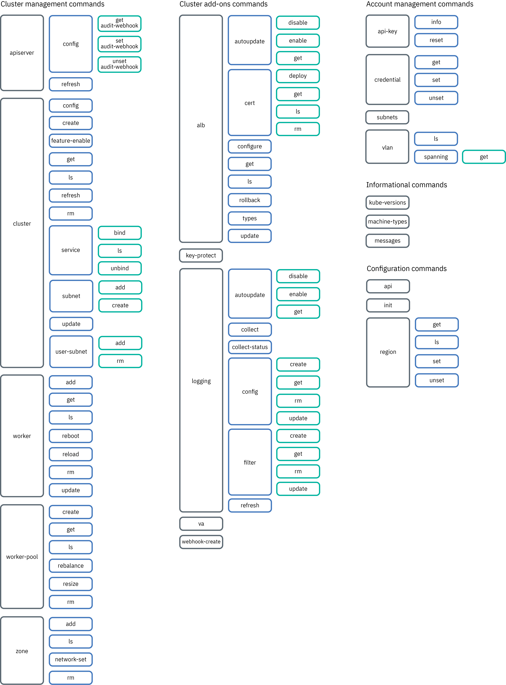

---

copyright:
  years: 2014, 2019
lastupdated: "2019-09-25"

keywords: kubernetes, iks, ibmcloud, ic, ks, ibmcloud ks, ibmcloud oc, oc

subcollection: containers

---

{:new_window: target="_blank"}
{:shortdesc: .shortdesc}
{:screen: .screen}
{:pre: .pre}
{:table: .aria-labeledby="caption"}
{:codeblock: .codeblock}
{:tip: .tip}
{:note: .note}
{:important: .important}
{:deprecated: .deprecated} 
{:download: .download}
{:preview: .preview}

# {{site.data.keyword.containerlong_notm}} CLI
{: #kubernetes-service-cli}

Refer to these commands to create and manage **both community Kubernetes or OpenShift clusters** in {{site.data.keyword.containerlong}}.
{:shortdesc}

* **Community Kubernetes**: [Install the CLI plug-in](/docs/containers?topic=containers-cs_cli_install#cs_cli_install_steps), which uses the `ibmcloud ks` alias.
* **OpenShift**: [Install the CLI plug-in](/docs/openshift?topic=openshift-openshift-cli), which uses the `ibmcloud oc` alias.

In the terminal, you are notified when updates to the `ibmcloud` CLI and plug-ins are available. Be sure to keep your CLI up-to-date so that you can use all available commands and flags.

Looking for `ibmcloud cr` commands? See the [{{site.data.keyword.registryshort_notm}} CLI reference](/docs/services/Registry?topic=container-registry-cli-plugin-containerregcli). Looking for `kubectl` commands? See the [Kubernetes documentation ](https://kubectl.docs.kubernetes.io/).
{:tip}

## Using the beta {{site.data.keyword.containerlong_notm}} plug-in
{: #cs_beta}

A redesigned version of the {{site.data.keyword.containerlong_notm}} plug-in is available as a beta. The redesigned {{site.data.keyword.containerlong_notm}} plug-in groups commands into categories and changes commands from a hyphenated structure to a spaced structure.
{: shortdesc}

The following beta versions of the redesigned {{site.data.keyword.containerlong_notm}} plug-in are available.
* The default behavior is `0.4`. Ensure that your {{site.data.keyword.containerlong_notm}} plug-in uses the latest `0.4` version by running `ibmcloud plugin update kubernetes-service`.
* To use `1.0`, set the `IKS_BETA_VERSION` environment variable:
    ```
    export IKS_BETA_VERSION=1.0
    ```
    {: pre}

When version 1.0 releases, permanent syntax and behavior changes are not backwards compatible. You have until 14 March 2020 to update CLI command syntax.</br></br>To maintain all CLI functionality, update and test any automation now by checking out the [`ibmcloud ks script update` command](#script_update) and setting your `IKS_BETA_VERSION` environment variable to `1.0`. After you update your scripts, you must continue to use version `1.0` of the plug-in within the script or the environment where the script is run.
{: important}

Check out the following changes between each version of the CLI plug-in:

<table summary="The rows are read from left to right, with the area of comparison in column one, Classic clusters CLI in column two, and VPC clusters CLI in column three.">
<caption>Beta versions of the redesigned {{site.data.keyword.containerlong_notm}} plug-in</caption>
<col width="60%">
<col width="10%">
<col width="10%">
<col width="10%">
<col width="10%">
 <thead>
   <th>Functionality</th>
   <th>`0.2`</th>
   <th>`0.3`</th>
   <th>`0.4`</th>
   <th>`1.0`</th>
 </thead>
 <tbody>
  <tr>
  <td>Supported?</td>
  <td>Deprecated</td>
  <td>Deprecated</td>
  <td>Default</td>
  <td>Latest</td>
  </tr>
  <tr>
  <td>`ibmcloud ks help` output structure<ul><li>Legacy: Alphabetical list of commands</li><li>Beta: Categories of commands</li></ul></td>
  <td>Legacy</td>
  <td>Legacy</td>
  <td>Beta</td>
  <td>Beta</td>
  </tr>
  <tr><td>Command structure<ul><li>Legacy: Hyphenated structure (`ibmcloud ks alb-cert-get`)</li><li>Beta: Spaced structure (`ibmcloud ks alb cert get`)</li></ul></td>
  <td>Legacy and beta</td>
  <td>Legacy and beta</td>
  <td>Legacy and beta</td>
  <td>Beta</td>
  </tr>
  <tr><td>Positional arguments<ul><li>Legacy: Arguments specified by position (`cluster-get mycluster`)</li><li>Beta: Arguments specified by flags (`cluster get --cluster mycluster`)</li></ul></td>
  <td>Legacy and beta</td>
  <td>Legacy and beta</td>
  <td>Legacy and beta</td>
  <td>Beta</td>
  </tr>
  <tr><td>Repeated arguments<ul><li>Legacy: Comma-delineated values (`--worker-pools pool1,pool2,pool3 ...`)</li><li>Beta: Repeated flags for each value with optional shorthand flag aliases (`-p pool1 -p pool2 ...`)</li></ul></td>
  <td>Legacy</td>
  <td>Legacy</td>
  <td>Legacy and beta</td>
  <td>Beta</td>
  </tr>
  <tr><td>Flag format<ul><li>Legacy: Camel-case (`--showResources`)</li><li>Beta: Dashed (`--show-resources`)</li></ul></td>
  <td>Legacy</td>
  <td>Legacy</td>
  <td>Legacy and beta</td>
  <td>Beta</td>
  </tr>
  <tr><td>Cluster context provided by `ibmcloud ks cluster-config`<ul><li>Legacy: Provides a command that you must copy and paste to set the new `kubeconfig` file as your current KUBECONFIG environment variable. You must set your environment variable before you can interact with your cluster.</li><li>Beta: Appends the new `kubeconfig` file to your existing `kubeconfig` in `~/.kube/config` or the first file in the KUBECONFIG environment variable. After you run `ibmcloud ks cluster config`, you can interact with your cluster immediately.</li></ul></td>
  <td>Legacy</td>
  <td>Legacy</td>
  <td>Legacy</td>
  <td>Beta</td>
  </tr>
  <tr><td>API endpoint<ul><li>Legacy: [Target a region and use a regional endpoint to work with resources in that region](/docs/containers?topic=containers-regions-and-zones#bluemix_regions).</li><li>Beta: [Use the global endpoint to work with resources in any location](/docs/containers?topic=containers-regions-and-zones#bluemix_regions).</li></ul></td>
  <td>Legacy</td>
  <td>Beta</td>
  <td>Beta</td>
  <td>Beta</td>
  </tr>
 </tbody>
</table>

<br />


## Comparison of Classic and VPC commands
{: #cli_classic_vpc_about}

With the release of the [{{site.data.keyword.containerlong_notm}} version 2 API](/docs/containers?topic=containers-cs_api_install#api_about), the {{site.data.keyword.cloud_notm}} CLI `kubernetes-service` plug-in supports both classic and VPC infrastructure providers. Some `ibmcloud ks` commands support only one type of infrastructure, whereas other commands include additional names or options as described in the following table.
{: shortdesc}

<table summary="The rows are read from left to right, with the area of comparison in column one, Classic clusters CLI in column two, and VPC clusters CLI in column three.">
<caption>{{site.data.keyword.containerlong_notm}} CLI differences between classic and VPC</caption>
<col width="40%">
<col width="30%">
<col width="30%">
 <thead>
 <th>Area</th>
 <th>Classic CLI commands</th>
 <th>VPC CLI commands</th>
 </thead>
 <tbody>
 <tr>
  <td>**Doc icons**: CLI commands in this document include icons to help you scan which commands apply to which infrastructure provider. If the command supports both providers, both icons are included.</td>
  <td></td>
  <td></td>
 </tr>
 <tr>
   <td>**Provider-specific**: You can perform similar operations in both infrastructure providers, but you must specify the infrastructure provider in the command name.<br><br>If you do not specify the provider, the default is classic. For example, `zone add classic` is an alias for the previous `zone-add` classic command.</td>
   <td>Uses the v1 API.<ul>
   <li>[`alb configure classic`](#cs_alb_configure)</li>
   <li>[`cluster create classic`](#cs_cluster_create)</li>
   <li>[`nlb-dns create`](#cs_nlb-dns-create)</li>
   <li>[`nlb-dns rm `](#cs_nlb-dns-rm)</li>
   <li>[`worker-pool create classic`](#cs_worker_pool_create)</li>
   <li>[`zone add classic`](#cs_zone_add)</li></ul>
   </td>
   <td>Uses the v2 API.<ul>
   <li>[`alb configure vpc-classic`](#cli_alb_configure_vpc_classic)</li>
   <li>[`cluster create vpc-classic`](#cli_cluster-create-vpc-classic)</li>
   <li>[`worker-pool create vpc-classic`](#cli_worker_pool_create_vpc_classic)</li>
   <li>[`zone add vpc-classic`](#cli_zone-add-vpc-classic)</li></ul></ul></td>
 </tr>
 <tr>
   <td>**Provider-exclusive**: You can use these commands only in the particular infrastructure provider.</td>
   <td>Uses the v1 API.<ul>
   <li>[`cluster subnet add`](#cs_cluster_subnet_add)</li>
   <li>[`cluster subnet create`](#cs_cluster_subnet_create)</li>
   <li>[`cluster subnet detach`](#cs_cluster_subnet_detach)</li>
   <li>[`cluster user-subnet add`](#cs_cluster_user_subnet_add)</li>
   <li>[`cluster user-subnet rm`](#cs_cluster_user_subnet_rm)</li>
   <li>[`credential set`](#cs_credentials_set)</li>
   <li>[`credential unset`](#cs_credentials_unset)</li>
   <li>[`vlan ls`](#cs_vlans)</li>
   <li>[`vlan spanning get`](#cs_vlan_spanning_get)</li>
   <li>[`worker reload`](#cs_worker_reload)</li>
   <li>[`worker update`](#cs_worker_update)</li>
   <li>[`zone network-set`](#cs_zone_network_set)</li>
   <li>[All `nlb-dns monitor` commands](#cs_nlb-dns-monitor-configure)</li></ul>
   </td>
   <td>Uses the v2 API.<ul>
   <li>[`vpcs`](#cs_vpcs)</li></ul></td>
 </tr>
 <tr>
   <td>**VPC provider flags**: You can specify a `--provider` flag for these commands to return results that are specific to the infrastructure provider.</td>
   <td>Optional. Uses the v1 API.<ul>
   <li>[`cluster ls`](#cs_clusters)</li>
   <li>[`subnets`](#cs_subnets)</li>
   <li>[`zone ls`](#cs_datacenters)</li></ul></td>
   <td>Required. Uses the v2 API.<ul>
   <li>[`subnets`](#cs_subnets)</li>
   <li>[`zone ls`](#cs_datacenters)</li></ul></td>
 </tr>
 <tr>
   <td colspan="3">**Agnostic**: **You do not need to specify an infrastructure provider for the remaining commands.** The commands use and return the v1 API responses.</td>
 </tr>
</tbody>
</table>


<br />


## `ibmcloud ks` commands
{: #map}



## `cluster` commands
{: #cluster}

Create, view, and modify clusters and cluster settings, such as add-on, subnet, and master settings.
{: shortdesc}

### `ibmcloud ks cluster addon disable`
{: #cs_cluster_addon_disable}

Disable a managed add-on in an existing cluster. This command must be combined with one of the following subcommands for the managed add-on that you want to disable.
{: shortdesc}


#### `ibmcloud ks cluster addon disable istio`
{: #cs_cluster_addon_disable_istio}

Disable the managed Istio add-on. Removes all Istio core components from the cluster, including Prometheus.
{: shortdesc}

```
ibmcloud ks cluster addon disable istio --cluster CLUSTER [-f]
```
{: pre}

**Supported infrastructure provider**:
  *  Classic
  *  VPC on Classic

**Minimum required permissions**: **Administrator** platform role for the cluster in {{site.data.keyword.containerlong_notm}}

**Command options**:
<dl>
<dt><code>-c, --cluster <em>CLUSTER</em></code></dt>
<dd>The name or ID of the cluster. This value is required.</dd>

<dt><code>-f</code></dt>
<dd>Optional: This Istio add-on is a dependency for the <code>istio-extras</code>, <code>istio-sample-bookinfo</code>, and <code>knative</code> managed add-ons. Include this flag to also disable those add-ons.</dd>
</dl>

#### `ibmcloud ks cluster addon disable istio-extras`
{: #cs_cluster_addon_disable_istio_extras}

Disable the managed Istio extras add-on. Removes Grafana, Jeager, and Kiali from the cluster.
{: shortdesc}

```
ibmcloud ks cluster addon disable istio-extras --cluster CLUSTER [-f]
```
{: pre}

**Supported infrastructure provider**:
  *  Classic
  *  VPC on Classic

**Minimum required permissions**: **Administrator** platform role for the cluster in {{site.data.keyword.containerlong_notm}}

**Command options**:
<dl>
<dt><code>-c, --cluster <em>CLUSTER</em></code></dt>
<dd>The name or ID of the cluster. This value is required.</dd>

<dt><code>-f</code></dt>
<dd>Optional: This Istio add-on is a dependency for the <code>istio-sample-bookinfo</code> managed add-on. Include this flag to also disable that add-on.</dd>
</dl>

#### `ibmcloud ks cluster addon disable istio-sample-bookinfo`
{: #cs_cluster_addon_disable_istio_sample_bookinfo}

Disable the managed Istio BookInfo add-on. Removes all deployments, pods, and other BookInfo app resources from the cluster.
{: shortdesc}

```
ibmcloud ks cluster addon disable istio-sample-bookinfo --cluster CLUSTER
```
{: pre}

**Supported infrastructure provider**:
  *  Classic
  *  VPC on Classic

**Minimum required permissions**: **Administrator** platform role for the cluster in {{site.data.keyword.containerlong_notm}}

**Command options**:
<dl>
<dt><code>-c, --cluster <em>CLUSTER</em></code></dt>
<dd>The name or ID of the cluster. This value is required.</dd>
</dl>

#### `ibmcloud ks cluster addon disable knative`
{: #cs_cluster_addon_disable_knative}

Disable the managed Knative add-on to remove the Knative serverless framework from the cluster.
{: shortdesc}

```
ibmcloud ks cluster addon disable knative --cluster CLUSTER [-f]
```
{: pre}

**Supported infrastructure provider**:
  *  Classic
  *  VPC on Classic

**Minimum required permissions**: **Administrator** platform role for the cluster in {{site.data.keyword.containerlong_notm}}

**Command options**:
<dl>
<dt><code>-c, --cluster <em>CLUSTER</em></code></dt>
<dd>The name or ID of the cluster. This value is required.</dd>

<dt><code>-f</code>
<dd>Force the command to run with no user prompts. This value is optional.</dd>
</dl>

#### `ibmcloud ks cluster addon disable kube-terminal`
{: #cs_cluster_addon_disable_kube-terminal}

Disable the [Kubernetes Terminal](/docs/containers?topic=containers-cs_cli_install#cli_web) add-on. To use the Kubernetes Terminal in the {{site.data.keyword.containerlong_notm}} cluster console, you must re-enable the add-on first.
{: shortdesc}

```
ibmcloud ks cluster addon disable kube-terminal --cluster CLUSTER [-f]
```
{: pre}

**Supported infrastructure provider**:
  *  Classic
  *  VPC on Classic

**Minimum required permissions**: **Administrator** platform role for the cluster in {{site.data.keyword.containerlong_notm}}

**Command options**:
<dl>
<dt><code>-c, --cluster <em>CLUSTER</em></code></dt>
<dd>The name or ID of the cluster. This value is required.</dd>

<dt><code>-f</code>
<dd>Force the command to run with no user prompts. This value is optional.</dd>
</dl>

#### `ibmcloud ks cluster addon disable vpc-block-csi-driver`
{: #cs_cluster_addon_disable_vpc-block-csi-driver}

Disable the [{{site.data.keyword.cloud_notm}} VPC Block Storage CSI Driver](/docs/containers?topic=containers-vpc-block) add-on.
{: shortdesc}

```
ibmcloud ks cluster addon disable vpc-block-csi-driver --cluster CLUSTER [-f]
```
{: pre}

**Supported infrastructure provider**:
  *  Classic
  *  VPC on Classic

**Minimum required permissions**: **Administrator** platform role for the cluster in {{site.data.keyword.containerlong_notm}}

**Command options**:
<dl>
<dt>`--cluster <em>CLUSTER</em>`</dt>
<dd>The name or ID of the cluster. This value is required.</dd>

<dt><code>-f</code>
<dd>Force the command to run with no user prompts. This value is optional.</dd>
</dl>

</br>

### `ibmcloud ks cluster addon enable`
{: #cs_cluster_addon_enable}

Enable a managed add-on in an existing cluster. This command must be combined with one of the following subcommands for the managed add-on that you want to enable.
{: shortdesc}


#### `ibmcloud ks cluster addon enable istio`
{: #cs_cluster_addon_enable_istio}

Enable the managed [Istio add-on](/docs/containers?topic=containers-istio). Installs the core components of Istio, including Prometheus.
{: shortdesc}

```
ibmcloud ks cluster addon enable istio --cluster CLUSTER [--version VERSION]
```
{: pre}

**Supported infrastructure provider**:
  *  Classic
  *  VPC on Classic

**Minimum required permissions**: **Administrator** platform role for the cluster in {{site.data.keyword.containerlong_notm}}

**Command options**:
<dl>
<dt><code>-c, --cluster <em>CLUSTER</em></code></dt>
<dd>The name or ID of the cluster. This value is required.</dd>

<dt><code>--version <em>VERSION</em></code></dt>
<dd>Optional: Specify the version of the add-on to install. If no version is specified, the default version is installed.</dd>
</dl>

#### `ibmcloud ks cluster addon enable istio-extras`
{: #cs_cluster_addon_enable_istio_extras}

Enable the managed Istio extras add-on. Installs Grafana, Jeager, and Kiali to provide extra monitoring, tracing, and visualization for Istio.
{: shortdesc}

```
ibmcloud ks cluster addon enable istio-extras --cluster CLUSTER [--version VERSION] [-y]
```
{: pre}

**Supported infrastructure provider**:
  *  Classic
  *  VPC on Classic

**Minimum required permissions**: **Administrator** platform role for the cluster in {{site.data.keyword.containerlong_notm}}

**Command options**:
<dl>
<dt><code>-c, --cluster <em>CLUSTER</em></code></dt>
<dd>The name or ID of the cluster. This value is required.</dd>

<dt><code>--version <em>VERSION</em></code></dt>
<dd>Optional: Specify the version of the add-on to install. If no version is specified, the default version is installed.</dd>

<dt><code>-y</code></dt>
<dd>Optional: Enable the <code>istio</code> add-on dependency.</dd>
</dl>

#### `ibmcloud ks cluster addon enable istio-sample-bookinfo`
{: #cs_cluster_addon_enable_istio_sample_bookinfo}

Enable the managed Istio BookInfo add-on. Deploys the [BookInfo sample application for Istio ](https://istio.io/docs/examples/bookinfo/) into the <code>default</code> namespace.
{: shortdesc}

```
ibmcloud ks cluster addon enable istio-sample-bookinfo --cluster CLUSTER [--version VERSION] [-y]
```
{: pre}

**Supported infrastructure provider**:
  *  Classic
  *  VPC on Classic

**Minimum required permissions**: **Administrator** platform role for the cluster in {{site.data.keyword.containerlong_notm}}

**Command options**:
<dl>
<dt><code>-c, --cluster <em>CLUSTER</em></code></dt>
<dd>The name or ID of the cluster. This value is required.</dd>

<dt><code>--version <em>VERSION</em></code></dt>
<dd>Optional: Specify the version of the add-on to install. If no version is specified, the default version is installed.</dd>

<dt><code>-y</code></dt>
<dd>Optional: Enable the <code>istio</code> and <code>istio-extras</code> add-on dependencies.</dd>
</dl>

#### `ibmcloud ks cluster addon enable knative`
{: #cs_cluster_addon_enable_knative}

Enable the managed [Knative add-on](/docs/containers?topic=containers-serverless-apps-knative) to install the Knative serverless framework.
{: shortdesc}

```
ibmcloud ks cluster addon enable knative --cluster CLUSTER [--version VERSION] [-y]
```
{: pre}

**Supported infrastructure provider**:
  *  Classic
  *  VPC on Classic

**Minimum required permissions**: **Administrator** platform role for the cluster in {{site.data.keyword.containerlong_notm}}

**Command options**:
<dl>
<dt><code>-c, --cluster <em>CLUSTER</em></code></dt>
<dd>The name or ID of the cluster. This value is required.</dd>

<dt><code>--version <em>VERSION</em></code></dt>
<dd>Optional: Specify the version of the add-on to install. If no version is specified, the default version is installed.</dd>

<dt><code>-y</code></dt>
<dd>Optional: Enable the <code>istio</code> add-on dependency.</dd>
</dl>

#### `ibmcloud ks cluster addon enable kube-terminal`
{: #cs_cluster_addon_enable_kube-terminal}

Enable the [Kubernetes Terminal](/docs/containers?topic=containers-cs_cli_install#cli_web) add-on to use the Kubernetes Terminal in the {{site.data.keyword.containerlong_notm}} cluster console.
{: shortdesc}

```
ibmcloud ks cluster addon enable kube-terminal --cluster CLUSTER [--version VERSION]
```
{: pre}

**Supported infrastructure provider**:
  *  Classic
  *  VPC on Classic

**Minimum required permissions**: **Administrator** platform role for the cluster in {{site.data.keyword.containerlong_notm}}

**Command options**:
<dl>
<dt><code>-c, --cluster <em>CLUSTER</em></code></dt>
<dd>The name or ID of the cluster. This value is required.</dd>

<dt><code>--version <em>VERSION</em></code></dt>
<dd>Optional: Specify the version of the add-on to install. If no version is specified, the default version is installed.</dd>
</dl>

#### `ibmcloud ks cluster addon enable vpc-block-csi-driver`
{: #cs_cluster_addon_enable_vpc-block-csi-driver}

Disable the [{{site.data.keyword.cloud_notm}} VPC Block Storage CSI Driver](/docs/containers?topic=containers-vpc-block#vpc-block-addon) add-on.
{: shortdesc}

```
ibmcloud ks cluster addon enable vpc-block-csi-driver --cluster CLUSTER [--version VERSION]
```
{: pre}

**Supported infrastructure provider**:
  *  Classic
  *  VPC on Classic

**Minimum required permissions**: **Administrator** platform role for the cluster in {{site.data.keyword.containerlong_notm}}

**Command options**:
<dl>
<dt>`--cluster <em>CLUSTER</em>`</dt>
<dd>The name or ID of the cluster. This value is required.</dd>

<dt><code>--version <em>VERSION</em></code></dt>
<dd>Optional: Specify the version of the add-on to install. If no version is specified, the default version is installed.</dd>
</dl>

</br>

### `ibmcloud ks cluster addons`
{: #cs_cluster_addons}

List managed add-ons that are enabled in a cluster.
{: shortdesc}

```
ibmcloud ks cluster addons --cluster CLUSTER
```
{: pre}

**Supported infrastructure provider**:
  *  Classic
  *  VPC on Classic

**Minimum required permissions**: **Viewer** platform role for the cluster in {{site.data.keyword.containerlong_notm}}

**Command options**:
<dl>
<dt><code>-c, --cluster <em>CLUSTER</em></code></dt>
<dd>The name or ID of the cluster. This value is required.</dd>

<dt><code>--json</code></dt>
<dd>Prints the command output in JSON format. This value is optional.</dd>
</dl>

</br>


### `ibmcloud ks cluster config`
{: #cs_cluster_config}

After logging in, download Kubernetes configuration data and certificates to connect to your cluster and run `kubectl` commands. The files are downloaded to `user_home_directory/.bluemix/plugins/kubernetes-service/clusters/<cluster_name>`.
{: shortdesc}

```
ibmcloud ks cluster config --cluster CLUSTER [--admin] [--export] [--network] [--powershell] [--skip-rbac] [-s] [--yaml]
```
{: pre}

**Supported infrastructure provider**:
  *  Classic
  *  VPC on Classic

**Minimum required permissions**: **Viewer** or **Reader** {{site.data.keyword.cloud_notm}} IAM service role for the cluster in {{site.data.keyword.containerlong_notm}}. Further, if you have only a platform role or only a service role, additional constraints apply.
* **Platform**: If you have only a platform role, you can perform this command, but you need a [service role](/docs/containers?topic=containers-users#platform) or a [custom RBAC policy](/docs/containers?topic=containers-users#role-binding) to perform Kubernetes actions in the cluster.
* **Service**: If you have only a service role, you can perform this command. However, your cluster admin must give you the cluster name and ID because you cannot run the `ibmcloud ks cluster ls` command or launch the {{site.data.keyword.containerlong_notm}} console to view clusters. After you receive the cluster name and ID, you can [launch the Kubernetes dashboard from the CLI](/docs/containers?topic=containers-app#db_cli) and work with Kubernetes.

**Command options**:
<dl>
<dt><code>-c, --cluster <em>CLUSTER</em></code></dt>
<dd>The name or ID of the cluster. This value is required.</dd>

<dt><code>--admin</code></dt>
<dd>Download the TLS certificates and permission files for the Super User role. You can use the certs to automate tasks in a cluster without having to reauthenticate. The files are downloaded to `<user_home_directory>/.bluemix/plugins/kubernetes-service/clusters/<cluster_name>-admin`. This value is optional.</dd>

<dt><code>--network</code></dt>
<dd>Download the Calico configuration file, TLS certificates, and permission files that are required to run <code>calicoctl</code> commands in your cluster. This value is optional. **Note**: To get the export command for the downloaded Kubernetes configuration data and certificates, you must run this command without this flag.</dd>

<dt><code>--export</code></dt>
<dd>Download Kubernetes configuration data and certificates without any messages other than the export command. Because no messages are displayed, you can use this flag when you create automated scripts. This value is optional.</dd>

<dt><code>--powershell</code></dt>
<dd>Retrieve environment variables in Windows PowerShell format.</dd>

<dt><code>--skip-rbac</code></dt>
<dd>Skip adding user Kubernetes RBAC roles based on the {{site.data.keyword.cloud_notm}} IAM service access roles to the cluster configuration. Include this option only if you [manage your own Kubernetes RBAC roles](/docs/containers?topic=containers-users#rbac). If you use [{{site.data.keyword.cloud_notm}} IAM service access roles](/docs/containers?topic=containers-access_reference#service) to manage all your RBAC users, do not include this option.</dd>

<dt><code>-s</code></dt>
<dd>Do not show the message of the day or update reminders. This value is optional.</dd>

<dt><code>--yaml</code></dt>
<dd>Prints the command output in YAML format. This value is optional.</dd>
</dl>

**Example**:
```
ibmcloud ks cluster config --cluster my_cluster
```
{: pre}

</br>

### `ibmcloud ks cluster create classic`
{: #cs_cluster_create}

Create a cluster with worker nodes on classic infrastructure. For free clusters, you specify the cluster name; everything else is set to a default value. A free cluster is automatically deleted after 30 days. You can have one free cluster at a time. To take advantage of the full capabilities of Kubernetes, create a standard cluster.
{: shortdesc}

```
ibmcloud ks cluster create classic [--file FILE_LOCATION] [--hardware HARDWARE] --zone ZONE --machine-type FLAVOR --name NAME [--kube-version MAJOR.MINOR.PATCH] [--no-subnet] [--private-vlan PRIVATE_VLAN] [--public-vlan PUBLIC_VLAN] [--private-only] [--private-service-endpoint] [--public-service-endpoint] [--workers WORKER] [--disable-disk-encrypt] [--pod-subnet SUBNET] [--service-subnet SUBNET] [-s]
```
{: pre}

**Supported infrastructure provider**:  Classic. To create a VPC on Classic cluster, use the [`ibmcloud ks cluster create vpc-classic` command](#cli_cluster-create-vpc-classic) instead.

**Minimum required permissions**:
* **Administrator** platform role for {{site.data.keyword.containerlong_notm}} at the account level
* **Administrator** platform role for {{site.data.keyword.registrylong_notm}} at the account level
* **Super User** role for IBM Cloud infrastructure

**Command options**

<dl>
<dt><code>--file <em>FILE_LOCATION</em></code></dt>

<dd>The path to the YAML file to create your standard cluster. Instead of defining the characteristics of your cluster by using the options provided in this command, you can use a YAML file. This value is optional for standard clusters and is not available for free clusters. <p class="note">If you provide the same option in the command as parameter in the YAML file, the value in the command takes precedence over the value in the YAML. For example, if you define a location in your YAML file and use the <code>--zone</code> option in the command, the value that you entered in the command option overrides the value in the YAML file.</p>
<pre class="codeblock">
<code>name: <em>&lt;cluster_name&gt;</em>
zone: <em>&lt;zone&gt;</em>
no-subnet: <em>&lt;no-subnet&gt;</em>
flavor: <em>&lt;flavor&gt;</em>
private-vlan: <em>&lt;private_VLAN&gt;</em>
public-vlan: <em>&lt;public_VLAN&gt;</em>
private-service-endpoint: <em>&lt;true&gt;</em>
public-service-endpoint: <em>&lt;true&gt;</em>
hardware: <em>&lt;shared_or_dedicated&gt;</em>
workerNum: <em>&lt;number_workers&gt;</em>
kube-version: <em>&lt;kube-version&gt;</em>
diskEncryption: <em>false</em>
pod-subnet: <em>&lt;subnet&gt;</em>
service-subnet: <em>&lt;subnet&gt;</em>
</code></pre>
</dd>

<dt><code>--hardware <em>HARDWARE</em></code></dt>
<dd>The level of hardware isolation for your worker node. Use `dedicated` so that available physical resources are dedicated to you only, or `shared` to allow physical resources to be shared with other IBM customers. The default is `shared`. This value is optional for VM standard clusters and is not available for free clusters. For bare metal flavors, specify `dedicated`.</dd>

<dt><code>--zone <em>ZONE</em></code></dt>
<dd>The zone where you want to create the cluster. This value is required for standard clusters. Free clusters can be created in the region that you target with the <code>ibmcloud ks region set</code> command, but you cannot specify the zone.

<p>Review [available zones](/docs/containers?topic=containers-regions-and-zones#zones). To span your cluster across zones, you must create the cluster in a [multizone-capable zone](/docs/containers?topic=containers-regions-and-zones#zones).</p>

<p class="note">When you select a zone that is located outside your country, keep in mind that you might require legal authorization before data can be physically stored in a foreign country.</p>
</dd>

<dt><code>--machine-type <em>FLAVOR</em></code></dt>
<dd>Choose a flavor, or machine type, for your worker nodes. You can deploy your worker nodes as virtual machines on shared or dedicated hardware, or as physical machines on bare metal. Available physical and virtual flavors vary by the zone in which you deploy the cluster. For more information, see the documentation for the `ibmcloud ks flavors (machine-types)` [command](#cs_machine_types). This value is required for standard clusters and is not available for free clusters.</dd>

<dt><code>--name <em>NAME</em></code></dt>
<dd>The name for the cluster. This value is required. The name must start with a letter, can contain letters, numbers, and hyphen (-), and must be 35 characters or fewer. Use a name that is unique across regions. The cluster name and the region in which the cluster is deployed form the fully qualified domain name for the Ingress subdomain. To ensure that the Ingress subdomain is unique within a region, the cluster name might be truncated and appended with a random value within the Ingress domain name.
</dd>

<dt><code>--kube-version <em>MAJOR.MINOR.PATCH</em></code></dt>
<dd>The Kubernetes version for the cluster master node. This value is optional. When the version is not specified, the cluster is created with the default of supported Kubernetes versions. To see available versions, run <code>ibmcloud ks versions</code>.</dd>

<dt><code>--no-subnet</code></dt>
<dd>By default, a public and a private portable subnet are created on the VLAN associated with the cluster. Include the <code>--no-subnet</code> flag to avoid creating subnets with the cluster. You can [create](#cs_cluster_subnet_create) or [add](#cs_cluster_subnet_add) subnets to a cluster later.</dd>

<dt><code>--private-vlan <em>PRIVATE_VLAN</em></code></dt>
<dd>
<ul>
<li>This parameter is not available for free clusters.</li>
<li>If this standard cluster is the first standard cluster that you create in this zone, do not include this flag. A private VLAN is created for you when the cluster is created.</li>
<li>If you created a standard cluster before in this zone or created a private VLAN in IBM Cloud infrastructure before, you must specify that private VLAN. Private VLAN routers always begin with <code>bcr</code> (back-end router) and public VLAN routers always begin with <code>fcr</code> (front-end router). When you create a cluster and specify the public and private VLANs, the number and letter combination after those prefixes must match.</li>
</ul>
<p>To find out whether you already have a private VLAN for a specific zone or to find the name of an existing private VLAN, run <code>ibmcloud ks vlan ls --zone <em>&lt;zone&gt;</em></code>.</p></dd>

<dt><code>--public-vlan <em>PUBLIC_VLAN</em></code></dt>
<dd>
<ul>
<li>This parameter is not available for free clusters.</li>
<li>If this standard cluster is the first standard cluster that you create in this zone, do not use this flag. A public VLAN is created for you when the cluster is created.</li>
<li>If you created a standard cluster before in this zone or created a public VLAN in IBM Cloud infrastructure before, specify that public VLAN. If you want to connect your worker nodes to a private VLAN only, do not specify this option. Private VLAN routers always begin with <code>bcr</code> (back-end router) and public VLAN routers always begin with <code>fcr</code> (front-end router). When you create a cluster and specify the public and private VLANs, the number and letter combination after those prefixes must match.</li>
</ul>

<p>To find out whether you already have a public VLAN for a specific zone or to find the name of an existing public VLAN, run <code>ibmcloud ks vlan ls --zone <em>&lt;zone&gt;</em></code>.</p></dd>

<dt><code>--private-only</code></dt>
<dd>Use this option to prevent a public VLAN from being created. Required only when you specify the `--private-vlan` flag and do not include the `--public-vlan` flag.<p class="note">If worker nodes are set up with a private VLAN only, you must enable the private service endpoint or configure a gateway device. For more information, see [Worker-to-master and user-to-master communication](/docs/containers?topic=containers-plan_clusters#workeruser-master).</p></dd>

<dt><code>--private-service-endpoint</code></dt>
<dd>**Standard clusters that run Kubernetes version 1.11 or later in [VRF-enabled accounts](/docs/resources?topic=resources-private-network-endpoints#getting-started)**: Enable the [private service endpoint](/docs/containers?topic=containers-plan_clusters#workeruser-master) so that your Kubernetes master and the worker nodes communicate over the private VLAN. In addition, you can choose to enable the public service endpoint by using the `--public-service-endpoint` flag to access your cluster over the internet. If you enable the private service endpoint only, you must be connected to the private VLAN to communicate with your Kubernetes master. After you enable a private service endpoint, you cannot later disable it.<br><br>After you create the cluster, you can get the endpoint by running `ibmcloud ks cluster get --cluster <cluster_name_or_ID>`.</dd>

<dt><code>--public-service-endpoint</code></dt>
<dd>**Standard clusters that run Kubernetes version 1.11 or later**: Enable the [public service endpoint](/docs/containers?topic=containers-plan_clusters#workeruser-master) so that your Kubernetes master can be accessed over the public network, for example to run `kubectl` commands from your terminal. If you have a [VRF-enabled account](/docs/resources?topic=resources-private-network-endpoints#getting-started) and also include the `--private-service-endpoint` flag, master-worker node communication goes over the private and the public network. You can later disable the public service endpoint if you want a private-only cluster.<br><br>After you create the cluster, you can get the endpoint by running `ibmcloud ks cluster get --cluster <cluster_name_or_ID>`.</dd>

<dt><code>--workers WORKER</code></dt>
<dd>The number of worker nodes that you want to deploy in your cluster. If you do not specify this option, a cluster with one worker node is created. This value is optional for standard clusters and is not available for free clusters.
<p class="important">If you create a cluster with only one worker node per zone, you might experience issues with Ingress. For high availability, create a cluster with at least two workers per zone.</br>
</br>Every worker node is assigned a unique worker node ID and domain name that must not be manually changed after the cluster is created. Changing the ID or domain name prevents the Kubernetes master from managing your cluster.</p></dd>
</dl>

<code><strong>--disable-disk-encrypt</strong></code></br>
Worker nodes feature AES 256-bit disk encryption by default; [learn more](/docs/containers?topic=containers-security#encrypted_disk). To disable encryption, include this option.
{: #pod-subnet}

<code><strong>--pod-subnet <em>SUBNET</em></strong></code></br>
**Standard clusters that run Kubernetes 1.15 or later**: All pods that are deployed to a worker node are assigned a private IP address in the 172.30.0.0/16 range by default. If you plan to connect your cluster to on-premises networks through {{site.data.keyword.BluDirectLink}} or a VPN service, you can avoid subnet conflicts by specifying a custom subnet CIDR to provide the private IP addresses for pods.
<p>When you choose a subnet size, consider the size of the cluster that you plan to create and the number of worker nodes that you might add in the future. The subnet must have a CIDR of at least <code>/23</code>, which provides enough pod IPs for a maximum of four worker nodes in a cluster. For larger clusters, use <code>/22</code> to have enough pods for eight workers, use <code>/21</code> to have enough pods for 16 workers, and so on.</p>
<p>The subnet cannot be in the following reserved ranges:
<ul><li><code>10.0.&#42;.&#42;</code></li>
<li><code>172.20.&#42;.&#42;</code></li>
<li><code>192.168.255.&#42;</code></li></ul></p>
{: #service-subnet}

<code><strong>--service-subnet <em>SUBNET</em></strong></code></br>
**Standard clusters that run Kubernetes 1.15 or later**: All services that are deployed to the cluster are assigned a private IP address in the 172.21.0.0/16 range by default. If you plan to connect your cluster to on-premises networks through {{site.data.keyword.cloud_notm}} Direct Link or a VPN service, you can avoid subnet conflicts by specifying a custom subnet CIDR to provide the private IP addresses for services.
<p>The subnet must be at least <code>/24</code>, which allows a maximum of 255 services in the cluster, or larger. The subnet cannot be in the following reserved ranges:
<ul><li><code>10.0.&#42;.&#42;</code></li>
<li><code>172.20.&#42;.&#42;</code></li>
<li><code>192.168.255.&#42;</code></li></ul></p>

<code><strong>-s</strong></code></br>
Do not show the message of the day or update reminders. This value is optional.

**Examples**:


**Create a free cluster**: Specify the cluster name only; everything else is set to a default value. A free cluster is automatically deleted after 30 days. You can have one free cluster at a time. To take advantage of the full capabilities of Kubernetes, create a standard cluster.

```
ibmcloud ks cluster create classic --name my_cluster
```
{: pre}

**Create your first standard cluster**: The first standard cluster that is created in a zone also creates a private VLAN. Therefore, do not include the `--public-vlan` flag.
{: #example_cluster_create}

```
ibmcloud ks cluster create classic --zone dal10 --private-vlan my_private_VLAN_ID --machine-type b3c.4x16 --name my_cluster --hardware shared --workers 2
```
{: pre}

**Create subsequent standard clusters**: If you already created a standard cluster in this zone or created a public VLAN in IBM Cloud infrastructure before, specify that public VLAN with the `--public-vlan` flag. To find out whether you already have a public VLAN for a specific zone or to find the name of an existing public VLAN, run `ibmcloud ks vlan ls --zone <zone>`.

```
ibmcloud ks cluster create classic --zone dal10 --public-vlan my_public_VLAN_ID --private-vlan my_private_VLAN_ID --machine-type b3c.4x16 --name my_cluster --hardware shared --workers 2
```
{: pre}

</br>

### `ibmcloud ks cluster create vpc-classic`
{: #cli_cluster-create-vpc-classic}

Create a classic cluster in your Virtual Private Cloud (VPC). **Note**: Free clusters are not available in VPC.
{: shortdesc}

```
ibmcloud ks cluster create vpc-classic --name NAME --zone ZONE --vpc-id VPC_ID --subnet-id VPC_SUBNET_ID --flavor WORKER_FLAVOR [--kube-version MAJOR.MINOR.PATCH --provider VPC-CLASSIC --workers NUMBER_WORKERS_PER_ZONE] [--disable-public-service-endpoint] [--pod-subnet SUBNET] [--service-subnet SUBNET] [-s]
```
{: pre}

**Supported infrastructure provider**:  VPC on Classic. To create a classic cluster, use the [`ibmcloud ks cluster create classic` command](#cs_cluster_create) instead.

**Minimum required permissions**:
* [**Administrator** platform role for VPC Infrastructure](/docs/vpc-on-classic?topic=vpc-on-classic-managing-user-permissions-for-vpc-resources).
* [**Administrator** platform role](/docs/containers?topic=containers-users#platform) for {{site.data.keyword.containerlong_notm}} at the account level.
* [**Writer** or **Manager** service role](/docs/containers?topic=containers-users#platform) for {{site.data.keyword.containerlong_notm}}.
* [**Administrator** platform role](/docs/containers?topic=containers-users#platform) for Container Registry at the account level.

**Command options**

<dl>
<dt><code>--name <em>NAME</em></code></dt>
<dd>The name for the cluster. This value is required. The name must start with a letter, can contain letters, numbers, and hyphen (-), and must be 35 characters or fewer. Use a name that is unique across regions. The cluster name and the region in which the cluster is deployed form the fully qualified domain name for the Ingress subdomain. To ensure that the Ingress subdomain is unique within a region, the cluster name might be truncated and appended with a random value within the Ingress domain name.
</dd>

<dt><code>--zone <em>ZONE</em></code></dt>
<dd>Select a zone to deploy the initial cluster worker pool in. If you create the cluster in a multizone metro, you can add a zone to the worker pool later. This value is required. To list available VPC zones, run `ibmcloud ks zone ls --provider vpc-classic`.</p>

<p class="note">When you select a zone that is located outside your country, keep in mind that you might require legal authorization before data can be physically stored in a foreign country.</p>
</dd>

<dt><code>--vpc-id <em>VPC_ID</em></code></dt>
<dd>The ID of the VPC in which to create the cluster and worker nodes. This value is required. To list available IDs, run `ibmcloud is vpcs`.</dd>

<dt><code>--subnet-id <em>VPC_SUBNET_ID</em></code></dt>
<dd>The VPC subnet to assign the cluster. This value is required. To list available VPC subnets, run `ibmcloud ks subnets --provider vpc-classic`.</dd>

<dt><code>--kube-version <em>MAJOR.MINOR.PATCH</em></code></dt>
<dd>The Kubernetes version for the cluster master node. This value is optional. When the version is not specified, the cluster is created with the default of supported Kubernetes versions. To see available versions, run <code>ibmcloud ks versions</code>.
</dd>

<dt><code>--flavor <em>FLAVOR</em></code></dt>
<dd>Choose a flavor for your worker nodes. You can deploy your worker nodes as virtual machines on shared or dedicated hardware. To see flavors that are available in a zone, run `ibmcloud ks flavors --zone <vpc_zone>`.</dd>

<dt><code>--provider <em>VPC-CLASSIC</em></code></dt>
<dd>The infrastructure provider type ID for the VPC worker node machine. Currently, `vpc-classic` for VPC on Classic is supported.</dd>

<dt><code>--workers <em>NUMBER_WORKERS_PER_ZONE</em></code></dt>
<dd>The number of worker nodes that you want to deploy in your cluster. If you do not specify this option, a cluster with one worker node is created. This value is optional.
<p class="important">Every worker node is assigned a unique worker node ID and domain name that must not be manually changed after the cluster is created. Changing the ID or domain name prevents the Kubernetes master from managing your cluster.</p></dd>

<dt><code>--disable-public-service-endpoint</code></dt>
<dd>To ensure that worker nodes and authorized cluster users communicate with the master through the private service endpoint only, include this flag to create the cluster without the public service endpoint.</dd>

<dt><code>--pod-subnet <em>SUBNET</em></code></dt>
<dd>All pods that are deployed to a worker node are assigned a private IP address in the 172.30.0.0/16 range by default. If you plan to connect your cluster to on-premises networks through {{site.data.keyword.BluDirectLink}} or a VPN service, you can avoid subnet conflicts by specifying a custom subnet CIDR to provide the private IP addresses for pods.
<p>When you choose a subnet size, consider the size of the cluster that you plan to create and the number of worker nodes that you might add in the future. The subnet must have a CIDR of at least <code>/23</code>, which provides enough pod IPs for a maximum of four worker nodes in a cluster. For larger clusters, use <code>/22</code> to have enough pods for eight workers, use <code>/21</code> to have enough pods for 16 workers, and so on.</p>
<p>The subnet cannot be in the following reserved ranges:
<ul><li><code>10.0.&#42;.&#42;</code></li>
<li><code>172.20.&#42;.&#42;</code></li>
<li><code>192.168.255.&#42;</code></li></ul></p></dd>

<dt><code>--service-subnet <em>SUBNET</em></code></dt>
<dd>All services that are deployed to the cluster are assigned a private IP address in the 172.21.0.0/16 range by default. If you plan to connect your cluster to on-premises networks through {{site.data.keyword.cloud_notm}} Direct Link or a VPN service, you can avoid subnet conflicts by specifying a custom subnet CIDR to provide the private IP addresses for services.
<p>The subnet must be at least <code>/24</code>, which allows a maximum of 255 services in the cluster, or larger. The subnet cannot be in the following reserved ranges:
<ul><li><code>10.0.&#42;.&#42;</code></li>
<li><code>172.20.&#42;.&#42;</code></li>
<li><code>192.168.255.&#42;</code></li></ul></p></dd>

<dt><code>-s</code>**</dt>
<dd>Do not show the message of the day or update reminders. This value is optional.</dd>

</dl>

**Example**:
```
ibmcloud ks cluster create vpc-classic --name mycluster --zone us-east-1 --vpc-id a0123456-78b9-0c1d-23d4-567890123ef4 --subnet-id 1ab23c45-6789-0123-456d-789ef01gh234 --flavor b2.4x16 --workers 3
```
{: pre}

</br>


### `ibmcloud ks cluster feature disable public-service-endpoint`
{: #cs_cluster_feature_disable}

Disable the public service endpoint for a cluster.
{: shortdesc}

**Important**: Before you disable the public endpoint, you first must complete the following steps to enable the private service endpoint:
1. Enable the private service endpoint by running `ibmcloud ks cluster feature enable private-service-endpoint --cluster <cluster_name>`.
2. Follow the prompt in the CLI to refresh the Kubernetes master API server.
3. [Reload all the worker nodes in your cluster to pick up the private endpoint configuration.](#cs_worker_reload)

```
ibmcloud ks cluster feature disable public-service-endpoint --cluster CLUSTER [-s] [-f]
```
{: pre}

**Supported infrastructure provider**:
  *  Classic
  *  VPC on Classic

**Minimum required permissions**: **Administrator** platform role for the cluster in {{site.data.keyword.containerlong_notm}}

**Command options**:
<dl>
<dt><code>-c, --cluster <em>CLUSTER</em></code></dt>
<dd>The name or ID of the cluster. This value is required.</dd>

<dt><code>-f</code></dt>
<dd>Force the command to run with no user prompts. This value is optional.</dd>

<dt><code>-y</code></dt>
<dd>Optional: Refresh the cluster master and reload worker nodes with no user prompts.</dd>
</dl>

**Example**:
```
ibmcloud ks cluster feature disable public-service-endpoint --cluster my_cluster
```
{: pre}

</br>

### `ibmcloud ks cluster feature enable`
{: #cs_cluster_feature_enable}

Enable a feature on an existing cluster. This command must be combined with one of the following subcommands for the feature that you want to enable.
{: shortdesc}

  These commands work for both classic and VPC clusters.

#### `ibmcloud ks cluster feature enable private-service-endpoint`
{: #cs_cluster_feature_enable_private_service_endpoint}

Enable the [private service endpoint](/docs/containers?topic=containers-plan_clusters#workeruser-master) to make your cluster master privately accessible.
{: shortdesc}

To run this command:
1. Enable [VRF](/docs/infrastructure/direct-link?topic=direct-link-overview-of-virtual-routing-and-forwarding-vrf-on-ibm-cloud#overview-of-virtual-routing-and-forwarding-vrf-on-ibm-cloud) in your IBM Cloud infrastructure account. To check whether a VRF is already enabled, use the `ibmcloud account show` command.
2. [Enable your {{site.data.keyword.cloud_notm}} account to use service endpoints](/docs/resources?topic=resources-private-network-endpoints#getting-started).
3. Run `ibmcloud ks cluster feature enable private-service-endpoint --cluster <cluster_name>`.
4. Follow the prompt in the CLI to refresh the Kubernetes master API server.
5. [Reload all the worker nodes](#cs_worker_reload) in your cluster to pick up the private endpoint configuration.

```
ibmcloud ks cluster feature enable private-service-endpoint --cluster CLUSTER [-s]
```
{: pre}

**Supported infrastructure provider**:  Classic. The private service endpoint is permanently enabled by default for VPC clusters.

**Minimum required permissions**: **Administrator** platform role for the cluster in {{site.data.keyword.containerlong_notm}}

**Command options**:
<dl>
<dt><code>-c, --cluster <em>CLUSTER</em></code></dt>
<dd>The name or ID of the cluster. This value is required.</dd>

<dt><code>-s</code></dt>
<dd>Do not show the message of the day or update reminders. This value is optional.</dd>

<dt><code>-y</code></dt>
<dd>Optional: Refresh the cluster master and reload worker nodes with no user prompts.</dd>
</dl>

**Example**:
```
ibmcloud ks cluster feature enable private-service-endpoint --cluster my_cluster
```
{: pre}

#### `ibmcloud ks cluster feature enable public-service-endpoint`
{: #cs_cluster_feature_enable_public_service_endpoint}

Enable the [public service endpoint](/docs/containers?topic=containers-plan_clusters#workeruser-master) to make your cluster master publicly accessible.
{: shortdesc}

After you run this command, you must refresh the API server to use the service endpoint by following the prompt in the CLI.

```
ibmcloud ks cluster feature enable public-service-endpoint --cluster CLUSTER [-s]
```
{: pre}

**Supported infrastructure provider**:
  *  Classic
  *  VPC on Classic

**Minimum required permissions**: **Administrator** platform role for the cluster in {{site.data.keyword.containerlong_notm}}

**Command options**:
<dl>
<dt><code>-c, --cluster <em>CLUSTER</em></code></dt>
<dd>The name or ID of the cluster. This value is required.</dd>

<dt><code>-s</code></dt>
<dd>Do not show the message of the day or update reminders. This value is optional.</dd>

<dt><code>-y</code></dt>
<dd>Optional: Refresh the cluster master with no user prompts.</dd>
</dl>

**Example**:
```
ibmcloud ks cluster feature enable public-service-endpoint --cluster my_cluster
```
{: pre}

</br>

### `ibmcloud ks cluster get`
{: #cs_cluster_get}

View the details of a cluster.
{: shortdesc}

```
ibmcloud ks cluster get --cluster CLUSTER [--show-resources] [--json] [-s]
```
{: pre}

**Supported infrastructure provider**:
  *  Classic
  *  VPC on Classic

**Minimum required permissions**: **Viewer** platform role for the cluster in {{site.data.keyword.containerlong_notm}}

**Command options**:
<dl>
<dt><code>-c, --cluster <em>CLUSTER</em></code></dt>
<dd>The name or ID of the cluster. This value is required.</dd>

<dt><code><em>--show-resources</em></code></dt>
<dd>Show more cluster resources such as add-ons, VLANs, subnets, and storage.</dd>

<dt><code>--json</code></dt>
<dd>Prints the command output in JSON format. This value is optional.</dd>

<dt><code>-s</code></dt>
<dd>Do not show the message of the day or update reminders. This value is optional.</dd>
</dl>

**Example**:
```
ibmcloud ks cluster get --cluster my_cluster --show-resources
```
{: pre}

</br>

### `ibmcloud ks cluster ls`
{: #cs_clusters}

List all clusters in your {{site.data.keyword.cloud_notm}} account.
{: shortdesc}

Clusters in all locations are returned. To filter clusters by a specific location, include the `--location` flag. For example, if you filter clusters for the `dal` metro, multizone clusters in that metro and single-zone clusters in data centers (zones) within that metro are returned. If you filter clusters for the `dal10` data center (zone), multizone clusters that have a worker node in that zone and single-zone clusters in that zone are returned. You can pass one location or a comma-separated list of locations.

```
ibmcloud ks cluster ls [--provider classic|vpc-classic] [--location LOCATION] [--json] [-s]
```
{: pre}

**Supported infrastructure provider**:
  *  Classic
  *  VPC on Classic

**Minimum required permissions**: **Viewer** platform role for the cluster in {{site.data.keyword.containerlong_notm}}

**Command options**:
<dl>
<dt><code>--provider <em>classic|vpc-classic</em></code></dt>
<dd>Optional: Filter output based on provider type.</dd>

<dt><code>-l, --location <em>LOCATION</em></code></dt>
<dd>Filter output by a specific location. To see supported locations, run <code>ibmcloud ks supported-locations</code>. To specify multiple locations, use one flag for each location, such as `-l dal -l seo`.</dd>

<dt><code>--json</code></dt>
<dd>Prints the command output in JSON format. This value is optional.. **Note**: To use this flag, you must also specify the provider type in the `--provider` flag.</dd>

<dt><code>-s</code></dt>
<dd>Do not show the message of the day or update reminders. This value is optional.</dd>
</dl>

**Example**:
```
ibmcloud ks cluster ls -l ams03 -l wdc -l ap
```
{: pre}

</br>

### `ibmcloud ks cluster master audit-webhook`
{: #cluster_master_audit_webhook}

Modify the webhook back end that forwards API server audit logs to a remote server.
{: shprtdesc}

The `apiserver-config-get|set|unset audit-webhook` aliases for these commands are deprecated.
{: deprecated}

#### `ibmcloud ks cluster master audit-webhook get`
{: #cs_apiserver_config_get}

View the URL for the remote logging service that you are sending API server audit logs to. The URL was specified when you created the webhook back end for the API server configuration.
{: shortdesc}

```
ibmcloud ks cluster master audit-webhook get --cluster CLUSTER [-s]
```
{: pre}

**Supported infrastructure provider**:
  *  Classic
  *  VPC on Classic

**Minimum required permissions**: **Viewer** platform role for the cluster in {{site.data.keyword.containerlong_notm}}

**Command options**:
<dl>
<dt><code>-c, --cluster <em>CLUSTER</em></code></dt>
<dd>The name or ID of the cluster. This value is required.</dd>

<dt><code>--json</code></dt>
<dd>Prints the command output in JSON format. This value is optional.</dd>

<dt><code>-s</code></dt>
<dd>Do not show the message of the day or update reminders. This value is optional.</dd>

</dl>

</br>

#### `ibmcloud ks cluster master audit-webhook set`
{: #cs_apiserver_config_set}

Set the webhook back end for the API server configuration. The webhook back end forwards API server audit logs to a remote server. After you set the webhook, you must run the `ibmcloud ks cluster master refresh` command to apply the changes to the Kubernetes master.
{: shortdesc}

```
ibmcloud ks cluster master audit-webhook set --cluster CLUSTER [--remoteServer SERVER_URL_OR_IP] [--caCert CA_CERT_PATH] [--clientCert CLIENT_CERT_PATH] [--clientKey CLIENT_KEY_PATH] [-s]
```
{: pre}

**Supported infrastructure provider**:
  *  Classic
  *  VPC on Classic

**Minimum required permissions**: **Editor** platform role for the cluster in {{site.data.keyword.containerlong_notm}}

**Command options**:
<dl>
<dt><code>-c, --cluster <em>CLUSTER</em></code></dt>
<dd>The name or ID of the cluster. This value is required.</dd>

<dt><code>--remoteServer <em>SERVER_URL</em></code></dt>
<dd>The URL or IP address for the remote logging service you want to send audit logs to. If you provide an insecure server URL, any certificates are ignored. If you provide an IP address, prepend `http://` to the IP. This value is optional.</dd>

<dt><code>--caCert <em>CA_CERT_PATH</em></code></dt>
<dd>The file path for the CA certificate that is used to verify the remote logging service. This value is optional.</dd>

<dt><code>--clientCert <em>CLIENT_CERT_PATH</em></code></dt>
<dd>The file path for the client certificate that is used to authenticate against the remote logging service. This value is optional.</dd>

<dt><code>--clientKey <em> CLIENT_KEY_PATH</em></code></dt>
<dd>The file path for the corresponding client key that is used to connect to the remote logging service. This value is optional.</dd>

<dt><code>-s</code></dt>
<dd>Do not show the message of the day or update reminders. This value is optional.</dd>
</dl>

**Example**:
```
ibmcloud ks cluster master audit-webhook set --cluster my_cluster --remoteServer https://audit.example.com/audit --caCert /mnt/etc/kubernetes/apiserver audit/ca.pem --clientCert /mnt/etc/kubernetes/apiserver audit/cert.pem --clientKey /mnt/etc/kubernetes/apiserver audit/key.pem
```
{: pre}

</br>

#### `ibmcloud ks cluster master audit-webhook unset`
{: #cs_apiserver_config_unset}

Disable the webhook back-end configuration for the cluster's API server. Disabling the webhook back end stops forwarding API server audit logs to a remote server.
{: shortdesc}

```
ibmcloud ks cluster master audit-webhook unset --cluster CLUSTER [-s]
```
{: pre}

**Supported infrastructure provider**:
  *  Classic
  *  VPC on Classic

**Minimum required permissions**: **Editor** platform role for the cluster in {{site.data.keyword.containerlong_notm}}

**Command options**:
<dl>
<dt><code>-c, --cluster <em>CLUSTER</em></code></dt>
<dd>The name or ID of the cluster. This value is required.</dd>

<dt><code>-s</code></dt>
<dd>Do not show the message of the day or update reminders. This value is optional.</dd>
</dl>

</br>

### `ibmcloud ks cluster master refresh`
{: #cs_apiserver_refresh}

Apply configuration changes for the Kubernetes master that are requested with the `ibmcloud ks cluster master audit-webhook set`, `cluster master audit-webhook unset`, `cluster feature enable`, or `cluster feature disable` commands. The highly available Kubernetes master components are restarted in a rolling restart. Your worker nodes, apps, and resources are not modified and continue to run.
{: shortdesc}

The `apiserver-refresh` and `cluster-refresh` aliases for this command are deprecated.
{: deprecated}

```
ibmcloud ks cluster master refresh --cluster CLUSTER [-s]
```
{: pre}

**Supported infrastructure provider**:
  *  Classic
  *  VPC on Classic

**Minimum required permissions**: **Operator** platform role for the cluster in {{site.data.keyword.containerlong_notm}}

**Command options**:
<dl>
<dt><code>-c, --cluster <em>CLUSTER</em></code></dt>
<dd>The name or ID of the cluster. This value is required.</dd>

<dt><code>-s</code></dt>
<dd>Do not show the message of the day or update reminders. This value is optional.</dd>
</dl>

</br>

### `ibmcloud ks cluster master update`
{: #cs_cluster_update}

Update the Kubernetes master to the default API version. During the update, you cannot access or change the cluster. Worker nodes, apps, and resources that were deployed by the user are not modified and continue to run.
{: shortdesc}

You might need to change your YAML files for future deployments. Review this [release note](/docs/containers?topic=containers-cs_versions) for details.

The `cluster-update` alias for this command is deprecated.
{: deprecated}

```
ibmcloud ks cluster master update --cluster CLUSTER [--kube-version MAJOR.MINOR.PATCH] [--force-update] [-f] [-s]
```
{: pre}

**Supported infrastructure provider**:
  *  Classic
  *  VPC on Classic

**Minimum required permissions**: **Operator** platform role for the cluster in {{site.data.keyword.containerlong_notm}}

**Command options**:
<dl>
<dt><code>-c, --cluster <em>CLUSTER</em></code></dt>
<dd>The name or ID of the cluster. This value is required.</dd>

<dt><code>--kube-version <em>MAJOR.MINOR.PATCH</em></code></dt>
<dd>The Kubernetes version of the cluster. If you do not specify a version, the Kubernetes master is updated to the default API version. To see available versions, run [ibmcloud ks versions](#cs_versions_command). This value is optional.</dd>

<dt><code>--force-update</code></dt>
<dd>Attempt the update even if the change is greater than two minor versions from the worker node version. This value is optional.</dd>

<dt><code>-f</code></dt>
<dd>Force the command to run without user prompts. This value is optional.</dd>

<dt><code>-s</code></dt>
<dd>Do not show the message of the day or update reminders. This value is optional.</dd>
</dl>

**Example**:
```
ibmcloud ks cluster master update --cluster my_cluster
```
{: pre}

</br>

### `ibmcloud ks cluster pull-secret apply`
{: #cs_cluster_pull_secret_apply}

Make an {{site.data.keyword.cloud_notm}} IAM service ID for the cluster, create a policy for the service ID that assigns the **Reader** service access role in {{site.data.keyword.registrylong_notm}}, and then create an API key for the service ID. The API key is then stored in a Kubernetes `imagePullSecret` so that you can pull images from your {{site.data.keyword.registryshort_notm}} namespaces for containers that are in the `default` Kubernetes namespace. This process happens automatically when you create a cluster. If you got an error during the cluster creation process or have an existing cluster, you can use this command to apply the process again.
{: shortdesc}

This API key method replaces the previous method of authorizing a cluster to access {{site.data.keyword.registrylong_notm}} by automatically creating a [token](/docs/services/Registry?topic=registry-registry_access#registry_tokens) and storing the token in an image pull secret. Now, by using IAM API keys to access {{site.data.keyword.registrylong_notm}}, you can customize IAM policies for the service ID to restrict access to your namespaces or specific images. For example, you can change the service ID policies in the cluster's image pull secret to pull images from only a certain registry region or namespace. Before you can customize IAM policies, you must [enable {{site.data.keyword.cloud_notm}} IAM policies for {{site.data.keyword.registrylong_notm}}](/docs/services/Registry?topic=registry-user#existing_users).

For more information, see [Understanding how your cluster is authorized to pull images from {{site.data.keyword.registrylong_notm}}](/docs/containers?topic=containers-images#cluster_registry_auth).

<p class="important">When you run this command, the creation of IAM credentials and image pull secrets is initiated and can take some time to complete. You cannot deploy containers that pull an image from the {{site.data.keyword.registrylong_notm}} `icr.io` domains until the image pull secrets are created. To check the image pull secrets, run `kubectl get secrets | grep icr`.</br></br>If you added IAM policies to an existing service ID, such as to restrict access to a regional registry, the service ID, IAM policies, and API key for the image pull secret are reset by this command.</p>

```
ibmcloud ks cluster pull-secret apply --cluster CLUSTER
```
{: pre}

**Supported infrastructure provider**:
  *  Classic
  *  VPC on Classic

**Minimum required permissions**:
*  **Operator or Administrator** platform role for the cluster in {{site.data.keyword.containerlong_notm}}
*  **Administrator** platform role in {{site.data.keyword.registrylong_notm}} across all regions and resource groups. The policy cannot be scoped to a particular region or resource group.

**Command options**:

<dl>
<dt><code>-c, --cluster <em>CLUSTER</em></code></dt>
<dd>The name or ID of the cluster. This value is required.</dd>
</dl>

</br>

### `ibmcloud ks cluster rm`
{: #cs_cluster_rm}

Delete a cluster. All worker nodes, apps, and containers are permanently deleted. This action cannot be undone.
{: shortdesc}

```
ibmcloud ks cluster rm --cluster CLUSTER [--force-delete-storage] [-f] [-s]
```
{: pre}

**Supported infrastructure provider**:
  *  Classic
  *  VPC on Classic

**Minimum required permissions**: **Administrator** platform role for the cluster in {{site.data.keyword.containerlong_notm}}

**Command options**:
<dl>
<dt><code>-c, --cluster <em>CLUSTER</em></code></dt>
<dd>The name or ID of the cluster. This value is required.</dd>

<dt><code>--force-delete-storage</code></dt>
<dd>Deletes the cluster and any persistent storage that the cluster uses. **Attention**: If you include this flag, the data that is stored in the cluster or its associated storage instances cannot be recovered. This value is optional.</dd>

<dt><code>-f</code></dt>
<dd>Use this option to force the removal of a cluster without user prompts. This value is optional.</dd>

<dt><code>-s</code></dt>
<dd>Do not show the message of the day or update reminders. This value is optional.</dd>
</dl>

**Example**:
```
ibmcloud ks cluster rm --cluster my_cluster
```
{: pre}

</br>

### `ibmcloud ks cluster service bind`
{: #cs_cluster_service_bind}

Add an IBM Cloud service to a cluster by binding the service instance to a Kubernetes namespace. This command creates service credentials of an {{site.data.keyword.cloud_notm}} service and stores these credentials in a Kubernetes secret in your cluster.
{: shortdesc}

To view available {{site.data.keyword.cloud_notm}} services from the {{site.data.keyword.cloud_notm}} catalog, run `ibmcloud service offerings`. **Note**: You can add only {{site.data.keyword.cloud_notm}} services that support service keys. For more information about service binding and what services you can add to your cluster, see [Adding services by using IBM Cloud service binding](/docs/containers?topic=containers-service-binding).

```
ibmcloud ks cluster service bind --cluster CLUSTER --namespace KUBERNETES_NAMESPACE [--key SERVICE_INSTANCE_KEY] [--role IAM_SERVICE_ROLE] --service SERVICE_INSTANCE [-s]
```
{: pre}

**Supported infrastructure provider**:
  *  Classic
  *  VPC on Classic

**Minimum required permissions**: **Editor** platform role for the cluster in {{site.data.keyword.containerlong_notm}} and **Developer** Cloud Foundry role

**Command options**:
<dl>
<dt><code>-c, --cluster <em>CLUSTER</em></code></dt>
<dd>The name or ID of the cluster. This value is required.</dd>

<dt><code>-n, --namespace <em>KUBERNETES_NAMESPACE</em></code></dt>
<dd>The name of the Kubernetes namespace where you want to create the Kubernetes secret for your service credentials. This value is required.</dd>

<dt><code>--key <em>SERVICE_INSTANCE_KEY</em></code></dt>
<dd>The name or GUID of an existing service key. This value is optional. When you use the `service-binding` command, new service credentials are automatically created for your service instance and assigned the IAM **Writer** service access role for IAM-enabled services. If you want to use an existing service key that you created earlier, use this option. If you define a service key, you cannot set the `--role` option at the same time because your service keys are already created with a specific IAM service access role. </dd>

<dt><code>--role <em>IAM_SERVICE_ROLE</em></code></dt>
<dd>The {{site.data.keyword.cloud_notm}} IAM role that you want the service key to have. This value is optional and can be used for IAM-enabled services only. If you do not set this option, your service credentials are automatically created and assigned the IAM **Writer** service access role. If you want to use existing service keys by specifying the `--key` option, do not include this option.<br><br>
To list available roles for the service, run `ibmcloud iam roles --service <service_name>`. The service name is the name of the service in the catalog, which you can get by running `ibmcloud catalog search`.</dd>

<dt><code>--service <em>SERVICE_INSTANCE</em></code></dt>
<dd>The name of the {{site.data.keyword.cloud_notm}} service instance that you want to bind. To find the name, run <code>ibmcloud service list</code> for Cloud Foundry services, and <code>ibmcloud resource service-instances</code> for IAM-enabled services. This value is required.</dd>

<dt><code>-s</code></dt>
<dd>Do not show the message of the day or update reminders. This value is optional.</dd>
</dl>

**Example**:
```
ibmcloud ks cluster service bind --cluster my_cluster --namespace my_namespace --service my_service_instance
```
{: pre}

</br>

### `ibmcloud ks cluster service ls`
{: #cs_cluster_services}

List the services that are bound to one or all of the Kubernetes namespace in a cluster. If no options are specified, the services for the default namespace are displayed.
{: shortdesc}

```
ibmcloud ks cluster service ls --cluster CLUSTER [--namespace KUBERNETES_NAMESPACE] [--all-namespaces] [--json] [-s]
```
{: pre}

**Supported infrastructure provider**:
  *  Classic
  *  VPC on Classic

**Minimum required permissions**: **Viewer** platform role for the cluster in {{site.data.keyword.containerlong_notm}}

**Command options**:
<dl>
<dt><code>-c, --cluster <em>CLUSTER</em></code></dt>
<dd>The name or ID of the cluster. This value is required.</dd>

<dt><code>-n, --namespace <em>KUBERNETES_NAMESPACE</em></code></dt>
<dd>Include the services that are bound to a specific namespace in a cluster. This value is optional.</dd>

<dt><code>--all-namespaces</code></dt>
<dd>Include the services that are bound to all of the namespaces in a cluster. This value is optional.</dd>

<dt><code>--json</code></dt>
<dd>Prints the command output in JSON format. This value is optional.</dd>

<dt><code>-s</code></dt>
<dd>Do not show the message of the day or update reminders. This value is optional.</dd>
</dl>

**Example**:
```
ibmcloud ks cluster service ls --cluster my_cluster --namespace my_namespace
```
{: pre}

</br>

### `ibmcloud ks cluster service unbind`
{: #cs_cluster_service_unbind}

Remove an {{site.data.keyword.cloud_notm}} service from a cluster by unbinding it from a Kubernetes namespace.
{: shortdesc}

When you remove an {{site.data.keyword.cloud_notm}} service, the service credentials are removed from the cluster. If a pod is still using the service, it fails because the service credentials cannot be found.
{: tip}

```
ibmcloud ks cluster service unbind --cluster CLUSTER --namespace KUBERNETES_NAMESPACE --service SERVICE_INSTANCE [-s]
```
{: pre}

**Supported infrastructure provider**:
  *  Classic
  *  VPC on Classic

**Minimum required permissions**: **Editor** platform role for the cluster in {{site.data.keyword.containerlong_notm}} and **Developer** Cloud Foundry role

**Command options**:
<dl>
<dt><code>-c, --cluster <em>CLUSTER</em></code></dt>
<dd>The name or ID of the cluster. This value is required.</dd>

<dt><code>-n, --namespace <em>KUBERNETES_NAMESPACE</em></code></dt>
<dd>The name of the Kubernetes namespace. This value is required.</dd>

<dt><code>--service <em>SERVICE_INSTANCE</em></code></dt>
<dd>The name of the {{site.data.keyword.cloud_notm}} service instance that you want to remove. To find the name of the service instance, run `ibmcloud ks cluster service ls --cluster <cluster_name_or_ID>`. This value is required.</dd>

<dt><code>-s</code></dt>
<dd>Do not show the message of the day or update reminders. This value is optional.</dd>
</dl>

**Example**:
```
ibmcloud ks cluster service unbind --cluster my_cluster --namespace my_namespace --service 8567221
```
{: pre}

</br>

### `ibmcloud ks cluster subnet add`
{: #cs_cluster_subnet_add}

Make an existing portable public or private classic subnet in your IBM Cloud infrastructure account available to a cluster or reuse subnets from a deleted cluster instead of using the automatically provisioned subnets.
{: shortdesc}

<p class="important">When you make a subnet available to a cluster, IP addresses of this subnet are used for cluster networking purposes. To avoid IP address conflicts, make sure that you use a subnet with one cluster only. Do not use a subnet for multiple clusters or for other purposes outside of {{site.data.keyword.containerlong_notm}} at the same time.</br>
</br>To enable communication between workers that are on different subnets on the same VLAN in non-VRF accounts, you must [enable routing between subnets on the same VLAN](/docs/containers?topic=containers-subnets#subnet-routing).</p>

```
ibmcloud ks cluster subnet add --cluster CLUSTER --subnet-id SUBNET [-s]
```
{: pre}

**Supported infrastructure provider**:  Classic

**Minimum required permissions**: **Operator** platform role for the cluster in {{site.data.keyword.containerlong_notm}}

**Command options**:
<dl>
<dt><code>-c, --cluster <em>CLUSTER</em></code></dt>
<dd>The name or ID of the cluster. This value is required.</dd>

<dt><code>--subnet-id <em>SUBNET</em></code></dt>
<dd>The ID of the subnet. This value is required.</dd>

<dt><code>-s</code></dt>
<dd>Do not show the message of the day or update reminders. This value is optional.</dd>
</dl>

**Example**:
```
ibmcloud ks cluster subnet add --cluster my_cluster --subnet-id 1643389
```
{: pre}

</br>

### `ibmcloud ks cluster subnet create`
{: #cs_cluster_subnet_create}

Create a portable classic subnet in an IBM Cloud infrastructure account on your public or private VLAN and make it available to a cluster.
{: shortdesc}

<p class="important">Portable public IP addresses are charged monthly. If you remove portable public IP addresses after your cluster is provisioned, you still must pay the monthly charge, even if you used them only for a short amount of time.</br>
</br>When you make a subnet available to a cluster, IP addresses of this subnet are used for cluster networking purposes. To avoid IP address conflicts, make sure that you use a subnet with one cluster only. Do not use a subnet for multiple clusters or for other purposes outside of {{site.data.keyword.containerlong_notm}} at the same time.</br>
</br>In classic clusters, if you have multiple VLANs for your cluster, multiple subnets on the same VLAN, or a multizone classic cluster, you must enable a [Virtual Router Function (VRF)](/docs/infrastructure/direct-link?topic=direct-link-overview-of-virtual-routing-and-forwarding-vrf-on-ibm-cloud#overview-of-virtual-routing-and-forwarding-vrf-on-ibm-cloud) for your IBM Cloud infrastructure account so your worker nodes can communicate with each other on the private network. To enable VRF, [contact your IBM Cloud infrastructure account representative](/docs/infrastructure/direct-link?topic=direct-link-overview-of-virtual-routing-and-forwarding-vrf-on-ibm-cloud#how-you-can-initiate-the-conversion). To check whether a VRF is already enabled, use the `ibmcloud account show` command. If you cannot or do not want to enable VRF, enable [VLAN spanning](/docs/infrastructure/vlans?topic=vlans-vlan-spanning#vlan-spanning). To perform this action, you need the **Network > Manage Network VLAN Spanning** [infrastructure permission](/docs/containers?topic=containers-users#infra_access), or you can request the account owner to enable it. To check whether VLAN spanning is already enabled, use the `ibmcloud ks vlan spanning get --region <region>` [command](/docs/containers?topic=containers-cli-plugin-kubernetes-service-cli#cs_vlan_spanning_get).</p>

```
ibmcloud ks cluster subnet create --cluster CLUSTER --size SIZE --vlan VLAN_ID [-s]
```
{: pre}

**Supported infrastructure provider**:  Classic

**Minimum required permissions**: **Operator** platform role for the cluster in {{site.data.keyword.containerlong_notm}}

**Command options**:
<dl>
<dt><code>-c, --cluster <em>CLUSTER</em></code></dt>
<dd>The name or ID of the cluster. This value is required. To list your clusters, use the `ibmcloud ks cluster ls` [command](#cs_clusters).</dd>

<dt><code>--size <em>SIZE</em></code></dt>
<dd>The number of IP addresses that you want to create in the portable subnet. Accepted values are 8, 16, 32, or 64. <p class="note"> When you add portable IP addresses for your subnet, three IP addresses are used to establish cluster-internal networking. You cannot use these three IP addresses for your Ingress application load balancers (ALBs) or to create network load balancer (NLB) services. For example, if you request eight portable public IP addresses, you can use five of them to expose your apps to the public.</p> </dd>

<dt><code>--vlan <em>VLAN_ID</em></code></dt>
<dd>The ID of the public or private VLAN on which you want to create the subnet. You must select a public or private VLAN that an existing worker node is connected to. To review the public or private VLANs that your worker nodes are connected to, run <code>ibmcloud ks cluster get --cluster &lt;cluster&gt; --show-resources</code> and look for the <strong>Subnet VLANs</strong> section in the output. The subnet is provisioned in the same zone that the VLAN is in.</dd>

<dt><code>-s</code></dt>
<dd>Do not show the message of the day or update reminders. This value is optional.</dd>
</dl>

**Example**:
```
ibmcloud ks cluster subnet create --cluster my_cluster --size 8 --vlan 1764905
```
{: pre}

</br>

### `ibmcloud ks cluster subnet detach`
{: #cs_cluster_subnet_detach}

Detach a public or private portable subnet in an IBM Cloud infrastructure account from a cluster. The subnet remains available in your IBM Cloud infrastructure account. **Note**: Any services that were deployed to an IP address from the subnet remain active after the subnet is removed.
{: shortdesc}

```
ibmcloud ks cluster subnet detach --cluster CLUSTER --subent-id SUBNET_ID [-f] [-s]
```
{: pre}

**Supported infrastructure provider**:  Classic

**Minimum required permissions**: **Operator** platform role for the cluster in {{site.data.keyword.containerlong_notm}}

**Command options**:
<dl>
<dt><code>-c, --cluster <em>CLUSTER</em></code></dt>
<dd>The name or ID of the cluster. This value is required. To list your clusters, use the `ibmcloud ks cluster ls` [command](#cs_clusters).</dd>

<dt><code>--vlan <em>VLAN_ID</em></code></dt>
<dd>The ID of the public or private subnet that you want to detach. To find the subnet ID, first run <code>ibmcloud ks cluster get --cluster &lt;cluster&gt; --show-resources</code> and look for the subnet CIDR in the <strong>Subnet VLANs</strong> section of the output. Then, using the subnet CIDR, run <code>ibmcloud ks subnets --provider classic</code> and look for the subnet's <strong>ID</strong>.</dd>

<dt><code>-f</code></dt>
<dd>Force the command to run with no user prompts. This value is optional.</dd>

<dt><code>-s</code></dt>
<dd>Do not show the message of the day or update reminders. This value is optional.</dd>
</dl>

**Example**:
```
ibmcloud ks cluster subnet detach --cluster my_cluster --subnet-id 1602829
```
{: pre}

</br>

### `ibmcloud ks cluster user-subnet add`
{: #cs_cluster_user_subnet_add}

Bring your own private subnet to your {{site.data.keyword.containerlong_notm}} clusters.
{: shortdesc}

This private subnet is not one provided by IBM Cloud infrastructure. As such, you must configure any inbound and outbound network traffic routing for the subnet. To add an IBM Cloud infrastructure subnet, use the `ibmcloud ks cluster subnet add` [command](#cs_cluster_subnet_add).

<p class="important">When you make a subnet available to a cluster, IP addresses of this subnet are used for cluster networking purposes. To avoid IP address conflicts, make sure that you use a subnet with one cluster only. Do not use a subnet for multiple clusters or for other purposes outside of {{site.data.keyword.containerlong_notm}} at the same time.</br>
</br>In classic clusters, if you have multiple VLANs for your cluster, multiple subnets on the same VLAN, or a multizone classic cluster, you must enable a [Virtual Router Function (VRF)](/docs/infrastructure/direct-link?topic=direct-link-overview-of-virtual-routing-and-forwarding-vrf-on-ibm-cloud#overview-of-virtual-routing-and-forwarding-vrf-on-ibm-cloud) for your IBM Cloud infrastructure account so your worker nodes can communicate with each other on the private network. To enable VRF, [contact your IBM Cloud infrastructure account representative](/docs/infrastructure/direct-link?topic=direct-link-overview-of-virtual-routing-and-forwarding-vrf-on-ibm-cloud#how-you-can-initiate-the-conversion). To check whether a VRF is already enabled, use the `ibmcloud account show` command. If you cannot or do not want to enable VRF, enable [VLAN spanning](/docs/infrastructure/vlans?topic=vlans-vlan-spanning#vlan-spanning). To perform this action, you need the **Network > Manage Network VLAN Spanning** [infrastructure permission](/docs/containers?topic=containers-users#infra_access), or you can request the account owner to enable it. To check whether VLAN spanning is already enabled, use the `ibmcloud ks vlan spanning get --region <region>` [command](/docs/containers?topic=containers-cli-plugin-kubernetes-service-cli#cs_vlan_spanning_get).</p>

```
ibmcloud ks cluster user-subnet add --cluster CLUSTER --subnet-cidr SUBNET_CIDR --private-vlan PRIVATE_VLAN
```
{: pre}

**Supported infrastructure provider**:  Classic

**Minimum required permissions**: **Operator** platform role for the cluster in {{site.data.keyword.containerlong_notm}}

**Command options**:
<dl>
<dt><code>-c, --cluster <em>CLUSTER</em></code></dt>
<dd>The name or ID of the cluster. This value is required.</dd>

<dt><code>--subnet-cidr <em>SUBNET_CIDR</em></code></dt>
<dd>The subnet Classless InterDomain Routing (CIDR). This value is required, and must not conflict with any subnet that is used by IBM Cloud infrastructure. Supported prefixes range from `/30` (1 IP address) to `/24` (253 IP addresses). If you set the CIDR at one prefix length and later need to change it, first add the new CIDR, then [remove the old CIDR](#cs_cluster_user_subnet_rm).</dd>

<dt><code>--private-vlan <em>PRIVATE_VLAN</em></code></dt>
<dd>The ID of the private VLAN. This value is required. The ID must be for a private VLAN in the cluster that one or more of the worker nodes are on. To see private VLANs in your cluster, run `ibmcloud ks cluster get --cluster <cluster_name_or_ID> --show-resources`. In the **Subnet VLANs** section of the output, look for VLANs that have a **Public** value of `false`.</dd>
</dl>

**Example**:
```
ibmcloud ks cluster user-subnet add --cluster my_cluster --subnet-cidr 169.xx.xxx.xxx/29 --private-vlan 1502175
```
{: pre}

</br>

### `ibmcloud ks cluster user-subnet rm`
{: #cs_cluster_user_subnet_rm}

Remove your own private subnet from a specified cluster. Any service that was deployed with an IP address from your own private subnet remains active after the subnet is removed.
{: shortdesc}

```
ibmcloud ks cluster user-subnet rm --cluster CLUSTER --subnet-cidr SUBNET_CIDR --private-vlan PRIVATE_VLAN
```
{: pre}

**Supported infrastructure provider**:  Classic

**Minimum required permissions**: **Operator** platform role for the cluster in {{site.data.keyword.containerlong_notm}}

**Command options**:
<dl>
<dt><code>-c, --cluster <em>CLUSTER</em></code></dt>
<dd>The name or ID of the cluster. This value is required.</dd>

<dt><code>--subnet-cidr <em>SUBNET_CIDR</em></code></dt>
<dd>The subnet Classless InterDomain Routing (CIDR). This value is required, and must match the CIDR that was set by the `ibmcloud ks cluster user-subnet add` [command](#cs_cluster_user_subnet_add).</dd>

<dt><code>--private-vlan <em>PRIVATE_VLAN</em></code></dt>
<dd>The ID of the private VLAN. This value is required, and must match the VLAN ID that was set by the `ibmcloud ks cluster user-subnet add` [command](#cs_cluster_user_subnet_add).</dd>
</dl>

**Example**:
```
ibmcloud ks cluster user-subnet rm --cluster my_cluster --subnet-cidr 169.xx.xxx.xxx/29 --private-vlan 1502175
```
{: pre}

<br />


## `worker` commands
{: worker_node_commands}

View and modify worker nodes for a cluster.
{: shortdesc}

### Deprecated: `ibmcloud ks worker add`
{: #cs_worker_add}

Add stand-alone worker nodes to a cluster.
{: shortdesc}

This command is deprecated. Create a worker pool by running [`ibmcloud ks worker-pool create classic`](#cs_worker_pool_create) or [`ibmcloud ks worker-pool create vpc-classic](#cli_worker_pool_create_vpc_classic), or add workers to an existing worker pool by running [`ibmcloud ks worker-pool resize`](#cs_worker_pool_resize).
{: deprecated}

```
ibmcloud ks worker add --cluster CLUSTER [--file FILE_LOCATION] [--hardware HARDWARE] --machine-type FLAVOR --workers NUMBER --private-vlan PRIVATE_VLAN --public-vlan PUBLIC_VLAN [--disable-disk-encrypt] [-s]
```
{: pre}

**Supported infrastructure provider**:
  *  Classic
  *  VPC on Classic

**Minimum required permissions**: **Operator** platform role for the cluster in {{site.data.keyword.containerlong_notm}}

**Command options**:
<dl>
<dt><code>-c, --cluster <em>CLUSTER</em></code></dt>
<dd>The name or ID of the cluster. This value is required.</dd>

<dt><code>--file <em>FILE_LOCATION</em></code></dt>
<dd>The path to the YAML file to add worker nodes to the cluster. Instead of defining additional worker nodes by using the options provided in this command, you can use a YAML file. This value is optional.

<p class="note">If you provide the same option in the command as the parameter in the YAML file, the value in the command takes precedence over the value in the YAML. For example, you define a flavor in your YAML file and use the <code>--machine-type</code> option in the command, the value that you entered in the command option overrides the value in the YAML file.</p>

<pre class="codeblock">
<code>name: <em>&lt;cluster_name_or_ID&gt;</em>
zone: <em>&lt;zone&gt;</em>
flavor: <em>&lt;flavor&gt;</em>
private-vlan: <em>&lt;private_VLAN&gt;</em>
public-vlan: <em>&lt;public_VLAN&gt;</em>
hardware: <em>&lt;shared_or_dedicated&gt;</em>
workerNum: <em>&lt;number_workers&gt;</em>
diskEncryption: <em>false</em></code></pre></dd>

<dt><code>--hardware <em>HARDWARE</em></code></dt>
<dd>The level of hardware isolation for your worker node. Use `dedicated` so that available physical resources are dedicated to you only, or `shared` to allow physical resources to be shared with other IBM customers. The default is `shared`. This value is optional. For bare metal flavors, specify `dedicated`.</dd>

<dt><code>--machine-type <em>FLAVOR</em></code></dt>
<dd>Choose a machine type, or flavor, for your worker nodes. You can deploy your worker nodes as virtual machines on shared or dedicated hardware, or as physical machines on bare metal. Available physical and virtual machines types vary by the zone in which you deploy the cluster. For more information, see the documentation for the `ibmcloud ks flavors (machine-types)` [command](/docs/containers?topic=containers-cli-plugin-kubernetes-service-cli#cs_machine_types). This value is required for standard clusters and is not available for free clusters.</dd>

<dt><code>--workers <em>NUMBER</em></code></dt>
<dd>An integer that represents the number of worker nodes to create in the cluster. The default value is 1. This value is optional.</dd>

<dt><code>--private-vlan <em>PRIVATE_VLAN</em></code></dt>
<dd>The private VLAN that was specified when the cluster was created. This value is required. Private VLAN routers always begin with <code>bcr</code> (back-end router) and public VLAN routers always begin with <code>fcr</code> (front-end router). When you create a cluster and specify the public and private VLANs, the number and letter combination after those prefixes must match.</dd>

<dt><code>--public-vlan <em>PUBLIC_VLAN</em></code></dt>
<dd>The public VLAN that was specified when the cluster was created. This value is optional. If you want your worker nodes to exist on a private VLAN only, do not provide a public VLAN ID. Private VLAN routers always begin with <code>bcr</code> (back-end router) and public VLAN routers always begin with <code>fcr</code> (front-end router). When you create a cluster and specify the public and private VLANs, the number and letter combination after those prefixes must match.<p class="note">If worker nodes are set up with a private VLAN only, you must allow worker nodes and the cluster master to communicate by [enabling the private service endpoint](/docs/containers?topic=containers-cs_network_cluster#set-up-private-se) or [configuring a gateway device](/docs/containers?topic=containers-plan_clusters#workeruser-master).</p></dd>

<dt><code>--disable-disk-encrypt</code></dt>
<dd>Worker nodes feature AES 256-bit disk encryption by default; [learn more](/docs/containers?topic=containers-security#encrypted_disk). To disable encryption, include this option.</dd>

<dt><code>-s</code></dt>
<dd>Do not show the message of the day or update reminders. This value is optional.</dd>

</dl>

**Example**:
```
ibmcloud ks worker add --cluster my_cluster --workers 3 --public-vlan my_public_VLAN_ID --private-vlan my_private_VLAN_ID --machine-type b3c.4x16 --hardware shared
```
{: pre}

</br>
### `ibmcloud ks worker get`
{: #cs_worker_get}

View the details of a worker node.
{: shortdesc}

```
ibmcloud ks worker get --cluster CLUSTER_NAME_OR_ID --worker WORKER_NODE_ID [--json] [-s]
```
{: pre}

**Supported infrastructure provider**:
  *  Classic
  *  VPC on Classic

**Minimum required permissions**: **Viewer** platform role for the cluster in {{site.data.keyword.containerlong_notm}}

**Command options**:
<dl>
<dt><code>-c, --cluster <em>CLUSTER_NAME_OR_ID</em></code></dt>
<dd>The name or ID of the worker node's cluster. This value is optional.</dd>

<dt><code>--worker <em>WORKER_NODE_ID</em></code></dt>
<dd>The name of your worker node. Run <code>ibmcloud ks worker ls --cluster <em>CLUSTER</em></code> to view the IDs for the worker nodes in a cluster. This value is required.</dd>

<dt><code>--json</code></dt>
<dd>Prints the command output in JSON format. This value is optional.</dd>

<dt><code>-s</code></dt>
<dd>Do not show the message of the day or update reminders. This value is optional.</dd>
</dl>

**Example**:
```
ibmcloud ks worker get --cluster my_cluster --worker kube-dal10-cr18a61a63a6a94b658596aa93d087aaa9-w1
```
{: pre}

</br>

### `ibmcloud ks worker ls`
{: #cs_workers}

List all worker nodes in a cluster.
{: shortdesc}

```
ibmcloud ks worker ls --cluster CLUSTER [--worker-pool POOL] [--show-pools] [--show-deleted] [--json] [-s]
```
{: pre}

**Supported infrastructure provider**:
  *  Classic
  *  VPC on Classic

**Minimum required permissions**: **Viewer** platform role for the cluster in {{site.data.keyword.containerlong_notm}}

**Command options**:
<dl>
<dt><code>-c, --cluster <em>CLUSTER</em></code></dt>
<dd>The name or ID of the cluster for the available worker nodes. This value is required.</dd>

<dt><code>--worker-pool <em>POOL</em></code></dt>
<dd>View only worker nodes that belong to the worker pool. To list available worker pools, run `ibmcloud ks worker-pool ls --cluster <cluster_name_or_ID>`. This value is optional.</dd>

<dt><code>--show-pools</code></dt>
<dd>List the worker pool that each worker node belongs to. This value is optional.</dd>

<dt><code>--show-deleted</code></dt>
<dd>View worker nodes that were deleted from the cluster, including the reason for deletion. This value is optional.</dd>

<dt><code>--json</code></dt>
<dd>Prints the command output in JSON format. This value is optional.</dd>

<dt><code>-s</code></dt>
<dd>Do not show the message of the day or update reminders. This value is optional.</dd>
</dl>

**Example**:
```
ibmcloud ks worker ls --cluster my_cluster
```
{: pre}

</br>

### `ibmcloud ks worker reboot`
{: #cs_worker_reboot}

Reboot a worker node in a cluster.
{: shortdesc}

During the reboot, the state of your worker node does not change. For example, you might use a reboot if the worker node status in IBM Cloud infrastructure is `Powered Off` and you need to turn on the worker node. A reboot clears temporary directories, but does not clear the entire file system or reformat the disks. The worker node IP address remains the same after the reboot operation.

Rebooting a worker node can cause data corruption on the worker node. Use this command with caution and when you know that a reboot can help recover your worker node. In all other cases, [reload your worker node](#cs_worker_reload) instead.
{: important}

Before you reboot your worker node, make sure that pods are rescheduled on other worker nodes to help avoid downtime for your app or data corruption on your worker node.

1. List all worker nodes in your cluster and note the **name** of the worker node that you want to remove.
   ```
   kubectl get nodes
   ```
   {: pre}
   The **name** that is returned in this command is the private IP address that is assigned to your worker node. You can find more information about your worker node when you run the `ibmcloud ks worker ls --cluster <cluster_name_or_ID>` command and look for the worker node with the same **Private IP** address.

2. Mark the worker node as unschedulable in a process that is known as cordoning. When you cordon a worker node, you make it unavailable for future pod scheduling. Use the **name** of the worker node that you retrieved in the previous step.
   ```
   kubectl cordon <worker_name>
   ```
   {: pre}

3. Verify that pod scheduling is disabled for your worker node.
   ```
   kubectl get nodes
   ```
   {: pre}
   Your worker node is disabled for pod scheduling if the status displays **SchedulingDisabled**.

4. Force pods to be removed from your worker node and rescheduled onto remaining worker nodes in the cluster.
  ```
  kubectl drain <worker_name>
  ```
  {: pre}
  This process can take a few minutes.
5. Reboot the worker node. Use the worker ID that is returned from the `ibmcloud ks worker ls --cluster <cluster_name_or_ID>` command.
  ```
  ibmcloud ks worker reboot --cluster <cluster_name_or_ID> --worker <worker_name_or_ID>
  ```
  {: pre}
6. Wait about 5 minutes before you make your worker node available for pod scheduling to ensure that the reboot is finished. During the reboot, the state of your worker node does not change. The reboot of a worker node is usually completed in a few seconds.
7. Make your worker node available for pod scheduling. Use the **name** for your worker node that is returned from the `kubectl get nodes` command.
  ```
  kubectl uncordon <worker_name>
  ```
  {: pre}

  </br>

```
ibmcloud ks worker reboot [--hard] --cluster CLUSTER --worker WORKER_ID [--skip-master-healthcheck] [-f] [-s]
```
{: pre}

**Supported infrastructure provider**:
  *  Classic
  *  VPC on Classic

**Minimum required permissions**: **Operator** platform role for the cluster in {{site.data.keyword.containerlong_notm}}

**Command options**:
<dl>
<dt><code>-c, --cluster <em>CLUSTER</em></code></dt>
<dd>The name or ID of the cluster. This value is required.</dd>

<dt><code>--hard</code></dt>
<dd>Use this option to force a hard restart of a worker node by cutting off power to the worker node. Use this option if the worker node is unresponsive or the worker node's container runtime is unresponsive. This value is optional.</dd>

<dt><code>-w, --worker <em>WORKER</em></code></dt>
<dd>Specify a worker node ID. To reload multiple worker nodes, use multiple flags, such as `-w worker1_id -w worker2_id`.</dd>

<dt><code>--skip-master-healthcheck</code></dt>
<dd>Skip a health check of your master before reloading or rebooting your worker nodes.</dd>

<dt><code>-f</code></dt>
<dd>Force the command to run with no user prompts. This value is optional.</dd>

<dt><code>-s</code></dt>
<dd>Do not show the message of the day or update reminders. This value is optional.</dd>
</dl>

**Example**:
```
ibmcloud ks worker reboot --cluster my_cluster -w kube-dal10-cr18a61a63a6a94b658596aa93d087aaa9-w1 -w kube-dal10-cr18a61a63a6a94b658596aa93d087aaa9-w2
```
{: pre}

</br>

### `ibmcloud ks worker reload`
{: #cs_worker_reload}

Reload the configurations for a worker node.
{: shortdesc}

A reload can be useful if your worker node experiences problems, such as slow performance or if your worker node is stuck in an unhealthy state. During the reload, your worker node machine is updated with the latest image and data is deleted if not [stored outside the worker node](/docs/containers?topic=containers-storage_planning#persistent_storage_overview). The worker node public and private IP address remain the same after the reload operation.

Reloading a worker node applies patch version updates to your worker node, but not major or minor updates. To see the changes from one patch version to the next, review the [Version changelog](/docs/containers?topic=containers-changelog#changelog) documentation.
{: tip}

Before you reload your worker node, make sure that pods are rescheduled on other worker nodes to help avoid a downtime for your app or data corruption on your worker node.

1. List all worker nodes in your cluster and note the **name** of the worker node that you want to reload.
   ```
   kubectl get nodes
   ```
   The **name** that is returned in this command is the private IP address that is assigned to your worker node. You can find more information about your worker node when you run the `ibmcloud ks worker ls --cluster <cluster_name_or_ID>` command and look for the worker node with the same **Private IP** address.
2. Mark the worker node as unschedulable in a process that is known as cordoning. When you cordon a worker node, you make it unavailable for future pod scheduling. Use the **name** of the worker node that you retrieved in the previous step.
   ```
   kubectl cordon <worker_name>
   ```
   {: pre}

3. Verify that pod scheduling is disabled for your worker node.
   ```
   kubectl get nodes
   ```
   {: pre}
   Your worker node is disabled for pod scheduling if the status displays **SchedulingDisabled**.
 4. Force pods to be removed from your worker node and rescheduled onto remaining worker nodes in the cluster.
    ```
    kubectl drain <worker_name>
    ```
    {: pre}
    This process can take a few minutes.
 5. Reload the worker node. Use the worker ID that is returned from the `ibmcloud ks worker ls --cluster <cluster_name_or_ID>` command.
    ```
    ibmcloud ks worker reload --cluster <cluster_name_or_ID> --worker <worker_name_or_ID>
    ```
    {: pre}
 6. Wait for the reload to complete.
 7. Make your worker node available for pod scheduling. Use the **name** for your worker node that is returned from the `kubectl get nodes` command.
    ```
    kubectl uncordon <worker_name>
    ```
</br>

```
ibmcloud ks worker reload --cluster CLUSTER --worker WORKER_ID [--skip-master-healthcheck] [-f] [-s]
```
{: pre}

**Supported infrastructure provider**:  Classic. To reload a worker node in a VPC on Classic cluster, use the [`ibmcloud ks worker replace` command](#cli_worker_replace) instead.

**Minimum required permissions**: **Operator** platform role for the cluster in {{site.data.keyword.containerlong_notm}}

**Command options**:
<dl>
<dt><code>-c, --cluster <em>CLUSTER</em></code></dt>
<dd>The name or ID of the cluster. This value is required.</dd>

<dt><code>-w, --worker <em>WORKER</em></code></dt>
<dd>Specify a worker node ID. To reload multiple worker nodes, use multiple flags, such as `-w worker1_id -w worker2_id`.</dd>

<dt><code>--skip-master-healthcheck</code></dt>
<dd>Skip a health check of your master before reloading or rebooting your worker nodes.</dd>

<dt><code>-f</code></dt>
<dd>Use this option to force the reload of a worker node without user prompts. This value is optional.</dd>

<dt><code>-s</code></dt>
<dd>Do not show the message of the day or update reminders. This value is optional.</dd>
</dl>

**Example**:
```
ibmcloud ks worker reload --cluster my_cluster -w kube-dal10-cr18a61a63a6a94b658596aa93d087aaa9-w1 -w kube-dal10-cr18a61a63a6a94b658596aa93d087aaa9-w2
```
{: pre}

</br>

### `ibmcloud ks worker replace`
{: #cli_worker_replace}

Delete a worker node and replace it with a new worker node in the same worker pool.
{: shortdesc}

The replacement worker node is created in the same zone and has the same flavor as the old worker node, but is assigned new public or private IP addresses. You might replace a worker node if you cannot reload or update the worker node, such as if it enters a troubled state.

You can also use this command to update the Kubernetes version of the worker node to match the major and minor version of the Kubernetes master by including the `--update` flag. If you do not include the `--update` flag, patch version updates are applied to your worker node, but not major or minor updates. To see the changes from one major, minor, or patch version to the next, review the [Version changelog](/docs/containers?topic=containers-changelog#changelog) documentation.

Any custom labels that you applied at the individual worker node level are not applied to the replacement worker node. However, any labels that you applied at the worker pool level are applied to the replacement worker node.
{: note}

Before you replace your worker node, make sure that pods are rescheduled on other worker nodes to help avoid downtime for your app.
{: tip}

1. List all worker nodes in your cluster and note the **name** of the worker node that you want to replace.
   ```
   kubectl get nodes
   ```
   {: pre}
   The **name** that is returned in this command is the private IP address that is assigned to your worker node. You can find more information about your worker node when you run the `ibmcloud ks worker ls --cluster <cluster_name_or_ID>` command and look for the worker node with the same **Private IP** address.
2. Mark the worker node as unschedulable in a process that is known as cordoning. When you cordon a worker node, you make it unavailable for future pod scheduling. Use the **name** of the worker node that you retrieved in the previous step.
   ```
   kubectl cordon <worker_name>
   ```
   {: pre}

3. Verify that pod scheduling is disabled for your worker node.
   ```
   kubectl get nodes
   ```
   {: pre}
   Your worker node is disabled for pod scheduling if the status displays **SchedulingDisabled**.
4. Force pods to be removed from your worker node and rescheduled onto remaining worker nodes in the cluster.
   ```
   kubectl drain <worker_name>
   ```
   {: pre}
   This process can take a few minutes.
5. Replace the worker node. Use the worker ID that is returned from the `ibmcloud ks worker ls --cluster <cluster_name_or_ID>` command.
   ```
   ibmcloud ks worker replace --cluster <cluster_name_or_ID> --worker <worker_node_ID>
   ```
   {: pre}
6. Verify that the worker node is replaced.
   ```
   ibmcloud ks worker ls --cluster <cluster_name_or_ID>
   ```
   {: pre}

</br>
```
ibmcloud ks worker replace --cluster CLUSTER_NAME_OR_ID --worker WORKER_ID [--update] [-f] [-s]
```
{: pre}

**Supported infrastructure provider**:
  *  Classic
  *  VPC on Classic

**Minimum required permissions**: **Operator** platform role for the cluster in {{site.data.keyword.containerlong_notm}}.

**Command options**
<dl>
<dt><code>-c, --cluster <em>CLUSTER</em></code></dt>
<dd>The name or ID of the cluster. This value is required.</dd>

<dt><code>--worker <em>WORKER</em></code></dt>
<dd>The name or ID of a worker node. This value is required.</dd>

<dt><code>--update</code></dt>
<dd>Include this flag to update the worker node to the same major and minor version of the master and the latest patch.</dd>

<dt><code>-f</code></dt>
<dd>Force the command to run with no user prompts. This value is optional.</dd>

<dt><code>-s</code></dt>
<dd>Do not show the message of the day or update reminders. This value is optional.</dd>
</dl>

**Example**:
```
ibmcloud ks worker replace --cluster my_cluster --worker kube-dal10-cr18a61a63a6a94b658596aa93d087aaa9-w1
```
{: pre}

</br>

### `ibmcloud ks worker rm`
{: #cs_worker_rm}

Remove one or more worker nodes from a cluster. If you remove a worker node, your cluster becomes unbalanced. You can automatically rebalance your worker pool by running the `ibmcloud ks worker-pool rebalance` [command](#cs_rebalance).
{: shortdesc}

Before you remove your worker node, make sure that pods are rescheduled on other worker nodes to help avoid a downtime for your app or data corruption on your worker node.
{: tip}

1. List all worker nodes in your cluster and note the **name** of the worker node that you want to remove.
   ```
   kubectl get nodes
   ```
   {: pre}
   The **name** that is returned in this command is the private IP address that is assigned to your worker node. You can find more information about your worker node when you run the `ibmcloud ks worker ls --cluster <cluster_name_or_ID>` command and look for the worker node with the same **Private IP** address.
2. Mark the worker node as unschedulable in a process that is known as cordoning. When you cordon a worker node, you make it unavailable for future pod scheduling. Use the **name** of the worker node that you retrieved in the previous step.
   ```
   kubectl cordon <worker_name>
   ```
   {: pre}

3. Verify that pod scheduling is disabled for your worker node.
   ```
   kubectl get nodes
   ```
   {: pre}
   Your worker node is disabled for pod scheduling if the status displays **SchedulingDisabled**.
4. Force pods to be removed from your worker node and rescheduled onto remaining worker nodes in the cluster.
   ```
   kubectl drain <worker_name>
   ```
   {: pre}
   This process can take a few minutes.
5. Remove the worker node. Use the worker ID that is returned from the `ibmcloud ks worker ls --cluster <cluster_name_or_ID>` command.
   ```
   ibmcloud ks worker rm --cluster <cluster_name_or_ID> --worker <worker_name_or_ID>
   ```
   {: pre}
6. Verify that the worker node is removed.
   ```
   ibmcloud ks worker ls --cluster <cluster_name_or_ID>
   ```
   {: pre}
</br>

```
ibmcloud ks worker rm --cluster CLUSTER --worker WORKER [-f] [-s]
```
{: pre}

**Supported infrastructure provider**:
  *  Classic
  *  VPC on Classic

**Minimum required permissions**: **Operator** platform role for the cluster in {{site.data.keyword.containerlong_notm}}

**Command options**:
<dl>
<dt><code>-c, --cluster <em>CLUSTER</em></code></dt>
<dd>The name or ID of the cluster. This value is required.</dd>

<dt><code>-w, --worker <em>WORKER</em></code></dt>
<dd>Specify a worker node ID. To reload multiple worker nodes, use multiple flags, such as `-w worker1_id -w worker2_id`.</dd>

<dt><code>-f</code></dt>
<dd>Use this option to force the removal of a worker node without user prompts. This value is optional.</dd>

<dt><code>-s</code></dt>
<dd>Do not show the message of the day or update reminders. This value is optional.</dd>
</dl>

**Example**:
```
ibmcloud ks worker rm --cluster my_cluster -w kube-dal10-cr18a61a63a6a94b658596aa93d087aaa9-w1 -w kube-dal10-cr18a61a63a6a94b658596aa93d087aaa9-w2
```
{: pre}

</br>

### `ibmcloud ks worker update`
{: #cs_worker_update}

Update worker nodes to apply the latest security updates and patches to the operating system, and to update the Kubernetes version to match the version of the Kubernetes master. You can update the master Kubernetes version with the `ibmcloud ks cluster master update` [command](/docs/containers?topic=containers-cli-plugin-kubernetes-service-cli#cs_cluster_update). The worker node IP address remains the same after the update operation.
{: shortdesc}

Running `ibmcloud ks worker update` can cause downtime for your apps and services. During the update, all pods are rescheduled onto other worker nodes, the worker node is reimaged, and data is deleted if not stored outside the pod. To avoid downtime, [ensure that you have enough worker nodes to handle your workload while the selected worker nodes are updating](/docs/containers?topic=containers-update#worker_node).
{: important}

You might need to change your YAML files for deployments before you update. Review this [release note](/docs/containers?topic=containers-cs_versions) for details.

```
ibmcloud ks worker update --cluster CLUSTER --worker WORKER_ID [-f] [-s]
```
{: pre}

**Supported infrastructure provider**:  Classic. To update a worker node in a VPC on Classic cluster, use the [`ibmcloud ks worker replace` command](#cli_worker_replace) instead.

**Minimum required permissions**: **Operator** platform role for the cluster in {{site.data.keyword.containerlong_notm}}

**Command options**:
<dl>
<dt><code>-c, --cluster <em>CLUSTER</em></code></dt>
<dd>The name or ID of the cluster where you list available worker nodes. This value is required.</dd>

<dt><code>-w, --worker <em>WORKER</em></code></dt>
<dd>Specify a worker node ID. To reload multiple worker nodes, use multiple flags, such as `-w worker1_id -w worker2_id`.</dd>

<dt><code>-f</code></dt>
<dd>Use this option to force the update of the master without user prompts. This value is optional.</dd>

<dt><code>-s</code></dt>
<dd>Do not show the message of the day or update reminders. This value is optional.</dd>
</dl>

**Example**:
```
ibmcloud ks worker update --cluster my_cluster -w kube-dal10-cr18a61a63a6a94b658596aa93d087aaa9-w1 -w kube-dal10-cr18a61a63a6a94b658596aa93d087aaa9-w2
```
{: pre}

<br />


## `worker-pool` commands
{: #worker-pool}

View and modify worker pools for a cluster.
{: shortdesc}

### `ibmcloud ks worker-pool create classic
{: #cs_worker_pool_create}

You can create a worker pool in your cluster. When you add a worker pool, it is not assigned a zone by default. You specify the number of workers that you want in each zone and the flavors for the workers. The worker pool is given the default Kubernetes versions. To finish creating the workers, [add a zone or zones](#cs_zone_add) to your pool.
{: shortdesc}

```
ibmcloud ks worker-pool create classic --name POOL_NAME --cluster CLUSTER --machine-type FLAVOR --size-per-zone WORKERS_PER_ZONE --hardware ISOLATION [--disable-disk-encrypt] [--label KEY1=VALUE1] [-s] [--json]
```
{: pre}

**Supported infrastructure provider**:  Classic. To create a worker pool in a VPC on Classic cluster, use the [`ibmcloud ks worker-pool create vpc-classic` command](#cli_worker_pool_create_vpc_classic) instead.

**Minimum required permissions**: **Operator** platform role for the cluster in {{site.data.keyword.containerlong_notm}}

**Command options**:
<dl>
<dt><code>--name <em>POOL_NAME</em></code></dt>
<dd>The name that you want to give your worker pool.</dd>

<dt><code>-c, --cluster <em>CLUSTER</em></code></dt>
<dd>The name or ID of the cluster. This value is required.</dd>

<dt><code>--machine-type <em>FLAVOR</em></code></dt>
<dd>Choose a machine type, or flavor. You can deploy your worker nodes as virtual machines on shared or dedicated hardware, or as physical machines on bare metal. Available physical and virtual machines types vary by the zone in which you deploy the cluster. For more information, see the documentation for the `ibmcloud ks flavors (macine-types)` [command](#cs_machine_types). This value is required for standard clusters and is not available for free clusters.</dd>

<dt><code>--size-per-zone <em>WORKERS_PER_ZONE</em></code></dt>
<dd>The number of workers to create in each zone. This value is required, and must be 1 or greater.</dd>

<dt><code>--hardware <em>ISOLATION</em></code></dt>
<dd>The level of hardware isolation for your worker node. Use `dedicated` if you want to have available physical resources that are dedicated to you only, or `shared` to allow physical resources to be shared with other IBM customers. The default is `shared`. For bare metal flavors, specify `dedicated`. This value is required.</dd>

<dt><code>--disable-disk-encrpyt</code></dt>
<dd>Specifies that the disk is not encrypted. The default value is <code>false</code>.</dd>

<dt><code>-l, --label <em>KEY1=VALUE1</em></code></dt>
<dd>Apply key-value labels to each worker node in the worker pool. To specify multiple labels, use multiple flags, such as `-l key1=value1 -l key2=value2`. This value is optional.</ul></dd>

<dt><code>-s</code></dt>
<dd>Do not show the message of the day or update reminders. This value is optional.</dd>

<dt><code>--json</code></dt>
<dd>Prints the command output in JSON format. This value is optional.</dd>
</dl>

**Example**:
```
ibmcloud ks worker-pool create classic --name my_pool --cluster my_cluster --machine-type b3c.4x16 --size-per-zone 6
```
{: pre}

</br>

### `ibmcloud ks worker-pool create vpc-classic`
{: #cli_worker_pool_create_vpc_classic}

Add a worker pool to a VPC on Classic cluster. No worker nodes are created until you [add zones](#cli_zone-add-vpc-classic) to the worker pool.
{: shortdesc}

```
ibmcloud ks worker-pool create vpc-classic --name <worker pool name> --cluster <cluster_name_or_ID> --flavor <flavor> --vpc-id <VPC ID> --size-per-zone <number_of_workers_per_zone> [--hardware (public|private)] [--label KEY1=VALUE1] [--disable-disk-encrypt] [-s] [--json]
```
{: pre}

**Supported infrastructure provider**:  VPC on Classic. To create a worker pool in a classic cluster, use the [`ibmcloud ks worker-pool create classic` command](#cs_worker_pool_create) instead.

**Minimum required permissions**: **Operator** platform role for the cluster in {{site.data.keyword.containerlong_notm}}.

**Command options**

<dl>
<dt><code>--name <em>NAME</em></code></dt>
<dd>Set the name for the worker pool. This value is required.</dd>

<dt><code>-c, --cluster <em>CLUSTER</em></code></dt>
<dd>Specify the name or ID of the cluster. To list VPC clusters, run `ibmcloud ks cluster ls --provider vpc-classic`. This value is required.</dd>

<dt><code>--vpc-id <em>VPC_ID</em></code></dt>
<dd>Specify the ID of the VPC in which to create the worker pool's worker nodes. This value is required. To list available IDs, run `ibmcloud is vpcs`.</dd>

<dt><code>--size-per-zone <em>NUMBER_WORKERS_PER_ZONE</em></code></dt>
<dd>Specify the number of worker nodes to create per zone in this worker pool. No worker nodes are created until you [add zones](#cli_zone-add-vpc-classic) to the worker pool. This value is required, and must be 1 or greater.</dd>

<dt><code>--flavor <em>FLAVOR</em></code></dt>
<dd>Choose a flavor for your worker nodes. You can deploy your worker nodes as virtual machines on shared or dedicated hardware. To see flavors that are available in a VPC zone, run `ibmcloud ks flavors --zone <vpc_zone>`.</dd>

<dt><code>--hardware <em>PUBLIC|PRIVATE</em></code></dt>

<dt><code>-l, --label <em>KEY1=VALUE1</em></code></dt>
<dd>Apply key-value labels to each worker node in the worker pool. To specify multiple labels, use multiple flags, such as `-l key1=value1 -l key2=value2`. This value is optional.</ul></dd>

<dt><code>--disable-disk-encrypt</code></dt>
<dd>Include this flag if you want to remove disk encryption from the worker nodes. By default, worker node disks are AES 256-bit encrypted. This value is optional.</dd>

<dt><code>-s</code>
<dd>Do not show the message of the day or update reminders. This value is optional.</dd>

<dt><code>--json</code>
<dd>Prints the command output in JSON format. This value is optional.</dd>

</dl>

**Example**:
```
ibmcloud ks worker-pool create vpc-classic --name my_pool --cluster my_cluster --flavor b2.4x16 --vpc-id a0123456-78b9-0c1d-23d4-567890123ef4 --size-per-zone 3
```
{: pre}

</br>


### `ibmcloud ks worker-pool get`
{: #cs_worker_pool_get}

View the details of a worker pool.
{: shortdesc}

```
ibmcloud ks worker-pool get --worker-pool WORKER_POOL --cluster CLUSTER [--json] [-s]
```
{: pre}

**Supported infrastructure provider**:
  *  Classic
  *  VPC on Classic

**Minimum required permissions**: **Viewer** platform role for the cluster in {{site.data.keyword.containerlong_notm}}

**Command options**:
<dl>
<dt><code>--worker-pool <em>WORKER_POOL</em></code></dt>
<dd>The name of the worker node pool that you want to view the details of. To list available worker pools, run `ibmcloud ks worker-pool ls --cluster <cluster_name_or_ID>`. This value is required.</dd>

<dt><code>-c, --cluster <em>CLUSTER</em></code></dt>
<dd>The name or ID of the cluster where the worker pool is located. This value is required.</dd>

<dt><code>--json</code></dt>
<dd>Prints the command output in JSON format. This value is optional.</dd>

<dt><code>-s</code></dt>
<dd>Do not show the message of the day or update reminders. This value is optional.</dd>
</dl>

**Example**:
```
ibmcloud ks worker-pool get --worker-pool pool1 --cluster my_cluster
```
{: pre}

</br>

### `ibmcloud ks worker-pool ls`
{: #cs_worker_pools}

List all worker pools in a cluster.
{: shortdesc}

```
ibmcloud ks worker-pool ls --cluster CLUSTER [--json] [-s]
```
{: pre}

**Supported infrastructure provider**:
  *  Classic
  *  VPC on Classic

**Minimum required permissions**: **Viewer** platform role for the cluster in {{site.data.keyword.containerlong_notm}}

**Command options**:
<dl>
<dt><code>-c, --cluster <em>CLUSTER_NAME_OR_ID</em></code></dt>
<dd>The name or ID of the cluster for which you want to list worker pools. This value is required.</dd>

<dt><code>--json</code></dt>
<dd>Prints the command output in JSON format. This value is optional.</dd>

<dt><code>-s</code></dt>
<dd>Do not show the message of the day or update reminders. This value is optional.</dd>
</dl>

**Example**:
```
ibmcloud ks worker-pool ls --cluster my_cluster
```
{: pre}

</br>

### `ibmcloud ks worker-pool rebalance`
{: #cs_rebalance}

Rebalance a worker pool in a cluster after you delete a worker node. When you run this command, a new worker or workers are added to your worker pool so that the worker pool has the same number of nodes per zone that you specified.
{: shortdesc}

```
ibmcloud ks worker-pool rebalance --cluster CLUSTER --worker-pool WORKER_POOL [-s]
```
{: pre}

**Supported infrastructure provider**:
  *  Classic
  *  VPC on Classic

**Minimum required permissions**: **Operator** platform role for the cluster in {{site.data.keyword.containerlong_notm}}

**Command options**:
<dl>
<dt><code><em>-c, --cluster CLUSTER</em></code></dt>
<dd>The name or ID of the cluster. This value is required.</dd>

<dt><code><em>--worker-pool WORKER_POOL</em></code></dt>
<dd>The worker pool that you want to rebalance. This value is required.</dd>

<dt><code>-s</code></dt>
<dd>Do not show the message of the day or update reminders. This value is optional.</dd>
</dl>

**Example**:
```
ibmcloud ks worker-pool rebalance --cluster my_cluster --worker-pool my_pool
```
{: pre}

</br>
### `ibmcloud ks worker-pool resize`
{: #cs_worker_pool_resize}

Resize your worker pool to increase or decrease the number of worker nodes that are in each zone of your cluster. Your worker pool must have at least one worker node.
{: shortdesc}

```
ibmcloud ks worker-pool resize --cluster CLUSTER --worker-pool WORKER_POOL --size-per-zone WORKERS_PER_ZONE [-s]
```
{: pre}

**Supported infrastructure provider**:
  *  Classic
  *  VPC on Classic

**Minimum required permissions**: **Operator** platform role for the cluster in {{site.data.keyword.containerlong_notm}}

**Command options**:
<dl>

<dt><code>-c, --cluster <em>CLUSTER</em></code></dt>
<dd>The name or ID of the cluster for which you want to resize worker pools. This value is required.</dd>
<dt><code>--worker-pool <em>WORKER_POOL</em></code></dt>
<dd>The name of the worker node pool that you want to update. This value is required.</dd>

<dt><code>--size-per-zone <em>WORKERS_PER_ZONE</em></code></dt>
<dd>The number of workers that you want to have in each zone. This value is required, and must be 1 or greater.</dd>

<dt><code>-s</code></dt>
<dd>Do not show the message of the day or update reminders. This value is optional.</dd>

</dl>

**Example**:
```
ibmcloud ks worker-pool resize --cluster my_cluster --worker-pool my_pool --size-per-zone 3
```
{: pre}

</br>

### `ibmcloud ks worker-pool rm`
{: #cs_worker_pool_rm}

Remove a worker pool from your cluster. All worker nodes in the pool are deleted. Your pods are rescheduled when you delete. To avoid downtime, be sure that you have enough workers to run your workload.
{: shortdesc}

```
ibmcloud ks worker-pool rm --worker-pool WORKER_POOL --cluster CLUSTER [-s] [-f]
```
{: pre}

**Supported infrastructure provider**:
  *  Classic
  *  VPC on Classic

**Minimum required permissions**: **Operator** platform role for the cluster in {{site.data.keyword.containerlong_notm}}

**Command options**:
<dl>
<dt><code>--worker-pool <em>WORKER_POOL</em></code></dt>
<dd>The name of the worker node pool that you want to remove. This value is required.</dd>

<dt><code>-c, --cluster <em>CLUSTER</em></code></dt>
<dd>The name or ID of the cluster that you want to remove the worker pool from. This value is required.</dd>

<dt><code>-s</code></dt>
<dd>Do not show the message of the day or update reminders. This value is optional.</dd>

<dt><code>-f</code></dt>
<dd>Force the command to run with no user prompts. This value is optional.</dd>
</dl>

**Example**:
```
ibmcloud ks worker-pool rm --cluster my_cluster --worker-pool pool1
```
{: pre}

</br>

### `ibmcloud ks worker-pool zones`
{: #cs_worker_pool_zones}

View the zones attached to a worker pool.
{: shortdesc}

```
ibmcloud ks worker-pool zones --worker-pool WORKER_POOL --cluster CLUSTER [-s] [-f]
```
{: pre}

**Supported infrastructure provider**:
  *  Classic
  *  VPC on Classic

**Minimum required permissions**: **Viewer** platform role for the cluster in {{site.data.keyword.containerlong_notm}}

**Command options**:
<dl>
<dt><code>-c, --cluster <em>CLUSTER</em></code></dt>
<dd>The name or ID of the cluster where the worker pool exsits. This value is required.</dd>

<dt><code>--worker-pool <em>WORKER_POOL</em></code></dt>
<dd>The name of the worker node pool that you want to see zones for. This value is required.</dd>

<dt><code>--json</code></dt>
<dd>Prints the command output in JSON format. This value is optional.</dd>

<dt><code>-s</code></dt>
<dd>Do not show the message of the day or update reminders. This value is optional.</dd>
</dl>

**Example**:
```
ibmcloud ks worker-pool zones --cluster my_cluster --worker-pool pool1
```
{: pre}

<br />


## `zone` commands
{: #zone}

### `ibmcloud ks zone add classic`
{: #cs_zone_add}

After you create a cluster or worker pool, you can add a zone. When you add a zone, worker nodes are added to the new zone to match the number of workers per zone that you specified for the worker pool. You can add more than one zone only if your cluster is in a multizone metro.
{: shortdesc}

```
ibmcloud ks zone add classic --zone ZONE --cluster CLUSTER --worker-pool WORKER_POOL --private-vlan PRIVATE_VLAN [--public-vlan PUBLIC_VLAN] [--private-only] [--json] [-s]
```
{: pre}

**Supported infrastructure provider**:  Classic. To add a zone to worker pools in a VPC on Classic cluster, use the [`ibmcloud ks zone add vpc-classic` command](#cli_zone-add-vpc-classic) instead.

**Minimum required permissions**: **Operator** platform role for the cluster in {{site.data.keyword.containerlong_notm}}

**Command options**:
<dl>
<dt><code>--zone <em>ZONE</em></code></dt>
<dd>The zone that you want to add. It must be a [multizone-capable zone](/docs/containers?topic=containers-regions-and-zones#zones) within the cluster's region. This value is required.</dd>

<dt><code>-c, --cluster <em>CLUSTER</em></code></dt>
<dd>The name or ID of the cluster. This value is required.</dd>

<dt><code>-p, --worker-pool <em>WORKER_POOL</em></code></dt>
<dd>The name of the worker pool to add the zone to. To specify multiple worker pools, use multiple flags, such as `-p pool1 -p pool2`.</dd>

<dt><code>--private-vlan <em>PRIVATE_VLAN</em></code></dt>
<dd><p>The ID of the private VLAN. This value is conditional.</p>
    <p>If you have a private VLAN in the zone, this value must match the private VLAN ID of one or more of the worker nodes in the cluster. To see the VLANs that you have available, run <code>ibmcloud ks cluster get --cluster &lt;cluster&gt; --show-resources</code>. New worker nodes are added to the VLAN that you specify, but the VLANs for any existing worker nodes are not changed.</p>
    <p>If you do not have a private or public VLAN in that zone, do not specify this option. A private and a public VLAN are automatically created for you when you initially add a zone to your worker pool.</p>
    <p>In classic clusters, if you have multiple VLANs for your cluster, multiple subnets on the same VLAN, or a multizone classic cluster, you must enable a [Virtual Router Function (VRF)](/docs/infrastructure/direct-link?topic=direct-link-overview-of-virtual-routing-and-forwarding-vrf-on-ibm-cloud#overview-of-virtual-routing-and-forwarding-vrf-on-ibm-cloud) for your IBM Cloud infrastructure account so your worker nodes can communicate with each other on the private network. To enable VRF, [contact your IBM Cloud infrastructure account representative](/docs/infrastructure/direct-link?topic=direct-link-overview-of-virtual-routing-and-forwarding-vrf-on-ibm-cloud#how-you-can-initiate-the-conversion). To check whether a VRF is already enabled, use the `ibmcloud account show` command. If you cannot or do not want to enable VRF, enable [VLAN spanning](/docs/infrastructure/vlans?topic=vlans-vlan-spanning#vlan-spanning). To perform this action, you need the **Network > Manage Network VLAN Spanning** [infrastructure permission](/docs/containers?topic=containers-users#infra_access), or you can request the account owner to enable it. To check whether VLAN spanning is already enabled, use the `ibmcloud ks vlan spanning get --region <region>` [command](/docs/containers?topic=containers-cli-plugin-kubernetes-service-cli#cs_vlan_spanning_get).</p></dd>

<dt><code>--public-vlan <em>PUBLIC_VLAN</em></code></dt>
<dd><p>The ID of the public VLAN. This value is required if you want to expose workloads on the nodes to the public after you create the cluster. It must match the public VLAN ID of one or more of the worker nodes in the cluster for the zone. To see the VLANs that you have available, run <code>ibmcloud ks cluster get --cluster &lt;cluster&gt; --show-resources</code>. New worker nodes are added to the VLAN that you specify, but the VLANs for any existing worker nodes are not changed.</p>
    <p>If you do not have a private or public VLAN in that zone, do not specify this option. A private and a public VLAN are automatically created for you when you initially add a zone to your worker pool.</p>
    <p>In classic clusters, if you have multiple VLANs for your cluster, multiple subnets on the same VLAN, or a multizone classic cluster, you must enable a [Virtual Router Function (VRF)](/docs/infrastructure/direct-link?topic=direct-link-overview-of-virtual-routing-and-forwarding-vrf-on-ibm-cloud#overview-of-virtual-routing-and-forwarding-vrf-on-ibm-cloud) for your IBM Cloud infrastructure account so your worker nodes can communicate with each other on the private network. To enable VRF, [contact your IBM Cloud infrastructure account representative](/docs/infrastructure/direct-link?topic=direct-link-overview-of-virtual-routing-and-forwarding-vrf-on-ibm-cloud#how-you-can-initiate-the-conversion). To check whether a VRF is already enabled, use the `ibmcloud account show` command. If you cannot or do not want to enable VRF, enable [VLAN spanning](/docs/infrastructure/vlans?topic=vlans-vlan-spanning#vlan-spanning). To perform this action, you need the **Network > Manage Network VLAN Spanning** [infrastructure permission](/docs/containers?topic=containers-users#infra_access), or you can request the account owner to enable it. To check whether VLAN spanning is already enabled, use the `ibmcloud ks vlan spanning get --region <region>` [command](/docs/containers?topic=containers-cli-plugin-kubernetes-service-cli#cs_vlan_spanning_get).</p></dd>

<dt><code>--private-only</code></dt>
<dd>Use this option to prevent a public VLAN from being created. Required only when you specify the `--private-vlan` flag and do not include the `--public-vlan` flag.<p class="note">If worker nodes are set up with a private VLAN only, you must enable the private service endpoint or configure a gateway device. For more information, see [Planning your private cluster and worker node setup](/docs/containers?topic=containers-plan_clusters#private_clusters).</p></dd>

<dt><code>--json</code></dt>
<dd>Prints the command output in JSON format. This value is optional.</dd>

<dt><code>-s</code></dt>
<dd>Do not show the message of the day or update reminders. This value is optional.</dd>
</dl>

**Example**:
```
ibmcloud ks zone add classic --zone dal10 --cluster my_cluster -w pool1 -w pool2 --private-vlan 2294021
```
{: pre}

</br>

### `ibmcloud ks zone add vpc-classic`
{: #cli_zone-add-vpc-classic}

After you create a cluster or worker pool, you can add a zone. When you add a zone, worker nodes are added to the new zone to match the number of workers per zone that you specified for the worker pool. You can add more than one zone only if your cluster is in a multizone metro.
{: shortdesc}

```
ibmcloud ks zone add vpc-classic --zone ZONE --subnet-id VPC_SUBNET_ID --cluster CLUSTER --worker-pool WORKER_POOL [--json] [-s]
```
{: pre}

**Supported infrastructure provider**:  VPC on Classic. To add a zone to worker pools in a classic cluster, use the [`ibmcloud ks zone add classic` command](#cs_zone_add) instead.

**Minimum required permissions**: **Operator** platform role for the cluster in {{site.data.keyword.containerlong_notm}}

**Command options**:
<dl>
<dt><code>--zone <em>ZONE</em></code></dt>
<dd>The zone that you want to add. It must be a VPC zone within the cluster's region. To see available VPC zones, run `ibmcloud ks zone ls --provider vpc-classic`. This value is required.</dd>

<dt><code>--subnet-id <em>SUBNET_ID</em></code></dt>
<dd>The ID of the subnet that you want to add. The VPC subnet must be within the `zone` that you specify. To see available VPC subnets, run `ibmcloud ks subnets --provider vpc-classic --vpc-d <vpc> --zone <vpc_zone>`. VPC subnets provide IP addresses for your worker nodes and load balancer services in the cluster, so use a VPC subnet with enough IP addresses, such as 256. This value is required.</dd>

<dt><code>-c, --cluster <em>CLUSTER</em></code></dt>
<dd>The name or ID of the cluster. To list VPC clusters, run `ibmcloud ks cluster ls --provider vpc-classic`. This value is required.</dd>

<dt><code>-p, --worker-pool <em>WORKER_POOL</em></code></dt>
<dd>The name of the worker pool to add the zone to. To specify multiple worker pools, use multiple flags, such as `-p pool1 -p pool2`.</dd>

<dt><code>--json</code></dt>
<dd>Prints the command output in JSON format. This value is optional.</dd>

<dt><code>-s</code></dt>
<dd>Do not show the message of the day or update reminders. This value is optional.</dd>
</dl>

**Example**:
```
ibmcloud ks zone add vpc-classic --zone us-south-3 --cluster my_cluster -w pool1 -w pool2
```
{: pre}

</br>


### `ibmcloud ks zone ls`
{: #cs_datacenters}

View a list of available zones that you can create a cluster in.
{: shortdesc}

  This command works for both classic and VPC clusters.

The `locations` alias for this command is deprecated.
{: deprecated}

```
ibmcloud ks zone ls --provider (CLASSIC|VPC-CLASSIC) [--location LOCATION] [--region-only] [--json] [-s]
```
{: pre}

**Minimum permissions**: None

**Command options**:
<dl>
<dt><code>--provider <em>CLASSIC|VPC-CLASSIC</em></code></dt>
<dd>The provider type to list zones for. Supported values are `classic` (default) or `vpc-classic`. This flag is required.</dd>

<dt><code>-l, --location <em>LOCATION</em></code></dt>
<dd>Filter output by a specific location. To see supported locations, run <code>ibmcloud ks supported-locations</code>. To specify multiple locations, use one flag for each location, such as `-l dal -l seo`.</dd>

<dt><code>--region-only</code></dt>
<dd>List multizones only within the region that you are logged in to. This value is optional.</dd>

<dt><code>--json</code></dt>
<dd>Prints the command output in JSON format. This value is optional.</dd>

<dt><code>-s</code></dt>
<dd>Do not show the message of the day or update reminders. This value is optional.</dd>
</dl>

**Example**:
```
ibmcloud ks zone ls -l ap
```
{: pre}

</br>

### `ibmcloud ks zone network-set`
{: #cs_zone_network_set}

**Multizone classic clusters only**: Set the network metadata for a worker pool to use a different public or private VLAN for the zone than it previously used. Worker nodes that were already created in the pool continue to use the previous public or private VLAN, but new worker nodes in the pool use the new network data.
{: shortdesc}

```
ibmcloud ks zone network-set --zone ZONE --cluster CLUSTER --worker-pool WORKER_POOL --private-vlan PRIVATE_VLAN [--public-vlan PUBLIC_VLAN] [--private-only] [-f] [-s]
```
{: pre}

**Supported infrastructure provider**:  Classic

**Minimum required permissions**: **Operator** platform role for the cluster in {{site.data.keyword.containerlong_notm}}

**Command options**:
<dl>
<dt><code>--zone <em>ZONE</em></code></dt>
<dd>The zone that you want to add. It must be a [multizone-capable zone](/docs/containers?topic=containers-regions-and-zones#zones) within the cluster's region. This value is required.</dd>

<dt><code>-c, --cluster <em>CLUSTER</em></code></dt>
<dd>The name or ID of the cluster. This value is required.</dd>

<dt><code>-p, --worker-pool <em>WORKER_POOL</em></code></dt>
<dd>The name of the worker pool to add the zone to. To specify multiple worker pools, use multiple flags, such as `-p pool1 -p pool2`.</dd>

<dt><code>--private-vlan <em>PRIVATE_VLAN</em></code></dt>
<dd>The ID of the private VLAN. This value is required, whether you want to use the same or a different private VLAN than the one that you used for your other worker nodes. New worker nodes are added to the VLAN that you specify, but the VLANs for any existing worker nodes are not changed.<p class="note">The private and public VLANs must be compatible, which you can determine from the **Router** ID prefix.</p></dd>

<dt><code>--public-vlan <em>PUBLIC_VLAN</em></code></dt>
<dd>The ID of the public VLAN. This value is required only if you want to change the public VLAN for the zone. To change the public VLAN, you must always provide a compatible private VLAN. New worker nodes are added to the VLAN that you specify, but the VLANs for any existing worker nodes are not changed.<p class="note">The private and public VLANs must be compatible, which you can determine from the **Router** ID prefix.</p></dd>

<dt><code>--private-only</code></dt>
<dd>Optional: Unset the public VLAN so that the workers in this zone are connected to a private VLAN only.</dd>

<dt><code>-f</code></dt>
<dd>Force the command to run without user prompts. This value is optional.</dd>

<dt><code>-s</code></dt>
<dd>Do not show the message of the day or update reminders. This value is optional.</dd>
</dl>

**Usage**:
<ol><li>Check the VLANs that are available in your cluster. <pre class="pre"><code>ibmcloud ks cluster get --cluster &lt;cluster_name_or_ID&gt; --show-resources</code></pre><p>Example output:</p>
<pre class="screen"><code>Subnet VLANs
VLAN ID   Subnet CIDR         Public   User-managed
229xxxx   169.xx.xxx.xxx/29   true     false
229xxxx   10.xxx.xx.x/29      false    false</code></pre></li>
<li>Check that the public and private VLAN IDs that you want to use are compatible. To be compatible, the <strong>Router</strong> must have the same pod ID. Private VLAN routers always begin with <code>bcr</code> (back-end router) and public VLAN routers always begin with <code>fcr</code> (front-end router). When you create a cluster and specify the public and private VLANs, the number and letter combination after those prefixes must match.<pre class="pre"><code>ibmcloud ks vlan ls --zone &lt;zone&gt;</code></pre><p>Example output:</p>
<pre class="screen"><code>ID        Name   Number   Type      Router         Supports Virtual Workers
229xxxx          1234     private   bcr01a.dal12   true
229xxxx          5678     public    fcr01a.dal12   true</code></pre><p>Note that <strong>Router</strong> pod IDs match: `01a` and `01a`. If one pod ID was `01a` and the other was `02a`, you cannot set these public and private VLAN IDs for your worker pool.</p></li>
<li>If you do not have any VLANs available, you can <a href="/docs/infrastructure/vlans?topic=vlans-ordering-premium-vlans#ordering-premium-vlans">order new VLANs</a>.</li></ol>

**Example**:
```
ibmcloud ks zone network-set --zone dal10 --cluster my_cluster --worker-pools pool1,pool2,pool3 --private-vlan 2294021
```
{: pre}

</br>

### `ibmcloud ks zone rm`
{: #cs_zone_rm}

**Multizone clusters only**: Remove a zone from all the worker pools in your cluster. All worker nodes in the worker pool for this zone are deleted.
{: shortdesc}

Before you remove a zone, make sure that you have enough worker nodes in other zones in the cluster so that your pods can reschedule. Rescheduling your pods can avoid a downtime for your app or data corruption on your worker node.
{: tip}

```
ibmcloud ks zone rm --cluster CLUSTER --zone ZONE [-f] [-s]
```
{: pre}

**Supported infrastructure provider**:
  *  Classic
  *  VPC on Classic

**Minimum required permissions**: **Operator** platform role for the cluster in {{site.data.keyword.containerlong_notm}}

**Command options**:
<dl>
<dt><code>-c, --cluster <em>CLUSTER</em></code></dt>
<dd>The name or ID of the cluster. This value is required.</dd>

<dt><code>--zone <em>ZONE</em></code></dt>
<dd>The zone that you want to remove. This value is required.</dd>

<dt><code>-f</code></dt>
<dd>Force the update without user prompts. This value is optional.</dd>

<dt><code>-s</code></dt>
<dd>Do not show the message of the day or update reminders. This value is optional.</dd>
</dl>

**Example**:
```
ibmcloud ks zone rm --zone dal10 --cluster my_cluster
```
{: pre}

<br />


## `alb` commands
{: #alb-commands}

View and configure an Ingress application load balancer (ALB).
{: shortdesc}

### `ibmcloud ks alb autoupdate disable`
{: #cs_alb_autoupdate_disable}

Disable automatic updates of all Ingress ALB pods in a cluster.
{: shortdesc}

By default, automatic updates to the Ingress application load balancer (ALB) add-on are enabled. ALB pods are automatically updated when a new build version is available. To instead update the add-on manually, use this command to disable automatic updates. You can then update ALB pods by running the [`ibmcloud ks alb update` command](#cs_alb_update).

When you update the major or minor Kubernetes version of your cluster, IBM automatically makes necessary changes to the Ingress deployment, but does not change the build version of your Ingress ALB add-on. You are responsible for checking the compatibility of the latest Kubernetes versions and your Ingress ALB add-on images.

```
ibmcloud ks alb autoupdate disable --cluster CLUSTER [-s]
```
{: pre}

**Supported infrastructure provider**:
  *  Classic
  *  VPC on Classic

**Minimum required permissions**: **Editor** platform role for the cluster in {{site.data.keyword.containerlong_notm}}

**Command options**:
<dl>
<dt><code>-c, --cluster <em>CLUSTER</em></code></dt>
<dd>The name or ID of the cluster. This value is required.</dd>

<dt><code>-s</code></dt>
<dd>Do not show the message of the day or update reminders. This value is optional.</dd>
</dl>

**Example**:
```
ibmcloud ks alb autoupdate disable --cluster mycluster
```
{: pre}

</br>

### `ibmcloud ks alb autoupdate enable`
{: #cs_alb_autoupdate_enable}

Enable automatic updates of all Ingress ALB pods in a cluster.
{: shortdesc}

If automatic updates for the Ingress ALB add-on are disabled, you can re-enable automatic updates. Whenever the next build version becomes available, the ALBs are automatically updated to the latest build.

```
ibmcloud ks alb autoupdate enable --cluster CLUSTER [-s]
```
{: pre}

**Supported infrastructure provider**:
  *  Classic
  *  VPC on Classic

**Minimum required permissions**: **Editor** platform role for the cluster in {{site.data.keyword.containerlong_notm}}

**Command options**:
<dl>
<dt><code>-c, --cluster <em>CLUSTER</em></code></dt>
<dd>The name or ID of the cluster. This value is required.</dd>

<dt><code>-s</code></dt>
<dd>Do not show the message of the day or update reminders. This value is optional.</dd>
</dl>

</br>

### `ibmcloud ks alb autoupdate get`
{: #cs_alb_autoupdate_get}

Check whether automatic updates for the Ingress ALB add-on are enabled and whether your ALBs are updated to the latest build version.
{: shortdesc}

```
ibmcloud ks alb autoupdate get --cluster CLUSTER [--json] [-s]
```
{: pre}

**Supported infrastructure provider**:
  *  Classic
  *  VPC on Classic

**Minimum required permissions**: **Editor** platform role for the cluster in {{site.data.keyword.containerlong_notm}}

**Command options**:
<dl>
<dt><code>-c, --cluster <em>CLUSTER</em></code></dt>
<dd>The name or ID of the cluster. This value is required.</dd>

<dt><code>--json</code></dt>
<dd>Prints the command output in JSON format. This value is optional.</dd>

<dt><code>-s</code></dt>
<dd>Do not show the message of the day or update reminders. This value is optional.</dd>
</dl>

</br>

### Beta: `ibmcloud ks alb cert deploy`
{: #cs_alb_cert_deploy}

Deploy or update a certificate from your {{site.data.keyword.cloudcerts_long_notm}} instance to the ALB in a cluster.
{: shortdesc}

When you import a certificate with this command, the certificate secret is created in a namespace called `ibm-cert-store`. A reference to this secret is then created in the `default` namespace, which any Ingress resource in any namespace can access. When the ALB is processing requests, it follows this reference to pick up and use the certificate secret from the `ibm-cert-store` namespace.

You can also use the `--update` parameter to update certificates, such as to update the certificate in your cluster after you renew the certificate in {{site.data.keyword.cloudcerts_short}}. You can update certificates that are imported from the same {{site.data.keyword.cloudcerts_long_notm}} instance only.

To stay within the [rate limits](https://cloud.ibm.com/apidocs/certificate-manager#rate-limiting) set by {{site.data.keyword.cloudcerts_short}}, wait at least 45 seconds in between successive `alb cert deploy` and `alb cert deploy --update` commands.
{: note}

```
ibmcloud ks alb cert deploy [--update] --cluster CLUSTER --secret-name SECRET_NAME --cert-crn CERTIFICATE_CRN [--update] [-s]
```
{: pre}

**Supported infrastructure provider**:
  *  Classic
  *  VPC on Classic

**Minimum required permissions**: **Administrator** platform role for the cluster in {{site.data.keyword.containerlong_notm}}

**Command options**

<dl>
<dt><code>-c, --cluster <em>CLUSTER</em></code></dt>
<dd>The name or ID of the cluster. This value is required.</dd>

<dt><code>--update</code></dt>
<dd>Update the certificate for an ALB secret in a cluster. You can use this parameter to update the certificate after you renew it in {{site.data.keyword.cloudcerts_short}}.</dd>

<dt><code>--secret-name <em>SECRET_NAME</em></code></dt>
<dd>Specify a name for the ALB secret when it is created in the cluster. This value is required. Make sure that you do not create the secret with the same name as the IBM-provided Ingress secret. You can get the name of the IBM-provided Ingress secret by running <code>ibmcloud ks cluster get --cluster <cluster_name_or_ID> | grep Ingress</code>.</dd>

<dt><code>--cert-crn <em>CERTIFICATE_CRN</em></code></dt>
<dd>The certificate CRN. This value is required.</dd>

<dt><code>-s</code></dt>
<dd>Do not show the message of the day or update reminders. This value is optional.</dd>
</dl>

**Examples**:

Example for deploying an ALB secret:
```
ibmcloud ks alb cert deploy --secret-name my_alb_secret --cluster my_cluster --cert-crn crn:v1:staging:public:cloudcerts:us-south:a/06580c923e40314421d3b6cb40c01c68:0db4351b-0ee1-479d-af37-56a4da9ef30f:certificate:4bc35b7e0badb304e60aef00947ae7ff
```
{: pre}

Example for updating an existing ALB secret:
```
ibmcloud ks alb cert deploy --update --secret-name my_alb_secret --cluster my_cluster --cert-crn crn:v1:staging:public:cloudcerts:us-south:a/06580c923e40314421d3b6cb40c01c68:0db4351b-0ee1-479d-af37-56a4da9ef30f:certificate:7e21fde8ee84a96d29240327daee3eb2
```
{: pre}

</br>

### Beta: `ibmcloud ks alb cert get`
{: #cs_alb_cert_get}

If you imported a certificate from {{site.data.keyword.cloudcerts_short}} to the ALB in a cluster, view information about the TLS certificate, such as the secrets that are associated with it.
{: shortdesc}

```
ibmcloud ks alb cert get --cluster CLUSTER [--secret-name SECRET_NAME] [--cert-crn CERTIFICATE_CRN] [--json] [-s]
```
{: pre}

**Supported infrastructure provider**:
  *  Classic
  *  VPC on Classic

**Minimum required permissions**: **Administrator** platform role for the cluster in {{site.data.keyword.containerlong_notm}}

**Command options**

<dl>
<dt><code>-c, --cluster <em>CLUSTER</em></code></dt>
<dd>The name or ID of the cluster. This value is required.</dd>

<dt><code>--secret-name <em>SECRET_NAME</em></code></dt>
<dd>The name of the ALB secret. This value is required to get information on a specific ALB secret in the cluster. This flag is mutually exclusive with the `--cert-crn` flag.</dd>

<dt><code>--cert-crn <em>CERTIFICATE_CRN</em></code></dt>
<dd>The certificate CRN. This value is required to get information on all ALB secrets that match a specific certificate CRN in the cluster. This flag is mutually exclusive with the `--secret-name` flag.</dd>

<dt><code>--json</code></dt>
<dd>Prints the command output in JSON format. This value is optional.</dd>

<dt><code>-s</code></dt>
<dd>Do not show the message of the day or update reminders. This value is optional.</dd>
</dl>

**Examples**:

Example for getting information about an ALB secret:
```
ibmcloud ks alb cert get --cluster my_cluster --secret-name my_alb_secret
```
{: pre}

Example for getting information about all ALB secrets that match a specified certificate CRN:
```
ibmcloud ks alb cert get --cluster my_cluster --cert-crn  crn:v1:staging:public:cloudcerts:us-south:a/06580c923e40314421d3b6cb40c01c68:0db4351b-0ee1-479d-af37-56a4da9ef30f:certificate:4bc35b7e0badb304e60aef00947ae7ff
```
{: pre}

</br>

### `ibmcloud ks alb cert ls`
{: #cs_alb_certs}

List the certificates that you imported from your {{site.data.keyword.cloudcerts_long_notm}} instance to ALBs in a cluster.
{: shortdesc}

```
ibmcloud ks alb cert ls --cluster CLUSTER [--json] [-s]
```
{: pre}

**Supported infrastructure provider**:
  *  Classic
  *  VPC on Classic

**Minimum required permissions**: **Administrator** platform role for the cluster in {{site.data.keyword.containerlong_notm}}

**Command options**

<dl>
<dt><code>-c, --cluster <em>CLUSTER</em></code></dt>
<dd>The name or ID of the cluster. This value is required.</dd>

<dt><code>--json</code></dt>
<dd>Prints the command output in JSON format. This value is optional.</dd>

<dt><code>-s</code></dt>
<dd>Do not show the message of the day or update reminders. This value is optional.</dd>
</dl>

**Example**:
```
ibmcloud ks alb cert ls --cluster my_cluster
```
{: pre}

</br>

### Beta: `ibmcloud ks alb cert rm`
{: #cs_alb_cert_rm}

If you imported a certificate from {{site.data.keyword.cloudcerts_short}} to the ALB in a cluster, remove the secret from the cluster.
{: shortdesc}

To stay within the [rate limits](https://cloud.ibm.com/apidocs/certificate-manager#rate-limiting) set by {{site.data.keyword.cloudcerts_short}}, wait at least 45 seconds in between successive `alb cert rm` commands.
{: note}

```
ibmcloud ks alb cert rm --cluster CLUSTER [--secret-name SECRET_NAME] [--cert-crn CERTIFICATE_CRN] [-s]
```
{: pre}

**Supported infrastructure provider**:
  *  Classic
  *  VPC on Classic

**Minimum required permissions**: **Administrator** platform role for the cluster in {{site.data.keyword.containerlong_notm}}

**Command options**

<dl>
<dt><code>-c, --cluster <em>CLUSTER</em></code></dt>
<dd>The name or ID of the cluster. This value is required.</dd>

<dt><code>--secret-name <em>SECRET_NAME</em></code></dt>
<dd>The name of the ALB secret. This value is required to remove a specific ALB secret in the cluster. This flag is mutually exclusive with the `--cert-crn` flag.</dd>

<dt><code>--cert-crn <em>CERTIFICATE_CRN</em></code></dt>
<dd>The certificate CRN. This value is required to remove all ALB secrets that match a specific certificate CRN in the cluster. This flag is mutually exclusive with the `--secret-name` flag.</dd>

<dt><code>-s</code></dt>
<dd>Do not show the message of the day or update reminders. This value is optional.</dd>

</dl>

**Examples**:

Example for removing an ALB secret:
```
ibmcloud ks alb cert rm --cluster my_cluster --secret-name my_alb_secret
```
{: pre}

Example for removing all ALB secrets that match a specified certificate CRN:
```
ibmcloud ks alb cert rm --cluster my_cluster --cert-crn crn:v1:staging:public:cloudcerts:us-south:a/06580c923e40314421d3b6cb40c01c68:0db4351b-0ee1-479d-af37-56a4da9ef30f:certificate:4bc35b7e0badb304e60aef00947ae7ff
```
{: pre}

</br>

### `ibmcloud ks alb configure classic`
{: #cs_alb_configure}

Enable or disable an ALB in your standard cluster.
{: shortdesc}

You can use this command to:
* Enable a default private ALB. When you create a cluster, a default private ALB is created for you in each zone where you have workers and an available private subnet, but the default private ALBs are not enabled. However, all default public ALBs are automatically enabled.
* Enable an ALB that you previously disabled.
* Disable an ALB.
* Disable the IBM-provided ALB deployment so that you can deploy your own Ingress controller and leverage the DNS registration for the IBM-provided Ingress subdomain or the load balancer service that is used to expose the Ingress controller.

```
ibmcloud ks alb configure classic --alb-id ALB_ID (--disable|--enable [--user-ip USER_IP]|--disable-deployment) [-s]
```
{: pre}

**Supported infrastructure provider**:  Classic. For VPC on Classic clusters, use the [`ibmcloud ks alb configure vpc-classic` command](#cli_alb_configure_vpc_classic) instead.

**Minimum required permissions**: **Editor** platform role for the cluster in {{site.data.keyword.containerlong_notm}}

**Command options**:
<dl>
<dt><code>--alb-id <em>ALB_ID</em></code></dt>
<dd>The ID for an ALB. To view the IDs for the ALBs in a cluster, run <code>ibmcloud ks alb ls --cluster <em>CLUSTER</em></code>. This value is required.</dd>

<dt><code>--disable</code></dt>
<dd>Include this flag to disable an ALB in a cluster. <p class="note">If you disable an ALB, the IP address that the ALB used goes back into the pool of available portable IPs so that another service can use the IP. If you later try to re-enable the ALB, the ALB might report an error if the IP address it previously used is now in use by another service. You can either stop running the other service or specify another IP address to use when you re-enable the ALB.</br></br>Before you disable an ALB in a cluster that is connected to a public VLAN, first verify that your Ingress subdomain is fully created by running `ibmcloud ks cluster get --cluster <cluster_name_or_ID>`. If you disable your ALBs before the Ingress subdomain is created, your cluster's DNS subdomain generation process is interrupted, and you cannot later use `nlb-dns` commands to create subdomains for load balancers.</p></dd>

<dt><code>--enable</code></dt>
<dd>Include this flag to enable an ALB in a cluster.</dd>

<dt><code>--user-ip <em>USER_IP</em></code></dt>
<dd>Optional: If you enable the ALB with the <code>--enable</code> flag, you can specify an IP address that is on a VLAN in the zone that the ALB was created in. The ALB is enabled with and uses this public or private IP address. <strong>Note</strong>: This IP address must not be in use by another load balancer or ALB in the cluster. If no IP address is provided, the ALB is deployed with a public or private IP address from the portable public or private subnet that was provisioned automatically when you created the cluster, or the public or private IP address that you previously assigned to the ALB.</dd>

<dt><code>--disable-deployment</code></dt>
<dd>Include this flag to disable the IBM-provided ALB deployment. This flag doesn't remove the DNS registration for the IBM-provided Ingress subdomain or the load balancer service that is used to expose the Ingress controller.</dd>

<dt><code>-s</code></dt>
<dd>Do not show the message of the day or update reminders. This value is optional.</dd>
</dl>

**Examples**:

Example for enabling an ALB:
```
ibmcloud ks alb configure classic --alb-id private-cr18a61a63a6a94b658596aa93a087aaa9-alb1 --enable
```
{: pre}

Example for enabling an ALB with a user-provided IP address:
```
ibmcloud ks alb configure classic --alb-id private-cr18a61a63a6a94b658596aa93a087aaa9-alb1 --enable --user-ip user_ip
```
{: pre}

Example for disabling an ALB:
```
ibmcloud ks alb configure classic --alb-id public-cr18a61a63a6a94b658596aa93a087aaa9-alb1 --disable
```
{: pre}

</br>

### ibmcloud ks alb configure vpc-classic
{: #cli_alb_configure_vpc_classic}

Enable or disable an ALB in a VPC on Classic cluster.
{: shortdesc}

You can use this command to:
* Enable a default private ALB. When you create a cluster, a default private ALB is created for you in each zone where you have worker nodes, but the default private ALBs are not enabled. However, all default public ALBs are automatically enabled.
* Enable an ALB that you previously disabled.
* Disable an ALB.
* Disable the IBM-provided ALB deployment so that you can deploy your own Ingress controller and leverage the IBM-provided Ingress subdomain for your cluster.

```
ibmcloud ks alb configure vpc-classic --alb-id ALB_ID --enable|--disable|--disable-deployment [-s]
```
{: pre}

**Supported infrastructure provider**:  VPC on Classic. For classic clusters, use the [`ibmcloud ks alb configure classic` command](#cs_alb_configure) instead.

**Minimum required permissions**: **Editor** platform role for the cluster in {{site.data.keyword.containerlong_notm}}

**Command options**:
<dl>
<dt><code>--alb-id <em>ALB_ID</em></code></dt>
<dd>The ID for an ALB. To view the IDs for the ALBs in a cluster, run <code>ibmcloud ks alb ls --cluster <em>CLUSTER</em></code>. This value is required.</dd>

<dt><code>--enable</code></dt>
<dd>Include this flag to enable an ALB in a cluster.</dd>

<dt><code>--disable</code></dt>
<dd>Include this flag to disable an ALB in a cluster.<p class="note">Before you disable an ALB in a cluster that is connected to a public VLAN, first verify that your Ingress subdomain is fully created by running `ibmcloud ks cluster get --cluster <cluster_name_or_ID>`. If you disable your ALBs before the Ingress subdomain is created, your cluster's DNS subdomain generation process is interrupted, and you cannot later use `nlb-dns` commands to create subdomains for load balancers.</p></dd>

<dt><code>--disable-deployment</code></dt>
<dd>Include this flag to disable the IBM-provided ALB deployment. This flag doesn't remove the DNS registration for the IBM-provided Ingress subdomain or the load balancer service that is used to expose the Ingress controller.</dd>

<dt><code>-s</code></dt>
<dd>Do not show the message of the day or update reminders. This value is optional.</dd>
</dl>

**Examples**:

Example for enabling an ALB:
```
ibmcloud ks alb configure vpc-classic --alb-id private-cr18a61a63a6a94b658596aa93a087aaa9-alb1 --enable
```
{: pre}

Example for disabling an ALB:
```
ibmcloud ks alb configure vpc-classic --alb-id public-cr18a61a63a6a94b658596aa93a087aaa9-alb1 --disable
```
{: pre}

</br>

### `ibmcloud ks alb get`
{: #cs_alb_get}

View the details of an Ingress ALB in a cluster.
{: shortdesc}

```
ibmcloud ks alb get --alb-id ALB_ID [--json] [-s]
```
{: pre}

**Supported infrastructure provider**:
  *  Classic
  *  VPC on Classic

**Minimum required permissions**: **Viewer** platform role for the cluster in {{site.data.keyword.containerlong_notm}}

**Command options**:
<dl>
<dt><code>--alb-id <em>ALB_ID</em></code></dt>
<dd>The ID for an ALB. To view the IDs for the ALBs in a cluster, run <code>ibmcloud ks alb ls --cluster <em>CLUSTER</em></code>. This value is required.</dd>

<dt><code>--json</code></dt>
<dd>Prints the command output in JSON format. This value is optional.</dd>

<dt><code>-s</code></dt>
<dd>Do not show the message of the day or update reminders. This value is optional.</dd>
</dl>

**Example**:
```
ibmcloud ks alb get --alb-id public-cr18a61a63a6a94b658596aa93a087aaa9-alb1
```
{: pre}

</br>

### `ibmcloud ks alb ls`
{: #cs_albs}

List all Ingress ALB IDs in a cluster and view whether an update for the ALB pods is available.
{: shortdesc}

If no ALB IDs are returned, then the cluster does not have a portable subnet. You can [create](#cs_cluster_subnet_create) or [add](#cs_cluster_subnet_add) subnets to a cluster.
{: tip}

```
ibmcloud ks alb ls --cluster CLUSTER [--json] [-s]
```
{: pre}

**Supported infrastructure provider**:
  *  Classic
  *  VPC on Classic

**Minimum required permissions**: **Viewer** platform role for the cluster in {{site.data.keyword.containerlong_notm}}

**Command options**:
<dl>
<dt><code><em>-c, --cluster </em>CLUSTER</code></dt>
<dd>The name or ID of the cluster where you list available ALBs. This value is required.</dd>

<dt><code>--json</code></dt>
<dd>Prints the command output in JSON format. This value is optional.</dd>

<dt><code>-s</code></dt>
<dd>Do not show the message of the day or update reminders. This value is optional.</dd>
</dl>

**Example**:
```
ibmcloud ks alb ls --cluster my_cluster
```
{: pre}

</br>

### `ibmcloud ks alb rollback`
{: #cs_alb_rollback}

If your ALB pods were recently updated, but a custom configuration for your ALBs is affected by the latest build, you can roll back the update to the build that your ALB pods were previously running. All ALB pods in your cluster revert to their previously running state.
{: shortdesc}

After you roll back an update, automatic updates for ALB pods are disabled. To re-enable automatic updates, use the [`alb autoupdate enable` command](#cs_alb_autoupdate_enable).

```
ibmcloud ks alb rollback --cluster CLUSTER [--json] [-s]
```
{: pre}

**Supported infrastructure provider**:
  *  Classic
  *  VPC on Classic

**Minimum required permissions**: **Editor** platform role for the cluster in {{site.data.keyword.containerlong_notm}}

**Command options**:
<dl>
<dt><code>-c, --cluster <em>CLUSTER</em></code></dt>
<dd>The name or ID of the cluster where you want to roll back the ALB builds. This value is required.</dd>

<dt><code>--json</code></dt>
<dd>Prints the command output in JSON format. This value is optional.</dd>

<dt><code>-s</code></dt>
<dd>Do not show the message of the day or update reminders. This value is optional.</dd>
</dl>

</br>

### `ibmcloud ks alb types`
{: #cs_alb_types}

List Ingress ALB types that are supported.
{: shortdesc}

```
ibmcloud ks alb types [--json] [-s]
```
{: pre}

**Supported infrastructure provider**:
  *  Classic
  *  VPC on Classic

**Minimum required permissions**: **Viewer** platform role for the cluster in {{site.data.keyword.containerlong_notm}}

**Command options**:
<dl>
<dt><code>--json</code></dt>
<dd>Prints the command output in JSON format. This value is optional.</dd>

<dt><code>-s</code></dt>
<dd>Do not show the message of the day or update reminders. This value is optional.</dd>
</dl>

</br>

### `ibmcloud ks alb update`
{: #cs_alb_update}

Force an update of the Ingress ALB pods in the cluster to the latest version.
{: shortdesc}

If automatic updates for the Ingress ALB add-on are disabled and you want to update the add-on, you can force a one-time update of your ALB pods. When you choose to manually update the add-on, all ALB pods in the cluster are updated to the latest build. You cannot update an individual ALB or choose which build to update the add-on to. Automatic updates remain disabled.

When you update the major or minor Kubernetes version of your cluster, IBM automatically makes necessary changes to the Ingress deployment, but does not change the build version of your Ingress ALB add-on. You are responsible for checking the compatibility of the latest Kubernetes versions and your Ingress ALB add-on images.

```
ibmcloud ks alb update --cluster CLUSTER [--json] [-s]
```
{: pre}

**Supported infrastructure provider**:
  *  Classic
  *  VPC on Classic

**Minimum required permissions**: **Editor** platform role for the cluster in {{site.data.keyword.containerlong_notm}}

**Command options**:
<dl>
<dt><code>-c, --cluster <em>CLUSTER</em></code></dt>
<dd>The name or ID of the cluster where you want to roll back the ALB builds. This value is required.</dd>

<dt><code>--json</code></dt>
<dd>Prints the command output in JSON format. This value is optional.</dd>

<dt><code>-s</code></dt>
<dd>Do not show the message of the day or update reminders. This value is optional.</dd>
</dl>

<br />


## Beta: `key-protect-enable` command
{: #cs_key_protect}

Encrypt your Kubernetes secrets by using [{{site.data.keyword.keymanagementservicefull}} ](/docs/services/key-protect?topic=key-protect-getting-started-tutorial#getting-started-tutorial) as a [key management service (KMS) provider ](https://kubernetes.io/docs/tasks/administer-cluster/kms-provider/) in your cluster. To rotate a key in a cluster with existing key encryption, rerun this command with a new root key ID.
{: shortdesc}

Do not delete root keys in your {{site.data.keyword.keymanagementserviceshort}} instance. Do not delete keys even if you rotate to use a new key. You cannot access or remove the data in etcd or the data from the secrets in your cluster if you delete a root key.
{: important}

```
ibmcloud ks key-protect-enable --cluster CLUSTER_NAME_OR_ID --key-protect-url ENDPOINT --key-protect-instance INSTANCE_GUID --crk ROOT_KEY_ID [-s]
```
{: pre}

**Supported infrastructure provider**:
  *  Classic
  *  VPC on Classic

**Minimum required permissions**: **Administrator** platform role for the cluster in {{site.data.keyword.containerlong_notm}}

**Command options**:
<dl>
<dt><code>--container <em>CLUSTER_NAME_OR_ID</em></code></dt>
<dd>The name or ID of the cluster.</dd>

<dt><code>--key-protect-url <em>ENDPOINT</em></code></dt>
<dd>The {{site.data.keyword.keymanagementserviceshort}} endpoint for your cluster instance. To get the endpoint, see [service endpoints by region](/docs/services/key-protect?topic=key-protect-regions#service-endpoints).</dd>

<dt><code>--key-protect-instance <em>INSTANCE_GUID</em></code></dt>
<dd>Your {{site.data.keyword.keymanagementserviceshort}} instance GUID. To get the instance GUID, run <code>ibmcloud resource service-instance SERVICE_INSTANCE_NAME --id</code> and copy the second value (not the full CRN).</dd>

<dt><code>--crk <em>ROOT_KEY_ID</em></code></dt>
<dd>Your {{site.data.keyword.keymanagementserviceshort}} root key ID. To get the CRK, see [Viewing keys](/docs/services/key-protect?topic=key-protect-view-keys#view-keys).</dd>

<dt><code>-s</code></dt>
<dd>Do not show the message of the day or update reminders. This value is optional.</dd>
</dl>

**Example**:
```
ibmcloud ks key-protect-enable --cluster mycluster --key-protect-url keyprotect.us-south.bluemix.net --key-protect-instance a11aa11a-bbb2-3333-d444-e5e555e5ee5 --crk 1a111a1a-bb22-3c3c-4d44-55e555e55e55
```
{: pre}

<br />


## `logging` commands
{: #logging_commands}

Forward logs from your cluster to an external server.
{: shortdesc}

### `ibmcloud ks logging autoupdate disable`
{: #cs_log_autoupdate_disable}

Disable automatic updates of all Fluentd pods in a cluster.
{: shortdesc}

  This command works for both classic and VPC clusters.

Disable automatic updates of your Fluentd pods in a specific cluster. When you update the major or minor Kubernetes version of your cluster, IBM automatically makes necessary changes to the Fluentd configmap, but does not change the build version of your Fluentd for logging add-on. You are responsible for checking the compatibility of the latest Kubernetes versions and your add-on images.

```
ibmcloud ks logging autoupdate disable --cluster CLUSTER [-s]
```
{: pre}

**Command options**:
<dl>
<dt><code>-c, --cluster <em>CLUSTER</em></code></dt>
<dd>The name or ID of the cluster where you want to disable automatic updates for the Fluentd add-on. This value is required.</dd>

<dt><code>-s</code></dt>
<dd>Do not show the message of the day or update reminders. This value is optional.</dd>
</dl>

</br>

### `ibmcloud ks logging autoupdate enable`
{: #cs_log_autoupdate_enable}

Enable automatic updates for your Fluentd pods in a specific cluster. Fluentd pods are automatically updated when a new build version is available.
{: shortdesc}

  This command works for both classic and VPC clusters.

```
ibmcloud ks logging autoupdate enable --cluster CLUSTER [-s]
```
{: pre}

**Command options**:
<dl>
<dt><code>-c, --cluster <em>CLUSTER</em></code></dt>
<dd>The name or ID of the cluster where you want to enable automatic updates for the Fluentd add-on. This value is required.</dd>

<dt><code>-s</code></dt>
<dd>Do not show the message of the day or update reminders. This value is optional.</dd>
</dl>

</br>

### `ibmcloud ks logging autoupdate get`
{: #cs_log_autoupdate_get}

View whether your Fluentd pods are set to automatically update in a cluster.
{: shortdesc}

  This command works for both classic and VPC clusters.

```
ibmcloud ks logging autoupdate get --cluster CLUSTER [--json] [-s]
```
{: pre}

**Command options**:
<dl>
<dt><code>-c, --cluster <em>CLUSTER</em></code></dt>
<dd>The name or ID of the cluster where you want to check whether automatic updates for the Fluentd add-on are enabled. This value is required.</dd>

<dt><code>--json</code></dt>
<dd>Prints the command output in JSON format. This value is optional.</dd>

<dt><code>-s</code></dt>
<dd>Do not show the message of the day or update reminders. This value is optional.</dd>
</dl>

</br>

### `ibmcloud ks logging collect`
{: #cs_log_collect}

Make a request for a snapshot of your logs at a specific point in time and then store the logs in an {{site.data.keyword.cos_full_notm}} bucket.
{: shortdesc}

```
ibmcloud ks logging collect --cluster CLUSTER --cos-bucket BUCKET_NAME --cos-endpoint ENDPOINT --hmac-key-id HMAC_KEY_ID --hmac-key HMAC_KEY --type LOG_TYPE [-s]
```
{: pre}

**Supported infrastructure provider**:
  *  Classic
  *  VPC on Classic

**Minimum required permissions**: **Administrator** platform role for the cluster in {{site.data.keyword.containerlong_notm}}

**Command options**:
<dl>
<dt><code>-c, --cluster <em>CLUSTER</em></code></dt>
<dd>The name or ID of the cluster that you want to create a snapshot for.</dd>

<dt><code>--cos-bucket <em>BUCKET_NAME</em></code></dt>
<dd>The name of the {{site.data.keyword.cos_short}} bucket that you want to store your logs in.</dd>

<dt><code>--cos-endpoint <em>ENDPOINT</em></code></dt>
<dd>The regional, cross regional, or single data center {{site.data.keyword.cos_short}} endpoint for the bucket that you are storing your logs in. For available endpoints, see [Endpoints and storage locations](/docs/services/cloud-object-storage/basics?topic=cloud-object-storage-endpoints) in the {{site.data.keyword.cos_short}} documentation.</dd>

<dt><code>--hmac-key-id <em>HMAC_KEY_ID</em></code></dt>
<dd>The unique ID for your HMAC credentials for your {{site.data.keyword.cos_short}} instance.</dd>

<dt><code>--hmac-key <em>HMAC_KEY</em></code></dt>
<dd>The HMAC key for your {{site.data.keyword.cos_short}} instance.</dd>

<dt><code>--type <em>LOG_TYPE</em></code></dt>
<dd>Optional: The type of logs that you want to create a snapshot of. Currently, `master` is the only option, as well as the default.</dd>

<dt><code>-s</code></dt>
<dd>Do not show the message of the day or update reminders. This value is optional.</dd>
</dl>

**Example command**:
```
ibmcloud ks logging collect --cluster mycluster --cos-bucket mybucket --cos-endpoint s3-api.us-geo.objectstorage.softlayer.net --hmac-key-id e2e7f5c9fo0144563c418dlhi3545m86 --hmac-key c485b9b9fo4376722f692b63743e65e1705301ab051em96j
```
{: pre}

</br>

### `ibmcloud ks logging collect-status`
{: #cs_log_collect_status}

Check the status of the log collection snapshot request for your cluster.
{: shortdesc}

```
ibmcloud ks logging collect-status --cluster CLUSTER [--json]
```
{: pre}

**Supported infrastructure provider**:
  *  Classic
  *  VPC on Classic

**Minimum required permissions**: **Administrator** platform role for the cluster in {{site.data.keyword.containerlong_notm}}

**Command options**:
<dl>
<dt><code>-c, --cluster <em>CLUSTER</em></code></dt>
<dd>The name or ID of the cluster that you want to create a snapshot for. This value is required.</dd>

<dt><code>--json</code></dt>
<dd>Prints the command output in JSON format. This value is optional.</dd>
</dl>

**Example command**:
```
ibmcloud ks logging collect-status --cluster mycluster
```
{: pre}

</br>

### `ibmcloud ks logging config create`
{: #cs_logging_create}

Create a logging configuration. You can use this command to forward logs for containers, applications, worker nodes, Kubernetes clusters, and Ingress application load balancers to {{site.data.keyword.loganalysisshort_notm}} or to an external syslog server.
{: shortdesc}
```
ibmcloud ks logging config create --cluster CLUSTER --logsource LOG_SOURCE --type LOG_TYPE [--namespace KUBERNETES_NAMESPACE] [--hostname LOG_SERVER_HOSTNAME_OR_IP] [--port LOG_SERVER_PORT] [--space CLUSTER_SPACE] [--org CLUSTER_ORG] [--app-containers CONTAINERS] [--app-paths PATHS_TO_LOGS] [--syslog-protocol PROTOCOL] [--skip-validation] [--force-update] [--json] [-s]
```
{: pre}

**Supported infrastructure provider**:
  *  Classic
  *  VPC on Classic

**Minimum required permissions**: **Editor** platform role for the cluster for all log sources except `kube-audit` and **Administrator** platform role for the cluster for the `kube-audit` log source

**Command options**:
<dl>
<dt><code>-c, --cluster <em>CLUSTER</em></code></dt>
<dd>The name or ID of the cluster.</dd>

<dt><code>--logsource <em>LOG_SOURCE</em></code></dt>
<dd>The log source to enable log forwarding for. This argument supports a comma-separated list of log sources to apply for the configuration. Accepted values are <code>container</code>, <code>application</code>, <code>worker</code>, <code>kubernetes</code>, <code>storage</code>, and <code>ingress</code>, and <code>kube-audit</code>. If you do not provide a log source, configurations are created for <code>container</code> and <code>ingress</code>.</dd>

<dt><code>--type <em>LOG_TYPE</em></code></dt>
<dd>Where you want to forward your logs. Options are <code>ibm</code>, which forwards your logs to {{site.data.keyword.loganalysisshort_notm}} and <code>syslog</code>, which forwards your logs to an external server.<p class="deprecated">{{site.data.keyword.loganalysisshort_notm}} is deprecated. This command option is supported until 30 September 2019.</p></dd>

<dt><code>-n, --namespace <em>KUBERNETES_NAMESPACE</em></code></dt>
<dd>The Kubernetes namespace that you want to forward logs from. Log forwarding is not supported for the <code>ibm-system</code> and <code>kube-system</code> Kubernetes namespaces. This value is valid only for the container log source and is optional. If you do not specify a namespace, then all namespaces in the cluster use this configuration.</dd>

<dt><code>--hostname <em>LOG_SERVER_HOSTNAME</em></code></dt>
<dd>When the logging type is <code>syslog</code>, this value is the hostname or IP address of the log collector server. This value is required for <code>syslog</code>. When the logging type is <code>ibm</code>, this value is the {{site.data.keyword.loganalysislong_notm}} ingestion URL. You can find the list of available ingestion URLs [here](/docs/services/CloudLogAnalysis?topic=cloudloganalysis-log_ingestion#log_ingestion_urls). If you do not specify an ingestion URL, the endpoint for the region where your cluster was created is used.</dd>

<dt><code>--port <em>LOG_SERVER_PORT</em></code></dt>
<dd>The port of the log collector server. This value is optional. If you do not specify a port, then the standard port <code>514</code> is used for <code>syslog</code> and the standard port <code>9091</code> is used for <code>ibm</code>.</dd>

<dt><code>--space <em>CLUSTER_SPACE</em></code></dt>
<dd>Optional: The name of the Cloud Foundry space that you want to send logs to. This value is valid only for log type <code>ibm</code> and is optional. If you do not specify a space, logs are sent to the account level. If you do, you must also specify an <code>org</code>.</dd>

<dt><code>--org <em>CLUSTER_ORG</em></code></dt>
<dd>Optional: The name of the Cloud Foundry org that the space is in. This value is valid only for log type <code>ibm</code> and is required if you specified a space.</dd>

<dt><code>-p, --app-path</code></dt>
<dd>The path on the container that the apps are logging to. To forward logs with source type <code>application</code>, you must provide a path. Wildcards, such as '/var/log/*.log', can be used, but recursive globs, such as '/var/log/**/test.log', cannot be used. To specify more than one path, use multiple flags, such as `-p /var/log/myApp1/&ast; -p /var/log/myApp2/&ast;`. This value is required for log source <code>application</code>.</dd>

<dt><code>--syslog-protocol</code></dt>
<dd>The transfer layer protocol that is used when the logging type is <code>syslog</code>. Supported values are <code>tcp</code>, <code>tls</code>, and the default <code>udp</code>. When forwarding to a rsyslog server with the <code>udp</code> protocol, logs that are over 1KB are truncated.</dd>

<dt><code>-C, --app-container</code></dt>
<dd>To forward logs from apps, you can specify the name of the container that contains your app. To specify more than one container, use multiple flags, such as `-C /var/log/myApp1/&ast; -C /var/log/myApp2/&ast;`. If no containers are specified, logs are forwarded from all of the containers that contain the paths that you provided. This option is only valid for log source <code>application</code>.</dd>

<dt><code>--skip-validation</code></dt>
<dd>Skip validation of the org and space names when they are specified. Skipping validation decreases processing time, but an invalid logging configuration does not correctly forward logs. This value is optional.</dd>

<dt><code>--force-update</code></dt>
<dd>Force your Fluentd pods to update to the latest version. Fluentd must be at the latest version in order to change your logging configurations.</dd>

<dt><code>--json</code></dt>
<dd>Prints the command output in JSON format. This value is optional.</dd>

<dt><code>-s</code></dt>
<dd>Do not show the message of the day or update reminders. This value is optional.</dd>
</dl>

**Examples**:

Example for log type `syslog` that forwards from a `container` log source on default port 514:
```
ibmcloud ks logging config create my_cluster --logsource container --namespace my_namespace  --hostname 169.xx.xxx.xxx --type syslog
```
{: pre}

Example for log type `syslog` that forwards logs from an `ingress` source on a port different than the default:
```
ibmcloud ks logging config create --cluster my_cluster --logsource container --hostname 169.xx.xxx.xxx --port 5514 --type syslog
```
{: pre}

</br>

### `ibmcloud ks logging config get`
{: #cs_logging_get}

View all log forwarding configurations for a cluster, or filter logging configurations based on log source.
{: shortdesc}

```
ibmcloud ks logging config get --cluster CLUSTER [--logsource LOG_SOURCE] [--json] [-s]
```
{: pre}

**Supported infrastructure provider**:
  *  Classic
  *  VPC on Classic

**Minimum required permissions**: **Viewer** platform role for the cluster in {{site.data.keyword.containerlong_notm}}

**Command options**:
<dl>
<dt><code>-c, --cluster <em>CLUSTER</em></code></dt>
<dd>The name or ID of the cluster. This value is required.</dd>

<dt><code>--logsource <em>LOG_SOURCE</em></code></dt>
<dd>The kind of log source for which you want to filter. Logging configurations of only this log source in the cluster are returned. Accepted values are <code>container</code>, <code>storage</code>, <code>application</code>, <code>worker</code>, <code>kubernetes</code>, <code>ingress</code>, and <code>kube-audit</code>. This value is optional.</dd>

<dt><code>--show-covering-filters</code></dt>
<dd>Shows the logging filters that render previous filters obsolete.</dd>

<dt><code>--json</code></dt>
<dd>Prints the command output in JSON format. This value is optional.</dd>

<dt><code>-s</code></dt>
<dd>Do not show the message of the day or update reminders. This value is optional.</dd>
</dl>

**Example**:
```
ibmcloud ks logging config get --cluster my_cluster --logsource worker
```
{: pre}

</br>
### `ibmcloud ks logging config rm`
{: #cs_logging_rm}

Delete one log forwarding configuration or all logging configurations for a cluster. Deleting the log configuration stops log forwarding to a remote syslog server or to {{site.data.keyword.loganalysisshort_notm}}.
{: shortdesc}

```
ibmcloud ks logging config rm --cluster CLUSTER (--namespace NAMESPACE --id LOG_CONFIG_ID] [--all] [--force-update] [-s]
```
{: pre}

**Supported infrastructure provider**:
  *  Classic
  *  VPC on Classic

**Minimum required permissions**: **Editor** platform role for the cluster for all log sources except `kube-audit` and **Administrator** platform role for the cluster for the `kube-audit` log source

**Command options**:
<dl>
<dt><code>-c, --cluster <em>CLUSTER</em></code></dt>
<dd>The name or ID of the cluster. This value is required.</dd>

<dt><code>-n, --namespace <em>NAMESPACE</em></code></dt>
<dd>The namespace you want to remove the log forwarding configuration from. If there is more than one config for the same namespace, use the <code>--id &lt;logging_configuration_ID&gt;</code> flag instead.</dd>

<dt><code>--id <em>LOG_CONFIG_ID</em></code></dt>
<dd>If you want to remove a single logging configuration, the logging configuration ID.</dd>

<dt><code>--all</code></dt>
<dd>The flag to remove all logging configurations in a cluster.</dd>

<dt><code>--force-update</code></dt>
<dd>Force your Fluentd pods to update to the latest version. Fluentd must be at the latest version in order to change your logging configurations.</dd>

<dt><code>-s</code></dt>
<dd>Do not show the message of the day or update reminders. This value is optional.</dd>
</dl>

**Example**:
```
ibmcloud ks logging config rm --cluster my_cluster --id f4bc77c0-ee7d-422d-aabf-a4e6b977264e
```
{: pre}

</br>

### `ibmcloud ks logging config update`
{: #cs_logging_update}

Update the details of a log forwarding configuration.
{: shortdesc}

```
ibmcloud ks logging config update --cluster CLUSTER --id LOG_CONFIG_ID --type LOG_TYPE  [--namespace NAMESPACE] [--hostname LOG_SERVER_HOSTNAME_OR_IP] [--port LOG_SERVER_PORT] [--space CLUSTER_SPACE] [--org CLUSTER_ORG] [--app-paths PATH] [--app-containers PATH] [--json] [--skipValidation] [--force-update] [-s]
```
{: pre}

**Supported infrastructure provider**:
  *  Classic
  *  VPC on Classic

**Minimum required permissions**: **Editor** platform role for the cluster in {{site.data.keyword.containerlong_notm}}

**Command options**:
<dl>
<dt><code>-c, --cluster <em>CLUSTER</em></code></dt>
<dd>The name or ID of the cluster. This value is required.</dd>

<dt><code>--id <em>LOG_CONFIG_ID</em></code></dt>
<dd>The logging configuration ID that you want to update. This value is required.</dd>

<dt><code>--type <em>LOG_TYPE</em></code></dt>
<dd>The log forwarding protocol that you want to use. Currently, <code>syslog</code> and <code>ibm</code> are supported. This value is required.</dd>

<dt><code>-n, --namespace <em>NAMESPACE</em></code>
<dd>The Kubernetes namespace that you want to forward logs from. Log forwarding is not supported for the <code>ibm-system</code> and <code>kube-system</code> Kubernetes namespaces. This value is valid only for the <code>container</code> log source. If you do not specify a namespace, then all namespaces in the cluster use this configuration.</dd>

<dt><code>--hostname <em>LOG_SERVER_HOSTNAME</em></code></dt>
<dd>When the logging type is <code>syslog</code>, this value is the hostname or IP address of the log collector server. This value is required for <code>syslog</code>. When the logging type is <code>ibm</code>, this value is the {{site.data.keyword.loganalysislong_notm}} ingestion URL. You can find the list of available ingestion URLs [here](/docs/services/CloudLogAnalysis?topic=cloudloganalysis-log_ingestion#log_ingestion_urls). If you do not specify an ingestion URL, the endpoint for the region where your cluster was created is used.</dd>

<dt><code>--port <em>LOG_SERVER_PORT</em></code></dt>
<dd>The port of the log collector server. This value is optional when the logging type is <code>syslog</code>. If you do not specify a port, then the standard port <code>514</code> is used for <code>syslog</code> and <code>9091</code> is used for <code>ibm</code>.</dd>

<dt><code>--space <em>CLUSTER_SPACE</em></code></dt>
<dd>Optional: The name of the space that you want to send logs to. This value is valid only for log type <code>ibm</code> and is optional. If you do not specify a space, logs are sent to the account level. If you do, you must also specify an <code>org</code>.</dd>

<dt><code>--org <em>CLUSTER_ORG</em></code></dt>
<dd>Optional: The name of the Cloud Foundry org that the space is in. This value is valid only for log type <code>ibm</code> and is required if you specified a space.</dd>

<dt><code>-p, --app-path</code></dt>
<dd>The path on the container that the apps are logging to. To forward logs with source type <code>application</code>, you must provide a path. Wildcards, such as '/var/log/*.log', can be used, but recursive globs, such as '/var/log/**/test.log', cannot be used. To specify more than one path, use multiple flags, such as `-p /var/log/myApp1/&ast; -p /var/log/myApp2/&ast;`. This value is required for log source <code>application</code>.</dd>

<dt><code>-C, --app-container</code></dt>
<dd>To forward logs from apps, you can specify the name of the container that contains your app. To specify more than one container, use multiple flags, such as `-C /var/log/myApp1/&ast; -C /var/log/myApp2/&ast;`. If no containers are specified, logs are forwarded from all of the containers that contain the paths that you provided. This option is only valid for log source <code>application</code>.</dd>

<dt><code>--json</code></dt>
<dd>Prints the command output in JSON format. This value is optional.</dd>

<dt><code>--skipValidation</code></dt>
<dd>Skip validation of the org and space names when they are specified. Skipping validation decreases processing time, but an invalid logging configuration does not correctly forward logs. This value is optional.</dd>

<dt><code>--force-update</code></dt>
<dd>Force your Fluentd pods to update to the latest version. Fluentd must be at the latest version in order to change your logging configurations.</dd>

<dt><code>-s</code></dt>
<dd>Do not show the message of the day or update reminders. This value is optional.</dd>
</dl>

**Example for log type `ibm`**:

  ```
  ibmcloud ks logging config update my_cluster --id f4bc77c0-ee7d-422d-aabf-a4e6b977264e --type ibm
  ```
  {: pre}

**Example for log type `syslog`**:

  ```
  ibmcloud ks logging config update --cluster my_cluster --id f4bc77c0-ee7d-422d-aabf-a4e6b977264e --hostname localhost --port 5514 --type syslog
  ```
  {: pre}

</br>

### `ibmcloud ks logging filter create`
{: #cs_log_filter_create}

Filter out logs that are forwarded by your logging configuration.
{: shortdesc}

```
ibmcloud ks logging filter create --cluster CLUSTER --type LOG_TYPE [--logging-config CONFIG] [--namespace KUBERNETES_NAMESPACE] [--container CONTAINER_NAME] [--level LOGGING_LEVEL] [--message MESSAGE] [--regex-message MESSAGE] [--force-update] [--json] [-s]
```
{: pre}

**Supported infrastructure provider**:
  *  Classic
  *  VPC on Classic

**Minimum required permissions**: **Editor** platform role for the cluster in {{site.data.keyword.containerlong_notm}}

**Command options**:
<dl>
<dt><code>-c, --cluster <em>CLUSTER</em></code></dt>
<dd>The name or ID of the cluster to create a logging filter for. This value is required.</dd>

<dt><code>--type <em>LOG_TYPE</em></code></dt>
<dd>The type of logs that you want to apply the filter to. Currently <code>all</code>, <code>container</code>, and <code>host</code> are supported.</dd>

<dt><code>-lc, --logging-config <em>CONFIG</em></code></dt>
<dd>The logging configuration ID. If not provided, the filter is applied to all of the cluster logging configurations that are passed to the filter. You can view log configurations that match the filter by using the <code>--show-matching-configs</code> flag with the command. To specify multiple IDs, use multiple flags, such as `-lc id1 -lc id2`. This value is optional.</dd>

<dt><code>-n, --namespace <em>KUBERNETES_NAMESPACE</em></code></dt>
<dd>The Kubernetes namespace from which you want to filter logs. This value is optional.</dd>

<dt><code>--container <em>CONTAINER_NAME</em></code></dt>
<dd>The name of the container from which you want to filter out logs. This flag applies only when you are using log type <code>container</code>. This value is optional.</dd>

<dt><code>--level <em>LOGGING_LEVEL</em></code></dt>
<dd>Filters out logs that are at the specified level and less. Acceptable values in their canonical order are <code>fatal</code>, <code>error</code>, <code>warn/warning</code>, <code>info</code>, <code>debug</code>, and <code>trace</code>. This value is optional. As an example, if you filtered logs at the <code>info</code> level, <code>debug</code>, and <code>trace</code> are also filtered. **Note**: You can use this flag only when log messages are in JSON format and contain a level field. Example output: <code>{"log": "hello", "level": "info"}</code></dd>

<dt><code>--message <em>MESSAGE</em></code></dt>
<dd>Filters out any logs that contain a specified message anywhere in the log. This value is optional. Example: The messages "Hello", "!", and "Hello, World!", would apply to the log "Hello, World!".</dd>

<dt><code>--regex-message <em>MESSAGE</em></code></dt>
<dd>Filters out any logs that contain a specified message that is written as a regular expression anywhere in the log. This value is optional. Example: The pattern "hello [0-9]" would apply to "hello 1", "hello 2", and "hello 9".</dd>

<dt><code>--force-update</code></dt>
<dd>Force your Fluentd pods to update to the latest version. Fluentd must be at the latest version in order to change your logging configurations.</dd>

<dt><code>--json</code></dt>
<dd>Prints the command output in JSON format. This value is optional.</dd>

<dt><code>-s</code></dt>
<dd>Do not show the message of the day or update reminders. This value is optional.</dd>
</dl>

**Examples**:

This example filters out all logs that are forwarded from containers with the name `test-container` in the default namespace that are at the debug level or less, and have a log message that contains "GET request".
```
ibmcloud ks logging filter create --cluster example-cluster --type container --namespace default --container test-container --level debug --message "GET request"
```
{: pre}

This example filters out all of the logs that are forwarded, at an <code>info</code> level or less, from a specific cluster. The output is returned as JSON.
```
ibmcloud ks logging filter create --cluster example-cluster --type all --level info --json
```
{: pre}

</br>

### `ibmcloud ks logging filter get`
{: #cs_log_filter_view}

View a logging filter configuration.
{: shortdesc}

```
ibmcloud ks logging filter get --cluster CLUSTER [--id FILTER_ID] [--show-matching-configs] [--show-covering-filters] [--json] [-s]
```
{: pre}

**Supported infrastructure provider**:
  *  Classic
  *  VPC on Classic

**Minimum required permissions**: **Viewer** platform role for the cluster in {{site.data.keyword.containerlong_notm}}

**Command options**:
<dl>
<dt><code>-c, --cluster <em>CLUSTER</em></code></dt>
<dd>The name or ID of the cluster that you want to view filters from. This value is required.</dd>

<dt><code>--id <em>FILTER_ID</em></code></dt>
<dd>The ID of the log filter that you want to view.</dd>

<dt><code>--show-matching-configs</code></dt>
<dd>Show the logging configurations that match the configuration that you're viewing. This value is optional.</dd>

<dt><code>--show-covering-filters</code></dt>
<dd>Show the logging filters that render previous filters obsolete. This value is optional.</dd>

<dt><code>--json</code></dt>
<dd>Prints the command output in JSON format. This value is optional.</dd>

<dt><code>-s</code></dt>
<dd>Do not show the message of the day or update reminders. This value is optional.</dd>
</dl>

**Example**:
```
ibmcloud ks logging filter get --cluster mycluster --id 885732 --show-matching-configs
```
{: pre}

</br>

### `ibmcloud ks logging filter rm`
{: #cs_log_filter_delete}

Delete a logging filter.
{: shortdesc}

```
ibmcloud ks logging filter rm --cluster CLUSTER [--id FILTER_ID] [--all] [--force-update] [-s]
```
{: pre}

**Supported infrastructure provider**:
  *  Classic
  *  VPC on Classic

**Minimum required permissions**: **Editor** platform role for the cluster in {{site.data.keyword.containerlong_notm}}

**Command options**:
<dl>
<dt><code>-c, --cluster <em>CLUSTER</em></code></dt>
<dd>The name or ID of the cluster that you want to delete a filter from.</dd>

<dt><code>--id <em>FILTER_ID</em></code></dt>
<dd>The ID of the log filter to delete.</dd>

<dt><code>--all</code></dt>
<dd>Delete all of your log forwarding filters. This value is optional.</dd>

<dt><code>--force-update</code></dt>
<dd>Force your Fluentd pods to update to the latest version. Fluentd must be at the latest version in order to change your logging configurations.</dd>

<dt><code>-s</code></dt>
<dd>Do not show the message of the day or update reminders. This value is optional.</dd>
</dl>

**Example**:
```
ibmcloud ks logging filter rm --cluster mycluster --id 885732
```
{: pre}

</br>

### `ibmcloud ks logging filter update`
{: #cs_log_filter_update}

Update a logging filter.
{: shortdesc}

```
ibmcloud ks logging filter update --cluster CLUSTER --id FILTER_ID --type LOG_TYPE [--logging-config CONFIG] [--namespace KUBERNETES_NAMESPACE] [--container CONTAINER_NAME] [--level LOGGING_LEVEL] [--message MESSAGE] [--regex-message MESSAGE] [--force-update] [--json] [-s]
```
{: pre}

**Supported infrastructure provider**:
  *  Classic
  *  VPC on Classic

**Minimum required permissions**: **Editor** platform role for the cluster in {{site.data.keyword.containerlong_notm}}

**Command options**:
<dl>
<dt><code>-c, --cluster <em>CLUSTER</em></code></dt>
<dd>The name or ID of the cluster that you want to update a logging filter for. This value is required.</dd>

<dt><code>--id <em>FILTER_ID</em></code></dt>
<dd>The ID of the log filter to update.</dd>

<dt><code>--type <em>LOG_TYPE</em></code></dt>
<dd>The type of logs that you want to apply the filter to. Currently <code>all</code>, <code>container</code>, and <code>host</code> are supported.</dd>

<dt><code>-lc, --logging-config <em>CONFIG</em></code></dt>
<dd>The logging configuration ID. If not provided, the filter is applied to all of the cluster logging configurations that are passed to the filter. You can view log configurations that match the filter by using the <code>--show-matching-configs</code> flag with the command. To specify multiple IDs, use multiple flags, such as `-lc id1 -lc id2`. This value is optional.</dd>

<dt><code>-n, --namespace <em>KUBERNETES_NAMESPACE</em></code></dt>
<dd>The Kubernetes namespace from which you want to filter logs. This value is optional.</dd>

<dt><code>--container <em>CONTAINER_NAME</em></code></dt>
<dd>The name of the container from which you want to filter out logs. This flag applies only when you are using log type <code>container</code>. This value is optional.</dd>

<dt><code>--level <em>LOGGING_LEVEL</em></code></dt>
<dd>Filters out logs that are at the specified level and less. Acceptable values in their canonical order are <code>fatal</code>, <code>error</code>, <code>warn/warning</code>, <code>info</code>, <code>debug</code>, and <code>trace</code>. This value is optional. As an example, if you filtered logs at the <code>info</code> level, <code>debug</code>, and <code>trace</code> are also filtered. **Note**: You can use this flag only when log messages are in JSON format and contain a level field. Example output: <code>{"log": "hello", "level": "info"}</code></dd>

<dt><code>--message <em>MESSAGE</em></code></dt>
<dd>Filters out any logs that contain a specified message anywhere in the log. This value is optional. Example: The messages "Hello", "!", and "Hello, World!", would apply to the log "Hello, World!".</dd>

<dt><code>--regex-message <em>MESSAGE</em></code></dt>
<dd>Filters out any logs that contain a specified message that is written as a regular expression anywhere in the log. This value is optional. Example: The pattern "hello [0-9]" would apply to "hello 1", "hello 2", and "hello 9"</dd>

<dt><code>--force-update</code></dt>
<dd>Force your Fluentd pods to update to the latest version. Fluentd must be at the latest version in order to change your logging configurations.</dd>

<dt><code>--json</code></dt>
<dd>Prints the command output in JSON format. This value is optional.</dd>

<dt><code>-s</code></dt>
<dd>Do not show the message of the day or update reminders. This value is optional.</dd>
</dl>

**Examples**:

This example filters out all logs that are forwarded from containers with the name `test-container` in the default namespace that are at the debug level or less, and have a log message that contains "GET request".
```
ibmcloud ks logging filter update --cluster example-cluster --id 885274 --type container --namespace default --container test-container --level debug --message "GET request"
```
{: pre}

This example filters out all of the logs that are forwarded, at an <code>info</code> level or less, from a specific cluster. The output is returned as JSON.
```
ibmcloud ks logging filter update --cluster example-cluster --id 274885 --type all --level info --json
```
{: pre}

</br>

### `ibmcloud ks logging refresh`
{: #cs_logging_refresh}

Refresh the logging configuration for the cluster. This action refreshes the logging token for any logging configuration that is forwarding to the space level in your cluster.
{: shortdesc}

The `logging config refresh` alias for this command is deprecated.
{: deprecated}

```
ibmcloud ks logging refresh --cluster CLUSTER [--force-update] [-s]
```

**Supported infrastructure provider**:
  *  Classic
  *  VPC on Classic

**Minimum required permissions**: **Editor** platform role for the cluster in {{site.data.keyword.containerlong_notm}}

**Command options**:
<dl>
<dt><code>-c, --cluster <em>CLUSTER</em></code></dt>
<dd>The name or ID of the cluster. This value is required.</dd>

<dt><code>--force-update</code></dt>
<dd>Force your Fluentd pods to update to the latest version. Fluentd must be at the latest version in order to change your logging configurations.</dd>

<dt><code>-s</code></dt>
<dd>Do not show the message of the day or update reminders. This value is optional.</dd>
</dl>

**Example**:
```
ibmcloud ks logging refresh --cluster my_cluster
```
{: pre}

<br />


## `nlb-dns` commands
{: #nlb-dns}

Create and manage subdomains for network load balancer (NLB) IP addresses and health check monitors for subdomains. For more information, see [Registering a load balancer subdomain](/docs/containers?topic=containers-loadbalancer_hostname).
{: shortdesc}

### `ibmcloud ks nlb-dns add`
{: #cs_nlb-dns-add}

Add one or more network load balancer (NLB) IP addresses to an existing subdomain that you created with the [`ibmcloud ks nlb-dns create` command](#cs_nlb-dns-create).
{: shortdesc}

For example, in a multizone cluster, you might create an NLB in each zone to expose an app. You register the NLB IPs with a subdomain by running `ibmcloud ks nlb-dns create`. Later, you add another zone to your cluster and another NLB for that zone. You can use this command to add the new NLB IP to this existing subdomain. When a user accesses your app subdomain, the client accesses one of these IPs at random, and the request is sent to that NLB.

```
ibmcloud ks nlb-dns add --cluster CLUSTER --ip NLB_IP [--ip NLB2_IP2 --ip NLB3_IP ...] --nlb-host SUBDOMAIN [--json] [-s]
```
{: pre}

**Supported infrastructure provider**:  Classic

**Minimum required permissions**: **Editor** platform role for the cluster in {{site.data.keyword.containerlong_notm}}

**Command options**:
<dl>
<dt><code>-c, --cluster <em>CLUSTER</em></code></dt>
<dd>The name or ID of the cluster. This value is required.</dd>

<dt><code>--ip <em>NLB_IP</em></code></dt>
<dd>The NLB IP address(es) that you want to add to the subdomain. To see your NLB IPs, run <code>kubectl get svc</code>. To specify multiple IP addresses, use multiple `--ip` flags.</dd>

<dt><code>--nlb-host <em>SUBDOMAIN</em></code></dt>
<dd>The subdomain that you want to add IPs to. To see existing subdomains, run <code>ibmcloud ks nlb-dns ls</code>.</dd>

<dt><code>--json</code></dt>
<dd>Prints the command output in JSON format. This value is optional.</dd>

<dt><code>-s</code></dt>
<dd>Do not show the message of the day or update reminders. This value is optional.</dd>
</dl>

**Example**:
```
ibmcloud ks nlb-dns add --cluster mycluster --ip 1.1.1.1 --nlb-host mycluster-a1b2cdef345678g9hi012j3kl4567890-0001.us-south.containers.appdomain.cloud
```
{: pre}

</br>

### `ibmcloud ks nlb-dns create`
{: #cs_nlb-dns-create}

Publicly expose your app by creating a DNS subdomain to register a network load balancer (NLB) IP.
{: shortdesc}

```
ibmcloud ks nlb-dns create --cluster CLUSTER --ip NLB_IP [--ip NLB2_IP --ip NLB3_IP ...] [--json] [-s]
```
{: pre}

**Supported infrastructure provider**:  Classic. For VPC clusters, see [`ibmcloud ks nlb-dns create vpc-classic`](#cs_nlb-dns-create-vpc).

**Minimum required permissions**: **Editor** platform role for the cluster in {{site.data.keyword.containerlong_notm}}

**Command options**:
<dl>
<dt><code>-c, --cluster <em>CLUSTER</em></code></dt>
<dd>The name or ID of the cluster. This value is required.</dd>

<dt><code>--ip <em>IP</em></code></dt>
<dd>The network load balancer IP address that you want to register. To see your NLB IP addresses, run <code>kubectl get svc</code>. To specify multiple IP addresses, use multiple `--ip` flags.</dd>

<dt><code>--json</code></dt>
<dd>Prints the command output in JSON format. This value is optional.</dd>

<dt><code>-s</code></dt>
<dd>Do not show the message of the day or update reminders. This value is optional.</dd>
</dl>

**Example**:
```
ibmcloud ks nlb-dns create --cluster mycluster --ip 1.1.1.1
```
{: pre}

</br>

### `ibmcloud ks nlb-dns ls`
{: #cs_nlb-dns-ls}

In a classic cluster, list the network load balancer (NLB) IP addresses that are registered to DNS subdomains. In a VPC cluster, list the VPC load balancer hostnames that are registered to DNS subdomains.
{: shortdesc}

```
ibmcloud ks nlb-dns ls --cluster CLUSTER [--json] [-s]
```
{: pre}

**Supported infrastructure provider**:
  *  Classic
  *  VPC on Classic

**Minimum required permissions**: **Editor** platform role for the cluster in {{site.data.keyword.containerlong_notm}}

**Command options**:
<dl>
<dt><code>-c, --cluster <em>CLUSTER</em></code></dt>
<dd>The name or ID of the cluster. This value is required.</dd>

<dt><code>--json</code></dt>
<dd>Prints the command output in JSON format. This value is optional.</dd>

<dt><code>-s</code></dt>
<dd>Do not show the message of the day or update reminders. This value is optional.</dd>
</dl>

**Example**:
```
ibmcloud ks nlb-dns ls --cluster mycluster
```
{: pre}

</br>

### `ibmcloud ks nlb-dns rm`
{: #cs_nlb-dns-rm}

Remove a network load balancer (NLB) IP address from a subdomain. If you remove all IPs from a subdomain, the subdomain still exists but no IPs are associated with it. <strong>Note</strong>: You must run this command for each IP address that you want to remove.
{: shortdesc}

```
ibmcloud ks nlb-dns rm --cluster CLUSTER --ip IP --nlb-host SUBDOMAIN [--json] [-s]
```
{: pre}

**Supported infrastructure provider**:  Classic. For VPC clusters, see [`ibmcloud ks nlb-dns rm vpc-classic`](#cs_nlb-dns-rm-vpc).

**Minimum required permissions**: **Editor** platform role for the cluster in {{site.data.keyword.containerlong_notm}}

**Command options**:
<dl>
<dt><code>-c, --cluster <em>CLUSTER</em></code></dt>
<dd>The name or ID of the cluster. This value is required.</dd>

<dt><code>--ip <em>IP</em></code></dt>
<dd>The NLB IP that you want to remove. To see the IPs registered with each subdomain, run `ibmcloud ks nlb-dns ls --cluster <cluster>`.</dd>

<dt><code>--nlb-host <em>SUBDOMAIN</em></code></dt>
<dd>The subdomain that you want to remove an IP from. To see existing subdomains, run <code>ibmcloud ks nlb-dns ls</code>.</dd>

<dt><code>--json</code></dt>
<dd>Prints the command output in JSON format. This value is optional.</dd>

<dt><code>-s</code></dt>
<dd>Do not show the message of the day or update reminders. This value is optional.</dd>
</dl>

**Example**:
```
ibmcloud ks nlb-dns rm --cluster mycluster --ip 1.1.1.1 --nlb-host mycluster-a1b2cdef345678g9hi012j3kl4567890-0001.us-south.containers.appdomain.cloud
```
{: pre}

</br>

### `ibmcloud ks nlb-dns monitor configure`
{: #cs_nlb-dns-monitor-configure}

Configure and optionally enable a health check monitor for an existing NLB subdomain in a cluster. When you enable a monitor for your subdomain, the monitor health checks the NLB IP in each zone and keeps the DNS lookup results updated based on these health checks.
{: shortdesc}

You can use this command to create and enable a new health check monitor, or to update the settings for an existing health check monitor. To create a new monitor, include the `--enable` flag and the flags for all settings that you want to configure. To update an existing monitor, include only the flags for the settings that you want to change.

```
ibmcloud ks nlb-dns monitor configure --cluster CLUSTER --nlb-host SUBDOMAIN [--enable] [--desc DESCRIPTION] [--type TYPE] [--method METHOD] [--path PATH] [--timeout TIMEOUT] [--retries RETRIES] [--interval INTERVAL] [--port PORT] [--header HEADER] [--expected-body BODY STRING] [--expected-codes HTTP CODES] [--follows-redirects TRUE] [--allows-insecure TRUE] [--json] [-s]
```
{: pre}

**Supported infrastructure provider**:  Classic

**Minimum required permissions**: **Editor** platform role for the cluster in {{site.data.keyword.containerlong_notm}}

**Command options**:
<dl>
<dt><code>-c, --cluster <em>CLUSTER</em></code></dt>
<dd>The name or ID of the cluster where the subdomain is registered.</dd>

<dt><code>--nlb-host <em>SUBDOMAIN</em></code></dt>
<dd>The subdomain to configure a health check monitor for. To list subdomains, run <code>ibmcloud ks nlb-dns ls --cluster CLUSTER</code>.</dd>

<dt><code>--enable</code></dt>
<dd>Include this flag to create and enable a new health check monitor for a subdomain.</dd>

<dt><code>--description <em>DESCRIPTION</em></code></dt>
<dd>A description of the health monitor.</dd>

<dt><code>--type <em>TYPE</em></code></dt>
<dd>The protocol to use for the health check: <code>HTTP</code>, <code>HTTPS</code>, or <code>TCP</code>. Default: <code>HTTP</code></dd>

<dt><code>--method <em>METHOD</em></code></dt>
<dd>The method to use for the health check. Default for <code>type</code> <code>HTTP</code> and <code>HTTPS</code>: <code>GET</code>. Default for <code>type</code> <code>TCP</code>: <code>connection_established</code>.</dd>

<dt><code>--path <em>PATH</em></code></dt>
<dd>When <code>type</code> is <code>HTTPS</code>: The endpoint path to health check against. Default: <code>/</code></dd>

<dt><code>--timeout <em>TIMEOUT</em></code></dt>
<dd>The timeout, in seconds, before the IP is considered unreachable. The health check waits the number of seconds specified in the `interval` parameter before trying to reach the IP again. The value must be an integer in the range 1 - 15. Default: <code>5</code></dd>

<dt><code>--retries <em>RETRIES</em></code></dt>
<dd>When a timeout occurs, the number of retries to attempt before the unreachable IP is considered unhealthy. Retries are attempted immediately. The value must be an integer in the range 1 - 5. Default: <code>2</code></dd>

<dt><code>--interval <em>INTERVAL</em></code></dt>
<dd>The interval, in seconds, between each health check. Short intervals might improve failover time, but increase load on the IPs. The value must be an integer in the range 10 - 3600 and must be greater than `(RETRIES + 1) * TIMEOUT`. Default: <code>60</code></dd>

<dt><code>--port <em>PORT</em></code></dt>
<dd>The port number to connect to for the health check. When <code>type</code> is <code>TCP</code>, this parameter is required. When <code>type</code> is <code>HTTP</code> or <code>HTTPS</code>, define the port only if you use a port other than 80 for HTTP or 443 for HTTPS. Default for TCP: <code>0</code>. Default for HTTP: <code>80</code>. Default for HTTPS: <code>443</code>.</dd>

<dt><code>--header <em>HEADER</em></code></dt>
<dd>When <code>type</code> is <code>HTTPS</code> or <code>HTTPS</code>: The HTTP request headers to send in the health check, such as a Host header. The User-Agent header cannot be overridden.</dd>

<dt><code>--expected-body <em>BODY STRING</em></code></dt>
<dd>When <code>type</code> is <code>HTTP</code> or <code>HTTPS</code>: A case-insensitive substring that the health check looks for in the response body. If this string is not found, the IP is considered unhealthy.</dd>

<dt><code>--expected-codes <em>HTTP CODES</em></code></dt>
<dd>When <code>type</code> is <code>HTTP</code> or <code>HTTPS</code>: HTTP codes that the health check looks for in the response. If the HTTP code is not found, the IP is considered unhealthy. Default: <code>2xx</code></dd>

<dt><code>--allows-insecure <em>TRUE</em></code></dt>
<dd>When <code>type</code> is <code>HTTP</code> or <code>HTTPS</code>: Set to <code>true</code> to not validate the certificate.</dd>

<dt><code>--follows-redirects <em>TRUE</em></code></dt>
<dd>When <code>type</code> is <code>HTTP</code> or <code>HTTPS</code>: Set to <code>true</code> to follow any redirects that are returned by the IP.</dd>

<dt><code>--json</code></dt>
<dd>Prints the command output in JSON format. This value is optional.</dd>

<dt><code>-s</code></dt>
<dd>Do not show the message of the day or update reminders. This value is optional.</dd>
</dl>

**Example**:
```
ibmcloud ks nlb-dns monitor configure --cluster mycluster --nlb-host mycluster-a1b2cdef345678g9hi012j3kl4567890-0001.us-south.containers.appdomain.cloud --enable --desc "Login page monitor" --type HTTPS --method GET --path / --timeout 5 --retries 2 --interval 60  --expected-body "healthy" --expected-codes 2xx --follows-redirects true
```
{: pre}

</br>
### `ibmcloud ks nlb-dns monitor disable`
{: #cs_nlb-dns-monitor-disable}

Disable an existing health check monitor for a subdomain in a cluster.
{: shortdesc}

```
ibmcloud ks nlb-dns monitor disable --cluster CLUSTER --nlb-host SUBDOMAIN [--json] [-s]
```
{: pre}

**Supported infrastructure provider**:  Classic

**Minimum required permissions**: **Editor** platform role for the cluster in {{site.data.keyword.containerlong_notm}}

**Command options**:
<dl>
<dt><code>-c, --cluster <em>CLUSTER</em></code></dt>
<dd>The name or ID of the cluster. This value is required.</dd>

<dt><code>--nlb-host <em>SUBDOMAIN</em></code></dt>
<dd>The subdomain that the monitor health checks. To list subdomains, run <code>ibmcloud ks nlb-dns ls --cluster CLUSTER</code>.</dd>

<dt><code>--json</code></dt>
<dd>Prints the command output in JSON format. This value is optional.</dd>

<dt><code>-s</code></dt>
<dd>Do not show the message of the day or update reminders. This value is optional.</dd>
</dl>

**Example**:
```
ibmcloud ks nlb-dns monitor disable --cluster mycluster --nlb-host mycluster-a1b2cdef345678g9hi012j3kl4567890-0001.us-south.containers.appdomain.cloud
```
{: pre}

</br>
### `ibmcloud ks nlb-dns monitor enable`
{: #cs_nlb-dns-monitor-enable}

Enable a health check monitor that you configured.
{: shortdesc}

The first time that you create a health check monitor, you must configure and enable it with the `ibmcloud ks nlb-dns monitor configure` command. Use the `ibmcloud ks nlb-dns monitor enable` command only to enable a monitor that you configured but did not yet enable, or to re-enable a monitor that you previously disabled.

```
ibmcloud ks nlb-dns monitor enable --cluster CLUSTER --nlb-host SUBDOMAIN [--json] [-s]
```
{: pre}

**Supported infrastructure provider**:  Classic

**Minimum required permissions**: **Editor** platform role for the cluster in {{site.data.keyword.containerlong_notm}}

**Command options**:
<dl>
<dt><code>-c, --cluster <em>CLUSTER</em></code></dt>
<dd>The name or ID of the cluster. This value is required.</dd>

<dt><code>--nlb-host <em>SUBDOMAIN</em></code></dt>
<dd>The subdomain that the monitor health checks. To list subdomains, run <code>ibmcloud ks nlb-dns ls --cluster CLUSTER</code>.</dd>

<dt><code>--json</code></dt>
<dd>Prints the command output in JSON format. This value is optional.</dd>

<dt><code>-s</code></dt>
<dd>Do not show the message of the day or update reminders. This value is optional.</dd>
</dl>

**Example**:
```
ibmcloud ks nlb-dns monitor enable --cluster mycluster --nlb-host mycluster-a1b2cdef345678g9hi012j3kl4567890-0001.us-south.containers.appdomain.cloud
```
{: pre}

</br>

### `ibmcloud ks nlb-dns monitor get`
{: #cs_nlb-dns-monitor-get}

View the settings for an existing health check monitor.
{: shortdesc}

```
ibmcloud ks nlb-dns monitor get --cluster CLUSTER --nlb-host SUBDOMAIN [--json] [-s]
```
{: pre}

**Supported infrastructure provider**:  Classic

**Minimum required permissions**: **Editor** platform role for the cluster in {{site.data.keyword.containerlong_notm}}

**Command options**:
<dl>
<dt><code>-c, --cluster <em>CLUSTER</em></code></dt>
<dd>The name or ID of the cluster. This value is required.</dd>

<dt><code>--nlb-host <em>SUBDOMAIN</em></code></dt>
<dd>The subdomain that the monitor health checks. To list subdomains, run <code>ibmcloud ks nlb-dns ls --cluster CLUSTER</code>.</dd>

<dt><code>--json</code></dt>
<dd>Prints the command output in JSON format. This value is optional.</dd>

<dt><code>-s</code></dt>
<dd>Do not show the message of the day or update reminders. This value is optional.</dd>
</dl>

**Example**:
```
ibmcloud ks nlb-dns monitor get --cluster mycluster --nlb-host mycluster-a1b2cdef345678g9hi012j3kl4567890-0001.us-south.containers.appdomain.cloud
```
{: pre}

</br>
### `ibmcloud ks nlb-dns monitor ls`
{: #cs_nlb-dns-monitor-ls}

List the health check monitor settings for each NLB subdomain in a cluster.
{: shortdesc}

```
ibmcloud ks nlb-dns monitor ls --cluster CLUSTER [--json] [-s]
```
{: pre}

**Supported infrastructure provider**:  Classic

**Minimum required permissions**: **Editor** platform role for the cluster in {{site.data.keyword.containerlong_notm}}

**Command options**:
<dl>
<dt><code>-c, --cluster <em>CLUSTER</em></code></dt>
<dd>The name or ID of the cluster. This value is required.</dd>

<dt><code>--json</code></dt>
<dd>Prints the command output in JSON format. This value is optional.</dd>

<dt><code>-s</code></dt>
<dd>Do not show the message of the day or update reminders. This value is optional.</dd>
</dl>

**Example**:
```
ibmcloud ks nlb-dns monitor ls --cluster mycluster
```
{: pre}

</br>

### `ibmcloud ks nlb-dns monitor status`
{: #cs_nlb-dns-monitor-status}

List the health check status for the IPs behind NLB subdomains in a cluster.
{: shortdesc}

```
ibmcloud ks nlb-dns monitor status --cluster CLUSTER [--nlb-host SUBDOMAIN] [--json] [-s]
```
{: pre}

**Supported infrastructure provider**:  Classic

**Minimum required permissions**: **Editor** platform role for the cluster in {{site.data.keyword.containerlong_notm}}

**Command options**:
<dl>
<dt><code>-c, --cluster <em>CLUSTER</em></code></dt>
<dd>The name or ID of the cluster. This value is required.</dd>

<dt><code>--nlb-host <em>SUBDOMAIN</em></code></dt>
<dd>Include this flag to view the status for only one subdomain. To list subdomains, run <code>ibmcloud ks nlb-dns ls --cluster CLUSTER</code>.</dd>

<dt><code>--json</code></dt>
<dd>Prints the command output in JSON format. This value is optional.</dd>

<dt><code>-s</code></dt>
<dd>Do not show the message of the day or update reminders. This value is optional.</dd>
</dl>

**Example**:
```
ibmcloud ks nlb-dns monitor status --cluster mycluster
```
{: pre}

</br>

<br />


## `webhook-create` command
{: #cs_webhook_create}

Register a webhook.
{: shortdesc}

```
ibmcloud ks webhook-create --cluster CLUSTER --level LEVEL --type slack --url URL  [-s]
```
{: pre}

**Supported infrastructure provider**:
  *  Classic
  *  VPC on Classic

**Minimum required permissions**: **Editor** platform role for the cluster in {{site.data.keyword.containerlong_notm}}

**Command options**:
<dl>
<dt><code>-c, --cluster <em>CLUSTER</em></code></dt>
<dd>The name or ID of the cluster. This value is required.</dd>

<dt><code>--level <em>LEVEL</em></code></dt>
<dd>The notification level, such as <code>Normal</code> or <code>Warning</code>. <code>Warning</code> is the default value. This value is optional.</dd>

<dt><code>--type <em>slack</em></code></dt>
<dd>The webhook type. Currently, Slack is supported. This value is required.</dd>

<dt><code>--url <em>URL</em></code></dt>
<dd>The URL for the webhook. This value is required.</dd>

<dt><code>-s</code></dt>
<dd>Do not show the message of the day or update reminders. This value is optional.</dd>
</dl>

**Example**:
```
ibmcloud ks webhook-create --cluster my_cluster --level Normal --type slack --url http://github.com/mywebhook
```
{: pre}

<br />


## `api-key` commands
{: #api_key-commands}

View information about the API key for a cluster or reset it to a new key.
{: shortdesc}

### `ibmcloud ks api-key info`
{: #cs_api_key_info}

View the name and email address for the owner of the {{site.data.keyword.cloud_notm}} Identity and Access Management (IAM) API key in an {{site.data.keyword.containerlong_notm}} resource group.
{: shortdesc}

The {{site.data.keyword.cloud_notm}} API key is automatically set for a resource group and region when the first action that requires the {{site.data.keyword.containerlong_notm}} admin access policy is performed. For example, one of your admin users creates the first cluster in the `default` resource group in the `us-south` region. By doing that, the {{site.data.keyword.cloud_notm}} IAM API key for this user is stored in the account for this resource group and region. The API key is used to order resources in IBM Cloud infrastructure, such as new worker nodes or VLANs. A different API key can be set for each region within a resource group.

When a different user performs an action in this resource group and region that requires interaction with the IBM Cloud infrastructure portfolio, such as creating a new cluster or reloading a worker node, the stored API key is used to determine whether sufficient permissions exist to perform that action. To make sure that infrastructure-related actions in your cluster can be successfully performed, assign your {{site.data.keyword.containerlong_notm}} admin users the **Super user** infrastructure access policy. For more information, see [Managing user access](/docs/containers?topic=containers-users#infra_access).

If you find that you need to update the API key that is stored for a resource group and region, you can do so by running the [ibmcloud ks api-key reset](#cs_api_key_reset) command. This command requires the {{site.data.keyword.containerlong_notm}} admin access policy and stores the API key of the user that executes this command in the account.

**Tip:** The API key that is returned in this command might not be used if IBM Cloud infrastructure credentials were manually set by using the [ibmcloud ks credential set](#cs_credentials_set) command.

```
ibmcloud ks api-key info --cluster CLUSTER [--json] [-s]
```
{: pre}

**Supported infrastructure provider**:
  *  Classic
  *  VPC on Classic

**Minimum required permissions**: **Viewer** platform role for the cluster in {{site.data.keyword.containerlong_notm}}

**Command options**:
<dl>
<dt><code>-c, --cluster <em>CLUSTER</em></code></dt>
<dd>The name or ID of the cluster. This value is required.</dd>

<dt><code>--json</code></dt>
<dd>Prints the command output in JSON format. This value is optional.</dd>

<dt><code>-s</code></dt>
<dd>Do not show the message of the day or update reminders. This value is optional.</dd>

</dl>

**Example**:
```
ibmcloud ks api-key info --cluster my_cluster
```
{: pre}

</br>

### `ibmcloud ks api-key reset`
{: #cs_api_key_reset}

Replace the current {{site.data.keyword.cloud_notm}} IAM API key in an {{site.data.keyword.cloud_notm}} resource group and {{site.data.keyword.containershort_notm}} region.
{: shortdesc}

This command requires the {{site.data.keyword.containerlong_notm}} admin access policy and stores the API key of the user that executes this command in the account. The {{site.data.keyword.cloud_notm}} IAM API key is required to order infrastructure from the IBM Cloud infrastructure portfolio. Once stored, the API key is used for every action in a region that requires infrastructure permissions independent of the user that executes this command. For more information about how {{site.data.keyword.cloud_notm}} IAM API keys work, see the [`ibmcloud ks api-key info` command](#cs_api_key_info).

Before you use this command, make sure that the user who executes this command has the required [{{site.data.keyword.containerlong_notm}} and IBM Cloud infrastructure permissions](/docs/containers?topic=containers-users#users). Target the resource group and region that you want to set the API key for.
{: important}

```
ibmcloud ks api-key reset --region REGION [-s]
```
{: pre}

**Supported infrastructure provider**:
  *  Classic
  *  VPC on Classic

**Minimum required permissions**: **Administrator** platform role for the cluster in {{site.data.keyword.containerlong_notm}}

**Command options**:
<dl>
<dt><code>--region <em>REGION</em></code></dt>
<dd>Specify a region. To list available regions, run <code>ibmcloud ks region ls</code>.</dd>

<dt><code>-s</code></dt>
<dd>Do not show the message of the day or update reminders. This value is optional.</dd>
</dl>

**Example**:
```
ibmcloud ks api-key reset --region us-south
```
{: pre}

<br />


## `credential` commands
{: #credential}

Set and unset credentials that allow you to access the IBM Cloud infrastructure portfolio through your IBM Cloud account.
{: shortdesc}

 You can manually set infrastructure credentials to a different account only for classic clusters, not for VPC on Classic clusters.

### `ibmcloud ks credential get`
{: #cs_credential_get}

If you set up your {{site.data.keyword.cloud_notm}} account to use different credentials to access the IBM Cloud infrastructure portfolio, get the infrastructure user name for the region and resource group that you are currently targeted to.
{: shortdesc}

```
ibmcloud ks credential get --region REGION [-s] [--json]
```
{: pre}

**Supported infrastructure provider**:  Classic

**Minimum required permissions**: **Viewer** platform role for the cluster in {{site.data.keyword.containerlong_notm}}

**Command options**:
<dl>
<dt><code>--region <em>REGION</em></code></dt>
<dd>Specify a region. To list available regions, run <code>ibmcloud ks region ls</code>.</dd>

<dt><code>--json</code></dt>
<dd>Prints the command output in JSON format. This value is optional.</dd>

<dt><code>-s</code></dt>
<dd>Do not show the message of the day or update reminders. This value is optional.</dd>
</dl>

**Example**:
```
ibmcloud ks credential get --region us-south
```
{: pre}

</br>

### `ibmcloud ks credential set`
{: #cs_credentials_set}

Set credentials for a resource group and region so that you can access the IBM Cloud infrastructure portfolio through your {{site.data.keyword.cloud_notm}} account.
{: shortdesc}

If you have an {{site.data.keyword.cloud_notm}} Pay-As-You-Go account, you have access to the IBM Cloud infrastructure portfolio by default. However, you might want to use a different IBM Cloud infrastructure account that you already have to order infrastructure. You can link this infrastructure account to your {{site.data.keyword.cloud_notm}} account by using this command.

If IBM Cloud infrastructure credentials are manually set for a region and a resource group, these credentials are used to order infrastructure for all clusters within that region in the resource group. These credentials are used to determine infrastructure permissions, even if an [{{site.data.keyword.cloud_notm}} IAM API key](#cs_api_key_info) exists for the resource group and region. If the user whose credentials are stored does not have the required permissions to order infrastructure, then infrastructure-related actions, such as creating a cluster or reloading a worker node can fail.

You cannot set multiple credentials for the same {{site.data.keyword.containerlong_notm}} resource group and region.

Before you use this command, make sure that the user whose credentials are used has the required [{{site.data.keyword.containerlong_notm}} and IBM Cloud infrastructure permissions](/docs/containers?topic=containers-users#users).
{: important}

```
ibmcloud ks credential set --infrastructure-api-key API_KEY --infrastructure-username USERNAME --region REGION [-s]
```
{: pre}

**Supported infrastructure provider**:  Classic

**Minimum required permissions**: **Administrator** platform role for the cluster in {{site.data.keyword.containerlong_notm}}

**Command options**:
<dl>
<dt><code>--infrastructure-username <em>USERNAME</em></code></dt>
<dd>IBM Cloud infrastructure account API username. This value is required. The infrastructure API username is not the same as the IBMid. To view the infrastructure API user name, see [Managing classic infrastructure API keys](/docs/iam?topic=iam-classic_keys).</dd>

<dt><code>--infrastructure-api-key <em>API_KEY</em></code></dt>
<dd>IBM Cloud infrastructure account API key. This value is required. To view or generate an infrastructure API key, see [Managing classic infrastructure API keys](/docs/iam?topic=iam-classic_keys).</dd>

<dt><code>--region <em>REGION</em></code></dt>
<dd>Specify a region. To list available regions, run <code>ibmcloud ks region ls</code>.</dd>

<dt><code>-s</code></dt>
<dd>Do not show the message of the day or update reminders. This value is optional.</dd>
</dl>

**Example**:
```
ibmcloud ks credential set --infrastructure-api-key <api_key> --infrastructure-username dbmanager --region us-south
```
{: pre}

</br>

### `ibmcloud ks credential unset`
{: #cs_credentials_unset}

Remove the credentials for a resource group and region to remove access to the IBM Cloud infrastructure portfolio through your {{site.data.keyword.cloud_notm}} account.
{: shortdesc}

After you remove the credentials, the [{{site.data.keyword.cloud_notm}} IAM API key](#cs_api_key_info) is used to order resources in IBM Cloud infrastructure.

```
ibmcloud ks credential unset --region REGION [-s]
```
{: pre}

**Supported infrastructure provider**:  Classic

**Minimum required permissions**: **Administrator** platform role for the cluster in {{site.data.keyword.containerlong_notm}}

**Command options**:
<dl>
<dt><code>--region <em>REGION</em></code></dt>
<dd>Specify a region. To list available regions, run <code>ibmcloud ks region ls</code>.</dd>

<dt><code>-s</code></dt>
<dd>Do not show the message of the day or update reminders. This value is optional.</dd>
</dl>

**Example**:
```
ibmcloud ks credential unset --region us-south
```
{: pre}

<br />


## `infra-permissions` commands
{: #infra-commands}

### `ibmcloud ks infra-permissions get`
{: #infra_permissions_get}

Check whether the credentials that allow [access to the IBM Cloud infrastructure portfolio](/docs/containers?topic=containers-users#api_key) for the targeted resource group and region are missing suggested or required infrastructure permissions.
{: shortdesc}

**What do `required` and `suggested` infrastructure permissions mean?**<br>
If the infrastructure credentials for the region and resource group are missing any permissions, the output of this command returns a list of `required` and `suggested` permissions.
*   **Required**: These permissions are needed to successfully order and manage infrastructure resources such as worker nodes. If the infrastructure credentials are missing one of these permissions, common actions such as `worker reload` can fail for all clusters in the region and resource group.
*   **Suggested**: These permissions are helpful to include in your infrastructure permissions, and might be necessary in certain use cases. For example, the `Add Compute with Public Network Port` infrastructure permission is suggested because if you want public networking, you need this permission. However, if your use case is a cluster on the private VLAN only, the permission is not needed so it is not considered `required`.

For a list of common use cases by permission, see [Infrastructure roles](/docs/containers?topic=containers-access_reference#infra).

**What if I see an infrastructure permission that I can't find in the console or [Infrastructure roles](/docs/containers?topic=containers-access_reference#infra) table?**<br>
`Support Case` permissions are managed in a different part of the console than infrastructure permissions. See step 8 of [Customizing infrastructure permissions](/docs/containers?topic=containers-users#infra_access).

**Which infrastructure permissions do I assign?**<br>
If your company's policies for permissions are strict, you might need to limit the `suggested` permissions for your cluster's use case. Otherwise, make sure that your infrastructure credentials for the region and resource group include all the `required` and `suggested` permissions.

For most use cases, [set up the API key](/docs/containers?topic=containers-users#api_key) for the region and resource group with the appropriate infrastructure permissions. If you need to use another infrastructure account that differs from your current account, [set up manual credentials](/docs/containers?topic=containers-users#credentials).

**How do I control what actions the users can perform?**<br>
After infrastructure credentials are set up, you can control what actions your users can perform by assigning them [{{site.data.keyword.cloud_notm}} IAM platform roles](/docs/containers?topic=containers-access_reference#iam_platform).

```
ibmcloud ks infra-permissions get --region REGION [--json] [-s]
```
{: pre}

**Supported infrastructure provider**:  Classic

**Minimum required permissions**: **Viewer** platform role for the cluster in {{site.data.keyword.containerlong_notm}}

**Command options**:
<dl>
<dt><code>--region <em>REGION</em></code></dt>
<dd>Specify a region. To list available regions, run <code>ibmcloud ks region ls</code>. This value is required.</dd>

<dt><code>--json</code></dt>
<dd>Prints the command output in JSON format. This value is optional.</dd>

<dt><code>-s</code></dt>
<dd>Do not show the message of the day or update reminders. This value is optional.</dd>
</dl>

**Example**:
```
ibmcloud ks infra-permissions get --region us-south
```
{: pre}

Example output:
```
Missing Virtual Worker Permissions

Add Server                    suggested
Cancel Server                 suggested
View Virtual Server Details   required

Missing Physical Worker Permissions

No changes are suggested or required.

Missing Network Permissions

No changes are suggested or required.

Missing Storage Permissions

Add Storage       required
Manage Storage    required
```
{: screen}

<br />


## `subnets` command
{: #cs_subnets}

List available subnets in your IBM Cloud infrastructure account.
{: shortdesc}

```
ibmcloud ks subnets [--provider (CLASSIC|VPC-CLASSIC)] [--vpc-id <VPC_ID> --zone <VPC_ZONE>] [--location LOCATION] [--json] [-s]
```
{: pre}

**Supported infrastructure provider**:
  *  Classic
  *  VPC on Classic

**Minimum required permissions**: **Viewer** platform role for the cluster in {{site.data.keyword.containerlong_notm}}

**Command options**:
<dl>
<dt><code>--provider <em>CLASSIC|VPC-CLASSIC</em></code></dt>
<dd>The provider type to list subnets for. Supported values are `classic` (default) or `vpc-classic`. This flag is required to list VPC subnets.</dd>

<dt><code>--vpc-id <em>VPC_ID</em></code></dt>
<dd>The ID of the VPC to list subnets for. This flag is required when you specify the `vpc-classic` provider type. To list VPC IDs, run `ibmcloud ks vpcs`.</dd>

<dt><code>--zone <em>VPC_ZONE</em></code></dt>
<dd>The zone to list VPC subnets for. This flag is required when you specify the `vpc-classic` provider type. To list available VPC zones, run `ibmcloud ks zone ls --provider vpc-classic`.</dd>

<dt><code>-l, --location <em>LOCATION</em></code></dt>
<dd>Filter output by a specific location. To see supported locations, run <code>ibmcloud ks supported-locations</code>. To specify multiple locations, use one flag for each location, such as `-l dal -l seo`.</dd>

<dt><code>--json</code></dt>
<dd>Prints the command output in JSON format. This value is optional.</dd>

<dt><code>-s</code></dt>
<dd>Do not show the message of the day or update reminders. This value is optional.</dd>
</dl>

**Example**:
```
ibmcloud ks subnets -l ams03 -l wdc -l ap
```
{: pre}

</br>

## `vlan` commands
{: #vlan}

List public and private VLANs for a zone and view the VLAN spanning status.
{: shortdesc}

 This group of commands is for classic clusters only.

### `ibmcloud ks vlan ls`
{: #cs_vlans}

List the public and private VLANs that are available for a zone in your classic IBM Cloud infrastructure account. To list available VLANs, you must have a paid account.
{: shortdesc}

```
ibmcloud ks vlan ls --zone ZONE [--all] [--json] [-s]
```
{: pre}

**Supported infrastructure provider**:  Classic

**Minimum required permissions**:
* To view the VLANs that the cluster is connected to in a zone: **Viewer** platform role for the cluster in {{site.data.keyword.containerlong_notm}}
* To list all available VLANs in a zone: **Viewer** platform role for the region in {{site.data.keyword.containerlong_notm}}

**Command options**:
<dl>
<dt><code>--zone <em>ZONE</em></code></dt>
<dd>Enter the zone where you want to list your private and public VLANs. This value is required. To see available zones, run `ibmcloud ks zone ls`.</dd>

<dt><code>--all</code></dt>
<dd>Lists all available VLANs. By default VLANs are filtered to show only those VLANs that are valid. To be valid, a VLAN must be associated with infrastructure that can host a worker with local disk storage.</dd>

<dt><code>--json</code></dt>
<dd>Prints the command output in JSON format. This value is optional.</dd>

<dt><code>-s</code></dt>
<dd>Do not show the message of the day or update reminders. This value is optional.</dd>
</dl>

**Example**:
```
ibmcloud ks vlan ls --zone dal10
```
{: pre}

</br>

### `ibmcloud ks vlan spanning get`
{: #cs_vlan_spanning_get}

View the VLAN spanning status for an IBM Cloud infrastructure account. VLAN spanning enables all devices on an account to communicate with each other through the private network, regardless of its assigned VLAN.
{: shortdesc}

The VLAN spanning option is disabled for clusters that are created in a VRF-enabled account. When VRF is enabled, all VLANs in the account can automatically communicate with each other over the private network. To check whether a VRF is enabled, use the `ibmcloud account show` command. For more information, see [Planning your cluster network setup: Worker-to-worker communication](/docs/containers?topic=containers-plan_clusters#worker-worker).
{: note}

```
ibmcloud ks vlan spanning get --region REGION [--json] [-s]
```
{: pre}

**Supported infrastructure provider**:  Classic

**Minimum required permissions**: **Viewer** platform role for the cluster in {{site.data.keyword.containerlong_notm}}

**Command options**:
<dl>
<dt><code>--region <em>REGION</em></code></dt>
<dd>Specify a region. To list available regions, run <code>ibmcloud ks region ls</code>.</dd>

<dt><code>--json</code></dt>
<dd>Prints the command output in JSON format. This value is optional.</dd>

<dt><code>-s</code></dt>
<dd>Do not show the message of the day or update reminders. This value is optional.</dd>
</dl>

**Example**:
```
ibmcloud ks vlan spanning get --region us-south
```
{: pre}

<br />


## `vpcs` command
{: #cs_vpcs}

List all VPCs in the targeted resource group. If no resource group is targeted, then all VPCs in the account are listed.
{: shortdesc}

```
ibmcloud ks vpcs [--provider vpc-classic] [--json] [-s]
```
{: pre}

**Supported infrastructure provider**:  VPC on Classic

**Minimum required permissions**:
* **Viewer** platform role for {{site.data.keyword.containerlong_notm}}

**Command options**:
<dl>
<dt><code>--provider <em>vpc-classic</em></code></dt>
<dd>The infrastructure provider type ID for the VPC worker node machine. Currently, `vpc-classic` for VPC on Classic is supported.</dd>

<dt><code>--json</code></dt>
<dd>Prints the command output in JSON format. This value is optional.</dd>

<dt><code>-s</code></dt>
<dd>Do not show the message of the day or update reminders. This value is optional.</dd>
</dl>

**Example**:
```
ibmcloud ks vpcs
```
{: pre}

<br />


## `addon-versions` command
{: #cs_addon_versions}

View a list of supported versions for managed add-ons in {{site.data.keyword.containerlong_notm}}.
{: shortdesc}

```
ibmcloud ks addon-versions [--addon ADD-ON_NAME] [--json] [-s]
```
{: pre}

**Supported infrastructure provider**:
  *  Classic
  *  VPC on Classic

**Minimum required permissions**: None

**Command options**:
<dl>
<dt><code>--addon <em>ADD-ON_NAME</em></code></dt>
<dd>Optional: Specify an add-on name, such as <code>istio</code> or <code>knative</code>, to filter versions for.</dd>

<dt><code>--json</code></dt>
<dd>Prints the command output in JSON format. This value is optional.</dd>

<dt><code>-s</code></dt>
<dd>Do not show the message of the day or update reminders. This value is optional.</dd>
</dl>

**Example**:

  ```
  ibmcloud ks addon-versions --addon istio
  ```
  {: pre}

<br />


## `flavors` command
{: #cs_machine_types}

View a list of available worker node flavors. Flavors vary by zone.
{:shortdesc}

The `machine-types` alias for this command is deprecated.
{: deprecated}

Each flavor includes the amount of virtual CPU, memory, and disk space for each worker node in the cluster. By default, the secondary storage disk directory where all container data is stored, is encrypted with LUKS encryption. If the `disable-disk-encrypt` option is included during cluster creation, then the host's container runtime data is not encrypted. [Learn more about the encryption](/docs/containers?topic=containers-security#encrypted_disk).

You can provision your worker node as a virtual machine on shared or dedicated hardware, or for classic clusters only, as a physical machine on bare metal. [Learn more about your flavor options](/docs/containers?topic=containers-planning_worker_nodes#planning_worker_nodes).

```
ibmcloud ks flavors --zone ZONE [--json] [-s]
```
{: pre}

**Supported infrastructure provider**:
  *  Classic
  *  VPC on Classic

**Minimum required permissions**: None

**Command options**:
<dl>
<dt><code>--zone <em>ZONE</em></code></dt>
<dd>Enter the zone where you want to list available flavors. This value is required. To see available zones for classic clusters, run `ibmcloud ks zone ls`. To see available zones for VPC on Classic clusters, run `ibmcloud ks zone ls --provider vpc-classic`.</dd>

<dt><code>--json</code></dt>
<dd>Prints the command output in JSON format. This value is optional.</dd>

<dt><code>-s</code></dt>
<dd>Do not show the message of the day or update reminders. This value is optional.</dd>
</dl>

**Example for classic clusters**:
```
ibmcloud ks flavors --zone dal10
```
{: pre}

**Example for VPC on Classic clusters**:
```
ibmcloud ks flavors --zone us-south-1
```
{: pre}


<br />


## `messages` command
{: #cs_messages}

View current messages from the {{site.data.keyword.containerlong_notm}} CLI plug-in for the IBMid user.
{: shortdesc}

```
ibmcloud ks messages
```
{: pre}

**Supported infrastructure provider**:
  *  Classic
  *  VPC on Classic

**Minimum required permissions**: None

**Command options**: None

<br />


## supported-locations command
{: #cs_supported-locations}

List the locations that are supported by {{site.data.keyword.containerlong_notm}}. For more information about the locations that are returned, see [{{site.data.keyword.containerlong_notm}} locations](/docs/containers?topic=containers-regions-and-zones#locations).
{: shortdesc}

```
ibmcloud ks supported-locations [--json]
```
{: pre}

**Supported infrastructure provider**:
  *  Classic
  *  VPC on Classic

**Minimum required permissions**: None

**Command options**:
<dl>
<dt><code>--json</code></dt>
<dd>Prints the command output in JSON format. This value is optional.</dd>
</dl>

<br />


## `versions` command
{: #cs_versions_command}

List all the container platform versions that are available for {{site.data.keyword.containerlong_notm}} clusters. Update your [cluster master](#cs_cluster_update) and [worker nodes](/docs/containers?topic=containers-cli-plugin-kubernetes-service-cli#cs_worker_update) to the default version for the latest, stable capabilities.
{: shortdesc}

The `kube-versions` alias for this command is deprecated.
{: deprecated}

```
ibmcloud ks versions [--show-version (KUBERNETES|OPENSHIFT)] [--json] [-s]
```
{: pre}

**Supported infrastructure provider**:
  *  Classic
  *  VPC on Classic

**Minimum required permissions**: None

**Command options**:
<dl>
<dt><code>--show-version <em>(KUBERNETES|OPENSHIFT)</em></code></dt>
<dd>Show only the versions for the specified container platform. Supported values are <code>kubernetes</code> or <code>openshift</code>.</dd>

<dt><code>--json</code></dt>
<dd>Prints the command output in JSON format. This value is optional.</dd>

<dt><code>-s</code></dt>
<dd>Do not show the message of the day or update reminders. This value is optional.</dd>
</dl>

**Example**:
```
ibmcloud ks versions
```
{: pre}

<br />


## `api` command
{: #cs_cli_api}

Target the API endpoint for {{site.data.keyword.containerlong_notm}}. If you do not specify an endpoint, you can view information about the current endpoint that is targeted.
{: shortdesc}

Region-specific endpoints are deprecated. Use the [global endpoint](/docs/containers?topic=containers-regions-and-zones#endpoint) instead.
{: deprecated}

If you need to list and work with resources from one region only, you can use the `ibmcloud ks api` command to target a regional endpoint instead of the global endpoint.
* Dallas (US South, us-south): `https://us-south.containers.cloud.ibm.com`
* Frankfurt (EU Central, eu-de): `https://eu-de.containers.cloud.ibm.com`
* London (UK South, eu-gb): `https://eu-gb.containers.cloud.ibm.com`
* Sydney (AP South, au-syd): `https://au-syd.containers.cloud.ibm.com`
* Tokyo (AP North, jp-tok): `https://jp-tok.containers.cloud.ibm.com`
* Washington, D.C. (US East, us-east): `https://us-east.containers.cloud.ibm.com`

To use the global functionality, you can use the `ibmcloud ks api` command again to target the global endpoint: `https://containers.cloud.ibm.com`

```
ibmcloud ks api --endpoint ENDPOINT [--insecure] [--skip-ssl-validation] [--api-version VALUE] [-s]
```
{: pre}

**Supported infrastructure provider**:
  *  Classic
  *  VPC on Classic

**Minimum required permissions**: None

**Command options**:
<dl>
<dt><code>--endpoint <em>ENDPOINT</em></code></dt>
  <dd>The {{site.data.keyword.containerlong_notm}} API endpoint. <strong>Note</strong>: This endpoint is different than the {{site.data.keyword.cloud_notm}} endpoints. This value is required to set the API endpoint.
   </dd>

<dt><code>--insecure</code></dt>
<dd>Allow an insecure HTTP connection. This flag is optional.</dd>

<dt><code>--skip-ssl-validation</code></dt>
<dd>Allow insecure SSL certificates. This flag is optional.</dd>

<dt><code>--api-version VALUE</code></dt>
<dd>Specify the API version of the service that you want to use. This value is optional.</dd>

<dt><code>-s</code></dt>
<dd>Do not show the message of the day or update reminders. This value is optional.</dd>

</dl>

**Example**: View information about the current API endpoint that is targeted.
```
ibmcloud ks api
```
{: pre}

```
API Endpoint:          https://containers.cloud.ibm.com
API Version:           v1
Skip SSL Validation:   false
Region:                us-south
```
{: screen}

<br />


## `init` command
{: #cs_init}

Initialize the {{site.data.keyword.containerlong_notm}} plug-in or specify the region where you want to create or access Kubernetes clusters.
{: shortdesc}

Region-specific endpoints are deprecated. Use the [global endpoint](/docs/containers?topic=containers-regions-and-zones#endpoint) instead.
{: deprecated}

If you need to list and work with resources from one region only, you can use the `ibmcloud ks init` command to target a regional endpoint instead of the global endpoint.

* Dallas (US South, us-south): `https://us-south.containers.cloud.ibm.com`
* Frankfurt (EU Central, eu-de): `https://eu-de.containers.cloud.ibm.com`
* London (UK South, eu-gb): `https://eu-gb.containers.cloud.ibm.com`
* Sydney (AP South, au-syd): `https://au-syd.containers.cloud.ibm.com`
* Tokyo (AP North, jp-tok): `https://jp-tok.containers.cloud.ibm.com`
* Washington, D.C. (US East, us-east): `https://us-east.containers.cloud.ibm.com`

To use the global functionality, you can use the `ibmcloud ks init` command again to target the global endpoint: `https://containers.cloud.ibm.com`

```
ibmcloud ks init [--host HOST] [--insecure] [-p] [-u] [-s]
```
{: pre}

**Supported infrastructure provider**:
  *  Classic
  *  VPC on Classic

**Minimum required permissions**: None

**Command options**:
<dl>
<dt><code>--host <em>HOST</em></code></dt>
<dd>The {{site.data.keyword.containerlong_notm}} API endpoint to use. This value is optional.</dd>

<dt><code>--insecure</code></dt>
<dd>Allow an insecure HTTP connection.</dd>

<dt><code>-p</code></dt>
<dd>Your IBM Cloud password.</dd>

<dt><code>-u</code></dt>
<dd>Your IBM Cloud username.</dd>

<dt><code>-s</code></dt>
<dd>Do not show the message of the day or update reminders. This value is optional.</dd>

</dl>

**Examples**:
*  Example to target the US South regional endpoint:
  ```
  ibmcloud ks init --host https://us-south.containers.cloud.ibm.com
  ```
  {: pre}
*  Example to target the global endpoint again:
  ```
  ibmcloud ks init --host https://containers.cloud.ibm.com
  ```
  {: pre}

<br />


## Deprecated: `region` commands
{: #region}

View available locations, view the currently targeted region, and set the targeted region.
{: shortdesc}

### Deprecated: `ibmcloud ks region get`
{: #cs_region}

Find the {{site.data.keyword.containerlong_notm}} region that you are currently targeted to.
{: shortdesc}

You can work with resources that you have access to in any location, even if you set a region by running `ibmcloud ks region set` and the resource that you want to work with is in another region. If you have clusters with the same name in different regions, you can either use the cluster ID when you run commands or set a region with the `ibmcloud ks region set` command and use the cluster name when you run commands.

<p class="deprecated">Legacy behavior:</br>If you use the {{site.data.keyword.containerlong_notm}} plug-in version <code>0.3</code> or later and need to list and work with resources from one region only, you can use the <code>ibmcloud ks init</code> [command](/docs/containers?topic=containers-cli-plugin-kubernetes-service-cli#cs_init) to target a regional endpoint instead of the global endpoint.</br>If you use the {{site.data.keyword.containerlong_notm}} plug-in version <code>0.2</code> (deprecated), you create and manage clusters specific to the region. Use the <code>ibmcloud ks region set</code> command to change regions.</p>

```
ibmcloud ks region get
```
{: pre}

**Supported infrastructure provider**:
  *  Classic
  *  VPC on Classic

**Minimum required permissions**: None

</br>

### Deprecated: `ibmcloud ks region ls`
{: #cs_regions}

List the available regions. The `Region Name` is the {{site.data.keyword.containerlong_notm}} name, and the `Region Alias` is the general {{site.data.keyword.cloud_notm}} name for the region.
{: shortdesc}

Region-specific endpoints are deprecated. Use the [global endpoint](/docs/containers?topic=containers-regions-and-zones#endpoint) instead.
{: deprecated}

**Supported infrastructure provider**:
  *  Classic
  *  VPC on Classic

**Minimum required permissions**: None

**Example**:
```
ibmcloud ks region ls
```
{: pre}

**Output**:
```
Region Name   Region Alias
ap-north      jp-tok
ap-south      au-syd
eu-central    eu-de
uk-south      eu-gb
us-east       us-east
us-south      us-south
```
{: screen}

</br>

### Deprecated: `ibmcloud ks region set`
{: #cs_region-set}

Set the region for {{site.data.keyword.containerlong_notm}}.
{: shortdesc}

You can work with resources that you have access to in any location, even if you set a region by running `ibmcloud ks region set` and the resource that you want to work with is in another region. If you have clusters with the same name in different regions, you can either use the cluster ID when you run commands or set a region with the `ibmcloud ks region set` command and use the cluster name when you run commands.

If you use the `0.2` beta version (deprecated) of the {{site.data.keyword.containerlong_notm}} plug-in, you create and manage clusters specific to the region. For example, you can log in to {{site.data.keyword.cloud_notm}} in the US South region and create a cluster. Next, you can use `ibmcloud ks region set eu-central` to target the EU Central region and create another cluster. Finally, you can use `ibmcloud ks region set us-south` to return to US South to manage your cluster in that region.
{: deprecated}

```
ibmcloud ks region set --region REGION
```
{: pre}

**Supported infrastructure provider**:
  *  Classic
  *  VPC on Classic

**Minimum required permissions**: None

**Command options**:
<dl>
<dt><code>--region <em>REGION</em></code></dt>
<dd>Enter the region that you want to target. This value is optional. If you do not provide the region, you can select it from the list in the output.

For a list of available regions, review [Locations](/docs/containers?topic=containers-regions-and-zones) or use the `ibmcloud ks region ls` [command](#cs_regions).</dd></dl>

**Example**:
```
ibmcloud ks region set --region eu-central
```
{: pre}

<br />


## `script` commands
{: #script}

### `ibmcloud ks script update`
{: #script_update}

Rewrite scripts that call kubernetes-service commands. Legacy-structured commands are replaced with beta-structured commands. For a list of all changes between the legacy and beta formats, see the comparison table in [Using the beta {{site.data.keyword.containerlong_notm}} plug-in](#cs_beta).
{: shortdesc}

<p class="important">Most command behavior and syntax changes in version 1.0. These changes are not backwards compatible. After you update your scripts, you must continue to use version `1.0` of the plug-in within the script or the environment where the script is run. Do not change the `IKS_BETA_VERSION` environment variable to a different version.</p>

```
ibmcloud ks script update [--in-place] FILE [FILE ...]
```
{: pre}

**Supported infrastructure provider**:
  *  Classic
  *  VPC on Classic

**Minimum required permissions**: None

**Command options**:
<dl>
<dt><code>--in-place</code></dt>
<dd>Optional: Rewrite the source file with the updated command structure. If this flag is not specified, you can see a summary of the changes to the script file in STDOUT.</dd>

<dt><code><em>FILE [FILE ...]</em></code></dt>
<dd>The file that contains the scripts that you want to update.</dd>
</dl>
</br>

To use this command to prepare your automation scripts for the release of version 1.0 of the {{site.data.keyword.containerlong_notm}} plug-in:
1. Run the command on a test script without the `--in-place` flag.
  ```
  ibmcloud ks script update ./mytestscript.sh
  ```
  {: pre}
2.  Review the proposed changes to the script in the difference that is shown in the terminal STDOUT.
    Example output:
    ```
    --- a/script-test-2
    +++ b/script-test-2
    @@ -1,5 +1,5 @@
    -ibmcloud ks logging-config-get --cluster mycluster
    -ibmcloud ks logging-config-update --cluster mycluster --id myconfig --logsource application --type ibm --app-containers app1,app2,app3 --app-paths /var/log/path/
    -ibmcloud ks logging-config-update --cluster mycluster --id myconfig --logsource application --type ibm --app-paths=/var/log/path/,/var/log/other/path/
    -ibmcloud ks clusters -s --locations dal09,dal12 --json
    -ibmcloud ks subnets --locations sao01
    +ibmcloud ks logging config get --cluster mycluster
    +ibmcloud ks logging config update --cluster mycluster --id myconfig --logsource application --type ibm -C app1 -C app2 -C app3 -p /var/log/path/
    +ibmcloud ks logging config update --cluster mycluster --id myconfig --logsource application --type ibm -p /var/log/path/ -p /var/log/other/path/
    +ibmcloud ks clusters -s -l dal09 -l dal12 --json
    +ibmcloud ks subnets -l sao01
    ```
    {: screen}
3. To rewrite the script with the proposed updates, run the command again with the `--in-place` flag.
  ```
  ibmcloud ks script update ./mytestscript.sh --in-place
  ```
  {: pre}
4. Search for and address any commands that are flagged in the script with `# WARNING` messages. For example, some commands are deprecated and do not have a replacement command.
5. Within the script or the environment where the script is run, set the `IKS_BETA_VERSION` environment variable to `1.0`.
  ```
  export IKS_BETA_VERSION=1.0
  ```
  {: pre}
6. Test your automation with the updated script. Note that you might incur charges if your automation includes creating clusters.
7. Update all of your scripts.

<br />


