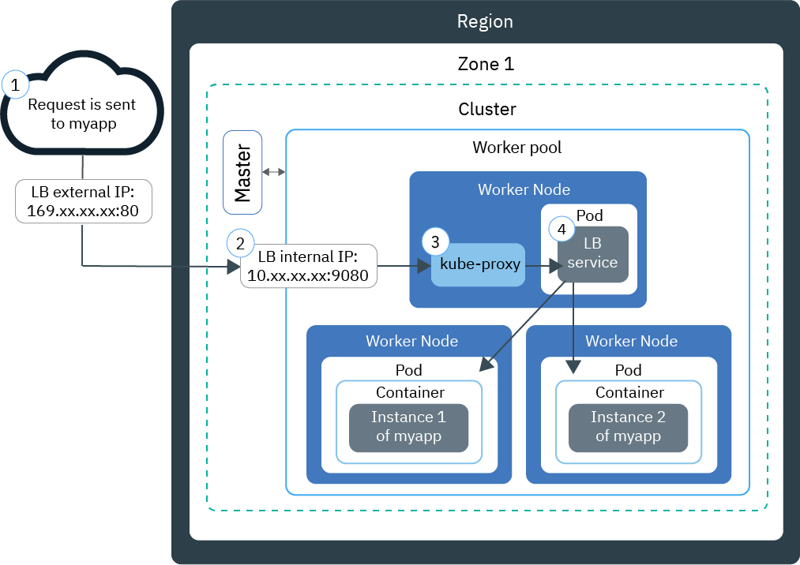
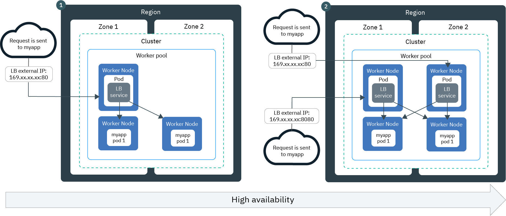
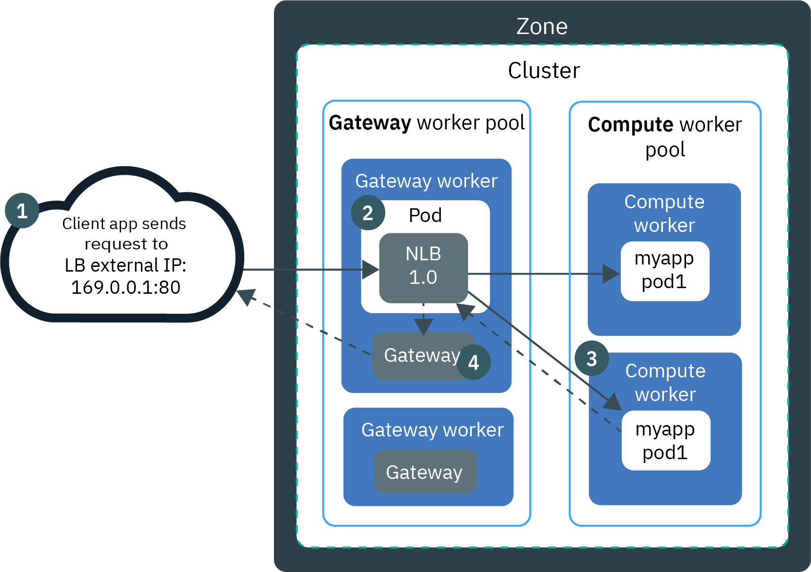
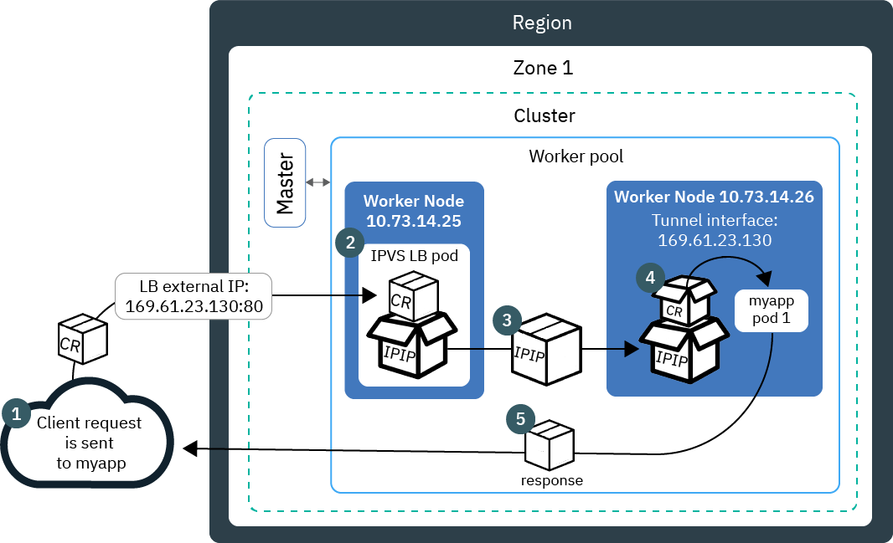
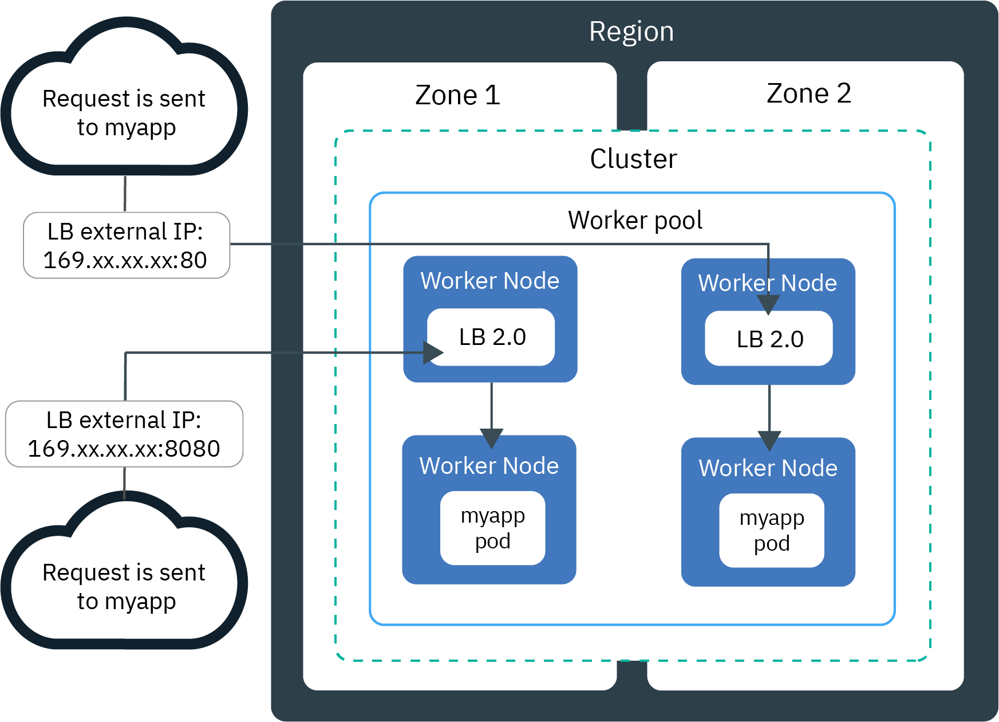
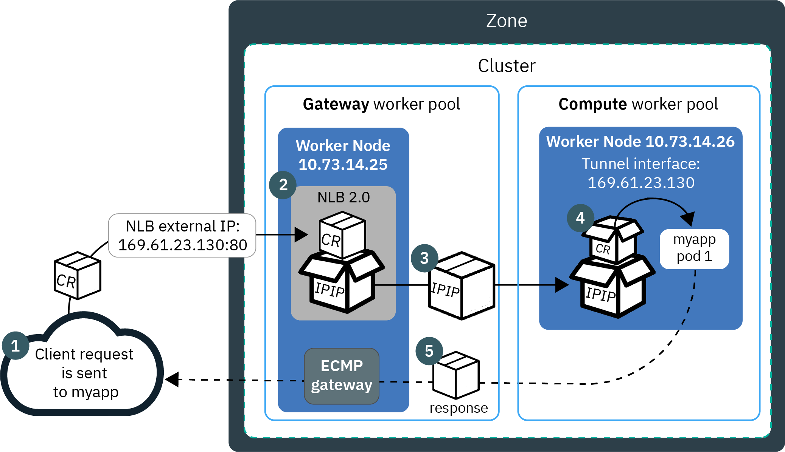

---

copyright: 
  years: 2014, 2022
lastupdated: "2022-11-11"

keywords: kubernetes, lb2.0, nlb, app protocol, application protocol

subcollection: containers

---

{{site.data.keyword.attribute-definition-list}}

# Classic: About network load balancers (NLBs)
{: #loadbalancer-about}

Network load balancers can be created in classic clusters only. To load balance in VPC clusters, see [Exposing apps with load balancers for VPC](/docs/containers?topic=containers-vpc-lbaas).
{: note}

When you create a standard cluster, {{site.data.keyword.containerlong}} automatically provisions a portable public subnet and a portable private subnet.
{: shortdesc}

* The portable public subnet provides 5 usable IP addresses. 1 portable public IP address is used by the default [public Ingress ALB](/docs/containers?topic=containers-ingress-types). The remaining 4 portable public IP addresses can be used to expose single apps to the internet by creating public network load balancer services, or NLBs.
* The portable private subnet provides 5 usable IP addresses. 1 portable private IP address is used by the default [private Ingress ALB](/docs/containers?topic=containers-ingress-types#alb-comm-create-private). The remaining 4 portable private IP addresses can be used to expose single apps to a private network by creating private load balancer services, or NLBs.

To make an app accessible through both a portable public and a portable private IP address, you must create both a public NLB and a private NLB. Portable public and private IP addresses are static floating IPs and don't change when a worker node is removed. If the worker node that the NLB IP address is on is removed, a Keepalived daemon that constantly monitors the IP automatically moves the IP to another worker node. You can assign any port to your NLB. The NLB serves as the external entry point for incoming requests for the app. To access the NLB from the internet, you can use the public IP address of your NLB and the assigned port in the format `<IP_address>:<port>`. You can also create DNS entries for NLBs by registering the NLB IP addresses with subdomains.

When you expose an app with an NLB service, your app is automatically made available over the service's NodePorts too. [NodePorts](/docs/containers?topic=containers-nodeport) are accessible on every public and private IP address of every worker node within the cluster. To block traffic to NodePorts while you are using an NLB, see [Controlling inbound traffic to network load balancer (NLB) or NodePort services](/docs/containers?topic=containers-network_policies#block_ingress).

**Kubernetes 1.20 and later**: Although the Kubernetes [SCTP protocol](https://kubernetes.io/docs/concepts/services-networking/service/#sctp){: external} and [application protocol](https://kubernetes.io/docs/concepts/services-networking/service/#application-protocol){: external} features are generally available in the community release, creating load balancers that use these protocols is not supported in {{site.data.keyword.containerlong_notm}} clusters.
{: note}

## Comparison of basic and DSR load balancing in version 1.0 and 2.0 NLBs
{: #comparison-lbs}

When you create an NLB, you can choose a version 1.0 NLB, which performs basic load balancing, or version 2.0 NLB, which performs direct server return (DSR) load balancing.
{: shortdesc}

**How are versions 1.0 and 2.0 NLBs similar?**

Version 1.0 and 2.0 NLBs are both Layer 4 load balancers that exist in the Linux kernel space. Both versions run inside the cluster, and use worker node resources. Therefore, the available capacity of the NLBs is always dedicated to your own cluster. Additionally, both versions of NLBs don't terminate the connection. Instead, they forward connections to an app pod.

**How are versions 1.0 and 2.0 NLBs different?**

When a client sends a request to your app, the NLB routes request packets to the worker node IP address where an app pod exists. Version 1.0 NLBs use network address translation (NAT) to rewrite the request packet's source IP address to the IP of worker node where a load balancer pod exists. When the worker node returns the app response packet, it uses that worker node IP where the NLB exists. The NLB must then send the response packet to the client. To prevent the IP address from being rewritten, you can [enable source IP preservation](/docs/containers?topic=containers-loadbalancer#lb_source_ip). However, source IP preservation requires load balancer pods and app pods to run on the same worker so that the request doesn't have to be forwarded to another worker. You must add node affinity and tolerations to app pods. For more information about basic load balancing with version 1.0 NLBs, see [Components and architecture of an NLB 1.0](#v1_planning).

As opposed to version 1.0 NLBs, version 2.0 NLBs don't use NAT when forwarding requests to app pods on other workers. When an NLB 2.0 routes a client request, it uses IP over IP (IPIP) to encapsulate the original request packet into another packet. This encapsulating IPIP packet has a source IP of the worker node where the load balancer pod is, which allows the original request packet to preserve the client IP as its source IP address. The worker node then uses direct server return (DSR) to send the app response packet to the client IP. The response packet skips the NLB and is sent directly to the client, decreasing the amount of traffic that the NLB must handle. For more information about DSR load balancing with version 2.0 NLBs, see [Components and architecture of an NLB 2.0](#planning_ipvs).

## Components and architecture of an NLB 1.0
{: #v1_planning}

The TCP/UDP network load balancer (NLB) 1.0 uses Iptables, a Linux kernel feature to load balance requests across an app's pods.
{: shortdesc}

Mixed protocol load balancer services are not supported in IBM Cloud Kubernetes Service. You cannot specify both TCP and UDP ports your in load balancer definition.
{: note}

### Traffic flow in a single-zone cluster
{: #v1_single}

The following diagram shows how an NLB 1.0 directs communication from the internet to an app in a single-zone cluster.
{: shortdesc}

{: caption="Figure 1. Expose an app in a single-zone cluster by using an NLB 1.0" caption-side="bottom"}

1. A request to your app uses the public IP address of your NLB and the assigned port on the worker node. Note that if you [create a DNS subdomain](/docs/containers?topic=containers-loadbalancer_hostname) for your NLB, users can access your app through the NLB's subdomain instead. A DNS system service resolves the subdomain to the portable public IP address of the NLB.

2. The NLB receives the request and forwards it to the private IP address of the app pod over the private network. The source IP address of the request package is changed to the public IP address of the worker node where the NLB pod runs. If multiple app instances are deployed in the cluster, the NLB routes the requests between the app pods.

3. When the app returns a response packet, it uses the IP address of the worker node where the NLB that forwarded the client request exists. The NLB then sends the response packet to the client.

### Traffic flow in a multizone cluster
{: #v1_multi}

The following diagram shows how a network load balancer (NLB) 1.0 directs communication from the internet to an app in a multizone cluster.
{: shortdesc}

{: caption="Figure 2. Use an NLB 1.0 to load balance apps in a multizone cluster" caption-side="bottom"}

1. A request to your app uses the [DNS subdomain](/docs/containers?topic=containers-loadbalancer_hostname) for your NLBs. You can also access the NLB in each zone by using its public IP address and port on the worker node. Note that by default, each NLB 1.0 is set up in one zone only. To achieve high availability, you must deploy an NLB 1.0 in every zone where you have app instances.

2. A DNS system service resolves the subdomain to the portable public IP address of one of the NLBs and its assigned port on the worker node. Requests are handled by the NLBs in various zones in a round-robin cycle.

3. The NLB receives the request and forwards it to the private IP address of the app pod over the private network. The source IP address of the request package is changed to the public IP address of the worker node where the NLB pod runs. Each NLB routes requests to the app instances in its own zone and to app instances in other zones. Additionally, if multiple app instances are deployed in one zone, the NLB routes the requests between the app pods in the zone.

4. When the app returns a response packet, it uses the IP address of the worker node where the NLB that forwarded the client request exists. The NLB then sends the response packet to the client.

### Traffic flow in a gateway-enabled cluster
{: #v1_gateway}

The following diagram shows how an NLB 1.0 directs communication from the internet to an app in a [gateway-enabled cluster](/docs/containers?topic=containers-plan_basics#gateway).
{: shortdesc}

{: caption="Figure 3. Expose an app in a gateway-enabled cluster by using an NLB 1.0" caption-side="bottom"}

1. A request to your app uses the public IP address of your NLB and the assigned port on the worker node. Note that if you [create a DNS subdomain](/docs/containers?topic=containers-loadbalancer_hostname) for your NLB, users can access your app through the NLB's subdomain instead. A DNS system service resolves the subdomain to the portable public IP address of the NLB.

2. The NLB receives the request. The NLB is able to receive the request because the NLB pods are scheduled to a worker in the `gateway` worker pool, which has public network connectivity.

3. The NLB forwards the request to the IP address of the worker node where an app pod is deployed over the private network. The source IP address of the request package is changed to the public IP address of the gateway worker node where the NLB is deployed. If multiple app instances are deployed in the cluster, the NLB routes the requests between the app pods.

4. When the app returns a response, it uses the IP address of the gateway worker node where the NLB that forwarded the client request exists. The NLB then sends the response packet through the gateway to the client.

## Components and architecture of an NLB 2.0
{: #planning_ipvs}

The NLB 2.0 is a Layer 4 load balancer that uses the Linux kernel's IP Virtual Server (IPVS). The NLB 2.0 supports TCP and UDP, runs in front of multiple worker nodes, and uses IP over IP (IPIP) tunneling to distribute traffic that arrives to a single NLB IP address across those worker nodes.

Mixed protocol load balancer services are not supported in IBM Cloud Kubernetes Service. You cannot specify both TCP and UDP ports your in load balancer definition.
{: note}

### Traffic flow in a single-zone cluster
{: #ipvs_single}

The following diagram shows how an NLB 2.0 directs communication from the internet to an app in a single zone cluster.
{: shortdesc}

{: caption="Figure 4. Expose an app in {{site.data.keyword.containerlong_notm}} by using a version 2.0 NLB" caption-side="bottom"}

1. A client request to your app uses the public IP address of your NLB and the assigned port on the worker node. In this example, the NLB has a virtual IP address of 169.61.23.130 and runs on the worker node that has the 10.73.13.25 private IP address. Note that if you [create a DNS subdomain](/docs/containers?topic=containers-loadbalancer_hostname) for your NLB, users can access your app through the NLB's subdomain instead. A DNS system service resolves the subdomain to the portable public IP address of the NLB.

2. The NLB encapsulates the client request packet (labeled as "CR" in the image) inside an IPIP packet (labeled as "IPIP"). The client request packet retains the client IP as its source IP address. The IPIP encapsulating packet uses the worker node 10.73.14.25 IP as its source IP address.

3. The NLB routes the IPIP packet to a worker that an app pod is on and that has the private IP address 10.73.13.26. If multiple app instances are deployed in the cluster, the NLB routes the requests between the workers where app pods are deployed.

4. Worker 10.73.14.26 unpacks the IPIP encapsulating packet, and then unpacks the client request packet. The client request packet is forwarded to the app pod on that worker node.

5. Worker 10.73.14.26 then uses the source IP address from the original request packet, the client IP, to return the app pod's response packet directly to the client.

### Traffic flow in a multizone cluster
{: #ipvs_multi}

The following diagram shows how version 2.0 NLBs in each zone direct traffic from the internet to an app in a multizone cluster.
{: shortdesc}

{: caption="Figure 5. Expose an app in {{site.data.keyword.containerlong_notm}} by using an NLB 2.0" caption-side="bottom"}

1. A request to your app uses the [DNS subdomain](/docs/containers?topic=containers-loadbalancer_hostname) for your NLBs. You can also access the NLB in each zone by using its public IP address and port on the worker node. Note that by default, each NLB 2.0 is set up in one zone only. To achieve high availability, you must deploy an NLB 2.0 in every zone where you have app instances.

2. A DNS system service resolves the subdomain to the portable public IP address of one of the NLBs and its assigned port on the worker node. In this example, the NLB has a virtual IP address of 169.61.23.130 and runs on the worker node that has the 10.73.13.25 private IP address. Requests are handled by the NLBs in various zones in a round-robin cycle.

3. The NLB encapsulates the client request packet (labeled as "CR" in the image) inside an IPIP packet (labeled as "IPIP"). The client request packet retains the client IP as its source IP address. The IPIP encapsulating packet uses the worker 10.73.14.25 IP as its source IP address.

4. The NLB routes the IPIP packet to a worker that an app pod is on and that has the private IP address 10.73.13.26. Note that each NLB routes requests to the app instances in its own zone and to app instances in other zones. Additionally, if multiple app instances are deployed in one zone, the NLB routes the requests between the app pods in the zone.

5. Worker 10.73.14.26 unpacks the IPIP encapsulating packet, and then unpacks the client request packet. The client request packet is forwarded to the app pod on that worker node.

6. Worker 10.73.14.26 then uses the source IP address from the original request packet, the client IP, to return the app pod's response packet directly to the client.

### Traffic flow in a gateway-enabled cluster
{: #v2_gateway}

The following diagram shows how an NLB 2.0 directs communication from the internet to an app in a [gateway-enabled cluster](/docs/containers?topic=containers-plan_basics#gateway).
{: shortdesc}

{: caption="Figure 6. Expose an app in a gateway-enabled cluster by using an NLB 2.0" caption-side="bottom"}

This diagram shows the traffic flow through a single-zone, gateway-enabled cluster. If your gateway-enabled cluster is multizone, you must deploy an NLB 2.0 in every zone where you have app instances. Each NLB routes requests to the app instances in its own zone and to app instances in other zones.

1. A client request to your app uses the public IP address of your NLB and the assigned port on the worker node. In this example, the NLB has a virtual IP address of 169.61.23.130 and runs on the worker node that has the 10.73.13.25 private IP address. Note that if you [create a DNS subdomain](/docs/containers?topic=containers-loadbalancer_hostname) for your NLB, users can access your app through the NLB's subdomain instead. A DNS system service resolves the subdomain to the portable public IP address of the NLB.

2. The NLB encapsulates the client request packet (labeled as "CR" in the image) inside an IPIP packet (labeled as "IPIP"). The client request packet retains the client IP as its source IP address. The IPIP encapsulating packet uses the worker node 10.73.14.25 IP as its source IP address. Note that the NLB is able to receive the request because the NLB pods are scheduled to a worker node in the `gateway` worker pool, which has public network connectivity.

3. The NLB routes the IPIP packet to a compute worker node that an app pod is on and that has the private IP address 10.73.13.26. If multiple app instances are deployed in the zone, the NLB routes the requests in a round-robin style between the workers where app pods are deployed.

4. The compute worker node, 10.73.13.26, unpacks the IPIP encapsulating packet, and then unpacks the client request packet. The client request packet is forwarded to the app pod on that worker node.

5. The compute worker node, 10.73.13.26, then uses the source IP address from the original request packet, the client IP, to return the app pod's response packet directly to the client. Equal Cost Multipath (ECMP) routing is used to balance the response traffic through a gateway on one of the gateway worker nodes to the client.

