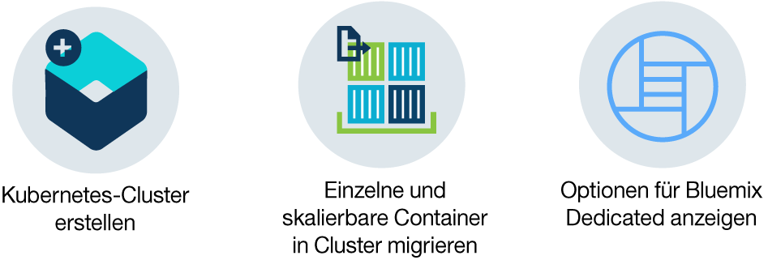

---

copyright:
  years: 2014, 2017
lastupdated: "2017-08-014"

---

{:new_window: target="_blank"}
{:shortdesc: .shortdesc}
{:screen: .screen}
{:pre: .pre}
{:table: .aria-labeledby="caption"}
{:codeblock: .codeblock}
{:tip: .tip} 
{:download: .download}

# Einführung in {{site.data.keyword.containerlong_notm}}
{: #container_index}

Sie können hoch verfügbare Apps in Docker-Containern und Kubernetes-Clustern in der {{site.data.keyword.IBM}} Cloud verwalten.
Ein Container ist ein Standardverfahren zum Packen einer App mit den zugehörigen Abhängigkeiten, sodass die App in eine andere Umgebungen verlagert und dort ohne Änderungen ausgeführt werden kann. Im Unterschied zu virtuellen Maschinen packen Container das Betriebssystem nicht. Nur App-Code, Laufzeit, Systemtools, Bibliotheken und Einstellungen werden in dem Container gepackt. Dadurch ist ein Container schlanker, leichter übertragbar
und effizienter als eine virtuelle Maschine.

Klicken Sie auf eine Option für den Start:

<map name="home_map" id="home_map">
<area href="#clusters" alt="Einführung in Kubernetes-Cluster in Bluemix" title="Einführung in Kubernetes-Cluster in Bluemix" shape="rect" coords="-7, -8, 108, 211" />
    <area href="cs_classic.html#cs_classic" alt="Einzelne und skalierbare Container in IBM Bluemix Container Service ausführen" title="Einzelne und skalierbare Container in IBM Bluemix Container Service ausführen" shape="rect" coords="155, -1, 289, 210" />
    <area href="cs_ov.html#dedicated_environment" alt="Bluemix Dedicated-Cloudumgebung" title="Bluemix Dedicated-Cloudumgebung" shape="rect" coords="326, -10, 448, 218" />
</map>

## Einführung in Cluster in {{site.data.keyword.Bluemix_notm}} 
{: #clusters}

Kubernetes ist ein Orchestrierungstool für die Planung von App-Containern auf einem Cluster aus Rechenmaschinen. Mit Kubernetes können Entwickler hoch verfügbare Anwendungen rasch entwickeln, indem sie sich die Leistungsstärke und Flexibilität von Containern zunutze machen. {:shortdesc}

Bevor Sie eine App mit Kubernetes bereitstellen können, erstellen Sie zunächst einen Cluster. Ein Cluster ist eine Gruppe von Workerknoten, die zu einem Netz zusammengefasst sind. Der Zweck des Clusters besteht darin, eine Gruppe von Ressourcen, Knoten, Netzen und Speichereinheiten zu definieren, die die Hochverfügbarkeit von Anwendungen sicherstellen. 

Gehen Sie wie folgt vor, um einen Lite-Cluster zu erstellen:

1.  Klicken Sie im [**Katalog** ](https://console.bluemix.net/catalog/?category=containers) in der Kategorie **Container** auf **Kubernetes-Cluster**.

2.  Geben Sie die Details für den Cluster ein. Der Standardclustertyp ist Lite. Daher gibt es nur wenige Felder, die angepasst werden können. Das nächste Mal können Sie einen Standardcluster erstellen und weitere Anpassungen definieren, z. B. die Anzahl von Workerknoten im Cluster. 
    1.  Geben Sie bei **Cluster Name** einen Namen für den Cluster ein.
    2.  Wählen Sie für **Location** einen Standort aus, an dem Ihr Cluster bereitgestellt werden soll. Welche Standorte Ihnen zur Verfügung stehen, hängt von der Region ab, bei der Sie angemeldet sind. Wählen Sie die Region aus, die Ihrem Standort am nächsten ist, um eine optimale Leistung zu erhalten.

    Verfügbare Standorte sind:

    <ul><li>Vereinigte Staaten (Süden)<ul><li>dal10 [Dallas]</li><li>dal12 [Dallas]</li></ul></li><li>Großbritannien (Süden)<ul><li>lon02 [London]</li><li>lon04 [London]</li></ul></li><li>Zentraleuropa<ul><li>ams03 [Amsterdam]</li><li>ra02 [Frankfurt]</li></ul></li><li>Asiatisch-pazifischer Raum (Süden)<ul><li>syd01 [Sydney]</li><li>syd04 [Sydney]</li></ul></li></ul>
        
3.  Klicken Sie auf **Cluster erstellen**. Die Detailinformationen für den Cluster werden geöffnet; die Einrichtung des Workerknotens im Cluster kann jedoch einige Minuten in Anspruch nehmen. Auf der Registerkarte **Workerknoten** können Sie den Status des Workerknoten überprüfen. Wenn der Status `Ready` erreicht wurde, ist Ihr Workerknoten einsatzbereit.

Hervorragend! Sie haben Ihren ersten Cluster erstellt!

*   Der Lite-Cluster stellt Ihren Apps einen Workerknoten mit 2 CPUs und 4 GB Speicherplatz zur Verfügung.
*   Der Workerknoten wird durch einen dedizierten und hoch verfügbaren {{site.data.keyword.IBM_notm}} eigenen Kubernetes-Master zentral überwacht und verwaltet, der alle Kubernetes-Ressourcen im Cluster steuert und überwacht. Sie können sich auf Ihren Workerknoten und die darin bereitgestellten Apps konzentrieren, ohne sich Gedanken über die Verwaltung des Masters zu machen.
*   Die für die Ausführung des Clusters erforderlichen Ressourcen, z. B. VLANS und IP-Adressen, werden in einem {{site.data.keyword.IBM_notm}} eigenen {{site.data.keyword.BluSoftlayer_full}}-Konto verwaltet. Wenn Sie einen Standardcluster erstellen, verwalten Sie diese Ressourcen in Ihrem eigenen {{site.data.keyword.BluSoftlayer_notm}}-Konto. Weitere Informationen zu diesen Ressourcen erhalten Sie, wenn Sie einen Standardcluster erstellen.
*   **Tip:** Lite-Cluster, die mit einem kostenlosen {{site.data.keyword.Bluemix_notm}}-Testkonto erstellt wurden, werden automatisch entfernt, wenn der kostenlose Testzeitraum beendet ist. Es sei denn, Sie [aktualisieren auf ein nutzungsabhängiges {{site.data.keyword.Bluemix_notm}}-Konto](/docs/pricing/billable.html#upgradetopayg) 

**Womit möchten Sie fortfahren? **

Wenn der Cluster betriebsbereit ist, können Sie sich mit den folgenden Tasks vertraut machen.

* [Installieren Sie die Befehlszeilenschnittstellen und nehmen Sie die Arbeit mit dem Cluster auf.](cs_cli_install.html#cs_cli_install)
* [Stellen Sie eine App in Ihrem Cluster bereit.](cs_apps.html#cs_apps_cli)
* [Erstellen Sie einen Standardcluster mit mehreren Knoten zwecks höherer Verfügbarkeit.](cs_cluster.html#cs_cluster_ui)
* [Richten Sie Ihre eigene private Registry in {{site.data.keyword.Bluemix_notm}} ein, um Docker-Images zu speichern und gemeinsam mit anderen Benutzern zu verwenden.](/docs/services/Registry/index.html)

## Einführung in Cluster in {{site.data.keyword.Bluemix_notm}} Dedicated (Closed Beta)
{: #dedicated}

Kubernetes ist ein Orchestrierungstool für die Planung von App-Containern auf einem Cluster aus Rechenmaschinen. Mit Kubernetes können Entwickler hoch verfügbare Anwendungen rasch entwickeln, indem sie sich die Leistungsstärke und Flexibilität von Containern in ihrer {{site.data.keyword.Bluemix_notm}} Dedicated-Instanz zunutze machen. {:shortdesc}

[Richten Sie zunächst eine {{site.data.keyword.Bluemix_notm}} Dedicated-Umgebung ein.](cs_ov.html#setup_dedicated) Dann können Sie einen Cluster erstellen. Ein Cluster ist eine Gruppe von Workerknoten, die zu einem Netz zusammengefasst sind. Der Zweck des Clusters besteht darin, eine Gruppe von Ressourcen, Knoten, Netzen und Speichereinheiten zu definieren, die die Hochverfügbarkeit von Anwendungen sicherstellen. Nachdem Sie einen Cluster erstellt haben, können Sie Ihre App im Cluster bereitstellen. 

**Tipp:** Wenn Ihre Organisation noch keine {{site.data.keyword.Bluemix_notm}} Dedicated-Umgebung hat, benötigen Sie diese auch nicht. [Versuchen Sie zunächst einen dedizierten Standardcluster in der {{site.data.keyword.Bluemix_notm}} Public-Umgebung.](cs_cluster.html#cs_cluster_ui)

Gehen Sie wie folgt vor, um einen Cluster in {{site.data.keyword.Bluemix_notm}} Dedicated bereitzustellen: 

1.  Melden Sie sich bei der {{site.data.keyword.Bluemix_notm}} Public-Konsole ([https://console.bluemix.net ](https://console.bluemix.net/catalog/?category=containers)) mit Ihrer IBMid an.Sie müssen einen Cluster zwar von {{site.data.keyword.Bluemix_notm}} Public anfordern, stellen diesen aber in Ihrem {{site.data.keyword.Bluemix_notm}} Dedicated-Konto bereit.
2.  Wenn Sie über mehrere Konten verfügen, wählen Sie im Kontomenü ein {{site.data.keyword.Bluemix_notm}}-Konto aus.
3.  Klicken Sie in der Kategorie **Container** auf **Kubernetes-Cluster**.
4.  Geben Sie die Details für den Cluster ein.
    1.  Geben Sie bei **Cluster Name** einen Namen für den Cluster ein.
    2.  Wählen Sie eine Kubernetes-Version**** aus, die in den Workerknoten verwendet werden soll.  
    3.  Wählen Sie in **Machine type** einen Maschinentyp aus. Der Maschinentyp definiert die Menge an virtueller CPU und Hauptspeicher, die in jedem Workerknoten eingerichtet wird und allen Containern, die Sie in Ihren Knoten bereitstellen, zur Verfügung steht.
    4.  Wählen Sie für **Number of worker nodes** die benötigte Anzahl von Workerknoten aus. Wählen Sie für mehr Hochverfügbarkeit für Ihren Cluster den Wert 3 aus. 
    
    Der Clustertyp, die Position, das öffentliche VLAN und die Hardwarefelder werden während der Erstellung des {{site.data.keyword.Bluemix_notm}} Dedicated-Kontos definiert. Daher können Sie diese Werte nicht anpassen.
5.  Klicken Sie auf **Cluster erstellen**. Die Detailinformationen für den Cluster werden geöffnet; die Einrichtung der Workerknoten im Cluster kann jedoch einige Minuten in Anspruch nehmen. Auf der Registerkarte **Workerknoten** können Sie den Status der Workerknoten überprüfen. Wenn der Status `Ready` erreicht wurde, sind Ihre Workerknoten einsatzbereit.

    Die Workerknoten werden durch einen dedizierten und hoch verfügbaren {{site.data.keyword.IBM_notm}} eigenen Kubernetes-Master zentral überwacht und verwaltet, der alle Kubernetes-Ressourcen im Cluster steuert und überwacht. Sie können sich auf Ihre Workerknoten und die darin bereitgestellten Apps konzentrieren, ohne sich Gedanken über die Verwaltung des Masters zu machen.

Hervorragend! Sie haben Ihren ersten Cluster erstellt!

**Womit möchten Sie fortfahren? **

Wenn der Cluster betriebsbereit ist, können Sie sich mit den folgenden Tasks vertraut machen.

* [Installieren Sie die Befehlszeilenschnittstellen und nehmen Sie die Arbeit mit dem Cluster auf.](cs_cli_install.html#cs_cli_install)
* [Stellen Sie eine App in Ihrem Cluster bereit.](cs_apps.html#cs_apps_cli)
* [Fügen Sie {{site.data.keyword.Bluemix_notm}}-Services zu Ihrem Cluster hinzu.](cs_cluster.html#binding_dedicated)
* [Erfahren Sie mehr über die Unterschiede zwischen Clustern in {{site.data.keyword.Bluemix_notm}} Dedicated und Public.](cs_ov.html#env_differences)

