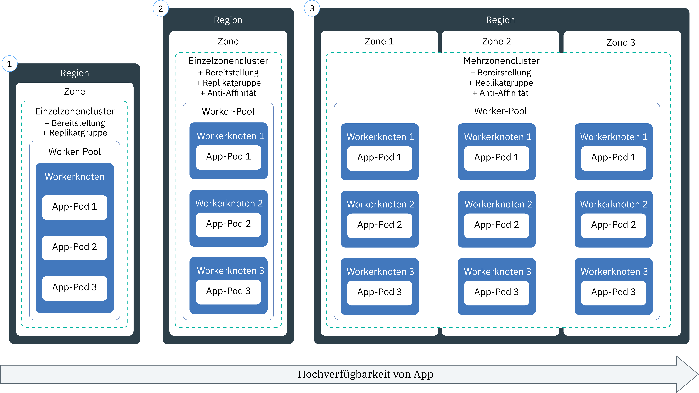

---

copyright:
  years: 2014, 2019
lastupdated: "2019-04-18"

keywords: kubernetes, iks, node.js, js, java, .net, go, flask, react, python, swift, rails, ruby, spring boot, angular

subcollection: containers

---

{:new_window: target="_blank"}
{:shortdesc: .shortdesc}
{:screen: .screen}
{:pre: .pre}
{:table: .aria-labeledby="caption"}
{:codeblock: .codeblock}
{:tip: .tip}
{:note: .note}
{:important: .important}
{:deprecated: .deprecated}
{:download: .download}


# Apps in Clustern bereitstellen
{: #app}

Sie können Kubernetes-Verfahren in {{site.data.keyword.containerlong}} verwenden, um Apps in Containern bereitzustellen und um sicherzustellen, dass Ihre Apps ununterbrochen betriebsbereit sind. Sie können beispielsweise rollierende Aktualisierungen und Rollbacks ausführen, ohne dass Ihren Benutzern hierdurch Ausfallzeiten entstehen. Da Kubernetes eine erweiterbare Containerorchestrierungsplattform ist, die keine bestimmte Sprache oder App voraussetzt, können Sie eine Reihe verschiedener Workloads wie statusunabhängige und statusabhängige Apps sowie Datenverarbeitungsapps ausführen, die in der Sprache Ihrer Wahl geschrieben sind.
{: shortdesc}

Erfahren Sie mehr zu den allgemeinen Schritten zur Bereitstellung von Apps, indem Sie auf einen Bereich der folgenden Abbildung klicken. Möchten Sie zuerst die Grundlagen lernen? Probieren Sie dazu das [Lernprogramm zum Bereitstellen von Apps](/docs/containers?topic=containers-cs_apps_tutorial#cs_apps_tutorial) aus.


<map name="d62e18" id="d62e18">
<area href="/docs/containers?topic=containers-cs_cli_install" target="_blank" alt="Installieren Sie die CLIs." title="Installieren Sie die CLIs." shape="rect" coords="30, 69, 179, 209" />
<area href="https://kubernetes.io/docs/concepts/configuration/overview/" target="_blank" alt="Erstellen Sie eine Konfigurationsdatei für Ihre App. Verschaffen Sie sich einen Überblick über die Best Practices von Kubernetes." title="Erstellen Sie eine Konfigurationsdatei für Ihre App. Verschaffen Sie sich einen Überblick über die Best Practices von Kubernetes." shape="rect" coords="254, 64, 486, 231" />
<area href="#app_cli" target="_blank" alt="Option 1: Führen Sie Konfigurationsdateien über die Kubernetes-CLI aus." title="Option 1: Führen Sie Konfigurationsdateien über die Kubernetes-CLI aus." shape="rect" coords="544, 67, 730, 124" />
<area href="#cli_dashboard" target="_blank" alt="Option 2: Starten Sie das Kubernetes-Dashboard lokal und führen Sie Konfigurationsdateien aus." title="Option 2: Starten Sie das Kubernetes-Dashboard lokal und führen Sie Konfigurationsdateien aus." shape="rect" coords="544, 141, 728, 204" />
</map>

<br />


## Ausführen von Apps in Clustern planen
{: #plan_apps}

Bevor Sie eine App in einem {{site.data.keyword.containerlong_notm}}-Cluster bereitstellen, müssen Sie entscheiden, wie Sie Ihre App konfigurieren möchten, damit sie ordnungsgemäß aufgerufen und in andere Services in {{site.data.keyword.Bluemix_notm}} integriert werden kann.
{:shortdesc}

### Welche Art von Kubernetes-Objekten kann ich für meine App erstellen?
{: #object}

Wenn Sie die YAML-Datei für die App vorbereiten, haben Sie viele Möglichkeiten, um die Verfügbarkeit, Leistung und Sicherheit der App zu erhöhen. So können Sie zum Beispiel anstelle eines einzelnen Pods ein Kubernetes-Controller-Objekt, wie z. B. eine Replikatgruppe, einen Job oder eine Dämongruppe, zur Verwaltung der Workload verwenden. Weitere Informationen zu Pods und Controllern finden Sie in der [Kubernetes-Dokumentation ](https://kubernetes.io/docs/concepts/workloads/pods/pod-overview/). Eine Bereitstellung, von der eine Replikatgruppe von Pods verwaltet wird, ist ein gängiger Anwendungsfall für eine App.
{: shortdesc}

Beispiel: Das Objekt `kind: Deployment` ist eine gute Möglichkeit zum Bereitstellen eines App-Pods, weil Sie damit eine Replikatgruppe für mehr Verfügbarkeit für die Pods angeben können.

In der folgenden Tabelle wird beschrieben, warum es sinnvoll sein kann, abweichende Objekttypen für Kubernetes-Workloads zu erstellen.

| Objekt | Beschreibung |
| --- | --- |
| [`Pod` ](https://kubernetes.io/docs/concepts/workloads/pods/pod/) | Ein Pod ist die kleinste bereitstellbare Einheit für die Workloads und kann einen oder mehrere Container enthalten. ^Analog zu Containern sind Pods so konzipiert, dass sie gelöscht werden können; sie werden oft für Komponententests von Appfunktionen verwendet. Ziehen Sie in Betracht, die Pods zum Vermeiden von Ausfallzeiten für die App mit einem Kubernetes-Controller bereitzustellen, zum Beispiel als eine Bereitstellung. Eine Bereitstellung erleichtert die Verwaltung mehrerer Pods, Replikate, die Podskalierung, Rollouts usw. |
| [`ReplicaSet` ](https://kubernetes.io/docs/concepts/workloads/controllers/replicaset/) | Mithilfe einer Replikatgruppe wird sichergestellt, dass mehrere Replikate des Pods ausgeführt werden und ein Pod neu geplant wird, wenn er heruntergefahren wird. Sie können eine Replikatgruppe erstellen, um zu testen, wie die Pod-Planung funktioniert; erstellen Sie jedoch eine Bereitstellung, um App-Aktualisierungen, Rollouts und Skalierungen zu verwalten. |
| [`Deployment` ](https://kubernetes.io/docs/concepts/workloads/controllers/deployment/) | Eine Bereitstellung ist ein Controller, von dem ein Pod oder eine [Replikatgruppe ](https://kubernetes.io/docs/concepts/workloads/controllers/replicaset/) der Pod-Vorlagen verwaltet wird. Sie können Pods oder Replikatgruppen ohne eine Bereitstellung zum Testen von App-Features erstellen. Verwenden Sie für eine Konfiguration auf Produktionsebene Bereitstellungen zum Verwalten von App-Aktualisierungen, Rollouts und Skalierungen. |
| [`StatefulSet` ](https://kubernetes.io/docs/concepts/workloads/controllers/statefulset/) | Analog zu einer Bereitstellung ist eine statusabhängige Gruppe ein Controller, von dem eine Replikatgruppe aus Pods verwaltet wird. Im Gegensatz zu einer Bereitstellung wird von einer statusabhängigen Gruppe sichergestellt, dass der Pod über eine eindeutige Netzidentität verfügt, von der der Status für die erneute Planung verwaltet wird. Wenn Sie Workloads in der Cloud ausführen möchten, versuchen Sie, [die App so zu gestalten, dass sie statusunabhängig ist](/docs/containers?topic=containers-strategy#cloud_workloads), damit die Serviceinstanzen voneinander unabhängig sind und ohne Unterbrechung des Service fehlschlagen können. Manche Apps, wie zum Beispiel Datenbanken, müssen jedoch statusabhängig sein. Ziehen Sie in solchen Fällen in Betracht, eine statusabhängige Gruppe zu erstellen und [Datei-](/docs/containers?topic=containers-file_storage#file_statefulset), [Block-](/docs/containers?topic=containers-block_storage#block_statefulset) oder [Objekt](/docs/containers?topic=containers-object_storage#cos_statefulset)speicher als persistenten Speicher für die statusabhängige Gruppe zu verwenden. Sie können darüber hinaus [Portworx](/docs/containers?topic=containers-portworx) über Ihre Bare-Metal-Workerknoten installieren und Portworx als hoch verfügbare softwaredefinierte Speicherlösung zur Verwaltung von persistentem Speicher für Ihre statusabhängige Gruppe verwenden. |
| [`DaemonSet` ](https://kubernetes.io/docs/concepts/workloads/controllers/daemonset/) | Verwenden Sie eine Dämongruppe (daemon), wenn Sie denselben Pod auf jedem Workerknoten im Cluster ausführen müssen. Pods, die von einer Dämongruppe verwaltet werden, werden automatisch geplant, wenn ein Workerknoten zu einem Cluster hinzugefügt wird. Typische Anwendungsfälle sind unter anderem Protokollcollectors, zum Beispiel `logstash` oder `prometheus`, von denen Protokolle von jedem Workerknoten erfasst werden, um eine Übersicht über den Status eines Clusters oder einer App zu erhalten. |
| [`Job` ](https://kubernetes.io/docs/concepts/workloads/controllers/jobs-run-to-completion/) | Von einem Job wird sichergestellt, dass mindestens ein Pod erfolgreich bis zum Abschluss ausgeführt wird. Sie können einen Job für Warteschlangen oder Stapeljobs verwenden, um die Parallelverarbeitung von getrennten, aber zusammengehörigen Arbeitselementen zu unterstützen, zum Beispiel eine bestimmte Anzahl an wiederzugebenden Frames, an zu versendenden E-Mails und zu konvertierenden Dateien. Wenn Sie planen möchten, dass ein Job zu einem bestimmten Zeitpunkt ausgeführt werden soll, verwenden Sie hierfür einen [`CronJob` ](https://kubernetes.io/docs/concepts/workloads/controllers/cron-jobs/).|
{: caption="Typen der Objekte für Kubernetes-Workloads, die Sie erstellen können." caption-side="top"}

### Wie können Funktionen zur Kubernetes-App-Konfiguration hinzugefügt werden?
Beschreibungen zu allem, was in einer Bereitstellung enthalten sein kann, finden Sie in [App-Anforderungen in YAML-Datei angeben](#app_yaml). Das Beispiel umfasst Folgendes:
* [Replikatgruppen](#replicaset)
* [Bezeichnungen](#label)
* [Affinität](#affinity)
* [Imagerichtlinien](#image)
* [Ports](#port)
* [Ressourcenanforderungen und -einschränkungen](#resourcereq)
* [Aktivitäts- und Bereitschaftsprüfungen](#probe)
* [Services](#app-service) zum Bereitstellen des App-Service an einem Port
* [Konfigurationszuordnungen](#configmap) zum Festlegen von Containerumgebungsvariablen
* [Geheime Schlüssel](#secret) zum Festlegen von Containerumgebungsvariablen
* [Persistente Datenträger](#pv), die an den Container für den Speicher angehängt werden

### Was ist, wenn von meiner Kubernetes-App-Konfiguration Variablen verwendet werden sollen? Wie füge ich diese zur YAML-Datei hinzu?
{: #variables}

Wenn Sie Informationen zu Bereitstellungen hinzufügen möchten, anstatt feste Codierungen für die Daten in der YAML-Datei festzulegen, können Sie das Kubernetes-Objekt [`ConfigMap` ](https://kubernetes.io/docs/tasks/configure-pod-container/configure-pod-configmap/) oder [`Secret` ](https://kubernetes.io/docs/concepts/configuration/secret/) verwenden.
{: shortdesc}

Wenn Sie eine Konfigurationszuordnung (ConfigMap) oder einen geheimen Schlüssel (Secret) verarbeiten möchten, müssen Sie diese bzw. diesen an den Pod anhängen. Die Konfigurationszuordnung bzw. der geheime Schlüssel wird mit dem Pod kurz vor der Ausführung des Pods kombiniert. Sie können Bereitstellungsspezifikationen und Images für viele Apps wiederverwenden, aber anschließend die angepassten Konfigurationszuordnungen und geheimen Schlüssel auslagern. Da besonders für geheime Schlüssel große Speichermengen auf dem lokalen Knoten erforderlich sein können, sollten Sie entsprechend planen.

Von beiden Ressourcen werden Schlüssel/Wert-Paare definiert, Sie verwenden diese jedoch für unterschiedliche Situationen.

<dl>
<dt>Konfigurationszuordnung (Configmap)</dt>
<dd>Stellen Sie nicht sensible Konfigurationsinformationen für Workloads bereit, die in einer Bereitstellung angegeben sind. Zum Verwenden von Konfigurationszuordnungen stehen drei Hauptmöglichkeiten zur Verfügung.
<ul><li><strong>Dateisystem:</strong> Sie können eine gesamte Datei oder eine Gruppe von Variablen an einen Pod anhängen. Eine Datei wird für jeden Eintrag auf der Basis des Schlüsselnamensinhalts der Datei erstellt, der für den Wert festgelegt ist.</li>
<li><strong>Umgebungsvariable:</strong> Legen Sie die Umgebungsvariable dynamisch für eine Containerspezifikation fest.</li>
<li><strong>Befehlszeilenargument:</strong> Legen Sie das Befehlszeilenargument fest, das in einer Containerspezifikation verwendet wird.</li></ul></dd>

<dt>Geheimer Schlüssel (Secret)</dt>
<dd>Geben Sie sensible Informationen wie die folgenden zu Ihren Workloads an. Beachten Sie, dass andere Benutzer des Clusters möglicherweise über Zugriff auf den geheimen Schlüssel verfügen; stellen Sie daher sicher, dass die Informationen des geheimen Schlüssels gemeinsam mit diesen Benutzern genutzt werden können.
<ul><li><strong>Personenbezogene Daten:</strong> Speichern Sie sensible Informationen wie E-Mail-Adressen oder andere Arten von Informationen, die für die Compliance des Unternehmens oder behördliche Regelungen erforderlich sind, in geheimen Schlüsseln.</li>
<li><strong>Berechtigungsnachweise:</strong> Schließen Sie Berechtigungsnachweise wie Kennwörter, Schlüssel und Token in einen geheimen Schlüssel ein, um das Risiko einer zufälligen Gefährdung zu reduzieren. Beispiel: Beim [Binden eines Service](/docs/containers?topic=containers-service-binding#bind-services) an einen Cluster werden die Berechtigungsnachweise in einem geheimen Schlüssel gespeichert.</li></ul></dd>
</dl>

Sollen die geheimen Schlüssel noch sicherer werden? Wenden Sie sich an Ihren Clusteradministrator, um [{{site.data.keyword.keymanagementservicefull}} im Cluster zum Verschlüsseln neuer und vorhandener geheimer Schlüssel zu aktivieren](/docs/containers?topic=containers-encryption#keyprotect).
{: tip}

### Wie kann ich IBM Services zu meiner App hinzufügen, zum Beispiel Watson?
Informationen hierzu finden Sie unter [Services zu Apps hinzufügen](/docs/containers?topic=containers-service-binding#adding_app).

### Wie kann ich sicherstellen, dass meine App über die richtigen Ressourcen verfügt?
Wenn Sie die [YAML-Datei für die App angeben](#app_yaml), können Sie Kubernetes-Funktionen zur Konfiguration der App hinzufügen, die der App das Abrufen der richtigen Ressourcen erleichtern. Insbesondere das [Festlegen von Ressourcengrenzen und -anforderungen ](https://kubernetes.io/docs/concepts/configuration/manage-compute-resources-container/) für jeden Container, der in der YAML-Datei definiert ist.
{: shortdesc}

Zusätzlich kann der Clusteradministrator Ressourcensteuerungen wie die folgenden einrichten, die sich auf die Bereitstellung auswirken.
*  [Ressourcenquoten ](https://kubernetes.io/docs/concepts/policy/resource-quotas/)
*  [Podpriorität](/docs/containers?topic=containers-pod_priority#pod_priority)

### Wie kann ich auf meine App zugreifen?
Sie können privat auf die App im Cluster [mithilfe des Service `clusterIP` zugreifen](/docs/containers?topic=containers-cs_network_planning#in-cluster).
{: shortdesc}

Wenn Sie die App öffentlich zugänglich machen möchten, haben Sie verschiedene Optionen, die vom Clustertyp abhängig sind.
*  **Kostenloser Cluster:** Sie können Ihre App mithilfe des [NodePort-Service](/docs/containers?topic=containers-nodeport#nodeport) zugänglich machen.
*  **Standardcluster:** Sie können Ihre App mithilfe des [NodePort-Service, Lastausgleichsservice oder Ingress-Service verfügbar machen](/docs/containers?topic=containers-cs_network_planning#external).
*  **Cluster, der mit Calico privat verwendet wird:** Sie können Ihre App mithilfe des [NodePort-Service, Lastausgleichsservice oder Ingress-Service verfügbar machen](/docs/containers?topic=containers-cs_network_planning#private_both_vlans). Sie müssen auch eine Calico-PreDNAT-Netzrichtlinie verwenden, um die öffentlichen Knotenports zu blockieren.
*  **Standardcluster für ausschließlich privates VLAN:** Sie können Ihre App mithilfe des [NodePort-Service, Lastausgleichsservice oder Ingress-Service verfügbar machen](/docs/containers?topic=containers-cs_network_planning#plan_private_vlan). Sie müssen außerdem den Port für die private IP-Adresse des Service in der Firewall öffnen.

### Wie kann ich den Status meiner App nach ihrer Bereitstellung überwachen?
Sie können die {{site.data.keyword.Bluemix_notm}}-[Protokollierung und -Überwachung](/docs/containers?topic=containers-health#health) für den Cluster konfigurieren. Sie können auch einen [Protokollierungs- oder Überwachungsservice](/docs/containers?topic=containers-supported_integrations#health_services) eines Drittanbieters integrieren.
{: shortdesc}

### Wie kann ich dafür sorgen, dass meine App aktuell bleibt?
Wenn Sie Apps als Reaktion auf die Workloadnutzung dynamisch hinzufügen und entfernen möchten, finden Sie weitere Informationen unter [Apps skalieren](/docs/containers?topic=containers-app#app_scaling).
{: shortdesc}

Informationen zum Verwalten von Aktualisierungen für eine App finden Sie unter [Laufende Bereitstellungen verwalten](/docs/containers?topic=containers-app#app_rolling).

### Wie kann ich steuern, wer Zugriff auf meine App-Bereitstellungen hat?
Konto- und Clusteradministratoren können den Zugriff auf unterschiedlichen Ebenen steuern: Cluster, Kubernetes-Namensbereich, Pod und Container.
{: shortdesc}

Mit {{site.data.keyword.Bluemix_notm}} IAM können Sie Berechtigungen zu einzelnen Benutzern, Gruppen oder Servicekonten auf der Clusterinstanzebene zuordnen.  Sie können einen Bereich für den Clusterzugriff noch weiter definieren, indem Sie Benutzer auf bestimmte Namensbereiche im Cluster beschränken. Weitere Informationen finden Sie in [Clusterzugriff zuweisen](/docs/containers?topic=containers-users#users).

Wenn Sie den Zugriff auf Podebene steuern möchten, können Sie [Podsicherheitsrichtlinien mit Kubernetes-RBAC konfigurieren](/docs/containers?topic=containers-psp#psp).

In der YAML-Datei für die Bereitstellung der App können Sie den Sicherheitskontext für einen Pod oder Container festlegen. Weitere Informationen finden Sie in der [Kubernetes-Dokumentation ](https://kubernetes.io/docs/tasks/configure-pod-container/security-context/).

Sie möchten den Zugriff auf Anwendungsebene steuern? Zum Erstellen eines Anmeldeablaufs, der sich jederzeit ohne Änderung Ihres App-Codes aktualisieren lässt, können Sie [{{site.data.keyword.appid_long_notm}}](/docs/services/appid?topic=appid-getting-started) verwenden.
{: tip}

<br />


## Bereitstellungen mit Hochverfügbarkeit planen
{: #highly_available_apps}

Je breiter gefächert Sie Ihre Containerkonfiguration auf mehrere Workerknoten und Cluster verteilen, umso geringer ist die Wahrscheinlichkeit, dass Ihre Benutzer Ausfallzeiten mit Ihrer App verzeichnen.
{: shortdesc}

Betrachten Sie die folgenden potenziellen App-Konfigurationen, die nach zunehmendem Grad der Verfügbarkeit angeordnet sind.



1.  Bereitstellung mit n+2 Pods, deren Verwaltung durch eine Replikatgruppe in einem Knoten in einem einzelnen Cluster mit einer Zone erfolgt.
2.  Bereitstellung mit n+2 Pods, deren Verwaltung durch eine Replikatgruppe erfolgt und die auf mehrere Knoten (Anti-Affinität) in einem einzelnen Cluster mit einer Zone verteilt sind.
3.  Bereitstellung mit n+2 Pods, deren Verwaltung durch eine Replikatgruppe erfolgt und die auf mehrere Knoten (Anti-Affinität) in einem Cluster mit mehreren Zonen verteilt sind.

Sie können auch [mehrere Cluster in verschiedenen Regionen mit einer globalen Lastausgleichsfunktion verbinden](/docs/containers?topic=containers-plan_clusters#multiple_clusters), um die hohe Verfügbarkeit zu erweitern.

### Verfügbarkeit Ihrer App erhöhen
{: #increase_availability}

Ziehen Sie die folgenden Optionen zum Verbessern der Verfügbarkeit Ihrer App in Betracht.
{: shortdesc}

<dl>
  <dt>Bereitstellungen und Replikatgruppen zum Bereitstellen Ihrer App und deren Abhängigkeiten verwenden</dt>
    <dd><p>Eine Bereitstellung ist eine Kubernetes-Ressource, mit der Sie alle Komponenten Ihrer App und deren Abhängigkeiten deklarieren können. Bei Bereitstellungen müssen Sie nicht alle Schritte niederschreiben und können sich stattdessen auf Ihre App konzentrieren.</p>
    <p>Wenn Sie mehrere Pods bereitstellen, wird für Ihre Bereitstellungen automatisch eine Replikatgruppe erstellt, mithilfe deren die Pods überwacht werden und sichergestellt wird, dass die angegebene Anzahl von Pods jederzeit betriebsbereit ist. Wird ein Pod inaktiv, so ersetzt die Replikatgruppe den inaktiven Pod durch einen neuen Pod.</p>
    <p>Mit einer Bereitstellung können Sie Aktualisierungsstrategien für Ihre App definieren. Dabei können Sie unter Anderem die Anzahl von Pods angeben, die Sie bei einer rollierenden Aktualisierung hinzufügen wollen, und festlegen, wie viele Pods zur gleichen Zeit unverfügbar sein dürfen. Wenn Sie eine rollierende Aktualisierung durchführen, prüft die Bereitstellung, ob die Überarbeitung funktioniert, und stoppt den Rollout, wenn Fehler erkannt werden.</p>
    <p>Sie können mehrere Revisionen mit unterschiedlichen Flags gleichzeitig bereitstellen. Sie können beispielsweise eine Bereitstellung zuerst testen, bevor Sie sich entschließen, sie per Push-Operation an die Produktion zu übertragen.</p>
    <p>Mit Bereitstellungen können Sie alle bereitgestellten Revisionen nachverfolgen. Sie können dieses Verlaufsprotokoll verwenden, um ein Rollback auf eine vorherige Version durchzuführen, falls Sie feststellen, dass Ihre Aktualisierungen nicht wie erwartet funktionieren.</p></dd>
  <dt>Ausreichende Anzahl von Replikaten für die Arbeitslast Ihrer App plus 2 einbeziehen</dt>
    <dd>Um Ihre App noch verfügbarer zu machen und ihre Ausfallsicherheit zu steigern, sollten Sie erwägen, über die Mindestzahl hinaus zusätzliche Replikate einzubinden, damit die erwartete Arbeitslast verarbeitet werden kann. Zusätzliche Replikate sind in der Lage, die Arbeitslast abzufangen, wenn ein Pod ausfällt und der ausgefallene Pod noch nicht durch die Replikatgruppe ersetzt wurde. Zum Schutz vor zwei gleichzeitigen Ausfällen sollten Sie zwei zusätzliche Replikate einbinden. Diese Konfiguration folgt dem Muster 'N+2'. Hierbei steht 'N' für die Anzahl der Replikate, die für die Verarbeitung der eingehenden Arbeitslast zur Verfügung steht, während der Wert '+2' die beiden zusätzlich eingebundenen Replikate angibt. Vorausgesetzt, in Ihrem Cluster ist ausreichend Platz, ist die Anzahl der mögliche Pods unbegrenzt.</dd>
  <dt>Pods auf mehrere Knoten (Anti-Affinität) verteilen</dt>
    <dd><p>Wenn Sie Ihre Bereitstellung erstellen, können alle Pods auf demselben Workerknoten bereitgestellt werden. Dies wird als Affinität oder Zusammenstellung bezeichnet. Zum Schutz Ihrer App vor dem Ausfall eines Workerknotens können Sie Ihre Bereitstellung so konfigurieren, dass Ihre Pods mithilfe der Option <code>podAntiAffinity</code> in Ihren Standardclustern über mehrere Workerknoten verteilt werden. Sie können zwei Typen von Pod-Anti-Affinität definieren: bevorzugt oder erforderlich.
      <p>Weitere Informationen finden Sie in der Kubernetes-Dokumentation unter <a href="https://kubernetes.io/docs/concepts/configuration/assign-pod-node/" rel="external" target="_blank" title="(Wird in einem neuen Tab oder einem neuen Fenster geöffnet)">Assigning Pods to Nodes</a>.</p>
      <p>Ein Beispiel für die Affinität in einer App-Bereitstellung finden Sie unter [YAML-Datei für App-Bereitstellung erstellen](#app_yaml).</p>
      </dd>
    </dd>
<dt>Pods auf mehrere Zonen oder Regionen verteilen</dt>
  <dd><p>Um Ihre App vor einem Zonenfehler zu schützen, können Sie mehrere Cluster in separaten Zonen erstellen oder Zonen zu einem Worker-Pool in einem Mehrzonencluster hinzufügen. Mehrzonencluster sind nur in [bestimmten Metropolbereichen](/docs/containers?topic=containers-regions-and-zones#zones) verfügbar, z. B. in Dallas. Wenn Sie mehrere Cluster in unterschiedlichen Zonen erstellen, müssen Sie [eine globale Lastausgleichsfunktion einrichten](/docs/containers?topic=containers-plan_clusters#multiple_clusters).</p>
  <p>Wenn Sie eine Replikatgruppe verwenden und Anti-Affinität für Pods angeben, verteilt Kubernetes Ihre App-Pods auf die Knoten. Wenn sich die Knoten in mehreren Zonen befinden, werden die Pods auf diese Zonen verteilt, was die Verfügbarkeit für Ihre App erhöht. Wenn Sie Ihre Apps nur in einer einzigen Zone ausführen möchten, können Sie die Pod-Affinität konfigurieren oder einen Worker-Pool in einer Zone erstellen und kennzeichnen. Weitere Informationen finden Sie unter [Hochverfügbarkeit für Mehrzonencluster](/docs/containers?topic=containers-plan_clusters#ha_clusters).</p>
  <p><strong>Sind in einer Bereitstellung mit Mehrzonencluster meine App-Pods gleichmäßig über die Knoten hinweg verteilt?</strong></p>
  <p>Die Pods sind gleichmäßig über die Zonen verteilt, aber nicht immer über Knoten hinweg. Wenn Sie beispielsweise über einen Cluster mit einem Knoten in jeder der drei Zonen verfügen und eine Replikatgruppe von sechs Pods bereitstellen, erhält jeder Knoten zwei Pods. Wenn Sie jedoch über einen Cluster mit zwei Knoten in jeder der drei Zonen verfügen und eine Replikatgruppe von sechs Pods bereitstellen, sind für jede Zone zwei Pods geplant und es kann ein Pod pro Knoten geplant werden (oder auch nicht). Für mehr Kontrolle über die Zeitplanung können Sie [die Pod-Affinität festlegen ](https://kubernetes.io/docs/concepts/configuration/assign-pod-node).</p>
  <p><strong>Wie werden Pods auf den verbleibenden Knoten in den anderen Zonen erneut geplant, wenn eine Zone inaktiv wird?</strong></br>Dies hängt von Ihrer Planungsrichtlinie ab, die Sie in der Bereitstellung verwendet haben. Wenn Sie eine [knotenspezifische Pod-Affinität ](https://kubernetes.io/docs/concepts/configuration/assign-pod-node/#node-affinity-beta-feature) angegeben haben, werden die Pods nicht erneut geplant. Wenn Sie dies nicht getan haben, werden die Pods auf verfügbaren Workerknoten in anderen Zonen erstellt, aber sie sind möglicherweise nicht ausgeglichen. Die beiden Pods können beispielsweise über die beiden verfügbaren Knoten verteilt sein, oder sie können beide für einen Knoten mit verfügbarer Kapazität geplant werden. In ähnlicher Weise werden Pods nicht automatisch neu gelöscht und über Knoten hinweg verteilt, wenn die nicht verfügbare Zone wieder verfügbar wird. Wenn Sie möchten, dass die Pods in den Zonen neu verteilt werden, wenn die Zone wieder aktiv ist, sollten Sie den [Kubernetes Descheduler ](https://github.com/kubernetes-incubator/descheduler) verwenden.</p>
  <p><strong>Tipp</strong>: Versuchen Sie in Mehrzonenclustern, die Workerknotenkapazität bei 50 % pro Zone zu halten, damit Ihnen ausreichend Kapazität bleibt, um Ihren Cluster vor einem Zonenausfall zu schützen.</p>
  <p><strong>Wie gehe ich vor, um meine App über Regionen zu verteilen?</strong></br>Um Ihre App vor einem Regionsausfall zu schützen, erstellen Sie einen zweiten Cluster in einer anderen Region, [konfigurieren Sie eine globale Lastausgleichsfunktion ](/docs/containers?topic=containers-plan_clusters#multiple_clusters), um Ihre Cluster zu verbinden, und verwenden Sie eine YAML-Datei für die Bereitstellung, um eine duplizierte Replikatgruppe mit [Pod-Anti-Affinität ](https://kubernetes.io/docs/concepts/configuration/assign-pod-node/) für Ihre App bereitzustellen.</p>
  <p><strong>Was ist, wenn meine Apps persistenten Speicher benötigen?</strong></p>
  <p>Verwenden Sie einen Cloud-Service wie [{{site.data.keyword.cloudant_short_notm}}](/docs/services/Cloudant?topic=cloudant-getting-started#getting-started) oder [{{site.data.keyword.cos_full_notm}}](/docs/services/cloud-object-storage?topic=cloud-object-storage-about#about).</p></dd>
</dl>

## App-Anforderungen in YAML-Datei angeben
{: #app_yaml}

In Kubernetes beschreiben Sie die App in einer YAML-Datei, durch die die Konfiguration des Kubernetes-Objekts deklariert wird. Anschließend wird die YAML-Datei vom Kubernetes-API-Server verarbeitet und die Konfiguration und der erforderliche Status des Objekts werden im Datenspeicher 'etcd' gespeichert. Der Kubernetes-Scheduler plant die Workloads auf den Workerknoten im Cluster und berücksichtigt dabei die Spezifikation in der YAML-Datei, alle vom Administrator festgelegten Clusterrichtlinien und die verfügbare Clusterkapazität.
{: shortdesc}

Überprüfen Sie eine Kopie der [vollständigen YAML-Datei](https://raw.githubusercontent.com/IBM-Cloud/kube-samples/master/deploy-apps-clusters/deploy_wasliberty.yaml). Überprüfen Sie danach die folgenden Abschnitte, um zu untersuchen, wie Sie die Bereitstellung der App verbessern können.

* [Replikatgruppen](#replicaset)
* [Bezeichnungen](#label)
* [Affinität](#affinity)
* [Imagerichtlinien](#image)
* [Ports](#port)
* [Ressourcenanforderungen und -einschränkungen](#resourcereq)
* [Aktivitäts- und Bereitschaftsprüfungen](#probe)
* [Services](#app-service) zum Bereitstellen des App-Service an einem Port
* [Konfigurationszuordnungen](#configmap) zum Festlegen von Containerumgebungsvariablen
* [Geheime Schlüssel](#secret) zum Festlegen von Containerumgebungsvariablen
* [Persistente Datenträger](#pv), die an den Container für den Speicher angehängt werden
* [Nächste Schritte](#nextsteps)
* [Vollständige YAML-Beispieldatei](#yaml-example)

<dl>
<dt>Basismetadaten einer Bereitstellung</dt>
  <dd><p>Verwenden Sie die geeignete API-Version für die [Art des Kubernetes-Objekts](#object), das Sie bereitstellen. Von der API-Version hängt ab, welche Funktionen für das Kubernetes-Objekt unterstützt werden und Ihnen somit zur Verfügung stehen. Der Name, den Sie in den Metadaten angeben, ist der Name des Objekts, nicht die Bezeichnung. Sie verwenden den Namen, wenn Sie mit dem Objekt interagieren (Beispiel: `kubectl get deployment <name>`).</p>
  <p><pre class="codeblock"><code>apiVersion: apps/v1
kind: Deployment
metadata:
  name: wasliberty</code></pre></p></dd>

<dt id="replicaset">Replikatgruppe</dt>
  <dd><p>Wenn Sie die Verfügbarkeit der App erhöhen möchten, können Sie eine Replikatgruppe in der Bereitstellung angeben. In einer Replikatgruppe definieren Sie, wie viele Instanzen der App bereitgestellt werden sollen. Replikatgruppen werden von der Kubernetes-Bereitstellung verwaltet und überwacht. Wenn eine App-Instanz inaktiv wird, wird von Kubernetes automatisch eine neue Instanz der App aktiviert, damit die angegebene Anzahl der App-Instanzen erhalten bleibt.</p>
  <p><pre class="codeblock"><code>spec:
  replicas: 3</pre></code></p></dd>

<dt id="label">Bezeichnungen</dt>
  <dd><p>Mit [Bezeichnungen](/docs/containers?topic=containers-strategy#deploy_organize) können Sie verschiedene Ressourcentypen im Cluster mit demselben Schlüssel/Wert-Paar (`key: value`) markieren. Anschließend können Sie den Selektor für die Übereinstimmung der Bezeichnung angeben, sodass Sie auf dieser Basis andere Ressourcen erstellen können. Wenn Sie die App öffentlich zugänglich machen möchten, müssen Sie eine Bezeichnung verwenden, die mit dem Selektor übereinstimmt, den Sie im Service angeben. Im Beispiel wird von der Bereitstellungsspezifikation die Vorlage verwendet, die mit der Bezeichnung `app: wasliberty` übereinstimmt.</p>
  <p>Sie können Objekte abrufen, die im Cluster gekennzeichnet sind, um zum Beispiel die Komponenten `staging` oder `production` anzuzeigen. Beispiel: Listen Sie alle Ressourcen mit der Bezeichnung `env: production` für alle Namensbereiche im Cluster auf. Beachten Sie, dass Sie Zugriff auf alle Namensbereiche benötigen, um diesen Befehl ausführen zu können.<pre class="pre"><code>kubectl get all -l env=production --all-namespaces</code></pre></p>
  <ul><li>Weitere Informationen zu Bezeichnungen finden Sie in der [Kubernetes-Dokumentation ](https://kubernetes.io/docs/concepts/overview/working-with-objects/labels/).</li>
  <li>Ein ausführlicheres Beispiel finden Sie unter [Apps für bestimmte Workerknoten mithilfe von Bezeichnungen bereitstellen](/docs/containers?topic=containers-app#node_affinity).</li></ul>
  <p><pre class="codeblock"><code>selector:
  matchLabels:
    app: wasliberty
template:
  metadata:
    labels:
      app: wasliberty</pre></code></p></dd>

<dt id="affinity">Affinität</dt>
  <dd><p>Geben Sie die Affinität (co-Location) an, wenn Sie mehr steuern möchten, über welche Workerknoten die Pods geplant werden sollen. Die Affinität wirkt sich nur während der Planzeit auf die Pods aus. Beispiel: Wenn Sie die Bereitstellung auf Workerknoten verteilen möchten, anstatt den Pods das Planen auf demselben Knoten zu ermöglichen, verwenden Sie die Option <code>podAntiAffinity</code> mit den Standardclustern. Sie können zwei Typen von Pod-Anti-Affinität definieren: bevorzugt oder erforderlich.</p>
  <p>Weitere Informationen finden Sie in der Kubernetes-Dokumentation unter <a href="https://kubernetes.io/docs/concepts/configuration/assign-pod-node/" rel="external" target="_blank" title="(Wird in einem neuen Tab oder einem neuen Fenster geöffnet)">Assigning Pods to Nodes</a>.</p>
  <ul><li><strong>Erforderliche Anti-Affinität</strong>: Sie können nur die Anzahl von Replikaten bereitstellen, für die es Workerknoten gibt. Wenn Sie beispielsweise drei Workerknoten haben, aber in Ihrer YAML-Datei fünf Replikate definieren, werden nur drei Replikate bereitgestellt. Jedes Replikat befindet sich auf einem anderen Workerknoten. Die zwei übrigen Replikate verbleiben ausstehend. Wenn Sie einen weiteren Workerknoten zu Ihrem Cluster hinzufügen, wird eines der restlichen Replikate automatisch auf dem Workerknoten bereitgestellt. Wenn ein Workerknoten ausfällt, wird der Pod nicht neu geplant, da eine Affinitätsrichtlinie erforderlich ist. Eine YAML-Beispieldatei finden Sie unter <a href="https://github.com/IBM-Cloud/kube-samples/blob/master/deploy-apps-clusters/liberty_requiredAntiAffinity.yaml" rel="external" target="_blank" title="(Wird in neuer Registerkarte oder neuem Fenster geöffnet)">Liberty-App mit erforderlicher Anti-Affinität für Pods</a>.</li>
  <li><strong>Bevorzugte Anti-Affinität</strong>: Sie können die Pods auf Knoten mit verfügbarer Kapazität bereitstellen, was mehr Flexibilität für die Workload bietet. Wenn möglich, werden die Pods auf verschiedenen Workerknoten geplant. Wenn Sie beispielsweise über drei Workerknoten mit ausreichend Kapazität im Cluster verfügen, können fünf Replikatknoten für die Knoten geplant werden. Wenn Sie jedoch zwei weitere Workerknoten zum Cluster hinzufügen, wird durch die Affinitätsregel nicht erzwungen, dass die zwei zusätzlichen Pods, die auf den vorhandenen Knoten ausgeführt werden, auf dem freien Knoten neu geplant werden.</li>
  <li><strong>Workerknotenaffinität</strong>: Sie können die Bereitstellung so konfigurieren, dass nur bestimmte Workerknoten ausgeführt werden, zum Beispiel Bare-Metal-Workerknoten. Weitere Informationen finden Sie unter [Apps für bestimmte Workerknoten mithilfe von Bezeichnungen bereitstellen](/docs/containers?topic=containers-app#node_affinity).</li></ul>
  <p>Beispiel für bevorzugte Anti-Affinität:</p>
  <p><pre class="codeblock"><code>spec:
  affinity:
    podAntiAffinity:
      preferredDuringSchedulingIgnoredDuringExecution:
      - weight: 100
        podAffinityTerm:
          labelSelector:
            matchExpressions:
            - key: app
              operator: In
              values:
              - wasliberty
          topologyKey: kubernetes.io/hostname</pre></code></p></dd>

<dt id="image">Container-Image</dt>
  <dd>
  <p>Geben Sie das Image, das Sie für die Container verwenden möchten, die Position des Image und die Extrahierungsrichtlinie für das Image an. Wenn Sie keinen Image-Tag angeben, wird standardmäßig das Image mit dem Tag `latest` extrahiert.</p>
  <p>**Achtung**: Vermeiden Sie die Verwendung des neuesten Tags für Produktionsworkloads. Es kann vorkommen, dass Sie die Workload nicht mit dem neuesten Image getestet haben, wenn Sie ein öffentliches oder ein gemeinsames Repository verwenden, zum Beispiel Docker Hub oder {{site.data.keyword.registryshort_notm}}.</p>
  <p>Gehen Sie zum Beispiel zum Auflisten der Tags von öffentlichen IBM Images wie folgt vor:</p>
  <ol><li>Wechseln Sie zur Region der globalen Registry.<pre class="pre"><code>ibmcloud cr region-set global</code></pre></li>
  <li>Listen Sie die IBM Images auf.<pre class="pre"><code>ibmcloud cr images --include-ibm</code></pre></li></ol>
  <p>Als Standardwert für `imagePullPolicy` ist `IfNotPresent` festgelegt, was bedeutet, dass das Image nur extrahiert wird, wenn es noch nicht lokal vorhanden ist. Wenn das Image bei jedem Start des Containers extrahiert werden soll, geben Sie `imagePullPolicy: Always` an.</p>
  <p><pre class="codeblock"><code>containers:
- name: wasliberty
  image: registry.bluemix.net/ibmliberty:webProfile8
  imagePullPolicy: Always</pre></code></p></dd>

<dt id="port">Port für den Service der App</dt>
  <dd><p>Wählen Sie einen Container-Port aus, an dem die Services der App geöffnet werden sollen. Informationen dazu, welcher Port geöffnet werden muss, finden Sie in den Spezifikationen zur App oder in der Dockerfile. Der Zugriff auf den Port ist über das private Netz möglich, aber nicht über eine öffentliche Netzverbindung. Um die App öffentlich zugänglich zu machen, müssen Sie einen NodePort-Service, Service für eine Lastausgleichsfunktion oder Ingress-Service erstellen. Sie verwenden dieselbe Portnummer, wenn Sie [ein Objekt des Typs `Service` erstellen](#app-service).</p>
  <p><pre class="codeblock"><code>ports:
- containerPort: 9080</pre></code></p></dd>

<dt id="resourcereq">Ressourcenanforderungen und -einschränkungen</dt>
  <dd><p>Als Clusteradministrator können Sie sicherstellen, dass Teams, die einen Cluster gemeinsam nutzen, nicht mehr als einen ihnen angemessenen Anteil an Rechenressourcen (Speicher und CPU) belegen, indem Sie ein [<code>ResourceQuota</code>-Objekt ](https://kubernetes.io/docs/concepts/policy/resource-quotas/) für jeden Kubernetes-Namensbereich im Cluster erstellen. Wenn der Clusteradministrator eine Rechenressourcenquote definiert, müssen von jedem Container in der Bereitstellungsvorlage Ressourcenanforderungen und -begrenzungen für Speicher und CPU angegeben werden; andernfalls schlägt die Erstellung des Pods fehl.</p>
  <p><ol><li>Überprüfen Sie, ob eine Ressourcenquote für einen Namensbereich festgelegt ist.<pre class="pre"><code>kubectl get quota --namespace=<namensbereich></code></pre></li>
  <li>Überprüfen Sie die Werte für die Größenbeschränkungen.<pre class="pre"><code>kubectl describe quota <quotenname> --namespace=<namensbereich></code></pre></li></ol></p>
  <p>Auch wenn keine Ressourcenquote festgelegt ist, können Sie Ressourcenanforderungen und -begrenzungen in die Bereitstellung einschließen, um die Verwaltung der Workerknotenressourcen zu verbessern.</p><p class="note">Wenn ein Container seinen Grenzwert überschreitet, kann der Container erneut gestartet werden oder fehlschlagen. Wenn ein Container eine Anforderung überschreitet, wird sein Pod möglicherweise entfernt, falls diese Ressource für den Workerknoten knapp wird. Fehlerbehebungsinformationen finden Sie unter [Neustarts von Pods schlagen wiederholt fehl oder Pods werden unerwartet entfernt](/docs/containers?topic=containers-cs_troubleshoot_clusters#pods_fail).</p>
  <p>**Anforderung**: Die Mindestmenge der Ressource, die vom Scheduler für den zu verwendenden Container reserviert wird. Wenn die Menge mit dem Grenzwert übereinstimmt, wird die Anforderung garantiert. Wenn die Menge niedriger als die Grenzwert ist, wird die Anforderung auch garantiert, aber der Scheduler kann die Differenz zwischen der Anforderung und dem Grenzwert zum Erfüllen von Anforderungen für Ressourcen anderer Container verwenden.</p>
  <p>**Grenzwert**: Die maximale Menge der Ressource, die der Container verbrauchen kann. Wenn die Gesamtmenge der Ressourcen, die für die Container verwendet wird, die auf dem Workerknoten verfügbare Menge überschreitet, können Container entfernt werden, um Speicherplatz frei zu machen. Wenn Sie eine Entfernung verhindern möchten, legen Sie fest, dass die Ressourcenanforderung mit dem Grenzwert des Containers identisch ist. Wenn kein Grenzwert angegeben ist, ist der Standardwert die Kapazität des Workerknotens.</p>
  <p>Weitere Informationen enthält die [Kubernetes-Dokumentation ](https://kubernetes.io/docs/concepts/configuration/manage-compute-resources-container/).</p>
  <p><pre class="codeblock"><code>resources:
  requests:
    memory: "512Mi"
    cpu: "500m"
  limits:
    memory: "1024Mi"
    cpu: "1000m"</pre></code></p></dd>

<dt id="probe">Aktivitäts- und Bereitschaftsprüfungen</dt>
  <dd><p>Standardmäßig sendet Kubernetes Datenverkehr an die App-Pods, nachdem alle Container im Pod gestartet wurden, und startet die Container bei einem Absturz erneut. Sie können jedoch Statusprüfungen festlegen, um die Zuverlässigkeit der Weiterleitung für den Datenverkehr des Service zu verbessern. Es kann zum Beispiel vorkommen, dass es beim Starten der App zu einer Verzögerung kommt. Die App-Prozesse können beginnen, bevor die gesamte App vollständig bereit ist, was Antworten beeinträchtigen kann, insbesondere wenn viele Instanzen skaliert werden. Anhand der Statusprüfungen kann vom System erkannt werden, ob eine App aktiv und zum Empfang von Anforderungen bereit ist. Wenn Sie solche Tests einrichten, können Sie auch dazu beitragen, Ausfallzeiten zu verhindern, falls Sie eine [rollierende Aktualisierung](#app_rolling) der App ausführen. Sie können zwei Arten von Statusprüfungen festlegen: Aktivitäts- und Bereitschaftsprüfungen.</p>
  <p>**Aktivitätsprüfung**: Richten Sie eine Aktivitätsprüfung ein, um zu überprüfen, ob der Container aktiv ist. Wenn die Prüfung fehlschlägt, wird der Container erneut gestartet. Wenn für den Container keine Aktivitätsprüfung angegeben ist, verläuft der Test erfolgreich, da davon ausgegangen wird, dass der Container aktiv ist, wenn sich der Container im Status **Aktiv** befindet.</p>
  <p>**Bereitschaftsprüfung**: Richten Sie eine Bereitschaftsprüfung ein, um zu überprüfen, ob der Container bereit ist, Anforderungen und externen Datenverkehr zu empfangen. Wenn die Prüfung fehlschlägt, wird die IP-Adresse des Pods als verwendbare IP-Adresse für Services entfernt, die mit dem Pod übereinstimmen, aber der Container wird nicht erneut gestartet. Das Festlegen einer Bereitschaftsprüfung mit Anfangsverzögerung ist besonders wichtig, wenn das Starten der App eine Weile dauert. Da die Prüfung vor der Anfangsverzögerung nicht ausgeführt wird, reicht die Zeit für das Starten des Containers aus. Wenn für den Container keine Bereitschaftsprüfung angegeben ist, verläuft der Test erfolgreich, da davon ausgegangen wird, dass der Container aktiv ist, wenn sich der Container im Status **Aktiv** befindet.</p>
  <p>Sie können die Prüfungen als Befehle, HTTP-Anforderungen oder TCP-Sockets einrichten. Im Beispiel werden HTTP-Anforderungen verwendet. Legen Sie für die Aktivitätsprüfung mehr Zeit als für die Bereitschaftsprüfung fest. Weitere Informationen enthält die [Kubernetes-Dokumentation ](https://kubernetes.io/docs/tasks/configure-pod-container/configure-liveness-readiness-probes/).</p>
  <p><pre class="codeblock"><code>livenessProbe:
  httpGet:
    path: /
    port: 9080
  initialDelaySeconds: 300
  periodSeconds: 15
readinessProbe:
  httpGet:
    path: /
    port: 9080
  initialDelaySeconds: 45
  periodSeconds: 5</pre></code></p></dd>

<dt id="app-service">App-Service zugänglich machen</dt>
  <dd><p>Sie können einen Service erstellen, von dem die App verfügbar gemacht wird. Stellen Sie im Abschnitt `spec` sicher, dass die Werte für `port` und die Bezeichnungswerte mit denen übereinstimmen, die in der Bereitstellung verwendet werden. Vom Service werden Objekte verfügbar gemacht, die mit der Bezeichnung übereinstimmen, zum Beispiel `app: wasliberty` im folgenden Beispiel.</p>
  <ul><li>Standardmäßig wird von einem Service [`ClusterIP ` ](https://kubernetes.io/docs/tutorials/kubernetes-basics/expose/expose-intro/) verwendet; hierdurch wird der Service nur innerhalb, aber nicht außerhalb des Clusters verfügbar gemacht.</li>
  <li>Sie können einen NodePort-Service, Service für eine Lastausgleichsfunktion oder Ingress-Service erstellen, um die App öffentlich zugänglich zu machen. Diese Services verfügen über zwei IPs, eine externe und eine interne. Wenn der Datenverkehr an der externen IP empfangen wird, wird er an die interne Cluster-IP weitergeleitet. Anschließend wird der Datenverkehr von der internen Cluster-IP an die Container-IP der App weitergeleitet.</li>
  <li>Im Beispiel wird `NodePort` verwendet, um den Service außerhalb des Clusters zugänglich zu machen. Informationen zum Festlegen des externen Zugriffs finden Sie unter [NodePort-Service, Service für Lastausgleichsfunktion oder Ingress-Service auswählen](/docs/containers?topic=containers-cs_network_planning#external).</li></ul>
  <p><pre class="codeblock"><code>apiVersion: v1
kind: Service
metadata:
  name: wasliberty
  labels:
    app: wasliberty
spec:
  ports:
  - port: 9080
  selector:
    app: wasliberty
    type: NodePort</pre></code></p></dd>

<dt id="configmap">Konfigurationszuordnungen für Containerumgebungsvariablen</dt>
<dd><p>Von Konfigurationszuordnungen werden nicht sensible Konfigurationsdaten für Bereitstellungsworkloads zur Verfügung gestellt. Im folgenden Beispiel wird veranschaulicht, wie Sie Werte der Konfigurationszuordnung als Umgebungsvariablen im Abschnitt für die Containerspezifikation der YAML-Bereitstellungsdatei referenzieren können. Wenn Sie Werte aus der Konfigurationszuordnung referenzieren, können Sie diese Konfigurationsdaten von der Bereitstellung entkoppeln, damit die containerisierte App portierbar bleibt.<ul><li>[Hilfe für die Entscheidung, ob das Kubernetes-Objekt `ConfigMap` oder `Secret` für die Variablen verwendet werden soll](#variables).</li>
<li>Informationen zu weiteren Möglichkeiten für die Verwendung von Konfigurationszuordnungen finden Sie in der [Kubernetes-Dokumentation ](https://kubernetes.io/docs/tasks/configure-pod-container/configure-pod-configmap/).</li></ul></p>
<p><pre class="codeblock"><code>apiVersion: apps/v1
kind: Deployment
metadata:
  name: wasliberty
spec:
  replicas: 3
  template:
    ...
    spec:
      ...
      containers:
      - name: wasliberty
        ...
        env:
          - name: VERSION
            valueFrom:
              configMapKeyRef:
                name: wasliberty
                key: VERSION
          - name: LANGUAGE
            valueFrom:
              configMapKeyRef:
                name: wasliberty
                key: LANGUAGE
        ...
---
apiVersion: v1
kind: ConfigMap
metadata:
  name: wasliberty
  labels:
    app: wasliberty
data:
  VERSION: "1.0"
  LANGUAGE: en</pre></code></p></dd>

  <dt id="secret">Geheime Schlüssel für Containerumgebungsvariablen</dt>
  <dd><p>Von geheimen Schlüsseln werden Konfigurationsinformationen wie zum Beispiel Kennwörter für die Workloads von Bereitstellungen bereitgestellt. Im folgenden Beispiel wird veranschaulicht, wie Sie Werte aus dem geheimen Schlüssel als Umgebungsvariablen im Abschnitt mit der Containerspezifikation der YAML-Bereitstellungsdatei referenzieren können. Sie können den geheimen Schlüssel auch als Datenträger anhängen. Wenn Sie Werte aus dem geheimen Schlüssel referenzieren, können Sie diese Konfigurationsdaten von der Bereitstellung entkoppeln, damit die containerisierte App portierbar bleibt.<ul><li>[Hilfe für die Entscheidung, ob das Objekt 'ConfigMap' oder 'Secret' für die Variablen verwendet werden soll](#variables).</li>
  <li>Weitere Informationen finden Sie unter [Erläuterungen zur Verwendung von geheimen Schlüsseln](/docs/containers?topic=containers-encryption#secrets).</li></ul></p>
  <p><pre class="codeblock"><code>apiVersion: apps/v1
  kind: Deployment
  metadata:
    name: wasliberty
  spec:
    replicas: 3
    template:
      ...
      spec:
        ...
        containers:
        - name: wasliberty
          ...
          env:
          - name: username
            valueFrom:
              secretKeyRef:
                name: wasliberty
                key: username
          - name: password
            valueFrom:
              secretKeyRef:
                name: wasliberty
                key: password
          ...
  ---
  apiVersion: v1
  kind: Secret
  metadata:
    name: wasliberty
    labels:
      app: wasliberty
  type: Opaque
  data:
    username: dXNlcm5hbWU=
    password: cGFzc3dvcmQ=</pre></code></p></dd>

<dt id="pv">Persistente Datenträger für Containerspeicher</dt>
<dd><p>Persistente Datenträger dienen als Schnittstelle zum physischen Speicher, um einen persistenten Datenspeicher für Container-Workloads bereitzustellen. Im folgenden Beispiel wird veranschaulicht, wie einer App persistenter Speicher hinzugefügt werden kann. Wenn Sie persistenten Speicher bereitstellen möchten, erstellen Sie ein Persistent Volume Claim (PVC), um den Typ und die Größe des gewünschten Dateispeichers zu beschreiben. Nach der Erstellung des PVC werden der persistente Datenträger und der physische Speicher automatisch unter Verwendung der [dynamischen Bereitstellung](/docs/containers?topic=containers-kube_concepts#dynamic_provisioning) erstellt. Wenn in der YAML-Bereitstellungsdatei auf den PVC verwiesen wird, wird der Speicher automatisch an den App-Pod angehängt. Wenn vom Container im Pod Daten in das Mountpfadverzeichnis `/test` geschrieben werden, werden die Daten in der NFS-Dateispeicherinstanz gespeichert.</p><ul><li>Weitere Informationen finden Sie unter [Erklärung der grundlegenden Voraussetzungen für Kubernetes-Speicher](/docs/containers?topic=containers-kube_concepts#kube_concepts).</li><li>Informationen zu Optionen für weitere Speichertypen, die Sie bereitstellen können, finden Sie unter [Persistenten Hochverfügbarkeitsspeicher planen](/docs/containers?topic=containers-storage_planning#storage_planning).</li></ul>
<p><pre class="codeblock"><code>apiVersion: apps/v1
kind: Deployment
metadata:
  name: wasliberty
spec:
  replicas: 3
  template:
    ...
    spec:
      ...
      containers:
      - name: wasliberty
        ...
        volumeMounts:
        - name: pvmount
          mountPath: /test
      volumes:
      - name: pvmount
        persistentVolumeClaim:
          claimName: wasliberty
        ...
---
apiVersion: v1
kind: PersistentVolumeClaim
metadata:
  name: wasliberty
  annotations:
    volume.beta.kubernetes.io/storage-class: "ibmc-file-bronze"
  labels:
    billingType: "hourly"
    app: wasliberty
spec:
  accessModes:
    - ReadWriteMany
         resources:
           requests:
             storage: 24Gi</pre></code></p></dd>

<dt id="nextsteps">Bereit zum Bereitstellen einer App?</dt>
<dd><ul><li>[Verwenden Sie eine Kopie der vollständigen YAML-Datei als Vorlage für den ersten Schritt](https://raw.githubusercontent.com/IBM-Cloud/kube-samples/master/deploy-apps-clusters/deploy_wasliberty.yaml).</li>
<li>[Stellen Sie eine App über das Kubernetes-Dashboard bereit](/docs/containers?topic=containers-app#app_ui).</li>
<li>[Stellen Sie eine App über die Befehlszeilenschnittstelle bereit](/docs/containers?topic=containers-app#app_cli).</li></ul></dd>

</dl>

### Beispiel einer vollständigen YAML-Bereitstellungsdatei
{: #yaml-example}

Im Folgenden finden Sie eine Kopie einer YAML-Bereitstellungsdatei, die [vorher Abschnitt für Abschnitt erläutert wurde](#app_yaml). Sie können die [YAML-Datei auch von GitHub herunterladen](https://raw.githubusercontent.com/IBM-Cloud/kube-samples/master/deploy-apps-clusters/deploy_wasliberty.yaml).
{: shortdesc}

```yaml
apiVersion: apps/v1
kind: Deployment
metadata:
  name: wasliberty
spec:
  replicas: 3
  selector:
    matchLabels:
      app: wasliberty
  template:
    metadata:
      labels:
        app: wasliberty
    spec:
      affinity:
        podAntiAffinity:
          preferredDuringSchedulingIgnoredDuringExecution:
          - weight: 100
            podAffinityTerm:
              labelSelector:
                matchExpressions:
                - key: app
                  operator: In
                  values:
                  - wasliberty
              topologyKey: kubernetes.io/hostname
      containers:
      - name: wasliberty
        image: registry.bluemix.net/ibmliberty
        env:
          - name: VERSION
            valueFrom:
              configMapKeyRef:
                name: wasliberty
                key: VERSION
          - name: LANGUAGE
            valueFrom:
              configMapKeyRef:
                name: wasliberty
                key: LANGUAGE
          - name: username
            valueFrom:
              secretKeyRef:
                name: wasliberty
                key: username
          - name: password
            valueFrom:
              secretKeyRef:
                name: wasliberty
                key: password
        ports:
          - containerPort: 9080
        resources:
          requests:
            memory: "512Mi"
            cpu: "500m"
          limits:
            memory: "1024Mi"
            cpu: "1000m"
        livenessProbe:
          httpGet:
            path: /
            port: 9080
          initialDelaySeconds: 300
          periodSeconds: 15
        readinessProbe:
          httpGet:
            path: /
            port: 9080
          initialDelaySeconds: 45
          periodSeconds: 5
        volumeMounts:
        - name: pvmount
          mountPath: /test
      volumes:
      - name: pvmount
        persistentVolumeClaim:
          claimName: wasliberty
---
apiVersion: v1
kind: Service
metadata:
  name: wasliberty
  labels:
    app: wasliberty
spec:
  ports:
  - port: 9080
  selector:
    app: wasliberty
  type: NodePort
---
apiVersion: v1
kind: ConfigMap
metadata:
  name: wasliberty
  labels:
    app: wasliberty
data:
  VERSION: "1.0"
  LANGUAGE: en
---
apiVersion: v1
kind: Secret
metadata:
  name: wasliberty
  labels:
    app: wasliberty
type: Opaque
data:
  username: dXNlcm5hbWU=
  password: cGFzc3dvcmQ=
---
apiVersion: v1
kind: PersistentVolumeClaim
metadata:
  name: wasliberty
  annotations:
    volume.beta.kubernetes.io/storage-class: "ibmc-file-bronze"
  labels:
    billingType: "hourly"
    app: wasliberty
spec:
  accessModes:
    - ReadWriteMany
  resources:
    requests:
      storage: 24Gi
```
{: codeblock}

<br />


## Kubernetes-Dashboard starten
{: #cli_dashboard}

Öffnen Sie auf Ihrem lokalen System ein Kubernetes-Dashboard, um Informationen zu einem Cluster und seinen Workerknoten anzuzeigen. [In der {{site.data.keyword.Bluemix_notm}}-Konsole](#db_gui) können Sie über eine praktische Schaltfläche mit einem Mausklick auf das Dashboard zugreifen. [Bei der CLI](#db_cli) können Sie auf das Dashboard zugreifen oder die Schritte in einem Automatisierungsprozess wie für eine CI/CD-Pipeline verwenden.
{:shortdesc}

Sind in Ihrem Cluster so viele Ressourcen und Benutzer enthalten, dass das Kubernetes-Dashboard etwas langsam reagiert? Für Cluster, auf denen Kubernetes Version 1.12 oder höher ausgeführt wird, kann Ihr Clusteradministrator die Bereitstellung von `kubernetes-dashboard` skalieren, indem er `kubectl -n kube-system scale deploy kubernetes-dashboard --replicas=3` ausführt.
{: tip}

Vorbemerkungen:
* Stellen Sie sicher, dass Ihnen eine [Servicerolle](/docs/containers?topic=containers-users#platform) zugeordnet ist, die Ihnen die entsprechende RBAC-Rolle für Kubernetes erteilt, um mit Kubernetes-Ressourcen arbeiten zu können.
* Zum [Starten des Kubernetes-Dashboards über die Konsole](#db_gui) muss Ihnen eine [Plattformrolle](/docs/containers?topic=containers-users#platform) zugeordnet sein. Wenn Ihnen nur eine Servicerolle, jedoch keine Plattformrolle, zugeordnet ist, [starten Sie das Kubernetes-Dashboard über die CLI](#db_cli).
* [Melden Sie sich an Ihrem Konto an. Geben Sie als Ziel die entsprechende Region und, sofern zutreffend, die Ressourcengruppe an. Legen Sie den Kontext für den Cluster fest.](/docs/containers?topic=containers-cs_cli_install#cs_cli_configure)

Sie können den Standardport verwenden oder einen eigenen Port festlegen, um das Kubernetes-Dashboard für einen Cluster zu starten.

**Kubernetes-Dashboard über die {{site.data.keyword.Bluemix_notm}}-Konsole starten**
{: #db_gui}

1.  Melden Sie sich bei der [{{site.data.keyword.Bluemix_notm}}-Konsole](https://cloud.ibm.com/) an.
2.  Wählen Sie in der Menüleiste das Konto aus, das Sie verwenden möchten.
3.  Klicken Sie im Menü  auf **Kubernetes**.
4.  Klicken Sie auf der Seite **Cluster** auf den Cluster, auf den Sie zugreifen möchten.
5.  Klicken Sie auf der Seite mit den Clusterdetails auf die Schaltfläche **Kubernetes-Dashboard**.

</br>
</br>

**Kubernetes-Dashboard über die CLI starten**
{: #db_cli}

1.  Rufen Sie Ihre Berechtigungsnachweise für Kubernetes ab.

    ```
    kubectl config view -o jsonpath='{.users[0].user.auth-provider.config.id-token}'
    ```
    {: pre}

2.  Kopieren Sie den Wert für **id-token**, der in der Ausgabe angezeigt wird.

3.  Legen Sie die Standardportnummer für den Proxy fest.

    ```
    kubectl proxy
    ```
    {: pre}

    Beispielausgabe:

    ```
    Starting to serve on 127.0.0.1:8001
    ```
    {: screen}

4.  Melden Sie sich beim Dashboard an.

  1.  Navigieren Sie in Ihrem Browser zur folgenden URL:

      ```
      http://localhost:8001/api/v1/namespaces/kube-system/services/https:kubernetes-dashboard:/proxy/
      ```
      {: codeblock}

  2.  Wählen Sie auf der Anmeldeseite die Authentifizierungsmethode **Token** aus.

  3.  Fügen Sie dann den zuvor kopierten Wert für **id-token** in das Feld **Token** ein und klicken Sie auf **ANMELDEN**.

Wenn Sie die Arbeit im Kubernetes-Dashboard beendet haben, beenden Sie den Befehl `proxy` mit der Tastenkombination `STRG + C`. Anschließend ist das Kubernetes-Dashboard nicht mehr verfügbar. Führen Sie den Befehl `proxy` aus, um das Kubernetes-Dashboard erneut zu starten.

[Als Nächstes können Sie eine Konfigurationsdatei über das Dashboard ausführen.](#app_ui)

<br />


## Apps über das Kubernetes-Dashboard bereitstellen
{: #app_ui}

Wenn Sie eine App über das Kubernetes-Dashboard in Ihrem Cluster bereitstellen, wird eine Bereitstellungsressource automatisch die Pods in Ihrem Cluster erstellen, aktualisieren und verwalten. Weitere Informationen zur Verwendung des Dashboards finden Sie in der [Kubernetes-Dokumentation ](https://kubernetes.io/docs/tasks/access-application-cluster/web-ui-dashboard/).
{:shortdesc}

Sind in Ihrem Cluster so viele Ressourcen und Benutzer enthalten, dass das Kubernetes-Dashboard etwas langsam reagiert? Für Cluster, auf denen Kubernetes Version 1.12 oder höher ausgeführt wird, kann Ihr Clusteradministrator die Bereitstellung von `kubernetes-dashboard` skalieren, indem er `kubectl -n kube-system scale deploy kubernetes-dashboard --replicas=3` ausführt.
{: tip}

Vorbemerkungen:

-   [Installieren Sie die erforderlichen Befehlszeilenschnittellen](/docs/containers?topic=containers-cs_cli_install#cs_cli_install).
-   [Melden Sie sich an Ihrem Konto an. Geben Sie als Ziel die entsprechende Region und, sofern zutreffend, die Ressourcengruppe an. Legen Sie den Kontext für den Cluster fest.](/docs/containers?topic=containers-cs_cli_install#cs_cli_configure)
-   Stellen Sie sicher, dass Ihnen eine [Servicerolle](/docs/containers?topic=containers-users#platform) zugeordnet ist, die Ihnen die entsprechende RBAC-Rolle für Kubernetes erteilt, um mit Kubernetes-Ressourcen arbeiten zu können.
-   Zum [Starten des Kubernetes-Dashboards über die Konsole](#db_gui) muss Ihnen eine [Plattformrolle](/docs/containers?topic=containers-users#platform) zugeordnet sein. Wenn Ihnen nur eine Servicerolle, jedoch keine Plattformrolle, zugeordnet ist, [starten Sie das Kubernetes-Dashboard über die CLI](#db_cli).

Gehen Sie wie folgt vor, um Ihre App bereitzustellen:

1.  Öffnen Sie das Kubernetes-[Dashboard](#cli_dashboard) und klicken Sie auf **+ Erstellen**.
2.  Geben Sie Ihre App-Details auf einem der beiden folgenden Wege ein.
  * Wählen Sie **App-Details unten angeben** aus und geben Sie die Details ein.
  * Wählen Sie **YAML- oder JSON-Datei hochladen** aus, um die [Konfigurationsdatei ](https://kubernetes.io/docs/tasks/inject-data-application/define-environment-variable-container/) Ihrer App hochzuladen.

  Benötigen Sie Hilfe mit Ihrer Konfigurationsdatei? Sehen Sie sich diese [YAML-Beispieldatei ](https://github.com/IBM-Cloud/kube-samples/blob/master/deploy-apps-clusters/deploy-ibmliberty.yaml). In diesem Beispiel wird ein Container aus dem Image **ibmliberty** in der Region 'Vereinigte Staaten (Süden)' bereitgestellt. Erfahren Sie mehr über das [Sichern der persönlichen Daten](/docs/containers?topic=containers-security#pi) bei der Arbeit mit Kubernetes-Ressourcen.
  {: tip}

3.  Überprüfen Sie auf einem der beiden folgenden Wege, dass Sie Ihre App erfolgreich bereitgestellt haben.
  * Klicken Sie im Kubernetes-Dashboard auf **Bereitstellungen**. Es wird eine Liste der erfolgreichen Bereitstellungen angezeigt.
  * Wenn Ihre App [öffentlich verfügbar](/docs/containers?topic=containers-cs_network_planning#public_access) ist, navigieren Sie zur Clusterübersichtsseite in Ihrem {{site.data.keyword.containerlong}}-Dashboard. Kopieren Sie die Unterdomäne, die sich im Abschnitt mit der Clusterzusammenfassung befindet, und fügen Sie sie in einen Browser ein, um Ihre App anzuzeigen.

<br />


## Apps über die CLI (Befehlszeilenschnittstelle) bereitstellen
{: #app_cli}

Nachdem ein Cluster erstellt worden ist, können Sie in diesem Cluster über die Kubernetes-CLI eine App bereitstellen.
{:shortdesc}

Vorbemerkungen:

-   Installieren Sie die erforderlichen [CLIs](/docs/containers?topic=containers-cs_cli_install#cs_cli_install).
-   [Melden Sie sich an Ihrem Konto an. Geben Sie als Ziel die entsprechende Region und, sofern zutreffend, die Ressourcengruppe an. Legen Sie den Kontext für den Cluster fest.](/docs/containers?topic=containers-cs_cli_install#cs_cli_configure)
-   Stellen Sie sicher, dass Ihnen eine [Servicerolle](/docs/containers?topic=containers-users#platform) zugeordnet ist, die Ihnen die entsprechende RBAC-Rolle für Kubernetes erteilt, um mit Kubernetes-Ressourcen in dem Namensbereich arbeiten zu können.

Gehen Sie wie folgt vor, um Ihre App bereitzustellen:

1.  Erstellen Sie eine Konfigurationsdatei auf der Grundlage der [Best Practices von Kubernetes ](https://kubernetes.io/docs/concepts/configuration/overview/). Im Allgemeinen enthält eine Konfigurationsdatei die Konfigurationsdetails für jede Ressource, die Sie in Kubernetes erstellen. Ihr Script könnte dabei einen oder mehrere der folgenden Abschnitte enthalten:

    -   [Bereitstellung ](https://kubernetes.io/docs/concepts/workloads/controllers/deployment/): Definiert die Erstellung von Pods und Replikatgruppen. Ein Pod enthält eine einzelne containerisierte App. Mehrere Instanzen von Pods werden durch Replikatgruppen gesteuert.

    -   [Service ](https://kubernetes.io/docs/concepts/services-networking/service/): Stellt Front-End-Zugriff auf Pods über eine öffentliche IP-Adresse eines Workerknotens oder einer Lastausgleichsfunktion bzw. über eine öffentliche Ingress-Route bereit.

    -   [Ingress ](https://kubernetes.io/docs/concepts/services-networking/ingress/): Gibt einen Typ von Lastausgleichsfunktion an, die Routen für den öffentlichen Zugriff auf Ihre App bereitstellt.

    Erfahren Sie mehr über das [Sichern der persönlichen Daten](/docs/containers?topic=containers-security#pi) bei der Arbeit mit Kubernetes-Ressourcen.

2.  Führen Sie die Konfigurationsdatei in dem Kontext eines Clusters aus.

    ```
    kubectl apply -f config.yaml
    ```
    {: pre}

3.  Wenn Sie Ihre App mithilfe eines Knotenportservice, eines Lastausgleichsservice oder Ingress öffentlich zugänglich gemacht haben, überprüfen Sie, dass Sie auf die App zugreifen können.

<br />


## Apps für bestimmte Workerknoten mithilfe von Bezeichnungen bereitstellen
{: #node_affinity}

Wenn Sie eine App bereitstellen, werden die App-Pods ohne Unterschied für verschiedene Workerknoten in Ihrem Cluster bereitgestellt. In einigen Fällen kann es sein, dass Sie die Workerknoten einschränken möchten, für die die App-Pods bereitgestellt werden sollen. Beispiel: Sie möchten, dass App-Pods nur für Workerknoten in einem bestimmten Worker-Pool bereitgestellt werden, weil sich diese Workerknoten auf Bare-Metal-Maschinen befinden. Fügen Sie Ihrer App-Bereitstellung eine Affinitätsregel hinzu, um die Workerknoten anzugeben, für die die App-Pods bereitgestellt werden müssen.
{:shortdesc}

Vorbemerkungen:
*   [Melden Sie sich an Ihrem Konto an. Geben Sie als Ziel die entsprechende Region und, sofern zutreffend, die Ressourcengruppe an. Legen Sie den Kontext für den Cluster fest.](/docs/containers?topic=containers-cs_cli_install#cs_cli_configure)
*   Stellen Sie sicher, dass Ihnen eine [Servicerolle](/docs/containers?topic=containers-users#platform) zugeordnet ist, die Ihnen die entsprechende RBAC-Rolle für Kubernetes erteilt, um mit Kubernetes-Ressourcen in dem Namensbereich arbeiten zu können.

Gehen Sie wie folgt vor, um Apps für bestimmte Workerknoten bereitzustellen:

1.  Rufen Sie die ID des Worker-Pools ab, in dem die App-Pods bereitgestellt werden sollen.
    ```
    ibmcloud ks worker-pools --cluster <clustername_oder_-id>
    ```
    {: pre}

2.  Listen Sie die Workerknoten auf, die sich in dem Worker-Pool befinden, und notieren Sie sich eine der **privaten IP-Adressen**.
    ```
    ibmcloud ks workers --cluster <clustername_oder_-id> --worker-pool <worker-poolname_oder_-id>
    ```
    {: pre}

3.  Beschreiben Sie den Workerknoten. Notieren Sie sich in der Ausgabe für **Labels** die Bezeichung der Worker-Pool-ID: `ibm-cloud.kubernetes.io/worker-pool-id`.

    <p class="tip">In den Schritten dieses Abschnitts wird eine Worker-Pool-ID zum Bereitstellen von App-Pods für Workerknoten in diesem Worker-Pool verwendet. Zum Bereitstellen von App-Pods für bestimmte Workerknoten durch Verwendung einer anderer Bezeichnung (Label), notieren Sie sich dementsprechend diese andere Bezeichnung. Beispiel: Zum Bereitstellen von App-Pods nur für Workerknoten in einem bestimmten privaten VLAN, verwenden Sie die Bezeichnung `privateVLAN=`.</p>

    ```
    kubectl describe node <private_workerknoten-ip>
    ```
    {: pre}

    Beispielausgabe:
    ```
    Name:               10.xxx.xx.xxx
    Roles:              <none>
    Labels:             arch=amd64
                        beta.kubernetes.io/arch=amd64
                        beta.kubernetes.io/instance-type=b3c.4x16.encrypted
                        beta.kubernetes.io/os=linux
                        failure-domain.beta.kubernetes.io/region=us-south
                        failure-domain.beta.kubernetes.io/zone=dal10
                        ibm-cloud.kubernetes.io/encrypted-docker-data=true
                        ibm-cloud.kubernetes.io/ha-worker=true
                        ibm-cloud.kubernetes.io/iaas-provider=softlayer
                        ibm-cloud.kubernetes.io/machine-type=b3c.4x16.encrypted
                        ibm-cloud.kubernetes.io/sgx-enabled=false
                        ibm-cloud.kubernetes.io/worker-pool-id=00a11aa1a11aa11a1111a1111aaa11aa-11a11a
                        ibm-cloud.kubernetes.io/worker-version=1.12.7_1534
                        kubernetes.io/hostname=10.xxx.xx.xxx
                        privateVLAN=1234567
                        publicVLAN=7654321
    Annotations:        node.alpha.kubernetes.io/ttl=0
    ...
    ```
    {: screen}

4. [Fügen Sie der App-Bereitstellung eine Affinitätsregel ](https://kubernetes.io/docs/concepts/configuration/assign-pod-node/#node-affinity-beta-feature) für die Worker-Pool-ID hinzu.

    YAML-Beispiel:

    ```
    apiVersion: apps/v1
    kind: Deployment
    metadata:
      name: with-node-affinity
    spec:
      template:
        spec:
          affinity:
            nodeAffinity:
              requiredDuringSchedulingIgnoredDuringExecution:
                nodeSelectorTerms:
                - matchExpressions:
                  - key: ibm-cloud.kubernetes.io/worker-pool-id
                    operator: In
                    values:
                    - <worker-pool-id>
    ...
    ```
    {: codeblock}

    Im Abschnitt **affinity** des YAML-Beispiels ist `ibm-cloud.kubernetes.io/worker-pool-id` der Schlüssel (`key`) und `<worker-pool-id>` der Wert (`value`).

5. Wenden Sie die aktualisierte Bereitstellungskonfigurationsdatei an.
    ```
    kubectl apply -f with-node-affinity.yaml
    ```
    {: pre}

6. Stellen Sie sicher, dass die App-Pods auf den richtigen Workerknoten bereitgestellt wurden.

    1. Listen Sie die Pods in Ihrem Cluster auf.
        ```
        kubectl get pods -o wide
        ```
        {: pre}

        Beispielausgabe:
        ```
        NAME                   READY     STATUS              RESTARTS   AGE       IP               NODE
        cf-py-d7b7d94db-vp8pq  1/1       Running             0          15d       172.30.xxx.xxx   10.176.48.78
        ```
        {: screen}

    2. Geben Sie in der Ausgabe einen Pod für Ihre App an. Notieren Sie sich die private IP-Adresse (**NODE**) des Workerknotens, auf dem sich der Pod befindet.

        In der vorherigen Beispielausgabe befindet sich der App-Pod `cf-py-d7b7d94db-vp8pq` auf einem Workerknoten mit der IP-Adresse `10.xxx.xx.xxx`.

    3. Listen Sie die Workerknoten im Worker-Pool auf, die Sie in Ihrer App-Bereitstellung angegeben haben.

        ```
        ibmcloud ks workers --cluster <clustername_oder_-id> --worker-pool <worker-poolname_oder_-id>
        ```
        {: pre}

        Beispielausgabe:

        ```
        ID                                                 Public IP       Private IP     Machine Type      State    Status  Zone    Version
        kube-dal10-crb20b637238bb471f8b4b8b881bbb4962-w7   169.xx.xxx.xxx  10.176.48.78   b3c.4x16          normal   Ready   dal10   1.8.6_1504
        kube-dal10-crb20b637238bb471f8b4b8b881bbb4962-w8   169.xx.xxx.xxx  10.176.48.83   b3c.4x16          normal   Ready   dal10   1.8.6_1504
        kube-dal12-crb20b637238bb471f8b4b8b881bbb4962-w9   169.xx.xxx.xxx  10.176.48.69   b3c.4x16          normal   Ready   dal12   1.8.6_1504
        ```
        {: screen}

        Wenn Sie eine App-Affinitätsregel basierend auf einem anderen Faktor erstellt haben, rufen Sie stattdessen diesen Wert ab. Wenn Sie beispielsweise überprüfen möchten, ob der App-Pod auf einem Workerknoten in einem bestimmten VLAN bereitgestellt wurde, zeigen Sie das VLAN an, auf dem sich der Workerknoten befindet, indem Sie den Befehl `ibmcloud ks worker-get --cluster <clustername_oder_-id> --worker <worker-id>` ausführen.
        {: tip}

    4. Vergewissern Sie sich in der Ausgabe, dass der Workerknoten mit der privaten IP-Adresse, die Sie im vorherigen Schritt angegeben haben, in diesem Worker-Pool bereitgestellt ist.

<br />


## Eine App auf einer GPU-Maschine bereitstellen
{: #gpu_app}

Wenn Sie über einen [Bare-Metal-GPU-Maschinentyp (Graphics Processing Unit)](/docs/containers?topic=containers-plan_clusters#shared_dedicated_node) verfügen, können Sie rechenintensive Workloads für den Workerknoten terminieren. Sie können beispielsweise eine 3D-App ausführen, die die CUDA-Plattform (CUDA, Compute Unified Device Architecture) verwendet, um zur Leistungssteigerung die Systembelastung auf die GPU und CPU aufzuteilen.
{:shortdesc}

In den nachfolgenden Abschnitten erfahren Sie, wie Sie Workloads bereitstellen, für die die GPU erforderlich ist. Sie können auch [Apps bereitstellen](#app_ui), die ihre Workloads nicht auf der GPU und der CPU verarbeiten müssen. Anschließend kann es hilfreich sein, sich mit rechenintensiven Workloads, wie dem Framework [TensorFlow ](https://www.tensorflow.org/) für maschinelles Lernen mit [dieser Kubernetes-Demo ](https://github.com/pachyderm/pachyderm/tree/master/examples/ml/tensorflow) vertraut zu machen.

Vorbemerkungen:
* [Erstellen Sie einen Bare-Metal-GPU-Maschinentyp](/docs/containers?topic=containers-clusters#clusters_cli). Beachten Sie, dass dieser Prozess länger als einen Geschäftstag dauern kann.
* Stellen Sie sicher, dass Ihnen eine [Servicerolle](/docs/containers?topic=containers-users#platform) zugeordnet ist, die Ihnen die entsprechende RBAC-Rolle für Kubernetes erteilt, um mit Kubernetes-Ressourcen in dem Namensbereich arbeiten zu können.

Gehen Sie wie folgt vor, um eine Workload auf einer GPU-Maschine auszuführen:
1.  Erstellen Sie eine YAML-Datei. In diesem Beispiel verwaltet eine YAML-Datei des Typs `Job` Stapelworkloads, die einen Pod mit kurzer Lebensdauer hervorbringen, der so lange ausgeführt wird, bis der Befehl, der ihn erfolgreich abschließen soll, beendet wird.

    Bei GPU-Workloads müssen Sie immer einen Wert für das Feld `resources: limits: nvidia.com/gpu` in der YAML-Spezifikation bereitstellen.
    {: note}

    ```yaml
    apiVersion: batch/v1
    kind: Job
    metadata:
      name: nvidia-smi
      labels:
        name: nvidia-smi
    spec:
      template:
        metadata:
          labels:
            name: nvidia-smi
        spec:
          containers:
          - name: nvidia-smi
            image: nvidia/cuda:9.1-base-ubuntu16.04
            command: [ "/usr/test/nvidia-smi" ]
            imagePullPolicy: IfNotPresent
            resources:
              limits:
                nvidia.com/gpu: 2
            volumeMounts:
            - mountPath: /usr/test
              name: nvidia0
          volumes:
            - name: nvidia0
              hostPath:
                path: /usr/bin
          restartPolicy: Never
    ```
    {: codeblock}

    <table summary="Tabelle, die in Spalte 1 die YAML-Dateifelder und in Spalte 2 Anweisungen zum Ausfüllen dieser Felder beschreibt.">
    <caption>YAML-Dateikomponenten</caption>
    <thead>
    <th colspan=2> Erklärung der YAML-Dateikomponenten</th>
    </thead>
    <tbody>
    <tr>
    <td>Namen für Metadaten und Bezeichnungen</td>
    <td>Geben Sie einen Namen und eine Bezeichnung für den Job an und verwenden Sie diesen Namen sowohl für die Metadaten der Datei als auch für die Metadaten von `spec template`. Beispiel: `nvidia-smi`.</td>
    </tr>
    <tr>
    <td><code>containers.image</code></td>
    <td>Geben Sie ein Image an, von dem der Container eine Instanz ausführt. In diesem Beispiel ist der Wert so festgelegt, dass das Docker Hub-CUDA-Image <code>nvidia/cuda:9.1-base-ubuntu16.04</code> verwendet wird.</td>
    </tr>
    <tr>
    <td><code>containers.command</code></td>
    <td>Geben Sie einen Befehl an, der im Container ausgeführt werden soll. In diesem Beispiel bezieht sich der Befehl <code>[ "/usr/test/nvidia-smi" ]</code> auf eine Binärdatei auf der GPU-Maschine; Sie müssen daher auch ein Datenträgermount einrichten.</td>
    </tr>
    <tr>
    <td><code>containers.imagePullPolicy</code></td>
    <td>Um nur ein neues Image zu extrahieren, wenn das Image sich nicht aktuell auf dem Workerknoten befindet, geben Sie <code>IfNotPresent</code> an.</td>
    </tr>
    <tr>
    <td><code>resources.limits</code></td>
    <td>Für GPU-Maschinen müssen Sie eine Ressourcengrenze angeben. Das [Einheiten-Plug-in](https://kubernetes.io/docs/concepts/cluster-administration/device-plugins/) von Kubernetes legt die Standardressourcenanforderung entsprechend dieser Grenze fest.
    <ul><li>Sie müssen den Schlüssel als <code>nvidia.com/gpu</code> angeben.</li>
    <li>Geben Sie die Anzahl der von Ihnen angeforderten GPUs als Ganzzahl ein, beispielsweise <code>2</code>. <strong>Hinweis</strong>: Container-Pods geben GPUs nicht frei und GPUs können nicht überbelastet werden. Wenn Sie zum Beispiel nur über eine Maschine des Typs `mg1c.16x128` verfügen, stehen Ihnen nur zwei GPUs auf dieser Maschine zur Verfügung und es kann maximal der Wert `2` angegeben werden.</li></ul></td>
    </tr>
    <tr>
    <td><code>volumeMounts</code></td>
    <td>Name des Datenträgers, der an den Container angehängt wird, beispielsweise <code>nvidia0</code>. Geben Sie einen Wert für <code>mountPath</code> im Container für den Datenträger an. In diesem Beispiel entspricht der Pfad <code>/usr/test</code> dem im Containerbefehl des Jobs verwendeten Pfad.</td>
    </tr>
    <tr>
    <td><code>volumes</code></td>
    <td>Geben Sie dem Datenträger des Jobs einen Namen, beispielsweise <code>nvidia0</code>. Geben Sie als <code>hostPath</code> für den GPU-Workerknoten den Pfad (<code>path</code>) des Datenträgers auf dem Host an. In diesem Beispiel lautet dieser <code>/usr/bin</code>. Der Wert für <code>mountPath</code> des Containers wird dem Pfad (<code>path</code>) des Hostdatenträgers zugeordnet, wodurch der Job Zugriff auf die NVIDIA-Binärdateien auf dem GPU-Workerknoten erhält, damit der Containerbefehl ausgeführt werden kann.</td>
    </tr>
    </tbody></table>

2.  Wenden Sie die YAML-Datei an. Beispiel:

    ```
    kubectl apply -f nvidia-smi.yaml
    ```
    {: pre}

3.  Überprüfen Sie den Job-Pod, indem Sie die Pods anhand der Bezeichnung `nvidia-sim` filtern. Stellen Sie sicher, dass der **STATUS** den Wert **Completed** aufweist.

    ```
    kubectl get pod -a -l 'name in (nvidia-sim)'
    ```
    {: pre}

    Beispielausgabe:
    ```
    NAME                  READY     STATUS      RESTARTS   AGE
    nvidia-smi-ppkd4      0/1       Completed   0          36s
    ```
    {: screen}

4.  Beschreiben Sie den Pod, um zu sehen, wie das GPU-Einheiten-Plug-in den Pod terminiert hat.
    * In den Feldern `Limits` und `Requests` entspricht die von Ihnen angegebene Ressourcengrenze der Anforderung, die das Einheiten-Plug-in automatisch festgelegt hat.
    * Überprüfen Sie in den Ereignissen, dass der Pod dem GPU-Workerknoten zugewiesen ist.

    ```
    kubectl describe pod nvidia-smi-ppkd4
    ```
    {: pre}

    Beispielausgabe:
    ```
    Name:           nvidia-smi-ppkd4
    Namespace:      default
    ...
    Limits:
     nvidia.com/gpu:  2
    Requests:
     nvidia.com/gpu:  2
    ...
    Events:
    Type    Reason                 Age   From                     Message
    ----    ------                 ----  ----                     -------
    Normal  Scheduled              1m    default-scheduler        Successfully assigned nvidia-smi-ppkd4 to 10.xxx.xx.xxx
    ...
    ```
    {: screen}

5.  Um sicherzustellen, dass der Job die GPU zum Berechnen der Workload verwendet hat, können Sie die entsprechenden Protokolle überprüfen. Mit dem Befehl `[ "/usr/test/nvidia-smi" ]` des Jobs wurde der GPU-Einheitenstatus auf dem GPU-Workerknoten abgefragt.

    ```
    kubectl logs nvidia-sim-ppkd4
    ```
    {: pre}

    Beispielausgabe:
    ```
    +-----------------------------------------------------------------------------+
    | NVIDIA-SMI 390.12                 Driver Version: 390.12                    |
    |-------------------------------+----------------------+----------------------+
    | GPU  Name        Persistence-M| Bus-Id        Disp.A | Volatile Uncorr. ECC |
    | Fan  Temp  Perf  Pwr:Usage/Cap|         Memory-Usage | GPU-Util  Compute M. |
    |===============================+======================+======================|
    |   0  Tesla K80           Off  | 00000000:83:00.0 Off |                  Off |
    | N/A   37C    P0    57W / 149W |      0MiB / 12206MiB |      0%      Default |
    +-------------------------------+----------------------+----------------------+
    |   1  Tesla K80           Off  | 00000000:84:00.0 Off |                  Off |
    | N/A   32C    P0    63W / 149W |      0MiB / 12206MiB |      1%      Default |
    +-------------------------------+----------------------+----------------------+

    +-----------------------------------------------------------------------------+
    | Processes:                                                       GPU Memory |
    |  GPU       PID   Type   Process name                             Usage      |
    |=============================================================================|
    |  No running processes found                                                 |
    +-----------------------------------------------------------------------------+
    ```
    {: screen}

    In diesem Beispiel wurden beide GPUs zum Ausführen des Jobs verwendet, da beide im Workerknoten terminiert wurden. Falls der Grenzwert auf '1' gesetzt ist, wird nur eine GPU angezeigt.

## Apps skalieren
{: #app_scaling}

Mit Kubernetes können Sie die [horizontale Autoskalierung von Pods ](https://kubernetes.io/docs/tasks/run-application/horizontal-pod-autoscale/) aktivieren, um die Anzahl der Instanzen Ihrer Apps CPU-basiert automatisch zu erhöhen oder zu verringern.
{:shortdesc}

Suchen Sie Informationen zum Skalieren von Cloud Foundry-Anwendungen? Lesen Sie den Abschnitt zur [IBM Autoskalierung für {{site.data.keyword.Bluemix_notm}}](/docs/services/Auto-Scaling?topic=Auto-Scaling%20-get-started#get-started). Möchten Sie Ihre Workerknoten anstelle Ihrer Pods skalieren? Probieren Sie den [Cluster-Autoscaler](/docs/containers?topic=containers-ca#ca) aus.
{: tip}

Vorbemerkungen:
- [Melden Sie sich an Ihrem Konto an. Geben Sie als Ziel die entsprechende Region und, sofern zutreffend, die Ressourcengruppe an. Legen Sie den Kontext für den Cluster fest.](/docs/containers?topic=containers-cs_cli_install#cs_cli_configure)
- Die Heapster-Überwachung muss in dem Cluster bereitgestellt werden, den Sie automatisch skalieren möchten.
- Stellen Sie sicher, dass Ihnen eine [Servicerolle](/docs/containers?topic=containers-users#platform) zugeordnet ist, die Ihnen die entsprechende RBAC-Rolle für Kubernetes erteilt, um mit Kubernetes-Ressourcen in dem Namensbereich arbeiten zu können.

Schritte:

1.  Stellen Sie Ihre App für einen Cluster über die Befehlszeilenschnittstelle (CLI) bereit. Bei der Bereitstellung Ihrer App müssen Sie CPU anfordern.

    ```
    kubectl run <appname> --image=<image> --requests=cpu=<cpu> --expose --port=<portnummer>
    ```
    {: pre}

    <table summary="Tabelle, die in Spalte 1 die Kubectl-Befehlsoptionen und in Spalte 2 Anweisungen zum Ausfüllen dieser Optionen beschreibt.">
    <caption>Befehlskomponenten für `kubectl run`</caption>
    <thead>
    <th colspan=2> Erklärung der Bestandteile dieses Befehls</th>
    </thead>
    <tbody>
    <tr>
    <td><code>--image</code></td>
    <td>Die Anwendung, die bereitgestellt werden soll.</td>
    </tr>
    <tr>
    <td><code>--request=cpu</code></td>
    <td>Die erforderliche CPU für den Container. Die Angabe erfolgt in Millicore. Beispiel: <code>--requests=200m</code>.</td>
    </tr>
    <tr>
    <td><code>--expose</code></td>
    <td>Bei Angabe von 'true' wird ein externer Service erstellt.</td>
    </tr>
    <tr>
    <td><code>--port</code></td>
    <td>Der Port, an dem Ihre App extern verfügbar ist.</td>
    </tr></tbody></table>

    Für Bereitstellungen mit einem höheren Grad an Komplexität ist gegebenenfalls die Erstellung einer [Konfigurationsdatei](#app_cli) erforderlich.
    {: tip}

2.  Erstellen Sie einen automatischen Scaler und definieren Sie Ihre Richtlinie. Weitere Informationen zur Arbeit mit dem Befehl `kubectl autoscale` finden Sie in der [Dokumentation zu Kubernetes ](https://kubernetes.io/docs/reference/generated/kubectl/kubectl-commands#autoscale).

    ```
    kubectl autoscale deployment <bereitstellungsname> --cpu-percent=<prozentsatz> --min=<mindestwert> --max=<höchstwert>
    ```
    {: pre}

    <table summary="Tabelle, die in Spalte 1 die Kubectl-Befehlsoptionen und in Spalte 2 Anweisungen zum Ausfüllen dieser Optionen beschreibt.">
    <caption>Befehlskomponenten für `kubectl autoscale`</caption>
    <thead>
    <th colspan=2> Erklärung der Bestandteile dieses Befehls</th>
    </thead>
    <tbody>
    <tr>
    <td><code>--cpu-percent</code></td>
    <td>Die durchschnittliche CPU-Auslastung, die durch die Funktion zur automatischen horizontalen Skalierung von Pods (Horizontal Pod Autoscaler) aufrechterhalten wird. Die Angabe erfolgt als Prozentsatz.</td>
    </tr>
    <tr>
    <td><code>--min</code></td>
    <td>Die Mindestanzahl von bereitgestellten Pods, die zur Aufrechterhaltung der angegebenen CPU-Auslastung verwendet werden.</td>
    </tr>
    <tr>
    <td><code>--max</code></td>
    <td>Die maximale Anzahl von bereitgestellten Pods, die zur Aufrechterhaltung der angegebenen CPU-Auslastung verwendet werden.</td>
    </tr>
    </tbody></table>


<br />


## Laufende Bereitstellungen zum Aktualisieren der Apps verwalten
{: #app_rolling}

Sie können den Rollout von App-Änderungen auf eine automatisierte und gesteuerte Art für Workloads mit einer Pod-Vorlage verwalten, z. B. Bereitstellungen. Wenn der Rollout nicht nach Plan verläuft, können Sie die Bereitstellung auf die vorherige Revision rückgängig machen.
{:shortdesc}

Möchten Sie Ausfallzeiten während einer rollierenden Aktualisierung vermeiden? Stellen Sie sicher, dass eine [Bereitschaftsprüfung in der Bereitstellung](#probe) angegeben ist, damit mit dem Rollout der nächsten App fortgefahren wird, wenn die Aktualisierung der letzten App abgeschlossen ist.
{: tip}

Vorbemerkungen:
*   [Melden Sie sich an Ihrem Konto an. Geben Sie als Ziel die entsprechende Region und, sofern zutreffend, die Ressourcengruppe an. Legen Sie den Kontext für den Cluster fest.](/docs/containers?topic=containers-cs_cli_install#cs_cli_configure)
*   Erstellen Sie eine [Bereitstellung](#app_cli).
*   Stellen Sie sicher, dass Sie über eine [Servicerolle](/docs/containers?topic=containers-users#platform) verfügen, die Ihnen die entsprechende RBAC-Rolle für Kubernetes erteilt, um mit Kubernetes-Ressourcen in dem Namensbereich arbeiten zu können.

Gehen Sie wie folgt vor, um rollierende Aktualisierungen für Ihre Apps zu verwalten:
1.  Um sicherzustellen, dass Ihre Bereitstellungen nur dann als bereit markiert werden, wenn der Container aktiv und bereit zum Verarbeiten von Anforderungen ist, fügen Sie [Aktivitäts- und Bereitschaftsprüfungen für Ihre Bereitstellung](#probe) hinzu.

2.  Aktualisieren Sie Ihre Bereitstellung so, dass sie eine Strategie für rollierende Aktualisierungen enthält, die die maximalen Bedarfsspitzen und nicht verfügbaren Pods oder den Prozentsatz der Pods während der Aktualisierung angibt.

    ```
    apiVersion: apps/v1
    kind: Deployment
    metadata:  
      name: nginx-test
    spec:
      replicas: 10
      selector:
        matchLabels:
          service: http-server
      minReadySeconds: 5
      progressDeadlineSeconds: 600
      strategy: 
        type: RollingUpdate  
        rollingUpdate:    
          maxUnavailable: 50%
          maxSurge: 2
    ...
    ```
    {: codeblock}

    <table summary="Tabelle, die in Spalte 1 die YAML-Dateifelder und in Spalte 2 Anweisungen zum Ausfüllen dieser Felder beschreibt.">
    <caption>YAML-Dateikomponenten</caption>
    <thead>
    <th colspan=2> Erklärung der YAML-Dateikomponenten</th>
    </thead>
    <tbody>
    <tr>
    <td><code>spec.minReadySeconds</code></td>
    <td>Standardmäßig warten Bereitstellungen, bis der Pod als `ready` (bereit) markiert ist, bevor sie mit dem Rollout fortfahren. Wenn Sie feststellen, dass die Bereitstellung weiterhin Pods erstellt, obwohl Ihre App im neuesten Pod noch nicht bereit ist, verwenden Sie dieses Feld, um den Bereitstellungs-Rollout zu verlangsamen. Wenn Sie z. B. `5` angeben, wartet die Bereitstellung 5 Sekunden, nachdem der Pod `ready` ist, bevor er den nächsten Pod erstellt.</td>
    </tr>
    <tr>
    <td><code>spec.progressDeadlineSeconds</code></td>
    <td>Legen Sie ein Zeitlimit in Sekunden fest, bevor eine Bereitstellung als fehlgeschlagen betrachtet wird. Wenn z. B. kein Zeitlimit festgelegt wurde und Ihre neue App-Version einen Fehler hat und sofort blockiert, kann das Rollout nicht fortgesetzt werden, weil der Pod nie den Zustand `ready` erreicht. Wenn Sie dieses Zeitlimit auf `600` Sekunden setzen, wird die Bereitstellung, wenn eine Phase des Rollout während 10 Minuten keinen Fortschritt zeigt, als fehlgeschlagen markiert und das Rollout gestoppt.</td>
    </tr>
    <tr>
    <td><code>spec.strategy.type</code></td>
    <td>Geben Sie den Strategietyp `RollingUpdate` an.</td>
    </tr>
    <tr>
    <td><code>spec.strategy.rollingUpdate.maxUnavailable</code></td>
    <td>Legen Sie die maximale Anzahl von Pods fest, die während einer Aktualisierung nicht unverfügbar sein dürfen, als Zahl (`2`) oder Prozentsatz (`50%`) fest. Verwenden Sie Im Allgemeinen einen Prozentsatz, sodass Sie, wenn Sie die Anzahl der Replikate später ändern, nicht daran denken müssen, die Zahl hier zu aktualisieren - es sei denn, Sie möchten den Rollout darauf begrenzen, dass nur ein einziger Pod zu einem bestimmten Zeitpunkt inaktiv sein kann. Wenn Sie möchten, dass die Kapazität nie unter 100% fällt, setzen Sie diesen Wert auf `0%` und geben Sie den Parameter `spec.strategy.type.rollingUpdate.maxSurge` an.</td>
    </tr>
    <tr>
    <td><code>spec.strategy.rollingUpdate.maxSurge</code></td>
    <td>Legen Sie fest, wie viele zusätzliche Ressourcen die Bereitstellung während des Rollouts verwenden kann, und zwar als Zahl (`2`) oder Prozentsatz (`50%`). Wenn Ihre Bereitstellung beispielsweise `10` Replikate angibt und Sie `maxSurge` auf `2` setzen, werden während des Rollouts 2 neue Replikate erstellt. Sie haben jetzt 12 Replikate (10 vorhanden, 2 neu). Nachdem die beiden neuen Replikate bereit sind, skaliert die Bereitstellung die alten Replikate auf 8 herunter, um die spezifizierten 10 Replikate zu erfüllen. Dieser Prozess wird so lange fortgesetzt, bis der Rollout abgeschlossen ist und alle 10 Replikate die neue Version ausführen.<p class="tip">Wenn Sie eine sofortige Umschaltung (Blue Green Deployment) durchführen möchten, setzen Sie `maxSurge` auf `100%`. Bei der Bereitstellung werden alle neuen erforderlichen Replikate erstellt und anschließend die Replikate der alten Version auf 0 herunterskaliert.</p></td>
    </tr>
    </tbody></table>

3.  [Implementieren ](https://kubernetes.io/docs/concepts/workloads/controllers/deployment/#updating-a-deployment) Sie eine Änderung. Beispiel: Sie möchten das Image ändern, das Sie in Ihrer ursprünglichen Bereitstellung verwendet haben.

    1.  Rufen Sie den Namen der Bereitstellung ab.

        ```
        kubectl get deployments
        ```
        {: pre}

    2.  Rufen Sie den Namen des Pods ab.

        ```
        kubectl get pods
        ```
        {: pre}

    3.  Rufen Sie den Namen des Containers ab, der im Pod ausgeführt wird.

        ```
        kubectl describe pod <podname>
        ```
        {: pre}

    4.  Legen Sie das neue Image fest, das für die Bereitstellung verwendet werden soll.

        ```
        kubectl set image deployment/<bereitstellungsname><containername>=<imagename>
        ```
        {: pre}

    Wenn Sie die Befehle ausführen, wird die Änderung unverzüglich angewendet und im Rolloutprotokoll protokolliert.

4.  Überprüfen Sie den Status der Bereitstellung.

    ```
    kubectl rollout status deployments/<bereitstellungsname>
    ```
    {: pre}

    Wenn Sie etwas an dem Status bemerken, das Sie über eine bestimmte Zeit verfolgen möchten, können Sie den Rollout mit den folgenden Befehlen anhalten und fortsetzen.

    ```
    kubectl rollout pause deployment <bereitstellungsname>
    ```
    {: pre}

    ```
    kubectl rollout resume deployment <bereitstellungsname>
    ```
    {: pre}

5.  Machen Sie die Änderung rückgängig.
    1.  Zeigen Sie das Rolloutprotokoll für die Bereitstellung an und ermitteln Sie die Revisionsnummer Ihrer letzten Bereitstellung.

        ```
        kubectl rollout history deployment/<bereitstellungsname>
        ```
        {: pre}

        **Tipp:** Schließen Sie zum Anzeigen der Details für eine bestimmte Revision die Revisionsnummer ein.

        ```
        kubectl rollout history deployment/<bereitstellungsname> --revision=<nummer>
        ```
        {: pre}

    2.  Führen Sie ein Rollback auf die frühere Version durch oder geben Sie eine Revision an. Verwenden Sie für das Rollback auf die frühere Version den folgenden Befehl.

        ```
        kubectl rollout undo deployment/<bereitstellungsname> --to-revision=<nummer>
        ```
        {: pre}

<br />

