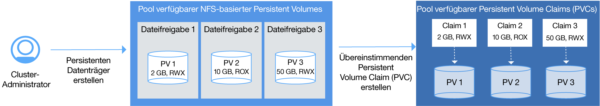

---

copyright:
  years: 2014, 2017
lastupdated: "2017-10-24"

---

{:new_window: target="_blank"}
{:shortdesc: .shortdesc}
{:screen: .screen}
{:pre: .pre}
{:codeblock: .codeblock}
{:table: .aria-labeledby="caption"}
{:codeblock: .codeblock}
{:tip: .tip}
{:download: .download}


# Cluster einrichten
{: #cs_cluster}

Konzipieren Sie die Konfiguration Ihres Clusters, um das größtmögliche Maß an Verfügbarkeit und Kapazität zu erzielen.
{:shortdesc}

Lesen Sie zunächst die Optionen für [hoch verfügbare Clusterkonfigurationen](cs_planning.html#cs_planning_cluster_config).


<br />


## Cluster über die GUI erstellen
{: #cs_cluster_ui}

Ein Kubernetes-Cluster ist eine Gruppe von Workerknoten, die zu einem Netz zusammengefasst sind. Der Zweck des Clusters besteht darin, eine Gruppe von Ressourcen, Knoten, Netzen und Speichereinheiten zu definieren, die die Hochverfügbarkeit von Anwendungen sicherstellen. Bevor Sie eine App bereitstellen können, müssen Sie zunächst einen Cluster erstellen und die Definitionen für die Workerknoten in diesem Cluster festlegen.
{:shortdesc}

Für {{site.data.keyword.Bluemix_notm}} Dedicated-Benutzer finden Sie weitere Informationen stattdessen unter [Kubernetes-Cluster über die GUI in {{site.data.keyword.Bluemix_notm}} Dedicated (Closed Beta) erstellen](#creating_ui_dedicated).

Gehen Sie wie folgt vor, um einen Cluster zu erstellen:
1. Wählen Sie im Katalog die Option **Kubernetes-Cluster** aus. 
2. Wählen Sie einen Clusterplantyp aus. Sie können entweder **Lite** oder **Nutzungsabhängig** auswählen. Beim Plan 'Nutzungsabhängig' können Sie einen Standardcluster mit Features wie beispielsweise mehreren Workerknoten für eine hoch verfügbare Umgebung bereitstellen. 
3. Konfigurieren Sie die Clusterdetails.
    1. Ordnen Sie dem Cluster einen Namen zu, wählen Sie eine Kubernetes-Version aus und anschließend eine Position für die Bereitstellung aus. Wählen Sie die Position aus, die Ihrem Standort am nächsten ist, um eine optimale Leistung zu erhalten. Wenn Sie einen Standort außerhalb Ihres Landes auswählen, dann sollten Sie beachten, dass Sie möglicherweise eine gesetzliche Genehmigung benötigen, bevor Daten physisch in einem anderen Land gespeichert werden können. 
    2. Wählen Sie einen Maschinentyp aus und geben Sie die Anzahl der Workerknoten an, die Sie benötigen. Der Maschinentyp definiert die Menge an virtueller CPU und Hauptspeicher, die in jedem Workerknoten eingerichtet wird und allen Containern zur Verfügung steht. 
        - Der Maschinentyp 'Micro' gibt die kleinste Option an.
        - In einer ausgeglichenen Maschine ist jeder CPU dieselbe Speichermenge zugeordnet. Dadurch wird die Leistung optimiert. 
    3. Wählen Sie ein öffentliches und ein privates VLAN über Ihr Konto für IBM Bluemix Infrastructure (SoftLayer) aus. Beide VLANs kommunizieren zwischen Workerknoten, das öffentliche VALN kommuniziert jedoch auch mit dem von IBM verwalteten Kubernetes-Master. Sie können dasselbe VLAN für mehrere Cluster verwenden. **Hinweis:** Falls Sie sich gegen die Verwendung eines öffentlichen VLAN entscheiden, müssen Sie eine alternative Lösung konfigurieren.
    4. Wählen Sie einen Hardwaretyp aus. In den meisten Situationen stellt gemeinsam genutzte Hardware eine ausreichende Option dar. 
        - **Dediziert**: Vergewissern Sie sich, dass Ihre physischen Ressourcen vollständig isoliert sind. 
        - **Gemeinsam genutzt**: Erlaubt die Speicherung Ihrer physische Ressourcen auf derselben Hardware wie für andere IBM Kunden. 
4. Klicken Sie auf **Cluster einrichten**. Auf der Registerkarte **Workerknoten** können Sie den Fortschritt der Bereitstellung des Workerknotens überprüfen. Nach Abschluss der Bereitstellung können Sie auf der Registerkarte **Übersicht** sehen, dass Ihr Cluster bereit ist. **Hinweis:** Jedem Workerknoten werden eine eindeutige Workerknoten-ID und ein Domänenname zugeordnet, die nach dem Erstellen des Clusters nicht manuell geändert werden dürfen. Wenn die ID oder der Domänenname geändert wird, kann der Kubernetes-Master Ihren Cluster nicht mehr verwalten.


**Womit möchten Sie fortfahren? **

Wenn der Cluster betriebsbereit ist, können Sie sich mit den folgenden Tasks vertraut machen:

-   [Installieren Sie die CLIs und nehmen Sie die Arbeit mit dem Cluster auf. ](cs_cli_install.html#cs_cli_install)
-   [Stellen Sie eine App in Ihrem Cluster bereit. ](cs_apps.html#cs_apps_cli)
-   [Richten Sie Ihre eigene private Registry in {{site.data.keyword.Bluemix_notm}} ein, um Docker-Images zu speichern und gemeinsam mit
anderen Benutzern zu verwenden.](/docs/services/Registry/index.html)


### Cluster über die GUI in {{site.data.keyword.Bluemix_notm}} Dedicated (Closed Beta) erstellen
{: #creating_ui_dedicated}

1.  Melden Sie sich bei der {{site.data.keyword.Bluemix_notm}} Public-Konsole ([https://console.bluemix.net ](https://console.bluemix.net)) mit Ihrer IBMid an.
2.  Wählen Sie im Kontomenü Ihr {{site.data.keyword.Bluemix_notm}} Dedicated-Konto aus. Die Konsole wird mit den Services und Informationen für Ihre {{site.data.keyword.Bluemix_notm}} Dedicated-Instanz aktualisiert.
3.  Wählen Sie im Katalog **Container** aus und klicken Sie auf **Kubernetes-Cluster**.
4.  Geben Sie bei **Cluster Name** einen Namen für den Cluster ein.
5.  Wählen Sie in **Machine type** einen Maschinentyp aus. Der Maschinentyp definiert die Menge an virtueller CPU und Hauptspeicher, die in jedem Workerknoten eingerichtet wird und allen Containern, die Sie in Ihren Knoten bereitstellen, zur Verfügung steht.
    -   Der Maschinentyp 'Micro' gibt die kleinste Option an.
    -   Der ausgeglichene Maschinentyp besitzt dieselbe Speicherkapazität, die jeder CPU zugeordnet wurden. Dadurch wird die Leistung optimiert.
6.  Wählen Sie für **Number of worker nodes** die benötigte Anzahl von Workerknoten aus. Wählen Sie den Wert `3` aus, um Hochverfügbarkeit für Ihren Cluster sicherzustellen.
7.  Klicken Sie auf **Create Cluster** (Cluster erstellen). Die Detailinformationen für den Cluster werden geöffnet; die Einrichtung der Workerknoten im Cluster kann jedoch einige Minuten in Anspruch nehmen. Auf der Registerkarte für Workerknoten (**Worker nodes**) können Sie den Fortschritt der Workerknotenbereitstellung verfolgen. Wenn die Workerknoten bereit sind, wechselt der Zustand zu **Bereit**.

**Womit möchten Sie fortfahren? **

Wenn der Cluster betriebsbereit ist, können Sie sich mit den folgenden Tasks vertraut machen:

-   [Installieren Sie die CLIs und nehmen Sie die Arbeit mit dem Cluster auf. ](cs_cli_install.html#cs_cli_install)
-   [Stellen Sie eine App in Ihrem Cluster bereit. ](cs_apps.html#cs_apps_cli)
-   [Richten Sie Ihre eigene private Registry in {{site.data.keyword.Bluemix_notm}} ein, um Docker-Images zu speichern und gemeinsam mit
anderen Benutzern zu verwenden.](/docs/services/Registry/index.html)

<br />


## Cluster über die CLI erstellen
{: #cs_cluster_cli}

Ein Cluster ist eine Gruppe von Workerknoten, die zu einem Netz zusammengefasst sind. Der Zweck des Clusters besteht darin, eine Gruppe von Ressourcen, Knoten, Netzen und Speichereinheiten zu definieren, die die Hochverfügbarkeit von Anwendungen sicherstellen. Bevor Sie eine App bereitstellen können, müssen Sie zunächst einen Cluster erstellen und die Definitionen für die Workerknoten in diesem Cluster festlegen.
{:shortdesc}

Für {{site.data.keyword.Bluemix_notm}} Dedicated-Benutzer finden Sie weitere Informationen stattdessen unter [Kubernetes-Cluster über die CLI in {{site.data.keyword.Bluemix_notm}} Dedicated (Closed Beta) erstellen](#creating_cli_dedicated).

Gehen Sie wie folgt vor, um einen Cluster zu erstellen:
1.  Installieren Sie die {{site.data.keyword.Bluemix_notm}}-CLI sowie das [{{site.data.keyword.containershort_notm}}-Plug-in](cs_cli_install.html#cs_cli_install).
2.  Melden Sie sich an der {{site.data.keyword.Bluemix_notm}}-CLI an. Geben Sie Ihre {{site.data.keyword.Bluemix_notm}}-Berechtigungsnachweise ein, wenn Sie dazu aufgefordert werden. Zur Angabe einer {{site.data.keyword.Bluemix_notm}}-Region müssen Sie den [API-Endpunkt einschließen](cs_regions.html#bluemix_regions).

    ```
    bx login
    ```
    {: pre}

    **Hinweis:** Falls Sie über eine eingebundene ID verfügen, geben Sie `bx login --sso` ein, um sich an der Befehlszeilenschnittstelle von {{site.data.keyword.Bluemix_notm}} anzumelden. Geben Sie Ihren Benutzernamen ein und verwenden Sie die bereitgestellte URL in Ihrer CLI-Ausgabe, um Ihren einmaligen Kenncode abzurufen. Bei Verwendung einer eingebundenen ID schlägt die Anmeldung ohne die Option `--sso` fehl, mit der Option `--sso` ist sie erfolgreich.

3. Wenn Sie über mehrere {{site.data.keyword.Bluemix_notm}}-Konten verfügen, dann wählen Sie das Konto aus, unter dem Sie Ihren Kubernetes-Cluster erstellen wollen. 

4.  Geben Sie die {{site.data.keyword.Bluemix_notm}}-Organisation und den entsprechenden Bereich an, in der bzw. dem Sie den Cluster erstellen möchten. 
    ```
    bx target --cf
    ```
    {: pre}

    **Hinweis**: Cluster sind zwar konto- und organisationsspezifisch, besitzen jedoch keine Abhängigkeit zu einem {{site.data.keyword.Bluemix_notm}}-Bereich. Wenn Sie z. B. einen Cluster in Ihrer Organisation im Bereich `test` erstellen, dann können Sie diesen Cluster weiterhin benutzen, wenn Sie zu einem späteren Zeitpunkt zum Bereich `dev` wechseln.

5.  Wenn Sie Kubernetes-Cluster in einer anderen als der zuvor ausgewählten {{site.data.keyword.Bluemix_notm}}-Region erstellen oder dort auf diese Kubernetes-Cluster zugreifen wollen, dann [geben Sie den API-Endpunkt der {{site.data.keyword.containershort_notm}}-Region an](cs_regions.html#container_login_endpoints).

    **Hinweis**: Wenn Sie einen Cluster in der Region 'Vereinigten Staaten (Osten)' erstellen wollen, dann müssen Sie mit dem Befehl `bx cs init --host https://us-east.containers.bluemix.net` den API-Endpunkt der Containerregion 'Vereinigte Staaten (Osten)' angeben.

7.  Erstellen Sie einen Cluster.
    1.  Überprüfen Sie, welche Standorte verfügbar sind. Welche Standorte angezeigt werden, hängt von der {{site.data.keyword.containershort_notm}}-Region ab, bei der Sie angemeldet sind.

        ```
        bx cs locations
        ```
        {: pre}

        Ihre CLI-Ausgabe stimmt mit den [Standorten für die Containerregion überein](cs_regions.html#locations).

    2.  Wählen Sie einen Standort aus und prüfen Sie, welche Maschinentypen an diesem Standort verfügbar sind. Der Maschinentyp gibt an, welche virtuellen Rechenressourcen jedem Workerknoten zur Verfügung stehen.

        ```
        bx cs machine-types <standort>
        ```
        {: pre}

        ```
        Getting machine types list...
        OK
        Machine Types
        Name         Cores   Memory   Network Speed   OS             Storage   Server Type   
        u1c.2x4      2       4GB      1000Mbps        UBUNTU_16_64   100GB     virtual   
        b1c.4x16     4       16GB     1000Mbps        UBUNTU_16_64   100GB     virtual   
        b1c.16x64    16      64GB     1000Mbps        UBUNTU_16_64   100GB     virtual   
        b1c.32x128   32      128GB    1000Mbps        UBUNTU_16_64   100GB     virtual   
        b1c.56x242   56      242GB    1000Mbps        UBUNTU_16_64   100GB     virtual
        ```
        {: screen}

    3.  Prüfen Sie, ob in IBM Bluemix Infrastructure (SoftLayer) bereits ein öffentliches und ein privates VLAN für dieses Konto vorhanden ist.

        ```
        bx cs vlans <standort>
        ```
        {: pre}

        ```
        ID        Name                Number   Type      Router  
        1519999   vlan   1355     private   bcr02a.dal10  
        1519898   vlan   1357     private   bcr02a.dal10 
        1518787   vlan   1252     public   fcr02a.dal10 
        1518888   vlan   1254     public    fcr02a.dal10
        ```
        {: screen}

        Falls bereits ein öffentliches oder privates VLAN vorhanden ist, notieren Sie sich die passenden Router. Private VLAN-Router beginnen immer mit `bcr` (Back-End-Router) und öffentliche VLAN-Router immer mit `fcr` (Front-End-Router). Die Zahlen- und Buchstabenkombination nach diesen Präfixen muss übereinstimmen, damit diese VLANs beim Erstellen eines Clusters verwendet werden können. In der Beispielausgabe können alle privaten VLANs mit allen öffentlichen VLANs verwendet werden, weil alle Router `02a.dal10` enthalten.

    4.  Führen Sie den Befehl `cluster-create` aus. Sie können zwischen einem Lite-Cluster, der einen Workerknoten mit 2 vCPU und 4 GB Hauptspeicher umfasst, und einem Standardcluster wählen, der so viele Workerknoten enthalten kann, wie Sie in Ihrem Konto von IBM Bluemix Infrastructure (SoftLayer) auswählen. Wenn Sie ein Standardcluster erstellen, wird standardmäßig die Hardware des Workerknotens von mehreren IBM Kunden gemeinsam genutzt und es wird nach Nutzungsstunden abgerechnet. </br>Beispiel eines Standardclusters:

        ```
        bx cs cluster-create --location dal10 --public-vlan <id_des_öffentlichen_vlan> --private-vlan <id_des_privaten_vlan> --machine-type u1c.2x4 --workers 3 --name <clustername>
        ```
        {: pre}

        Beispiel eines Lite-Clusters:

        ```
        bx cs cluster-create --name mein_cluster
        ```
        {: pre}

        <table>
        <caption>Tabelle 1. Erklärung der Bestandteile dieses Befehls</caption>
        <thead>
        <th colspan=2> Erklärung der Bestandteile dieses Befehls</th>
        </thead>
        <tbody>
        <tr>
        <td><code>cluster-create</code></td>
        <td>Der Befehl zum Erstellen eines Clusters in Ihrer {{site.data.keyword.Bluemix_notm}}-Organisation.</td>
        </tr>
        <tr>
        <td><code>--location <em>&lt;standort&gt;</em></code></td>
        <td>Ersetzen Sie <em>&lt;standort&gt;</em> durch die ID des {{site.data.keyword.Bluemix_notm}}-Standorts, an dem Sie Ihren Cluster erstellen möchten. [Verfügbare Standorte](cs_regions.html#locations) sind von der {{site.data.keyword.containershort_notm}}-Region abhängig, bei der Sie angemeldet sind.</td>
        </tr>
        <tr>
        <td><code>--machine-type <em>&lt;maschinentyp&gt;</em></code></td>
        <td>Wählen Sie bei Erstellung eines Standardclusters den Maschinentyp aus. Der Maschinentyp gibt an, welche virtuellen Rechenressourcen jedem Workerknoten zur Verfügung stehen. Weitere Informationen finden Sie unter [Vergleich von Lite-Clustern und Standardclustern für {{site.data.keyword.containershort_notm}}](cs_planning.html#cs_planning_cluster_type). Bei Lite-Clustern muss kein Maschinentyp definiert werden.</td>
        </tr>
        <tr>
        <td><code>--public-vlan <em>&lt;id_des_öffentlichen_vlan&gt;</em></code></td>
        <td><ul>
          <li>Bei Lite-Clustern muss kein öffentliches VLAN definiert werden. Ihr Lite-Cluster wird automatisch mit einem öffentlichen VLAN von IBM verbunden.</li>
          <li>Wenn für diesen Standort bereits ein öffentliches VLAN in Ihrem Konto von IBM Bluemix Infrastructure (SoftLayer) eingerichtet ist, geben Sie bei einem Standardcluster die ID des öffentlichen VLAN ein. Wenn Sie noch nicht über ein öffentliches und ein privates VLAN für Ihr Konto verfügen, geben Sie diese Option nicht an. {{site.data.keyword.containershort_notm}} erstellt automatisch ein öffentliches VLAN für Sie.<br/><br/>
          <strong>Hinweis</strong>: Private VLAN-Router beginnen immer mit <code>bcr</code> (Back-End-Router) und öffentliche VLAN-Router immer mit <code>fcr</code> (Front-End-Router). Die Zahlen- und Buchstabenkombination nach diesen Präfixen muss übereinstimmen, damit diese VLANs beim Erstellen eines Clusters verwendet werden können.</li>
        </ul></td>
        </tr>
        <tr>
        <td><code>--private-vlan <em>&lt;id_des_privaten_vlan&gt;</em></code></td>
        <td><ul><li>Bei Lite-Clustern muss kein privates VLAN definiert werden. Ihr Lite-Cluster wird automatisch mit einem privaten VLAN von IBM verbunden.</li><li>Wenn für diesen Standort bereits ein privates VLAN in Ihrem Konto von IBM Bluemix Infrastructure (SoftLayer) eingerichtet ist, geben Sie bei einem Standardcluster die ID des privaten VLAN ein. Wenn Sie noch nicht über ein öffentliches und ein privates VLAN für Ihr Konto verfügen, geben Sie diese Option nicht an. {{site.data.keyword.containershort_notm}} erstellt automatisch ein öffentliches VLAN für Sie.<br/><br/><strong>Hinweis</strong>: Private VLAN-Router beginnen immer mit <code>bcr</code> (Back-End-Router) und öffentliche VLAN-Router immer mit <code>fcr</code> (Front-End-Router). Die Zahlen- und Buchstabenkombination nach diesen Präfixen muss übereinstimmen, damit diese VLANs beim Erstellen eines Clusters verwendet werden können.</li></ul></td>
        </tr>
        <tr>
        <td><code>--name <em>&lt;name&gt;</em></code></td>
        <td>Ersetzen Sie <em>&lt;name&gt;</em> durch den Namen Ihres Clusters.</td>
        </tr>
        <tr>
        <td><code>--workers <em>&lt;anzahl&gt;</em></code></td>
        <td>Die Anzahl der Workerknoten, die im Cluster eingebunden werden sollen. Wird die Option <code>--workers</code> nicht angegeben, wird 1 Workerknoten erstellt.</td>
        </tr>
        </tbody></table>

8.  Prüfen Sie, ob die Erstellung des Clusters angefordert wurde.

    ```
    bx cs clusters
    ```
    {: pre}

    **Hinweis:** Es kann bis zu 15 Minuten dauern, bis die Workerknotenmaschinen angewiesen werden und der Cluster in Ihrem
Konto eingerichtet und bereitgestellt wird.

    Nach Abschluss der Bereitstellung Ihres Clusters wird der Status des
Clusters in **deployed** (Bereitgestellt) geändert.

    ```
    Name         ID                                   State      Created          Workers
    mein_cluster   paf97e8843e29941b49c598f516de72101   deployed   20170201162433   1
    ```
    {: screen}

9.  Überprüfen Sie den Status der Workerknoten.

    ```
    bx cs workers <cluster>
    ```
    {: pre}

    Wenn die Workerknoten bereit sind, wechselt der Zustand (State) zu **Normal**, während für den Status die Angabe **Bereit** angezeigt wird. Wenn der Knotenstatus **Bereit** lautet, können Sie auf den Cluster zugreifen.

    **Hinweis:** Jedem Workerknoten werden eine eindeutige Workerknoten-ID und ein Domänenname zugeordnet, die nach der Erstellung des Clusters nicht manuell geändert werden dürfen. Wenn die ID oder der Domänenname geändert wird, kann der Kubernetes-Master Ihren Cluster nicht mehr verwalten.

    ```
    ID                                                  Public IP        Private IP     Machine Type   State      Status  
    prod-dal10-pa8dfcc5223804439c87489886dbbc9c07-w1   169.47.223.113   10.171.42.93   free           normal    Ready
    ```
    {: screen}

10. Legen Sie den von Ihnen erstellten Cluster als Kontext für diese Sitzung fest. Führen Sie diese Konfigurationsschritte jedes Mal aus, wenn Sie mit Ihrem Cluster arbeiten.
    1.  Ermitteln Sie den Befehl zum Festlegen der Umgebungsvariablen und laden Sie die Kubernetes-Konfigurationsdateien herunter.

        ```
        bx cs cluster-config <clustername_oder_id>
        ```
        {: pre}

        Wenn
der Download der Konfigurationsdateien abgeschlossen ist, wird ein Befehl angezeigt, den Sie verwenden können,
um den Pfad zu der lokalen Kubernetes-Konfigurationsdatei als Umgebungsvariable festzulegen.

        Beispiel für OS X:

        ```
        export KUBECONFIG=/Users/<benutzername>/.bluemix/plugins/container-service/clusters/<clustername>/kube-config-prod-dal10-<clustername>.yml
        ```
        {: screen}

    2.  Kopieren Sie den Befehl, der in Ihrem Terminal angezeigt wird, um die Umgebungsvariable `KUBECONFIG` festzulegen.
    3.  Stellen Sie sicher, dass die Umgebungsvariable `KUBECONFIG` richtig eingestellt ist.

        Beispiel für OS X:

        ```
        echo $KUBECONFIG
        ```
        {: pre}

        Ausgabe:

        ```
        /Users/<benutzername>/.bluemix/plugins/container-service/clusters/<clustername>/kube-config-prod-dal10-<clustername>.yml

        ```
        {: screen}

11. Starten Sie Ihr Kubernetes-Dashboard über den Standardport `8001`.
    1.  Legen Sie die Standardportnummer für den Proxy fest.

        ```
        kubectl proxy
        ```
        {: pre}

        ```
        Starting to serve on 127.0.0.1:8001
        ```
        {: screen}

    2.  Öffnen Sie die folgende URL in einem Web-Browser, damit das Kubernetes-Dashboard angezeigt wird.

        ```
        http://localhost:8001/ui
        ```
        {: codeblock}


**Womit möchten Sie fortfahren? **

-   [Stellen Sie eine App in Ihrem Cluster bereit. ](cs_apps.html#cs_apps_cli)
-   [Verwalten Sie Ihren Cluster über die Befehlszeile `kubectl`. ](https://kubernetes.io/docs/user-guide/kubectl/)
-   [Richten Sie Ihre eigene private Registry in {{site.data.keyword.Bluemix_notm}} ein, um Docker-Images zu speichern und gemeinsam mit
anderen Benutzern zu verwenden.](/docs/services/Registry/index.html)

### Cluster über die CLI in {{site.data.keyword.Bluemix_notm}} Dedicated (Closed Beta) erstellen
{: #creating_cli_dedicated}

1.  Installieren Sie die {{site.data.keyword.Bluemix_notm}}-CLI sowie das [{{site.data.keyword.containershort_notm}}-Plug-in](cs_cli_install.html#cs_cli_install).
2.  Melden Sie sich am öffentlichen Endpunkt für {{site.data.keyword.containershort_notm}} an. Geben Sie Ihre Berechtigungsnachweise für {{site.data.keyword.Bluemix_notm}} ein und wählen Sie das {{site.data.keyword.Bluemix_notm}} Dedicated-Konto aus, wenn Sie dazu aufgefordert werden.

    ```
    bx login -a api.<region>.bluemix.net
    ```
    {: pre}

    **Hinweis:** Falls Sie über eine eingebundene ID verfügen, geben Sie `bx login --sso` ein, um sich an der Befehlszeilenschnittstelle von {{site.data.keyword.Bluemix_notm}} anzumelden. Geben Sie Ihren Benutzernamen ein und verwenden Sie die bereitgestellte URL in Ihrer CLI-Ausgabe, um Ihren einmaligen Kenncode abzurufen. Bei Verwendung einer eingebundenen ID schlägt die Anmeldung ohne die Option `--sso` fehl, mit der Option `--sso` ist sie erfolgreich.

3.  Erstellen Sie einen Cluster mit dem Befehl `cluster-create`. Wenn Sie ein Standardcluster erstellen, wird für die Hardware des Workerknotens nach
Nutzungsstunden abgerechnet.

    Beispiel:

    ```
    bx cs cluster-create --location <standort> --machine-type <maschinentyp> --name <clustername> --workers <anzahl>
    ```
    {: pre}

    <table>
    <caption>Tabelle 2. Erklärung der Bestandteile dieses Befehls</caption>
    <thead>
    <th colspan=2> Erklärung der Bestandteile dieses Befehls</th>
    </thead>
    <tbody>
    <tr>
    <td><code>cluster-create</code></td>
    <td>Der Befehl zum Erstellen eines Clusters in Ihrer {{site.data.keyword.Bluemix_notm}}-Organisation.</td>
    </tr>
    <tr>
    <td><code>--location <em>&lt;standort&gt;</em></code></td>
    <td>Ersetzen Sie &lt;standort&gt; durch die ID des {{site.data.keyword.Bluemix_notm}}-Standorts, an dem Sie Ihren Cluster erstellen möchten. [Verfügbare Standorte](cs_regions.html#locations) sind von der {{site.data.keyword.containershort_notm}}-Region abhängig, bei der Sie angemeldet sind.</td>
    </tr>
    <tr>
    <td><code>--machine-type <em>&lt;maschinentyp&gt;</em></code></td>
    <td>Wählen Sie bei Erstellung eines Standardclusters den Maschinentyp aus. Der Maschinentyp gibt an, welche virtuellen Rechenressourcen jedem Workerknoten zur Verfügung stehen. Weitere Informationen finden Sie unter [Vergleich von Lite-Clustern und Standardclustern für {{site.data.keyword.containershort_notm}}](cs_planning.html#cs_planning_cluster_type). Bei Lite-Clustern muss kein Maschinentyp definiert werden.</td>
    </tr>
    <tr>
    <td><code>--name <em>&lt;name&gt;</em></code></td>
    <td>Ersetzen Sie <em>&lt;name&gt;</em> durch den Namen Ihres Clusters.</td>
    </tr>
    <tr>
    <td><code>--workers <em>&lt;anzahl&gt;</em></code></td>
    <td>Die Anzahl der Workerknoten, die im Cluster eingebunden werden sollen. Wird die Option <code>--workers</code> nicht angegeben, wird 1 Workerknoten erstellt.</td>
    </tr>
    </tbody></table>

4.  Prüfen Sie, ob die Erstellung des Clusters angefordert wurde.

    ```
    bx cs clusters
    ```
    {: pre}

    **Hinweis:** Es kann bis zu 15 Minuten dauern, bis die Workerknotenmaschinen angewiesen werden und der Cluster in Ihrem
Konto eingerichtet und bereitgestellt wird.

    Nach Abschluss der Bereitstellung Ihres Clusters wird der Status des Clusters in **deployed** (Bereitgestellt) geändert.

    ```
    Name         ID                                   State      Created          Workers
    mein_cluster   paf97e8843e29941b49c598f516de72101   deployed   20170201162433   1
    ```
    {: screen}

5.  Überprüfen Sie den Status der Workerknoten.

    ```
    bx cs workers <cluster>
    ```
    {: pre}

    Wenn die Workerknoten bereit sind, wechselt der Zustand (State) zu **Normal**, während für den Status die Angabe **Bereit** angezeigt wird. Wenn der Knotenstatus **Bereit** lautet, können Sie auf den Cluster zugreifen.

    ```
    ID                                                  Public IP        Private IP     Machine Type   State      Status  
    prod-dal10-pa8dfcc5223804439c87489886dbbc9c07-w1   169.47.223.113   10.171.42.93   free           normal    Ready
    ```
    {: screen}

6.  Legen Sie den von Ihnen erstellten Cluster als Kontext für diese Sitzung fest. Führen Sie diese Konfigurationsschritte jedes Mal aus, wenn Sie mit Ihrem Cluster arbeiten.

    1.  Ermitteln Sie den Befehl zum Festlegen der Umgebungsvariablen und laden Sie die Kubernetes-Konfigurationsdateien herunter.

        ```
        bx cs cluster-config <clustername_oder_id>
        ```
        {: pre}

        Wenn
der Download der Konfigurationsdateien abgeschlossen ist, wird ein Befehl angezeigt, den Sie verwenden können,
um den Pfad zu der lokalen Kubernetes-Konfigurationsdatei als Umgebungsvariable festzulegen.

        Beispiel für OS X:

        ```
        export KUBECONFIG=/Users/<benutzername>/.bluemix/plugins/container-service/clusters/<clustername>/kube-config-prod-dal10-<clustername>.yml
        ```
        {: screen}

    2.  Kopieren Sie den Befehl, der in Ihrem Terminal angezeigt wird, um die Umgebungsvariable `KUBECONFIG` festzulegen.
    3.  Stellen Sie sicher, dass die Umgebungsvariable `KUBECONFIG` richtig eingestellt ist.

        Beispiel für OS X:

        ```
        echo $KUBECONFIG
        ```
        {: pre}

        Ausgabe:

        ```
        /Users/<benutzername>/.bluemix/plugins/container-service/clusters/<clustername>/kube-config-prod-dal10-<clustername>.yml

        ```
        {: screen}

7.  Gehen Sie wie folgt vor, um das Kubernetes-Dashboard über den Standardport 8001 zu öffnen:
    1.  Legen Sie die Standardportnummer für den Proxy fest.

        ```
        kubectl proxy
        ```
        {: pre}

        ```
        Starting to serve on 127.0.0.1:8001
        ```
        {: screen}

    2.  Öffnen Sie die folgende URL in einem Web-Browser, damit das Kubernetes-Dashboard angezeigt wird.

        ```
        http://localhost:8001/ui
        ```
        {: codeblock}


**Womit möchten Sie fortfahren? **

-   [Stellen Sie eine App in Ihrem Cluster bereit. ](cs_apps.html#cs_apps_cli)
-   [Verwalten Sie Ihren Cluster über die Befehlszeile `kubectl`. ](https://kubernetes.io/docs/user-guide/kubectl/)
-   [Richten Sie Ihre eigene private Registry in {{site.data.keyword.Bluemix_notm}} ein, um Docker-Images zu speichern und gemeinsam mit
anderen Benutzern zu verwenden.](/docs/services/Registry/index.html)

<br />


## Private und öffentliche Image-Registrys verwenden
{: #cs_apps_images}

Ein Docker-Image bildet die Grundlage für die Erstellung eines jeden Containers. Ein Image wird auf der Grundlage einer Dockerfile erstellt. Hierbei handelt es sich um eine Datei, die Anweisungen zum Erstellen des Image enthält. Eine Dockerfile referenziert möglicherweise in ihren Anweisungen Buildartefakte, die separat gespeichert sind, z. B. eine App, die Konfiguration der App und ihre Abhängigkeiten. Images werden in der Regel in einer Registry gespeichert, auf die der Zugriff entweder öffentlich (extern) möglich ist (öffentliche Registry) oder aber so eingerichtet ist, dass der Zugriff auf eine kleine Gruppe von Benutzern beschränkt ist (private Registry).
{:shortdesc}

Überprüfen Sie die nachfolgend aufgeführten Optionen, um zu erfahren, wie Sie eine Image-Registry einrichten und wie Sie ein Image aus der Registry verwenden.

-   [Zugriff auf einen Namensbereich in {{site.data.keyword.registryshort_notm}} für die Arbeit mit von IBM bereitgestellten Images und Ihren eigenen privaten Docker-Images](#bx_registry_default).
-   [Zugriff auf öffentliche Images in Docker Hub](#dockerhub).
-   [Zugriff auf private Images, die in anderen privaten Registrys gespeichert sind](#private_registry).

### Zugriff auf einen Namensbereich in {{site.data.keyword.registryshort_notm}} für die Arbeit mit von IBM bereitgestellten Images und Ihren eigenen privaten Docker-Images
{: #bx_registry_default}

Sie können Container aus einem von IBM bereitgestellten öffentlichen Image oder einem privaten Image, das in Ihrem Namensbereich in {{site.data.keyword.registryshort_notm}} gespeichert ist, in Ihrem Cluster bereitstellen.

Vorbemerkungen:

1. [Richten Sie einen Namensbereich in {{site.data.keyword.registryshort_notm}} unter {{site.data.keyword.Bluemix_notm}} Public oder {{site.data.keyword.Bluemix_notm}} Dedicated ein und übertragen Sie Images per Push-Operation an diesen Namensbereich](/docs/services/Registry/registry_setup_cli_namespace.html#registry_namespace_add).
2. [Erstellen Sie einen Cluster](#cs_cluster_cli).
3. [Richten Sie Ihre CLI auf Ihren Cluster aus](cs_cli_install.html#cs_cli_configure).

Wenn Sie einen Cluster erstellen, wird automatisch ein nicht ablaufendes Registry-Token für den Cluster erstellt. Mit diesem Token wird Lesezugriff auf alle Namensbereiche autorisiert, die Sie in {{site.data.keyword.registryshort_notm}} einrichten, damit Sie mit von IBM bereitgestellten öffentlichen und Ihren eigenen privaten Docker-Images arbeiten können. Token müssen in einem `imagePullSecret` von Kubernetes gespeichert sein, damit ein Kubernetes-Cluster darauf zugreifen kann, wenn Sie eine containerisierte App bereitstellen. Wenn Ihr Cluster erstellt wird, speichert {{site.data.keyword.containershort_notm}} dieses Token automatisch in einem `imagePullSecret` in Kubernetes. Das `imagePullSecret` wird zum Kubernetes-Standardnamensbereich, der Standardliste von geheimen Schlüsseln im Servicekonto für diesen Namensbereich und dem Namensbereich 'kube-system' hinzugefügt.

**Hinweis:** Bei dieser anfänglichen Konfiguration können Sie Container aus allen Images, die in einem Namensbereich in Ihrem {{site.data.keyword.Bluemix_notm}}-Konto verfügbar sind, im **Standardnamensbereich** Ihres Clusters bereitstellen. Wenn Sie einen Container in anderen Namespaces Ihres Clusters bereitstellen möchten oder wenn Sie ein Image verwenden möchten, das in einer {{site.data.keyword.Bluemix_notm}}-Region oder in einem anderen {{site.data.keyword.Bluemix_notm}}-Konto gespeichert ist, müssen Sie [Ihr eigenes 'imagePullSecret' für Ihren Cluster erstellen](#bx_registry_other).

Um einen Container im Standardnamensbereich (**default**) Ihres Clusters bereitzustellen, müssen Sie eine Konfigurationsdatei erstellen.

1.  Erstellen Sie eine Bereitstellungskonfigurationsdatei mit dem Namen `mydeployment.yaml`.
2.  Definieren Sie die Bereitstellung und das Image aus Ihrem Namensbereich, das Sie verwenden möchten, in {{site.data.keyword.registryshort_notm}}.

    Gehen Sie wie folgt vor,
um ein privates Image aus einem Namensbereich in {{site.data.keyword.registryshort_notm}} zu verwenden:

    ```
    apiVersion: extensions/v1beta1
    kind: Deployment
    metadata:
      name: ibmliberty-deployment
    spec:
      replicas: 3
      template:
        metadata:
          labels:
            app: ibmliberty
        spec:
          containers:
          - name: ibmliberty
            image: registry.<region>.bluemix.net/<namensbereich>/<mein_image>:<tag>
    ```
    {: codeblock}

    **Tipp:** Führen Sie `bx cr namespace-list` aus, um Ihre Namensbereichsinformationen abzurufen.

3.  Erstellen Sie die Bereitstellung in Ihrem Cluster.

    ```
    kubectl apply -f mydeployment.yaml
    ```
    {: pre}

    **Tipp:** Sie können auch eine vorhandene Konfigurationsdatei bereitstellen, z. B. eines der von IBM bereitgestellten öffentlichen Images. In diesem Beispiel wird das Image **ibmliberty** in der Region 'Vereinigte Staaten (Süden)' verwendet.

    ```
    kubectl apply -f https://raw.githubusercontent.com/IBM-{{site.data.keyword.Bluemix_notm}}/kube-samples/master/deploy-apps-clusters/deploy-ibmliberty.yaml
    ```
    {: pre}

### Images in anderen Kubernetes-Namensbereichen bereitstellen oder auf Images in anderen {{site.data.keyword.Bluemix_notm}}-Regionen und -Kontos zugreifen
{: #bx_registry_other}

Sie können Container in anderen Kubernetes-Namensbereichen bereitstellen oder Images verwenden, die in
anderen {{site.data.keyword.Bluemix_notm}}-Regionen oder -Konten gespeichert sind, oder Images verwenden, die in
{{site.data.keyword.Bluemix_notm}} Dedicated gespeichert sind, indem Sie Ihr eigenes 'imagePullSecret' erstellen.

Vorbemerkungen:

1.  [Richten Sie einen Namensbereich in {{site.data.keyword.registryshort_notm}} unter {{site.data.keyword.Bluemix_notm}} Public oder {{site.data.keyword.Bluemix_notm}} Dedicated ein und übertragen Sie Images per Push-Operation an diesen Namensbereich](/docs/services/Registry/registry_setup_cli_namespace.html#registry_namespace_add).
2.  [Erstellen Sie einen Cluster](#cs_cluster_cli).
3.  [Richten Sie Ihre CLI auf Ihren Cluster aus](cs_cli_install.html#cs_cli_configure).

Gehen Sie wie folgt vor, um Ihr eigenes 'imagePullSecret' zu erstellen.

**Hinweis:** 'ImagePullSecrets' sind nur für die Namensbereiche gültig, für die sie erstellt wurden. Wiederholen Sie diese Schritte für jeden Namensbereich, in dem Sie Container bereitstellen möchten. Für Images aus [DockerHub](#dockerhub) ist 'ImagePullSecrets' nicht erforderlich.

1.  Falls Sie kein Token haben, [erstellen Sie ein Token für die Registry, auf die Sie zugreifen möchten.](/docs/services/Registry/registry_tokens.html#registry_tokens_create)
2.  Listen Sie die Tokens in Ihrem {{site.data.keyword.Bluemix_notm}}-Konto auf.

    ```
    bx cr token-list
    ```
    {: pre}

3.  Notieren Sie sich die Token-ID, die Sie verwenden möchten.
4.  Rufen Sie den Wert für Ihr Token ab. Ersetzen Sie <em>&lt;token-id&gt;</em>
durch die ID des Tokens, das Sie im vorherigen Schritt abgerufen haben.

    ```
    bx cr token-get <token-id>
    ```
    {: pre}

    Ihr Tokenwert wird im Feld **Token** Ihrer CLI-Ausgabe angezeigt.

5.  Erstellen Sie den geheimen Kubernetes-Schlüssel, um Ihre Tokeninformationen zu speichern.

    ```
    kubectl --namespace <kubernetes-namensbereich> create secret docker-registry <name_des_geheimen_schlüssels>  --docker-server=<registry-url> --docker-username=token --docker-password=<tokenwert> --docker-email=<docker-e-mail>
    ```
    {: pre}

    <table>
    <caption>Tabelle 3. Erklärung der Bestandteile dieses Befehls</caption>
    <thead>
    <th colspan=2> Erklärung der Bestandteile dieses Befehls</th>
    </thead>
    <tbody>
    <tr>
    <td><code>--namespace <em>&lt;kubernetes-namensbereich&gt;</em></code></td>
    <td>Erforderlich. Der Kubernetes-Namensbereich Ihres Clusters, in dem Sie den geheimen Schlüssel verwenden und Container bereitstellen möchten. Führen Sie <code>kubectl get namespaces</code>, um alle Namensbereiche in Ihrem Cluster aufzulisten.</td>
    </tr>
    <tr>
    <td><code><em>&lt;name_des_geheimen_schlüssels&gt;</em></code></td>
    <td>Erforderlich. Der Name, den Sie für Ihr 'imagePullSecret' verwenden möchten.</td>
    </tr>
    <tr>
    <td><code>--docker-server <em>&lt;registry-url&gt;</em></code></td>
    <td>Erforderlich. Die URL der Image-Registry, in der Ihr Namensbereich eingerichtet ist.<ul><li>Für Namensbereiche, die in den Regionen 'Vereinigte Staaten (Süden)' und 'Vereinigte Staaten (Osten)' eingerichtet sind: registry.ng.bluemix.net</li><li>Für Namensbereiche, die in der Region 'Großbritannien (Süden)' eingerichtet sind: registry.eu-gb.bluemix.net</li><li>Für Namensbereiche, die in der Region 'Zentraleuropa (Frankfurt)' eingerichtet sind: registry.eu-de.bluemix.net</li><li>Für Namensbereiche, die in der Region 'Australien (Sydney)' eingerichtet sind: registry.au-syd.bluemix.net</li><li>Für Namensbereiche, die in {{site.data.keyword.Bluemix_notm}} Dedicated eingerichtet sind: registry.<em>&lt;dedizierte_domäne&gt;</em></li></ul></td>
    </tr>
    <tr>
    <td><code>--docker-username <em>&lt;docker-benutzername&gt;</em></code></td>
    <td>Erforderlich. Der Benutzername für die Anmeldung bei Ihrer privaten Registry. Für {{site.data.keyword.registryshort_notm}} wurde als Benutzername <code>token</code> festgelegt.</td>
    </tr>
    <tr>
    <td><code>--docker-password <em>&lt;tokenwert&gt;</em></code></td>
    <td>Erforderlich. Der Wert des zuvor abgerufenen Registry-Tokens.</td>
    </tr>
    <tr>
    <td><code>--docker-email <em>&lt;docker-e-mail&gt;</em></code></td>
    <td>Erforderlich. Falls Sie über eine Docker-E-Mail-Adresse verfügen, geben Sie diese ein. Ist dies nicht der Fall, geben Sie eine fiktive E-Mail-Adresse ein, z. B. a@b.c. Die Angabe der E-Mail-Adresse ist obligatorisch, um einen geheimen Kubernetes-Schlüssel zu erstellen, wird aber nach der Erstellung nicht weiter genutzt.</td>
    </tr>
    </tbody></table>

6.  Überprüfen Sie, dass der geheime Schlüssel erfolgreich erstellt wurde. Ersetzen Sie
<em>&lt;kubernetes-namensbereich&gt;</em> durch den Namen des Namensbereichs, in dem Sie das
'imagePullSecret' erstellt haben.

    ```
    kubectl get secrets --namespace <kubernetes-namensbereich>
    ```
    {: pre}

7.  Erstellen Sie einen Pod, der das 'imagePullSecret' referenziert.
    1.  Erstellen Sie eine Podkonfigurationsdatei mit dem Namen `mypod.yaml`.
    2.  Definieren Sie den Pod und das 'imagePullSecret', das Sie für den Zugriff auf die private
{{site.data.keyword.Bluemix_notm}}-Registry verwenden möchten.

        Ein privates Image aus einem Namensbereich:

        ```
        apiVersion: v1
        kind: Pod
        metadata:
          name: <podname>
        spec:
          containers:
            - name: <containername>
              image: registry.<region>.bluemix.net/<mein_namensbereich>/<mein_image>:<tag>
          imagePullSecrets:
            - name: <name_des_geheimen_schlüssels>
        ```
        {: codeblock}

        Ein öffentliches {{site.data.keyword.Bluemix_notm}}-Image:

        ```
        apiVersion: v1
        kind: Pod
        metadata:
          name: <podname>
        spec:
          containers:
            - name: <containername>
              image: registry.<region>.bluemix.net/
          imagePullSecrets:
            - name: <name_des_geheimen_schlüssels>
        ```
        {: codeblock}

        <table>
        <caption>Tabelle 4. Erklärung der Komponenten der YAML-Datei</caption>
        <thead>
        <th colspan=2> Erklärung der Komponenten der YAML-Datei</th>
        </thead>
        <tbody>
        <tr>
        <td><code><em>&lt;containername&gt;</em></code></td>
        <td>Der Name des Containers, den Sie in Ihrem Cluster bereitstellen möchten.</td>
        </tr>
        <tr>
        <td><code><em>&lt;mein_namensbereich&gt;</em></code></td>
        <td>Der Namensbereich, in dem das Image gespeichert ist. Führen Sie den Befehl `bx cr namespace-list` aus, um die verfügbaren Namensbereiche aufzulisten.</td>
        </tr>
        <tr>
        <td><code><em>&lt;mein_image&gt;</em></code></td>
        <td>Der Name des Images, das Sie verwenden möchten. Führen Sie den Befehl `bx cr image-list` aus, um die verfügbaren Images in einem {{site.data.keyword.Bluemix_notm}} aufzulisten.</td>
        </tr>
        <tr>
        <td><code><em>&lt;tag&gt;</em></code></td>
        <td>Die Version des Images, das Sie verwenden möchten. Ist kein Tag angegeben, wird standardmäßig das Image mit dem Tag <strong>latest</strong> verwendet.</td>
        </tr>
        <tr>
        <td><code><em>&lt;name_des_geheimen_schlüssels&gt;</em></code></td>
        <td>Der Name des 'imagePullSecret', das Sie zuvor erstellt haben.</td>
        </tr>
        </tbody></table>

   3.  Speichern Sie Ihre Änderungen.
   4.  Erstellen Sie die Bereitstellung in Ihrem Cluster.

        ```
        kubectl apply -f mypod.yaml
        ```
        {: pre}


### Zugriff auf öffentliche Images in Docker Hub
{: #dockerhub}

Sie können jedes beliebige öffentliche Image verwenden, das in Docker Hub gespeichert ist, um ohne zusätzliche Konfigurationsschritte einen Container in Ihrem Cluster bereitzustellen.

Vorbemerkungen:

1.  [Erstellen Sie einen Cluster](#cs_cluster_cli).
2.  [Richten Sie Ihre CLI auf Ihren Cluster aus](cs_cli_install.html#cs_cli_configure).

Erstellen Sie eine Bereitstellungskonfigurationsdatei.

1.  Erstellen Sie eine Konfigurationsdatei mit dem Namen `mydeployment.yaml`.
2.  Definieren Sie die Bereitstellung und das gewünschte öffentliche Image aus Docker Hub. Die folgende Konfigurationsdatei verwendet das öffentliche NGINX-Image, das in Docker Hub verfügbar ist.

    ```
    apiVersion: extensions/v1beta1
    kind: Deployment
    metadata:
      name: nginx-deployment
    spec:
      replicas: 3
      template:
        metadata:
          labels:
            app: nginx
        spec:
          containers:
          - name: nginx
            image: nginx
    ```
    {: codeblock}

3.  Erstellen Sie die Bereitstellung in Ihrem Cluster.

    ```
    kubectl apply -f mydeployment.yaml
    ```
    {: pre}

    **Tipp:** Stellen Sie alternativ eine vorhandene Konfigurationsdatei bereit. Im folgenden Beispiel wird dasselbe öffentliche NGINX-Image verwendet, aber direkt auf Ihren Cluster angewendet.

    ```
    kubectl apply -f https://raw.githubusercontent.com/IBM-{{site.data.keyword.Bluemix_notm}}/kube-samples/master/deploy-apps-clusters/deploy-nginx.yaml
    ```
    {: pre}


### Zugriff auf private Images, die in anderen privaten Registrys gespeichert sind
{: #private_registry}

Wenn bereits eine private Registry vorhanden ist und Sie diese verwenden wollen, müssen Sie die Berechtigungsnachweise für die Registry in einem 'imagePullSecret' von Kubernetes
speichern und diesen geheimen Schlüssel in Ihrer Konfigurationsdatei referenzieren.

Vorbemerkungen:

1.  [Erstellen Sie einen Cluster](#cs_cluster_cli).
2.  [Richten Sie Ihre CLI auf Ihren Cluster aus](cs_cli_install.html#cs_cli_configure).

Gehen Sie wie folgt vor, um ein 'imagePullSecret' zu erstellen:

**Hinweis:** 'ImagePullSecrets' sind für die Namensbereiche gültig, für die sie erstellt wurden. Wiederholen Sie diese Schritte für jeden Namensbereich, in dem Sie Container aus einem Image in einer privaten {{site.data.keyword.Bluemix_notm}}-Registry bereitstellen möchten.

1.  Erstellen Sie den geheimen Kubernetes-Schlüssel, um Ihre Berechtigungsnachweise für die private Registry zu speichern.

    ```
    kubectl --namespace <kubernetes-namensbereich> create secret docker-registry <name_des_geheimen_schlüssels>  --docker-server=<registry-url> --docker-username=<docker-benutzername> --docker-password=<docker-kennwort> --docker-email=<docker-e-mail>
    ```
    {: pre}

    <table>
    <caption>Tabelle 5. Erklärung der Bestandteile dieses Befehls</caption>
    <thead>
    <th colspan=2> Erklärung der Bestandteile dieses Befehls</th>
    </thead>
    <tbody>
    <tr>
    <td><code>--namespace <em>&lt;kubernetes-namensbereich&gt;</em></code></td>
    <td>Erforderlich. Der Kubernetes-Namensbereich Ihres Clusters, in dem Sie den geheimen Schlüssel verwenden und Container bereitstellen möchten. Führen Sie <code>kubectl get namespaces</code>, um alle Namensbereiche in Ihrem Cluster aufzulisten.</td>
    </tr>
    <tr>
    <td><code><em>&lt;name_des_geheimen_schlüssels&gt;</em></code></td>
    <td>Erforderlich. Der Name, den Sie für Ihr 'imagePullSecret' verwenden möchten.</td>
    </tr>
    <tr>
    <td><code>--docker-server <em>&lt;registry-url&gt;</em></code></td>
    <td>Erforderlich. Die URL der Registry, in der Ihre privaten Images gespeichert sind.</td>
    </tr>
    <tr>
    <td><code>--docker-username <em>&lt;docker-benutzername&gt;</em></code></td>
    <td>Erforderlich. Der Benutzername für die Anmeldung bei Ihrer privaten Registry.</td>
    </tr>
    <tr>
    <td><code>--docker-password <em>&lt;tokenwert&gt;</em></code></td>
    <td>Erforderlich. Der Wert des zuvor abgerufenen Registry-Tokens.</td>
    </tr>
    <tr>
    <td><code>--docker-email <em>&lt;docker-e-mail&gt;</em></code></td>
    <td>Erforderlich. Falls Sie über eine Docker-E-Mail-Adresse verfügen, geben Sie diese ein. Ist dies nicht der Fall, geben Sie eine fiktive E-Mail-Adresse ein, z. B. a@b.c. Die Angabe der E-Mail-Adresse ist obligatorisch, um einen geheimen Kubernetes-Schlüssel zu erstellen, wird aber nach der Erstellung nicht weiter genutzt.</td>
    </tr>
    </tbody></table>

2.  Überprüfen Sie, dass der geheime Schlüssel erfolgreich erstellt wurde. Ersetzen Sie
<em>&lt;kubernetes-namensbereich&gt;</em> durch den Namen des Namensbereichs, in dem Sie das
'imagePullSecret' erstellt haben.

    ```
    kubectl get secrets --namespace <kubernetes-namensbereich>
    ```
    {: pre}

3.  Erstellen Sie einen Pod, der das 'imagePullSecret' referenziert.
    1.  Erstellen Sie eine Podkonfigurationsdatei mit dem Namen `mypod.yaml`.
    2.  Definieren Sie den Pod und das 'imagePullSecret', das Sie für den Zugriff auf die private
{{site.data.keyword.Bluemix_notm}}-Registry verwenden möchten. Gehen Sie wie folgt vor, um ein privates Image aus Ihrer privaten Registry zu verwenden:

        ```
        apiVersion: v1
        kind: Pod
        metadata:
          name: <podname>
        spec:
          containers:
            - name: <containername>
              image: <mein_image>:<tag>
          imagePullSecrets:
            - name: <name_des_geheimen_schlüssels>
        ```
        {: codeblock}

        <table>
        <caption>Tabelle 6. Erklärung der Komponenten der YAML-Datei</caption>
        <thead>
        <th colspan=2> Erklärung der Komponenten der YAML-Datei</th>
        </thead>
        <tbody>
        <tr>
        <td><code><em>&lt;podname&gt;</em></code></td>
        <td>Der Name des Pod, den Sie erstellen möchten.</td>
        </tr>
        <tr>
        <td><code><em>&lt;containername&gt;</em></code></td>
        <td>Der Name des Containers, den Sie in Ihrem Cluster bereitstellen möchten.</td>
        </tr>
        <tr>
        <td><code><em>&lt;mein_image&gt;</em></code></td>
        <td>Der vollständige Pfad des gewünschten Images in Ihrer privaten Registry.</td>
        </tr>
        <tr>
        <td><code><em>&lt;tag&gt;</em></code></td>
        <td>Die Version des Images, das Sie verwenden möchten. Ist kein Tag angegeben, wird standardmäßig das Image mit dem Tag <strong>latest</strong> verwendet.</td>
        </tr>
        <tr>
        <td><code><em>&lt;name_des_geheimen_schlüssels&gt;</em></code></td>
        <td>Der Name des 'imagePullSecret', das Sie zuvor erstellt haben.</td>
        </tr>
        </tbody></table>

  3.  Speichern Sie Ihre Änderungen.
  4.  Erstellen Sie die Bereitstellung in Ihrem Cluster.

        ```
        kubectl apply -f mypod.yaml
        ```
        {: pre}

<br />


## {{site.data.keyword.Bluemix_notm}}-Services
zu Clustern hinzufügen
{: #cs_cluster_service}

Sie können eine vorhandene {{site.data.keyword.Bluemix_notm}}-Serviceinstanz
zu Ihrem Cluster hinzufügen, um den Benutzern Ihres Clusters den Zugriff auf den
{{site.data.keyword.Bluemix_notm}}-Service
sowie seine Verwendung zu ermöglichen, wenn sie eine App auf dem Cluster bereitstellen.
{:shortdesc}

Vorbemerkungen:

1. [Richten Sie Ihre CLI
](cs_cli_install.html#cs_cli_configure) auf Ihren Cluster aus.
2. [Fordern Sie eine Instanz des {{site.data.keyword.Bluemix_notm}}-Service](/docs/services/reqnsi.html#req_instance) in Ihrem Bereich an.
   **Hinweis:** Zur Erstellung einer Instanz eines Service am Standort 'Washington DC' müssen Sie die CLI verwenden.
3. Für {{site.data.keyword.Bluemix_notm}} Dedicated-Benutzer finden Sie weitere Informationen stattdessen unter [{{site.data.keyword.Bluemix_notm}}-Services zu Clustern in {{site.data.keyword.Bluemix_notm}} Dedicated (Closed Beta) hinzufügen](#binding_dedicated).

**Hinweis:**
<ul><ul>
<li>Es können nur {{site.data.keyword.Bluemix_notm}}-Services
hinzugefügt werden, die Serviceschlüssel unterstützen. Wenn der Service keine Serviceschlüssel unterstützt, dann sollten Sie die Informationen zum Thema [Externen Apps die Verwendung von {{site.data.keyword.Bluemix_notm}}-Services ermöglichen](/docs/services/reqnsi.html#req_instance) lesen.</li>
<li>Der Cluster und die Workerknoten müssen vollständig bereitgestellt werden, bevor Sie einen Service hinzufügen können.</li>
</ul></ul>


Gehen Sie wie folgt vor, um einen Service hinzuzufügen:
2.  Listen Sie alle in Ihrem {{site.data.keyword.Bluemix_notm}}-Bereich vorhandenen Services auf.

    ```
    bx service list
    ```
    {: pre}

    CLI-Beispielausgabe:

    ```
    name                      service           plan    bound apps   last operation
    <serviceinstanzname>   <servicename>    spark                create succeeded
    ```
    {: screen}

3.  Notieren Sie unter **name** den Namen der Serviceinstanz, die Sie zu Ihrem Cluster hinzufügen wollen.
4.  Geben Sie den Clusternamensbereich an, den Sie verwenden wollen, um Ihren Service hinzuzufügen. Wählen Sie eine der folgenden Optionen aus.
    -   Lassen Sie eine Liste der vorhandenen Namensbereiche anzeigen und wählen Sie einen Namensbereich aus, den Sie verwenden wollen.

        ```
        kubectl get namespaces
        ```
        {: pre}

    -   Erstellen Sie einen neuen Namensbereich in Ihrem Cluster.

        ```
        kubectl create namespace <name_des_namensbereichs>
        ```
        {: pre}

5.  Fügen Sie den Service zu Ihrem Cluster hinzu.

    ```
    bx cs cluster-service-bind <clustername_oder_id> <namensbereich> <serviceinstanzname>
    ```
    {: pre}

    Wenn der Service erfolgreich zu Ihrem Cluster hinzugefügt worden ist, wird ein geheimer Schlüssel für den Cluster erstellt, der die Berechtigungsnachweise Ihrer Serviceinstanz enthält. CLI-Beispielausgabe:

    ```
    bx cs cluster-service-bind mycluster mynamespace cleardb
    Binding service instance to namespace...
    OK
    Namespace: mynamespace
    Secret name:     binding-<serviceinstanzname>
    ```
    {: screen}

6.  Stellen Sie sicher, dass der geheime Schlüssel im Namensbereich Ihres Clusters erstellt wurde.

    ```
    kubectl get secrets --namespace=<namensbereich>
    ```
    {: pre}


Um den Service in einem Pod zu verwenden, der im Cluster bereitgestellt ist, können Clusterbenutzer auf die Serviceberechtigungsnachweise des {{site.data.keyword.Bluemix_notm}}-Service zugreifen, indem sie [den geheimen Kubernetes-Schlüssel als Datenträger für geheime Schlüssel an einen Pod anhängen](cs_apps.html#cs_apps_service).

### {{site.data.keyword.Bluemix_notm}}-Services zu Clustern in {{site.data.keyword.Bluemix_notm}} Dedicated (Closed Beta) hinzufügen
{: #binding_dedicated}

**Hinweis**: Der Cluster und die Workerknoten müssen vollständig bereitgestellt werden, bevor Sie einen Service hinzufügen können.

1.  Legen Sie den Pfad zu Ihrer lokalen {{site.data.keyword.Bluemix_notm}} Dedicated-Konfigurationsdatei in der Umgebungsvariablen `DEDICATED_BLUEMIX_CONFIG` fest.

    ```
    export DEDICATED_BLUEMIX_CONFIG=<pfad_zum_konfigurationsverzeichnis>
    ```
    {: pre}

2.  Geben Sie den oben definierten Pfad auch in der Umgebungsvariablen `BLUEMIX_HOME` an.

    ```
    export BLUEMIX_HOME=$DEDICATED_BLUEMIX_CONFIG
    ```
    {: pre}

3.  Melden Sie sich bei der {{site.data.keyword.Bluemix_notm}} Dedicated-Umgebung an, in der die Serviceinstanz erstellt werden soll.

    ```
    bx login -a api.<dedizierte_domäne> -u <benutzer> -p <kennwort> -o <org> -s <bereich>
    ```
    {: pre}

4.  Listen Sie die verfügbaren Services im {{site.data.keyword.Bluemix_notm}}-Katalog auf.

    ```
    bx service offerings
    ```
    {: pre}

5.  Erstellen Sie eine Instanz des Service, für den eine Bindung an den Cluster erstellt werden soll.

    ```
    bx service create <servicename> <serviceplan> <name_der_serviceinstanz>
    ```
    {: pre}

6.  Überprüfen Sie, ob Sie Ihre Serviceinstanz erstellt haben, indem Sie alle in Ihrem {{site.data.keyword.Bluemix_notm}}-Bereich vorhandenen Services auflisten.

    ```
    bx service list
    ```
    {: pre}

    CLI-Beispielausgabe:

    ```
    name                      service           plan    bound apps   last operation
    <serviceinstanzname>   <servicename>    spark                create succeeded
    ```
    {: screen}

7.  Nehmen Sie die Festlegung der Umgebungsvariablen `BLUEMIX_HOME` zurück und benutzen Sie wieder {{site.data.keyword.Bluemix_notm}} Public.

    ```
    unset $BLUEMIX_HOME
    ```
    {: pre}

8.  Melden Sie sich am öffentlichen Endpunkt für {{site.data.keyword.containershort_notm}} an und ordnen Sie Ihre CLI dem Cluster in Ihrer {{site.data.keyword.Bluemix_notm}} Dedicated-Umgebung zu.
    1.  Melden Sie sich beim Konto an, indem Sie den öffentlichen Endpunkt für {{site.data.keyword.containershort_notm}} verwenden. Geben Sie Ihre Berechtigungsnachweise für {{site.data.keyword.Bluemix_notm}} ein und wählen Sie das {{site.data.keyword.Bluemix_notm}} Dedicated-Konto aus, wenn Sie dazu aufgefordert werden.

        ```
        bx login -a api.ng.bluemix.net
        ```
        {: pre}

        **Hinweis:** Falls Sie über eine eingebundene ID verfügen, geben Sie `bx login --sso` ein, um sich an der Befehlszeilenschnittstelle von {{site.data.keyword.Bluemix_notm}} anzumelden. Geben Sie Ihren Benutzernamen ein und verwenden Sie die bereitgestellte URL in Ihrer CLI-Ausgabe, um Ihren einmaligen Kenncode abzurufen. Bei Verwendung einer eingebundenen ID schlägt die Anmeldung ohne die Option `--sso` fehl, mit der Option `--sso` ist sie erfolgreich.

    2.  Rufen Sie eine Liste der verfügbaren Cluster ab und geben Sie den Namen des Clusters an, um ihn Ihrer CLI zuzuordnen.

        ```
        bx cs clusters
        ```
        {: pre}

    3.  Ermitteln Sie den Befehl zum Festlegen der Umgebungsvariablen und laden Sie die Kubernetes-Konfigurationsdateien herunter.

        ```
        bx cs cluster-config <clustername_oder_id>
        ```
        {: pre}

        Wenn
der Download der Konfigurationsdateien abgeschlossen ist, wird ein Befehl angezeigt, den Sie verwenden können,
um den Pfad zu der lokalen Kubernetes-Konfigurationsdatei als Umgebungsvariable festzulegen.

        Beispiel für OS X:

        ```
        export KUBECONFIG=/Users/<benutzername>/.bluemix/plugins/container-service/clusters/<clustername>/kube-config-prod-dal10-<clustername>.yml
        ```
        {: screen}

    4.  Kopieren Sie den Befehl, der in Ihrem Terminal angezeigt wird, um die Umgebungsvariable `KUBECONFIG` festzulegen.

9.  Geben Sie den Clusternamensbereich an, den Sie verwenden wollen, um Ihren Service hinzuzufügen. Wählen Sie eine der folgenden Optionen aus.
    * Lassen Sie eine Liste der vorhandenen Namensbereiche anzeigen und wählen Sie einen Namensbereich aus, den Sie verwenden wollen.
        ```
        kubectl get namespaces
        ```
        {: pre}

    * Erstellen Sie einen neuen Namensbereich in Ihrem Cluster.
        ```
        kubectl create namespace <name_des_namensbereichs>
        ```
        {: pre}

10.  Stellen Sie eine Bindung der Serviceinstanz zu Ihrem Cluster her.

      ```
      bx cs cluster-service-bind <clustername_oder_id> <namensbereich> <serviceinstanzname>
      ```
      {: pre}

<br />


## Clusterzugriff verwalten
{: #cs_cluster_user}

Sie können anderen Benutzern Zugriff auf Ihren Cluster erteilen, sodass sie auf den Cluster zugreifen, ihn verwalten und Apps auf ihm bereitstellen können.
{:shortdesc}

Jedem Benutzer, der mit {{site.data.keyword.containershort_notm}} arbeitet, muss eine servicespezifische Benutzerrolle in IAM (Identity and Access Management, Identitäts- und Zugriffsmanagement) zugeordnet sein, die bestimmt, welche Aktionen dieser Benutzer ausführen kann. IAM unterscheidet zwischen den folgenden Zugriffsberechtigungen.

-   {{site.data.keyword.containershort_notm}}-Zugriffsrichtlinien

    Zugriffsrichtlinien bestimmen die Cluster-Management-Aktionen, die Sie in einem Cluster ausführen können, z. B. das Erstellen oder Entfernen von Clustern und das Hinzufügen oder Entfernen von zusätzlichen Workerknoten.

<!-- If you want to prevent a user from deploying apps to a cluster or creating other Kubernetes resources, you must create RBAC policies for the cluster. -->

-   Cloud Foundry-Rollen

    Jedem Benutzer muss eine Cloud Foundry-Benutzerrolle zugeordnet werden. Diese Rolle bestimmt, welche Aktionen der Benutzer für das {{site.data.keyword.Bluemix_notm}}-Konto ausführen kann, z. B. andere Benutzer  einladen oder die Kontingentnutzung anzeigen. Informationen zum Überprüfen der Berechtigungen für die einzelnen Rollen finden Sie unter [Cloud Foundry-Rollen](/docs/iam/users_roles.html#cfroles).

-   RBAC-Rollen

    Jedem Benutzer, dem eine {{site.data.keyword.containershort_notm}}-Zugriffsrichtlinie zugeordnet ist, ist automatisch auch eine RBAC-Rolle zugeordnet. RBAC-Rollen bestimmen, welche Aktionen Sie für Kubernetes-Ressourcen innerhalb eines Clusters ausführen können. RBAC-Rollen werden nur für die Standardnamensbereiche eingerichtet. Der Clusteradministrator kann RBAC-Rollen für andere Namensbereiche im Cluster hinzufügen. Weitere Informationen finden Sie im Kapitel zur [Verwendung von RBAC-Autorisierung ](https://kubernetes.io/docs/admin/authorization/rbac/#api-overview) in der Kubernetes-Dokumentation.


Wählen Sie eine der folgenden Aktionen aus:

-   [Anzeigen der erforderlichen Zugriffsrichtlinien und Berechtigungen für die Arbeit mit Clustern](#access_ov)
-   [Anzeigen Ihrer aktuellen Zugriffsrichtlinie](#view_access)
-   [Ändern der Zugriffsrichtlinie eines vorhandenen Benutzers](#change_access)
-   [Hinzufügen zusätzlicher Benutzer zum {{site.data.keyword.Bluemix_notm}}-Konto](#add_users)

### Übersicht über die erforderlichen {{site.data.keyword.containershort_notm}}-Zugriffsrichtlinien und -Berechtigungen
{: #access_ov}

Überprüfen Sie die Zugriffsrichtlinien und die Berechtigungen, die Sie Benutzern in Ihrem {{site.data.keyword.Bluemix_notm}}-Konto erteilen können.

|Zugriffsrichtlinie|Cluster-Management-Berechtigungen|Kubernetes-Ressourcenberechtigungen|
|-------------|------------------------------|-------------------------------|
|<ul><li>Rolle: Administrator</li><li>Serviceinstanzen: alle aktuellen Serviceinstanzen</li></ul>|<ul><li>Erstellen eines Lite-Clusters oder Standardclusters</li><li>Festlegen von Berechtigungsnachweisen für ein {{site.data.keyword.Bluemix_notm}}-Konto, um auf das Portfolio von IBM Bluemix Infrastructure (SoftLayer) zuzugreifen</li><li>Entfernen eines Clusters</li><li>Zuordnen und Ändern von {{site.data.keyword.containershort_notm}}-Zugriffsrichtlinien für andere vorhandene Benutzer in diesem Konto</li></ul><br/>Diese Rolle erbt die Berechtigungen von den Rollen 'Editor (Bearbeiter)', 'Bediener (Operator)' und 'Viewer (Anzeigeberechtigter)' für alle Cluster in diesem Konto.|<ul><li>RBAC-Rolle: cluster-admin</li><li>Schreib-/Lesezugriff auf Ressourcen in allen Namensbereichen</li><li>Erstellen von Rollen innerhalb eines Namensbereichs</li><li>Zugriff auf das Kubernetes-Dashboard</li><li>Erstellen einer Ingress-Ressource zur öffentlichen Bereitstellung von Apps</li></ul>|
|<ul><li>Rolle: Administrator</li><li>Serviceinstanzen: eine bestimmte Cluster-ID</li></ul>|<ul><li>Entfernen eines bestimmten Clusters</li></ul><br/>Diese Rolle erbt die Berechtigungen von den Rollen 'Editor (Bearbeiter)', 'Bediener (Operator)' und 'Viewer (Anzeigeberechtigter)' für den ausgewählten Cluster.|<ul><li>RBAC-Rolle: cluster-admin</li><li>Schreib-/Lesezugriff auf Ressourcen in allen Namensbereichen</li><li>Erstellen von Rollen innerhalb eines Namensbereichs</li><li>Zugriff auf das Kubernetes-Dashboard</li><li>Erstellen einer Ingress-Ressource zur öffentlichen Bereitstellung von Apps</li></ul>|
|<ul><li>Rolle: Bediener (Operator)</li><li>Serviceinstanzen: alle aktuellen Serviceinstanzen/eine bestimmte Cluster-ID</li></ul>|<ul><li>Hinzufügen zusätzlicher Workerknoten zu einem Cluster</li><li>Entfernen von Workerknoten aus einem Cluster</li><li>Neustarten eines Workerknotens</li><li>Neuladen eines Workerknotens</li><li>Hinzufügen eines Teilnetzes zu einem Cluster</li></ul>|<ul><li>RBAC-Rolle: admin</li><li>Schreib-/Lesezugriff auf Ressourcen innerhalb von Standardnamensbereichen, aber nicht auf den Namensbereich selbst</li><li>Erstellen von Rollen innerhalb eines Namensbereichs</li></ul>|
|<ul><li>Rolle: Editor</li><li>Serviceinstanzen: alle aktuellen Serviceinstanzen/eine bestimmte Cluster-ID</li></ul>|<ul><li>Binden eines {{site.data.keyword.Bluemix_notm}}-Service an einen Cluster</li><li>Auflösen einer Bindung eines {{site.data.keyword.Bluemix_notm}}-Service an einen Cluster</li><li>Erstellen eines Web-Hook</li></ul><br/>Verwenden Sie diese Rolle für Ihre App-Entwickler.|<ul><li>RBAC-Rolle: edit</li><li>Schreib-/Lesezugriff auf Ressourcen innerhalb von Standardnamensbereichen</li></ul>|
|<ul><li>Rolle: Viewer (Anzeigeberechtigter)</li><li>Serviceinstanzen: alle aktuellen Serviceinstanzen/eine bestimmte Cluster-ID</li></ul>|<ul><li>Auflisten eines Clusters</li><li>Anzeigen von Details für einen Cluster</li></ul>|<ul><li>RBAC-Rolle: view</li><li>Lesezugriff auf Ressourcen innerhalb des Standardnamensbereichs</li><li>Kein Lesezugriff auf geheime Kubernetes-Schlüssel</li></ul>|
|<ul><li>Cloud Foundry-Organisationsrolle: Manager</li></ul>|<ul><li>Hinzufügen zusätzlicher Benutzer zu einem {{site.data.keyword.Bluemix_notm}}-Konto</li></ul>| |
|<ul><li>Cloud Foundry-Bereichsrolle: Entwickler</li></ul>|<ul><li>Erstellen von {{site.data.keyword.Bluemix_notm}}-Serviceinstanzen</li><li>Binden von {{site.data.keyword.Bluemix_notm}}-Serviceinstanzen an Cluster</li></ul>| |
{: caption="Tabelle 7. Übersicht über die erforderlichen {{site.data.keyword.containershort_notm}}-Zugriffsrichtlinien und -Berechtigungen" caption-side="top"}

### {{site.data.keyword.containershort_notm}}-Zugriffsrichtlinie überprüfen
{: #view_access}

Sie können Ihre zugeordnete Zugriffsrichtlinie für {{site.data.keyword.containershort_notm}} überprüfen. Die Zugriffsrichtlinie bestimmt die Cluster-Management-Aktionen, die Sie ausführen können.

1.  Wählen Sie das {{site.data.keyword.Bluemix_notm}}-Konto aus, in dem Sie Ihre {{site.data.keyword.containershort_notm}}-Zugriffsrichtlinie überprüfen möchten.
2.  Klicken Sie in der Menüleiste auf **Verwalten** > **Sicherheit** > **Identität und Zugriff**. Im Fenster **Benutzer** wird eine Liste von Benutzern mit ihren E-Mail-Adressen und ihrem aktuellen Status für das ausgewählte Konto angezeigt.
3.  Wählen Sie den Benutzer aus, für den Sie die Zugriffsrichtlinie prüfen möchten.
4.  Überprüfen Sie im Abschnitt **Servicerichtlinien** die Zugriffsrichtlinie für den Benutzer. Detaillierte Informationen zu den Aktionen, die Sie mit dieser Rolle ausführen können, finden Sie unter [Übersicht über die erforderlichen {{site.data.keyword.containershort_notm}}-Zugriffsrichtlinien und -Berechtigungen](#access_ov).
5.  Optional: [Ändern Sie Ihre aktuelle Zugriffsrichtlinie](#change_access).

    **Hinweis:** Nur Benutzer, denen eine Administrator-Servicerichtlinie für alle Ressourcen in {{site.data.keyword.containershort_notm}} zugeordnet ist, können die Zugriffsrichtlinie für einen vorhandenen Benutzer ändern. Um weitere Benutzer zu einem {{site.data.keyword.Bluemix_notm}}-Konto hinzuzufügen, müssen Sie die Cloud Foundry-Rolle 'Manager' für das Konto innehaben. Sie finden Sie ID des {{site.data.keyword.Bluemix_notm}}-Kontoeigners heraus, indem Sie `bx iam accounts` ausführen und nach der **Eigner-Benutzer-ID** suchen.


### {{site.data.keyword.containershort_notm}}-Zugriffsrichtlinie für einen vorhandenen Benutzer ändern
{: #change_access}

Sie können die Zugriffsrichtlinie für einen vorhandenen Benutzer ändern, um Cluster-Management-Berechtigungen für einen Cluster in Ihrem {{site.data.keyword.Bluemix_notm}}-Konto zu erteilen.

Sie müssen zunächst [sicherstellen, dass Ihnen die Zugriffsrichtlinie 'Administrator'](#view_access) für alle Ressourcen in {{site.data.keyword.containershort_notm}} zugeordnet wurde.

1.  Wählen Sie das {{site.data.keyword.Bluemix_notm}}-Konto aus, in dem Sie die {{site.data.keyword.containershort_notm}}-Zugriffsrichtlinie für einen vorhandenen Benutzer ändern möchten.
2.  Klicken Sie in der Menüleiste auf **Verwalten** > **Sicherheit** > **Identität und Zugriff**. Im Fenster **Benutzer** wird eine Liste von Benutzern mit ihren E-Mail-Adressen und ihrem aktuellen Status für das ausgewählte Konto angezeigt.
3.  Suchen Sie den Benutzer, für den Sie die Zugriffsrichtlinie ändern möchten. Wenn Sie den gewünschten Benutzer nicht finden, [laden Sie diesen Benutzer zum {{site.data.keyword.Bluemix_notm}}-Konto ein](#add_users).
4.  Klicken Sie auf der Registerkarte **Aktionen** auf **Richtlinie zuweisen**.
5.  Wählen Sie in der Dropdown-Liste **Service** den Eintrag **{{site.data.keyword.containershort_notm}}** aus.
6.  Wählen Sie in der Dropdown-Liste **Rollen** die Zugriffsrichtlinie aus, die Sie zuordnen möchten. Bei Auswahl einer Rolle ohne Einschränkungen bezüglich der Region oder des Clusters gilt diese Zugriffsrichtlinie automatisch für alle Cluster, die in diesem Konto erstellt wurden. Wenn Sie den Zugriff auf einen bestimmten Cluster oder eine bestimmte Region begrenzen möchten, wählen Sie das Cluster oder die Region in den Dropdown-Listen **Serviceinstanz** und **Region** aus. Eine Liste von unterstützten Aktionen pro Zugriffsrichtlinie finden Sie unter [Übersicht über die erforderlichen {{site.data.keyword.containershort_notm}}-Zugriffsrichtlinien und -Berechtigungen](#access_ov). Führen Sie `bx cs clusters` aus, um die ID eines bestimmten Clusters zu finden.
7.  Klicken Sie auf **Richtlinie zuweisen**, um Ihre Änderungen zu speichern.

### Benutzer zu einem {{site.data.keyword.Bluemix_notm}}-Konto hinzufügen
{: #add_users}

Sie können zusätzliche Benutzer zu einem {{site.data.keyword.Bluemix_notm}}-Konto hinzufügen, um ihnen Zugriff auf Ihren Cluster zu gewähren.

Zunächst müssen Sie sicherstellen, dass Ihnen die Cloud Foundry-Rolle 'Manager' für ein {{site.data.keyword.Bluemix_notm}}-Konto zugeordnet wurde.

1.  Wählen Sie das {{site.data.keyword.Bluemix_notm}}-Konto aus, in dem Sie Benutzer hinzufügen möchten.
2.  Klicken Sie in der Menüleiste auf **Verwalten** > **Sicherheit** > **Identität und Zugriff**. Im Fenster 'Benutzer' wird eine Liste von Benutzern mit ihren E-Mail-Adressen und ihrem aktuellen Status für das ausgewählte Konto angezeigt.
3.  Klicken Sie auf **Benutzer einladen**.
4.  Geben Sie im Feld **E-Mail-Adresse oder bereits vorhandene IBMid** die E-Mail-Adresse des Benutzers ein, den Sie zum {{site.data.keyword.Bluemix_notm}}-Konto hinzufügen möchten.
5.  Erweitern Sie im Abschnitt **Zugriff** den Eintrag **Durch Identity and Access aktivierte Services**.
6.  Wählen Sie in der Dropdown-Liste **Services** den Eintrag **{{site.data.keyword.containershort_notm}}** aus.
7.  Wählen Sie in der Dropdown-Liste **Region** eine Region aus. Wenn die gewünschte Region nicht in der Liste vorhanden ist und für [{{site.data.keyword.containershort_notm}}](cs_regions.html) unterstützt wird, dann wählen Sie **Alle Regionen** aus.
8.  Wählen Sie in der Dropdown-Liste **Rollen** die Zugriffsrichtlinie aus, die Sie zuordnen möchten. Bei Auswahl einer Rolle ohne Einschränkungen bezüglich der Region oder des Clusters gilt diese Zugriffsrichtlinie automatisch für alle Cluster, die in diesem Konto erstellt wurden. Wenn Sie den Zugriff auf einen bestimmten Cluster oder eine bestimmte Region begrenzen möchten, wählen Sie in den Dropdown-Listen **Serviceinstanz** und **Region** einen Wert aus. Eine Liste von unterstützten Aktionen pro Zugriffsrichtlinie finden Sie unter [Übersicht über die erforderlichen {{site.data.keyword.containershort_notm}}-Zugriffsrichtlinien und -Berechtigungen](#access_ov). Führen Sie `bx cs clusters` aus, um die ID eines bestimmten Clusters zu finden.
9.  Erweitern Sie den Abschnitt **Cloud Foundry-Zugriff** und wählen Sie die {{site.data.keyword.Bluemix_notm}}-Organisation in der Dropdown-Liste **Organisation** aus, der Sie den Benutzer hinzufügen möchten.
10.  Wählen Sie in der Dropdown-Liste **Bereichsrollen** eine beliebige Rolle aus. Kubernetes-Cluster sind unabhängig von {{site.data.keyword.Bluemix_notm}}-Bereichen.
11. Klicken Sie auf **Benutzer einladen**.
12. Optional: Damit dieser Benutzer weitere Benutzer zu einem {{site.data.keyword.Bluemix_notm}}-Konto hinzufügen kann, müssen Sie dem Benutzer eine Cloud Foundry-Organisationsrolle zuordnen.
    1. Wählen Sie in der Übersichtstabelle **Benutzer** in der Spalte **Aktionen** die Option **Benutzer verwalten** aus. 
    2. Suchen Sie im Abschnitt **Cloud Foundry-Rollen** die
Cloud Foundry-Organisationsrolle, die dem Benutzer zugeordnet wurde, den Sie in den vorherigen Schritten hinzugefügt haben.
    3. Wählen Sie auf der Registerkarte **Aktionen** den Eintrag **Organisationsrolle bearbeiten** aus.
    4. Wählen Sie in der Dropdown-Liste **Organisationsrollen** den Eintrag **Manager** aus.
    5. Klicken Sie auf **Rolle speichern**.

<br />


## Kubernetes-Master aktualisieren
{: #cs_cluster_update}

Die Aktualisierung eines Clusters ist ein aus zwei Schritten bestehender Prozess. Im ersten Schritt müssen Sie den Kubernetes-Master aktualisieren und dann können Sie die verschiedenen Workerknoten aktualisieren.

**Achtung**: Aktualisierungen _können_ zu Ausfällen und Betriebsunterbrechungen bei Ihren Apps führen, sofern Sie diese nicht entsprechend planen.

Kubernetes stellt die folgenden Aktualisierungstypen zur Verfügung:

|Aktualisierungstyp|Versionskennzeichnung|Aktualisierung durch|Auswirkung
|-----|-----|-----|-----|
|Hauptversion|Beispiel: 1.x.x|Benutzer|Kann Änderungen am Betrieb eines Clusters umfassen und kann Änderungen an Scripts oder Bereitstellungen erfordern.|
|Nebenversion|Beispiel: x.5.x|Benutzer|Kann Änderungen am Betrieb eines Clusters umfassen und kann Änderungen an Scripts oder Bereitstellungen erfordern.
|Patch|Beispiel: x.x.3|IBM/Benutzer|Ein kleiner Fix, der nicht zu Unterbrechungen führt. Ein Patch macht keine Änderungen an Scripts oder Bereitstellungen erforderlich. IBM aktualisiert die Master automatisch, der Benutzer muss jedoch die Workerknoten aktualisieren, um die Patches anzuwenden.|
{: caption="Typen von Kubernetes-Aktualisierungen" caption-side="top"}


Bei der Durchführung einer Aktualisierung für eine _Hauptversion_ oder _Nebenversion_ müssen Sie die folgenden Schritte ausführen. Vor der Aktualisierung einer Produktionsumgebung sollten Sie einen Testcluster verwenden. Für einen Cluster kann kein Rollback auf eine Vorgängerversion durchgeführt werden.

1. Überprüfen Sie die [Kubernetes-Änderungen](cs_versions.html) und führen Sie alle Aktualisierungen durch, die mit der Markierung _Vor Master aktualisieren_ gekennzeichnet sind.
2. Aktualisieren Sie den Kubernetes-Master über die GUI oder durch Ausführung des [CLI-Befehls](cs_cli_reference.html#cs_cluster_update). Wenn Sie den Kubernetes-Master aktualisieren, dann wird der Master für ca. 5 - 10 Minuten inaktiviert. Während der Aktualisierung kann weder auf den Cluster zugegriffen noch können Änderungen am Cluster vorgenommen werden. Allerdings werden Workerknoten, Apps und Ressourcen, die von Clusterbenutzern bereitgestellt wurden, nicht geändert und weiterhin ausgeführt.
3. Vergewissern Sie sich, dass die Aktualisierung abgeschlossen wurde. Überprüfen Sie die Kubernetes-Version im {{site.data.keyword.Bluemix_notm}}-Dashboard oder führen Sie den Befehl `bx cs clusters` aus.

Wenn die Aktualisierung des Kubernetes-Masters abgeschlossen ist, dann können Sie Ihre Workerknoten auf die neueste Version aktualisieren.

<br />


## Workerknoten aktualisieren
{: #cs_cluster_worker_update}

Workerknoten können auf die Kubernetes-Version des Kubernetes-Masters aktualisiert werden. Während IBM Patches für den Kubernetes-Master automatisch anwendet, müssen Aktualisierungen und Patches auf Workerknoten mithilfe eines Benutzerbefehls installiert werden.

**Achtung**: Die Aktualisierung der Workerknotenversion kann zu Ausfallzeiten bei Ihren Apps und Services führen. Die Daten werden gelöscht, wenn sie nicht außerhalb des Pods gespeichert werden. Verwenden Sie [Replikate ](https://kubernetes.io/docs/concepts/workloads/controllers/deployment/#replicas) in Ihren Bereitstellungen, um die erneute Zeitplanung für Pods auf den verfügbaren Knoten zu ermöglichen.

Cluster im Produktionsbetrieb aktualisieren:
- Verwenden Sie einen Testcluster, um zu überprüfen, ob Ihre Arbeitslast und der Bereitstellungsprozess von der Aktualisierung beeinflusst werden. Für Workerknoten kann kein Rollback auf eine Vorgängerversion durchgeführt werden.
- Cluster im Produktionsbetrieb müssen über die erforderlichen Kapazitäten verfügen, um bei Ausfall eines Workerknotens weiterhin funktionsfähig zu bleiben. Wenn dies für Ihren Cluster nicht möglich ist, dann fügen Sie einen Workerknoten hinzu, bevor Sie den Cluster aktualisieren.
- Der Aktualisierungsprozess führt keine Bereinigung der Knoten vor der Aktualisierung durch. Sie sollten die Möglichkeit zur Verwendung des Befehls [`drain` ](https://kubernetes-v1-4.github.io/docs/user-guide/kubectl/kubectl_drain/) und des Befehls [`uncordon` ](https://kubernetes-v1-4.github.io/docs/user-guide/kubectl/kubectl_uncordon/) in Betracht ziehen, um Ausfallzeiten für Ihre Apps nach Möglichkeit zu vermeiden.

Vorab sollten Sie die Version der [`CLI für kubectl` ](https://kubernetes.io/docs/tasks/tools/install-kubectl/) installieren, die mit der Kubernetes-Version des Kubernetes-Masters übereinstimmt.

1. Überprüfen Sie die [Kubernetes-Änderungen](cs_versions.html) und führen Sie an Ihren Bereitstellungsscripts alle Änderungen durch, die mit der Markierung _Nach Master aktualisieren_ versehen sind, sofern dies erforderlich ist.

2. Aktualisieren Sie Ihre Workerknoten. Zur Aktualisierung über das {{site.data.keyword.Bluemix_notm}}-Dashboard navigieren Sie zum Abschnitt für die `Workerknoten` Ihres Clusters und klicken dann auf `Worker aktualisieren`. Zum Abrufen von Workerknoten-IDs müssen Sie den Befehl `bx cs workers <cluster_name_or_id>` ausführen. Wenn Sie mehrere Workerknoten auswählen, werden die Workerknoten nacheinander aktualisiert.

    ```
    bx cs worker-update <clustername_oder_id> <workerknoten_id1> <workerknoten_id2>
    ```
    {: pre}

3. Überprüfen Sie, ob Ihre Workerknoten aktualisiert wurden. Überprüfen Sie die Kubernetes-Version im {{site.data.keyword.Bluemix_notm}}-Dashboard oder führen Sie den Befehl `bx cs workers <cluster_name_or_id>` aus. Darüber hinaus müssen Sie sicherstellen, dass die mit dem Befehl `kubectl` aufgelistete Kubernetes-Version aktualisiert wurde. In bestimmten Fällen werden in älteren Clustern nach einer Aktualisierung doppelte Workerknoten mit dem Status **NotReady** (Nicht bereit) aufgelistet. Informationen zum Entfernen doppelter Workerknoten finden Sie im Abschnitt zur [Fehlerbehebung](cs_troubleshoot.html#cs_duplicate_nodes).

    ```
    kubectl get nodes
    ```
    {: pre}

5. Überprüfen Sie das Kubernetes-Dashboard. Wenn im Kubernetes-Dashboard keine Diagramme zur Auslastung angezeigt werden, dann löschen Sie den Pod `kube-dashboard`, um einen Neustart zu erzwingen. Der Pod wird mit RBAC-Richtlinien erneut erstellt, um die Informationen zur Auslastung von Heapster abzurufen.

    ```
    kubectl delete pod -n kube-system $(kubectl get pod -n kube-system --selector=k8s-app=kubernetes-dashboard -o jsonpath='{.items..metadata.name}')
    ```
    {: pre}

Nach Abschluss der Aktualisierung müssen Sie den Aktualisierungsprozess für andere Cluster wiederholen. Darüber hinaus müssen Sie die Entwickler informieren, die im Cluster arbeiten, damit sie ihre `kubectl`-CLI auf die Version des Kubernetes-Masters aktualisieren können.

<br />


## Clustern Teilnetze hinzufügen
{: #cs_cluster_subnet}

Ändern Sie den Pool der verfügbaren portierbaren öffentlichen IP-Adressen, indem Sie Ihrem Cluster Teilnetze hinzufügen.
{:shortdesc}

Sie können in {{site.data.keyword.containershort_notm}} stabile, portierbare IPs für Kubernetes-Services hinzufügen, indem Sie dem Cluster Teilnetze hinzufügen. Wenn Sie einen Standardcluster erstellen, stellt {{site.data.keyword.containershort_notm}} automatisch ein portierbares Teilnetz und 5 IP-Adressen bereit. Portierbare öffentliche IP-Adressen sind statisch und ändern sich nicht, wenn ein Workerknoten oder sogar der Cluster entfernt wird.

Eine der portierbaren öffentlichen IP-Adressen wird für den [Ingress-Controller](cs_apps.html#cs_apps_public_ingress) verwendet, mit dem Sie mehrere Apps in Ihrem Cluster über eine öffentliche Route zugänglich machen können. Die vier verbleibenden portierbaren öffentlichen IP-Adressen können verwendet werden, um einzelne Apps für die Öffentlichkeit verfügbar zu machen, indem Sie einen [Lastausgleichsservice erstellen](cs_apps.html#cs_apps_public_load_balancer).

**Hinweis:** Portierbare öffentliche IP-Adressen werden monatlich berechnet. Wenn Sie nach der Bereitstellung Ihres Clusters beschließen, portierbare öffentliche IP-Adressen zu entfernen, müssen Sie trotzdem die monatliche Gebühr bezahlen, auch wenn sie sie nur über einen kurzen Zeitraum genutzt haben.

### Zusätzliche Teilnetze für Ihren Cluster anfordern
{: #add_subnet}

Sie können stabile portierbare öffentliche IP-Adressen zum Cluster hinzufügen, wenn Sie dem Cluster Teilnetze zuordnen.

{{site.data.keyword.Bluemix_notm}} Dedicated-Benutzer müssen anstelle dieser Task ein [Support-Ticket öffnen](/docs/support/index.html#contacting-support), um das Teilnetz zu erstellen. Dann muss der Befehl [`bx cs cluster-subnet-add`](cs_cli_reference.html#cs_cluster_subnet_add) verwendet werden, um dem Cluster das Teilnetz hinzuzufügen.

Stellen Sie zunächst sicher, dass Sie über die {{site.data.keyword.Bluemix_notm}}-GUI auf das Portfolio von IBM Bluemix Infrastructure (SoftLayer) zugreifen können. Um auf das Portfolio zuzugreifen, müssen Sie ein nutzungsabhängiges {{site.data.keyword.Bluemix_notm}}-Konto einrichten bzw. verwenden.

1.  Wählen Sie im Katalog im Abschnitt **Infrastruktur** die Option **Netz** aus.
2.  Wählen Sie **Teilnetz/IPs** aus und klicken Sie auf **Erstellen**.
3.  Wählen Sie im Dropdown-Menü zur Auswahl des Typs von Teilnetz, das Sie diesem Konto hinzufügen möchten, die Option **Portierbar öffentlich** aus.
4.  Wählen Sie die Anzahl von IP-Adressen aus, die Sie aus Ihrem portierbaren Teilnetz hinzufügen möchten.

    **Hinweis:** Wenn Sie portierbare öffentliche IP-Adressen für Ihr Teilnetz hinzufügen, werden drei IP-Adressen verwendet, um clusterinterne Netze einzurichten, und stehen folglich nicht für den Ingress-Controller oder das Erstellen eines Lastausgleichsservice bereit. Wenn Sie beispielsweise acht portierbare öffentliche IP-Adressen anfordern, können Sie fünf verwenden, um die Apps öffentlich verfügbar zu machen.

5.  Wählen Sie das öffentlich VLAN aus, an das Sie die portierbaren öffentlichen IP-Adressen weiterleiten möchten. Sie müssen das öffentliche VLAN auswählen, mit dem ein vorhandener Workerknoten verbunden ist. Überprüfen Sie das öffentliche VLAN für den Workerknoten.

    ```
    bx cs worker-get <worker-id>
    ```
    {: pre}

6.  Füllen Sie den Fragebogen aus und klicken Sie auf **Bestellung aufgeben**.

    **Hinweis:** Portierbare öffentliche IP-Adressen werden monatlich berechnet. Wenn Sie portierbare öffentliche IP-Adressen entfernen, nachdem Sie sie erstellt haben, müssen Sie trotzdem die monatliche Gebühr bezahlen, auch wenn sie sie nur für einen kurzen Zeitraum genutzt haben.

7.  Nachdem das Teilnetz bereitgestellt ist, machen Sie es für Ihre Kubernetes-Cluster verfügbar.
    1.  Wählen Sie im Dashboard 'Infrastruktur' das Teilnetz aus, das Sie erstellt haben, und notieren Sie sich dessen ID.
    2.  Melden Sie sich an der {{site.data.keyword.Bluemix_notm}}-CLI an. Zur Angabe einer {{site.data.keyword.Bluemix_notm}}-Region müssen Sie den [API-Endpunkt einschließen](cs_regions.html#bluemix_regions).

        ```
        bx login
        ```
        {: pre}

        **Hinweis:** Falls Sie über eine eingebundene ID verfügen, geben Sie `bx login --sso` ein, um sich an der Befehlszeilenschnittstelle von {{site.data.keyword.Bluemix_notm}} anzumelden. Geben Sie Ihren Benutzernamen ein und verwenden Sie die bereitgestellte URL in Ihrer CLI-Ausgabe, um Ihren einmaligen Kenncode abzurufen. Bei Verwendung einer eingebundenen ID schlägt die Anmeldung ohne die Option `--sso` fehl, mit der Option `--sso` ist sie erfolgreich.

    3.  Listen Sie alle Cluster in Ihrem Konto auf und notieren Sie die ID des Clusters, in dem Sie Ihre Teilnetze verfügbar machen möchten.

        ```
        bx cs clusters
        ```
        {: pre}

    4.  Fügen Sie das Teilnetz zu Ihrem Cluster hinzu. Wenn Sie ein Teilnetz für einen Cluster verfügbar machen, wird eine Kubernetes-Konfigurationsübersicht für Sie erstellt, die alle verfügbaren portierbaren öffentlichen IP-Adressen enthält, die Sie verwenden können. Wenn kein Ingress-Controller für den Cluster vorhanden ist, wird automatisch eine portierbare öffentliche IP-Adresse zum Erstellen des
Ingress-Controllers verwendet. Alle anderen portierbaren öffentlichen IP-Adressen können zum Erstellen von Lastenausgleichsservices für die Apps verwendet werden.

        ```
        bx cs cluster-subnet-add <clustername oder -id> <teilnetz-id>
        ```
        {: pre}

8.  Überprüfen Sie, ob das Teilnetz erfolgreich zu Ihrem Cluster hinzugefügt wurde. Das Teilnetz-CIDR wird im Abschnitt **VLANs** aufgelistet.

    ```
    bx cs cluster-get --showResources <clustername_oder_id>
    ```
    {: pre}

### Kubernetes-Clustern angepasste und bestehende Teilnetze hinzufügen
{: #custom_subnet}

Sie können Ihren Kubernetes-Clustern vorhandene portierbare öffentliche Teilnetze hinzufügen.

Führen Sie zunächst den folgenden Schritt aus: [Richten Sie Ihre CLI](cs_cli_install.html#cs_cli_configure) auf Ihren Cluster aus.

Wenn Sie ein Teilnetz in Ihrem Portfolio von IBM Bluemix Infrastructure (SoftLayer) mit angepassten Firewallregeln oder verfügbaren IP-Adressen haben, das Sie verwenden möchten, erstellen Sie einen Cluster ohne Teilnetz. Stellen Sie dann das vorhandene Teilnetz dem Cluster zur Verfügung, wenn der Cluster bereitgestellt wird.

1.  Geben Sie das Teilnetz an, das Sie verwenden möchten. Beachten Sie die ID des Teilnetzes und die VLAN-ID. In diesem Beispiel lautet die Teilnetz-ID '807861' und die VLAN-ID '1901230'.

    ```
    bx cs subnets
    ```
    {: pre}

    ```
    Getting subnet list...
    OK
    ID        Network                                      Gateway                                   VLAN ID   Type      Bound Cluster   
    553242    203.0.113.0/24                               10.87.15.00                               1565280   private      
    807861    192.0.2.0/24                                 10.121.167.180                            1901230   public

    ```
    {: screen}

2.  Bestätigen Sie die Position, an der sich das VLAN befindet. In diesem Beispiel lautet die Position 'dal10'.

    ```
    bx cs vlans dal10
    ```
    {: pre}

    ```
    Getting VLAN list...
    OK
    ID        Name                  Number   Type      Router   
    1900403   vlan                    1391     private   bcr01a.dal10   
    1901230   vlan                    1180     public   fcr02a.dal10
    ```
    {: screen}

3.  Erstellen Sie einen Cluster mithilfe der Position und der VLAN-ID, die Sie angegeben haben. Schließen Sie das Flag `--no-subnet` ein, um zu vermeiden, dass ein neues portierbares öffentliches IP-Teilnetz automatisch erstellt wird.

    ```
    bx cs cluster-create --location dal10 --machine-type u1c.2x4 --no-subnet --public-vlan 1901230 --private-vlan 1900403 --workers 3 --name mein_cluster
    ```
    {: pre}

4.  Prüfen Sie, ob die Erstellung des Clusters angefordert wurde.

    ```
    bx cs clusters
    ```
    {: pre}

    **Hinweis:** Es kann bis zu 15 Minuten dauern, bis die Workerknotenmaschinen angewiesen werden und der Cluster in Ihrem
Konto eingerichtet und bereitgestellt wird.

    Nach Abschluss der Bereitstellung Ihres Clusters wird der Status des
Clusters in **deployed** (Bereitgestellt) geändert.

    ```
    Name         ID                                   State      Created          Workers
    mein_cluster   paf97e8843e29941b49c598f516de72101   deployed   20170201162433   3
    ```
    {: screen}

5.  Überprüfen Sie den Status der Workerknoten.

    ```
    bx cs workers <cluster>
    ```
    {: pre}

    Wenn die Workerknoten bereit sind, wechselt der Zustand (State) zu **Normal**, während für den Status die Angabe **Bereit** angezeigt wird. Wenn der Knotenstatus **Bereit** lautet, können Sie auf den Cluster zugreifen.

    ```
    ID                                                  Public IP        Private IP     Machine Type   State      Status  
    prod-dal10-pa8dfcc5223804439c87489886dbbc9c07-w1   169.47.223.113   10.171.42.93   free           normal    Ready
    ```
    {: screen}

6.  Fügen Sie Ihrem Cluster das Teilnetz hinzu, indem Sie die Teilnetz-ID angeben. Wenn Sie ein Teilnetz für einen Cluster verfügbar machen, wird eine Kubernetes-Konfigurationsübersicht für Sie erstellt, die alle verfügbaren portierbaren öffentlichen IP-Adressen enthält, die Sie verwenden können. Wenn noch kein Ingress-Controller für den Cluster vorhanden ist, wird automatisch eine portierbare öffentliche IP-Adresse zum Erstellen des Ingress-Controllers verwendet. Alle anderen portierbaren öffentlichen IP-Adressen können zum Erstellen von Lastenausgleichsservices für die Apps verwendet werden.

    ```
    bx cs cluster-subnet-add mycluster 807861
    ```
    {: pre}

### Vom Benutzer verwaltete Teilnetze und IP-Adressen zu Kubernetes-Clustern hinzufügen
{: #user_subnet}

Stellen Sie ein eigenes Teilnetz aus einem lokalen Netz zur Verfügung, auf das über {{site.data.keyword.containershort_notm}} zugegriffen werden soll. Anschließend können Sie private IP-Adressen aus diesem Teilnetz zu den Lastenausgleichsservices im Kubernetes-Cluster hinzufügen.

Voraussetzungen:
- Vom Benutzer verwaltete Teilnetze können nur zu privaten VLANs hinzugefügt werden.
- Die Begrenzung für die Länge des Teilnetzpräfix beträgt /24 bis /30. Beispiel: `203.0.113.0/24` gibt 253 verwendbare private IP-Adressen an, während `203.0.113.0/30` 1 verwendbare private IP-Adresse angibt.
- Die erste IP-Adresse im Teilnetz muss als Gateway für das Teilnetz verwendet werden.

Vorab müssen Sie das Routing des Netzverkehrs in das externe bzw. aus dem externen Teilnetz konfigurieren. Darüber hinaus müssen Sie sicherstellen, dass Sie über VPN-Konnektivität zwischen der Gateway-Einheit des lokalen Rechenzentrums und der Vyatta-Einheit des privaten Netzes im Portfolio von IBM Bluemix Infrastructure (SoftLayer) verfügen. Weitere Informationen hierzu finden Sie in diesem [Blogbeitrag ](https://www.ibm.com/blogs/bluemix/2017/07/kubernetes-and-bluemix-container-based-workloads-part4/).

1. Zeigen Sie die ID des privaten VLAN Ihres Clusters an. Suchen Sie den Abschnitt **VLANs**. Geben Sie im Feld **Is Public?** die VLAN-ID mit _false_ an.

    ```
    bx cs cluster-get --showResources <clustername>
    ```
    {: pre}

    ```
    VLANs
    VLAN ID   Subnet CIDR         Is Public?   Is BYOIP?
    1555503   192.0.2.0/24        true         false
    1555505   198.51.100.0/24     false        false
    ```
    {: screen}

2. Fügen Sie das externe Teilnetz zu Ihrem privaten VLAN hinzu. Die portierbaren privaten IP-Adressen werden zur Konfigurationsübersicht des Clusters hinzugefügt.

    ```
    bx cs cluster-user-subnet-add <teilnetz_CIDR> <VLAN_ID>
    ```
    {: pre}

    Beispiel:

    ```
    bx cs cluster-user-subnet-add 203.0.113.0/24 1555505
    ```
    {: pre}

3. Überprüfen Sie, ob das vom Benutzer bereitgestellte Teilnetz hinzugefügt wurde. Das Feld **Is BYOIP?** ist auf _true_ gesetzt.

    ```
    bx cs cluster-get --showResources <clustername>
    ```
    {: pre}

    ```
    VLANs
    VLAN ID   Subnet CIDR         Is Public?   Is BYOIP?
    1555503   192.0.2.0/24        true         false
    1555505   198.51.100.0/24     false        false
    1555505   203.0.113.0/24      false        true
    ```
    {: screen}

4. Fügen Sie eine private Lastausgleichsfunktion hinzu, um über das private Netz auf Ihre App zugreifen zu können. Wenn Sie eine private IP-Adresse aus dem Teilnetz verwenden wollen, das von Ihnen hinzugefügt wurde, dann müssen Sie eine IP-Adresse angeben, wenn Sie eine private Lastausgleichsfunktion erstellen. Andernfalls wird eine IP-Adresse nach dem Zufallsprinzip aus den Teilnetzen von IBM Bluemix Infrastructure (SoftLayer) oder aus den vom Benutzer bereitgestellten Teilnetzen im privaten VLAN ausgewählt. Weitere Informationen hierzu finden Sie in [Zugriff auf eine App konfigurieren](cs_apps.html#cs_apps_public_load_balancer).

    Beispielkonfigurationsdatei für einen privaten Lastenausgleichsservice mit einer angegebenen IP-Adresse:

    ```
    apiVersion: v1
    kind: Service
    metadata:
      name: <mein_service>
      annotations:
        service.kubernetes.io/ibm-load-balancer-cloud-provider-ip-type: private
    spec:
      type: LoadBalancer
      selector:
        <selektorschlüssel>:<selektorwert>
      ports:
       - protocol: TCP
         port: 8080
      loadBalancerIP: <private_ip-adresse>
    ```
    {: codeblock}

<br />


## Vorhandene NFS-Dateifreigaben in Clustern verwenden
{: #cs_cluster_volume_create}

Wenn bereits NFS-Dateifreigaben in Ihrem Konto von IBM Bluemix Infrastructure (SoftLayer) vorhanden sind, die Sie mit Kubernetes verwenden möchten, können Sie das tun, indem Sie Persistent Volumes in Ihrer vorhandenen NFS-Dateifreigabe erstellen. Ein Persistent Volume ist eine Hardwarekomponente, die als Kubernetes-Clusterressource dient und von dem Clusterbenutzer verarbeitet werden kann.
{:shortdesc}

Stellen Sie zunächst sicher, dass Sie über eine NFS-Dateifreigabe verfügen, die Sie zum Erstellen Ihres Persistent Volume verwenden können.

[](https://console.bluemix.net/docs/api/content/containers/images/cs_cluster_pv_pvc.png)

Kubernetes unterscheidet zwischen Persistent Volumes, die tatsächliche Hardware darstellen, und Persistent Volume Claims, bei denen es sich um Speicheranforderungen handelt, die üblicherweise vom Clusterbenutzer initiiert werden. Wenn Sie ermöglichen möchten, dass vorhandene NFS-Dateifreigaben mit Kubernetes verwendet werden, müssen Sie Persistent Volumes mit einer bestimmten Größe und einem bestimmten Zugriffsmodus erstellen und dann einen Persistent Volume Claim erstellen, der mit der Angabe des Persistent Volume übereinstimmt. Wenn Persistent Volume und Persistent Volume Claim übereinstimmen, werden sie aneinander gebunden. Vom Clusterbenutzer können nur gebundene Persistent Volume Claims verwendet werden, um den Datenträger an einen Pod anzuhängen. Dieser Prozess wird als statische Bereitstellung von persistentem Speicher bezeichnet.

**Hinweis:** Eine statische Bereitstellung von persistentem Speicher gilt nur für vorhandene NFS-Dateifreigaben. Wenn keine NFS-Dateifreigaben vorhanden sind, können Clusterbenutzer den Prozess der [dynamischen Bereitstellung](cs_apps.html#cs_apps_volume_claim) nutzen, um Persistent Volumes hinzuzufügen.

Führen Sie die folgenden Schritte aus, um ein Persistent Volume und einen passenden Persistent Volume Claim zu erstellen.

1.  Suchen Sie in Ihrem Konto von IBM Bluemix Infrastructure (SoftLayer) die ID und den Pfad der NFS-Dateifreigabe, in der Sie Ihr Persistent Volume-Objekt erstellen möchten. 
    1.  Melden Sie sich bei Ihrem Konto von IBM Bluemix Infrastructure (SoftLayer) an.
    2.  Klicken Sie auf **Speicher**.
    3.  Klicken Sie auf **Dateispeicher** und notieren Sie sich die ID und den Pfad der NFS-Dateifreigabe, die Sie verwenden möchten.
2.  Öffnen Sie Ihren bevorzugten Editor.
3.  Erstellen Sie eine Speicherkonfigurationsdatei für Ihr Persistent Volume.

    ```
    apiVersion: v1
    kind: PersistentVolume
    metadata:
     name: mypv
    spec:
     capacity:
       storage: "20Gi"
     accessModes:
       - ReadWriteMany
     nfs:
       server: "nfslon0410b-fz.service.softlayer.com"
       path: "/IBM01SEV8491247_0908"
    ```
    {: codeblock}

    <table>
    <caption>Tabelle 8. Erklärung der Komponenten der YAML-Datei</caption>
    <thead>
    <th colspan=2> Erklärung der Komponenten der YAML-Datei</th>
    </thead>
    <tbody>
    <tr>
    <td><code>name</code></td>
    <td>Geben Sie den Namen des Persistent Volume-Objekts ein, das Sie erstellen möchten.</td>
    </tr>
    <tr>
    <td><code>storage</code></td>
    <td>Geben Sie die Speichergröße der vorhandenen NFS Dateifreigabe ein. Die Größe des Speichers muss in Gigabyte angegeben werden, z. B. 20Gi (20 GB) oder 1000Gi (1 TB), und sie muss mit der Größe der vorhandenen Dateifreigabe übereinstimmen.</td>
    </tr>
    <tr>
    <td><code>accessMode</code></td>
    <td>Der Zugriffsmodus definiert, auf welche Art ein Persistent Volume Claim (PVC) an einen Workerknoten angehängt werden kann.<ul><li>ReadWriteOnce (RWO): Das Persistent Volume kann nur an die Pods in einem einzigen Workerknoten angehängt werden. Die an dieses Persistent Volume angehängten Pods können auf diesen Datenträger schreiben und von ihm lesen.</li><li>ReadOnlyMany (ROX): Das Persistent Volume kann an Pods angehängt werden, die auf verschiedenen Workerknoten gehostet sind. Die an dieses Persistent Volume angehängten Pods können nur von diesem Datenträger lesen.</li><li>ReadWriteMany (RWX): Dieses Persistent Volume kann an Pods angehängt werden, die auf verschiedenen Workerknoten gehostet sind. Die an dieses Persistent Volume angehängten Pods können auf diesen Datenträger schreiben und von ihm lesen.</li></ul></td>
    </tr>
    <tr>
    <td><code>server</code></td>
    <td>Geben Sie die Server-ID der NFS-Dateifreigabe ein.</td>
    </tr>
    <tr>
    <td><code>path</code></td>
    <td>Geben Sie den Pfad der NFS-Dateifreigabe ein, in dem Sie das Persistent Volume-Objekt erstellen möchten.</td>
    </tr>
    </tbody></table>

4.  Erstellen Sie das Persistent Volume-Objekt in Ihrem Cluster.

    ```
    kubectl apply -f <yaml-pfad>
    ```
    {: pre}

    Beispiel

    ```
    kubectl apply -f deploy/kube-config/pv.yaml
    ```
    {: pre}

5.  Überprüfen Sie, dass das Persistent Volume erstellt wurde.

    ```
    kubectl get pv
    ```
    {: pre}

6.  Erstellen Sie eine weitere Konfigurationsdatei, um Ihren Persistent Volume Claim zu erstellen. Damit der Persistent Volume Claim mit dem zuvor erstellten Persistent Volume-Objekt übereinstimmt, müssen Sie denselben Wert für `storage` und `accessMode` auswählen. Das Feld `storage-class` muss leer sein. Wenn eines dieser Felder nicht mit dem Persistent Volume übereinstimmt, wird stattdessen automatisch ein neues Persistent Volume erstellt.

    ```
    kind: PersistentVolumeClaim
    apiVersion: v1
    metadata:
     name: mypvc
     annotations:
       volume.beta.kubernetes.io/storage-class: ""
    spec:
     accessModes:
       - ReadWriteMany
     resources:
       requests:
         storage: "20Gi"
    ```
    {: codeblock}

7.  Erstellen Sie Ihren Persistent Volume Claim.

    ```
    kubectl apply -f deploy/kube-config/mypvc.yaml
    ```
    {: pre}

8.  Überprüfen Sie, dass Ihr Persistent Volume Claim erstellt und an das Persistent Volume-Objekt gebunden wurde. Dieser Prozess kann einige Minuten dauern.

    ```
    kubectl describe pvc mypvc
    ```
    {: pre}

    Die Ausgabe ähnelt der folgenden.

    ```
    Name: mypvc
    Namespace: default
    StorageClass: ""
    Status: Bound
    Volume: pvc-0d787071-3a67-11e7-aafc-eef80dd2dea2
    Labels: <keine>
    Capacity: 20Gi
    Access Modes: RWX
    Events:
      FirstSeen LastSeen Count From        SubObjectPath Type Reason Message
      --------- -------- ----- ----        ------------- -------- ------ -------
      3m 3m 1 {ibm.io/ibmc-file 31898035-3011-11e7-a6a4-7a08779efd33 } Normal Provisioning External provisioner is provisioning volume for claim "default/my-persistent-volume-claim"
      3m 1m  10 {persistentvolume-controller } Normal ExternalProvisioning cannot find provisioner "ibm.io/ibmc-file", expecting that a volume for the claim is provisioned either manually or via external software
      1m 1m 1 {ibm.io/ibmc-file 31898035-3011-11e7-a6a4-7a08779efd33 } Normal ProvisioningSucceeded Successfully provisioned volume pvc-0d787071-3a67-11e7-aafc-eef80dd2dea2
    ```
    {: screen}


Sie haben erfolgreich ein Persistent Volume-Objekt erstellt und an einen Persistent Volume Claim gebunden. Clusterbenutzer können jetzt den [Persistent Volume Claim an ihren Pod anhängen](cs_apps.html#cs_apps_volume_mount) und mit dem Lesen und Schreiben in dem Persistent Volume-Objekt beginnen.

<br />


## Clusterprotokollierung konfigurieren
{: #cs_logging}

Protokolle dienen zur Fehlerbehebung von Problemen mit Ihren Clustern und Apps. Sie können die Protokollweiterleitung für mehrere Clusterprotokollquellen aktivieren und auswählen, wohin die Protokolle weitergeleitet werden sollen.
{:shortdesc}

### Protokolle anzeigen
{: #cs_view_logs}

Zum Anzeigen von Protokollen für Cluster und Container können Sie die Standardprotokollierungsfunktionen von Kubernetes und Docker verwenden.
{:shortdesc}

#### {{site.data.keyword.loganalysislong_notm}}
{: #cs_view_logs_k8s}

Für Standardcluster befinden sich die Protokolle in dem {{site.data.keyword.Bluemix_notm}}-Bereich, bei dem Sie angemeldet waren, als der Kubernetes-Cluster erstellt wurde. Containerprotokolle werden außerhalb des Containers überwacht und weitergeleitet. Sie können über das Kibana-Dashboard auf Protokolle für einen Container zugreifen. Weitere Informationen zur Protokollierung finden Sie unter [Protokollierung für {{site.data.keyword.containershort_notm}}](/docs/services/CloudLogAnalysis/containers/logging_containers_ov.html#logging_containers_ov).

Zum Zugriff auf das Kibana-Dashboard müssen Sie eine der folgenden URLs aufrufen und dann die {{site.data.keyword.Bluemix_notm}}-Organisation und den entsprechenden Bereich auswählen, in der bzw. dem Sie den Cluster erstellt haben.
- Vereinigte Staaten (Süden) und Vereinigte Staaten (Osten): https://logging.ng.bluemix.net
- Großbritannien (Süden): https://logging.eu-gb.bluemix.net
- Zentraleuropa: https://logging.eu-de.bluemix.net

#### Docker-Protokolle
{: #cs_view_logs_docker}

Sie können die in Docker integrierten Protokollierungsfunktion nutzen, um Aktivitäten in den Standardausgabedatenströmen STDOUT und STDERR zu prüfen. Weitere Informationen finden Sie unter [Container-Protokolle für einen Container anzeigen, der in einem Kubernetes-Cluster ausgeführt wird](/docs/services/CloudLogAnalysis/containers/logging_containers_ov.html#logging_containers_ov_methods_view_kube).

### Protokollweiterleitung für einen Namensbereich für Docker-Container konfigurieren
{: #cs_configure_namespace_logs}

Standardmäßig leitet {{site.data.keyword.containershort_notm}} die Protokolle des Namensbereichs für Docker-Container an {{site.data.keyword.loganalysislong_notm}} weiter. Sie können die Protokolle des Namensbereichs für Container auch an einen externen Systemprotokollserver weiterleiten, indem Sie eine neue Protokollweiterleitungskonfiguration erstellen.
{:shortdesc}

**Hinweis**: Um Protokolle am Standort 'Sydney' anzuzeigen, müssen Sie die Protokolle an einen externen Systemprotokollserver weiterleiten.

#### Protokollweiterleitung ans Systemprotokoll aktivieren
{: #cs_namespace_enable}

Vorbemerkungen:

1. Richten Sie einen Server ein, der ein Systemprotokoll empfangen kann. Sie können einen Systemprotokollserver auf zwei verschiedene Arten ausführen:
  * Richten Sie einen eigenen Server ein und verwalten Sie diesen oder lassen Sie diese Aufgaben von einem Provider durchführen. Wenn ein Provider den Server für Sie verwaltet, dann rufen Sie den Protokollierungsendpunkt vom Protokollierungsprovider ab.
  * Führen Sie das Systemprotokoll über einen Container aus. Sie können beispielsweise diese [YAML-Datei für die Bereitstellung](https://github.com/IBM-Bluemix/kube-samples/blob/master/deploy-apps-clusters/deploy-syslog-from-kube) verwenden, um ein öffentliches Docker-Image abzurufen, das zur Ausführung eines Containers in einem Kubernetes-Cluster dient. Das Image veröffentlicht den Port `30514` auf der öffentlichen Cluster-IP-Adresse und verwendet diese öffentliche Cluster-IP-Adresse zum Konfigurieren des Systemprotokollhosts.

2. [Geben Sie als Ziel der CLI](cs_cli_install.html#cs_cli_configure) den Cluster an, auf dem sich der Namensbereich befindet.

Gehen Sie wie folgt vor, um Ihre Namensbereichsprotokolle an einen Systemprotokollserver weiterzuleiten:

1. Erstellen Sie die Protokollierungskonfiguration.

    ```
    bx cs logging-config-update <mein_cluster> --namespace <mein_namensbereich> --hostname <protokollserver-hostname> --port <protokollserver-port> --type syslog
    ```
    {: pre}

    <table>
    <caption>Tabelle 1. Erklärung der Bestandteile dieses Befehls</caption>
    <thead>
    <th colspan=2> Erklärung der Bestandteile dieses Befehls</th>
    </thead>
    <tbody>
    <tr>
    <td><code>logging-config-create</code></td>
    <td>Der Befehl zum Erstellen der Protokollweiterleitungskonfiguration für Ihren Namensbereich.</td>
    </tr>
    <tr>
    <td><code><em>&lt;mein_cluster&gt;</em></code></td>
    <td>Ersetzen Sie <em>&lt;mein_cluster&gt;</em> durch den Namen oder die ID des Clusters. </td>
    </tr>
    <tr>
    <td><code>--namespace <em>&lt;mein_namensbereich&gt;</em></code></td>
    <td>Ersetzen Sie <em>&lt;mein_namensbereich&gt;</em> durch den Namen des betreffenden Namensbereichs. Die Weiterleitung von Protokollen wird für die Kubernetes-Namensbereiche <code>ibm-system</code> und <code>kube-system</code> nicht unterstützt. Wenn Sie keinen Namensbereich angeben, verwenden alle Namensbereiche im Container diese Konfiguration.</td>
    </tr>
    <tr>
    <td><code>--hostname <em>&lt;protokollserver-hostname&gt;</em></code></td>
    <td>Ersetzen Sie <em>&lt;protokollserver-hostname&gt;</em> durch den Hostnamen oder die IP-Adresse des Protokollcollector-Servers.</td>
    </tr>
    <tr>
    <td><code>--port <em>&lt;protokollserver-port&gt;</em></code></td>
    <td>Ersetzen Sie <em>&lt;protokollserver-port&gt;</em> durch den Port des Protokollcollector-Servers. Wenn Sie keinen Port angeben, dann wird für 'syslog' der Standardport <code>514</code> verwendet.</td>
    </tr>
    <tr>
    <td><code>--type syslog</code></td>
    <td>Der Protokolltyp für das Systemprotokoll.</td>
    </tr>
    </tbody></table>

2. Überprüfen Sie, ob die Protokollweiterleitungskonfiguration erstellt wurde.

  * Gehen Sie wie folgt vor, um alle Protokollierungskonfigurationen im Cluster aufzulisten:
    ```
    bx cs logging-config-get <mein_cluster>
    ```
    {: pre}

    Beispielausgabe:

    ```
    Logging Configurations
    ---------------------------------------------
    Id                                    Source      Protocol Host       Port
    f4bc77c0-ee7d-422d-aabf-a4e6b977264e  kubernetes  syslog   localhost  5514
    5bd9c609-13c8-4c48-9d6e-3a6664c825a9  ingress     ibm      -          -

    Container Log Namespace configurations
    ---------------------------------------------
    Namespace         Protocol    Host        Port
    default           syslog      localhost   5514
    my-namespace      syslog      localhost   5514   
    ```
    {: screen}

  * Gehen Sie wie folgt vor, um nur die Protokollierungskonfigurationen für Namensbereiche aufzulisten:
    ```
    bx cs logging-config-get <mein_cluster> --logsource namespaces
    ```
    {: pre}

    Beispielausgabe:

    ```
    Namespace         Protocol    Host        Port
    default           syslog      localhost   5514
    myapp-namespace   syslog      localhost   5514
    ```
    {: screen}

#### Konfiguration des Systemprotokollservers aktualisieren
{: #cs_namespace_update}

Wenn Sie Einzelangaben der aktuellen Konfiguration des Systemprotokollservers aktualisieren oder zu einem anderen Systemprotokollserver wechseln wollen, dann können Sie die Protokollierungsweiterleitungskonfiguration aktualisieren.
{:shortdesc}

Vorbemerkungen:

1. [Geben Sie als Ziel der CLI](cs_cli_install.html#cs_cli_configure) den Cluster an, auf dem sich der Namensbereich befindet.

Gehen Sie wie folgt vor, um die Einzelangaben der Konfiguration für die Systemprotokollweiterleitung zu ändern:

1. Aktualisieren Sie die Konfiguration für die Protokollweiterleitung.

    ```
    bx cs logging-config-update <mein_cluster> --namespace <mein_namensbereich> --hostname <protokollserver-hostname> --port <protokollserver-port> --type syslog
    ```
    {: pre}

    <table>
    <caption>Tabelle 2. Erklärung der Bestandteile dieses Befehls</caption>
    <thead>
    <th colspan=2> Erklärung der Bestandteile dieses Befehls</th>
    </thead>
    <tbody>
    <tr>
    <td><code>logging-config-update</code></td>
    <td>Der Befehl zum Aktualisieren der Protokollweiterleitungskonfiguration für Ihren Namensbereich.</td>
    </tr>
    <tr>
    <td><code><em>&lt;mein_cluster&gt;</em></code></td>
    <td>Ersetzen Sie <em>&lt;mein_cluster&gt;</em> durch den Namen oder die ID des Clusters.</td>
    </tr>
    <tr>
    <td><code>--namepsace <em>&lt;mein_namensbereich&gt;</em></code></td>
    <td>Ersetzen Sie <em>&lt;mein_namensbereich&gt;</em> durch den Namen des Namensbereichs mit der Protokollierungskonfiguration.</td>
    </tr>
    <tr>
    <td><code>--hostname <em>&lt;protokollserver-hostname&gt;</em></code></td>
    <td>Ersetzen Sie <em>&lt;protokollserver-hostname&gt;</em> durch den Hostnamen oder die IP-Adresse des Protokollcollector-Servers.</td>
    </tr>
    <tr>
    <td><code>--port <em>&lt;protokollcollector-port&gt;</em></code></td>
    <td>Ersetzen Sie <em>&lt;protokollcollector-port&gt;</em> durch den Port des Protokollcollector-Servers. Wenn Sie keinen Port angeben, dann wird der Standardport <code>514</code> verwendet.</td>
    </tr>
    <tr>
    <td><code>--type syslog</code></td>
    <td>Der Protokollierungstyp für <code>syslog</code>.</td>
    </tr>
    </tbody></table>

2. Überprüfen Sie, ob die Protokollweiterleitungskonfiguration aktualisiert wurde.
    ```
    bx cs logging-config-get <mein_cluster> --logsource namespaces
    ```
    {: pre}

    Beispielausgabe:

    ```
    Namespace         Protocol    Host        Port
    default           syslog      localhost   5514
    myapp-namespace   syslog      localhost   5514
    ```
    {: screen}

#### Protokollweiterleitung ans Systemprotokoll stoppen
{: #cs_namespace_delete}

Sie können die Weiterleitung von Protokollen von einem Namensbereich stoppen, indem Sie die Protokollierungskonfiguration löschen.

**Hinweis**: Mit dieser Aktion wird nur die Konfiguration für die Weiterleitung von Protokollen an einen Systemprotokollserver gelöscht. Protokolle für den Namensbereich werden weiterhin an {{site.data.keyword.loganalysislong_notm}} weitergeleitet.

Vorbemerkungen:

1. [Geben Sie als Ziel der CLI](cs_cli_install.html#cs_cli_configure) den Cluster an, auf dem sich der Namensbereich befindet.

Gehen Sie wie folgt vor, um die Weiterleitung von Protokollen ans Systemprotokoll zu stoppen:

1. Löschen Sie die Protokollierungskonfiguration.

    ```
    bx cs logging-config-rm <mein_cluster> --namespace <mein_namensbereich>
    ```
    {: pre}
    Ersetzen Sie <em>&lt;mein_cluster&gt;</em> durch den Namen des Clusters, in dem sich die Protokollierungskonfiguration befindet, und <em>&lt;mein_namensbereich&gt;</em> durch den Namen des Namensbereichs.

<br />


## Kubernetes-Clusterressourcen grafisch darstellen
{: #cs_weavescope}

Weave Scope liefert eine grafisch orientierte Diagrammdarstellung Ihrer Ressourcen in einem Kubernetes-Cluster unter Einbeziehung von Services, Pods, Containern, Prozessen, Knoten und vielem mehr. Weave Scope stellt interaktive Metriken für CPU und Speicher bereit und bietet Tools, um 'tail'- und 'exec'-Aufrufe in einem Container durchzuführen.
{:shortdesc}

Vorbemerkungen:

-   Denken Sie daran, dass Sie keine Clusterinformationen im öffentlichen Internet offenlegen dürfen. Führen Sie diese Schritte aus, um Weave Scope sicher bereitzustellen und dann lokal über einen Web-Browser auf den Service zuzugreifen.
-   Wenn Sie nicht bereits über einen verfügen, [erstellen Sie einen Standardcluster](#cs_cluster_ui). Weave Scope kann die CPU stark belasten, insbesondere die App. Führen Sie Weave Scope daher mit größeren Standardclustern aus, nicht mit Lite-Clustern.
-   [Richten Sie Ihre CLI](cs_cli_install.html#cs_cli_configure) auf Ihren Cluster aus, `kubectl`-Befehle auszuführen.


Gehen Sie wie folgt vor, um Weave Scope mit einem Cluster zu verwenden:
2.  Stellen Sie eine der zur Verfügung gestellten Konfigurationsdatei für die RBAC-Berechtigungen im Cluster bereit.

    Gehen Sie wie folgt vor, um die Schreib-/Leseberechtigung zu aktivieren:

    ```
    kubectl apply -f "https://raw.githubusercontent.com/IBM-{{site.data.keyword.Bluemix_notm}}/kube-samples/master/weave-scope/weave-scope-rbac.yaml"
    ```
    {: pre}

    Gehen Sie wie folgt vor, um die Schreibberechtigung zu aktivieren:

    ```
    kubectl apply -f "https://raw.githubusercontent.com/IBM-{{site.data.keyword.Bluemix_notm}}/kube-samples/master/weave-scope/weave-scope-rbac-readonly.yaml"
    ```
    {: pre}

    Ausgabe:

    ```
    clusterrole "weave-scope-mgr" created
    clusterrolebinding "weave-scope-mgr-role-binding" created
    ```
    {: screen}

3.  Stellen Sie den Weave Scope-Service bereit, auf den über die IP-Adresse des Clusters privat zugegriffen werden kann.

    <pre class="pre">
    <code>kubectl apply --namespace kube-system -f "https://cloud.weave.works/k8s/scope.yaml?k8s-version=$(kubectl version | base64 | tr -d '&bsol;n')"</code>
    </pre>

    Ausgabe:

    ```
    serviceaccount "weave-scope" created
    deployment "weave-scope-app" created
    service "weave-scope-app" created
    daemonset "weave-scope-agent" created
    ```
    {: screen}

4.  Führen Sie einen Befehl zur Portweiterleitung aus, um den Service auf dem Computer zu starten. Da Weave Scope jetzt für den Cluster konfiguriert ist, können Sie diesen Befehl zur Portweiterleitung beim nächsten Zugriff auf Weave Scope ausführen, ohne wieder die vorherigen Konfigurationsschritte ausführen zu müssen.

    ```
    kubectl port-forward -n kube-system "$(kubectl get -n kube-system pod --selector=weave-scope-component=app -o jsonpath='{.items..metadata.name}')" 4040
    ```
    {: pre}

    Ausgabe:

    ```
    Forwarding from 127.0.0.1:4040 -> 4040
    Forwarding from [::1]:4040 -> 4040
    Handling connection for 4040
    ```
    {: screen}

5.  Öffnen Sie Ihren Web-Browser mit der Adresse `http://localhost:4040`. Zeigen Sie die Topologiediagramme oder Tabellen in den Kubernetes-Ressourcen im Cluster an. 

     


[Weitere Informationen zu den Weave Scope-Funktionen ](https://www.weave.works/docs/scope/latest/features/).

<br />


## Cluster entfernen
{: #cs_cluster_remove}

Wenn Sie den Vorgang für einen Cluster beendet haben, können Sie den Cluster entfernen, sodass dieser keine Ressourcen mehr verbraucht.
{:shortdesc}

Lite-Cluster und Standardcluster, die mit einem Standardkonto oder einem nutzungsabhängigen {{site.data.keyword.Bluemix_notm}}-Konto erstellt wurden, müssen vom Benutzer manuell entfernt werden, wenn sie nicht mehr benötigt werden. Lite-Cluster, die mit einem kostenlosen Testkonto erstellt wurden, werden automatisch entfernt, wenn der kostenlose Testzeitraum beendet ist.

Wenn Sie einen Cluster löschen, so löschen Sie zugleich auch Ressourcen, die sich diesem Cluster befinden, wie unter anderem Container, Pods, gebundene Services und geheime Schlüssel. Wenn Sie Ihren Speicher beim Löschen Ihres Clusters nicht löschen, können Sie Ihren Speicher über das Dashboard von IBM Bluemix Infrastructure (SoftLayer) in der {{site.data.keyword.Bluemix_notm}}-GUI löschen. Bedingt durch den monatlichen Abrechnungszyklus kann ein Persistent Volume Claim (PVC) nicht am letzten Tag des Monats gelöscht werden. Wenn Sie den Persistent Volume Claim am letzten Tag des Monats entfernen, verbleibt die Löschung bis zum Beginn des nächsten Monats in einem anstehenden Zustand.

**Warnung:** In Ihrem persistenten Speicher werden keine Sicherungen Ihres Clusters oder Ihrer Daten erstellt. Das Löschen des Clusters kann nicht rückgängig gemacht werden.

-   Vorgehensweise bei Verwendung der {{site.data.keyword.Bluemix_notm}}-GUI:
    1.  Wählen Sie Ihren Cluster aus und klicken Sie im Menü **Weitere Aktionen...** auf **Löschen**.
-   Vorgehensweise bei Verwendung der {{site.data.keyword.Bluemix_notm}}-CLI:
    1.  Listen Sie die verfügbaren Cluster auf.

        ```
        bx cs clusters
        ```
        {: pre}

    2.  Löschen Sie den Cluster.

        ```
        bx cs cluster-rm mein_cluster
        ```
        {: pre}

    3.  Befolgen Sie die Eingabeaufforderungen und wählen Sie aus, ob Clusterressourcen gelöscht werden sollen.

Wenn Sie einen Cluster entfernen, werden die portierbaren öffentlichen und privaten Teilnetze nicht automatisch entfernt. Teilnetze dienen zum Zuweisen von portierbaren öffentlichen IP-Adressen, um Lastausgleichsservices oder Ihre Ingress-Controller zu laden. Sie können Teilnetze manuell löschen oder in einem neuen Cluster wiederverwenden.
