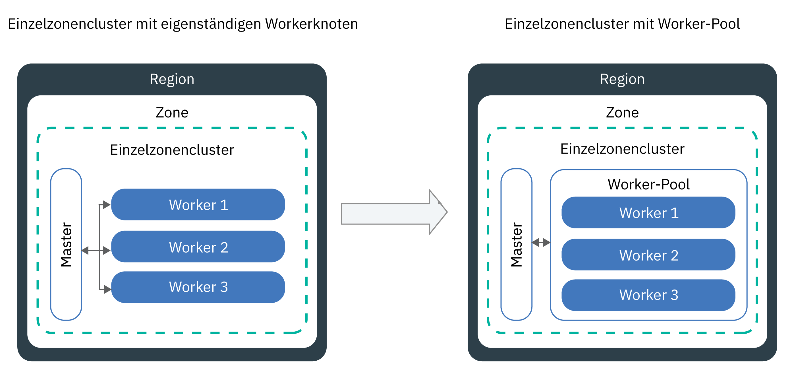

---

copyright:
  years: 2014, 2019
lastupdated: "2019-04-03"

keywords: kubernetes, iks

subcollection: containers

---

{:new_window: target="_blank"}
{:shortdesc: .shortdesc}
{:screen: .screen}
{:pre: .pre}
{:table: .aria-labeledby="caption"}
{:codeblock: .codeblock}
{:tip: .tip}
{:note: .note}
{:important: .important}
{:deprecated: .deprecated}
{:download: .download}


# Cluster, Workerknoten und Add-ons aktualisieren
{: #update}

Sie können Aktualisierungen installieren, um Ihre Kubernetes-Cluster in {{site.data.keyword.containerlong}} aktuell zu halten.
{:shortdesc}

## Kubernetes-Master aktualisieren
{: #master}

Kubernetes gibt regelmäßig [Hauptversionen, Nebenversionen oder Patches als Aktualisierungen heraus.](/docs/containers?topic=containers-cs_versions#version_types). Aktualisierungen können die API-Serverversion von Kubernetes oder andere Komponenten in Ihrem Kubernetes-Master betreffen. IBM aktualisiert die Programmkorrekturversion, aber Sie müssen die Haupt- und Nebenversionen des Masters aktualisieren.
{:shortdesc}

**Wie kann ich wissen, wann der Master aktualisiert werden soll?**</br>
Sie werden über die {{site.data.keyword.Bluemix_notm}}-Konsole und die CLI benachrichtigt, wenn Aktualisierungen verfügbar sind. Außerdem können Sie unsere Seite mit den [unterstützten Versionen](/docs/containers?topic=containers-cs_versions) überprüfen.

**Wie viele Versionen älter als die aktuelle Version darf der Master sein?**</br>
IBM unterstützt in der Regel drei Versionen von Kubernetes zu einem bestimmten Zeitpunkt. Eine Aktualisierung des Kubernetes-API-Servers von seiner aktuellen Version über mehr als zwei Versionen hinweg ist nicht möglich.

Beispiel: Wenn Ihre aktuelle Kubernetes-API-Serverversion die Version 1.8 ist und Sie auf Version 1.11 aktualisieren möchten, müssen Sie zuerst die Aktualisierung auf Version 1.10 durchführen. Sie können die gewünschte Aktualisierung zwar erzwingen, doch kann eine Aktualisierung über drei oder mehr Nebenversionen hinweg unter Umständen zu nicht erwarteten Ergebnissen oder Fehlern führen.

Falls Ihr Cluster in einer nicht unterstützten Kubernetes-Version ausgeführt wird, müssen Sie die Aktualisierung möglicherweise erzwingen. Daher sollten Sie Ihren Cluster auf dem neuesten Stand halten, um operative Auswirkungen zu vermeiden.

**Können meine Workerknoten eine höhere Version als der Master ausführen?**</br>
Ihre Workerknoten können keine spätere Kubernetes-Version (`major.minor`) als der Master ausführen. [Aktualisieren Sie Ihren Master](#update_master) zunächst auf die aktuellste Version von Kubernetes. Anschließend [aktualisieren Sie die Workerknoten](#worker_node) in Ihrem Cluster.

Workerknoten können eine spätere Patchversion als der Master ausführen, zum Beispiel Patchversionen, die für Workerknoten aufgrund von Sicherheitsaktualisierungen spezifisch sind.

**Wie werden Patchaktualisierungen angewendet?**</br>
Patchaktualisierungen für den Master werden automatisch über mehrere Tage hinweg angewendet, sodass eine Master-Patch-Version möglicherweise als verfügbar angezeigt wird, bevor sie auf Ihren Master angewendet wird. Die Aktualisierungsautomatisierung überspringt auch Cluster, die sich in einem nicht einwandfreien Zustand befinden oder in denen derzeit Operationen ausgeführt werden. Es kann vorkommen, dass IBM gelegentlich die automatischen Aktualisierungen für ein bestimmtes Master-Fixpack inaktiviert, zum Beispiel ein Patch, das nur benötigt wird, wenn ein Master von einer Nebenversion auf eine andere Version aktualisiert wird. In allen diesen Fällen können Sie [das Änderungsprotokoll der Versionen](/docs/containers?topic=containers-changelog) auf alle potenziellen Auswirkungen prüfen und sicher selbst den [Befehl](/docs/containers?topic=containers-cs_cli_reference#cs_cluster_update) `ibmcloud ks cluster-update` verwenden, ohne auf die Anwendung der automatischen Aktualisierung zu warten.

Im Gegensatz zum Master müssen Sie die Worker für jede Patchversion aktualisieren.

**Was passiert bei der Masteraktualisierung?**</br>
In Clustern, in denen Kubernetes Version 1.11 oder aktueller ausgeführt wird, ist Ihr Master mit drei Replikat-Master-Pods hoch verfügbar. Die Master-Pods haben eine rollierende Aktualisierung, während der immer nur ein Pod nicht verfügbar ist. Zwei Instanzen sind aktiv, sodass Sie während der Aktualisierung  auf den Cluster zugreifen und ihn ändern können. Ihre Workerknoten, Apps und Ressourcen werden weiterhin ausgeführt.

Für Cluster mit früheren Versionen von Kubernetes ist der API-Server für ca. 5 - 10 Minuten inaktiv, wenn Sie den Kubernetes-API-Server aktualisieren. Während der Aktualisierung können Sie weder auf den Cluster zugreifen noch Änderungen am Cluster vornehmen. Allerdings werden Workerknoten, Apps und Ressourcen, die von Clusterbenutzern bereitgestellt wurden, nicht geändert und weiterhin ausgeführt.

**Kann ich die Aktualisierung rückgängig machen?**</br>
Nein, Sie können nach dem Aktualisierungsprozess für Cluster keinen Rollback auf eine frühere Version durchführen. Achten Sie darauf, zunächst einen Testcluster zu verwenden und die Anweisungen für den Umgang mit potenziellen Problemen zu befolgen, bevor Sie Ihren Produktionsmaster aktualisieren.

**Welchen Prozess kann ich ausführen, um den Master zu aktualisieren?**</br>
Das folgende Diagramm zeigt den Prozess, den Sie zum Aktualisieren des Masters ausführen können.


Abbildung 1. Prozessdiagramm für die Aktualisierung des Kubernetes-Masters

{: #update_master}
Bevor Sie beginnen, stellen Sie sicher, dass Sie die [{{site.data.keyword.Bluemix_notm}} IAM-Plattformrolle **Operator** oder **Administrator**](/docs/containers?topic=containers-users#platform) innehaben.

Gehen Sie wie folgt vor, um die _Haupt-_ oder _Nebenversion_ des Kubernetes-Masters zu aktualisieren:

1.  Überprüfen Sie die [Kubernetes-Änderungen](/docs/containers?topic=containers-cs_versions) und führen Sie alle Aktualisierungen durch, die mit der Markierung _Vor Master aktualisieren_ gekennzeichnet sind.

2.  Aktualisieren Sie Ihren Kubernetes-API-Server und die zugehörigen Kubernetes-Masterkomponenten, indem Sie die [{{site.data.keyword.Bluemix_notm}}-Konsole](https://cloud.ibm.com/login) verwenden oder den [CLI-Befehl](/docs/containers?topic=containers-cs_cli_reference#cs_cluster_update) `ibmcloud ks cluster-update` ausführen.

3.  Warten Sie ein paar Minuten und vergewissern Sie sich dann, dass die Aktualisierung abgeschlossen ist. Überprüfen Sie die Version des Kubernetes-API-Servers im {{site.data.keyword.Bluemix_notm}}-Cluster-Dashboard oder führen Sie den Befehl `ibmcloud ks clusters` aus.

4.  Installieren Sie die Version der [`Kubectl-CLI`](/docs/containers?topic=containers-cs_cli_install#kubectl), die mit dem Kubernetes-API-Server übereinstimmt, der in Ihrem Kubernetes-Master ausgeführt wird.

Wenn die Aktualisierung des Kubernetes-API-Servers abgeschlossen ist, können Sie Ihre Workerknoten aktualisieren.

<br />


## Workerknoten aktualisieren
{: #worker_node}

Sie haben eine Benachrichtigung erhalten, die besagt, dass Sie Ihre Workerknoten aktualisieren müssen. Was bedeutet dies nun? Bei der Einrichtung von Sicherheitsupdates und -patches für den API-Server von Kubernetes und anderen Komponenten des Kubernetes-Masters müssen Sie darauf achten, dass Ihre Workerknoten synchronisiert bleiben.
{: shortdesc}

**Was passiert mit meinen Apps während einer Aktualisierung?**</br>
Wenn Sie Apps als Teil einer Bereitstellung auf Workerknoten ausführen, die Sie aktualisieren, werden die Apps auf anderen Workerknoten im Cluster neu geplant. Diese Workerknoten können sich in einem anderen Worker-Pool befinden. Wenn Sie eigenständige Workerknoten haben, können Apps auch auf eigenständigen Workerknoten geplant werden. Um Ausfallzeiten für Ihre App zu vermeiden, müssen Sie sicherstellen, dass genügend Kapazität im Cluster vorhanden ist, um die Workload zu übernehmen.

**Wie kann ich die Ausfallzeiten von Workerknoten zu einem bestimmten Zeitpunkt während der Aktualisierung steuern?**</br>
Wenn alle Workerknoten betriebsbereit sein müssen, sollten Sie in Betracht ziehen, [die Größe des Worker-Pools zu ändern](/docs/containers?topic=containers-cs_cli_reference#cs_worker_pool_resize) oder [eigenständige Workerknoten hinzufügen](/docs/containers?topic=containers-cs_cli_reference#cs_worker_add), um weitere Workerknoten hinzuzufügen. Sie können die zusätzlichen Workerknoten entfernen, nachdem die Aktualisierung abgeschlossen ist.

Darüber hinaus können Sie eine Kubernetes-Konfigurationszuordnung erstellen, die die maximale Anzahl der Workerknoten angibt, die während der Aktualisierung nicht verfügbar sein können. Workerknoten werden durch eine entsprechende Bezeichnung identifiziert. Sie können von IBM bereitgestellte Bezeichnungen oder angepasste Bezeichnungen verwenden, die Sie dem Workerknoten hinzugefügt haben.

**Was geschieht, wenn keine Konfigurationszuordnung definiert wurde?**</br>
Wenn die Konfigurationszuordnung nicht definiert wurde, wird die Standardeinstellung verwendet. Standardmäßig können maximal 20 % aller Workerknoten in den einzelnen Clustern während des Aktualisierungsprozesses nicht verfügbar sein.

**Vorbereitende Schritte**:
- [Melden Sie sich an Ihrem Konto an. Geben Sie als Ziel die entsprechende Region und, sofern zutreffend, die Ressourcengruppe an. Legen Sie den Kontext für den Cluster fest.](/docs/containers?topic=containers-cs_cli_install#cs_cli_configure)
- [Aktualisieren Sie den Kubernetes-Master](#master). Die Kubernetes-Version der Workerknoten darf nicht höher als die Version des API-Servers von Kubernetes sein.
- Führen Sie alle Änderungen durch, die mit der Markierung _Nach Master aktualisieren_ in [Kubernetes-Änderungen](/docs/containers?topic=containers-cs_versions) versehen sind.
- Wenn Sie eine Patchaktualisierung anwenden möchten, lesen Sie sich die Informationen im [Kubernetes-Änderungsprotokoll](/docs/containers?topic=containers-changelog#changelog) durch.
- Stellen Sie sicher, dass Sie über die {{site.data.keyword.Bluemix_notm}} IAM-Plattformrolle [**Operator** oder **Administrator** verfügen. </br>

Die Aktualisierung von Workerknoten kann zu Ausfallzeiten bei Ihren Apps und Services führen. Von Ihrer Workerknotenmaschine wird ein neues Image erstellt wird und dabei werden Daten gelöscht, die nicht [außerhalb des Pods gespeichert sind](/docs/containers?topic=containers-storage_planning#persistent_storage_overview)(/docs/containers?topic=containers-users#platform)].
{: important}

{: #worker-up-configmap}
**Gehen Sie wie folgt vor, um eine Konfigurationszuordnung zu erstellen und die Workerknoten zu aktualisieren**:

1.  Listen Sie verfügbare Workerknoten auf und notieren Sie deren private IP-Adressen.

    ```
    ibmcloud ks workers --cluster <clustername_oder_-id>
    ```
    {: pre}

2. Zeigen Sie die Bezeichnungen eines Workerknotens an. Die Bezeichnungen der Workerknoten finden Sie im Abschnitt **Labels** der CLI-Ausgabe. Jede Bezeichnung besteht aus einem Selektorschlüssel (`NodeSelectorKey`) und einem Selektorwert (`NodeSelectorValue`).
   ```
   kubectl describe node <private_worker-ip>
   ```
   {: pre}

   Beispielausgabe:
   ```
   Name:               10.184.58.3
   Roles:              <none>
   Labels:             arch=amd64
                    beta.kubernetes.io/arch=amd64
                    beta.kubernetes.io/os=linux
                    failure-domain.beta.kubernetes.io/region=us-south
                    failure-domain.beta.kubernetes.io/zone=dal12
                    ibm-cloud.kubernetes.io/encrypted-docker-data=true
                    ibm-cloud.kubernetes.io/iaas-provider=softlayer
                    ibm-cloud.kubernetes.io/machine-type=u3c.2x4.encrypted
                    kubernetes.io/hostname=10.123.45.3
                    privateVLAN=2299001
                    publicVLAN=2299012
   Annotations:        node.alpha.kubernetes.io/ttl=0
                    volumes.kubernetes.io/controller-managed-attach-detach=true
   CreationTimestamp:  Tue, 03 Apr 2018 15:26:17 -0400
   Taints:             <none>
   Unschedulable:      false
   ```
   {: screen}

3. Erstellen Sie eine Konfigurationszuordnung und definieren Sie die Nichtverfügbarkeitsregeln für Ihre Workerknoten. Das folgende Beispiel zeigt vier Prüfungen: `zonecheck.json`, `regioncheck.json`, `defaultcheck.json` und eine Prüfungsvorlage. Sie können diese Beispielprüfungen verwenden, um Regeln für Workerknoten in einer bestimmten Zone (`zonecheck.json`), Region (`regioncheck.json`) oder für alle Workerknoten zu definieren, die nicht mit den in der Konfigurationszuordnung definierten Prüfungen übereinstimmen (`defaultcheck.json`). Mit der Prüfungsvorlage können Sie Ihre eigene Prüfung erstellen. Für jede Prüfung müssen Sie zum Identifizieren eines Workerknotens eine der Workerknotenbezeichnungen auswählen, die Sie im vorherigen Schritt abgerufen haben.  

   Für jede Prüfung können Sie nur einen Wert für <code>NodeSelectorKey</code> und <code>NodeSelectorValue</code> festlegen. Wenn Sie Regeln für mehrere Regionen, Zonen oder andere Workerknotenbezeichnungen festlegen möchten, müssen Sie eine neue Prüfung erstellen. Definieren Sie bis zu zehn Prüfungen in einer Konfigurationszuordnung. Wenn Sie weitere Prüfungen hinzufügen, werden sie ignoriert.
   {: note}

   Beispiel:
   ```
   apiVersion: v1
   kind: ConfigMap
   metadata:
     name: ibm-cluster-update-configuration
     namespace: kube-system
   data:
    drain_timeout_seconds: "120"
    zonecheck.json: |
      {
        "MaxUnavailablePercentage": 30,
        "NodeSelectorKey": "failure-domain.beta.kubernetes.io/zone",
        "NodeSelectorValue": "dal13"
      }
    regioncheck.json: |
      {
        "MaxUnavailablePercentage": 20,
        "NodeSelectorKey": "failure-domain.beta.kubernetes.io/region",
        "NodeSelectorValue": "us-south"
      }
    defaultcheck.json: |
      {
        "MaxUnavailablePercentage": 20
      }
    <Prüfungsname>: |
      {
        "MaxUnavailablePercentage": <wert_in_prozent>,
        "NodeSelectorKey": "<selektorschlüssel_des_knotens>",
        "NodeSelectorValue": "<selektorwert_des_knotens>"
      }
   ```
   {: codeblock}

   <table summary="Die erste Zeile in der Tabelle erstreckt sich über beide Spalten. Die übrigen Zeilen sollten von links nach rechts gelesen werden, wobei der Parameter in der ersten Spalte und die entsprechende Beschreibung in der zweiten Spalte angegeben sind.">
   <caption>Komponenten der Konfigurationszuordnung</caption>
    <thead>
      <th colspan=2> Erklärung der Komponenten </th>
    </thead>
    <tbody>
      <tr>
        <td><code>drain_timeout_seconds</code></td>
        <td> Optional: Das Zeitlimit in Sekunden, das gewartet wird, bis die [Entleerung ](https://kubernetes.io/docs/tasks/administer-cluster/safely-drain-node/) abgeschlossen ist. Durch das Entleeren eines Workerknotens werden alle vorhandenen Pods sicher vom Workerknoten entfernt und die Pods auf anderen Workerknoten im Cluster neu geplant. Zulässige Werte liegen zwischen 1 und 180. Der Standardwert ist 30.</td>
      </tr>
      <tr>
        <td><code>zonecheck.json</code></br><code>regioncheck.json</code></td>
        <td>Zwei Prüfungen, die eine Regel für eine Gruppe von Workerknoten definieren, die Sie mit den angegebenen Werten für <code>NodeSelectorKey</code> und <code>NodeSelectorValue</code> identifizieren können. Die Datei <code>zonecheck.json</code> identifiziert Workerknoten auf der Basis ihrer Zonenbezeichnung und die Datei <code>regioncheck.json</code> verwendet die Regionsbezeichnung, die während der Bereitstellung zu jedem Workerknoten hinzugefügt wird. Im vorliegenden Beispiel können 30 % aller Workerknoten, die <code>dal13</code> als Zonenbezeichnung aufweisen, und 20 % aller Workerknoten in <code>us-south</code> während der Aktualisierung nicht verfügbar sein.</td>
      </tr>
      <tr>
        <td><code>defaultcheck.json</code></td>
        <td>Wenn Sie keine Konfigurationszuordnung erstellen oder die Zuordnung nicht ordnungsgemäß konfiguriert ist, wird der Standardwert von Kubernetes angewendet. Standardmäßig können nur 20 % der Workerknoten im Cluster zu einem bestimmten Zeitpunkt nicht verfügbar sein. Sie können den Standardwert überschreiben, indem Sie die Standardprüfung zur Konfigurationszuordnung hinzufügen. Im Beispiel kann jeder in den Zonen- und Regionsprüfungen (<code>dal13</code> oder <code>us-south</code>) angegebene Workerknoten während der Aktualisierung nicht verfügbar sein. </td>
      </tr>
      <tr>
        <td><code>MaxUnavailablePercentage</code></td>
        <td>Dies ist für einen angegebenen Bezeichnungsschlüssel und -wert der maximal zulässige Anteil an nicht verfügbaren Knoten. Der Wert wird als Prozentsatz angegeben. Ein Workerknoten ist dann nicht verfügbar, wenn er sich zum betreffenden Zeitpunkt im Bereitstellungs-, Neulade- oder Einrichtungsprozess befindet. Bei Überschreitung eines beliebigen definierten maximalen Prozentsatzes für Nichtverfügbarkeit werden die in der Warteschlange befindlichen Workerknoten blockiert und so von der Aktualisierung ausgeschlossen. </td>
      </tr>
      <tr>
        <td><code>NodeSelectorKey</code></td>
        <td>Dies ist der Bezeichnungsschlüssel des Workerknotens, für den eine Regel festgelegt werden soll. Sie können Regeln sowohl für die von IBM bereitgestellten Standardbezeichnungen als auch für die von Ihnen erstellten Workerknotenbezeichnungen festlegen. <ul><li>Wenn Sie eine Regel für Workerknoten hinzufügen möchten, die zu einem Worker-Pool gehören, können Sie die Bezeichnung <code>ibm-cloud.kubernetes.io/machine-type</code> verwenden. </li><li> Wenn Sie mehr als einen Worker-Pool mit demselben Maschinentyp haben, verwenden Sie eine angepasste Bezeichnung. </li></ul></td>
      </tr>
      <tr>
        <td><code>NodeSelectorValue</code></td>
        <td>Der Bezeichnungswert, den der Workerknoten für die von Ihnen definierte Regel berücksichtigen muss. </td>
      </tr>
    </tbody>
   </table>

4. Erstellen Sie die Konfigurationszuordnung in Ihrem Cluster.
   ```
   kubectl apply -f <filepath/configmap.yaml>
   ```
   {: pre}

5.  Stellen Sie sicher, dass die Konfigurationszuordnung erstellt wurde.
    ```
    kubectl get configmap --namespace kube-system
    ```
    {: pre}

6.  Aktualisieren Sie die Workerknoten.

    ```
    ibmcloud ks worker-update --cluster <clustername_oder_-id> --workers <workerknoten1-id> <workerknoten2-id>
    ```
    {: pre}

7. Optional: Überprüfen Sie die Ereignisse, die von der Konfigurationszuordnung möglicherweise ausgelöst werden, sowie alle eventuell auftretenden Gültigkeitsfehler. Die Ereignisse können im Abschnitt **Events** Ihrer CLI-Ausgabe überprüft werden.
   ```
   kubectl describe -n kube-system cm ibm-cluster-update-configuration
   ```
   {: pre}

8. Vergewissern Sie sich, dass die Aktualisierung abgeschlossen wurde, indem Sie die Kubernetes-Version der Workerknoten überprüfen.  
   ```
   kubectl get nodes
   ```
   {: pre}

9. Stellen Sie sicher, dass keine doppelten Workerknoten vorhanden sind. In bestimmten Fällen werden in älteren Clustern nach einer Aktualisierung doppelte Workerknoten mit dem Status **`NotReady`** (Nicht bereit) aufgelistet. Informationen zum Entfernen doppelter Workerknoten finden Sie im Abschnitt zur [Fehlerbehebung](/docs/containers?topic=containers-cs_troubleshoot_clusters#cs_duplicate_nodes).

Nächste Schritte:
-   Wiederholen Sie den Aktualisierungsprozess mit anderen Worker-Pools.
-   Informieren Sie die Entwickler, die im Cluster arbeiten, damit diese ihre `kubectl`-CLI auf die Version des Kubernetes-Masters aktualisieren können.
-   Wenn im Kubernetes-Dashboard keine Nutzungsdiagramme angezeigt werden, [löschen Sie den Pod `kube-dashboard`](/docs/containers?topic=containers-cs_troubleshoot_health#cs_dashboard_graphs).


### Workerknoten in der Konsole aktualisieren
{: #worker_up_console}

Wenn Sie die Konfigurationszuordnung (Configmap) erstmals eingerichtet haben, können Sie Workerknoten nachfolgend über die {{site.data.keyword.Bluemix_notm}}-Konsole aktualisieren.
{: shortdesc}

Vorbereitende Schritte:
*   [Richten Sie eine Konfigurationszuordnung ein](#worker_node), um zu steuern, wie Ihre Workerknoten aktualisiert werden.
*   [Aktualisieren Sie den Kubernetes-Master](#master). Die Kubernetes-Version der Workerknoten darf nicht höher als die Version des API-Servers von Kubernetes sein.
*   Führen Sie alle Änderungen durch, die mit der Markierung _Nach Master aktualisieren_ in [Kubernetes-Änderungen](/docs/containers?topic=containers-cs_versions) versehen sind.
*   Wenn Sie eine Patchaktualisierung anwenden möchten, lesen Sie sich die Informationen im [Kubernetes-Änderungsprotokoll](/docs/containers?topic=containers-changelog#changelog) durch.
*   Stellen Sie sicher, dass Sie über die {{site.data.keyword.Bluemix_notm}} IAM-Plattformrolle [**Operator** oder **Administrator** verfügen. </br>

Die Aktualisierung von Workerknoten kann zu Ausfallzeiten bei Ihren Apps und Services führen. Von Ihrer Workerknotenmaschine wird ein neues Image erstellt wird und dabei werden Daten gelöscht, die nicht [außerhalb des Pods gespeichert sind](/docs/containers?topic=containers-storage_planning#persistent_storage_overview)(/docs/containers?topic=containers-users#platform)].
{: important}

Gehen Sie wie folgt vor, um Workerknoten über die Konsole zu aktualisieren:
1.  Klicken Sie im Menü  der [{{site.data.keyword.Bluemix_notm}}-Konsole](https://cloud.ibm.com/) auf **Kubernetes**.
2.  Klicken Sie auf der Seite **Cluster** auf Ihren Cluster.
3.  Wählen Sie auf der Registerkarte **Workerknoten** das Kontrollkästchen für jeden Workerknoten aus, den Sie aktualisieren wollen. Über der Zeile der Tabellenüberschrift wird eine Aktionsleiste angezeigt.
4.  Klicken Sie in der Aktionsleiste auf **Kubernetes aktualisieren**.

<br />


## Maschinentypen aktualisieren
{: #machine_type}

Sie können die Maschinentypen der Workerknoten aktualisieren, indem Sie neue Workerknoten hinzufügen und alte entfernen. Wenn Ihr Cluster beispielsweise über die veralteten `x1c`- oder ältere Ubuntu 16 `x2c`-Workerknoten-Typen verfügt, erstellen Sie Ubuntu 18-Workerknoten, die Maschinentypen mit `x3c` in den Namen verwenden.
{: shortdesc}

Vorbereitende Schritte:
- [Melden Sie sich an Ihrem Konto an. Geben Sie als Ziel die entsprechende Region und, sofern zutreffend, die Ressourcengruppe an. Legen Sie den Kontext für den Cluster fest.](/docs/containers?topic=containers-cs_cli_install#cs_cli_configure)
- Wenn Sie Daten auf dem Workerknoten speichern, werden die Daten gelöscht, wenn sie nicht [außerhalb des Workerknotens gespeichert sind](/docs/containers?topic=containers-storage_planning#persistent_storage_overview).
- Stellen Sie sicher, dass Sie die [{{site.data.keyword.Bluemix_notm}} IAM-Plattformrolle **Operator** oder **Administrator**](/docs/containers?topic=containers-users#platform) innehaben.

Gehen Sie wie folgt vor, um Maschinentypen zu aktualisieren:

1. Listen Sie verfügbare Workerknoten auf und notieren Sie deren private IP-Adressen.
   - **Für Workerknoten in einem Worker-Pool**:
     1. Listen Sie verfügbare Worker-Pools in Ihrem Cluster auf.
        ```
        ibmcloud ks worker-pools --cluster <clustername_oder_-id>
        ```
        {: pre}

     2. Listen Sie die Workerknoten im Worker-Pool auf.
        ```
        ibmcloud ks workers --cluster <clustername_oder_-id> --worker-pool <poolname>
        ```
        {: pre}

     3. Rufen Sie die Details für einen Workerknoten ab und notieren Sie die Zone, die private und die öffentliche VLAN-ID.
        ```
        ibmcloud ks worker-get --cluster <clustername_oder_-id> <worker-id>
        ```
        {: pre}

   - **Veraltet: Für eigenständige Workerknoten**:
     1. Listen Sie verfügbare Workerknoten auf.
        ```
        ibmcloud ks workers --cluster <clustername_oder_-id>
        ```
        {: pre}

     2. Rufen Sie die Details für einen Workerknoten ab und notieren Sie die Zone, die private und die öffentliche VLAN-ID.
        ```
        ibmcloud ks worker-get --cluster <clustername_oder_-id> --worker <worker-id>
        ```
        {: pre}

2. Listen Sie die verfügbaren Maschinentypen in der Zone auf.
   ```
   ibmcloud ks machine-types <zone>
   ```
   {: pre}

3. Erstellen Sie einen Workerknoten mit dem neuen Maschinentyp.
   - **Für Workerknoten in einem Worker-Pool**:
     1. Erstellen Sie einen Worker-Pool mit der Anzahl der Workerknoten, die Sie ersetzen möchten.
        ```
        ibmcloud ks worker-pool-create --name <poolname> --cluster <clustername_oder_-id> --machine-type <maschinentyp> --size-per-zone <anzahl_der_worker_pro_zone>
        ```
        {: pre}

     2. Stellen Sie sicher, dass der Worker-Pool erstellt wird.
        ```
        ibmcloud ks worker-pools --cluster <clustername_oder_-id>
        ```
        {: pre}

     3. Fügen Sie die Zone zu Ihrem Worker-Pool hinzu, den Sie zuvor abgerufen haben. Beim Hinzufügen einer Zone werden die Workerknoten, die im Worker-Pool definiert sind, in der Zone bereitgestellt und für die zukünftige Planung von Workloads berücksichtigt. Wenn Sie die Workerknoten auf mehrere Zonen verteilen möchten, wählen Sie eine [mehrzonenfähige Zone](/docs/containers?topic=containers-regions-and-zones#zones) aus.
        ```
        ibmcloud ks zone-add --zone <zone> --cluster <clustername_oder_-id> --worker-pools <poolname> --private-vlan <private_vlan-id> --public-vlan <öffentliche_vlan-id>
        ```
        {: pre}

   - **Veraltet: Für eigenständige Workerknoten**:
       ```
       ibmcloud ks worker-add --cluster <clustername> --machine-type <maschinentyp> --number <anzahl_der_workerknoten> --private-vlan <private_vlan-id> --public-vlan <öffentliche_vlan-id>
       ```
       {: pre}

4. Warten Sie, bis die Workerknoten bereitgestellt wurden.
   ```
   ibmcloud ks workers --cluster <clustername_oder_-id>
   ```
   {: pre}

   Wenn der Status des Workerknotens in **Normal** wechselt, ist die Bereitstellung abgeschlossen.

5. Entfernen Sie den alten Workerknoten. **Hinweis**: Wenn Sie einen Maschinentyp entfernen, der monatlich abgerechnet wird (zum Beispiel Bare-Metal), dann wird Ihnen der gesamte Monat noch berechnet.
   - **Für Workerknoten in einem Worker-Pool**:
     1. Entfernen Sie den Worker-Pool mit dem alten Maschinentyp. Durch das Entfernen eines Worker-Pools werden alle Workerknoten im Pool in allen Zonen entfernt. Dieser Prozess kann einige Minuten dauern.
        ```
        ibmcloud ks worker-pool-rm --worker-pool <poolname> --cluster <clustername_oder_-id>
        ```
        {: pre}

     2. Stellen Sie sicher, dass der Worker-Pool entfernt wird.
        ```
        ibmcloud ks worker-pools --cluster <clustername_oder_-id>
        ```
        {: pre}

   - **Veraltet: Für eigenständige Workerknoten**:
      ```
      ibmcloud ks worker-rm --cluster <clustername> --worker <workerknoten>
      ```
      {: pre}

6. Stellen Sie sicher, dass die Workerknoten aus Ihrem Cluster entfernt werden.
   ```
   ibmcloud ks workers --cluster <clustername_oder_-id>
   ```
   {: pre}

7. Wiederholen Sie diese Schritte, um andere Worker-Pools oder eigenständige Workerknoten auf verschiedene Maschinentypen zu aktualisieren.

## Cluster-Add-ons aktualisieren
{: #addons}

Ihr {{site.data.keyword.containerlong_notm}}-Cluster wird mit Add-ons geliefert, z. B. Fluentd für die Protokollierung, die automatisch installiert werden, wenn Sie den Cluster bereitstellen. Diese Add-ons werden standardmäßig automatisch von IBM aktualisiert. Sie können jedoch automatische Aktualisierungen für manche Add-ons inaktivieren und sie separat über die Master- und Worker-Knoten aktualisieren.
{: shortdesc}

**Welche Standard-Add-ons kann ich separat vom Cluster aktualisieren?**</br>
Optional können Sie automatische Aktualisierungen für die folgenden Add-ons inaktivieren:
* [Fluentd für Protokollierung](#logging-up)
* [Lastausgleichsfunktion für Ingress-Anwendungen](#alb)

**Gibt es Add-ons, die ich nicht separat vom Cluster aktualisieren kann?**</br>

Ja. Ihr Cluster wird mit den folgenden verwalteten Add-ons und zugehörigen Ressourcen bereitgestellt, die nicht geändert werden können, es sei denn, Sie möchten Pods skalieren oder Konfigurationszuordnungen für bestimmte Leistungsvorteile bearbeiten. Wenn Sie versuchen, eines dieser Add-ons für die Bereitstellung zu ändern, werden ihre ursprünglichen Einstellungen in einem regelmäßigen Intervall wiederhergestellt.

* `coredns`
* `coredns-autoscaler`
* `heapster`
* `ibm-file-plugin`
* `ibm-storage-watcher`
* `ibm-keepalived-watcher`
* `kube-dns-amd64`
* `kube-dns-autoscaler`
* `kubernetes-dashboard`
* `metrics-server`
* `vpn`

Sie können diese Ressourcen anzeigen, indem Sie die Bezeichnung `addonmanager.kubernetes.io/mode: Reconcile` verwenden. Beispiel:

```
kubectl get deployments --all-namespaces -l addonmanager.kubernetes.io/mode=Reconcile
```
{: pre}

**Kann ich andere Add-ons als den Standard installieren?**</br>
Ja. {{site.data.keyword.containerlong_notm}} stellt weitere Add-ons zur Verfügung, die Sie auswählen können, um Ihrem Cluster Funktionen hinzuzufügen. Sie können z. B. [Helm-Diagramme verwenden](/docs/containers?topic=containers-helm#public_helm_install) , um das [Blockspeicher-Plug-in](/docs/containers?topic=containers-block_storage#install_block), [Istio](/docs/containers?topic=containers-istio) oder das [strongSwan-VPN](/docs/containers?topic=containers-vpn#vpn-setup) zu installieren. Sie müssen jedes Add-on separat aktualisieren, indem Sie die Anweisungen zum Aktualisieren der Helm-Diagramme befolgen.

### Automatische Aktualisierungen für Fluentd zum Protokollieren von Add-ons verwalten
{: #logging-up}

Um Änderungen an Ihren Protokollierungs- oder Filterkonfigurationen vornehmen zu können, muss das Fluentd-Add-on die aktuelle Version aufweisen. Standardmäßig sind automatische Aktualisierungen für das Add-on aktiviert.
{: shortdesc}

Sie können die automatischen Aktualisierungen des Fluentd-Add-ons auf folgende Arten verwalten. **Hinweis:** Um die folgenden Befehle auszuführen, müssen Sie die [{{site.data.keyword.Bluemix_notm}} IAM-Plattformrolle **Administrator**](/docs/containers?topic=containers-users#platform) für den Cluster innehaben.

* Prüfen Sie, ob automatische Aktualisierungen aktiviert sind, indem Sie den [Befehl](/docs/containers?topic=containers-cs_cli_reference#cs_log_autoupdate_get) `ibmcloud ks logging-autoupdate-get --cluster <clustername_oder_-id>` ausführen.
* Inaktivieren Sie automatische Aktualisierungen, indem Sie den [Befehl](/docs/containers?topic=containers-cs_cli_reference#cs_log_autoupdate_disable) `ibmcloud ks logging-autoupdate-disable` ausführen.
* Wenn automatische Aktualisierungen inaktiviert sind, Sie jedoch eine Änderung an der Konfiguration vornehmen müssen, stehen Ihnen zwei Optionen zur Auswahl:
    * Aktivieren Sie automatische Aktualisierungen für Ihre Fluentd-Pods.
        ```
        ibmcloud ks logging-autoupdate-enable --cluster <clustername_oder_-id>
        ```
        {: pre}
    * Erzwingen Sie eine einmalige Aktualisierung, wenn Sie einen Protokollierungsbefehl verwenden, der die Option `--force-update` enthält. **Hinweis**: Die Pods werden auf die aktuelle Version des Fluentd-Add-ons aktualisiert, Fluentd wird jedoch zukünftig nicht automatisch aktualisiert.
        Beispielbefehl:

        ```
        ibmcloud ks logging-config-update --cluster <clustername_oder_-id> --id <protokollkonfigurations-id> --type <protokollierungstyp> --force-update
        ```
        {: pre}

### Automatische Aktualisierungen für das Ingress-ALB-Add-on verwalten
{: #alb}

Steuern Sie, wann das Add-on für die Lastausgleichsfunktion für Ingress-Anwendungen aktualisiert wird.
{: shortdesc}

Wenn das Add-on für die Lastausgleichsfunktion für Anwendungen aktualisiert wird, werden die Container `nginx-ingress` und `ingress-auth` in allen ALB-Pods auf die aktuelle Buildversion aktualisiert. Standardmäßig sind automatische Aktualisierungen für das Add-on aktiviert. Aktualisierungen werden auf rollierender Basis durchgeführt, sodass es für die Lastausgleichsfunktionen für Ihre Ingress-Anwendungen keine Ausfallzeiten gibt.

Wenn Sie automatische Aktualisierungen inaktivieren, sind Sie für das Aktualisieren des Add-ons verantwortlich. Sobald Aktualisierungen verfügbar sind, werden Sie über die CLI benachrichtigt, wenn Sie die Befehle `ibmcloud ks albs` oder `alb-autoupdate-get` ausführen.

Wenn Sie die Kubernetes-Hauptversion oder -Nebenversion Ihres Clusters aktualisieren, nimmt IBM automatisch die erforderlichen Änderungen an der Ingress-Bereitstellung vor, ändert aber nicht die Buildversion Ihres Add-ons für die Lastausgleichsfunktion für Ihre Ingress-Anwendungen. Sie sind dafür verantwortlich, die Kompatibilität der aktuellen Kubernetes-Versionen und Ihrer Images des Add-ons für die Lastausgleichsfunktion für Ingress-Anwendungen zu prüfen.
{: note}

Vorbereitende Schritte:

1. Prüfen Sie, ob Ihre Lastausgleichsfunktionen für Ingress-Anwendungen ausgeführt werden.
    ```
    ibmcloud ks albs
    ```
    {: pre}

2. Prüfen Sie den Status von automatischen Aktualisierungen für das Add-on für die Lastausgleichsfunktion für Ingress-Anwendungen.
    ```
    ibmcloud ks alb-autoupdate-get --cluster <clustername_oder_-id>
    ```
    {: pre}

    Beispielausgabe, wenn automatische Aktualisierungen aktiviert sind:
    ```
    Retrieving automatic update status of application load balancer (ALB) pods in cluster mycluster...
    OK
    Automatic updates of the ALB pods are enabled in cluster mycluster
    ALBs are at the latest version in cluster mycluster
    ```
    {: screen}

    Beispielausgabe, wenn automatische Aktualisierungen inaktiviert sind:
    ```
    Retrieving automatic update status of application load balancer (ALB) pods in cluster mycluster...
    OK
    Automatic updates of the ALB pods are disabled in cluster mycluster
    ALBs are not at the latest version in cluster mycluster. To view the current version, run 'ibmcloud ks albs'.
    ```
    {: screen}

3. Prüfen Sie die aktuelle **Build**version Ihrer ALB-Pods.
    ```
    ibmcloud ks albs --cluster <clustername_oder_-id>
    ```
    {: pre}

    Beispielausgabe:
    ```
    ALB ID                                            Status    Type      ALB IP         Zone    Build
    private-crb110acca09414e88a44227b87576ceea-alb1   enabled   private   10.130.5.78    mex01   ingress:350/ingress-auth:192*
    public-crb110acca09414e88a44227b87576ceea-alb1    enabled   public    169.57.1.110   mex01   ingress:350/ingress-auth:192*

    * An update is available for the ALB pods. Review any potentially disruptive changes for the latest version before you update: https://cloud.ibm.com/docs/containers?topic=containers-update#alb
    ```
    {: screen}

Sie können die automatischen Aktualisierungen des Ingress-ALB-Add-ons auf folgende Arten verwalten. **Hinweis:** Um die folgenden Befehle auszuführen, müssen Sie die [{{site.data.keyword.Bluemix_notm}} IAM-Plattformrolle **Editor** oder **Administrator**](/docs/containers?topic=containers-users#platform) für den Cluster innehaben.
* Inaktivieren Sie automatische Aktualisierungen.
    ```
    ibmcloud ks alb-autoupdate-disable --cluster <clustername_oder_-id>
    ```
    {: pre}
* Aktualisieren Sie Ihr Ingress-ALB-Add-on manuell.
    1. Wenn eine Aktualisierung verfügbar ist und Sie das Add-on aktualisieren möchten, überprüfen Sie zunächst das [Änderungsprotokoll für die aktuelle Version des Ingress-ALB-Add-ons](/docs/containers?topic=containers-cluster-add-ons-changelog#alb_changelog), um alle potenziell störenden Änderungen zu überprüfen.
    2. Erzwingen Sie eine einmalige Aktualisierung Ihrer ALB-Pods. Alle ALB-Pods in dem Cluster werden auf die aktuelle Buildversion aktualisiert. Sie können nicht eine einzelne ALB aktualisieren oder auswählen, auf welchen Build das Add-on aktualisiert werden soll. Die automatischen Aktualisierungen bleiben inaktiviert.
        ```
        ibmcloud ks alb-update --cluster <clustername_oder_-id>
        ```
        {: pre}
* Wenn Ihre ALB-Pods vor Kurzem aktualisiert wurde, aber eine angepasste Konfiguration für Ihre ALBs von dem letzten Build betroffen ist, können Sie die Aktualisierung rückgängig machen und wieder den Build herstellen, den Ihre ALB-Pods zuvor ausgeführt hatten. **Hinweis**: Nachdem Sie eine Aktualisierung rückgängig gemacht haben, werden die automatischen Aktualisierungen für ALB-Pods inaktiviert.
    ```
    ibmcloud ks alb-rollback --cluster <clustername_oder_-id>
    ```
    {: pre}
* Aktivieren Sie die automatischen Aktualisieren wieder. Sobald der nächste Build verfügbar ist, werden die ALB-Pods automatisch auf den neuen Build aktualisiert.
    ```
    ibmcloud ks alb-autoupdate-enable --cluster <clustername_oder_-id>
    ```
    {: pre}

<br />


## Von eigenständigen Workerknoten auf Worker-Pools aktualisieren
{: #standalone_to_workerpool}

Mit der Einführung von Mehrzonenclustern werden Workerknoten mit derselben Konfiguration, wie z. B. dem Maschinentyp, in Worker-Pools gruppiert. Wenn Sie einen neuen Cluster erstellen, wird automatisch ein Worker-Pool mit dem Namen `default` für Sie erstellt.
{: shortdesc}

Sie können Worker-Pools verwenden, um die Workerknoten gleichmäßig auf die Zonen zu verteilen und einen ausgeglichenen Cluster zu erstellen. Ausgeglichene Cluster sind besser verfügbar und können bei Fehlern ausfallfrei eingesetzt werden. Wenn ein Workerknoten aus einer Zone entfernt wird, können Sie den Worker-Pool neu ausgleichen und automatisch neue Workerknoten für diese Zone bereitstellen. Worker-Pools werden auch verwendet, um Kubernetes-Versionsaktualisierungen für alle Workerknoten zu installieren.  

Wenn Sie Cluster erstellt haben, bevor Mehrzonencluster verfügbar wurden, sind die Workerknoten noch eigenständig und werden nicht automatisch in Worker-Pools gruppiert. Sie müssen diese Cluster für die Verwendung von Worker-Pools aktualisieren. Wenn keine Aktualisierung durchgeführt wird, können Sie Ihren Einzelzonencluster nicht in einen Mehrzonencluster ändern.
{: important}

Die folgende Abbildung veranschaulicht, wie sich Ihre Clusterkonfiguration ändert, wenn Sie statt eigenständigen Workerknoten Worker-Pools verwenden.



Vorbereitende Schritte:
- Stellen Sie sicher, dass Sie die [{{site.data.keyword.Bluemix_notm}} IAM-Plattformrolle **Operator** oder **Administrator**](/docs/containers?topic=containers-users#platform) für den Cluster innehaben.
- [Melden Sie sich an Ihrem Konto an. Geben Sie als Ziel die entsprechende Region und, sofern zutreffend, die Ressourcengruppe an. Legen Sie den Kontext für den Cluster fest.](/docs/containers?topic=containers-cs_cli_install#cs_cli_configure)

Gehen Sie wie folgt vor, um eigenständige Workerknoten in Worker-Pools zu aktualisieren:

1. Listen Sie vorhandene eigenständige Workerknoten in Ihrem Cluster auf und notieren Sie die **ID**, den **Maschinentyp** und die **private IP**.
   ```
   ibmcloud ks workers --cluster <clustername_oder_-id>
   ```
   {: pre}

2. Erstellen Sie einen Worker-Pool und entscheiden Sie sich für den Maschinentyp und die Anzahl der Workerknoten, die Sie zum Pool hinzufügen möchten.
   ```
   ibmcloud ks worker-pool-create --name <poolname> --cluster <clustername_oder_-id> --machine-type <maschinentyp> --size-per-zone <anzahl_der_worker_pro_zone>
   ```
   {: pre}

3. Listen Sie die verfügbaren Zonen auf und legen Sie fest, wo die Workerknoten in Ihrem Worker-Pool bereitgestellt werden sollen. Um die Zone anzuzeigen, in der die eigenständigen Workerknoten bereitgestellt werden, führen Sie den Befehl `ibmcloud ks cluster-get --cluster <clustername_oder_-id>` aus. Wenn Sie die Workerknoten auf mehrere Zonen verteilen möchten, wählen Sie eine [mehrzonenfähige Zone](/docs/containers?topic=containers-regions-and-zones#zones) aus.
   ```
   ibmcloud ks zones
   ```
   {: pre}

4. Listen Sie verfügbare VLANs für die Zone auf, die Sie im vorherigen Schritt ausgewählt haben. Wenn in dieser Zone noch kein VLAN vorhanden ist, wird das VLAN automatisch für Sie erstellt, wenn Sie die Zone zum Worker-Pool hinzufügen.
   ```
   ibmcloud ks vlans --zone <zone>
   ```
   {: pre}

5. Fügen Sie die Zone zu Ihrem Worker-Pool hinzu. Beim Hinzufügen einer Zone zu einem Worker-Pool werden die Workerknoten, die im Worker-Pool definiert sind, in der Zone bereitgestellt und für die zukünftige Planung von Workloads berücksichtigt. {{site.data.keyword.containerlong}} fügt automatisch die Bezeichnung `failure-domain.beta.kubernetes.io/region` für die Region und die Bezeichnung `failure-domain.beta.kubernetes.io/zone` für die Zone für jeden Workerknoten hinzu. Der Kubernetes-Scheduler verwendet diese Bezeichnungen, um Pods auf Zonen innerhalb derselben Region zu verteilen.
   1. **So fügen Sie eine Zone einem Worker-Pool hinzu:** Ersetzen Sie `<poolname>` durch den Namen Ihres Worker-Pools und füllen Sie die Werte für die Cluster-ID, die Zone und die VLANs mit den zuvor abgerufenen Informationen aus. Wenn Sie nicht über ein privates und ein öffentliches VLAN in dieser Zone verfügen, geben Sie diese Option nicht an. Ein privates und ein öffentliches VLAN werden automatisch für Sie erstellt.

      Wenn Sie verschiedene VLANs für unterschiedliche Worker-Pools verwenden möchten, wiederholen Sie diesen Befehl für jedes VLAN und die entsprechenden Worker-Pools. Alle neuen Workerknoten werden den von Ihnen angegebenen VLANs hinzugefügt, die VLANs für alle vorhandenen Workerknoten werden jedoch nicht geändert.
      ```
      ibmcloud ks zone-add --zone <zone> --cluster <clustername_oder_-id> --worker-pools <poolname> --private-vlan <private_vlan-id> --public-vlan <öffentliche_vlan-id>
      ```
      {: pre}

   2. **So fügen Sie die Zone mehreren Worker-Pools hinzu**: Fügen Sie mehrere Worker-Pools dem Befehl `ibmcloud ks zone-add` hinzu. Wenn Sie mehrere Worker-Pools zu einer Zone hinzufügen möchten, müssen Sie über ein vorhandenes privates und öffentliches VLAN in dieser Zone verfügen. Wenn Sie kein öffentliches und privates VLAN in dieser Zone haben, sollten Sie die Zone zuerst einem Worker-Pool hinzufügen, damit ein öffentliches und ein privates VLAN für Sie erstellt werden. Anschließend können Sie die Zone anderen Worker-Pools hinzufügen. </br></br>Es ist wichtig, dass die Workerknoten in allen Worker-Pools in allen Zonen bereitgestellt werden, um sicherzustellen, dass Ihr Cluster auf alle Zonen gleichmäßig verteilt wird. Wenn Sie verschiedene VLANs für verschiedene Worker-Pools verwenden möchten, wiederholen Sie diesen Befehl mit dem VLAN, das Sie für Ihren Worker-Pool verwenden wollen. Wenn Sie über mehrere VLANs für einen Cluster, mehrere Teilnetze in demselben VLAN oder einen Cluster mit mehreren Zonen verfügen, müssen Sie eine [VRF-Funktion (Virtual Router Function)](/docs/infrastructure/direct-link?topic=direct-link-overview-of-virtual-routing-and-forwarding-vrf-on-ibm-cloud#overview-of-virtual-routing-and-forwarding-vrf-on-ibm-cloud) für Ihr Konto für die IBM Cloud-Infrastruktur (SoftLayer) aktivieren, damit die Workerknoten über das private Netz miteinander kommunizieren können. Zur Aktivierung von VRF [wenden Sie sich an Ihren Ansprechpartner für die IBM Cloud-Infrastruktur (SoftLayer)](/docs/infrastructure/direct-link?topic=direct-link-overview-of-virtual-routing-and-forwarding-vrf-on-ibm-cloud#how-you-can-initiate-the-conversion). Wenn Sie VRF nicht aktivieren können oder wollen, aktivieren Sie das [VLAN-Spanning](/docs/infrastructure/vlans?topic=vlans-vlan-spanning#vlan-spanning). Um diese Aktion durchführen zu können, müssen Sie über die [Infrastrukturberechtigung](/docs/containers?topic=containers-users#infra_access) **Netz > VLAN-Spanning im Netz verwalten** verfügen oder Sie können den Kontoeigner bitten, diese zu aktivieren. Zum Prüfen, ob das VLAN-Spanning bereits aktiviert ist, verwenden Sie den [Befehl](/docs/containers?topic=containers-cs_cli_reference#cs_vlan_spanning_get) `ibmcloud ks vlan-spanning-get`.
      ```
      ibmcloud ks zone-add --zone <zone> --cluster <clustername_oder_-id> --worker-pools <poolname1,poolname2,poolname3> --private-vlan <private_vlan-id> --public-vlan <öffentliche_vlan-id>
      ```
      {: pre}

   3. **So fügen Sie mehrere Zonen zu Ihren Worker-Pools hinzu**: Wiederholen Sie den Befehl `ibmcloud ks zone-add` mit einer anderen Zone und geben Sie die Worker-Pools an, die in dieser Zone bereitgestellt werden sollen. Wenn Sie Ihrem Cluster weitere Zonen hinzufügen, ändern Sie den Cluster von einem Einzelzonencluster in einen [Mehrzonencluster](/docs/containers?topic=containers-plan_clusters#multizone).

6. Warten Sie, bis die Workerknoten in jeder Zone bereitgestellt wurden.
   ```
   ibmcloud ks workers --cluster <clustername_oder_-id>
   ```
   {: pre}
   Wenn sich der Status des Workerknotens in **Normal** ändert, ist die Bereitstellung abgeschlossen.

7. Entfernen Sie die eigenständigen Workerknoten. Wenn Sie mehrere eigenständige Workerknoten haben, entfernen Sie immer jeweils einen Knoten.
   1. Listen Sie die Workerknoten in Ihrem Cluster auf und vergleichen Sie die private IP-Adresse aus diesem Befehl mit der privaten IP-Adresse, die Sie am Anfang abgerufen haben, um Ihre eigenständigen Workerknoten zu finden.
      ```
      kubectl get nodes
      ```
      {: pre}
   2. Markieren Sie den Workerknoten in einem Prozess, der als Abriegelung oder "Cordoning" bezeichnet wird, als nicht planbar ("unschedulable"). Wenn Sie einen Workerknoten abriegeln, ist er für die künftige Pod-Planung nicht mehr verfügbar. Verwenden Sie den Wert für `name`, der im Befehl `kubectl get nodes` zurückgegeben wird.
      ```
      kubectl cordon <workername>
      ```
      {: pre}
   3. Überprüfen Sie, ob die Pod-Planung für Ihren Workerknoten inaktiviert ist
      ```
      kubectl get nodes
      ```
      {: pre}
      Ihr Workerknoten ist für die Pod-Planung inaktiviert, wenn der Status **`SchedulingDisabled`** angezeigt wird.
   4. Pods müssen aus dem eigenständigen Workerknoten entfernt und auf den verbleibenden entriegelten eigenständigen Workerknoten und Workerknoten aus Ihrem Worker-Pool neu geplant werden.
      ```
      kubectl drain <workername> --ignore-daemonsets
      ```
      {: pre}
      Dieser Prozess kann einige Minuten dauern.

   5. Entfernen Sie den eigenständigen Workerknoten. Verwenden Sie die ID des Workerknotens, den Sie mit dem Befehl `ibmcloud ks workers <clustername_oder_-id>` abgerufen haben.
      ```
      ibmcloud ks worker-rm --cluster <clustername_oder_-id> --worker <worker-id>
      ```
      {: pre}
   6. Wiederholen Sie diese Schritte, bis alle eigenständigen Workerknoten entfernt wurden.


**Womit möchten Sie fortfahren?** </br>
Nachdem Sie den Cluster aktualisiert haben, um Worker-Pools zu verwenden, können Sie die Verfügbarkeit verbessern, indem Sie Ihrem Cluster weitere Zonen hinzufügen. Durch das Hinzufügen weiterer Zonen zu Ihrem Cluster wird Ihr Cluster von einem Einzelzonencluster in einen [Mehrzonencluster](/docs/containers?topic=containers-plan_clusters#ha_clusters) geändert. Wenn Sie Ihren Einzelzonencluster in einen Mehrzonencluster ändern, ändert sich die Ingress-Domäne von `<clustername>.<region>.containers.mybluemix.net` in `<clustername>.<region_oder_zone>.containers.appdomain.cloud`. Die vorhandene Ingress-Domäne ist weiterhin gültig und kann zum Senden von Anforderungen an Ihre Apps verwendet werden.

<br />

