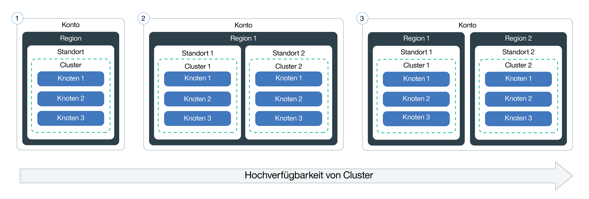

---

copyright:
  years: 2014, 2018
lastupdated: "2018-02-02"

---

{:new_window: target="_blank"}
{:shortdesc: .shortdesc}
{:screen: .screen}
{:pre: .pre}
{:table: .aria-labeledby="caption"}
{:codeblock: .codeblock}
{:tip: .tip}
{:download: .download}


# Cluster einrichten
{: #clusters}

Konzipieren Sie die Konfiguration Ihres Clusters, um das größtmögliche Maß an Verfügbarkeit und Kapazität zu erzielen.
{:shortdesc}


## Clusterkonfiguration planen
{: #planning_clusters}

Verwenden Sie Standardcluster, um die Verfügbarkeit von Apps zu erhöhen. Die Wahrscheinlichkeit, dass Ihre Benutzer Ausfallzeiten verzeichnen, ist
geringer, wenn Sie Ihre Containerkonfiguration auf mehrere Workerknoten und Cluster verteilen. Integrierte Funktionen wie Lastausgleich (Load Balancing) und Isolation erhöhen die Ausfallsicherheit gegenüber möglichen Fehlerbedingungen mit Hosts,
Netzen oder Apps.
{:shortdesc}

Betrachten Sie diese potenziellen Clusterkonfigurationen, die nach zunehmendem Grad der Verfügbarkeit angeordnet sind:



1.  Ein Cluster mit mehreren Workerknoten.
2.  Zwei Cluster, die an verschiedenen Standorten in derselben Region ausgeführt werden und jeweils mehrere Workerknoten besitzen.
3.  Zwei Cluster, die in verschiedenen Regionen ausgeführt werden und jeweils mehrere Workerknoten besitzen.

Steigern Sie die Verfügbarkeit Ihres Clusters mithilfe dieser Verfahren:

<dl>
<dt>Streuung von Apps durch Verteilen auf mehrere Workerknoten</dt>
<dd>Erlauben Sie den Entwicklern die Streuung ihrer Apps in Containern auf mehrere Workerknoten pro Cluster. Eine App-Instanz in jedem dritten Workerknoten ermöglicht, die Ausfallzeit eines Workerknotens abzufangen, ohne dass die Nutzung der App unterbrochen wird. Sie können angeben, wie viele Workerknoten eingeschlossen werden, wenn Sie einen Cluster über die [{{site.data.keyword.Bluemix_notm}}-GUI](cs_clusters.html#clusters_ui) oder die [CLI](cs_clusters.html#clusters_cli) erstellen. Kubernetes beschränkt die maximale Anzahl von Workerknoten, die in einem Cluster vorhanden sein können. Beachten Sie deshalb die [Kontingente für Workerknoten und Pods ](https://kubernetes.io/docs/admin/cluster-large/).
<pre class="codeblock">
<code>bx cs cluster-create --location &lt;dal10&gt; --workers 3 --public-vlan &lt;meine_id_des_öffentlichen_vlan&gt; --private-vlan &lt;meine_id_des_privaten_vlan&gt; --machine-type &lt;u2c.2x4&gt; --name &lt;mein_cluster&gt;</code>
</pre>
</dd>
<dt>Streuung von Apps durch Verteilen auf mehrere Cluster</dt>
<dd>Erstellen Sie mehrere Cluster, die jeweils mehrere Workerknoten besitzen. Sollte es bei einem Cluster zu einem Ausfall kommen, können Benutzer immer noch auf eine App zugreifen, die auch auf einem anderen Cluster bereitgestellt ist.
<p>Cluster
1:</p>
<pre class="codeblock">
<code>bx cs cluster-create --location &lt;dal10&gt; --workers 3 --public-vlan &lt;meine_id_des_öffentlichen_vlan&gt; --private-vlan &lt;meine_id_des_privaten_vlan&gt; --machine-type &lt;u2c.2x4&gt; --name &lt;mein_cluster1&gt;</code>
</pre>
<p>Cluster
2:</p>
<pre class="codeblock">
<code>bx cs cluster-create --location &lt;dal12&gt; --workers 3 --public-vlan &lt;meine_id_des_öffentlichen_vlan&gt; --private-vlan &lt;meine_id_des_privaten_vlan&gt; --machine-type &lt;u2c.2x4&gt;  --name &lt;mein_cluster2&gt;</code>
</pre>
</dd>
<dt>Streuung von Apps durch Verteilen auf mehrere Cluster in verschiedenen Regionen</dt>
<dd>Wenn Sie Apps auf mehrere Cluster in verschiedenen Regionen verteilen, kann der Lastausgleich auf der Grundlage der Region erfolgen, in der sich der Benutzer befindet. Wenn der Cluster, die Hardware oder gar ein kompletter Standort in einer Region ausfällt, wird der Datenverkehr an den Container weitergeleitet, der an einem anderen Standort bereitgestellt ist.
<p><strong>Wichtig:</strong> Nachdem Sie eine angepasste Domäne konfiguriert haben, können Sie die Cluster anhand der folgenden Befehle erstellen.</p>
<p>Standort
1:</p>
<pre class="codeblock">
<code>bx cs cluster-create --location &lt;dal10&gt; --workers 3 --public-vlan &lt;meine_id_des_öffentlichen_vlan&gt; --private-vlan &lt;meine_id_des_privaten_vlan&gt; --machine-type &lt;u2c.2x4&gt; --name &lt;mein_cluster1&gt;</code>
</pre>
<p>Standort
2:</p>
<pre class="codeblock">
<code>bx cs cluster-create --location &lt;ams03&gt; --workers 3 --public-vlan &lt;meine_id_des_öffentlichen_vlan&gt; --private-vlan &lt;meine_id_des_privaten_vlan&gt; --machine-type &lt;u2c.2x4&gt; --name &lt;mein_cluster2&gt;</code>
</pre>
</dd>
</dl>

<br />


## Konfiguration von Workerknoten planen
{: #planning_worker_nodes}

Ein Kubernetes-Cluster besteht aus Workerknoten, die vom Kubernetes-Master zentral überwacht und verwaltet werden. Clusteradministratoren entscheiden, wie sie den Cluster aus Workerknoten einrichten, um sicherzustellen, dass den Clusterbenutzern alle Ressourcen für die Bereitstellung und Ausführung von Apps im Cluster zur Verfügung stehen.
{:shortdesc}

Wenn Sie einen Standardcluster erstellen, werden in IBM Cloud Infrastructure (SoftLayer) in Ihrem Namen Workerknoten bestellt und in {{site.data.keyword.Bluemix_notm}} eingerichtet. Jedem Workerknoten werden eine eindeutige Workerknoten-ID und ein Domänenname zugeordnet, die nach dem Erstellen des Clusters nicht geändert werden dürfen. Abhängig von dem ausgewählten Grad an Hardware-Isolation können Workerknoten als gemeinsam genutzte oder als dedizierte Knoten eingerichtet werden. Außerdem können Sie auswählen, ob Workerknoten mit einem öffentlichen und einem privaten VLAN verbunden werden sollen oder nur mit einem privaten VLAN. Jeder Workerknoten wird mit einem bestimmten Maschinentyp bereitgestellt, der die Anzahl von vCPUs sowie die Menge an Haupt- und an Plattenspeicher festlegt, die den auf Ihrem Workerknoten bereitgestellten Containern zur Verfügung stehen. Kubernetes beschränkt die maximale Anzahl von Workerknoten, die in einem Cluster vorhanden sein können. Weitere Informationen finden Sie unter [Worker node and pod quotas ](https://kubernetes.io/docs/admin/cluster-large/).


### Hardware für Workerknoten
{: #shared_dedicated_node}

Jeder Arbeiterknoten wird als virtuelle Maschine auf physischer Hardware eingerichtet. Wenn Sie einen Standardcluster in {{site.data.keyword.Bluemix_notm}} erstellen, müssen Sie auswählen, ob die zugrunde liegende Hardware von mehreren {{site.data.keyword.IBM_notm}} Kunden gemeinsam genutzt werden kann (Multi-Tenant-Konfiguration) oder Sie die ausschließlich Ihnen vorbehaltene, dedizierte Nutzung vorziehen (Single-Tenant-Konfiguration).
{:shortdesc}

Bei einer Multi-Tenant-Konfiguration werden physische Ressourcen wie CPU und Speicher von allen virtuellen Maschinen, die auf derselben physischen Hardware bereitgestellt wurden, gemeinsam genutzt. Um sicherzustellen, dass jede virtuelle Maschine unabhängig von anderen Maschinen ausgeführt werden kann, segmentiert ein VM-Monitor, d. h. eine Überwachungsfunktion für virtuelle Maschinen, die auch als Hypervisor bezeichnet wird, die physischen Ressourcen in isolierte Entitäten und ordnet diese einer virtuellen Maschine als dedizierte Ressourcen zu. Dies wird als Hypervisor-Isolation bezeichnet.

Bei einer Single-Tenant-Konfiguration ist die Nutzung aller physischen Ressourcen ausschließlich Ihnen vorbehalten. Sie können mehrere Workerknoten als virtuelle Maschinen auf demselben physischen Host bereitstellen. Ähnlich wie bei der Multi-Tenant-Konfiguration stellt der Hypervisor auch hier sicher, dass jeder Workerknoten seinen Anteil an den verfügbaren physischen Ressourcen erhält.

Gemeinsam genutzte Knoten sind in der Regel kostengünstiger als dedizierte Knoten, weil die Kosten für die ihnen zugrunde liegende Hardware von mehreren Kunden getragen werden. Bei der Entscheidungsfindung hinsichtlich gemeinsam genutzter Knoten versus dedizierter Knoten sollten Sie mit Ihrer Rechtsabteilung Rücksprache halten, um zu klären, welcher Grad an Infrastrukturisolation und Compliance für Ihre App-Umgebung erforderlich ist.

Wenn Sie einen kostenlosen Cluster erstellen, wird Ihr Workerknoten automatisch als gemeinsam genutzter Knoten im Konto der IBM Cloud-Infrastruktur (SoftLayer) bereitgestellt.

### VLAN-Verbindung für Workerknoten
{: #worker_vlan_connection}

Bei der Clustererstellung wird jeder Cluster automatisch mit einem VLAN in Ihrem Konto der IBM Cloud-Infrastruktur (SoftLayer) verbunden. Ein VLAN konfiguriert eine Gruppe von Workerknoten und Pods so, als wären diese an dasselbe physische Kabel angeschlossen. Das private VLAN bestimmt, welche private IP-Adresse einem Workerknoten bei der Clustererstellung zugewiesen wird. Das öffentliche VLAN bestimmt, welche öffentliche IP-Adresse einem Workerknoten bei der Clustererstellung zugewiesen wird.

Bei kostenlosen Clustern werden die Workerknoten des Clusters während der Clustererstellung mit einem IBM eigenen öffentlichen VLAN und privaten VLAN verbunden. Bei Standardclustern können Sie Ihre Workerknoten entweder mit einem öffentlichen und einem privaten VLAN verbinden oder nur mit einem privaten VLAN. Wenn Ihre Workerknoten nur mit einem privaten VLAN verbunden werden sollen, können Sie während der Clustererstellung die ID eines vorhandenen privaten VLANs angeben. Sie müssen zusätzlich eine alternative Lösung konfigurieren, um eine sichere Verbindung zwischen Workerknoten und dem Kubernetes-Master zu ermöglichen. Sie können zum Beispiel eine Vyatta-Instanz konfigurieren, um Datenverkehr von Workerknoten im privaten VLAN an den Kubernetes-Master weiterzuleiten. Weitere Informationen hierzu finden Sie im Abschnitt "Set up a custom Vyatta to securely connect your worker nodes to the Kubernetes master" in der [Dokumentation für die IBM Cloud-Infrastruktur (SoftLayer)](https://knowledgelayer.softlayer.com/procedure/basic-configuration-vyatta).

### Speicherbegrenzung für Workerknoten
{: #resource_limit_node}

{{site.data.keyword.containershort_notm}} legt für jeden Workerknoten eine Speicherbegrenzung fest. Wenn Pods, die auf einem Workerknoten ausgeführt werden, diese Speicherbegrenzung überschreiten, werden die Pods entfernt. In Kubernetes wird diese Begrenzung als [harte Räumungsschwelle ](https://kubernetes.io/docs/tasks/administer-cluster/out-of-resource/#hard-eviction-thresholds) bezeichnet.
{:shortdesc}

Wenn Ihre Pods häufig entfernt werden, fügen Sie zusätzliche Workerknoten zu Ihrem Cluster hinzu oder legen Sie [Ressourcenbegrenzungen ](https://kubernetes.io/docs/concepts/configuration/manage-compute-resources-container/#resource-requests-and-limits-of-pod-and-container) für die Pods fest.

Jeder Maschinentyp verfügt über eine andere Speicherkapazität. Wenn weniger Speicher auf dem Workerknoten als der zulässige Mindestschwellenwert verfügbar ist, entfernt Kubernetes den Pod sofort. Wenn ein anderer Workerknoten verfügbar ist, wird die Planung für den Pod auf diesem Workerknoten neu erstellt.

|Speicherkapazität für Workerknoten|Mindestspeicherschwellenwert eines Workerknotens|
|---------------------------|------------|
|4 GB  | 256 MB |
|16 GB | 1024 MB |
|64 GB | 4096 MB |
|128 GB| 4096 MB |
|242 GB| 4096 MB |

Um zu sehen, wie viel Speicher auf dem Workerknoten belegt ist, führen Sie [kubectl top node ](https://kubernetes.io/docs/reference/generated/kubectl/kubectl-commands#top) aus.


<br />


## Cluster über die GUI erstellen
{: #clusters_ui}

Ein Kubernetes-Cluster ist eine Gruppe von Workerknoten, die zu einem Netz zusammengefasst sind. Der Zweck des Clusters besteht darin, eine Gruppe von Ressourcen, Knoten, Netzen und Speichereinheiten zu definieren, die die Hochverfügbarkeit von Anwendungen sicherstellen. Bevor Sie eine App bereitstellen können, müssen Sie zunächst einen Cluster erstellen und die Definitionen für die Workerknoten in diesem Cluster festlegen.
{:shortdesc}

Gehen Sie wie folgt vor, um einen Cluster zu erstellen:
1. Wählen Sie im Katalog die Option **Kubernetes-Cluster** aus.
2. Wählen Sie eine Region aus, in der Ihr Cluster bereitgestellt werden soll.
3. Wählen Sie einen Clusterplantyp aus. Sie können entweder **Kostenlos** oder **Nutzungsabhängig** auswählen. Beim Plan 'Nutzungsabhängig' können Sie einen Standardcluster mit Features wie beispielsweise mehreren Workerknoten für eine hoch verfügbare Umgebung bereitstellen.
4. Konfigurieren Sie die Clusterdetails.
    1. Ordnen Sie dem Cluster einen Namen zu, wählen Sie eine Kubernetes-Version aus und anschließend eine Position für die Bereitstellung Ihres Clusters. Wählen Sie die Position aus, die Ihrem Standort am nächsten ist, um eine optimale Leistung zu erhalten. Beachten Sie bei der Auswahl eines Standorts außerhalb Ihres Landes, dass Sie gegebenenfalls eine gesetzliche Genehmigung benötigen, bevor Daten physisch in einem anderen Land gespeichert werden können.
    2. Wählen Sie einen Maschinentyp aus und geben Sie die Anzahl der Workerknoten an, die Sie benötigen. Der Maschinentyp definiert die Menge an virtueller CPU, Hauptspeicher und Festplattenspeicher, die in jedem Workerknoten eingerichtet wird und allen Containern zur Verfügung steht.
    3. Wählen Sie ein öffentliches und ein privates VLAN über Ihr Konto für IBM Cloud Infrastructure (SoftLayer) aus. Beide VLANs kommunizieren zwischen Workerknoten, das öffentliche VLAN kommuniziert jedoch auch mit dem von IBM verwalteten Kubernetes-Master. Sie können dasselbe VLAN für mehrere Cluster verwenden.
        **Hinweis:** Falls Sie sich gegen die Verwendung eines öffentlichen VLAN entscheiden, müssen Sie eine alternative Lösung konfigurieren. Weitere Informationen hierzu finden Sie unter [VLAN-Verbindung für Workerknoten](#worker_vlan_connection).
    4. Wählen Sie einen Hardwaretyp aus.
        - **Dedicated**: Ihre Workerknoten werden in einer Infrastruktur gehostet, die Ihrem Konto vorbehalten ist. Ihre Ressourcen sind vollständig isoliert.
        - **Shared**: Infrastrukturressourcen wie der Hypervisor und physische Hardware werden zwischen Ihnen und anderen IBM Kunden aufgeteilt, aber jeder Workerknoten ist ausschließlich für Sie zugänglich. Obwohl diese Option in den meisten Fällen ausreicht und kostengünstiger ist, sollten Sie die Leistungs- und Infrastrukturanforderungen anhand der Richtlinien Ihres Unternehmens prüfen.
    5. Standardmäßig ist **Lokale Festplatte verschlüsseln** ausgewählt. Wenn Sie dieses Kontrollkästchen abwählen, werden die Docker-Daten des Hosts nicht verschlüsselt.[Hier erfahren Sie mehr zur Verschlüsselung](cs_secure.html#encrypted_disks).
4. Klicken Sie auf **Cluster einrichten**. Auf der Registerkarte **Workerknoten** können Sie den Fortschritt der Bereitstellung des Workerknotens überprüfen. Nach Abschluss der Bereitstellung können Sie auf der Registerkarte **Übersicht** sehen, dass Ihr Cluster bereit ist.
    **Hinweis:** Jedem Workerknoten werden eine eindeutige Workerknoten-ID und ein Domänenname zugeordnet, die nach dem Erstellen des Clusters nicht manuell geändert werden dürfen. Wenn die ID oder der Domänenname geändert wird, kann der Kubernetes-Master Ihren Cluster nicht mehr verwalten.


**Womit möchten Sie fortfahren? **

Wenn der Cluster betriebsbereit ist, können Sie sich mit den folgenden Tasks vertraut machen:

-   [Installieren Sie die Befehlszeilenschnittstellen (CLIs) und nehmen Sie die Arbeit mit dem Cluster auf.](cs_cli_install.html#cs_cli_install)
-   [Stellen Sie eine App in Ihrem Cluster bereit.](cs_app.html#app_cli)
-   [Richten Sie Ihre eigene private Registry in {{site.data.keyword.Bluemix_notm}} ein, um Docker-Images zu speichern und gemeinsam mit
anderen Benutzern zu verwenden.](/docs/services/Registry/index.html)
- Wenn Sie eine Firewall haben, müssen Sie unter Umständen [die erforderlichen Ports öffnen](cs_firewall.html#firewall), um die Befehle `bx`, `kubectl` oder `calicotl` zu verwenden, um von Ihrem Cluster ausgehenden Datenverkehr bzw. eingehenden Datenverkehr für Netzservices zuzulassen.

<br />


## Cluster über die CLI erstellen
{: #clusters_cli}

Ein Cluster ist eine Gruppe von Workerknoten, die zu einem Netz zusammengefasst sind. Der Zweck des Clusters besteht darin, eine Gruppe von Ressourcen, Knoten, Netzen und Speichereinheiten zu definieren, die die Hochverfügbarkeit von Anwendungen sicherstellen. Bevor Sie eine App bereitstellen können, müssen Sie zunächst einen Cluster erstellen und die Definitionen für die Workerknoten in diesem Cluster festlegen.
{:shortdesc}

Gehen Sie wie folgt vor, um einen Cluster zu erstellen:
1.  Installieren Sie die {{site.data.keyword.Bluemix_notm}}-CLI sowie das [{{site.data.keyword.containershort_notm}}-Plug-in](cs_cli_install.html#cs_cli_install).
2.  Melden Sie sich an der {{site.data.keyword.Bluemix_notm}}-CLI an. Geben Sie Ihre
{{site.data.keyword.Bluemix_notm}}-Berechtigungsnachweise ein, wenn
Sie dazu aufgefordert werden.

    ```
    bx login
    ```
    {: pre}

    **Hinweis:** Falls Sie über eine eingebundene ID verfügen, geben Sie `bx login --sso` ein, um sich an der Befehlszeilenschnittstelle von {{site.data.keyword.Bluemix_notm}} anzumelden. Geben Sie Ihren Benutzernamen ein und verwenden Sie die bereitgestellte URL in Ihrer CLI-Ausgabe, um Ihren einmaligen Kenncode abzurufen. Bei Verwendung einer eingebundenen ID schlägt die Anmeldung ohne die Option `--sso` fehl, mit der Option `--sso` ist sie erfolgreich.

3. Wenn Sie über mehrere {{site.data.keyword.Bluemix_notm}}-Konten verfügen, dann wählen Sie das Konto aus, unter dem Sie Ihren Kubernetes-Cluster erstellen wollen.

4.  Wenn Sie Kubernetes-Cluster in einer anderen als der zuvor ausgewählten {{site.data.keyword.Bluemix_notm}}-Region erstellen wollen, führen Sie `bx cs region-set` aus.

6.  Erstellen Sie einen Cluster.
    1.  Überprüfen Sie, welche Standorte verfügbar sind. Welche Standorte angezeigt werden, hängt von der {{site.data.keyword.containershort_notm}}-Region ab, bei der Sie angemeldet sind.

        ```
        bx cs locations
        ```
        {: pre}

        Ihre CLI-Ausgabe stimmt mit den [Standorten für die Containerregion überein](cs_regions.html#locations).

    2.  Wählen Sie einen Standort aus und prüfen Sie, welche Maschinentypen an diesem Standort verfügbar sind. Der Maschinentyp gibt an, welche virtuellen Rechenressourcen jedem Workerknoten zur Verfügung stehen.

        ```
        bx cs machine-types <standort>
        ```
        {: pre}

        ```
        Getting machine types list...
        OK
        Machine Types
        Name         Cores   Memory   Network Speed   OS             Storage   Server Type
        u2c.2x4      2       4GB      1000Mbps        UBUNTU_16_64   100GB     virtual
        b2c.4x16     4       16GB     1000Mbps        UBUNTU_16_64   100GB     virtual
        b2c.16x64    16      64GB     1000Mbps        UBUNTU_16_64   100GB     virtual
        b2c.32x128   32      128GB    1000Mbps        UBUNTU_16_64   100GB     virtual
        b2c.56x242   56      242GB    1000Mbps        UBUNTU_16_64   100GB     virtual
        ```
        {: screen}

    3.  Prüfen Sie, ob in der IBM Cloud-Infrastruktur (SoftLayer) bereits ein öffentliches und ein privates VLAN für dieses Konto vorhanden ist.

        ```
        bx cs vlans <standort>
        ```
        {: pre}

        ```
        ID        Name                Number   Type      Router  
        1519999   vlan   1355     private   bcr02a.dal10  
        1519898   vlan   1357     private   bcr02a.dal10 
        1518787   vlan   1252     public   fcr02a.dal10 
        1518888   vlan   1254     public    fcr02a.dal10
        ```
        {: screen}

        Falls bereits ein öffentliches oder privates VLAN vorhanden ist, notieren Sie sich die passenden Router. Private VLAN-Router beginnen immer mit `bcr` (Back-End-Router) und öffentliche VLAN-Router immer mit `fcr` (Front-End-Router). Die Zahlen- und Buchstabenkombination nach diesen Präfixen muss übereinstimmen, damit diese VLANs beim Erstellen eines Clusters verwendet werden können. In der Beispielausgabe können alle privaten VLANs mit allen öffentlichen VLANs verwendet werden, weil alle Router `02a.dal10` enthalten.

    4.  Führen Sie den Befehl `cluster-create` aus. Sie haben die Wahl zwischen einem kostenlosen Cluster, der einen Workerknoten mit zwei virtuellen CPUs (vCPUs) und 4 GB Hauptspeicher umfasst, und einem Standardcluster in Ihrem Konto in der IBM Cloud-Infrastructure (SoftLayer), der nach Bedarf beliebig viele Workerknoten umfassen kann. Wenn Sie einen Standardcluster erstellen, werden die Platten der Workerknoten standardmäßig verschlüsselt, die zugehörige Hardware wird von mehreren IBM Kunden gemeinsam genutzt und es wird nach Nutzungsstunden abgerechnet. </br>Beispiel eines Standardclusters:

        ```
        bx cs cluster-create --location dal10 --machine-type u2c.2x4 --hardware <shared_or_dedicated> --public-vlan <id_des_öffentlichen_vlan> --private-vlan <id_des_privaten_vlan> --workers 3 --name <clustername> --kube-version <major.minor.patch>
        ```
        {: pre}

        Beispiel für einen kostenlosen Cluster:

        ```
        bx cs cluster-create --name mein_cluster
        ```
        {: pre}

        <table>
        <caption>Tabelle. Erklärung der Bestandteile des Befehls <code>bx cs cluster-create</code></caption>
        <thead>
        <th colspan=2> Erklärung der Bestandteile dieses Befehls</th>
        </thead>
        <tbody>
        <tr>
        <td><code>cluster-create</code></td>
        <td>Der Befehl zum Erstellen eines Clusters in Ihrer {{site.data.keyword.Bluemix_notm}}-Organisation.</td>
        </tr>
        <tr>
        <td><code>--location <em>&lt;standort&gt;</em></code></td>
        <td>Ersetzen Sie <em>&lt;standort&gt;</em> durch die ID des {{site.data.keyword.Bluemix_notm}}-Standorts, an dem Sie Ihren Cluster erstellen möchten. [Verfügbare Standorte](cs_regions.html#locations) sind von der {{site.data.keyword.containershort_notm}}-Region abhängig, bei der Sie angemeldet sind.</td>
        </tr>
        <tr>
        <td><code>--machine-type <em>&lt;maschinentyp&gt;</em></code></td>
        <td>Wählen Sie bei Erstellung eines Standardclusters den Maschinentyp aus. Der Maschinentyp gibt an, welche virtuellen Rechenressourcen jedem Workerknoten zur Verfügung stehen. Weitere Informationen finden Sie unter [Vergleich von kostenlosen Clustern und Standardclustern für {{site.data.keyword.containershort_notm}}](cs_why.html#cluster_types). Bei kostenlosen Clustern muss kein Maschinentyp definiert werden.</td>
        </tr>
        <tr>
        <td><code>--hardware <em>&lt;shared_or_dedicated&gt;</em></code></td>
        <td>Der Grad an Hardware-Isolation für Ihren Workerknoten. Verwenden Sie 'dedicated', wenn Sie verfügbare physische Ressourcen haben möchten, die nur Sie nutzen können, oder 'shared', um zuzulassen, dass physische Ressourcen mit anderen IBM Kunden gemeinsam genutzt werden können. Die Standardeinstellung ist 'shared'. Dieser Wert ist für Standardcluster optional und steht für kostenlose Cluster nicht zur Verfügung.</td>
        </tr>
        <tr>
        <td><code>--public-vlan <em>&lt;id_des_öffentlichen_vlan&gt;</em></code></td>
        <td><ul>
          <li>Bei kostenlosen Clustern muss kein öffentliches VLAN definiert werden. Ihr kostenloser Cluster wird automatisch mit einem öffentlichen VLAN von IBM verbunden.</li>
          <li>Wenn für diesen Standort bereits ein öffentliches VLAN in Ihrem Konto von IBM Cloud Infrastructure (SoftLayer) eingerichtet ist, geben Sie bei einem Standardcluster die ID des öffentlichen VLAN ein. Wenn Sie noch nicht über ein öffentliches und ein privates VLAN für Ihr Konto verfügen, geben Sie diese Option nicht an. {{site.data.keyword.containershort_notm}} erstellt automatisch ein öffentliches VLAN für Sie.<br/><br/>
          <strong>Hinweis</strong>: Private VLAN-Router beginnen immer mit <code>bcr</code> (Back-End-Router) und öffentliche VLAN-Router immer mit <code>fcr</code> (Front-End-Router). Die Zahlen- und Buchstabenkombination nach diesen Präfixen muss übereinstimmen, damit diese VLANs beim Erstellen eines Clusters verwendet werden können.</li>
        </ul></td>
        </tr>
        <tr>
        <td><code>--private-vlan <em>&lt;id_des_privaten_vlan&gt;</em></code></td>
        <td><ul><li>Bei kostenlosen Clustern muss kein privates VLAN definiert werden. Ihr kostenloser Cluster wird automatisch mit einem privaten VLAN von IBM verbunden.</li><li>Wenn für diesen Standort bereits ein privates VLAN in Ihrem Konto von IBM Cloud Infrastructure (SoftLayer) eingerichtet ist, geben Sie bei einem Standardcluster die ID des privaten VLAN ein. Wenn Sie noch nicht über ein öffentliches und ein privates VLAN für Ihr Konto verfügen, geben Sie diese Option nicht an. {{site.data.keyword.containershort_notm}} erstellt automatisch ein öffentliches VLAN für Sie.<br/><br/><strong>Hinweis</strong>: Private VLAN-Router beginnen immer mit <code>bcr</code> (Back-End-Router) und öffentliche VLAN-Router immer mit <code>fcr</code> (Front-End-Router). Die Zahlen- und Buchstabenkombination nach diesen Präfixen muss übereinstimmen, damit diese VLANs beim Erstellen eines Clusters verwendet werden können.</li></ul></td>
        </tr>
        <tr>
        <td><code>--name <em>&lt;name&gt;</em></code></td>
        <td>Ersetzen Sie <em>&lt;name&gt;</em> durch den Namen Ihres Clusters.</td>
        </tr>
        <tr>
        <td><code>--workers <em>&lt;anzahl&gt;</em></code></td>
        <td>Die Anzahl der Workerknoten, die im Cluster eingebunden werden sollen. Wird die Option <code>--workers</code> nicht angegeben, wird 1 Workerknoten erstellt.</td>
        </tr>
        <tr>
          <td><code>--kube-version <em>&lt;major.minor.patch&gt;</em></code></td>
          <td>Die Kubernetes-Version für den Cluster-Masterknoten. Dieser Wert ist optional. Wenn nicht anders angegeben, wird der Cluster mit dem Standard für unterstützte Kubernetes-Versionen erstellt. Führen Sie den Befehl <code>bx cs kube-versions</code> aus, um die verfügbaren Versionen anzuzeigen.</td>
        </tr>
        <tr>
        <td><code>--disable-disk-encrypt</code></td>
        <td>Workerknoten weisen standardmäßig Verschlüsselung auf. [Weitere Informationen finden Sie hier](cs_secure.html#encrypted_disks). Wenn Sie die Verschlüsselung inaktivieren möchten, schließen Sie diese Option ein.</td>
        </tr>
        </tbody></table>

7.  Prüfen Sie, ob die Erstellung des Clusters angefordert wurde.

    ```
    bx cs clusters
    ```
    {: pre}

    **Hinweis:** Es kann bis zu 15 Minuten dauern, bis die Workerknotenmaschinen angewiesen werden und der Cluster in Ihrem
Konto eingerichtet und bereitgestellt wird.

    Nach Abschluss der Bereitstellung Ihres Clusters wird der Status des
Clusters in **deployed** (Bereitgestellt) geändert.

    ```
    Name         ID                                   State      Created          Workers
    mein_cluster   paf97e8843e29941b49c598f516de72101   deployed   20170201162433   1
    ```
    {: screen}

8.  Überprüfen Sie den Status der Workerknoten.

    ```
    bx cs workers <cluster>
    ```
    {: pre}

    Wenn die Workerknoten bereit sind, wechselt der Zustand (State) zu **Normal**, während für den Status die Angabe **Bereit** angezeigt wird. Wenn der Knotenstatus **Bereit** lautet, können Sie auf den Cluster zugreifen.

    **Hinweis:** Jedem Workerknoten werden eine eindeutige Workerknoten-ID und ein Domänenname zugeordnet, die nach der Erstellung des Clusters nicht manuell geändert werden dürfen. Wenn die ID oder der Domänenname geändert wird, kann der Kubernetes-Master Ihren Cluster nicht mehr verwalten.

    ```
    ID                                                  Public IP        Private IP     Machine Type   State      Status  
    prod-dal10-pa8dfcc5223804439c87489886dbbc9c07-w1   169.47.223.113   10.171.42.93   free           normal    Ready
    ```
    {: screen}

9. Legen Sie den von Ihnen erstellten Cluster als Kontext für diese Sitzung fest. Führen Sie diese Konfigurationsschritte jedes Mal aus, wenn Sie mit Ihrem Cluster arbeiten.
    1.  Ermitteln Sie den Befehl zum Festlegen der Umgebungsvariablen und laden Sie die Kubernetes-Konfigurationsdateien herunter.

        ```
        bx cs cluster-config <clustername_oder_-id>
        ```
        {: pre}

        Wenn
der Download der Konfigurationsdateien abgeschlossen ist, wird ein Befehl angezeigt, den Sie verwenden können,
um den Pfad zu der lokalen Kubernetes-Konfigurationsdatei als Umgebungsvariable festzulegen.

        Beispiel für OS X:

        ```
        export KUBECONFIG=/Users/<benutzername>/.bluemix/plugins/container-service/clusters/<clustername>/kube-config-prod-dal10-<clustername>.yml
        ```
        {: screen}

    2.  Kopieren Sie den Befehl, der in Ihrem Terminal angezeigt wird, um die Umgebungsvariable `KUBECONFIG` festzulegen.
    3.  Stellen Sie sicher, dass die Umgebungsvariable `KUBECONFIG` richtig eingestellt ist.

        Beispiel für OS X:

        ```
        echo $KUBECONFIG
        ```
        {: pre}

        Ausgabe:

        ```
        /Users/<benutzername>/.bluemix/plugins/container-service/clusters/<clustername>/kube-config-prod-dal10-<clustername>.yml

        ```
        {: screen}

10. Starten Sie Ihr Kubernetes-Dashboard über den Standardport `8001`.
    1.  Legen Sie die Standardportnummer für den Proxy fest.

        ```
        kubectl proxy
        ```
        {: pre}

        ```
        Starting to serve on 127.0.0.1:8001
        ```
        {: screen}

    2.  Öffnen Sie die folgende URL in einem Web-Browser, um das Kubernetes-Dashboard anzuzeigen:

        ```
        http://localhost:8001/ui
        ```
        {: codeblock}


**Womit möchten Sie fortfahren? **

-   [Stellen Sie eine App in Ihrem Cluster bereit.](cs_app.html#app_cli)
-   [Verwalten Sie Ihren Cluster über die Befehlszeile `kubectl`. ](https://kubernetes.io/docs/user-guide/kubectl/)
-   [Richten Sie Ihre eigene private Registry in {{site.data.keyword.Bluemix_notm}} ein, um Docker-Images zu speichern und gemeinsam mit
anderen Benutzern zu verwenden.](/docs/services/Registry/index.html)
- Wenn Sie eine Firewall haben, müssen Sie unter Umständen [die erforderlichen Ports öffnen](cs_firewall.html#firewall), um die Befehle `bx`, `kubectl` oder `calicotl` zu verwenden, um von Ihrem Cluster ausgehenden Datenverkehr bzw. eingehenden Datenverkehr für Netzservices zuzulassen.

<br />


## Clusterstatus
{: #states}

Sie können den aktuellen Clusterstatus anzeigen, indem Sie den Befehl `bx cs clusters` ausführen. Der Status wird im entsprechenden **Statusfeld** angezeigt. Der Clusterstatus liefert Informationen zur Verfügbarkeit und Kapazität des Clusters sowie zu möglichen Problemen, die aufgetreten sein können.
{:shortdesc}

|Clusterstatus|Grund|
|-------------|------|

|Critical (Kritisch)|Der Kubernetes-Master ist nicht erreichbar oder alle Workerknoten in dem Cluster sind inaktiv. <ol><li>Listen Sie die Workerknoten in Ihrem Cluster auf.<pre class="pre"><code>bx cs workers &lt;clustername_oder_-id&gt;</code></pre><li>Rufen Sie die Details für die einzelnen Workerknoten ab.<pre class="pre"><code>bx cs worker-get &lt;worker-id&gt;</code></pre></li><li>Überprüfen Sie die Felder <strong>State</strong> (Zustand) und <strong>Status</strong>, um die Fehlerursache für die Inaktivität des Workerknotens herauszufinden.<ul><li>Falls der Zustand des Workerknotens <strong>Provision_failed</strong> (Bereitstellung fehlgeschlagen) lautet, verfügen Sie möglicherweise nicht über die erforderlichen Berechtigungen, um einen Workerknoten aus dem Portfolio von IBM Cloud Infrastructure (SoftLayer) bereitzustellen. Informationen zu den erforderlichen Berechtigungen finden Sie unter [Zugriff auf das Portfolio von IBM Cloud Infrastructure (SoftLayer) konfigurieren, um Kubernetes-Standardcluster zu erstellen](cs_infrastructure.html#unify_accounts).</li><li>Falls der Zustand des Workerknotens <strong>Critical</strong> (Kritisch) und der Status <strong>Not Ready</strong> (Nicht bereit) lautet, kann Ihr Workerknoten unter Umständen keine Verbindung mit IBM Cloud Infrastructure (SoftLayer) herstellen. Starten Sie die Fehlerbehebung, indem Sie zunächst <code>bx cs worker-reboot --hard CLUSTER WORKER</code> ausführen. Falls dieser Befehl nicht erfolgreich ist, führen Sie <code>bx cs worker reload CLUSTER WORKER</code> aus.</li><li>Falls der Zustand des Workerknotens <strong>Critical</strong> (Kritisch) und der Status <strong>Out of disk
</strong> (Kein Plattenspeicher) lautet, hat Ihr Workerknoten keine Kapazität mehr. Sie können entweder die Arbeitslast auf Ihrem Workerknoten reduzieren oder einen Workerknoten zu Ihrem Cluster hinzufügen und so den Lastausgleich verbessern.</li><li>Falls der Zustand des Workerknotens <strong>Critical</strong> (Kritisch) und der Status <strong>Unknown</strong> (Unbekannt) lautet, ist der Kubernetes-Master nicht verfügbar. Wenden Sie sich an den {{site.data.keyword.Bluemix_notm}}-Support, indem Sie ein [{{site.data.keyword.Bluemix_notm}}-Support-Ticket](/docs/get-support/howtogetsupport.html#using-avatar) öffnen.</li></ul></li></ol>|

|Deploying (Wird bereitgestellt)|Der Kubernetes-Master ist noch nicht vollständig bereitgestellt. Der Zugriff auf Ihren Cluster ist nicht möglich.|
|Normal|Alle Workerknoten in einem Cluster sind betriebsbereit. Sie können auf den Cluster zugreifen und Apps in dem Cluster bereitstellen.|
|Pending (Anstehend)|Der Kubernetes-Master ist bereitgestellt. Die Workerknoten werden gerade eingerichtet und sind noch nicht im Cluster verfügbar. Sie können auf den Cluster zugreifen, aber Sie können keine Apps in dem Cluster bereitstellen.|

|Warning (Warnung)|Mindestens ein Workerknoten in dem Cluster ist nicht verfügbar, aber andere Workerknoten sind verfügbar und können die Workload übernehmen. <ol><li>Listen Sie die Workerknoten in Ihrem Cluster auf und notieren Sie sich die ID der Workerknoten mit dem Status <strong>Warning</strong>.<pre class="pre"><code>bx cs workers &lt;clustername_oder_-id&gt;</code></pre><li>Rufen Sie die Details für einen Workerknoten auf.<pre class="pre"><code>bx cs worker-get &lt;worker-id&gt;</code></pre><li>Überprüfen Sie die Felder <strong>State</strong> (Zustand), <strong>Status</strong> und <strong>Details</strong>, um die Fehlerursache für die Inaktivität des Workerknotens herauszufinden.</li><li>Falls Ihr Workerknoten praktisch die Speicher- oder Plattenkapazitätslimits erreicht hat, reduzieren Sie die Arbeitslast auf Ihren Workerknoten oder fügen einen Workerknoten zu Ihrem Cluster hinzu und verbessern Sie so den Lastausgleich.</li></ol>|

{: caption="Tabelle. Clusterstatus" caption-side="top"}

<br />


## Cluster entfernen
{: #remove}

Wenn Sie den Vorgang für einen Cluster beendet haben, können Sie den Cluster entfernen, sodass dieser keine Ressourcen mehr verbraucht.
{:shortdesc}

Kostenlose Cluster und Standardcluster, die mit einem nutzungsabhängigen Konto erstellt wurden, müssen vom Benutzer manuell entfernt werden, wenn sie nicht mehr benötigt werden.

Wenn Sie einen Cluster löschen, so löschen Sie zugleich auch Ressourcen, die sich diesem Cluster befinden, wie unter anderem Container, Pods, gebundene Services und geheime Schlüssel. Wenn Sie Ihren Speicher beim Löschen Ihres Clusters nicht löschen, können Sie Ihren Speicher über das Dashboard von IBM Cloud Infrastructure (SoftLayer) in der {{site.data.keyword.Bluemix_notm}}-GUI löschen. Bedingt durch den monatlichen Abrechnungszyklus kann ein Persistent Volume Claim (PVC) nicht am letzten Tag des Monats gelöscht werden. Wenn Sie den Persistent Volume Claim am letzten Tag des Monats entfernen, verbleibt die Löschung bis zum Beginn des nächsten Monats in einem anstehenden Zustand.

**Warnung:** In Ihrem persistenten Speicher werden keine Sicherungen Ihres Clusters oder Ihrer Daten erstellt. Das Löschen des Clusters kann nicht rückgängig gemacht werden.

-   Vorgehensweise bei Verwendung der {{site.data.keyword.Bluemix_notm}}-GUI:
    1.  Wählen Sie Ihren Cluster aus und klicken Sie im Menü **Weitere Aktionen...** auf **Löschen**.
-   Vorgehensweise bei Verwendung der {{site.data.keyword.Bluemix_notm}}-CLI:
    1.  Listen Sie die verfügbaren Cluster auf.

        ```
        bx cs clusters
        ```
        {: pre}

    2.  Löschen Sie den Cluster.

        ```
        bx cs cluster-rm mein_cluster
        ```
        {: pre}

    3.  Befolgen Sie die Eingabeaufforderungen und wählen Sie aus, ob Clusterressourcen gelöscht werden sollen.

Wenn Sie einen Cluster entfernen, können Sie auch die portierbaren Teilnetze und den zugehörigen persistenten Speicher entfernen:
- Teilnetze dienen zum Zuweisen von portierbaren öffentlichen IP-Adressen für Lastausgleichsservices oder für Ihre Ingress-Lastausgleichsfunktion für Anwendungen. Wenn Sie sie behalten, können Sie sie in einem neuen Cluster wiederverwenden oder manuell zu einem späteren Zeitpunkt aus Ihrem IBM Cloud Infrastructure (SoftLayer)-Portfolio löschen.
- Wenn Sie mithilfe einer [vorhandenen Dateifreigabe](cs_storage.html#existing) einen Persistent Volume Claim (PVC) erstellt haben, dann können Sie beim Löschen des Clusters die Dateifreigabe nicht löschen. Sie müssen die Dateifreigabe zu einem späteren Zeitpunkt manuell aus Ihrem IBM Cloud Infrastructure (SoftLayer)-Portfolio löschen.
- Persistenter Speicher bietet eine hohe Verfügbarkeit für Ihre Daten. Wenn Sie ihn löschen, können Sie Ihre Daten nicht wiederherstellen.
