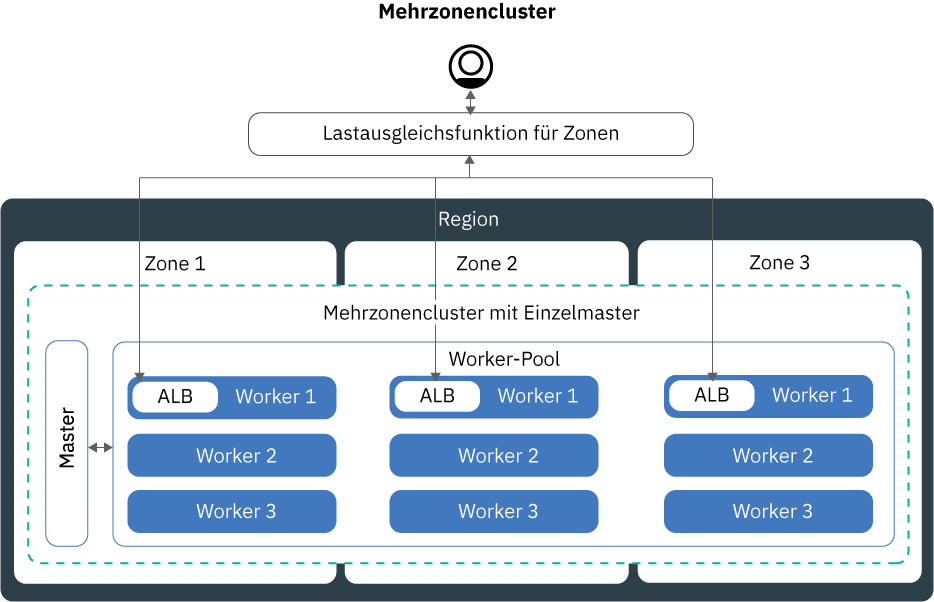

---

copyright:
  years: 2014, 2018
lastupdated: "2018-08-06"

---

{:new_window: target="_blank"}
{:shortdesc: .shortdesc}
{:screen: .screen}
{:pre: .pre}
{:table: .aria-labeledby="caption"}
{:codeblock: .codeblock}
{:tip: .tip}
{:download: .download}


# Cluster einrichten
{: #clusters}

Konzipieren Sie Ihren Kubernetes-Cluster so, dass Sie eine optimale Containerverfügbarkeit und Clusterkapazität mit {{site.data.keyword.containerlong}} erreichen. Machen Sie sich noch mit der Anwendung vertraut? Sehen Sie sich dazu das [Lernprogramm zum Erstellen von Kubernetes-Clustern](cs_tutorials.html#cs_cluster_tutorial) an.
{:shortdesc}

## Mehrzonencluster in {{site.data.keyword.containershort_notm}} erstellen
{: #multizone}

Mit {{site.data.keyword.containerlong}} können Sie Mehrzonencluster erstellen. Die Wahrscheinlichkeit, dass Ihre Benutzer Ausfallzeiten verzeichnen, ist geringer, wenn Sie Ihre Apps mithilfe von Worker-Pools auf mehrere Workerknoten und Zonen verteilen. Integrierte Funktionen wie Lastausgleich und Isolation erhöhen die Ausfallsicherheit bei potenziellen Zonenausfällen mit Hosts, Netzen oder Apps. Wenn Ressourcen in einer Zone inaktiv sind, werden Ihre Clusterworkloads in den anderen Zonen immer noch verarbeitet.
{: shortdesc}

### Hier wird jetzt über Zonen und Pools geredet? Was hat sich geändert?
{: #mz_changed}

**Zonen**, die bisher als Standorte bezeichnet wurden, sind Rechenzentren, in denen Sie IBM Cloud-Ressourcen erstellen können.

Cluster verfügen nun über ein Feature, das als **Worker-Pool** bezeichnet wird. Dabei handelt es sich um eine Sammlung von Workerknoten mit derselben Version, wie Maschinentyp, CPU und Speicher. Mit neuen Befehlen des Typs `ibmcloud ks worker-pool` können Sie Änderungen an Ihrem Cluster vornehmen, z. B. Zonen hinzufügen und Workerknoten hinzufügen oder aktualisieren.

Das bisherige Cluster-Setup mit eigenständigen Workerknoten wird zwar noch unterstützt, jedoch nicht mehr weiterentwickelt. Stellen Sie sicher, dass Sie [einen Worker-Pool zu Ihrem Cluster hinzufügen](cs_clusters.html#add_pool) und anschließend [zur Verwendung von Worker-Pools migrieren](cs_cluster_update.html#standalone_to_workerpool), um Ihre Workerknoten anstelle von eigenständigen Workerknoten zu organisieren.

### Was muss ich wissen, bevor ich anfange?
{: #general_reqs}

Bevor Sie schon zu weit kommen, müssen Sie sich zunächst um einige Verwaltungsaufgaben kümmern, um sicherzustellen, dass Ihre Mehrzonencluster für Workloads bereit sind.

<dl>
<dt>VLANs erforderlich</dt>
  <dd><p>Wenn Sie eine Zone zu einem Worker-Pool hinzufügen, müssen Sie ein privates und ein öffentliches VLAN definieren, zu denen die Workerknoten eine Verbindung herstellen.</p><ul><li>Führen Sie den Befehl `ibmcloud ks vlans <zone>` aus, um zu prüfen, ob in dieser Zone VLANs vorhanden sind, die Sie nutzen können. Notieren Sie die VLAN-IDs und verwenden Sie sie, wenn Sie eine Zone zu einem Worker-Pool hinzufügen. </li>
  <li>Wenn in dieser Zone keine VLANs vorhanden sind, wird automatisch ein privates und ein öffentliches VLAN für Sie erstellt. Sie müssen kein privates und öffentliches VLAN angeben. </li></ul>
  </dd>
<dt>VLAN-Spanning oder VRF aktivieren</dt>
  <dd><p>Ihre Workerknoten müssen im privaten Netz in allen Zonen miteinander kommunizieren. Sie haben zwei Möglichkeiten:</p>
  <ol><li>[Aktivieren Sie VLAN-Spanning](/docs/infrastructure/vlans/vlan-spanning.html#vlan-spanning) für Ihr IBM Cloud-Infrastrukturkonto (SoftLayer). Zum Aktivieren des VLAN-Spannings müssen Sie über die [Infrastrukturberechtigung](/docs/iam/infrastructureaccess.html#infrapermission) <strong>Netz > VLAN-Spanning im Netz verwalten</strong> verfügen oder Sie können den Kontoeigner bitte, diese zu aktivieren.</li>
  <li>Verwenden Sie ein VRF-fähiges (VRF, Virtual Router Function) IBM Cloud-Infrastrukturkonto (SoftLayer). Wenden Sie sich an den Support für die IBM Cloud-Infrastruktur (SoftLayer), um ein VRF-Konto zu erhalten.</li></ol></dd>
<dt>Vorhandene persistente Datenträger vorbereiten</dt>
  <dd><p>Persistente Datenträger können nur in der Zone verwendet werden, in der sich die tatsächliche Speichereinheit befindet. Um unerwartete App-Fehler in einem Mehrzonencluster zu verhindern, müssen Sie Regions- und Zonenbezeichnungen auf vorhandene persistente Datenträger anwenden. Mithilfe dieser Bezeichnungen kann 'kube-scheduler' bestimmen, wo eine App geplant werden soll, die den persistenten Datenträger verwendet. Führen Sie den folgenden Befehl aus und ersetzen Sie <code>&lt;meincluster&gt;</code> durch den Clusternamen:</p>
  <pre class="pre"><code>bash <(curl -Ls https://raw.githubusercontent.com/IBM-Cloud/kube-samples/master/file-pv-labels/apply_pv_labels.sh) <meincluster></code></pre></dd>
<dt>Es sind nur Einzelzonencluster für {{site.data.keyword.Bluemix_dedicated_notm}}-Instanzen verfügbar.</dt>
    <dd>Mit {{site.data.keyword.Bluemix_dedicated_notm}} können Sie nur [Einzelzonencluster](cs_clusters.html#single_zone) erstellen. Die verfügbare Zone wurde vordefiniert, als die {{site.data.keyword.Bluemix_dedicated_notm}}-Umgebung eingerichtet wurde. Standardmäßig wird ein Einzelzonencluster mit einem Worker-Pool konfiguriert, der den Namen `default` hat. Der Worker-Pool gruppiert Workerknoten mit derselben Konfiguration, wie z. B. dem Maschinentyp, die Sie während der Clustererstellung definiert haben. Sie können Ihrem Cluster weitere Workerknoten hinzufügen, indem Sie [die Größe eines vorhandenen Worker-Pools ändern](cs_clusters.html#resize_pool) oder [einen neuen Worker-Pool hinzufügen](cs_clusters.html#add_pool). Wenn Sie einen Worker-Pool hinzufügen, müssen Sie die verfügbare Zone zum Worker-Pool hinzufügen, damit die Worker in der Zone bereitgestellt werden können. Sie können jedoch keine anderen Zonen zu Ihren Worker-Pools hinzufügen.</dd>
</dl>

### Ich bin bereit, einen Mehrzonencluster zu erstellen. Wie kann ich anfangen?
{: #mz_gs}

Beginnen Sie noch heute damit in der [{{site.data.keyword.containershort_notm}}-Konsole](https://console.bluemix.net/containers-kubernetes/clusters), indem Sie auf **Cluster erstellen** klicken.

Sie können einen Cluster in einer der [Städte mit mehreren Zonen](cs_regions.html#zones) erstellen:
* Dallas in der Region 'Vereinigte Staaten (Süden)': dal10, dal12, dal13
* Washington DC in der Region 'Vereinigte Staaten (Osten)': wdc04, wdc06, wdc07
* Frankfurt in der Region 'Zentraleuropa': fra02, fra04, fra05
* London der Region 'Großbritannien (Süden)': lon02, lon04, lon06

**Fügen Sie Zonen zu einem vorhandenen Cluster hinzu**:

Wenn Sie über einen Cluster in einer Stadt mit mehreren Zonen verfügen, können Sie dem Cluster einen Worker-Pool hinzufügen und anschließend eine Zone in diesem Worker-Pool über die GUI (grafische Benutzerschnittstelle) oder die CLI (Befehlszeilenschnittstelle) einfügen. Eine vollständige Liste der Schritte finden Sie im Abschnitt [Von eigenständigen Workerknoten auf Worker-Pools aktualisieren](cs_cluster_update.html#standalone_to_workerpool).

### Wie wird sich das zukünftige Management meiner Cluster vom aktuellen Management unterscheiden?
{: #mz_new_ways}

Mit der Einführung von Worker-Pools können Sie eine neue Gruppe von APIs und Befehlen zum Verwalten des Clusters verwenden. Sie finden diese neuen Befehle auf der [Seite mit der CLI-Dokumentation](cs_cli_reference.html#cs_cli_reference). In Ihrem Terminal können Sie sie durch Ausführen des Befehls `ibmcloud ks help` anzeigen.

In der folgenden Tabelle werden die alten und neuen Methoden für einige allgemeine Aktionen des Cluster-Managements miteinander verglichen.
<table summary="Die Tabelle enthält die Beschreibung der neuen Vorgehensweisen zum Ausführen von Mehrzonenbefehlen. Die Tabellenzeilen enthalten von links nach rechts die Beschreibung in der ersten Spalte, die alte Vorgehensweise in der zweiten Spalte und die neue Vorgehensweise für Worker-Pools mit mehreren Zonen in der dritten Spalte.">
<caption>Neue Methoden für Befehle für Worker-Pools mit mehreren Zonen.</caption>
  <thead>
  <th>Beschreibung</th>
  <th>Alte eigenständige Workerknoten</th>
  <th>Neue Worker-Pools mit mehreren Zonen</th>
  </thead>
  <tbody>
    <tr>
    <td>Hinzufügen von Workerknoten zum Cluster.</td>
    <td><strong>Veraltet</strong>: <code>ibmcloud ks worker-add</code> zum Hinzufügen eigenständiger Workerknoten.</td>
    <td><ul><li>Um andere Maschinentypen als Ihren vorhandenen Pool hinzuzufügen, erstellen Sie einen neuen Worker-Pool: [Befehl <code>ibmcloud ks worker-pool-create</code>](cs_cli_reference.html#cs_worker_pool_create).</li>
    <li>Wenn Sie Workerknoten zu einem vorhandenen Pool hinzufügen möchten, ändern Sie die Anzahl der Knoten pro Zone im Pool: [Befehl <code>ibmcloud ks worker-pool-resize</code>](cs_cli_reference.html#cs_worker_pool_resize).</li></ul></td>
    </tr>
    <tr>
    <td>Entfernen von Workerknoten aus dem Cluster.</td>
    <td><code>ibmcloud ks worker-rm</code>: Sie können diesen Befehl immer noch zum Löschen eines problematischen Workerknoten aus dem Cluster verwenden.</td>
    <td><ul><li>Wenn ein Worker-Pool nicht ausgeglichen ist, z. B. nach dem Entfernen eines Workerknotens, gleichen Sie ihn neu aus: [Befehl <code>ibmcloud ks worker-pool-rebalance</code>](cs_cli_reference.html#cs_rebalance).</li>
    <li>Um die Anzahl der Workerknoten in einem Pool zu reduzieren, ändern Sie die Anzahl pro Zone (Mindestwert '1'): [Befehl <code>ibmcloud ks worker-pool-resize</code>](cs_cli_reference.html#cs_worker_pool_resize).</li></ul></td>
    </tr>
    <tr>
    <td>Verwenden Sie ein neues VLAN für Workerknoten.</td>
    <td><strong>Veraltet</strong>: Fügen Sie einen neuen Workerknoten hinzu, der das neue private oder öffentliche VLAN verwendet: <code>ibmcloud ks worker-add</code>.</td>
    <td>Legen Sie den Worker-Pool so fest, dass er ein anderes öffentliches oder privates VLAN als zuvor verwendet: [Befehl <code>ibmcloud ks zone-network-set</code>](cs_cli_reference.html#cs_zone_network_set).</td>
    </tr>
  </tbody>
  </table>

### Wie kann ich mehr über Mehrzonencluster erfahren?
{: #learn_more}

Die gesamte Dokumentation wurde für die Mehrzonencluster aktualisiert. Insbesondere könnten die folgenden Themen für Sie interessant sein, die sich durch die Einführung von Mehrzonencluster stark geändert haben:
* [Hoch verfügbare Cluster konfigurieren](#ha_clusters)
* [Hoch verfügbare App-Bereitstellungen planen](cs_app.html#highly_available_apps)
* [Apps mit LoadBalancer-Services für Mehrzonencluster zugänglich machen](cs_loadbalancer.html#multi_zone_config)
* [Apps mit Ingress zugänglich machen](cs_ingress.html#ingress)
* Verwenden Sie für hoch verfügbaren persistenten Speicher einen Cloud-Service wie [{{site.data.keyword.cloudant_short_notm}}](/docs/services/Cloudant/getting-started.html#getting-started-with-cloudant) or [{{site.data.keyword.cos_full_notm}}](/docs/services/cloud-object-storage/about-cos.html#about-ibm-cloud-object-storage).

## Hoch verfügbare Cluster konfigurieren
{: #ha_clusters}
Konzipieren Sie Ihren Standardcluster mit {{site.data.keyword.containerlong}} für maximale Verfügbarkeit und Kapazität für Ihre App.

Die Wahrscheinlichkeit, dass Ihre Benutzer Ausfallzeiten verzeichnen, ist geringer, wenn Sie Ihre Apps auf mehrere Workerknoten, Zonen und Cluster verteilen. Integrierte Funktionen wie Lastausgleich (Load Balancing) und Isolation erhöhen die Ausfallsicherheit gegenüber möglichen Fehlerbedingungen mit Hosts, Netzen oder Apps.

Betrachten Sie diese potenziellen Clusterkonfigurationen, die nach zunehmendem Grad der Verfügbarkeit angeordnet sind.


1. Ein [Einzelzonencluster](#single_zone) mit mehreren Workerknoten in einem Worker-Pool.
2. Ein [Mehrzonencluster](#multi_zone), der Workerknoten über Zonen hinweg in einer Region verteilt.
3. [Mehrere Cluster](#multiple_clusters), die über Zonen oder Regionen hinweg eingerichtet werden und über eine globale Lastausgleichsfunktion verbunden sind.

### Einzelzonencluster
{: #single_zone}

Um die Verfügbarkeit für Ihre App zu verbessern und einen Failover für den Fall zu ermöglichen, dass ein Workerknoten in Ihrem Cluster nicht verfügbar ist, fügen Sie Ihrem Einzelzonencluster zusätzliche Workerknoten hinzu.
{: shortdesc}


Standardmäßig wird der Einzelzonencluster mit einem Worker-Pool konfiguriert, der den Namen `default` hat. Der Worker-Pool gruppiert Workerknoten mit derselben Konfiguration, wie z. B. dem Maschinentyp, die Sie während der Clustererstellung definiert haben. Sie können Ihrem Cluster weitere Workerknoten hinzufügen, indem Sie [die Größe eines vorhandenen Worker-Pools ändern](#resize_pool) oder [einen neuen Worker-Pool hinzufügen](#add_pool). 

Wenn Sie weitere Workerknoten hinzufügen, können App-Instanzen auf mehrere Workerknoten verteilt werden. Wenn ein Workerknoten ausfällt, werden die App-Instanzen auf den verfügbaren Workerknoten weiter ausgeführt. Kubernetes plant Pods von nicht verfügbaren Workerknoten automatisch neu, um die Leistung und Kapazität für Ihre App zu gewährleisten. Um sicherzustellen, dass die Pods gleichmäßig auf die Workerknoten verteilt werden, implementieren Sie [Pod-Affinität](https://kubernetes.io/docs/concepts/configuration/assign-pod-node/#inter-pod-affinity-and-anti-affinity-beta-feature).

**Kann ich einen Einzelzonencluster in einen Mehrzonencluster konvertieren?**
Manchmal. Wenn sich Ihr Einzelzonencluster in einer [Metropole mit mehreren Zonen](cs_regions.html#zones) befindet, können Sie den Einzelzonencluster in einen Mehrzonencluster konvertieren. [Fügen Sie dazu eine Zone](#add_zone) zum Worker-Pool des Clusters hinzu. Wenn Sie über mehrere Worker-Pools verfügen, fügen Sie die Zone zu allen Pods hinzu, damit die Workerknoten über den Cluster hinweg ausgeglichen bleiben.

**Muss ich Mehrzonencluster verwenden?**
Nein. Sie können so viele Einzelzonencluster erstellen, wie Sie möchten. Möglicherweise bevorzugen Sie tatsächlich Einzelzonencluster für ein vereinfachtes Management oder für den Fall, dass Ihr Cluster sich in einer bestimmten [Stadt mit einer einzigen Zone](cs_regions.html#zones) befinden muss.

### Mehrzonencluster
{: #multi_zone}

Um Ihren Cluster vor dem Ausfall einer Einzelzonenkonfiguration zu schützen, können Sie Ihre Cluster auf mehrere Zonen in einer Region verteilen.
{: shortdesc}



Sie können zusätzliche Zonen zu Ihrem Cluster hinzufügen, um die Workerknoten in den Worker-Pools über mehrere Zonen in einer Region zu replizieren. Mehrzonencluster sind so konzipiert, dass die Pods gleichmäßig auf die Workerknoten und Zonen verteilt werden, um die Verfügbarkeit und Wiederherstellung nach einem Ausfall zu gewährleisten. Wenn die Workerknoten nicht gleichmäßig über die Zonen verteilt sind oder die Kapazität in einer der Zonen nicht ausreicht, kann der Kubernetes-Scheduler möglicherweise nicht alle angeforderten Pods planen. Daher können Pods in den Status **Anstehend** wechseln, bis eine ausreichende Kapazität verfügbar ist. Wenn Sie das Standardverhalten ändern möchten, damit der Kubernetes-Scheduler Pods in Zonen optimal verteilen kann, verwenden Sie die [Pod-Affinitätsrichtlinie](https://kubernetes.io/docs/concepts/configuration/assign-pod-node/#inter-pod-affinity-and-anti-affinity-beta-feature) `preferredDuringSchedulingIgnoredDuringExecution`.

**Warum benötige ich Workerknoten in drei Zonen?** </br>
Durch die Verteilung der Arbeitslast auf drei Zonen wird die hohe Verfügbarkeit Ihre App für den Fall sichergestellt, dass eine oder zwei Zonen nicht verfügbar sind. Zusätzlich kann eine solche Verteilung Ihr Cluster-Setup auch kosteneffizienter machen. Sie fragen sich, warum das so ist? Hier ist ein Beispiel.

Angenommen, Sie benötigen einen Workerknoten mit sechs Kernen, um die Arbeitslast für Ihre App zu verarbeiten. Für eine höhere Verfügbarkeit Ihres Clusters stehen Ihnen die folgenden Optionen zur Verfügung:

- **Ressourcen in einer anderen Zone duplizieren:** Mit dieser Option erhalten Sie zwei Workerknoten mit jeweils sechs Kernen in jeder Zone, wodurch insgesamt 12 Kerne verfügbar sind. </br>
- **Ressourcen auf drei Zonen verteilen:** Mit dieser Option stellen Sie drei Kerne pro Zone bereit, wodurch Sie eine Gesamtkapazität von neun Kernen erhalten. Um Ihre Arbeitslast verarbeiten zu können, müssen zwei Zonen gleichzeitig aktiv sein. Wenn eine Zone nicht verfügbar ist, können die anderen beiden Zonen die Arbeitslast verarbeiten. Wenn zwei Zonen nicht verfügbar sind, können die drei verbleibenden Kerne die Arbeitslast übernehmen. Durch die Bereitstellung von drei Kernen pro Zone können Sie mit kleineren Maschinen arbeiten und gleichzeitig die Kosten senken.</br>

**Wie kann ich die Verfügbarkeit für meinen Kubernetes-Master erhöhen?** </br>
Ein Mehrzonencluster wird mit einem einzigen Kubernetes-Master eingerichtet, der im selben Metrobereich wie die Worker bereitgestellt wird. Wenn sich die Worker beispielsweise in einer oder mehreren Zonen des Typs `dal10`, `dal12` oder `dal13` befinden, befindet sich der Master in der Metropole 'Dallas' mit mehreren Zonen.

**Was passiert, wenn der Kubernetes-Master nicht mehr verfügbar ist?** </br>
Während der Kubernetes-Master nicht verfügbar ist, können Sie nicht auf Ihren Cluster zugreifen oder diesen ändern. Allerdings werden von Ihnen bereitstellte Workerknoten, Apps und Ressourcen nicht geändert und weiterhin ausgeführt. Um Ihren Cluster vor einem Ausfall des Kubernetes-Masters oder in Regionen zu schützen, in denen Mehrzonencluster nicht verfügbar sind, können Sie [mehrere Cluster einrichten und diese mit einer globalen Lastausgleichsfunktion verbinden](#multiple_clusters).

**Wie kann ich meine Benutzer über das öffentliche Internet auf meine App zugreifen lassen?**</br>
Sie können Ihre Apps über eine Ingress-Lastausgleichsfunktion für Anwendungen (ALB) oder einen LoadBalancer-Service zugänglich machen. Standardmäßig werden öffentliche ALBs automatisch in jeder Zone in Ihrem Cluster erstellt und aktiviert. Außerdem wird auch automatisch eine Lastausgleichsfunktion für mehrere Zonen (MZLB) für Ihren Cluster erstellt und aktiviert. Der MZLB-Status überprüft die ALBs in jeder Zone des Clusters und hält die Ergebnisse der DNS-Suche auf der Basis dieser Diagnossprüfungen aktualisiert. Weitere Informationen finden Sie im Abschnitt zu den hoch verfügbaren [Ingress-Services](cs_ingress.html#planning).

LoadBalancer-Services werden nur in einer Zone eingerichtet. Eingehende Anforderungen an Ihre App werden von dieser einen Zone an alle App-Instanzen in anderen Zonen weitergeleitet. Wenn diese Zone nicht mehr verfügbar ist, ist Ihre App möglicherweise nicht über das Internet erreichbar. Um einem Ausfall einer einzelnen Zone gerecht zu werden, können Sie zusätzliche LoadBalancer-Services in weiteren Zonen einrichten. Weitere Informationen finden Sie im Abschnitt zu den hoch verfügbaren [LoadBalancer-Services](cs_loadbalancer.html#multi_zone_config).

** Ich habe meinen Mehrzonencluster erstellt. Warum gibt es immer noch immer nur eine Zone? Wie füge ich Zonen zu meinem Cluster hinzu?**</br>
Wenn Sie [Ihren Mehrzonencluster mit der CLI erstellen](#clusters_cli), wird der Cluster zwar erstellt, Sie müssen jedoch Zonen zum Worker-Pool hinzufügen, um den Prozess abzuschließen. Damit sich der Cluster über mehrere Zonen erstreckt, muss er sich in einer [Metropole mit mehreren Zonen](cs_regions.html#zones) befinden. Informationen zum Hinzufügen einer Zone zu Ihrem Cluster und zum Verteilen von Workerknoten auf Zonen finden Sie im Abschnitt [Zone zu Ihrem Cluster hinzufügen](#add_zone).

### Mehrere Cluster, die mit einer globalen Lastausgleichsfunktion verbunden sind
{: #multiple_clusters}

Um Ihre App bei einem Ausfall eines Kubernetes-Masters zu schützen und für Regionen, in denen Mehrzonencluster nicht verfügbar sind, können Sie mehrere Cluster in verschiedenen Zonen in einer Region erstellen und diese mit einer globalen Lastausgleichsfunktion verbinden.
{: shortdesc}


Um Ihre Arbeitslast auf mehrere Cluster zu verteilen,müssen Sie eine globale Lastausgleichsfunktion einrichten und die IP-Adressen der Lastausgleichsfunktionen für Anwendungen (ALBs) oder LoadBalancer-Services zu Ihrer Domäne hinzufügen. Durch das Hinzufügen dieser IP-Adressen können Sie eingehenden Datenverkehr zwischen Ihren Clustern weiterleiten. Damit die globale Lastausgleichsfunktion erkennen kann, ob einer der Cluster nicht verfügbar ist, sollten Sie in Betracht ziehen, jeder IP-Adresse eine pingbasierte Statusprüfung hinzuzufügen. Wenn Sie diese Prüfung einrichten, überprüft Ihr DNS-Provider regelmäßig mit Ping die IP-Adressen, die Sie zu Ihrer Domäne hinzugefügt haben. Wenn eine IP-Adresse nicht mehr verfügbar ist, wird der Datenverkehr nicht mehr an diese IP-Adresse gesendet. Kubernetes startet jedoch nicht automatisch erneut Pods von dem nicht verfügbaren Cluster auf Workerknoten in verfügbaren Clustern. Wenn Kubernetes die Pods automatisch in verfügbaren Clustern erneut starten soll, sollten Sie einen [Mehrzonencluster](#multi_zone) einrichten.

**Warum benötige ich drei Cluster in drei Zonen?** </br>
Ähnlich wie bei der Verwendung von [drei Zonen in Mehrzonenclustern](#multi_zone) können Sie mehr Verfügbarkeit für Ihre App bereitstellen, indem Sie drei Cluster über Zonen hinweg einrichten. Sie können auch Kosten reduzieren,, indem Sie sich kleinere Maschinen für die Verarbeitung Ihrer Arbeitslast anschaffen.

**Was ist, wenn ich mehrere Cluster in mehreren Regionen einrichten möchte?** </br>
Sie können mehrere Cluster in verschiedenen Regionen eines geografischen Standortes (wie 'Vereinigte Staaten (Süden)' und 'Vereinigte Staaten (Osten)') oder über geografische Standorte hinweg ('Vereinigte Staaten (Süden)' und 'Zentraleuropa') einrichten. Beide Setups bieten das gleiche Maß an Verfügbarkeit für Ihre App, sind aber bei der gemeinsamen Nutzung von Daten und der Datenreplikation komplexer als andere Lösungen. In den meisten Fällen reicht es aus, am selben geografischen Standort zu bleiben. Wenn Sie jedoch Benutzer auf der ganzen Welt haben, kann es besser sein, einen Cluster dort einzurichten, wo sich Ihre Benutzer befinden, damit diese keine langen Wartezeiten beim Senden einer Anforderung an Ihre App haben.

**Gehen Sie wie folgt vor, um eine globale Lastausgleichsfunktion für mehrere Cluster einzurichten:**

1. [Erstellen Sie Cluster](cs_clusters.html#clusters) in mehreren Zonen oder Regionen.
2. Aktivieren Sie [VLAN-Spanning](/docs/infrastructure/vlans/vlan-spanning.html#vlan-spanning) für das Konto Ihrer IBM Cloud-Infrastruktur (SoftLayer), damit die Workerknoten im privaten Netz miteinander kommunizieren können. Um diese Aktion durchführen zu können, müssen Sie über die [Infrastrukturberechtigung](cs_users.html#infra_access) **Netz > VLAN-Spanning im Netz verwalten** verfügen oder Sie können den Kontoeigner bitte, diese zu aktivieren. Als Alternative zum VLAN-Spanning können Sie eine VRF-Funktion (Virtual Router Function) verwenden, wenn diese in Ihrem IBM Cloud-Infrastrukturkonto (SoftLayer) aktiviert ist.
3. Stellen Sie in jedem Cluster Ihre App mit einer [Lastausgleichsfunktion für Anwendungen (ALB)](cs_ingress.html#ingress_expose_public) oder einem [LoadBalancer-Service](cs_loadbalancer.html#config) bereit.
4. Listen Sie für jeden Cluster die öffentlichen IP-Adressen für Ihre ALBs oder LoadBalancer-Services auf.
   - Gehen Sie wie folgt vor, um die IP-Adresse aller öffentlichen aktivierten ALBs in Ihrem Cluster aufzulisten:
     ```
     ibmcloud ks albs --cluster <clustername_oder_-id>
     ```
     {: pre}

   - Gehen Sie wie folgt vor, um die IP-Adresse für den LoadBalancer-Service aufzulisten:
     ```
     kubectl describe service <mein_service>
     ```
     {: pre}

     Die IP-Adresse für **Load Balancer Ingress** ist die portierbare IP-Adresse, die dem LoadBalancer-Service zugewiesen wurde.
4. Richten Sie eine globale Lastausgleichsfunktion ein, indem Sie {{site.data.keyword.Bluemix_notm}} Internet Services (CIS) verwenden oder eine eigene globale Lastausgleichsfunktion einrichten.
    * Gehen Sie wie folgt vor, um eine globale CIS-Lastausgleichsfunktion zu verwenden:
        1. Richten Sie den Service ein, indem Sie die Schritte 1 bis 4 in der [Einführung in {{site.data.keyword.Bluemix_notm}} Internet Services (CIS)](/docs/infrastructure/cis/getting-started.html#getting-started-with-ibm-cloud-internet-services-cis-) ausführen.
            * Die Schritte 1 bis 3 führen Sie durch die Bereitstellung der Serviceinstanz, das Hinzufügen Ihrer App-Domäne und die Konfiguration Ihrer Namensserver.
            * Schritt 4 führt Sie durch die Erstellung von DNS-Datensätzen. Erstellen Sie einen DNS-Datensatz für alle IP-Adressen der ALBs oder Lastausgleichsfunktionen, die Sie erfasst haben. Diese DNS-Datensätze ordnen Ihre App-Domäne allen Ihren Cluster-ALBs oder Lastausgleichsfunktionen zu und stellen sicher, dass Anforderungen an Ihre App-Domäne in einem Umlaufzyklus an Ihre Cluster weitergeleitet werden.
        2. [Fügen Sie Statusprüfungen](/docs/infrastructure/cis/glb-setup.html#add-a-health-check) für die ALBs oder die Lastausgleichsfunktionen hinzu. Sie können dieselbe Statusprüfung für die ALBs oder Lastausgleichsfunktionen in allen Clustern verwenden oder bestimmte Statusprüfungen erstellen, die für bestimmte Cluster verwendet werden.
        3. [Fügen Sie einen Ursprungspool](/docs/infrastructure/cis/glb-setup.html#add-a-pool) für jeden Cluster hinzu, indem Sie die ALB- oder Lastausgleichsfunktions-IPs des Clusters hinzufügen. Wenn Sie beispielsweise über drei Cluster mit jeweils zwei ALBs verfügen, erstellen Sie drei Ursprungspools, die jeweils zwei ALB-IP-Adressen aufweisen. Fügen Sie jedem Ursprungspool, den Sie erstellen, eine Statusprüfung hinzu.
        4. [Fügen Sie eine globale Lastausgleichsfunktion hinzu](/docs/infrastructure/cis/glb-setup.html#set-up-and-configure-your-load-balancers).
    * Gehen Sie wie folgt vor, um Ihre eigene globale Lastausgleichsfunktion zu verwenden:
        1. Konfigurieren Sie Ihre Domäne für die Weiterleitung des eingehenden Datenverkehrs an Ihre ALB oder LoadBalancer-Services, indem Sie die IP-Adressen aller öffentlichen aktivierten ALBs und LoadBalancer-Services in Ihre Domäne hinzufügen.
        2. Aktivieren Sie für jede IP-Adresse eine pingbasierte Statusüberprüfung, damit Ihr DNS-Provider fehlerhafte IP-Adressen erkennen kann. Wird eine fehlerhafte IP-Adresse erkannt, wird der Datenverkehr nicht mehr an diese IP-Adresse weitergeleitet.

## Konfiguration von Workerknoten planen
{: #planning_worker_nodes}

Ein Kubernetes-Cluster besteht aus Workerknoten, die in Worker-Pools gruppiert sind und zentral vom Kubernetes-Master überwacht und verwaltet werden. Clusteradministratoren entscheiden, wie sie den Cluster aus Workerknoten einrichten, um sicherzustellen, dass den Clusterbenutzern alle Ressourcen für die Bereitstellung und Ausführung von Apps im Cluster zur Verfügung stehen.
{:shortdesc}

Wenn Sie einen Standardcluster erstellen, werden die Workerknoten derselben Konfiguration in Ihrer IBM Cloud-Infrastruktur (SoftLayer) in Ihrem Namen bestellt und dem Standard-Worker-Pool in Ihrem Cluster hinzugefügt. Jedem Workerknoten werden eine eindeutige Workerknoten-ID und ein Domänenname zugewiesen, die nach dem Erstellen des Clusters nicht geändert werden dürfen.

Sie können zwischen virtuellen oder physischen Servern (Bare-Metal-Servern) wählen. Abhängig von dem ausgewählten Grad an Hardware-Isolation können virtuelle Workerknoten als gemeinsam genutzte oder als dedizierte Knoten eingerichtet werden. Außerdem können Sie auswählen, ob Workerknoten mit einem öffentlichen und einem privaten VLAN verbunden werden sollen oder nur mit einem privaten VLAN. Jeder Workerknoten wird mit einem bestimmten Maschinentyp bereitgestellt, der die Anzahl von vCPUs sowie die Menge an Haupt- und an Plattenspeicher festlegt, die den auf Ihrem Workerknoten bereitgestellten Containern zur Verfügung stehen. Kubernetes beschränkt die maximale Anzahl von Workerknoten, die in einem Cluster vorhanden sein können. Weitere Informationen finden Sie unter [Worker node and pod quotas ](https://kubernetes.io/docs/setup/cluster-large/).

### Worker-Pools
{: #worker_pools}

Jeder Cluster wird mit einen Standard-Worker-Pool eingerichtet, der Workerknoten mit derselben Konfiguration gruppiert, wie z. B. dem Maschinentyp, die Sie während der Clustererstellung definiert haben. Wenn Sie einen Cluster über die Benutzerschnittstelle bereitstellen, können Sie mehrere Zonen gleichzeitig auswählen. Cluster, die über die CLI erstellt werden, werden zunächst nur in einer einzigen Zone mit einem Worker-Pool bereitgestellt. Sie können Ihrem Worker-Pool weitere Zonen hinzufügen, nachdem der Cluster bereitgestellt wurde, um Workerknoten gleichmäßig über Zonen hinweg zu replizieren. Wenn Sie beispielsweise eine zweite Zone zu einem Worker-Pool hinzufügen, der aus drei Workerknoten besteht, dann werden drei Workerknoten in der zweiten Zone bereitgestellt, wodurch Sie einen Cluster mit insgesamt sechs Workerknoten erhalten.

Um die Kommunikation zwischen Workern, die sich in unterschiedlichen Zonen befinden, im privaten Netz zu aktivieren, müssen Sie das [VLAN-Spanning](/docs/infrastructure/vlans/vlan-spanning.html#vlan-spanning) aktivieren. Wenn Sie Ihrem Cluster unterschiedliche Maschinentypen hinzufügen möchten, [erstellen Sie einen weiteren Worker-Pool](cs_cli_reference.html#cs_worker_pool_create).

### Hardware für Workerknoten
{: #shared_dedicated_node}

Wenn Sie einen Standardcluster in {{site.data.keyword.Bluemix_notm}} erstellen, wählen Sie Ihre Workerknoten als physische Maschinen (Bare-Metal) oder als virtuelle Maschinen, die auf physischer Hardware ausgeführt werden, aus. Wenn Sie einen kostenlosen Cluster erstellen, wird Ihr Workerknoten automatisch als gemeinsam genutzter, virtueller Knoten im Konto der IBM Cloud-Infrastruktur (SoftLayer) bereitgestellt.
{:shortdesc}


Überprüfen Sie die folgenden Informationen, um zu entscheiden, welchen Typ Worker-Pool Sie benötigen. Berücksichtigen Sie bei Ihrer Planung [das Limit des Mindestschwellenwerts für den Workerknoten](#resource_limit_node) von 10 % der Gesamtspeicherkapazität.

<dl>
<dt>Warum sollte ich physische Maschinen (Bare-Metal) verwenden?</dt>
<dd><p><strong>Mehr Berechnungsressourcen</strong>: Sie können Ihre Workerknoten als physischen Single-Tenant Server bereitstellen, der auch als Bare-Metal-Server bezeichnet wird. Mit Bare-Metal haben Sie direkten Zugriff auf die physischen Ressourcen auf der Maschine, wie z. B. Speicher oder CPU. Durch diese Konfiguration wird der Hypervisor der virtuellen Maschine entfernt, der physische Ressourcen zu virtuellen Maschinen zuordnet, die auf dem Host ausgeführt werden. Stattdessen sind alle Ressourcen der Bare-Metal-Maschine ausschließlich dem Worker gewidmet, also müssen Sie sich keine Sorgen machen, dass "lärmende Nachbarn" Ressourcen gemeinsam nutzen oder die Leistung verlangsamen. Physische Maschinentypen verfügen über einen größeren lokalen Speicher als virtuelle und einige verfügen zudem über RAID für die Sicherung lokaler Daten.</p>
<p><strong>Monatliche Abrechnung</strong>: Die Nutzung von Bare-Metal-Servern ist teurer als die Nutzung virtueller Server. Bare-Metal-Server eignen sich für Hochleistungsanwendungen, die mehr Ressourcen und mehr Hoststeuerung benötigen. Die Abrechnung für Bare-Metal-Server erfolgt monatlich. Wenn Sie einen Bare-Metal-Server vor Monatsende stornieren, werden Ihnen die Kosten bis zum Ende dieses Monats belastet. Das Buchen und Stornieren von Bare-Metal-Servern ist ein manueller Prozess in Ihrem IBM Cloud-Infrastrukturkonto (SoftLayer). Er kann länger als einen Geschäftstag dauern.</p>
<p><strong>Option zum Aktivieren von Trusted Compute</strong>: Aktivieren Sie Trusted Compute, um Ihre Workerknoten auf Manipulation zu überprüfen. Wenn Sie Trusted Compute während der Clustererstellung nicht aktivieren, dies jedoch später nachholen möchten, können Sie den [Befehl](cs_cli_reference.html#cs_cluster_feature_enable) `ibmcloud ks feature-enable` verwenden. Nachdem Sie Trusted Compute aktiviert haben, können Sie es später nicht mehr inaktivieren. Sie können einen neuen Cluster ohne Trusted Compute erstellen. Weitere Informationen zur Funktionsweise von Trusted Compute während des Startprozesses für den Knoten finden Sie in [{{site.data.keyword.containershort_notm}} mit Trusted Compute](cs_secure.html#trusted_compute). Trusted Compute ist nur auf Clustern mit Kubernetes Version 1.9 oder höher verfügbar, die bestimmte Bare-Metal-Maschinentypen aufweisen. Bei der Ausführung des [Befehls `ibmcloud ks machine-types <zone>`](cs_cli_reference.html#cs_machine_types) können Sie im Feld **Trustable** ablesen, welche Maschinen Trusted Compute unterstützen. Beispielsweise unterstützen die GPU-Typen `mgXc` Trusted Compute nicht.</p></dd>
<dt>Warum sollte ich virtuelle Maschinen verwenden?</dt>
<dd><p>Virtuelle Maschinen bieten eine größere Flexibilität, schnellere Bereitstellungszeiten und mehr automatische Skalierbarkeitsfunktionen als Bare-Metal-Maschinen und sind zudem kostengünstiger. Sie können virtuelle Maschinen für die meisten allgemeinen Anwendungsfälle, wie Test- und Entwicklungsumgebungen, Staging- und Produktionsumgebungen, Mikroservices und Business-Apps, verwenden. Allerdings müssen bei der Leistung Kompromisse gemacht werden. Wenn Sie für RAM-, GPU- oder datenintensive Arbeitslasten eine Datenverarbeitung mit hoher Leistung benötigen, verwenden Sie Bare-Metal-Maschinen.</p>
<p><strong>Auswahl zwischen Single-Tenant- oder Multi-Tenant-Konfiguration</strong>: Wenn Sie einen virtuellen Standardcluster erstellen, müssen Sie auswählen, ob die zugrunde liegende Hardware von mehreren {{site.data.keyword.IBM_notm}} Kunden gemeinsam genutzt werden kann (Multi-Tenant-Konfiguration) oder ob Sie die ausschließlich Ihnen vorbehaltene, dedizierte Nutzung vorziehen (Single-Tenant-Konfiguration).</p>
<p>Bei einer Multi-Tenant-Konfiguration werden physische Ressourcen wie CPU und Speicher von allen virtuellen Maschinen, die auf derselben physischen Hardware bereitgestellt wurden, gemeinsam genutzt. Um sicherzustellen, dass jede virtuelle Maschine unabhängig von anderen Maschinen ausgeführt werden kann, segmentiert ein VM-Monitor, d. h. eine Überwachungsfunktion für virtuelle Maschinen, die auch als Hypervisor bezeichnet wird, die physischen Ressourcen in isolierte Entitäten und ordnet diese einer virtuellen Maschine als dedizierte Ressourcen zu. Dies wird als Hypervisor-Isolation bezeichnet.</p>
<p>Bei einer Single-Tenant-Konfiguration ist die Nutzung aller physischen Ressourcen ausschließlich Ihnen vorbehalten. Sie können mehrere Workerknoten als virtuelle Maschinen auf demselben physischen Host bereitstellen. Ähnlich wie bei der Multi-Tenant-Konfiguration stellt der Hypervisor auch hier sicher, dass jeder Workerknoten seinen Anteil an den verfügbaren physischen Ressourcen erhält.</p>
<p>Gemeinsam genutzte Knoten sind in der Regel kostengünstiger als dedizierte Knoten, weil die Kosten für die ihnen zugrunde liegende Hardware von mehreren Kunden getragen werden. Bei der Entscheidungsfindung hinsichtlich gemeinsam genutzter Knoten versus dedizierter Knoten sollten Sie mit Ihrer Rechtsabteilung Rücksprache halten, um zu klären, welcher Grad an Infrastrukturisolation und Compliance für Ihre App-Umgebung erforderlich ist.</p>
<p><strong>Virtuelle `u2c`- oder `b2c`-Maschinentypen</strong>: Diese Maschinen verwenden lokale Platten anstelle von SAN (Storage Area Networking) für die Zuverlässigkeit. Zu den Vorteilen zählen ein höherer Durchsatz beim Serialisieren von Bytes für die lokale Festplatte und weniger Beeinträchtigungen des Dateisystems aufgrund von Netzausfällen. Diese Maschinentypen enthalten 25 GB primären lokalen Plattenspeicher für das Dateisystem des Betriebssystems und 100 GB sekundären lokalen Plattenspeicher für Daten aus der Laufzeitengine des Containers und aus 'kubelet'.</p>
<p><strong>Was passiert, wenn ich über veraltete `u1c`- oder `b1c`-Maschinentypen verfüge?</strong> Zu Beginn der Verwendung von `u2c`- und `b2c`-Maschinentypen [aktualisieren Sie die Maschinentypen durch Hinzufügen von Workerknoten](cs_cluster_update.html#machine_type).</p></dd>
<dt>Welche Typen von virtuellen und physischen Maschinen stehen zur Auswahl?</dt>
<dd><p>Viele! Wählen Sie den Maschinentyp aus, der am besten für Ihren Anwendungsfall geeignet ist. Denken Sie daran, dass sich ein Worker-Pool aus Maschinen desselben Typs zusammensetzt. Wenn Sie mit einer Mischung aus Maschinentypen in Ihrem Cluster arbeiten möchten, erstellen Sie für jeden Typ einen eigenen Worker-Pool.</p>
<p>Maschinentypen variieren je nach Zone. Um die in Ihrer Zone verfügbaren Maschinentypen anzuzeigen, führen Sie den Befehl `ibmcloud ks machine-types <zone_name>` aus.</p>
<p><table>
<caption>Verfügbare physische (Bare-Metal) und virtuelle Maschinentypen in {{site.data.keyword.containershort_notm}}.</caption>
<thead>
<th>Name und Anwendungsfall</th>
<th>Kerne/Speicher</th>
<th>Primäre/Sekundäre Platte</th>
<th>Netzgeschwindigkeit</th>
</thead>
<tbody>
<tr>
<td><strong>Virtuell, u2c.2x4</strong>: Verwenden Sie diese kompakte virtuelle Maschine für Schnelltests, Machbarkeitsnachweise und weitere leichte Workloads.</td>
<td>2/4 GB</td>
<td>25 GB/100 GB</td>
<td>1000 MB/s</td>
</tr>
<tr>
<td><strong>Virtuell, b2c.4x16</strong>: Wählen Sie diese ausgeglichene virtuelle Maschine für Tests und Entwicklung und weitere leichte Workloads.</td>
<td>4/16 GB</td>
<td>25 GB/100 GB</td>
<td>1000 MB/s</td>
</tr>
<tr>
<td><strong>Virtuell, b2c.16x64</strong>: Wählen Sie diese ausgeglichene virtuelle Maschine für mittlere Workloads aus.</td></td>
<td>16/64 GB</td>
<td>25 GB/100 GB</td>
<td>1000 MB/s</td>
</tr>
<tr>
<td><strong>Virtuell, b2c.32x128</strong>: Wählen Sie diese ausgeglichene virtuelle Maschine für mittlere bis große Workloads, wie eine Datenbank und eine dynamische Website mit vielen gleichzeitigen Benutzern, aus.</td></td>
<td>32/128 GB</td>
<td>25 GB/100 GB</td>
<td>1000 MB/s</td>
</tr>
<tr>
<td><strong>Virtuell, b2c.56x242</strong>: Wählen Sie diese ausgeglichene virtuelle Maschine für große Workloads, wie eine Datenbank und mehrere Apps mit vielen gleichzeitigen Benutzern, aus.</td></td>
<td>56/242 GB</td>
<td>25 GB/100 GB</td>
<td>1000 MB/s</td>
</tr>
<tr>
<td><strong>RAM-intensiv, Bare-Metal, mr1c.28x512</strong>: Maximieren Sie den verfügbaren RAM-Speicher für Ihre Workerknoten.</td>
<td>28/512 GB</td>
<td>2 TB SATA/960 GB SSD</td>
<td>10000 MB/s</td>
</tr>
<tr>
<td><strong>GPU, Bare-Metal, mg1c.16x128</strong>: Wählen Sie diesen Typ für rechenintensive Workloads, wie Datenverarbeitungen mit hoher Leistung, maschinelles Lernen oder 3D-Anwendungen, aus. Dieser Typ verfügt über eine physische Tesla K80-Karte mit zwei GPUs (Graphics Processing Units) pro Karte für insgesamt zwei GPUs.</td>
<td>16/128 GB</td>
<td>2 TB SATA/960 GB SSD</td>
<td>10000 MB/s</td>
</tr>
<tr>
<td><strong>GPU, Bare-Metal, mg1c.28x256</strong>: Wählen Sie diesen Typ für rechenintensiv Workloads, wie Datenverarbeitungen mit hoher Leistung, maschinelles Lernen oder 3D-Anwendungen, aus. Dieser Typ verfügt über zwei physische Tesla K80-Karten, die zwei GPUs (Graphics Processing Units) pro Karte für insgesamt vier GPUs aufweisen.</td>
<td>28/256 GB</td>
<td>2 TB SATA/960 GB SSD</td>
<td>10000 MB/s</td>
</tr>
<tr>
<td><strong>Datenintensiv, Bare-Metal, md1c.16x64.4x4tb</strong>: Wählen Sie diesen Typ aus, wenn Sie eine bedeutende Menge an lokalem Festplattenspeicherplatz, einschließlich RAID, für die Sicherung der lokal auf der Maschine gespeicherten Daten benötigen. Dieser Typ eignet sich für Anwendungsfälle wie verteilte Dateisysteme, große Datenbanken und Workloads für Big-Data-Analysen.</td>
<td>16/64 GB</td>
<td>2 x 2 TB RAID1/4 x 4 TB SATA RAID10</td>
<td>10000 MB/s</td>
</tr>
<tr>
<td><strong>Datenintensiv, Bare-Metal, md1c.28x512.4x4tb</strong>: Wählen Sie diesen Typ aus, wenn Sie eine bedeutende Menge an lokalem Festplattenspeicherplatz, einschließlich RAID, für die Sicherung der lokal auf der Maschine gespeicherten Daten benötigen. Dieser Typ eignet sich für Anwendungsfälle wie verteilte Dateisysteme, große Datenbanken und Workloads für Big-Data-Analysen.</td>
<td>28/512 GB</td>
<td>2 x 2 TB RAID1/4 x 4 TB SATA RAID10</td>
<td>10000 MB/s</td>
</tr>
<tr>
<td><strong>Ausgeglichen, Bare-Metal, mb1c.4x32</strong>: Verwenden Sie diesen Typ für ausgeglichene Workloads, für die mehr Ressourcen für die Datenverarbeitung benötigt werden, als virtuelle Maschinen bieten können.</td>
<td>4/32 GB</td>
<td>2 TB SATA/2 TB SATA</td>
<td>10000 MB/s</td>
</tr>
<tr>
<td><strong>Ausgeglichen, Bare-Metal, mb1c.16x64</strong>: Verwenden Sie diesen Typ für ausgeglichene Workloads, für die mehr Ressourcen für die Datenverarbeitung benötigt werden, als virtuelle Maschinen bieten können.</td>
<td>16/64 GB</td>
<td>2 TB SATA/960 GB SSD</td>
<td>10000 MB/s</td>
</tr>
</tbody>
</table>
</p>
</dd>
</dl>


Sie können Cluster mithilfe der [Konsolen-UI](#clusters_ui) oder mithilfe der [CLI](#clusters_cli) bereitstellen.

### VLAN-Verbindung für Workerknoten
{: #worker_vlan_connection}

Bei der Clustererstellung wird jeder Cluster automatisch mit einem VLAN in Ihrem Konto der IBM Cloud-Infrastruktur (SoftLayer) verbunden.
{:shortdesc}

Ein VLAN konfiguriert eine Gruppe von Workerknoten und Pods so, als wären diese an dasselbe physische Kabel angeschlossen.
* Im öffentlichen VLAN werden automatisch zwei Teilnetze bereitgestellt. Das primäre öffentliche Teilnetz bestimmt, welche öffentliche IP-Adresse einem Workerknoten während der Clustererstellung zugewiesen wird und das portierbare öffentliche Teilnetz stellt öffentliche IP-Adressen für Ingress-Netzservices und Netzservices für die Lastausgleichsfunktion bereit.
* Im privaten VLAN werden auch automatisch zwei Teilnetze bereitgestellt. Das primäre private Teilnetz bestimmt, welche private IP-Adresse einem Workerknoten während der Clustererstellung zugewiesen wird und das portierbare private Teilnetz stellt private IP-Adressen für Ingress-Netzservices und Netzservices für die Lastausgleichsfunktion bereit.

Bei kostenlosen Clustern werden die Workerknoten des Clusters während der Clustererstellung mit einem IBM eigenen öffentlichen VLAN und privaten VLAN verbunden.

Wenn Sie zum ersten Mal einen Cluster in einer Zone erstellen, werden bei Standardclustern automatisch ein öffentliches und ein privates VLAN für Sie bereitgestellt. Für jeden nachfolgenden Cluster, den Sie in dieser Zone erstellen, wählen Sie die VLANs aus, die Sie verwenden möchten. Sie können Ihre Workerknoten entweder mit einem öffentlichen und einem privaten VLAN verbinden oder nur mit einem privaten VLAN. Wenn Ihre Workerknoten nur mit einem privaten VLAN verbunden werden sollen, können Sie die ID eines vorhandenen privaten VLANs verwenden oder [ein privates VLAN erstellen](/docs/cli/reference/softlayer/index.html#sl_vlan_create) und die ID während der Clustererstellung verwenden. enn Workerknoten nur mit einem privaten VLAN eingerichtet werden, müssen Sie eine alternative Lösung für die Netzkonnektivität, wie eine [Virtual Router Appliance](cs_vpn.html#vyatta), konfigurieren, damit die Workerknoten mit dem Master kommunizieren können.

**Hinweis**: Wenn Sie über mehrere VLANs für ein Cluster oder über mehrere Teilnetze in demselben VLAN verfügen, müssen Sie VLAN-Spanning aktivieren, damit die Workerknoten in dem privaten Netz miteinander kommunizieren können. Entsprechende Anweisungen finden Sie in [VLAN-Spanning aktivieren oder inaktivieren](/docs/infrastructure/vlans/vlan-spanning.html#vlan-spanning).

### Speicherbegrenzung für Workerknoten
{: #resource_limit_node}

{{site.data.keyword.containershort_notm}} legt für jeden Workerknoten eine Speicherbegrenzung fest. Wenn Pods, die auf einem Workerknoten ausgeführt werden, diese Speicherbegrenzung überschreiten, werden die Pods entfernt. In Kubernetes wird diese Begrenzung als [harte Räumungsschwelle ](https://kubernetes.io/docs/tasks/administer-cluster/out-of-resource/#hard-eviction-thresholds) bezeichnet.
{:shortdesc}

Wenn Ihre Pods häufig entfernt werden, fügen Sie zusätzliche Workerknoten zu Ihrem Cluster hinzu oder legen Sie [Ressourcenbegrenzungen ](https://kubernetes.io/docs/concepts/configuration/manage-compute-resources-container/#resource-requests-and-limits-of-pod-and-container) für die Pods fest.

**Jede Maschine hat einen Mindestschwellenwert, der 10 % der Gesamtspeicherkapazität entspricht**. Wenn weniger Speicher auf dem Workerknoten als der zulässige Mindestschwellenwert verfügbar ist, entfernt Kubernetes den Pod sofort. Wenn ein anderer Workerknoten verfügbar ist, wird die Planung für den Pod auf diesem Workerknoten neu erstellt. Wenn Sie beispielsweise mit einer virtuellen Maschine des Typs `b2c.4x16` arbeiten, ist die Gesamtspeicherkapazität dieser Maschine 16 GB. Wenn weniger als 1600 MB (10 %) Speicher verfügbar ist, können neue Pods nicht auf diesem Workerknoten terminiert werden, sondern werden auf einem anderen Workerknoten terminiert. Wenn kein anderer Workerknoten verfügbar ist, können die neuen Workerknoten nicht terminiert werden.

Um zu sehen, wie viel Speicher auf dem Workerknoten belegt ist, führen Sie [kubectl top node ](https://kubernetes.io/docs/reference/kubectl/overview/#top) aus.

### Automatische Wiederherstellung für Ihren Workerknoten
`Docker`, `kubelet`, `kube-proxy` und `calico` sind wichtige Komponenten, die funktionieren müssen, damit die Kubernetes-Workerknoten einen einwandfreiem Zustand aufweisen. Im Laufe der Zeit können diese Komponenten kaputt gehen und ihre Workerknoten möglicherweise in einem nicht funktionsbereiten Zustand versetzen. Nicht funktionsbereite Workerknoten verringern die Gesamtkapazität des Clusters und können zu Ausfallzeiten für Ihre App führen.

Sie können [Statusprüfungen für Ihre Workerknoten konfigurieren und die automatische Wiederherstellung aktiveren](cs_health.html#autorecovery). Wenn die automatische Wiederherstellung basierend auf den konfigurierten Prüfungen einen nicht ordnungsgemäß funktionierenden Workerknoten erkennt, löst das System eine Korrekturmaßnahme, wie das erneute Laden des Betriebssystems, auf dem Workerknoten aus. Weitere Informationen zur Funktionsweise der automatischen Wiederherstellung finden Sie im [Blogbeitrag zur automatischen Wiederherstellung](https://www.ibm.com/blogs/bluemix/2017/12/autorecovery-utilizes-consistent-hashing-high-availability/).

<br />


## Cluster über die GUI erstellen
{: #clusters_ui}

Der Zweck des Kubernetes-Clusters besteht darin, eine Gruppe von Ressourcen, Knoten, Netzen und Speichereinheiten zu definieren, die die Hochverfügbarkeit von Apps sicherstellen. Bevor Sie eine App bereitstellen können, müssen Sie zunächst einen Cluster erstellen und die Definitionen für die Workerknoten in diesem Cluster festlegen.
{:shortdesc}

**Vorbereitende Schritte**

Sie müssen über ein Testkonto, ein nutzungsabhängiges Konto oder ein Abonnementkonto als [{{site.data.keyword.Bluemix_notm}}-Konto](https://console.bluemix.net/registration/) verfügen.

Um Ihre Cluster mit der Hardwareisolation, der Zone, der API-Version Ihrer Wahl usw. umfassend anzupassen, erstellen Sie zunächst einen Standardcluster.
{: tip}

**Gehen Sie wie folgt vor, um einen kostenlosen Cluster zu erstellen**

Sie können sich mit Ihrem kostenlosen Cluster mit der Funktionsweise von {{site.data.keyword.containershort_notm}} vertraut machen. Mit kostenlosen Clustern können Sie die Terminologie kennenlernen, das Lernprogramm ausführen und sich mit der Anwendung vertraut machen, bevor Sie den Sprung zu Standardclustern auf Produktebene wagen. Auch bei einem nutzungsabhängigen Konto oder einem Abonnementkonto erhalten Sie einen kostenlosen Cluster. **Hinweis**: Kostenlose Cluster sind 21 Tage lang gültig. Nach Ablauf dieser Zeit verfällt der Cluster und der Cluster und seine Daten werden gelöscht. Die gelöschten Daten werden nicht von {{site.data.keyword.Bluemix_notm}} gesichert und können nicht wiederhergestellt werden. Stellen Sie sicher, dass alle wichtigen Daten gesichert werden.

1. Wählen Sie im Katalog die Option **{{site.data.keyword.containershort_notm}}** aus.

2. Wählen Sie eine Region aus, in der Ihr Cluster bereitgestellt werden soll.

3. Wählen Sie den **kostenlosen** Clusterplan aus.

4. Geben Sie Ihrem Cluster einen Namen. Der Name muss mit einem Buchstaben beginnen, darf Buchstaben, Ziffern und den Bindestrich (-) enthalten und darf maximal 35 Zeichen lang sein. Der vollständig qualifizierte Domänenname für die Ingress-Unterdomäne setzt sich aus dem Clusternamen und der Region zusammen, in der der Cluster bereitgestellt wird. Um sicherzustellen, dass die Ingress-Unterdomäne innerhalb einer Region eindeutig ist, wird der Clustername möglicherweise abgeschnitten und es wird ein beliebiger Wert innerhalb des Ingress-Domänennamens angehängt.


5. Klicken Sie auf **Cluster einrichten**. Standardmäßig wird ein Worker-Pool mit einem Workerknoten erstellt. Auf der Registerkarte **Workerknoten** können Sie den Fortschritt der Bereitstellung des Workerknotens überprüfen. Nach Abschluss der Bereitstellung können Sie auf der Registerkarte **Übersicht** sehen, dass Ihr Cluster bereit ist.

    Wenn die eindeutige ID oder der Domänenname geändert wird, die/der während der Erstellung zugeordnet wird, kann der Kubernetes-Master Ihren Cluster nicht mehr verwalten.
    {: tip}

</br>

**Gehen Sie wie folgt vor, um einen Standardcluster zu erstellen**:

1. Wählen Sie im Katalog die Option **{{site.data.keyword.containershort_notm}}** aus.

2. Wählen Sie eine Region aus, in der Ihr Cluster bereitgestellt werden soll. Wählen Sie die Region aus, die Ihrem Standort am nächsten ist, um eine optimale Leistung zu erhalten. Wenn Sie eine Zone auswählen, die sich außerhalb Ihres Landes befindet, müssen Sie daran denken, dass Sie vor dem Speichern der Daten möglicherweise eine entsprechende Berechtigung benötigen.

3. Wählen Sie den **Standard**-Cluster-Plan aus. Bei einem Standardcluster erhalten Sie Zugriff auf Features wie beispielsweise mehrere Workerknoten für eine hoch verfügbare Umgebung.

4. Geben Sie Ihre Zonendetails ein.

    1. Wählen Sie für die Verfügbarkeit die Option für **Einzelzonencluster** oder **Mehrzonencluster** aus. In einem Mehrzonencluster wird der Masterknoten in einer auf mehrere Zonen ausgelegten Zone bereitgestellt und die Ressourcen Ihres Clusters werden auf mehrere Zonen verteilt. Ihre Auswahl kann durch die Region begrenzt werden.

    2. Wählen Sie die Zonen aus, in denen der Cluster als Host für den Cluster verwendet werden soll. Sie müssen mindestens eine Zone auswählen, können jedoch so viele Zonen auswählen, wie Sie möchten. Wenn Sie mehr als eine Zone auswählen, werden die Workerknoten auf die Zonen verteilt, die Sie auswählen, wodurch eine höhere Verfügbarkeit erzielt werden kann. Wenn Sie nur eine Zone auswählen, [fügen Sie Zonen zu Ihrem Cluster hinzu](#add_zone), nachdem dieser erstellt wurde.

    3. Wählen Sie ein öffentliches VLAN (optional) und ein privates VLAN (erforderlich) in Ihrem IBM Cloud-Infrastrukturkonto (SoftLayer) aus. Workerknoten kommunizieren miteinander, indem sie das private VLAN verwenden. Um mit dem Kubernetes-Master kommunizieren zu können, müssen Sie die öffentliche Konnektivität für Ihren Workerknoten konfigurieren. Wenn Sie in dieser Zone kein privates oder öffentliches VLAN haben, geben Sie diese Option nicht an. Ein privates und ein öffentliches VLAN werden automatisch für Sie erstellt. Wenn Sie über vorhandene VLANs verfügen und kein öffentliches VLAN angeben, sollten Sie eine Firewall konfigurieren, z. B. eine [Virtual Router Appliance](/docs/infrastructure/virtual-router-appliance/about.html#about). Sie können dasselbe VLAN für mehrere Cluster verwenden. Um die Kommunikation zwischen Workern, die sich in unterschiedlichen Zonen befinden, im privaten Netz zu aktivieren, müssen Sie das [VLAN-Spanning](/docs/infrastructure/vlans/vlan-spanning.html#vlan-spanning) aktivieren. **Hinweis**: Wenn Workerknoten nur mit einem privaten VLAN eingerichtet werden, müssen Sie eine alternative Lösung für die Netzkonnektivität konfigurieren.

5. Konfigurieren Sie Ihren Standard-Worker-Pool. Worker-Pools sind Gruppen von Workerknoten, die dieselbe Konfiguration aufweisen. Sie können auch noch zu einem späteren Zeitpunkt weitere Worker-Pools hinzufügen.

    1. Wählen Sie einen Typ von Hardwareisolation aus. Virtuell wird auf Stundenbasis berechnet und Bare-Metal wird monatlich in Rechnung gestellt.

        - **Virtuell - Dediziert**: Ihre Workerknoten werden in einer Infrastruktur gehostet, die Ihrem Konto vorbehalten ist. Ihre physischen Ressourcen sind vollständig isoliert.

        - **Virtuell - Gemeinsam genutzt**: Infrastrukturressourcen wie der Hypervisor und physische Hardware werden von Ihnen und anderen IBM Kunden gemeinsam genutzt, aber jeder Workerknoten ist ausschließlich für Sie zugänglich. Obwohl diese Option in den meisten Fällen ausreicht und kostengünstiger ist, sollten Sie die Leistungs- und Infrastrukturanforderungen anhand der Richtlinien Ihres Unternehmens prüfen.

        - **Bare-Metal**: Bare-Metal-Server werden monatlich abgerechnet und durch manuelle Interaktion mit der IBM Cloud-Infrastructure (SoftLayer) bereitgestellt, daher kann die Ausführung mehr als einen Arbeitstag dauern. Bare-Metal-Server eignen sich am besten für Hochleistungsanwendungen, die mehr Ressourcen und Hoststeuerung erfordern. Für Cluster, auf denen Kubernetes Version 1.9 oder höher ausgeführt wird, können Sie auch auswählen, dass [Trusted Compute](cs_secure.html#trusted_compute) aktiviert wird, um Ihre Workerknoten auf Manipulation zu überprüfen. Trusted Compute ist für ausgewählte Bare-Metal-Maschinentypen verfügbar. Beispielsweise unterstützen die GPU-Typen `mgXc` Trusted Compute nicht. Wenn Sie Trusted Compute während der Clustererstellung nicht aktivieren, dies jedoch später nachholen möchten, können Sie den [Befehl](cs_cli_reference.html#cs_cluster_feature_enable) `ibmcloud ks feature-enable` verwenden. Nachdem Sie Trusted Compute aktiviert haben, können Sie es später nicht mehr inaktivieren.

        Stellen Sie sicher, dass Sie eine Bare-Metal-Maschine bereitstellen wollen. Da die Abrechnung monatlich erfolgt, wird Ihnen ein voller Monat auch dann berechnet, wenn Sie versehentlich bestellen und sofort danach Ihre Bestellung wieder stornieren.
        {:tip}

    2. Wählen Sie einen Maschinentyp aus. Der Maschinentyp definiert die Menge an virtueller CPU, Hauptspeicher und Festplattenspeicher, die in jedem Workerknoten eingerichtet wird und allen Containern zur Verfügung steht. Die verfügbaren Bare-Metal- und virtuellen Maschinentypen variieren je nach Zone, in der Sie den Cluster implementieren. Nachdem Sie Ihre Cluster erstellt haben, können Sie unterschiedliche Maschinentypen hinzufügen, indem Sie einen Worker oder Pool zum Cluster hinzufügen.

    3. Geben Sie die Anzahl der Workerknoten an, die Sie im Cluster benötigen. Die von Ihnen eingegebene Anzahl der Worker wird über die Anzahl der von Ihnen ausgewählten Zonen repliziert. Wenn Sie beispielsweise über zwei Zonen verfügen und drei Workerknoten auswählen, bedeutet das, dass sechs Knoten bereitgestellt werden und drei Knoten in jeder Zone vorhanden sind.

6. Geben Sie dem Cluster einen eindeutigen Namen. **Hinweis**: Wenn die eindeutige ID oder der Domänenname geändert wird, die/der während der Erstellung zugeordnet wird, kann der Kubernetes-Master Ihren Cluster nicht mehr verwalten.

7. Wählen Sie die Kubernetes-API-Serverversion für den Cluster-Masterknoten aus.

8. Klicken Sie auf **Cluster einrichten**. Ein Worker-Pool wird mit der Anzahl der Worker erstellt, die Sie angegeben haben. Auf der Registerkarte **Workerknoten** können Sie den Fortschritt der Bereitstellung des Workerknotens überprüfen. Nach Abschluss der Bereitstellung können Sie auf der Registerkarte **Übersicht** sehen, dass Ihr Cluster bereit ist.

**Womit möchten Sie fortfahren? **

Wenn der Cluster betriebsbereit ist, können Sie sich mit den folgenden Tasks vertraut machen:

-   Verteilen Sie Workerknoten über mehrere Zonen hinweg, indem Sie [eine Zone zu Ihrem Cluster hinzufügen](#add_zone).
-   [Installieren Sie die Befehlszeilenschnittstellen (CLIs) und nehmen Sie die Arbeit mit dem Cluster auf.](cs_cli_install.html#cs_cli_install)
-   [Stellen Sie eine App in Ihrem Cluster bereit.](cs_app.html#app_cli)
-   [Richten Sie Ihre eigene private Registry in {{site.data.keyword.Bluemix_notm}} ein, um Docker-Images zu speichern und gemeinsam mit anderen Benutzern zu verwenden.](/docs/services/Registry/index.html)
- Wenn Sie über mehrere VLANs für einen Cluster oder über mehrere Teilnetze in demselben VLAN verfügen, müssen Sie [VLAN-Spanning aktivieren](/docs/infrastructure/vlans/vlan-spanning.html#vlan-spanning), damit die Workerknoten in dem privaten Netz miteinander kommunizieren können.
- Wenn Sie über eine Firewall verfügen, müssen Sie unter Umständen [die erforderlichen Ports öffnen](cs_firewall.html#firewall), um `ibmcloud`-, `kubectl`- oder `calicotl`-Befehle zu verwenden, um abgehenden Datenverkehr von Ihrem Cluster zu ermöglichen oder um eingehenden Datenverkehr für Netzservices zuzulassen.
-  Cluster mit Kubernetes Version 1.10 oder höher: Steuern Sie mit [Pod-Sicherheitsrichtlinien](cs_psp.html), wer Pods in Ihrem Cluster erstellen kann.

<br />


## Cluster über die CLI erstellen
{: #clusters_cli}

Der Zweck des Kubernetes-Clusters besteht darin, eine Gruppe von Ressourcen, Knoten, Netzen und Speichereinheiten zu definieren, die die Hochverfügbarkeit von Apps sicherstellen. Bevor Sie eine App bereitstellen können, müssen Sie zunächst einen Cluster erstellen und die Definitionen für die Workerknoten in diesem Cluster festlegen.
{:shortdesc}

Vorbemerkungen:
- Sie müssen über ein nutzungsabhängiges [{{site.data.keyword.Bluemix_notm}}-Konto](https://console.bluemix.net/registration/) oder über ein Abonnementkonto verfügen, das für den [Zugriff auf das Portfolio der IBM Cloud-Infrastruktur (SoftLayer)](cs_troubleshoot_clusters.html#cs_credentials) konfiguriert ist. Sie können einen kostenlosen Cluster erstellen, um 30 Tage lang einige der Leistungsmerkmale zu testen. Oder Sie können umfassend anpassbare Standardcluster mit Ihrer gewünschten Hardwareisolation erstellen.
- [Stellen Sie sicher, dass Sie die erforderlichen Berechtigungen zum Bereitstellen eines Standardclusters in der IBM Cloud-Infrastruktur (SoftLayer) haben](cs_users.html#infra_access).
- Installieren Sie die {{site.data.keyword.Bluemix_notm}}-CLI sowie das [{{site.data.keyword.containershort_notm}}-Plug-in](cs_cli_install.html#cs_cli_install).
- Wenn Sie über mehrere VLANs für einen Cluster oder über mehrere Teilnetze in demselben VLAN verfügen, müssen Sie [VLAN-Spanning aktivieren](/docs/infrastructure/vlans/vlan-spanning.html#vlan-spanning), damit die Workerknoten in dem privaten Netz miteinander kommunizieren können.

Gehen Sie wie folgt vor, um einen Cluster zu erstellen:

1.  Melden Sie sich an der {{site.data.keyword.Bluemix_notm}}-CLI an.

    1.  Melden Sie sich an und geben Sie Ihre {{site.data.keyword.Bluemix_notm}}-Berechtigungsnachweise ein, wenn Sie dazu aufgefordert werden.

        ```
        ibmcloud login
        ```
        {: pre}

        **Hinweis:** Falls Sie über eine eingebundene ID verfügen, geben Sie `ibmcloud login --sso` ein, um sich an der Befehlszeilenschnittstelle von {{site.data.keyword.Bluemix_notm}} anzumelden. Geben Sie Ihren Benutzernamen ein und verwenden Sie die bereitgestellte URL in Ihrer CLI-Ausgabe, um Ihren einmaligen Kenncode abzurufen. Bei Verwendung einer eingebundenen ID schlägt die Anmeldung ohne die Option `--sso` fehl, mit der Option `--sso` ist sie erfolgreich.

    2. Wenn Sie über mehrere {{site.data.keyword.Bluemix_notm}}-Konten verfügen, dann wählen Sie das Konto aus, unter dem Sie Ihren Kubernetes-Cluster erstellen wollen.

    3.  Wenn Sie Kubernetes-Cluster in einer anderen Region als der von Ihnen zuvor ausgewählten {{site.data.keyword.Bluemix_notm}}-Region erstellen oder auf diese Cluster zugreifen möchten, führen Sie `ibmcloud ks region-set` aus.

3.  Erstellen Sie einen Cluster.

    1.  **Standardcluster**: Überprüfen Sie, welche Zonen verfügbar sind. Welche Zonen angezeigt werden, hängt von der {{site.data.keyword.containershort_notm}}-Region ab, bei der Sie angemeldet sind.

        **Hinweis**: Damit sich Ihr Cluster über Zonen erstreckt, müssen Sie den Cluster in einer [mehrzonenfähigen Zone](cs_regions.html#zones) erstellen.

        ```
        ibmcloud ks zones
        ```
        {: pre}

    2.  **Standardcluster**: Wählen Sie eine Zone aus und prüfen Sie, welche Maschinentypen in dieser Zone verfügbar sind. Der Maschinentyp gibt an, welche virtuellen oder physischen Rechenhosts jedem Workerknoten zur Verfügung stehen.

        -  Zeigen Sie das Feld **Servertyp** an, um zwischen virtuellen oder physischen Maschinen (Bare-Metal-Maschinen) auszuwählen.
        -  **Virtuell**: Die Abrechnung erfolgt stündlich. Virtuelle Maschinen werden auf gemeinsam genutzter oder dedizierter Hardware bereitgestellt.
        -  **Physisch**: Die Abrechnung erfolgt monatlich. Bare-Metal-Server werden durch manuelle Interaktion mit der IBM Cloud-Infrastruktur (SoftLayer) bereitgestellt, daher kann die Ausführung mehr als einen Arbeitstag dauern. Bare-Metal-Server eignen sich am besten für Hochleistungsanwendungen, die mehr Ressourcen und Hoststeuerung erfordern.
        - **Physische Maschinen mit Trusted Compute**: Für Bare-Metal-Cluster, auf denen Kubernetes Version 1.9 oder höher ausgeführt wird, können Sie auch auswählen, dass [Trusted Compute](cs_secure.html#trusted_compute) aktiviert wird, um Ihre Bare-Metal-Workerknoten auf Manipulation zu überprüfen. Trusted Compute ist für ausgewählte Bare-Metal-Maschinentypen verfügbar. Beispielsweise unterstützen die GPU-Typen `mgXc` Trusted Compute nicht. Wenn Sie Trusted Compute während der Clustererstellung nicht aktivieren, dies jedoch später nachholen möchten, können Sie den [Befehl](cs_cli_reference.html#cs_cluster_feature_enable) `ibmcloud ks feature-enable` verwenden. Nachdem Sie Trusted Compute aktiviert haben, können Sie es später nicht mehr inaktivieren.
        -  **Maschinentypen**: Um zu entscheiden, welcher Maschinentyp implementiert werden soll, überprüfen Sie die Kombination aus Kern, Hauptspeicher und Speicher der [verfügbaren Hardware für Workerknoten](#shared_dedicated_node). Nachdem Sie den Cluster erstellt haben, können Sie verschiedene physische oder virtuelle Maschinentypen hinzufügen, indem Sie [einen Worker-Pool hinzufügen](#add_pool).

           Stellen Sie sicher, dass Sie eine Bare-Metal-Maschine bereitstellen wollen. Da die Abrechnung monatlich erfolgt, wird Ihnen ein voller Monat auch dann berechnet, wenn Sie versehentlich bestellen und sofort danach Ihre Bestellung wieder stornieren.
           {:tip}

        ```
        ibmcloud ks machine-types <zone>
        ```
        {: pre}

    3.  **Standardcluster**: Prüfen Sie, ob in der IBM Cloud-Infrastruktur (SoftLayer) bereits ein öffentliches und ein privates VLAN für dieses Konto vorhanden ist.

        ```
        ibmcloud ks vlans <zone>
        ```
        {: pre}

        ```
        ID        Name                Number   Type      Router  
        1519999   vlan   1355     private   bcr02a.dal10  
        1519898   vlan   1357     private   bcr02a.dal10 
        1518787   vlan   1252     public   fcr02a.dal10 
        1518888   vlan   1254     public    fcr02a.dal10
        ```
        {: screen}

        Falls bereits ein öffentliches oder privates VLAN vorhanden ist, notieren Sie sich die passenden Router. Private VLAN-Router beginnen immer mit <code>bcr</code> (Back-End-Router) und öffentliche VLAN-Router immer mit <code>fcr</code> (Front-End-Router). Wenn Sie einen Cluster erstellen und die öffentlichen und privaten VLANs angeben, müssen die Zahlen- und Buchstabenkombinationen nach diesen Präfixen übereinstimmen. In der Beispielausgabe können alle privaten VLANs mit allen öffentlichen VLANs verwendet werden, weil alle Router `02a.dal10` enthalten.

        Sie müssen Ihre Workerknoten mit einem privaten VLAN verbinden und können sie optional auch mit einem öffentliches VLAN verbinden. **Hinweis**: Wenn Workerknoten nur mit einem privaten VLAN eingerichtet werden, müssen Sie eine alternative Lösung für die Netzkonnektivität konfigurieren.

    4.  **Kostenlose und Standardcluster**: Führen Sie den Befehl `cluster-create` aus. Sie können einen kostenlosen Cluster wählen, der einen Workerknoten mit zwei virtuellen CPUs (vCPUs) und 4 GB Hauptspeicher umfasst und automatisch nach 30 Tagen gelöscht wird. Wenn Sie einen Standardcluster erstellen, werden die Platten der Workerknoten standardmäßig verschlüsselt, die zugehörige Hardware wird von mehreren IBM Kunden gemeinsam genutzt und es wird nach Nutzungsstunden abgerechnet. </br>Beispiel eines Standardclusters. Geben Sie die Optionen für den Cluster an:

        ```
        ibmcloud ks cluster-create --zone dal10 --machine-type b2c.4x16 --hardware <shared_oder_dedicated> --public-vlan <öffentliche_vlan-id> --private-vlan <private_vlan-id> --workers 3 --name <clustername> --kube-version <major.minor.patch> [--disable-disk-encrypt][--trusted]
        ```
        {: pre}

        Beispiel für einen kostenlosen Cluster. Geben Sie den Clusternamen an:

        ```
        ibmcloud ks cluster-create --name mein_cluster
        ```
        {: pre}

        <table>
        <caption>Komponenten von 'cluster-create'</caption>
        <thead>
        <th colspan=2> Erklärung der Bestandteile dieses Befehls</th>
        </thead>
        <tbody>
        <tr>
        <td><code>cluster-create</code></td>
        <td>Der Befehl zum Erstellen eines Clusters in Ihrer {{site.data.keyword.Bluemix_notm}}-Organisation.</td>
        </tr>
        <tr>
        <td><code>--zone <em>&lt;zone&gt;</em></code></td>
        <td>**Standardcluster**: Ersetzen Sie <em>&lt;zone&gt;</em> durch die {{site.data.keyword.Bluemix_notm}}-Zonen-ID, für die Sie den Cluster erstellen möchten. Verfügbare Zonen hängen von der {{site.data.keyword.containershort_notm}}-Region ab, bei der Sie angemeldet sind.<br></br>**Hinweis**: Die Cluster-Workerknoten werden in dieser Zone bereitgestellt. Damit sich Ihr Cluster über Zonen erstreckt, müssen Sie den Cluster in einer [mehrzonenfähigen Zone](cs_regions.html#zones) erstellen. Nachdem der Cluster erstellt wurde, können Sie [eine Zone zum Cluster hinzufügen](#add_zone).</td>
        </tr>
        <tr>
        <td><code>--machine-type <em>&lt;maschinentyp&gt;</em></code></td>
        <td>**Standardcluster**: Wählen Sie einen Maschinentyp aus. Sie können Ihre Workerknoten als virtuelle Maschinen auf gemeinsam genutzter oder dedizierter Hardware oder als physische Maschinen auf Bare-Metal-Systemen bereitstellen. Die Typen der verfügbaren physischen und virtuellen Maschinen variieren je nach der Zone, in der Sie den Cluster implementieren. Weitere Informationen finden Sie in der Dokumentation zum [Befehl `ibmcloud ks machine-type`](cs_cli_reference.html#cs_machine_types). Bei kostenlosen Clustern muss kein Maschinentyp definiert werden.</td>
        </tr>
        <tr>
        <td><code>--hardware <em>&lt;shared_oder_dedicated&gt;</em></code></td>
        <td>**Standardcluster, nur virtuell**: Die Stufe der Hardwareisolation für Ihren Workerknoten. Verwenden Sie 'dedicated', wenn Sie verfügbare physische Ressourcen haben möchten, die nur Sie nutzen können, oder 'shared', um zuzulassen, dass physische Ressourcen mit anderen IBM Kunden gemeinsam genutzt werden können. Die Standardeinstellung ist 'shared'. Dieser Wert ist für Standardcluster optional und steht für kostenlose Cluster nicht zur Verfügung.</td>
        </tr>
        <tr>
        <td><code>--public-vlan <em>&lt;öffentliche_vlan-id&gt;</em></code></td>
        <td><ul>
          <li>**Kostenlose Cluster**: Sie müssen kein öffentliches VLAN definieren. Ihr kostenloser Cluster wird automatisch mit einem öffentlichen VLAN von IBM verbunden.</li>
          <li>**Standardcluster**: Wenn für diese Zone bereits ein öffentliches VLAN in Ihrem IBM Cloud-Infrastrukturkonto (SoftLayer) eingerichtet ist, geben Sie die ID des öffentlichen VLAN ein. Wenn Sie Ihre Workerknoten nur mit einem private VLAN verbinden möchten, geben Sie diese Option nicht an. **Hinweis**: Wenn Workerknoten nur mit einem privaten VLAN eingerichtet werden, müssen Sie eine alternative Lösung für die Netzkonnektivität konfigurieren.<br/><br/>
          <strong>Hinweis</strong>: Private VLAN-Router beginnen immer mit <code>bcr</code> (Back-End-Router) und öffentliche VLAN-Router immer mit <code>fcr</code> (Front-End-Router). Wenn Sie einen Cluster erstellen und die öffentlichen und privaten VLANs angeben, müssen die Zahlen- und Buchstabenkombinationen nach diesen Präfixen übereinstimmen.</li>
        </ul></td>
        </tr>
        <tr>
        <td><code>--private-vlan <em>&lt;private_vlan-id&gt;</em></code></td>
        <td><ul><li>**Kostenlose Cluster**: Sie müssen kein privates VLAN definieren. Ihr kostenloser Cluster wird automatisch mit einem privaten VLAN von IBM verbunden.</li><li>**Standardcluster**: Wenn für diese Zone bereits ein privates VLAN in Ihrem IBM Cloud-Infrastrukturkonto (SoftLayer) eingerichtet ist, geben Sie die ID des privaten VLAN ein. Wenn Sie noch nicht über ein privates VLAN für dieses Konto verfügen, geben Sie diese Option nicht an. {{site.data.keyword.containershort_notm}} erstellt automatisch ein privates VLAN für Sie.<br/><br/><strong>Hinweis</strong>: Private VLAN-Router beginnen immer mit <code>bcr</code> (Back-End-Router) und öffentliche VLAN-Router immer mit <code>fcr</code> (Front-End-Router). Wenn Sie einen Cluster erstellen und die öffentlichen und privaten VLANs angeben, müssen die Zahlen- und Buchstabenkombinationen nach diesen Präfixen übereinstimmen.</li></ul></td>
        </tr>
        <tr>
        <td><code>--name <em>&lt;name&gt;</em></code></td>
        <td>**Kostenlose und Standardcluster**: Ersetzen Sie <em>&lt;name&gt;</em> durch den Namen Ihres Clusters. Der Name muss mit einem Buchstaben beginnen, darf Buchstaben, Ziffern und den Bindestrich (-) enthalten und darf maximal 35 Zeichen lang sein. Der vollständig qualifizierte Domänenname für die Ingress-Unterdomäne setzt sich aus dem Clusternamen und der Region zusammen, in der der Cluster bereitgestellt wird. Um sicherzustellen, dass die Ingress-Unterdomäne innerhalb einer Region eindeutig ist, wird der Clustername möglicherweise abgeschnitten und es wird ein beliebiger Wert innerhalb des Ingress-Domänennamens angehängt.
</td>
        </tr>
        <tr>
        <td><code>--workers <em>&lt;anzahl&gt;</em></code></td>
        <td>**Standardcluster**: Die Anzahl der Workerknoten, die im Cluster eingebunden werden sollen. Wird die Option <code>--workers</code> nicht angegeben, wird 1 Workerknoten erstellt.</td>
        </tr>
        <tr>
          <td><code>--kube-version <em>&lt;major.minor.patch&gt;</em></code></td>
          <td>**Standardcluster**: Die Kubernetes-Version für den Cluster-Masterknoten. Dieser Wert ist optional. Wenn die Version nicht angegeben ist, wird der Cluster mit dem Standard für unterstützte Kubernetes-Versionen erstellt. Führen Sie den Befehl <code>ibmcloud ks kube-versions</code> aus, um die verfügbaren Versionen anzuzeigen.
</td>
        </tr>
        <tr>
        <td><code>--disable-disk-encrypt</code></td>
        <td>**Kostenloser und Standardcluster**: Workerknoten weisen standardmäßig Verschlüsselung auf: [Weitere Informationen finden Sie hier](cs_secure.html#encrypted_disk). Wenn Sie die Verschlüsselung inaktivieren möchten, schließen Sie diese Option ein.</td>
        </tr>
        <tr>
        <td><code>--trusted</code></td>
        <td>**Standard-Bare-Metal-Cluster**: Aktivieren Sie [Trusted Compute](cs_secure.html#trusted_compute), um Ihre Bare-Metal-Workerknoten auf Manipulation zu überprüfen. Trusted Compute ist für ausgewählte Bare-Metal-Maschinentypen verfügbar. Beispielsweise unterstützen die GPU-Typen `mgXc` Trusted Compute nicht. Wenn Sie Trusted Compute während der Clustererstellung nicht aktivieren, dies jedoch später nachholen möchten, können Sie den [Befehl](cs_cli_reference.html#cs_cluster_feature_enable) `ibmcloud ks feature-enable` verwenden. Nachdem Sie Trusted Compute aktiviert haben, können Sie es später nicht mehr inaktivieren.</td>
        </tr>
        </tbody></table>

4.  Prüfen Sie, ob die Erstellung des Clusters angefordert wurde.

    ```
    ibmcloud ks clusters
    ```
    {: pre}

    **Hinweis:** Bei virtuellen Maschinen kann es einige Minuten dauern, bis die Workerknotenmaschinen angewiesen werden und der Cluster in Ihrem Konto eingerichtet und bereitgestellt wird. Physische Bare-Metal-Maschinen werden durch einen manuelle Interaktion mit der IBM Cloud-Infrastruktur (SoftLayer) bereitgestellt, daher kann die Ausführung mehr als einen Arbeitstag dauern.

    Nach Abschluss der Bereitstellung Ihres Clusters wird der Status des Clusters in **deployed** (bereitgestellt) geändert.

    ```
    Name         ID                                   State      Created          Workers   Zone   Version
    my_cluster   paf97e8843e29941b49c598f516de72101   deployed   20170201162433   1         mil01      1.10.5
    ```
    {: screen}

5.  Überprüfen Sie den Status der Workerknoten.

    ```
    ibmcloud ks workers <clustername_oder_-id>
    ```
    {: pre}

    Wenn die Workerknoten bereit sind, wechselt der Zustand (State) zu **Normal**, während für den Status die Angabe **Bereit** angezeigt wird. Wenn der Knotenstatus **Bereit** lautet, können Sie auf den Cluster zugreifen.

    **Hinweis:** Jedem Workerknoten werden eine eindeutige Workerknoten-ID und ein Domänenname zugewiesen, die nach der Erstellung des Clusters nicht manuell geändert werden dürfen. Wenn die ID oder der Domänenname geändert wird, kann der Kubernetes-Master Ihren Cluster nicht mehr verwalten.

    ```
    ID                                                 Public IP       Private IP      Machine Type   State    Status   Zone   Version
    kube-mil01-paf97e8843e29941b49c598f516de72101-w1   169.xx.xxx.xxx  10.xxx.xx.xxx   free           normal   Ready    mil01      1.10.5
    ```
    {: screen}

6.  Legen Sie den von Ihnen erstellten Cluster als Kontext für diese Sitzung fest. Führen Sie diese Konfigurationsschritte jedes Mal aus, wenn Sie mit Ihrem Cluster arbeiten.
    1.  Ermitteln Sie den Befehl zum Festlegen der Umgebungsvariablen und laden Sie die Kubernetes-Konfigurationsdateien herunter.

        ```
        ibmcloud ks cluster-config <clustername_oder_-id>
        ```
        {: pre}

        Wenn der Download der Konfigurationsdateien abgeschlossen ist, wird ein Befehl angezeigt, den Sie verwenden können, um den Pfad zu der lokalen Kubernetes-Konfigurationsdatei als Umgebungsvariable festzulegen.

        Beispiel für OS X:

        ```
        export KUBECONFIG=/Users/<benutzername>/.bluemix/plugins/container-service/clusters/mycluster/kube-config-prod-dal10-mycluster.yml
        ```
        {: screen}

    2.  Kopieren Sie den Befehl, der in Ihrem Terminal angezeigt wird, um die Umgebungsvariable `KUBECONFIG` festzulegen.
    3.  Stellen Sie sicher, dass die Umgebungsvariable `KUBECONFIG` richtig eingestellt ist.

        Beispiel für OS X:

        ```
        echo $KUBECONFIG
        ```
        {: pre}

        Ausgabe:

        ```
        /Users/<benutzername>/.bluemix/plugins/container-service/clusters/mycluster/kube-config-prod-dal10-mycluster.yml

        ```
        {: screen}

7.  Starten Sie Ihr Kubernetes-Dashboard über den Standardport `8001`.
    1.  Legen Sie die Standardportnummer für den Proxy fest.

        ```
        kubectl proxy
        ```
        {: pre}

        ```
        Starting to serve on 127.0.0.1:8001
        ```
        {: screen}

    2.  Öffnen Sie die folgende URL in einem Web-Browser, um das Kubernetes-Dashboard anzuzeigen:

        ```
        http://localhost:8001/ui
        ```
        {: codeblock}


**Womit möchten Sie fortfahren? **

-   Verteilen sie Workerknoten über mehrere Zonen hinweg, indem Sie [eine Zone zu Ihrem Cluster hinzufügen](#add_zone).
-   [Stellen Sie eine App in Ihrem Cluster bereit.](cs_app.html#app_cli)
-   [Verwalten Sie Ihren Cluster über die Befehlszeile `kubectl`. ](https://kubernetes.io/docs/reference/kubectl/overview/)
-   [Richten Sie Ihre eigene private Registry in {{site.data.keyword.Bluemix_notm}} ein, um Docker-Images zu speichern und gemeinsam mit anderen Benutzern zu verwenden.](/docs/services/Registry/index.html)
- Wenn Sie über eine Firewall verfügen, müssen Sie unter Umständen [die erforderlichen Ports öffnen](cs_firewall.html#firewall), um `ibmcloud`-, `kubectl`- oder `calicotl`-Befehle zu verwenden, um abgehenden Datenverkehr von Ihrem Cluster zu ermöglichen oder um eingehenden Datenverkehr für Netzservices zuzulassen.
-  Cluster mit Kubernetes Version 1.10 oder höher: Steuern Sie mit [Pod-Sicherheitsrichtlinien](cs_psp.html), wer Pods in Ihrem Cluster erstellen kann.

<br />


## Workerknoten und Zonen zu Clustern hinzufügen
{: #add_workers}

Wenn Sie die Verfügbarkeit Ihrer Apps erhöhen möchten, können Sie Workerknoten zu einer vorhandenen Zone oder mehreren vorhandenen Zonen in Ihrem Cluster hinzufügen. Um Ihre Apps vor Zonenausfällen zu schützen, können Sie Zonen zu Ihrem Cluster hinzufügen.
{:shortdesc}

Wenn Sie einen Cluster erstellen, werden die Workerknoten in einem Worker-Pool bereitgestellt. Nach der Clustererstellung können Sie weitere Workerknoten zu einem Pool hinzufügen, indem Sie die Größe ändern oder weitere Worker-Pools hinzufügen. Der Worker-Pool ist standardmäßig in einer Zone vorhanden. Cluster, die über einen Worker-Pool in nur einer Zone verfügen, werden als Einzelzonencluster bezeichnet. Wenn Sie dem Cluster weitere Zonen hinzufügen, ist der Worker-Pool zonenübergreifend vorhanden. Cluster, die über einen Worker-Pool verfügen, der über mehrere Zonen verteilt ist, werden als Mehrzonencluster bezeichnet.

Wenn Sie über einen Mehrzonencluster verfügen, müssen seine Workerknotenressourcen ausgeglichen sein. Stellen Sie sicher, dass alle Worker-Pools über dieselben Zonen verteilt sind und fügen Sie Worker hinzu oder entfernen Sie sie, indem Sie die Größe der Pools ändern, anstatt einzelne Knoten hinzuzufügen.
{: tip}

In den folgenden Abschnitten erfahren Sie, wie Sie:
  * [Workerknoten durch Ändern der Größe eines vorhandenen Worker-Pools in Ihrem Cluster hinzufügen](#resize_pool)
  * [Workerknoten durch Hinzufügen eines Worker-Pools zu Ihrem Cluster hinzufügen](#add_pool)
  * [Eine Zone zu Ihrem Cluster hinzufügen und die Workerknoten in den Worker-Pools über mehrere Zonen replizieren](#add_zone)
  * [Einen eigenständigen Workerknoten zu einem Cluster hinzufügen (veraltet)](#standalone)


### Workerknoten durch Ändern der Größe eines vorhandenen Worker-Pools hinzufügen
{: #resize_pool}

Sie können die Anzahl der Workerknoten in Ihrem Cluster erhöhen oder verringern, indem Sie die Größe eines vorhandenen Worker-Pools ändern, unabhängig davon, ob sich der Worker-Pool in einer Zone befindet oder über mehrere Zonen verteilt ist.
{: shortdesc}

Angenommen, Sie verfügen über einen Cluster mit einem Worker-Pool, der drei Workerknoten pro Zone aufweist.
* Wenn es sich bei dem Cluster um einen Einzelzonencluster handelt und er sich in `dal10` befindet, dann verfügt der Worker-Pool über drei Workerknoten in `dal10`. Der Cluster verfügt über insgesamt drei Workerknoten.
* Wenn es sich bei dem Cluster um einen Mehrzonencluster handelt und er sich in `dal10` und `dal12` befindet, dann verfügt der Worker-Pool über drei Workerknoten in `dal10` und drei Workerknoten in `dal12`. Der Cluster verfügt über insgesamt sechs Workerknoten.

Bei Bare-Metal-Worker-Pools sollten Sie beachten, dass die Rechnungsstellung monatlich erfolgt. Je nachdem, wie Sie die Größe eines Pools verändern, wirkt sich dies auf die Kosten für den Monat aus.
{: tip}

Ändern Sie die Anzahl der Workerknoten, die der Worker-Pool in jeder Zone bereitstellt, um die Größe des Worker-Pools zu ändern:

1. Rufen Sie den Namen des Worker-Pools ab, dessen Größe Sie ändern möchten.
    ```
    ibmcloud ks worker-pools --cluster <clustername_oder_-id>
    ```
    {: pre}

2. Ändern Sie die Größe des Worker-Pools, indem Sie die Anzahl der Workerknoten angeben, die Sie in jeder Zone bereitstellen möchten. Der Mindestwert ist '1'.
    ```
    ibmcloud ks worker-pool-resize --cluster <clustername_oder_-id> --worker-pool <poolname>  --size-per-zone <anzahl_der_worker_pro_zone>
    ```
    {: pre}

3. Stellen Sie sicher, dass die Größe des Worker-Pools geändert wurde.
    ```
    ibmcloud ks workers <clustername_oder_-id> --worker-pool <poolname>
    ```
    {: pre}

    Beispielausgabe für einen Worker-Pool, der sich in zwei Zonen (`dal10` und `dal12`) befindet und dessen Größe auf zwei Workerknoten pro Zone geändert wird:
    ```
    ID                                                 Public IP        Private IP      Machine Type      State    Status  Zone    Version
    kube-dal10-crb20b637238ea471f8d4a8b881aae4962-w7   169.xx.xxx.xxx   10.xxx.xx.xxx   b2c.4x16          normal   Ready   dal10   1.8.6_1504
    kube-dal10-crb20b637238ea471f8d4a8b881aae4962-w8   169.xx.xxx.xxx   10.xxx.xx.xxx   b2c.4x16          normal   Ready   dal10   1.8.6_1504
    kube-dal12-crb20b637238ea471f8d4a8b881aae4962-w9   169.xx.xxx.xxx   10.xxx.xx.xxx   b2c.4x16          normal   Ready   dal12   1.8.6_1504
    kube-dal12-crb20b637238ea471f8d4a8b881aae4962-w10  169.xx.xxx.xxx   10.xxx.xx.xxx   b2c.4x16          normal   Ready   dal12   1.8.6_1504
    ```
    {: screen}

### Workerknoten durch Erstellen eines neuen Worker-Pools hinzufügen
{: #add_pool}

Sie können Workerknoten zu Ihrem Cluster hinzufügen, indem Sie einen neuen Worker-Pool erstellen.
{:shortdesc}

1. Listen Sie die verfügbaren Zonen auf und wählen Sie die Zone aus, in der die Workerknoten in Ihrem Worker-Pool bereitgestellt werden sollen. Wenn Sie die Workerknoten auf mehrere Zonen verteilen möchten, wählen Sie eine [mehrzonenfähige Zone](cs_regions.html#zones) aus.
   ```
   ibmcloud ks zones
   ```
   {: pre}

2. Listen Sie für jede Zone private und öffentliche VLANs auf. Notieren Sie sich das private und das öffentliche VLAN, das Sie verwenden möchten. Wenn Sie nicht über ein privates oder ein öffentliches VLAN verfügen, wird das VLAN automatisch für Sie erstellt, wenn Sie eine Zone zu Ihrem Worker-Pool hinzufügen.
   ```
   ibmcloud ks vlans <zone>
   ```
   {: pre}

3. Erstellen Sie einen Worker-Pool. Informationen zu den Optionen für Maschinentypen finden Sie in der Dokumentation zum [Befehl `machine-types`](cs_cli_reference.html#cs_machine_types).
   ```
   ibmcloud ks worker-pool-create --name <poolname> --cluster <clustername_oder_-id> --machine-type <maschinentyp> --size-per-zone <anzahl_der_worker_pro_zone>
   ```
   {: pre}

4. Stellen Sie sicher, dass der Worker-Pool erstellt wird.
   ```
   ibmcloud ks worker-pools --cluster <clustername_oder_-id>
   ```
   {: pre}

5. Standardmäßig wird durch das Hinzufügen eines Worker-Pools ein Pool ohne Zonen erstellt. Um Workerknoten in einer Zone bereitzustellen, müssen Sie Zonen zum Worker-Pool hinzufügen. Wenn Sie die Workerknoten auf mehrere Zonen verteilen möchten, wiederholen Sie diesen Befehl mit einer anderen mehrzonenfähigen Zone.  
   ```
   ibmcloud ks zone-add --zone <zone> --cluster <clustername_oder_-id> --worker-pools <poolname> --private-vlan <private_vlan-id> --public-vlan <public_vlan-id>
   ```
   {: pre}

6. Stellen Sie sicher, dass die Workerknoten in der Zone bereitgestellt werden, die Sie hinzugefügt haben.
   ```
   ibmcloud ks workers <clustername_oder_-id> --worker-pool <poolname>
   ```
   {: pre}

   Beispielausgabe:
   ```
   ID                                                 Public IP        Private IP      Machine Type      State    Status  Zone    Version
   kube-dal10-crb20b637238ea471f8d4a8b881aae4962-w7   169.xx.xxx.xxx   10.xxx.xx.xxx   b2c.4x16          normal   Ready   dal10   1.8.6_1504
   kube-dal10-crb20b637238ea471f8d4a8b881aae4962-w8   169.xx.xxx.xxx   10.xxx.xx.xxx   b2c.4x16          normal   Ready   dal10   1.8.6_1504
   ```
   {: screen}

### Workerknoten durch Hinzufügen einer Zone zu einem Worker-Pool hinzufügen
{: #add_zone}

Sie können Ihren Cluster über mehrere Zonen in einer Region verteilen, indem Sie eine Zone zu dem vorhandenen Worker-Pool hinzufügen.
{:shortdesc}

Wenn Sie eine Zone zu einem Worker-Pool hinzufügen, werden die in Ihrem Worker-Pool definierten Workerknoten in der neuen Zone bereitgestellt und für die zukünftige Planung von Arbeitslasten berücksichtigt. {{site.data.keyword.containerlong_notm}} fügt automatisch die Bezeichnung `failure-domain.beta.kubernetes.io/region` für die Region und die Bezeichnung `failure-domain.beta.kubernetes.io/zone` für die Zone für jeden Workerknoten hinzu. Der Kubernetes-Scheduler verwendet diese Bezeichnungen, um Pods auf Zonen innerhalb derselben Region zu verteilen.

**Hinweis**: Wenn Sie über mehrere Worker-Pools in Ihrem Cluster verfügen, fügen Sie die Zone zu allen Pools hinzu, sodass die Workerknoten gleichmäßig über den Cluster hinweg verteilt sind.

Vorbemerkungen:
*  Wenn Sie eine Zone zu Ihrem Worker-Pool hinzufügen möchten, muss sich Ihr Worker-Pool in einer [mehrzonenfähigen Zone](cs_regions.html#zones) befinden. Wenn sich der Worker-Pool nicht in einer solchen Zone befindet, sollten Sie [einen neuen Worker-Pool erstellen](#add_pool).
*  Aktivieren Sie [VLAN-Spanning](/docs/infrastructure/vlans/vlan-spanning.html#vlan-spanning) für das Konto Ihrer IBM Cloud-Infrastruktur (SoftLayer), damit die Workerknoten im privaten Netz miteinander kommunizieren können. Um diese Aktion durchführen zu können, müssen Sie über die [Infrastrukturberechtigung](cs_users.html#infra_access) **Netz > VLAN-Spanning im Netz verwalten** verfügen oder Sie können den Kontoeigner bitte, diese zu aktivieren. Als Alternative zum VLAN-Spanning können Sie eine VRF-Funktion (Virtual Router Function) verwenden, wenn diese in Ihrem IBM Cloud-Infrastrukturkonto (SoftLayer) aktiviert ist.

Gehen Sie wie folgt vor, um eine Zone mit Workerknoten zum Worker-Pool hinzuzufügen:

1. Listen Sie die verfügbaren Zonen auf und wählen Sie die Zone aus, die Sie Ihrem Worker-Pool hinzufügen möchten. Die Zone, die Sie auswählen, muss eine mehrzonenfähige Zone sein.
   ```
   ibmcloud ks zones
   ```
   {: pre}

2. Listen Sie die verfügbaren VLANs in dieser Zone auf. Wenn Sie nicht über ein privates oder ein öffentliches VLAN verfügen, wird das VLAN automatisch für Sie erstellt, wenn Sie eine Zone zu Ihrem Worker-Pool hinzufügen.
   ```
   ibmcloud ks vlans <zone>
   ```
   {: pre}

3. Listen Sie die Worker-Pools in Ihrem Cluster auf und notieren Sie deren Namen.
   ```
   ibmcloud ks worker-pools --cluster <clustername_oder_-id>
   ```
   {: pre}

4. Fügen Sie die Zone zu Ihrem Worker-Pool hinzu. Wenn Sie mehrere Worker-Pools haben, fügen Sie die Zone allen Worker-Pools hinzu, sodass Ihr Cluster in allen Zonen ausgeglichen ist. Ersetzen Sie `<pool1_id_or_name,pool2_id_or_name,...>` mit den Namen aller Worker-Pools in einer durch Kommas getrennten Liste. </br>**Hinweis:** Es muss ein privates und ein öffentliches VLAN vorhanden sein, bevor Sie eine Zone zu mehreren Worker-Pools hinzufügen können. Wenn Sie nicht über ein privates und ein öffentliches VLAN in dieser Zone verfügen, fügen Sie zuerst die Zone zu einem Worker-Pool hinzu, sodass ein privates und ein öffentliches VLAN für Sie erstellt wird. Anschließend können Sie die Zone zu anderen Worker-Pools hinzufügen, indem Sie das private und das öffentliche VLAN angeben, das für Sie erstellt wurde.

   Wenn Sie verschiedene VLANs für unterschiedliche Worker-Pools verwenden möchten, wiederholen Sie diesen Befehl für jedes VLAN und die entsprechenden Worker-Pools. Alle neuen Workerknoten werden den von Ihnen angegebenen VLANs hinzugefügt, die VLANs für alle vorhandenen Workerknoten werden jedoch nicht geändert.       {: tip}
   ```
   ibmcloud ks zone-add --zone <zone> --cluster <clustername_oder_-id> --worker-pools <pool1-name,pool2-name,...> --private-vlan <private_vlan-id> --public-vlan <öffentliche_vlan-id>
   ```
   {: pre}

5. Überprüfen Sie, ob die Zone Ihrem Cluster hinzugefügt wurde. Suchen Sie die hinzugefügte Zone im Feld für die **Workerzonen** der Ausgabe. Beachten Sie, dass die Gesamtanzahl der Worker im Feld für die **Worker** sich erhöht hat, da neue Workerknoten in der hinzugefügten Zone bereitgestellt werden.
    ```
    ibmcloud ks cluster-get <clustername_oder_-id>
    ```
    {: pre}

    Beispielausgabe:
    ```
    Name:               mycluster
    ID:                 a20a637238aa471f8d4a8b881aaa4988
    State:              normal
    Created:            2018-04-19T01:49:22+0000
    Master zone:    us-south
    Worker zones:       dal10,dal12
    Master URL:         https://169.xx.xxx.xxx:21111
    Ingress subdomain:  ...
    Ingress secret:     ...
    Workers:            6
    Version:            1.8.6_1504
    ```
    {: screen}  

### Veraltet: Eigenständige Workerknoten hinzufügen
{: #standalone}

Wenn Sie über einen Cluster verfügen, der vor der Einführung von Worker-Pools erstellt wurde, können Sie die veralteten Befehle verwenden, um eigenständige Workerknoten hinzuzufügen.
{: shortdesc}

**Hinweis:** Wenn Sie über einen Cluster verfügen, der nach der Einführung von Worker-Pools erstellt wurde, können Sie keine eigenständigen Workerknoten hinzufügen. Stattdessen können Sie [einen Worker-Pool erstellen](#add_pool), [die Größe eines vorhandenen Worker-Pools ändern](#resize_pool) oder [eine Zone zu einem Worker-Pool hinzufügen](#add_zone), um Workerknoten zu Ihrem Cluster hinzuzufügen.

1. Listen Sie die verfügbaren Zonen auf und wählen Sie die Zone aus, in der Sie Workerknoten hinzufügen möchten.
   ```
   ibmcloud ks zones
   ```
   {: pre}

2. Listen Sie die verfügbaren VLANs in dieser Zone auf und notieren Sie ihre ID.
   ```
   ibmcloud ks vlans <zone>
   ```
   {: pre}

3. Listen Sie die verfügbaren Maschinentypen in der Zone auf.
   ```
   ibmcloud ks machine-types <zone>
   ```
   {: pre}

4. Fügen Sie eigenständige Workerknoten zum Cluster hinzu.
   ```
   ibmcloud ks worker-add --cluster <clustername_oder_-id> --number <anzahl_der_workerknoten> --public-vlan <öffentliche_vlan-id> --private-vlan <private_vlan-id> --machine-type <maschinentyp> --hardware <shared_oder_dedicated>
   ```
   {: pre}

5. Stellen Sie sicher, dass die Workerknoten erstellt werden.
   ```
   ibmcloud ks workers <clustername_oder_-id>
   ```
   {: pre}


## Clusterstatus anzeigen
{: #states}

Überprüfen Sie den Status eines Kubernetes-Clusters, um Informationen zur Verfügbarkeit und Kapazität des Clusters sowie zu möglichen Problemen, die aufgetreten sein können, zu erhalten.
{:shortdesc}

Wenn Sie Informationen zu einem bestimmten Cluster anzeigen möchten, z. B. Zonen, Master-URL, Ingress-Unterdomäne, Version, Eigner und Überwachungsdashboard, verwenden Sie den [Befehl `ibmcloud ks cluster-get <cluster_name_or_ID>`](cs_cli_reference.html#cs_cluster_get). Schließen Sie das Flag `--showResources` ein, um weitere Clusterressourcen, wie z. B. Add-ons für Speicherpods oder Teilnetz-VLANs für öffentliche und private IPs anzuzeigen.

Sie können den aktuellen Clusterstatus anzeigen, indem Sie den Befehl `ibmcloud ks clusters` ausführen. Der Status wird im entsprechenden **Statusfeld** angezeigt. Informationen zum Beheben von Fehlern bei Clustern und Workerknoten finden Sie im Abschnitt [Fehlerbehebung bei Clustern](cs_troubleshoot.html#debug_clusters).

<table summary="Jede Tabellenzeile sollte von links nach rechts gelesen werden, wobei der Clusterstatus in der ersten Spalte und eine Beschreibung in der zweiten Spalte angegeben ist.">
<caption>Clusterstatus</caption>
   <thead>
   <th>Clusterstatus</th>
   <th>Beschreibung</th>
   </thead>
   <tbody>
<tr>
   <td>Aborted (Abgebrochen)</td>
   <td>Das Löschen des Clusters wird vom Benutzer angefordert, bevor der Kubernetes Master bereitgestellt ist. Nachdem das Löschen des Clusters abgeschlossen ist, wird der Cluster aus dem Dashboard entfernt. Wenn Ihr Cluster in diesem Status lange Zeit blockiert ist, öffnen Sie ein [{{site.data.keyword.Bluemix_notm}}-Support-Ticket](cs_troubleshoot.html#ts_getting_help).</td>
   </tr>
 <tr>
     <td>Critical (Kritisch)</td>
     <td>Der Kubernetes-Master kann nicht erreicht werden oder alle Workerknoten in dem Cluster sind inaktiv. </td>
    </tr>
   <tr>
     <td>Delete failed (Löschen fehlgeschlagen)</td>
     <td>Der Kubernetes Masterknoten oder mindestens ein Workerknoten kann nicht gelöscht werden.  </td>
   </tr>
   <tr>
     <td>Deleted (Gelöscht)</td>
     <td>Der Cluster wird gelöscht, aber noch nicht aus dem Dashboard entfernt. Wenn Ihr Cluster in diesem Status lange Zeit blockiert ist, öffnen Sie ein [{{site.data.keyword.Bluemix_notm}}-Support-Ticket](cs_troubleshoot.html#ts_getting_help). </td>
   </tr>
   <tr>
   <td>Deleting (Löschen)</td>
   <td>Der Cluster wird gelöscht, und die Clusterinfrastruktur wird abgebaut. Der Zugriff auf den Cluster ist nicht möglich.  </td>
   </tr>
   <tr>
     <td>Deploy failed (Bereitstellung fehlgeschlagen)</td>
     <td>Die Bereitstellung des Kubernetes-Masters konnte nicht abgeschlossen werden. Sie können diesen Status nicht auflösen. Wenden Sie sich an den Support für IBM Cloud, indem Sie ein [{{site.data.keyword.Bluemix_notm}}-Support-Ticket](cs_troubleshoot.html#ts_getting_help) öffnen.</td>
   </tr>
     <tr>
       <td>Deploying (Wird bereitgestellt)</td>
       <td>Der Kubernetes-Master ist noch nicht vollständig implementiert. Sie können auf Ihren Cluster nicht zugreifen. Warten Sie, bis Ihr Cluster vollständig bereitgestellt wurde, und überprüfen Sie dann den Status Ihres Clusters.</td>
      </tr>
      <tr>
       <td>Normal</td>
       <td>Alle Workerknoten in einem Cluster sind betriebsbereit. Sie können auf den Cluster zugreifen und Apps auf dem Cluster bereitstellen. Dieser Status wird als einwandfreier Zustand betrachtet und erfordert keine Aktion von Ihnen. **Hinweis**: Auch wenn die Workerknoten ordnungsgemäß funktionieren, bedürfen andere Infrastrukturressourcen wie [Netz](cs_troubleshoot_network.html) und [Speicher](cs_troubleshoot_storage.html) möglicherweise Ihrer Aufmerksamkeit.</td>
    </tr>
      <tr>
       <td>Pending (Anstehend)</td>
       <td>Der Kubernetes-Master ist bereitgestellt. Die Workerknoten werden gerade eingerichtet und sind noch nicht im Cluster verfügbar. Sie können auf den Cluster zugreifen, aber Sie können keine Apps auf dem Cluster bereitstellen.  </td>
     </tr>
   <tr>
     <td>Requested (Angefordert)</td>
     <td>Eine Anforderung zum Erstellen des Clusters und zum Bestellen der Infrastruktur für die Kubernetes Master- und Workerknoten wird gesendet. Wenn die Bereitstellung des Clusters gestartet wird, ändert sich der Clusterstatus in <code>Deploying</code> (Wird bereitgestellt). Wenn Ihr Cluster lange Zeit im Status <code>Requested</code> (Angefordert) blockiert ist, öffnen Sie ein [{{site.data.keyword.Bluemix_notm}}-Support-Ticket](cs_troubleshoot.html#ts_getting_help). </td>
   </tr>
   <tr>
     <td>Updating (Aktualisierung)</td>
     <td>Der Kubernetes API-Server, der in Ihrem Kubernetes-Master ausgeführt wird, wird auf eine neue Version der Kubernetes-API aktualisiert. Während der Aktualisierung können Sie weder auf den Cluster zugreifen noch Änderungen am Cluster vornehmen. Workerknoten, Apps und Ressourcen, die vom Benutzer bereitgestellt wurden, werden nicht geändert und weiterhin ausgeführt. Warten Sie, bis die Aktualisierung abgeschlossen ist, und überprüfen Sie dann den Status Ihres Clusters. </td>
   </tr>
    <tr>
       <td>Warning (Warnung)</td>
       <td>Mindestens ein Workerknoten in dem Cluster ist nicht verfügbar, aber andere Workerknoten sind verfügbar und können die Workload übernehmen. </td>
    </tr>
   </tbody>
 </table>


<br />


## Cluster entfernen
{: #remove}

Kostenlose Cluster und Standardcluster, die mit einem nutzungsabhängigen Konto erstellt wurden, müssen manuell entfernt werden, wenn sie nicht mehr benötigt werden, damit sie nicht länger Ressourcen verbrauchen.
{:shortdesc}

**Warnung:**
  - In Ihrem persistenten Speicher werden keine Sicherungen Ihres Clusters oder Ihrer Daten erstellt. Das Löschen des Clusters oder persistenten Speichers kann nicht rückgängig gemacht werden.
  - Wenn Sie einen Cluster entfernen, entfernen Sie auch alle Teilnetze, die automatisch bereitgestellt wurden, als Sie den Cluster erstellt haben, und solche, die Sie mithilfe des Befehls `ibmcloud ks cluster-subnet-create` erstellt haben. Wenn Sie jedoch vorhandene Teilnetze manuell mithilfe des Befehls `ibmcloud ks cluster-subnet-add command` zu Ihrem Cluster hinzugefügt haben, werden diese Teilnetze nicht aus Ihrem IBM Cloud-Infrastrukturkonto (SoftLayer) entfernt und können in anderen Clustern wiederverwendet werden.

Vorbemerkungen:
* Notieren Sie sich Ihre Cluster-ID. Möglicherweise benötigen Sie die Cluster-ID, um zugehörige Ressourcen der IBM Cloud-Infrastruktur (SoftLayer) zu untersuchen und zu entfernen, die nicht automatisch mit Ihrem Cluster gelöscht werden.
* Wenn Sie die Daten in Ihrem persistenten Speicher löschen möchten, [sollten Sie mit den Löschoptionen vertraut sein](cs_storage_remove.html#cleanup).

Gehen Sie wie folgt vor, um einen Cluster zu entfernen:

-   Vorgehensweise bei Verwendung der {{site.data.keyword.Bluemix_notm}}-GUI:
    1.  Wählen Sie Ihren Cluster aus und klicken Sie im Menü **Weitere Aktionen...** auf **Löschen**.

-   Vorgehensweise bei Verwendung der {{site.data.keyword.Bluemix_notm}}-CLI:
    1.  Listen Sie die verfügbaren Cluster auf.

        ```
        ibmcloud ks clusters
        ```
        {: pre}

    2.  Löschen Sie den Cluster.

        ```
        ibmcloud ks cluster-rm <clustername_oder_-id>
        ```
        {: pre}

    3.  Befolgen Sie die Eingabeaufforderungen und wählen Sie aus, ob Clusterressourcen, darunter Container, Pods, gebundene Services, persistenter Speicher und geheime Schlüssel, gelöscht werden sollen.
      - **Persistenter Speicher**: Persistenter Speicher stellt Hochverfügbarkeit für Ihre Daten bereit. Wenn Sie mithilfe einer [vorhandenen Dateifreigabe](cs_storage_file.html#existing_file) einen Persistent Volume Claim (PVC) erstellt haben, dann können Sie beim Löschen des Clusters die Dateifreigabe nicht löschen. Sie müssen die Dateifreigabe zu einem späteren Zeitpunkt manuell aus Ihrem Portfolio der IBM Cloud-Infrastruktur (SoftLayer) löschen.

          **Hinweis**: Bedingt durch den monatlichen Abrechnungszyklus kann ein Persistent Volume Claim (PVC) nicht am letzten Tag des Monats gelöscht werden. Wenn Sie den Persistent Volume Claim am letzten Tag des Monats entfernen, verbleibt die Löschung bis zum Beginn des nächsten Monats in einem anstehenden Zustand.

Nächste Schritte:
- Nachdem ein Cluster nicht länger in der Liste verfügbarer Cluster enthalten ist, wenn Sie den Befehl `ibmcloud ks clusters` ausführen, können Sie den Namen eines entfernten Clusters wiederverwenden.
- Wenn Sie die Teilnetze behalten, können Sie [sie in einem neuen Cluster wiederverwenden](cs_subnets.html#custom) oder manuell zu einem späteren Zeitpunkt aus dem Portfolio der IBM Cloud-Infrastruktur (SoftLayer) löschen.
- Wenn Sie den persistenten Speicher beibehalten haben, können Sie den [Speicher](cs_storage_remove.html#cleanup) später über das Dashboard der IBM Cloud-Infrastruktur (SoftLayer) in der {{site.data.keyword.Bluemix_notm}}-GUI löschen.
