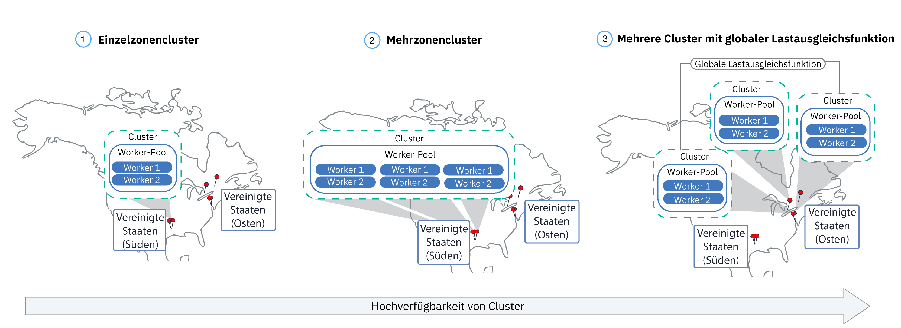
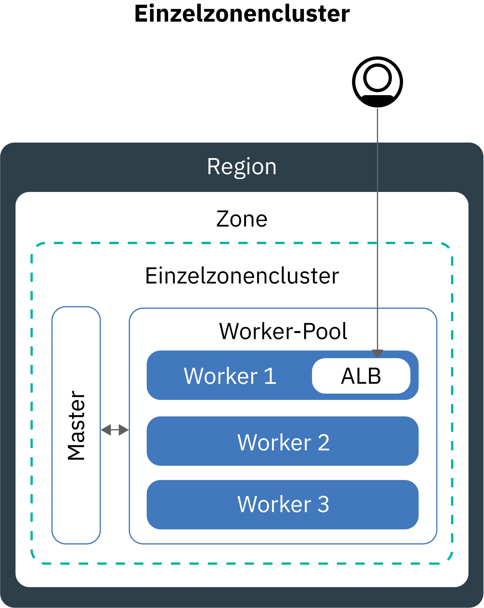
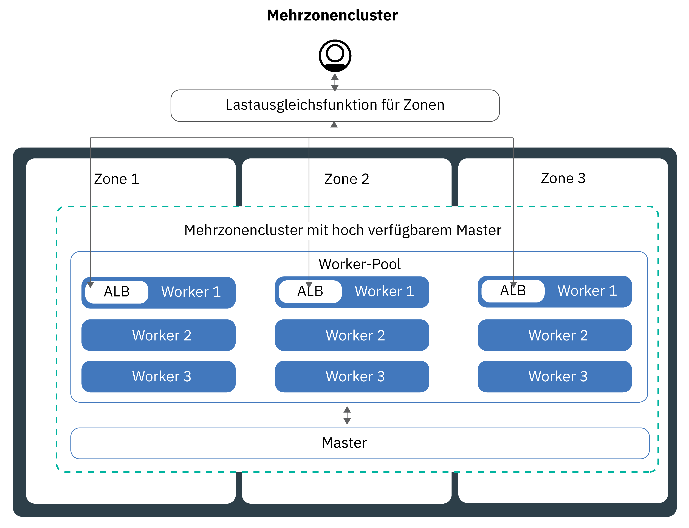
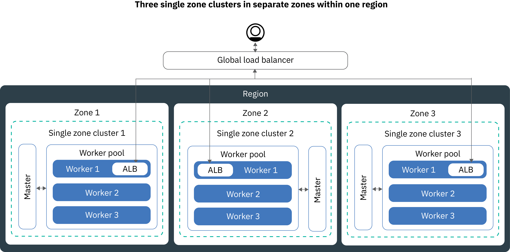

---

copyright:
  years: 2014, 2019
lastupdated: "2019-04-18"

keywords: kubernetes, iks, multi az, multi-az, szr, mzr

subcollection: containers

---

{:new_window: target="_blank"}
{:shortdesc: .shortdesc}
{:screen: .screen}
{:pre: .pre}
{:table: .aria-labeledby="caption"}
{:codeblock: .codeblock}
{:tip: .tip}
{:note: .note}
{:important: .important}
{:deprecated: .deprecated}
{:download: .download}


# Einrichtung Ihrer Cluster und Workerknoten planen
{: #plan_clusters}
Konzipieren Sie Ihren Standardcluster mit {{site.data.keyword.containerlong}} für maximale Verfügbarkeit und Kapazität für Ihre App.
{: shortdesc}

## Hoch verfügbare Cluster
{: #ha_clusters}

Die Wahrscheinlichkeit, dass Ihre Benutzer Ausfallzeiten verzeichnen, ist geringer, wenn Sie Ihre Apps auf mehrere Workerknoten, Zonen und Cluster verteilen. Integrierte Funktionen wie Lastausgleich (Load Balancing) und Isolation erhöhen die Ausfallsicherheit gegenüber möglichen Fehlerbedingungen mit Hosts, Netzen oder Apps.
{: shortdesc}

Betrachten Sie diese potenziellen Clusterkonfigurationen, die nach zunehmendem Grad der Verfügbarkeit angeordnet sind.



1. Ein [Einzelzonencluster](#single_zone) mit mehreren Workerknoten in einem Worker-Pool.
2. Ein [Mehrzonencluster](#multizone), der Workerknoten über Zonen hinweg in einer Region verteilt.
3. [Mehrere Cluster](#multiple_clusters), die über Zonen oder Regionen hinweg eingerichtet werden und über eine globale Lastausgleichsfunktion verbunden sind.

## Einzelzonencluster
{: #single_zone}

Um die Verfügbarkeit für Ihre App zu verbessern und einen Failover für den Fall zu ermöglichen, dass ein Workerknoten in Ihrem Cluster nicht verfügbar ist, fügen Sie Ihrem Einzelzonencluster zusätzliche Workerknoten hinzu.
{: shortdesc}



Standardmäßig wird der Einzelzonencluster mit einem Worker-Pool konfiguriert, der den Namen `default` hat. Der Worker-Pool gruppiert Workerknoten mit derselben Konfiguration, wie z. B. dem Maschinentyp, die Sie während der Clustererstellung definiert haben. Sie können Ihrem Cluster weitere Workerknoten hinzufügen, indem Sie [die Größe eines vorhandenen Worker-Pools ändern](/docs/containers?topic=containers-clusters#resize_pool) oder [einen neuen Worker-Pool hinzufügen](/docs/containers?topic=containers-clusters#add_pool).

Wenn Sie weitere Workerknoten hinzufügen, können App-Instanzen auf mehrere Workerknoten verteilt werden. Wenn ein Workerknoten ausfällt, werden die App-Instanzen auf den verfügbaren Workerknoten weiter ausgeführt. Kubernetes plant Pods von nicht verfügbaren Workerknoten automatisch neu, um die Leistung und Kapazität für Ihre App zu gewährleisten. Um sicherzustellen, dass die Pods gleichmäßig auf die Workerknoten verteilt werden, implementieren Sie [Pod-Affinität](https://kubernetes.io/docs/concepts/configuration/assign-pod-node/#inter-pod-affinity-and-anti-affinity-beta-feature).

**Kann ich einen Einzelzonencluster in einen Mehrzonencluster konvertieren?**</br>
Ja, wenn sich der Cluster in einer der [unterstützten Standorte in einer Mehrzonen-Metropole](/docs/containers?topic=containers-regions-and-zones#zones) befindet. Weitere Informationen finden Sie im Abschnitt [Von eigenständigen Workerknoten auf Worker-Pools aktualisieren](/docs/containers?topic=containers-update#standalone_to_workerpool).


**Muss ich Mehrzonencluster verwenden?**</br>
Nein. Sie können so viele Einzelzonencluster erstellen, wie Sie möchten. Möglicherweise bevorzugen Sie tatsächlich Einzelzonencluster für ein vereinfachtes Management oder für den Fall, dass Ihr Cluster sich in einer bestimmten [Stadt mit einer einzigen Zone](/docs/containers?topic=containers-regions-and-zones#zones) befinden muss.

**Kann ich einen hoch verfügbaren Master in einer Einzelzone haben?**</br>
Ja. In einer Einzelzone ist Ihr Master hoch verfügbar und umfasst Replikate auf separaten physischen Hosts für Ihren Kubernetes-API-Server, für 'etcd', für Ihren Scheduler und Ihren Controller-Manager, um beispielsweise vor Ausfällen während der Aktualisierung eines Masters zu schützen. Für den Schutz vor einem Zonenausfall können Sie Folgendes tun:
* [Erstellen Sie einen Cluster in einer mehrzonenfähigen Zone](/docs/containers?topic=containers-plan_clusters#multizone), wobei sich der Master über mehrere Zonen erstreckt.
* [Erstellen Sie mehrere Cluster](#multiple_clusters) und verbinden Sie sie mit einer globalen Lastausgleichsfunktion.

## Mehrzonencluster
{: #multizone}

Mit {{site.data.keyword.containerlong_notm}} können Sie Mehrzonencluster erstellen. Die Wahrscheinlichkeit, dass Ihre Benutzer Ausfallzeiten verzeichnen, ist geringer, wenn Sie Ihre Apps mithilfe von Worker-Pools auf mehrere Workerknoten und Zonen verteilen. Integrierte Funktionen wie der Lastausgleich erhöhen die Ausfallsicherheit bei potenziellen Zonenausfällen mit Hosts, Netzwerken oder Apps. Wenn Ressourcen in einer Zone inaktiv sind, werden Ihre Cluster-Workloads in den anderen Zonen immer noch verarbeitet.
{: shortdesc}

**Was ist ein Worker-Pool?**</br>
Bei einem Worker-Pool handelt es sich um eine Sammlung von Workerknoten mit derselben Version, wie Maschinentyp, CPU und Speicher. Wenn Sie einen Cluster erstellen, wird automatisch ein Worker-Pool für Sie erstellt. Sie können neue `ibmcloud ks worker-pool`-Befehle verwenden, um die Workerknoten in Ihrem Pool über Zonen zu verteilen, Workerknoten zum Pool hinzuzufügen oder Workerknoten zu aktualisieren.

**Kann ich noch eigenständige Workerknoten verwenden?**</br>
Das bisherige Cluster-Setup mit eigenständigen Workerknoten wird zwar noch unterstützt, jedoch nicht mehr weiterentwickelt. Stellen Sie sicher, dass Sie [einen Worker-Pool zu Ihrem Cluster hinzufügen](/docs/containers?topic=containers-clusters#add_pool) und anschließend anstelle von eigenständigen Workerknoten [Worker-Pools verwenden](/docs/containers?topic=containers-update#standalone_to_workerpool), um Ihre Workerknoten zu organisieren.

**Kann ich einen Einzelzonencluster in einen Mehrzonencluster konvertieren?**</br>
Ja, wenn sich der Cluster in einer der [unterstützten Standorte in einer Mehrzonen-Metropole](/docs/containers?topic=containers-regions-and-zones#zones) befindet. Weitere Informationen finden Sie im Abschnitt [Von eigenständigen Workerknoten auf Worker-Pools aktualisieren](/docs/containers?topic=containers-update#standalone_to_workerpool).


### Ich möchte mehr über die Mehrzonenclusterkonfiguration erfahren
{: #mz_setup}



Sie können zusätzliche Zonen zu Ihrem Cluster hinzufügen, um die Workerknoten in den Worker-Pools über mehrere Zonen in einer Region zu replizieren. Mehrzonencluster sind so konzipiert, dass die Pods gleichmäßig auf die Workerknoten und Zonen verteilt werden, um die Verfügbarkeit und Wiederherstellung nach einem Ausfall zu gewährleisten. Wenn die Workerknoten nicht gleichmäßig über die Zonen verteilt sind oder die Kapazität in einer der Zonen nicht ausreicht, kann der Kubernetes-Scheduler möglicherweise nicht alle angeforderten Pods planen. Daher können Pods in den Status **Anstehend** wechseln, bis eine ausreichende Kapazität verfügbar ist. Wenn Sie das Standardverhalten ändern möchten, damit der Kubernetes-Scheduler Pods in Zonen optimal verteilen kann, verwenden Sie die [Pod-Affinitätsrichtlinie](https://kubernetes.io/docs/concepts/configuration/assign-pod-node/#inter-pod-affinity-and-anti-affinity-beta-feature) `preferredDuringSchedulingIgnoredDuringExecution`.

**Warum benötige ich Workerknoten in drei Zonen?** </br>
Durch die Verteilung der Arbeitslast auf drei Zonen wird die hohe Verfügbarkeit Ihre App für den Fall sichergestellt, dass eine oder zwei Zonen nicht verfügbar sind. Zusätzlich kann eine solche Verteilung Ihr Cluster-Setup auch kosteneffizienter machen. Sie fragen sich, warum das so ist? Hier ist ein Beispiel.

Angenommen, Sie benötigen einen Workerknoten mit sechs Kernen, um die Arbeitslast für Ihre App zu verarbeiten. Für eine höhere Verfügbarkeit Ihres Clusters stehen Ihnen die folgenden Optionen zur Verfügung:

- **Ressourcen in einer anderen Zone duplizieren:** Mit dieser Option erhalten Sie zwei Workerknoten mit jeweils sechs Kernen in jeder Zone, wodurch insgesamt 12 Kerne verfügbar sind. </br>
- **Ressourcen auf drei Zonen verteilen:** Mit dieser Option stellen Sie drei Kerne pro Zone bereit, wodurch Sie eine Gesamtkapazität von neun Kernen erhalten. Um Ihre Arbeitslast verarbeiten zu können, müssen zwei Zonen gleichzeitig aktiv sein. Wenn eine Zone nicht verfügbar ist, können die anderen beiden Zonen die Arbeitslast verarbeiten. Wenn zwei Zonen nicht verfügbar sind, können die drei verbleibenden Kerne die Arbeitslast übernehmen. Durch die Bereitstellung von drei Kernen pro Zone können Sie mit kleineren Maschinen arbeiten und somit Kosten senken.</br>

**Wie wird mein Kubernetes-Master eingerichtet?** </br>
Wenn Sie einen Cluster an einem [Standort in einer Mehrzonen-Metropole](/docs/containers?topic=containers-regions-and-zones#zones) erstellen, wird automatisch ein hoch verfügbarer Kubernetes-Master bereitgestellt und drei Replikate werden über die Zonen der Metropole verteilt. Wenn sich der Cluster beispielsweise in den Zonen `dal10`, `dal12` oder `dal13` befindet, werden die Replikate des Kubernetes-Masters auf alle Zonen in der Mehrzonen-Metropole 'Dallas' verteilt.

**Was passiert, wenn der Kubernetes-Master nicht mehr verfügbar ist?** </br>
Der [Kubernetes-Master](/docs/containers?topic=containers-ibm-cloud-kubernetes-service-technology#architecture) ist die Hauptkomponente, die den Cluster betriebsbereit hält. Der Master speichert Clusterressourcen und ihre Konfigurationen in der etcd-Datenbank, die als Single Point of Truth für Ihren Cluster dient. Der Kubernetes-API-Server dient als Haupteinstiegspunkt für alle Anforderungen der Clusterverwaltung von den Workerknoten zum Master oder wenn Sie mit Ihren Clusterressourcen interagieren möchten.<br><br>Wenn ein Masterausfall auftritt, werden Ihre Workloads weiterhin auf den Workerknoten ausgeführt, Sie können jedoch erst wieder `kubectl`-Befehle verwenden, um mit Ihren Clusterressourcen zu arbeiten oder den Clusterzustand anzuzeigen, wenn der Kubernetes-API-Server im Master wieder betriebsbereit ist. Wenn ein Pod während des Ausfalls des Masters inaktiv ist, kann der Pod erst wieder ausgeführt werden, wenn der Workerknoten den Kubernetes-API-Server wieder erreichen kann.<br><br>Während eines Masterausfalls können Sie `ibmcloud ks`-Befehle weiterhin für die {{site.data.keyword.containerlong_notm}}-API ausführen, um mit Ihren Infrastrukturressourcen zu arbeiten (z. B. Workerknoten oder VLANs). Wenn Sie die aktuelle Clusterkonfiguration ändern, indem Sie Workerknoten zum Cluster hinzufügen oder aus ihm entfernen, werden die Änderungen erst wirksam, wenn der Master wieder betriebsbereit ist.

Ein Workerknoten darf während eines Masterausfalls nicht neu gestartet werden. Durch diese Aktion werden die Pods aus dem Workerknoten entfernt. Da der Kubernetes-API-Server nicht verfügbar ist, können die Pods nicht auf andere Workerknoten im Cluster umgestellt werden.
{: important}


Um Ihren Cluster vor einem Ausfall des Kubernetes-Masters oder in Regionen zu schützen, in denen Mehrzonencluster nicht verfügbar sind, können Sie [mehrere Cluster einrichten und diese mit einer globalen Lastausgleichsfunktion verbinden](#multiple_clusters).

**Muss ich etwas tun, damit der Master über Zonen hinweg mit den Workern kommunizieren kann?**</br>
Ja. Wenn Sie über mehrere VLANs für einen Cluster, mehrere Teilnetze in demselben VLAN oder einen Cluster mit mehreren Zonen verfügen, müssen Sie eine [VRF-Funktion (Virtual Router Function)](/docs/infrastructure/direct-link?topic=direct-link-overview-of-virtual-routing-and-forwarding-vrf-on-ibm-cloud#overview-of-virtual-routing-and-forwarding-vrf-on-ibm-cloud) für Ihr Konto für die IBM Cloud-Infrastruktur (SoftLayer) aktivieren, damit die Workerknoten über das private Netz miteinander kommunizieren können. Zur Aktivierung von VRF [wenden Sie sich an Ihren Ansprechpartner für die IBM Cloud-Infrastruktur (SoftLayer)](/docs/infrastructure/direct-link?topic=direct-link-overview-of-virtual-routing-and-forwarding-vrf-on-ibm-cloud#how-you-can-initiate-the-conversion). Wenn Sie VRF nicht aktivieren können oder wollen, aktivieren Sie das [VLAN-Spanning](/docs/infrastructure/vlans?topic=vlans-vlan-spanning#vlan-spanning). Um diese Aktion durchführen zu können, müssen Sie über die [Infrastrukturberechtigung](/docs/containers?topic=containers-users#infra_access) **Netz > VLAN-Spanning im Netz verwalten** verfügen oder Sie können den Kontoeigner bitten, diese zu aktivieren. Zum Prüfen, ob das VLAN-Spanning bereits aktiviert ist, verwenden Sie den [Befehl](/docs/containers?topic=containers-cs_cli_reference#cs_vlan_spanning_get) `ibmcloud ks vlan-spanning-get`.

**Wie kann ich meine Benutzer über das öffentliche Internet auf meine App zugreifen lassen?**</br>
Sie können Ihre Apps über eine Ingress-Lastausgleichsfunktion für Anwendungen (ALB) oder einen LoadBalancer-Service zugänglich machen.

- **Ingress-Lastausgleichsfunktion für Anwendungen (ALB):** Standardmäßig werden öffentliche ALBs automatisch in jeder Zone in Ihrem Cluster erstellt und aktiviert. Außerdem wird auch automatisch eine Cloudflare-Lastausgleichsfunktion für mehrere Zonen (Multizone Load Balancer, MZLB) für Ihren Cluster erstellt und bereitgestellt, sodass eine MZLB für jede Region vorhanden ist. Die MZLB stellt die IP-Adressen Ihrer ALBs hinter denselben Hostnamen und aktiviert die Zustandsprüfungen für diese IP-Adressen, um zu ermitteln, ob sie verfügbar sind oder nicht. Wenn Sie beispielsweise Workerknoten in drei (3) Zonen in der Region 'Vereinigte Staaten (Osten)' haben, hat der Hostname `yourcluster.us-east.containers.appdomain.cloud` drei ALB-IP-Adressen. Der MZLB-Status überprüft die öffentliche ALB-IP in jeder Zone des Clusters und hält die Ergebnisse der DNS-Suche auf der Basis dieser Zustandsprüfungen aktualisiert. Weitere Informationen finden Sie im Abschnitt [Komponenten und Architektur von Ingress](/docs/containers?topic=containers-ingress#planning).

- **Lastausgleichsservices:** Lastausgleichsservices werden nur in einer Zone konfiguriert. Eingehende Anforderungen an Ihre App werden von dieser einen Zone an alle App-Instanzen in anderen Zonen weitergeleitet. Wenn diese Zone nicht mehr verfügbar ist, ist Ihre App möglicherweise nicht über das Internet erreichbar. Um einem Ausfall einer einzelnen Zone gerecht zu werden, können Sie zusätzliche LoadBalancer-Services in weiteren Zonen einrichten. Weitere Informationen finden Sie im Abschnitt zu den hoch verfügbaren [LoadBalancer-Services](/docs/containers?topic=containers-loadbalancer#multi_zone_config).

**Kann ich persistenten Speicher für meinen Mehrzonencluster einrichten?**</br>
Verwenden Sie für hoch verfügbaren persistenten Speicher einen Cloud-Service wie [{{site.data.keyword.cloudant_short_notm}}](/docs/services/Cloudant?topic=cloudant-getting-started#getting-started) oder [{{site.data.keyword.cos_full_notm}}](/docs/services/cloud-object-storage?topic=cloud-object-storage-about#about). Sie können auch eine SDS-Lösung (SDS - Software-Defined Storage) wie [Portworx](/docs/containers?topic=containers-portworx#portworx) ausprobieren, die [SDS-Maschinen](#sds) verwendet. Weitere Informationen finden Sie unter [Vergleich der Optionen für persistenten Speicher für Mehrzonencluster](/docs/containers?topic=containers-storage_planning#persistent_storage_overview).

Der NFS-Datei- und -Blockspeicher kann nicht über Zonen hinweg gemeinsam genutzt werden. Persistente Datenträger können nur in der Zone verwendet werden, in der sich die tatsächliche Speichereinheit befindet. Wenn Sie über NFS-Datei- oder -Blockspeicher in Ihrem Cluster verfügen, den Sie weiterhin verwenden möchten, müssen Sie Regions- und Zonenbezeichnungen auf vorhandene persistente Datenträger anwenden. Mithilfe dieser Bezeichnungen kann 'kube-scheduler' bestimmen, wo eine App geplant werden soll, die den persistenten Datenträger verwendet. Führen Sie den folgenden Befehl aus und ersetzen Sie `<meincluster>` durch den Namen Ihres Clusters.

```
bash <(curl -Ls https://raw.githubusercontent.com/IBM-Cloud/kube-samples/master/file-pv-labels/apply_pv_labels.sh) <meincluster>
```
{: pre}

** Ich habe meinen Mehrzonencluster erstellt. Warum gibt es immer noch immer nur eine Zone? Wie füge ich meinem Cluster Zonen hinzu?**</br>
Wenn Sie [Ihren Mehrzonencluster mit der CLI erstellen](/docs/containers?topic=containers-clusters#clusters_cli), wird der Cluster zwar erstellt, Sie müssen jedoch Zonen zum Worker-Pool hinzufügen, um den Prozess abzuschließen. Damit sich der Cluster über mehrere Zonen erstreckt, muss er sich an einem [Standort in einer Mehrzonen-Metropole](/docs/containers?topic=containers-regions-and-zones#zones) befinden. Informationen zum Hinzufügen einer Zone zu Ihrem Cluster und zum Verteilen von Workerknoten auf Zonen finden Sie im Abschnitt [Zone zu Ihrem Cluster hinzufügen](/docs/containers?topic=containers-clusters#add_zone).

### Wie wird sich das zukünftige Management meiner Cluster vom aktuellen Management unterscheiden?
{: #mz_new_ways}

Mit der Einführung von Worker-Pools können Sie eine neue Gruppe von APIs und Befehlen zum Verwalten des Clusters verwenden. Sie finden diese neuen Befehle auf der [Seite mit der CLI-Dokumentation](/docs/containers?topic=containers-cs_cli_reference#cs_cli_reference). In Ihrem Terminal können Sie sie durch Ausführen des Befehls `ibmcloud ks help` anzeigen.
{: shortdesc}

In der folgenden Tabelle werden die alten und neuen Methoden für einige allgemeine Aktionen der Clusterverwaltung miteinander verglichen.
<table summary="Die Tabelle enthält die Beschreibung der neuen Vorgehensweisen zum Ausführen von Mehrzonenbefehlen. Die Tabellenzeilen enthalten von links nach rechts die Beschreibung in der ersten Spalte, die alte Vorgehensweise in der zweiten Spalte und die neue Vorgehensweise für Worker-Pools mit mehreren Zonen in der dritten Spalte.">
<caption>Neue Methoden für Befehle für Worker-Pools mit mehreren Zonen.</caption>
  <thead>
  <th>Beschreibung</th>
  <th>Alte eigenständige Workerknoten</th>
  <th>Neue Worker-Pools mit mehreren Zonen</th>
  </thead>
  <tbody>
    <tr>
    <td>Hinzufügen von Workerknoten zum Cluster.</td>
    <td><p class="deprecated"><code>ibmcloud ks worker-add</code> zum Hinzufügen eigenständiger Workerknoten.</p></td>
    <td><ul><li>Um andere Maschinentypen als Ihren vorhandenen Pool hinzuzufügen, erstellen Sie einen neuen Worker-Pool: [Befehl](/docs/containers?topic=containers-cs_cli_reference#cs_worker_pool_create) <code>ibmcloud ks worker-pool-create</code>.</li>
    <li>Wenn Sie Workerknoten einem vorhandenen Pool hinzufügen möchten, ändern Sie die Anzahl der Knoten pro Zone im Pool: [Befehl](/docs/containers?topic=containers-cs_cli_reference#cs_worker_pool_resize) <code>ibmcloud ks worker-pool-resize</code>.</li></ul></td>
    </tr>
    <tr>
    <td>Entfernen von Workerknoten aus dem Cluster.</td>
    <td><code>ibmcloud ks worker-rm</code>: Sie können diesen Befehl immer noch zum Löschen eines problematischen Workerknoten aus dem Cluster verwenden.</td>
    <td><ul><li>Wenn ein Worker-Pool nicht ausgeglichen ist, z. B. nach dem Entfernen eines Workerknotens, gleichen Sie ihn neu aus: [Befehl](/docs/containers?topic=containers-cs_cli_reference#cs_rebalance) <code>ibmcloud ks worker-pool-rebalance</code>.</li>
    <li>Um die Anzahl der Workerknoten in einem Pool zu reduzieren, ändern Sie die Anzahl pro Zone (Mindestwert '1'): [Befehl](/docs/containers?topic=containers-cs_cli_reference#cs_worker_pool_resize) <code>ibmcloud ks worker-pool-resize</code>.</li></ul></td>
    </tr>
    <tr>
    <td>Verwenden Sie ein neues VLAN für Workerknoten.</td>
    <td><p class="deprecated">Fügen Sie einen neuen Workerknoten hinzu, der das neue private oder öffentliche VLAN verwendet: <code>ibmcloud ks worker-add</code>.</p></td>
    <td>Legen Sie den Worker-Pool so fest, dass er ein anderes öffentliches oder privates VLAN als zuvor verwendet: [Befehl](/docs/containers?topic=containers-cs_cli_reference#cs_zone_network_set) <code>ibmcloud ks zone-network-set</code>.</td>
    </tr>
  </tbody>
  </table>

## Mehrere Cluster, die mit einer globalen Lastausgleichsfunktion verbunden sind
{: #multiple_clusters}

Um Ihre App bei einem Ausfall eines Kubernetes-Masters zu schützen und für Regionen, in denen Mehrzonencluster nicht verfügbar sind, können Sie mehrere Cluster in verschiedenen Zonen in einer Region erstellen und diese mit einer globalen Lastausgleichsfunktion verbinden.
{: shortdesc}



Um Ihre Arbeitslast auf mehrere Cluster zu verteilen, müssen Sie eine globale Lastausgleichsfunktion einrichten und die IP-Adressen der Lastausgleichsfunktionen für Anwendungen (ALBs) oder LoadBalancer-Services zu Ihrer Domäne hinzufügen. Durch das Hinzufügen dieser IP-Adressen können Sie eingehenden Datenverkehr zwischen Ihren Clustern weiterleiten. Damit die globale Lastausgleichsfunktion erkennen kann, ob einer der Cluster nicht verfügbar ist, sollten Sie in Betracht ziehen, jeder IP-Adresse eine Ping-basierte Statusprüfung hinzuzufügen. Wenn Sie diese Prüfung einrichten, überprüft Ihr DNS-Provider regelmäßig mit Ping die IP-Adressen, die Sie zu Ihrer Domäne hinzugefügt haben. Wenn eine IP-Adresse nicht mehr verfügbar ist, wird der Datenverkehr nicht mehr an diese IP-Adresse gesendet. Kubernetes startet jedoch nicht automatisch erneut Pods von dem nicht verfügbaren Cluster auf Workerknoten in verfügbaren Clustern. Wenn Kubernetes die Pods automatisch in verfügbaren Clustern erneut starten soll, sollten Sie einen [Mehrzonencluster](#multizone) einrichten.

**Warum benötige ich drei Cluster in drei Zonen?** </br>
Ähnlich wie bei der Verwendung von [drei Zonen in Mehrzonenclustern](#multizone) können Sie mehr Verfügbarkeit für Ihre App bereitstellen, indem Sie drei Cluster über Zonen hinweg einrichten. Sie können auch Kosten reduzieren,, indem Sie sich kleinere Maschinen für die Verarbeitung Ihrer Arbeitslast anschaffen.

**Was ist, wenn ich mehrere Cluster in mehreren Regionen einrichten möchte?** </br>
Sie können mehrere Cluster in verschiedenen Regionen eines geografischen Standortes (wie 'Vereinigte Staaten (Süden)' und 'Vereinigte Staaten (Osten)') oder über geografische Standorte hinweg ('Vereinigte Staaten (Süden)' und 'Mitteleuropa') einrichten. Beide Setups bieten das gleiche Maß an Verfügbarkeit für Ihre App, sind aber bei der gemeinsamen Nutzung von Daten und der Datenreplikation komplexer als andere Lösungen. In den meisten Fällen reicht es aus, am selben geografischen Standort zu bleiben. Wenn Sie jedoch Benutzer auf der ganzen Welt haben, kann es besser sein, einen Cluster dort einzurichten, wo sich Ihre Benutzer befinden, damit diese keine langen Wartezeiten beim Senden einer Anforderung an Ihre App haben.

**Gehen Sie wie folgt vor, um eine globale Lastausgleichsfunktion für mehrere Cluster einzurichten:**

1. [Erstellen Sie Cluster](/docs/containers?topic=containers-clusters#clusters) in mehreren Zonen oder Regionen.
2. Wenn Sie über mehrere VLANs für einen Cluster, mehrere Teilnetze in demselben VLAN oder einen Cluster mit mehreren Zonen verfügen, müssen Sie eine [VRF-Funktion (Virtual Router Function)](/docs/infrastructure/direct-link?topic=direct-link-overview-of-virtual-routing-and-forwarding-vrf-on-ibm-cloud#overview-of-virtual-routing-and-forwarding-vrf-on-ibm-cloud) für Ihr Konto für die IBM Cloud-Infrastruktur (SoftLayer) aktivieren, damit die Workerknoten über das private Netz miteinander kommunizieren können. Zur Aktivierung von VRF [wenden Sie sich an Ihren Ansprechpartner für die IBM Cloud-Infrastruktur (SoftLayer)](/docs/infrastructure/direct-link?topic=direct-link-overview-of-virtual-routing-and-forwarding-vrf-on-ibm-cloud#how-you-can-initiate-the-conversion). Wenn Sie VRF nicht aktivieren können oder wollen, aktivieren Sie das [VLAN-Spanning](/docs/infrastructure/vlans?topic=vlans-vlan-spanning#vlan-spanning). Um diese Aktion durchführen zu können, müssen Sie über die [Infrastrukturberechtigung](/docs/containers?topic=containers-users#infra_access) **Netz > VLAN-Spanning im Netz verwalten** verfügen oder Sie können den Kontoeigner bitten, diese zu aktivieren. Zum Prüfen, ob das VLAN-Spanning bereits aktiviert ist, verwenden Sie den [Befehl](/docs/containers?topic=containers-cs_cli_reference#cs_vlan_spanning_get) `ibmcloud ks vlan-spanning-get`.
3. Stellen Sie in jedem Cluster Ihre App mit einer [Lastausgleichsfunktion für Anwendungen (ALB)](/docs/containers?topic=containers-ingress#ingress_expose_public) oder einem [LoadBalancer-Service](/docs/containers?topic=containers-loadbalancer) bereit.
4. Listen Sie für jeden Cluster die öffentlichen IP-Adressen für Ihre ALBs oder LoadBalancer-Services auf.
   - Gehen Sie wie folgt vor, um die IP-Adresse aller öffentlichen aktivierten ALBs in Ihrem Cluster aufzulisten:
     ```
     ibmcloud ks albs --cluster <clustername_oder_-id>
     ```
     {: pre}

   - Gehen Sie wie folgt vor, um die IP-Adresse für den LoadBalancer-Service aufzulisten:
     ```
     kubectl describe service <mein_service>
     ```
     {: pre}

     Die IP-Adresse für **Load Balancer Ingress** ist die portierbare IP-Adresse, die dem LoadBalancer-Service zugewiesen wurde.

4.  Richten Sie eine globale Lastausgleichsfunktion ein, indem Sie {{site.data.keyword.Bluemix_notm}} Internet Services (CIS) verwenden oder eine eigene globale Lastausgleichsfunktion einrichten.

    **Gehen Sie wie folgt vor, um eine globale CIS-Lastausgleichsfunktion zu verwenden:**:
    1.  Richten Sie den Service ein, indem Sie die Schritte 1 bis 5 in der [Einführung in {{site.data.keyword.Bluemix_notm}} Internet Services (CIS)](/docs/infrastructure/cis?topic=cis-getting-started#getting-started) ausführen. Diese Schritte führen Sie durch die Bereitstellung der Serviceinstanz, das Hinzufügen Ihrer App-Domäne, die Konfiguration Ihrer Namensserver und die Erstellung von DNS-Datensätzen. Erstellen Sie einen DNS-Datensatz für alle IP-Adressen der ALBs oder Lastausgleichsfunktionen, die Sie erfasst haben. Diese DNS-Datensätze ordnen Ihre App-Domäne allen Ihren Cluster-ALBs oder Lastausgleichsfunktionen zu und stellen sicher, dass Anforderungen an Ihre App-Domäne in einem Umlaufzyklus an Ihre Cluster weitergeleitet werden.
    2. [Fügen Sie Statusprüfungen](/docs/infrastructure/cis?topic=cis-set-up-and-configure-your-load-balancers#add-a-health-check) für die ALBs oder die Lastausgleichsfunktionen hinzu. Sie können dieselbe Statusprüfung für die ALBs oder Lastausgleichsfunktionen in allen Clustern verwenden oder bestimmte Statusprüfungen erstellen, die für bestimmte Cluster verwendet werden.
    3. [Fügen Sie einen Ursprungspool](/docs/infrastructure/cis?topic=cis-set-up-and-configure-your-load-balancers#add-a-pool) für jeden Cluster hinzu, indem Sie die ALB- oder Lastausgleichsfunktions-IPs des Clusters hinzufügen. Wenn Sie beispielsweise über drei Cluster mit jeweils zwei ALBs verfügen, erstellen Sie drei Ursprungspools, die jeweils zwei ALB-IP-Adressen aufweisen. Fügen Sie jedem Ursprungspool, den Sie erstellen, eine Statusprüfung hinzu.
    4. [Fügen Sie eine globale Lastausgleichsfunktion hinzu](/docs/infrastructure/cis?topic=cis-set-up-and-configure-your-load-balancers#set-up-and-configure-your-load-balancers).

    **Gehen Sie wie folgt vor, um Ihre eigene globale Lastausgleichsfunktion zu verwenden:**:
    1. Konfigurieren Sie Ihre Domäne für die Weiterleitung des eingehenden Datenverkehrs an Ihre ALB oder LoadBalancer-Services, indem Sie die IP-Adressen aller öffentlichen aktivierten ALBs und LoadBalancer-Services in Ihre Domäne hinzufügen.
    2. Aktivieren Sie für jede IP-Adresse eine Ping-basierte Statusüberprüfung, damit Ihr DNS-Provider fehlerhafte IP-Adressen erkennen kann. Wird eine fehlerhafte IP-Adresse erkannt, wird der Datenverkehr nicht mehr an diese IP-Adresse weitergeleitet.

## Private Cluster
{: #private_clusters}

{{site.data.keyword.containerlong_notm}} richtet Ihren Cluster standardmäßig mit Zugriff auf ein privates VLAN und ein öffentliches VLAN ein. Das private VLAN bestimmt die private IP-Adresse, die dem jeweiligen Workerknoten zugeordnet ist. Diese Adresse stellt für jeden Workerknoten eine private Netzschnittstelle bereit. Das öffentliche VLAN ermöglicht es den Workerknoten, automatisch und sicher eine Verbindung zum Master herzustellen.
{: shortdesc}

Aufgrund von Sicherheits- oder Konformitätsanforderungen kann es jedoch wünschenswert sein, einen Cluster mit einem privaten VLAN oder einen Cluster mit einem privaten Serviceendpunkt zu erstellen. Ihre Optionen zum Erstellen eines privaten Clusters hängen vom Typ des Kontos für die IBM Cloud-Infrastruktur (SoftLayer) ab, den Sie haben, sowie von der öffentlichen und privaten VLAN-Konfiguration, die Sie wünschen. Weitere Informationen zu den folgenden Konfigurationen finden Sie unter [Clusternetz planen](/docs/containers?topic=containers-cs_network_ov).

Haben Sie einen vorhandenen Cluster, den Sie zu einem nur privaten Cluster machen wollen? Im Abschnitt [VLAN-Verbindungen für Workerknoten ändern](/docs/containers?topic=containers-cs_network_cluster#change-vlans) finden Sie Informationen dazu, wie Sie Worker-Pools hinzufügen oder vorhandene Worker-Pools mit neuen VLANs ändern können.
{: note}

**VRF-aktiviertes Konto, privater Kubernetes-Master, Workerknoten in einem öffentlichen und einem privaten VLAN**</br>
In Clustern, die Kubernetes Version 1.11 oder höher ausführen, können Sie Ihr Clusternetz für die Verwendung öffentlicher und privater Serviceendpunkte einrichten. Wenn Sie den privaten Serviceendpunkt aktiviert haben, kommunizieren der Kubernetes-Master und Ihre Workerknoten immer über das private VLAN und den privaten Serviceendpunkt. Auch wenn Sie den öffentlichen Serviceendpunkt für Ihren Cluster aktivieren, verbleibt die Kommunikation zwischen dem Kubernetes-Master und den Workerknoten im privaten VLAN. Nach dem Aktivieren eines privaten Serviceendpunkts können Sie diesen nicht mehr inaktivieren. Sie können den öffentlichen Serviceendpunkt für den sicheren Zugriff auf Ihren Kubernetes-Master über das Internet beibehalten, zum Beispiel um `kubectl`-Befehle auszuführen, oder Sie können den öffentlichen Serviceendpunkt inaktivieren, um einen Cluster mit nur einem privaten Serviceendpunkt zu erhalten.

**Nicht-VRF-aktiviertes oder VRF-aktiviertes Konto, Kubernetes-Master- und Workerknoten nur in privatem VLAN**</br>
Wenn Sie Ihre Workerknoten nur in einem privaten VLAN einrichten, können die Workerknoten ihre App-Services nicht automatisch über das öffentliche Netz zugänglich machen und in einem Nicht-VRF-Konto können sie darüber hinaus keine Verbindung zum Master herstellen. Sie müssen eine Gateway-Appliance konfigurieren, um die Netzkonnektivität zwischen den Workerknoten und dem Master bereitzustellen.

Für Nicht-VRF-Konten: Wenn Sie den Cluster sowohl mit öffentlichen als auch mit privaten VLANs erstellen, können Sie die öffentlichen VLANs später nicht aus diesem Cluster entfernen. Durch das Entfernen aller öffentlichen VLANs aus einem Cluster werden mehrere Clusterkomponenten gestoppt. Erstellen Sie stattdessen einen neuen Cluster ohne das öffentliche VLAN.
{: note}

**Nicht VRF-aktiviertes Konto, Kubernetes-Master- und Workerknoten sowohl in öffentlichem als auch in privatem VLAN**</br>
Für die meisten Fälle kann Ihr Cluster-Setup Workerknoten sowohl in öffentlichen als auch in privaten VLANs einschließen. Dann können Sie den Cluster einschränken, indem Sie öffentlichen VLAN-Datenverkehr durch Calico-Richtlinien blockieren und Netzdatenverkehr auf ausgewählte Edge-Knoten beschränken.

## Worker-Pools und Workerknoten
{: #planning_worker_nodes}

Ein Kubernetes-Cluster besteht aus Workerknoten, die in Worker-Pools gruppiert sind und zentral vom Kubernetes-Master überwacht und verwaltet werden. Clusteradministratoren entscheiden, wie sie den Cluster aus Workerknoten einrichten, um sicherzustellen, dass den Clusterbenutzern alle Ressourcen für die Bereitstellung und Ausführung von Apps im Cluster zur Verfügung stehen.
{:shortdesc}

Wenn Sie einen Standardcluster erstellen, werden die Workerknoten mit denselben Speicher-, CPU- und Plattenspeicherspezifikationen (Typ) in Ihrer IBM Cloud-Infrastruktur (SoftLayer) in Ihrem Namen bestellt und dem Standard-Worker-Pool in Ihrem Cluster hinzugefügt. Jedem Workerknoten werden eine eindeutige Workerknoten-ID und ein Domänenname zugewiesen, die nach dem Erstellen des Clusters nicht geändert werden dürfen. Sie können zwischen virtuellen oder physischen Servern (Bare-Metal-Servern) wählen. Abhängig von dem ausgewählten Grad an Hardware-Isolation können virtuelle Workerknoten als gemeinsam genutzte oder als dedizierte Knoten eingerichtet werden. Wenn Sie Ihrem Cluster unterschiedliche Typen hinzufügen möchten, [erstellen Sie einen weiteren Worker-Pool](/docs/containers?topic=containers-cs_cli_reference#cs_worker_pool_create).

Kubernetes beschränkt die maximale Anzahl von Workerknoten, die in einem Cluster vorhanden sein können. Weitere Informationen finden Sie unter [Worker node and pod quotas ](https://kubernetes.io/docs/setup/cluster-large/).


Wollen Sie sichergehen, dass Sie immer ausreichend Workerknoten für Ihre Workload zur Verfügung haben? Probieren Sie den [Cluster-Autoscaler](/docs/containers?topic=containers-ca#ca) aus.
{: tip}

<br />


## Verfügbare Hardware für Workerknoten
{: #shared_dedicated_node}

Wenn Sie einen Standardcluster in {{site.data.keyword.Bluemix_notm}} erstellen, wählen Sie, ob Ihre Worker-Pools aus Workerknoten bestehen, die entweder physische Maschinen (Bare-Metal-Maschinen) sind oder die virtuelle Maschinen sind, die auf physischer Hardware ausgeführt werden. Sie wählen außerdem den Typ des Workerknotens oder die Kombination aus Speicher-, CPU- und anderen Maschinenspezifikationen (wie z. B. Plattenspeicher).
{:shortdesc}


Wenn Sie mehr als einen Typ des Workerknotens benötigen, müssen Sie für jeden Typ einen Worker-Pool erstellen. Sie können vorhandene Workerknoten in ihrer Größe nicht ändern, um andere Ressourcen wie CPU und Hauptspeicher zu erhalten. Wenn Sie einen kostenlosen Cluster erstellen, wird Ihr Workerknoten automatisch als gemeinsam genutzter, virtueller Knoten im Konto der IBM Cloud-Infrastruktur (SoftLayer) bereitgestellt. In Standardclustern können Sie den Typ der Maschine auswählen, der sich am besten für Ihre Workload eignet. Berücksichtigen Sie bei Ihrer Planung die [Reserven für Workerknotenressourcen](#resource_limit_node) bei der Gesamt-CPU und der Speicherkapazität.

Sie können Cluster mithilfe der [Konsolen-UI](/docs/containers?topic=containers-clusters#clusters_ui) oder mithilfe der [CLI](/docs/containers?topic=containers-clusters#clusters_cli) bereitstellen.

Wählen Sie eine der folgenden Optionen aus, um zu entscheiden, welchen Typ von Worker-Pool Sie wünschen.
* [Virtuelle Maschinen](#vm)
* [Physische Maschinen (Bare-Metal-Maschinen)](#bm)
* [SDS-Maschinen (Software-defined Storage)](#sds)

### Virtuelle Maschinen
{: #vm}

Virtuelle Maschinen bieten eine größere Flexibilität, schnellere Bereitstellungszeiten und mehr automatische Skalierbarkeitsfunktionen als Bare-Metal-Maschinen und sind zudem kostengünstiger. Sie können virtuelle Maschinen für die meisten allgemeinen Anwendungsfälle, wie Test- und Entwicklungsumgebungen, Staging- und Produktionsumgebungen, Microservices und Business-Apps, verwenden. Allerdings müssen bei der Leistung Kompromisse gemacht werden. Wenn Sie für RAM-, GPU- oder datenintensive Arbeitslasten eine Datenverarbeitung mit hoher Leistung benötigen, verwenden Sie [Bare-Metal-Maschinen](#bm).
{: shortdesc}

**Soll gemeinsam genutzte oder dedizierte Hardware verwendet werden?**</br>
Wenn Sie einen virtuellen Standardcluster erstellen, müssen Sie auswählen, ob die zugrunde liegende Hardware von mehreren {{site.data.keyword.IBM_notm}} Kunden gemeinsam genutzt werden kann (Multi-Tenant-Konfiguration) oder ob Sie die ausschließlich Ihnen vorbehaltene, dedizierte Nutzung vorziehen (Single-Tenant-Konfiguration).

* **In einer Multi-Tenant-Konfiguration mit gemeinsam genutzter Hardware**: Physische Ressourcen wie CPU und Speicher werden von allen virtuellen Maschinen, die auf derselben physischen Hardware bereitgestellt werden, gemeinsam genutzt. Um sicherzustellen, dass jede virtuelle Maschine unabhängig von anderen Maschinen ausgeführt werden kann, segmentiert ein VM-Monitor, d. h. eine Überwachungsfunktion für virtuelle Maschinen, die auch als Hypervisor bezeichnet wird, die physischen Ressourcen in isolierte Entitäten und ordnet diese einer virtuellen Maschine als dedizierte Ressourcen zu. Dies wird als Hypervisor-Isolation bezeichnet.
* **In einer Single-Tenant-Konfiguration mit dedizierter Hardware**: Die Nutzung aller physischen Ressourcen ist ausschließlich Ihnen vorbehalten. Sie können mehrere Workerknoten als virtuelle Maschinen auf demselben physischen Host bereitstellen. Ähnlich wie bei der Multi-Tenant-Konfiguration stellt der Hypervisor auch hier sicher, dass jeder Workerknoten seinen Anteil an den verfügbaren physischen Ressourcen erhält.

Gemeinsam genutzte Knoten sind in der Regel kostengünstiger als dedizierte Knoten, weil die Kosten für die ihnen zugrunde liegende Hardware von mehreren Kunden getragen werden. Bei der Entscheidungsfindung hinsichtlich gemeinsam genutzter Knoten versus dedizierter Knoten sollten Sie mit Ihrer Rechtsabteilung Rücksprache halten, um zu klären, welcher Grad an Infrastrukturisolation und Compliance für Ihre App-Umgebung erforderlich ist.

Einige Typen sind nur für einen Typ von Tenant-Setup verfügbar. Zum Beispiel sind VMs vom Typ `m3c` nur als Tenant-Setup `shared` verfügbar.
{: note}

**Was sind die allgemeinen Features von VMs?**</br>
Virtuelle Maschinen verwenden lokale Platten anstelle von SAN (Storage Area Networking) für die Zuverlässigkeit. Zu den Vorteilen zählen ein höherer Durchsatz beim Serialisieren von Bytes für die lokale Festplatte und weniger Beeinträchtigungen des Dateisystems aufgrund von Netzausfällen. Jede VM bietet eine Netzgeschwindigkeit von 1000 Mb/s, 25 GB primären lokalen Plattenspeicher für das Dateisystem des Betriebssystems und 100 GB sekundären lokalen Plattenspeicher für Daten (wie die Containerlaufzeit und `kubelet`). Der lokale Speicher auf dem Workerknoten ist nur für die kurzfristige Verarbeitung vorgesehen; die primäre und die sekundäre Platte werden gelöscht, wenn Sie den Workerknoten aktualisieren oder erneut laden. Informationen zu persistenten Speicherlösungen finden Sie im Abschnitt [Persistenten Hochverfügbarkeitsspeicher planen](/docs/containers?topic=containers-storage_planning#storage_planning).

**Was passiert, wenn meine Maschinentypen älter sind?**</br>
Wenn Ihr Cluster über die veralteten `x1c`- (oder ältere) Ubuntu 16 `x2c`-Workerknoten-Typen verfügt, können Sie Ihren [Cluster auf Ubuntu 18 `x3c`-Workerknoten aktualisieren](/docs/containers?topic=containers-update#machine_type).

**Welche Typen sind bei virtuellen Maschinen verfügbar?**</br>
Die Typen der Workerknoten variieren je nach Zone. Die folgende Tabelle enthält die neueste Version des jeweiligen Typs, z. B. `x3c` Ubuntu 18-Workerknoten-Typen, im Gegensatz zu den älteren `x2c` Ubuntu 16-Workerknoten-Typen. Um die in Ihrer Zone verfügbaren Maschinentypen anzuzeigen, führen Sie den Befehl `ibmcloud ks machine-types <zone>` aus. Sie können sich außerdem die verfügbaren [Bare-Metal](#bm)- oder [SDS](#sds)-Maschinentypen ansehen.

{: #vm-table}
<table>
<caption>Verfügbare virtuelle Maschinentypen in {{site.data.keyword.containerlong_notm}}.</caption>
<thead>
<th>Name und Anwendungsfall</th>
<th>Kerne/Speicher</th>
<th>Primäre/Sekundäre Platte</th>
<th>Netzgeschwindigkeit</th>
</thead>
<tbody>
<tr>
<td><strong>Virtuell, u3c.2x4</strong>: Verwenden Sie diese kompakte virtuelle Maschine für Schnelltests, Machbarkeitsnachweise und andere geringe Workloads.</td>
<td>2/4 GB</td>
<td>25 GB/100 GB</td>
<td>1000 MB/s</td>
</tr>
<tr>
<td><strong>Virtuell, b3c.4x16</strong>: Wählen Sie diese ausgeglichene virtuelle Maschine für Tests und Entwicklung und andere geringe Workloads.</td>
<td>4/16 GB</td>
<td>25 GB/100 GB</td>
<td>1000 MB/s</td>
</tr>
<tr>
<td><strong>Virtuell, b3c.16x64</strong>: Wählen Sie diese ausgeglichene virtuelle Maschine für mittlere Workloads aus.</td></td>
<td>16/64 GB</td>
<td>25 GB/100 GB</td>
<td>1000 MB/s</td>
</tr>
<tr>
<td><strong>Virtuell, b3c.32x128</strong>: Wählen Sie diese ausgeglichene virtuelle Maschine für mittlere bis große Workloads, wie eine Datenbank und eine dynamische Website mit vielen gleichzeitigen Benutzern, aus.</td>
<td>32/128 GB</td>
<td>25 GB/100 GB</td>
<td>1000 MB/s</td>
</tr>
<tr>
<td><strong>Virtuell, b3c.56x242</strong>: Wählen Sie diese ausgeglichene virtuelle Maschine für große Workloads, wie eine Datenbank und mehrere Apps mit vielen gleichzeitigen Benutzern, aus.</td>
<td>56/242 GB</td>
<td>25 GB/100 GB</td>
<td>1000 MB/s</td>
</tr>
<tr>
<td><strong>Virtuell, c3c.16x16</strong>: Verwenden Sie diesen Typ, wenn Sie eine gleichmäßige Verteilung der Rechenressourcen vom Workerknoten für geringe Workloads wünschen.</td>
<td>16 / 16 GB</td>
<td>25 GB/100 GB</td>
<td>1000 MB/s</td>
</tr><tr>
<td><strong>Virtuell, c3c.16x32</strong>: Verwenden Sie diesen Typ, wenn Sie ein 1:2-Verhältnis von CPU- und Speicherressourcen vom Workerknoten für geringe bis mittlere Workloads wünschen.</td>
<td>16 / 32 GB</td>
<td>25 GB/100 GB</td>
<td>1000 MB/s</td>
</tr><tr>
<td><strong>Virtuell, c3c.32x32</strong>: Verwenden Sie diesen Typ, wenn Sie eine gleichmäßige Verteilung der Rechenressourcen vom Workerknoten für mittlere Workloads wünschen.</td>
<td>32 GB/ 32 GB</td>
<td>25 GB/100 GB</td>
<td>1000 MB/s</td>
</tr><tr>
<td><strong>Virtuell, c3c.32x64</strong>: Verwenden Sie diesen Typ, wenn Sie ein 1:2-Verhältnis von CPU- und Speicherressourcen vom Workerknoten für mittlere Workloads wünschen.</td>
<td>32 GB/64 GB</td>
<td>25 GB/100 GB</td>
<td>1000 MB/s</td>
</tr>
<tr>
<td><strong>Virtuell, m3c.8x64</strong>: Verwenden Sie diesen Typ, wenn Sie ein 1:8-Verhältnis von CPU- und Speicherressourcen für geringe bis mittlere Workloads wünschen, die mehr Hauptspeicher erfordern, zum Beispiel Datenbanken wie {{site.data.keyword.Db2_on_Cloud_short}}. Nur in Dallas und als Tenant-Setup `--hardware shared` verfügbar.</td>
<td>8 / 64 GB</td>
<td>25 GB/100 GB</td>
<td>1000 MB/s</td>
</tr><tr>
<td><strong>Virtuell, m3c.16x128</strong>: Verwenden Sie diesen Typ, wenn Sie ein 1:8-Verhältnis von CPU- und Speicherressourcen für mittlere Workloads wünschen, die mehr Hauptspeicher erfordern, zum Beispiel Datenbanken wie {{site.data.keyword.Db2_on_Cloud_short}}. Nur in Dallas und als Tenant-Setup `--hardware shared` verfügbar.</td>
<td>16/128 GB</td>
<td>25 GB/100 GB</td>
<td>1000 MB/s</td>
</tr><tr>
<td><strong>Virtuell, m3c.30x240</strong>: Verwenden Sie diesen Typ, wenn Sie ein 1:8-Verhältnis von CPU- und Speicherressourcen für mittlere bis große Workloads wünschen, die mehr Hauptspeicher erfordern, zum Beispiel Datenbanken wie {{site.data.keyword.Db2_on_Cloud_short}}. Nur in Dallas und als Tenant-Setup `--hardware shared` verfügbar.</td>
<td>30 / 240 GB</td>
<td>25 GB/100 GB</td>
<td>1000 MB/s</td>
</tr><tr>
<td><strong>Virtuell, m3c.48x384</strong>: Verwenden Sie diesen Typ, wenn Sie ein 1:8-Verhältnis von CPU- und Speicherressourcen für mittlere bis große Workloads wünschen, die mehr Hauptspeicher erfordern, zum Beispiel Datenbanken wie {{site.data.keyword.Db2_on_Cloud_short}}. Nur als Tenant-Setup `--hardware shared` verfügbar.</td>
<td>48 / 384 GB</td>
<td>25 GB/100 GB</td>
<td>1000 MB/s</td>
</tr><tr>
<td><strong>Virtuell, m3c.56x448</strong>: Verwenden Sie diesen Typ, wenn Sie ein 1:8-Verhältnis von CPU- und Speicherressourcen für große Workloads wünschen, die mehr Hauptspeicher erfordern, zum Beispiel Datenbanken wie {{site.data.keyword.Db2_on_Cloud_short}}. Nur als Tenant-Setup `--hardware shared` verfügbar.</td>
<td>56 / 448 GB</td>
<td>25 GB/100 GB</td>
<td>1000 MB/s</td>
</tr><tr>
<td><strong>Virtuell, m3c.64x512</strong>: Verwenden Sie diesen Typ, wenn Sie ein 1:8-Verhältnis von CPU- und Speicherressourcen für große Workloads wünschen, die mehr Hauptspeicher erfordern, zum Beispiel Datenbanken wie {{site.data.keyword.Db2_on_Cloud_short}}. Nur als Tenant-Setup `--hardware shared` verfügbar.</td>
<td>64 / 512 GB</td>
<td>25 GB/100 GB</td>
<td>1000 MB/s</td>
</tr>
</tbody>
</table>

### Physische Maschinen (Bare-Metal-Maschinen)
{: #bm}

Sie können Ihre Workerknoten als physischen Single-Tenant-Server bereitstellen, der auch als Bare-Metal-Server bezeichnet wird.
{: shortdesc}

**Wie unterscheiden sich Bare-Metal-Maschinen von VMs?**</br>
Mit Bare-Metal haben Sie direkten Zugriff auf die physischen Ressourcen auf der Maschine, wie z. B. Speicher oder CPU. Durch diese Konfiguration wird der Hypervisor der virtuellen Maschine entfernt, der physische Ressourcen zu virtuellen Maschinen zuordnet, die auf dem Host ausgeführt werden. Stattdessen sind alle Ressourcen der Bare-Metal-Maschine ausschließlich dem Worker gewidmet, also müssen Sie sich keine Sorgen machen, dass "lärmende Nachbarn" Ressourcen gemeinsam nutzen oder die Leistung verlangsamen. Physische Maschinentypen verfügen über einen größeren lokalen Speicher als virtuelle und einige verfügen zudem über RAID zur Steigerung der Datenverfügbarkeit. Der lokale Speicher auf dem Workerknoten ist nur für die kurzfristige Verarbeitung vorgesehen; die primäre und die sekundäre Platte werden gelöscht, wenn Sie den Workerknoten aktualisieren oder erneut laden. Informationen zu persistenten Speicherlösungen finden Sie im Abschnitt [Persistenten Hochverfügbarkeitsspeicher planen](/docs/containers?topic=containers-storage_planning#storage_planning).

**Bietet mir Bare-Metal mehr Möglichkeiten als VMs - abgesehen von besseren Spezifikationen für die Leistung?**</br>
Ja. Mit Bare-Metal haben Sie die Möglichkeit, Trusted Compute zu aktivieren, um Ihre Workerknoten auf Manipulation zu überprüfen. Wenn Sie Trusted Compute während der Clustererstellung nicht aktivieren, dies jedoch später nachholen möchten, können Sie den [Befehl](/docs/containers?topic=containers-cs_cli_reference#cs_cluster_feature_enable) `ibmcloud ks feature-enable` verwenden. Nachdem Sie Trusted Compute aktiviert haben, können Sie es später nicht mehr inaktivieren. Sie können einen neuen Cluster ohne Trusted Compute erstellen. Weitere Informationen zur Funktionsweise von Trusted Compute während des Startprozesses für den Knoten finden Sie in [{{site.data.keyword.containerlong_notm}} mit Trusted Compute](/docs/containers?topic=containers-security#trusted_compute). Trusted Compute ist für bestimmte Bare-Metal-Maschinentypen verfügbar. Bei der Ausführung des [Befehls](/docs/containers?topic=containers-cs_cli_reference#cs_machine_types) `ibmcloud ks machine-types <zone>` können Sie im Feld **Trustable** ablesen, welche Maschinen Trusted Compute unterstützen. Beispielsweise unterstützen die GPU-Typen `mgXc` Trusted Compute nicht.

Neben Trusted Compute können Sie auch {{site.data.keyword.datashield_full}} (Beta) nutzen. {{site.data.keyword.datashield_short}} ist in Intel® Software Guard Extensions (SGX) und Fortanix®-Technologie integriert, sodass der Workload-Code und die Daten Ihres {{site.data.keyword.Bluemix_notm}}-Containers während der Nutzung geschützt werden. Der App-Code und die Daten werden in speziellen CPU-Schutzenklaven ausgeführt. Dabei handelt es sich um vertrauenswürdige Speicherbereiche auf dem Workerknoten, die kritische Aspekte der App schützen und dabei helfen, Code und Daten vertraulich und unverändert zu halten. Wenn Sie oder Ihr Unternehmen aufgrund interner Richtlinien, behördlicher Regelungen oder branchenspezifischer Konformitätsanforderungen eine Sicherheitsstufe für Daten benötigen, kann Sie diese Lösung beim Wechsel zur Cloud unterstützen. Beispiele für Anwendungsfälle beziehen sich auf Finanzdienstleister und Einrichtungen des Gesundheitswesen oder auf Länder mit behördlichen Richtlinien, die eine On-Premises-Cloud-Lösung erfordern.

**Bare-Metal scheint nur Vorteile zu bieten. Was könnte dagegen sprechen, diese Lösung zu bestellen?**</br>
Die Nutzung von Bare-Metal-Servern ist teurer als die Nutzung virtueller Server. Bare-Metal-Server eignen sich für Hochleistungsanwendungen, die mehr Ressourcen und mehr Hoststeuerung benötigen.

Die Abrechnung für Bare-Metal-Server erfolgt monatlich. Wenn Sie einen Bare-Metal-Server vor Monatsende stornieren, werden Ihnen die Kosten bis zum Ende dieses Monats in Rechnung gestellt. Nachdem Sie einen Bare-Metal-Server bestellt oder storniert haben, wird der Prozess manuell in Ihrem Konto für die IBM Cloud-Infrastruktur (SoftLayer) ausgeführt. Die Ausführung kann daher länger als einen Geschäftstag dauern.
{: important}

**Welche Bare-Metal-Typen kann ich bestellen?**</br>
Die Typen der Workerknoten variieren je nach Zone. Die folgende Tabelle enthält die neueste Version des jeweiligen Typs, z. B. `x3c` Ubuntu 18-Workerknoten-Typen, im Gegensatz zu den älteren `x2c` Ubuntu 16-Workerknoten-Typen. Um die in Ihrer Zone verfügbaren Maschinentypen anzuzeigen, führen Sie den Befehl `ibmcloud ks machine-types <zone>` aus. Sie können außerdem die verfügbaren [VM](#vm)- oder [SDS](#sds)-Maschinentypen ansehen.

Bare-Metal-Maschinen sind für verschiedene Anwendungsfälle optimiert (z. B. für RAM-intensive, datenintensive oder GPU-intensive Workloads).

Wählen Sie einen Maschinentyp mit der richtigen Speicherkonfiguration aus, um Ihre Workload zu unterstützen. Einige Typen verfügen über eine Kombination aus den folgenden Platten und Speicherkonfigurationen. Beispielsweise können bestimmte Typen über eine SATA-Primärplatte mit einer unformatierten SSD-Sekundärplatte verfügen.

* **SATA**: Ein herkömmliches Magnetplattenspeichergerät, das häufig als primärer Datenträger des Workerknotens verwendet wird, auf dem das Dateisystem des Betriebssystems gespeichert ist.
* **SSD**: Ein Solid-State-Speichergerät für hohe Leistungsdaten.
* **Raw**: Das Speichergerät ist nicht formatiert und es steht die volle Kapazität zur Verfügung.
* **RAID**: Das Speichergerät verteilt die Daten für Redundanz und Leistung, abhängig von der jeweiligen RAID-Stufe. Die nutzbare Plattenkapazität variiert daher.


{: #bm-table}
<table>
<caption>Verfügbare Bare-Metal-Maschinentypen in {{site.data.keyword.containerlong_notm}}.</caption>
<thead>
<th>Name und Anwendungsfall</th>
<th>Kerne/Speicher</th>
<th>Primäre/Sekundäre Platte</th>
<th>Netzgeschwindigkeit</th>
</thead>
<tbody>
<tr>
<td><strong>RAM-intensiv, Bare-Metal, mr3c.28x512</strong>: Maximieren Sie den verfügbaren RAM-Speicher für Ihre Workerknoten.</td>
<td>28/512 GB</td>
<td>2 TB SATA/960 GB SSD</td>
<td>10000 MB/s</td>
</tr>
<tr>
<td><strong>GPU, Bare-Metal, mg3c.16x128</strong>: Wählen Sie diesen Typ für rechenintensive Workloads, wie Datenverarbeitungen mit hoher Leistung, maschinelles Lernen oder 3D-Anwendungen. Dieser Typ verfügt über eine physische Tesla K80-Karte mit zwei GPUs (Graphics Processing Units) pro Karte für insgesamt zwei GPUs.</td>
<td>16/128 GB</td>
<td>2 TB SATA/960 GB SSD</td>
<td>10000 MB/s</td>
</tr>
<tr>
<td><strong>GPU, Bare-Metal, mg3c.28x256</strong>: Wählen Sie diesen Typ für rechenintensive Workloads, wie Datenverarbeitungen mit hoher Leistung, maschinelles Lernen oder 3D-Anwendungen. Dieser Typ verfügt über zwei physische Tesla K80-Karten, die zwei GPUs (Graphics Processing Units) pro Karte für insgesamt vier GPUs aufweisen.</td>
<td>28/256 GB</td>
<td>2 TB SATA/960 GB SSD</td>
<td>10000 MB/s</td>
</tr>
<tr>
<td><strong>Datenintensiv, Bare-Metal, md3c.16x64.4x4tb</strong>: Verwenden Sie diesen Typ für einen beträchtlichen Teil des lokalen Plattenspeichers, einschließlich RAID zur Steigerung der Datenverfügbarkeit, für Workloads wie verteilte Dateisysteme, große Datenbanken und Big-Data-Analysen.</td>
<td>16/64 GB</td>
<td>2 x 2 TB RAID1/4 x 4 TB SATA RAID10</td>
<td>10000 MB/s</td>
</tr>
<tr>
<td><strong>Datenintensiv, Bare-Metal, md3c.28x512.4x4tb</strong>: Verwenden Sie diesen Typ für einen beträchtlichen Teil des lokalen Plattenspeichers, einschließlich RAID zur Steigerung der Datenverfügbarkeit, für Workloads wie verteilte Dateisysteme, große Datenbanken und Big-Data-Analysen.</td>
<td>28/512 GB</td>
<td>2 x 2 TB RAID1/4 x 4 TB SATA RAID10</td>
<td>10000 MB/s</td>
</tr>
<tr>
<td><strong>Ausgeglichen, Bare-Metal, mb3c.4x32</strong>: Verwenden Sie diesen Typ für ausgeglichene Workloads, die mehr Ressourcen für die Datenverarbeitung benötigen, als virtuelle Maschinen bieten können. Dieser Typ kann auch mit Intel® Software Guard Extensions (SGX) eingerichtet werden, sodass Sie <a href="/docs/services/data-shield?topic=data-shield-getting-started#getting-started" target="_blank">{{site.data.keyword.datashield_short}} (Beta)</a> zum Verschlüsseln Ihres Datenspeichers verwenden können.</td>
<td>4/32 GB</td>
<td>2 TB SATA/2 TB SATA</td>
<td>10000 MB/s</td>
</tr>
<tr>
<td><strong>Ausgeglichen, Bare-Metal, mb3c.16x64</strong>: Verwenden Sie diesen Typ für ausgeglichene Workloads, die mehr Ressourcen für die Datenverarbeitung benötigen, als virtuelle Maschinen bieten können. </td>
<td>16/64 GB</td>
<td>2 TB SATA/960 GB SSD</td>
<td>10000 MB/s</td>
</tr>
<tr>
</tbody>
</table>

### SDS-Maschinen (Software-defined Storage)
{: #sds}

SDS-Typen (SDS = Software-Defined Storage) sind physische Maschinen, die mit einer zusätzlichen unformatierten Platten für den physischen lokalen Speicher bereitgestellt werden. Im Gegensatz zur primären und sekundären lokalen Platte werden diese unformatierten Platten beim Aktualisieren oder erneuten Laden eines Workerknotens nicht gelöscht. Da sich die Daten auf derselben Maschine wie der Rechenknoten befinden, eignen sich SDS-Maschinen für hohe Workloads.
{: shortdesc}

**Wann verwende ich SDS-Typen?**</br>
Normalerweise verwenden Sie SDS-Maschinen in den folgenden Fällen:
*  Wenn Sie ein SDS-Add-on wie [Portworx](/docs/containers?topic=containers-portworx#portworx) für den Cluster verwenden, verwenden Sie Sie eine SDS-Maschine.
*  Wenn Ihre App ein [StatefulSet ](https://kubernetes.io/docs/concepts/workloads/controllers/statefulset/) ist, das lokalen Speicher voraussetzt, können Sie SDS-Maschinen verwenden und [lokale Kubernetes-PVs (Beta) ](https://kubernetes.io/blog/2018/04/13/local-persistent-volumes-beta/) einrichten.
*  Möglicherweise verfügen Sie über angepasste Apps, die zusätzlichen unformatierten lokalen Speicher erfordern.

Informationen zu weiteren Speicherlösungen finden Sie im Abschnitt [Persistenten Hochverfügbarkeitsspeicher planen](/docs/containers?topic=containers-storage_planning#storage_planning).

**Welche SDS-Typen kann ich bestellen?**</br>
Die Typen der Workerknoten variieren je nach Zone. Die folgende Tabelle enthält die neueste Version des jeweiligen Typs, z. B. `x3c` Ubuntu 18-Workerknoten-Typen, im Gegensatz zu den älteren `x2c` Ubuntu 16-Workerknoten-Typen. Um die in Ihrer Zone verfügbaren Maschinentypen anzuzeigen, führen Sie den Befehl `ibmcloud ks machine-types <zone>` aus. Sie können außerdem die verfügbaren [Bare-Metal](#bm)- oder [VM](#vm)-Maschinentypen ansehen.

Wählen Sie einen Maschinentyp mit der richtigen Speicherkonfiguration aus, um Ihre Workload zu unterstützen. Einige Typen verfügen über eine Kombination aus den folgenden Platten und Speicherkonfigurationen. Beispielsweise können bestimmte Typen über eine SATA-Primärplatte mit einer unformatierten SSD-Sekundärplatte verfügen.

* **SATA**: Ein herkömmliches Magnetplattenspeichergerät, das häufig als primärer Datenträger des Workerknotens verwendet wird, auf dem das Dateisystem des Betriebssystems gespeichert ist.
* **SSD**: Ein Solid-State-Speichergerät für hohe Leistungsdaten.
* **Raw**: Das Speichergerät ist nicht formatiert und es steht die volle Kapazität zur Verfügung.
* **RAID**: Das Speichergerät verteilt die Daten für Redundanz und Leistung, abhängig von der jeweiligen RAID-Stufe. Die nutzbare Plattenkapazität variiert daher.


{: #sds-table}
<table>
<caption>Verfügbare SDS-Maschinentypen in {{site.data.keyword.containerlong_notm}}.</caption>
<thead>
<th>Name und Anwendungsfall</th>
<th>Kerne/Speicher</th>
<th>Primäre/Sekundäre Platte</th>
<th>Zusätzliche unformatierte Platten</th>
<th>Netzgeschwindigkeit</th>
</thead>
<tbody>
<tr>
<td><strong>Bare-Metal mit SDS, ms3c.4x32.1.9tb.ssd</strong>: Wenn Sie zusätzlichen lokalen Speicher zur Leistungssteigerung benötigen, verwenden Sie diesen Typ mit hoher Plattenkapazität, der SDS (Software-Defined Storage) unterstützt.</td>
<td>4/32 GB</td>
<td>2 TB SATA/960 GB SSD</td>
<td>1,9 TB Raw SSD (Einheitenpfad: `/dev/sdc`)</td>
<td>10000 MB/s</td>
</tr>
<tr>
<td><strong>Bare-Metal mit SDS, ms3c.16x64.1.9tb.ssd</strong>: Wenn Sie zusätzlichen lokalen Speicher zur Leistungssteigerung benötigen, verwenden Sie diesen Typ mit hoher Plattenkapazität, der SDS (Software-Defined Storage) unterstützt.</td>
<td>16/64 GB</td>
<td>2 TB SATA/960 GB SSD</td>
<td>1,9 TB Raw SSD (Einheitenpfad: `/dev/sdc`)</td>
<td>10000 MB/s</td>
</tr>
<tr>
<td><strong>Bare-Metal mit SDS, ms3c.28x256.3.8tb.ssd</strong>: Wenn Sie zusätzlichen lokalen Speicher zur Leistungssteigerung benötigen, verwenden Sie diesen Typ mit hoher Plattenkapazität, der SDS (Software-Defined Storage) unterstützt.</td>
<td>28/256 GB</td>
<td>2 TB SATA/1,9 TB SSD</td>
<td>3,8 TB Raw SSD (Einheitenpfad: `/dev/sdc`)</td>
<td>10000 MB/s</td>
</tr>
<tr>
<td><strong>Bare-Metal mit SDS, ms3c.28x512.4x3.8tb.ssd</strong>: Wenn Sie zusätzlichen lokalen Speicher zur Leistungssteigerung benötigen, verwenden Sie diesen Typ mit hoher Plattenkapazität, der SDS (Software-Defined Storage) unterstützt.</td>
<td>28/512 GB</td>
<td>2 TB SATA/1,9 TB SSD</td>
<td>4 Platten, 3,8 TB Raw SSD (Einheitenpfade: `/dev/sdc`, `/dev/sdd`, `/dev/sde`, `/dev/sdf`)</td>
<td>10000 MB/s</td>
</tr>
</tbody>
</table>

## Reserven für Workerknotenressourcen
{: #resource_limit_node}

{{site.data.keyword.containerlong_notm}} legt Reserven für Rechenressourcen fest, die die verfügbaren Rechenressourcen auf den einzelnen Workerknoten begrenzen. Reservierte Speicher- und CPU-Ressourcen können von Pods auf dem Workerknoten nicht verwendet werden. Auf diese Weise werden die zuordnungsfähigen Ressourcen auf den Workerknoten reduziert. Wenn Sie ursprünglich Pods bereitstellen, der Workerknoten aber nicht über ausreichend zuordnungsfähige Ressourcen verfügt, schlägt die Bereitstellung fehl. Und wenn Pods das Limit für Workerknotenressourcen überschreiten, werden die Pods entfernt. In Kubernetes wird dieses Limit als [harte Räumungsschwelle ](https://kubernetes.io/docs/tasks/administer-cluster/out-of-resource/#hard-eviction-thresholds) bezeichnet.
{:shortdesc}

Wenn weniger CPU oder Speicher verfügbar ist als der Workerknoten reserviert, beginnt Kubernetes damit, Pods zu entfernen, um ausreichend Rechenressourcen verfügbar zu machen. Wenn ein anderer Workerknoten verfügbar ist, wird die Planung für die Pods auf diesem Workerknoten neu erstellt. Wenn Ihre Pods häufig entfernt werden, fügen Sie zusätzliche Workerknoten zu Ihrem Cluster hinzu oder legen Sie [Ressourcenbegrenzungen ](https://kubernetes.io/docs/concepts/configuration/manage-compute-resources-container/#resource-requests-and-limits-of-pod-and-container) für die Pods fest.

Welche Ressourcen auf Ihrem Workerknoten reserviert werden, hängt von der Menge an CPU und Speicher ab, mit der Ihr Workerknoten geliefert wird. {{site.data.keyword.containerlong_notm}} definiert die Speicher- und CPU-Ebenen wie in der folgenden Tabelle dargestellt. Wenn Ihr Workerknoten über Rechenressourcen in mehreren Ebenen verfügt, wird ein Prozentsatz der CPU- und Speicherressourcen für jede Ebene reserviert.

Um zu sehen, wie viele Rechenressourcen derzeit auf dem Workerknoten verwendet werden, führen Sie [`kubectl top node` ](https://kubernetes.io/docs/reference/kubectl/overview/#top) aus.
{: tip}

<table summary="Diese Tabelle enthält für Workerknoten reservierten Speicher nach Ebene.">
<caption>Für Workerknoten reservierter Speicher nach Ebene</caption>
<thead>
<tr>
  <th>Speicherebene</th>
  <th>% oder Menge reserviert</th>
  <th>`b3c.4x16` Workerknoten (16 GB), Beispiel</th>
  <th>`mg1c.28x256` Workerknoten (256 GB), Beispiel</th>
</tr>
</thead>
<tbody>
<tr>
  <td>Erste 4 GB (0-4 GB)</td>
  <td>25% des Speichers</td>
  <td>1 GB</td>
  <td>1 GB</td>
</tr>
<tr>
  <td>Nächste 4 GB (5-8 GB)</td>
  <td>20% des Speichers</td>
  <td>0,8 GB</td>
  <td>0,8 GB</td>
</tr>
<tr>
  <td>Nächste 8 GB (9-16 GB)</td>
  <td>10 % des Speichers</td>
  <td>0,8 GB</td>
  <td>0,8 GB</td>
</tr>
<tr>
  <td>Die nächsten 112 GB (17-128 GB)</td>
  <td>6 % des Speichers</td>
  <td>n.z.</td>
  <td>6,72 GB</td>
</tr>
<tr>
  <td>Die verbleibenden GB (129 GB+)</td>
  <td>2 % des Speichers</td>
  <td>n.z.</td>
  <td>2,54 GB</td>
</tr>
<tr>
  <td>Zusätzliche Reserve für [`kubelet`-Entfernung ](https://kubernetes.io/docs/tasks/administer-cluster/out-of-resource/)</td>
  <td>100 MB</td>
  <td>100 MB (unstrukturierte Menge)</td>
  <td>100 MB (unstrukturierte Menge)</td>
</tr>
<tr>
  <td>**Insgesamt reserviert**</td>
  <td>**(variiert)**</td>
  <td>**2,7 GB von insgesamt 16 GB**</td>
  <td>**11,96 GB von insgesamt 256 GB**</td>
</tr>
</tbody>
</table>

<table summary="Diese Tabelle enthält die für Workerknoten reservierte CPU nach Ebene.">
<caption>Für Workerknoten reservierte CPU nach Ebene</caption>
<thead>
<tr>
  <th>CPU-Ebene</th>
  <th>% reserviert</th>
  <th>`b3c.4x16`-Workerknoten (4 Cores), Beispiel</th>
  <th>`mg1c.28x256` Workerknoten (28 Cores), Beispiel</th>
</tr>
</thead>
<tbody>
<tr>
  <td>Erster Core (Core 1)</td>
  <td>6 % Cores</td>
  <td>0,06 Cores</td>
  <td>0,06 Cores</td>
</tr>
<tr>
  <td>Die nächsten 2 Cores (Cores 2-3)</td>
  <td>1 % Cores</td>
  <td>0,02 Cores</td>
  <td>0,02 Cores</td>
</tr>
<tr>
  <td>Die nächsten 2 Cores (Cores 4-5)</td>
  <td>0,5 % Cores</td>
  <td>0,005 Cores</td>
  <td>0,01 Cores</td>
</tr>
<tr>
  <td>Die verbleibenden Cores (Cores 6+)</td>
  <td>0,25 % Cores</td>
  <td>n.z.</td>
  <td>0,0575 Cores</td>
</tr>
<tr>
  <td>**Insgesamt reserviert**</td>
  <td>**(variiert)**</td>
  <td>**0,085 Cores von insgesamt 4 Cores**</td>
  <td>**0,1475 Cores von insgesamt 28 Cores**</td>
</tr>
</tbody>
</table>

## Automatische Wiederherstellung für Ihren Workerknoten
{: #planning_autorecovery}

Kritische Komponenten - wie z. B. `containerd`, `kubelet`, `kube-proxy` und `calico` - müssen richtig ausgeführt werden, damit die Kubernetes-Workerknoten einen einwandfreiem Zustand aufweisen. Im Laufe der Zeit können diese Komponenten kaputt gehen und ihre Workerknoten möglicherweise in einem nicht funktionsbereiten Zustand versetzen. Nicht funktionsbereite Workerknoten verringern die Gesamtkapazität des Clusters und können zu Ausfallzeiten für Ihre App führen.
{:shortdesc}

Sie können [Statusprüfungen für Ihre Workerknoten konfigurieren und die automatische Wiederherstellung aktiveren](/docs/containers?topic=containers-health#autorecovery). Wenn die automatische Wiederherstellung basierend auf den konfigurierten Prüfungen einen nicht ordnungsgemäß funktionierenden Workerknoten erkennt, löst das System eine Korrekturmaßnahme, wie das erneute Laden des Betriebssystems, auf dem Workerknoten aus. Weitere Informationen zur Funktionsweise der automatischen Wiederherstellung finden Sie im [Blogbeitrag zur automatischen Wiederherstellung](https://www.ibm.com/blogs/bluemix/2017/12/autorecovery-utilizes-consistent-hashing-high-availability/).

<br />

