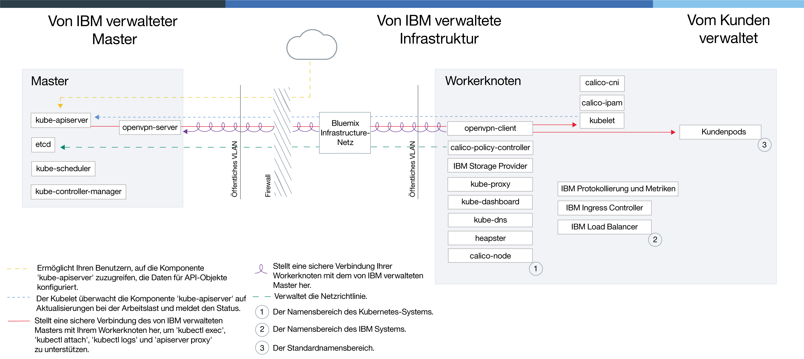

---

copyright:
  years: 2014, 2019
lastupdated: "2019-04-15"

keywords: kubernetes, iks

subcollection: containers

---

{:new_window: target="blank"}
{:shortdesc: .shortdesc}
{:screen: .screen}
{:pre: .pre}
{:table: .aria-labeledby="caption"}
{:codeblock: .codeblock}
{:tip: .tip}
{:note: .note}
{:important: .important}
{:deprecated: .deprecated}
{:download: .download}


# Veraltet: Einführung in Cluster in {{site.data.keyword.Bluemix_dedicated_notm}}
{: #dedicated}

{{site.data.keyword.containerlong}} in {{site.data.keyword.Bluemix_dedicated_notm}} ist veraltet. Sie können keine Cluster in einer {{site.data.keyword.Bluemix_dedicated_notm}}-Umgebung erstellen. Informationen zum Erstellen von Clustern in {{site.data.keyword.Bluemix_notm}} Public finden Sie unter [Einführung in {{site.data.keyword.containerlong_notm}}](/docs/containers?topic=containers-getting-started).
{: deprecated}

Wenn Sie über ein {{site.data.keyword.Bluemix_dedicated_notm}}-Konto verfügen, können Sie Kubernetes-Cluster in einer dedizierten Cloudumgebung (`https://<my-dedicated-cloud-instance>.bluemix.net`) bereitstellen und eine Verbindung zu den vorausgewählten {{site.data.keyword.Bluemix_notm}}-Services herstellen, die ebenfalls darin ausgeführt werden.
{:shortdesc}

Wenn Sie nicht über ein {{site.data.keyword.Bluemix_dedicated_notm}}-Konto verfügen, können Sie [Ihre ersten Schritte mit {{site.data.keyword.containerlong_notm}}](/docs/containers?topic=containers-getting-started) in einem {{site.data.keyword.Bluemix_notm}} Public-Konto ausführen.

## Informationen zur Dedicated-Cloudumgebung
{: #dedicated_environment}

Bei einem {{site.data.keyword.Bluemix_dedicated_notm}}-Konto sind die verfügbaren physischen Ressourcen nur Ihrem Cluster zugeordnet und werden nicht mit Clustern von anderen {{site.data.keyword.IBM_notm}} Kunden geteilt. Sie können eine {{site.data.keyword.Bluemix_dedicated_notm}}-Umgebung einrichten, wenn Sie eine Isolation für Ihren Cluster sowie eine Isolation für die anderen, von Ihnen genutzten {{site.data.keyword.Bluemix_notm}}-Services benötigen. Wenn Sie nicht über ein Dedicated-Konto verfügen, können Sie [Cluster mit dedizierter Hardware in {{site.data.keyword.Bluemix_notm}}  Public-Konten erstellen](/docs/containers?topic=containers-clusters#clusters_ui).
{: shortdesc}

Mit {{site.data.keyword.Bluemix_dedicated_notm}} können Sie Cluster aus dem Katalog in der Dedicated-Konsole oder mithilfe der {{site.data.keyword.containerlong_notm}}-CLI erstellen. Um die Dedicated-Konsole zu verwenden, melden Sie sich mit Ihrer IBMid sowohl bei Ihren Dedicated- als auch den Public-Konten gleichzeitig an. Dank dieser dualen Anmeldung können Sie auf Ihre Public-Cluster über Ihre Dedicated-Konsole zugreifen. Um die CLI zu verwenden, melden Sie sich mithilfe Ihres Dedicated-Endpunkts (`api.<my-dedicated-cloud-instance>.bluemix.net.`) an. Legen Sie dann den {{site.data.keyword.containerlong_notm}}-API-Endpunkt der öffentlichen Region, die der Dedicated-Umgebung zugeordnet ist, als Ziel fest.

Die wichtigsten Unterschiede zwischen {{site.data.keyword.Bluemix_notm}} Public- und Bluemix Dedicated-Konten sind die folgenden.

*   In {{site.data.keyword.Bluemix_dedicated_notm}} besitzt und verwaltet {{site.data.keyword.IBM_notm}} das Konto der IBM Cloud-Infrastruktur (SoftLayer), unter dem die Workerknoten, VLANs und Teilnetze bereitgestellt werden. In {{site.data.keyword.Bluemix_notm}} Public sind Sie Eigner des Kontos der IBM Cloud-Infrastruktur (SoftLayer).
*   In {{site.data.keyword.Bluemix_dedicated_notm}} werden die Spezifikationen für die VLANs und Teilnetze im {{site.data.keyword.IBM_notm}}-verwalteten Konto der IBM Cloud-Infrastruktur (SoftLayer) festgelegt, wenn die Dedicated-Umgebung aktiviert ist. In {{site.data.keyword.Bluemix_notm}} Public werden Spezifikationen für VLANs und Teilnetze festgelegt, wenn der Cluster erstellt wird.

### Unterschiede in der Clusterverwaltung zwischen den Cloudumgebungen
{: #dedicated_env_differences}

<table>
<caption>Unterschiede in der Clusterverwaltung</caption>
<col width="20%">
<col width="40%">
<col width="40%">
 <thead>
 <th>Bereich</th>
 <th>{{site.data.keyword.Bluemix_notm}} Public</th>
 <th>{{site.data.keyword.Bluemix_dedicated_notm}}</th>
 </thead>
 <tbody>
 <tr>
 <td>Clustererstellung</td>
 <td>Erstellen Sie einen kostenlosen Cluster oder einen Standardcluster.</td>
 <td>Erstellen Sie einen Standardcluster.</td>
 </tr>
 <tr>
 <td>Cluster-Hardware und Eigentumsrechte</td>
 <td>In Standardclustern kann die Hardware mit anderen {{site.data.keyword.IBM_notm}} Kunden gemeinsam genutzt oder nur Ihnen zugeordnet werden. Die öffentlichen und privaten VLANs sind Ihr Eigentum und werden von Ihnen in Ihrem IBM Cloud-Infrastrukturkonto (SoftLayer) verwaltet.</td>
 <td>In Clustern in {{site.data.keyword.Bluemix_dedicated_notm}} ist die Hardware immer dediziert. Die öffentlichen und privaten VLANs, die für die Clustererstellung zur Verfügung stehen, werden während der Einrichtung der {{site.data.keyword.Bluemix_dedicated_notm}}-Umgebung vordefiniert. Sie sind Eigentum von IBM und werden von IBM verwaltet. Die während der Clustererstellung verfügbare Zone wird ebenfalls für die {{site.data.keyword.Bluemix_notm}}-Umgebung vordefiniert.</td>
 </tr>
 <tr>
 <td>Lastausgleichsfunktion und Ingress Networking</td>
 <td>Bei der Bereitstellung von Standardclustern werden die folgenden Aktionen automatisch ausgeführt.<ul><li>Ein öffentliches portierbares Teilnetz und ein privates portierbares Teilnetz werden an Ihren Cluster gebunden und Ihrem IBM Cloud-Infrastrukturkonto (SoftLayer) zugewiesen. Weiter Teilnetze können über Ihr IBM Cloud-Infrastrukturkonto (SoftLayer) angefordert werden.</li></li><li>Eine portierbare öffentliche IP-Adresse wird für eine hoch verfügbare Ingress-Lastausgleichsfunktion für Anwendungen (ALB) verwendet und eine eindeutige öffentliche Route wird im Format <code>&lt;clustername&gt;.containers.appdomain.cloud</code> zugewiesen. Sie können diese Route verwenden, um mehrere Apps öffentlich zugänglich zu machen. Eine private portierbare IP-Adresse wird für eine private Lastausgleichsfunktion für Anwendungen verwendet.</li><li>Vier öffentliche und vier private portierbare IP-Adressen sind dem Cluster zugewiesen, die für LoadBalancer-Services verwendet werden können.</ul></td>
 <td>Wenn Sie Ihr Dedicated-Konto erstellen, treffen Sie eine Entscheidung, wie Sie Ihre Cluster-Services zugänglich machen und darauf zugreifen wollen. Um Ihre eigenen Unternehmens-IP-Bereiche (benutzerverwaltete IPs) verwenden zu können, müssen Sie diese beim [Einrichten einer {{site.data.keyword.Bluemix_dedicated_notm}}-Umgebung](/docs/dedicated?topic=dedicated-dedicated#setupdedicated) angeben. <ul><li>Standardmäßig sind keine öffentlichen portierbaren Teilnetze an Cluster gebunden, die Sie in Ihrem Dedicated-Konto erstellen. Stattdessen haben Sie die Flexibilität, das Konnektivitätsmodell auszuwählen, das am besten zu Ihrem Unternehmen passt.</li><li>Nachdem Sie das Cluster erstellt haben, wählen Sie den Typ der Teilnetze aus, die sie an Ihren Cluster binden und für den Lastausgleich bzw. die Ingress-Konnektivität verwenden möchten.<ul><li>Für öffentliche oder private portierbare Teilnetze können Sie [Teilnetze zu Clustern hinzufügen](/docs/containers?topic=containers-subnets#subnets).</li><li>Für benutzerverwaltete IP-Adressen, die Sie IBM beim Dedicated-Onboarding bereitgestellt haben, können Sie [benutzerverwaltete Teilnetze zu Clustern hinzufügen](#dedicated_byoip_subnets).</li></ul></li><li>Nachdem Sie ein Teilnetz an Ihren Cluster gebunden haben, wird die Ingress-Lastausgleichsfunktion für Anwendungen (ALB) erstellt. Eine öffentliche Ingress-Route wird nur dann erstellt, wenn Sie ein portierbares öffentliches Teilnetz verwenden.</li></ul></td>
 </tr>
 <tr>
 <td>NodePort Networking</td>
 <td>Machen Sie auf Ihrem Workerknoten einen öffentlichen Port zugänglich und verwenden Sie die öffentliche IP-Adresse des Workerknotens, um öffentlich auf Ihren Service im Cluster zuzugreifen.</td>
 <td>Alle öffentlichen IP-Adressen der Workerknoten sind durch eine Firewall blockiert. Bei {{site.data.keyword.Bluemix_notm}}-Services, die dem Cluster hinzugefügt wurden, kann der Knotenport jedoch über eine öffentliche IP-Adresse oder eine private IP-Adresse zugegriffen werden.</td>
 </tr>
 <tr>
 <td>Persistenter Speicher</td>
 <td>Verwenden Sie für Datenträger eine [dynamische Bereitstellung](/docs/containers?topic=containers-kube_concepts#dynamic_provisioning) oder eine [statische Bereitstellung](/docs/containers?topic=containers-kube_concepts#static_provisioning).</td>
 <td>Verwenden Sie für Datenträger eine [dynamische Bereitstellung](/docs/containers?topic=containers-kube_concepts#dynamic_provisioning). [Öffnen Sie einen Supportfall](/docs/get-support?topic=get-support-getting-customer-support#getting-customer-support), um eine Sicherung für ihre Datenträger bzw. eine Wiederherstellung von Ihren Datenträgern anzufordern und andere Speicherfunktionen auszuführen.</li></ul></td>
 </tr>
 <tr>
 <td>Image-Registry-URL in {{site.data.keyword.registryshort_notm}}</td>
 <td><ul><li>Vereinigte Staaten (Süden) und Vereinigte Staaten (Osten): <code>registry.ng bluemix.net</code></li><li>Vereinigtes Königreich (Süden): <code>registry.eu-gb.bluemix.net</code></li><li>EU-Central (Frankfurt): <code>registry.eu-de.bluemix.net</code></li><li>Australien (Sydney): <code>registry.au-syd.bluemix.net</code></li></ul></td>
 <td><ul><li>Verwenden Sie für neue Namensbereiche dieselben regionsbasierten Registrys, die für {{site.data.keyword.Bluemix_notm}} Public definiert sind.</li><li>Verwenden Sie für Namensbereiche, die für einzelne und skalierbare Container in {{site.data.keyword.Bluemix_dedicated_notm}} eingerichtet wurden, <code>registry.&lt;dedizierte_domäne&gt;</code>.</li></ul></td>
 </tr>
 <tr>
 <td>Auf die Registry zugreifen</td>
 <td>Die einzelnen Optionen sind unter [Private und öffentliche Image-Registrys mit {{site.data.keyword.containerlong_notm}} verwenden](/docs/containers?topic=containers-images) beschrieben.</td>
 <td><ul><li>Die einzelnen Optionen für neue Namensbereiche sind unter [Private und öffentliche Image-Registrys mit {{site.data.keyword.containerlong_notm}} verwenden](/docs/containers?topic=containers-images) beschrieben.</li><li>Für Namensbereiche, die für einzelne und skalierbare Gruppen eingerichtet wurden: [Verwenden Sie ein Token und erstellen Sie einen geheimen Kubernetes-Schlüssel](#cs_dedicated_tokens) zur Authentifizierung.</li></ul></td>
 </tr>
 <tr>
 <td>Mehrzonencluster</td>
 <td>Erstellen Sie [Mehrzonencluster](/docs/containers?topic=containers-plan_clusters#multizone), indem Sie Ihren Worker-Pools weitere Zonen hinzufügen.</td>
 <td>Erstellen Sie [Einzelzonencluster](/docs/containers?topic=containers-plan_clusters#single_zone). Die verfügbare Zone wurde vordefiniert, als die {{site.data.keyword.Bluemix_dedicated_notm}}-Umgebung eingerichtet wurde. Standardmäßig wird ein Einzelzonencluster mit einem Worker-Pool konfiguriert, der den Namen `default` hat. Der Worker-Pool gruppiert Workerknoten mit derselben Konfiguration, wie z. B. dem Maschinentyp, die Sie während der Clustererstellung definiert haben. Sie können Ihrem Cluster weitere Workerknoten hinzufügen, indem Sie [die Größe eines vorhandenen Worker-Pools ändern](/docs/containers?topic=containers-clusters#resize_pool) oder [einen neuen Worker-Pool hinzufügen](/docs/containers?topic=containers-clusters#add_pool). Wenn Sie einen Worker-Pool hinzufügen, müssen Sie die verfügbare Zone zum Worker-Pool hinzufügen, damit die Worker in der Zone bereitgestellt werden können. Sie können jedoch keine anderen Zonen zu Ihren Worker-Pools hinzufügen.</td>
 </tr>
</tbody></table>
{: caption="Funktionsunterschiede zwischen {{site.data.keyword.Bluemix_notm}} Public und {{site.data.keyword.Bluemix_dedicated_notm}}" caption-side="top"}

<br />


### Servicearchitektur
{: #dedicated_ov_architecture}

Jeder Workerknoten wird mit separaten Rechenressourcen, einem Netzbetrieb und einem Datenträgerservice konfiguriert.
{:shortdesc}

Integrierte Sicherheitsfeatures stellen die Isolation, die Funktionalität für die Verwaltung von Ressourcen und die Einhaltung der Sicherheitsbestimmungen für die Workerknoten sicher. Der Workerknoten kommuniziert über sichere TLS-Zertifikate und eine OpenVPN-Verbindung mit dem Master.


*Kubernetes-Architektur und Netzbetrieb in {{site.data.keyword.Bluemix_dedicated_notm}}*



<br />


## {{site.data.keyword.containerlong_notm}} unter Dedicated einrichten
{: #dedicated_setup}

Jede {{site.data.keyword.Bluemix_dedicated_notm}}-Umgebung verfügt über ein öffentliches, zum Client gehörendes Unternehmenskonto in {{site.data.keyword.Bluemix_notm}}. Damit Benutzer in der Dedicated-Umgebung Cluster erstellen können, muss der Administrator die Benutzer zu einem öffentlichen Unternehmenskonto hinzufügen.
{:shortdesc}

Vorbereitende Schritte:
  * [Richten Sie eine {{site.data.keyword.Bluemix_dedicated_notm}}-Umgebung ein](/docs/dedicated?topic=dedicated-dedicated#setupdedicated).
  * Wenn Ihr lokales System oder Ihr Unternehmensnetz die öffentlichen Internetendpunkte mithilfe von Proxys oder Firewalls steuert, müssen Sie [erforderliche Ports und IP-Adressen in Ihrer Firewall öffnen](/docs/containers?topic=containers-firewall#firewall).
  * [Laden Sie die Cloud Foundry-CLI ](https://github.com/cloudfoundry/cli/releases) herunter.

Gehen Sie wie folgt vor, damit {{site.data.keyword.Bluemix_dedicated_notm}}-Benutzer auf Cluster zugreifen können:

1.  Der Besitzer Ihres {{site.data.keyword.Bluemix_notm}} Public-Kontos muss einen API-Schlüssel generieren.
    1.  Melden Sie sich beim Endpunkt für Ihre {{site.data.keyword.Bluemix_dedicated_notm}}-Instanz an. Geben Sie die {{site.data.keyword.Bluemix_notm}}-Berechtigungsnachweise für den Besitzer des Public-Kontos ein und wählen Sie bei entsprechender Aufforderung Ihr Konto aus.

        ```
        ibmcloud login -a api.<meine-dedizierte-cloudinstanz>.<region>.bluemix.net
        ```
        {: pre}

        Wenn Sie über eine föderierte ID verfügen, geben Sie `ibmcloud login -a api.<my-dedicated-cloud-instance>.<region>.bluemix.net --sso` an, um sich bei der {{site.data.keyword.Bluemix_notm}}-CLI anzumelden. Geben Sie Ihren Benutzernamen ein und verwenden Sie die bereitgestellte URL in Ihrer CLI-Ausgabe, um Ihren einmaligen Kenncode abzurufen. Bei Verwendung einer föderierten ID schlägt die Anmeldung ohne die Option `--sso` fehl, mit der Option `--sso` ist sie erfolgreich.
        {: tip}

    2.  Generieren Sie einen API-Schlüssel, um Benutzer zum öffentlichen Konto einzuladen. Notieren Sie sich den API-Schlüssel, den der Administrator des Dedicated-Kontos im nächsten Schritt verwendet.

        ```
        ibmcloud iam api-key-create <schlüsselname> -d "Key to invite users to <name_des_dedizierten_kontos>"
        ```
        {: pre}

    3.  Notieren Sie sich die GUID der öffentlichen Kontoorganisation, zu der Sie Benutzer einladen möchten. Diese GUID wird vom Dedicated-Kontoadministrator im nächsten Schritt verwendet.

        ```
        ibmcloud account orgs
        ```
        {: pre}

2.  Der Besitzer Ihres {{site.data.keyword.Bluemix_dedicated_notm}}-Kontos kann einzelne oder mehrere Benutzer zu Ihrem Public-Konto einladen.
    1.  Melden Sie sich beim Endpunkt für Ihre {{site.data.keyword.Bluemix_dedicated_notm}}-Instanz an. Geben Sie die {{site.data.keyword.Bluemix_notm}}-Berechtigungsnachweise für den Besitzer des Dedicated-Kontos ein und wählen Sie bei entsprechender Aufforderung Ihr Konto aus.

        ```
        ibmcloud login -a api.<meine-dedizierte-cloudinstanz>.<region>.bluemix.net
        ```
        {: pre}

        Wenn Sie über eine föderierte ID verfügen, geben Sie `ibmcloud login -a api.<my-dedicated-cloud-instance>.<region>.bluemix.net --sso` an, um sich bei der {{site.data.keyword.Bluemix_notm}}-CLI anzumelden. Geben Sie Ihren Benutzernamen ein und verwenden Sie die bereitgestellte URL in Ihrer CLI-Ausgabe, um Ihren einmaligen Kenncode abzurufen. Bei Verwendung einer föderierten ID schlägt die Anmeldung ohne die Option `--sso` fehl, mit der Option `--sso` ist sie erfolgreich.
        {: tip}

    2.  Laden Sie die Benutzer zum öffentlichen Konto ein.
        * Gehen Sie wie folgt vor, um einen einzelnen Benutzer einzuladen:

            ```
            ibmcloud cf bluemix-admin invite-users-to-public -userid=<benutzer-e-mail> -apikey=<öffentlicher_api-schlüssel> -public_org_id=<öffentliche_org-id>
            ```
            {: pre}

            Ersetzen Sie <em>&lt;benutzer-IBMid&gt;</em> durch die E-Mail-Adresse des Benutzers, den Sie einladen möchten, <em>&lt;öffentlicher_api-schlüssel&gt;</em> durch den im vorherigen Schritt generierten API-Schlüssel und <em>&lt;öffentliche_org-id&gt;</em> durch die GUID der öffentlichen Kontoorganisation. 

        * Gehen Sie wie folgt vor, um alle Benutzer einzuladen, die derzeit Mitglied in einer Dedicated-Kontoorganisation sind:

            ```
            ibmcloud cf bluemix-admin invite-users-to-public -organization=<dedizierte_org-id> -apikey=<öffentlicher_api-schlüssel> -public_org_id=<öffentliche_org-id>
            ```

            Ersetzen Sie <em>&lt;dedizierte_org-id&gt;</em> durch die ID der Dedicated-Kontoorganisation, <em>&lt;öffentlicher_api-schlüssel&gt;</em> durch den im vorherigen Schritt generierten API-Schlüssel und <em>&lt;öffentliche_org-id&gt;</em> durch die GUID der öffentlichen Kontoorganisation. 

    3.  Wenn ein Benutzer über eine IBMid verfügt, wird er automatisch zur angegebenen Organisation in dem öffentlichen Konto hinzugefügt. Wenn ein Benutzer nicht über eine IBMid verfügt, wird eine Einladung an die Benutzer-E-Mail-Adresse gesendet. Sobald der Benutzer die Einladung annimmt, wird eine IBMid für ihn erstellt und er wird zur angegebenen Organisation im öffentlichen Konto hinzugefügt.

    4.  Überprüfen Sie, dass die Benutzer zum Konto hinzugefügt wurden.

        ```
        ibmcloud cf bluemix-admin invite-users-status -apikey=<öffentlicher_api-schlüssel>
        ```
        {: pre}

        Eingeladene Benutzer, die über eine IBMid verfügen, haben den Status `ACTIVE`. Eingeladene Benutzer, die über keine IBMid verfügen, haben den Status `PENDING`, bevor Sie die Einladung akzeptieren, und den Status `ACTIVE` nach dem Akzeptieren der Einladung.

3.  Wenn ein Benutzer Berechtigungen zum Erstellen von Clustern benötigt, müssen Sie diesem Benutzer die Administratorrolle erteilen.

    1.  Klicken Sie in der Menüleiste in der Public-Konsole auf **Verwalten > Sicherheit > Identität und Zugriff** und klicken Sie anschließend auf **Benutzer**.

    2.  Wählen Sie über die Zeile für denjenigen Benutzer, dem Sie Zugriff erteilen wollen, das Menü **Aktionen** aus und klicken Sie anschließend auf **Zugriff zuweisen**.

    3.  Wählen Sie **Zugriff auf Ressourcen zuweisen** aus.

    4.  Wählen Sie in der Liste **Services** den Eintrag **{{site.data.keyword.containerlong}}** aus.

    5.  Wählen Sie in der Liste **Region** entweder **Alle aktuellen Regionen** oder eine bestimmte Region aus, sofern Sie dazu aufgefordert werden.

    6. Wählen Sie unter **Rollen auswählen** den Eintrag 'Administrator' aus.

    7. Klicken Sie auf **Zuweisen**.

4.  Benutzer können sich beim Dedicated-Kontoendpunkt anmelden, um mit dem Erstellen von Clustern zu beginnen.

    1.  Melden Sie sich beim Endpunkt für Ihre {{site.data.keyword.Bluemix_dedicated_notm}}-Instanz an. Geben Sie Ihre IBMid ein, wenn Sie dazu aufgefordert werden.

        ```
        ibmcloud login -a api.<meine-dedizierte-cloudinstanz>.<region>.bluemix.net
        ```
        {: pre}

        Wenn Sie über eine föderierte ID verfügen, geben Sie `ibmcloud login -a api.<my-dedicated-cloud-instance>.<region>.bluemix.net --sso` an, um sich bei der {{site.data.keyword.Bluemix_notm}}-CLI anzumelden. Geben Sie Ihren Benutzernamen ein und verwenden Sie die bereitgestellte URL in Ihrer CLI-Ausgabe, um Ihren einmaligen Kenncode abzurufen. Bei Verwendung einer föderierten ID schlägt die Anmeldung ohne die Option `--sso` fehl, mit der Option `--sso` ist sie erfolgreich.
        {: tip}

    2.  Wenn Sie sich zum ersten Mal anmelden, geben Sie Ihre Dedicated-Benutzer-ID und Ihr Kennwort an, wenn Sie dazu aufgefordert werden. Ihr Dedicated-Konto wird authentifiziert und die Dedicated- und Public-Konten werden miteinander verknüpft. Im Anschluss müssen Sie nur noch Ihre IBMid angeben, wenn Sie sich anmelden. Weitere Informationen finden Sie unter [Dedizierte ID mit öffentlicher IBMid verbinden](/docs/iam?topic=iam-connect_dedicated_id#connect_dedicated_id).

        Sie müssen sich sowohl bei Ihrem Dedicated- als auch bei Ihrem Public-Konto anmelden, um Cluster zu erstellen. Wenn Sie sich nur bei Ihrem Dedicated-Konto anmelden möchten, verwenden Sie das Flag `--no-iam` für die Anmeldung am Dedicated-Endpunkt.
        {: note}

    3.  Für den Zugriff auf oder die Erstellung von Clustern in der Dedicated-Umgebung müssen Sie die Region festlegen, die der betreffenden Umgebung zugeordnet ist. **Hinweis:** Cluster können nur in der Ressourcengruppe `default` erstellt werden.

        ```
        ibmcloud ks region-set
        ```
        {: pre}

5.  Wenn Sie die Verknüpfung zwischen Ihren Konten aufheben möchten, können Sie Ihre IBMid von Ihrer Dedicated-Benutzer-ID abkoppeln. Weitere Informationen finden Sie unter [Verbindung zwischen dedizierter ID und öffentlicher IBMid aufheben](/docs/iam?topic=iam-connect_dedicated_id#disconnect_id).

    ```
    ibmcloud iam dedicated-id-disconnect
    ```
    {: pre}

<br />


## Cluster erstellen
{: #dedicated_administering}

Konzipieren Sie die Konfiguration Ihres {{site.data.keyword.Bluemix_dedicated_notm}}-Clusters, um das größtmögliche Maß an Verfügbarkeit und Kapazität zu erzielen.
{:shortdesc}

### Cluster über die {{site.data.keyword.Bluemix_notm}}-Konsole erstellen
{: #dedicated_creating_ui}

1. Öffnen Sie Ihre Dedicated-Konsole: `https://<my-dedicated-cloud-instance>.bluemix.net`.

2. Aktivieren Sie das Kontrollkästchen **Also log in to {{site.data.keyword.Bluemix_notm}} Public** und klicken Sie auf **Log in**.

3. Folgen Sie den Eingabeaufforderungen, um sich mit Ihrer IBMid anzumelden. Wenn Sie sich zum ersten Mal bei Ihrem Dedicated-Konto anmelden, befolgen Sie die Eingabeaufforderungen für die Anmeldung bei {{site.data.keyword.Bluemix_dedicated_notm}}.

4. Wählen Sie im Katalog **Containers** aus und klicken Sie auf **Kubernetes cluster**.

5. Konfigurieren Sie die Clusterdetails.

    1. Geben Sie bei **Cluster Name** einen Namen für den Cluster ein. Der Name muss mit einem Buchstaben beginnen, darf Buchstaben, Ziffern und den Bindestrich (-) enthalten und darf maximal 35 Zeichen lang sein. Der vollständig qualifizierte Domänenname für die Ingress-Unterdomäne setzt sich aus dem Clusternamen und der Region zusammen, in der der Cluster bereitgestellt wird. Um sicherzustellen, dass die Ingress-Unterdomäne innerhalb einer Region eindeutig ist, wird der Clustername möglicherweise abgeschnitten und es wird ein beliebiger Wert innerhalb des Ingress-Domänennamens angehängt.

    2. Wählen Sie die **Zone** aus, in der der Cluster implementiert werden soll. Die verfügbare Zone wurde vordefiniert, als die {{site.data.keyword.Bluemix_dedicated_notm}}-Umgebung eingerichtet wurde.

    3. Wählen Sie die Kubernetes-API-Serverversion für den Cluster-Masterknoten aus.

    4. Wählen Sie einen Typ von Hardwareisolation aus. Virtuell wird auf Stundenbasis berechnet und Bare-Metal wird monatlich in Rechnung gestellt.

        - **Virtuell - Dediziert**: Ihre Workerknoten werden in einer Infrastruktur gehostet, die Ihrem Konto vorbehalten ist. Ihre physischen Ressourcen sind vollständig isoliert.

        - **Bare-Metal**: Bare-Metal-Server werden monatlich abgerechnet und nach Bestellung manuell von der IBM Cloud-Infrastruktur (SoftLayer) bereitgestellt, daher kann die Ausführung mehr als einen Arbeitstag dauern. Bare-Metal-Server eignen sich am besten für Hochleistungsanwendungen, die mehr Ressourcen und Hoststeuerung erfordern. 

        Stellen Sie sicher, dass Sie eine Bare-Metal-Maschine bereitstellen wollen. Da die Abrechnung monatlich erfolgt, wird Ihnen ein voller Monat auch dann berechnet, wenn Sie versehentlich bestellen und sofort danach Ihre Bestellung wieder stornieren.
        {:tip}

    5. Wählen Sie in **Machine type** einen Maschinentyp aus. Der Maschinentyp definiert die Menge an virtueller CPU, Hauptspeicher und Festplattenspeicher, die in jedem Workerknoten eingerichtet wird und allen Containern zur Verfügung steht. Die verfügbaren Bare-Metal- und virtuellen Maschinentypen variieren je nach Zone, in der Sie den Cluster implementieren. Weitere Informationen finden Sie in der Dokumentation zum [Befehl](/docs/containers?topic=containers-cs_cli_reference#cs_machine_types) `ibmcloud ks machine-type`. Nachdem Sie Ihre Cluster erstellt haben, können Sie unterschiedliche Maschinentypen hinzufügen, indem Sie einen Workerknoten zum Cluster hinzufügen.

    6. Wählen Sie für **Number of worker nodes** die benötigte Anzahl von Workerknoten aus. Wählen Sie den Wert `3` aus, um Hochverfügbarkeit für Ihren Cluster sicherzustellen.

    7. Wählen Sie ein **öffentliches VLAN** (optional) und ein **privates VLAN** (erforderlich) aus. Die verfügbaren öffentlichen und privaten VLANs werden während der Einrichtung der {{site.data.keyword.Bluemix_dedicated_notm}}-Umgebung vordefiniert. Beide VLANs kommunizieren zwischen Workerknoten, das öffentliche VLAN kommuniziert jedoch auch mit dem von IBM verwalteten Kubernetes-Master. Sie können dasselbe VLAN für mehrere Cluster verwenden.
        Wenn Workerknoten nur mit einem privaten VLAN eingerichtet werden, müssen Sie die Kommunikation zwischen Workerknoten und Cluster-Master zulassen, indem Sie den [privaten Serviceendpunkt aktivieren](/docs/containers?topic=containers-cs_network_ov#cs_network_ov_master_private) oder eine [Gateway-Einheit konfigurieren](/docs/containers?topic=containers-cs_network_ov#cs_network_ov_master_gateway).
        {: note}

    8. Standardmäßig ist **Lokale Festplatte verschlüsseln** ausgewählt. Wenn Sie dieses Kontrollkästchen abwählen, werden die Containerlaufzeitdaten des Hosts nicht verschlüsselt. [Weitere Informationen zur Verschlüsselung](/docs/containers?topic=containers-security#encrypted_disk).

6. Klicken Sie auf **Cluster einrichten**. Auf der Registerkarte **Workerknoten** können Sie den Fortschritt der Bereitstellung des Workerknotens überprüfen. Nach Abschluss der Bereitstellung können Sie auf der Registerkarte **Übersicht** sehen, dass Ihr Cluster bereit ist.
    Jedem Workerknoten werden eine eindeutige Workerknoten-ID und ein Domänenname zugewiesen, die nach dem manuellen Erstellen des Clusters nicht geändert werden dürfen. Wenn die ID oder der Domänenname geändert wird, kann der Kubernetes-Master Ihren Cluster nicht mehr verwalten.
    {: important}

### Cluster über die CLI erstellen
{: #dedicated_creating_cli}

1.  Installieren Sie die {{site.data.keyword.Bluemix_notm}}-CLI sowie das [{{site.data.keyword.containerlong_notm}}-Plug-in](/docs/containers?topic=containers-cs_cli_install#cs_cli_install).
2.  Melden Sie sich beim Endpunkt für Ihre {{site.data.keyword.Bluemix_dedicated_notm}}-Instanz an. Geben Sie Ihre Berechtigungsnachweise für {{site.data.keyword.Bluemix_notm}} ein und wählen Sie Ihr Konto aus, wenn Sie dazu aufgefordert werden.

    ```
    ibmcloud login -a api.<my-dedicated-cloud-instance>.<region>.bluemix.net
    ```
    {: pre}

    Wenn Sie über eine föderierte ID verfügen, geben Sie `ibmcloud login -a api.<my-dedicated-cloud-instance>.<region>.bluemix.net --sso` an, um sich bei der {{site.data.keyword.Bluemix_notm}}-CLI anzumelden. Geben Sie Ihren Benutzernamen ein und verwenden Sie die bereitgestellte URL in Ihrer CLI-Ausgabe, um Ihren einmaligen Kenncode abzurufen. Bei Verwendung einer föderierten ID schlägt die Anmeldung ohne die Option `--sso` fehl, mit der Option `--sso` ist sie erfolgreich.
    {: tip}

3.  Um eine Region als Ziel auszuwählen, führen Sie `ibmcloud ks region-set` aus.

4.  Erstellen Sie einen Cluster mit dem Befehl `cluster-create`. Wenn Sie ein Standardcluster erstellen, wird für die Hardware des Workerknotens nach Nutzungsstunden abgerechnet.

    Beispiel:

    ```
    ibmcloud ks cluster-create --zone <zone> --machine-type <maschinentyp> --name <clustername> --workers <anzahl>
    ```
    {: pre}

    <table>
    <caption>Erklärung der Bestandteile dieses Befehls</caption>
    <thead>
    <th colspan=2> Erklärung der Bestandteile dieses Befehls</th>
    </thead>
    <tbody>
    <tr>
    <td><code>cluster-create</code></td>
    <td>Der Befehl zum Erstellen eines Clusters in Ihrer {{site.data.keyword.Bluemix_notm}}-Organisation.</td>
    </tr>
    <tr>
    <td><code>--zone <em>&lt;zone&gt;</em></code></td>
    <td>Geben Sie die {{site.data.keyword.Bluemix_notm}}-Zonen-ID ein, die Ihre Dedicated-Umgebung verwenden soll.</td>
    </tr>
    <tr>
    <td><code>--machine-type <em>&lt;maschinentyp&gt;</em></code></td>
    <td>Geben Sie einen Maschinentyp ein. Sie können Ihre Workerknoten als virtuelle Maschinen auf dedizierter Hardware oder als physische Maschinen auf Bare-Metal-Systemen bereitstellen. Die Typen der verfügbaren physischen und virtuellen Maschinen variieren je nach der Zone, in der Sie den Cluster implementieren. Weitere Informationen finden Sie in der Dokumentation zum [Befehl](/docs/containers?topic=containers-cs_cli_reference#cs_machine_types) `ibmcloud ks machine-type`.</td>
    </tr>
    <tr>
    <td><code>--public-vlan <em>&lt;maschinentyp&gt;</em></code></td>
    <td>Geben Sie die ID des öffentlichen VLAN  ein, das Ihre Dedicated-Umgebung verwenden soll. Wenn Sie Ihre Workerknoten nur mit einem private VLAN verbinden möchten, geben Sie diese Option nicht an.<p class="note">Wenn Workerknoten nur mit einem privaten VLAN eingerichtet werden, müssen Sie die Kommunikation zwischen Workerknoten und Cluster-Master zulassen, indem Sie den [privaten Serviceendpunkt aktivieren](/docs/containers?topic=containers-cs_network_ov#cs_network_ov_master_private) oder eine [Gateway-Einheit konfigurieren](/docs/containers?topic=containers-cs_network_ov#cs_network_ov_master_gateway).</p></td>
    </tr>
    <tr>
    <td><code>--private-vlan <em>&lt;maschinentyp&gt;</em></code></td>
    <td>Geben Sie die ID des privaten VLAN  ein, das Ihre Dedicated-Umgebung verwenden soll.</td>
    </tr>  
    <tr>
    <td><code>--name <em>&lt;name&gt;</em></code></td>
    <td>Geben Sie einen Namen für Ihren Cluster an. Der Name muss mit einem Buchstaben beginnen, darf Buchstaben, Ziffern und den Bindestrich (-) enthalten und darf maximal 35 Zeichen lang sein. Der vollständig qualifizierte Domänenname für die Ingress-Unterdomäne setzt sich aus dem Clusternamen und der Region zusammen, in der der Cluster bereitgestellt wird. Um sicherzustellen, dass die Ingress-Unterdomäne innerhalb einer Region eindeutig ist, wird der Clustername möglicherweise abgeschnitten und es wird ein beliebiger Wert innerhalb des Ingress-Domänennamens angehängt.
</td>
    </tr>
    <tr>
    <td><code>--workers <em>&lt;anzahl&gt;</em></code></td>
    <td>Geben Sie die Anzahl von Workerknoten ein, die im Cluster eingebunden werden sollen. Wird die Option <code>--workers</code> nicht angegeben, wird ein Workerknoten erstellt.</td>
    </tr>
    <tr>
    <td><code>--kube-version <em>&lt;major.minor.patch&gt;</em></code></td>
    <td>Die Kubernetes-Version für den Cluster-Masterknoten. Dieser Wert ist optional. Wenn die Version nicht angegeben ist, wird der Cluster mit dem Standard für unterstützte Kubernetes-Versionen erstellt. Führen Sie den Befehl <code>ibmcloud ks kube-versions</code> aus, um die verfügbaren Versionen anzuzeigen.
</td>
    </tr>
    <tr>
    <td><code>--disable-disk-encrypt</code></td>
    <td>Workerknoten verfügen standardmäßig über eine [Plattenverschlüsselung](/docs/containers?topic=containers-security#encrypted_disk) (256-Bit-AES). Wenn Sie die Verschlüsselung inaktivieren möchten, schließen Sie diese Option ein.</td>
    </tr>
    <tr>
    <td><code>--trusted</code></td>
    <td>Aktivieren Sie [Trusted Compute](/docs/containers?topic=containers-security#trusted_compute), um Ihre Bare-Metal-Workerknoten auf Manipulation zu überprüfen. Wenn Sie Trusted Compute während der Clustererstellung nicht aktivieren, dies jedoch später nachholen möchten, können Sie den [Befehl](/docs/containers?topic=containers-cs_cli_reference#cs_cluster_feature_enable) `ibmcloud ks feature-enable` verwenden. Nachdem Sie Trusted Compute aktiviert haben, können Sie es später nicht mehr inaktivieren.</td>
    </tr>
    </tbody></table>

5.  Prüfen Sie, ob die Erstellung des Clusters angefordert wurde.

    ```
    ibmcloud ks clusters
    ```
    {: pre}

    * Bei virtuellen Maschinen kann es einige Minuten dauern, bis die Workerknotenmaschinen angewiesen werden und der Cluster in Ihrem Konto eingerichtet und bereitgestellt wird. Physische Bare-Metal-Maschinen werden durch einen manuelle Interaktion mit der IBM Cloud-Infrastruktur (SoftLayer) bereitgestellt, daher kann die Ausführung mehr als einen Arbeitstag dauern.
    * Wenn die folgende Fehlernachricht angezeigt wird, [öffnen Sie ein Supportfall](/docs/get-support?topic=get-support-getting-customer-support#getting-customer-support).
        ```
        {{site.data.keyword.Bluemix_notm}} Infrastructure Exception: Could not place order. There are insufficient resources behind router 'routername' to fulfill the request for the following guests: 'worker-id'.
        ```

    Nach Abschluss der Bereitstellung Ihres Clusters wird der Status des Clusters in **deployed** (Bereitgestellt) geändert.

    ```
    Name         ID                                   State      Created          Workers    Zone      Version     Resource Group Name
    my_cluster   paf97e8843e29941b49c598f516de72101   deployed   20170201162433   1          mil01     1.12.7      Default
    ```
    {: screen}

6.  Überprüfen Sie den Status der Workerknoten.

    ```
    ibmcloud ks workers --cluster <clustername_oder_-id>
    ```
    {: pre}

    Wenn die Workerknoten bereit sind, wechselt der Zustand (State) zu **normal**, während für den Status die Angabe **Ready** (Bereit) angezeigt wird. Wenn der Knotenstatus **Ready** (bereit) lautet, können Sie auf den Cluster zugreifen.

    Jedem Workerknoten werden eine eindeutige Workerknoten-ID und ein Domänenname zugewiesen, die nach dem Erstellen des Clusters nicht manuell geändert werden dürfen. Wenn die ID oder der Domänenname geändert wird, kann der Kubernetes-Master Ihren Cluster nicht mehr verwalten.
    {: important}

    ```
    ID                                                 Public IP       Private IP       Machine Type   State    Status   Zone   Version
    kube-mil01-paf97e8843e29941b49c598f516de72101-w1   169.xx.xxx.xxx  10.xxx.xx.xxx    free           normal   Ready    mil01      1.12.7
    ```
    {: screen}

7.  Legen Sie den von Ihnen erstellten Cluster als Kontext für diese Sitzung fest. Führen Sie diese Konfigurationsschritte jedes Mal aus, wenn Sie mit Ihrem Cluster arbeiten.

    1.  Ermitteln Sie den Befehl zum Festlegen der Umgebungsvariablen und laden Sie die Kubernetes-Konfigurationsdateien herunter.

        ```
        ibmcloud ks cluster-config --cluster <clustername_oder_-id>
        ```
        {: pre}

        Wenn der Download der Konfigurationsdateien abgeschlossen ist, wird ein Befehl angezeigt, den Sie verwenden können, um den Pfad zu der lokalen Kubernetes-Konfigurationsdatei als Umgebungsvariable festzulegen.

        Beispiel für OS X:

        ```
        export KUBECONFIG=/Users/<benutzername>/.bluemix/plugins/container-service/clusters/<clustername>/kube-config-prod-dal10-<clustername>.yml
        ```
        {: screen}

    2.  Kopieren Sie den Befehl in der Ausgabe und fügen Sie ihn ein, um die Umgebungsvariable `KUBECONFIG` festzulegen.
    3.  Stellen Sie sicher, dass die Umgebungsvariable `KUBECONFIG` richtig eingestellt ist.

        Beispiel für OS X:

        ```
        echo $KUBECONFIG
        ```
        {: pre}

        Ausgabe:

        ```
        /Users/<benutzername>/.bluemix/plugins/container-service/clusters/<clustername>/kube-config-prod-dal10-<clustername>.yml

        ```
        {: screen}

8.  Gehen Sie wie folgt vor, um das Kubernetes-Dashboard über den Standardport 8001 zu öffnen:
    1.  Legen Sie die Standardportnummer für den Proxy fest.

        ```
        kubectl proxy
        ```
        {: pre}

        ```
        Starting to serve on 127.0.0.1:8001
        ```
        {: screen}

    2.  Öffnen Sie die folgende URL in einem Web-Browser, damit das Kubernetes-Dashboard angezeigt wird.

        ```
        http://localhost:8001/ui
        ```
        {: codeblock}

### Workerknoten hinzufügen
{: #add_workers_dedicated}

Mit {{site.data.keyword.Bluemix_dedicated_notm}} können Sie nur [Einzelzonencluster](/docs/containers?topic=containers-plan_clusters#single_zone) erstellen. Standardmäßig wird ein Einzelzonencluster mit einem Worker-Pool konfiguriert, der den Namen `default` hat. Der Worker-Pool gruppiert Workerknoten mit derselben Konfiguration, wie z. B. dem Maschinentyp, die Sie während der Clustererstellung definiert haben. Sie können Ihrem Cluster weitere Workerknoten hinzufügen, indem Sie [die Größe eines vorhandenen Worker-Pools ändern](/docs/containers?topic=containers-clusters#resize_pool) oder [einen neuen Worker-Pool hinzufügen](/docs/containers?topic=containers-clusters#add_pool). Wenn Sie einen Worker-Pool hinzufügen, müssen Sie die verfügbare Zone zum Worker-Pool hinzufügen, damit die Worker in der Zone bereitgestellt werden können. Sie können jedoch keine anderen Zonen zu Ihren Worker-Pools hinzufügen.
{: shortdesc}

### Private und öffentliche Image-Registrys verwenden
{: #dedicated_images}

Erfahren Sie mehr über das [Sichern der persönlichen Daten](/docs/containers?topic=containers-security#pi) bei der Arbeit mit Container-Images.

Die einzelnen Optionen für neue Namensbereiche sind unter [Private und öffentliche Image-Registrys mit {{site.data.keyword.containerlong_notm}} verwenden](/docs/containers?topic=containers-images) beschrieben. Für Namensbereiche, die für einzelne und skalierbare Gruppen eingerichtet wurden: [Verwenden Sie ein Token und erstellen Sie einen geheimen Kubernetes-Schlüssel](#cs_dedicated_tokens) zur Authentifizierung.

### Clustern Teilnetze hinzufügen
{: #dedicated_cluster_subnet}

Ändern Sie den Pool der verfügbaren portierbaren öffentlichen IP-Adressen, indem Sie Ihrem Cluster Teilnetze hinzufügen. Weitere Informationen finden Sie unter [Clustern Teilnetze hinzufügen](/docs/containers?topic=containers-subnets#subnets). Überprüfen Sie die folgenden Unterschiede beim Hinzufügen von Teilnetzen zu Dedicated-Clustern.
{: shortdesc}

#### Weitere vom Benutzer verwaltete Teilnetze und IP-Adressen zu Ihren Kubernetes-Clustern hinzufügen
{: #dedicated_byoip_subnets}

Stellen Sie weitere eigene Teilnetze aus einem lokalen Netz zur Verfügung, über das auf {{site.data.keyword.containerlong_notm}} zugegriffen werden soll. Sie können private IP-Adressen aus diesen Teilnetzen zu Ingress und zu den LoadBalancer-Services in Ihrem Kubernetes-Cluster hinzufügen. Benutzerverwaltete Teilnetze können auf zwei Arten konfiguriert sein, abhängig von dem Format des Teilnetzes, das Sie verwenden möchten.
{: shortdesc}

Voraussetzungen:
- Vom Benutzer verwaltete Teilnetze können nur zu privaten VLANs hinzugefügt werden.
- Die Begrenzung für die Länge des Teilnetzpräfix beträgt /24 bis /30. Beispiel: `203.0.113.0/24` gibt 253 verwendbare private IP-Adressen an, während `203.0.113.0/30` 1 verwendbare private IP-Adresse angibt.
- Die erste IP-Adresse im Teilnetz muss als Gateway für das Teilnetz verwendet werden.

Vorab müssen Sie das Routing des Netzverkehrs zwischen Ihrem Unternehmensnetz und dem {{site.data.keyword.Bluemix_dedicated_notm}}-Netz konfigurieren, das das benutzerverwaltete Teilnetz verwenden wird.

1. Um Ihr eigenes Teilnetz zu verwenden, [öffnen Sie einen Supportfall](/docs/get-support?topic=get-support-getting-customer-support#getting-customer-support) und stellen die Liste von Teilnetz-CIDRs bereit, die Sie verwenden möchten. **Hinweis**: Die Art und Weise, wie die ALB und die Lastausgleichsfunktionen für lokale und interne Kontokonnektivität verwaltet werden, kann abhängig von dem Format des Teilnetz-CIDR variieren. Informationen zu den Konfigurationsunterschieden erhalten Sie im letzten Schritt.

2. Nachdem {{site.data.keyword.IBM_notm}} das benutzerverwaltete Teilnetz bereitgestellt hat, machen Sie es für Ihre Kubernetes-Cluster verfügbar.

    ```
    ibmcloud ks cluster-user-subnet-add <clustername> <teilnetz_CIDR> <privates_VLAN>
    ```
    {: pre}
    Ersetzen Sie <em>&lt;clustername&gt;</em> durch den Namen oder die ID Ihres Clusters, <em>&lt;teilnetz-CIDR&gt;</em> durch eines der Teilnetz-CIDRs, das Sie im Supportfall angegeben haben, und <em>&lt;privates_VLAN&gt;</em> durch eine verfügbare VLAN-ID. Sie können durch das Ausführen des Befehls `ibmcloud ks vlans` nach der ID eines verfügbaren privaten VLANs suchen.

3. Überprüfen Sie, ob die Teilnetze zu Ihrem Cluster hinzugefügt wurden. Das Feld **User-managed** für vom Benutzer bereitgestellte Teilnetze ist auf _`true`_ gesetzt.

    ```
    ibmcloud ks cluster-get --showResources <clustername>
    ```
    {: pre}

    ```
    Subnet VLANs
    VLAN ID   Subnet CIDR         Public       User-managed
    1555503   169.xx.xxx.xxx/24   true         false
    1555505   10.xxx.xx.xxx/24    false        false
    1555505   10.xxx.xx.xxx/24    false        true
    ```
    {: screen}

4. **Wichtig:** Wenn Sie über mehrere VLANs für einen Cluster, mehrere Teilnetze in demselben VLAN oder einen Cluster mit mehreren Zonen verfügen, müssen Sie eine [VRF-Funktion (Virtual Router Function)](/docs/infrastructure/direct-link?topic=direct-link-overview-of-virtual-routing-and-forwarding-vrf-on-ibm-cloud#overview-of-virtual-routing-and-forwarding-vrf-on-ibm-cloud) für Ihr Konto für die IBM Cloud-Infrastruktur (SoftLayer) aktivieren, damit die Workerknoten über das private Netz miteinander kommunizieren können. Zur Aktivierung von VRF [wenden Sie sich an Ihren Ansprechpartner für die IBM Cloud-Infrastruktur (SoftLayer)](/docs/infrastructure/direct-link?topic=direct-link-overview-of-virtual-routing-and-forwarding-vrf-on-ibm-cloud#how-you-can-initiate-the-conversion). Wenn Sie VRF nicht aktivieren können oder wollen, aktivieren Sie das [VLAN-Spanning](/docs/infrastructure/vlans?topic=vlans-vlan-spanning#vlan-spanning). Um diese Aktion durchführen zu können, müssen Sie über die [Infrastrukturberechtigung](/docs/containers?topic=containers-users#infra_access) **Netz > VLAN-Spanning im Netz verwalten** verfügen oder Sie können den Kontoeigner bitten, diese zu aktivieren. Zum Prüfen, ob das VLAN-Spanning bereits aktiviert ist, verwenden Sie den [Befehl](/docs/containers?topic=containers-cs_cli_reference#cs_vlan_spanning_get) `ibmcloud ks vlan-spanning-get`.

5. Wählen Sie eine der folgenden Optionen aus, um lokale und interne Kontokonnektivität zu konfigurieren:
  - Wenn Sie einen privaten IP-Adressbereich 10.x.x.x für das Teilnetz verwendet haben, nutzen Sie gültige IPs aus diesem Bereich, um lokale und interne Kontokonnektivität mit Ingress und einer Lastausgleichsfunktion zu konfigurieren. Weitere Informationen finden Sie unter [Netzbetrieb mit NodePort-Service, Service für Lastausgleichsfunktion oder Ingress-Service planen](/docs/containers?topic=containers-cs_network_planning#external).
  - Wenn Sie keinen privaten IP-Adressbereich 10.x.x.x für das Teilnetz verwendet haben, nutzen Sie gültige IPs aus diesem Bereich, um lokale Konnektivität mit Ingress und einer Lastausgleichsfunktion zu konfigurieren. Weitere Informationen finden Sie unter [Netzbetrieb mit NodePort-Service, Service für Lastausgleichsfunktion oder Ingress-Service planen](/docs/containers?topic=containers-cs_network_planning#external). Sie müssen allerdings ein portierbares, privates Teilnetz der IBM Cloud-Infrastruktur (SoftLayer) verwenden, um interne Kontokonnektivität zwischen Ihrem Cluster und anderen Cloud Foundry-basierten Services zu konfigurieren. Sie können ein portierbares privates Teilnetz mithilfe des Befehls [`ibmcloud ks cluster-subnet-add`](/docs/containers?topic=containers-cs_cli_reference#cs_cluster_subnet_add) erstellen. In diesem Szenario verfügt Ihr Cluster sowohl über ein benutzerverwaltetes Teilnetz für lokale Konnektivität als auch über ein portierbares privates Teilnetz der IBM Cloud-Infrastruktur (SoftLayer) für interne Kontokonnektivität.

### Andere Clusterkonfigurationen
{: #dedicated_other}

Sehen Sie sich die folgenden Optionen für andere Clusterkonfigurationen an:
  * [Clusterzugriff verwalten](/docs/containers?topic=containers-users#access_policies)
  * [Kubernetes-Master aktualisieren](/docs/containers?topic=containers-update#master)
  * [Workerknoten aktualisieren](/docs/containers?topic=containers-update#worker_node)
  * [Clusterprotokollierung konfigurieren](/docs/containers?topic=containers-health#logging). Die Aktivierung des Protokolls wird vom Dedicated-Endpunkt nicht unterstützt. Melden Sie sich beim öffentlichen {{site.data.keyword.cloud_notm}}-Endpunkt an und geben Sie als Ziel Ihre öffentliche Organisation und den Bereich an, um die Protokollweiterleitung zu ermöglichen.
  * [Clusterüberwachung konfigurieren](/docs/containers?topic=containers-health#view_metrics). In jedem {{site.data.keyword.Bluemix_dedicated_notm}}-Konto gibt es einen `ibm-monitoring`-Cluster. Dieser Cluster überwacht kontinuierlich den Status von {{site.data.keyword.containerlong_notm}} in der Dedicated-Umgebung, wobei er die Stabilität und Konnektivität der Umgebung prüft. Entfernen Sie diesen Cluster nicht aus der Umgebung.
  * [Cluster entfernen](/docs/containers?topic=containers-clusters#remove)

<br />


## Apps in Clustern bereitstellen
{: #dedicated_apps}

Sie können Kubernetes-Verfahren verwenden, um Apps in {{site.data.keyword.Bluemix_dedicated_notm}}-Clustern bereitzustellen und sicherzustellen, dass Ihre Apps ununterbrochen betriebsbereit sind.
{:shortdesc}

Befolgen Sie die Anweisungen für die [Bereitstellung von Apps in {{site.data.keyword.Bluemix_notm}} Public-Clustern](/docs/containers?topic=containers-app#app), um Apps in Clustern bereitzustellen. Überprüfen Sie die folgenden Unterschiede für {{site.data.keyword.Bluemix_dedicated_notm}}-Cluster.

Erfahren Sie mehr über das [Sichern der persönlichen Daten](/docs/containers?topic=containers-security#pi) bei der Arbeit mit Kubernetes-Ressourcen.

### Öffentlichen Zugriff auf Apps zulassen
{: #dedicated_apps_public}

Für {{site.data.keyword.Bluemix_dedicated_notm}}-Umgebungen sind öffentliche primäre IP-Adressen durch eine Firewall blockiert. Machen Sie eine App statt mit einem NodePort-Service mithilfe eines [Lastausgleichsservice](#dedicated_apps_public_load_balancer) oder [Ingress-Service](#dedicated_apps_public_ingress) öffentlich verfügbar. Wenn Sie Zugriff auf einen Lastausgleichsservice oder Ingress-Service benötigen, der portierbare öffentliche IP-Adressen nutzt, stellen Sie IBM beim Onboarding eine Unternehmensfirewall-Whitelist bereit.
{: shortdesc}

#### Zugriff auf eine App durch Verwenden des Servicetyps 'LoadBalancer' konfigurieren
{: #dedicated_apps_public_load_balancer}

Wenn Sie öffentliche IP-Adressen für die Lastausgleichsfunktion verwenden möchten, stellen Sie sicher, dass eine Unternehmensfirewall-Whitelist für IBM bereitgestellt wurde, oder [öffnen Sie einen Supportfall](/docs/get-support?topic=get-support-getting-customer-support#getting-customer-support), um die Firewall-Whitelist zu konfigurieren. Anschließend befolgen Sie die Schritte unter [Basis- and DSR load balancing-Lastausgleich mit Netzlastausgleichsfunktionen (NLB)](/docs/containers?topic=containers-loadbalancer).
{: shortdesc}

#### Öffentlichen Zugriff auf eine App mithilfe von Ingress konfigurieren
{: #dedicated_apps_public_ingress}

Wenn Sie öffentliche IP-Adressen für die Ingress-Lastausgleichsfunktion für Anwendungen verwenden möchten, stellen Sie sicher, dass eine Unternehmensfirewall-Whitelist für IBM bereitgestellt wurde, oder [öffnen Sie einen Supportfall](/docs/get-support?topic=get-support-getting-customer-support#getting-customer-support), um die Firewall-Whitelist zu konfigurieren. Führen Sie anschließend die Schritte im Abschnitt [Apps öffentlich zugänglich machen](/docs/containers?topic=containers-ingress#ingress_expose_public) aus.
{: shortdesc}

### Persistenten Speicher erstellen
{: #dedicated_apps_volume_claim}

Informationen zu Optionen für das Erstellen von permanentem Speicher finden Sie unter "Optionen für persistenten Datenspeicher mit hoher Verfügbarkeit"](/docs/containers?topic=containers-storage_planning#persistent_storage_overview). Um eine Sicherung für Ihre Datenträger, eine Wiederherstellung von Ihren Datenträgern, das Löschen von Datenträgern oder regelmäßige Snapshots des Dateispeichers ausführen zu können, müssen Sie [einen Supportfall öffnen](/docs/get-support?topic=get-support-getting-customer-support#getting-customer-support).
{: shortdesc}

Wenn Sie die Bereitstellung von [Dateispeicher](/docs/containers?topic=containers-file_storage#file_predefined_storageclass) auswählen, wählen Sie Speicherklassen ohne 'retain' aus. Durch Auswahl von Speicherklassen ohne 'retain' kann verhindert werden, dass verwaiste Instanzen von permanentem Speicher in der IBM Cloud-Infrastruktur (SoftLayer) entstehen, die Sie nur entfernen können, wenn Sie einen Supportfall öffnen.

## {{site.data.keyword.registryshort_notm}}-Token für eine {{site.data.keyword.Bluemix_dedicated_notm}}-Image-Registry erstellen
{: #cs_dedicated_tokens}

Erstellen Sie ein Token ohne Ablaufdatum für eine Image-Registry, die Sie für einzelne und skalierbare Gruppen mit Clustern in {{site.data.keyword.containerlong}} verwendet haben.
{:shortdesc}

1.  Fordern Sie ein permanentes Registry-Token für die aktuelle Sitzung an. Dieses Token gewährt Zugriff auf die Images im aktuellen Namensbereich.
    ```
    ibmcloud cr token-add --description "<beschreibung>" --non-expiring -q
    ```
    {: pre}

2.  Überprüfen Sie den geheimen Kubernetes-Schlüssel.

    ```
    kubectl describe secrets
    ```
    {: pre}

    Sie können diesen geheimen Schlüssel verwenden, um mit {{site.data.keyword.containerlong}} zu arbeiten.

3.  Erstellen Sie den geheimen Kubernetes-Schlüssel, um Ihre Tokeninformationen zu speichern.

    ```
    kubectl --namespace <kubernetes-namensbereich> create secret docker-registry <name_des_geheimen_schlüssels>  --docker-server=<registry-url> --docker-username=token --docker-password=<tokenwert> --docker-email=<docker-e-mail>
    ```
    {: pre}

    <table>
    <caption>Erklärung der Bestandteile dieses Befehls</caption>
    <thead>
    <th colspan=2> Erklärung der Bestandteile dieses Befehls</th>
    </thead>
    <tbody>
    <tr>
    <td><code>--namespace &lt;kubernetes-namensbereich&gt;</code></td>
    <td>Erforderlich. Der Kubernetes-Namensbereich Ihres Clusters, in dem Sie den geheimen Schlüssel verwenden und Container bereitstellen möchten. Führen Sie <code>kubectl get namespaces</code> aus, um alle Namensbereiche in Ihrem Cluster aufzulisten.</td>
    </tr>
    <tr>
    <td><code>&lt;name_des_geheimen_schlüssels&gt;</code></td>
    <td>Erforderlich. Der Name, den Sie für Ihren geheimen Schlüssel für Image-Pull-Operationen verwenden wollen.</td>
    </tr>
    <tr>
    <td><code>--docker-server=&lt;registry-url&gt;</code></td>
    <td>Erforderlich. Die URL der Image-Registry, in der Ihr Namensbereich eingerichtet ist: <code>Registry.&lt;dedizierte_domäne&gt;</code></li></ul></td>
    </tr>
    <tr>
    <td><code>--docker-username=token</code></td>
    <td>Erforderlich. Ändern Sie diesen Wert nicht.</td>
    </tr>
    <tr>
    <td><code>--docker-password=&lt;token_value&gt;</code></td>
    <td>Erforderlich. Der Wert des zuvor abgerufenen Registry-Tokens.</td>
    </tr>
    <tr>
    <td><code>--docker-email=&lt;docker-email&gt;</code></td>
    <td>Erforderlich. Falls Sie über eine Docker-E-Mail-Adresse verfügen, geben Sie diese ein. Ist dies nicht der Fall, geben Sie eine fiktive E-Mail-Adresse ein, z. B. a@b.c. Die Angabe der E-Mail-Adresse ist obligatorisch, um einen geheimen Kubernetes-Schlüssel zu erstellen, wird aber nach der Erstellung nicht weiter genutzt.</td>
    </tr>
    </tbody></table>

4.  Erstellen Sie einen Pod, der den geheimen Schlüssel für Image-Pull-Operationen referenziert.

    1.  Öffnen Sie Ihren bevorzugten Texteditor und erstellen Sie ein Podkonfigurationsscript mit dem Namen `mypod.yaml`.
    2.  Definieren Sie den Pod und den geheimen Schlüssel für Image-Pull-Operationen für den Zugriff auf die Registry. Gehen Sie wie folgt vor, um ein privates Image aus einem Namensbereich zu verwenden:

        ```
        apiVersion: v1
        kind: Pod
        metadata:
          name: <podname>
        spec:
          containers:
            - name: <containername>
              image: registry.<dedizierte_domäne>/<mein_namensbereich>/<mein_image>:<tag>
          imagePullSecrets:
            - name: <name_des_geheimen_schlüssels>
        ```
        {: codeblock}

        <table>
        <caption>Erklärung der Komponenten der YAML-Datei</caption>
        <thead>
        <th colspan=2> Erklärung der YAML-Dateikomponenten</th>
        </thead>
        <tbody>
        <tr>
        <td><code>&lt;podname&gt;</code></td>
        <td>Der Name des Pod, den Sie erstellen möchten.</td>
        </tr>
        <tr>
        <td><code>&lt;containername&gt;</code></td>
        <td>Der Name des Containers, den Sie in Ihrem Cluster bereitstellen möchten.</td>
        </tr>
        <tr>
        <td><code>&lt;mein_namensbereich&gt;</code></td>
        <td>Der Namensbereich, in dem das Image gespeichert ist. Führen Sie den Befehl `ibmcloud cr namespace-list` aus, um die verfügbaren Namensbereiche aufzulisten.</td>
        </tr>
        <td><code>&lt;mein_image&gt;</code></td>
        <td>Der Name des Images, das Sie verwenden möchten. Führen Sie den Befehl <code>ibmcloud cr image-list</code> aus, um die verfügbaren Images in einem {{site.data.keyword.Bluemix_notm}}-Konto aufzulisten.</td>
        </tr>
        <tr>
        <td><code>&lt;tag&gt;</code></td>
        <td>Die Version des Images, das Sie verwenden möchten. Ist kein Tag angegeben, wird standardmäßig das Image mit dem Tag <strong>latest</strong> verwendet.</td>
        </tr>
        <tr>
        <td><code>&lt;name_des_geheimen_schlüssels&gt;</code></td>
        <td>Der Name des geheimen Schlüssels für Image-Pull-Operationen, den Sie zuvor erstellt haben.</td>
        </tr>
        </tbody></table>

    3.  Speichern Sie Ihre Änderungen.

    4.  Erstellen Sie die Bereitstellung in Ihrem Cluster.

          ```
          kubectl apply -f mypod.yaml -n <namensbereich>
          ```
          {: pre}
