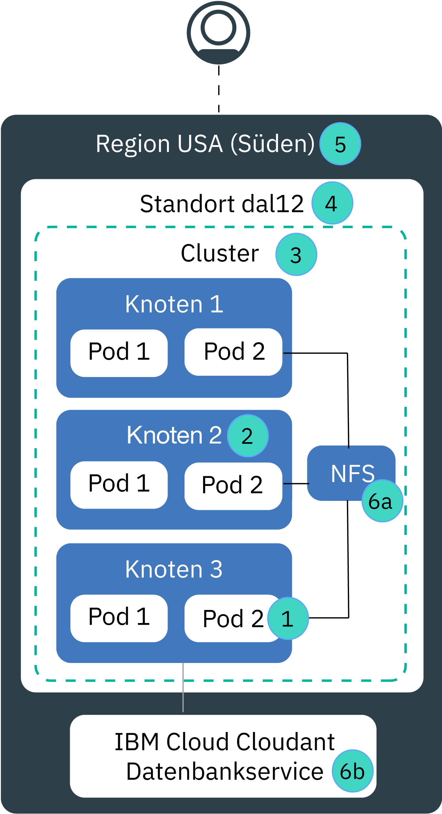

---

copyright:
  years: 2014, 2019
lastupdated: "2019-04-09"

keywords: kubernetes, iks, disaster recovery, dr, ha, hadr

subcollection: containers

---

{:new_window: target="_blank"}
{:shortdesc: .shortdesc}
{:screen: .screen}
{:pre: .pre}
{:table: .aria-labeledby="caption"}
{:codeblock: .codeblock}
{:tip: .tip}
{:note: .note}
{:important: .important}
{:deprecated: .deprecated}
{:download: .download}

# Hochverfügbarkeit für {{site.data.keyword.containerlong_notm}}
{: #ha}

Verwenden Sie die integrierten Kubernetes- und {{site.data.keyword.containerlong}}-Funktionen, um eine höhere Verfügbarkeit für Ihr Cluster zu erreichen und um Ihre App vor Ausfallzeiten zu schützen, wenn eine Komponenten in Ihrem Cluster ausfällt.
{: shortdesc}

Hochverfügbarkeit ist eine zentrale Disziplin in einer IT-Infrastruktur, um Ihre Apps auch nach einem partiellen oder vollständigen Ausfall der Site betriebsbereit zu halten. Der Hauptzweck der Hochverfügbarkeit ist es, potenzielle Fehlerquellen in einer IT-Infrastruktur zu eliminieren. Sie können sich zum Beispiel auf den Ausfall eines Systems vorbereiten, indem Sie Redundanz hinzufügen und Funktionsübernahmemechanismen einrichten.

Sie können eine hohe Verfügbarkeit auf verschiedenen Ebenen in Ihrer IT-Infrastruktur und innerhalb der verschiedenen Komponenten Ihres Clusters erreichen. Die für Sie geeignete Ebene der Verfügbarkeit hängt von mehreren Faktoren ab, z. B. von Ihren Geschäftsanforderungen, den Service-Level-Agreements, die Sie mit Ihren Kunden haben, und dem Geld, das Sie ausgeben möchten.

## Übersicht über mögliche Fehlerquellen in {{site.data.keyword.containerlong_notm}}
{: #fault_domains}

Die {{site.data.keyword.containerlong_notm}}-Architektur und -Infrastruktur wurde konzipiert, um eine hohe Zuverlässigkeit, eine geringe Latenzzeit bei der Verarbeitung und eine maximale Betriebszeit des Service zu gewährleisten. Fehler können jedoch trotzdem auftreten. Abhängig von dem Service, den Sie in {{site.data.keyword.Bluemix_notm}} hosten, können Sie möglicherweise keine Fehler tolerieren, selbst wenn die Fehler nur einige Minuten dauern.
{: shortdesc}

{{site.data.keyword.containerlong_notm}} stellt mehrere Methoden bereit, um Ihrem Cluster mehr Verfügbarkeit hinzuzufügen, indem Redundanz und Anti-Affinität hinzugefügt werden. Sehen Sie sich die folgende Abbildung an, um mehr über mögliche Fehlerquellen zu lernen und wie Sie diese beseitigen können.

<dl>
<dt> 1. Container- oder Podfehler.</dt>
  <dd>
Container und Pods sind per Definition Komponenten mit kurzer Lebensdauer, die kurzfristig und unerwartet ausfallen können. Ein Container oder Pod kann ausfallen, wenn ein Fehler in Ihrer App auftritt. Um Ihre App hoch verfügbar zu machen, müssen Sie sicherstellen, dass Sie über genügend Instanzen Ihrer App verfügen, um die Arbeitslast zu bewältigen, sowie über zusätzliche Instanzen, die im Falle eines Fehlers zur Verfügung stehen. Im Idealfall werden diese Instanzen auf mehrere Workerknoten verteilt, um Ihre App vor einem Ausfall eines Workerknotens zu schützen.

  
Weitere Informationen finden Sie im Abschnitt [Hoch verfügbare Apps bereitstellen](/docs/containers?topic=containers-app#highly_available_apps).
</dd>
<dt> 2. Workerknotenfehler.</dt>
  <dd>
Ein Workerknoten ist eine VM, die auf einer physischen Hardware aufsetzt. Workerknotenfehler umfassen Hardwareausfälle, wie z. B. Ausfälle bei Stromversorgung, Kühlung oder Netzbetrieb, und Probleme auf der VM selbst. Sie können einem Workerknotenfehler vorbeugen, indem Sie mehrere Workerknoten in Ihrem Cluster einrichten.

Workerknoten in einer Zone befinden sich nicht zwingend auf separaten physischen Rechenhosts. Beispiel: Sie verfügen über einen Cluster mit 3 Workerknoten, aber alle 3 Workerknoten wurden auf demselben physischen Rechenhost in der IBM Zone erstellt. Wenn dieser physische Rechenhost herunterfährt, sind alle Workerknoten inaktiv. Wenn Sie diesen Fehler vermeiden möchten, müssen Sie in unterschiedlichen Zonen [einen Mehrzonencluster konfigurieren oder mehrere Einzelzonencluster erstellen](/docs/containers?topic=containers-plan_clusters#ha_clusters).

  
Weitere Informationen finden Sie im Abschnitt [Cluster mit mehreren Workerknoten erstellen](/docs/containers?topic=containers-cs_cli_reference#cs_cluster_create).
</dd>
<dt> 3. Clusterfehler.</dt>
  <dd>
Der [Kubernetes-Master](/docs/containers?topic=containers-ibm-cloud-kubernetes-service-technology#architecture) ist die Hauptkomponente, die den Cluster betriebsbereit hält. Der Master speichert Clusterressourcen und ihre Konfigurationen in der etcd-Datenbank, die als Single Point of Truth für Ihren Cluster dient. Der Kubernetes-API-Server dient als Haupteinstiegspunkt für alle Anforderungen der Clusterverwaltung von den Workerknoten zum Master oder wenn Sie mit Ihren Clusterressourcen interagieren möchten.  Wenn ein Masterausfall auftritt, werden Ihre Workloads weiterhin auf den Workerknoten ausgeführt, Sie können jedoch erst wieder `kubectl`-Befehle verwenden, um mit Ihren Clusterressourcen zu arbeiten oder den Clusterzustand anzuzeigen, wenn der Kubernetes-API-Server im Master wieder betriebsbereit ist. Wenn ein Pod während des Ausfalls des Masters inaktiv ist, kann der Pod erst wieder ausgeführt werden, wenn der Workerknoten den Kubernetes-API-Server wieder erreichen kann.  Während eines Masterausfalls können Sie `ibmcloud ks`-Befehle weiterhin für die {{site.data.keyword.containerlong_notm}}-API ausführen, um mit Ihren Infrastrukturressourcen zu arbeiten (z. B. Workerknoten oder VLANs). Wenn Sie die aktuelle Clusterkonfiguration ändern, indem Sie Workerknoten zum Cluster hinzufügen oder aus ihm entfernen, werden die Änderungen erst wirksam, wenn der Master wieder betriebsbereit ist.

Ein Workerknoten darf während eines Masterausfalls nicht neu gestartet werden. Durch diese Aktion werden die Pods aus dem Workerknoten entfernt. Da der Kubernetes-API-Server nicht verfügbar ist, können die Pods nicht auf andere Workerknoten im Cluster umgestellt werden.
{: important}
 Die Cluster-Master sind hoch verfügbar und enthalten Replikate für Ihren Kubernetes-API-Server, für 'etcd', für den Scheduler und den Controller-Manager auf separaten Hosts, um gegen Ausfallzeiten zu schützen, wie zum Beispiel bei einer Masteraktualisierung.

Um Ihren Cluster-Master vor einem Zonenausfall zu schützen, können Sie Folgendes tun: <ul><li>Erstellen Sie einen Cluster an einem [Standort in einer Mehrzonen-Metropole](/docs/containers?topic=containers-regions-and-zones#zones), die den Master über Zonen hinweg verteilt.</li><li>Richten Sie einen zweiten Cluster in einer anderen Zone ein.</li></ul>

  
Weitere Informationen finden Sie im Abschnitt [Hoch verfügbare Cluster konfigurieren](/docs/containers?topic=containers-plan_clusters#ha_clusters).
</dd>
<dt> 4. Zonenfehler.</dt>
  <dd>
Ein Zonenfehler wirkt sich auf alle physischen Rechenhosts und den NFS-Speicher aus. Fehler umfassen Ausfälle bei Stromversorgung, Kühlung, Netzbetrieb oder Speicherausfälle sowie Naturkatastrophen wie Überschwemmungen, Erdbeben und Stürme. Um sich vor einem Zonenfehler zu schützen, müssen Sie über Cluster in zwei unterschiedlichen Zonen verfügen, wobei eine externe Lastausgleichsfunktion den Lastausgleich zwischen den Zonen vornimmt.

  
Weitere Informationen finden Sie im Abschnitt [Hoch verfügbare Cluster konfigurieren](/docs/containers?topic=containers-plan_clusters#ha_clusters).
</dd>    
<dt> 5. Regionsfehler.</dt>
  <dd>
Jede Region wird mit einer hoch verfügbaren Lastausgleichsfunktion konfiguriert, auf die von einem regionsspezifischen API-Endpunkt aus zugegriffen werden kann. Die Lastausgleichsfunktion leitet eingehende und ausgehende Anforderungen an Cluster in den Regionszonen weiter. Die Wahrscheinlichkeit eines vollständigen regionalen Ausfalls ist gering. Um diesem Fehler jedoch vorzubeugen, können Sie mehrere Cluster in verschiedenen Regionen einrichten und sie mithilfe einer externen Lastausgleichsfunktion verbinden. Wenn eine ganze Region ausfällt, kann der Cluster in der anderen Region die Arbeitslast übernehmen.

Ein Cluster in mehreren Regionen erfordert mehrere Cloudressourcen und kann abhängig von Ihrer App sehr komplex und kostenintensiv sein. Prüfen Sie, ob Sie eine Konfiguration über mehrere Regionen benötigen, oder ob Sie mit einer möglichen Serviceunterbrechung umgehen können. Wenn Sie einen Cluster in mehreren Regionen konfigurieren möchten, stellen Sie sicher, dass Ihre App und die Daten in einer anderen Region gehostet werden können, und dass Ihre App die Replikation von globalen Daten handhaben kann.

  
Weitere Informationen finden Sie im Abschnitt [Hoch verfügbare Cluster konfigurieren](/docs/containers?topic=containers-plan_clusters#ha_clusters).
</dd>   
<dt> 6a, 6b. Speicherfehler.</dt>
  <dd>
In einer statusabhängigen App spielen Daten eine wichtige Rolle, um Ihre App betriebsbereit zu halten. Stellen Sie sicher, dass Ihre Daten hoch verfügbar sind, sodass Sie nach einem möglichen Ausfall eine Wiederherstellung vornehmen können. In {{site.data.keyword.containerlong_notm}} können Sie aus mehreren Optionen auswählen, um Ihre Daten als persistent zu definieren. Sie können zum Beispiel NFS-Speicher bereitstellen, indem Sie native, persistente Kubernetes-Datenträger verwenden oder Ihre Daten mithilfe eines {{site.data.keyword.Bluemix_notm}}-Datenbankservice speichern.

  
Weitere Informationen finden Sie im Abschnitt [Hoch verfügbare Daten planen](/docs/containers?topic=containers-storage_planning#persistent_storage_overview).
</dd>
</dl>
