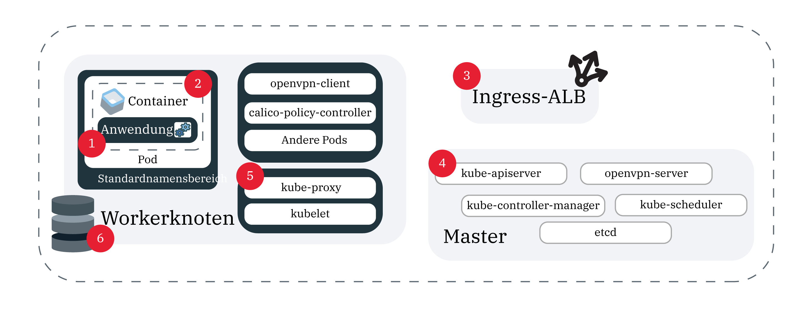

---

copyright:
  years: 2014, 2018
lastupdated: "2018-10-25"

---

{:new_window: target="_blank"}
{:shortdesc: .shortdesc}
{:screen: .screen}
{:pre: .pre}
{:table: .aria-labeledby="caption"}
{:codeblock: .codeblock}
{:tip: .tip}
{:download: .download}


# Protokollierung und Überwachung
{: #health}

Legen Sie die Protokollierung und Überwachung in {{site.data.keyword.containerlong}} fest, um Unterstützung bei der Fehlerbehebung zu erhalten und um die Leistung Ihrer Kubernetes-Cluster und Apps zu verbessern.
{: shortdesc}

## Informationen zur Protokollweiterleitung für Cluster und Apps
{: #logging}

Die kontinuierliche Überwachung und Protokollierung ist der Schlüssel, um Angriffe auf Ihren Cluster zu erkennen und Probleme zu lösen, sobald diese auftreten. Wenn Sie Ihren Cluster kontinuierlich überwachen, können Sie die Clusterkapazität und Verfügbarkeit von Ressourcen für Ihre App besser verstehen. Dadurch können Sie sich entsprechend vorbereiten, um Ihre Apps vor Ausfallzeiten zu schützen. Um die Protokollierung zu konfigurieren, müssen Sie mit einem Kubernetes-Standardcluster in {{site.data.keyword.containerlong_notm}} arbeiten.
{: shortdesc}


**Wird mein Cluster von IBM überwacht?**

Jeder Kubernetes-Master wird kontinuierlich von IBM überwacht. {{site.data.keyword.containerlong_notm}} überprüft automatisch jeden Knoten, auf dem der Kubernetes-Master bereitgestellt ist, auf Schwachstellen bzw. Sicherheitslücken, die in Kubernetes festgestellt wurden, und auf betriebssystemspezifische Korrekturen (Fixes) für die Sicherheit. Werden Schwachstellen bzw. Sicherheitslücken festgestellt, wendet {{site.data.keyword.containerlong_notm}} automatisch entsprechende Korrekturen (Fixes) und beseitigt Schwachstellen bzw. Sicherheitslücken zugunsten des Benutzers, um den Schutz des Masterknotens sicherzustellen. Sie sind für die Überwachung und Analyse der Protokolle für den Rest Ihres Clusters verantwortlich.

**Wie werden Protokolle erfasst?**

Protokolle werden vom Add-on [Fluentd ](https://www.fluentd.org/) im Cluster erfasst. Wenn Sie eine Protokollierungskonfiguration für eine Quelle im Cluster erstellen, werden die Protokolle vom Add-on Fluentd mithilfe der Pfade für diese Quelle erfasst. Danach werden die Protokolle an {{site.data.keyword.loganalysisshort_notm}} oder einen externen Systemprotokollserver weitergeleitet.

**Für was für Quellen kann ich die Protokollierung konfigurieren?**

In der folgenden Abbildung sehen Sie die Position der Quellen, für die Sie die Protokollierung konfigurieren können.



1. `worker`: Informationen, die für die Infrastrukturkonfiguration spezifisch sind, die Sie für Ihren Workerknoten konfiguriert haben. Workerprotokolle werden in Syslog erfasst und enthalten Betriebssystemereignisse. In der Datei `auth.log` finden Sie Informationen zu den Authentifizierungsanforderungen, die an das Betriebssystem gestellt werden. </br>**Pfade:**
    * `/var/log/syslog`
    * `/var/log/auth.log`

2. `container`: Informationen, die von einem aktiven Container protokolliert werden.</br>**Pfade:** Alles, was in `STDOUT` oder `STDERR` geschrieben wird.

3. `application`: Informationen zu Ereignissen, die auf Anwendungsebene auftreten. Dabei kann es sich um eine Benachrichtigung handeln, dass eine Ereignis stattgefunden hat, beispielsweise eine erfolgreiche Anmeldung, eine Warnung zum Speicher oder andere Operationen, die auf Anwendungsebene durchgeführt werden können.</br>**Pfade:** Sie können die Pfade festlegen, an die Ihre Protokolle weitergeleitet werden. Damit Protokolle jedoch gesendet werden, müssen Sie einen absoluten Pfad in Ihrer Protokollierungskonfiguration verwenden. Andernfalls können die Protokolle nicht gelesen werden. Falls Ihr Pfad an Ihren Workerknoten angehängt ist, wurde dadurch möglicherweise die symbolische Verbindung erstellt. Beispiel: Wenn der angegebene Pfad `/usr/local/spark/work/app-0546/0/stderr` lautet, die Protokolle jedoch tatsächlich in `/usr/local/spark-1.0-hadoop-1.2/work/app-0546/0/stderr` gespeichert werden, können die Protokolle nicht gelesen werden.

5. `kubernetes`: Informationen von 'kubelet', 'kube-proxy' und anderen Kubernetes-Ereignissen, die im Namensbereich 'kube-system' auftreten können.</br>**Pfade:**
    * `/var/log/kubelet.log`
    * `/var/log/kube-proxy.log`
    * `/var/log/event-exporter/1..log`

6. `kube-audit`: Informationen zu clusterbezogenen Aktionen, die an den Kubernetes-API-Server gesendet werden, einschließlich der Zeit, des Benutzers und der betroffenen Ressource.

7. `ingress`: Informationen zum Netzverkehr, der über die Ingress-ALB in einen Cluster gelangt. Spezifische Konfigurationsdaten finden Sie in der [Ingress-Dokumentation](cs_ingress_health.html#ingress_logs).</br>**Pfade:**
    * `/var/log/alb/ids/*.log`
    * `/var/log/alb/ids/*.err`
    * `/var/log/alb/customerlogs/*.log`
    * `/var/log/alb/customerlogs/*.err`

</br>

**Welche Konfigurationsoptionen stehen mir zur Verfügung?**

In der folgenden Tabelle sind die verschiedenen Optionen aufgeführt, die Ihnen bei der Konfiguration der Protokollierung und ihrer Beschreibungen zur Verfügung stehen.

<table>
<caption> Informationen zu den Konfigurationsoptionen für die Protokollierung</caption>
  <thead>
    <th>Option</th>
    <th>Beschreibung</th>
  </thead>
  <tbody>
    <tr>
      <td><code><em>&lt;clustername_oder_-id&gt;</em></code></td>
      <td>Der Name oder die ID des Clusters.</td>
    </tr>
    <tr>
      <td><code><em>--log_source</em></code></td>
      <td>Die Quelle, von der die Protokolle weitergeleitet werden sollen. Gültige Werte sind <code>container</code>, <code>application</code>, <code>worker</code>, <code>kubernetes</code> <code>ingress</code> und <code>kube-audit</code>. Dieses Argument unterstützt eine durch Kommas getrennte Liste mit Protokollquellen, auf die die Konfiguration angewendet werden soll. Wenn Sie keine Protokollquelle bereitstellen, werden Protokollierungskonfigurationen für die Protokollquellen <code>container</code> und <code>ingress</code> erstellt.</td>
    </tr>
    <tr>
      <td><code><em>--type</em></code></td>
      <td>Gibt an, wohin Sie Ihre Protokolle weiterleiten möchten. Optionen sind <code>ibm</code>, wodurch Ihre Protokolle an {{site.data.keyword.loganalysisshort_notm}} weitergeleitet werden, und <code>syslog</code>, wodurch Ihre Protokolle an externe Server weitergeleitet werden.</td>
    </tr>
    <tr>
      <td><code><em>--namespace</em></code></td>
      <td>Optional: Der Kubernetes-Namensbereich, von dem aus Sie Protokolle weiterleiten möchten. Die Weiterleitung von Protokollen wird für die Kubernetes-Namensbereiche <code>ibm-system</code> und <code>kube-system</code> nicht unterstützt. Dieser Wert ist nur für die Protokollquelle <code>container</code> gültig. Wenn Sie keinen Namensbereich angeben, verwenden alle Namensbereiche im Cluster diese Konfiguration.</td>
    </tr>
    <tr>
      <td><code><em>--hostname</em></code></td>
      <td><p>Verwenden Sie für {{site.data.keyword.loganalysisshort_notm}} die [Einpflege-URL](/docs/services/CloudLogAnalysis/log_ingestion.html#log_ingestion_urls). Wenn Sie keine Einpflege-URL angeben, wird der Endpunkt für die Region, in der Ihr Cluster erstellt wurde, verwendet.</p>
      <p>Geben Sie für das Systemprotokoll den Hostnamen oder die IP-Adresse des Protokollcollector-Service an.</p></td>
    </tr>
    <tr>
      <td><code><em>--port</em></code></td>
      <td>Der Einpflegeport. Wenn Sie keinen Port angeben, wird der Standardport <code>9091</code> verwendet.
      <p>Geben Sie für das Systemprotokoll den Port des Protokollcollector-Servers an. Wenn Sie keinen Port angeben, dann wird der Standardport <code>514</code> verwendet.</td>
    </tr>
    <tr>
      <td><code><em>--space</em></code></td>
      <td>Optional: Der Name des Cloud Foundry-Bereichs, an den Sie die Protokolle senden möchten. Wenn Sie Protokolle an {{site.data.keyword.loganalysisshort_notm}} senden, werden Bereich und Organisation im Einpflegepunkt angegeben. Wenn Sie keinen Bereich angeben, werden Protokolle an die Kontoebene gesendet. Wenn Sie einen Bereich festlegen, müssen Sie auch eine Organisation angeben.</td>
    </tr>
    <tr>
      <td><code><em>--org</em></code></td>
      <td>Optional: Der Name der Cloud Foundry-Organisation, in der sich der Bereich befindet. Dieser Wert ist erforderlich, wenn Sie einen Bereich angegeben haben.</td>
    </tr>
    <tr>
      <td><code><em>--app-containers</em></code></td>
      <td>Optional: Zum Weiterleiten von Protokollen von Apps können Sie den Namen des Containers angeben, der Ihre App enthält. Sie können mehr als einen Container angeben, indem Sie eine durch Kommas getrennte Liste verwenden. Falls keine Container angegeben sind, werden Protokolle von allen Containern weitergeleitet, die die von Ihnen bereitgestellten Pfade enthalten.</td>
    </tr>
    <tr>
      <td><code><em>--app-paths</em></code></td>
      <td>Der Pfad zu einem Container, an den die Anwendungen Protokolle senden. Wenn Sie Protokolle mit dem Quellentyp <code>application</code> weiterleiten möchten, müssen Sie einen Pfad angeben. Wenn Sie mehr als einen Pfad angeben, verwenden Sie eine durch Kommas getrennte Liste. Beispiel: <code>/var/log/myApp1/*,/var/log/myApp2/*</code></td>
    </tr>
    <tr>
      <td><code><em>--syslog-protocol</em></code></td>
      <td>Wenn der Protokollierungstyp <code>syslog</code> lautet, das Transport Layer Protocol. Sie können die folgenden Protokolle verwenden: `udp`, `tls` oder `tcp`. Bei einer Weiterleitung an einen rsyslog-Server mit dem <code>udp</code>-Protokoll werden Protokolle, die größer sind als 1 KB, abgeschnitten.</td>
    </tr>
    <tr>
      <td><code><em>--ca-cert</em></code></td>
      <td>Erforderlich: Wenn der Protokollierungstyp <code>syslog</code> und das Protokoll <code>tls</code> ist, ist dies der Name des geheimen Kubernetes-Schlüssels, der das Zertifikat einer Zertifizierungsstelle enthält.</td>
    </tr>
    <tr>
      <td><code><em>--verify-mode</em></code></td>
      <td>Wenn der Protokollierungstyp <code>syslog</code> und das Protokoll <code>tls</code> ist, ist dies der Prüfmodus. Unterstützte Werte sind <code>verify-peer</code> und der Standardwert <code>verify-none</code>.</td>
    </tr>
    <tr>
      <td><code><em>--skip-validation</em></code></td>
      <td>Optional: Überspringen Sie die Validierung der Organisations- und Bereichsnamen, wenn sie angegeben sind. Das Überspringen der Validierung verringert die Bearbeitungszeit. Eine ungültige Protokollierungskonfiguration aber führt dazu, dass Protokolle nicht ordnungsgemäß weitergeleitet werden.</td>
    </tr>
  </tbody>
</table>

**Bin ich dafür verantwortlich, dass Fluentd für die Protokollierung aktualisiert wird?**

Um Änderungen an Ihren Protokollierungs- oder Filterkonfigurationen vornehmen zu können, muss das Fluentd-Protokollierungs-Add-on die aktuelle Version aufweisen. Standardmäßig sind automatische Aktualisierungen für das Add-on aktiviert. Informationen zum Inaktivieren automatischer Aktualisierungen finden Sie im Abschnitt [Cluster-Add-ons aktualisieren: Fluentd für die Protokollierung](cs_cluster_update.html#logging).

**Kann ich eine eigene Protokollierungslösung verwenden?**

Bei besonderen Anforderungen können Sie eine eigene Protokollierungslösung im Cluster einrichten. In Clustern, in denen Kubernetes Version 1.11 oder aktueller ausgeführt wird, können Sie Containerprotokolle im Pfad `/var/log/pods/` erfassen. In Clustern, in denen Kubernetes Version 1.10 oder früher ausgeführt wird, können Sie Containerprotokolle im Pfad `/var/lib/docker/containers/` erfassen.

<br />


## Protokollweiterleitung konfigurieren
{: #configuring}

Sie können die Protokollierung für {{site.data.keyword.containerlong_notm}} über die GUI oder über die Befehlszeilenschnittstelle konfigurieren.
{: shortdesc}

### Protokollweiterleitung über die GUI aktivieren
{: #enable-forwarding-ui}

Sie können die Protokollweiterleitung im {{site.data.keyword.containerlong_notm}}-Dashboard konfigurieren. Es kann einige Minuten dauern, bis der Vorgang abgeschlossen ist. Wenn Sie die Protokolle also nicht sofort sehen, warten Sie einige Minuten und überprüfen Sie die Konfiguration dann nochmals.

Um eine Konfiguration auf Kontoebene, für einen bestimmten Containernamensbereich oder für die Anwendungsprotokollierung zu erstellen, verwenden Sie die CLI.
{: tip}

1. Navigieren Sie im Dashboard zur Registerkarte **Übersicht**.
2. Wählen Sie die Cloud Foundry-Organisation und den Bereich, von der/dem Sie Protokolle weiterleiten möchten. Wenn Sie die Protokollweiterleitung im Dashboard konfigurieren, werden die Protokolle an den {{site.data.keyword.loganalysisshort_notm}}-Standardendpunkt für den Cluster gesendet. Um Protokolle an einen fernen Server oder einen anderen {{site.data.keyword.loganalysisshort_notm}}-Endpunkt weiterzuleiten, können Sie die Protokollierung über die CLI konfigurieren.
3. Wählen Sie die Protokollquellen aus, aus denen Sie Protokolle weiterleiten möchten.
4. Klicken Sie auf **Erstellen**.

</br>
</br>

### Protokollweiterleitung über die CLI aktivieren
{: #enable-forwarding}

Sie können eine Konfiguration für die Clusterprotokollierung erstellen. Sie können zwischen den verschiedenen Protokollierungsoptionen unterscheiden, indem Sie Flags setzen.

**Weiterleitung von Protokollen an IBM**

1.  Für den Cluster, in dem sich die Protokollquelle befindet: [Melden Sie sich an Ihrem Konto an. Geben Sie als Ziel die entsprechende Region und - sofern anwendbar - die Ressourcengruppe an. Legen Sie den Kontext für den Cluster fest.](cs_cli_install.html#cs_cli_configure)

    Wenn Sie ein dediziertes Konto verwenden, müssen Sie sich beim öffentlichen {{site.data.keyword.cloud_notm}}-Endpunkt anmelden und als Ziel Ihre öffentliche Organisation und den Bereich angeben, um die Protokollweiterleitung zu ermöglichen.
    {: tip}

2. Überprüfen Sie die Berechtigungen. Wenn Sie beim Erstellen der Cluster oder der Protokollierungskonfiguration einen Bereich angegeben haben, dann benötigen sowohl der Kontoeigner als auch der {{site.data.keyword.containerlong_notm}}-API-Schlüsseleigner Manager-, Entwickler- oder Auditor-[Berechtigungen](cs_users.html#access_policies) in diesem Bereich.
  * Wenn Sie wissen, wer der {{site.data.keyword.containerlong_notm}}-API-Schlüsseleigner ist, führen Sie den folgenden Befehl aus:
      ```
      ibmcloud ks api-key-info <clustername>
      ```
      {: pre}
  * Um sofort alle von Ihnen vorgenommenen Änderungen anzuwenden, führen Sie den folgenden Befehl aus.
      ```
      ibmcloud ks logging-config-refresh <clustername>
      ```
      {: pre}

3. Erstellen Sie eine Konfiguration für die Protokollweiterleitung.
    ```
    ibmcloud ks logging-config-create <clustername_oder_-id> --logsource <protokollquelle> --type ibm --namespace <kubernetes-namensbereich> --hostname <hostname_oder_ip_des_protokollservers> --port <protokollserver-port> --space <clusterbereich> --org <cluster_org> --app-containers <container> --app-paths <pfade_zu_protokollen> --skip-validation
    ```
    {: pre}

  * Beispiel für eine Containerprotokollierungskonfiguration für den Standardnamensbereich und die Ausgabe:
    ```
    ibmcloud ks logging-config-create mycluster
    Creating cluster mycluster logging configurations...
    OK
    ID                                      Source      Namespace    Host                                 Port    Org  Space   Server Type   Protocol   Application Containers   Paths
    4e155cf0-f574-4bdb-a2bc-76af972cae47    container       *        ingest.logging.eu-gb.bluemix.net✣   9091✣    -     -        ibm           -                  -               -
    ✣ Indicates the default endpoint for the {{site.data.keyword.loganalysisshort_notm}} service.
    ```
    {: screen}

  * Beispiel für die Anwendungsprotokollierungskonfiguration und die Ausgabe:
    ```
    ibmcloud ks logging-config-create cluster2 --logsource application --app-paths '/var/log/apps.log' --app-containers 'container1,container2,container3'
    Creating logging configuration for application logs in cluster cluster2...
    OK
    Id                                     Source        Namespace   Host                                    Port    Org   Space   Server Type   Protocol   Application Containers               Paths
    aa2b415e-3158-48c9-94cf-f8b298a5ae39   application    -          ingest.logging.ng.bluemix.net✣  9091✣    -      -          ibm         -        container1,container2,container3      /var/log/apps.log
    ✣ Indicates the default endpoint for the {{site.data.keyword.loganalysisshort_notm}} service.
    ```
    {: screen}

Wenn Apps in Ihren Containern ausgeführt werden, die nicht für das Schreiben von Protokollen in STDOUT oder STDERR konfiguriert werden können, können Sie eine Protokollierungskonfiguration erstellen, um Protokolle aus Protokolldateien für Apps weiterzuleiten.
{: tip}

</br>
</br>


**Protokolle an Ihren eigenen Server über die Protokolle `udp` oder `tcp` weiterleiten**

1. Sie haben zwei Möglichkeiten, einen Server einzurichten, der ein Systemprotokoll empfangen kann, um somit Protokolle an den Systemprotokollserver weiterzuleiten:
  * Richten Sie einen eigenen Server ein und verwalten Sie diesen oder lassen Sie diese Aufgaben von einem Provider durchführen. Wenn ein Provider den Server für Sie verwaltet, dann rufen Sie den Protokollierungsendpunkt vom Protokollierungsprovider ab.

  * Führen Sie das Systemprotokoll über einen Container aus. Sie können beispielsweise diese [YAML-Datei für die Bereitstellung ](https://github.com/IBM-Cloud/kube-samples/blob/master/deploy-apps-clusters/deploy-syslog-from-kube.yaml) verwenden, um ein öffentliches Docker-Image abzurufen, das zur Ausführung eines Containers in einem Kubernetes-Cluster dient. Das Image veröffentlicht den Port `514` auf der öffentlichen Cluster-IP-Adresse und verwendet diese öffentliche Cluster-IP-Adresse zum Konfigurieren des Systemprotokollhosts.

  Sie können Ihre Protokolle als gültige JSON-Datei anzeigen, indem Sie syslog-Präfixe entfernen. Fügen Sie dazu den folgenden Code am Anfang der Datei <code>etc/rsyslog.conf</code> hinzu, in der Ihr rsyslog-Server ausgeführt wird: <code>$template customFormat,"%msg% \n"</br>$ActionFileDefaultTemplate customFormat</code>
  {: tip}

2. Für den Cluster, in dem sich die Protokollquelle befindet: [Melden Sie sich an Ihrem Konto an. Geben Sie als Ziel die entsprechende Region und - sofern anwendbar - die Ressourcengruppe an. Legen Sie den Kontext für den Cluster fest.](cs_cli_install.html#cs_cli_configure)**Hinweis**: Wenn Sie ein dediziertes Konto verwenden, müssen Sie sich beim öffentlichen {{site.data.keyword.cloud_notm}}-Endpunkt anmelden und als Ziel Ihre öffentliche Organisation und den Bereich angeben, um die Protokollweiterleitung zu ermöglichen.

3. Erstellen Sie eine Konfiguration für die Protokollweiterleitung.
    ```
    ibmcloud ks logging-config-create <clustername_oder_-id> --logsource <protokollquelle> --namespace <kubernetes-namensbereich> --hostname <hostname_oder_ip_des_protokollservers> --port <protokollserver-port> --type syslog --app-containers <container> --app-paths <pfade_zu_protokollen> --syslog-protocol <protokoll> --skip-validation
    ```
    {: pre}

</br>
</br>


**Protokolle auf Ihrem eigenen Server über das Protokoll `tls` weiterleiten**

Die folgenden Schritte sind allgemeine Anweisungen. Stellen Sie vor der Verwendung des Containers in einer Produktionsumgebung sicher, dass alle von Ihnen benötigten Sicherheitsanforderungen erfüllt sind.
{: tip}

1. Sie haben zwei Möglichkeiten, einen Server einzurichten, der ein Systemprotokoll empfangen kann:
  * Richten Sie einen eigenen Server ein und verwalten Sie diesen oder lassen Sie diese Aufgaben von einem Provider durchführen. Wenn ein Provider den Server für Sie verwaltet, dann rufen Sie den Protokollierungsendpunkt vom Protokollierungsprovider ab.

  * Führen Sie das Systemprotokoll über einen Container aus. Sie können beispielsweise diese [YAML-Datei für die Bereitstellung ](https://github.com/IBM-Cloud/kube-samples/blob/master/deploy-apps-clusters/deploy-syslog-from-kube.yaml) verwenden, um ein öffentliches Docker-Image abzurufen, das zur Ausführung eines Containers in einem Kubernetes-Cluster dient. Das Image veröffentlicht den Port `514` auf der öffentlichen Cluster-IP-Adresse und verwendet diese öffentliche Cluster-IP-Adresse zum Konfigurieren des Systemprotokollhosts. Sie müssen die entsprechenden Zertifikate einer Zertifizierungsstelle und serverseitigen Zertifikate einfügen und die Datei `syslog.conf` aktualisieren, damit `tls` auf Ihrem Server aktiviert werden kann.

2. Speichern Sie das Zertifikat der Zertifizierungsstelle in einer Datei namens `ca-cert`. Es muss genau dieser Name sein.

3. Erstellen Sie im Namensbereich `kube-system` einen geheimen Schlüssel für die Datei `ca-cert`. Wenn Sie Ihre Protokollierungskonfiguration erstellen, verwenden Sie den Namen des geheimen Schlüssels für das Flag `-- ca-cert`.
    ```
    kubectl -n kube-system create secret generic --from-file=ca-cert
    ```
    {: pre}

4. Für den Cluster, in dem sich die Protokollquelle befindet: [Melden Sie sich an Ihrem Konto an. Geben Sie als Ziel die entsprechende Region und - sofern anwendbar - die Ressourcengruppe an. Legen Sie den Kontext für den Cluster fest.](cs_cli_install.html#cs_cli_configure)**Hinweis**: Wenn Sie ein dediziertes Konto verwenden, müssen Sie sich beim öffentlichen {{site.data.keyword.cloud_notm}}-Endpunkt anmelden und als Ziel Ihre öffentliche Organisation und den Bereich angeben, um die Protokollweiterleitung zu ermöglichen.

3. Erstellen Sie eine Konfiguration für die Protokollweiterleitung.
    ```
    ibmcloud ks logging-config-create <clustername_oder_-id> --logsource <protokollquelle> --type syslog --syslog-protocol tls --hostname <ip-adresse_des_syslog-servers> --port <port_für_syslog-server, 514 is default> --ca-cert <name_des_geheimen_schlüssels> --verify-mode <zu_prüfende_standards-none>
    ```
    {: pre}

</br>
</br>


### Protokollweiterleitung überprüfen
{: verify-logging}

Sie können überprüfen, ob Ihre Konfiguration ordnungsgemäß eingerichtet ist. Dazu haben Sie zwei Möglichkeiten:

* Gehen Sie wie folgt vor, um eine Liste aller Protokollierungskonfigurationen in einem Cluster anzuzeigen:
    ```
    ibmcloud ks logging-config-get <clustername_oder_-id>
    ```
    {: pre}

* Gehen Sie wie folgt vor, um die Protokollierungskonfiguration für einen Protokollquellentyp aufzulisten:
    ```
    ibmcloud ks logging-config-get <clustername_oder_-id> --logsource <quelle>
    ```
    {: pre}

</br>
</br>

### Protokollweiterleitung aktualisieren
{: #updating-forwarding}

Sie können eine Protokollierungskonfiguration aktualisieren, die Sie bereits erstellt haben.

1. Aktualisieren Sie eine Protokollweiterleitungskonfiguration.
    ```
    ibmcloud ks logging-config-update <clustername_oder_-id> <protokollkonfigurations-id> --namespace <namensbereich> --type <servertyp> --syslog-protocol <protokoll> --logsource <quelle> --hostname <hostname_oder_einpflege-url> --port <port> --space <clusterbereich> --org <clusterorg> --app-containers <container> --app-paths <pfade_zu_protokollen>
    ```
    {: pre}

</br>
</br>

### Protokollweiterleitung stoppen
{: #log_sources_delete}

Sie können die Weiterleitung von einem oder allen Protokollen der Protokollierungskonfiguration eines Clusters stoppen.
{: shortdesc}

1. Für den Cluster, in dem sich die Protokollquelle befindet: [Melden Sie sich an Ihrem Konto an. Geben Sie als Ziel die entsprechende Region und - sofern anwendbar - die Ressourcengruppe an. Legen Sie den Kontext für den Cluster fest.](cs_cli_install.html#cs_cli_configure)

2. Löschen Sie die Protokollierungskonfiguration.
  <ul>
  <li>Gehen Sie wie folgt vor, um eine Protokollierungskonfiguration zu löschen:</br>
    <pre><code>ibmcloud ks logging-config-rm &lt;clustername_oder_-id&gt; --id &lt;protokollkonfigurations-id&gt;</pre></code></li>
  <li>Gehen Sie wie folgt vor, um alle Protokollierungskonfigurationen zu löschen.</br>
    <pre><code>ibmcloud ks logging-config-rm <mein_cluster> --all</pre></code></li>
  </ul>

</br>
</br>

### Protokolle anzeigen
{: #view_logs}

Zum Anzeigen von Protokollen für Cluster und Container können Sie die Standardprotokollfunktionen von Kubernetes und Containerlaufzeit verwenden.
{:shortdesc}

**{{site.data.keyword.loganalysislong_notm}}**
{: #view_logs_k8s}

Sie können die Protokolle anzeigen, die Sie über das Kibana-Dashboard an {{site.data.keyword.loganalysislong_notm}} weitergeleitet haben.
{: shortdesc}

Wenn Sie die Standardwerte zum Erstellen Ihrer Konfigurationsdatei verwenden, können Ihre Protokolle im Konto oder in der Organisation und im Bereich gefunden werden, in dem der Cluster erstellt wurde. Wenn Sie eine Organisation und einen Bereich in Ihrer Konfigurationsdatei angegeben haben, können Sie Ihre Protokolle in diesem Bereich finden. Weitere Informationen zur Protokollierung finden Sie unter [Protokollierung für {{site.data.keyword.containerlong_notm}}](/docs/services/CloudLogAnalysis/containers/containers_kubernetes.html#containers_kubernetes).

Zum Zugriff auf das Kibana-Dashboard müssen Sie eine der folgenden URLs aufrufen und dann das {{site.data.keyword.Bluemix_notm}}-Konto oder den entsprechenden Bereich auswählen, in dem Sie die Protokollweiterleitung für den Cluster konfiguriert haben.
- Vereinigte Staaten (Süden) und Vereinigte Staaten (Osten): https://logging.ng.bluemix.net
- Vereinigtes Königreich (Süden): https://logging.eu-gb.bluemix.net
- Mitteleuropa: https://logging.eu-fra.bluemix.net
- Asien-Pazifik (Süden) und Asien-Pazifik (Norden): https://logging.au-syd.bluemix.net

Weitere Informationen zum Anzeigen von Protokollen finden Sie im Abschnitt zum [Navigieren zu Kibana über einen Web-Browser](/docs/services/CloudLogAnalysis/kibana/launch.html#launch_Kibana_from_browser).

</br>

**Containerprotokolle**

Sie können die in Docker integrierten Funktionen für die Containerlaufzeitprotokollierung nutzen, um Aktivitäten in den Standardausgabedatenströmen STDOUT und STDERR zu prüfen. Weitere Informationen finden Sie unter [Container-Protokolle für einen Container anzeigen, der in einem Kubernetes-Cluster ausgeführt wird](/docs/services/CloudLogAnalysis/containers/containers_kubernetes.html#containers_kubernetes).

<br />


## Protokolle filtern
{: #filter-logs}

Sie können auswählen, welche Protokolle Sie weiterleiten, indem Sie bestimmte Protokolle für einen bestimmten Zeitraum herausfiltern. Sie können zwischen den verschiedenen Filteroptionen unterscheiden, indem Sie Flags setzen.

<table>
<caption>Informationen zu den Optionen für die Protokollfilterung</caption>
  <thead>
    <th colspan=2> Erklärung der Optionen für die Protokollfilterung</th>
  </thead>
  <tbody>
    <tr>
      <td>&lt;clustername_oder_-id&gt;</td>
      <td>Erforderlich: Der Name oder die ID des Clusters, für den die Protokolle gefiltert werden sollen.</td>
    </tr>
    <tr>
      <td><code>&lt;protokolltyp&gt;</code></td>
      <td>Der Typ von Protokollen, auf die Sie den Filter anwenden möchten. Momentan werden <code>all</code>, <code>container</code> und <code>host</code> unterstützt.</td>
    </tr>
    <tr>
      <td><code>&lt;konfigurationen&gt;</code></td>
      <td>Optional: Eine durch Kommas getrennte Liste Ihrer Protokollierungskonfigurations-IDs. Wird sie nicht bereitgestellt, wird der Filter auf alle Clusterprotokollierungskonfigurationen angewendet, die an den Filter übergeben werden. Sie können die Protokollkonfigurationen anzeigen, die mit dem Filter übereinstimmen, indem Sie die Option <code>--show-matching-configs</code> verwenden.</td>
    </tr>
    <tr>
      <td><code>&lt;kubernetes-namensbereich&gt;</code></td>
      <td>Optional: Der Kubernetes-Namensbereich, von dem aus Sie Protokolle weiterleiten möchten. Dieses Flag ist nur mit dem Protokolltyp <code>container</code> anwendbar.</td>
    </tr>
    <tr>
      <td><code>&lt;containername&gt;</code></td>
      <td>Optional: Der Name des Containers, in dem Sie Protokolle filtern möchten.</td>
    </tr>
    <tr>
      <td><code>&lt;protokollierungsstufe&gt;</code></td>
      <td>Optional: Filtert Protokolle auf einer angegebenen Stufe oder den darunterliegenden Stufen heraus. Zulässige Werte in ihrer kanonischen Reihenfolge sind <code>fatal</code>, <code>error</code>, <code>warn/warning</code>, <code>info</code>, <code>debug</code> und <code>trace</code>. Beispiel: Wenn Sie Protokolle auf der Stufe <code>info</code> filtern, wird auch auf den Stufen <code>debug</code> und <code>trace</code> gefiltert. **Hinweis**: Sie können dieses Flag nur dann verwenden, wenn Protokollnachrichten das JSON-Format aufweisen und ein Feld für die Stufe enthalten. Wenn Sie Ihre Nachrichten in JSON anzeigen möchten, hängen Sie das Flag <code>--json</code> an den Befehl an.</td>
    </tr>
    <tr>
      <td><code>&lt;nachricht&gt;</code></td>
      <td>Optional: Filtert Protokolle heraus, die eine angegebene Nachricht enthalten, die als regulärer Ausdruck geschrieben wird.</td>
    </tr>
    <tr>
      <td><code>&lt;filter-id&gt;</code></td>
      <td>Optional: Die ID des Protokollfilters.</td>
    </tr>
    <tr>
      <td><code>--show-matching-configs</code></td>
      <td>Optional: Zeigen Sie die Protokollierungskonfigurationen an, für die die einzelnen Filter gelten.</td>
    </tr>
    <tr>
      <td><code>--all</code></td>
      <td>Optional: Löschen Sie alle Protokollweiterleitungsfilter.</td>
    </tr>
  </tbody>
</table>


1. Erstellen Sie einen Protokollierungsfilter.
  ```
  ibmcloud ks logging-filter-create <clustername_oder_-id> --type <protokolltyp> --logging-configs <konfigurationen> --namespace <kubernetes-namensbereich> --container <containername> --level <protokollierungsstufe> --regex-message <nachricht>
  ```
  {: pre}

2. Zeigen Sie die erstellten Protokollfilter an.

  ```
  ibmcloud ks logging-filter-get <clustername_oder_-id> --id <filter-id> --show-matching-configs
  ```
  {: pre}

3. Aktualisieren Sie den erstellten Protokollfilter.
  ```
  ibmcloud ks logging-filter-update <clustername_oder_-id> --id <filter-id> --type <protokolltyp> --logging-configs <konfigurationen> --namespace <kubernetes-namensbereich --container <containername> --level <protokollierungsstufe> --regex-message <nachricht>
  ```
  {: pre}

4. Löschen Sie einen erstellten Protokollfilter.

  ```
  ibmcloud ks logging-filter-rm <clustername_oder_-id> --id <filter-id> [--all]
  ```
  {: pre}

<br />


## Protokollweiterleitung für Kubernetes-API-Auditprotokolle konfigurieren
{: #api_forward}

Kubernetes führt automatisch einen Audit für alle Ereignisse durch, die über Ihren API-Server übergeben werden. Sie können die Ereignisse an {{site.data.keyword.loganalysisshort_notm}} oder einen externen Server weiterleiten.
{: shortdesc}


Weitere Informationen zu Kubernetes-Auditprotokollen finden Sie im Thema zu <a href="https://kubernetes.io/docs/tasks/debug-application-cluster/audit/" target="blank">Audits </a> in der Kubernetes-Dokumentation.

* Die Weiterleitung für Kubernetes-API-Auditprotokolle wird nur in Kubernetes Version 1.9 und höher unterstützt.
* Aktuell wird eine Standardauditrichtlinie für alle Cluster mit dieser Protokollierungskonfiguration verwendet.
* Momentan werden Filter nicht unterstützt.
* Es kann nur eine Konfiguration des Typs `kube-audit` pro Cluster vorhanden sein; Sie können jedoch Protokolle an {{site.data.keyword.loganalysisshort_notm}} und an einen externen Server weiterleiten, indem Sie eine Protokollierungskonfiguration und einen Webhook erstellen.
{: tip}


### Auditprotokolle an {{site.data.keyword.loganalysisshort_notm}} senden
{: #audit_enable_loganalysis}

Sie können die Auditprotokolle des Kubernetes-API-Servers an {{site.data.keyword.loganalysisshort_notm}} weiterleiten.

**Vorbereitende Schritte**

1. Überprüfen Sie die Berechtigungen. Wenn Sie beim Erstellen der Cluster oder der Protokollierungskonfiguration einen Bereich angegeben haben, dann benötigen sowohl der Kontoeigner als auch der {{site.data.keyword.containerlong_notm}}-Schlüsseleigner Manager-, Entwickler- oder Auditor-Berechtigungen in diesem Bereich.

2. Für den Cluster, in dem Sie Protokolle der API-Serveraudits erfassen möchten: [Melden Sie sich an Ihrem Konto an. Geben Sie als Ziel die entsprechende Region und - sofern anwendbar - die Ressourcengruppe an. Legen Sie den Kontext für den Cluster fest.](cs_cli_install.html#cs_cli_configure)**Hinweis**: Wenn Sie ein dediziertes Konto verwenden, müssen Sie sich beim öffentlichen {{site.data.keyword.cloud_notm}}-Endpunkt anmelden und als Ziel Ihre öffentliche Organisation und den Bereich angeben, um die Protokollweiterleitung zu ermöglichen.

**Protokolle weiterleiten**

1. Erstellen Sie eine Protokollierungskonfiguration.

    ```
    ibmcloud ks logging-config-create <clustername_oder_-id> --logsource kube-audit --space <clusterbereich> --org <clusterorganisation> --hostname <einpflege-url> --type ibm
    ```
    {: pre}

    Beispielbefehl und -ausgabe:

    ```
    ibmcloud ks logging-config-create myCluster --logsource kube-audit
    Creating logging configuration for kube-audit logs in cluster myCluster...
    OK
    Id                                     Source      Namespace   Host                                   Port     Org    Space   Server Type   Protocol  Application Containers   Paths
    14ca6a0c-5bc8-499a-b1bd-cedcf40ab850   kube-audit    -         ingest-au-syd.logging.bluemix.net✣    9091✣     -       -         ibm          -              -                  -

    ✣ Indicates the default endpoint for the {{site.data.keyword.loganalysisshort_notm}} service.

    ```
    {: screen}

    <table>
    <caption>Erklärung der Bestandteile dieses Befehls</caption>
      <thead>
        <th colspan=2> Erklärung der Bestandteile dieses Befehls</th>
      </thead>
      <tbody>
        <tr>
          <td><code><em>&lt;clustername_oder_-id&gt;</em></code></td>
          <td>Der Name oder die ID des Clusters.</td>
        </tr>
        <tr>
          <td><code><em>&lt;einpflege-url&gt;</em></code></td>
          <td>Der Endpunkt, von dem aus Protokolle weitergeleitet werden sollen. Wenn Sie keine [Einpflege-URL](/docs/services/CloudLogAnalysis/log_ingestion.html#log_ingestion_urls) angeben, wird der Endpunkt für die Region, in der Ihr Cluster erstellt wurde, verwendet.</td>
        </tr>
        <tr>
          <td><code><em>&lt;clusterbereich&gt;</em></code></td>
          <td>Optional: Der Name des Cloud Foundry-Bereichs, an den Sie die Protokolle senden möchten. Wenn Sie Protokolle an {{site.data.keyword.loganalysisshort_notm}} senden, werden Bereich und Organisation im Einpflegepunkt angegeben. Wenn Sie keinen Bereich angeben, werden Protokolle an die Kontoebene gesendet.</td>
        </tr>
        <tr>
          <td><code><em>&lt;clusterorganisation&gt;</em></code></td>
          <td>Der Name der Cloud Foundry-Organisation, in der sich der Bereich befindet. Dieser Wert ist erforderlich, wenn Sie einen Bereich angegeben haben.</td>
        </tr>
      </tbody>
    </table>

2. Überprüfen Sie die Protokollierungskonfiguration für Ihren Cluster, um sicherzustellen, dass diese nach Ihren Vorgaben implementiert wurde.

    ```
    ibmcloud ks logging-config-get <clustername_oder_-id>
    ```
    {: pre}

    Beispielbefehl und -ausgabe:
    ```
    ibmcloud ks logging-config-get myCluster
    Retrieving cluster myCluster logging configurations...
    OK
    Id                                     Source        Namespace   Host                                 Port    Org   Space   Server Type  Protocol  Application Containers   Paths
    a550d2ba-6a02-4d4d-83ef-68f7a113325c   container     *           ingest-au-syd.logging.bluemix.net✣  9091✣   -     -         ibm           -          -              -
    14ca6a0c-5bc8-499a-b1bd-cedcf40ab850   kube-audit    -           ingest-au-syd.logging.bluemix.net✣  9091✣   -     -         ibm           -          -              -       
    ```
    {: screen}

3. Optional: Wenn Sie Auditprotokolle nicht mehr weiterleiten möchten, können Sie [die Konfiguration löschen](#log_sources_delete).

<br />


### Auditprotokolle an einen externen Server senden
{: #audit_enable}

**Vorbereitende Schritte**

1. Richten Sie einen fernen Protokollierungsserver ein, an den Sie die Protokolle weiterleiten können. Beispiel: Sie können [Logstash mit Kubernetes verwenden ](https://kubernetes.io/docs/tasks/debug-application-cluster/audit/#use-logstash-to-collect-and-distribute-audit-events-from-webhook-backend), um Auditereignisse zu erfassen.

2. Für den Cluster, in dem Sie Protokolle der API-Serveraudits erfassen möchten: [Melden Sie sich an Ihrem Konto an. Geben Sie als Ziel die entsprechende Region und - sofern anwendbar - die Ressourcengruppe an. Legen Sie den Kontext für den Cluster fest.](cs_cli_install.html#cs_cli_configure)**Hinweis**: Wenn Sie ein dediziertes Konto verwenden, müssen Sie sich beim öffentlichen {{site.data.keyword.cloud_notm}}-Endpunkt anmelden und als Ziel Ihre öffentliche Organisation und den Bereich angeben, um die Protokollweiterleitung zu ermöglichen.

Um Kubernetes-API-Auditprotokolle weiterzuleiten, gehen Sie wie folgt vor:

1. Richten Sie den Webhook ein. Wenn Sie keine Informationen in den Flags bereitstellen, wird eine Standardkonfiguration verwendet.

    ```
    ibmcloud ks apiserver-config-set audit-webhook <clustername_oder_-id> --remoteServer <server-URL_oder_IP> --caCert <pfad_des_zertifizierungsstellenzertifikats> --clientCert <pfad_des_clientzertifikats> --clientKey <pfad_des_clientschlüssels>
    ```
    {: pre}

  <table>
  <caption>Erklärung der Bestandteile dieses Befehls</caption>
    <thead>
      <th colspan=2> Erklärung der Bestandteile dieses Befehls</th>
    </thead>
    <tbody>
      <tr>
        <td><code><em>&lt;clustername_oder_-id&gt;</em></code></td>
        <td>Der Name oder die ID des Clusters.</td>
      </tr>
      <tr>
        <td><code><em>&lt;server-URL&gt;</em></code></td>
        <td>Die URL oder IP-Adresse für den fernen Protokollierungsservice, an den Sie die Protokolle senden möchten. Zertifikate werden ignoriert, wenn Sie eine nicht sichere Server-URL angeben.</td>
      </tr>
      <tr>
        <td><code><em>&lt;pfad_des_zertifizierungsstellenzertifikats&gt;</em></code></td>
        <td>Der Dateipfad für das CA-Zertifikat, das zum Überprüfen des fernen Protokollierungsservice verwendet wird.</td>
      </tr>
      <tr>
        <td><code><em>&lt;pfad_des_clientzertifikats&gt;</em></code></td>
        <td>Der Dateipfad des Clientzertifikats, das zum Authentifizieren beim fernen Protokollierungsservice verwendet wird.</td>
      </tr>
      <tr>
        <td><code><em>&lt;pfad_des_clientschlüssels&gt;</em></code></td>
        <td>Der Dateipfad für den entsprechenden Clientschlüssel, der zum Verbinden mit dem fernen Protokollierungsservice verwendet wird.</td>
      </tr>
    </tbody>
  </table>

2. Überprüfen Sie, dass die Protokollweiterleitung aktiviert war, indem Sie die URL für den fernen Protokollierungsservice anzeigen.

    ```
    ibmcloud ks apiserver-config-get audit-webhook <clustername_oder_-id>
    ```
    {: pre}

    Beispielausgabe:
    ```
    OK
    Server:			https://8.8.8.8
    ```
    {: screen}

3. Wenden Sie die Konfigurationsaktualisierung an, indem Sie den Kubernetes-Master erneut starten.

    ```
    ibmcloud ks apiserver-refresh <clustername_oder_-id>
    ```
    {: pre}

4. Wenn Sie Auditprotokolle nicht mehr weiterleiten möchten, können Sie die Konfiguration inaktivieren.
    1. Für den Cluster, in dem Sie die Erfassung der Protokolle der API-Serveraudits stoppen möchten: [Melden Sie sich an Ihrem Konto an. Geben Sie als Ziel die entsprechende Region und - sofern anwendbar - die Ressourcengruppe an. Legen Sie den Kontext für den Cluster fest.](cs_cli_install.html#cs_cli_configure)
    2. Inaktivieren Sie die Webhook-Back-End-Konfiguration für den API-Server des Clusters.

        ```
        ibmcloud ks apiserver-config-unset audit-webhook <clustername_oder_-id>
        ```
        {: pre}

    3. Wenden Sie die Konfigurationsaktualisierung an, indem Sie den Kubernetes-Master erneut starten.

        ```
        ibmcloud ks apiserver-refresh <clustername_oder_-id>
        ```
        {: pre}

<br />


## Masterprotokolle erfassen
{: #collect_master}

Mit {{site.data.keyword.containerlong_notm}} können Sie zu einem beliebigen Zeitpunkt einen Snapshot der Masterprotokolle erstellen, um sie in einem {{site.data.keyword.cos_full_notm}}-Bucket zu erfassen. Der Snapshot enthält alle Daten, die über den API-Server gesendet werden, zum Beispiel Pod-Planungen, Bereitstellungen oder RBAC-Richtlinien.
{: shortdesc}

Da die Kubernetes-API-Serverprotokolle automatisch gestreamt werden, werden sie auch automatisch gelöscht, um Platz für neue Protokolle zu schaffen. Wenn Sie einen Snapshot der Protokolle von einem bestimmten Zeitpunkt aufbewahren, können Sie besser Probleme beheben, Verwendungsunterschiede prüfen und Muster zur leichteren Verwaltung noch sichererer Anwendungen suchen.

**Vorbereitende Schritte**

* [Stellen Sie eine Instanz](https://console.bluemix.net/docs/services/cloud-object-storage/basics/developers.html#provision-an-instance-of-ibm-cloud-object-storage) von {{site.data.keyword.cos_short}} im {{site.data.keyword.Bluemix_notm}}-Katalog bereit.
* Stellen Sie sicher, dass Sie über die [IAM-Plattformrolle **Administrator](cs_users.html#platform) für den Cluster verfügen, mit dem Sie arbeiten.

**Snapshot erstellen**

1. Erstellen Sie über die grafische Benutzerschnittstelle gemäß [diesem Lernprogramm zur Einführung](https://console.bluemix.net/docs/services/cloud-object-storage/getting-started.html#create-buckets) einen Object Storage-Bucket.

2. Generieren Sie im soeben erstellten Bucket [HMAC-Serviceberechtigungsnachweise](/docs/services/cloud-object-storage/iam/service-credentials.html).
  1. Klicken Sie in der Registerkarte **Serviceberechtigungsnachweise** des {{site.data.keyword.cos_short}}-Dashboards auf **Neuer Berechtigungsnachweis**. 
  2. Ordnen Sie den HMAC-Berechtigungsnachweisen die IAM-Rolle `Schreibberechtigter` zu.
  3. Geben Sie im Feld **Inline-Konfigurationsparameter hinzufügen** die Zeichenfolge `{"HMAC":true}` an.

3. Erstellen Sie in der Befehlszeilenschnittstelle eine Anforderung für einen Snapshot der Masterprotokolle.

  ```
  ibmcloud ks logging-collect --cluster <cluster name or ID>  --type <type_of_log_to_collect> --cos-bucket <COS_bucket_name> --cos-endpoint <location_of_COS_bucket> --hmac-key-id <HMAC_access_key_ID> --hmac-key <HMAC_access_key> --type <log_type>
  ```
  {: pre}

  Beispiel für Befehl und Antwort:

  ```
  ibmcloud ks logging-collect --cluster mycluster --cos-bucket mybucket --cos-endpoint s3-api.us-geo.objectstorage.softlayer.net --hmac-key-id e2e7f5c9fo0144563c418dlhi3545m86 --hmac-key c485b9b9fo4376722f692b63743e65e1705301ab051em96j
  There is no specified log type. The default master will be used.
  Submitting log collection request for master logs for cluster mycluster...
  OK
  The log collection request was successfully submitted. To view the status of the request run ibmcloud ks logging-collect-status mycluster.
  ```
  {: screen}

4. Überprüfen Sie den Status der Anforderung. Die Ausführung des Snapshots kann einige Zeit dauern, Sie können jedoch überprüfen, ob die Anforderung erfolgreich ausgeführt wird. Sie können nach dem Namen der Datei suchen, in der die Masterprotokolle in der Antwort enthalten sind, und die Datei mithilfe der {{site.data.keyword.Bluemix_notm}}-Benutzerschnittstelle herunterladen.

  ```
  ibmcloud ks logging-collect-status --cluster <cluster_name_or_ID>
  ```
  {: pre}

  Beispielausgabe:

  ```
  ibmcloud ks logging-collect-status --cluster mycluster
  Getting the status of the last log collection request for cluster mycluster...
  OK
  State     Start Time             Error   Log URLs
  success   2018-09-18 16:49 PDT   - s3-api.us-geo.objectstorage.softlayer.net/mybucket/master-0-0862ae70a9ae6c19845ba3pc0a2a6o56-1297318756.tgz
  s3-api.us-geo.objectstorage.softlayer.net/mybucket/master-1-0862ae70a9ae6c19845ba3pc0a2a6o56-1297318756.tgz
  s3-api.us-geo.objectstorage.softlayer.net/mybucket/master-2-0862ae70a9ae6c19845ba3pc0a2a6o56-1297318756.tgz
  ```
  {: screen}

<br />


## Metriken anzeigen
{: #view_metrics}

Mit Metriken können Sie den Zustand und die Leistung Ihrer Cluster überwachen. Sie können die Standardfeatures von Kubernetes und der Containerlaufzeit verwenden, um den Zustand Ihrer Cluster und Apps zu überwachen. **Hinweis**: Die Überwachung wird nur für Standardcluster unterstützt.
{:shortdesc}

<dl>
  <dt>Seite mit Clusterdetails in {{site.data.keyword.Bluemix_notm}}</dt>
    <dd>{{site.data.keyword.containerlong_notm}} stellt Information zum Zustand und zur Kapazität Ihres Clusters sowie zur Nutzung Ihrer Clusterressourcen bereit. Über diese grafische Benutzerschnittstelle (GUI) können Sie Ihren Cluster horizontal skalieren, mit dem persistenten Speicher arbeiten und weitere Funktionalität durch Binden von {{site.data.keyword.Bluemix_notm}}-Services zu Ihrem Cluster hinzufügen. Um die Seite mit Clusterdetails anzuzeigen, wählen Sie im **{{site.data.keyword.Bluemix_notm}}-Dashboard** einen Cluster aus.</dd>
  <dt>Kubernetes-Dashboard</dt>
    <dd>Das Kubernetes-Dashboard ist eine Webschnittstelle für die Verwaltung, über die Sie den Zustand Ihrer Workerknoten überprüfen, Kubernetes-Ressourcen suchen, containerisierte Apps bereitstellen und Fehler bei Apps mithilfe von Protokollierungs- und Überwachungsdaten suchen und beheben können. Weitere Informationen dazu, wie Sie auf das Kubernetes-Dashboard zugreifen, finden Sie unter [Kubernetes-Dashboard für {{site.data.keyword.containerlong_notm}} starten](cs_app.html#cli_dashboard).</dd>
  <dt>{{site.data.keyword.monitoringlong_notm}}</dt>
    <dd><p>Metriken für Standardcluster befinden sich in dem {{site.data.keyword.Bluemix_notm}}-Konto, das angemeldet war, als der Kubernetes-Cluster erstellt wurde. Wenn Sie beim Erstellen des Clusters einen {{site.data.keyword.Bluemix_notm}}-Bereich angegeben haben, befinden sich die Metriken in diesem Bereich. Containermetriken werden automatisch für alle Container erfasst, die in einem Cluster bereitgestellt werden. Diese Metriken werden durch Grafana gesendet und verfügbar gemacht. Weitere Informationen zu Metriken finden Sie unter [Überwachung für {{site.data.keyword.containerlong_notm}}](/docs/services/cloud-monitoring/containers/monitoring_containers_ov.html#monitoring_bmx_containers_ov).</p>
    <p>Zum Zugriff auf das Grafana-Dashboard müssen Sie eine der folgenden URLs aufrufen und dann das {{site.data.keyword.Bluemix_notm}}-Konto oder den entsprechenden Bereich auswählen, in dem Sie den Cluster erstellt haben.</p> <table summary="Die erste Zeile in der Tabelle erstreckt sich über beide Spalten. Die verbleibenden Zeilen enthalten von links nach rechts die jeweilige Serverzone in der ersten Spalte und die entsprechenden IP-Adressen in der zweiten Spalte.">
  <caption>Zu öffnende IP-Adressen für die Überwachung von Datenverkehr</caption>
        <thead>
        <th>{{site.data.keyword.containerlong_notm}}-Region</th>
        <th>Überwachungsadresse</th>
        <th>IP-Adressen für die Überwachung</th>
        </thead>
      <tbody>
        <tr>
         <td>Mitteleuropa</td>
         <td>metrics.eu-de.bluemix.net</td>
         <td><code>158.177.65.80/30</code></td>
        </tr>
        <tr>
         <td>Vereinigtes Königreich (Süden)</td>
         <td>metrics.eu-gb.bluemix.net</td>
         <td><code>169.50.196.136/29</code></td>
        </tr>
        <tr>
          <td>Vereinigte Staaten (Osten), Vereinigte Staaten (Süden), Asien-Pazifik (Norden), Asien-Pazifik (Süden)</td>
          <td>metrics.ng.bluemix.net</td>
          <td><code>169.47.204.128/29</code></td>
         </tr>
         
        </tbody>
      </table>
 </dd>
</dl>

Stellen Sie sicher, dass die Cluster in den Ressourcengruppen und Regionen eindeutige Namen aufweisen, um Konflikte bei der Verwendung des integrierten Metrikservice zu vermeiden.
{: tip}

### Weitere Zustandsüberwachungstools
{: #health_tools}

Sie können weitere Tools für zusätzliche Überwachungsfunktionen konfigurieren.
<dl>
  <dt>Prometheus</dt>
    <dd>Prometheus ist ein Open-Source-Tool für die Überwachung, Protokollierung und Benachrichtigung bei Alerts, das für Kubernetes entwickelt wurde. Das Tool ruft auf Grundlage der Kubernetes-Protokollierungsinformationen detaillierte Informationen zu Cluster, Workerknoten und Bereitstellungszustand ab. Weitere Informationen zur Einrichtung finden Sie unter [Services mit {{site.data.keyword.containerlong_notm}} integrieren](cs_integrations.html#integrations).</dd>
</dl>

<br />


## Zustandsüberwachung für Workerknoten mit automatischer Wiederherstellung konfigurieren
{: #autorecovery}

Das System für die automatische Wiederherstellung von {{site.data.keyword.containerlong_notm}} kann in vorhandenen Clustern ab Kubernetes Version 1.9 bereitgestellt werden.
{: shortdesc}

Das System verwendet verschiedene Prüfungen zum Abfragen des allgemeinen Zustands von Workerknoten. Wenn die automatische Wiederherstellung basierend auf den konfigurierten Prüfungen einen nicht ordnungsgemäß funktionierenden Workerknoten erkennt, löst das System eine Korrekturmaßnahme, wie das erneute Laden des Betriebssystems, auf dem Workerknoten aus. Diese Korrekturmaßnahme wird immer nur für einen Workerknoten ausgeführt. Die Korrekturmaßnahme muss für diesen Workerknoten erfolgreich abgeschlossen werden, bevor für einen weiteren Workerknoten eine Korrekturmaßnahme durchgeführt werden kann. Weitere Informationen finden Sie in diesem [Blogbeitrag zur automatischen Wiederherstellung ](https://www.ibm.com/blogs/bluemix/2017/12/autorecovery-utilizes-consistent-hashing-high-availability/).</br> </br>
**Hinweis**: Für die automatische Wiederherstellung ist es erforderlich, dass mindestens ein ordnungsgemäß funktionierender Workerknoten vorhanden ist. Konfigurieren Sie die automatische Wiederherstellung mit aktiven Prüfungen nur in Clustern mit mindestens zwei Workerknoten.

Vorbereitende Schritte: [Melden Sie sich an Ihrem Konto an. Geben Sie als Ziel die entsprechende Region und - sofern anwendbar - die Ressourcengruppe an. Legen Sie den Kontext für den Cluster fest.](cs_cli_install.html#cs_cli_configure)

1. [Installieren Sie Helm für Ihr Cluster und fügen Sie das {{site.data.keyword.Bluemix_notm}}-Repository zu Ihrer Helm-Instanz hinzu](cs_integrations.html#helm).

2. Erstellen Sie eine Konfigurationszuordnungsdatei, mit der die Prüfungen im JSON-Format definiert werden. In der folgenden YAML-Datei sind beispielsweise drei Prüfungen angegeben: eine HTTP-Prüfung und zwei Kubernetes-API-Serverprüfungen. In den Tabellen nach der YAML-Beispieldatei finden Sie Informationen zu den drei Arten von Überprüfungen und zu den einzelnen Komponenten dieser Überprüfungen.
</br>
   **Tipp:** Definieren Sie jede Prüfung als eindeutigen Schlüssel im Abschnitt `data` der Konfigurationszuordnung (ConfigMap).

   ```
   kind: ConfigMap
   apiVersion: v1
   metadata:
     name: ibm-worker-recovery-checks
     namespace: kube-system
   data:
     checknode.json: |
       {
         "Check":"KUBEAPI",
          "Resource":"NODE",
          "FailureThreshold":3,
          "CorrectiveAction":"RELOAD",
          "CooloffSeconds":1800,
          "IntervalSeconds":180,
          "TimeoutSeconds":10,
          "Enabled":true
        }
      checkpod.json: |
        {
         "Check":"KUBEAPI",
         "Resource":"POD",
         "PodFailureThresholdPercent":50,
         "FailureThreshold":3,
         "CorrectiveAction":"RELOAD",
         "CooloffSeconds":1800,
         "IntervalSeconds":180,
         "TimeoutSeconds":10,
         "Enabled":true
       }
     checkhttp.json: |
       {
         "Check":"HTTP",
         "FailureThreshold":3,
         "CorrectiveAction":"REBOOT",
         "CooloffSeconds":1800,
         "IntervalSeconds":180,
         "TimeoutSeconds":10,
         "Port":80,
         "ExpectedStatus":200,
         "Route":"/myhealth",
         "Enabled":false
       }
   ```
   {:codeblock}

   <table summary="Erklärung der Komponenten der Konfigurationszuordnung (configmap)">
   <caption>Erklärung der Komponenten der Konfigurationszuordnung</caption>
   <thead>
   <th colspan=2>Erklärung der Komponenten der Konfigurationszuordnung</th>
   </thead>
   <tbody>
   <tr>
   <td><code>name</code></td>
   <td>Der Konfigurationsname <code>ibm-worker-recovery-checks</code> ist eine Konstante und kann nicht geändert werden.</td>
   </tr>
   <tr>
   <td><code>namespace</code></td>
   <td>Der Namensbereich <code>kube-system</code> ist eine Konstante und kann nicht geändert werden.</td>
   </tr>
   <tr>
   <td><code>checknode.json</code></td>
   <td>Definiert eine Kubernetes-API-Knotenprüfung, mit der ermittelt wird, ob sich jeder Workerknoten im Bereitstatus (<code>Ready</code>) befindet. Die Prüfung eines bestimmten Workerknotens wird als Fehler gezählt, wenn sich der betreffende Workerknoten nicht im Status <code>Ready</code> befindet. Die Prüfung in der YAML-Beispieldatei wird alle 3 Minuten durchgeführt. Schlägt die Prüfung drei Mal hintereinander fehl, wird der Workerknoten neu geladen. Diese Aktion ist äquivalent zur Ausführung von <code>ibmcloud ks worker-reload</code>.<br></br>Die Knotenprüfung bleibt so lange aktiviert, bis Sie das Feld <b>Enabled</b> auf den Wert <code>false</code> setzen oder die Prüfung entfernen.</td>
   </tr>
   <tr>
   <td><code>checkpod.json</code></td>
   <td>
   Definiert eine Kubernetes-API-Podprüfung, mit der auf Basis der Gesamtzahl der einem Workerknoten zugewiesenen Pods ermittelt wird, welcher prozentuale Anteil der Pods in dem betreffenden Workerknoten insgesamt den Status <code>NotReady</code> (nicht bereit) aufweist. Die Prüfung eines bestimmten Workerknotens wird als Fehler gezählt, wenn der Gesamtprozentsatz der Pods im Status <code>NotReady</code> größer ist als der für <code>PodFailureThresholdPercent</code> festgelegte Wert. Die Prüfung in der YAML-Beispieldatei wird alle 3 Minuten durchgeführt. Schlägt die Prüfung drei Mal hintereinander fehl, wird der Workerknoten neu geladen. Diese Aktion ist äquivalent zur Ausführung von <code>ibmcloud ks worker-reload</code>. Der Standardwert für <code>PodFailureThresholdPercent</code> ist beispielsweise 50 %. Wenn der Prozentsatz der Pods mit dem Status <code>NotReady</code> dreimal hintereinander höher als 50 % ist, wird der Workerknoten neu geladen. <br></br>Standardmäßig werden Pods in allen Namensbereichen geprüft. Um nur Pods in einem angegebenen Namensbereich zu prüfen, fügen Sie das Feld <code>Namespace</code> zur Prüfung hinzu. Die Podprüfung bleibt so lange aktiviert, bis Sie das Feld <b>Enabled</b> auf den Wert <code>false</code> setzen oder die Prüfung entfernen.
   </td>
   </tr>
   <tr>
   <td><code>checkhttp.json</code></td>
   <td>Definiert eine HTTP-Prüfung, die feststellt, ob ein auf einem Workerknoten ausgeführter HTTP-Server sich in einwandfreiem Zustand befindet. Damit Sie diese Prüfung verwenden können, müssen Sie einen HTTP-Server auf jedem Workerknoten mit einem [DaemonSet ](https://kubernetes.io/docs/concepts/workloads/controllers/daemonset/) im Cluster bereitstellen. Sie müssen eine Statusprüfung implementieren, die im Pfad <code>/myhealth</code> verfügbar ist und überprüfen kann, ob sich Ihr HTTP-Server in einwandfreiem Zustand befindet. Sie können andere Pfade definieren, indem Sie den Parameter <strong>Route</strong> ändern. Falls sich der HTTP-Server in einwandfreiem Zustand befindet, müssen Sie den HTTP-Antwortcode zurückgeben, der in <strong>ExpectedStatus</strong> definiert ist. Der HTTP-Server muss so konfiguriert sein, dass er die private IP-Adresse des Workerknotens überwacht. Die private IP-Adresse kann durch Ausführen des Befehls <code>kubectl get nodes</code> ermittelt werden.<br></br>
   Beispiel: Angenommen, ein Cluster enthält zwei Knoten mit den privaten IP-Adressen 10.10.10.1 und 10.10.10.2. In diesem Beispiel werden zwei Routen hinsichtlich einer 200 HTTP-Antwort geprüft: <code>http://10.10.10.1:80/myhealth</code> und <code>http://10.10.10.2:80/myhealth</code>.
   Die Prüfung in der YAML-Beispieldatei wird alle 3 Minuten durchgeführt. Schlägt die Prüfung drei Mal hintereinander fehl, wird der Workerknoten neu gestartet. Diese Aktion ist äquivalent zur Ausführung von <code>ibmcloud ks worker-reboot</code>.<br></br>Die HTTP-Prüfung wird erst dann aktiviert, wenn Sie das Feld <b>Enabled</b> auf den Wert <code>true</code> setzen.</td>
   </tr>
   </tbody>
   </table>

   <table summary="Erklärung der einzelnen Prüfungskomponenten">
   <caption>Erklärung der einzelnen Prüfungskomponenten</caption>
   <thead>
   <th colspan=2>Erklärung der einzelnen Prüfungskomponenten </th>
   </thead>
   <tbody>
   <tr>
   <td><code>Check</code></td>
   <td>Geben Sie die Art der Prüfung an, die im Rahmen der automatischen Wiederherstellung verwendet werden soll. <ul><li><code>HTTP</code>: Bei der automatischen Wiederherstellung werden HTTP-Server aufgerufen, die auf den einzelnen Knoten aktiv sind, um zu ermitteln, ob die Knoten ordnungsgemäß ausgeführt werden.</li><li><code>KUBEAPI</code>: Bei der automatischen Wiederherstellung wird der Kubernetes-API-Server aufgerufen und die Daten zum Allgemeinzustand gelesen, die von den Workerknoten gemeldet werden.</li></ul></td>
   </tr>
   <tr>
   <td><code>Resource</code></td>
   <td>Wenn der Prüfungstyp <code>KUBEAPI</code> lautet, geben Sie den Ressourcentyp an, der im Rahmen der automatischen Wiederherstellung geprüft werden soll. Gültige Werte sind <code>NODE</code> oder <code>POD</code>.</td>
   </tr>
   <tr>
   <td><code>FailureThreshold</code></td>
   <td>Geben Sie den Schwellenwert für die Anzahl der Prüfungen ein, die nacheinander fehlgeschlagen sind. Wenn dieser Schwellenwert erreicht wird, löst die automatische Wiederherstellung die angegebene Korrekturmaßnahme aus. Wenn beispielsweise der Schwellenwert '3' lautet und im Rahmen der automatischen Wiederherstellung dreimal in Folge eine konfigurierte Prüfung fehlschlägt, wird die der Prüfung zugeordnete Korrekturmaßnahme ausgelöst.</td>
   </tr>
   <tr>
   <td><code>PodFailureThresholdPercent</code></td>
   <td>Wenn der Ressourcentyp <code>POD</code> lautet, geben Sie den Schwellenwert für den Prozentsatz der Pods auf einem Workerknoten an, die den Zustand ['NotReady' ](https://kubernetes.io/docs/tasks/configure-pod-container/configure-liveness-readiness-probes/#define-readiness-probes) aufweisen können. Dieser Prozentsatz basiert auf der Gesamtanzahl an Pods, die auf einem Workerknoten geplant sind. Wenn durch eine Prüfung festgestellt wird, dass der Prozentsatz nicht ordnungsgemäß funktionierender Pods größer ist als der Schwellenwert, zählt die Prüfung als ein Fehler.</td>
   </tr>
   <tr>
   <td><code>CorrectiveAction</code></td>
   <td>Geben Sie die Aktion ein, die ausgeführt werden soll, wenn der Fehlerschwellenwert erreicht wird. Eine Korrekturmaßnahme wird nur ausgeführt, während keine weiteren Worker repariert werden und wenn dieser Workerknoten sich nicht in einer 'Erholungsphase' von einer vorherigen Aktion befindet. <ul><li><code>REBOOT</code>: Startet den Workerknoten neu.</li><li><code>RELOAD</code>: Lädt alle erforderlichen Konfigurationen für den Workerknoten erneut von einem bereinigten Betriebssystem.</li></ul></td>
   </tr>
   <tr>
   <td><code>CooloffSeconds</code></td>
   <td>Geben Sie die Anzahl der Sekunden an, die die automatische Wiederherstellung warten muss, bis eine weitere Korrekturmaßnahme für einen Knoten abgesetzt werden kann, für den bereits eine Korrekturmaßnahme ausgelöst wurde. Dieser Zeitraum (Cooloff) beginnt zu dem Zeitpunkt, an dem die Korrekturmaßnahme eingeleitet wird.</td>
   </tr>
   <tr>
   <td><code>IntervalSeconds</code></td>
   <td>Geben Sie die Anzahl der Sekunden für den Zeitraum zwischen zwei aufeinanderfolgenden Prüfungen ein. Wenn der Wert beispielsweise '180' lautet, führt die automatische Wiederherstellung die Prüfung alle drei Minuten für einen Knoten aus.</td>
   </tr>
   <tr>
   <td><code>TimeoutSeconds</code></td>
   <td>Geben Sie die maximale Anzahl der Sekunden ein, die ein Prüfungsaufruf an die Datenbank dauern darf, bevor die automatische Wiederherstellung die Aufrufoperation beendet. Der Wert für <code>TimeoutSeconds</code> muss kleiner sein als der Wert für <code>IntervalSeconds</code>.</td>
   </tr>
   <tr>
   <td><code>Port</code></td>
   <td>Wenn der Prüfungstyp <code>HTTP</code> lautet, geben Sie den Port ein, an den der HTTP-Server auf dem Workerknoten gebunden werden muss. Dieser Port muss an der IP jedes Workerknotens im Cluster zugänglich sein. Bei der automatischen Wiederherstellung ist für die Prüfung von Servern eine konstante Portnummer auf allen Knoten erforderlich. Verwenden Sie [DaemonSets ](https://kubernetes.io/docs/concepts/workloads/controllers/daemonset/) bei der Bereitstellung eines angepassten Servers in einem Cluster.</td>
   </tr>
   <tr>
   <td><code>ExpectedStatus</code></td>
   <td>Wenn der Prüfungstyp <code>HTTP</code> lautet, geben sie den HTTP-Serverstatus ein, der als Rückgabewert der Prüfung erwartet wird. Beispielsweise gibt der Wert '200' an, dass Sie als Antwort <code>OK</code> vom Server erwarten.</td>
   </tr>
   <tr>
   <td><code>Route</code></td>
   <td>Wenn der Prüfungstyp <code>HTTP</code> lautet, geben Sie den Pfad an, der vom HTTP-Server angefordert wird. Der Wert ist in der Regel der Metrikenpfad für den Server, der auf allen Workerknoten ausgeführt wird.</td>
   </tr>
   <tr>
   <td><code>Enabled</code></td>
   <td>Geben Sie <code>true</code> ein, um die Prüfung zu aktivieren, oder <code>false</code>, um die Prüfung zu inaktivieren.</td>
   </tr>
   <tr>
   <td><code>Namespace</code></td>
   <td> Optional: Damit <code>checkpod.json</code> nur Pods in einem Namensbereich prüft, fügen Sie das Feld <code>Namespace</code> hinzu und geben Sie den Namensbereich ein.</td>
   </tr>
   </tbody>
   </table>

3. Erstellen Sie die Konfigurationszuordnung in Ihrem Cluster.

    ```
    kubectl apply -f ibm-worker-recovery-checks.yaml
    ```
    {: pre}

3. Stellen Sie sicher, dass Sie die Konfigurationszuordnung mit dem Namen `ibm-worker-recovery-checks` im Namensbereich `kube-system` mit den richtigen Prüfungen erstellt haben.

    ```
    kubectl -n kube-system get cm ibm-worker-recovery-checks -o yaml
    ```
    {: pre}

4. Stellen Sie die automatische Wiederherstellung in Ihrem Cluster durch die Installation des `ibm-worker-recovery`-Helm-Diagramm bereit.

    ```
    helm install --name ibm-worker-recovery ibm/ibm-worker-recovery  --namespace kube-system
    ```
    {: pre}

5. Nach einigen Minuten können Sie den Abschnitt `Events` in der Ausgabe des folgenden Befehls auf mögliche Aktivitäten bei der Bereitstellung der automatischen Wiederherstellung überprüfen.

    ```
    kubectl -n kube-system describe deployment ibm-worker-recovery
    ```
    {: pre}

6. Wenn Sie keine Aktivitäten bei der Bereitstellung der automatischen Wiederherstellung erkennen, können Sie die Helm-Bereitstellung überprüfen, indem Sie die Test ausführen, die in der Diagrammdefinition für die automatische Wiederherstellung enthalten sind.

    ```
    helm test ibm-worker-recovery
    ```
    {: pre}
