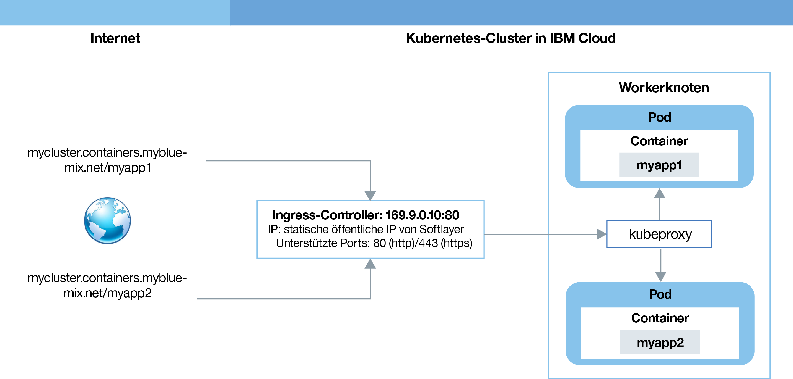

---

copyright:
  years: 2014, 2018
lastupdated: "2018-05-24"

---

{:new_window: target="_blank"}
{:shortdesc: .shortdesc}
{:screen: .screen}
{:pre: .pre}
{:table: .aria-labeledby="caption"}
{:codeblock: .codeblock}
{:tip: .tip}
{:download: .download}


# Apps mit Ingress zugänglich machen
{: #ingress}

Stellen Sie mehrere Apps in Ihrem Kubernetes-Cluster bereit, indem Sie Ingress-Ressourcen erstellen, die durch eine von IBM bereitgestellte Lastausgleichsfunktion für Anwendungen in {{site.data.keyword.containerlong}} verwaltet werden.
{:shortdesc}

## Netzverkehr mithilfe von Ingress verwalten
{: #planning}

Ingress ist ein Kubernetes-Service, der Netzverkehr-Workloads in Ihrem Cluster ausgleicht, indem öffentliche oder private Anforderungen an Ihre Apps weitergeleitet werden. Mit Ingress können Sie in einem öffentlichen oder privaten Netz mehrere App-Services zugänglich machen, indem Sie eine eindeutige öffentliche oder private Route verwenden.
{:shortdesc}


Ingress besteht aus zwei Komponenten:
<dl>
<dt>Lastausgleichsfunktion für Anwendungen</dt>
<dd>Die Lastausgleichsfunktion für Anwendungen (ALB) ist eine externe Lastausgleichsfunktionen, die für eingehende HTTP-, HTTPS-, TCP- oder UDP-Serviceanforderungen empfangsbereit ist und Anforderungen an den entsprechenden App-Pod weiterleitet. Wenn Sie einen Standardcluster erstellen, erstellt {{site.data.keyword.containershort_notm}} automatisch eine hochverfügbare ALB für Ihre Cluster und ordnet ihnen eine eindeutige öffentliche Route zu. Die öffentliche Route ist mit einer portierbaren öffentlichen IP-Adresse verknüpft, die bei der Erstellung des Clusters in Ihrem Konto von IBM Cloud Infrastructure (SoftLayer) eingerichtet wird. Es wird zwar auch eine private Standard-ALB (Lastausgleichsfunktion für Anwendungen) erstellt, diese wird jedoch nicht automatisch aktiviert.</dd>
<dt>Ingress-Ressource</dt>
<dd>Um eine App über Ingress zugänglich zu machen, müssen Sie einen Kubernetes-Service für Ihre App erstellen und diesen Service bei der Lastausgleichsfunktion für Anwendungen (ALB) registrieren, indem Sie eine Ingress-Ressource definieren. Die Ingress-Ressource ist eine Kubernetes-Ressource, die die Regeln für die Weiterleitung eingehender Anforderungen für eine App definiert. Die Ingress-Ressource gibt auch den Pfad zu Ihrem App-Service an, der an die öffentliche Route angehängt wird, um eine eindeutige App-URL zu bilden, z. B. `mycluster.us-south.containers.appdomain.cloud/myapp`. <br></br><strong>Hinweis</strong>: Seit dem 24. Mai 2018 gibt es ein anderes Ingress-Unterdomänenformat für neue Cluster.<ul><li>Clustern, die nach dem 24. Mai 2018 erstellt wurden, wird eine Unterdomäne in dem neuen Format <code>&lt;clustername&gt;.&lt;region&gt;.containers.appdomain.cloud</code> zugewiesen.</li><li>Cluster, die vor dem 24. Mai erstellt wurden, verwenden weiterhin die zugeordnete Unterdomäne in dem alten Format <code>&lt;clustername&gt;.&lt;region&gt;.containers.mybluemix.net</code>.</li></ul></dd>
</dl>

Das folgende Diagramm veranschaulicht, wie Ingress die Kommunikation vom Internet an eine App leitet:



1. Ein Benutzer sendet eine Anforderung an Ihre App, indem er auf die URL Ihrer App zugreift. Diese URL ist die öffentliche URL für Ihre zugänglich gemachte App, der der Pfad der Ingress-Ressource wie zum Beispiel `mycluster.us-south.containers.appdomain.cloud/myapp` angehängt wird.

2. Ein DNS-Systemservice, der als globale Lastausgleichsfunktion fungiert, löst die URL in die portierbare öffentliche IP-Adresse der öffentlichen Standard-ALB im Cluster auf. Die Anforderung wird an den Kubernetes-Lastausgleichsservice für die App weitergeleitet.

3. Der Kubernetes-Service leitet die Anforderung an die ALB weiter.

4. Die ALB überprüft, ob eine Weiterleitungsregel für den Pfad `myapp` im Cluster vorhanden ist. Wird eine übereinstimmende Regel gefunden, wird die Anforderung entsprechend der Regeln, die Sie in der Ingress-Ressource definiert haben, an den Pod weitergeleitet, in dem die App bereitgestellt wurde. Wenn mehrere App-Instanzen im Cluster bereitgestellt werden, gleicht die ALB die Anforderungen zwischen den App-Pods aus.


<br />


## Voraussetzungen
{: #config_prereqs}

Bevor Sie mit der Verwendung mit Ingress beginnen, überprüfen Sie die folgenden Voraussetzungen.
{:shortdesc}

**Voraussetzungen für alle Ingress-Konfigurationen:**
- Ingress ist nur für Standardcluster verfügbar und erfordert mindestens zwei Workerknoten im Cluster, um eine hohe Verfügbarkeit und regelmäßige Aktualisierungen zu gewährleisten.
- Für die Einrichtung von Ingress ist eine [Zugriffsrichtlinie 'Administrator'](cs_users.html#access_policies) erforderlich. Überprüfen Sie Ihre aktuelle [Zugriffsrichtlinie](cs_users.html#infra_access).


<br />


## Netzbetrieb für einen einzelnen oder mehrere Namensbereiche planen
{: #multiple_namespaces}

Es ist mindestens eine Ingress-Ressource pro Namensbereich erforderlich, in dem sich die zugänglich zu machenden Apps befinden.
{:shortdesc}

<dl>
<dt>Alle Apps befinden sich in einem Namensbereich</dt>
<dd>Wenn sich die Apps in Ihrem Cluster alle im selben Namensbereich befinden, ist mindestens eine Ingress-Ressource erforderlich, um die Weiterleitungsregeln für die dort zugänglich gemachten Apps zu definieren. Wenn beispielsweise `App1` und `App2` von Services in einem Namensbereich für die Entwicklung zugänglich gemacht werden, können Sie eine Ingress-Ressource in dem Namensbereich erstellen. Die Ressource gibt `domain.net` als Host an und registriert die Pfade, an denen die einzelnen Apps empfangsbereit sind, mit `domain.net`.
<br></br>
</dd>
<dt>Apps in mehreren Namensbereichen</dt>
<dd>Wenn sich die Apps in Ihrem Cluster in unterschiedlichen Namensbereichen befinden, müssen Sie mindestens eine Ressource pro Namensbereich erstellen, um Regeln für die dort zugänglich gemachten Apps zu definieren. Um mehrere Ingress-Ressourcen mit der Ingress-Lastausgleichsfunktion für Anwendungen (Ingress-ALB) des Clusters zu registrieren, müssen Sie eine Platzhalterdomäne verwenden. Wenn eine solche Platzhalterdomäne, wie `*.mycluster.us-south.containers.appdomain.cloud`, registriert wird, werden mehrere Unterdomänen für denselben Host aufgelöst. Sie können dann in jedem Namensbereich eine Ingress-Ressource erstellen und in jeder Ingress-Ressource eine andere Unterdomäne angeben.
<br><br>
Nehmen Sie beispielsweise folgendes Szenario an:<ul>
<li>Sie verfügen über zwei Versionen derselben App (`App1` und `App3`) zu Testzwecken.</li>
<li>Sie stellen die Apps in zwei unterschiedlichen Namensbereichen im selben Cluster bereit: `App1` im Namensbereich für die Entwicklung und `App3` im Namensbereich für das Staging.</li></ul>
Um dieselbe Cluster-ALB zum Verwalten von Datenverkehr für diese Apps zu verwenden, erstellen Sie die folgenden Services und Ressourcen:<ul>
<li>Einen Kubernetes-Service im Namensbereich für die Entwicklung zum Bereitstellen von `App1`.</li>
<li>Eine Ingress-Ressource im Namensbereich für die Entwicklung, die den Host als `dev.mycluster.us-south.containers.appdomain.cloud` angibt.</li>
<li>Einen Kubernetes-Service im Namensbereich für das Staging zum Bereitstellen von `App3`.</li>
<li>Eine Ingress-Ressource im Namensbereich für das Staging, die den Host als `stage.mycluster.us-south.containers.appdomain.cloud` angibt.</li></ul></br>

Jetzt werden beide URLs für dieselbe Domäne aufgelöst und daher beide von derselben Lastausgleichsfunktion für Anwendungen (ALB) bedient. Da jedoch die Ressource im Namensbereich für das Staging mit der Unterdomäne `stage` registriert ist, leitet die Ingress-Lastausgleichsfunktion für Anwendungen (ALB) Anforderungen ordnungsgemäß von der URL `stage.mycluster.us-south.containers.appdomain.cloud/app3` nur an `App3` weiter.</dd>
</dl>

**Hinweis**:
* Der von IBM bereitgestellte Platzhalter für die Ingress-Unterdomäne (`*.<cluster_name>.<region>.containers.appdomain.cloud`) wird standardmäßig für Ihren Cluster registriert. TLS wird jedoch nicht für den von IBM bereitgestellten Platzhalter für die Ingress-Unterdomäne unterstützt.
* Wenn Sie eine angepasste Domäne verwenden möchten, müssen Sie diese als eine Platzhalterdomäne, wie `*.custom_domain.net`, registrieren. Um TLS verwenden zu können, müssen Sie ein Platzhalterzertifikat abrufen.

### Mehrere Domänen in einem Namensbereich

In einem einzelnen Namensbereich können Sie über eine Domäne auf alle Apps in dem Namensbereich zugreifen. Wenn Sie für die Apps in einem einzelnen Namensbereich unterschiedliche Domänen verwenden möchten, verwenden Sie eine Platzhalterdomäne. Wenn eine solche Platzhalterdomäne, wie `*.mycluster.us-south.containers.appdomain.cloud`, registriert wird, werden mehrere Unterdomänen für denselben Host aufgelöst. Sie können dann eine Ressource verwenden, um mehrere Unterdomänenhosts in dieser Ressource anzugeben. Alternativ können Sie in dem Namensbereich mehrere Ingress-Ressourcen erstellen und in jeder Ingress-Ressource eine andere Unterdomäne angeben.


**Hinweis**:
* Der von IBM bereitgestellte Platzhalter für die Ingress-Unterdomäne (`*.<cluster_name>.<region>.containers.appdomain.cloud`) wird standardmäßig für Ihren Cluster registriert. TLS wird jedoch nicht für den von IBM bereitgestellten Platzhalter für die Ingress-Unterdomäne unterstützt.
* Wenn Sie eine angepasste Domäne verwenden möchten, müssen Sie diese als eine Platzhalterdomäne, wie `*.custom_domain.net`, registrieren. Um TLS verwenden zu können, müssen Sie ein Platzhalterzertifikat abrufen.

<br />


## Apps in Ihrem Cluster öffentlich zugänglich machen
{: #ingress_expose_public}

Machen Sie Apps in Ihrem Cluster über die öffentliche Ingress-Lastausgleichsfunktion für Anwendungen (Ingress-ALB) für die Allgemeinheit zugänglich.
{:shortdesc}

Vorbemerkungen:

-   Überprüfen Sie die [Voraussetzungen](#config_prereqs) für Ingress.
-   Wenn Sie nicht bereits über einen verfügen, [erstellen Sie einen Standardcluster](cs_clusters.html#clusters_ui).
-   [Richten Sie Ihre CLI](cs_cli_install.html#cs_cli_configure) auf Ihren Cluster aus, `kubectl`-Befehle auszuführen.

### Schritt 1: Apps bereitstellen und App-Services erstellen
{: #public_inside_1}

Stellen Sie als Erstes Ihre Apps bereit und erstellen Sie Kubernetes-Services und machen Sie diese zugänglich.
{: shortdesc}

1.  [Stellen Sie die App für den Cluster bereit](cs_app.html#app_cli). Stellen Sie sicher, dass Sie eine Bezeichnung zu Ihrer Bereitstellung im Metadatenabschnitt Ihrer Konfigurationsdatei hinzufügen, z. B. `app: code`. Diese Bezeichnung ist zur Identifizierung aller Pods erforderlich, in denen Ihre App ausgeführt wird, damit sie in den Ingress-Lastenausgleich aufgenommen werden können.

2.   Erstellen Sie einen Kubernetes-Service für jede App, den Sie öffentlich zugänglich machen möchten. Ihre App muss von einem Kubernetes-Service verfügbar gemacht werden, um von der Cluster-ALB beim Ingress-Lastausgleich berücksichtigt zu werden.
      1.  Öffnen Sie Ihren bevorzugten Editor und erstellen Sie eine Servicekonfigurationsdatei, beispielsweise `myapp_service.yaml`.
      2.  Definieren Sie einen Service für die App, der von der ALB zugänglich gemacht wird.

          ```
          apiVersion: v1
          kind: Service
          metadata:
            name: myapp_service
          spec:
            selector:
              <selektorschlüssel>: <selektorwert>
            ports:
             - protocol: TCP
               port: 8080
          ```
          {: codeblock}

          <table>
          <thead>
          <th colspan=2> Erklärung der ALB-Servicedateikomponenten</th>
          </thead>
          <tbody>
          <tr>
          <td><code>selector</code></td>
          <td>Geben Sie das Paar aus Kennzeichnungsschlüssel (<em>&lt;selektorschlüssel&gt;</em>) und Wert (<em>&lt;selektorwert&gt;</em>) ein, das Sie für die Ausrichtung auf die Pods, in denen Ihre App ausgeführt wird, verwenden möchten. Um Ihre Pods anzusprechen und in den Servicelastausgleich einzubeziehen, müssen Sie sicherstellen, dass der <em>&lt;selektorschlüssel&gt;</em> und der <em>&lt;selektorwert&gt;</em> mit dem Schlüssel/Wert-Paar im Abschnitt <code>spec.template.metadata.labels</code> Ihrer yaml-Bereitstellungsdatei übereinstimmen.</td>
           </tr>
           <tr>
           <td><code>port</code></td>
           <td>Der Port, den der Service überwacht.</td>
           </tr>
           </tbody></table>
      3.  Speichern Sie Ihre Änderungen.
      4.  Erstellen Sie den Service in Ihrem Cluster. Wenn Apps in mehreren Namensbereichen in Ihrem Cluster bereitgestellt werden, stellen Sie sicher, dass der Service im selben Namensbereich bereitgestellt wird wie die App, die Sie zugänglich machen möchten.

          ```
          kubectl apply -f myapp_service.yaml [-n <namensbereich>]
          ```
          {: pre}
      5.  Wiederholen Sie diese Schritte für jede App, die Sie zugänglich machen wollen.


### Schritt 2: App-Domäne und TLS-Terminierung auswählen
{: #public_inside_2}

Beim Konfigurieren der öffentlichen Lastausgleichsfunktion für Anwendungen wählen Sie die Domäne aus, über die Ihre Apps zugänglich sind, und geben an, ob die TLS-Terminierung verwendet werden soll.
{: shortdesc}

<dl>
<dt>Domäne</dt>
<dd>Sie können die von IBM bereitgestellte Domäne, wie <code>mycluster-12345.us-south.containers.appdomain.cloud/myapp</code>, für den Zugriff auf die App über das Internet verwenden. Um stattdessen eine angepasste Domäne zu verwenden, können Sie diese der von IBM bereitgestellten Domäne oder der öffentlichen IP-Adresse der Lastausgleichsfunktion für Anwendungen zuordnen.</dd>
<dt>TLS-Terminierung</dt>
<dd>Die Lastausgleichsfunktion für Anwendungen verteilt die Lasten des HTTP-Netzverkehrs auf die Apps in Ihrem Cluster. Um auch einen Lastausgleich für eingehende HTTPS-Verbindungen durchführen zu können, können Sie die Lastausgleichsfunktion so konfigurieren, dass der Netzverkehr entschlüsselt und die entschlüsselte Anforderung an die Apps weitergeleitet wird, die in Ihrem Cluster zugänglich sind. Wenn Sie die von IBM bereitgestellte Ingress-Unterdomäne verwenden, können Sie das von IBM bereitgestellte TLS-Zertifikat verwenden. TLS wird momentan nicht für von IBM bereitgestellte Platzhalter-Unterdomänen unterstützt. Wenn Sie eine angepasste Domäne verwenden, können Sie Ihr eigenes TLS-Zertifikat zum Verwalten der TLS-Terminierung nutzen.</dd>
</dl>

Gehen Sie wie folgt vor, um die von IBM bereitgestellte Ingress-Domäne zu verwenden:
1. Rufen Sie die Details für den Cluster ab. Ersetzen Sie _&lt;clustername_oder_-id&gt;_ durch den Namen des Clusters, in dem die Apps, die Sie zugänglich machen möchten, bereitgestellt werden.

    ```
    bx cs cluster-get <clustername_oder_-id>
    ```
    {: pre}

    Beispielausgabe:

    ```
    Name:                   mycluster
    ID:                     18a61a63c6a94b658596ca93d087aad9
    State:                  normal
    Created:                2018-01-12T18:33:35+0000
    Location:               dal10
    Master URL:             https://169.xx.xxx.xxx:26268
    Ingress Subdomain:      mycluster-12345.us-south.containers.appdomain.cloud
    Ingress Secret:         <tls_secret>
    Workers:                3
    Version:                1.9.7
    Owner Email:            owner@email.com
    Monitoring Dashboard:   <dashboard-url>
    ```
    {: screen}
2. Rufen Sie die von IBM bereitgestellte Domäne im Feld **Ingress-Unterdomäne** ab. Wenn Sie TLS verwenden möchten, rufen Sie auch den von IBM bereitgestellten geheimen TLS-Schlüssel im Feld **Geheimer Ingress-Schlüssel** ab.
    **Hinweis**: Wenn Sie eine Platzhalter-Unterdomäne verwenden, wird TLS nicht unterstützt.

Gehen Sie wie folgt vor, um eine angepasste Domäne zu verwenden:
1.    Erstellen Sie eine angepasste Domäne. Arbeiten Sie mit Ihrem DNS-Provider (Domain Name Service) oder [{{site.data.keyword.Bluemix_notm}}-DNS](/docs/infrastructure/dns/getting-started.html#getting-started-with-dns), um Ihre angepasste Domäne zu registrieren.
      * Wenn sich die Apps, die über Ingress zugänglich gemacht werden sollen, in einem Cluster in unterschiedlichen Namensbereichen befinden, registrieren Sie die angepasste Domäne als Platzhalterdomäne, wie `*.custom_domain.net`.

2.  Konfigurieren Sie Ihre Domäne, um eingehenden Netzverkehr an die von IBM bereitgestellte Lastausgleichsfunktion für Anwendungen (ALB) weiterzuleiten. Wählen Sie zwischen diesen Optionen:
    -   Definieren Sie einen Alias für Ihre angepasste Domäne, indem Sie die von IBM bereitgestellte Domäne als kanonischen Namensdatensatz (CNAME) angeben. Führen Sie `bx cs cluster-get <cluster_name>` aus, um die von IBM bereitgestellte Ingress-Domäne zu suchen, und suchen Sie nach dem Feld für die Ingress-Unterdomäne (**Ingress subdomain**).
    -   Ordnen Sie Ihre angepasste Domäne der portierbaren öffentlichen IP-Adresse der von IBM bereitgestellten Lastausgleichsfunktion für Anwendungen (ALB) zu, indem Sie die IP-Adresse als Datensatz hinzufügen. Um die portierbare öffentliche IP-Adresse der ALB zu finden, führen Sie folgenden Befehl aus: `bx cs alb-get <public_alb_ID>`.
3.   Optional: Wenn Sie TLS verwenden möchten, importieren oder erstellen Sie ein TLS-Zertifikat und geheimen Schlüssel. Wenn Sie eine Platzhalterdomäne verwenden, stellen Sie sicher, dass Sie ein Platzhalterzertifikat importieren oder erstellen.
      * Wenn in {{site.data.keyword.cloudcerts_long_notm}} bereits ein TLS-Zertifikat gespeichert ist, das Sie verwenden wollen, können Sie den zugehörigen geheimen Schlüssel in Ihren Cluster importieren, indem Sie den folgenden Befehl ausführen:
        ```
        bx cs alb-cert-deploy --secret-name <name_des_geheimen_schlüssels> --cluster <clustername_oder_-id> --cert-crn <crn_des_zertifikats>
        ```
        {: pre}
      * Wenn kein TLS-Zertifikat bereitsteht, führen Sie die folgenden Schritte aus:
        1. Erstellen Sie ein TLS-Zertifikat und einen Schlüssel für Ihre Domäne, der im PEM-Format codiert ist.
        2. Erstellen Sie einen geheimen Schlüssel, der Ihr TLS-Zertifikat und Ihren Schlüssel verwendet. Ersetzen Sie <em>&lt;name_des_geheimen_tls-schlüssels&gt;</em> durch einen Namen für Ihren geheimen Kubernetes-Schlüssel, <em>&lt;dateipfad_des_tls-schlüssels&gt;</em> durch den Pfad Ihrer angepassten TLS-Schlüsseldatei und <em>&lt;dateipfad_des_tls-zertifikats&gt;</em> durch den Pfad Ihrer angepassten TLS-Zertifikatsdatei.
          ```
          kubectl create secret tls <name_des_geheimen_tls-schlüssels> --key <dateipfad_des_tls-schlüssels> --cert <dateipfad_des_tls-zertifikats>
          ```
          {: pre}


### Schritt 3: Ingress-Ressource erstellen
{: #public_inside_3}

Ingress-Ressourcen definieren die Routing-Regeln, mit der die Lastausgleichsfunktion für Anwendungen Datenverkehr an Ihren App-Service weiterleitet.
{: shortdesc}

**Hinweis:** Wenn Ihr Cluster mehrere Namensbereiche aufweist, in denen Apps zugänglich gemacht werden, ist pro Namensbereich mindestens eine Ingress-Ressource erforderlich. Jeder Namensbereich muss jedoch einen anderen Host verwenden. Sie müssen eine Platzhalterdomäne registrieren und in jeder Ressource eine andere Unterdomäne angeben. Weitere Informationen finden Sie in [Netzbetrieb für einen einzelnen oder mehrere Namensbereiche planen](#multiple_namespaces).

1. Öffnen Sie Ihren bevorzugten Editor und erstellen Sie eine Ingress-Konfigurationsdatei namens `myingressresource.yaml` (Beispiel).

2. Definieren Sie eine Ingress-Ressource in Ihrer Konfigurationsdatei, die die von IBM bereitgestellte Domäne oder Ihre angepasste Domäne für das Weiterleiten von eingehendem Netzverkehr an die zuvor erstellten Services verwendet.

    YALM-Beispieldatei ohne TLS:
    ```
    apiVersion: extensions/v1beta1
    kind: Ingress
    metadata:
      name: myingressresource
    spec:
      rules:
      - host: <domäne>
        http:
          paths:
          - path: /<app1-pfad>
            backend:
              serviceName: <app1-service>
              servicePort: 80
          - path: /<app2-pfad>
            backend:
              serviceName: <app2-service>
              servicePort: 80
    ```
    {: codeblock}

    YALM-Beispieldatei mit TLS:
    ```
    apiVersion: extensions/v1beta1
    kind: Ingress
    metadata:
      name: myingressresource
    spec:
      tls:
      - hosts:
        - <domäne>
        secretName: <name_des_geheimen_tls-schlüssels>
      rules:
      - host: <domäne>
        http:
          paths:
          - path: /<app1-pfad>
            backend:
              serviceName: <app1-service>
              servicePort: 80
          - path: /<app2-pfad>
            backend:
              serviceName: <app2-service>
              servicePort: 80
    ```
    {: codeblock}

    <table>
    <thead>
    <th colspan=2> Erklärung der YAML-Dateikomponenten</th>
    </thead>
    <tbody>
    <tr>
    <td><code>tls/hosts</code></td>
    <td>Um TLS zu verwenden, ersetzen Sie <em>&lt;domäne&gt;</em> durch die von IBM bereitgestellte Ingress-Unterdomäne oder Ihre angepasste Domäne.

    </br></br>
    <strong>Hinweis:</strong><ul><li>Wenn die Apps von Services in einem Cluster in unterschiedlichen Namensbereichen zugänglich gemacht werden, hängen Sie eine Platzhalter-Unterdomäne, wie `subdomain1.custom_domain.net` oder `subdomain1.mycluster.us-south.containers.appdomain.cloud`, an die Domäne an. Verwenden Sie für jede Ressource, die Sie im Cluster erstellen, eine eindeutige Unterdomäne.</li><li>Verwenden Sie keine Sternchen (&ast;) für Ihren Host oder lassen Sie die Hosteigenschaft leer, um Fehler während der Ingress-Erstellung zu vermeiden.</li></ul></td>
    </tr>
    <tr>
    <td><code>tls/secretName</code></td>
    <td><ul><li>Wenn Sie die von IBM bereitgestellte Ingress-Domäne verwenden, ersetzen Sie <em>&lt;name_des_geheimen_tls-schlüssels&gt;</em> durch den Namen des von IBM bereitgestellten geheimen Ingress-Schlüssels.</li><li>Wenn Sie eine angepasste Domäne verwenden, ersetzen Sie <em>&lt;name_des_geheimen_tls-schlüssels&gt;</em> durch den geheimen Schlüssel, den Sie zuvor erstellt haben und der Ihr angepasstes TLS-Zertifikat sowie den Schlüssel enthält. Wenn Sie ein Zertifikat aus {{site.data.keyword.cloudcerts_short}} importiert haben, können Sie den Befehl <code>bx cs alb-cert-get --cluster <clustername_oder_-id> --cert-crn <crn_des_zertifikats></code> ausführen, um die geheimen Schlüssel anzuzeigen, die einem TLS-Zertifikat zugeordnet sind.</li><ul><td>
    </tr>
    <tr>
    <td><code>host</code></td>
    <td>Ersetzen Sie <em>&lt;domäne&gt;</em> durch die von IBM bereitgestellte Ingress-Unterdomäne oder Ihre angepasste Domäne.

    </br></br>
    <strong>Hinweis:</strong><ul><li>Wenn die Apps von Services in einem Cluster in unterschiedlichen Namensbereichen zugänglich gemacht werden, hängen Sie eine Platzhalter-Unterdomäne, wie `subdomain1.custom_domain.net` oder `subdomain1.mycluster.us-south.containers.appdomain.cloud`, an die Domäne an. Verwenden Sie für jede Ressource, die Sie im Cluster erstellen, eine eindeutige Unterdomäne.</li><li>Verwenden Sie keine Sternchen (&ast;) für Ihren Host oder lassen Sie die Hosteigenschaft leer, um Fehler während der Ingress-Erstellung zu vermeiden.</li></ul></td>
    </tr>
    <tr>
    <td><code>path</code></td>
    <td>Ersetzen Sie <em>&lt;app-pfad&gt;</em> durch einen Schrägstrich oder den Pfad, den Ihre App überwacht. Der Pfad wird an die von IBM bereitstellte Domäne oder Ihre angepasste Domäne angehängt, um eine eindeutige Route zu Ihrer App zu erstellen. Wenn Sie diese Route in einen Web-Browser eingeben, wird der Netzverkehr an die Lastausgleichsfunktion für Anwendungen (ALB) weitergeleitet. Die Lastausgleichsfunktion für Anwendungen (ALB) sucht nach dem zugehörigen Service und sendet Netzverkehr an ihn. Der Service leitet den Datenverkehr dann an die Pods weiter, in denen die App ausgeführt wird.
    </br></br>
    Die meisten Apps überwachen keinen bestimmten Pfad, sondern verwenden den Rootpfad und einen bestimmten Port. In diesem Fall definieren Sie den Rootpfad als <code>/</code> und geben keinen individuellen Pfad für Ihre App an. Beispiel: <ul><li>Geben Sie für <code>http://domain/</code> als Pfad <code>/</code> ein.</li><li>Geben Sie für <code>http://domain/app1-pfad</code> als Pfad <code>/app1-pfad</code> ein.</li></ul>
    </br>
    <strong>Tipp:</strong> Um Ingress für die Überwachung eines Pfads zu konfigurieren, der von dem Pfad abweicht, den Ihre App überwacht, können Sie die [Annotation zum erneuten Schreiben (rewrite)](cs_annotations.html#rewrite-path) verwenden.
    </td>
    </tr>
    <tr>
    <td><code>serviceName</code></td>
    <td>Ersetzen Sie <em>&lt;app1-service&gt;</em> und <em>&lt;app2-service&gt;</em> usw. durch die entsprechenden Namen der Services, die Sie erstellt haben, um die Apps zugänglich zu machen. Wenn die Apps von Services im Cluster in unterschiedlichen Namensbereichen zugänglich gemacht werden, schließen Sie nur App-Services ein, die sich im selben Namensbereich befinden. Sie müssen für jeden Namensbereich, in denen Apps zugänglich gemacht werden sollen, eine Ingress-Ressource erstellen.</td>
    </tr>
    <tr>
    <td><code>servicePort</code></td>
    <td>Der Port, den Ihr Service überwacht. Verwenden Sie denselben Port, die Sie beim Erstellen des Kubernetes-Service für Ihre App definiert haben.</td>
    </tr>
    </tbody></table>

3.  Erstellen Sie die Ingress-Ressource für Ihr Cluster. Stellen Sie sicher, dass die Ressource im selben Namensbereich wie die App-Services bereitgestellt wird, die in der Ressource angegeben wurden.

    ```
    kubectl apply -f myingressresource.yaml -n <namensbereich>
    ```
    {: pre}
4.   Überprüfen Sie, dass die Ingress-Ressource erfolgreich erstellt wurde.

      ```
      kubectl describe ingress myingressresource
      ```
      {: pre}

      1. Wenn Nachrichten im Ereignis einen Fehler in Ihrer Ressourcenkonfiguration beschreiben, ändern Sie die Werte in Ihrer Ressourcendatei und wenden Sie die Datei für die Ressource erneut an.


Die Ingress-Ressource wird im selben Namensbereich wie die App-Services erstellt. Die Apps in diesem Namensbereich werden für die Ingress-Lastausgleichsfunktion für Anwendungen des Clusters registriert.

### Schritt 4: Über das Internet auf die App zugreifen
{: #public_inside_4}

Geben Sie in einem Web-Browser die URL des App-Service an, auf den zugegriffen werden soll.

```
https://<domäne>/<app1-pfad>
```
{: pre}

Wenn Sie mehrere Apps zugänglich gemacht haben, greifen Sie auf diese Apps zu, indem Sie den an die URL angehängten Pfad ändern.

```
https://<domain>/<app2-pfad>
```
{: pre}

Wenn Sie Apps in verschiedenen Namensbereichen über eine Platzhalterdomäne zugänglich machen, greifen Sie auf diese Apps mit den entsprechenden Unterdomänen zu.

```
http://<unterdomäne1>.<domäne>/<app1-pfad>
```
{: pre}

```
http://<unterdomäne2>.<domäne>/<app1-pfad>
```
{: pre}


<br />


## Apps außerhalb Ihres Clusters öffentlich zugänglich machen
{: #external_endpoint}

Machen Sie Apps außerhalb Ihres Clusters öffentlich zugänglich, indem Sie sie in den öffentlichen Lastausgleich der Ingress-ALB einschließen. Eingehende öffentliche Anforderungen an die von IBM bereitgestellte oder Ihre angepasste Domäne werden automatisch an die externe App weitergeleitet.
{:shortdesc}

Vorbemerkungen:

-   Überprüfen Sie die [Voraussetzungen](#config_prereqs) für Ingress.
-   Wenn Sie nicht bereits über einen verfügen, [erstellen Sie einen Standardcluster](cs_clusters.html#clusters_ui).
-   [Richten Sie Ihre CLI](cs_cli_install.html#cs_cli_configure) auf Ihren Cluster aus, `kubectl`-Befehle auszuführen.
-   Stellen Sie sicher, dass auf die externe App, die Sie beim Lastausgleich des Clusters berücksichtigen möchten, über eine öffentliche IP-Adresse zugegriffen werden kann.

### Schritt 1: App-Service und externen Endpunkt erstellen
{: #public_outside_1}

Erstellen Sie zunächst einen Kubernetes-Service, um die externe App zugänglich zu machen, und konfigurieren Sie einen externen Kubernetes-Endpunkt für die App.
{: shortdesc}

1.  Erstellen Sie einen Kubernetes-Service für Ihren Cluster, der eingehende Anforderungen an einen von Ihnen erstellten externen Endpunkt weiterleitet.
    1.  Öffnen Sie Ihren bevorzugten Editor und erstellen Sie eine Servicekonfigurationsdatei namens `myexternalservice.yaml` (Beispiel).
    2.  Definieren Sie einen Service für die App, der von der ALB zugänglich gemacht wird.

        ```
        apiVersion: v1
        kind: Service
        metadata:
          name: myexternalservice
        spec:
          ports:
           - protocol: TCP
             port: 8080
        ```
        {: codeblock}

        <table>
        <caption>Erklärung der ALB-Servicedateikomponenten</caption>
        <thead>
        <th colspan=2> Erklärung der YAML-Dateikomponenten</th>
        </thead>
        <tbody>
        <tr>
        <td><code>metadata/name</code></td>
        <td>Ersetzen Sie <em>&lt;mein_externer_service&gt;</em> durch den Namen Ihres Service.<p>Erfahren Sie mehr über das [Sichern der persönliche Daten](cs_secure.html#pi) bei der Arbeit mit Kubernetes-Ressourcen.</p></td>
        </tr>
        <tr>
        <td><code>port</code></td>
        <td>Der Port, den der Service überwacht.</td>
        </tr></tbody></table>

    3.  Speichern Sie Ihre Änderungen.
    4.  Erstellen Sie den Kubernetes-Service für Ihren Cluster.

        ```
        kubectl apply -f myexternalservice.yaml
        ```
        {: pre}
2.  Konfigurieren Sie einen Kubernetes-Endpunkt, der den externen Standort der App definiert, die Sie beim Lastausgleich des Clusters berücksichtigen möchten.
    1.  Öffnen Sie Ihren bevorzugten Editor und erstellen Sie eine Endpunktkonfigurationsdatei namens `myexternalendpoint.yaml` (Beispiel).
    2.  Definieren Sie Ihren externen Endpunkt. Schließen Sie alle öffentlichen IP-Adressen und Ports ein, über die Sie auf Ihre externen App zugreifen können.

        ```
        kind: Endpoints
        apiVersion: v1
        metadata:
          name: myexternalendpoint
        subsets:
          - addresses:
              - ip: <externe_ip1>
              - ip: <externe_ip2>
            ports:
              - port: <externer_port>
        ```
        {: codeblock}

        <table>
        <thead>
        <th colspan=2> Erklärung der YAML-Dateikomponenten</th>
        </thead>
        <tbody>
        <tr>
        <td><code>name</code></td>
        <td>Ersetzen Sie <em>&lt;myexternalendpoint&gt;</em> durch den Namen des Kubernetes-Service, den Sie zuvor erstellt haben.</td>
        </tr>
        <tr>
        <td><code>ip</code></td>
        <td>Ersetzen Sie <em>&lt;externe_IP&gt;</em> durch die öffentlichen IP-Adressen für die Verbindung mit Ihrer externen App.</td>
         </tr>
         <td><code>port</code></td>
         <td>Ersetzen Sie <em>&lt;externer_port&gt;</em> durch den Port, den Ihre externe App überwacht.</td>
         </tbody></table>

    3.  Speichern Sie Ihre Änderungen.
    4.  Erstellen Sie den Kubernetes-Endpunkt für Ihren Cluster.

        ```
        kubectl apply -f myexternalendpoint.yaml
        ```
        {: pre}

### Schritt 2: App-Domäne und TLS-Terminierung auswählen
{: #public_outside_2}

Beim Konfigurieren der öffentlichen Lastausgleichsfunktion für Anwendungen wählen Sie die Domäne aus, über die Ihre Apps zugänglich sind, und geben an, ob die TLS-Terminierung verwendet werden soll.
{: shortdesc}

<dl>
<dt>Domäne</dt>
<dd>Sie können die von IBM bereitgestellte Domäne, wie <code>mycluster-12345.us-south.containers.appdomain.cloud/myapp</code>, für den Zugriff auf die App über das Internet verwenden. Um stattdessen eine angepasste Domäne zu verwenden, können Sie diese der von IBM bereitgestellten Domäne oder der öffentlichen IP-Adresse der Lastausgleichsfunktion für Anwendungen zuordnen.</dd>
<dt>TLS-Terminierung</dt>
<dd>Die Lastausgleichsfunktion für Anwendungen verteilt die Lasten des HTTP-Netzverkehrs auf die Apps in Ihrem Cluster. Um auch einen Lastausgleich für eingehende HTTPS-Verbindungen durchführen zu können, können Sie die Lastausgleichsfunktion so konfigurieren, dass der Netzverkehr entschlüsselt und die entschlüsselte Anforderung an die Apps weitergeleitet wird, die in Ihrem Cluster zugänglich sind. Wenn Sie die von IBM bereitgestellte Ingress-Unterdomäne verwenden, können Sie das von IBM bereitgestellte TLS-Zertifikat verwenden. TLS wird momentan nicht für von IBM bereitgestellte Platzhalter-Unterdomänen unterstützt. Wenn Sie eine angepasste Domäne verwenden, können Sie Ihr eigenes TLS-Zertifikat zum Verwalten der TLS-Terminierung nutzen.</dd>
</dl>

Gehen Sie wie folgt vor, um die von IBM bereitgestellte Ingress-Domäne zu verwenden:
1. Rufen Sie die Details für den Cluster ab. Ersetzen Sie _&lt;clustername_oder_-id&gt;_ durch den Namen des Clusters, in dem die Apps, die Sie zugänglich machen möchten, bereitgestellt werden.

    ```
    bx cs cluster-get <clustername_oder_-id>
    ```
    {: pre}

    Beispielausgabe:

    ```
    Name:                   mycluster
    ID:                     18a61a63c6a94b658596ca93d087aad9
    State:                  normal
    Created:                2018-01-12T18:33:35+0000
    Location:               dal10
    Master URL:             https://169.xx.xxx.xxx:26268
    Ingress Subdomain:      mycluster-12345.us-south.containers.appdomain.cloud
    Ingress Secret:         <tls_secret>
    Workers:                3
    Version:                1.9.7
    Owner Email:            owner@email.com
    Monitoring Dashboard:   <dashboard-url>
    ```
    {: screen}
2. Rufen Sie die von IBM bereitgestellte Domäne im Feld **Ingress-Unterdomäne** ab. Wenn Sie TLS verwenden möchten, rufen Sie auch den von IBM bereitgestellten geheimen TLS-Schlüssel im Feld **Geheimer Ingress-Schlüssel** ab. **Hinweis**: Wenn Sie eine Platzhalter-Unterdomäne verwenden, wird TLS nicht unterstützt.

Gehen Sie wie folgt vor, um eine angepasste Domäne zu verwenden:
1.    Erstellen Sie eine angepasste Domäne. Arbeiten Sie mit Ihrem DNS-Provider (Domain Name Service) oder [{{site.data.keyword.Bluemix_notm}} DNS](/docs/infrastructure/dns/getting-started.html#getting-started-with-dns), um Ihre angepasste Domäne zu registrieren.
      * Wenn sich die Apps, die über Ingress zugänglich gemacht werden sollen, in einem Cluster in unterschiedlichen Namensbereichen befinden, registrieren Sie die angepasste Domäne als Platzhalterdomäne, wie `*.custom_domain.net`.

2.  Konfigurieren Sie Ihre Domäne, um eingehenden Netzverkehr an die von IBM bereitgestellte Lastausgleichsfunktion für Anwendungen (ALB) weiterzuleiten. Wählen Sie zwischen diesen Optionen:
    -   Definieren Sie einen Alias für Ihre angepasste Domäne, indem Sie die von IBM bereitgestellte Domäne als kanonischen Namensdatensatz (CNAME) angeben. Führen Sie `bx cs cluster-get <cluster_name>` aus, um die von IBM bereitgestellte Ingress-Domäne zu suchen, und suchen Sie nach dem Feld für die Ingress-Unterdomäne (**Ingress subdomain**).
    -   Ordnen Sie Ihre angepasste Domäne der portierbaren öffentlichen IP-Adresse der von IBM bereitgestellten Lastausgleichsfunktion für Anwendungen (ALB) zu, indem Sie die IP-Adresse als Datensatz hinzufügen. Um die portierbare öffentliche IP-Adresse der ALB zu finden, führen Sie folgenden Befehl aus: `bx cs alb-get <public_alb_ID>`.
3.   Optional: Wenn Sie TLS verwenden möchten, importieren oder erstellen Sie ein TLS-Zertifikat und geheimen Schlüssel. Wenn Sie eine Platzhalterdomäne verwenden, stellen Sie sicher, dass Sie ein Platzhalterzertifikat importieren oder erstellen.
      * Wenn in {{site.data.keyword.cloudcerts_long_notm}} bereits ein TLS-Zertifikat gespeichert ist, das Sie verwenden wollen, können Sie den zugehörigen geheimen Schlüssel in Ihren Cluster importieren, indem Sie den folgenden Befehl ausführen:
        ```
        bx cs alb-cert-deploy --secret-name <name_des_geheimen_schlüssels> --cluster <clustername_oder_-id> --cert-crn <crn_des_zertifikats>
        ```
        {: pre}
      * Wenn kein TLS-Zertifikat bereitsteht, führen Sie die folgenden Schritte aus:
        1. Erstellen Sie ein TLS-Zertifikat und einen Schlüssel für Ihre Domäne, der im PEM-Format codiert ist.
        2. Erstellen Sie einen geheimen Schlüssel, der Ihr TLS-Zertifikat und Ihren Schlüssel verwendet. Ersetzen Sie <em>&lt;name_des_geheimen_tls-schlüssels&gt;</em> durch einen Namen für Ihren geheimen Kubernetes-Schlüssel, <em>&lt;dateipfad_des_tls-schlüssels&gt;</em> durch den Pfad Ihrer angepassten TLS-Schlüsseldatei und <em>&lt;dateipfad_des_tls-zertifikats&gt;</em> durch den Pfad Ihrer angepassten TLS-Zertifikatsdatei.
          ```
          kubectl create secret tls <name_des_geheimen_tls-schlüssels> --key <dateipfad_des_tls-schlüssels> --cert <dateipfad_des_tls-zertifikats>
          ```
          {: pre}


### Schritt 3: Ingress-Ressource erstellen
{: #public_outside_3}

Ingress-Ressourcen definieren die Routing-Regeln, mit der die Lastausgleichsfunktion für Anwendungen Datenverkehr an Ihren App-Service weiterleitet.
{: shortdesc}

**Hinweis:** Wenn Sie mehrere externe Apps zugänglich machen und sich die von Ihnen für die Apps in [Schritt 1](#public_outside_1) erstellten Services in unterschiedlichen Namensbereiche befinden, ist mindestens eine Ingress-Ressource pro Namensbereich erforderlich. Jeder Namensbereich muss jedoch einen anderen Host verwenden. Sie müssen eine Platzhalterdomäne registrieren und in jeder Ressource eine andere Unterdomäne angeben. Weitere Informationen finden Sie in [Netzbetrieb für einen einzelnen oder mehrere Namensbereiche planen](#multiple_namespaces).

1. Öffnen Sie Ihren bevorzugten Editor und erstellen Sie eine Ingress-Konfigurationsdatei namens `myexternalingress.yaml` (Beispiel).

2. Definieren Sie eine Ingress-Ressource in Ihrer Konfigurationsdatei, die die von IBM bereitgestellte Domäne oder Ihre angepasste Domäne für das Weiterleiten von eingehendem Netzverkehr an die zuvor erstellten Services verwendet.

    YALM-Beispieldatei ohne TLS:
    ```
    apiVersion: extensions/v1beta1
    kind: Ingress
    metadata:
      name: myexternalingress
    spec:
      rules:
      - host: <domäne>
        http:
          paths:
          - path: /<pfad_der_externen_app1>
            backend:
              serviceName: <app1-service>
              servicePort: 80
          - path: /<pfad_der_externen_app2>
            backend:
              serviceName: <app2-service>
              servicePort: 80
    ```
    {: codeblock}

    YALM-Beispieldatei mit TLS:
    ```
    apiVersion: extensions/v1beta1
    kind: Ingress
    metadata:
      name: myexternalingress
    spec:
      tls:
      - hosts:
        - <domäne>
        secretName: <name_des_geheimen_tls-schlüssels>
      rules:
      - host: <domäne>
        http:
          paths:
          - path: /<pfad_der_externen_app1>
            backend:
              serviceName: <app1-service>
              servicePort: 80
          - path: /<pfad_der_externen_app2>
            backend:
              serviceName: <app2-service>
              servicePort: 80
    ```
    {: codeblock}

    <table>
    <thead>
    <th colspan=2> Erklärung der YAML-Dateikomponenten</th>
    </thead>
    <tbody>
    <tr>
    <td><code>tls/hosts</code></td>
    <td>Um TLS zu verwenden, ersetzen Sie <em>&lt;domäne&gt;</em> durch die von IBM bereitgestellte Ingress-Unterdomäne oder Ihre angepasste Domäne.

    </br></br>
    <strong>Hinweis:</strong><ul><li>Wenn sich die App-Service in unterschiedlichen Namensbereichen im Cluster befinden, hängen Sie eine Platzhalter-Unterdomäne, wie `subdomain1.custom_domain.net` oder `subdomain1.mycluster.us-south.containers.appdomain.cloud`, an die Domäne an. Verwenden Sie für jede Ressource, die Sie im Cluster erstellen, eine eindeutige Unterdomäne.</li><li>Verwenden Sie keine Sternchen (&ast;) für Ihren Host oder lassen Sie die Hosteigenschaft leer, um Fehler während der Ingress-Erstellung zu vermeiden.</li></ul></td>
    </tr>
    <tr>
    <td><code>tls/secretName</code></td>
    <td><ul><li>Wenn Sie die von IBM bereitgestellte Ingress-Domäne verwenden, ersetzen Sie <em>&lt;name_des_geheimen_tls-schlüssels&gt;</em> durch den Namen des von IBM bereitgestellten geheimen Ingress-Schlüssels.</li><li>Wenn Sie eine angepasste Domäne verwenden, ersetzen Sie <em>&lt;name_des_geheimen_tls-schlüssels&gt;</em> durch den geheimen Schlüssel, den Sie zuvor erstellt haben und der Ihr angepasstes TLS-Zertifikat sowie den Schlüssel enthält. Wenn Sie ein Zertifikat aus {{site.data.keyword.cloudcerts_short}} importiert haben, können Sie den Befehl <code>bx cs alb-cert-get --cluster <clustername_oder_-id> --cert-crn <crn_des_zertifikats></code> ausführen, um die geheimen Schlüssel anzuzeigen, die einem TLS-Zertifikat zugeordnet sind.</li><ul><td>
    </tr>
    <tr>
    <td><code>rules/host</code></td>
    <td>Ersetzen Sie <em>&lt;domäne&gt;</em> durch die von IBM bereitgestellte Ingress-Unterdomäne oder Ihre angepasste Domäne.

    </br></br>
    <strong>Hinweis:</strong><ul><li>Wenn die Apps von Services in einem Cluster in unterschiedlichen Namensbereichen zugänglich gemacht werden, hängen Sie eine Platzhalter-Unterdomäne, wie `subdomain1.custom_domain.net` oder `subdomain1.mycluster.us-south.containers.appdomain.cloud`, an die Domäne an. Verwenden Sie für jede Ressource, die Sie im Cluster erstellen, eine eindeutige Unterdomäne.</li><li>Verwenden Sie keine Sternchen (&ast;) für Ihren Host oder lassen Sie die Hosteigenschaft leer, um Fehler während der Ingress-Erstellung zu vermeiden.</li></ul></td>
    </tr>
    <tr>
    <td><code>path</code></td>
    <td>Ersetzen Sie <em>&lt;pfad_der_externen_app&gt;</em> durch einen Schrägstrich oder den Pfad, den Ihre App überwacht. Der Pfad wird an die von IBM bereitstellte Domäne oder Ihre angepasste Domäne angehängt, um eine eindeutige Route zu Ihrer App zu erstellen. Wenn Sie diese Route in einen Web-Browser eingeben, wird der Netzverkehr an die Lastausgleichsfunktion für Anwendungen (ALB) weitergeleitet. Die Lastausgleichsfunktion für Anwendungen (ALB) sucht nach dem zugehörigen Service und sendet Netzverkehr an ihn. Der Service leitet den Datenverkehr an die externe App weiter. Die App muss so konfiguriert werden, dass dieser Pfad überwacht wird, um eingehenden Datenverkehr im Netz zu erhalten.
    </br></br>
    Die meisten Apps überwachen keinen bestimmten Pfad, sondern verwenden den Rootpfad und einen bestimmten Port. In diesem Fall definieren Sie den Rootpfad als <code>/</code> und geben keinen individuellen Pfad für Ihre App an. Beispiel: <ul><li>Geben Sie für <code>http://domain/</code> als Pfad <code>/</code> ein.</li><li>Geben Sie für <code>http://domain/app1-pfad</code> als Pfad <code>/app1-pfad</code> ein.</li></ul>
    </br></br>
    <strong>Tipp:</strong> Um Ingress für die Überwachung eines Pfads zu konfigurieren, der von dem Pfad abweicht, den Ihre App überwacht, können Sie die [Annotation zum erneuten Schreiben (rewrite)](cs_annotations.html#rewrite-path) verwenden.</td>
    </tr>
    <tr>
    <td><code>serviceName</code></td>
    <td>Ersetzen Sie <em>&lt;app1-service&gt;</em> und <em>&lt;app2-service&gt;</em> usw. durch die entsprechenden Namen der Services, die Sie erstellt haben, um die externen Apps zugänglich zu machen. Wenn die Apps von Services im Cluster in unterschiedlichen Namensbereichen zugänglich gemacht werden, schließen Sie nur App-Services ein, die sich im selben Namensbereich befinden. Sie müssen für jeden Namensbereich, in denen Apps zugänglich gemacht werden sollen, eine Ingress-Ressource erstellen.</td>
    </tr>
    <tr>
    <td><code>servicePort</code></td>
    <td>Der Port, den Ihr Service überwacht. Verwenden Sie denselben Port, die Sie beim Erstellen des Kubernetes-Service für Ihre App definiert haben.</td>
    </tr>
    </tbody></table>

3.  Erstellen Sie die Ingress-Ressource für Ihr Cluster. Stellen Sie sicher, dass die Ressource im selben Namensbereich wie die App-Services bereitgestellt wird, die in der Ressource angegeben wurden.

    ```
    kubectl apply -f myexternalingress.yaml -n <namensbereich>
    ```
    {: pre}
4.   Überprüfen Sie, dass die Ingress-Ressource erfolgreich erstellt wurde.

      ```
      kubectl describe ingress myingressresource
      ```
      {: pre}

      1. Wenn Nachrichten im Ereignis einen Fehler in Ihrer Ressourcenkonfiguration beschreiben, ändern Sie die Werte in Ihrer Ressourcendatei und wenden Sie die Datei für die Ressource erneut an.


Die Ingress-Ressource wird im selben Namensbereich wie die App-Services erstellt. Die Apps in diesem Namensbereich werden für die Ingress-Lastausgleichsfunktion für Anwendungen des Clusters registriert.

### Schritt 4: Über das Internet auf die App zugreifen
{: #public_outside_4}

Geben Sie in einem Web-Browser die URL des App-Service an, auf den zugegriffen werden soll.

```
https://<domäne>/<app1-pfad>
```
{: pre}

Wenn Sie mehrere Apps zugänglich gemacht haben, greifen Sie auf diese Apps zu, indem Sie den an die URL angehängten Pfad ändern.

```
https://<domain>/<app2-pfad>
```
{: pre}

Wenn Sie Apps in verschiedenen Namensbereichen über eine Platzhalterdomäne zugänglich machen, greifen Sie auf diese Apps mit den entsprechenden Unterdomänen zu.

```
http://<unterdomäne1>.<domäne>/<app1-pfad>
```
{: pre}

```
http://<unterdomäne2>.<domäne>/<app1-pfad>
```
{: pre}


<br />


## Private Lastausgleichsfunktion für Anwendungen aktivieren
{: #private_ingress}

Wenn Sie einen Standardcluster erstellen, wird eine von IBM bereitgestellte private Lastausgleichsfunktion für Anwendungen (ALB) erstellt, der eine portierbare öffentliche IP-Adresse und eine private Route zugewiesen ist. Die private Standard-ALB wird jedoch nicht automatisch aktiviert. Um mit der privaten Lastausgleichsfunktion für Anwendungen (ALB) privaten Netzdatenverkehr auf Ihre Apps zu verteilen, müssen Sie sie zunächst entweder mit der von IBM bereitgestellten, portierbaren privaten IP-Adresse oder mit Ihrer eigenen portierbaren privaten IP-Adresse aktivieren.
{:shortdesc}

**Hinweis**: Wenn Sie beim Erstellen des Clusters das Flag `--no-subnet` verwendet haben, müssen Sie ein portierbares privates Teilnetz oder ein durch einen Benutzer verwaltetes Teilnetz hinzufügen, bevor Sie die private Lastausgleichsfunktion für Anwendungen (ALB) aktivieren können. Weitere Informationen finden Sie im Abschnitt [Weitere Teilnetze für Ihren Cluster anfordern](cs_subnets.html#request).

Vorbemerkungen:

-   Wenn Sie nicht bereits über einen verfügen, [erstellen Sie einen Standardcluster](cs_clusters.html#clusters_ui).
-   [Richten Sie Ihre CLI](cs_cli_install.html#cs_cli_configure) (Befehlszeilenschnittstelle) auf Ihren Cluster aus.

Gehen Sie wie folgt vor, um die private Lastausgleichsfunktion für Anwendungen (ALB) mit der zuvor zugewiesenen, durch IBM bereitgestellten portierbaren privaten IP-Adresse zu aktivieren:

1. Listen Sie die verfügbaren ALBs in Ihrem Cluster auf, um die ID der privaten ALB abzurufen. Ersetzen Sie <em>&lt;mein_cluster&gt;</em> durch den Namen des Clusters, in dem die App, die Sie zugänglich machen möchten, bereitgestellt wird.

    ```
    bx cs albs --cluster <clustername>
    ```
    {: pre}

    Das Feld **Status** für die private ALB ist inaktiviert (_disabled_).
    ```
    ALB ID                                            Enabled   Status     Type      ALB IP
    private-cr6d779503319d419ea3b4ab171d12c3b8-alb1   false     disabled   private   -
    public-cr6d779503319d419ea3b4ab171d12c3b8-alb1    true      enabled    public    169.xx.xxx.xxx
    ```
    {: screen}

2. Aktivieren Sie die private ALB. Ersetzen Sie <em>&lt;private_ALB-ID&gt;</em> durch die ID für die private ALB aus der Ausgabe im vorherigen Schritt.

   ```
   bx cs alb-configure --albID <private_ALB-ID> --enable
   ```
   {: pre}

<br>
Gehen Sie wie folgt vor, um die private Lastausgleichsfunktion für Anwendungen (ALB) mit Ihrer eigenen portierbaren privaten IP-Adresse zu aktivieren:

1. Konfigurieren Sie das vom Benutzer verwaltete Teilnetz der gewünschten IP-Adresse so, dass Datenverkehr über das private VLAN Ihres Clusters geleitet wird.

   ```
   bx cs cluster-user-subnet-add <clustername> <teilnetz-CIDR> <private_VLAN-id>
   ```
   {: pre}

   <table>
   <thead>
   <th colspan=2> Erklärung der Befehlskomponenten</th>
   </thead>
   <tbody>
   <tr>
   <td><code>&lt;clusername&gt;</code></td>
   <td>Der Name oder die ID des Clusters, auf dem die App, die zugänglich gemacht werden soll, bereitgestellt wird.</td>
   </tr>
   <tr>
   <td><code>&lt;teilnetz-CIDR&gt;</code></td>
   <td>Das CIDR des benutzerverwalteten Teilnetzes.</td>
   </tr>
   <tr>
   <td><code>&lt;private_VLAN-id&gt;</code></td>
   <td>Eine verfügbare private VLAN-ID. Sie können durch das Ausführen des Befehls `bx cs vlans` nach der ID eines verfügbaren privaten VLANs suchen.</td>
   </tr>
   </tbody></table>

2. Listen Sie die verfügbaren ALBs in Ihrem Cluster auf, um die ID der privaten ALB abzurufen.

    ```
    bx cs albs --cluster <clustername>
    ```
    {: pre}

    Das Feld **Status** für die private ALB ist inaktiviert (_disabled_).
    ```
    ALB ID                                            Enabled   Status     Type      ALB IP
    private-cr6d779503319d419ea3b4ab171d12c3b8-alb1   false     disabled   private   -
    public-cr6d779503319d419ea3b4ab171d12c3b8-alb1    true      enabled    public    169.xx.xxx.xxx
    ```
    {: screen}

3. Aktivieren Sie die private ALB. Ersetzen Sie <em>&lt;private_ALB-ID&gt;</em> durch die ID für die private Lastausgleichsfunktion für Anwendungen (ALB) aus der Ausgabe aus dem vorherigen Schritt und <em>&lt;benutzer-ip&gt;</em> durch die IP-Adresse des durch den Benutzer verwalteten Teilnetzes, das Sie verwenden möchten.

   ```
   bx cs alb-configure --albID <private_ALB-ID> --enable --user-ip <benutzer-ip>
   ```
   {: pre}

<br />


## Apps in einem privaten Netz zugänglich machen
{: #ingress_expose_private}

Machen Sie Apps über die private Ingress-ALB für ein privates Netz zugänglich.
{:shortdesc}

Vorbemerkungen:
* Überprüfen Sie die [Voraussetzungen](#config_prereqs) für Ingress.
* [Private Lastausgleichsfunktion für Anwendungen aktivieren](#private_ingress).
* Wenn Sie über private Workerknoten verfügen und einen externen DNS-Anbieter verwenden möchten, müssen Sie [Edge-Knoten mit öffentlichem Zugriff konfigurieren](cs_edge.html#edge) und eine [Virtual Router Appliance  konfigurieren](https://www.ibm.com/blogs/bluemix/2017/07/kubernetes-and-bluemix-container-based-workloads-part4/).
* Wenn Sie über private Workerknoten verfügen und nur in einem privaten Netz bleiben möchten, müssen Sie [einen privaten lokalen DNS-Service konfigurieren ](https://kubernetes.io/docs/tasks/administer-cluster/dns-custom-nameservers/), um URL-Anforderungen an Ihre Apps aufzulösen.

### Schritt 1: Apps bereitstellen und App-Services erstellen
{: #private_1}

Stellen Sie als Erstes Ihre Apps bereit und erstellen Sie Kubernetes-Services und machen Sie diese zugänglich.
{: shortdesc}

1.  [Stellen Sie die App für den Cluster bereit](cs_app.html#app_cli). Stellen Sie sicher, dass Sie eine Bezeichnung zu Ihrer Bereitstellung im Metadatenabschnitt Ihrer Konfigurationsdatei hinzufügen, z. B. `app: code`. Diese Bezeichnung ist zur Identifizierung aller Pods erforderlich, in denen Ihre App ausgeführt wird, damit sie in den Ingress-Lastenausgleich aufgenommen werden können.

2.   Erstellen Sie einen Kubernetes-Service für jede App, den Sie öffentlich zugänglich machen möchten. Ihre App muss von einem Kubernetes-Service verfügbar gemacht werden, um von der Cluster-ALB beim Ingress-Lastausgleich berücksichtigt zu werden.
      1.  Öffnen Sie Ihren bevorzugten Editor und erstellen Sie eine Servicekonfigurationsdatei, beispielsweise `myapp_service.yaml`.
      2.  Definieren Sie einen Service für die App, der von der ALB zugänglich gemacht wird.

          ```
          apiVersion: v1
          kind: Service
          metadata:
            name: myapp_service
          spec:
            selector:
              <selektorschlüssel>: <selektorwert>
            ports:
             - protocol: TCP
               port: 8080
          ```
          {: codeblock}

          <table>
          <thead>
          <th colspan=2> Erklärung der ALB-Servicedateikomponenten</th>
          </thead>
          <tbody>
          <tr>
          <td><code>selector</code></td>
          <td>Geben Sie das Paar aus Kennzeichnungsschlüssel (<em>&lt;selektorschlüssel&gt;</em>) und Wert (<em>&lt;selektorwert&gt;</em>) ein, das Sie für die Ausrichtung auf die Pods, in denen Ihre App ausgeführt wird, verwenden möchten. Um Ihre Pods als Ziel auszuwählen und in den Servicelastausgleich einzubeziehen, müssen Sie sicherstellen, dass der <em>&lt;selektorschlüssel&gt;</em> und der <em>&lt;selektorwert&gt;</em> mit dem Schlüssel/Wert-Paar im Abschnitt <code>spec.template.metadata.labels</code> Ihrer yaml-Bereitstellungsdatei übereinstimmen.</td>
           </tr>
           <tr>
           <td><code>port</code></td>
           <td>Der Port, den der Service überwacht.</td>
           </tr>
           </tbody></table>
      3.  Speichern Sie Ihre Änderungen.
      4.  Erstellen Sie den Service in Ihrem Cluster. Wenn Apps in mehreren Namensbereichen in Ihrem Cluster bereitgestellt werden, stellen Sie sicher, dass der Service im selben Namensbereich bereitgestellt wird wie die App, die Sie zugänglich machen möchten.

          ```
          kubectl apply -f myapp_service.yaml [-n <namensbereich>]
          ```
          {: pre}
      5.  Wiederholen Sie diese Schritte für jede App, die Sie zugänglich machen wollen.


### Schritt 2: Angepasste Domäne zuordnen und TLS-Terminierung auswählen
{: #private_2}

Beim Konfigurieren der privaten Lastausgleichsfunktion für Anwendungen (ALB) verwenden Sie eine angepasste Domäne, über die Ihre Apps zugänglich sind, und geben an, ob die TLS-Terminierung verwendet werden soll.
{: shortdesc}

Die Lastausgleichsfunktion für Anwendungen verteilt die Lasten des HTTP-Netzverkehrs auf die Apps. Um auch einen Lastausgleich für eingehende HTTPS-Verbindungen durchführen zu können, können Sie die ALB so konfigurieren, dass Ihr eigenes TLS-Zertifikat zum Entschlüsseln des Netzverkehrs verwendet wird. Die ALB leitet denn die entschlüsselte Anforderung an die Apps weiter, die in Ihrem Cluster zugänglich sind.
1.   Erstellen Sie eine angepasste Domäne. Arbeiten Sie mit Ihrem DNS-Provider (Domain Name Service) oder [{{site.data.keyword.Bluemix_notm}} DNS](/docs/infrastructure/dns/getting-started.html#getting-started-with-dns), um Ihre angepasste Domäne zu registrieren.
      * Wenn sich die Apps, die über Ingress zugänglich gemacht werden sollen, in einem Cluster in unterschiedlichen Namensbereichen befinden, registrieren Sie die angepasste Domäne als Platzhalterdomäne, wie `*.custom_domain.net`.

2. Ordnen Sie Ihre angepasste Domäne der portierbaren privaten IP-Adresse der von IBM bereitgestellten privaten Lastausgleichsfunktion für Anwendungen (ALB) zu, indem Sie die IP-Adresse als Datensatz hinzufügen. Um die portierbare private IP-Adresse des privaten ALB zu finden, führen Sie den folgenden Befehl aus: `bx cs albs -- cluster <cluster_name>`.
3.   Optional: Wenn Sie TLS verwenden möchten, importieren oder erstellen Sie ein TLS-Zertifikat und geheimen Schlüssel. Wenn Sie eine Platzhalterdomäne verwenden, stellen Sie sicher, dass Sie ein Platzhalterzertifikat importieren oder erstellen.
      * Wenn in {{site.data.keyword.cloudcerts_long_notm}} bereits ein TLS-Zertifikat gespeichert ist, das Sie verwenden wollen, können Sie den zugehörigen geheimen Schlüssel in Ihren Cluster importieren, indem Sie den folgenden Befehl ausführen:
        ```
        bx cs alb-cert-deploy --secret-name <name_des_geheimen_schlüssels> --cluster <clustername_oder_-id> --cert-crn <crn_des_zertifikats>
        ```
        {: pre}
      * Wenn kein TLS-Zertifikat bereitsteht, führen Sie die folgenden Schritte aus:
        1. Erstellen Sie ein TLS-Zertifikat und einen Schlüssel für Ihre Domäne, der im PEM-Format codiert ist.
        2. Erstellen Sie einen geheimen Schlüssel, der Ihr TLS-Zertifikat und Ihren Schlüssel verwendet. Ersetzen Sie <em>&lt;name_des_geheimen_tls-schlüssels&gt;</em> durch einen Namen für Ihren geheimen Kubernetes-Schlüssel, <em>&lt;dateipfad_des_tls-schlüssels&gt;</em> durch den Pfad Ihrer angepassten TLS-Schlüsseldatei und <em>&lt;dateipfad_des_tls-zertifikats&gt;</em> durch den Pfad Ihrer angepassten TLS-Zertifikatsdatei.
          ```
          kubectl create secret tls <name_des_geheimen_tls-schlüssels> --key <dateipfad_des_tls-schlüssels> --cert <dateipfad_des_tls-zertifikats>
          ```
          {: pre}


### Schritt 3: Ingress-Ressource erstellen
{: #pivate_3}

Ingress-Ressourcen definieren die Routing-Regeln, mit der die Lastausgleichsfunktion für Anwendungen Datenverkehr an Ihren App-Service weiterleitet.
{: shortdesc}

**Hinweis:** Wenn Ihr Cluster mehrere Namensbereiche aufweist, in denen Apps zugänglich gemacht werden, ist pro Namensbereich mindestens eine Ingress-Ressource erforderlich. Jeder Namensbereich muss jedoch einen anderen Host verwenden. Sie müssen eine Platzhalterdomäne registrieren und in jeder Ressource eine andere Unterdomäne angeben. Weitere Informationen finden Sie in [Netzbetrieb für einen einzelnen oder mehrere Namensbereiche planen](#multiple_namespaces).

1. Öffnen Sie Ihren bevorzugten Editor und erstellen Sie eine Ingress-Konfigurationsdatei namens `myingressresource.yaml` (Beispiel).

2.  Definieren Sie eine Ingress-Ressource in Ihrer Konfigurationsdatei, die die angepasste Domäne für das Weiterleiten von eingehendem Netzverkehr an die zuvor erstellten Services verwendet. 

    YALM-Beispieldatei ohne TLS:
    ```
    apiVersion: extensions/v1beta1
    kind: Ingress
    metadata:
      name: myingressresource
      annotations:
        ingress.bluemix.net/ALB-ID: "<private_alb-id>"
    spec:
      rules:
      - host: <domäne>
        http:
          paths:
          - path: /<app1-pfad>
            backend:
              serviceName: <app1-service>
              servicePort: 80
          - path: /<app2-pfad>
            backend:
              serviceName: <app2-service>
              servicePort: 80
    ```
    {: codeblock}

    YALM-Beispieldatei mit TLS:
    ```
    apiVersion: extensions/v1beta1
    kind: Ingress
    metadata:
      name: myingressresource
      annotations:
        ingress.bluemix.net/ALB-ID: "<private_alb-id>"
    spec:
      tls:
      - hosts:
        - <domäne>
        secretName: <name_des_geheimen_tls-schlüssels>
      rules:
      - host: <domäne>
        http:
          paths:
          - path: /<app1-pfad>
            backend:
              serviceName: <app1-service>
              servicePort: 80
          - path: /<app2-pfad>
            backend:
              serviceName: <app2-service>
              servicePort: 80
    ```
    {: codeblock}

    <table>
    <thead>
    <th colspan=2> Erklärung der YAML-Dateikomponenten</th>
    </thead>
    <tbody>
    <tr>
    <td><code>ingress.bluemix.net/ALB-ID</code></td>
    <td>Ersetzen Sie <em>&lt;private_ALB-ID&gt;</em> durch die ID für Ihre private Lastausgleichsfunktion für Anwendungen (ALB). Führen Sie den Befehl <code>bx cs albs --cluster <mein_cluster></code> aus, um nach der ALB-ID zu suchen. Weitere Informationen zu dieser Ingress-Annotation finden Sie unter [Weiterleitung mit einer privaten Lastausgleichsfunktion für Anwendungen](cs_annotations.html#alb-id).</td>
    </tr>
    <tr>
    <td><code>tls/hosts</code></td>
    <td>Um TLS zu verwenden, ersetzen Sie <em>&lt;domäne&gt;</em> durch Ihre angepasste Domäne.

    </br></br>
    <strong>Hinweis:</strong><ul><li>Wenn die Apps von Services in einem Cluster in unterschiedlichen Namensbereichen zugänglich gemacht werden, hängen Sie eine Platzhalter-Unterdomäne, wie `subdomain1.custom_domain.net`, an die Domäne an. Verwenden Sie für jede Ressource, die Sie im Cluster erstellen, eine eindeutige Unterdomäne.</li><li>Verwenden Sie keine Sternchen (&ast;) für Ihren Host oder lassen Sie die Hosteigenschaft leer, um Fehler während der Ingress-Erstellung zu vermeiden.</li></ul></td>
    </tr>
    <tr>
    <td><code>tls/secretName</code></td>
    <td>Ersetzen Sie <em>&lt;geheimer_tls-schlüssel&gt;</em> durch den Namen des zuvor erstellten geheimen Schlüssels, der Ihr angepasstes TLS-Zertifikat sowie den Schlüssel enthält. Wenn Sie ein Zertifikat aus {{site.data.keyword.cloudcerts_short}} importiert haben, können Sie den Befehl <code>bx cs alb-cert-get --cluster <clustername_oder_-id> --cert-crn <crn_des_zertifikats></code> ausführen, um die geheimen Schlüssel anzuzeigen, die einem TLS-Zertifikat zugeordnet sind.
    </tr>
    <tr>
    <td><code>host</code></td>
    <td>Ersetzen Sie <em>&lt;domäne&gt;</em> durch Ihre angepasste Domäne.
    </br></br>
    <strong>Hinweis:</strong><ul><li>Wenn die Apps von Services in einem Cluster in unterschiedlichen Namensbereichen zugänglich gemacht werden, hängen Sie eine Platzhalter-Unterdomäne, wie `subdomain1.custom_domain.net`, an die Domäne an. Verwenden Sie für jede Ressource, die Sie im Cluster erstellen, eine eindeutige Unterdomäne.</li><li>Verwenden Sie keine Sternchen (&ast;) für Ihren Host oder lassen Sie die Hosteigenschaft leer, um Fehler während der Ingress-Erstellung zu vermeiden.</li></ul></td>
    </td>
    </tr>
    <tr>
    <td><code>path</code></td>
    <td>Ersetzen Sie <em>&lt;app-pfad&gt;</em> durch einen Schrägstrich oder den Pfad, den Ihre App überwacht. Der Pfad wird an Ihre angepasste Domäne angehängt, um eine eindeutige Route zu Ihrer App zu erstellen. Wenn Sie diese Route in einen Web-Browser eingeben, wird der Netzverkehr an die Lastausgleichsfunktion für Anwendungen (ALB) weitergeleitet. Die Lastausgleichsfunktion für Anwendungen (ALB) sucht nach dem zugehörigen Service und sendet Netzverkehr an ihn. Der Service leitet den Datenverkehr dann an die Pods weiter, in denen die App ausgeführt wird.
    </br></br>
    Die meisten Apps überwachen keinen bestimmten Pfad, sondern verwenden den Rootpfad und einen bestimmten Port. In diesem Fall definieren Sie den Rootpfad als <code>/</code> und geben keinen individuellen Pfad für Ihre App an. Beispiel: <ul><li>Geben Sie für <code>http://domain/</code> als Pfad <code>/</code> ein.</li><li>Geben Sie für <code>http://domain/app1-pfad</code> als Pfad <code>/app1-pfad</code> ein.</li></ul>
    </br>
    <strong>Tipp:</strong> Um Ingress für die Überwachung eines Pfads zu konfigurieren, der von dem Pfad abweicht, den Ihre App überwacht, können Sie die [Annotation zum erneuten Schreiben (rewrite)](cs_annotations.html#rewrite-path) verwenden.</td>
    </tr>
    <tr>
    <td><code>serviceName</code></td>
    <td>Ersetzen Sie <em>&lt;app1-service&gt;</em> und <em>&lt;app2-service&gt;</em> usw. durch die entsprechenden Namen der Services, die Sie erstellt haben, um die Apps zugänglich zu machen. Wenn die Apps von Services im Cluster in unterschiedlichen Namensbereichen zugänglich gemacht werden, schließen Sie nur App-Services ein, die sich im selben Namensbereich befinden. Sie müssen für jeden Namensbereich, in denen Apps zugänglich gemacht werden sollen, eine Ingress-Ressource erstellen.</td>
    </tr>
    <tr>
    <td><code>servicePort</code></td>
    <td>Der Port, den Ihr Service überwacht. Verwenden Sie denselben Port, die Sie beim Erstellen des Kubernetes-Service für Ihre App definiert haben.</td>
    </tr>
    </tbody></table>

3.  Erstellen Sie die Ingress-Ressource für Ihr Cluster. Stellen Sie sicher, dass die Ressource im selben Namensbereich wie die App-Services bereitgestellt wird, die in der Ressource angegeben wurden.

    ```
    kubectl apply -f myingressresource.yaml -n <namensbereich>
    ```
    {: pre}
4.   Überprüfen Sie, dass die Ingress-Ressource erfolgreich erstellt wurde.

      ```
      kubectl describe ingress myingressresource
      ```
      {: pre}

      1. Wenn Nachrichten im Ereignis einen Fehler in Ihrer Ressourcenkonfiguration beschreiben, ändern Sie die Werte in Ihrer Ressourcendatei und wenden Sie die Datei für die Ressource erneut an.


Die Ingress-Ressource wird im selben Namensbereich wie die App-Services erstellt. Die Apps in diesem Namensbereich werden für die Ingress-Lastausgleichsfunktion für Anwendungen des Clusters registriert.

### Schritt 4: Über das private Netz auf die App zugreifen
{: #private_4}

Geben Sie von Ihrer privaten Netzfirewall aus die URL des App-Service in einem Web-Browser ein.

```
https://<domäne>/<app1-pfad>
```
{: pre}

Wenn Sie mehrere Apps zugänglich gemacht haben, greifen Sie auf diese Apps zu, indem Sie den an die URL angehängten Pfad ändern.

```
https://<domain>/<app2-pfad>
```
{: pre}

Wenn Sie Apps in verschiedenen Namensbereichen über eine Platzhalterdomäne zugänglich machen, greifen Sie auf diese Apps mit den entsprechenden Unterdomänen zu.

```
http://<unterdomäne1>.<domäne>/<app1-pfad>
```
{: pre}

```
http://<unterdomäne2>.<domäne>/<app1-pfad>
```
{: pre}


Lesen Sie [diesen Blogbeitrag ](https://medium.com/ibm-cloud/secure-microservice-to-microservice-communication-across-kubernetes-clusters-using-a-private-ecbe2a8d4fe2) mit einem umfassenden Lernprogramm zur Vorgehensweise für das Schützen von microservice-to-microservice-Kommunikation mithilfe der privaten ALB mit TLS über Ihre Cluster hinweg.

<br />


## Optional: Konfiguration der Lastausgleichsfunktion für Anwendungen
{: #configure_alb}

Mit den folgenden Optionen können Sie die Konfiguration einer Lastausgleichsfunktion für Anwendungen ergänzen.

-   [Ports für die Ingress-Lastausgleichsfunktion für Anwendungen öffnen](#opening_ingress_ports)
-   [SSL-Protokolle und SSL-Verschlüsselungen auf HTTP-Ebene konfigurieren](#ssl_protocols_ciphers)
-   [Ingress-Protokollformat anpassen](#ingress_log_format)
-   [Lastausgleichsfunktion für Anwendungen mit Annotationen anpassen](cs_annotations.html)
{: #ingress_annotation}


### Ports für die Ingress-Lastausgleichsfunktion für Anwendungen öffnen
{: #opening_ingress_ports}

Standardmäßig sind nur die Ports 80 und 443 für die Ingress-ALB (Lastausgleichsfunktion für Anwendungen) zugänglich. Um weitere Ports zugänglich zu machen, können Sie die Konfigurationszuordnungsressource `ibm-cloud-provider-ingress-cm` bearbeiten.
{:shortdesc}

1. Erstellen Sie eine lokale Version der Konfigurationsdatei für die Konfigurationszuordnungsressource `ibm-cloud-provider-ingress-cm`.

    ```
    kubectl edit cm ibm-cloud-provider-ingress-cm -n kube-system
    ```
    {: pre}

2. Fügen Sie den Abschnitt <code>data</code> hinzu und geben Sie die öffentlichen Ports `80`, `443` und allen weiteren Ports, die Sie öffentlich zugänglich machen möchten, durch Semikolons getrennt an.

    **Wichtig**: Standardmäßig sind Port 80 und 443 geöffnet. Wenn Port 80 und 443 geöffnet bleiben sollen, müssen Sie sie neben allen anderen TCP-Ports einschließen, die Sie im Feld `public-ports` angegeben haben. Ein Port, der nicht angegeben wird, wird geschlossen. Wenn Sie eine private Lastausgleichsfunktion für Anwendungen aktiviert haben, müssen Sie auch alle Ports im Feld `private-ports` angeben, die geöffnet bleiben sollen.

    ```
    apiVersion: v1
    data:
      public-ports: "80;443;<port3>"
      private-ports: "80;443;<port4>"
    kind: ConfigMap
    metadata:
      name: ibm-cloud-provider-ingress-cm
      namespace: kube-system
    ```
    {: codeblock}

    Beispielausgabe, mit der die Ports `80`, `443` und `9443` offen gehalten werden:
    ```
    apiVersion: v1
 data:
   public-ports: "80;443;9443"
 kind: ConfigMap
 metadata:
   name: ibm-cloud-provider-ingress-cm
   namespace: kube-system
    ```
    {: screen}

3. Speichern Sie die Konfigurationsdatei.

4. Stellen Sie sicher, dass die Änderungen an der Konfigurationszuordnung angewendet wurden.

 ```
 kubectl get cm ibm-cloud-provider-ingress-cm -n kube-system -o yaml
 ```
 {: pre}

 Ausgabe:
 ```
 Name:        ibm-cloud-provider-ingress-cm
 Namespace:    kube-system
 Labels:        <none>
 Annotations:    <none>

 Data
 ====

  public-ports: "80;443;9443"
 ```
 {: screen}

Weitere Informationen zu Konfigurationszuordnungsressourcen finden Sie in der [Kubernetes-Dokumentation](https://kubernetes-v1-4.github.io/docs/user-guide/configmap/).

### SSL-Protokolle und SSL-Verschlüsselungen auf HTTP-Ebene konfigurieren
{: #ssl_protocols_ciphers}

Aktivieren Sie SSL-Protokolle und -Verschlüsselungen auf der globalen HTTP-Ebene, indem Sie die Konfigurationszuordnung `ibm-cloud-provider-ingress-cm` bearbeiten.
{:shortdesc}

Standardmäßig wird das TLS 1.2-Protokoll für alle Ingress-Konfigurationen verwendet, die die von IBM bereitgestellte Domäne verwenden. Sie können den Standardwert überschreiben, um stattdessen das TLS 1.1- oder 1.0-Protokoll zu verwenden, indem Sie die folgenden Schritte durchführen.

**Hinweis**: Wenn Sie die aktivierten Protokolle für alle Hosts angeben, funktionieren die Parameter TLSv1.1 und TLSv1.2 (1.1.13, 1.0.12) nur wenn OpenSSL 1.0.1 oder eine höhere Version verwendet wird. Der Parameter TLSv1.3 (1.13.0) funktioniert nur, wenn OpenSSL 1.1.1 mit der Unterstützung von TLSv1.3 erstellt und dann verwendet wird.

Gehen Sie wie folgt vor, um die Konfigurationszuordnung zu bearbeiten und SSL-Protokolle und Verschlüsselungen zu aktivieren.

1. Erstellen Sie eine lokale Version der Konfigurationsdatei für die Konfigurationszuordnungsressource `ibm-cloud-provider-ingress-cm`.

    ```
    kubectl edit cm ibm-cloud-provider-ingress-cm -n kube-system
    ```
    {: pre}

2. Fügen Sie SSL-Protokolle und Verschlüsselungen hinzu. Formatieren Sie Verschlüsselungen entsprechend des [OpenSSL-Formats (OpenSSL library cipher list format) ](https://www.openssl.org/docs/man1.0.2/apps/ciphers.html).

   ```
   apiVersion: v1
 data:
   ssl-protocols: "TLSv1 TLSv1.1 TLSv1.2"
   ssl-ciphers: "HIGH:!aNULL:!MD5"
 kind: ConfigMap
 metadata:
   name: ibm-cloud-provider-ingress-cm
   namespace: kube-system
   ```
   {: codeblock}

3. Speichern Sie die Konfigurationsdatei.

4. Stellen Sie sicher, dass die Änderungen an der Konfigurationszuordnung angewendet wurden.

   ```
   kubectl get cm ibm-cloud-provider-ingress-cm -n kube-system -o yaml
   ```
   {: pre}

   Ausgabe:
   ```
   Name:        ibm-cloud-provider-ingress-cm
 Namespace:    kube-system
 Labels:        <none>
 Annotations:    <none>

   Data
 ====

    ssl-protocols: "TLSv1 TLSv1.1 TLSv1.2"
  ssl-ciphers: "HIGH:!aNULL:!MD5"
   ```
   {: screen}

### Ingress-Protokollinhalt und -format anpassen
{: #ingress_log_format}

Sie können den Inhalt und das Format von Protokollen anpassen, die für die Ingress-ALB gesammelt werden.
{:shortdesc}

Standardmäßig sind Ingress-Protokolle in JSON formatiert und zeigen allgemeine Protokollfelder an. Sie können jedoch auch ein angepasstes Protokollformat erstellen. Gehen Sie wie folgt vor, um auszuwählen, welche Protokollkomponenten weitergeleitet werden und wie deise in der Protokollausgabe angeordnet sind:

1. Erstellen Sie eine lokale Version der Konfigurationsdatei für die Konfigurationszuordnungsressource `ibm-cloud-provider-ingress-cm`.

    ```
    kubectl edit cm ibm-cloud-provider-ingress-cm -n kube-system
    ```
    {: pre}

2. Fügen Sie einen Abschnitt <code>data</code> hinzu. Fügen Sie das Feld `log-format` und optional das Feld `log-format-escape-json` hinzu.

    ```
    apiVersion: v1
    data:
      log-format: '{<schlüssel1>: <protokollvariable1>, <schlüssel2>: <protokollvariable2>, <schlüssel3>: <protokollvariable3>}'
      log-format-escape-json: "true"
    kind: ConfigMap
    metadata:
      name: ibm-cloud-provider-ingress-cm
      namespace: kube-system
    ```
    {: pre}

    <table>
    <caption>YAML-Dateikomponenten</caption>
    <thead>
    <th colspan=2> Erklärung der Konfiguration von 'log-format'</th>
    </thead>
    <tbody>
    <tr>
    <td><code>log-format</code></td>
    <td>Ersetzen Sie <code>&lt;schlüssel&gt;</code> durch den Namen für die Protokollkomponente und <code>&lt;protokollvariable&gt;</code> durch eine Variable für die Protokollkomponente, die Sie in Protokolleinträgen erfassen möchten. Sie können Text und Interpunktion einschließen, die der Protokolleintrag enthalten soll, z. B. Anführungszeichen um Zeichenfolgewerte und Kommas zum Trennen der einzelnen Protokollkomponenten. Wenn Sie beispielsweise eine Komponente wie <code>request: "$request",</code>  formatieren, wird Folgendes in einem Protokolleintrag generiert: <code>request: "GET / HTTP/1.1",</code>. Eine Liste aller Variablen, die Sie verwenden können, finden Sie im <a href="http://nginx.org/en/docs/varindex.html">Nginx-Variablenindex</a>.<br><br>Um einen zusätzlichen Header wie <em>x-custom-ID</em> zu protokollieren, fügen Sie das folgende Schlüssel/Wert-Paar zum angepassten Protokollinhalt hinzu: <br><pre class="pre"><code>customID: $http_x_custom_id</code></pre> <br>Bindestriche (<code>-</code>) werden in Unterstriche (<code>_</code>) konvertiert und <code>$http_</code> muss dem angepassten Headernamen vorangestellt werden.</td>
    </tr>
    <tr>
    <td><code>log-format-escape-json</code></td>
    <td>Optional: Standardmäßig werden Protokolle im Textformat generiert. Um Protokolle im JSON-Format zu generieren, fügen Sie das Feld <code>log-format-escape-json</code> hinzu und verwenden Sie den Wert <code>true</code>.</td>
    </tr>
    </tbody></table>
    </dd>
    </dl>

    Ihr Protokollformat kann beispielsweise die folgenden Variablen enthalten:
    ```
    apiVersion: v1
    data:
      log-format: '{remote_address: $remote_addr, remote_user: "$remote_user",
                    time_date: [$time_local], request: "$request",
                    status: $status, http_referer: "$http_referer",
                    http_user_agent: "$http_user_agent",
                    request_id: $request_id}'
    kind: ConfigMap
    metadata:
      name: ibm-cloud-provider-ingress-cm
      namespace: kube-system
    ```
    {: screen}

    Ein Protokolleintrag mit diesem Format sieht in etwa wie folgt aus:
    ```
    remote_address: 127.0.0.1, remote_user: "dbmanager", time_date: [30/Mar/2018:18:52:17 +0000], request: "GET / HTTP/1.1", status: 401, http_referer: "-", http_user_agent: "Mozilla/5.0 (X11; Ubuntu; Linux x86_64; rv:47.0) Gecko/20100101 Firefox/47.0", request_id: a02b2dea9cf06344a25611c1d7ad72db
    ```
    {: screen}

    Wenn Sie ein angepasstes Protokollformat erstellen möchten, das auf dem Standardformat für ALB-Protokolle basiert, ändern Sie den folgenden Abschnitt nach Bedarf und fügen Sie ihn zu Ihrer Konfigurationszuordnung hinzu:
    ```
    apiVersion: v1
    data:
      log-format: '{"time_date": "$time_iso8601", "client": "$remote_addr",
                    "host": "$http_host", "scheme": "$scheme",
                    "request_method": "$request_method", "request_uri": "$uri",
                    "request_id": "$request_id", "status": $status,
                    "upstream_addr": "$upstream_addr", "upstream_status":
                    $upstream_status, "request_time": $request_time,
                    "upstream_response_time": $upstream_response_time,
                    "upstream_connect_time": $upstream_connect_time,
                    "upstream_header_time": $upstream_header_time}'
      log-format-escape-json: "true"
    kind: ConfigMap
    metadata:
      name: ibm-cloud-provider-ingress-cm
      namespace: kube-system
    ```
    {: codeblock}

4. Speichern Sie die Konfigurationsdatei.

5. Stellen Sie sicher, dass die Änderungen an der Konfigurationszuordnung angewendet wurden.

 ```
 kubectl get cm ibm-cloud-provider-ingress-cm -n kube-system -o yaml
 ```
 {: pre}

 Beispielausgabe:
 ```
 Name:        ibm-cloud-provider-ingress-cm
 Namespace:    kube-system
 Labels:        <none>
 Annotations:    <none>

 Data
 ====

  log-format: '{remote_address: $remote_addr, remote_user: "$remote_user", time_date: [$time_local], request: "$request", status: $status, http_referer: "$http_referer", http_user_agent: "$http_user_agent", request_id: $request_id}'
  log-format-escape-json: "true"
 ```
 {: screen}

4. Um die Ingress-ALB-Protokolle anzuzeigen, [erstellen Sie eine Protokollierungskonfiguration für den Ingress-Service](cs_health.html#logging) in Ihrem Cluster.

<br />


