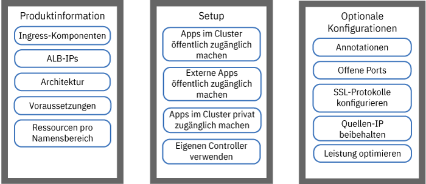
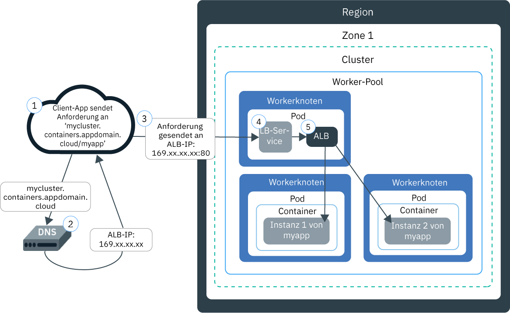
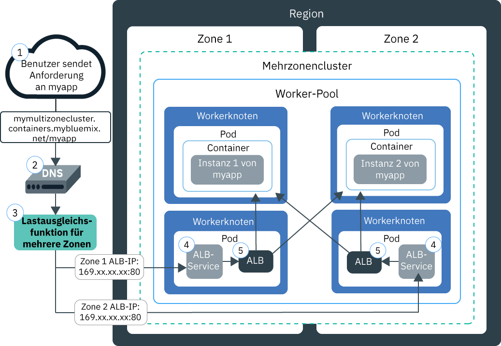

---

copyright:
  years: 2014, 2019
lastupdated: "2019-06-12"

keywords: kubernetes, iks, nginx, ingress controller

subcollection: containers

---

{:new_window: target="_blank"}
{:shortdesc: .shortdesc}
{:screen: .screen}
{:pre: .pre}
{:table: .aria-labeledby="caption"}
{:codeblock: .codeblock}
{:tip: .tip}
{:note: .note}
{:important: .important}
{:deprecated: .deprecated}
{:download: .download}
{:preview: .preview}


# HTTPS-Lastausgleich mit Ingress-Lastausgleichsfunktionen für Anwendungen (ALB)
{: #ingress}

Sie können mehrere Apps in Ihrem Kubernetes-Cluster zugänglich machen, indem Sie Ingress-Ressourcen erstellen, die durch eine von IBM bereitgestellte Lastausgleichsfunktion für Anwendungen (ALB) in {{site.data.keyword.containerlong}} verwaltet werden.
{:shortdesc}



<map name="image-map">
    <area target="" alt="Ingress-Komponenten" title="Ingress-Komponenten" href="#ingress_components" coords="28,42,172,69" shape="rect">
    <area target="" alt="ALB-IPs" title="ALB-IPs" href="#ips" coords="27,79,171,104" shape="rect">
    <area target="" alt="Architektur" title="Architektur" href="#architecture-single" coords="31,114,171,140" shape="rect">
    <area target="" alt="Voraussetzungen" title="Voraussetzungen" href="#config_prereqs" coords="28,151,171,176" shape="rect">
    <area target="" alt="Netzbetrieb für einen einzelnen oder mehrere Namensbereiche planen" title="Netzbetrieb für einen einzelnen oder mehrere Namensbereiche planen" href="#multiple_namespaces" coords="31,191,172,229" shape="rect">
    <area target="" alt="Apps in Ihrem Cluster öffentlich zugänglich machen" title="Apps in Ihrem Cluster öffentlich zugänglich machen" href="#ingress_expose_public" coords="275,43,418,78" shape="rect">
    <area target="" alt="Apps außerhalb des Clusters öffentlich zugänglich machen" title="Apps außerhalb des Clusters öffentlich zugänglich machen" href="#external_endpoint" coords="275,94,419,128" shape="rect">
    <area target="" alt="Apps in einem privaten Netz zugänglich machen" title="Apps in einem privaten Netz zugänglich machen" href="#ingress_expose_private" coords="277,141,418,177" shape="rect">
    <area target="" alt="Eigenen Ingress-Controller verwenden" title="Eigenen Ingress-Controller verwenden" href="#user_managed" coords="278,192,416,228" shape="rect">
    <area target="" alt="Ingress-Ressource mit Annotationen anpassen" title="Ingress-Ressource mit Annotationen anpassen" href="#annotations" coords="523,44,670,73" shape="rect">
    <area target="" alt="Ports für die Ingress-ALB öffnen" title="Ports für die Ingress-ALB öffnen" href="#opening_ingress_ports" coords="521,83,669,105" shape="rect">
    <area target="" alt="SSL-Protokolle und SSL-Verschlüsselungen auf HTTP-Ebene konfigurieren" title="SSL-Protokolle und SSL-Verschlüsselungen auf HTTP-Ebene konfigurieren" href="#ssl_protocols_ciphers" coords="523,116,669,158" shape="rect">
    <area target="" alt="Quellen-IP-Adresse beibehalten" title="Quellen-IP-Adresse beibehalten" href="#preserve_source_ip" coords="522,167,671,202" shape="rect">
    <area target="" alt="ALB-Leistung optimieren" title="ALB-Leistung optimieren" href="#perf_tuning" coords="524,213,669,237" shape="rect">
</map>

## YAML-Beispieldateien
{: #sample_ingress}

Verwenden Sie die folgenden Beispiele für YAML-Dateien, um schnell mit der Angabe Ihrer Ingress-Ressourcen beginnen zu können.
{: shortdesc}

**Ingress-Ressource für das öffentliche Zugänglichmachen einer App**</br>

Haben Sie die folgenden Schritte bereits ausgeführt?
- App bereitstellen
- App-Service erstellen
- Domänennamen und geheimen TLS-Schlüssel auswählen

Sie können den folgenden YAML-Bereitstellungscode zum Erstellen einer Ingress-Ressource verwenden:

```
apiVersion: extensions/v1beta1
kind: Ingress
metadata:
  name: myingressresource
spec:
  tls:
  - hosts:
    - <domäne>
    secretName: <name_des_geheimen_tls-schlüssels>
  rules:
  - host: <domain>
    http:
      paths:
      - path: /<app1-pfad>
        backend:
          serviceName: <app1-service>
          servicePort: 80
      - path: /<app2-pfad>
        backend:
          serviceName: <app2-service>
          servicePort: 80
```
{: codeblock}

</br>

**Ingress-Ressource für das private Zugänglichmachen einer App**</br>

Haben Sie die folgenden Schritte bereits ausgeführt?
- Private Lastausgleichsfunktion für Anwendungen (ALB) aktivieren
- App bereitstellen
- App-Service erstellen
- Angepassten Domänennamen und geheimen TLS-Schlüssel registrieren

Sie können den folgenden YAML-Bereitstellungscode zum Erstellen einer Ingress-Ressource verwenden:

```
apiVersion: extensions/v1beta1
kind: Ingress
metadata:
  name: myingressresource
  annotations:
    ingress.bluemix.net/ALB-ID: "<private_alb-id_1>;<private_alb-id_2>"
spec:
  tls:
  - hosts:
    - <domain>
    secretName: <name_des_geheimen_tls-schlüssels>
  rules:
  - host: <domäne>
    http:
      paths:
      - path: /<app1-pfad>
        backend:
          serviceName: <app1-service>
          servicePort: 80
      - path: /<app2-pfad>
        backend:
          serviceName: <app2-service>
          servicePort: 80
```
{: codeblock}

<br />


## Was ist Ingress?
{: #planning}

Ingress ist ein Kubernetes Service, der Netzverkehr-Workloads in Ihrem Cluster ausgleicht, indem er öffentliche oder private Anforderungen an Ihre Apps weiterleitet. Mit Ingress können Sie in einem öffentlichen oder privaten Netz mehrere App-Services zugänglich machen, indem Sie eine eindeutige öffentliche oder private Route verwenden.
{:shortdesc}

### Wie setzt sich Ingress zusammen?
{: #ingress_components}

Ingress besteht aus drei Komponenten:
<dl>
<dt>Ingress-Ressource</dt>
<dd>Um eine App über Ingress zugänglich zu machen, müssen Sie einen Kubernetes Service für Ihre App erstellen und diesen Service bei Ingress registrieren, indem Sie eine Ingress-Ressource definieren. Die Ingress-Ressource ist eine Kubernetes-Ressource, die die Regeln für die Weiterleitung eingehender Anforderungen für Apps definiert. Die Ingress-Ressource gibt auch den Pfad zu Ihren App-Services an, die an die öffentliche Route angehängt werden, um eine eindeutige App-URL zu bilden, z. B. `mycluster.us-south.containers.appdomain.cloud/myapp1`.<p class="note">Seit dem 24. Mai 2018 gibt es ein anderes Ingress-Unterdomänenformat für neue Cluster. Der in dem neuen Unterdomänenformat enthaltene Bereich oder Zonenname wird basierend auf der Zone generiert, in der der Cluster erstellt wurde. Wenn Pipeline-Abhängigkeiten für konsistente App-Domänennamen bestehen, können Sie anstelle der von IBM bereitgestellten Ingress-Unterdomäne Ihre eigene angepasste Domäne verwenden.<ul><li>Allen Clustern, die nach dem 24. Mai 2018 erstellt wurden, wird eine Unterdomäne im neuen Format <code>&lt;clustername&gt;.&lt;region_oder_zone&gt;.containers.appdomain.cloud</code> zugeordnet.</li><li>Einzelzonencluster, die vor dem 24. Mai 2018 erstellt wurden, verwenden weiterhin die zugeordnete Unterdomäne im alten Format <code>&lt;clustername&gt;.&lt;region&gt;.containers.mybluemix.net</code>.</li><li>Wenn Sie einen Einzelzonencluster, der vor dem 24. Mai 2018 erstellt wurde, in einen Mehrzonencluster ändern, indem Sie zum ersten Mal [eine Zone zum Cluster hinzufügen](/docs/containers?topic=containers-add_workers#add_zone), verwendet der Cluster weiterhin die zugeordnete Unterdomäne im alten Format
<code>&lt;clustername&gt;.&lt;region&gt;.containers.mybluemix.net</code>. Außerdem wird dem Cluster eine Unterdomäne im neuen Format <code>&lt;clustername&gt;.&lt;region_oder_zone&gt;.containers.appdomain.cloud</code> zugewiesen. Es können beide Unterdomänen verwendet werden.</li></ul></p>**Mehrzonencluster**: Die Ingress-Ressource ist global und es ist nur eine Ingress-Ressource pro Namensbereich für einen Mehrzonencluster erforderlich.</dd>
<dt>Lastausgleichsfunktion für Anwendungen (ALB)</dt>
<dd>Die Lastausgleichsfunktion für Anwendungen (ALB) ist eine externe Lastausgleichsfunktion, die für eingehende HTTP-, HTTPS- oder TCP-Serviceanforderungen empfangsbereit ist. Die ALB leitet Anforderungen gemäß den Regeln, die in der Ingress-Ressource definiert sind, an den entsprechenden App-Pod weiter. Wenn Sie einen Standardcluster erstellen, erstellt {{site.data.keyword.containerlong_notm}} automatisch eine hoch verfügbare ALB für Ihre Cluster und ordnet ihnen eine eindeutige öffentliche Route zu. Die öffentliche Route ist mit einer portierbaren öffentlichen IP-Adresse verknüpft, die bei der Erstellung des Clusters in Ihrem Konto der IBM Cloud-Infrastruktur (SoftLayer) eingerichtet wird. Es wird zwar auch eine private Standard-ALB erstellt, diese wird jedoch nicht automatisch aktiviert.<br></br>**Mehrzonencluster**: Wenn Sie eine Zone zu Ihrem Cluster hinzufügen, wird ein portierbares öffentliches Teilnetz hinzugefügt und eine neue öffentliche ALB automatisch erstellt und im Teilnetz in dieser Zone aktiviert. Alle öffentlichen Standard-ALBs in Ihrem Cluster nutzen eine öffentliche Route gemeinsam, haben jedoch unterschiedliche IP-Adressen. Es wird zwar auch eine private Standard-ALB in jeder Zone erstellt, diese wird jedoch nicht automatisch aktiviert.</dd>
<dt>Lastausgleichsfunktion für mehrere Zonen (MZLB)</dt>
<dd><p>**Mehrzonencluster**: Wenn Sie einen Mehrzonencluster erstellen oder [ eine Zone zu einem Einzelzonencluster hinzufügen](/docs/containers?topic=containers-add_workers#add_zone), wird automatisch eine Cloudflare-MZLB (Multizone Load Balancer) erstellt und bereitgestellt, sodass eine (1) MZLB für jede Region vorhanden ist. Die MZLB stellt die IP-Adressen Ihrer ALBs hinter dieselbe Unterdomäne und aktiviert die Zustandsprüfungen für diese IP-Adressen, um zu ermitteln, ob sie verfügbar sind oder nicht. Wenn Sie beispielsweise Workerknoten in drei (3) Zonen in der Region 'Vereinigte Staaten (Osten)' haben, hat die Unterdomäne `yourcluster.us-east.containers.appdomain.cloud` drei ALB-IP-Adressen. Der MZLB-Status überprüft die öffentliche ALB-IP in jeder Zone des Clusters und hält die Ergebnisse der DNS-Suche auf der Basis dieser Zustandsprüfungen aktualisiert. Wenn Ihre ALBs beispielsweise die IP-Adressen `1.1.1.1`, `2.2.2.2` und `3.3.3.3` haben, gibt eine normale Operation der DNS-Suche in Ihrer Ingress-Unterdomäne alle drei IPs zurück, von denen der Client auf eine zufällig zugreift. Wenn die ALB mit der IP-Adresse `3.3.3.3` aus irgendeinem Grund nicht verfügbar ist, z. B. wegen eines Zonenfehlers, schlägt die Zustandsprüfung für diese Zone fehl, die MZLB entfernt die fehlgeschlagene IP-Adresse aus der Unterdomäne und die DNS-Suche gibt nur die einwandfreien ALB-IPs `1.1.1.1` und `2.2.2.2` zurück. Die Unterdomäne hat eine Lebensdauer von 30 Sekunden (TTL, Time to live). Nach 30 Sekunden können neue Client-Apps nur auf eine der verfügbaren, einwandfreien ALB-IPs zugreifen.</p><p>In seltenen Fällen können manche DNS-Resolver oder Client-Apps nach dem Intervall von 30 Sekunden weiterhin die nicht einwandfreie ALB-IP verwenden. Diese Client-Apps können eine längere Ladezeit aufweisen, bis die Clientanwendung die IP-Adresse `3.3.3.3` verlässt und versucht, eine Verbindung zu `1.1.1.1` oder `2.2.2.2` herzustellen. Je nach Client-Browser- oder Client-App-Einstellungen kann die Verzögerung von einigen Sekunden bis zu einem vollständigen TCP-Zeitlimitintervall reichen.</p>
<p>Die MZLB führt einen Lastausgleich für öffentliche ALBs durch, die die von IBM bereitgestellte Ingress-Unterdomäne verwenden. Wenn Sie nur private ALBs verwenden, müssen Sie den Status der ALBs manuell überprüfen und die Ergebnisse der DNS-Suche aktualisieren. Wenn Sie öffentliche ALBs verwenden, die eine angepasste Domäne verwenden, können Sie die ALBs in den Lastausgleich für MZLB aufnehmen, indem Sie einen CNAME in Ihrem DNS-Eintrag erstellen, um Anforderungen von Ihrer angepassten Domäne an die von IBM bereitgestellte Ingress-Unterdomäne für Ihren Cluster weiterzuleiten.</p>
<p class="note">Wenn Sie die preDNAT-Netzrichtlinien von Calico verwenden, um den gesamten eingehenden Datenverkehr zu Ingress-Services zu blockieren, müssen Sie auch die <a href="https://www.cloudflare.com/ips/">Cloudflare-IPv4-IPs </a>, die zur Überprüfung des Status Ihrer ALBs verwendet werden, in die Whitelist stellen. Informationen zum Erstellen einer Calico-preDNAT-Richtlinie für die Whitelist für diese IPs finden Sie in der Lerneinheit 3 des <a href="/docs/containers?topic=containers-policy_tutorial#lesson3">Lernprogramms zur Calico-Netzrichtlinie</a>.</p></dd>
</dl>

### Wie werden Ingress-ALBs IP-Adressen zugeordnet?
{: #ips}

Wenn Sie einen Standardcluster erstellen, stellt {{site.data.keyword.containerlong_notm}} automatisch ein portierbares öffentliches Teilnetz und ein portierbares privates Teilnetz bereit. Standardmäßig verwendet der Cluster folgende Adressen:
* 1 portierbare öffentliche IP-Adresse aus dem portierbaren öffentlichen Teilnetz für die öffentliche Standard-Ingress-ALB.
* 1 portierbare private IP-Adresse aus dem portierbaren privaten Teilnetz für die private Standard-Ingress-ALB.
{: shortdesc}

Wenn Sie einen Mehrzonencluster haben, werden in jeder Zone automatisch eine öffentliche Standard-ALB und eine private Standard-ALB erstellt. Die IP-Adressen Ihrer öffentlichen Standard-ALBs befinden sich alle hinter derselben von IBM bereitgestellten Unterdomäne für Ihren Cluster.

Portierbare öffentliche und private IP-Adressen sind statische variable IPs und ändern sich nicht, wenn ein Workerknoten entfernt wird. Wenn der Workerknoten entfernt wird, sorgt ein Dämon `Keepalived`, der die IP-Adressen fortlaufend überwacht, dafür, dass die ALB-Pods, die sich auf diesem Workerknoten befanden, automatisch auf einem anderen Workerknoten in dieser Zone neu geplant werden. Die neu geplanten ALB-Pods behalten dieselbe statische IP-Adresse bei. Die ALB-IP-Adresse in jeder Zone ändert sich im Verlauf des Lebenszyklus des Clusters nicht. Wenn Sie eine Zone aus einem Cluster entfernen, wird die ALB-IP-Adresse für diese Zone entfernt.

Zum Anzeigen der IP-Adressen, die Ihren ALBs zugeordnet sind, können Sie den folgenden Befehl ausführen.
```
ibmcloud ks albs --cluster <clustername_oder_-id>
```
{: pre}

Weitere Informationen dazu, was mit ALB-IP-Adressen bei einem Zonenfehler geschieht, finden Sie in der Definition für die [Komponente der Lastausgleichsfunktion für mehrere Zonen](#ingress_components).


### Wie kann eine Anforderung mithilfe von Ingress in einem Einzelzonencluster in meine App gelangen?
{: #architecture-single}


Das folgende Diagramm zeigt, wie Ingress die Kommunikation zwischen dem Internet und einer App in einem Einzelzonencluster steuert:



1. Ein Benutzer sendet eine Anforderung an Ihre App, indem er auf die URL Ihrer App zugreift. Diese URL ist die öffentliche URL für Ihre zugänglich gemachte App, der der Pfad der Ingress-Ressource wie zum Beispiel `mycluster.us-south.containers.appdomain.cloud/myapp` angehängt wird.

2. Ein DNS-Systemservice löst die Unterdomäne in der URL in die portierbare öffentliche IP-Adresse der Lastausgleichsfunktion auf, die die ALB in Ihrem Cluster zugänglich macht.

3. Basierend auf der aufgelösten IP-Adresse sendet der Client die Anforderung an den LoadBalancer-Service, der die ALB bereitstellt.

4. Der LoadBalancer-Service leitet die Anforderung an die ALB weiter.

5. Die ALB überprüft, ob eine Weiterleitungsregel für den Pfad `myapp` im Cluster vorhanden ist. Wird eine übereinstimmende Regel gefunden, wird die Anforderung entsprechend der Regeln, die Sie in der Ingress-Ressource definiert haben, an den Pod weitergeleitet, in dem die App bereitgestellt wurde. Die Quellen-IP-Adresse des Pakets wird in die IP-Adresse der öffentlichen IP-Adresse des Workerknotens geändert, auf dem der App-Pod ausgeführt wird. Wenn mehrere App-Instanzen im Cluster bereitgestellt werden, gleicht die ALB die Anforderungen zwischen den App-Pods aus.

### Wie kann eine Anforderung mithilfe von Ingress in einem Mehrzonencluster in meine App gelangen?
{: #architecture-multi}

Das folgende Diagramm zeigt, wie Ingress die Kommunikation zwischen dem Internet und einer App in einem Mehrzonencluster steuert:



1. Ein Benutzer sendet eine Anforderung an Ihre App, indem er auf die URL Ihrer App zugreift. Diese URL ist die öffentliche URL für Ihre zugänglich gemachte App, der der Pfad der Ingress-Ressource wie zum Beispiel `mycluster.us-south.containers.appdomain.cloud/myapp` angehängt wird.

2. Ein DNS-Systemservice, der als globale Lastausgleichsfunktion fungiert, löst die Unterdomäne in der URL in eine verfügbare IP-Adresse auf, die von der MZLB als in einwandfreiem Zustand gemeldet wurde. Die MZLB überprüft fortlaufend die portierbaren öffentlichen IP-Adressen der LoadBalancer-Services, die öffentliche ALBs in jeder Zone in Ihrem Cluster zugänglich machen. Die IP-Adressen werden in einem Umlaufzyklus aufgelöst, wodurch sichergestellt wird, dass Anforderungen gleichmäßig auf die ordnungsgemäß funktionierenden ALBs in verschiedenen Zonen abgestimmt sind.

3. Der Client sendet die Anforderung an die IP-Adresse des LoadBalancer-Service, der eine ALB bereitstellt.

4. Der LoadBalancer-Service leitet die Anforderung an die ALB weiter.

5. Die ALB überprüft, ob eine Weiterleitungsregel für den Pfad `myapp` im Cluster vorhanden ist. Wird eine übereinstimmende Regel gefunden, wird die Anforderung entsprechend der Regeln, die Sie in der Ingress-Ressource definiert haben, an den Pod weitergeleitet, in dem die App bereitgestellt wurde. Die Quellen-IP-Adresse des Pakets wird in die öffentliche IP-Adresse des Workerknotens geändert, auf dem der App-Pod ausgeführt wird. Wenn mehrere App-Instanzen im Cluster implementiert sind, gleicht die ALB die Anforderungen zwischen App-Pods in allen Zonen aus.

<br />


## Voraussetzungen
{: #config_prereqs}

Bevor Sie mit der Verwendung mit Ingress beginnen, überprüfen Sie die folgenden Voraussetzungen.
{:shortdesc}

**Voraussetzungen für alle Ingress-Konfigurationen:**
- Ingress ist nur für Standardcluster verfügbar und erfordert mindestens zwei Workerknoten pro Zone, um eine hohe Verfügbarkeit und regelmäßige Aktualisierungen zu gewährleisten. Wenn Sie nur einen Workerknoten in einer Zone haben, kann die ALB keine automatische Aktualisierungen empfangen. Wenn automatische Aktualisierungen an ALB-Pods übertragen werden, wird der Pod erneut geladen. Allerdings haben ALB-Pods Anti-Affinitätsregeln, um sicherzustellen, dass für die Hochverfügbarkeit nur ein Pod auf jedem Workerknoten geplant wird. Da nur ein ALB-Pod auf einem Workerknoten vorhanden ist, wird der Pod nicht neu gestartet, sodass der Datenverkehr nicht unterbrochen wird. Der ALB-Pod wird nur dann auf die neueste Version aktualisiert, wenn Sie den alten Pod manuell löschen, sodass der neue, aktualisierte Pod geplant werden kann.
- Für die Einrichtung von Ingress sind die folgenden [{{site.data.keyword.Bluemix_notm}} IAM-Rollen](/docs/containers?topic=containers-users#platform) erforderlich:
    - Plattformrolle **Administrator** für den Cluster
    - Servicerolle **Manager** in allen Namensbereichen

**Voraussetzungen für die Verwendung von Ingress in Mehrzonenclustern**:
 - Wenn Sie den Datenaustausch im Netz auf [Edge-Workerknoten](/docs/containers?topic=containers-edge) beschränken möchten, müssen in jeder Zone mindestens zwei Edge-Workerknoten für die Hochverfügbarkeit von Ingress-Pods aktiviert werden. [Erstellen Sie einen Worker-Pool für Edge-Workerknoten](/docs/containers?topic=containers-add_workers#add_pool), der sich über alle Zonen im Cluster erstreckt und mindestens zwei Workerknoten pro Zone aufweist.
 - Wenn Sie über mehrere VLANs für einen Cluster, mehrere Teilnetze in demselben VLAN oder einen Cluster mit mehreren Zonen verfügen, müssen Sie eine [VRF-Funktion (Virtual Router Function)](/docs/infrastructure/direct-link?topic=direct-link-overview-of-virtual-routing-and-forwarding-vrf-on-ibm-cloud#overview-of-virtual-routing-and-forwarding-vrf-on-ibm-cloud) für Ihr Konto für die IBM Cloud-Infrastruktur (SoftLayer) aktivieren, damit die Workerknoten über das private Netz miteinander kommunizieren können. Zur Aktivierung von VRF [wenden Sie sich an Ihren Ansprechpartner für die IBM Cloud-Infrastruktur (SoftLayer)](/docs/infrastructure/direct-link?topic=direct-link-overview-of-virtual-routing-and-forwarding-vrf-on-ibm-cloud#how-you-can-initiate-the-conversion). Wenn Sie VRF nicht aktivieren können oder wollen, aktivieren Sie das [VLAN-Spanning](/docs/infrastructure/vlans?topic=vlans-vlan-spanning#vlan-spanning). Um diese Aktion durchführen zu können, müssen Sie über die [Infrastrukturberechtigung](/docs/containers?topic=containers-users#infra_access) **Netz > VLAN-Spanning im Netz verwalten** verfügen oder Sie können den Kontoeigner bitten, diese zu aktivieren. Zum Prüfen, ob das VLAN-Spanning bereits aktiviert ist, verwenden Sie den [Befehl](/docs/containers?topic=containers-cli-plugin-kubernetes-service-cli#cs_vlan_spanning_get) `ibmcloud ks vlan-spanning-get --region <region>`.
 - Wenn in einer Zone ein Fehler auftritt, kann es zu sporadisch auftretenden Fehlern bei Anforderungen an die Ingress-ALB in dieser Zone kommen.

<br />


## Netzbetrieb für einen einzelnen oder mehrere Namensbereiche planen
{: #multiple_namespaces}

Es ist eine Ingress-Ressource pro Namensbereich erforderlich, in dem sich die zugänglich zu machenden Apps befinden.
{:shortdesc}

### Alle Apps befinden sich in einem Namensbereich
{: #one-ns}

Wenn sich die Apps in Ihrem Cluster alle im selben Namensbereich befinden, ist eine Ingress-Ressource erforderlich, um die Weiterleitungsregeln für die dort zugänglich gemachten Apps zu definieren. Wenn beispielsweise `App1` und `App2` von Services in einem Namensbereich für die Entwicklung zugänglich gemacht werden, können Sie eine Ingress-Ressource in dem Namensbereich erstellen. Die Ressource gibt `domain.net` als Host an und registriert die Pfade, an denen die einzelnen Apps empfangsbereit sind, mit `domain.net`.
{: shortdesc}


### Apps in mehreren Namensbereichen
{: #multi-ns}

Wenn sich die Apps in Ihrem Cluster in unterschiedlichen Namensbereichen befinden, müssen Sie eine Ressource pro Namensbereich erstellen, um Regeln für die dort zugänglich gemachten Apps zu definieren.
{: shortdesc}

Allerdings können Sie nur in einer Ressource einen Hostnamen definieren. Sie können denselben Hostnamen nicht in mehreren Ressourcen definieren. Zum Registrieren mehrerer Ingress-Ressourcen mit demselben Hostnamen müssen Sie eine Platzhalterdomäne verwenden. Wenn eine Platzhalterdomäne wie `*.domain.net` registriert wird, können mehrere Unterdomänen in denselben Host aufgelöst werden. Sie können dann in jedem Namensbereich eine Ingress-Ressource erstellen und in jeder Ingress-Ressource eine andere Unterdomäne angeben.

Nehmen Sie beispielsweise folgendes Szenario an:
* Sie verfügen über zwei Versionen derselben App (`App1` und `App3`) zu Testzwecken.
* Sie stellen die Apps in zwei unterschiedlichen Namensbereichen im selben Cluster bereit: `App1` im Namensbereich für die Entwicklung und `App3` im Namensbereich für das Staging.

Um dieselbe Cluster-ALB zum Verwalten von Datenverkehr für diese Apps zu verwenden, erstellen Sie die folgenden Services und Ressourcen:
* Einen Kubernetes Service im Namensbereich für die Entwicklung zum Bereitstellen von `App1`.
* Eine Ingress-Ressource im Namensbereich für die Entwicklung, die den Host als `dev.domain.net` angibt.
* Einen Kubernetes Service im Namensbereich für das Staging zum Bereitstellen von `App3`.
* Eine Ingress-Ressource im Namensbereich für das Staging, die den Host als `stage.domain.net` angibt.
</br>


Jetzt werden beide URLs für dieselbe Domäne aufgelöst und daher beide von derselben Lastausgleichsfunktion für Anwendungen (ALB) bedient. Da jedoch die Ressource im Namensbereich für das Staging mit der Unterdomäne `stage` registriert ist, leitet die Ingress-Lastausgleichsfunktion für Anwendungen (ALB) Anforderungen ordnungsgemäß von der URL `stage.domain.net/app3` nur an `app3` weiter.

{: #wildcard_tls}
Der von IBM bereitgestellte Platzhalter für die Ingress-Unterdomäne (`*.<cluster_name>.<region>.containers.appdomain.cloud`) wird standardmäßig für Ihren Cluster registriert. Das von IBM bereitgestellte TLS-Zertifikat ist ein Platzhalterzertifikat und kann für die Platzhalterunterdomäne verwendet werden. Wenn Sie eine angepasste Domäne verwenden möchten, müssen Sie diese als eine Platzhalterdomäne, wie `*.custom_domain.net`, registrieren. Um TLS verwenden zu können, müssen Sie ein Platzhalterzertifikat abrufen.
{: note}

### Mehrere Domänen in einem Namensbereich
{: #multi-domains}

In einem einzelnen Namensbereich können Sie über eine Domäne auf alle Apps in dem Namensbereich zugreifen. Wenn Sie für die Apps in einem einzelnen Namensbereich unterschiedliche Domänen verwenden möchten, verwenden Sie eine Platzhalterdomäne. Wenn eine solche Platzhalterdomäne, wie `*.mycluster.us-south.containers.appdomain.cloud`, registriert wird, werden mehrere Unterdomänen für denselben Host aufgelöst. Sie können dann eine Ressource verwenden, um mehrere Unterdomänenhosts in dieser Ressource anzugeben. Alternativ können Sie in dem Namensbereich mehrere Ingress-Ressourcen erstellen und in jeder Ingress-Ressource eine andere Unterdomäne angeben.
{: shortdesc}


Der von IBM bereitgestellte Platzhalter für die Ingress-Unterdomäne (`*.<cluster_name>.<region>.containers.appdomain.cloud`) wird standardmäßig für Ihren Cluster registriert. Das von IBM bereitgestellte TLS-Zertifikat ist ein Platzhalterzertifikat und kann für die Platzhalterunterdomäne verwendet werden. Wenn Sie eine angepasste Domäne verwenden möchten, müssen Sie diese als eine Platzhalterdomäne, wie `*.custom_domain.net`, registrieren. Um TLS verwenden zu können, müssen Sie ein Platzhalterzertifikat abrufen.
{: note}

<br />


## Apps in Ihrem Cluster öffentlich zugänglich machen
{: #ingress_expose_public}

Machen Sie Apps in Ihrem Cluster über die öffentliche Ingress-Lastausgleichsfunktion für Anwendungen (Ingress-ALB) für die Allgemeinheit zugänglich.
{:shortdesc}

Vorbereitende Schritte:

* Überprüfen Sie die [Voraussetzungen](#config_prereqs) für Ingress.
* [Melden Sie sich an Ihrem Konto an. Geben Sie, sofern anwendbar, die richtige Ressourcengruppe als Ziel an. Legen Sie den Kontext für den Cluster fest.](/docs/containers?topic=containers-cs_cli_install#cs_cli_configure)

### Schritt 1: Apps bereitstellen und App-Services erstellen
{: #public_inside_1}

Stellen Sie als Erstes Ihre Apps bereit und erstellen Sie Kubernetes Services und machen Sie diese zugänglich.
{: shortdesc}

1.  [Stellen Sie die App für den Cluster bereit](/docs/containers?topic=containers-app#app_cli). Stellen Sie sicher, dass Sie eine Bezeichnung zu Ihrer Bereitstellung im Metadatenabschnitt Ihrer Konfigurationsdatei hinzufügen, z. B. `app: code`. Diese Bezeichnung ist zur Identifizierung aller Pods erforderlich, in denen Ihre App ausgeführt wird, damit sie in den Ingress-Lastenausgleich aufgenommen werden können.

2.   Erstellen Sie einen Kubernetes Service für jede App, den Sie öffentlich zugänglich machen möchten. Ihre App muss von einem Kubernetes Service verfügbar gemacht werden, um von der Cluster-ALB beim Ingress-Lastausgleich berücksichtigt zu werden.
      1.  Öffnen Sie Ihren bevorzugten Editor und erstellen Sie eine Servicekonfigurationsdatei, beispielsweise `myappservice.yaml`.
      2.  Definieren Sie einen Service für die App, der von der ALB zugänglich gemacht wird.

          ```
          apiVersion: v1
          kind: Service
          metadata:
            name: myappservice
          spec:
            selector:
              <selektorschlüssel>: <selektorwert>
            ports:
             - protocol: TCP
               port: 8080
          ```
          {: codeblock}

          <table>
          <thead>
          <th colspan=2> Erklärung der ALB-Servicedateikomponenten</th>
          </thead>
          <tbody>
          <tr>
          <td><code>selector</code></td>
          <td>Geben Sie das Paar aus Bezeichnungsschlüssel (<em>&lt;selektorschlüssel&gt;</em>) und Wert (<em>&lt;selektorwert&gt;</em>) ein, das Sie für die Ausrichtung auf die Pods, in denen Ihre App ausgeführt wird, verwenden möchten. Um Ihre Pods als Ziel auszuwählen und in den Servicelastausgleich einzubeziehen, müssen Sie sicherstellen, dass der <em>&lt;selektorschlüssel&gt;</em> und der <em>&lt;selektorwert&gt;</em> mit dem Schlüssel/Wert-Paar im Abschnitt <code>spec.template.metadata.labels</code> Ihrer YAML-Bereitstellungsdatei übereinstimmen.</td>
           </tr>
           <tr>
           <td><code>port</code></td>
           <td>Der Port, den der Service überwacht.</td>
           </tr>
           </tbody></table>
      3.  Speichern Sie Ihre Änderungen.
      4.  Erstellen Sie den Service in Ihrem Cluster. Wenn Apps in mehreren Namensbereichen in Ihrem Cluster bereitgestellt werden, stellen Sie sicher, dass der Service im selben Namensbereich bereitgestellt wird wie die App, die Sie zugänglich machen möchten.

          ```
          kubectl apply -f myappservice.yaml [-n <namensbereich>]
          ```
          {: pre}
      5.  Wiederholen Sie diese Schritte für jede App, die Sie zugänglich machen wollen.


### Schritt 2: App-Domäne auswählen
{: #public_inside_2}

Beim Konfigurieren der öffentlichen Lastausgleichsfunktion für Anwendungen wählen Sie die Domäne aus, über die Ihre Apps zugänglich sind.
{: shortdesc}

Sie können die von IBM bereitgestellte Domäne, wie `mycluster-12345.us-south.containers.appdomain.cloud/myapp`, für den Zugriff auf die App über das Internet verwenden. Wenn Sie stattdessen eine angepasste Domäne verwenden möchten, können Sie einen CNAME-Datensatz definieren, um Ihre angepasste Domäne der von IBM bereitgestellten Domäne zuzuordnen oder einen A-Datensatz mit Ihrem DNS-Provider unter Verwendung der öffentlichen IP-Adresse der ALB zu konfigurieren.

**Gehen Sie wie folgt vor, um die von IBM bereitgestellte Ingress-Domäne zu verwenden:**

Rufen Sie die von IBM bereitgestellte Domäne ab. Ersetzen Sie `<clustername_oder_-id>` durch den Namen des Clusters, in dem die App bereitgestellt wurde.
```
ibmcloud ks cluster-get --cluster <clustername_oder_-id> | grep Ingress
```
{: pre}

Beispielausgabe:
```
Ingress Subdomain:      mycluster-12345.us-south.containers.appdomain.cloud
Ingress Secret:         <geheimer_tls-schlüssel>
```
{: screen}

**Gehen Sie wie folgt vor, um eine angepasste Domäne zu verwenden:**
1.    Erstellen Sie eine angepasste Domäne. Arbeiten Sie mit Ihrem DNS-Provider (Domain Name Service) oder [{{site.data.keyword.Bluemix_notm}}-DNS](/docs/infrastructure/dns?topic=dns-getting-started), um Ihre angepasste Domäne zu registrieren.
      * Wenn sich die Apps, die über Ingress zugänglich gemacht werden sollen, in einem Cluster in unterschiedlichen Namensbereichen befinden, registrieren Sie die angepasste Domäne als Platzhalterdomäne, wie `*.custom_domain.net`.

2.  Konfigurieren Sie Ihre Domäne, um eingehenden Netzverkehr an die von IBM bereitgestellte Lastausgleichsfunktion für Anwendungen (ALB) weiterzuleiten. Wählen Sie zwischen diesen Optionen:
    -   Definieren Sie einen Alias für Ihre angepasste Domäne, indem Sie die von IBM bereitgestellte Domäne als kanonischen Namensdatensatz (CNAME) angeben. Zum Ermitteln der von IBM bereitgestellten Ingress-Domäne führen Sie den Befehl `ibmcloud ks cluster-get --cluster <clustername>` aus. Suchen Sie nach dem Feld für die Ingress-Unterdomäne (**Ingress subdomain**). Die Verwendung eines CNAME wird bevorzugt, weil IBM automatische Zustandsprüfungen für die IBM Unterdomäne ermöglicht und alle fehlgeschlagenen IPs aus der DNS-Antwort entfernt.
    -   Ordnen Sie Ihre angepasste Domäne der portierbaren öffentlichen IP-Adresse der von IBM bereitgestellten Lastausgleichsfunktion für Anwendungen (ALB) zu, indem Sie die IP-Adresse als Datensatz hinzufügen. Zur Ermittlung der portierbaren öffentlichen IP-Adresse der ALB führen Sie den Befehl `ibmcloud ks alb-get --albID <öffentliche_alb-id>` aus.

### Schritt 3: TLS-Terminierung auswählen
{: #public_inside_3}

Legen Sie nach der Auswahl der App-Domäne fest, ob die TLS-Terminierung verwendet werden soll.
{: shortdesc}

Die Lastausgleichsfunktion für Anwendungen verteilt die Lasten des HTTP-Netzverkehrs auf die Apps in Ihrem Cluster. Um auch einen Lastausgleich für eingehende HTTPS-Verbindungen durchführen zu können, können Sie die Lastausgleichsfunktion so konfigurieren, dass der Netzverkehr entschlüsselt und die entschlüsselte Anforderung an die Apps weitergeleitet wird, die in Ihrem Cluster zugänglich sind.

* Wenn Sie die von IBM bereitgestellte Ingress-Unterdomäne verwenden, können Sie das von IBM bereitgestellte TLS-Zertifikat verwenden. Von IBM bereitgestellte TLS-Zertifikate sind von LetsEncrypt signiert und werden vollständig von IBM verwaltet. Die Zertifikate laufen alle 90 Tage ab und werden automatisch 37 Tage vor Ablauf der Gültigkeit verlängert. Weitere Informationen zur TLS-Zertifizierung mit Platzhalterzeichen finden Sie in [diesem Hinweis](#wildcard_tls).
* Wenn Sie eine angepasste Domäne verwenden, können Sie Ihr eigenes TLS-Zertifikat zum Verwalten der TLS-Terminierung nutzen. Die ALB prüft zunächst auf einen geheimen Schlüssel in dem Namensbereich, in dem sich die App befindet, dann im Namensbereich `default` und schließlich im Namensbereich `ibm-cert-store`. Wenn nur Apps in einem einzigen Namensbereich vorhanden sind, können Sie einen TLS-Schlüssel für das Zertifikat in diesem Namensbereich importieren oder erstellen. Wenn Sie über Apps in mehreren Namensbereichen verfügen, importieren oder erstellen Sie im Namensbereich `default` einen geheimen TLS-Schlüssel für das Zertifikat, damit die ALB auf das Zertifikat in jedem Namensbereich zugreifen und es verwenden kann. Geben Sie in den Ingress-Ressourcen, die Sie für jeden Namensbereich definieren, den Namen des geheimen Schlüssels an, der sich im Standardnamensbereich befindet. Weitere Informationen zur TLS-Zertifizierung mit Platzhalterzeichen finden Sie in [diesem Hinweis](#wildcard_tls). **Hinweis**: TLS-Zertifikate, die vorab verteilte Schlüssel enthalten (TLS-PSK) werden nicht unterstützt.

**Wenn Sie die von IBM bereitgestellte Ingress-Domäne verwenden:**

Rufen Sie den von IBM bereitgestellten geheimen TLS-Schlüssel für den Cluster ab.
```
ibmcloud ks cluster-get --cluster <clustername_oder_-id> | grep Ingress
```
{: pre}

Beispielausgabe:
```
Ingress Subdomain:      mycluster-12345.us-south.containers.appdomain.cloud
Ingress Secret:         <geheimer_tls-schlüssel>
```
{: screen}
</br>

**Wenn Sie eine angepasste Domäne verwenden:**

Wenn in {{site.data.keyword.cloudcerts_long_notm}} bereits ein TLS-Zertifikat gespeichert ist, das Sie verwenden wollen, können Sie den zugehörigen geheimen Schlüssel in Ihren Cluster importieren, indem Sie den folgenden Befehl ausführen:

```
ibmcloud ks alb-cert-deploy --secret-name <name_des_geheimen_schlüssels> --cluster <clustername_oder_-id> --cert-crn <crn_des_zertifikats>
```
{: pre}

Stellen Sie sicher, dass Sie den geheimen Schlüssel mit einem Namen erstellen, der sich vom Namen des von IBM bereitgestellten geheimen Ingress-Schlüssels unterscheidet. Sie können den Namen des von IBM bereitgestellten geheimen Ingress-Schlüssels mit dem Befehl `ibmcloud ks cluster-get --cluster <clustername_oder_-id> | grep Ingress` abrufen.
{: note}

Wenn Sie ein Zertifikat mit diesem Befehl importieren, wird der geheime Schlüssel für das Zertifikat in einem Namensbereich mit dem Namen `ibm-cert-store` erstellt. Anschließend wird ein Verweis auf diesen geheimen Schlüssel im Namensbereich `default` erstellt, auf den jede Ingress-Ressource in einem beliebigen Namensbereich zugreifen kann. Wenn die ALB Anforderungen verarbeitet, folgt sie diesem Verweis, um den geheimen Schlüssel für das Zertifikat aus dem Namensbereich `ibm-cert-store` abzurufen und zu verwenden.

</br>

Wenn kein TLS-Zertifikat bereitsteht, führen Sie die folgenden Schritte aus:
1. Generieren Sie ein Zertifikat und einen Schlüssel der Zertifizierungsstelle über Ihren Zertifikatsanbieter. Wenn Sie über eine eigene Domäne verfügen, kaufen Sie ein offizielles TLS-Zertifikat für Ihre Domäne. Stellen Sie sicher, dass der [allgemeine Name (CN, Common Name) ](https://support.dnsimple.com/articles/what-is-common-name/) für jedes Zertifikat anders ist.
2. Konvertieren Sie das Zertifikat und den Schlüssel in Base-64.
   1. Verschlüsseln Sie das Zertifikat und den Schlüssel in Base-64 und speichern Sie den mit Base-64 verschlüsselten Wert in einer neuen Datei.
      ```
      openssl base64 -in tls.key -out tls.key.base64
      ```
      {: pre}

   2. Zeigen Sie den mit Base-64 verschlüsselten Wert für das Zertifikat und den Schlüssel an.
      ```
      cat tls.key.base64
      ```
      {: pre}

3. Erstellen Sie anhand des Zertifikats und des Schlüssels eine YAML-Datei für geheime Schlüssel.
     ```
     apiVersion: v1
     kind: Secret
     metadata:
       name: ssl-my-test
     type: Opaque
     data:
       tls.crt: <clientzertifikat>
       tls.key: <clientschlüssel>
     ```
     {: codeblock}

4. Erstellen Sie das Zertifikat als einen geheimen Kubernetes-Schlüssel.
     ```
     kubectl create -f ssl-my-test
     ```
     {: pre}
     Stellen Sie sicher, dass Sie den geheimen Schlüssel mit einem Namen erstellen, der sich vom Namen des von IBM bereitgestellten geheimen Ingress-Schlüssels unterscheidet. Sie können den Namen des von IBM bereitgestellten geheimen Ingress-Schlüssels mit dem Befehl `ibmcloud ks cluster-get --cluster <clustername_oder_-id> | grep Ingress` abrufen.
     {: note}


### Schritt 4: Ingress-Ressource erstellen
{: #public_inside_4}

Ingress-Ressourcen definieren die Routing-Regeln, mit der die Lastausgleichsfunktion für Anwendungen Datenverkehr an Ihren App-Service weiterleitet.
{: shortdesc}

Wenn der Cluster mehrere Namensbereiche aufweist, in denen Apps zugänglich gemacht werden, ist pro Namensbereich eine Ingress-Ressource erforderlich. Jeder Namensbereich muss jedoch einen anderen Host verwenden. Sie müssen eine Platzhalterdomäne registrieren und in jeder Ressource eine andere Unterdomäne angeben. Weitere Informationen finden Sie in [Netzbetrieb für einen einzelnen oder mehrere Namensbereiche planen](#multiple_namespaces).
{: note}

1. Öffnen Sie Ihren bevorzugten Editor und erstellen Sie eine Ingress-Konfigurationsdatei namens `myingressresource.yaml` (Beispiel).

2. Definieren Sie eine Ingress-Ressource in Ihrer Konfigurationsdatei, die die von IBM bereitgestellte Domäne oder Ihre angepasste Domäne für das Weiterleiten von eingehendem Netzverkehr an die zuvor erstellten Services verwendet.

    YALM-Beispieldatei ohne TLS:
    ```
    apiVersion: extensions/v1beta1
    kind: Ingress
    metadata:
      name: myingressresource
    spec:
      rules:
      - host: <domäne>
        http:
          paths:
          - path: /<app1-pfad>
            backend:
              serviceName: <app1-service>
              servicePort: 80
          - path: /<app2-pfad>
            backend:
              serviceName: <app2-service>
              servicePort: 80
    ```
    {: codeblock}

    YALM-Beispieldatei mit TLS:
    ```
    apiVersion: extensions/v1beta1
    kind: Ingress
    metadata:
      name: myingressresource
    spec:
      tls:
      - hosts:
        - <domäne>
        secretName: <name_des_geheimen_tls-schlüssels>
      rules:
      - host: <domäne>
        http:
          paths:
          - path: /<app1-pfad>
            backend:
              serviceName: <app1-service>
              servicePort: 80
          - path: /<app2-pfad>
            backend:
              serviceName: <app2-service>
              servicePort: 80
    ```
    {: codeblock}

    <table>
    <thead>
    <th colspan=2> Erklärung der YAML-Dateikomponenten</th>
    </thead>
    <tbody>
    <tr>
    <td><code>tls.hosts</code></td>
    <td>Um TLS zu verwenden, ersetzen Sie <em>&lt;domäne&gt;</em> durch die von IBM bereitgestellte Ingress-Unterdomäne oder Ihre angepasste Domäne.

    </br></br>
    <strong>Hinweis:</strong><ul><li>Wenn die Apps von Services in einem Cluster in unterschiedlichen Namensbereichen zugänglich gemacht werden, hängen Sie eine Platzhalter-Unterdomäne, wie `subdomain1.custom_domain.net` oder `subdomain1.mycluster.us-south.containers.appdomain.cloud`, an die Domäne an. Verwenden Sie für jede Ressource, die Sie im Cluster erstellen, eine eindeutige Unterdomäne.</li><li>Verwenden Sie keine Sternchen (&ast;) für Ihren Host oder lassen Sie die Hosteigenschaft leer, um Fehler während der Ingress-Erstellung zu vermeiden.</li></ul></td>
    </tr>
    <tr>
    <td><code>tls.secretName</code></td>
    <td><ul><li>Wenn Sie die von IBM bereitgestellte Ingress-Domäne verwenden, ersetzen Sie <em>&lt;name_des_geheimen_tls-schlüssels&gt;</em> durch den Namen des von IBM bereitgestellten geheimen Ingress-Schlüssels.</li><li>Wenn Sie eine angepasste Domäne verwenden, ersetzen Sie <em>&lt;name_des_geheimen_tls-schlüssels&gt;</em> durch den geheimen Schlüssel, den Sie zuvor erstellt haben und der Ihr angepasstes TLS-Zertifikat sowie den Schlüssel enthält. Wenn Sie ein Zertifikat aus {{site.data.keyword.cloudcerts_short}} importiert haben, können Sie den Befehl <code>ibmcloud ks alb-cert-get --cluster <clustername_oder_-id> --cert-crn <crn_des_zertifikats></code> ausführen, um die geheimen Schlüssel anzuzeigen, die einem TLS-Zertifikat zugeordnet sind.</li><ul><td>
    </tr>
    <tr>
    <td><code>host</code></td>
    <td>Ersetzen Sie <em>&lt;domäne&gt;</em> durch die von IBM bereitgestellte Ingress-Unterdomäne oder Ihre angepasste Domäne.

    </br></br>
    <strong>Hinweis:</strong><ul><li>Wenn die Apps von Services in einem Cluster in unterschiedlichen Namensbereichen zugänglich gemacht werden, hängen Sie eine Platzhalter-Unterdomäne, wie `subdomain1.custom_domain.net` oder `subdomain1.mycluster.us-south.containers.appdomain.cloud`, an die Domäne an. Verwenden Sie für jede Ressource, die Sie im Cluster erstellen, eine eindeutige Unterdomäne.</li><li>Verwenden Sie keine Sternchen (&ast;) für Ihren Host oder lassen Sie die Hosteigenschaft leer, um Fehler während der Ingress-Erstellung zu vermeiden.</li></ul></td>
    </tr>
    <tr>
    <td><code>path</code></td>
    <td>Ersetzen Sie <em>&lt;app-pfad&gt;</em> durch einen Schrägstrich oder den Pfad, den Ihre App überwacht. Der Pfad wird an die von IBM bereitstellte Domäne oder Ihre angepasste Domäne angehängt, um eine eindeutige Route zu Ihrer App zu erstellen. Wenn Sie diese Route in einen Web-Browser eingeben, wird der Netzverkehr an die Lastausgleichsfunktion für Anwendungen (ALB) weitergeleitet. Die Lastausgleichsfunktion für Anwendungen (ALB) sucht nach dem zugehörigen Service und sendet Netzverkehr an ihn. Daraufhin leitet der Service den Datenverkehr an die Pods weiter, in denen die App ausgeführt wird.
    </br></br>
    Die meisten Apps überwachen keinen bestimmten Pfad, sondern verwenden den Rootpfad und einen bestimmten Port. In diesem Fall definieren Sie den Rootpfad als <code>/</code> und geben keinen individuellen Pfad für Ihre App an. Beispiel: <ul><li>Geben Sie für <code>http://domain/</code> als Pfad <code>/</code> ein.</li><li>Geben Sie für <code>http://domain/app1-pfad</code> als Pfad <code>/app1-pfad</code> ein.</li></ul>
    </br>
    <strong>Tipp:</strong> Um Ingress für die Überwachung eines Pfads zu konfigurieren, der von dem Pfad abweicht, den Ihre App überwacht, können Sie die [Annotation zum erneuten Schreiben (rewrite)](/docs/containers?topic=containers-ingress_annotation#rewrite-path) verwenden.</td>
    </tr>
    <tr>
    <td><code>serviceName</code></td>
    <td>Ersetzen Sie <em>&lt;app1-service&gt;</em> und <em>&lt;app2-service&gt;</em> usw. durch die entsprechenden Namen der Services, die Sie erstellt haben, um die Apps zugänglich zu machen. Wenn die Apps von Services im Cluster in unterschiedlichen Namensbereichen zugänglich gemacht werden, schließen Sie nur App-Services ein, die sich im selben Namensbereich befinden. Sie müssen für jeden Namensbereich, in denen Apps zugänglich gemacht werden sollen, eine Ingress-Ressource erstellen.</td>
    </tr>
    <tr>
    <td><code>servicePort</code></td>
    <td>Der Port, den Ihr Service überwacht. Verwenden Sie denselben Port, die Sie beim Erstellen des Kubernetes Service für Ihre App definiert haben.</td>
    </tr>
    </tbody></table>

3.  Erstellen Sie die Ingress-Ressource für Ihr Cluster. Stellen Sie sicher, dass die Ressource im selben Namensbereich wie die App-Services bereitgestellt wird, die in der Ressource angegeben wurden.

    ```
    kubectl apply -f myingressresource.yaml -n <namensbereich>
    ```
    {: pre}
4.   Überprüfen Sie, dass die Ingress-Ressource erfolgreich erstellt wurde.

      ```
      kubectl describe ingress myingressresource
      ```
      {: pre}

      1. Wenn Nachrichten im Ereignis einen Fehler in Ihrer Ressourcenkonfiguration beschreiben, ändern Sie die Werte in Ihrer Ressourcendatei und wenden Sie die Datei für die Ressource erneut an.


Die Ingress-Ressource wird im selben Namensbereich wie die App-Services erstellt. Die Apps in diesem Namensbereich werden für die Ingress-Lastausgleichsfunktion für Anwendungen des Clusters registriert.

### Schritt 5: Über das Internet auf die App zugreifen
{: #public_inside_5}

Geben Sie in einem Web-Browser die URL des App-Service an, auf den zugegriffen werden soll.
{: shortdesc}

```
https://<domäne>/<app1-pfad>
```
{: codeblock}

Wenn Sie mehrere Apps zugänglich gemacht haben, greifen Sie auf diese Apps zu, indem Sie den an die URL angehängten Pfad ändern.

```
https://<domain>/<app2-pfad>
```
{: codeblock}

Wenn Sie Apps in verschiedenen Namensbereichen über eine Platzhalterdomäne zugänglich machen, greifen Sie auf diese Apps mit deren eigenen Unterdomänen zu.

```
http://<unterdomäne1>.<domäne>/<app1-pfad>
```
{: codeblock}

```
http://<unterdomäne2>.<domäne>/<app1-pfad>
```
{: codeblock}


Haben Sie Schwierigkeiten, über Ingress eine Verbindung zu Ihrer App herzustellen? Versuchen Sie, [Ingress zu debuggen](/docs/containers?topic=containers-cs_troubleshoot_debug_ingress).
{: tip}

<br />


## Apps außerhalb des Clusters öffentlich zugänglich machen
{: #external_endpoint}

Machen Sie Apps außerhalb Ihres Clusters öffentlich zugänglich, indem Sie sie in den öffentlichen Lastausgleich der Ingress-ALB einschließen. Eingehende öffentliche Anforderungen an die von IBM bereitgestellte oder Ihre angepasste Domäne werden automatisch an die externe App weitergeleitet.
{: shortdesc}

Vorbereitende Schritte:

* Überprüfen Sie die [Voraussetzungen](#config_prereqs) für Ingress.
* Stellen Sie sicher, dass auf die externe App, die Sie beim Lastausgleich des Clusters berücksichtigen möchten, über eine öffentliche IP-Adresse zugegriffen werden kann.
* [Melden Sie sich an Ihrem Konto an. Geben Sie, sofern anwendbar, die richtige Ressourcengruppe als Ziel an. Legen Sie den Kontext für den Cluster fest.](/docs/containers?topic=containers-cs_cli_install#cs_cli_configure)

Gehen Sie wie folgt vor, um Apps außerhalb Ihres Clusters öffentlich zugänglich zu machen:

1.  Erstellen Sie einen Kubernetes Service für Ihren Cluster, der eingehende Anforderungen an einen von Ihnen erstellten externen Endpunkt weiterleitet.
    1.  Öffnen Sie Ihren bevorzugten Editor und erstellen Sie eine Servicekonfigurationsdatei namens `myexternalservice.yaml` (Beispiel).
    2.  Definieren Sie einen Service für die App, der von der ALB zugänglich gemacht wird.

        ```
        apiVersion: v1
        kind: Service
        metadata:
          name: myexternalservice
        spec:
          ports:
           - protocol: TCP
             port: 8080
        ```
        {: codeblock}

        <table>
        <caption>Erklärung der ALB-Servicedateikomponenten</caption>
        <thead>
        <th colspan=2> Erklärung der YAML-Dateikomponenten</th>
        </thead>
        <tbody>
        <tr>
        <td><code>metadata.name</code></td>
        <td>Ersetzen Sie <em><code>&lt;mein_externer_service&gt;</code></em> durch den Namen Ihres Service.<p>Erfahren Sie mehr über das [Sichern der persönlichen Daten](/docs/containers?topic=containers-security#pi) bei der Arbeit mit Kubernetes-Ressourcen.</p></td>
        </tr>
        <tr>
        <td><code>port</code></td>
        <td>Der Port, den der Service überwacht.</td>
        </tr></tbody></table>

    3.  Speichern Sie Ihre Änderungen.
    4.  Erstellen Sie den Kubernetes Service für Ihren Cluster.

        ```
        kubectl apply -f myexternalservice.yaml
        ```
        {: pre}
2.  Konfigurieren Sie einen Kubernetes-Endpunkt, der den externen Standort der App definiert, die Sie beim Lastausgleich des Clusters berücksichtigen möchten.
    1.  Öffnen Sie Ihren bevorzugten Editor und erstellen Sie eine Endpunktkonfigurationsdatei namens `myexternalendpoint.yaml` (Beispiel).
    2.  Definieren Sie Ihren externen Endpunkt. Schließen Sie alle öffentlichen IP-Adressen und Ports ein, über die Sie auf Ihre externen App zugreifen können.

        ```
        kind: Endpoints
        apiVersion: v1
        metadata:
          name: myexternalendpoint
        subsets:
          - addresses:
              - ip: <externe_ip1>
              - ip: <externe_ip2>
            ports:
              - port: <externer_port>
        ```
        {: codeblock}

        <table>
        <thead>
        <th colspan=2> Erklärung der YAML-Dateikomponenten</th>
        </thead>
        <tbody>
        <tr>
        <td><code>name</code></td>
        <td>Ersetzen Sie <em><code>&lt;myexternalendpoint&gt;</code></em> durch den Namen des Kubernetes Service, den Sie zuvor erstellt haben.</td>
        </tr>
        <tr>
        <td><code>ip</code></td>
        <td>Ersetzen Sie <em>&lt;externe_IP&gt;</em> durch die öffentlichen IP-Adressen für die Verbindung mit Ihrer externen App.</td>
         </tr>
         <td><code>port</code></td>
         <td>Ersetzen Sie <em>&lt;externer_port&gt;</em> durch den Port, den Ihre externe App überwacht.</td>
         </tbody></table>

    3.  Speichern Sie Ihre Änderungen.
    4.  Erstellen Sie den Kubernetes-Endpunkt für Ihren Cluster.

        ```
        kubectl apply -f myexternalendpoint.yaml
        ```
        {: pre}

3. Fahren Sie mit den Schritten unter "Apps in Ihrem Cluster öffentlich zugänglich machen" fort, [Schritt 2: App-Domäne auswählen](#public_inside_2).

<br />


## Apps in einem privaten Netz zugänglich machen
{: #ingress_expose_private}

Machen Sie Apps über die private Ingress-ALB für ein privates Netz zugänglich.
{:shortdesc}

Zur Verwendung einer privaten ALB müssen Sie zunächst die private ALB aktivieren. Da Clustern mit nur privaten VLANs keine von IBM bereitgestellte Ingress-Unterdomäne zugeordnet wird, wird beim Cluster-Setup kein geheimer Ingress-Schlüssel erstellt. Wenn Sie Ihre Apps für das private Netz zugänglich machen wollen, müssen Sie Ihre ALB mit einer angepassten Domäne registrieren und, optional, Ihr eigenes TLS-Zertifikat importieren.

Vorbereitende Schritte:
* Überprüfen Sie die [Voraussetzungen](#config_prereqs) für Ingress.
* Überprüfen Sie die Optionen für die Planung des privaten Zugriffs auf Apps, wenn die Workerknoten mit [einem öffentlichen und einem privaten VLAN](/docs/containers?topic=containers-cs_network_planning#private_both_vlans) oder [nur einem privaten VLAN](/docs/containers?topic=containers-cs_network_planning#plan_private_vlan) verbunden sind.
    * Wenn Ihre Workerknoten nur mit einem privaten VLAN verbunden sind, müssen Sie einen [DNS-Service konfigurieren, der im privaten Netz verfügbar ist ](https://kubernetes.io/docs/tasks/administer-cluster/dns-custom-nameservers/).

### Schritt 1: Apps bereitstellen und App-Services erstellen
{: #private_1}

Stellen Sie als Erstes Ihre Apps bereit und erstellen Sie Kubernetes Services und machen Sie diese zugänglich.
{: shortdesc}

1.  [Stellen Sie die App für den Cluster bereit](/docs/containers?topic=containers-app#app_cli). Stellen Sie sicher, dass Sie eine Bezeichnung zu Ihrer Bereitstellung im Metadatenabschnitt Ihrer Konfigurationsdatei hinzufügen, z. B. `app: code`. Diese Bezeichnung ist zur Identifizierung aller Pods erforderlich, in denen Ihre App ausgeführt wird, damit sie in den Ingress-Lastenausgleich aufgenommen werden können.

2.   Erstellen Sie einen Kubernetes Service für jede App, den Sie öffentlich zugänglich machen möchten. Ihre App muss von einem Kubernetes Service verfügbar gemacht werden, um von der Cluster-ALB beim Ingress-Lastausgleich berücksichtigt zu werden.
      1.  Öffnen Sie Ihren bevorzugten Editor und erstellen Sie eine Servicekonfigurationsdatei, beispielsweise `myappservice.yaml`.
      2.  Definieren Sie einen Service für die App, der von der ALB zugänglich gemacht wird.

          ```
          apiVersion: v1
          kind: Service
          metadata:
            name: myappservice
          spec:
            selector:
              <selektorschlüssel>: <selektorwert>
            ports:
             - protocol: TCP
               port: 8080
          ```
          {: codeblock}

          <table>
          <thead>
          <th colspan=2> Erklärung der ALB-Servicedateikomponenten</th>
          </thead>
          <tbody>
          <tr>
          <td><code>selector</code></td>
          <td>Geben Sie das Paar aus Bezeichnungsschlüssel (<em>&lt;selektorschlüssel&gt;</em>) und Wert (<em>&lt;selektorwert&gt;</em>) ein, das Sie für die Ausrichtung auf die Pods, in denen Ihre App ausgeführt wird, verwenden möchten. Um Ihre Pods als Ziel auszuwählen und in den Servicelastausgleich einzubeziehen, müssen Sie sicherstellen, dass der <em>&lt;selektorschlüssel&gt;</em> und der <em>&lt;selektorwert&gt;</em> mit dem Schlüssel/Wert-Paar im Abschnitt <code>spec.template.metadata.labels</code> Ihrer YAML-Bereitstellungsdatei übereinstimmen.</td>
           </tr>
           <tr>
           <td><code>port</code></td>
           <td>Der Port, den der Service überwacht.</td>
           </tr>
           </tbody></table>
      3.  Speichern Sie Ihre Änderungen.
      4.  Erstellen Sie den Service in Ihrem Cluster. Wenn Apps in mehreren Namensbereichen in Ihrem Cluster bereitgestellt werden, stellen Sie sicher, dass der Service im selben Namensbereich bereitgestellt wird wie die App, die Sie zugänglich machen möchten.

          ```
          kubectl apply -f myappservice.yaml [-n <namensbereich>]
          ```
          {: pre}
      5.  Wiederholen Sie diese Schritte für jede App, die Sie zugänglich machen wollen.


### Schritt 2: Private Standardlastausgleichsfunktion für Anwendungen (Standard-ALB) aktivieren
{: #private_ingress}

Wenn Sie einen Standardcluster erstellen, wird in jeder Zone mit Workerknoten eine von IBM bereitgestellte private Lastausgleichsfunktion für Anwendungen (ALB) erstellt, der eine portierbare öffentliche IP-Adresse und eine private Route zugewiesen ist. Die private Standard-ALB in jeder Zone wird jedoch nicht automatisch aktiviert. Um mit der privaten Standard-ALB privaten Netzdatenverkehr auf Ihre Apps zu verteilen, müssen Sie sie zunächst entweder mit der von IBM bereitgestellten, portierbaren privaten IP-Adresse oder mit Ihrer eigenen portierbaren privaten IP-Adresse aktivieren.
{:shortdesc}

Wenn Sie beim Erstellen des Clusters das Flag `--no-subnet` verwendet haben, müssen Sie ein portierbares privates Teilnetz oder ein durch einen Benutzer verwaltetes Teilnetz hinzufügen, bevor Sie die private Lastausgleichsfunktion für Anwendungen (ALB) aktivieren können. Weitere Informationen finden Sie im Abschnitt [Weitere Teilnetze für Ihren Cluster anfordern](/docs/containers?topic=containers-subnets#request).
{: note}

**Gehen Sie wie folgt vor, um eine private Standard-ALB mit der zuvor zugewiesenen, durch IBM bereitgestellten portierbaren privaten IP-Adresse zu aktivieren:**

1. Rufen Sie die ID der privaten Standard-ALB ab, die Sie aktivieren möchten. Ersetzen Sie <em>&lt;clustername&gt;</em> durch den Namen des Clusters, in dem die App, die Sie zugänglich machen möchten, bereitgestellt wird.

    ```
    ibmcloud ks albs --cluster <clustername>
    ```
    {: pre}

    Das Feld **Status** für private ALBs ist inaktiviert (_disabled_).
    ```
    ALB ID                                            Enabled   Status     Type      ALB IP          Zone    Build                          ALB VLAN ID
    private-crdf253b6025d64944ab99ed63bb4567b6-alb1   false     disabled   private   -               dal10   ingress:411/ingress-auth:315   2234947
    public-crdf253b6025d64944ab99ed63bb4567b6-alb1    true      enabled    public    169.xx.xxx.xxx  dal10   ingress:411/ingress-auth:315   2234945
    ```
    {: screen}
    In Mehrzonenclustern gibt das nummerierte Suffix in der ALB-ID die Reihenfolge an, in der die ALB hinzugefügt wurde.
    * Das Suffix `-alb1` bei der ALB ` private-cr6d779503319d419aa3b4ab171d12c3b8-alb1 ` gibt beispielsweise an, dass es sich um die erste private Standard-ALB handelt, die erstellt wurde. Sie ist in der Zone vorhanden, in der Sie den Cluster erstellt haben. Im obigen Beispiel wurde der Cluster in `dal10` erstellt.
    * Das Suffix `-alb2` bei der ALB ` private-cr6d779503319d419aa3b4ab171d12c3b8-alb1 ` gibt an, dass es sich um die zweite private Standard-ALB handelt, die erstellt wurde. Sie ist in der zweiten Zone vorhanden, die Sie Ihrem Cluster hinzugefügt haben. Im obigen Beispiel ist die zweite Zone `dal12`.

2. Aktivieren Sie die private ALB. Ersetzen Sie <em>&lt;private_ALB-ID&gt;</em> durch die ID für die private ALB aus der Ausgabe im vorherigen Schritt.

   ```
   ibmcloud ks alb-configure --albID <private_alb-id> --enable
   ```
   {: pre}

3. **Mehrzonencluster**: Wiederholen Sie für hohe Verfügbarkeit die oben genannten Schritte für die private ALB in jeder Zone.

<br>
**Gehen Sie wie folgt vor, um die private Lastausgleichsfunktion für Anwendungen (ALB) mit Ihrer eigenen portierbaren privaten IP-Adresse zu aktivieren:**

1. Konfigurieren Sie das vom Benutzer verwaltete Teilnetz der gewünschten IP-Adresse so, dass Datenverkehr über das private VLAN Ihres Clusters geleitet wird.

   ```
   ibmcloud ks cluster-user-subnet-add --cluster <clustername> --subnet-cidr <teilnetz-CIDR> --private-vlan <privates_VLAN>
   ```
   {: pre}

   <table>
   <thead>
   <th colspan=2> Erklärung der Befehlskomponenten</th>
   </thead>
   <tbody>
   <tr>
   <td><code>&lt;clustername&gt;</code></td>
   <td>Der Name oder die ID des Clusters, auf dem die App, die zugänglich gemacht werden soll, bereitgestellt wird.</td>
   </tr>
   <tr>
   <td><code>&lt;teilnetz-cidr&gt;</code></td>
   <td>Das CIDR des benutzerverwalteten Teilnetzes.</td>
   </tr>
   <tr>
   <td><code>&lt;private_vlan-id&gt;</code></td>
   <td>Eine verfügbare private VLAN-ID. Sie können durch das Ausführen des Befehls `ibmcloud ks vlans` nach der ID eines verfügbaren privaten VLANs suchen.</td>
   </tr>
   </tbody></table>

2. Listen Sie die verfügbaren ALBs in Ihrem Cluster auf, um die ID der privaten ALB abzurufen.

    ```
    ibmcloud ks albs --cluster <clustername>
    ```
    {: pre}

    Das Feld **Status** für die private ALB ist inaktiviert (_disabled_).
    ```
    ALB ID                                            Enabled   Status     Type      ALB IP          Zone    Build                          ALB VLAN ID
    private-crdf253b6025d64944ab99ed63bb4567b6-alb1   false     disabled   private   -               dal10   ingress:411/ingress-auth:315   2234947
    public-crdf253b6025d64944ab99ed63bb4567b6-alb1    true      enabled    public    169.xx.xxx.xxx  dal10   ingress:411/ingress-auth:315   2234945
    ```
    {: screen}

3. Aktivieren Sie die private ALB. Ersetzen Sie <em>&lt;private_ALB-ID&gt;</em> durch die ID für die private Lastausgleichsfunktion für Anwendungen (ALB) aus der Ausgabe aus dem vorherigen Schritt und <em>&lt;benutzer-ip&gt;</em> durch die IP-Adresse des durch den Benutzer verwalteten Teilnetzes, das Sie verwenden möchten.

   ```
   ibmcloud ks alb-configure --albID <private_alb-id> --enable --user-ip <benutzer-ip>
   ```
   {: pre}

4. **Mehrzonencluster**: Wiederholen Sie für hohe Verfügbarkeit die oben genannten Schritte für die private ALB in jeder Zone.

### Schritt 3: Angepasste Domäne zuordnen
{: #private_3}

Clustern mit nur privaten VLANs wird keine von IBM bereitgestellte Unterdomäne zugeordnet. Wenn Sie die private ALB konfigurieren, machen Sie Ihre Apps über eine angepasste Domäne zugänglich.
{: shortdesc}

**Cluster nur mit privaten VLANs:**

1. Wenn Ihre Workerknoten nur mit einem privaten VLAN verbunden sind, müssen Sie einen eigenen [DNS-Service konfigurieren, der in Ihrem privaten Netz verfügbar ist ](https://kubernetes.io/docs/tasks/administer-cluster/dns-custom-nameservers/).
2. Erstellen Sie eine angepasste Domäne über Ihren DNS-Provider. Wenn sich die Apps, die über Ingress zugänglich gemacht werden sollen, in einem Cluster in unterschiedlichen Namensbereichen befinden, registrieren Sie die angepasste Domäne als Platzhalterdomäne, wie zum Beispiel: *.custom_domain.net.
3. Orden Sie mithilfe des privaten DNS-Service Ihre angepasste Domäne den portierbaren privaten IP-Adressen der ALBs zu, indem Sie die IP-Adressen als A-Datensätze hinzufügen. Zur Ermittlung der portierbaren privaten IP-Adressen der ALBs führen Sie den Befehl `ibmcloud ks alb-get --albID <private_alb-id>` für jede ALB aus.

**Cluster mit privaten und öffentlichen VLANs:**

1.    Erstellen Sie eine angepasste Domäne. Arbeiten Sie mit Ihrem DNS-Provider (Domain Name Service) oder [{{site.data.keyword.Bluemix_notm}}-DNS](/docs/infrastructure/dns?topic=dns-getting-started), um Ihre angepasste Domäne zu registrieren.
      * Wenn sich die Apps, die über Ingress zugänglich gemacht werden sollen, in einem Cluster in unterschiedlichen Namensbereichen befinden, registrieren Sie die angepasste Domäne als Platzhalterdomäne, wie `*.custom_domain.net`.

2.  Ordnen Sie Ihre angepasste Domäne den portierbaren privaten IP-Adressen der ALBs zu, indem Sie die IP-Adressen als A-Datensatz hinzufügen. Zur Ermittlung der portierbaren privaten IP-Adressen der ALBs führen Sie den Befehl `ibmcloud ks alb-get --albID <private_alb-id>` für jede ALB aus.

### Schritt 4: TLS-Terminierung auswählen
{: #private_4}

Legen Sie nach der Zuordnung der angepassten Domäne fest, ob die TLS-Terminierung verwendet werden soll.
{: shortdesc}

Die Lastausgleichsfunktion für Anwendungen verteilt die Lasten des HTTP-Netzverkehrs auf die Apps in Ihrem Cluster. Um auch einen Lastausgleich für eingehende HTTPS-Verbindungen durchführen zu können, können Sie die Lastausgleichsfunktion so konfigurieren, dass der Netzverkehr entschlüsselt und die entschlüsselte Anforderung an die Apps weitergeleitet wird, die in Ihrem Cluster zugänglich sind.

Da Clustern mit nur privaten VLANs keine von IBM bereitgestellte Ingress-Domäne zugeordnet wird, wird beim Cluster-Setup kein geheimer Ingress-Schlüssel erstellt. Sie können Ihr eigenes TLS-Zertifikat verwenden, um die TLS-Terminierung zu verwalten.  Die ALB prüft zunächst auf einen geheimen Schlüssel in dem Namensbereich, in dem sich die App befindet, dann im Namensbereich `default` und schließlich im Namensbereich `ibm-cert-store`. Wenn nur Apps in einem einzigen Namensbereich vorhanden sind, können Sie einen TLS-Schlüssel für das Zertifikat in diesem Namensbereich importieren oder erstellen. Wenn Sie über Apps in mehreren Namensbereichen verfügen, importieren oder erstellen Sie im Namensbereich `default` einen geheimen TLS-Schlüssel für das Zertifikat, damit die ALB auf das Zertifikat in jedem Namensbereich zugreifen und es verwenden kann. Geben Sie in den Ingress-Ressourcen, die Sie für jeden Namensbereich definieren, den Namen des geheimen Schlüssels an, der sich im Standardnamensbereich befindet. Weitere Informationen zur TLS-Zertifizierung mit Platzhalterzeichen finden Sie in [diesem Hinweis](#wildcard_tls). **Hinweis**: TLS-Zertifikate, die vorab verteilte Schlüssel enthalten (TLS-PSK) werden nicht unterstützt.

Wenn in {{site.data.keyword.cloudcerts_long_notm}} bereits ein TLS-Zertifikat gespeichert ist, das Sie verwenden wollen, können Sie den zugehörigen geheimen Schlüssel in Ihren Cluster importieren, indem Sie den folgenden Befehl ausführen:

```
ibmcloud ks alb-cert-deploy --secret-name <name_des_geheimen_schlüssels> --cluster <clustername_oder_-id> --cert-crn <crn_des_zertifikats>
```
{: pre}

Wenn Sie ein Zertifikat mit diesem Befehl importieren, wird der geheime Schlüssel für das Zertifikat in einem Namensbereich mit dem Namen `ibm-cert-store` erstellt. Anschließend wird ein Verweis auf diesen geheimen Schlüssel im Namensbereich `default` erstellt, auf den jede Ingress-Ressource in einem beliebigen Namensbereich zugreifen kann. Wenn die ALB Anforderungen verarbeitet, folgt sie diesem Verweis, um den geheimen Schlüssel für das Zertifikat aus dem Namensbereich `ibm-cert-store` abzurufen und zu verwenden.

### Schritt 5: Ingress-Ressource erstellen
{: #private_5}

Ingress-Ressourcen definieren die Routing-Regeln, mit der die Lastausgleichsfunktion für Anwendungen Datenverkehr an Ihren App-Service weiterleitet.
{: shortdesc}

Wenn der Cluster mehrere Namensbereiche aufweist, in denen Apps zugänglich gemacht werden, ist pro Namensbereich eine Ingress-Ressource erforderlich. Jeder Namensbereich muss jedoch einen anderen Host verwenden. Sie müssen eine Platzhalterdomäne registrieren und in jeder Ressource eine andere Unterdomäne angeben. Weitere Informationen finden Sie in [Netzbetrieb für einen einzelnen oder mehrere Namensbereiche planen](#multiple_namespaces).
{: note}

1. Öffnen Sie Ihren bevorzugten Editor und erstellen Sie eine Ingress-Konfigurationsdatei namens `myingressresource.yaml` (Beispiel).

2.  Definieren Sie eine Ingress-Ressource in Ihrer Konfigurationsdatei, die die angepasste Domäne für das Weiterleiten von eingehendem Netzverkehr an die zuvor erstellten Services verwendet.

    YALM-Beispieldatei ohne TLS:
    ```
    apiVersion: extensions/v1beta1
    kind: Ingress
    metadata:
      name: myingressresource
      annotations:
        ingress.bluemix.net/ALB-ID: "<private_alb-id_1>;<private_alb-id_2>"
    spec:
      rules:
      - host: <domäne>
        http:
          paths:
          - path: /<app1-pfad>
            backend:
              serviceName: <app1-service>
              servicePort: 80
          - path: /<app2-pfad>
            backend:
              serviceName: <app2-service>
              servicePort: 80
    ```
    {: codeblock}

    YALM-Beispieldatei mit TLS:
    ```
    apiVersion: extensions/v1beta1
    kind: Ingress
    metadata:
      name: myingressresource
      annotations:
        ingress.bluemix.net/ALB-ID: "<private_alb-id_1>;<private_alb-id_2>"
    spec:
      tls:
      - hosts:
        - <domäne>
        secretName: <name_des_geheimen_tls-schlüssels>
      rules:
      - host: <domäne>
        http:
          paths:
          - path: /<app1-pfad>
            backend:
              serviceName: <app1-service>
              servicePort: 80
          - path: /<app2-pfad>
            backend:
              serviceName: <app2-service>
              servicePort: 80
    ```
    {: codeblock}

    <table>
    <thead>
    <th colspan=2> Erklärung der YAML-Dateikomponenten</th>
    </thead>
    <tbody>
    <tr>
    <td><code>ingress.bluemix.net/ALB-ID</code></td>
    <td>Ersetzen Sie <em>&lt;private_ALB-ID&gt;</em> durch die ID für Ihre private Lastausgleichsfunktion für Anwendungen (ALB). Wenn Sie einen Mehrzonencluster haben und mehrere private ALBs aktiviert haben, schließen Sie die ID jeder ALB ein. Führen Sie den Befehl <code>ibmcloud ks albs --cluster <mein_cluster></code> aus, um nach den ALB-IDs zu suchen. Weitere Informationen zu dieser Ingress-Annotation finden Sie unter [Weiterleitung mit einer privaten Lastausgleichsfunktion für Anwendungen](/docs/containers?topic=containers-ingress_annotation#alb-id).</td>
    </tr>
    <tr>
    <td><code>tls.hosts</code></td>
    <td>Um TLS zu verwenden, ersetzen Sie <em>&lt;domain&gt;</em> durch Ihre angepasste Domäne.</br></br><strong>Hinweis:</strong><ul><li>Wenn die Apps von Services in einem Cluster in unterschiedlichen Namensbereichen zugänglich gemacht werden, hängen Sie eine Platzhalter-Unterdomäne, wie `subdomain1.custom_domain.net`, an die Domäne an. Verwenden Sie für jede Ressource, die Sie im Cluster erstellen, eine eindeutige Unterdomäne.</li><li>Verwenden Sie keine Sternchen (&ast;) für Ihren Host oder lassen Sie die Hosteigenschaft leer, um Fehler während der Ingress-Erstellung zu vermeiden.</li></ul></td>
    </tr>
    <tr>
    <td><code>tls.secretName</code></td>
    <td>Ersetzen Sie <em>&lt;geheimer_tls-schlüssel&gt;</em> durch den Namen des zuvor erstellten geheimen Schlüssels, der Ihr angepasstes TLS-Zertifikat sowie den Schlüssel enthält. Wenn Sie ein Zertifikat aus {{site.data.keyword.cloudcerts_short}} importiert haben, können Sie den Befehl <code>ibmcloud ks alb-cert-get --cluster <clustername_oder_-id> --cert-crn <crn_des_zertifikats></code> ausführen, um die geheimen Schlüssel anzuzeigen, die einem TLS-Zertifikat zugeordnet sind.
    </tr>
    <tr>
    <td><code>host</code></td>
    <td>Ersetzen Sie <em>&lt;domain&gt;</em> durch Ihre angepasste Domäne.
    </br></br>
    <strong>Hinweis:</strong><ul><li>Wenn die Apps von Services in einem Cluster in unterschiedlichen Namensbereichen zugänglich gemacht werden, hängen Sie eine Platzhalter-Unterdomäne, wie `subdomain1.custom_domain.net`, an die Domäne an. Verwenden Sie für jede Ressource, die Sie im Cluster erstellen, eine eindeutige Unterdomäne.</li><li>Verwenden Sie keine Sternchen (&ast;) für Ihren Host oder lassen Sie die Hosteigenschaft leer, um Fehler während der Ingress-Erstellung zu vermeiden.</li></ul></td>
    </td>
    </tr>
    <tr>
    <td><code>path</code></td>
    <td>Ersetzen Sie <em>&lt;app-pfad&gt;</em> durch einen Schrägstrich oder den Pfad, den Ihre App überwacht. Der Pfad wird an Ihre angepasste Domäne angehängt, um eine eindeutige Route zu Ihrer App zu erstellen. Wenn Sie diese Route in einen Web-Browser eingeben, wird der Netzverkehr an die Lastausgleichsfunktion für Anwendungen (ALB) weitergeleitet. Die Lastausgleichsfunktion für Anwendungen (ALB) sucht nach dem zugehörigen Service und sendet Netzverkehr an ihn. Daraufhin leitet der Service den Datenverkehr an die Pods weiter, in denen die App ausgeführt wird.
    </br></br>
    Die meisten Apps überwachen keinen bestimmten Pfad, sondern verwenden den Rootpfad und einen bestimmten Port. In diesem Fall definieren Sie den Rootpfad als <code>/</code> und geben keinen individuellen Pfad für Ihre App an. Beispiel: <ul><li>Geben Sie für <code>http://domain/</code> als Pfad <code>/</code> ein.</li><li>Geben Sie für <code>http://domain/app1-pfad</code> als Pfad <code>/app1-pfad</code> ein.</li></ul>
    </br>
    <strong>Tipp:</strong> Um Ingress für die Überwachung eines Pfads zu konfigurieren, der von dem Pfad abweicht, den Ihre App überwacht, können Sie die [Annotation zum erneuten Schreiben (rewrite)](/docs/containers?topic=containers-ingress_annotation#rewrite-path) verwenden.</td>
    </tr>
    <tr>
    <td><code>serviceName</code></td>
    <td>Ersetzen Sie <em>&lt;app1-service&gt;</em> und <em>&lt;app2-service&gt;</em> usw. durch die entsprechenden Namen der Services, die Sie erstellt haben, um die Apps zugänglich zu machen. Wenn die Apps von Services im Cluster in unterschiedlichen Namensbereichen zugänglich gemacht werden, schließen Sie nur App-Services ein, die sich im selben Namensbereich befinden. Sie müssen für jeden Namensbereich, in denen Apps zugänglich gemacht werden sollen, eine Ingress-Ressource erstellen.</td>
    </tr>
    <tr>
    <td><code>servicePort</code></td>
    <td>Der Port, den Ihr Service überwacht. Verwenden Sie denselben Port, die Sie beim Erstellen des Kubernetes Service für Ihre App definiert haben.</td>
    </tr>
    </tbody></table>

3.  Erstellen Sie die Ingress-Ressource für Ihr Cluster. Stellen Sie sicher, dass die Ressource im selben Namensbereich wie die App-Services bereitgestellt wird, die in der Ressource angegeben wurden.

    ```
    kubectl apply -f myingressresource.yaml -n <namensbereich>
    ```
    {: pre}
4.   Überprüfen Sie, dass die Ingress-Ressource erfolgreich erstellt wurde.

      ```
      kubectl describe ingress myingressresource
      ```
      {: pre}

      1. Wenn Nachrichten im Ereignis einen Fehler in Ihrer Ressourcenkonfiguration beschreiben, ändern Sie die Werte in Ihrer Ressourcendatei und wenden Sie die Datei für die Ressource erneut an.


Die Ingress-Ressource wird im selben Namensbereich wie die App-Services erstellt. Die Apps in diesem Namensbereich werden für die Ingress-Lastausgleichsfunktion für Anwendungen des Clusters registriert.

### Schritt 6: Über das private Netz auf die App zugreifen
{: #private_6}

1. Bevor Sie auf Ihre App zugreifen können, stellen Sie sicher, dass Sie auf einen DNS-Service zugreifen können.
  * Öffentliches und privates VLAN: Um den externen Standard-DNS-Provider verwenden zu können, müssen Sie [Edge-Knoten mit öffentlichem Zugriff konfigurieren](/docs/containers?topic=containers-edge#edge) und eine [Virtual Router Appliance konfigurieren ](https://www.ibm.com/blogs/bluemix/2017/07/kubernetes-and-bluemix-container-based-workloads-part4/).
  * Nur privates VLAN: Sie müssen einen [DNS-Service konfigurieren, der im privaten Netz verfügbar ist ](https://kubernetes.io/docs/tasks/administer-cluster/dns-custom-nameservers/).

2. Geben Sie von Ihrer privaten Netzfirewall aus die URL des App-Service in einem Web-Browser ein.

```
https://<domäne>/<app1-pfad>
```
{: codeblock}

Wenn Sie mehrere Apps zugänglich gemacht haben, greifen Sie auf diese Apps zu, indem Sie den an die URL angehängten Pfad ändern.

```
https://<domain>/<app2-pfad>
```
{: codeblock}

Wenn Sie Apps in verschiedenen Namensbereichen über eine Platzhalterdomäne zugänglich machen, greifen Sie auf diese Apps mit deren eigenen Unterdomänen zu.

```
http://<unterdomäne1>.<domäne>/<app1-pfad>
```
{: codeblock}

```
http://<unterdomäne2>.<domäne>/<app1-pfad>
```
{: codeblock}


Lesen Sie [diesen Blogbeitrag ](https://medium.com/ibm-cloud/secure-microservice-to-microservice-communication-across-kubernetes-clusters-using-a-private-ecbe2a8d4fe2) mit einem umfassenden Lernprogramm zur Vorgehensweise für das Schützen von microservice-to-microservice-Kommunikation mithilfe der privaten ALB mit TLS über Ihre Cluster hinweg.
{: tip}

<br />


## Ingress-Ressource mit Annotationen anpassen
{: #annotations}

Um Ihrer Lastausgleichsfunktion für Ingress-Anwendungen (ALB) Funktionalität hinzuzufügen, können Sie IBM spezifische Annotationen als Metadaten in eine Ingress-Ressource einfügen.
{: shortdesc}

Beginnen Sie mit einigen der am häufigsten verwendeten Annotationen.
* [redirect-to-https](/docs/containers?topic=containers-ingress_annotation#redirect-to-https): Konvertierung von unsicheren HTTP-Clientanforderungen in HTTPS.
* [rewrite-path](/docs/containers?topic=containers-ingress_annotation#rewrite-path): Weiterleitung des eingehenden Netzverkehrs an einen anderen Pfad, den Ihre Back-End-App überwacht.
* [ssl-services](/docs/containers?topic=containers-ingress_annotation#ssl-services): Verwendung von TLS, um den Datenverkehr zu den Upstream-Apps zu verschlüsseln, für die HTTPS erforderlich ist.
* [appid-auth](/docs/containers?topic=containers-ingress_annotation#appid-auth): Verwendung von {{site.data.keyword.appid_full_notm}} zum Authentifizieren an der Anwendung.
* [client-max-body-size](/docs/containers?topic=containers-ingress_annotation#client-max-body-size): Die maximale Größe des Hauptteils anpassen, den der Client als Teil der Anforderung senden kann.

Es werden nur Annotationen im Format `ingress.bluemix.net/<annotation>` unterstützt. Eine vollständige Liste der unterstützten Annotationen finden Sie im Abschnitt [Ingress mit Annotationen anpassen](/docs/containers?topic=containers-ingress_annotation). Annotationen im Format `ingress.kubernetes.io/<annotation>`, `kubernetes.io/<annotation>` und `nginx.ingress.kubernetes.io/<annotation>` werden nicht unterstützt.
{: note}

<br />


## Ports für die Ingress-ALB öffnen
{: #opening_ingress_ports}

Standardmäßig sind nur die Ports 80 und 443 für die Ingress-ALB (Lastausgleichsfunktion für Anwendungen) zugänglich. Um weitere Ports zugänglich zu machen, können Sie die Konfigurationszuordnungsressource `ibm-cloud-provider-ingress-cm` bearbeiten.
{:shortdesc}

1. Bearbeiten Sie die Konfigurationsdatei für die Konfigurationszuordnungsressource (Configmap) `ibm-cloud-provider-ingress-cm`.

    ```
    kubectl edit cm ibm-cloud-provider-ingress-cm -n kube-system
    ```
    {: pre}

2. Fügen Sie den Abschnitt <code>data</code> hinzu und geben Sie die öffentlichen Ports `80`, `443` und allen weiteren Ports, die Sie öffentlich zugänglich machen möchten, durch Semikolons getrennt an.

    Standardmäßig sind Port 80 und 443 geöffnet. Wenn Port 80 und 443 geöffnet bleiben sollen, müssen Sie sie neben allen anderen TCP-Ports einschließen, die Sie im Feld `public-ports` angegeben haben. Ein Port, der nicht angegeben wird, wird geschlossen. Wenn Sie eine private Lastausgleichsfunktion für Anwendungen aktiviert haben, müssen Sie auch alle Ports im Feld `private-ports` angeben, die geöffnet bleiben sollen.
    {: important}

    ```
    apiVersion: v1
    data:
      public-ports: "80;443;<port3>"
      private-ports: "80;443;<port4>"
    kind: ConfigMap
    metadata:
      name: ibm-cloud-provider-ingress-cm
      namespace: kube-system
    ```
    {: codeblock}

    Beispielausgabe, mit der die Ports `80`, `443` und `9443` offen gehalten werden:
    ```
    apiVersion: v1
 data:
   public-ports: "80;443;9443"
 kind: ConfigMap
 metadata:
   name: ibm-cloud-provider-ingress-cm
   namespace: kube-system
    ```
    {: screen}

3. Speichern Sie die Konfigurationsdatei.

4. Stellen Sie sicher, dass die Änderungen an der Konfigurationszuordnung angewendet wurden.
  ```
  kubectl get cm ibm-cloud-provider-ingress-cm -n kube-system -o yaml
  ```
  {: pre}

5. Optional:
  * Zugriff auf eine App über einen nicht standardmäßigen TCP-Port, den Sie mit der Annotation [`tcp-ports`](/docs/containers?topic=containers-ingress_annotation#tcp-ports) geöffnet haben.
  * Änderung der Standardports für den HTTP-Netzverkehr (Port 80) und den HTTPS-Netzverkehr (Port 443) in einen Port, den Sie mit der Annotation [`custom-port`](/docs/containers?topic=containers-ingress_annotation#custom-port) geöffnet haben.

Weitere Informationen zu Konfigurationszuordnungsressourcen finden Sie in der [Kubernetes-Dokumentation](https://kubernetes.io/docs/tasks/configure-pod-container/configure-pod-configmap/).

<br />


## Quellen-IP-Adresse beibehalten
{: #preserve_source_ip}

Standardmäßig wird die Quellen-IP-Adresse der Clientanforderung nicht beibehalten. Wenn eine Clientanforderung für Ihre App an Ihren Cluster gesendet wird, wird die Anforderung an einen Pod für den LoadBalancer-Service weitergeleitet, der die ALB zugänglich macht. Wenn ein App-Pod nicht auf demselben Workerknoten vorhanden ist wie der Lastausgleichsfunktions-Pod, leitet die Lastausgleichsfunktion die Anforderung an einen App-Pod auf einem anderen Workerknoten weiter. Die Quellen-IP-Adresse des Pakets wird in die öffentliche IP-Adresse des Workerknotens geändert, auf dem der App-Pod ausgeführt wird.
{: shortdesc}

Um die ursprüngliche Quellen-IP-Adresse der Clientanforderung beizubehalten, können Sie die [das Beibehalten der Quellen-IP aktivieren ](https://kubernetes.io/docs/tutorials/services/source-ip/#source-ip-for-services-with-typeloadbalancer). Das Beibehalten der IP des Clients ist nützlich, z. B. wenn App-Server Sicherheits- und Zugriffssteuerungsrichtlinien genügen müssen.

Wenn Sie [eine ALB inaktivieren](/docs/containers?topic=containers-cli-plugin-kubernetes-service-cli#cs_alb_configure), gehen alle Änderungen an der Quellen-IP, die Sie an dem LoadBalancer-Service vornehmen, der die ALB bereitstellt, verloren. Wenn Sie die ALB erneut aktivieren, müssen Sie auch die Quellen-IP erneut aktivieren.
{: note}

Um die Beibehaltung der Quellen-IP zu aktivieren, bearbeiten Sie den LoadBalancer-Service, der eine Ingress-ALB bereitstellt:

1. Aktivieren Sie die Beibehaltung der Quellen-IP für eine einzelne ALB oder für alle ALBs in Ihrem Cluster.
    * Gehen Sie wie folgt vor, um die Beibehaltung der Quellen-IP für eine einzelne ALB einzurichten:
        1. Rufen Sie die ID der ALB ab, für die Sie die Quellen-IP aktivieren möchten. Die ALB-Services weisen ein Format ähnlich wie `public-cr18e61e63c6e94b658596ca93d087eed9-alb1` für eine öffentliche ALB oder `private-cr18e61e63c6e94b658596ca93d087eed9-alb1` für eine private ALB auf.
            ```
            kubectl get svc -n kube-system | grep alb
            ```
            {: pre}

        2. Öffnen Sie die YAML-Datei für den LoadBalancer-Service, der die ALB bereitstellt.
            ```
            kubectl edit svc <ALB-ID> -n kube-system
            ```
            {: pre}

        3. Ändern Sie unter **`spec`** den Wert von **`externalTrafficPolicy`** von `Cluster` in `Local`.

        4. Speichern und schließen Sie die Konfigurationsdatei. Die Ausgabe ist ähnlich wie die folgende:

            ```
            service "public-cr18e61e63c6e94b658596ca93d087eed9-alb1" edited
            ```
            {: screen}
    * Führen Sie den folgenden Befehl aus, um die Beibehaltung der Quellen-IP für alle öffentlichen ALBs in Ihrem Cluster einzurichten:
        ```
        kubectl get svc -n kube-system | grep alb | awk '{print $1}' | grep "^public" | while read alb; do kubectl patch svc $alb -n kube-system -p '{"spec":{"externalTrafficPolicy":"Local"}}'; done
        ```
        {: pre}

        Beispielausgabe:
        ```
        "public-cr18e61e63c6e94b658596ca93d087eed9-alb1", "public-cr17e61e63c6e94b658596ca92d087eed9-alb2" patched
        ```
        {: screen}

    * Führen Sie den folgenden Befehl aus, um die Beibehaltung der Quellen-IP für alle privaten ALBs in Ihrem Cluster einzurichten:
        ```
        kubectl get svc -n kube-system | grep alb | awk '{print $1}' | grep "^private" | while read alb; do kubectl patch svc $alb -n kube-system -p '{"spec":{"externalTrafficPolicy":"Local"}}'; done
        ```
        {: pre}

        Beispielausgabe:
        ```
        "private-cr18e61e63c6e94b658596ca93d087eed9-alb1", "private-cr17e61e63c6e94b658596ca92d087eed9-alb2" patched
        ```
        {: screen}

2. Stellen Sie sicher, dass die Quellen-IP in den Pod-Protokollen der ALB beibehalten wird.
    1. Rufen Sie die ID eines Pods für die ALB ab, die Sie geändert haben.
        ```
        kubectl get pods -n kube-system | grep alb
        ```
        {: pre}

    2. Öffnen Sie die Protokolle für diesen ALB-Pod. Stellen Sie sicher, dass die IP-Adresse für das Feld `Client` die IP-Adresse der Clientanforderung und nicht die Service-IP-Adresse des LoadBalancer-Service ist.
        ```
        kubectl logs <id_des_alb-pods> nginx-ingress -n kube-system
        ```
        {: pre}

3. Wenn Sie nun nach den Headern für die Anforderungen suchen, die an Ihre Back-End-App gesendet wurden, wird die IP-Adresse des Clients im Header `x-sent-for` angezeigt.

4. Wenn Sie die Quellen-IP nicht mehr beibehalten wollen, können Sie die Änderungen, die Sie an dem Service vorgenommen haben, zurücksetzen.
    * Gehen Sie wie folgt vor, um die Beibehaltung der Quellen-IP für die öffentlichen ALBs zurückzusetzen:
        ```
        kubectl get svc -n kube-system | grep alb | awk '{print $1}' | grep "^public" | while read alb; do kubectl patch svc $alb -n kube-system -p '{"spec":{"externalTrafficPolicy":"Cluster"}}'; done
        ```
        {: pre}
    * Gehen Sie wie folgt vor, um die Beibehaltung der Quellen-IP für die privaten ALBs zurückzusetzen:
        ```
        kubectl get svc -n kube-system | grep alb | awk '{print $1}' | grep "^private" | while read alb; do kubectl patch svc $alb -n kube-system -p '{"spec":{"externalTrafficPolicy":"Cluster"}}'; done
        ```
        {: pre}

<br />


## SSL-Protokolle und SSL-Verschlüsselungen auf HTTP-Ebene konfigurieren
{: #ssl_protocols_ciphers}

Aktivieren Sie SSL-Protokolle und -Verschlüsselungen auf der globalen HTTP-Ebene, indem Sie die Konfigurationszuordnung `ibm-cloud-provider-ingress-cm` bearbeiten.
{:shortdesc}

Zur Umsetzung des Mandats des PCI Security Standards Council inaktiviert der Ingress-Service TLS 1.0 und 1.1 standardmäßig mit der zukünftigen Versionsaktualisierung der Ingress-ALB-Pods am 23. Januar 2019. Die Rollouts der Aktualisierung erfolgen automatisch an alle {{site.data.keyword.containerlong_notm}}-Cluster, für die automatische ALB-Aktualisierungen nicht abgewählt wurden. Wenn die Clients, die eine Verbindung zu Ihren Apps herstellen, TLS 1.2 unterstützen, ist keine Aktion erforderlich. Wenn Sie noch ältere Clients haben, die eine Unterstützung von TLS 1.0 oder 1.1 erfordern, müssen Sie die erforderlichen TLS-Versionen manuell aktivieren. Sie können die Standardeinstellung mit den Schritten in diesem Abschnitt überschreiben, um das Protokoll TLS 1.1 oder 1.0 zu verwenden. Weitere Informationen zum Anzeigen der TLS-Versionen, die Ihre Clients für den Zugriff auf Ihre Apps verwenden, finden Sie in diesem [{{site.data.keyword.Bluemix_notm}}-Blogeintrag](https://www.ibm.com/blogs/bluemix/2018/11/ibm-cloud-kubernetes-service-alb-update-tls-1-0-and-1-1-disabled-by-default/).
{: important}

Wenn Sie die aktivierten Protokolle für alle Hosts angeben, funktionieren die Parameter TLSv1.1 und TLSv1.2 (1.1.13, 1.0.12) nur, wenn OpenSSL 1.0.1 oder eine höhere Version verwendet wird. Der Parameter TLSv1.3 (1.13.0) funktioniert nur, wenn OpenSSL 1.1.1 mit der Unterstützung von TLSv1.3 erstellt und dann verwendet wird.
{: note}

Gehen Sie wie folgt vor, um die Konfigurationszuordnung zu bearbeiten und SSL-Protokolle und Verschlüsselungen zu aktivieren.

1. Bearbeiten Sie die Konfigurationsdatei für die Konfigurationszuordnungsressource (Configmap) `ibm-cloud-provider-ingress-cm`.

    ```
    kubectl edit cm ibm-cloud-provider-ingress-cm -n kube-system
    ```
    {: pre}

2. Fügen Sie SSL-Protokolle und Verschlüsselungen hinzu. Formatieren Sie Verschlüsselungen entsprechend des [OpenSSL-Formats (OpenSSL library cipher list format) ](https://www.openssl.org/docs/man1.0.2/apps/ciphers.html).

   ```
   apiVersion: v1
 data:
   ssl-protocols: "TLSv1 TLSv1.1 TLSv1.2"
   ssl-ciphers: "HIGH:!aNULL:!MD5"
 kind: ConfigMap
 metadata:
   name: ibm-cloud-provider-ingress-cm
   namespace: kube-system
   ```
   {: codeblock}

3. Speichern Sie die Konfigurationsdatei.

4. Stellen Sie sicher, dass die Änderungen an der Konfigurationszuordnung angewendet wurden.

   ```
   kubectl get cm ibm-cloud-provider-ingress-cm -n kube-system -o yaml
   ```
   {: pre}

<br />


## ALB-Leistung optimieren
{: #perf_tuning}

Um die Leistung Ihrer Ingress-ALBs zu optimieren, können Sie die Standardeinstellungen entsprechend Ihren Anforderungen ändern.
{: shortdesc}


### ALBs skalieren
{: #scale_albs}

Wenn Sie einen Standardcluster erstellen, werden in jeder Zone mit Workerknoten eine öffentliche und eine private ALB erstellt. Jede ALB kann 32.768 Verbindungen pro Sekunde verarbeiten. Wenn Sie jedoch mehr als 32.768 Verbindungen pro Sekunde verarbeiten müssen, können Sie Ihre ALBs vertikal skalieren (Scale-up durchführen), indem Sie mehr ALBs erstellen.
{: shortdesc}

Wenn Sie beispielsweise Workerknoten in `dal10` haben, ist in `dal10` eine öffentliche Standard-ALB vorhanden. Diese öffentliche Standard-ALB wird als zwei Pods auf zwei Workerknoten in dieser Zone bereitgestellt. Wenn Sie jedoch mehr Verbindungen pro Sekunde verarbeiten möchten, müssen Sie die Anzahl der ALBs in `dal10` erhöhen. Sie können eine zweite öffentliche ALB in `dal10` erstellen. Diese ALB wird ebenfalls als zwei Pods auf zwei Workerknoten in `dal10` bereitgestellt. Alle öffentlichen ALBs in Ihrem Cluster nutzen dieselbe von IBM zugewiesene Ingress-Unterdomäne gemeinsam, sodass die IP-Adresse der neuen ALB automatisch zu Ihrer Ingress-Unterdomäne hinzugefügt wird. Sie müssen Ihre Ingress-Ressourcendateien nicht ändern.

Sie können auch ein Scale-up Ihrer ALBs über mehrere Zonen hinweg durchführen. Wenn Sie einen Mehrzonencluster erstellen, wird in jeder Zone mit Workerknoten eine öffentliche Standard-ALB erstellt. Öffentliche Standard-ALBs werden jedoch nur in bis zu drei Zonen erstellt. Wenn Sie beispielsweise später eine dieser ursprünglichen 3 Zonen entfernen und Worker in einer anderen Zone hinzufügen, wird in dieser neuen Zone keine öffentliche Standard-ALB erstellt. Sie können manuell eine ALB erstellen, um Verbindungen in dieser neuen Zone zu verarbeiten.
{: tip}

1. Erstellen Sie in jeder Zone, in der Workerknoten vorhanden sind, eine ALB.
  ```
  ibmcloud ks alb-create --cluster <clustername_oder_-id> --type <öffentlich_oder_privat> --zone <zone> --vlan <vlan-id> [--user-ip <ip-adresse>]
  ```
  {: pre}

  <table>
  <caption>Erklärung der Bestandteile dieses Befehls</caption>
  <thead>
  <th colspan=2> Erklärung der Bestandteile dieses Befehls</th>
  </thead>
  <tbody>
  <tr>
  <td><code>--cluster &lt;clustername_oder_-id&gt;</code></td>
  <td>Der Name oder die ID des Clusters.</td>
  </tr>
  <tr>
  <td><code>--type &lt;öffentlich_oder_privat&gt;</code></td>
  <td>Der Typ der ALB: öffentlich (<code>public</code>) oder privat (<code>private</code>).</td>
  </tr>
  <tr>
  <td><code>--zone &lt;zone&gt;</code></td>
  <td>Die Zone, in der die ALB erstellt werden soll.</td>
  </tr>
  <tr>
  <td><code>--vlan &lt;vlan-id&gt;</code></td>
  <td>Dieses VLAN muss mit dem öffentlichen oder privaten Typ<code></code> der ALB übereinstimmen und muss sich in derselben Zone<code></code> wie die ALB befinden, die Sie erstellen möchten. Um Ihre verfügbaren VLANs für eine Zone anzuzeigen, führen Sie den Befehl <code>ibmcloud ks worker-get --cluster &lt;clustername_oder_-id&gt; --worker &lt;worker-id&gt;</code> aus und notieren sich die ID für das öffentliche oder private VLAN. </td>
  </tr>
  <tr>
  <td><code>--user-ip &lt;ip-adresse&gt;</code></td>
  <td>Optional: Eine IP-Adresse, die der ALB zugeordnet werden soll. Diese IP muss sich in dem von Ihnen angegebenen VLAN<code></code> befinden und muss zu derselben Zone<code></code> gehören wie die ALB, die Sie erstellen wollen. Weitere Informationen finden Sie unter [Verfügbare portierbare öffentliche IP-Adressen anzeigen](/docs/containers?topic=containers-subnets#managing_ips).</td>
  </tr>
  </tbody>
  </table>

2. Stellen Sie sicher, dass die ALBs, die Sie in den einzelnen Zonen erstellt haben, den **Status** `enabled` (aktiviert) aufweisen, und dass eine **ALB-IP** zugeordnet ist.
    ```
    ibmcloud ks albs --cluster <clustername_oder_-id>
    ```
    {: pre}

    Beispielausgabe für einen Cluster, in dem neue öffentliche ALBs mit den IDs `public-crdf253b6025d64944ab99ed63bb4567b6-alb3` und `public-crdf253b6025d64944ab99ed63bb4567b6-alb4` in `dal10` und `dal12` erstellt werden:
    ```
    ALB ID                                            Enabled   Status     Type      ALB IP          Zone    Build                          ALB VLAN ID
    private-crdf253b6025d64944ab99ed63bb4567b6-alb1   false     disabled   private   -               dal12   ingress:411/ingress-auth:315   2294021
    private-crdf253b6025d64944ab99ed63bb4567b6-alb2   false     disabled   private   -               dal10   ingress:411/ingress-auth:315   2234947
    public-crdf253b6025d64944ab99ed63bb4567b6-alb1    true      enabled    public    169.48.228.78   dal12   ingress:411/ingress-auth:315   2294019
    public-crdf253b6025d64944ab99ed63bb4567b6-alb2    true      enabled    public    169.46.17.6     dal10   ingress:411/ingress-auth:315   2234945
    public-crdf253b6025d64944ab99ed63bb4567b6-alb3    true      enabled    public    169.49.28.09    dal12   ingress:411/ingress-auth:315   2294019
    public-crdf253b6025d64944ab99ed63bb4567b6-alb4    true      enabled    public    169.50.35.62    dal10   ingress:411/ingress-auth:315   2234945
    ```
    {: screen}

3. Optional für öffentliche ALBs: Verwenden Sie die IPs der neuen ALBs, um sicherzustellen, dass die neuen ALBs unter der von IBM bereitgestellten Ingress-Unterdomäne für Ihren Cluster aufgelistet sind. Sie können diese Unterdomäne mit dem Befehl `ibmcloud ks cluster-get --cluster <clustername_oder_-id>` ermitteln.
  ```
  nslookup <ingress-unterdomäne>
  ```
  {: pre}

  Beispielausgabe:
  ```
  Non-authoritative answer:
  Name:    mycluster.us-south.containers.appdomain.cloud
  Addresses:  169.48.228.78
            169.46.17.6
            169.49.28.09
            169.50.35.62
  ```
  {: screen}

4. Wenn Sie sich später entscheiden, einen Scale-down Ihrer ALBs durchzuführen, können Sie eine ALB inaktivieren. Sie können beispielsweise eine ALB inaktivieren, um auf Ihren Workerknoten weniger Rechenressourcen zu verwenden. Die ALB wird inaktiviert und leitet Datenverkehr in Ihrem Cluster nicht weiter. Sie können eine ALB jederzeit wieder aktivieren, indem Sie den Befehl `ibmcloud ks alb-configure --albID <alb-id> --enable` ausführen.
    ```
    ibmcloud ks alb-configure --albID <alb-id> --disable
    ```
    {: pre}


### Protokollpufferung und Flush-Zeitlimit aktivieren
{: #access-log}

Standardmäßig protokolliert die Ingress-ALB jede Anforderung, wenn sie eintrifft. Bei einer Umgebung mit hoher Auslastung kann das Protokollieren jeder Anforderung bei ihrem Eintreffen eine erhebliche Zunahme der Platten-E/A-Aktivitäten zur Folge haben. Um kontinuierliche Plattenein-/-ausgabeaktivitäten zu vermeiden, können Sie die Protokollpufferung und das Flush-Zeitlimit für die ALB aktivieren, indem Sie die Ingress-Konfigurationszuordnung `ibm-cloud-provider-ingress-cm` bearbeiten. Wenn die Pufferung aktiviert ist, wird nicht für jeden Protokolleintrag eine separate Schreiboperation durchgeführt, sondern die ALB puffert eine Reihe von Einträgen und schreibt sie in einer einzigen Operation in die Datei.
{: shortdesc}

1. Bearbeiten und erstellen Sie die Konfigurationsdatei für die Konfigurationszuordnungsressource (Configmap) `ibm-cloud-provider-ingress-cm`.

    ```
    kubectl edit cm ibm-cloud-provider-ingress-cm -n kube-system
    ```
    {: pre}

2. Bearbeiten Sie die Konfigurationszuordnung.
    1. Aktivieren Sie die Protokollpufferung, indem Sie das Feld `access-log-buffering` hinzufügen und auf `"true"` setzen.

    2. Legen Sie den Schwellenwert fest, bei dem die ALB den Pufferinhalt in das Protokoll schreiben soll.
        * Zeitintervall: Fügen Sie das Feld `flush-interval` hinzu und legen Sie fest, wie häufig die ALB in das Protokoll schreiben soll. Wenn beispielsweise der Standardwert `5m` verwendet wird, schreibt die ALB alle 5 Minuten den Pufferinhalt in das Protokoll.
        * Puffergröße: Fügen Sie das Feld `buffer-size` hinzu und legen Sie fest, wie viel Protokollspeicher in dem Puffer gespeichert werden kann, bevor die ALB den Pufferinhalt in das Protokoll schreibt. Wenn zum Beispiel der Standardwert `100KB` verwendet wird, schreibt die ALB den Pufferinhalt jedes Mal in das Protokoll, wenn die Puffergröße den Wert 100 KB erreicht.
        * Zeitintervall oder Puffergröße: Wenn sowohl `flush-interval` und `buffer-size` festgelegt werden, schreibt die ALB den Pufferinhalt in das Protokoll, abhängig davon, welcher Schwellenparameter zuerst erreicht wird.

    ```
    apiVersion: v1
    kind: ConfigMap
    data:
      access-log-buffering: "true"
      flush-interval: "5m"
      buffer-size: "100KB"
    metadata:
      name: ibm-cloud-provider-ingress-cm
      ...
    ```
   {: codeblock}

3. Speichern Sie die Konfigurationsdatei.

4. Überprüfen Sie, ob Ihre ALB mit den Zugriffsprotokolländerungen konfiguriert wurde.

   ```
   kubectl logs -n kube-system <alb-id> -c nginx-ingress
   ```
   {: pre}

### Anzahl oder Dauer der Keepalive-Verbindungen ändern
{: #keepalive_time}

Keepalive-Verbindungen können eine große Auswirkung auf die Leistung haben, indem sie die CPU- und Netzauslastung zum Öffnen und Schließen von Verbindungen reduzieren. Um die Leistung Ihrer ALBs zu optimieren, können Sie die maximale Anzahl der Keepalive-Verbindungen zwischen der ALB und dem Client ändern und angeben, wie lange die Keepalive-Verbindungen andauern können.
{: shortdesc}

1. Bearbeiten Sie die Konfigurationsdatei für die Konfigurationszuordnungsressource (Configmap) `ibm-cloud-provider-ingress-cm`.

    ```
    kubectl edit cm ibm-cloud-provider-ingress-cm -n kube-system
    ```
    {: pre}

2. Ändern Sie die Werte von `keep-alive-requests` und `keep-alive`.
    * `keep-alive-requests`: Die Anzahl der Keepalive-Clientverbindungen, die für die Ingress-ALB geöffnet bleiben können. Der Standardwert ist `4096`.
    * `keep-alive`: Das Zeitlimit in Sekunden, während dessen die Keepalive-Clientverbindung für die Ingress-ALB geöffnet bleibt. Der Standardwert ist `8s`.
   ```
   apiVersion: v1
   data:
     keep-alive-requests: "4096"
     keep-alive: "8s"
   kind: ConfigMap
   metadata:
     name: ibm-cloud-provider-ingress-cm
     namespace: kube-system
   ```
   {: codeblock}

3. Speichern Sie die Konfigurationsdatei.

4. Stellen Sie sicher, dass die Änderungen an der Konfigurationszuordnung angewendet wurden.

   ```
   kubectl get cm ibm-cloud-provider-ingress-cm -n kube-system -o yaml
   ```
   {: pre}


### Einstellung für den Rückstand bei anstehenden Verbindungen ändern
{: #backlog}

Sie können die Standardeinstellung für den Rückstand verringern, um festzulegen, wie viele anstehende Verbindungen in der Serverwarteschlange warten können.
{: shortdesc}

In der Ingress-Konfigurationszuordnung `ibm-cloud-provider-ingress-cm` legt das Feld `backlog` die maximale Anzahl anstehender Verbindungen fest, die in der Serverwarteschlange warten können. Standardmäßig ist `backlog` auf `32768` gesetzt. Sie können den Standardwert überschreiben, indem Sie die Ingress-Konfigurationszuordnung bearbeiten.

1. Bearbeiten Sie die Konfigurationsdatei für die Konfigurationszuordnungsressource (Configmap) `ibm-cloud-provider-ingress-cm`.

    ```
    kubectl edit cm ibm-cloud-provider-ingress-cm -n kube-system
    ```
    {: pre}

2. Ändern Sie den Wert für `backlog` von `32768` in einen geringeren Wert. Der Wert muss gleich oder kleiner als 32768 sein.

   ```
   apiVersion: v1
   data:
     backlog: "32768"
   kind: ConfigMap
   metadata:
     name: ibm-cloud-provider-ingress-cm
     namespace: kube-system
   ```
   {: codeblock}

3. Speichern Sie die Konfigurationsdatei.

4. Stellen Sie sicher, dass die Änderungen an der Konfigurationszuordnung angewendet wurden.

   ```
   kubectl get cm ibm-cloud-provider-ingress-cm -n kube-system -o yaml
   ```
   {: pre}


### Kernelleistung optimieren
{: #ingress_kernel}

Um die Leistung Ihrer Ingress-ALBs zu optimieren, [können Sie auch die `sysctl` Linux-Kernelparameter auf den Workerknoten ändern](/docs/containers?topic=containers-kernel). Workerknoten werden automatisch mit optimierter Kerneloptimierung bereitgestellt. Ändern Sie daher diese Einstellungen nur, wenn Sie bestimmte Anforderungen hinsichtlich der Leistungsoptimierung haben.
{: shortdesc}

<br />


## ALBs zwischen VLANs verschieben
{: #migrate-alb-vlan}

Wenn Sie [Ihre Workerknoten-VLAN-Verbindungen ändern](/docs/containers?topic=containers-cs_network_cluster#change-vlans), werden die Workerknoten mit dem neuen VLAN verbunden und ihnen werden neue öffentliche oder private IP-Adressen zugeordnet. ALBs können jedoch nicht automatisch auf das neue VLAN migrieren, da ihnen eine stabile, portierbare öffentliche oder private IP-Adresse aus einem Teilnetz zugeordnet ist, das zum alten VLAN gehört. Wenn Ihre Workerknoten und ALBs mit verschiedenen VLANs verbunden sind, können die ALBs für Appp-Pods eingehenden Netzverkehr nicht an Ihre Workerknoten weiterleiten. Um Ihre ALBs in ein anderes VLAN zu verschieben, müssen Sie eine ALB im neuen VLAN erstellen und die ALB in dem alten VLAN inaktivieren.
{: shortdesc}

Beachten Sie, dass alle öffentlichen ALBs in Ihrem Cluster dieselbe von IBM zugeordnete Ingress-Unterdomäne gemeinsam nutzen. Wenn Sie neue ALBs erstellen, müssen Sie Ihre Ingress-Ressourcendateien nicht ändern.

1. Rufen Sie das neue öffentliche oder private VLAN ab, in dem Sie Ihre Workerknotenverbindungen in den einzelnen Zonen geändert haben.
  1. Listen Sie die Details für einen Worker in einer Zone auf.
    ```
    ibmcloud ks worker-get --cluster <clustername_oder_-id> --worker <worker-id>
    ```
    {: pre}

  2. Notieren Sie sich die **ID** für das öffentliche oder private VLAN in der Ausgabe. 
    * Um öffentliche ALBs zu erstellen, notieren Sie sich die ID des öffentlichen VLAN.
    * Um private ALBs zu erstellen, notieren Sie sich die ID des privaten VLAN.

  3. Wiederholen Sie die Schritte **a** und **b** in jeder Zone für einen Worker, sodass Sie die IDs für das neue öffentliche oder private VLAN in jeder Zone kennen. 

2. Erstellen Sie in jeder Zone eine ALB im neuen VLAN.
  ```
  ibmcloud ks alb-create --cluster <clustername_oder_-id> --type <öffentlich_oder_privat> --zone <zone> --vlan <vlan-id> [--user-ip <ip-adresse>]
  ```
  {: pre}

  <table>
  <caption>Erklärung der Bestandteile dieses Befehls</caption>
  <thead>
  <th colspan=2> Erklärung der Bestandteile dieses Befehls</th>
  </thead>
  <tbody>
  <tr>
  <td><code>--cluster &lt;clustername_oder_-id&gt;</code></td>
  <td>Der Name oder die ID des Clusters.</td>
  </tr>
  <tr>
  <td><code>--type &lt;öffentlich_oder_privat&gt;</code></td>
  <td>Der Typ der ALB: öffentlich (<code>public</code>) oder privat (<code>private</code>).</td>
  </tr>
  <tr>
  <td><code>--zone &lt;zone&gt;</code></td>
  <td>Die Zone, in der die ALB erstellt werden soll.</td>
  </tr>
  <tr>
  <td><code>--vlan &lt;vlan-id&gt;</code></td>
  <td>Dieses VLAN muss mit dem öffentlichen oder privaten Typ<code></code> der ALB übereinstimmen und muss sich in derselben Zone<code></code> wie die ALB befinden, die Sie erstellen möchten.</td>
  </tr>
  <tr>
  <td><code>--user-ip &lt;ip-adresse&gt;</code></td>
  <td>Optional: Eine IP-Adresse, die der ALB zugeordnet werden soll. Diese IP muss sich in dem von Ihnen angegebenen VLAN<code></code> befinden und muss zu derselben Zone<code></code> gehören wie die ALB, die Sie erstellen wollen. Weitere Informationen finden Sie unter [Verfügbare portierbare öffentliche IP-Adressen anzeigen](/docs/containers?topic=containers-subnets#managing_ips).</td>
  </tr>
  </tbody>
  </table>

3. Stellen Sie sicher, dass die ALBs, die Sie in den neuen VLANs in den einzelnen Zonen erstellt haben, den **Status** `enabled` (aktiviert) aufweisen, und dass eine Adresse **alb-ip** zugeordnet ist.
    ```
    ibmcloud ks albs --cluster <clustername_oder_-id>
    ```
    {: pre}

    Beispielausgabe für einen Cluster, in dem neue öffentliche ALBs im VLAN `2294030` in `dal12` und `2234940` in `dal10` erstellt werden:
    ```
    ALB ID                                            Enabled   Status     Type      ALB IP          Zone    Build                          ALB VLAN ID
    private-crdf253b6025d64944ab99ed63bb4567b6-alb1   false     disabled   private   -               dal12   ingress:411/ingress-auth:315   2294021
    private-crdf253b6025d64944ab99ed63bb4567b6-alb2   false     disabled   private   -               dal10   ingress:411/ingress-auth:315   2234947
    public-crdf253b6025d64944ab99ed63bb4567b6-alb1    true      enabled    public    169.48.228.78   dal12   ingress:411/ingress-auth:315   2294019
    public-crdf253b6025d64944ab99ed63bb4567b6-alb2    true      enabled    public    169.46.17.6     dal10   ingress:411/ingress-auth:315   2234945
    public-crdf253b6025d64944ab99ed63bb4567b6-alb3    true      enabled    public    169.49.28.09    dal12   ingress:411/ingress-auth:315   2294030
    public-crdf253b6025d64944ab99ed63bb4567b6-alb4    true      enabled    public    169.50.35.62    dal10   ingress:411/ingress-auth:315   2234940
    ```
    {: screen}

4. Inaktivieren Sie jede ALB, die mit den alten VLANs verbunden ist.
  ```
  ibmcloud ks alb-configure --albID <alte-alb-id> --disable
  ```
  {: pre}

5. Stellen Sie sicher, dass jede ALB, die mit den alten VLANs verbunden ist, den **Status** `disabled` (inaktiviert) aufweist. Nur die ALBs, die mit den neuen VLANs verbunden sind, empfangen eingehenden Netzverkehr und kommunizieren mit Ihren App-Pods.

```
    ibmcloud ks albs --cluster <clustername_oder_-id>
    ```
    {: pre}

    Beispielausgabe für einen Cluster, in dem die öffentlichen Standard-ALBs in VLAN `2294019` in `dal12` und VLAN `2234945` in `dal10` inaktiviert sind:
    ```
    ALB ID                                            Enabled   Status     Type      ALB IP          Zone    Build
    private-crdf253b6025d64944ab99ed63bb4567b6-alb1   false     disabled   private   -               dal12   ingress:411/ingress-auth:315   2294021
    private-crdf253b6025d64944ab99ed63bb4567b6-alb2   false     disabled   private   -               dal10   ingress:411/ingress-auth:315   2234947
    public-crdf253b6025d64944ab99ed63bb4567b6-alb1    false     disabled   public    169.48.228.78   dal12   ingress:411/ingress-auth:315   2294019
    public-crdf253b6025d64944ab99ed63bb4567b6-alb2    false     disabled   public    169.46.17.6     dal10   ingress:411/ingress-auth:315   2234945
    public-crdf253b6025d64944ab99ed63bb4567b6-alb3    true      enabled    public    169.49.28.09    dal12   ingress:411/ingress-auth:315   2294030
    public-crdf253b6025d64944ab99ed63bb4567b6-alb4    true      enabled    public    169.50.35.62    dal10   ingress:411/ingress-auth:315   2234940
    ```
    {: screen}

7. Optional für öffentliche ALBs: Stellen Sie sicher, dass die IPs der neuen ALBs unter der von IBM bereitgestellten Ingress-Unterdomäne für Ihren Cluster aufgelistet sind. Sie können diese Unterdomäne mit dem Befehl `ibmcloud ks cluster-get --cluster <clustername_oder_-id>` ermitteln.
  ```
  nslookup <ingress-unterdomäne>
  ```
  {: pre}

  Beispielausgabe:
  ```
  Non-authoritative answer:
  Name:    mycluster.us-south.containers.appdomain.cloud
  Addresses:  169.49.28.09
            169.50.35.62
  ```
  {: screen}

<br />


## Eigenen Ingress-Controller verwenden
{: #user_managed}

Führen Sie Ihren eigenen Ingress-Controller für {{site.data.keyword.Bluemix_notm}} aus und nutzen Sie einen Hostnamen und ein TLS-Zertifikat, der/das von IBM bereitgestellt wird.
{: shortdesc}

Die von IBM bereitgestellten Ingress-Lastausgleichsfunktionen für Anwendungen (ALBs) basieren auf NGINX-Controllern, die Sie mithilfe von [angepassten {{site.data.keyword.Bluemix_notm}}-Annotationen](/docs/containers?topic=containers-ingress_annotation) konfigurieren können. Abhängig von den Anforderungen Ihrer App müssen Sie möglicherweise einen eigenen angepassten Ingress-Controller konfigurieren. Wenn Sie anstelle der von IBM bereitgestellten Ingress-ALB einen eigenen Ingress-Controller verwenden, sind Sie für die Bereitstellung des Controller-Images, die Wartung und die Aktualisierung des Controllers sowie für alle sicherheitsrelevanten Aktualisierungen verantwortlich, die zum Schutz Ihres Ingress-Controllers vor Sicherheitslücken erforderlich sind. **Hinweis:** "Eigenen Ingress-Controller verwenden" wird nur zur Bereitstellung von öffentlichem externem Zugriff auf Ihre Apps unterstützt, jedoch nicht zur Bereitstellung von privatem externem Zugriff.

Sie haben 2 Optionen, um Ihren eigenen Ingress-Controller einzusetzen:
* [Erstellen Sie eine Netzlastausgleichsfunktion (Network Load Balancer, NLB), um Ihre angepasste Ingress-Controller-Bereitstellung zugänglich zu machen, und erstellen Sie anschließend einen Hostnamen für die NLB-IP-Adresse](#user_managed_nlb). {{site.data.keyword.Bluemix_notm}} stellt den Hostnamen bereit und übernimmt für Sie die Generierung und Pflege eines Platzhalter-SSL-Zertifikats für den Hostnamen. Weitere Informationen zu von IBM bereitgestellten NLB-DNS-Hostnamen finden Sie unter [NLB-Hostnamen registrieren](/docs/containers?topic=containers-loadbalancer#loadbalancer_hostname).
* [Inaktivieren Sie die von IBM bereitgestellte ALB-Bereitstellung und verwenden Sie den Lastausgleichsservice, der die ALB zugänglich gemacht hat, sowie die DNS-Registrierung für die von IBM bereitgestellte Ingress-Unterdomäne](#user_managed_alb). Diese Option ermöglicht es Ihnen, die Ingress-Unterdomäne und das TLS-Zertifikat zu nutzen, die Ihrem Cluster bereits zugeordnet wurden. 

### Ingress-Controller durch Erstellen einer NLB und eines Hostnamens zugänglich machen
{: #user_managed_nlb}

Erstellen Sie eine Netzlastausgleichsfunktion (Network Load Balancer, NLB), um Ihre angepasste Ingress-Controller-Bereitstellung zugänglich zu machen, und erstellen Sie anschließend einen Hostnamen für die NLB-IP-Adresse.
{: shortdesc}

1. Rufen Sie die Konfigurationsdatei für den Ingress-Controller auf. Sie können z. B. den [cloudgenerischen Ingress-Controller der NGINX-Community ](https://github.com/kubernetes/ingress-nginx/tree/master/deploy/cloud-generic) verwenden. Wenn Sie den Community-Controller verwenden, bearbeiten Sie die Datei `kustomization.yaml`, indem Sie die folgenden Schritte ausführen.
  1. Ersetzen Sie `namespace: ingress-nginx` durch `namespace: kube-system`.
  2. Ersetzen Sie die Bezeichnungen `app.kubernetes.io/name: ingress-nginx` und `app.kubernetes.io/part-of: ingress-nginx` im Abschnitt `commonLabels` durch eine Bezeichnung `app: ingress-nginx`.

2. Stellen Sie Ihren eigenen Ingress-Controller bereit. Führen Sie z. B. den folgenden Befehl aus, um den cloudgenerischen Ingress-Controller der NGINX-Community zu verwenden.
    ```
    kubectl apply --kustomize . -n kube-system
    ```
    {: pre}

3. Definieren Sie eine Lastausgleichsfunktion, um Ihre angepasste Ingress-Bereitstellung zugänglich zu machen.
    ```
    apiVersion: v1
    kind: Service
    metadata:
      name: my-lb-svc
    spec:
      type: LoadBalancer
      selector:
        app: ingress-nginx
      ports:
       - protocol: TCP
           port: 8080
        externalTrafficPolicy: Local
    ```
    {: codeblock}

4. Erstellen Sie den Service in Ihrem Cluster.
    ```
    kubectl apply -f my-lb-svc.yaml
    ```
    {: pre}

5. Rufen Sie die Adresse **EXTERNAL-IP** für die Lastausgleichsfunktion ab.
    ```
    kubectl get svc my-lb-svc -n kube-system
    ```
    {: pre}

    In der folgenden Beispielausgabe ist **EXTERNAL-IP** `168.1.1.1`.
    ```
    NAME         TYPE           CLUSTER-IP       EXTERNAL-IP      PORT(S)            AGE
    my-lb-svc    LoadBalancer   172.21.xxx.xxx   168.1.1.1        80:30104/TCP       2m
    ```
    {: screen}

6. Registrieren Sie die IP-Adresse der Lastausgleichsfunktion, indem Sie einen DNS-Hostnamen erstellen.
    ```
    ibmcloud ks nlb-dns-create --cluster <clustername_oder_-id> --ip <LB_IP>
    ```
    {: pre}

7. Stellen Sie sicher, dass der Hostname erstellt wurde.
  ```
  ibmcloud ks nlb-dnss --cluster <clustername_oder_-id>
  ```
  {: pre}

  Beispielausgabe:
  ```
  Hostname                                                                                IP(s)              Health Monitor   SSL Cert Status           SSL Cert Secret Name
  mycluster-a1b2cdef345678g9hi012j3kl4567890-0001.us-south.containers.appdomain.cloud     ["168.1.1.1"]      None             created                   <certificate>
  ```
  {: screen}

8. Optional: [Aktivieren Sie Statusprüfungen für den Hostnamen, indem Sie einen Statusmonitor erstellen](/docs/containers?topic=containers-loadbalancer#loadbalancer_hostname_monitor).

9. Stellen Sie alle anderen Ressourcen bereit, die von Ihrem angepassten Ingress-Controller benötigt werden, wie beispielsweise die Konfigurationszuordnung.

10. Erstellen Sie Ingress-Ressourcen für Ihre Apps. In der Kubernetes-Dokumentation finden Sie Anweisungen zum Erstellen [einer Ingress-Ressourcendatei ](https://kubernetes.io/docs/concepts/services-networking/ingress/) und zum Verwenden von [Annotationen ](https://kubernetes.github.io/ingress-nginx/user-guide/nginx-configuration/annotations/).
  <p class="tip">Wenn Sie weiter von IBM bereitgestellte ALBs zusammen mit Ihrem angepassten Ingress-Controller in einem Cluster verwenden wollen, können Sie separate Ingress-Ressourcen für Ihre ALBs und den angepassten Controller erstellen. Fügen Sie in der [Ingress-Ressource, die Sie ausschließlich für die Anwendung auf die IBM ALBs erstellt haben](/docs/containers?topic=containers-ingress#ingress_expose_public), die Annotation <code>kubernetes.io/ingress.class: "iks-nginx"</code> hinzu.</p>

11. Greifen Sie auf Ihre App zu, indem Sie den Hostnamen der Lastausgleichsfunktion  den Sie in Schritt 7 ermittelt haben, und den Pfad verwenden, über den Ihre App empfangsbereit ist, die Sie in der Ingress-Ressourcendatei angegeben haben.
  ```
  https://<hostname_der_lastausgleichsfunktion>/<app-pfad>
  ```
  {: codeblock}

### Ingress-Controller mithilfe der vorhandenen Lastausgleichsfunktion und Ingress-Unterdomäne zugänglich machen
{: #user_managed_alb}

Inaktivieren Sie die von IBM bereitgestellte ALB-Bereitstellung und verwenden Sie den Lastausgleichsservice, der die ALB zugänglich gemacht hat, sowie die DNS-Registrierung für die von IBM bereitgestellte Ingress-Unterdomäne.
{: shortdesc}

1. Rufen Sie die ID der öffentlichen Standard-ALB ab. Das Format der öffentlichen ALB ähnelt dem Format `public-cr18e61e63c6e94b658596ca93d087eed9-alb1`.
    ```
    kubectl get svc -n kube-system | grep alb
    ```
    {: pre}

2. Inaktivieren Sie die öffentliche Standard-ALB. Inaktivieren Sie die öffentliche Standard-ALB. Das Flag `--disable-deployment` inaktiviert die von IBM bereitgestellte ALB-Implementierung, entfernt jedoch nicht die DNS-Registrierung für die von IBM bereitgestellte Ingress-Unterdomäne oder den LoadBalancer-Service, der zum Bereitstellen des Ingress-Controllers verwendet wird.
    ```
    ibmcloud ks alb-configure --albID <alb-id> --disable-deployment
    ```
    {: pre}

3. Rufen Sie die Konfigurationsdatei für den Ingress-Controller auf. Sie können z. B. den [cloudgenerischen Ingress-Controller der NGINX-Community ](https://github.com/kubernetes/ingress-nginx/tree/master/deploy/cloud-generic) verwenden. Wenn Sie den Community-Controller verwenden, bearbeiten Sie die Datei `kustomization.yaml`, indem Sie die folgenden Schritte ausführen.
  1. Ersetzen Sie `namespace: ingress-nginx` durch `namespace: kube-system`.
  2. Ersetzen Sie die Bezeichnungen `app.kubernetes.io/name: ingress-nginx` und `app.kubernetes.io/part-of: ingress-nginx` im Abschnitt `commonLabels` durch eine Bezeichnung `app: ingress-nginx`.
  3. Ersetzen Sie in der Variablen `SERVICE_NAME` den Wert `name: ingress-nginx` durch `name: <alb-id>`. Die ALB-ID aus Schritt 1 kann beispielsweise wie folgt aussehen: `name: public-cr18e61e63c6e94b658596ca93d087eed9-alb1`.

4. Stellen Sie Ihren eigenen Ingress-Controller bereit. Führen Sie z. B. den folgenden Befehl aus, um den cloudgenerischen Ingress-Controller der NGINX-Community zu verwenden. **Wichtig**: Um weiterhin den LoadBalancer-Service zu verwenden, der den Controller und die von IBM bereitgestellte Ingress-Unterdomäne zugänglich gemacht hat, muss Ihr Controller im Namensbereich `kube-system` bereitgestellt werden.
    ```
    kubectl apply --kustomize . -n kube-system
    ```
    {: pre}

5. Rufen Sie die Bezeichnung für die angepasste Ingress-Bereitstellung ab.
    ```
    kubectl get deploy <ingress-controllername> -n kube-system --show-labels
    ```
    {: pre}

    In der folgenden Beispielausgabe lautet der Bezeichnungswert `ingress-nginx`:
    ```
    NAME                       DESIRED   CURRENT   UP-TO-DATE   AVAILABLE   AGE       LABELS
    nginx-ingress-controller   1         1         1            1           1m        app=ingress-nginx
    ```
    {: screen}

6. Öffnen Sie mithilfe der in Schritt 1 abgerufenen ALB-ID den LoadBalancer-Service, der die IBM ALB zugänglich macht.
    ```
    kubectl edit svc <alb-id> -n kube-system
    ```
    {: pre}

7. Aktualisieren Sie den LoadBalancer-Service so, dass er auf Ihre angepasste Ingress-Bereitstellung verweist. Entfernen Sie unter `spec/selector` die ALB-ID aus der Bezeichnung `app` und fügen Sie die Bezeichnung für Ihren eigenen Ingress-Controller hinzu, die Sie in Schritt 5 ermittelt haben.
    ```
    apiVersion: v1
    kind: Service
    metadata:
      ...
    spec:
      clusterIP: 172.21.xxx.xxx
      externalTrafficPolicy: Cluster
      loadBalancerIP: 169.xx.xxx.xxx
      ports:
      - name: http
        nodePort: 31070
        port: 80
        protocol: TCP
        targetPort: 80
      - name: https
        nodePort: 31854
        port: 443
        protocol: TCP
        targetPort: 443
      selector:
        app: <angepasste_controllerbezeichnung>
      ...
    ```
    {: codeblock}
    1. Optional: Der LoadBalancer-Service lässt Datenverkehr standardmäßig an Port 80 und 443 zu. Wenn Ihr angepasster Ingress-Controller eine andere Gruppe von Ports erfordert, fügen Sie diese Ports zum Abschnitt `ports` hinzu.

8. Speichern und schließen Sie die Konfigurationsdatei. Die Ausgabe ist ähnlich wie die folgende:
    ```
    service "public-cr18e61e63c6e94b658596ca93d087eed9-alb1" edited
    ```
    {: screen}

9. Stellen Sie sicher, dass der `Selektor` der ALB nun auf den Controller verweist.
    ```
    kubectl describe svc <alb-id> -n kube-system
    ```
    {: pre}

    Beispielausgabe:
    ```
    Name:                     public-cre58bff97659a4f41bc927362d5a8ee7a-alb1
    Namespace:                kube-system
    Labels:                   app=public-cre58bff97659a4f41bc927362d5a8ee7a-alb1
    Annotations:              service.kubernetes.io/ibm-ingress-controller-public=169.xx.xxx.xxx
                              service.kubernetes.io/ibm-load-balancer-cloud-provider-zone=wdc07
    Selector:                 app=ingress-nginx
    Type:                     LoadBalancer
    IP:                       172.21.xxx.xxx
    IP:                       169.xx.xxx.xxx
    LoadBalancer Ingress:     169.xx.xxx.xxx
    Port:                     port-443  443/TCP
    TargetPort:               443/TCP
    NodePort:                 port-443  30087/TCP
    Endpoints:                172.30.xxx.xxx:443
    Port:                     port-80  80/TCP
    TargetPort:               80/TCP
    NodePort:                 port-80  31865/TCP
    Endpoints:                172.30.xxx.xxx:80
    Session Affinity:         None
    External Traffic Policy:  Cluster
    Events:                   <keine>
    ```
    {: screen}

10. Stellen Sie alle anderen Ressourcen bereit, die von Ihrem angepassten Ingress-Controller benötigt werden, wie beispielsweise die Konfigurationszuordnung.

11. Wenn Sie über einen Mehrzonencluster verfügen, wiederholen Sie diese Schritte für jede ALB.

12. Wenn Sie über einen Mehrzonencluster verfügen, müssen Sie eine Statusprüfung konfigurieren. Der Cloudflare-DNS-Statusprüfungsendpunkt `albhealth.<clustername>.<region>.containers.appdomain.com` erwartet eine Antwort `200` mit einem Hauptteil `healthy` in der Antwort. Wenn keine Statusprüfung für die Rückgabe von `200` und `healthy` eingerichtet ist, entfernt die Statusprüfung alle ALB-IP-Adressen aus dem DNS-Pool. Sie können entweder die vorhandene Statusprüfungsressource bearbeiten oder eine eigene Statusprüfungsressource erstellen. 
  * Gehen Sie wie folgt vor, um die vorhandene Statusprüfungsressource zu bearbeiten: 
      1. Öffnen Sie die Ressource `alb-health`.
        ```
        kubectl edit ingress alb-health --namespace kube-system
        ```
        {: pre}
      2. Ändern Sie im Abschnitt `metadata.annotations` den Annotationsnamen `ingress.bluemix.net/server-snippets` in den Namen der Annotation, die Ihr Controller unterstützt. Sie können beispielsweise die Annotation `nginx.ingress.kubernetes.io/server-snippet` verwenden. Ändern Sie den Inhalt des Server-Snippets nicht. 
      3. Speichern und schließen Sie die Datei. Ihre Änderungen werden automatisch angewendet. 
  * Stellen Sie zur Erstellung einer eigenen Statusprüfungsressource sicher, dass das folgende Snippet an Cloudflare zurückgegeben wird:
    ```
    { return 200 'healthy'; add_header Content-Type text/plain; }
    ```
    {: codeblock}

13. Erstellen Sie Ingress-Ressourcen für Ihre Apps. Führen Sie dazu die Schritte im Abschnitt [Apps in Ihrem Cluster öffentlich zugänglich machen](#ingress_expose_public) aus.

Ihre Apps werden jetzt von Ihrem angepassten Ingress-Controller bereitgestellt. Um die von IBM bereitgestellte ALB-Bereitstellung wiederherzustellen, aktivieren Sie die ALB erneut. Die ALB wird erneut implementiert und der LoadBalancer-Service wird automatisch so konfiguriert, dass er auf die ALB verweist.

```
ibmcloud ks alb-configure --albID <alb-id> --enable
```
{: pre}
