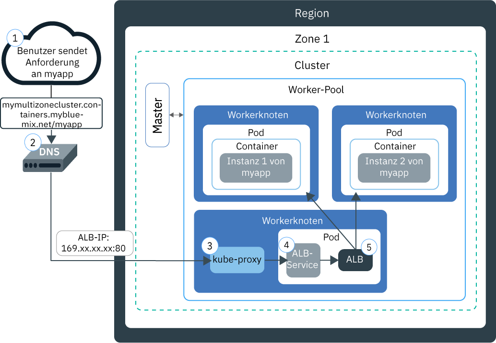
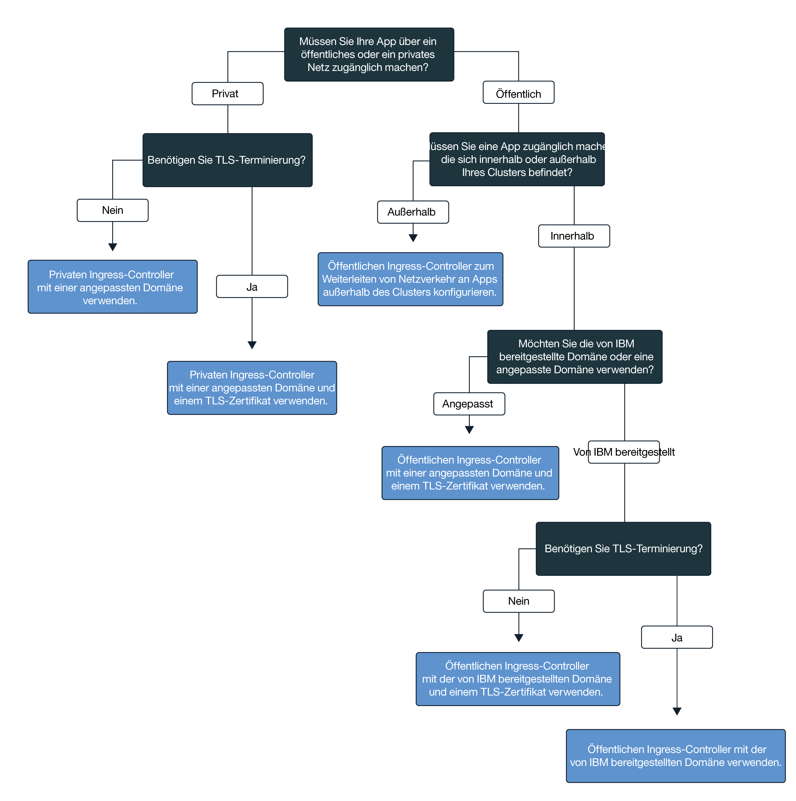

---

copyright:
  years: 2014, 2018
lastupdated: "2018-4-20"

---

{:new_window: target="_blank"}
{:shortdesc: .shortdesc}
{:screen: .screen}
{:pre: .pre}
{:table: .aria-labeledby="caption"}
{:codeblock: .codeblock}
{:tip: .tip}
{:download: .download}


# Apps mit Ingress zugänglich machen
{: #ingress}

Stellen Sie mehrere Apps in Ihrem Kubernetes-Cluster bereit, indem Sie Ingress-Ressourcen erstellen, die durch eine von IBM bereitgestellte Lastausgleichsfunktion für Anwendungen in {{site.data.keyword.containerlong}} verwaltet werden.
{:shortdesc}

## Netzverkehr mithilfe von Ingress verwalten
{: #planning}

Ingress ist ein Kubernetes-Service, der Netzverkehr-Workloads in Ihrem Cluster ausgleicht, indem öffentliche oder private Anforderungen an Ihre Apps weitergeleitet werden. Mit Ingress können Sie in einem öffentlichen oder privaten Netz mehrere App-Services zugänglich machen, indem Sie eine eindeutige öffentliche oder private Route verwenden. {:shortdesc}

Ingress besteht aus zwei Komponenten: 
<dl>
<dt>Lastausgleichsfunktion für Anwendungen</dt>
<dd>Die Lastausgleichsfunktion für Anwendungen (ALB) ist eine externe Lastausgleichsfunktionen, die für eingehende HTTP-, HTTPS-, TCP- oder UDP-Serviceanforderungen empfangsbereit ist und Anforderungen an den entsprechenden App-Pod weiterleitet. Wenn Sie einen Standardcluster erstellen, erstellt {{site.data.keyword.containershort_notm}} automatisch eine hochverfügbare ALB für Ihre Cluster und ordnet ihnen eine eindeutige öffentliche Route zu. Die öffentliche Route ist mit einer portierbaren öffentlichen IP-Adresse verknüpft, die bei der Erstellung des Clusters in Ihrem Konto von IBM Cloud Infrastructure (SoftLayer) eingerichtet wird. Es wird zwar auch eine private Standard-ALB (Lastausgleichsfunktion für Anwendungen) erstellt, diese wird jedoch nicht automatisch aktiviert.</dd>
<dt>Ingress-Ressource</dt>
<dd>Um eine App über Ingress zugänglich zu machen, müssen Sie einen Kubernetes-Service für Ihre App erstellen und diesen Service bei der Lastausgleichsfunktion für Anwendungen (ALB) registrieren, indem Sie eine Ingress-Ressource definieren. Die Ingress-Ressource ist eine Kubernetes-Ressource, die die Regeln für die Weiterleitung eingehender Anforderungen für eine App definiert. Die Ingress-Ressource gibt auch den Pfad zu Ihrem App-Service an, der an die öffentliche Route angehängt wird, um eine eindeutige App-URL zu bilden, z. B. `mycluster.us-south.containers.mybluemix.net/myapp`. </dd>
</dl>

Das folgende Diagramm veranschaulicht, wie Ingress die Kommunikation vom Internet an eine App leitet:



1. Ein Benutzer sendet eine Anforderung an Ihre App, indem er auf die URL Ihrer App zugreift. Diese URL ist die öffentliche URL für Ihre zugänglich gemachte App, der der Pfad der Ingress-Ressource wie zum Beispiel `mycluster.us-south.containers.mybluemix.net/myapp` angehängt wird.

2. Ein DNS-Systemservice, der als globale Lastausgleichsfunktion fungiert, löst die URL in die portierbare öffentliche IP-Adresse der öffentlichen Standard-ALB im Cluster auf.

3. `kube-proxy` leitet die Anforderung an den Kubernetes-ALB-Service für die App weiter.

4. Der Kubernetes-Service leitet die Anforderung an die ALB weiter.

5. Die ALB überprüft, ob eine Weiterleitungsregel für den Pfad `myapp` im Cluster vorhanden ist. Wird eine übereinstimmende Regel gefunden, wird die Anforderung entsprechend der Regeln, die Sie in der Ingress-Ressource definiert haben, an den Pod weitergeleitet, in dem die App bereitgestellt wurde. Wenn mehrere App-Instanzen im Cluster bereitgestellt werden, gleicht die ALB die Anforderungen zwischen den App-Pods aus.


**Hinweis:** Ingress ist nur für Standardcluster verfügbar und erfordert mindestens zwei Workerknoten im Cluster, um eine hohe Verfügbarkeit und regelmäßige Aktualisierungen zu gewährleisten. Für die Einrichtung von Ingress ist eine [Zugriffsrichtlinie 'Administrator'](cs_users.html#access_policies) erforderlich. Überprüfen Sie Ihre aktuelle [Zugriffsrichtlinie](cs_users.html#infra_access).

Folgen Sie diesem Entscheidungsbaum, um die beste Konfiguration für Ingress auszuwählen:


<map name="ingress_map" id="ingress_map">
<area href="/docs/containers/cs_ingress.html#private_ingress_no_tls" alt="Apps mithilfe einer angepassten Domäne ohne TLS nicht öffentlich zugänglich machen" shape="rect" coords="25, 246, 187, 294"/>
<area href="/docs/containers/cs_ingress.html#private_ingress_tls" alt="Apps mithilfe einer angepassten Domäne mit TLS nicht öffentlich zugänglich machen" shape="rect" coords="161, 337, 309, 385"/>
<area href="/docs/containers/cs_ingress.html#external_endpoint" alt="Apps außerhalb des verwendeten Clusters mithilfe der von IBM bereitgestellten oder einer angepassten Domäne mit TLS öffentlich zugänglich machen" shape="rect" coords="313, 229, 466, 282"/>
<area href="/docs/containers/cs_ingress.html#custom_domain_cert" alt="Apps mithilfe einer angepassten Domäne mit TLS öffentlich zugänglich machen" shape="rect" coords="365, 415, 518, 468"/>
<area href="/docs/containers/cs_ingress.html#ibm_domain" alt="Apps mithilfe der von IBM bereitgestellten Domäne ohne TLS öffentlich zugänglich machen" shape="rect" coords="414, 629, 569, 679"/>
<area href="/docs/containers/cs_ingress.html#ibm_domain_cert" alt="Apps mithilfe der von IBM bereitgestellten Domäne mit TLS öffentlich zugänglich machen" shape="rect" coords="563, 711, 716, 764"/>
</map>

<br />


## Apps öffentlich zugänglich machen
{: #ingress_expose_public}

Wenn Sie einen Standardcluster erstellen, wird automatisch eine von IBM bereitgestellte Lastausgleichsfunktion für Anwendungen (ALB) aktiviert, der eine portierbare öffentliche IP-Adresse und eine öffentliche Route zugewiesen ist.
{:shortdesc}

Jeder App, die öffentlich über Ingress zugänglich gemacht wird, ist ein eindeutiger Pfad zugewiesen, der an die öffentliche Route angehängt wird, sodass Sie eine eindeutige URL verwenden können, um öffentlich auf eine App in Ihrem Cluster zuzugreifen. Um Ihre App öffentlich zugänglich zu machen, können Sie Ingress für die folgenden Szenarios konfigurieren.

-   [Apps mithilfe der von IBM bereitgestellten Domäne ohne TLS öffentlich zugänglich machen](#ibm_domain)
-   [Apps mithilfe der von IBM bereitgestellten Domäne mit TLS öffentlich zugänglich machen](#ibm_domain_cert)
-   [Apps mithilfe einer angepassten Domäne mit TLS öffentlich zugänglich machen](#custom_domain_cert)
-   [Apps außerhalb des verwendeten Clusters mithilfe der von IBM bereitgestellten oder einer angepassten Domäne mit TLS öffentlich zugänglich machen](#external_endpoint)

### Apps mithilfe der von IBM bereitgestellten Domäne ohne TLS öffentlich zugänglich machen
{: #ibm_domain}

Sie können die Lastausgleichsfunktion für Anwendungen (ALB) als Lastausgleichsfunktion für eingehenden HTTP-Netzdatenverkehr für die Apps in Ihrem Cluster konfigurieren und die von IBM bereitgestellte Domäne für den Zugriff auf Ihre Apps über das Internet verwenden.
{:shortdesc}

Vorbemerkungen:

-   Wenn Sie nicht bereits über einen verfügen, [erstellen Sie einen Standardcluster](cs_clusters.html#clusters_ui).
-   [Richten Sie Ihre CLI](cs_cli_install.html#cs_cli_configure) auf Ihren Cluster aus, `kubectl`-Befehle auszuführen.

Gehen Sie wie folgt vor, um eine App unter Verwendung der von IBM bereitgestellten Domäne zugänglich zu machen:

1.  [Stellen Sie die App für den Cluster bereit](cs_app.html#app_cli). Stellen Sie sicher, dass Sie eine Bezeichnung zu Ihrer Bereitstellung im Metadatenabschnitt Ihrer Konfigurationsdatei hinzufügen, z. B. `app: code`. Diese Bezeichnung ist zur Identifizierung aller Pods erforderlich, in denen Ihre App ausgeführt wird, damit sie in den Ingress-Lastenausgleich aufgenommen werden können. 

2.   Erstellen Sie einen Kubernetes-Service für die App, den Sie öffentlich zugänglich machen möchten. Ihre App muss von einem Kubernetes-Service verfügbar gemacht werden, um von der Cluster-ALB beim Ingress-Lastausgleich berücksichtigt zu werden. 
      1.  Öffnen Sie Ihren bevorzugten Editor und erstellen Sie eine Servicekonfigurationsdatei namens `myalbservice.yaml` (Beispiel). 
      2.  Definieren Sie einen Service für die App, der von der ALB öffentlich zugänglich gemacht wird. 

          ```
          apiVersion: v1
          kind: Service
          metadata:
            name: myalbservice
          spec:
            selector:
              <selektorschlüssel>: <selektorwert>
            ports:
             - protocol: TCP
               port: 8080
          ```
          {: codeblock}

          <table>
          <caption>Erklärung der ALB-Servicedateikomponenten</caption>
          <thead>
          <th colspan=2> Erklärung der YAML-Dateikomponenten</th>
          </thead>
          <tbody>
          <tr>
          <td><code>selector</code></td>
          <td>Geben Sie das Paar aus Kennzeichnungsschlüssel (<em>&lt;selektorschlüssel&gt;</em>) und Wert (<em>&lt;selektorwert&gt;</em>) ein, das Sie für die Ausrichtung auf die Pods, in denen Ihre App ausgeführt wird, verwenden möchten. Um Ihre Pods anzusprechen und in den Servicelastausgleich einzubeziehen, müssen Sie sicherstellen, dass der <em>&lt;selektorschlüssel&gt;</em> und der <em>&lt;selektorwert&gt;</em> mit dem Schlüssel/Wert-Paar übereinstimmen, das Sie im Abschnitt <code>spec.template.metadata.labels</code> Ihrer yaml-Bereitstellungsdatei verwendet haben. </td>
           </tr>
           <tr>
           <td><code>port</code></td>
           <td>Der Port, den der Service überwacht.</td>
           </tr>
           </tbody></table>
      3.  Speichern Sie Ihre Änderungen.
      4.  Erstellen Sie den Service in Ihrem Cluster.

          ```
          kubectl apply -f myalbservice.yaml
          ```
          {: pre}
      5.  Wiederholen Sie diese Schritte für jede App, die Sie öffentlich zugänglich machen wollen. 

3. Rufen Sie die Details für Ihren Cluster ab, um die von IBM bereitgestellte Domäne anzuzeigen. Ersetzen Sie _&lt;clustername_oder_-id&gt;_ durch den Namen des Clusters, in dem die App bereitgestellt wird, die Sie öffentlich zugänglich machen möchten. 

    ```
    bx cs cluster-get <clustername_oder_-id>
    ```
    {: pre}

    Beispielausgabe:

    ```
    Name:                   mycluster
    ID:                     18a61a63c6a94b658596ca93d087aad9
    State:                  normal
    Created:                2018-01-12T18:33:35+0000
    Location:               dal10
    Master URL:             https://169.xx.xxx.xxx:26268
    Ingress Subdomain:      mycluster-12345.us-south.containers.mybluemix.net
    Ingress Secret:         <geheimer_tls-schlüssel>
    Workers:                3
    Version:                1.8.11
    Owner Email:            owner@email.com
    Monitoring Dashboard:   <dashboard-URL>
    ```
    {: screen}

    Die von IBM bereitgestellte Domäne ist im Feld für die Ingress-Unterdomäne (**Ingress subdomain**) angegeben.
4.  Erstellen Sie eine Ingress-Ressource. Ingress-Ressourcen definieren die Routing-Regeln für den Kubernetes-Service, den Sie für Ihre App erstellt haben; sie werden von der ALB verwendet, um eingehenden Netzverkehr zum Cluster weiterzuleiten. Sie müssen eine Ingress-Ressource verwenden, um Routing-Regeln für mehrere Apps zu definieren, wenn jede App über einen Kubernetes-Service im Cluster zugänglich gemacht wird.
    1.  Öffnen Sie Ihren bevorzugten Editor und erstellen Sie eine Ingress-Konfigurationsdatei namens `myingressresource.yaml` (Beispiel). 
    2.  Definieren Sie eine Ingress-Ressource in Ihrer Konfigurationsdatei, die die von IBM bereitgestellte Domäne für das Weiterleiten von eingehendem Netzverkehr an die zuvor erstellten Services verwendet. 

        ```
        apiVersion: extensions/v1beta1
        kind: Ingress
        metadata:
          name: myingressresource
        spec:
          rules:
          - host: <ibm-domäne>
            http:
              paths:
              - path: /<service1_pfad>
                backend:
                  serviceName: <service1>
                  servicePort: 80
              - path: /<service2_pfad>
                backend:
                  serviceName: <service2>
                  servicePort: 80
        ```
        {: codeblock}

        <table>
        <thead>
        <th colspan=2> Erklärung der YAML-Dateikomponenten</th>
        </thead>
        <tbody>
        <tr>
        <td><code>host</code></td>
        <td>Ersetzen Sie <em>&lt;ibm-domäne&gt;</em> durch den Namen der <strong>Ingress-Unterdomäne</strong> aus dem vorherigen Schritt. 

        </br></br>
        <strong>Hinweis:</strong> Verwenden Sie keine Sternchen (*) für Ihren Host oder lassen Sie die Hosteigenschaft leer, um Fehler während der Ingress-Erstellung zu vermeiden.</td>
        </tr>
        <tr>
        <td><code>path</code></td>
        <td>Ersetzen Sie <em>&lt;service1_pfad&gt;</em> durch einen Schrägstrich oder den eindeutigen Pfad, den Ihre App überwacht, sodass Netzverkehr an die App weitergeleitet werden kann. 

        </br>
        Für jeden Kubernetes-Service können Sie einen individuellen Pfad definieren, der an die von IBM bereitgestellte Domäne angehängt wird; um einen eindeutigen Pfad zu Ihrer App zu erstellen, z. B. <code>ibm-domäne/service1_pfad</code>. Wenn Sie diese Route in einen Web-Browser eingeben, wird der Netzverkehr an die Lastausgleichsfunktion für Anwendungen (ALB) weitergeleitet. Die Lastausgleichsfunktion für Anwendungen (ALB) sucht nach dem zugehörigen Service und sendet Netzverkehr an ihn. Der Service leitet den Datenverkehr dann an die Pods weiter, in denen die App ausgeführt wird. Die App muss so konfiguriert werden, dass dieser Pfad überwacht wird, um eingehenden Datenverkehr im Netz zu erhalten. 

        </br></br>
        Die meisten Apps überwachen keinen bestimmten Pfad, sondern verwenden den Rootpfad und einen bestimmten Port. In diesem Fall definieren Sie den Rootpfad als <code>/</code> und geben keinen individuellen Pfad für Ihre App an.
        </br>
        Beispiel: <ul><li>Geben Sie für <code>http://ibm-domäne/</code> als Pfad <code>/</code> ein. </li><li>Geben Sie für <code>http://ibm-domäne/service1_pfad</code> als Pfad <code>/service1_pfad</code> ein. </li></ul>
        </br>
        <strong>Tipp:</strong> Um Ingress für die Überwachung eines Pfads zu konfigurieren, der von dem Pfad abweicht, den Ihre App überwacht, können Sie mit [Annotation neu schreiben](cs_annotations.html#rewrite-path) eine richtige Weiterleitung an Ihre App einrichten.</td>
        </tr>
        <tr>
        <td><code>serviceName</code></td>
        <td>Ersetzen Sie <em>&lt;service1&gt;</em> durch den Namen des Service, den Sie beim Erstellen des Kubernetes-Service für Ihre App verwendet haben. </td>
        </tr>
        <tr>
        <td><code>servicePort</code></td>
        <td>Der Port, den Ihr Service überwacht. Verwenden Sie denselben Port, die Sie beim Erstellen des Kubernetes-Service für Ihre App definiert haben.</td>
        </tr>
        </tbody></table>

    3.  Erstellen Sie die Ingress-Ressource für Ihr Cluster.

        ```
        kubectl apply -f myingressresource.yaml
        ```
        {: pre}
5.   Überprüfen Sie, dass die Ingress-Ressource erfolgreich erstellt wurde.

      ```
      kubectl describe ingress myingressresource
      ```
      {: pre}

      1. Wenn Nachrichten im Ereignis einen Fehler in Ihrer Ressourcenkonfiguration beschreiben, ändern Sie die Werte in Ihrer Ressourcendatei und wenden Sie die Datei für die Ressource erneut an. 

6.   Geben Sie in einem Web-Browser die URL des App-Service an, auf den zugegriffen werden soll.

      ```
      https://<ibm-domäne>/<service1_pfad>
      ```
      {: codeblock}


<br />


### Apps mithilfe der von IBM bereitgestellten Domäne mit TLS öffentlich zugänglich machen
{: #ibm_domain_cert}

Sie können die Ingress-ALB (Lastausgleichsfunktion für Anwendungen) so konfigurieren, dass eingehende TLS-Verbindungen für Ihre Apps verwaltet, der Netzverkehr mithilfe des von IBM bereitgestellten TLS-Zertifikats entschlüsselt und die entschlüsselte Anforderung an die Apps weitergeleitet wird, die in Ihrem Cluster zugänglich sind.
{:shortdesc}

Vorbemerkungen:

-   Wenn Sie nicht bereits über einen verfügen, [erstellen Sie einen Standardcluster](cs_clusters.html#clusters_ui).
-   [Richten Sie Ihre CLI](cs_cli_install.html#cs_cli_configure) auf Ihren Cluster aus, `kubectl`-Befehle auszuführen.

Gehen Sie wie folgt vor, um eine App unter Verwendung der von IBM bereitgestellten Domäne mit TLS zugänglich zu machen:

1.  [Stellen Sie die App für den Cluster bereit](cs_app.html#app_cli). Stellen Sie sicher, dass Sie eine Bezeichnung zu Ihrer Bereitstellung im Metadatenabschnitt Ihrer Konfigurationsdatei hinzufügen, z. B. `app: code`. Diese Bezeichnung ist zur Identifizierung aller Pods erforderlich, in denen Ihre App ausgeführt wird, damit sie in den Ingress-Lastenausgleich aufgenommen werden können. 

2.   Erstellen Sie einen Kubernetes-Service für die App, den Sie öffentlich zugänglich machen möchten. Ihre App muss von einem Kubernetes-Service verfügbar gemacht werden, um von der Cluster-ALB beim Ingress-Lastausgleich berücksichtigt zu werden. 
      1.  Öffnen Sie Ihren bevorzugten Editor und erstellen Sie eine Servicekonfigurationsdatei namens `myalbservice.yaml` (Beispiel). 
      2.  Definieren Sie einen Service für die App, der von der ALB öffentlich zugänglich gemacht wird. 

          ```
          apiVersion: v1
          kind: Service
          metadata:
            name: myalbservice
          spec:
            selector:
              <selektorschlüssel>: <selektorwert>
            ports:
             - protocol: TCP
               port: 8080
          ```
          {: codeblock}

          <table>
          <caption>Erklärung der ALB-Servicedateikomponenten</caption>
          <thead>
          <th colspan=2> Erklärung der YAML-Dateikomponenten</th>
          </thead>
          <tbody>
          <tr>
          <td><code>selector</code></td>
          <td>Geben Sie das Paar aus Kennzeichnungsschlüssel (<em>&lt;selektorschlüssel&gt;</em>) und Wert (<em>&lt;selektorwert&gt;</em>) ein, das Sie für die Ausrichtung auf die Pods, in denen Ihre App ausgeführt wird, verwenden möchten. Um Ihre Pods anzusprechen und in den Servicelastausgleich einzubeziehen, müssen Sie sicherstellen, dass der <em>&lt;selektorschlüssel&gt;</em> und der <em>&lt;selektorwert&gt;</em> mit dem Schlüssel/Wert-Paar übereinstimmen, das Sie im Abschnitt <code>spec.template.metadata.labels</code> Ihrer yaml-Bereitstellungsdatei verwendet haben. </td>
           </tr>
           <tr>
           <td><code>port</code></td>
           <td>Der Port, den der Service überwacht.</td>
           </tr>
           </tbody></table>
      3.  Speichern Sie Ihre Änderungen.
      4.  Erstellen Sie den Service in Ihrem Cluster.

          ```
          kubectl apply -f myalbservice.yaml
          ```
          {: pre}
      5.  Wiederholen Sie diese Schritte für jede App, die Sie öffentlich zugänglich machen wollen.

3.   Zeigen Sie die von IBM bereitgestellte Domäne und das TLS-Zertifikat an. Ersetzen Sie _&lt;clustername_oder_-id&gt;_ durch den Namen des Clusters, in dem die App bereitgestellt wird. 

      ```
    bx cs cluster-get <clustername_oder_-id>
    ```
      {: pre}

      Beispielausgabe:

      ```
      Name:                   mycluster
      ID:                     18a61a63c6a94b658596ca93d087aad9
      State:                  normal
      Created:                2018-01-12T18:33:35+0000
      Location:               dal10
      Master URL:             https://169.xx.xxx.xxx:26268
      Ingress Subdomain:      mycluster-12345.us-south.containers.mybluemix.net
      Ingress Secret:         <geheimer_tls-schlüssel_von_ibm>
      Workers:                3
      Version:                1.8.11
      Owner Email:            owner@email.com
      Monitoring Dashboard:   <dashboard-URL>
      ```
      {: screen}

      Die von IBM bereitgestellte Domäne ist im Feld **Ingress-Unterdomäne** und das von IBM bereitgestellte Zertifikat im Feld **Geheimer Ingress-Schlüssel** angegeben. 

4.  Erstellen Sie eine Ingress-Ressource. Ingress-Ressourcen definieren die Routing-Regeln für den Kubernetes-Service, den Sie für Ihre App erstellt haben; sie werden von der ALB verwendet, um eingehenden Netzverkehr zum Cluster weiterzuleiten. Sie müssen eine Ingress-Ressource verwenden, um Routing-Regeln für mehrere Apps zu definieren, wenn jede App über einen Kubernetes-Service im Cluster zugänglich gemacht wird.
    1.  Öffnen Sie Ihren bevorzugten Editor und erstellen Sie eine Ingress-Konfigurationsdatei namens `myingressresource.yaml` (Beispiel). 
    2.  Definieren Sie eine Ingress-Ressource in Ihrer Konfigurationsdatei, die die von IBM bereitgestellte Domäne für das Weiterleiten von eingehendem Netzverkehr an die Services, die Sie zuvor erstellt haben, und Ihr angepasstes Zertifikat für die Verwaltung der TLS-Terminierung verwendet. 

        ```
        apiVersion: extensions/v1beta1
        kind: Ingress
        metadata:
          name: myingressresource
        spec:
          tls:
          - hosts:
            - <ibm-domäne>
            secretName: <geheimer_tls-schlüssel_von_ibm>
          rules:
          - host: <ibm-domäne>
            http:
              paths:
              - path: /<service1_pfad>
                backend:
                  serviceName: <service1>
                  servicePort: 80
              - path: /<service2_pfad>
                backend:
                  serviceName: <service2>
                  servicePort: 80
        ```
        {: codeblock}

        <table>
        <thead>
        <th colspan=2> Erklärung der YAML-Dateikomponenten</th>
        </thead>
        <tbody>
        <tr>
        <td><code>tls/hosts</code></td>
        <td>Ersetzen Sie <em>&lt;ibm-domäne&gt;</em> durch den Namen der <strong>Ingress-Unterdomäne</strong> aus dem vorherigen Schritt. Diese Domäne ist für TLS-Terminierung konfiguriert.

        </br></br>
        <strong>Hinweis:</strong> Verwenden Sie keine Sternchen (&ast;) für Ihren Host oder lassen Sie die Hosteigenschaft leer, um Fehler während der Ingress-Erstellung zu vermeiden.</td>
        </tr>
        <tr>
        <td><code>tls/secretName</code></td>
        <td>Ersetzen Sie <em>&lt;<geheimer_tls-schlüssel_von_ibm>&gt;</em> durch den von IBM bereitgestellten Namen des <strong>geheimen Ingress-Schlüssels</strong> aus dem vorherigen Schritt. Mithilfe dieses Zertifikats wird die TLS-Terminierung verwaltet.
        </tr>
        <tr>
        <td><code>host</code></td>
        <td>Ersetzen Sie <em>&lt;ibm-domäne&gt;</em> durch den Namen der <strong>Ingress-Unterdomäne</strong> aus dem vorherigen Schritt. Diese Domäne ist für TLS-Terminierung konfiguriert.

        </br></br>
        <strong>Hinweis:</strong> Verwenden Sie keine Sternchen (&ast;) für Ihren Host oder lassen Sie die Hosteigenschaft leer, um Fehler während der Ingress-Erstellung zu vermeiden.</td>
        </tr>
        <tr>
        <td><code>path</code></td>
        <td>Ersetzen Sie <em>&lt;service1_pfad&gt;</em> durch einen Schrägstrich oder den eindeutigen Pfad, den Ihre App überwacht, sodass Netzverkehr an die App weitergeleitet werden kann. 

        </br>
        Für jeden Kubernetes-Service können Sie einen individuellen Pfad definieren, der an die von IBM bereitgestellte Domäne angehängt wird; um einen eindeutigen Pfad zu Ihrer App zu erstellen. Wenn Sie diese Route in einen Web-Browser eingeben, wird der Netzverkehr an die Lastausgleichsfunktion für Anwendungen (ALB) weitergeleitet. Die Lastausgleichsfunktion für Anwendungen (ALB) sucht nach dem zugehörigen Service und sendet Netzverkehr an ihn. Der Service leitet den Datenverkehr dann an die Pods weiter, in denen die App ausgeführt wird. Die App muss so konfiguriert werden, dass dieser Pfad überwacht wird, um eingehenden Datenverkehr im Netz zu erhalten. 

        </br>
        Die meisten Apps überwachen keinen bestimmten Pfad, sondern verwenden den Rootpfad und einen bestimmten Port. In diesem Fall definieren Sie den Rootpfad als <code>/</code> und geben keinen individuellen Pfad für Ihre App an.

        </br>
        Beispiel: <ul><li>Geben Sie für <code>http://ibm-domäne/</code> als Pfad <code>/</code> ein. </li><li>Geben Sie für <code>http://ibm-domäne/service1_pfad</code> als Pfad <code>/service1_pfad</code> ein. </li></ul>
        <strong>Tipp:</strong> Um Ingress für die Überwachung eines Pfads zu konfigurieren, der von dem Pfad abweicht, den Ihre App überwacht, können Sie mit [Annotation neu schreiben](cs_annotations.html#rewrite-path) eine richtige Weiterleitung an Ihre App einrichten.</td>
        </tr>
        <tr>
        <td><code>serviceName</code></td>
        <td>Ersetzen Sie <em>&lt;service1&gt;</em> durch den Namen des Service, den Sie beim Erstellen des Kubernetes-Service für Ihre App verwendet haben. </td>
        </tr>
        <tr>
        <td><code>servicePort</code></td>
        <td>Der Port, den Ihr Service überwacht. Verwenden Sie denselben Port, die Sie beim Erstellen des Kubernetes-Service für Ihre App definiert haben.</td>
        </tr>
        </tbody></table>

    3.  Erstellen Sie die Ingress-Ressource für Ihr Cluster.

        ```
        kubectl apply -f myingressresource.yaml
        ```
        {: pre}
5.   Überprüfen Sie, dass die Ingress-Ressource erfolgreich erstellt wurde.

      ```
      kubectl describe ingress myingressresource
      ```
      {: pre}

      1. Wenn Nachrichten im Ereignis einen Fehler in Ihrer Ressourcenkonfiguration beschreiben, ändern Sie die Werte in Ihrer Ressourcendatei und wenden Sie die Datei für die Ressource erneut an. 

6.   Geben Sie in einem Web-Browser die URL des App-Service an, auf den zugegriffen werden soll.

      ```
      https://<ibm-domäne>/<service1_pfad>
      ```
      {: codeblock}


<br />


### Apps mithilfe einer angepassten Domäne mit TLS öffentlich zugänglich machen
{: #custom_domain_cert}

Sie können die Lastausgleichsfunktion für Anwendungen (ALB) zum Weiterleiten von eingehendem Netzverkehr an die Apps in Ihrem Cluster verwenden und Ihr eigenes TLS-Zertifikat zum Verwalten der TLS-Terminierung nutzen, wobei Sie statt der von IBM bereitgestellten Domäne Ihre angepasste Domäne verwenden.
{:shortdesc}

Vorbemerkungen:

-   Wenn Sie nicht bereits über einen verfügen, [erstellen Sie einen Standardcluster](cs_clusters.html#clusters_ui).
-   [Richten Sie Ihre CLI](cs_cli_install.html#cs_cli_configure) auf Ihren Cluster aus, `kubectl`-Befehle auszuführen.

Gehen Sie wie folgt vor, um eine App unter Verwendung einer angepassten Domäne mit TLS zugänglich zu machen:

1.  Erstellen Sie eine angepasste Domäne. Zum Erstellen einer angepassten Domäne arbeiten Sie mit Ihrem DNS-Provider (Domain Name Service) oder [{{site.data.keyword.Bluemix_notm}} ](/docs/infrastructure/dns/getting-started.html#getting-started-with-dns), um Ihre angepasste Domäne zu registrieren.
2.  Konfigurieren Sie Ihre Domäne, um eingehenden Netzverkehr an die von IBM bereitgestellte Lastausgleichsfunktion für Anwendungen (ALB) weiterzuleiten. Wählen Sie zwischen diesen Optionen:
    -   Definieren Sie einen Alias für Ihre angepasste Domäne, indem Sie die von IBM bereitgestellte Domäne als kanonischen Namensdatensatz (CNAME) angeben. Führen Sie `bx cs cluster-get <clustername>` aus, um die von IBM bereitgestellte Ingress-Domäne zu suchen, und suchen Sie nach dem Feld für die Ingress-Unterdomäne (**Ingress subdomain**).
    -   Ordnen Sie Ihre angepasste Domäne der portierbaren öffentlichen IP-Adresse der von IBM bereitgestellten Lastausgleichsfunktion für Anwendungen (ALB) zu, indem Sie die IP-Adresse als Datensatz hinzufügen. Um die portierbare öffentliche IP-Adresse der ALB zu finden, führen Sie folgenden Befehl aus: `bx cs alb-get <public_alb_ID>`.
3.  Importieren oder erstellen Sie ein TLS-Zertifikat und einen geheimen Schlüssel:
    * Wenn in {{site.data.keyword.cloudcerts_long_notm}} bereits ein TLS-Zertifikat gespeichert ist, das Sie verwenden wollen, können Sie den zugehörigen geheimen Schlüssel in Ihren Cluster importieren, indem Sie den folgenden Befehl ausführen:

      ```
      bx cs alb-cert-deploy --secret-name <name_des_geheimen_schlüssels> --cluster <clustername_oder_-id> --cert-crn <crn_des_zertifikats>
      ```
      {: pre}

    * Wenn kein TLS-Zertifikat bereitsteht, führen Sie die folgenden Schritte aus:
        1. Erstellen Sie ein TLS-Zertifikat und einen Schlüssel für Ihre Domäne, der im PEM-Format codiert ist.
        2. Erstellen Sie einen geheimen Schlüssel, der Ihr TLS-Zertifikat und Ihren Schlüssel verwendet. Ersetzen Sie <em>&lt;name_des_geheimen_tls-schlüssels&gt;</em> durch einen Namen für Ihren geheimen Kubernetes-Schlüssel, <em>&lt;dateipfad_des_tls-schlüssels&gt;</em> durch den Pfad Ihrer angepassten TLS-Schlüsseldatei und <em>&lt;dateipfad_des_tls-zertifikats&gt;</em> durch den Pfad Ihrer angepassten TLS-Zertifikatsdatei. 

            ```
            kubectl create secret tls <name_des_geheimen_tls-schlüssels> --key <dateipfad_des_tls-schlüssels> --cert <dateipfad_des_tls-zertifikats>
            ```
            {: pre}
4.  [Stellen Sie die App für den Cluster bereit](cs_app.html#app_cli). Stellen Sie sicher, dass Sie eine Bezeichnung zu Ihrer Bereitstellung im Metadatenabschnitt Ihrer Konfigurationsdatei hinzufügen, z. B. `app: code`. Diese Bezeichnung ist zur Identifizierung aller Pods erforderlich, in denen Ihre App ausgeführt wird, damit sie in den Ingress-Lastenausgleich aufgenommen werden können. 

5.   Erstellen Sie einen Kubernetes-Service für die App, den Sie öffentlich zugänglich machen möchten. Ihre App muss von einem Kubernetes-Service verfügbar gemacht werden, um von der Cluster-ALB beim Ingress-Lastausgleich berücksichtigt zu werden. 
      1.  Öffnen Sie Ihren bevorzugten Editor und erstellen Sie eine Servicekonfigurationsdatei namens `myalbservice.yaml` (Beispiel). 
      2.  Definieren Sie einen Service für die App, der von der ALB öffentlich zugänglich gemacht wird. 

          ```
          apiVersion: v1
          kind: Service
          metadata:
            name: myalbservice
          spec:
            selector:
              <selektorschlüssel>: <selektorwert>
            ports:
             - protocol: TCP
               port: 8080
          ```
          {: codeblock}

          <table>
          <caption>Erklärung der ALB-Servicedateikomponenten</caption>
          <thead>
          <th colspan=2> Erklärung der YAML-Dateikomponenten</th>
          </thead>
          <tbody>
          <tr>
          <td><code>selector</code></td>
          <td>Geben Sie das Paar aus Kennzeichnungsschlüssel (<em>&lt;selektorschlüssel&gt;</em>) und Wert (<em>&lt;selektorwert&gt;</em>) ein, das Sie für die Ausrichtung auf die Pods, in denen Ihre App ausgeführt wird, verwenden möchten. Um Ihre Pods anzusprechen und in den Servicelastausgleich einzubeziehen, müssen Sie sicherstellen, dass der <em>&lt;selektorschlüssel&gt;</em> und der <em>&lt;selektorwert&gt;</em> mit dem Schlüssel/Wert-Paar übereinstimmen, das Sie im Abschnitt <code>spec.template.metadata.labels</code> Ihrer yaml-Bereitstellungsdatei verwendet haben. </td>
           </tr>
           <tr>
           <td><code>port</code></td>
           <td>Der Port, den der Service überwacht.</td>
           </tr>
           </tbody></table>
      3.  Speichern Sie Ihre Änderungen.
      4.  Erstellen Sie den Service in Ihrem Cluster.

          ```
          kubectl apply -f myalbservice.yaml
          ```
          {: pre}
      5.  Wiederholen Sie diese Schritte für jede App, die Sie öffentlich zugänglich machen wollen.

6.  Erstellen Sie eine Ingress-Ressource. Ingress-Ressourcen definieren die Routing-Regeln für den Kubernetes-Service, den Sie für Ihre App erstellt haben; sie werden von der ALB verwendet, um eingehenden Netzverkehr zum Cluster weiterzuleiten. Sie müssen eine Ingress-Ressource verwenden, um Routing-Regeln für mehrere Apps zu definieren, wenn jede App über einen Kubernetes-Service im Cluster zugänglich gemacht wird.
    1.  Öffnen Sie Ihren bevorzugten Editor und erstellen Sie eine Ingress-Konfigurationsdatei namens `myingressresource.yaml` (Beispiel). 
    2.  Definieren Sie eine Ingress-Ressource in Ihrer Konfigurationsdatei, die Ihre angepasste Domäne für das Weiterleiten von eingehendem Netzverkehr an Ihre Services und Ihr angepasstes Zertifikat für die Verwaltung der TLS-Terminierung verwendet.

        ```
        apiVersion: extensions/v1beta1
        kind: Ingress
        metadata:
          name: myingressresource
        spec:
          tls:
          - hosts:
            - <angepasste_domäne>
            secretName: <geheimer_tls-schlüssel>
          rules:
          - host: <angepasste_domäne>
            http:
              paths:
              - path: /<service1_pfad>
                backend:
                  serviceName: <service1>
                  servicePort: 80
              - path: /<service2_pfad>
                backend:
                  serviceName: <service2>
                  servicePort: 80
        ```
        {: codeblock}

        <table>
        <thead>
        <th colspan=2> Erklärung der YAML-Dateikomponenten</th>
        </thead>
        <tbody>
        <tr>
        <td><code>tls/hosts</code></td>
        <td>Ersetzen Sie <em>&lt;angepasste_domäne&gt;</em> durch die angepasste Domäne, die Sie für TLS-Terminierung konfigurieren möchten. 

        </br></br>
        <strong>Hinweis:</strong> Verwenden Sie keine Sternchen (&ast;) für Ihren Host oder lassen Sie die Hosteigenschaft leer, um Fehler während der Ingress-Erstellung zu vermeiden.</td>
        </tr>
        <tr>
        <td><code>tls/secretName</code></td>
        <td>Ersetzen Sie <em>&lt;geheimer_tls-schlüssel&gt;</em> durch den Namen des zuvor erstellten geheimen Schlüssels, der Ihr angepasstes TLS-Zertifikat sowie den Schlüssel enthält. Wenn Sie ein Zertifikat aus {{site.data.keyword.cloudcerts_short}} importiert haben, können Sie den Befehl <code>bx cs alb-cert-get --cluster <clustername_oder_-id> --cert-crn <crn_des_zertifikats></code> ausführen, um die geheimen Schlüssel anzuzeigen, die einem TLS-Zertifikat zugeordnet sind.
        </tr>
        <tr>
        <td><code>host</code></td>
        <td>Ersetzen Sie <em>&lt;angepasste_domäne&gt;</em> durch die angepasste Domäne, die Sie für TLS-Terminierung konfigurieren möchten. 

        </br></br>
        <strong>Hinweis:</strong> Verwenden Sie keine Sternchen (&ast;) für Ihren Host oder lassen Sie die Hosteigenschaft leer, um Fehler während der Ingress-Erstellung zu vermeiden.
        </td>
        </tr>
        <tr>
        <td><code>path</code></td>
        <td>Ersetzen Sie <em>&lt;service1_pfad&gt;</em> durch einen Schrägstrich oder den eindeutigen Pfad, den Ihre App überwacht, sodass Netzverkehr an die App weitergeleitet werden kann. 

        </br>
        Für jeden Service können Sie einen individuellen Pfad definieren, der an Ihre angepasste Domäne angehängt wird, um einen eindeutigen Pfad zu Ihrer App zu erstellen. Wenn Sie diese Route in einen Web-Browser eingeben, wird der Netzverkehr an die Lastausgleichsfunktion für Anwendungen (ALB) weitergeleitet. Die Lastausgleichsfunktion für Anwendungen (ALB) sucht nach dem zugehörigen Service und sendet Netzverkehr an ihn. Der Service leitet den Datenverkehr dann an die Pods weiter, in denen die App ausgeführt wird. Die App muss so konfiguriert werden, dass dieser Pfad überwacht wird, um eingehenden Datenverkehr im Netz zu erhalten. 

        </br>
        Die meisten Apps überwachen keinen bestimmten Pfad, sondern verwenden den Rootpfad und einen bestimmten Port. In diesem Fall definieren Sie den Rootpfad als <code>/</code> und geben keinen individuellen Pfad für Ihre App an.

        </br></br>
        Beispiel: <ul><li>Geben Sie für <code>https://angepasste_domäne/</code> als Pfad <code>/</code> ein. </li><li>Geben Sie für <code>https://angepasste_domäne/service1_pfad</code> als Pfad <code>/service1_pfad</code> ein. </li></ul>
        <strong>Tipp:</strong> Um Ingress für die Überwachung eines Pfads zu konfigurieren, der von dem Pfad abweicht, den Ihre App überwacht, können Sie mit [Annotation neu schreiben](cs_annotations.html#rewrite-path) eine richtige Weiterleitung an Ihre App einrichten.
        </td>
        </tr>
        <tr>
        <td><code>serviceName</code></td>
        <td>Ersetzen Sie <em>&lt;service1&gt;</em> durch den Namen des Service, den Sie beim Erstellen des Kubernetes-Service für Ihre App verwendet haben. </td>
        </tr>
        <tr>
        <td><code>servicePort</code></td>
        <td>Der Port, den Ihr Service überwacht. Verwenden Sie denselben Port, die Sie beim Erstellen des Kubernetes-Service für Ihre App definiert haben.</td>
        </tr>
        </tbody></table>

    3.  Speichern Sie Ihre Änderungen.
    4.  Erstellen Sie die Ingress-Ressource für Ihr Cluster.

        ```
        kubectl apply -f myingressresource.yaml
        ```
        {: pre}
7.   Überprüfen Sie, dass die Ingress-Ressource erfolgreich erstellt wurde.

      ```
      kubectl describe ingress myingressresource
      ```
      {: pre}

      1. Wenn Nachrichten im Ereignis einen Fehler in Ihrer Ressourcenkonfiguration beschreiben, ändern Sie die Werte in Ihrer Ressourcendatei und wenden Sie die Datei für die Ressource erneut an. 

8.   Geben Sie in einem Web-Browser die URL des App-Service an, auf den zugegriffen werden soll.

      ```
      https://<angepasste_domäne>/<service1_pfad>
      ```
      {: codeblock}


<br />


### Apps außerhalb des verwendeten Clusters mithilfe der von IBM bereitgestellten oder einer angepassten Domäne mit TLS öffentlich zugänglich machen
{: #external_endpoint}

Sie können die Lastausgleichsfunktion für Anwendungen (ALB) so konfigurieren, dass Apps, die sich außerhalb des Clusters befinden, berücksichtigt werden. Eingehende Anforderungen an die von IBM bereitgestellte oder Ihre angepasste Domäne werden automatisch an die externe App weitergeleitet.
{:shortdesc}

Vorbemerkungen:

-   Wenn Sie nicht bereits über einen verfügen, [erstellen Sie einen Standardcluster](cs_clusters.html#clusters_ui).
-   [Richten Sie Ihre CLI](cs_cli_install.html#cs_cli_configure) auf Ihren Cluster aus, `kubectl`-Befehle auszuführen.
-   Stellen Sie sicher, dass auf die externe App, die Sie beim Lastausgleich des Clusters berücksichtigen möchten, über eine öffentliche IP-Adresse zugegriffen werden kann.

Sie können eingehenden Netzverkehr in der von IBM bereitgestellten Domäne an Apps weiterleiten, die sich außerhalb Ihres Clusters befinden. Wenn Sie stattdessen eine angepasste Domäne und ein TLS-Zertifikat verwenden möchten, ersetzen Sie die von IBM bereitgestellte Domäne und das TLS-Zertifikat durch Ihre [angepasste Domäne und das TLS-Zertifikat](#custom_domain_cert).

1.  Erstellen Sie einen Kubernetes-Service für Ihren Cluster, der eingehende Anforderungen an einen von Ihnen erstellten externen Endpunkt weiterleitet.
    1.  Öffnen Sie Ihren bevorzugten Editor und erstellen Sie eine Servicekonfigurationsdatei namens `myexternalservice.yaml` (Beispiel).
    2.  Definieren Sie den ALB-Service.

        ```
        apiVersion: v1
        kind: Service
        metadata:
          name: myexternalservice
        spec:
          ports:
           - protocol: TCP
             port: 8080
        ```
        {: codeblock}

        <table>
        <caption>Erklärung der ALB-Servicedateikomponenten</caption>
        <thead>
        <th colspan=2> Erklärung der YAML-Dateikomponenten</th>
        </thead>
        <tbody>
        <tr>
        <td><code>metadata/name</code></td>
        <td>Ersetzen Sie <em>&lt;mein_externer_service&gt;</em> durch den Namen Ihres Service. </td>
        </tr>
        <tr>
        <td><code>port</code></td>
        <td>Der Port, den der Service überwacht.</td>
        </tr></tbody></table>

    3.  Speichern Sie Ihre Änderungen.
    4.  Erstellen Sie den Kubernetes-Service für Ihren Cluster.

        ```
        kubectl apply -f myexternalservice.yaml
        ```
        {: pre}
2.  Konfigurieren Sie einen Kubernetes-Endpunkt, der den externen Standort der App definiert, die Sie beim Lastausgleich des Clusters berücksichtigen möchten.
    1.  Öffnen Sie Ihren bevorzugten Editor und erstellen Sie eine Endpunktkonfigurationsdatei namens `myexternalendpoint.yaml` (Beispiel).
    2.  Definieren Sie Ihren externen Endpunkt. Schließen Sie alle öffentlichen IP-Adressen und Ports ein, über die Sie auf Ihre externen App zugreifen können.

        ```
        kind: Endpoints
        apiVersion: v1
        metadata:
          name: myexternalendpoint
        subsets:
          - addresses:
              - ip: <externe_IP1>
              - ip: <externe_IP2>
            ports:
              - port: <externer_port>
        ```
        {: codeblock}

        <table>
        <thead>
        <th colspan=2> Erklärung der YAML-Dateikomponenten</th>
        </thead>
        <tbody>
        <tr>
        <td><code>name</code></td>
        <td>Ersetzen Sie <em>&lt;myexternalendpoint&gt;</em> durch den Namen des Kubernetes-Service, den Sie zuvor erstellt haben. </td>
        </tr>
        <tr>
        <td><code>ip</code></td>
        <td>Ersetzen Sie <em>&lt;externe_IP&gt;</em> durch die öffentlichen IP-Adressen für die Verbindung mit Ihrer externen App. </td>
         </tr>
         <td><code>port</code></td>
         <td>Ersetzen Sie <em>&lt;externer_port&gt;</em> durch den Port, den Ihre externe App überwacht. </td>
         </tbody></table>

    3.  Speichern Sie Ihre Änderungen.
    4.  Erstellen Sie den Kubernetes-Endpunkt für Ihren Cluster.

        ```
        kubectl apply -f myexternalendpoint.yaml
        ```
        {: pre}
3.   Zeigen Sie die von IBM bereitgestellte Domäne und das TLS-Zertifikat an. Ersetzen Sie _&lt;clustername_oder_-id&gt;_ durch den Namen des Clusters, in dem die App bereitgestellt wird. 

      ```
    bx cs cluster-get <clustername_oder_-id>
    ```
      {: pre}

      Beispielausgabe:

      ```
      Name:                   mycluster
      ID:                     18a61a63c6a94b658596ca93d087aad9
      State:                  normal
      Created:                2018-01-12T18:33:35+0000
      Location:               dal10
      Master URL:             https://169.xx.xxx.xxx:26268
      Ingress Subdomain:      mycluster-12345.us-south.containers.mybluemix.net
      Ingress Secret:         <geheimer_tls-schlüssel_von_ibm>
      Workers:                3
      Version:                1.8.11
      Owner Email:            owner@email.com
      Monitoring Dashboard:   <dashboard-URL>
      ```
      {: screen}

      Die von IBM bereitgestellte Domäne ist im Feld **Ingress-Unterdomäne** und das von IBM bereitgestellte Zertifikat im Feld **Geheimer Ingress-Schlüssel** angegeben. 

4.  Erstellen Sie eine Ingress-Ressource. Ingress-Ressourcen definieren die Routing-Regeln für den Kubernetes-Service, den Sie für Ihre App erstellt haben; sie werden von der ALB verwendet, um eingehenden Netzverkehr zum Cluster weiterzuleiten. Sie können eine Ingress-Ressource verwenden, um Routing-Regeln für mehrere externe Apps zu definieren, solange jede App mit ihrem externen Endpunkt über einen Kubernetes-Service im Cluster zugänglich gemacht wird.
    1.  Öffnen Sie Ihren bevorzugten Editor und erstellen Sie eine Ingress-Konfigurationsdatei namens `myexternalingress.yaml` (Beispiel).
    2.  Definieren Sie eine Ingress-Ressource in Ihrer Konfigurationsdatei, die die von IBM bereitgestellte Domäne und das TLS-Zertifikat für das Weiterleiten von eingehendem Netzverkehr an Ihre externe App mithilfe des zuvor definierten externen Endpunkts verwendet.

        ```
        apiVersion: extensions/v1beta1
        kind: Ingress
        metadata:
          name: myexternalingress
        spec:
          tls:
          - hosts:
            - <ibm-domäne>
            secretName: <geheimer_tls-schlüssel_von_ibm>
          rules:
          - host: <ibm-domäne>
            http:
              paths:
              - path: /<externer_service1_pfad>
                backend:
                  serviceName: <externer_service1>
                  servicePort: 80
              - path: /<externer_service2_pfad>
                backend:
                  serviceName: <externer_service2>
                  servicePort: 80
        ```
        {: codeblock}

        <table>
        <thead>
        <th colspan=2> Erklärung der YAML-Dateikomponenten</th>
        </thead>
        <tbody>
        <tr>
        <td><code>tls/hosts</code></td>
        <td>Ersetzen Sie <em>&lt;ibm-domäne&gt;</em> durch den Namen der <strong>Ingress-Unterdomäne</strong> aus dem vorherigen Schritt. Diese Domäne ist für TLS-Terminierung konfiguriert.

        </br></br>
        <strong>Hinweis:</strong> Verwenden Sie keine Sternchen (&ast;) für Ihren Host oder lassen Sie die Hosteigenschaft leer, um Fehler während der Ingress-Erstellung zu vermeiden.</td>
        </tr>
        <tr>
        <td><code>tls/secretName</code></td>
        <td>Ersetzen Sie <em>&lt;geheimer_tls-schlüssel_von_ibm&gt;</em> durch den von IBM bereitgestellten <strong>geheimen Ingress-Schlüssel</strong> aus dem vorherigen Schritt. Mithilfe dieses Zertifikats wird die TLS-Terminierung verwaltet.</td>
        </tr>
        <tr>
        <td><code>rules/host</code></td>
        <td>Ersetzen Sie <em>&lt;ibm-domäne&gt;</em> durch den Namen der <strong>Ingress-Unterdomäne</strong> aus dem vorherigen Schritt. Diese Domäne ist für TLS-Terminierung konfiguriert.

        </br></br>
        <strong>Hinweis:</strong> Verwenden Sie keine Sternchen (&ast;) für Ihren Host oder lassen Sie die Hosteigenschaft leer, um Fehler während der Ingress-Erstellung zu vermeiden.</td>
        </tr>
        <tr>
        <td><code>path</code></td>
        <td>Ersetzen Sie <em>&lt;externer_servicepfad&gt;</em> durch einen Schrägstrich oder den eindeutigen Pfad, den Ihre Anwendung überwacht, sodass Netzverkehr an die externe App weitergeleitet werden kann. 

        </br>
        Für jeden Service können Sie einen individuellen Pfad definieren, der an die von IBM bereitgestellte Domäne oder die angepasste Domäne angehängt wird, um einen eindeutigen Pfad zu Ihrer App zu erstellen, z. B. <code>http://ibm-domäne/externer_servicepfad</code> oder <code>http://angepasste_domäne/</code>. Wenn Sie diese Route in einen Web-Browser eingeben, wird der Netzverkehr an die Lastausgleichsfunktion für Anwendungen (ALB) weitergeleitet. Die Lastausgleichsfunktion für Anwendungen (ALB) sucht nach dem zugehörigen Service und sendet Netzverkehr an ihn. Der Service leitet den Datenverkehr an die externe App weiter. Die App muss so konfiguriert werden, dass dieser Pfad überwacht wird, um eingehenden Datenverkehr im Netz zu erhalten. 

        </br></br>
        Die meisten Apps überwachen keinen bestimmten Pfad, sondern verwenden den Rootpfad und einen bestimmten Port. In diesem Fall definieren Sie den Rootpfad als <code>/</code> und geben keinen individuellen Pfad für Ihre App an.

        </br></br>
        <strong>Tipp:</strong> Um Ingress für die Überwachung eines Pfads zu konfigurieren, der von dem Pfad abweicht, den Ihre App überwacht, können Sie mit [Annotation neu schreiben](cs_annotations.html#rewrite-path) eine richtige Weiterleitung an Ihre App einrichten.</td>
        </tr>
        <tr>
        <td><code>serviceName</code></td>
        <td>Ersetzen Sie <em>&lt;externer_service&gt;</em> durch den Namen des Service, den Sie beim Erstellen des Kubernetes-Service für Ihre externe App verwendet haben. </td>
        </tr>
        <tr>
        <td><code>servicePort</code></td>
        <td>Der Port, den Ihr Service überwacht.</td>
        </tr>
        </tbody></table>

    3.  Speichern Sie Ihre Änderungen.
    4.  Erstellen Sie die Ingress-Ressource für Ihr Cluster.

        ```
        kubectl apply -f myexternalingress.yaml
        ```
        {: pre}
5.   Überprüfen Sie, dass die Ingress-Ressource erfolgreich erstellt wurde.

      ```
      kubectl describe ingress myingressresource
      ```
      {: pre}

      1. Wenn Nachrichten im Ereignis einen Fehler in Ihrer Ressourcenkonfiguration beschreiben, ändern Sie die Werte in Ihrer Ressourcendatei und wenden Sie die Datei für die Ressource erneut an. 

6.   Geben Sie in einem Web-Browser die URL des App-Service an, auf den zugegriffen werden soll.

      ```
      https://<ibm-domäne>/<service1_pfad>
      ```
      {: codeblock}


<br />


## Apps in einem privaten Netz zugänglich machen
{: #ingress_expose_private}

Wenn Sie einen Standardcluster erstellen, wird eine von IBM bereitgestellte Lastausgleichsfunktion für Anwendungen (ALB) erstellt, der eine portierbare öffentliche IP-Adresse und eine private Route zugewiesen ist. Die private Standard-ALB wird jedoch nicht automatisch aktiviert.
{:shortdesc}

Um Ihre App für private Netze zugänglich zu machen, [aktivieren Sie zunächst die private Lastausgleichsfunktion für Anwendungen](#private_ingress).

Anschließend können Sie Ingress für die folgenden Szenarios konfigurieren.
-   [Apps mithilfe einer angepassten Domäne ohne TLS und mithilfe eines externen DNS-Anbieters nicht öffentlich zugänglich machen](#private_ingress_no_tls)
-   [Apps mithilfe einer angepassten Domäne mit TLS und mithilfe eines externen DNS-Anbieters nicht öffentlich zugänglich machen](#private_ingress_tls)
-   [Apps mithilfe eines lokalen DNS-Service nicht öffentlich zugänglich machen](#private_ingress_onprem_dns)

### Private Lastausgleichsfunktion für Anwendungen aktivieren
{: #private_ingress}

Bevor Sie die standardmäßige private Lastausgleichsfunktion für Anwendungen (ALB) verwenden können, müssen Sie sie entweder mit der von IBM bereitgestellten, portierbaren privaten IP-Adresse oder mit Ihrer eigenen portierbaren privaten IP-Adresse aktivieren.
{:shortdesc}

**Hinweis**: Wenn Sie beim Erstellen des Clusters das Flag `--no-subnet` verwendet haben, müssen Sie ein portierbares privates Teilnetz oder ein durch einen Benutzer verwaltetes Teilnetz hinzufügen, bevor Sie die private Lastausgleichsfunktion für Anwendungen (ALB) aktivieren können. Weitere Informationen finden Sie im Abschnitt [Weitere Teilnetze für Ihren Cluster anfordern](cs_subnets.html#request).

Vorbemerkungen:

-   Wenn Sie nicht bereits über einen verfügen, [erstellen Sie einen Standardcluster](cs_clusters.html#clusters_ui).
-   [Richten Sie Ihre CLI](cs_cli_install.html#cs_cli_configure) (Befehlszeilenschnittstelle) auf Ihren Cluster aus.

Gehen Sie wie folgt vor, um die private Lastausgleichsfunktion für Anwendungen (ALB) mit der zuvor zugewiesenen, durch IBM bereitgestellten portierbaren privaten IP-Adresse zu aktivieren:

1. Listen Sie die verfügbaren ALBs in Ihrem Cluster auf, um die ID der privaten ALB abzurufen. Ersetzen Sie <em>&lt;mein_cluster&gt;</em> durch den Namen des Clusters, in dem die App, die Sie zugänglich machen möchten, bereitgestellt wird.

    ```
    bx cs albs --cluster <clustername>
    ```
    {: pre}

    Das Feld **Status** für die private ALB ist inaktiviert (_disabled_).
    ```
    ALB ID                                            Enabled   Status     Type      ALB IP
    private-cr6d779503319d419ea3b4ab171d12c3b8-alb1   false     disabled   private   -
    public-cr6d779503319d419ea3b4ab171d12c3b8-alb1    true      enabled    public    169.xx.xxx.xxx
    ```
    {: screen}

2. Aktivieren Sie die private ALB. Ersetzen Sie <em>&lt;private_ALB-ID&gt;</em> durch die ID für die private ALB aus der Ausgabe im vorherigen Schritt.

   ```
   bx cs alb-configure --albID <private_ALB-ID> --enable
   ```
   {: pre}


Gehen Sie wie folgt vor, um die private Lastausgleichsfunktion für Anwendungen (ALB) mit Ihrer eigenen portierbaren privaten IP-Adresse zu aktivieren:

1. Konfigurieren Sie das vom Benutzer verwaltete Teilnetz der gewünschten IP-Adresse so, dass Datenverkehr über das private VLAN Ihres Clusters geleitet wird. Ersetzen Sie <em>&lt;clustername&gt;</em> durch den Namen oder die ID des Clusters, in dem die App, die Sie zugänglich machen möchten, bereitgestellt wird, <em>&lt;teilnetz-CIDR&gt;</em> durch die CIDR Ihres vom Benutzer verwalteten Teilnetzes und <em>&lt;private_VLAN-id&gt;</em> durch eine verfügbare private VLAN-ID. Sie können durch das Ausführen des Befehls `bx cs vlans` nach der ID eines verfügbaren privaten VLANs suchen.

   ```
   bx cs cluster-user-subnet-add <clustername> <teilnetz-CIDR> <private_VLAN-id>
   ```
   {: pre}

2. Listen Sie die verfügbaren ALBs in Ihrem Cluster auf, um die ID der privaten ALB abzurufen.

    ```
    bx cs albs --cluster <clustername>
    ```
    {: pre}

    Das Feld **Status** für die private ALB ist inaktiviert (_disabled_).
    ```
    ALB ID                                            Enabled   Status     Type      ALB IP
    private-cr6d779503319d419ea3b4ab171d12c3b8-alb1   false     disabled   private   -
    public-cr6d779503319d419ea3b4ab171d12c3b8-alb1    true      enabled    public    169.xx.xxx.xxx
    ```
    {: screen}

3. Aktivieren Sie die private ALB. Ersetzen Sie <em>&lt;private_ALB-ID&gt;</em> durch die ID für die private Lastausgleichsfunktion für Anwendungen (ALB) aus der Ausgabe aus dem vorherigen Schritt und <em>&lt;benutzer-ip&gt;</em> durch die IP-Adresse des durch den Benutzer verwalteten Teilnetzes, das Sie verwenden möchten.

   ```
   bx cs alb-configure --albID <private_ALB-ID> --enable --user-ip <benutzer-ip>
   ```
   {: pre}

<br />


### Apps mithilfe einer angepassten Domäne ohne TLS und mithilfe eines externen DNS-Anbieters nicht öffentlich zugänglich machen
{: #private_ingress_no_tls}

Sie können die private Lastausgleichsfunktion für Anwendungen (ALB) zum Weiterleiten von eingehendem Netzverkehr an die Apps in Ihrem Cluster verwenden, wobei Sie eine angepasste Domäne verwenden.
{:shortdesc}

Vorbemerkungen:
* [Private Lastausgleichsfunktion für Anwendungen aktivieren](#private_ingress).
* Wenn Sie über private Workerknoten verfügen und einen externen DNS-Anbieter verwenden möchten, müssen Sie [Edge-Knoten mit öffentl. Zugriff konfigurieren](cs_edge.html#edge) und eine [Vyatta Gateway Appliance konfigurieren ](https://www.ibm.com/blogs/bluemix/2017/07/kubernetes-and-bluemix-container-based-workloads-part4/). Wenn Sie nur in einem privaten Netz bleiben möchten, finden Sie weitere Informationen stattdessen unter [Apps mithilfe eines lokalen DNS-Service nicht öffentlich zugänglich machen](#private_ingress_onprem_dns). 

Gehen Sie wie folgt vor, um eine App unter Verwendung einer angepassten Domäne ohne TLS mithilfe eines externen DNS-Anbieters nicht öffentlich zugänglich zu machen:

1.  Erstellen Sie eine angepasste Domäne. Zum Erstellen einer angepassten Domäne arbeiten Sie mit Ihrem DNS-Provider (Domain Name Service) oder [{{site.data.keyword.Bluemix_notm}} ](/docs/infrastructure/dns/getting-started.html#getting-started-with-dns), um Ihre angepasste Domäne zu registrieren.
2.  Ordnen Sie Ihre angepasste Domäne der portierbaren privaten IP-Adresse der von IBM bereitgestellten privaten Lastausgleichsfunktion für Anwendungen (ALB) zu, indem Sie die IP-Adresse als Datensatz hinzufügen. Um die portierbare private IP-Adresse des privaten ALB zu finden, führen Sie den folgenden Befehl aus: `bx cs albs -- cluster <clustername>`.
3.  [Stellen Sie die App für den Cluster bereit](cs_app.html#app_cli). Stellen Sie sicher, dass Sie eine Bezeichnung zu Ihrer Bereitstellung im Metadatenabschnitt Ihrer Konfigurationsdatei hinzufügen, z. B. `app: code`. Diese Bezeichnung ist zur Identifizierung aller Pods erforderlich, in denen Ihre App ausgeführt wird, damit sie in den Ingress-Lastenausgleich aufgenommen werden können. 

4.   Erstellen Sie einen Kubernetes-Service für die App, den Sie öffentlich zugänglich machen möchten. Ihre App muss von einem Kubernetes-Service verfügbar gemacht werden, um von der Cluster-ALB beim Ingress-Lastausgleich berücksichtigt zu werden. 
      1.  Öffnen Sie Ihren bevorzugten Editor und erstellen Sie eine Servicekonfigurationsdatei namens `myalbservice.yaml` (Beispiel). 
      2.  Definieren Sie einen Service für die App, der von der ALB im privaten Netz zugänglich gemacht wird. 

          ```
          apiVersion: v1
          kind: Service
          metadata:
            name: myalbservice
          spec:
            selector:
              <selektorschlüssel>: <selektorwert>
            ports:
             - protocol: TCP
               port: 8080
          ```
          {: codeblock}

          <table>
          <caption>Erklärung der ALB-Servicedateikomponenten</caption>
          <thead>
          <th colspan=2> Erklärung der YAML-Dateikomponenten</th>
          </thead>
          <tbody>
          <tr>
          <td><code>selector</code></td>
          <td>Geben Sie das Paar aus Kennzeichnungsschlüssel (<em>&lt;selektorschlüssel&gt;</em>) und Wert (<em>&lt;selektorwert&gt;</em>) ein, das Sie für die Ausrichtung auf die Pods, in denen Ihre App ausgeführt wird, verwenden möchten. Um Ihre Pods anzusprechen und in den Servicelastausgleich einzubeziehen, müssen Sie sicherstellen, dass der <em>&lt;selektorschlüssel&gt;</em> und der <em>&lt;selektorwert&gt;</em> mit dem Schlüssel/Wert-Paar übereinstimmen, das Sie im Abschnitt <code>spec.template.metadata.labels</code> Ihrer yaml-Bereitstellungsdatei verwendet haben. </td>
           </tr>
           <tr>
           <td><code>port</code></td>
           <td>Der Port, den der Service überwacht.</td>
           </tr>
           </tbody></table>
      3.  Speichern Sie Ihre Änderungen.
      4.  Erstellen Sie den Service in Ihrem Cluster.

          ```
          kubectl apply -f myalbservice.yaml
          ```
          {: pre}
      5.  Wiederholen Sie diese Schritte für jede App, die Sie im privaten Netz zugänglich machen möchten.

5.  Erstellen Sie eine Ingress-Ressource. Ingress-Ressourcen definieren die Routing-Regeln für den Kubernetes-Service, den Sie für Ihre App erstellt haben; sie werden von der ALB verwendet, um eingehenden Netzverkehr zum Cluster weiterzuleiten. Sie müssen eine Ingress-Ressource verwenden, um Routing-Regeln für mehrere Apps zu definieren, wenn jede App über einen Kubernetes-Service im Cluster zugänglich gemacht wird.
    1.  Öffnen Sie Ihren bevorzugten Editor und erstellen Sie eine Ingress-Konfigurationsdatei namens `myingressresource.yaml` (Beispiel). 
    2.  Definieren Sie eine Ingress-Ressource in Ihrer Konfigurationsdatei, die Ihre angepasste Domäne für das Weiterleiten von eingehendem Netzverkehr an Ihre Services verwendet.

        ```
        apiVersion: extensions/v1beta1
        kind: Ingress
        metadata:
          name: myingressresource
          annotations:
            ingress.bluemix.net/ALB-ID: "<private_ALB-id>"
        spec:
          rules:
          - host: <angepasste_domäne>
            http:
              paths:
              - path: /<service1_pfad>
                backend:
                  serviceName: <service1>
                  servicePort: 80
              - path: /<service2_pfad>
                backend:
                  serviceName: <service2>
                  servicePort: 80
        ```
        {: codeblock}

        <table>
        <thead>
        <th colspan=2> Erklärung der YAML-Dateikomponenten</th>
        </thead>
        <tbody>
        <tr>
        <td><code>ingress.bluemix.net/ALB-ID</code></td>
        <td>Ersetzen Sie <em>&lt;private_ALB-ID&gt;</em> durch die ID für Ihre private Lastausgleichsfunktion für Anwendungen (ALB). Führen Sie den Befehl <code>bx cs albs --cluster <mein_cluster></code> aus, um nach der ALB-ID zu suchen. Weitere Informationen zu dieser Ingress-Annotation finden Sie unter [Weiterleitung mit einer privaten Lastausgleichsfunktion für Anwendungen](cs_annotations.html#alb-id).</td>
        </tr>
        <td><code>host</code></td>
        <td>Ersetzen Sie <em>&lt;angepasste_domäne&gt;</em> durch Ihre angepasste Domäne.

        </br></br>
        <strong>Hinweis:</strong> Verwenden Sie keine Sternchen (&ast;) für Ihren Host oder lassen Sie die Hosteigenschaft leer, um Fehler während der Ingress-Erstellung zu vermeiden.
        </td>
        </tr>
        <tr>
        <td><code>path</code></td>
        <td>Ersetzen Sie <em>&lt;service1_pfad&gt;</em> durch einen Schrägstrich oder den eindeutigen Pfad, den Ihre App überwacht, sodass Netzverkehr an die App weitergeleitet werden kann. 

        </br>

        Für jeden Service können Sie einen individuellen Pfad definieren, der an Ihre angepasste Domäne angehängt wird, um einen eindeutigen Pfad zu Ihrer App zu erstellen. Wenn Sie diese Route in einen Web-Browser eingeben, wird der Netzverkehr an die Lastausgleichsfunktion für Anwendungen (ALB) weitergeleitet. Die Lastausgleichsfunktion für Anwendungen (ALB) sucht nach dem zugehörigen Service und sendet Netzverkehr an ihn. Der Service leitet den Datenverkehr dann an die Pods weiter, in denen die App ausgeführt wird. Die App muss so konfiguriert werden, dass dieser Pfad überwacht wird, um eingehenden Datenverkehr im Netz zu erhalten. 

        </br>
        Die meisten Apps überwachen keinen bestimmten Pfad, sondern verwenden den Rootpfad und einen bestimmten Port. In diesem Fall definieren Sie den Rootpfad als <code>/</code> und geben keinen individuellen Pfad für Ihre App an.

        </br></br>
        Beispiel: <ul><li>Geben Sie für <code>https://angepasste_domäne/</code> als Pfad <code>/</code> ein. </li><li>Geben Sie für <code>https://angepasste_domäne/service1_pfad</code> als Pfad <code>/service1_pfad</code> ein. </li></ul>
        <strong>Tipp:</strong> Um Ingress für die Überwachung eines Pfads zu konfigurieren, der von dem Pfad abweicht, den Ihre App überwacht, können Sie mit [Annotation neu schreiben](cs_annotations.html#rewrite-path) eine richtige Weiterleitung an Ihre App einrichten.
        </td>
        </tr>
        <tr>
        <td><code>serviceName</code></td>
        <td>Ersetzen Sie <em>&lt;service1&gt;</em> durch den Namen des Service, den Sie beim Erstellen des Kubernetes-Service für Ihre App verwendet haben. </td>
        </tr>
        <tr>
        <td><code>servicePort</code></td>
        <td>Der Port, den Ihr Service überwacht. Verwenden Sie denselben Port, die Sie beim Erstellen des Kubernetes-Service für Ihre App definiert haben.</td>
        </tr>
        </tbody></table>

    3.  Speichern Sie Ihre Änderungen.
    4.  Erstellen Sie die Ingress-Ressource für Ihr Cluster.

        ```
        kubectl apply -f myingressresource.yaml
        ```
        {: pre}
6.   Überprüfen Sie, dass die Ingress-Ressource erfolgreich erstellt wurde.

      ```
      kubectl describe ingress myingressresource
      ```
      {: pre}

      1. Wenn Nachrichten im Ereignis einen Fehler in Ihrer Ressourcenkonfiguration beschreiben, ändern Sie die Werte in Ihrer Ressourcendatei und wenden Sie die Datei für die Ressource erneut an. 

7.   Geben Sie in einem Web-Browser die URL des App-Service an, auf den zugegriffen werden soll.

      ```
      https://<angepasste_domäne>/<service1_pfad>
      ```
      {: codeblock}


<br />


### Apps mithilfe einer angepassten Domäne mit TLS und mithilfe eines externen DNS-Anbieters nicht öffentlich zugänglich machen
{: #private_ingress_tls}

Sie können private Lastausgleichsfunktionen für Anwendungen (ALBs) zum Weiterleiten von eingehendem Netzverkehr an die Apps in Ihrem Cluster verwenden. Verwenden Sie außerdem Ihr eigenes TLS-Zertifikat, um die TLS-Terminierung zu verwalten, während Sie Ihre angepasste Domäne verwenden.
{:shortdesc}

Vorbemerkungen:
* [Private Lastausgleichsfunktion für Anwendungen aktivieren](#private_ingress).
* Wenn Sie über private Workerknoten verfügen und einen externen DNS-Anbieter verwenden möchten, müssen Sie [Edge-Knoten mit öffentl. Zugriff konfigurieren](cs_edge.html#edge) und eine [Vyatta Gateway Appliance konfigurieren ](https://www.ibm.com/blogs/bluemix/2017/07/kubernetes-and-bluemix-container-based-workloads-part4/). Wenn Sie nur in einem privaten Netz bleiben möchten, finden Sie weitere Informationen stattdessen unter [Apps mithilfe eines lokalen DNS-Service nicht öffentlich zugänglich machen](#private_ingress_onprem_dns). 

Gehen Sie wie folgt vor, um eine App unter Verwendung einer angepassten Domäne mit TLS mithilfe eines externen DNS-Anbieters nicht öffentlich zugänglich zu machen:

1.  Erstellen Sie eine angepasste Domäne. Zum Erstellen einer angepassten Domäne arbeiten Sie mit Ihrem DNS-Provider (Domain Name Service) oder [{{site.data.keyword.Bluemix_notm}} ](/docs/infrastructure/dns/getting-started.html#getting-started-with-dns), um Ihre angepasste Domäne zu registrieren.
2.  Ordnen Sie Ihre angepasste Domäne der portierbaren privaten IP-Adresse der von IBM bereitgestellten privaten Lastausgleichsfunktion für Anwendungen (ALB) zu, indem Sie die IP-Adresse als Datensatz hinzufügen. Um die portierbare private IP-Adresse des privaten ALB zu finden, führen Sie den folgenden Befehl aus: `bx cs albs -- cluster <clustername>`.
3.  Importieren oder erstellen Sie ein TLS-Zertifikat und einen geheimen Schlüssel:
    * Wenn in {{site.data.keyword.cloudcerts_long_notm}} bereits ein TLS-Zertifikat gespeichert ist, das Sie verwenden wollen, können Sie den zugehörigen geheimen Schlüssel in Ihren Cluster importieren, indem Sie den folgenden Befehl ausführen: `bx cs alb-cert-deploy --secret-name <secret_name> --cluster <clustername_oder_-id> --cert-crn <certificate_crn>`.
    * Wenn kein TLS-Zertifikat bereitsteht, führen Sie die folgenden Schritte aus:
        1. Erstellen Sie ein TLS-Zertifikat und einen Schlüssel für Ihre Domäne, der im PEM-Format codiert ist.
        2. Erstellen Sie einen geheimen Schlüssel, der Ihr TLS-Zertifikat und Ihren Schlüssel verwendet. Ersetzen Sie <em>&lt;name_des_geheimen_tls-schlüssels&gt;</em> durch einen Namen für Ihren geheimen Kubernetes-Schlüssel, <em>&lt;dateipfad_des_tls-schlüssels&gt;</em> durch den Pfad Ihrer angepassten TLS-Schlüsseldatei und <em>&lt;dateipfad_des_tls-zertifikats&gt;</em> durch den Pfad Ihrer angepassten TLS-Zertifikatsdatei. 

            ```
            kubectl create secret tls <name_des_geheimen_tls-schlüssels> --key <dateipfad_des_tls-schlüssels> --cert <dateipfad_des_tls-zertifikats>
            ```
            {: pre}
4.  [Stellen Sie die App für den Cluster bereit](cs_app.html#app_cli). Stellen Sie sicher, dass Sie eine Bezeichnung zu Ihrer Bereitstellung im Metadatenabschnitt Ihrer Konfigurationsdatei hinzufügen, z. B. `app: code`. Diese Bezeichnung ist zur Identifizierung aller Pods erforderlich, in denen Ihre App ausgeführt wird, damit sie in den Ingress-Lastenausgleich aufgenommen werden können. 

5.   Erstellen Sie einen Kubernetes-Service für die App, den Sie öffentlich zugänglich machen möchten. Ihre App muss von einem Kubernetes-Service verfügbar gemacht werden, um von der Cluster-ALB beim Ingress-Lastausgleich berücksichtigt zu werden. 
      1.  Öffnen Sie Ihren bevorzugten Editor und erstellen Sie eine Servicekonfigurationsdatei namens `myalbservice.yaml` (Beispiel). 
      2.  Definieren Sie einen Service für die App, der von der ALB im privaten Netz zugänglich gemacht wird. 

          ```
          apiVersion: v1
          kind: Service
          metadata:
            name: myalbservice
          spec:
            selector:
              <selektorschlüssel>: <selektorwert>
            ports:
             - protocol: TCP
               port: 8080
          ```
          {: codeblock}

          <table>
          <caption>Erklärung der ALB-Servicedateikomponenten</caption>
          <thead>
          <th colspan=2> Erklärung der YAML-Dateikomponenten</th>
          </thead>
          <tbody>
          <tr>
          <td><code>selector</code></td>
          <td>Geben Sie das Paar aus Kennzeichnungsschlüssel (<em>&lt;selektorschlüssel&gt;</em>) und Wert (<em>&lt;selektorwert&gt;</em>) ein, das Sie für die Ausrichtung auf die Pods, in denen Ihre App ausgeführt wird, verwenden möchten. Um Ihre Pods anzusprechen und in den Servicelastausgleich einzubeziehen, müssen Sie sicherstellen, dass der <em>&lt;selektorschlüssel&gt;</em> und der <em>&lt;selektorwert&gt;</em> mit dem Schlüssel/Wert-Paar übereinstimmen, das Sie im Abschnitt <code>spec.template.metadata.labels</code> Ihrer yaml-Bereitstellungsdatei verwendet haben. </td>
           </tr>
           <tr>
           <td><code>port</code></td>
           <td>Der Port, den der Service überwacht.</td>
           </tr>
           </tbody></table>
      3.  Speichern Sie Ihre Änderungen.
      4.  Erstellen Sie den Service in Ihrem Cluster.

          ```
          kubectl apply -f myalbservice.yaml
          ```
          {: pre}
      5.  Wiederholen Sie diese Schritte für jede App, die Sie im privaten Netz zugänglich machen möchten.

6.  Erstellen Sie eine Ingress-Ressource. Ingress-Ressourcen definieren die Routing-Regeln für den Kubernetes-Service, den Sie für Ihre App erstellt haben; sie werden von der ALB verwendet, um eingehenden Netzverkehr zum Cluster weiterzuleiten. Sie müssen eine Ingress-Ressource verwenden, um Routing-Regeln für mehrere Apps zu definieren, wenn jede App über einen Kubernetes-Service im Cluster zugänglich gemacht wird.
    1.  Öffnen Sie Ihren bevorzugten Editor und erstellen Sie eine Ingress-Konfigurationsdatei namens `myingressresource.yaml` (Beispiel). 
    2.  Definieren Sie eine Ingress-Ressource in Ihrer Konfigurationsdatei, die Ihre angepasste Domäne für das Weiterleiten von eingehendem Netzverkehr an Ihre Services und Ihr angepasstes Zertifikat für die Verwaltung der TLS-Terminierung verwendet.

          ```
          apiVersion: extensions/v1beta1
          kind: Ingress
          metadata:
            name: myingressresource
            annotations:
              ingress.bluemix.net/ALB-ID: "<private_ALB-id>"
          spec:
            tls:
            - hosts:
              - <angepasste_domäne>
              secretName: <geheimer_tls-schlüssel>
            rules:
            - host: <angepasste_domäne>
              http:
                paths:
                - path: /<service1_pfad>
                  backend:
                    serviceName: <service1>
                    servicePort: 80
                - path: /<service2_pfad>
                  backend:
                    serviceName: <service2>
                    servicePort: 80
           ```
           {: pre}

           <table>
          <thead>
          <th colspan=2> Erklärung der YAML-Dateikomponenten</th>
          </thead>
          <tbody>
          <tr>
          <td><code>ingress.bluemix.net/ALB-ID</code></td>
          <td>Ersetzen Sie <em>&lt;private_ALB-ID&gt;</em> durch die ID für Ihre private Lastausgleichsfunktion für Anwendungen (ALB). Führen Sie den Befehl <code>bx cs albs --cluster <clustername></code> aus, um nach der ALB-ID zu suchen. Weitere Informationen zu dieser Ingress-Annotation finden Sie unter [Weiterleitung mit einer privaten Lastausgleichsfunktion für Anwendungen (ALB-ID)](cs_annotations.html#alb-id).</td>
          </tr>
          <tr>
          <td><code>tls/hosts</code></td>
          <td>Ersetzen Sie <em>&lt;angepasste_domäne&gt;</em> durch die angepasste Domäne, die Sie für TLS-Terminierung konfigurieren möchten. 

          </br></br>
          <strong>Hinweis:</strong> Verwenden Sie keine Sternchen (&ast;) für Ihren Host oder lassen Sie die Hosteigenschaft leer, um Fehler während der Ingress-Erstellung zu vermeiden.</td>
          </tr>
          <tr>
          <td><code>tls/secretName</code></td>
          <td>Ersetzen Sie <em>&lt;geheimer_tls-schlüssel&gt;</em> durch den Namen des zuvor erstellten geheimen Schlüssels, der Ihr angepasstes TLS-Zertifikat sowie den Schlüssel enthält. Wenn Sie ein Zertifikat aus {{site.data.keyword.cloudcerts_short}} importiert haben, können Sie den Befehl <code>bx cs alb-cert-get --cluster <clustername_oder_-id> --cert-crn <crn_des_zertifikats></code> ausführen, um die geheimen Schlüssel anzuzeigen, die einem TLS-Zertifikat zugeordnet sind.
          </tr>
          <tr>
          <td><code>host</code></td>
          <td>Ersetzen Sie <em>&lt;angepasste_domäne&gt;</em> durch Ihre angepasste Domäne, die Sie für TLS-Terminierung konfigurieren möchten. 

          </br></br>
          <strong>Hinweis:</strong> Verwenden Sie keine Sternchen (&ast;) für Ihren Host oder lassen Sie die Hosteigenschaft leer, um Fehler während der Ingress-Erstellung zu vermeiden.
          </td>
          </tr>
          <tr>
          <td><code>path</code></td>
          <td>Ersetzen Sie <em>&lt;service1_pfad&gt;</em> durch einen Schrägstrich oder den eindeutigen Pfad, den Ihre App überwacht, sodass Netzverkehr an die App weitergeleitet werden kann. 

          </br>
Für jeden Service können Sie einen individuellen Pfad definieren, der an Ihre angepasste Domäne angehängt wird, um einen eindeutigen Pfad zu Ihrer App zu erstellen. Wenn Sie diese Route in einen Web-Browser eingeben, wird der Netzverkehr an die Lastausgleichsfunktion für Anwendungen (ALB) weitergeleitet. Die Lastausgleichsfunktion für Anwendungen (ALB) sucht nach dem zugehörigen Service. Er sendet Netzverkehr an ihn und dann weiter an die Pods, in denen die App ausgeführt wird, indem derselbe Pfad verwendet wird. Die App muss so konfiguriert werden, dass dieser Pfad überwacht wird, um eingehenden Datenverkehr im Netz zu erhalten. 

          </br>
          Die meisten Apps überwachen keinen bestimmten Pfad, sondern verwenden den Rootpfad und einen bestimmten Port. In diesem Fall definieren Sie den Rootpfad als <code>/</code> und geben keinen individuellen Pfad für Ihre App an.

          </br></br>
          Beispiel: <ul><li>Geben Sie für <code>https://angepasste_domäne/</code> als Pfad <code>/</code> ein. </li><li>Geben Sie für <code>https://angepasste_domäne/service1_pfad</code> als Pfad <code>/service1_pfad</code> ein. </li></ul>
          <strong>Tipp:</strong> Um Ingress für die Überwachung eines Pfads zu konfigurieren, der von dem Pfad abweicht, den Ihre App überwacht, können Sie mit [Annotation neu schreiben](cs_annotations.html#rewrite-path) eine richtige Weiterleitung an Ihre App einrichten.
          </td>
          </tr>
          <tr>
          <td><code>serviceName</code></td>
          <td>Ersetzen Sie <em>&lt;service1&gt;</em> durch den Namen des Service, den Sie beim Erstellen des Kubernetes-Service für Ihre App verwendet haben. </td>
          </tr>
          <tr>
          <td><code>servicePort</code></td>
          <td>Der Port, den Ihr Service überwacht. Verwenden Sie denselben Port, die Sie beim Erstellen des Kubernetes-Service für Ihre App definiert haben.</td>
          </tr>
           </tbody></table>

    3.  Speichern Sie Ihre Änderungen.
    4.  Erstellen Sie die Ingress-Ressource für Ihr Cluster.

        ```
        kubectl apply -f myingressresource.yaml
        ```
        {: pre}
7.   Überprüfen Sie, dass die Ingress-Ressource erfolgreich erstellt wurde.

      ```
      kubectl describe ingress myingressresource
      ```
      {: pre}

      1. Wenn Nachrichten im Ereignis einen Fehler in Ihrer Ressourcenkonfiguration beschreiben, ändern Sie die Werte in Ihrer Ressourcendatei und wenden Sie die Datei für die Ressource erneut an. 

8.   Geben Sie in einem Web-Browser die URL des App-Service an, auf den zugegriffen werden soll.

      ```
      https://<angepasste_domäne>/<service1_pfad>
      ```
      {: codeblock}


Lesen Sie [diesen Blogbeitrag ]](https://medium.com/ibm-cloud/secure-microservice-to-microservice-communication-across-kubernetes-clusters-using-a-private-ecbe2a8d4fe2) mit einem umfassenden Lernprogramm zur Vorgehensweise für das Schützen von microservice-to-microservice-Kommunikation mithilfe der privaten ALB mit TLS über Ihre Cluster hinweg.

<br />


### Apps mithilfe eines lokalen DNS-Service nicht öffentlich zugänglich machen
{: #private_ingress_onprem_dns}

Sie können die private Lastausgleichsfunktion für Anwendungen (ALB) zum Weiterleiten von eingehendem Netzverkehr an die Apps in Ihrem Cluster verwenden, wobei Sie eine angepasste Domäne verwenden. Wenn Sie über private Workerknoten verfügen und nur in einem privaten Netz bleiben möchten, können Sie ein privates, lokales DNS verwenden, um URL-Anforderungen an Ihre Apps aufzulösen.
{:shortdesc}

1. [Private Lastausgleichsfunktion für Anwendungen aktivieren](#private_ingress).
2. Damit Ihre privaten Workerknoten mit dem Kubernetes-Master kommunizieren können, [richten Sie VPN-Konnektivität ein](cs_vpn.html). 
3. [Konfigurieren Sie Ihren DNS-Service ](https://kubernetes.io/docs/tasks/administer-cluster/dns-custom-nameservers/). 
4. Erstellen Sie eine angepasste Domäne und registrieren Sie sie bei Ihrem DNS-Service. 
5.  Ordnen Sie Ihre angepasste Domäne der portierbaren privaten IP-Adresse der von IBM bereitgestellten privaten Lastausgleichsfunktion für Anwendungen (ALB) zu, indem Sie die IP-Adresse als Datensatz hinzufügen. Um die portierbare private IP-Adresse des privaten ALB zu finden, führen Sie den folgenden Befehl aus: `bx cs albs -- cluster <clustername>`.
6.  [Stellen Sie die App für den Cluster bereit](cs_app.html#app_cli). Stellen Sie sicher, dass Sie eine Bezeichnung zu Ihrer Bereitstellung im Metadatenabschnitt Ihrer Konfigurationsdatei hinzufügen, z. B. `app: code`. Diese Bezeichnung ist zur Identifizierung aller Pods erforderlich, in denen Ihre App ausgeführt wird, damit sie in den Ingress-Lastenausgleich aufgenommen werden können. 

7.   Erstellen Sie einen Kubernetes-Service für die App, den Sie öffentlich zugänglich machen möchten. Ihre App muss von einem Kubernetes-Service verfügbar gemacht werden, um von der Cluster-ALB beim Ingress-Lastausgleich berücksichtigt zu werden. 
      1.  Öffnen Sie Ihren bevorzugten Editor und erstellen Sie eine Servicekonfigurationsdatei namens `myalbservice.yaml` (Beispiel). 
      2.  Definieren Sie einen Service für die App, der von der ALB im privaten Netz zugänglich gemacht wird. 

          ```
          apiVersion: v1
          kind: Service
          metadata:
            name: myalbservice
          spec:
            selector:
              <selektorschlüssel>: <selektorwert>
            ports:
             - protocol: TCP
               port: 8080
          ```
          {: codeblock}

          <table>
          <caption>Erklärung der ALB-Servicedateikomponenten</caption>
          <thead>
          <th colspan=2> Erklärung der YAML-Dateikomponenten</th>
          </thead>
          <tbody>
          <tr>
          <td><code>selector</code></td>
          <td>Geben Sie das Paar aus Kennzeichnungsschlüssel (<em>&lt;selektorschlüssel&gt;</em>) und Wert (<em>&lt;selektorwert&gt;</em>) ein, das Sie für die Ausrichtung auf die Pods, in denen Ihre App ausgeführt wird, verwenden möchten. Um Ihre Pods anzusprechen und in den Servicelastausgleich einzubeziehen, müssen Sie sicherstellen, dass der <em>&lt;selektorschlüssel&gt;</em> und der <em>&lt;selektorwert&gt;</em> mit dem Schlüssel/Wert-Paar übereinstimmen, das Sie im Abschnitt <code>spec.template.metadata.labels</code> Ihrer yaml-Bereitstellungsdatei verwendet haben. </td>
           </tr>
           <tr>
           <td><code>port</code></td>
           <td>Der Port, den der Service überwacht.</td>
           </tr>
           </tbody></table>
      3.  Speichern Sie Ihre Änderungen.
      4.  Erstellen Sie den Service in Ihrem Cluster.

          ```
          kubectl apply -f myalbservice.yaml
          ```
          {: pre}
      5.  Wiederholen Sie diese Schritte für jede App, die Sie im privaten Netz zugänglich machen möchten.

8.  Erstellen Sie eine Ingress-Ressource. Ingress-Ressourcen definieren die Routing-Regeln für den Kubernetes-Service, den Sie für Ihre App erstellt haben; sie werden von der ALB verwendet, um eingehenden Netzverkehr zum Cluster weiterzuleiten. Sie müssen eine Ingress-Ressource verwenden, um Routing-Regeln für mehrere Apps zu definieren, wenn jede App über einen Kubernetes-Service im Cluster zugänglich gemacht wird.
  1.  Öffnen Sie Ihren bevorzugten Editor und erstellen Sie eine Ingress-Konfigurationsdatei namens `myingressresource.yaml` (Beispiel). 
  2.  Definieren Sie eine Ingress-Ressource in Ihrer Konfigurationsdatei, die Ihre angepasste Domäne für das Weiterleiten von eingehendem Netzverkehr an Ihre Services verwendet.

    **Hinweis**: Wenn Sie TLS nicht verwenden möchten, entfernen Sie den Abschnitt `tls` aus dem folgenden Beispiel. 

    ```
    apiVersion: extensions/v1beta1
    kind: Ingress
    metadata:
      name: myingressresource
      annotations:
        ingress.bluemix.net/ALB-ID: "<private_ALB-id>"
    spec:
      tls:
      - hosts:
        - <angepasste_domäne>
        secretName: <geheimer_tls-schlüssel>
      rules:
      - host: <angepasste_domäne>
        http:
          paths:
          - path: /<service1_pfad>
            backend:
              serviceName: <service1>
              servicePort: 80
          - path: /<service2_pfad>
            backend:
              serviceName: <service2>
              servicePort: 80
     ```
     {: codeblock}

    <table>
    <thead>
    <th colspan=2> Erklärung der YAML-Dateikomponenten</th>
    </thead>
    <tbody>
    <tr>
    <td><code>ingress.bluemix.net/ALB-ID</code></td>
    <td>Ersetzen Sie <em>&lt;private_ALB-ID&gt;</em> durch die ID für Ihre private Lastausgleichsfunktion für Anwendungen (ALB). Führen Sie den Befehl <code>bx cs albs --cluster <mein_cluster></code> aus, um nach der ALB-ID zu suchen. Weitere Informationen zu dieser Ingress-Annotation finden Sie unter [Weiterleitung mit einer privaten Lastausgleichsfunktion für Anwendungen (ALB-ID)](cs_annotations.html#alb-id).</td>
    </tr>
    <tr>
    <td><code>tls/hosts</code></td>
    <td>Wenn Sie den Abschnitt `tls` verwenden, ersetzen Sie <em>&lt;angepasste_domäne&gt;</em> durch unsere angepasste Domäne, die Sie für TLS-Terminierung konfigurieren möchten.
    </br></br>
    <strong>Hinweis:</strong> Verwenden Sie keine Sternchen (&ast;) für Ihren Host oder lassen Sie die Hosteigenschaft leer, um Fehler während der Ingress-Erstellung zu vermeiden. </td>
    </tr>
    <tr>
    <td><code>tls/secretName</code></td>
    <td>Wenn Sie den Abschnitt `tls` verwenden, ersetzen Sie <em>&lt;name_des_geheimen_tls-schlüssels&gt;</em> durch den Namen des geheimen Schlüssels, den Sie zuvor erstellt haben und der Ihr angepasstes TLS-Zertifikat sowie den Schlüssel enthält. Wenn Sie ein Zertifikat aus {{site.data.keyword.cloudcerts_short}} importiert haben, können Sie den Befehl <code>bx cs alb-cert-get --cluster <clustername_oder_-id> --cert-crn <crn_des_zertifikats></code> ausführen, um die geheimen Schlüssel anzuzeigen, die einem TLS-Zertifikat zugeordnet sind.
    </tr>
    <tr>
    <td><code>host</code></td>
    <td>Ersetzen Sie <em>&lt;angepasste_domäne&gt;</em> durch Ihre angepasste Domäne, die Sie für TLS-Terminierung konfigurieren möchten. </br></br>
    <strong>Hinweis:</strong> Verwenden Sie keine Sternchen (&ast;) für Ihren Host oder lassen Sie die Hosteigenschaft leer, um Fehler während der Ingress-Erstellung zu vermeiden.
    </td>
    </tr>
    <tr>
    <td><code>path</code></td>
    <td>Ersetzen Sie <em>&lt;service1_pfad&gt;</em> durch einen Schrägstrich oder den eindeutigen Pfad, den Ihre App überwacht, sodass Netzverkehr an die App weitergeleitet werden kann. </br>
Für jeden Service können Sie einen individuellen Pfad definieren, der an Ihre angepasste Domäne angehängt wird, um einen eindeutigen Pfad zu Ihrer App zu erstellen. Wenn Sie diese Route in einen Web-Browser eingeben, wird der Netzverkehr an die Lastausgleichsfunktion für Anwendungen (ALB) weitergeleitet. Die Lastausgleichsfunktion für Anwendungen (ALB) sucht nach dem zugehörigen Service. Er sendet Netzverkehr an ihn und dann weiter an die Pods, in denen die App ausgeführt wird, indem derselbe Pfad verwendet wird. Die App muss so konfiguriert werden, dass dieser Pfad überwacht wird, um eingehenden Datenverkehr im Netz zu erhalten. </br>
    Die meisten Apps überwachen keinen bestimmten Pfad, sondern verwenden den Rootpfad und einen bestimmten Port. In diesem Fall definieren Sie den Rootpfad als <code>/</code> und geben keinen individuellen Pfad für Ihre App an.
    </br></br>
    Beispiel: <ul><li>Geben Sie für <code>https://angepasste_domäne/</code> als Pfad <code>/</code> ein. </li><li>Geben Sie für <code>https://angepasste_domäne/service1_pfad</code> als Pfad <code>/service1_pfad</code> ein. </li></ul>
    <strong>Tipp:</strong> Um Ingress für die Überwachung eines Pfads zu konfigurieren, der von dem Pfad abweicht, den Ihre App überwacht, können Sie mit [Annotation neu schreiben](cs_annotations.html#rewrite-path) eine richtige Weiterleitung an Ihre App einrichten.
    </td>
    </tr>
    <tr>
    <td><code>serviceName</code></td>
    <td>Ersetzen Sie <em>&lt;service1&gt;</em> durch den Namen des Service, den Sie beim Erstellen des Kubernetes-Service für Ihre App verwendet haben. </td>
    </tr>
    <tr>
    <td><code>servicePort</code></td>
    <td>Der Port, den Ihr Service überwacht. Verwenden Sie denselben Port, die Sie beim Erstellen des Kubernetes-Service für Ihre App definiert haben.</td>
    </tr>
    </tbody></table>

  3.  Speichern Sie Ihre Änderungen.
  4.  Erstellen Sie die Ingress-Ressource für Ihr Cluster.

      ```
      kubectl apply -f myingressresource.yaml
      ```
      {: pre}
9.   Überprüfen Sie, dass die Ingress-Ressource erfolgreich erstellt wurde.

      ```
      kubectl describe ingress myingressresource
      ```
      {: pre}

      1. Wenn Nachrichten im Ereignis einen Fehler in Ihrer Ressourcenkonfiguration beschreiben, ändern Sie die Werte in Ihrer Ressourcendatei und wenden Sie die Datei für die Ressource erneut an. 

10.   Geben Sie in einem Web-Browser die URL des App-Service an, auf den zugegriffen werden soll.

      ```
      https://<angepasste_domäne>/<service1_pfad>
      ```
      {: codeblock}


<br />


## Optional: Konfiguration der Lastausgleichsfunktion für Anwendungen
{: #configure_alb}

Mit den folgenden Optionen können Sie die Konfiguration einer Lastausgleichsfunktion für Anwendungen ergänzen.

-   [Ports für die Ingress-Lastausgleichsfunktion für Anwendungen öffnen](#opening_ingress_ports)
-   [SSL-Protokolle und SSL-Verschlüsselungen auf HTTP-Ebene konfigurieren](#ssl_protocols_ciphers)
-   [Ingress-Protokollformat anpassen](#ingress_log_format)
-   [Lastausgleichsfunktion für Anwendungen mit Annotationen anpassen](cs_annotations.html)
{: #ingress_annotation}


### Ports für die Ingress-Lastausgleichsfunktion für Anwendungen öffnen
{: #opening_ingress_ports}

Standardmäßig sind nur die Ports 80 und 443 für die Ingress-ALB (Lastausgleichsfunktion für Anwendungen) zugänglich. Um weitere Ports zugänglich zu machen, können Sie die Konfigurationszuordnungsressource `ibm-cloud-provider-ingress-cm` bearbeiten.
{:shortdesc}

1. Erstellen Sie eine lokale Version der Konfigurationsdatei für die Konfigurationszuordnungsressource `ibm-cloud-provider-ingress-cm`. 

    ```
    kubectl edit cm ibm-cloud-provider-ingress-cm -n kube-system
    ```
    {: pre}

2. Fügen Sie den Abschnitt <code>data</code> hinzu und geben Sie die öffentlichen Ports `80`, `443` und allen weiteren Ports, die Sie öffentlich zugänglich machen möchten, durch Semikolons getrennt an. 

    **Hinweis**: Bei der Angabe der Ports müssen die Ports 80 und 443 eingeschlossen werden, um diese Ports offen zu halten. Ein Port, der nicht angegeben wird, wird geschlossen.

    ```
    apiVersion: v1
 data:
   public-ports: "80;443;<port3>"
 kind: ConfigMap
 metadata:
   name: ibm-cloud-provider-ingress-cm
   namespace: kube-system
    ```
    {: codeblock}

    Beispiel:
    ```
    apiVersion: v1
 data:
   public-ports: "80;443;9443"
 kind: ConfigMap
 metadata:
   name: ibm-cloud-provider-ingress-cm
   namespace: kube-system
    ```
    {: screen}

3. Speichern Sie die Konfigurationsdatei. 

4. Stellen Sie sicher, dass die Änderungen an der Konfigurationszuordnung angewendet wurden. 

 ```
 kubectl get cm ibm-cloud-provider-ingress-cm -n kube-system -o yaml
 ```
 {: pre}

 Ausgabe:
 ```
 Name:        ibm-cloud-provider-ingress-cm
 Namespace:    kube-system
 Labels:        <none>
 Annotations:    <none>

 Data
 ====

  public-ports: "80;443;9443"
 ```
 {: screen}

Weitere Informationen zu Konfigurationszuordnungsressourcen finden Sie in der [Kubernetes-Dokumentation](https://kubernetes-v1-4.github.io/docs/user-guide/configmap/).

### SSL-Protokolle und SSL-Verschlüsselungen auf HTTP-Ebene konfigurieren
{: #ssl_protocols_ciphers}

Aktivieren Sie SSL-Protokolle und -Verschlüsselungen auf der globalen HTTP-Ebene, indem Sie die Konfigurationszuordnung `ibm-cloud-provider-ingress-cm` bearbeiten.
{:shortdesc}


**Hinweis**: Wenn Sie die aktivierten Protokolle für alle Hosts angeben, funktionieren die Parameter TLSv1.1 und TLSv1.2 (1.1.13, 1.0.12) nur wenn OpenSSL 1.0.1 oder eine höhere Version verwendet wird. Der Parameter TLSv1.3 (1.13.0) funktioniert nur, wenn OpenSSL 1.1.1 mit der Unterstützung von TLSv1.3 erstellt und dann verwendet wird.

Gehen Sie wie folgt vor, um die Konfigurationszuordnung zu bearbeiten und SSL-Protokolle und Verschlüsselungen zu aktivieren.

1. Erstellen Sie eine lokale Version der Konfigurationsdatei für die Konfigurationszuordnungsressource `ibm-cloud-provider-ingress-cm`. 

    ```
    kubectl edit cm ibm-cloud-provider-ingress-cm -n kube-system
    ```
    {: pre}

2. Fügen Sie SSL-Protokolle und Verschlüsselungen hinzu. Formatieren Sie Verschlüsselungen entsprechend des [OpenSSL-Formats (OpenSSL library cipher list format) ](https://www.openssl.org/docs/man1.0.2/apps/ciphers.html).

   ```
   apiVersion: v1
 data:
   ssl-protocols: "TLSv1 TLSv1.1 TLSv1.2"
   ssl-ciphers: "HIGH:!aNULL:!MD5"
 kind: ConfigMap
 metadata:
   name: ibm-cloud-provider-ingress-cm
   namespace: kube-system
   ```
   {: codeblock}

3. Speichern Sie die Konfigurationsdatei. 

4. Stellen Sie sicher, dass die Änderungen an der Konfigurationszuordnung angewendet wurden. 

   ```
   kubectl get cm ibm-cloud-provider-ingress-cm -n kube-system -o yaml
   ```
   {: pre}

   Ausgabe:
   ```
   Name:        ibm-cloud-provider-ingress-cm
 Namespace:    kube-system
 Labels:        <none>
 Annotations:    <none>

   Data
 ====

    ssl-protocols: "TLSv1 TLSv1.1 TLSv1.2"
  ssl-ciphers: "HIGH:!aNULL:!MD5"
   ```
   {: screen}

### Ingress-Protokollinhalt und -format anpassen
{: #ingress_log_format}

Sie können den Inhalt und das Format von Protokollen anpassen, die für die Ingress-ALB gesammelt werden.
{:shortdesc}

Standardmäßig sind Ingress-Protokolle in JSON formatiert und zeigen allgemeine Protokollfelder an. Sie können jedoch auch ein angepasstes Protokollformat erstellen. Gehen Sie wie folgt vor, um auszuwählen, welche Protokollkomponenten weitergeleitet werden und wie sie in der Protokollausgabe angeordnet sind: 

1. Erstellen Sie eine lokale Version der Konfigurationsdatei für die Konfigurationszuordnungsressource `ibm-cloud-provider-ingress-cm`. 

    ```
    kubectl edit cm ibm-cloud-provider-ingress-cm -n kube-system
    ```
    {: pre}

2. Fügen Sie einen Abschnitt <code>data</code> hinzu. Fügen Sie das Feld `log-format` und optional das Feld `log-format-escape-json` hinzu. 

    ```
    apiVersion: v1
    data:
      log-format: '{<schlüssel1>: <protokollvariable1>, <schlüssel2>: <protokollvariable2>, <schlüssel3>: <protokollvariable3>}'
      log-format-escape-json: "true"
    kind: ConfigMap
    metadata:
      name: ibm-cloud-provider-ingress-cm
      namespace: kube-system
    ```
    {: pre}

    <table>
    <thead>
    <th colspan=2> Erklärung der Konfiguration von 'log-format'</th>
    </thead>
    <tbody>
    <tr>
    <td><code>log-format</code></td>
    <td>Ersetzen Sie <code>&lt;schlüssel&gt;</code> durch den Namen für die Protokollkomponente und <code>&lt;protokollvariable&gt;</code> durch eine Variable für die Protokollkomponente, die Sie in Protokolleinträgen erfassen möchten. Sie können Text und Interpunktion einschließen, die der Protokolleintrag enthalten soll, z. B. Anführungszeichen um Zeichenfolgewerte und Kommas zum Trennen der einzelnen Protokollkomponenten. Wenn Sie beispielsweise eine Komponente wie <code>request: "$request",</code>  formatieren, wird Folgendes in einem Protokolleintrag generiert: <code>request: "GET / HTTP/1.1",</code>. Eine Liste aller Variablen, die Sie verwenden können, finden Sie im <a href="http://nginx.org/en/docs/varindex.html">Nginx-Variablenindex</a>. <br><br>Um einen zusätzlichen Header wie <em>x-custom-ID</em> zu protokollieren, fügen Sie das folgende Schlüssel/Wert-Paar zum angepassten Protokollinhalt hinzu: <br><pre class="pre"><code>customID: $http_x_custom_id</code></pre> <br>Beachten Sie, dass Bindestriche (<code>-</code>) in Unterstriche (<code>_</code>) konvertiert werden und dass <code>$http_</code> dem angepassten Headernamen vorangestellt werden muss. </td>
    </tr>
    <tr>
    <td><code>log-format-escape-json</code></td>
    <td>Optional: Standardmäßig werden Protokolle im Textformat generiert. Um Protokolle im JSON-Format zu generieren, fügen Sie das Feld <code>log-format-escape-json</code> hinzu und verwenden Sie den Wert <code>true</code>. </td>
    </tr>
    </tbody></table>
    </dd>
    </dl>

    Ihr Protokollformat kann beispielsweise die folgenden Variablen enthalten: 
    ```
    apiVersion: v1
    data:
      log-format: '{remote_address: $remote_addr, remote_user: "$remote_user",
                    time_date: [$time_local], request: "$request",
                    status: $status, http_referer: "$http_referer",
                    http_user_agent: "$http_user_agent",
                    request_id: $request_id}'
    kind: ConfigMap
    metadata:
      name: ibm-cloud-provider-ingress-cm
      namespace: kube-system
    ```
    {: screen}

    Ein Protokolleintrag mit diesem Format sähe wie folgt aus: 
    ```
    remote_address: 127.0.0.1, remote_user: "dbmanager", time_date: [30/Mar/2018:18:52:17 +0000], request: "GET / HTTP/1.1", status: 401, http_referer: "-", http_user_agent: "Mozilla/5.0 (X11; Ubuntu; Linux x86_64; rv:47.0) Gecko/20100101 Firefox/47.0", request_id: a02b2dea9cf06344a25611c1d7ad72db
    ```
    {: screen}

    Wenn Sie ein angepasstes Protokollformat erstellen möchten, das auf dem Standardformat für ALB-Protokolle basiert, können Sie den folgenden Abschnitt zu Ihrer Konfigurationszuordnung hinzufügen und nach Bedarf ändern: 
    ```
    apiVersion: v1
    data:
      log-format: '{"time_date": "$time_iso8601", "client": "$remote_addr",
                    "host": "$http_host", "scheme": "$scheme",
                    "request_method": "$request_method", "request_uri": "$uri",
                    "request_id": "$request_id", "status": $status,
                    "upstream_addr": "$upstream_addr", "upstream_status":
                    $upstream_status, "request_time": $request_time,
                    "upstream_response_time": $upstream_response_time,
                    "upstream_connect_time": $upstream_connect_time,
                    "upstream_header_time": $upstream_header_time}'
      log-format-escape-json: "true"
    kind: ConfigMap
    metadata:
      name: ibm-cloud-provider-ingress-cm
      namespace: kube-system
    ```
    {: codeblock}

4. Speichern Sie die Konfigurationsdatei. 

5. Stellen Sie sicher, dass die Änderungen an der Konfigurationszuordnung angewendet wurden. 

 ```
 kubectl get cm ibm-cloud-provider-ingress-cm -n kube-system -o yaml
 ```
 {: pre}

 Beispielausgabe:
 ```
 Name:        ibm-cloud-provider-ingress-cm
 Namespace:    kube-system
 Labels:        <none>
 Annotations:    <none>

 Data
 ====

  log-format: '{remote_address: $remote_addr, remote_user: "$remote_user", time_date: [$time_local], request: "$request", status: $status, http_referer: "$http_referer", http_user_agent: "$http_user_agent", request_id: $request_id}'
  log-format-escape-json: "true"
 ```
 {: screen}

4. Um die Ingress-ALB-Protokolle anzuzeigen, [erstellen Sie eine Protokollierungskonfiguration für den Ingress-Service](cs_health.html#logging) in Ihrem Cluster. 

<br />


