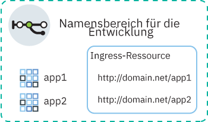
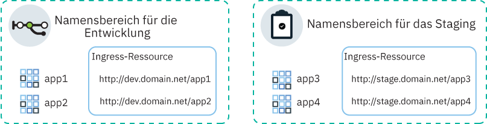
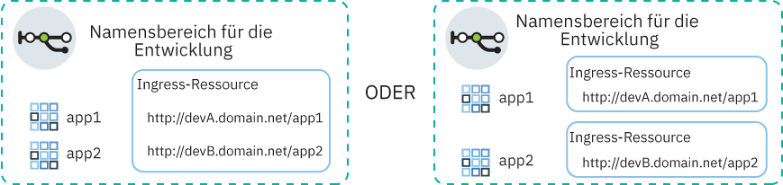

---

copyright:
  years: 2014, 2019
lastupdated: "2019-07-31"

keywords: kubernetes, iks, nginx, ingress controller

subcollection: containers

---

{:new_window: target="_blank"}
{:shortdesc: .shortdesc}
{:screen: .screen}
{:pre: .pre}
{:table: .aria-labeledby="caption"}
{:codeblock: .codeblock}
{:tip: .tip}
{:note: .note}
{:important: .important}
{:deprecated: .deprecated}
{:download: .download}
{:preview: .preview}


# Ingress einrichten
{: #ingress}

Sie können mehrere Apps in Ihrem Kubernetes-Cluster zugänglich machen, indem Sie Ingress-Ressourcen erstellen, die durch eine von IBM bereitgestellte Lastausgleichsfunktion für Anwendungen (ALB) in {{site.data.keyword.containerlong}} verwaltet werden.
{:shortdesc}

## YAML-Beispieldateien
{: #sample_ingress}

Verwenden Sie die folgenden Beispiele für YAML-Dateien, um schnell mit der Angabe Ihrer Ingress-Ressourcen beginnen zu können.
{: shortdesc}

**Ingress-Ressource für das öffentliche Zugänglichmachen einer App**</br>

Haben Sie die folgenden Schritte bereits ausgeführt?
- App bereitstellen
- App-Service erstellen
- Domänennamen und geheimen TLS-Schlüssel auswählen

Sie können den folgenden YAML-Bereitstellungscode zum Erstellen einer Ingress-Ressource verwenden:

```
apiVersion: extensions/v1beta1
kind: Ingress
metadata:
  name: myingressresource
spec:
  tls:
  - hosts:
    - <domäne>
    secretName: <name_des_geheimen_tls-schlüssels>
  rules:
  - host: <domain>
    http:
      paths:
      - path: /<app1-pfad>
        backend:
          serviceName: <app1-service>
          servicePort: 80
      - path: /<app2-pfad>
        backend:
          serviceName: <app2-service>
          servicePort: 80
```
{: codeblock}

</br>

**Ingress-Ressource für das private Zugänglichmachen einer App**</br>

Haben Sie die folgenden Schritte bereits ausgeführt?
- Private Lastausgleichsfunktion für Anwendungen (ALB) aktivieren
- App bereitstellen
- App-Service erstellen
- Angepassten Domänennamen und geheimen TLS-Schlüssel registrieren

Sie können den folgenden YAML-Bereitstellungscode zum Erstellen einer Ingress-Ressource verwenden:

```
apiVersion: extensions/v1beta1
kind: Ingress
metadata:
  name: myingressresource
  annotations:
    ingress.bluemix.net/ALB-ID: "<private_alb-id_1>;<private_alb-id_2>"
spec:
  tls:
  - hosts:
    - <domain>
    secretName: <name_des_geheimen_tls-schlüssels>
  rules:
  - host: <domäne>
    http:
      paths:
      - path: /<app1-pfad>
        backend:
          serviceName: <app1-service>
          servicePort: 80
      - path: /<app2-pfad>
        backend:
          serviceName: <app2-service>
          servicePort: 80
```
{: codeblock}

<br />


## Voraussetzungen
{: #config_prereqs}

Bevor Sie mit der Verwendung mit Ingress beginnen, überprüfen Sie die folgenden Voraussetzungen.
{:shortdesc}

**Voraussetzungen für alle Ingress-Konfigurationen:**
- Ingress ist nur für Standardcluster verfügbar und erfordert mindestens zwei Workerknoten pro Zone, um eine hohe Verfügbarkeit und regelmäßige Aktualisierungen zu gewährleisten. Wenn Sie nur einen Workerknoten in einer Zone haben, kann die ALB keine automatischen Aktualisierungen empfangen. Wenn automatische Aktualisierungen an ALB-Pods übertragen werden, wird der Pod erneut geladen. Allerdings haben ALB-Pods Anti-Affinitätsregeln, um sicherzustellen, dass für die Hochverfügbarkeit nur ein Pod auf jedem Workerknoten geplant wird. Da nur ein ALB-Pod auf einem Workerknoten vorhanden ist, wird der Pod nicht neu gestartet, sodass der Datenverkehr nicht unterbrochen wird. Der ALB-Pod wird nur dann auf die neueste Version aktualisiert, wenn Sie den alten Pod manuell löschen, sodass der neue, aktualisierte Pod geplant werden kann.
- Für die Einrichtung von Ingress sind die folgenden [{{site.data.keyword.cloud_notm}} IAM-Rollen](/docs/containers?topic=containers-users#platform) erforderlich:
    - Plattformrolle **Administrator** für den Cluster
    - Servicerolle **Manager** in allen Namensbereichen

**Voraussetzungen für die Verwendung von Ingress in Mehrzonenclustern**:
 - Wenn Sie den Datenaustausch im Netz auf [Edge-Workerknoten](/docs/containers?topic=containers-edge) beschränken möchten, müssen in jeder Zone mindestens zwei Edge-Workerknoten für die Hochverfügbarkeit von Ingress-Pods aktiviert werden. [Erstellen Sie einen Worker-Pool für Edge-Workerknoten](/docs/containers?topic=containers-add_workers#add_pool), der sich über alle Zonen im Cluster erstreckt und mindestens zwei Workerknoten pro Zone aufweist.
 - Wenn Sie über mehrere VLANs für einen Cluster, mehrere Teilnetze in demselben VLAN oder einen Cluster mit mehreren Zonen verfügen, müssen Sie eine [VRF-Funktion (Virtual Router Function)](/docs/infrastructure/direct-link?topic=direct-link-overview-of-virtual-routing-and-forwarding-vrf-on-ibm-cloud#overview-of-virtual-routing-and-forwarding-vrf-on-ibm-cloud) für Ihr Konto für die IBM Cloud-Infrastruktur aktivieren, damit die Workerknoten über das private Netz miteinander kommunizieren können. Zur Aktivierung von VRF [wenden Sie sich an Ihren Ansprechpartner für die IBM Cloud-Infrastruktur](/docs/infrastructure/direct-link?topic=direct-link-overview-of-virtual-routing-and-forwarding-vrf-on-ibm-cloud#how-you-can-initiate-the-conversion). Zum Prüfen, ob VRF bereits aktiviert ist, verwenden Sie den Befehl `ibmcloud account show`. Wenn Sie VRF nicht aktivieren können oder wollen, aktivieren Sie das [VLAN-Spanning](/docs/infrastructure/vlans?topic=vlans-vlan-spanning#vlan-spanning). Um diese Aktion durchführen zu können, müssen Sie über die [Infrastrukturberechtigung](/docs/containers?topic=containers-users#infra_access) **Netz > VLAN-Spanning im Netz verwalten** verfügen oder Sie können den Kontoeigner bitten, diese zu aktivieren. Zum Prüfen, ob das VLAN-Spanning bereits aktiviert ist, verwenden Sie den [Befehl](/docs/containers?topic=containers-cli-plugin-kubernetes-service-cli#cs_vlan_spanning_get) `ibmcloud ks vlan-spanning-get --region <region>`.
 - Wenn in einer Zone ein Fehler auftritt, kann es zu sporadisch auftretenden Fehlern bei Anforderungen an die Ingress-ALB in dieser Zone kommen.

<br />


## Netzbetrieb für einen einzelnen oder mehrere Namensbereiche planen
{: #multiple_namespaces}

Es ist eine Ingress-Ressource pro Namensbereich erforderlich, in dem sich die zugänglich zu machenden Apps befinden.
{:shortdesc}

### Alle Apps befinden sich in einem Namensbereich
{: #one-ns}

Wenn sich die Apps in Ihrem Cluster alle im selben Namensbereich befinden, ist eine Ingress-Ressource erforderlich, um die Weiterleitungsregeln für die dort zugänglich gemachten Apps zu definieren. Wenn beispielsweise `App1` und `App2` von Services in einem Namensbereich für die Entwicklung zugänglich gemacht werden, können Sie eine Ingress-Ressource in dem Namensbereich erstellen. Die Ressource gibt `domain.net` als Host an und registriert die Pfade, an denen die einzelnen Apps empfangsbereit sind, mit `domain.net`.
{: shortdesc}



### Apps in mehreren Namensbereichen
{: #multi-ns}

Wenn sich die Apps in Ihrem Cluster in unterschiedlichen Namensbereichen befinden, müssen Sie eine Ressource pro Namensbereich erstellen, um Regeln für die dort zugänglich gemachten Apps zu definieren.
{: shortdesc}

Allerdings können Sie nur in einer Ressource einen Hostnamen definieren. Sie können denselben Hostnamen nicht in mehreren Ressourcen definieren. Zum Registrieren mehrerer Ingress-Ressourcen mit demselben Hostnamen müssen Sie eine Platzhalterdomäne verwenden. Wenn eine Platzhalterdomäne wie `*.domain.net` registriert wird, können mehrere Unterdomänen in denselben Host aufgelöst werden. Sie können dann in jedem Namensbereich eine Ingress-Ressource erstellen und in jeder Ingress-Ressource eine andere Unterdomäne angeben.

Nehmen Sie beispielsweise folgendes Szenario an:
* Sie verfügen über zwei Versionen derselben App (`App1` und `App3`) zu Testzwecken.
* Sie stellen die Apps in zwei unterschiedlichen Namensbereichen im selben Cluster bereit: `App1` im Namensbereich für die Entwicklung und `App3` im Namensbereich für das Staging.

Um dieselbe Cluster-ALB zum Verwalten von Datenverkehr für diese Apps zu verwenden, erstellen Sie die folgenden Services und Ressourcen:
* Einen Kubernetes Service im Namensbereich für die Entwicklung zum Bereitstellen von `App1`.
* Eine Ingress-Ressource im Namensbereich für die Entwicklung, die den Host als `dev.domain.net` angibt.
* Einen Kubernetes Service im Namensbereich für das Staging zum Bereitstellen von `App3`.
* Eine Ingress-Ressource im Namensbereich für das Staging, die den Host als `stage.domain.net` angibt.
</br>



Jetzt werden beide URLs für dieselbe Domäne aufgelöst und daher beide von derselben Lastausgleichsfunktion für Anwendungen (ALB) bedient. Da jedoch die Ressource im Namensbereich für das Staging mit der Unterdomäne `stage` registriert ist, leitet die Ingress-Lastausgleichsfunktion für Anwendungen (ALB) Anforderungen ordnungsgemäß von der URL `stage.domain.net/app3` nur an `app3` weiter.

{: #wildcard_tls}
Der von IBM bereitgestellte Platzhalter für die Ingress-Unterdomäne (`*.<cluster_name>.<region>.containers.appdomain.cloud`) wird standardmäßig für Ihren Cluster registriert. Das von IBM bereitgestellte TLS-Zertifikat ist ein Platzhalterzertifikat und kann für die Platzhalterunterdomäne verwendet werden. Wenn Sie eine angepasste Domäne verwenden möchten, müssen Sie diese als eine Platzhalterdomäne, wie `*.custom_domain.net`, registrieren. Um TLS verwenden zu können, müssen Sie ein Platzhalterzertifikat abrufen.
{: note}

### Mehrere Domänen in einem Namensbereich
{: #multi-domains}

In einem einzelnen Namensbereich können Sie über eine Domäne auf alle Apps in dem Namensbereich zugreifen. Wenn Sie für die Apps in einem einzelnen Namensbereich unterschiedliche Domänen verwenden möchten, verwenden Sie eine Platzhalterdomäne. Wenn eine solche Platzhalterdomäne, wie `*.mycluster.us-south.containers.appdomain.cloud`, registriert wird, werden mehrere Unterdomänen für denselben Host aufgelöst. Sie können dann eine Ressource verwenden, um mehrere Unterdomänenhosts in dieser Ressource anzugeben. Alternativ können Sie in dem Namensbereich mehrere Ingress-Ressourcen erstellen und in jeder Ingress-Ressource eine andere Unterdomäne angeben.
{: shortdesc}



Der von IBM bereitgestellte Platzhalter für die Ingress-Unterdomäne (`*.<cluster_name>.<region>.containers.appdomain.cloud`) wird standardmäßig für Ihren Cluster registriert. Das von IBM bereitgestellte TLS-Zertifikat ist ein Platzhalterzertifikat und kann für die Platzhalterunterdomäne verwendet werden. Wenn Sie eine angepasste Domäne verwenden möchten, müssen Sie diese als eine Platzhalterdomäne, wie `*.custom_domain.net`, registrieren. Um TLS verwenden zu können, müssen Sie ein Platzhalterzertifikat abrufen.
{: note}

<br />


## Apps in Ihrem Cluster öffentlich zugänglich machen
{: #ingress_expose_public}

Machen Sie Apps in Ihrem Cluster über die öffentliche Ingress-Lastausgleichsfunktion für Anwendungen (Ingress-ALB) für die Allgemeinheit zugänglich.
{:shortdesc}

Vorbereitende Schritte:

* Überprüfen Sie die [Voraussetzungen](#config_prereqs) für Ingress.
* [Melden Sie sich an Ihrem Konto an. Geben Sie, sofern anwendbar, die richtige Ressourcengruppe als Ziel an. Legen Sie den Kontext für den Cluster fest.](/docs/containers?topic=containers-cs_cli_install#cs_cli_configure)

### Schritt 1: Apps bereitstellen und App-Services erstellen
{: #public_inside_1}

Stellen Sie als Erstes Ihre Apps bereit und erstellen Sie Kubernetes Services und machen Sie diese zugänglich.
{: shortdesc}

1.  [Stellen Sie die App für den Cluster bereit](/docs/containers?topic=containers-app#app_cli). Stellen Sie sicher, dass Sie eine Bezeichnung zu Ihrer Bereitstellung im Metadatenabschnitt Ihrer Konfigurationsdatei hinzufügen, z. B. `app: code`. Diese Bezeichnung ist zur Identifizierung aller Pods erforderlich, in denen Ihre App ausgeführt wird, damit sie in den Ingress-Lastenausgleich aufgenommen werden können.

2.   Erstellen Sie einen Kubernetes Service für jede App, den Sie öffentlich zugänglich machen möchten. Ihre App muss von einem Kubernetes Service verfügbar gemacht werden, um von der Cluster-ALB beim Ingress-Lastausgleich berücksichtigt zu werden.
      1.  Öffnen Sie Ihren bevorzugten Editor und erstellen Sie eine Servicekonfigurationsdatei, beispielsweise `myappservice.yaml`.
      2.  Definieren Sie einen Service für die App, der von der ALB zugänglich gemacht wird.

          ```
          apiVersion: v1
          kind: Service
          metadata:
            name: myappservice
          spec:
            selector:
              <selektorschlüssel>: <selektorwert>
            ports:
             - protocol: TCP
               port: 8080
          ```
          {: codeblock}

          <table>
          <thead>
          <th colspan=2> Erklärung der ALB-Servicedateikomponenten</th>
          </thead>
          <tbody>
          <tr>
          <td><code>selector</code></td>
          <td>Geben Sie das Paar aus Bezeichnungsschlüssel (<em>&lt;selektorschlüssel&gt;</em>) und Wert (<em>&lt;selektorwert&gt;</em>) ein, das Sie für die Ausrichtung auf die Pods, in denen Ihre App ausgeführt wird, verwenden möchten. Um Ihre Pods als Ziel auszuwählen und in den Servicelastausgleich einzubeziehen, müssen Sie sicherstellen, dass der <em>&lt;selektorschlüssel&gt;</em> und der <em>&lt;selektorwert&gt;</em> mit dem Schlüssel/Wert-Paar im Abschnitt <code>spec.template.metadata.labels</code> Ihrer YAML-Bereitstellungsdatei übereinstimmen.</td>
           </tr>
           <tr>
           <td><code>port</code></td>
           <td>Der Port, den der Service überwacht.</td>
           </tr>
           </tbody></table>
      3.  Speichern Sie Ihre Änderungen.
      4.  Erstellen Sie den Service in Ihrem Cluster. Wenn Apps in mehreren Namensbereichen in Ihrem Cluster bereitgestellt werden, stellen Sie sicher, dass der Service im selben Namensbereich bereitgestellt wird wie die App, die Sie zugänglich machen möchten.

          ```
          kubectl apply -f myappservice.yaml [-n <namensbereich>]
          ```
          {: pre}
      5.  Wiederholen Sie diese Schritte für jede App, die Sie zugänglich machen wollen.


### Schritt 2: App-Domäne auswählen
{: #public_inside_2}

Beim Konfigurieren der öffentlichen Lastausgleichsfunktion für Anwendungen wählen Sie die Domäne aus, über die Ihre Apps zugänglich sind.
{: shortdesc}

Sie können die von IBM bereitgestellte Domäne, wie `mycluster-12345.us-south.containers.appdomain.cloud/myapp`, für den Zugriff auf die App über das Internet verwenden. Wenn Sie stattdessen eine angepasste Domäne verwenden möchten, können Sie einen CNAME-Datensatz definieren, um Ihre angepasste Domäne der von IBM bereitgestellten Domäne zuzuordnen oder einen A-Datensatz mit Ihrem DNS-Provider unter Verwendung der öffentlichen IP-Adresse der ALB zu konfigurieren.

**Gehen Sie wie folgt vor, um die von IBM bereitgestellte Ingress-Domäne zu verwenden:**

Rufen Sie die von IBM bereitgestellte Domäne ab. Ersetzen Sie `<clustername_oder_-id>` durch den Namen des Clusters, in dem die App bereitgestellt wurde.
```
ibmcloud ks cluster-get --cluster <clustername_oder_-id> | grep Ingress
```
{: pre}

Beispielausgabe:
```
Ingress Subdomain:      mycluster-12345.us-south.containers.appdomain.cloud
Ingress Secret:         <geheimer_tls-schlüssel>
```
{: screen}

**Gehen Sie wie folgt vor, um eine angepasste Domäne zu verwenden:**
1.    Erstellen Sie eine angepasste Domäne. Arbeiten Sie mit Ihrem DNS-Provider (Domain Name Service) oder [{{site.data.keyword.cloud_notm}}-DNS](/docs/infrastructure/dns?topic=dns-getting-started), um Ihre angepasste Domäne zu registrieren.
      * Wenn sich die Apps, die über Ingress zugänglich gemacht werden sollen, in einem Cluster in unterschiedlichen Namensbereichen befinden, registrieren Sie die angepasste Domäne als Platzhalterdomäne, wie `*.custom_domain.net`.

2.  Konfigurieren Sie Ihre Domäne, um eingehenden Netzverkehr an die von IBM bereitgestellte Lastausgleichsfunktion für Anwendungen (ALB) weiterzuleiten. Wählen Sie zwischen diesen Optionen:
    -   Definieren Sie einen Alias für Ihre angepasste Domäne, indem Sie die von IBM bereitgestellte Domäne als kanonischen Namensdatensatz (CNAME) angeben. Zum Ermitteln der von IBM bereitgestellten Ingress-Domäne führen Sie den Befehl `ibmcloud ks cluster-get --cluster <clustername>` aus. Suchen Sie nach dem Feld für die Ingress-Unterdomäne (**Ingress subdomain**). Die Verwendung eines CNAME wird bevorzugt, weil IBM automatische Zustandsprüfungen für die IBM Unterdomäne ermöglicht und alle fehlgeschlagenen IPs aus der DNS-Antwort entfernt.
    -   Ordnen Sie Ihre angepasste Domäne der portierbaren öffentlichen IP-Adresse der von IBM bereitgestellten Lastausgleichsfunktion für Anwendungen (ALB) zu, indem Sie die IP-Adresse als A-Datensatz hinzufügen. Zur Ermittlung der portierbaren öffentlichen IP-Adresse der ALB führen Sie den Befehl `ibmcloud ks alb-get --albID <öffentliche_alb-id>` aus.

### Schritt 3: TLS-Terminierung auswählen
{: #public_inside_3}

Legen Sie nach der Auswahl der App-Domäne fest, ob die TLS-Terminierung verwendet werden soll.
{: shortdesc}

Die Lastausgleichsfunktion für Anwendungen verteilt die Lasten des HTTP-Netzverkehrs auf die Apps in Ihrem Cluster. Um auch einen Lastausgleich für eingehende HTTPS-Verbindungen durchführen zu können, können Sie die Lastausgleichsfunktion so konfigurieren, dass der Netzverkehr entschlüsselt und die entschlüsselte Anforderung an die Apps weitergeleitet wird, die in Ihrem Cluster zugänglich sind.

* Wenn Sie die von IBM bereitgestellte Ingress-Unterdomäne verwenden, können Sie das von IBM bereitgestellte TLS-Zertifikat verwenden. Von IBM bereitgestellte TLS-Zertifikate sind von LetsEncrypt signiert und werden vollständig von IBM verwaltet. Die Zertifikate laufen alle 90 Tage ab und werden automatisch 37 Tage vor Ablauf der Gültigkeit verlängert. Weitere Informationen zur TLS-Zertifizierung mit Platzhalterzeichen finden Sie in [diesem Hinweis](#wildcard_tls).
* Wenn Sie eine angepasste Domäne verwenden, können Sie Ihr eigenes TLS-Zertifikat zum Verwalten der TLS-Terminierung nutzen. Die ALB prüft zunächst auf einen geheimen Schlüssel in dem Namensbereich, in dem sich die App befindet, dann im Namensbereich `default` und schließlich im Namensbereich `ibm-cert-store`. Wenn nur Apps in einem einzigen Namensbereich vorhanden sind, können Sie einen TLS-Schlüssel für das Zertifikat in diesem Namensbereich importieren oder erstellen. Wenn Sie über Apps in mehreren Namensbereichen verfügen, importieren oder erstellen Sie im Namensbereich `default` einen geheimen TLS-Schlüssel für das Zertifikat, damit die ALB auf das Zertifikat in jedem Namensbereich zugreifen und es verwenden kann. Geben Sie in den Ingress-Ressourcen, die Sie für jeden Namensbereich definieren, den Namen des geheimen Schlüssels an, der sich im Standardnamensbereich befindet. Weitere Informationen zur TLS-Zertifizierung mit Platzhalterzeichen finden Sie in [diesem Hinweis](#wildcard_tls). **Hinweis**: TLS-Zertifikate, die vorab verteilte Schlüssel enthalten (TLS-PSK) werden nicht unterstützt.

**Wenn Sie die von IBM bereitgestellte Ingress-Domäne verwenden:**

Rufen Sie den von IBM bereitgestellten geheimen TLS-Schlüssel für den Cluster ab.
```
ibmcloud ks cluster-get --cluster <clustername_oder_-id> | grep Ingress
```
{: pre}

Beispielausgabe:
```
Ingress Subdomain:      mycluster-12345.us-south.containers.appdomain.cloud
Ingress Secret:         <geheimer_tls-schlüssel>
```
{: screen}
</br>

**Wenn Sie eine angepasste Domäne verwenden:**

Wenn in {{site.data.keyword.cloudcerts_long_notm}} bereits ein TLS-Zertifikat gespeichert ist, das Sie verwenden wollen, können Sie den zugehörigen geheimen Schlüssel in Ihren Cluster importieren, indem Sie den folgenden Befehl ausführen:

```
ibmcloud ks alb-cert-deploy --secret-name <name_des_geheimen_schlüssels> --cluster <clustername_oder_-id> --cert-crn <crn_des_zertifikats>
```
{: pre}

Stellen Sie sicher, dass Sie den geheimen Schlüssel mit einem Namen erstellen, der sich vom Namen des von IBM bereitgestellten geheimen Ingress-Schlüssels unterscheidet. Sie können den Namen des von IBM bereitgestellten geheimen Ingress-Schlüssels mit dem Befehl `ibmcloud ks cluster-get --cluster <clustername_oder_-id> | grep Ingress` abrufen.
{: note}

Wenn Sie ein Zertifikat mit diesem Befehl importieren, wird der geheime Schlüssel für das Zertifikat in einem Namensbereich mit dem Namen `ibm-cert-store` erstellt. Anschließend wird ein Verweis auf diesen geheimen Schlüssel im Namensbereich `default` erstellt, auf den jede Ingress-Ressource in einem beliebigen Namensbereich zugreifen kann. Wenn die ALB Anforderungen verarbeitet, folgt sie diesem Verweis, um den geheimen Schlüssel für das Zertifikat aus dem Namensbereich `ibm-cert-store` abzurufen und zu verwenden.

</br>

Wenn kein TLS-Zertifikat bereitsteht, führen Sie die folgenden Schritte aus:
1. Generieren Sie ein Zertifikat und einen Schlüssel der Zertifizierungsstelle über Ihren Zertifikatsanbieter. Wenn Sie über eine eigene Domäne verfügen, kaufen Sie ein offizielles TLS-Zertifikat für Ihre Domäne. Stellen Sie sicher, dass der [allgemeine Name (CN, Common Name) ](https://support.dnsimple.com/articles/what-is-common-name/) für jedes Zertifikat anders ist.
2. Konvertieren Sie das Zertifikat und den Schlüssel in Base-64.
   1. Verschlüsseln Sie das Zertifikat und den Schlüssel in Base-64 und speichern Sie den mit Base-64 verschlüsselten Wert in einer neuen Datei.
      ```
      openssl base64 -in tls.key -out tls.key.base64
      ```
      {: pre}

   2. Zeigen Sie den mit Base-64 verschlüsselten Wert für das Zertifikat und den Schlüssel an.
      ```
      cat tls.key.base64
      ```
      {: pre}

3. Erstellen Sie anhand des Zertifikats und des Schlüssels eine YAML-Datei für geheime Schlüssel.
     ```
     apiVersion: v1
     kind: Secret
     metadata:
       name: ssl-my-test
     type: Opaque
     data:
       tls.crt: <clientzertifikat>
       tls.key: <clientschlüssel>
     ```
     {: codeblock}

4. Erstellen Sie das Zertifikat als einen geheimen Kubernetes-Schlüssel.
     ```
     kubectl apply -f ssl-my-test
     ```
     {: pre}
     Stellen Sie sicher, dass Sie den geheimen Schlüssel mit einem Namen erstellen, der sich vom Namen des von IBM bereitgestellten geheimen Ingress-Schlüssels unterscheidet. Sie können den Namen des von IBM bereitgestellten geheimen Ingress-Schlüssels mit dem Befehl `ibmcloud ks cluster-get --cluster <clustername_oder_-id> | grep Ingress` abrufen.
     {: note}


### Schritt 4: Ingress-Ressource erstellen
{: #public_inside_4}

Ingress-Ressourcen definieren die Routing-Regeln, mit der die Lastausgleichsfunktion für Anwendungen Datenverkehr an Ihren App-Service weiterleitet.
{: shortdesc}

Wenn der Cluster mehrere Namensbereiche aufweist, in denen Apps zugänglich gemacht werden, ist pro Namensbereich eine Ingress-Ressource erforderlich. Jeder Namensbereich muss jedoch einen anderen Host verwenden. Sie müssen eine Platzhalterdomäne registrieren und in jeder Ressource eine andere Unterdomäne angeben. Weitere Informationen finden Sie in [Netzbetrieb für einen einzelnen oder mehrere Namensbereiche planen](#multiple_namespaces).
{: note}

1. Öffnen Sie Ihren bevorzugten Editor und erstellen Sie eine Ingress-Konfigurationsdatei namens `myingressresource.yaml` (Beispiel).

2. Definieren Sie eine Ingress-Ressource in Ihrer Konfigurationsdatei, die die von IBM bereitgestellte Domäne oder Ihre angepasste Domäne für das Weiterleiten von eingehendem Netzverkehr an die zuvor erstellten Services verwendet.

    YALM-Beispieldatei ohne TLS:
    ```
    apiVersion: extensions/v1beta1
    kind: Ingress
    metadata:
      name: myingressresource
    spec:
      rules:
      - host: <domäne>
        http:
          paths:
          - path: /<app1-pfad>
            backend:
              serviceName: <app1-service>
              servicePort: 80
          - path: /<app2-pfad>
            backend:
              serviceName: <app2-service>
              servicePort: 80
    ```
    {: codeblock}

    YALM-Beispieldatei mit TLS:
    ```
    apiVersion: extensions/v1beta1
    kind: Ingress
    metadata:
      name: myingressresource
    spec:
      tls:
      - hosts:
        - <domäne>
        secretName: <name_des_geheimen_tls-schlüssels>
      rules:
      - host: <domäne>
        http:
          paths:
          - path: /<app1-pfad>
            backend:
              serviceName: <app1-service>
              servicePort: 80
          - path: /<app2-pfad>
            backend:
              serviceName: <app2-service>
              servicePort: 80
    ```
    {: codeblock}

    <table>
    <thead>
    <th colspan=2> Erklärung der YAML-Dateikomponenten</th>
    </thead>
    <tbody>
    <tr>
    <td><code>tls.hosts</code></td>
    <td>Um TLS zu verwenden, ersetzen Sie <em>&lt;domäne&gt;</em> durch die von IBM bereitgestellte Ingress-Unterdomäne oder Ihre angepasste Domäne.

    </br></br>
    <strong>Hinweis:</strong><ul><li>Wenn die Apps von Services in einem Cluster in unterschiedlichen Namensbereichen zugänglich gemacht werden, hängen Sie eine Platzhalter-Unterdomäne, wie `subdomain1.custom_domain.net` oder `subdomain1.mycluster.us-south.containers.appdomain.cloud`, an die Domäne an. Verwenden Sie für jede Ressource, die Sie im Cluster erstellen, eine eindeutige Unterdomäne.</li><li>Verwenden Sie keine Sternchen (&ast;) für Ihren Host oder lassen Sie die Hosteigenschaft leer, um Fehler während der Ingress-Erstellung zu vermeiden.</li></ul></td>
    </tr>
    <tr>
    <td><code>tls.secretName</code></td>
    <td><ul><li>Wenn Sie die von IBM bereitgestellte Ingress-Domäne verwenden, ersetzen Sie <em>&lt;name_des_geheimen_tls-schlüssels&gt;</em> durch den Namen des von IBM bereitgestellten geheimen Ingress-Schlüssels.</li><li>Wenn Sie eine angepasste Domäne verwenden, ersetzen Sie <em>&lt;name_des_geheimen_tls-schlüssels&gt;</em> durch den geheimen Schlüssel, den Sie zuvor erstellt haben und der Ihr angepasstes TLS-Zertifikat sowie den Schlüssel enthält. Wenn Sie ein Zertifikat aus {{site.data.keyword.cloudcerts_short}} importiert haben, können Sie den Befehl <code>ibmcloud ks alb-cert-get --cluster <clustername_oder_-id> --cert-crn <crn_des_zertifikats></code> ausführen, um die geheimen Schlüssel anzuzeigen, die einem TLS-Zertifikat zugeordnet sind.</li><ul><td>
    </tr>
    <tr>
    <td><code>host</code></td>
    <td>Ersetzen Sie <em>&lt;domäne&gt;</em> durch die von IBM bereitgestellte Ingress-Unterdomäne oder Ihre angepasste Domäne.

    </br></br>
    <strong>Hinweis:</strong><ul><li>Wenn die Apps von Services in einem Cluster in unterschiedlichen Namensbereichen zugänglich gemacht werden, hängen Sie eine Platzhalter-Unterdomäne, wie `subdomain1.custom_domain.net` oder `subdomain1.mycluster.us-south.containers.appdomain.cloud`, an die Domäne an. Verwenden Sie für jede Ressource, die Sie im Cluster erstellen, eine eindeutige Unterdomäne.</li><li>Verwenden Sie keine Sternchen (&ast;) für Ihren Host oder lassen Sie die Hosteigenschaft leer, um Fehler während der Ingress-Erstellung zu vermeiden.</li></ul></td>
    </tr>
    <tr>
    <td><code>path</code></td>
    <td>Ersetzen Sie <em>&lt;app-pfad&gt;</em> durch einen Schrägstrich oder den Pfad, den Ihre App überwacht. Der Pfad wird an die von IBM bereitstellte Domäne oder Ihre angepasste Domäne angehängt, um eine eindeutige Route zu Ihrer App zu erstellen. Wenn Sie diese Route in einen Web-Browser eingeben, wird der Netzverkehr an die Lastausgleichsfunktion für Anwendungen (ALB) weitergeleitet. Die Lastausgleichsfunktion für Anwendungen (ALB) sucht nach dem zugehörigen Service und sendet Netzverkehr an ihn. Daraufhin leitet der Service den Datenverkehr an die Pods weiter, in denen die App ausgeführt wird.
    </br></br>
    Die meisten Apps überwachen keinen bestimmten Pfad, sondern verwenden den Rootpfad und einen bestimmten Port. In diesem Fall definieren Sie den Rootpfad als <code>/</code> und geben keinen individuellen Pfad für Ihre App an. Beispiel: <ul><li>Geben Sie für <code>http://domain/</code> als Pfad <code>/</code> ein.</li><li>Geben Sie für <code>http://domain/app1-pfad</code> als Pfad <code>/app1-pfad</code> ein.</li></ul>
    </br>
    <strong>Tipp:</strong> Um Ingress für die Überwachung eines Pfads zu konfigurieren, der von dem Pfad abweicht, den Ihre App überwacht, können Sie die [Annotation zum erneuten Schreiben (rewrite)](/docs/containers?topic=containers-ingress_annotation#rewrite-path) verwenden.</td>
    </tr>
    <tr>
    <td><code>serviceName</code></td>
    <td>Ersetzen Sie <em>&lt;app1-service&gt;</em> und <em>&lt;app2-service&gt;</em> usw. durch die entsprechenden Namen der Services, die Sie erstellt haben, um die Apps zugänglich zu machen. Wenn die Apps von Services im Cluster in unterschiedlichen Namensbereichen zugänglich gemacht werden, schließen Sie nur App-Services ein, die sich im selben Namensbereich befinden. Sie müssen für jeden Namensbereich, in denen Apps zugänglich gemacht werden sollen, eine Ingress-Ressource erstellen.</td>
    </tr>
    <tr>
    <td><code>servicePort</code></td>
    <td>Der Port, den Ihr Service überwacht. Verwenden Sie denselben Port, die Sie beim Erstellen des Kubernetes Service für Ihre App definiert haben.</td>
    </tr>
    </tbody></table>

3.  Erstellen Sie die Ingress-Ressource für Ihr Cluster. Stellen Sie sicher, dass die Ressource im selben Namensbereich wie die App-Services bereitgestellt wird, die in der Ressource angegeben wurden.

    ```
    kubectl apply -f myingressresource.yaml -n <namensbereich>
    ```
    {: pre}
4.   Überprüfen Sie, dass die Ingress-Ressource erfolgreich erstellt wurde.

      ```
      kubectl describe ingress myingressresource
      ```
      {: pre}

      1. Wenn Nachrichten im Ereignis einen Fehler in Ihrer Ressourcenkonfiguration beschreiben, ändern Sie die Werte in Ihrer Ressourcendatei und wenden Sie die Datei für die Ressource erneut an.


Die Ingress-Ressource wird im selben Namensbereich wie die App-Services erstellt. Die Apps in diesem Namensbereich werden für die Ingress-Lastausgleichsfunktion für Anwendungen des Clusters registriert.

### Schritt 5: Über das Internet auf die App zugreifen
{: #public_inside_5}

Geben Sie in einem Web-Browser die URL des App-Service an, auf den zugegriffen werden soll.
{: shortdesc}

```
https://<domäne>/<app1-pfad>
```
{: codeblock}

Wenn Sie mehrere Apps zugänglich gemacht haben, greifen Sie auf diese Apps zu, indem Sie den an die URL angehängten Pfad ändern.

```
https://<domain>/<app2-pfad>
```
{: codeblock}

Wenn Sie Apps in verschiedenen Namensbereichen über eine Platzhalterdomäne zugänglich machen, greifen Sie auf diese Apps mit deren eigenen Unterdomänen zu.

```
http://<unterdomäne1>.<domäne>/<app1-pfad>
```
{: codeblock}

```
http://<unterdomäne2>.<domäne>/<app1-pfad>
```
{: codeblock}


Haben Sie Schwierigkeiten, über Ingress eine Verbindung zu Ihrer App herzustellen? Versuchen Sie, [Ingress zu debuggen](/docs/containers?topic=containers-cs_troubleshoot_debug_ingress).
{: tip}

<br />


## Apps außerhalb des Clusters öffentlich zugänglich machen
{: #external_endpoint}

Machen Sie Apps außerhalb Ihres Clusters öffentlich zugänglich, indem Sie sie in den öffentlichen Lastausgleich der Ingress-ALB einschließen. Eingehende öffentliche Anforderungen an die von IBM bereitgestellte oder Ihre angepasste Domäne werden automatisch an die externe App weitergeleitet.
{: shortdesc}

Vorbereitende Schritte:

* Überprüfen Sie die [Voraussetzungen](#config_prereqs) für Ingress.
* Stellen Sie sicher, dass auf die externe App, die Sie beim Lastausgleich des Clusters berücksichtigen möchten, über eine öffentliche IP-Adresse zugegriffen werden kann.
* [Melden Sie sich an Ihrem Konto an. Geben Sie, sofern anwendbar, die richtige Ressourcengruppe als Ziel an. Legen Sie den Kontext für den Cluster fest.](/docs/containers?topic=containers-cs_cli_install#cs_cli_configure)

Gehen Sie wie folgt vor, um Apps außerhalb Ihres Clusters öffentlich zugänglich zu machen:

1.  Erstellen Sie einen Kubernetes Service für Ihren Cluster, der eingehende Anforderungen an einen von Ihnen erstellten externen Endpunkt weiterleitet.
    1.  Öffnen Sie Ihren bevorzugten Editor und erstellen Sie eine Servicekonfigurationsdatei namens `myexternalservice.yaml` (Beispiel).
    2.  Definieren Sie einen Service für die App, der von der ALB zugänglich gemacht wird.

        ```
        apiVersion: v1
        kind: Service
        metadata:
          name: myexternalservice
        spec:
          ports:
           - protocol: TCP
             port: 8080
        ```
        {: codeblock}

        <table>
        <caption>Erklärung der ALB-Servicedateikomponenten</caption>
        <thead>
        <th colspan=2> Erklärung der YAML-Dateikomponenten</th>
        </thead>
        <tbody>
        <tr>
        <td><code>metadata.name</code></td>
        <td>Ersetzen Sie <em><code>&lt;mein_externer_service&gt;</code></em> durch den Namen Ihres Service.<p>Erfahren Sie mehr über das [Sichern der persönlichen Daten](/docs/containers?topic=containers-security#pi) bei der Arbeit mit Kubernetes-Ressourcen.</p></td>
        </tr>
        <tr>
        <td><code>port</code></td>
        <td>Der Port, den der Service überwacht.</td>
        </tr></tbody></table>

    3.  Speichern Sie Ihre Änderungen.
    4.  Erstellen Sie den Kubernetes Service für Ihren Cluster.

        ```
        kubectl apply -f myexternalservice.yaml
        ```
        {: pre}
2.  Konfigurieren Sie einen Kubernetes-Endpunkt, der den externen Standort der App definiert, die Sie beim Lastausgleich des Clusters berücksichtigen möchten.
    1.  Öffnen Sie Ihren bevorzugten Editor und erstellen Sie eine Endpunktkonfigurationsdatei namens `myexternalendpoint.yaml` (Beispiel).
    2.  Definieren Sie Ihren externen Endpunkt. Schließen Sie alle öffentlichen IP-Adressen und Ports ein, über die Sie auf Ihre externen App zugreifen können.

        ```
        kind: Endpoints
        apiVersion: v1
        metadata:
          name: myexternalservice
        subsets:
          - addresses:
              - ip: <externe_ip1>
              - ip: <externe_ip2>
            ports:
              - port: <externer_port>
        ```
        {: codeblock}

        <table>
        <thead>
        <th colspan=2> Erklärung der YAML-Dateikomponenten</th>
        </thead>
        <tbody>
        <tr>
        <td><code>name</code></td>
        <td>Ersetzen Sie <em><code>&lt;myexternalendpoint&gt;</code></em> durch den Namen des Kubernetes Service, den Sie zuvor erstellt haben.</td>
        </tr>
        <tr>
        <td><code>ip</code></td>
        <td>Ersetzen Sie <em>&lt;externe_IP&gt;</em> durch die öffentlichen IP-Adressen für die Verbindung mit Ihrer externen App.</td>
         </tr>
         <td><code>port</code></td>
         <td>Ersetzen Sie <em>&lt;externer_port&gt;</em> durch den Port, den Ihre externe App überwacht.</td>
         </tbody></table>

    3.  Speichern Sie Ihre Änderungen.
    4.  Erstellen Sie den Kubernetes-Endpunkt für Ihren Cluster.

        ```
        kubectl apply -f myexternalendpoint.yaml
        ```
        {: pre}

3. Fahren Sie mit den Schritten unter "Apps in Ihrem Cluster öffentlich zugänglich machen" fort, [Schritt 2: App-Domäne auswählen](#public_inside_2).

<br />


## Apps in einem privaten Netz zugänglich machen
{: #ingress_expose_private}

Machen Sie Apps über die private Ingress-ALB für ein privates Netz zugänglich.
{:shortdesc}

Zur Verwendung einer privaten ALB müssen Sie zunächst die private ALB aktivieren. Da Clustern mit nur privaten VLANs keine von IBM bereitgestellte Ingress-Unterdomäne zugeordnet wird, wird beim Cluster-Setup kein geheimer Ingress-Schlüssel erstellt. Wenn Sie Ihre Apps für das private Netz zugänglich machen wollen, müssen Sie Ihre ALB mit einer angepassten Domäne registrieren und, optional, Ihr eigenes TLS-Zertifikat importieren.

Vorbereitende Schritte:
* Überprüfen Sie die [Voraussetzungen](#config_prereqs) für Ingress.
* Überprüfen Sie die Optionen für die Planung des privaten Zugriffs auf Apps, wenn die Workerknoten mit [einem öffentlichen und einem privaten VLAN](/docs/containers?topic=containers-cs_network_planning#private_both_vlans) oder [nur einem privaten VLAN](/docs/containers?topic=containers-cs_network_planning#plan_private_vlan) verbunden sind.
    * Wenn Ihre Workerknoten nur mit einem privaten VLAN verbunden sind, müssen Sie einen [DNS-Service konfigurieren, der im privaten Netz verfügbar ist ](https://kubernetes.io/docs/tasks/administer-cluster/dns-custom-nameservers/).

### Schritt 1: Apps bereitstellen und App-Services erstellen
{: #private_1}

Stellen Sie als Erstes Ihre Apps bereit und erstellen Sie Kubernetes Services und machen Sie diese zugänglich.
{: shortdesc}

1.  [Stellen Sie die App für den Cluster bereit](/docs/containers?topic=containers-app#app_cli). Stellen Sie sicher, dass Sie eine Bezeichnung zu Ihrer Bereitstellung im Metadatenabschnitt Ihrer Konfigurationsdatei hinzufügen, z. B. `app: code`. Diese Bezeichnung ist zur Identifizierung aller Pods erforderlich, in denen Ihre App ausgeführt wird, damit sie in den Ingress-Lastenausgleich aufgenommen werden können.

2.   Erstellen Sie einen Kubernetes Service für jede App, den Sie öffentlich zugänglich machen möchten. Ihre App muss von einem Kubernetes Service verfügbar gemacht werden, um von der Cluster-ALB beim Ingress-Lastausgleich berücksichtigt zu werden.
      1.  Öffnen Sie Ihren bevorzugten Editor und erstellen Sie eine Servicekonfigurationsdatei, beispielsweise `myappservice.yaml`.
      2.  Definieren Sie einen Service für die App, der von der ALB zugänglich gemacht wird.

          ```
          apiVersion: v1
          kind: Service
          metadata:
            name: myappservice
          spec:
            selector:
              <selektorschlüssel>: <selektorwert>
            ports:
             - protocol: TCP
               port: 8080
          ```
          {: codeblock}

          <table>
          <thead>
          <th colspan=2> Erklärung der ALB-Servicedateikomponenten</th>
          </thead>
          <tbody>
          <tr>
          <td><code>selector</code></td>
          <td>Geben Sie das Paar aus Bezeichnungsschlüssel (<em>&lt;selektorschlüssel&gt;</em>) und Wert (<em>&lt;selektorwert&gt;</em>) ein, das Sie für die Ausrichtung auf die Pods, in denen Ihre App ausgeführt wird, verwenden möchten. Um Ihre Pods als Ziel auszuwählen und in den Servicelastausgleich einzubeziehen, müssen Sie sicherstellen, dass der <em>&lt;selektorschlüssel&gt;</em> und der <em>&lt;selektorwert&gt;</em> mit dem Schlüssel/Wert-Paar im Abschnitt <code>spec.template.metadata.labels</code> Ihrer YAML-Bereitstellungsdatei übereinstimmen.</td>
           </tr>
           <tr>
           <td><code>port</code></td>
           <td>Der Port, den der Service überwacht.</td>
           </tr>
           </tbody></table>
      3.  Speichern Sie Ihre Änderungen.
      4.  Erstellen Sie den Service in Ihrem Cluster. Wenn Apps in mehreren Namensbereichen in Ihrem Cluster bereitgestellt werden, stellen Sie sicher, dass der Service im selben Namensbereich bereitgestellt wird wie die App, die Sie zugänglich machen möchten.

          ```
          kubectl apply -f myappservice.yaml [-n <namensbereich>]
          ```
          {: pre}
      5.  Wiederholen Sie diese Schritte für jede App, die Sie zugänglich machen wollen.


### Schritt 2: Private Standardlastausgleichsfunktion für Anwendungen (Standard-ALB) aktivieren
{: #private_ingress}

Wenn Sie einen Standardcluster erstellen, wird in jeder Zone mit Workerknoten eine von IBM bereitgestellte private Lastausgleichsfunktion für Anwendungen (ALB) erstellt, der eine portierbare öffentliche IP-Adresse und eine private Route zugewiesen ist. Die private Standard-ALB in jeder Zone wird jedoch nicht automatisch aktiviert. Um mit der privaten Standard-ALB privaten Netzverkehr auf Ihre Apps zu verteilen, müssen Sie sie zunächst entweder mit der von IBM bereitgestellten, portierbaren privaten IP-Adresse oder mit Ihrer eigenen portierbaren privaten IP-Adresse aktivieren.
{:shortdesc}

Wenn Sie beim Erstellen des Clusters das Flag `--no-subnet` verwendet haben, müssen Sie ein portierbares privates Teilnetz oder ein durch einen Benutzer verwaltetes Teilnetz hinzufügen, bevor Sie die private Lastausgleichsfunktion für Anwendungen (ALB) aktivieren können. Weitere Informationen finden Sie im Abschnitt [Weitere Teilnetze für Ihren Cluster anfordern](/docs/containers?topic=containers-subnets#request).
{: note}

**Gehen Sie wie folgt vor, um eine private Standard-ALB mit der zuvor zugewiesenen, durch IBM bereitgestellten portierbaren privaten IP-Adresse zu aktivieren:**

1. Rufen Sie die ID der privaten Standard-ALB ab, die Sie aktivieren möchten. Ersetzen Sie <em>&lt;clustername&gt;</em> durch den Namen des Clusters, in dem die App, die Sie zugänglich machen möchten, bereitgestellt wird.

    ```
    ibmcloud ks albs --cluster <clustername>
    ```
    {: pre}

    Das Feld **Status** für private ALBs ist inaktiviert (_disabled_).
    ```
    ALB ID                                            Enabled   Status     Type      ALB IP          Zone    Build                          ALB VLAN ID
    private-crdf253b6025d64944ab99ed63bb4567b6-alb1   false     disabled   private   -               dal10   ingress:411/ingress-auth:315   2234947
    public-crdf253b6025d64944ab99ed63bb4567b6-alb1    true      enabled    public    169.xx.xxx.xxx  dal10   ingress:411/ingress-auth:315   2234945
    ```
    {: screen}
    In Mehrzonenclustern gibt das nummerierte Suffix in der ALB-ID die Reihenfolge an, in der die ALB hinzugefügt wurde.
    * Das Suffix `-alb1` bei der ALB ` private-cr6d779503319d419aa3b4ab171d12c3b8-alb1 ` gibt beispielsweise an, dass es sich um die erste private Standard-ALB handelt, die erstellt wurde. Sie ist in der Zone vorhanden, in der Sie den Cluster erstellt haben. Im vorherigen Beispiel wurde der Cluster in `dal10` erstellt.
    * Das Suffix `-alb2` bei der ALB ` private-cr6d779503319d419aa3b4ab171d12c3b8-alb1 ` gibt an, dass es sich um die zweite private Standard-ALB handelt, die erstellt wurde. Sie ist in der zweiten Zone vorhanden, die Sie Ihrem Cluster hinzugefügt haben. Im vorherigen Beispiel ist die zweite Zone `dal12`.

2. Aktivieren Sie die private ALB. Ersetzen Sie <em>&lt;private_ALB-ID&gt;</em> durch die ID für die private ALB aus der Ausgabe im vorherigen Schritt.

   ```
   ibmcloud ks alb-configure --albID <private_alb-id> --enable
   ```
   {: pre}

3. **Mehrzonencluster**: Wiederholen Sie für hohe Verfügbarkeit die zuvor genannten Schritte für die private ALB in jeder Zone.

<br>
**Gehen Sie wie folgt vor, um die private Lastausgleichsfunktion für Anwendungen (ALB) mit Ihrer eigenen portierbaren privaten IP-Adresse zu aktivieren:**

1. Listen Sie die verfügbaren ALBs in Ihrem Cluster auf. Beachten Sie die ID einer privaten ALB und die Zone, in der sich die ALB befindet.

 ```
 ibmcloud ks albs --cluster <clustername>
 ```
 {: pre}

 Das Feld **Status** für die private ALB ist inaktiviert (_disabled_).
 ```
 ALB ID                                            Enabled   Status     Type      ALB IP          Zone    Build                          ALB VLAN ID
    private-crdf253b6025d64944ab99ed63bb4567b6-alb1   false     disabled   private   -               dal10   ingress:411/ingress-auth:315   2234947
    public-crdf253b6025d64944ab99ed63bb4567b6-alb1    true      enabled    public    169.xx.xxx.xxx  dal10   ingress:411/ingress-auth:315   2234945
 ```
 {: screen}

 2. Konfigurieren Sie das vom Benutzer verwaltete Teilnetz der gewünschten IP-Adresse so, dass Datenverkehr über das private VLAN in dieser Zone geleitet wird.

   ```
   ibmcloud ks cluster-user-subnet-add --cluster <clustername> --subnet-cidr <teilnetz-CIDR> --private-vlan <privates_VLAN>
   ```
   {: pre}

   <table>
   <thead>
   <th colspan=2> Erklärung der Befehlskomponenten</th>
   </thead>
   <tbody>
   <tr>
   <td><code>&lt;clustername&gt;</code></td>
   <td>Der Name oder die ID des Clusters, auf dem die App, die zugänglich gemacht werden soll, bereitgestellt wird.</td>
   </tr>
   <tr>
   <td><code>&lt;teilnetz-cidr&gt;</code></td>
   <td>Das CIDR des benutzerverwalteten Teilnetzes.</td>
   </tr>
   <tr>
   <td><code>&lt;private_vlan-id&gt;</code></td>
   <td>Die ID des privaten VLAN. Dieser Wert ist erforderlich. Die ID muss sich auf ein privates VLAN in derselben Zone wie die private ALB beziehen. Um private VLANs für diese Zone anzuzeigen, in der sich Workerknoten befinden, führen Sie `ibmcloud ks workers --cluster <cluster_name_or_ID>` aus und beachten Sie die ID eines Workerknotens in dieser Zone. Führen Sie unter Verwendung der Workerknoten-ID `ibmcloud ks worker-get --worker <worker_id> --cluster <cluster_name_or_id>` aus. Beachten Sie in der Ausgabe die ID **Private VLAN**.</td>
   </tr>
   </tbody></table>

3. Aktivieren Sie die private ALB. Ersetzen Sie <em>&lt;private_ALB-ID&gt;</em> durch die ID für die private Lastausgleichsfunktion für Anwendungen (ALB) und <em>&lt;benutzer-ip&gt;</em> durch die IP-Adresse des durch den Benutzer verwalteten Teilnetzes, das Sie verwenden möchten.
   ```
   ibmcloud ks alb-configure --albID <private_alb-id> --enable --user-ip <benutzer-ip>
   ```
   {: pre}

4. **Mehrzonencluster**: Wiederholen Sie für hohe Verfügbarkeit die zuvor genannten Schritte für die private ALB in jeder Zone.

### Schritt 3: Angepasste Domäne zuordnen
{: #private_3}

Clustern mit nur privaten VLANs wird keine von IBM bereitgestellte Unterdomäne zugeordnet. Wenn Sie die private ALB konfigurieren, machen Sie Ihre Apps über eine angepasste Domäne zugänglich.
{: shortdesc}

**Cluster nur mit privaten VLANs:**

1. Wenn Ihre Workerknoten nur mit einem privaten VLAN verbunden sind, müssen Sie einen eigenen [DNS-Service konfigurieren, der in Ihrem privaten Netz verfügbar ist ](https://kubernetes.io/docs/tasks/administer-cluster/dns-custom-nameservers/).
2. Erstellen Sie eine angepasste Domäne über Ihren DNS-Provider. Wenn sich die Apps, die über Ingress zugänglich gemacht werden sollen, in einem Cluster in unterschiedlichen Namensbereichen befinden, registrieren Sie die angepasste Domäne als Platzhalterdomäne, wie zum Beispiel: *.custom_domain.net.
3. Orden Sie mithilfe des privaten DNS-Service Ihre angepasste Domäne den portierbaren privaten IP-Adressen der ALBs zu, indem Sie die IP-Adressen als A-Datensätze hinzufügen. Zur Ermittlung der portierbaren privaten IP-Adressen der ALBs führen Sie den Befehl `ibmcloud ks alb-get --albID <private_alb-id>` für jede ALB aus.

**Cluster mit privaten und öffentlichen VLANs:**

1.    Erstellen Sie eine angepasste Domäne. Arbeiten Sie mit Ihrem DNS-Provider (Domain Name Service) oder [{{site.data.keyword.cloud_notm}}-DNS](/docs/infrastructure/dns?topic=dns-getting-started), um Ihre angepasste Domäne zu registrieren.
      * Wenn sich die Apps, die über Ingress zugänglich gemacht werden sollen, in einem Cluster in unterschiedlichen Namensbereichen befinden, registrieren Sie die angepasste Domäne als Platzhalterdomäne, wie `*.custom_domain.net`.

2.  Ordnen Sie Ihre angepasste Domäne den portierbaren privaten IP-Adressen der ALBs zu, indem Sie die IP-Adressen als A-Datensatz hinzufügen. Zur Ermittlung der portierbaren privaten IP-Adressen der ALBs führen Sie den Befehl `ibmcloud ks alb-get --albID <private_alb-id>` für jede ALB aus.

### Schritt 4: TLS-Terminierung auswählen
{: #private_4}

Legen Sie nach der Zuordnung der angepassten Domäne fest, ob die TLS-Terminierung verwendet werden soll.
{: shortdesc}

Die Lastausgleichsfunktion für Anwendungen verteilt die Lasten des HTTP-Netzverkehrs auf die Apps in Ihrem Cluster. Um auch einen Lastausgleich für eingehende HTTPS-Verbindungen durchführen zu können, können Sie die Lastausgleichsfunktion so konfigurieren, dass der Netzverkehr entschlüsselt und die entschlüsselte Anforderung an die Apps weitergeleitet wird, die in Ihrem Cluster zugänglich sind.

Da Clustern mit nur privaten VLANs keine von IBM bereitgestellte Ingress-Domäne zugeordnet wird, wird beim Cluster-Setup kein geheimer Ingress-Schlüssel erstellt. Sie können Ihr eigenes TLS-Zertifikat verwenden, um die TLS-Terminierung zu verwalten.  Die ALB prüft zunächst auf einen geheimen Schlüssel in dem Namensbereich, in dem sich die App befindet, dann im Namensbereich `default` und schließlich im Namensbereich `ibm-cert-store`. Wenn nur Apps in einem einzigen Namensbereich vorhanden sind, können Sie einen TLS-Schlüssel für das Zertifikat in diesem Namensbereich importieren oder erstellen. Wenn Sie über Apps in mehreren Namensbereichen verfügen, importieren oder erstellen Sie im Namensbereich `default` einen geheimen TLS-Schlüssel für das Zertifikat, damit die ALB auf das Zertifikat in jedem Namensbereich zugreifen und es verwenden kann. Geben Sie in den Ingress-Ressourcen, die Sie für jeden Namensbereich definieren, den Namen des geheimen Schlüssels an, der sich im Standardnamensbereich befindet. Weitere Informationen zur TLS-Zertifizierung mit Platzhalterzeichen finden Sie in [diesem Hinweis](#wildcard_tls). **Hinweis**: TLS-Zertifikate, die vorab verteilte Schlüssel enthalten (TLS-PSK) werden nicht unterstützt.

Wenn in {{site.data.keyword.cloudcerts_long_notm}} bereits ein TLS-Zertifikat gespeichert ist, das Sie verwenden wollen, können Sie den zugehörigen geheimen Schlüssel in Ihren Cluster importieren, indem Sie den folgenden Befehl ausführen:

```
ibmcloud ks alb-cert-deploy --secret-name <name_des_geheimen_schlüssels> --cluster <clustername_oder_-id> --cert-crn <crn_des_zertifikats>
```
{: pre}

Wenn Sie ein Zertifikat mit diesem Befehl importieren, wird der geheime Schlüssel für das Zertifikat in einem Namensbereich mit dem Namen `ibm-cert-store` erstellt. Anschließend wird ein Verweis auf diesen geheimen Schlüssel im Namensbereich `default` erstellt, auf den jede Ingress-Ressource in einem beliebigen Namensbereich zugreifen kann. Wenn die ALB Anforderungen verarbeitet, folgt sie diesem Verweis, um den geheimen Schlüssel für das Zertifikat aus dem Namensbereich `ibm-cert-store` abzurufen und zu verwenden.

### Schritt 5: Ingress-Ressource erstellen
{: #private_5}

Ingress-Ressourcen definieren die Routing-Regeln, mit der die Lastausgleichsfunktion für Anwendungen Datenverkehr an Ihren App-Service weiterleitet.
{: shortdesc}

Wenn der Cluster mehrere Namensbereiche aufweist, in denen Apps zugänglich gemacht werden, ist pro Namensbereich eine Ingress-Ressource erforderlich. Jeder Namensbereich muss jedoch einen anderen Host verwenden. Sie müssen eine Platzhalterdomäne registrieren und in jeder Ressource eine andere Unterdomäne angeben. Weitere Informationen finden Sie in [Netzbetrieb für einen einzelnen oder mehrere Namensbereiche planen](#multiple_namespaces).
{: note}

1. Öffnen Sie Ihren bevorzugten Editor und erstellen Sie eine Ingress-Konfigurationsdatei namens `myingressresource.yaml` (Beispiel).

2.  Definieren Sie eine Ingress-Ressource in Ihrer Konfigurationsdatei, die die angepasste Domäne für das Weiterleiten von eingehendem Netzverkehr an die zuvor erstellten Services verwendet.

    YALM-Beispieldatei ohne TLS:
    ```
    apiVersion: extensions/v1beta1
    kind: Ingress
    metadata:
      name: myingressresource
      annotations:
        ingress.bluemix.net/ALB-ID: "<private_alb-id_1>;<private_alb-id_2>"
    spec:
      rules:
      - host: <domäne>
        http:
          paths:
          - path: /<app1-pfad>
            backend:
              serviceName: <app1-service>
              servicePort: 80
          - path: /<app2-pfad>
            backend:
              serviceName: <app2-service>
              servicePort: 80
    ```
    {: codeblock}

    YALM-Beispieldatei mit TLS:
    ```
    apiVersion: extensions/v1beta1
    kind: Ingress
    metadata:
      name: myingressresource
      annotations:
        ingress.bluemix.net/ALB-ID: "<private_alb-id_1>;<private_alb-id_2>"
    spec:
      tls:
      - hosts:
        - <domäne>
        secretName: <name_des_geheimen_tls-schlüssels>
      rules:
      - host: <domäne>
        http:
          paths:
          - path: /<app1-pfad>
            backend:
              serviceName: <app1-service>
              servicePort: 80
          - path: /<app2-pfad>
            backend:
              serviceName: <app2-service>
              servicePort: 80
    ```
    {: codeblock}

    <table>
    <thead>
    <th colspan=2> Erklärung der YAML-Dateikomponenten</th>
    </thead>
    <tbody>
    <tr>
    <td><code>ingress.bluemix.net/ALB-ID</code></td>
    <td>Ersetzen Sie <em>&lt;private_ALB-ID&gt;</em> durch die ID für Ihre private Lastausgleichsfunktion für Anwendungen (ALB). Wenn Sie einen Mehrzonencluster haben und mehrere private ALBs aktiviert haben, schließen Sie die ID jeder ALB ein. Führen Sie den Befehl <code>ibmcloud ks albs --cluster <mein_cluster></code> aus, um nach den ALB-IDs zu suchen. Weitere Informationen zu dieser Ingress-Annotation finden Sie unter [Weiterleitung mit einer privaten Lastausgleichsfunktion für Anwendungen](/docs/containers?topic=containers-ingress_annotation#alb-id).</td>
    </tr>
    <tr>
    <td><code>tls.hosts</code></td>
    <td>Um TLS zu verwenden, ersetzen Sie <em>&lt;domain&gt;</em> durch Ihre angepasste Domäne.</br></br><strong>Hinweis:</strong><ul><li>Wenn die Apps von Services in einem Cluster in unterschiedlichen Namensbereichen zugänglich gemacht werden, hängen Sie eine Platzhalter-Unterdomäne, wie `subdomain1.custom_domain.net`, an die Domäne an. Verwenden Sie für jede Ressource, die Sie im Cluster erstellen, eine eindeutige Unterdomäne.</li><li>Verwenden Sie keine Sternchen (&ast;) für Ihren Host oder lassen Sie die Hosteigenschaft leer, um Fehler während der Ingress-Erstellung zu vermeiden.</li></ul></td>
    </tr>
    <tr>
    <td><code>tls.secretName</code></td>
    <td>Ersetzen Sie <em>&lt;geheimer_tls-schlüssel&gt;</em> durch den Namen des zuvor erstellten geheimen Schlüssels, der Ihr angepasstes TLS-Zertifikat sowie den Schlüssel enthält. Wenn Sie ein Zertifikat aus {{site.data.keyword.cloudcerts_short}} importiert haben, können Sie den Befehl <code>ibmcloud ks alb-cert-get --cluster <clustername_oder_-id> --cert-crn <crn_des_zertifikats></code> ausführen, um die geheimen Schlüssel anzuzeigen, die einem TLS-Zertifikat zugeordnet sind.
    </tr>
    <tr>
    <td><code>host</code></td>
    <td>Ersetzen Sie <em>&lt;domain&gt;</em> durch Ihre angepasste Domäne.
    </br></br>
    <strong>Hinweis:</strong><ul><li>Wenn die Apps von Services in einem Cluster in unterschiedlichen Namensbereichen zugänglich gemacht werden, hängen Sie eine Platzhalter-Unterdomäne, wie `subdomain1.custom_domain.net`, an die Domäne an. Verwenden Sie für jede Ressource, die Sie im Cluster erstellen, eine eindeutige Unterdomäne.</li><li>Verwenden Sie keine Sternchen (&ast;) für Ihren Host oder lassen Sie die Hosteigenschaft leer, um Fehler während der Ingress-Erstellung zu vermeiden.</li></ul></td>
    </td>
    </tr>
    <tr>
    <td><code>path</code></td>
    <td>Ersetzen Sie <em>&lt;app-pfad&gt;</em> durch einen Schrägstrich oder den Pfad, den Ihre App überwacht. Der Pfad wird an Ihre angepasste Domäne angehängt, um eine eindeutige Route zu Ihrer App zu erstellen. Wenn Sie diese Route in einen Web-Browser eingeben, wird der Netzverkehr an die Lastausgleichsfunktion für Anwendungen (ALB) weitergeleitet. Die Lastausgleichsfunktion für Anwendungen (ALB) sucht nach dem zugehörigen Service und sendet Netzverkehr an ihn. Daraufhin leitet der Service den Datenverkehr an die Pods weiter, in denen die App ausgeführt wird.
    </br></br>
    Die meisten Apps überwachen keinen bestimmten Pfad, sondern verwenden den Rootpfad und einen bestimmten Port. In diesem Fall definieren Sie den Rootpfad als <code>/</code> und geben keinen individuellen Pfad für Ihre App an. Beispiel: <ul><li>Geben Sie für <code>http://domain/</code> als Pfad <code>/</code> ein.</li><li>Geben Sie für <code>http://domain/app1-pfad</code> als Pfad <code>/app1-pfad</code> ein.</li></ul>
    </br>
    <strong>Tipp:</strong> Um Ingress für die Überwachung eines Pfads zu konfigurieren, der von dem Pfad abweicht, den Ihre App überwacht, können Sie die [Annotation zum erneuten Schreiben (rewrite)](/docs/containers?topic=containers-ingress_annotation#rewrite-path) verwenden.</td>
    </tr>
    <tr>
    <td><code>serviceName</code></td>
    <td>Ersetzen Sie <em>&lt;app1-service&gt;</em> und <em>&lt;app2-service&gt;</em> usw. durch die entsprechenden Namen der Services, die Sie erstellt haben, um die Apps zugänglich zu machen. Wenn die Apps von Services im Cluster in unterschiedlichen Namensbereichen zugänglich gemacht werden, schließen Sie nur App-Services ein, die sich im selben Namensbereich befinden. Sie müssen für jeden Namensbereich, in denen Apps zugänglich gemacht werden sollen, eine Ingress-Ressource erstellen.</td>
    </tr>
    <tr>
    <td><code>servicePort</code></td>
    <td>Der Port, den Ihr Service überwacht. Verwenden Sie denselben Port, die Sie beim Erstellen des Kubernetes Service für Ihre App definiert haben.</td>
    </tr>
    </tbody></table>

3.  Erstellen Sie die Ingress-Ressource für Ihr Cluster. Stellen Sie sicher, dass die Ressource im selben Namensbereich wie die App-Services bereitgestellt wird, die in der Ressource angegeben wurden.

    ```
    kubectl apply -f myingressresource.yaml -n <namensbereich>
    ```
    {: pre}
4.   Überprüfen Sie, dass die Ingress-Ressource erfolgreich erstellt wurde.

      ```
      kubectl describe ingress myingressresource
      ```
      {: pre}

      1. Wenn Nachrichten im Ereignis einen Fehler in Ihrer Ressourcenkonfiguration beschreiben, ändern Sie die Werte in Ihrer Ressourcendatei und wenden Sie die Datei für die Ressource erneut an.


Die Ingress-Ressource wird im selben Namensbereich wie die App-Services erstellt. Die Apps in diesem Namensbereich werden für die Ingress-Lastausgleichsfunktion für Anwendungen des Clusters registriert.

### Schritt 6: Über das private Netz auf die App zugreifen
{: #private_6}

1. Bevor Sie auf Ihre App zugreifen können, stellen Sie sicher, dass Sie auf einen DNS-Service zugreifen können.
  * Öffentliches und privates VLAN: Um den externen Standard-DNS-Provider verwenden zu können, müssen Sie [Edge-Knoten mit öffentlichem Zugriff konfigurieren](/docs/containers?topic=containers-edge#edge) und eine [Virtual Router Appliance konfigurieren ](https://www.ibm.com/blogs/bluemix/2017/07/kubernetes-and-bluemix-container-based-workloads-part4/).
  * Nur privates VLAN: Sie müssen einen [DNS-Service konfigurieren, der im privaten Netz verfügbar ist ](https://kubernetes.io/docs/tasks/administer-cluster/dns-custom-nameservers/).

2. Geben Sie von Ihrer privaten Netzfirewall aus die URL des App-Service in einem Web-Browser ein.

```
https://<domäne>/<app1-pfad>
```
{: codeblock}

Wenn Sie mehrere Apps zugänglich gemacht haben, greifen Sie auf diese Apps zu, indem Sie den an die URL angehängten Pfad ändern.

```
https://<domain>/<app2-pfad>
```
{: codeblock}

Wenn Sie Apps in verschiedenen Namensbereichen über eine Platzhalterdomäne zugänglich machen, greifen Sie auf diese Apps mit deren eigenen Unterdomänen zu.

```
http://<unterdomäne1>.<domäne>/<app1-pfad>
```
{: codeblock}

```
http://<unterdomäne2>.<domäne>/<app1-pfad>
```
{: codeblock}


Lesen Sie [diesen Blogbeitrag ](https://medium.com/ibm-cloud/secure-microservice-to-microservice-communication-across-kubernetes-clusters-using-a-private-ecbe2a8d4fe2) mit einem umfassenden Lernprogramm zur Vorgehensweise für das Schützen von Microservice-to-Microservice-Kommunikation mithilfe der privaten ALB mit TLS über Ihre Cluster hinweg.
{: tip}
