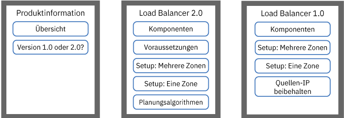

---

copyright:
  years: 2014, 2019
lastupdated: "2019-03-21"

keywords: kubernetes, iks, lb2.0, nlb

subcollection: containers

---

{:new_window: target="_blank"}
{:shortdesc: .shortdesc}
{:screen: .screen}
{:pre: .pre}
{:table: .aria-labeledby="caption"}
{:codeblock: .codeblock}
{:tip: .tip}
{:note: .note}
{:important: .important}
{:deprecated: .deprecated}
{:download: .download}


# Apps mit Lastausgleichsfunktionen zugänglich machen
{: #loadbalancer}

Machen Sie einen Port zugänglich und verwenden Sie eine portierbare IP-Adresse für die Layer 4-Lastausgleichsfunktion (Load Balancer), um auf eine containerisierte App zuzugreifen.
{:shortdesc}

Lastausgleichsservices sind nur für Standardcluster verfügbar und unterstützen keine TLS-Terminierung. Wenn für Ihre App eine TLS-Terminierung erforderlich ist, können Sie die App mithilfe von [Ingress](/docs/containers?topic=containers-ingress) bereitstellen oder für die Verwaltung der TLS-Terminierung konfigurieren.
{: note}

Wählen Sie für den Einstieg eine der folgenden Optionen aus:



<map name="image-map-1">
    <area target="" alt="Übersicht" title="Übersicht" href="#lb_overview" coords="35,44,175,72" shape="rect">
    <area target="" alt="Vergleich der Lastausgleichsfunktionen der Version 1.0 und der Version 2.0" title="Vergleich der Lastausgleichsfunktionen der Version 1.0 und der Version 2.0" href="#comparison" coords="34,83,173,108" shape="rect">
    <area target="" alt="v2.0: Komponenten und Architektur (Beta)" title="v2.0: Komponenten und Architektur (Beta)" href="#planning_ipvs" coords="273,45,420,72" shape="rect">
    <area target="" alt="v2.0: Voraussetzungen" title="v2.0: Voraussetzungen" href="#ipvs_provision" coords="277,85,417,108" shape="rect">
    <area target="" alt="v2.0: Lastausgleichsfunktion der Version 2.0 in einem Mehrzonencluster konfigurieren" title="v2.0: Lastausgleichsfunktion der Version 2.0 in einem Mehrzonencluster konfigurieren" href="#ipvs_multi_zone_config" coords="276,122,417,147" shape="rect">
    <area target="" alt="v2.0: Lastausgleichsfunktion der Version 2.0 in einem Einzelzonencluster konfigurieren" title="v2.0: Lastausgleichsfunktion der Version 2.0 in einem Einzelzonencluster konfigurieren" href="#ipvs_single_zone_config" coords="277,156,419,184" shape="rect">
    <area target="" alt="v2.0: Planungsalgorithmen" title="v2.0: Planungsalgorithmen" href="#scheduling" coords="276,196,419,220" shape="rect">
    <area target="" alt="v1.0: Komponenten und Architektur" title="v1.0: Komponenten und Architektur" href="#v1_planning" coords="519,47,668,74" shape="rect">
    <area target="" alt="v1.0: Lastausgleichsfunktion der Version 1.0 in einem Mehrzonencluster konfigurieren" title="v1.0: Lastausgleichsfunktion der Version 1.0 in einem Mehrzonencluster konfigurieren" href="#multi_zone_config" coords="520,85,667,110" shape="rect">
    <area target="" alt="v1.0: Lastausgleichsfunktion der Version 1.0 in einem Einzelzonencluster konfigurieren" title="v1.0: Lastausgleichsfunktion der Version 1.0 in einem Einzelzonencluster konfigurieren" href="#lb_config" coords="520,122,667,146" shape="rect">
    <area target="" alt="v1.0: Beibehaltung von Quellen-IP-Adressen aktivieren" title="v1.0: Beibehaltung von Quellen-IP-Adressen aktivieren" href="#node_affinity_tolerations" coords="519,157,667,194" shape="rect">
</map>


## YAML-Beispieldateien
{: #sample}

Schauen Sie sich die folgenden YAML-Beispieldateien an, um sich schnell mit der Angabe Ihres Lastausgleichsservice vertraut zu machen.
{: shortdesc}

**Load Balancer 2.0**</br>

Haben Sie die [Voraussetzungen für eine Lastausgleichsfunktion der Version 2.0](#ipvs_provision) erfüllt? Sie können die folgende YAML-Bereitstellungsdatei zum Erstellen einer Lastausgleichsfunktion der Version 2.0 verwenden:

```
apiVersion: v1
kind: Service
metadata:
  name: myloadbalancer
  annotations:
    service.kubernetes.io/ibm-load-balancer-cloud-provider-ip-type: <public_oder_private>
    service.kubernetes.io/ibm-load-balancer-cloud-provider-zone: "<zone>"
    service.kubernetes.io/ibm-load-balancer-cloud-provider-vlan: "<vlan-id>"
    service.kubernetes.io/ibm-load-balancer-cloud-provider-enable-features: "ipvs"
    service.kubernetes.io/ibm-load-balancer-cloud-provider-scheduler: "<algorithmus>"
spec:
  type: LoadBalancer
  selector:
    <selektorschlüssel>: <selektorwert>
  ports:
   - protocol: TCP
     port: 8080
  loadBalancerIP: <ip-adresse>
  externalTrafficPolicy: Local
```
{: codeblock}

**Load Balancer 1.0**</br>

Verwenden Sie die folgende YAML-Bereitstellungsdatei zum Erstellen einer Lastausgleichsfunktion der Version 1.0:

```
apiVersion: v1
kind: Service
metadata:
 name: myloadbalancer
 annotations:
   service.kubernetes.io/ibm-load-balancer-cloud-provider-ip-type: <public_oder_private>
   service.kubernetes.io/ibm-load-balancer-cloud-provider-zone: "<zone>"
   service.kubernetes.io/ibm-load-balancer-cloud-provider-vlan: "<vlan-id>"
spec:
 type: LoadBalancer
 selector:
   <selektorschlüssel>: <selektorwert>
 ports:
  - protocol: TCP
    port: 8080
 loadBalancerIP: <ip-adresse>
```
{: codeblock}

<br />


## Übersicht
{: #lb_overview}

Wenn Sie einen Standardcluster erstellen, stellt {{site.data.keyword.containerlong}} automatisch ein portierbares öffentliches Teilnetz und ein portierbares privates Teilnetz bereit.
{: shortdesc}

* Das portierbare öffentliche Teilnetz stellt fünf verwendbare IP-Adressen bereit. Eine portierbare öffentliche IP-Adresse wird von der [öffentlichen Ingress-Standard-ALB](/docs/containers?topic=containers-ingress) verwendet. Die restlichen vier portierbaren öffentlichen IP-Adressen können verwendet werden, um einzelne Apps dem Internet zugänglich zu machen, indem öffentliche Services für die Lastausgleichsfunktion erstellt werden.
* Das portierbare private Teilnetz stellt fünf verwendbare IP-Adressen bereit. Eine portierbare private IP-Adresse wird von der [privaten Ingress-Standard-ALB](/docs/containers?topic=containers-ingress#private_ingress) verwendet. Die restlichen vier portierbaren privaten IP-Adressen können verwendet werden, um einzelne Apps einem privaten Netz zugänglich zu machen, indem private Services für die Lastausgleichsfunktion erstellt werden.

Portierbare öffentliche und private IP-Adressen sind statische variable IPs und ändern sich nicht, wenn ein Workerknoten entfernt wird. Wenn der Workerknoten, auf dem sich die IP-Adresse der Lastausgleichsfunktion befindet, entfernt wird, wird die IP-Adresse von einem Keepalive-Dämon, der die IP kontinuierlich überwacht, automatisch in einen anderen Workerknoten verschoben. Sie können Ihrer Lastausgleichsfunktion jeden beliebigen Port zuweisen. Der Lastausgleichsservice fungiert als externer Einstiegspunkt für eingehende Anforderungen an die App. Wenn Sie vom Internet aus auf den Lastausgleichsservice zugreifen möchten, können Sie die öffentliche IP-Adresse der Lastausgleichsfunktion in Verbindung mit der zugewiesenen Portnummer im Format `<ip-adresse>:<port>` verwenden.

Wenn Sie eine App mithilfe eines Lastausgleichsservice zugänglich machen, wird Ihre App automatisch auch über die NodePorts des Service bereitgestellt. Auf [Knotenports (NodePorts)](/docs/containers?topic=containers-nodeport) kann über jede öffentliche und private IP-Adresse jedes Workerknotens innerhalb des Clusters zugegriffen werden. Informationen zum Blockieren des Datenverkehrs an Knotenports während der Verwendung eines Lastausgleichsservice finden Sie im Abschnitt [Eingehenden Datenverkehr an Lastausgleichsservice oder NodePort-Service steuern](/docs/containers?topic=containers-network_policies#block_ingress).

<br />


## Vergleich der Lastausgleichsfunktionen der Version 1.0 und der Version 2.0
{: #comparison}

Wenn Sie eine Lastausgleichsfunktion erstellen, haben Sie die Wahl zwischen einer Lastausgleichsfunktion der Version 1.0 und einer Lastausgleichsfunktion der Version 2.0. Beachten Sie, dass die Version 2.0 der Lastausgleichsfunktion eine Betaversion ist.
{: shortdesc}

**Inwiefern ähneln sich Lastausgleichsfunktionen der Versionen 1.0 und 2.0?**

Lastausgleichsfunktionen (Load Balancer) der Versionen 1.0 und 2.0 sind beides Layer 4-Lastausgleichsfunktionen, die nur im Linux-Kernelbereich aktiv sein können. Beide Versionen werden innerhalb des Clusters ausgeführt und verwenden Ressourcen von Workerknoten. Deshalb ist die verfügbare Kapazität der Lastausgleichsfunktionen immer Ihrem eigenen Cluster zugeordnet. Darüber hinaus beenden beide Versionen von Lastausgleichsfunktionen nicht die Verbindung. Stattdessen leiten sie Verbindungen an einen App-Pod weiter.

**Inwiefern unterscheiden sich Lastausgleichsfunktionen der Versionen 1.0 und 2.0?**

Wenn ein Client eine Anforderung an Ihre App sendet, leitet die Lastausgleichsfunktion Anforderungspakete an die IP-Adresse des Workerknotens weiter, auf dem ein App-Pod vorhanden ist. Load Balancer 1.0 verwendet NAT (Network Address Translation, Netzadressumsetzung), um die Quellen-IP-Adresse des Anforderungspakets in die IP des Workerknotens umzuschreiben, auf dem ein Lastausgleichsfunktions-POD vorhanden ist. Wenn der Workerknoten das App-Antwortpaket zurückgibt, wird die IP des Workerknotens, auf dem die Lastausgleichsfunktion vorhanden ist, verwendet. Die Lastausgleichsfunktion muss dann das Antwortpaket an den Client senden. Um zu verhindern, dass die IP-Adresse neu geschrieben wird, können Sie die [Beibehaltung der Quellen-IP aktivieren](#node_affinity_tolerations). Die Beibehaltung der Quellen-IP erfordert jedoch, dass Lastausgleichsfunktions-Pods und App-Pods auf demselben Worker ausgeführt werden, sodass die Anforderung nicht an einen anderen Worker weitergeleitet werden muss. Sie müssen Knotenaffinität und -tolerierungen zu App-Pods hinzufügen.

Im Gegensatz zu den Lastausgleichsfunktionen der Version 1.0 verwenden die Lastausgleichsfunktionen der Version 2.0 NAT nicht, wenn Anforderungen an App-Pods an andere Worker weitergeleitet werden. Wenn eine Lastausgleichsfunktion der Version 2.0 eine Clientanforderung weiterleitet, verwendet sie IP über IP (IPIP), um das ursprüngliche Anforderungspaket in ein anderes, neues Paket einzubinden. Dieses einbindende IPIP-Paket hat eine Quellen-IP des Workerknotens, auf dem sich der Lastausgleichsfunktions-Pod befindet. Dadurch kann das ursprüngliche Anforderungspaket die Client-IP-Adresse als Quellen-IP-Adresse beibehalten. Der Workerknoten verwendet dann DSR (Direct Server Return), um das App-Antwortpaket an die Client-IP zu senden. Das Antwortpaket überspringt die Lastausgleichsfunktion und wird direkt an den Client gesendet, wodurch der Umfang des Datenverkehrs reduziert wird, den die Lastausgleichsfunktion verarbeiten muss.

<br />


## v2.0: Komponenten und Architektur (Beta)
{: #planning_ipvs}

Load Balancer 2.0-Funktionen gibt es in der Betaversion. Um Load Balancer 2.0 zu verwenden, müssen Sie [die Master- oder Workerknoten Ihres Clusters auf die Kubernetes-Version 1.12 oder höher aktualisieren](/docs/containers?topic=containers-update).
{: note}

Load Balancer Version 2.0 ist eine Layer 4-Lastausgleichsfunktion, die den IPVS (IP Virtual Server) des Linux-Kernels verwendet. Load Balancer 2.0 unterstützt TCP und UDP, wird vor mehreren Workerknoten ausgeführt und verwendet IPIP-Tunneling (IP über IP), um Datenverkehr zu verteilen, der über eine einzelne Adresse der Lastausgleichsfunktion für alle diese Workerknoten eingeht.

Wünschen Sie weitere Details zu den Bereitstellungsmustern für Lastausgleich, die in {{site.data.keyword.containerlong_notm}} verfügbar sind? Schauen Sie sich diesen [Blogeintrag ](https://www.ibm.com/blogs/bluemix/2018/10/ibm-cloud-kubernetes-service-deployment-patterns-for-maximizing-throughput-and-availability/) an.
{: tip}

### Datenfluss in einem Einzelzonencluster
{: #ipvs_single}

Das folgende Diagramm veranschaulicht, wie eine Lastausgleichsfunktion der Version 2.0 die Kommunikation vom Internet an eine App in einem Einzelzonencluster leitet.
{: shortdesc}


1. Eine Clientanforderung an Ihre App verwendet die öffentliche IP-Adresse der Lastausgleichsfunktion und den zugeordneten Port auf dem Workerknoten. In diesem Beispiel hat die Lastausgleichsfunktion die virtuelle IP-Adresse '169.61.23.130', die sich derzeit auf dem Worker 10.73.14.25 befindet.

2. Die Lastausgleichsfunktion kapselt das Clientanforderungspaket (im Bild als "CR" gekennzeichnet) in ein IPIP-Paket (gekennzeichnet als "IPIP") ein. Das Clientanforderungspaket behält die Client-IP als Quellen-IP-Adresse bei. Das einschließende IPIP-Paket verwendet die IP des Workers 10.73.14.25 als Quellen-IP-Adresse.

3. Die Lastausgleichsfunktion leitet das IPIP-Paket an einen Worker weiter, auf dem sich ein App-Pod befindet, 10.73.14.26. Wenn mehrere App-Instanzen im Cluster bereitgestellt werden, leitet die Lastausgleichsfunktion die Anforderungen zwischen den Workern weiter, auf denen App-Pods bereitgestellt sind.

4. Worker 10.73.14.26 entpackt das einschließende IPIP-Paket und dann das Clientanforderungspaket. Das Clientanforderungspaket wird an den App-Pod auf diesem Workerknoten weitergeleitet.

5. Worker 10.73.14.26 verwendet dann die Quellen-IP-Adresse aus dem ursprünglichen Anforderungspaket, die Client-IP, um das Antwortpaket des App-Pods direkt an den Client zurückzugeben.

### Datenfluss in einem Mehrzonencluster
{: #ipvs_multi}

Der Datenfluss durch ein Mehrzonencluster folgt demselben Pfad wie [Datenverkehr durch ein Einzelzonencluster](#ipvs_single). In einem Mehrzonencluster leitet die Lastausgleichsfunktion Anforderungen an die App-Instanzen in ihrer eigenen Zone und an App-Instanzen in anderen Zonen weiter. Das folgende Diagramm veranschaulicht, wie Lastausgleichsfunktionen der Version 2.0 in den einzelnen Zonen Datenverkehr vom Internet an eine App in einem Mehrzonencluster weiterleiten.
{: shortdesc}


Standardmäßig ist jede Lastausgleichsfunktion der Version 2.0 nur in einer Zone konfiguriert. Sie können eine hohe Verfügbarkeit erreichen, indem Sie eine Lastausgleichsfunktion der Version 2.0 in jeder Zone bereitstellen, in der sich App-Instanzen befinden.

<br />


## v2.0: Voraussetzungen
{: #ipvs_provision}

Sie können eine vorhandene Lastausgleichsfunktion der Version 1.0 nicht auf eine Lastausgleichsfunktion der Version 2.0 aktualisieren. Sie müssen eine neue Lastausgleichsfunktion mit der Version 2.0 erstellen. Beachten Sie, dass Sie Lastausgleichsfunktionen der Version 1.0 und 2.0 gleichzeitig in einem Cluster ausführen können.
{: shortdesc}

Bevor Sie eine Lastausgleichsfunktion der Version 2.0 erstellen, müssen Sie die folgenden vorausgesetzten Schritte ausführen.

1. [Aktualisieren Sie die Master- und Workerknoten Ihres Clusters](/docs/containers?topic=containers-update) auf Kubernetes Version 1.12 oder höher.

2. Damit Ihre Lastausgleichsfunktion der Version 2.0 Anforderungen an App-Pods in mehreren Zonen weiterleiten kann, öffnen Sie einen Supportfall, um eine Konfigurationseinstellung für Ihre VLANs anzufordern. **Wichtig**: Sie müssen diese Konfiguration für alle öffentlichen VLANs anfordern. Wenn Sie ein neues zugeordnetes VLAN anfordern, müssen Sie ein weiteres Ticket für dieses VLAN öffnen.
    1. Melden Sie sich bei der [{{site.data.keyword.Bluemix_notm}}-Konsole](https://cloud.ibm.com/) an.
    2. Klicken Sie in der Menüleiste auf **Support**, klicken Sie auf die Registerkarte **Fälle verwalten** und klicken Sie auf **Neuen Fall erstellen**.
    3. Geben Sie in die Fallfelder die folgenden Informationen ein:
       * Wählen Sie für den Typ von Support die Option **Technisch** aus.
       * Wählen Sie für die Kategorie die Option **VLAN Spanning** aus.
       * Geben Sie den Betreff **Frage zu öffentlichem VLAN-Netz** ein.
    4. Fügen Sie die folgenden Informationen zur Beschreibung hinzu: "Konfigurieren Sie das Netz bitte so, dass eine Kapazitätsaggregation in den öffentlichen VLANs, die diesem Konto zugeordnet sind, zulässig ist. Das Referenzticket für diese Anforderung lautet: https://control.softlayer.com/support/tickets/63859145".
    5. Klicken Sie auf **Übergeben**.

3. Wenn das VLAN-Spanning inaktiviert ist, aktivieren Sie das [VLAN-Spanning](/docs/infrastructure/vlans?topic=vlans-vlan-spanning#vlan-spanning) für Ihr Konto der IBM Cloud-Infrastruktur (SoftLayer). Wenn VLAN-Spanning aktiviert ist, kann die Lastausgleichsfunktion der Version 2.0 Pakete an verschiedene Teilnetze im Konto weiterleiten. Sie können ermitteln, ob das VLAN-Spanning aktiviert ist, indem Sie den Befehl `ibmcloud ks vlan-spanning-get` ausführen.

4. Wenn Sie [Calico-Netzrichtlinien des Typs Pre-DNAT](/docs/containers?topic=containers-network_policies#block_ingress) verwenden, um Datenverkehr an die IP-Adresse einer Lastausgleichsfunktion der Version 2.0 zu verwalten, müssen Sie im Abschnitt `spec` der Richtlinien die Felder `applyOnForward: true` und `doNotTrack: true` hinzufügen und das Feld `preDNAT: true` entfernen. `applyOnForward: true` stellt sicher, dass die Calico-Richtlinie beim Einschließen und Weiterleiten auf den Datenverkehr angewendet wird. `doNotTrack: true` stellt sicher, dass die Workerknoten DSR verwenden können, um ein Antwortpaket direkt an den Client zurückzugeben, ohne dass die Verbindung verfolgt werden muss. Wenn Sie beispielsweise eine Calico-Richtlinie verwenden, um Datenverkehr von nur einer spezifischen IP-Adresse an die IP-Adresse Ihrer Lastausgleichsfunktion in eine Whitelist zu schreiben, sieht die Richtlinie wie folgt aus:
    ```
    apiVersion: projectcalico.org/v3
    kind: GlobalNetworkPolicy
    metadata:
      name: whitelist
    spec:
      applyOnForward: true
      doNotTrack: true
      ingress:
      - action: Allow
        destination:
          nets:
          - <ip_der_lastausgleichsfunktion>/32
          ports:
          - 80
        protocol: TCP
        source:
          nets:
          - <clientadresse>/32
      selector: ibm.role=='worker_public'
      order: 500
      types:
      - Ingress
    ```
    {: screen}

Jetzt können Sie die Schritte unter [Lastausgleichsfunktion der Version 2.0 in einem Mehrzonencluster konfigurieren](#ipvs_multi_zone_config) oder [Lastausgleichsfunktion der Version 2.0 in einem Einzelzonencluster konfigurieren](#ipvs_single_zone_config) ausführen.

<br />


## v2.0: Lastausgleichsfunktion der Version 2.0 in einem Mehrzonencluster konfigurieren
{: #ipvs_multi_zone_config}

**Vorbereitende Schritte**:

* **Wichtig**: Erfüllen Sie die [Voraussetzungen für die Lastausgleichsfunktion der Version 2.0](#ipvs_provision).
* Um öffentliche Lastausgleichsfunktionen in mehreren Zonen zu erstellen, muss mindestens ein öffentliches VLAN portierbare Teilnetze aufweisen, die in jeder Zone verfügbar sind. Um private Lastausgleichsfunktionen in mehreren Zonen zu erstellen, muss mindestens ein privates VLAN portierbare Teilnetze aufweisen, die in jeder Zone verfügbar sind. Sie können Teilnetze hinzufügen, indem Sie die Schritte im Abschnitt [Teilnetze für Cluster konfigurieren](/docs/containers?topic=containers-subnets) ausführen.
* Wenn Sie den Datenaustausch im Netz auf Edge-Workerknoten beschränken, müssen Sie sicherstellen, dass in jeder Zone mindestens zwei [Edge-Workerknoten](/docs/containers?topic=containers-edge#edge) aktiviert sind, sodass Lastausgleichsfunktionen gleichmäßig bereitgestellt werden können.
* Stellen Sie sicher, dass Sie die [{{site.data.keyword.Bluemix_notm}} IAM-Servicerolle **Schreibberechtigter** oder **Manager**](/docs/containers?topic=containers-users#platform) für den Namensbereich `default` innehaben.


Gehen Sie wie folgt vor, um eine Lastausgleichsfunktion in einem Mehrzonencluster einzurichten:
1.  [Stellen Sie die App für den Cluster bereit](/docs/containers?topic=containers-app#app_cli). Stellen Sie sicher, dass Sie zur Bereitstellung im Metadatenabschnitt der Konfigurationsdatei eine Bezeichnung hinzufügen. Diese Bezeichnung ist zur Identifizierung aller Pods erforderlich, in denen Ihre App ausgeführt wird, damit sie in den Lastenausgleich aufgenommen werden können.

2.  Erstellen Sie einen Lastausgleichsservice für die App, die Sie über das öffentliche Internet oder ein privates Netz zugänglich machen wollen.
  1. Erstellen Sie eine Servicekonfigurationsdatei namens `myloadbalancer.yaml` (Beispiel).
  2. Definieren Sie einen Lastausgleichsservice für die App, die Sie zugänglich machen möchten. Sie können eine Zone, ein VLAN und eine IP-Adresse angeben.

      ```
      apiVersion: v1
      kind: Service
      metadata:
        name: myloadbalancer
        annotations:
          service.kubernetes.io/ibm-load-balancer-cloud-provider-ip-type: <public_oder_private>
          service.kubernetes.io/ibm-load-balancer-cloud-provider-zone: "<zone>"
          service.kubernetes.io/ibm-load-balancer-cloud-provider-vlan: "<vlan-id>"
          service.kubernetes.io/ibm-load-balancer-cloud-provider-enable-features: "ipvs"
          service.kubernetes.io/ibm-load-balancer-cloud-provider-scheduler: "<algorithmus>"
      spec:
        type: LoadBalancer
        selector:
          <selektorschlüssel>: <selektorwert>
        ports:
         - protocol: TCP
           port: 8080
        loadBalancerIP: <ip-adresse>
        externalTrafficPolicy: Local
      ```
      {: codeblock}

      <table>
      <caption>Erklärung der Komponenten der YAML-Datei</caption>
      <thead>
      <th colspan=2> Erklärung der YAML-Dateikomponenten</th>
      </thead>
      <tbody>
      <tr>
        <td><code>service.kubernetes.io/ibm-load-balancer-cloud-provider-ip-type:</code>
        <td>Annotation zum Angeben des Typs einer Lastausgleichsfunktion: <code>private</code> oder <code>public</code>.</td>
      </tr>
      <tr>
        <td><code>service.kubernetes.io/ibm-load-balancer-cloud-provider-zone:</code>
        <td>Annotation zum Angeben der Zone, in der der Lastausgleichsservice bereitgestellt wird. Um Zonen anzuzeigen, führen Sie den Befehl <code>ibmcloud ks zones</code> aus.</td>
      </tr>
      <tr>
        <td>`service.kubernetes.io/ibm-load-balancer-cloud-provider-vlan:`
        <td>Annotation zum Angeben eines VLAN, in dem der Lastausgleichsservice bereitgestellt wird. Um VLANs anzuzeigen, führen Sie <code>ibmcloud ks vlans --zone <zone></code> aus.</td>
      </tr>
      <tr>
        <td><code>service.kubernetes.io/ibm-load-balancer-cloud-provider-enable-features: "ipvs"</code>
        <td>Annotation zum Angeben einer Lastausgleichsfunktion der Version 2.0.</td>
      </tr>
      <tr>
        <td><code>service.kubernetes.io/ibm-load-balancer-cloud-provider-scheduler:</code>
        <td>Optional: Annotation zum Angeben eines Planungsalgorithmus. Akzeptierte Werte sind <code>"rr"</code> für Round Robin (Standard) oder <code>"sh"</code> für Source Hashing. Weitere Informationen finden Sie unter [v2.0: Planungsalgorithmen](#scheduling).</td>
      </tr>
      <tr>
        <td><code>selector</code></td>
        <td>Der Bezeichnungsschlüssel (<em>&lt;selektorschlüssel&gt;</em>) und der Wert (<em>&lt;selektorwert&gt;</em>), den Sie im Abschnitt <code>spec.template.metadata.labels</code> der YAML-Bereitstellungsdatei für Ihre App verwendet haben.</td>
      </tr>
      <tr>
        <td><code>port</code></td>
        <td>Der Port, den der Service überwacht.</td>
      </tr>
      <tr>
        <td><code>loadBalancerIP</code></td>
        <td>Optional: Um eine private Lastausgleichsfunktion zu erstellen oder um eine bestimmte portierbare IP-Adresse für eine öffentliche Lastausgleichsfunktion zu verwenden, geben Sie die IP-Adresse an, die Sie verwenden wollen. Die IP-Adresse muss sich in der Zone und dem VLAN befinden, die Sie in den Annotationen angeben. Wenn Sie keine IP-Adresse angeben, geschieht Folgendes:<ul><li>Wenn sich Ihr Cluster in einem öffentlichen VLAN befindet, dann wird eine portierbare öffentliche IP-Adresse verwendet. Die meisten Cluster befinden sich in einem öffentlichen VLAN.</li><li>Wenn sich Ihr Cluster nur in einem privaten VLAN befindet, wird eine portierbare private IP-Adresse verwendet.</li></ul></td>
      </tr>
      <tr>
        <td><code>externalTrafficPolicy: Local</code></td>
        <td>Setzen Sie diesen Wert auf <code>Local</code>.</td>
      </tr>
      </tbody></table>

      Beispielkonfigurationsdatei zum Erstellen eines Lastausgleichsservice 2.0 in `dal12`, die den Round Robin-Planungsalgorithmus verwendet.

      ```
      apiVersion: v1
      kind: Service
      metadata:
        name: myloadbalancer
        annotations:
          service.kubernetes.io/ibm-load-balancer-cloud-provider-zone: "dal12"
          service.kubernetes.io/ibm-load-balancer-cloud-provider-enable-features: "ipvs"
          service.kubernetes.io/ibm-load-balancer-cloud-provider-scheduler: "rr"
      spec:
        type: LoadBalancer
        selector:
          app: nginx
        ports:
         - protocol: TCP
           port: 8080
        externalTrafficPolicy: Local
      ```
      {: codeblock}

  3. Optional: Stellen Sie sicher, dass Ihr Lastausgleichsservice nur für einen begrenzten Bereich von IP-Adressen verfügbar ist, indem Sie die IP-Adressen im Feld `spec.loadBalancerSourceRanges` angeben. `loadBalancerSourceRanges` wird von `kube-proxy` in Ihrem Cluster durch Iptables-Regeln auf Workerknoten implementiert. Weitere Informationen enthält die [Kubernetes-Dokumentation ](https://kubernetes.io/docs/tasks/access-application-cluster/configure-cloud-provider-firewall/).

  4. Erstellen Sie den Service in Ihrem Cluster.

      ```
      kubectl apply -f myloadbalancer.yaml
      ```
      {: pre}

3. Stellen Sie sicher, dass der Lastausgleichsservice erfolgreich erstellt wurde. Es kann ein paar Minuten dauern, bis der Lastausgleichsservice ordnungsgemäß erstellt wurde und die App verfügbar ist.

    ```
    kubectl describe service myloadbalancer
    ```
    {: pre}

    CLI-Beispielausgabe:

    ```
    Name:                   myloadbalancer
    Namespace:              default
    Labels:                 <none>
    Selector:               app=liberty
    Type:                   LoadBalancer
    Zone:                   dal10
    IP:                     172.21.xxx.xxx
    LoadBalancer Ingress:   169.xx.xxx.xxx
    Port:                   <unset> 8080/TCP
    NodePort:               <unset> 32040/TCP
    Endpoints:              172.30.xxx.xxx:8080
    Session Affinity:       None
    Events:
      FirstSeen	LastSeen	Count	From			SubObjectPath	Type	 Reason			          Message
      ---------	--------	-----	----			-------------	----	 ------			          -------
      10s		    10s		    1	    {service-controller }	  Normal CreatingLoadBalancer	Creating load balancer
      10s		    10s		    1	    {service-controller }		Normal CreatedLoadBalancer	Created load balancer
    ```
    {: screen}

    Die IP-Adresse für **LoadBalancer Ingress** ist die portierbare IP-Adresse, die dem Lastausgleichsservice zugewiesen wurde.

4.  Wenn Sie eine öffentliche Lastausgleichsfunktion erstellt haben, dann greifen Sie über das Internet auf Ihre App zu.
    1.  Öffnen Sie Ihren bevorzugten Web-Browser.
    2.  Geben Sie die portierbare öffentliche IP-Adresse der Lastausgleichsfunktion und des Ports ein.

        ```
        http://169.xx.xxx.xxx:8080
        ```
        {: codeblock}

5. Um eine hohe Verfügbarkeit zu erreichen, wiederholen Sie die Schritte 2 bis 4, um eine Lastausgleichsfunktion der Version 2.0 in jeder Zone bereitstellen, in der sich App-Instanzen befinden.

6. Optional: Ein Lastausgleichsservice macht Ihre App auch über die NodePort-Instanzen des Service verfügbar. Auf [Knotenports (NodePorts)](/docs/containers?topic=containers-nodeport) kann über jede öffentliche und private IP-Adresse für jeden Knoten innerhalb des Clusters zugegriffen werden. Informationen zum Blockieren des Datenverkehrs an Knotenports während der Verwendung eines Lastausgleichsservice finden Sie im Abschnitt [Eingehenden Datenverkehr an Lastausgleichsservice oder NodePort-Service steuern](/docs/containers?topic=containers-network_policies#block_ingress).


## v2.0: Lastausgleichsfunktion der Version 2.0 in einem Einzelzonencluster konfigurieren
{: #ipvs_single_zone_config}

**Vorbereitende Schritte**:

* **Wichtig**: Erfüllen Sie die [Voraussetzungen für die Lastausgleichsfunktion der Version 2.0](#ipvs_provision).
* Es muss eine portierbare öffentliche oder private IP-Adresse verfügbar sein, die dem Lastausgleichsservice zugewiesen werden kann. Weitere Informationen finden Sie unter [Teilnetze für Cluster konfigurieren](/docs/containers?topic=containers-subnets).
* Stellen Sie sicher, dass Sie die [{{site.data.keyword.Bluemix_notm}} IAM-Servicerolle **Schreibberechtigter** oder **Manager**](/docs/containers?topic=containers-users#platform) für den Namensbereich `default` innehaben.

Gehen Sie wie folgt vor, um einen Lastausgleichsservice der Version 2.0 in einem Einzelzonencluster zu erstellen:

1.  [Stellen Sie die App für den Cluster bereit](/docs/containers?topic=containers-app#app_cli). Stellen Sie sicher, dass Sie zur Bereitstellung im Metadatenabschnitt der Konfigurationsdatei eine Bezeichnung hinzufügen. Diese Bezeichnung ist zur Identifizierung aller Pods erforderlich, in denen Ihre App ausgeführt wird, damit sie in den Lastenausgleich aufgenommen werden können.
2.  Erstellen Sie einen Lastausgleichsservice für die App, die Sie über das öffentliche Internet oder ein privates Netz zugänglich machen wollen.
    1.  Erstellen Sie eine Servicekonfigurationsdatei namens `myloadbalancer.yaml` (Beispiel).

    2.  Definieren Sie einen Lastausgleichsservice der Version 2.0 für die App, die Sie zugänglich machen möchten.
        ```
        apiVersion: v1
        kind: Service
        metadata:
          name: myloadbalancer
          annotations:
            service.kubernetes.io/ibm-load-balancer-cloud-provider-ip-type: <public_oder_private>
            service.kubernetes.io/ibm-load-balancer-cloud-provider-vlan: "<vlan-id>"
            service.kubernetes.io/ibm-load-balancer-cloud-provider-enable-features: "ipvs"
            service.kubernetes.io/ibm-load-balancer-cloud-provider-scheduler: "<algorithmus>"
        spec:
          type: LoadBalancer
          selector:
            <selektorschlüssel>: <selektorwert>
          ports:
           - protocol: TCP
           port: 8080
        loadBalancerIP: <ip-adresse>
        externalTrafficPolicy: Local
        ```
        {: codeblock}

        <table>
        <caption>Erklärung der Komponenten der YAML-Datei</caption>
        <thead>
        <th colspan=2> Erklärung der YAML-Dateikomponenten</th>
        </thead>
        <tbody>
        <tr>
          <td>`service.kubernetes.io/ibm-load-balancer-cloud-provider-ip-type:`
          <td>Annotation zum Angeben des Typs einer Lastausgleichsfunktion: <code>private</code> oder <code>public</code>.</td>
        </tr>
        <tr>
          <td>`service.kubernetes.io/ibm-load-balancer-cloud-provider-vlan:`
          <td>Optional: Annotation zum Angeben eines VLAN, in dem der Lastausgleichsservice bereitgestellt wird. Um VLANs anzuzeigen, führen Sie <code>ibmcloud ks vlans --zone <zone></code> aus.</td>
        </tr>
        <tr>
          <td><code>service.kubernetes.io/ibm-load-balancer-cloud-provider-enable-features: "ipvs"</code>
          <td>Annotation zum Angeben einer Lastausgleichsfunktion der Version 2.0.</td>
        </tr>
        <tr>
          <td><code>service.kubernetes.io/ibm-load-balancer-cloud-provider-scheduler:</code>
          <td>Optional: Annotation zum Angeben eines Planungsalgorithmus. Akzeptierte Werte sind <code>"rr"</code> für Round Robin (Standard) oder <code>"sh"</code> für Source Hashing. Weitere Informationen finden Sie unter [v2.0: Planungsalgorithmen](#scheduling).</td>
        </tr>
        <tr>
          <td><code>selector</code></td>
          <td>Der Bezeichnungsschlüssel (<em>&lt;selektorschlüssel&gt;</em>) und der Wert (<em>&lt;selektorwert&gt;</em>), den Sie im Abschnitt <code>spec.template.metadata.labels</code> der YAML-Bereitstellungsdatei für Ihre App verwendet haben.</td>
        </tr>
        <tr>
          <td><code>port</code></td>
          <td>Der Port, den der Service überwacht.</td>
        </tr>
        <tr>
          <td><code>loadBalancerIP</code></td>
          <td>Optional: Um eine private Lastausgleichsfunktion zu erstellen oder um eine bestimmte portierbare IP-Adresse für eine öffentliche Lastausgleichsfunktion zu verwenden, geben Sie die IP-Adresse an, die Sie verwenden wollen. Die IP-Adresse muss sich in dem VLAN befinden, das Sie in den Annotationen angeben. Wenn Sie keine IP-Adresse angeben, geschieht Folgendes:<ul><li>Wenn sich Ihr Cluster in einem öffentlichen VLAN befindet, dann wird eine portierbare öffentliche IP-Adresse verwendet. Die meisten Cluster befinden sich in einem öffentlichen VLAN.</li><li>Wenn sich Ihr Cluster nur in einem privaten VLAN befindet, wird eine portierbare private IP-Adresse verwendet.</li></ul></td>
        </tr>
        <tr>
          <td><code>externalTrafficPolicy: Local</code></td>
          <td>Setzen Sie dies auf <code>Local</code>.</td>
        </tr>
        </tbody></table>

    3.  Optional: Stellen Sie sicher, dass Ihr Lastausgleichsservice nur für einen begrenzten Bereich von IP-Adressen verfügbar ist, indem Sie die IP-Adressen im Feld `spec.loadBalancerSourceRanges` angeben. `loadBalancerSourceRanges` wird von `kube-proxy` in Ihrem Cluster durch Iptables-Regeln auf Workerknoten implementiert. Weitere Informationen enthält die [Kubernetes-Dokumentation ](https://kubernetes.io/docs/tasks/access-application-cluster/configure-cloud-provider-firewall/).

    4.  Erstellen Sie den Service in Ihrem Cluster.

        ```
        kubectl apply -f myloadbalancer.yaml
        ```
        {: pre}

3.  Stellen Sie sicher, dass der Lastausgleichsservice erfolgreich erstellt wurde. Es kann ein paar Minuten dauern, bis der Service erstellt wurde und die App verfügbar ist.

    ```
    kubectl describe service myloadbalancer
    ```
    {: pre}

    CLI-Beispielausgabe:

    ```
    Name:                   myloadbalancer
    Namespace:              default
    Labels:                 <none>
    Selector:               app=liberty
    Type:                   LoadBalancer
    Location:               dal10
    IP:                     172.21.xxx.xxx
    LoadBalancer Ingress:   169.xx.xxx.xxx
    Port:                   <unset> 8080/TCP
    NodePort:               <unset> 32040/TCP
    Endpoints:              172.30.xxx.xxx:8080
    Session Affinity:       None
    Events:
      FirstSeen	LastSeen	Count	From			SubObjectPath	Type	 Reason			          Message
      ---------	--------	-----	----			-------------	----	 ------			          -------
      10s		    10s		    1	    {service-controller }	  Normal CreatingLoadBalancer	Creating load balancer
      10s		    10s		    1	    {service-controller }		Normal CreatedLoadBalancer	Created load balancer
    ```
    {: screen}

    Die IP-Adresse für **LoadBalancer Ingress** ist die portierbare IP-Adresse, die dem Lastausgleichsservice zugewiesen wurde.

4.  Wenn Sie eine öffentliche Lastausgleichsfunktion erstellt haben, dann greifen Sie über das Internet auf Ihre App zu.
    1.  Öffnen Sie Ihren bevorzugten Web-Browser.
    2.  Geben Sie die portierbare öffentliche IP-Adresse der Lastausgleichsfunktion und des Ports ein.

        ```
        http://169.xx.xxx.xxx:8080
        ```
        {: codeblock}

5. Optional: Ein Lastausgleichsservice macht Ihre App auch über die NodePort-Instanzen des Service verfügbar. Auf [Knotenports (NodePorts)](/docs/containers?topic=containers-nodeport) kann über jede öffentliche und private IP-Adresse für jeden Knoten innerhalb des Clusters zugegriffen werden. Informationen zum Blockieren des Datenverkehrs an Knotenports während der Verwendung eines Lastausgleichsservice finden Sie im Abschnitt [Eingehenden Datenverkehr an Lastausgleichsservice oder NodePort-Service steuern](/docs/containers?topic=containers-network_policies#block_ingress).


<br />


## v2.0: Planungsalgorithmen
{: #scheduling}

Planungsalgorithmen bestimmen, wie eine Lastausgleichsfunktion der Version 2.0 Ihren App-Pods Netzverbindungen zuordnet. Wenn Clientanforderungen in Ihrem Cluster eingehen, leitet die Lastausgleichsfunktion die Anforderungspakete auf der Basis des Planungsalgorithmus an Workerknoten weiter. Um einen Planungsalgorithmus zu verwenden, geben Sie den zugehörigen Keepalived-Kurznamen in der Planungsannotation der Konfigurationsdatei Ihres Lastausgleichsservice an: `service.kubernetes.io/ibm-load-balancer-cloud-provider-scheduler: "rr"`. In der folgenden Liste finden Sie die Planungsalgorithmen, die in {{site.data.keyword.containerlong_notm}} unterstützt werden. Wenn Sie keinen Planungsalgorithmus angeben, wird der Round-Robin-Algorithmus standardmäßig verwendet. Weitere Informationen finden Sie in der [Keepalived-Dokumentation ](http://www.Keepalived.org/doc/scheduling_algorithms.html).
{: shortdesc}

### Unterstützte Planungsalgorithmen
{: #scheduling_supported}

<dl>
<dt>Round Robin (<code>rr</code>)</dt>
<dd>Die Lastausgleichsfunktion durchläuft zyklisch die Liste von App-Pods, wenn Verbindungen an Workerknoten weitergeleitet werden, wobei jeder App-Pod gleich behandelt wird. Round Robin ist der Standardplanungsalgorithmus für Lastausgleichsfunktionen der Version 2.0.</dd>
<dt>Source Hashing (<code>sh</code>)</dt>
<dd>Die Lastausgleichsfunktion generiert einen Hashschlüssel basierend auf der Quellen-IP-Adresse des Clientanforderungspakets. Anschließend sucht die Lastausgleichsfunktion den Hashschlüssel in einer statisch zugeordneten Hashtabelle und leitet die Anforderung an den App-Pod weiter, der die Hashes dieses Bereichs verarbeitet. Dieser Algorithmus stellt sicher, dass Anforderungen von einem bestimmten Client immer an denselben App-Pod übertragen werden.</br>**Hinweis**: Kubernetes verwendet 'iptables'-Regeln, die dafür sorgen, dass Anforderungen an einen zufälligen Pod auf dem Worker gesendet werden. Um diesen Planungsalgorithmus zu verwenden, müssen Sie sicherstellen, dass pro Workerknoten nicht mehr als ein Pod Ihrer App bereitgestellt wird. Beispiel: Wenn alle Pods die Bezeichnung <code>run= &lt;app-name&gt;</code> haben, fügen Sie die folgende Anti-Affinitäts-Regel zum Abschnitt <code>spec</code> Ihrer App-Bereitstellung hinzu:</br>
<pre class="codeblock">
<code>
    spec:
      affinity:
        podAntiAffinity:
          preferredDuringSchedulingIgnoredDuringExecution:
          - weight: 100
        podAffinityTerm:
          labelSelector:
            matchExpressions:
                - key: run
                  operator: In
                  values:
                  - <APP_NAME>
              topologyKey: kubernetes.io/hostname</code></pre>

Sie finden das vollständige Beispiel in [diesem Blog zu IBM Cloud-Bereitstellungsmustern ](https://www.ibm.com/blogs/bluemix/2018/10/ibm-cloud-kubernetes-service-deployment-patterns-4-multi-zone-cluster-app-exposed-via-loadbalancer-aggregating-whole-region-capacity/).</dd>
</dl>

### Nicht unterstützte Planungsalgorithmen
{: #scheduling_unsupported}

<dl>
<dt>Destination Hashing (<code>dh</code>)</dt>
<dd>Das Ziel des Pakets, d. h. die IP-Adresse und der Port der Lastausgleichsfunktion, wird verwendet, um zu bestimmen, welcher Workerknoten die eingehende Anforderung verarbeitet. Allerdings ändern sich die IP-Adresse und der Port für Lastausgleichsfunktionen in {{site.data.keyword.containerlong_notm}} nicht. Die Lastausgleichsfunktion ist gezwungen, die Anforderung innerhalb desselben Workerknotens zu behalten, auf dem sie sich befindet, sodass nur die App-Pods eines einzelnen Workerknotens alle eingehenden Anforderungen verarbeiten.</dd>
<dt>Dynamische Verbindungszählalgorithmen</dt>
<dd>Die folgenden Algorithmen sind von der dynamischen Zählung der Verbindungen zwischen Clients und Lastausgleichsfunktionen abhängig. Da DSR (Direct Service Return) jedoch verhindert, dass Pods von Lastausgleichsfunktionen der Version 2.0 im Rückgabepaketpfad vorhanden sind, merken sich Lastausgleichsfunktionen keine eingerichteten Verbindungen.<ul>
<li>Least Connection (<code>lc</code>)</li>
<li>Locality-Based Least Connection (<code>lblc</code>)</li>
<li>Locality-Based Least Connection with Replication (<code>lblcr</code>)</li>
<li>Never Queue (<code>nq</code>)</li>
<li>Shortest Expected Delay (<code>seq</code>)</li></ul></dd>
<dt>Gewichtete Pod-Algorithmen</dt>
<dd>Die folgenden Algorithmen hängen von gewichteten App-Pods ab. In {{site.data.keyword.containerlong_notm}} haben aber alle App-Pods dieselbe Gewichtung für den Lastausgleich.<ul>
<li>Weighted Least Connection (<code>wlc</code>)</li>
<li>Weighted Round Robin (<code>wrr</code>)</li></ul></dd></dl>

<br />


## v1.0: Komponenten und Architektur
{: #v1_planning}

Die TCP/UDP-Lastausgleichsfunktion der Version 1.0 verwendet 'Iptables', ein Linux-Kernel-Feature, für den Lastausgleich von Anforderungen in den Pods einer App.
{: shortdesc}

### Datenfluss in einem Einzelzonencluster
{: #v1_single}

Das folgende Diagramm veranschaulicht, wie eine Lastausgleichsfunktion der Version 1.0 die Kommunikation vom Internet an eine App in einem Einzelzonencluster leitet.
{: shortdesc}


1. Eine Anforderung an Ihre App verwendet die öffentliche IP-Adresse der Lastausgleichsfunktion und den zugeordneten Port auf dem Workerknoten.

2. Die Anforderung wird automatisch an die interne Cluster-IP-Adresse und den internen Port des Lastausgleichsservice weitergeleitet. Auf die interne Cluster-IP-Adresse kann nur aus dem Cluster selbst heraus zugegriffen werden.

3. `kube-proxy` leitet die Anforderung an den Kubernetes-Lastausgleichsservice für die App weiter.

4. Die Anforderung wird an die private IP-Adresse des App-Pods weitergeleitet. Die Quellen-IP-Adresse des Anforderungspakets wird in die öffentliche IP-Adresse des Workerknotens geändert, auf dem der App-Pod ausgeführt wird. Wenn mehrere App-Instanzen im Cluster bereitgestellt werden, leitet die Lastausgleichsfunktion die Anforderungen zwischen den App-Pods weiter.

### Datenfluss in einem Mehrzonencluster
{: #v1_multi}

Das folgende Diagramm veranschaulicht, wie eine Lastausgleichsfunktion der Version 1.0 die Kommunikation vom Internet an eine App in einem Mehrzonencluster leitet.
{: shortdesc}


Standardmäßig werden Lastausgleichsfunktionen der Version 1.0 nur in einer Zone konfiguriert. Um eine hohe Verfügbarkeit zu erreichen, müssen Sie eine Lastausgleichsfunktion der Version 1.0 in jeder Zone bereitstellen, in der sich App-Instanzen befinden. Anforderungen werden von den Lastausgleichsfunktionen in verschiedenen Zonen in einem Umlaufzyklus bearbeitet. Darüber hinaus leitet jede Lastausgleichsfunktion Anforderungen an die App-Instanzen in ihrer eigenen Zone und an App-Instanzen in anderen Zonen weiter.

<br />


## v1.0: Lastausgleichsfunktion der Version 1.0 in einem Mehrzonencluster konfigurieren
{: #multi_zone_config}

**Vorbereitende Schritte**:
* Um öffentliche Lastausgleichsfunktionen in mehreren Zonen zu erstellen, muss mindestens ein öffentliches VLAN portierbare Teilnetze aufweisen, die in jeder Zone verfügbar sind. Um private Lastausgleichsfunktionen in mehreren Zonen zu erstellen, muss mindestens ein privates VLAN portierbare Teilnetze aufweisen, die in jeder Zone verfügbar sind. Sie können Teilnetze hinzufügen, indem Sie die Schritte im Abschnitt [Teilnetze für Cluster konfigurieren](/docs/containers?topic=containers-subnets) ausführen.
* Wenn Sie den Datenaustausch im Netz auf Edge-Workerknoten beschränken, müssen Sie sicherstellen, dass in jeder Zone mindestens zwei [Edge-Workerknoten](/docs/containers?topic=containers-edge#edge) aktiviert sind, sodass Lastausgleichsfunktionen gleichmäßig bereitgestellt werden können.
* Aktivieren Sie [VLAN-Spanning](/docs/infrastructure/vlans?topic=vlans-vlan-spanning#vlan-spanning) für Ihr IBM Cloud-Infrastrukturkonto (SoftLayer), damit die Workerknoten in dem privaten Netz miteinander kommunizieren können. Um diese Aktion durchführen zu können, müssen Sie über die [Infrastrukturberechtigung](/docs/containers?topic=containers-users#infra_access) **Netz > VLAN-Spanning im Netz verwalten** verfügen oder Sie können den Kontoeigner bitten, diese zu aktivieren. Zum Prüfen, ob das VLAN-Spanning bereits aktiviert ist, verwenden Sie den [Befehl](/docs/containers?topic=containers-cs_cli_reference#cs_vlan_spanning_get) `ibmcloud ks vlan-spanning-get`.
* Stellen Sie sicher, dass Sie die [{{site.data.keyword.Bluemix_notm}} IAM-Servicerolle **Schreibberechtigter** oder **Manager**](/docs/containers?topic=containers-users#platform) für den Namensbereich `default` innehaben.


Gehen Sie wie folgt vor, um einen Lastausgleichsservice der Version 1.0 in einem Mehrzonencluster einzurichten:
1.  [Stellen Sie die App für den Cluster bereit](/docs/containers?topic=containers-app#app_cli). Stellen Sie sicher, dass Sie zur Bereitstellung im Metadatenabschnitt der Konfigurationsdatei eine Bezeichnung hinzufügen. Diese Bezeichnung ist zur Identifizierung aller Pods erforderlich, in denen Ihre App ausgeführt wird, damit sie in den Lastenausgleich aufgenommen werden können.

2.  Erstellen Sie einen Lastausgleichsservice für die App, die Sie über das öffentliche Internet oder ein privates Netz zugänglich machen wollen.
  1. Erstellen Sie eine Servicekonfigurationsdatei namens `myloadbalancer.yaml` (Beispiel).
  2. Definieren Sie einen Lastausgleichsservice für die App, die Sie zugänglich machen möchten. Sie können eine Zone, ein VLAN und eine IP-Adresse angeben.

      ```
      apiVersion: v1
      kind: Service
      metadata:
        name: myloadbalancer
        annotations:
          service.kubernetes.io/ibm-load-balancer-cloud-provider-ip-type: <public_oder_private>
          service.kubernetes.io/ibm-load-balancer-cloud-provider-zone: "<zone>"
          service.kubernetes.io/ibm-load-balancer-cloud-provider-vlan: "<vlan-id>"
      spec:
        type: LoadBalancer
        selector:
          <selektorschlüssel>: <selektorwert>
        ports:
         - protocol: TCP
             port: 8080
          loadBalancerIP: <ip-adresse>
      ```
      {: codeblock}

      <table>
      <caption>Erklärung der Komponenten der YAML-Datei</caption>
      <thead>
      <th colspan=2> Erklärung der YAML-Dateikomponenten</th>
      </thead>
      <tbody>
      <tr>
        <td><code>service.kubernetes.io/ibm-load-balancer-cloud-provider-ip-type:</code>
        <td>Annotation zum Angeben des Typs einer Lastausgleichsfunktion: <code>private</code> oder <code>public</code>.</td>
      </tr>
      <tr>
        <td><code>service.kubernetes.io/ibm-load-balancer-cloud-provider-zone:</code>
        <td>Annotation zum Angeben der Zone, in der der Lastausgleichsservice bereitgestellt wird. Um Zonen anzuzeigen, führen Sie den Befehl <code>ibmcloud ks zones</code> aus.</td>
      </tr>
      <tr>
        <td>`service.kubernetes.io/ibm-load-balancer-cloud-provider-vlan:`
        <td>Annotation zum Angeben eines VLAN, in dem der Lastausgleichsservice bereitgestellt wird. Um VLANs anzuzeigen, führen Sie <code>ibmcloud ks vlans --zone <zone></code> aus.</td>
      </tr>
      <tr>
        <td><code>selector</code></td>
        <td>Der Bezeichnungsschlüssel (<em>&lt;selektorschlüssel&gt;</em>) und der Wert (<em>&lt;selektorwert&gt;</em>), den Sie im Abschnitt <code>spec.template.metadata.labels</code> der YAML-Bereitstellungsdatei für Ihre App verwendet haben.</td>
      </tr>
      <tr>
        <td><code>port</code></td>
        <td>Der Port, den der Service überwacht.</td>
      </tr>
      <tr>
        <td><code>loadBalancerIP</code></td>
        <td>Optional: Um eine private Lastausgleichsfunktion zu erstellen oder um eine bestimmte portierbare IP-Adresse für eine öffentliche Lastausgleichsfunktion zu verwenden, geben Sie die IP-Adresse an, die Sie verwenden wollen. Die IP-Adresse muss sich in dem VLAN und in der Zone befinden, die Sie in den Annotationen angeben. Wenn Sie keine IP-Adresse angeben, geschieht Folgendes:<ul><li>Wenn sich Ihr Cluster in einem öffentlichen VLAN befindet, dann wird eine portierbare öffentliche IP-Adresse verwendet. Die meisten Cluster befinden sich in einem öffentlichen VLAN.</li><li>Wenn sich Ihr Cluster nur in einem privaten VLAN befindet, wird eine portierbare private IP-Adresse verwendet.</li></ul></td>
      </tr>
      </tbody></table>

      Beispiel einer Konfigurationsdatei zum Erstellen eines privaten Lastausgleichsservice der Version 1.0, von dem eine angegebene IP-Adresse im privaten VLAN `2234945` in `dal12` verwendet wird:

      ```
      apiVersion: v1
      kind: Service
      metadata:
        name: myloadbalancer
        annotations:
          service.kubernetes.io/ibm-load-balancer-cloud-provider-ip-type: private
          service.kubernetes.io/ibm-load-balancer-cloud-provider-zone: "dal12"
          service.kubernetes.io/ibm-load-balancer-cloud-provider-vlan: "2234945"
      spec:
        type: LoadBalancer
        selector:
          app: nginx
        ports:
         - protocol: TCP
           port: 8080
        loadBalancerIP: 172.21.xxx.xxx
      ```
      {: codeblock}

  3. Optional: Stellen Sie sicher, dass Ihr Lastausgleichsservice nur für einen begrenzten Bereich von IP-Adressen verfügbar ist, indem Sie die IP-Adressen im Feld `spec.loadBalancerSourceRanges` angeben. `loadBalancerSourceRanges` wird von `kube-proxy` in Ihrem Cluster durch Iptables-Regeln auf Workerknoten implementiert. Weitere Informationen enthält die [Kubernetes-Dokumentation ](https://kubernetes.io/docs/tasks/access-application-cluster/configure-cloud-provider-firewall/).

  4. Erstellen Sie den Service in Ihrem Cluster.

      ```
      kubectl apply -f myloadbalancer.yaml
      ```
      {: pre}

3. Stellen Sie sicher, dass der Lastausgleichsservice erfolgreich erstellt wurde. Es kann ein paar Minuten dauern, bis der Service erstellt wurde und die App verfügbar ist.

    ```
    kubectl describe service myloadbalancer
    ```
    {: pre}

    CLI-Beispielausgabe:

    ```
    Name:                   myloadbalancer
    Namespace:              default
    Labels:                 <none>
    Selector:               app=liberty
    Type:                   LoadBalancer
    Zone:                   dal10
    IP:                     172.21.xxx.xxx
    LoadBalancer Ingress:   169.xx.xxx.xxx
    Port:                   <unset> 8080/TCP
    NodePort:               <unset> 32040/TCP
    Endpoints:              172.30.xxx.xxx:8080
    Session Affinity:       None
    Events:
      FirstSeen	LastSeen	Count	From			SubObjectPath	Type	 Reason			          Message
      ---------	--------	-----	----			-------------	----	 ------			          -------
      10s		    10s		    1	    {service-controller }	  Normal CreatingLoadBalancer	Creating load balancer
      10s		    10s		    1	    {service-controller }		Normal CreatedLoadBalancer	Created load balancer
    ```
    {: screen}

    Die IP-Adresse für **LoadBalancer Ingress** ist die portierbare IP-Adresse, die dem Lastausgleichsservice zugewiesen wurde.

4.  Wenn Sie eine öffentliche Lastausgleichsfunktion erstellt haben, dann greifen Sie über das Internet auf Ihre App zu.
    1.  Öffnen Sie Ihren bevorzugten Web-Browser.
    2.  Geben Sie die portierbare öffentliche IP-Adresse der Lastausgleichsfunktion und des Ports ein.

        ```
        http://169.xx.xxx.xxx:8080
        ```
        {: codeblock}    

5. Wiederholen Sie die Schritte 2 bis 4, um eine Lastausgleichsfunktion der Version 1.0 in allen Zonen bereitzustellen.    

6. Wenn Sie die [Beibehaltung der Quellen-IP für einen Lastausgleichsservice der Version 1.0 aktivieren](#node_affinity_tolerations), stellen Sie sicher, dass App-Pods auf den Edge-Workerknoten geplant werden, indem Sie [Edge-Knoten-Affinität zu App-Pods hinzufügen](#edge_nodes). App-Pods müssen auf Edge-Knoten geplant werden, um eingehende Anforderungen empfangen zu können.

7. Optional: Ein Lastausgleichsservice macht Ihre App auch über die NodePort-Instanzen des Service verfügbar. Auf [Knotenports (NodePorts)](/docs/containers?topic=containers-nodeport) kann über jede öffentliche und private IP-Adresse für jeden Knoten innerhalb des Clusters zugegriffen werden. Informationen zum Blockieren des Datenverkehrs an Knotenports während der Verwendung eines Lastausgleichsservice finden Sie im Abschnitt [Eingehenden Datenverkehr an Lastausgleichsservice oder NodePort-Service steuern](/docs/containers?topic=containers-network_policies#block_ingress).


## v1.0: Lastausgleichsfunktion der Version 1.0 in einem Einzelzonencluster konfigurieren
{: #lb_config}

**Vorbereitende Schritte**:
* Es muss eine portierbare öffentliche oder private IP-Adresse verfügbar sein, die dem Lastausgleichsservice zugewiesen werden kann. Weitere Informationen finden Sie unter [Teilnetze für Cluster konfigurieren](/docs/containers?topic=containers-subnets).
* Stellen Sie sicher, dass Sie die [{{site.data.keyword.Bluemix_notm}} IAM-Servicerolle **Schreibberechtigter** oder **Manager**](/docs/containers?topic=containers-users#platform) für den Namensbereich `default` innehaben.

Gehen Sie wie folgt vor, um einen Lastausgleichsservice der Version 1.0 in einem Einzelzonencluster zu erstellen:

1.  [Stellen Sie die App für den Cluster bereit](/docs/containers?topic=containers-app#app_cli). Stellen Sie sicher, dass Sie zur Bereitstellung im Metadatenabschnitt der Konfigurationsdatei eine Bezeichnung hinzufügen. Diese Bezeichnung ist zur Identifizierung aller Pods erforderlich, in denen Ihre App ausgeführt wird, damit sie in den Lastenausgleich aufgenommen werden können.
2.  Erstellen Sie einen Lastausgleichsservice für die App, die Sie über das öffentliche Internet oder ein privates Netz zugänglich machen wollen.
    1.  Erstellen Sie eine Servicekonfigurationsdatei namens `myloadbalancer.yaml` (Beispiel).

    2.  Definieren Sie einen Lastausgleichsservice für die App, die Sie zugänglich machen möchten.
        ```
        apiVersion: v1
        kind: Service
        metadata:
          name: myloadbalancer
          annotations:
            service.kubernetes.io/ibm-load-balancer-cloud-provider-ip-type: <public_oder_private>
            service.kubernetes.io/ibm-load-balancer-cloud-provider-vlan: "<vlan-id>"
        spec:
          type: LoadBalancer
          selector:
            <selektorschlüssel>: <selektorwert>
          ports:
           - protocol: TCP
           port: 8080
        loadBalancerIP: <ip-adresse>
        externalTrafficPolicy: Local
        ```
        {: codeblock}

        <table>
        <caption>Erklärung der Komponenten der YAML-Datei</caption>
        <thead>
        <th colspan=2> Erklärung der YAML-Dateikomponenten</th>
        </thead>
        <tbody>
        <tr>
          <td>`service.kubernetes.io/ibm-load-balancer-cloud-provider-ip-type:`
          <td>Annotation zum Angeben des Typs einer Lastausgleichsfunktion: <code>private</code> oder <code>public</code>.</td>
        </tr>
        <tr>
          <td>`service.kubernetes.io/ibm-load-balancer-cloud-provider-vlan:`
          <td>Annotation zum Angeben eines VLAN, in dem der Lastausgleichsservice bereitgestellt wird. Um VLANs anzuzeigen, führen Sie <code>ibmcloud ks vlans --zone <zone></code> aus.</td>
        </tr>
        <tr>
          <td><code>selector</code></td>
          <td>Der Bezeichnungsschlüssel (<em>&lt;selektorschlüssel&gt;</em>) und der Wert (<em>&lt;selektorwert&gt;</em>), den Sie im Abschnitt <code>spec.template.metadata.labels</code> der YAML-Bereitstellungsdatei für Ihre App verwendet haben.</td>
        </tr>
        <tr>
          <td><code>port</code></td>
          <td>Der Port, den der Service überwacht.</td>
        </tr>
        <tr>
          <td><code>loadBalancerIP</code></td>
          <td>Optional: Um eine private Lastausgleichsfunktion zu erstellen oder um eine bestimmte portierbare IP-Adresse für eine öffentliche Lastausgleichsfunktion zu verwenden, geben Sie die IP-Adresse an, die Sie verwenden wollen. Die IP-Adresse muss sich in dem VLAN befinden, das Sie in den Annotationen angeben. Wenn Sie keine IP-Adresse angeben, geschieht Folgendes:<ul><li>Wenn sich Ihr Cluster in einem öffentlichen VLAN befindet, dann wird eine portierbare öffentliche IP-Adresse verwendet. Die meisten Cluster befinden sich in einem öffentlichen VLAN.</li><li>Wenn sich Ihr Cluster nur in einem privaten VLAN befindet, wird eine portierbare private IP-Adresse verwendet.</li></ul></td>
        </tr>
        </tbody></table>

        Beispiel einer Konfigurationsdatei zum Erstellen eines privaten Lastausgleichsservice der Version 1.0, von dem eine angegebene IP-Adresse im privaten VLAN `2234945` verwendet wird:

        ```
        apiVersion: v1
        kind: Service
        metadata:
          name: myloadbalancer
          annotations:
            service.kubernetes.io/ibm-load-balancer-cloud-provider-ip-type: private
            service.kubernetes.io/ibm-load-balancer-cloud-provider-vlan: "2234945"
        spec:
          type: LoadBalancer
          selector:
            app: nginx
          ports:
           - protocol: TCP
             port: 8080
          loadBalancerIP: 172.21.xxx.xxx
        ```
        {: codeblock}

    3. Optional: Stellen Sie sicher, dass Ihr Lastausgleichsservice nur für einen begrenzten Bereich von IP-Adressen verfügbar ist, indem Sie die IP-Adressen im Feld `spec.loadBalancerSourceRanges` angeben. `loadBalancerSourceRanges` wird von `kube-proxy` in Ihrem Cluster durch Iptables-Regeln auf Workerknoten implementiert. Weitere Informationen enthält die [Kubernetes-Dokumentation ](https://kubernetes.io/docs/tasks/access-application-cluster/configure-cloud-provider-firewall/).

    4.  Erstellen Sie den Service in Ihrem Cluster.

        ```
        kubectl apply -f myloadbalancer.yaml
        ```
        {: pre}

3.  Stellen Sie sicher, dass der Lastausgleichsservice erfolgreich erstellt wurde. Es kann ein paar Minuten dauern, bis der Service erstellt wurde und die App verfügbar ist.

    ```
    kubectl describe service myloadbalancer
    ```
    {: pre}

    CLI-Beispielausgabe:

    ```
    Name:                   myloadbalancer
    Namespace:              default
    Labels:                 <none>
    Selector:               app=liberty
    Type:                   LoadBalancer
    Location:               dal10
    IP:                     172.21.xxx.xxx
    LoadBalancer Ingress:   169.xx.xxx.xxx
    Port:                   <unset> 8080/TCP
    NodePort:               <unset> 32040/TCP
    Endpoints:              172.30.xxx.xxx:8080
    Session Affinity:       None
    Events:
      FirstSeen	LastSeen	Count	From			SubObjectPath	Type	 Reason			          Message
      ---------	--------	-----	----			-------------	----	 ------			          -------
      10s		    10s		    1	    {service-controller }	  Normal CreatingLoadBalancer	Creating load balancer
      10s		    10s		    1	    {service-controller }		Normal CreatedLoadBalancer	Created load balancer
    ```
    {: screen}

    Die IP-Adresse für **LoadBalancer Ingress** ist die portierbare IP-Adresse, die dem Lastausgleichsservice zugewiesen wurde.

4.  Wenn Sie eine öffentliche Lastausgleichsfunktion erstellt haben, dann greifen Sie über das Internet auf Ihre App zu.
    1.  Öffnen Sie Ihren bevorzugten Web-Browser.
    2.  Geben Sie die portierbare öffentliche IP-Adresse der Lastausgleichsfunktion und des Ports ein.

        ```
        http://169.xx.xxx.xxx:8080
        ```
        {: codeblock}

5. Wenn Sie die [Beibehaltung der Quellen-IP für einen Lastausgleichsservice der Version 1.0 aktivieren](#node_affinity_tolerations), stellen Sie sicher, dass App-Pods auf den Edge-Workerknoten geplant werden, indem Sie [Edge-Knoten-Affinität zu App-Pods hinzufügen](#edge_nodes). App-Pods müssen auf Edge-Knoten geplant werden, um eingehende Anforderungen empfangen zu können.

6. Optional: Ein Lastausgleichsservice macht Ihre App auch über die NodePort-Instanzen des Service verfügbar. Auf [Knotenports (NodePorts)](/docs/containers?topic=containers-nodeport) kann über jede öffentliche und private IP-Adresse für jeden Knoten innerhalb des Clusters zugegriffen werden. Informationen zum Blockieren des Datenverkehrs an Knotenports während der Verwendung eines Lastausgleichsservice finden Sie im Abschnitt [Eingehenden Datenverkehr an Lastausgleichsservice oder NodePort-Service steuern](/docs/containers?topic=containers-network_policies#block_ingress).


<br />


## v1.0: Beibehaltung von Quellen-IP-Adressen aktivieren
{: #node_affinity_tolerations}

Dieses Feature ist nur für Lastausgleichsfunktionen der Version 1.0 verfügbar. Die Quellen-IP-Adresse von Clientanforderungen wird standardmäßig in den Lastausgleichsfunktionen der Version 2.0 beibehalten.
{: note}

Wenn eine Clientanforderung an Ihre App an Ihren Cluster gesendet wird, empfängt ein Pod des Lastausgleichsservice die Anforderung. Wenn ein App-Pod nicht auf demselben Workerknoten vorhanden ist wie der Lastausgleichsfunktions-Pod, leitet die Lastausgleichsfunktion die Anforderung an einen App-Pod auf einem anderen Workerknoten weiter. Die Quellen-IP-Adresse des Pakets wird in die öffentliche IP-Adresse des Workerknotens geändert, auf dem der Pod des Lastausgleichsservice ausgeführt wird.
{: shortdesc}

Um die ursprüngliche Quellen-IP-Adresse der Clientanforderung beizubehalten, können Sie die [Quellen-IP ](https://kubernetes.io/docs/tasks/access-application-cluster/create-external-load-balancer/#preserving-the-client-source-ip) für Lastausgleichsservices aktivieren. Die TCP-Verbindung wird bis zu den App-Pods fortgesetzt, sodass die App die tatsächliche IP-Adresse des Initiators sehen kann. Das Beibehalten der IP des Clients ist nützlich, z. B. wenn App-Server Sicherheits- und Zugriffssteuerungsrichtlinien genügen müssen.

Nachdem Sie die Quellen-IP aktiviert haben, müssen Lastausgleichsfunktions-Pods Anforderungen an App-Pods weiterleiten, die auf demselben Workerknoten bereitgestellt sind. In der Regel werden auch Lastausgleichsfunktions-Pods auf den Workerknoten bereitgestellt, auf denen sich die App-Pods befinden. Es kann jedoch vorkommen, dass die Lastausgleichsfunktions-Pods und die App-Pods nicht auf demselben Workerknoten geplant sind:

* Sie verfügen Edge-Knoten, auf die ein Taint angewendet wurde und auf denen deshalb nur Lastausgleichsfunktions-Pods bereitgestellt werden können. App-Pods dürfen auf diesen Knoten nicht bereitgestellt werden.
* Ihr Cluster ist mit mehreren öffentlichen oder privaten VLANs verbunden und Ihre App-Pods werden unter Umständen auf Workerknoten bereitgestellt, die nur mit einem VLAN verbunden sind. Lastausgleichsfunktions-Pods lassen sich möglicherweise nicht auf solchen Workerknoten bereitstellen, weil die IP-Adresse der Lastausgleichsfunktion mit einem anderen VLAN als die Workerknoten verbunden ist.

Um zu erzwingen, dass Ihre App auf bestimmten Workerknoten bereitgestellt wird, auf denen auch Lastausgleichsfunktions-Pods bereitgestellt werden können, müssen Sie Affinitätsregeln und Tolerierungen zu Ihrer App-Bereitstellung hinzufügen.

### Affinitätsregeln und Tolerierungen für Edge-Knoten hinzufügen
{: #edge_nodes}

Wenn Sie [Workerknoten als Edge-Knoten kennzeichnen](/docs/containers?topic=containers-edge#edge_nodes) und zudem [Taints auf Edge-Knoten anwenden](/docs/containers?topic=containers-edge#edge_workloads), werden Lastausgleichsfunktions-Pods nur auf diesen Edge-Knoten bereitgestellt und App-Pods können nicht auf Edge-Knoten implementiert werden. Wenn die Quellen-IP für den Lastausgleichsservice aktiviert ist, können die Lastausgleichsfunktions-Pods auf den Edge-Knoten eingehende Anforderungen nicht an die App-Pods auf anderen Workerknoten weiterleiten.
{:shortdesc}

Um zu erzwingen, dass Ihre App-Pods auf Edge-Knoten bereitgestellt werden, fügen Sie eine [Affinitätsregel ](https://kubernetes.io/docs/concepts/configuration/assign-pod-node/#node-affinity-beta-feature) für den Edge-Knoten und eine [Tolerierung ](https://kubernetes.io/docs/concepts/configuration/taint-and-toleration/#concepts) zur App-Bereitstellung hinzu.

Beispiel für die YAML-Bereitstellungsdatei mit Edge-Knoten-Affinität und -Tolerierung:

```
apiVersion: apps/v1
kind: Deployment
metadata:
  name: with-node-affinity
spec:
  template:
    spec:
      affinity:
        nodeAffinity:
          requiredDuringSchedulingIgnoredDuringExecution:
            nodeSelectorTerms:
            - matchExpressions:
              - key: dedicated
                operator: In
                values:
                - edge
      tolerations:
        - key: dedicated
          value: edge
...
```
{: codeblock}

In beiden Abschnitten **affinity** und **tolerations** ist der Wert `dedicated` für `key` und der Wert `edge` für `value` angegeben.

### Affinitätsregeln für mehrere öffentliche oder private VLANs hinzufügen
{: #edge_nodes_multiple_vlans}

Wenn Ihr Cluster mit mehreren öffentlichen oder privaten VLANs verbunden ist, werden Ihre App-Pods unter Umständen auf Workerknoten bereitgestellt, die nur mit einem VLAN verbunden sind. Wenn die IP-Adresse der Lastausgleichsfunktion mit einem anderen VLAN als diese Workerknoten verbunden ist, werden die Lastausgleichsfunktions-Pods nicht auf diesen Workerknoten bereitgestellt.
{:shortdesc}

Wenn die Quellen-IP aktiviert ist, planen Sie App-Pods auf Workerknoten, die dasselbe VLAN wie die IP-Adresse der Lastausgleichsfunktion aufweisen, indem Sie eine Affinitätsregel zur App-Bereitstellung hinzufügen.

Vorbereitende Schritte: [Melden Sie sich an Ihrem Konto an. Geben Sie als Ziel die entsprechende Region und, sofern zutreffend, die Ressourcengruppe an. Legen Sie den Kontext für den Cluster fest.](/docs/containers?topic=containers-cs_cli_install#cs_cli_configure)

1. Rufen Sie die IP-Adresse des Lastausgleichsservice ab. Suchen Sie im Feld **LoadBalancer Ingress** nach der IP-Adresse.
    ```
    kubectl describe service <name_des_lastausgleichsservice>
    ```
    {: pre}

2. Rufen Sie die VLAN-ID ab, mit der Ihr Lastausgleichsservice verbunden ist.

    1. Listen Sie portierbare öffentliche VLANs für Ihren Cluster auf.
        ```
        ibmcloud ks cluster-get --cluster <clustername_oder_-id> --showResources
        ```
        {: pre}

        Beispielausgabe:
        ```
        ...

        Subnet VLANs
        VLAN ID   Subnet CIDR       Public   User-managed
        2234947   10.xxx.xx.xxx/29  false    false
        2234945   169.36.5.xxx/29   true     false
        ```
        {: screen}

    2. Suchen Sie in der Ausgabe unter **Subnet VLANs** nach der Teilnetz-CIDR, die mit der IP-Adresse der Lastausgleichsfunktion übereinstimmt, die Sie zuvor abgerufen haben, und notieren Sie sich die VLAN-ID.

        Wenn die IP-Adresse des Lastausgleichsservice beispielsweise `169.36.5.xxx` lautet, ist das passende Teilnetz in der Beispielausgabe aus dem vorherigen Schritt `169.36.5.xxx/29`. Die VLAN-ID, mit der das Teilnetz verbunden ist, lautet `2234945`.

3. [Fügen Sie eine Affinitätsregel ](https://kubernetes.io/docs/concepts/configuration/assign-pod-node/#node-affinity-beta-feature) zu der App-Bereitstellung für die VLAN-ID hinzu, die Sie sich im vorherigen Schritt notiert haben.

    Wenn Sie beispielsweise über mehrere VLANs verfügen, aber Ihre App-Pods nur auf Workerknoten im öffentlichen VLAN `2234945` bereitstellen möchten.

    ```
    apiVersion: apps/v1
    kind: Deployment
    metadata:
      name: with-node-affinity
    spec:
      template:
        spec:
          affinity:
            nodeAffinity:
              requiredDuringSchedulingIgnoredDuringExecution:
                nodeSelectorTerms:
                - matchExpressions:
                  - key: publicVLAN
                    operator: In
                    values:
                    - "2234945"
    ...
    ```
    {: codeblock}

    In der YAML-Beispieldatei enthält der Abschnitt **affinity** den Wert `publicVLAN` für `key` und den Wert `"2234945"` für `value`.

4. Wenden Sie die aktualisierte Bereitstellungskonfigurationsdatei an.
    ```
    kubectl apply -f with-node-affinity.yaml
    ```
    {: pre}

5. Überprüfen Sie, dass die App-Pods auf Workerknoten bereitgestellt werden, die mit dem designierten VLAN verbunden sind.

    1. Listen Sie die Pods in Ihrem Cluster auf. Ersetzen Sie `<selector>` durch die Bezeichnung, die Sie für die App verwendet haben.
        ```
        kubectl get pods -o wide app=<selektor>
        ```
        {: pre}

        Beispielausgabe:
        ```
        NAME                   READY     STATUS              RESTARTS   AGE       IP               NODE
        cf-py-d7b7d94db-vp8pq  1/1       Running             0          15d       172.30.xxx.xxx   10.176.48.78
        ```
        {: screen}

    2. Geben Sie in der Ausgabe einen Pod für Ihre App an. Notieren Sie sich die Knoten-ID (**NODE**) des Workerknotens, auf dem sich der Pod befindet.

        In der Beispielausgabe aus dem vorherigen Schritt befindet sich der App-Pod `cf-py-d7b7d94db-vp8pq` auf dem Workerknoten `10.176.48.78`.

    3. Listen Sie die Details für den Workerknoten auf.

        ```
        kubectl describe node <workerknoten-ID>
        ```
        {: pre}

        Beispielausgabe:

        ```
        Name:                   10.xxx.xx.xxx
        Role:
        Labels:                 arch=amd64
                                beta.kubernetes.io/arch=amd64
                                beta.kubernetes.io/os=linux
                                failure-domain.beta.kubernetes.io/region=us-south
                                failure-domain.beta.kubernetes.io/zone=dal10
                                ibm-cloud.kubernetes.io/encrypted-docker-data=true
                                kubernetes.io/hostname=10.xxx.xx.xxx
                                privateVLAN=2234945
                                publicVLAN=2234967
        ...
        ```
        {: screen}

    4. Überprüfen Sie im Abschnitt **Labels** der Ausgabe, dass es sich bei dem öffentlichen oder privaten VLAN um das VLAN handelt, das Sie in den vorherigen Schritten angegeben haben.


