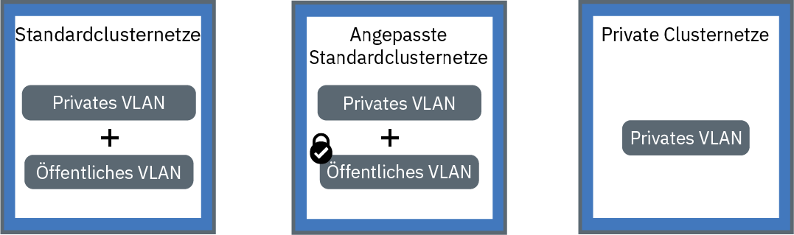

---

copyright:
  years: 2014, 2018
lastupdated: "2018-10-25"

---

{:new_window: target="_blank"}
{:shortdesc: .shortdesc}
{:screen: .screen}
{:pre: .pre}
{:table: .aria-labeledby="caption"}
{:codeblock: .codeblock}
{:tip: .tip}
{:download: .download}

# Netzbetrieb in Clustern und private Vernetzung planen
{: #planning}

Sie können den Netzbetrieb für Ihren {{site.data.keyword.containerlong}}-Cluster planen.
{: shortdesc}

## Erklärung des Netzbetriebs in Clustern
{: #in-cluster}

Alle Pods, die auf einem Workerknoten bereitgestellt werden, erhalten im Bereich 172.30.0.0/16 eine private IP-Adresse und werden nur zwischen den Workerknoten weitergeleitet. Vermeiden Sie Konflikte, indem Sie diesen IP-Bereich nicht auf Knoten verwenden, die mit Ihren Workerknoten kommunizieren. Workerknoten und Pods können im privaten Netz durch die Verwendung von privaten IP-Adressen sicher kommunizieren. Wenn ein Pod ausfällt oder ein Workerknoten neu erstellt werden muss, wird jedoch eine neue private IP-Adresse zugewiesen.

Standardmäßig ist es schwierig, sich ändernde private IP-Adressen für Apps nachzuverfolgen, die hoch verfügbar sein müssen. Stattdessen können Sie die integrierten Erkennungsfunktionen des Kubernetes-Service nutzen, um Anwendungen als Cluster-IP-Services im privaten Netz zugänglich zu machen. Ein Kubernetes-Service fasst eine Gruppe von Pods zusammen und stellt diesen Pods eine Netzverbindung zur Verfügung. Diese Verbindung stellen Konnektivität zu anderen Services im Cluster bereit, ohne hierbei die tatsächlichen privaten IP-Adressen der einzelnen Pods preiszugeben. Services wird eine IP-Cluster-IP-Adresse zugeordnet, auf die nur innerhalb des Clusters zugegriffen werden kann.
* Ältere Cluster: In Clustern, die vor Februar 2018 in der Zone 'dal13' oder vor Oktober 2017 in einer anderen Zone erstellt wurden, wird den Services eine der 254 IPs im Bereich 10.10.10.0/24 zugeordnet. Wenn Sie den Grenzwert von 254 Services erreicht haben und mehr Services benötigen, müssen Sie einen neuen Cluster erstellen.
* Neuere Cluster: In Clustern, die nach Februar 2018 in der Zone 'dal13' oder nach Oktober 2017 in einer anderen Zone erstellt wurden, wird den Services eine der 65.000 IPs im Bereich 172.21.0.0/16 zugeordnet.

Vermeiden Sie Konflikte, indem Sie diesen IP-Bereich nicht auf Knoten verwenden, die mit Ihren Workerknoten kommunizieren. Es wird auch ein Eintrag für die DNS-Suche für den Service erstellt und in der Komponente `kube-dns` des Clusters gespeichert. Der DNS-Eintrag enthält den Namen des Service, den Namensbereich, in dem der Service erstellt wurde, und den Link zu der zugeordneten IP-Adresse, die im Cluster enthalten ist.

Um auf einen Pod hinter einem Cluster-Service zuzugreifen, können Apps entweder die IP-Adresse des Service im Cluster verwenden oder eine Anforderung mit dem Namen des Service senden. Wenn Sie den Namen des Service verwenden, wird dieser in der Komponente `kube-dns` gesucht und an die IP-Adresse des Service im Cluster weitergeleitet. Wenn eine Anforderung den Service erreicht, leitet der Service die Anforderungen an die Pods weiter, unabhängig von den IP-Adressen der Pods im Cluster und dem Workerknoten, auf dem sie bereitgestellt wurden.

 

## Erklärung der VLAN-Verbindungen und Netzschnittstellen
{: #interfaces}

{{site.data.keyword.containerlong_notm}} stellt VLANs der IBM Cloud-Infrastruktur (SoftLayer) bereit, die eine hohe Qualität der Netzleistung sowie Netzisolation für Workerknoten sicherstellen. Ein VLAN konfiguriert eine Gruppe von Workerknoten und Pods so, als wären diese an dasselbe physische Kabel angeschlossen. VLANs sind Ihrem {{site.data.keyword.Bluemix_notm}}-Konto zugeordnet und werden von IBM Kunden nicht gemeinsam genutzt.

Standardmäßig sind alle Cluster mit einem privaten VLAN verbunden. Das private VLAN legt fest, welche private IP-Adresse jedem Workerknoten zugewiesen wird. Ihre Worker verfügen über eine private Netzschnittstelle und sind über das private Netz zugänglich. Wenn Sie einen Cluster erstellen, der auch mit einem öffentlichen VLAN verbunden ist, verfügt Ihr Cluster außerdem über eine öffentliche Netzschnittstelle. Das öffentliche VLAN ermöglicht es den Workerknoten, automatisch und sicher eine Verbindung zum Master herzustellen. Weitere Informationen zu den Standard-VLANs für Ihren Cluster finden Sie im Abschnitt [Standard-VLANs, Teilnetze und IPs für Cluster](cs_subnets.html#default_vlans_subnets).

Konfigurationen für die Clustervernetzung können durch die Netzschnittstellen des Clusters definiert werden:

* **Standardclustervernetzung**: Ein Cluster mit einer privaten und einer öffentlichen Netzschnittstelle
* **Angepasste Standardclustervernetzung**: Ein Cluster mit einer privaten und einer öffentlichen Netzschnittstelle sowie Calico-Netzrichtlinien zum Blockieren des eingehenden öffentlichen Datenverkehrs
* **Ausschließlich private Clustervernetzung**: Ein Cluster, der lediglich über eine private Netzschnittstelle verfügt

Klicken Sie auf eine der folgenden Konfigurationen, um den Vernetzung Ihres Clusters zu planen:

<map name="home_map" id="home_map">
<area href="#both_vlans" alt="Standardclustervernetzung planen" title="Standardclustervernetzung planen" shape="rect" coords="-7, -8, 149, 211" />
<area href="#both_vlans_private" alt="Angepasste Standardclustervernetzung planen" title="Angepasste Standardclustervernetzung planen" shape="rect" coords="196, -1, 362, 210" />
<area href="#private_vlan" alt="Ausschließlich private Clustervernetzung planen" title="Ausschließlich private Clustervernetzung planen" shape="rect" coords="409, -10, 572, 218" />
</map>

 

## Standardclustervernetzung planen
{: #both_vlans}

{{site.data.keyword.containerlong_notm}} richtet Ihren Cluster standardmäßig mit Zugriff auf ein öffentliches VLAN und ein privates VLAN ein.
{:shortdesc}

**Was erhält mein Cluster bei dieser Konfiguration?**
* Eine öffentliche IP-Adresse für jeden Workerknoten, wodurch die Workerknoten eine öffentliche Netzschnittstelle erhalten
* Eine private IP-Adresse für jeden Workerknoten, wodurch die Workerknoten eine private Netzschnittstelle erhalten
* Eine automatische sichere OpenVPN-Verbindung zwischen allen Workerknoten und dem Master

**Warum sollte ich diese Konfiguration verwenden?**

* Sie verfügen über eine App, die für das öffentliche Internet in einem Einzelzonencluster zugänglich sein muss.
* Sie verfügen über eine App, die für das öffentliche Internet in einem Mehrzonencluster zugänglich sein muss. Da Sie [VLAN-Spanning](cs_subnets.html#subnet-routing) aktivieren müssen, um einen Mehrzonencluster zu erstellen, kann der Cluster mit anderen Systemen kommunizieren, die mit einem beliebigen privaten VLAN in demselben IBM Cloud-Konto verbunden sind. **Hinweis**: Verwenden Sie [Calico-Netzrichtlinien](cs_network_policy.html#isolate_workers), um Ihren Mehrzonencluster im privaten Netz zu isolieren.

**Welche Optionen habe ich für die Verwaltung des öffentlichen und privaten Zugriffs auf meinen Cluster?**
 In den folgenden Abschnitten werden die Funktionen von {{site.data.keyword.containerlong_notm}} beschrieben, mit denen Sie den Netzbetrieb für Cluster einrichten können, die mit einem öffentlichen und einem privaten VLAN verbunden sind.

### Apps mit Netzservices zugänglich machen
{: #both_vlans_services}

Die öffentliche Netzschnittstelle für Workerknoten wird durch [vordefinierte Calico-Netzrichtlinieneinstellungen](cs_network_policy.html#default_policy) geschützt, die bei der Clustererstellung auf jedem Workerknoten konfiguriert werden. Standardmäßig ist für alle Workerknoten der gesamte ausgehende Netzverkehr zulässig. Eingehender Netzverkehr wird abgesehen von bestimmten Ports blockiert. Diese Ports werden geöffnet, damit IBM den Netzverkehr überwachen und Sicherheitsupdates für den Kubernetes-Master automatisch installieren kann.

Wenn Sie Ihre Apps öffentlich oder in einem privaten Netz zugänglich machen möchten, können Sie öffentliche oder private NodePort-, LoadBalancer- oder Ingress-Services erstellen. Weitere Informationen zu den einzelnen Services finden Sie unter [NodePort-, LoadBalancer- oder Ingress-Service auswählen](cs_network_planning.html#external).

### Optional: Netzarbeitslasten für Edge-Workerknoten isolieren
{: #both_vlans_edge}

Mit Edge-Workerknoten kann die Sicherheit des Clusters verbessert werden, indem der externe Zugriff auf Workerknoten beschränkt und die Netzarbeitslast isoliert wird. Um sicherzustellen, dass Ingress- und Lastausgleichsfunktions-Pods nur auf den angegebenen Workerknoten bereitgestellt werden, [kennzeichnen Sie die Workerknoten als Edge-Knoten](cs_edge.html#edge_nodes). Um außerdem zu verhindern, dass andere Arbeitslasten auf Edge-Knoten ausgeführt werden, [wenden Sie Taints auf die Edge-Knoten an](cs_edge.html#edge_workloads).

### Optional: Verbindung zu einem lokalen Netz oder IBM Cloud Private mithilfe des strongSwan-VPN-Service herstellen
{: #both_vlans_vpn}

Um eine sichere Verbindung Ihrer Workerknoten und Apps zu einem lokalen Netz herzustellen, können Sie einen [strongSwan-IPSec-VPN-Service ](https://www.strongswan.org/about.html) einrichten. Der strongSwan-IPSec-VPN-Service stellt einen sicheren End-to-End-Kommunikationskanal über das Internet bereit, der auf der standardisierten IPSec-Protokollsuite (IPSec - Internet Protocol Security) basiert.
* Um eine sichere Verbindung zwischen Ihrem Cluster und einem lokalen Netz einzurichten, [konfigurieren und implementieren Sie den StrongSwan-IPSec-VPN-Service](cs_vpn.html#vpn-setup) direkt in einem Pod in Ihrem Cluster.
* Informationen zum Einrichten einer sicheren Verbindung zwischen Ihrem Cluster und einer IBM Cloud Private-Instanz finden Sie im Abschnitt [Öffentliche und private Cloud mit dem strongSwan-VPN verbinden](cs_hybrid.html#hybrid_vpn).

 

## Angepasste Standardclustervernetzung planen
{: #both_vlans_private}

{{site.data.keyword.containerlong_notm}} richtet Ihren Cluster standardmäßig mit Zugriff auf ein öffentliches VLAN und ein privates VLAN ein. Sie können die Standardnetzkonfiguration jedoch mithilfe von Netzrichtlinien anpassen, um den öffentlichen Zugriff zu blockieren.
{:shortdesc}

**Was erhält mein Cluster bei dieser Konfiguration?**
* Eine öffentliche IP-Adresse für jeden Workerknoten, wodurch die Workerknoten eine öffentliche Netzschnittstelle erhalten
* Eine private IP-Adresse für jeden Workerknoten, wodurch die Workerknoten eine private Netzschnittstelle erhalten
* Eine automatische sichere OpenVPN-Verbindung zwischen allen Workerknoten und dem Master

**Warum sollte ich diese Konfiguration verwenden?**

* Sie verfügen über eine App in einem Einzelzonencluster. Sie möchten die App nur für Pods innerhalb des Clusters oder in anderen Clustern, die mit demselben privaten VLAN verbunden sind, zugänglich machen.
* Sie verfügen über eine App in einem Mehrzonencluster. Sie möchten die App nur für Pods innerhalb des Clusters oder in anderen Clustern, die mit denselben privaten VLANs wie Ihr Cluster verbunden sind, zugänglich machen. Da [VLAN-Spanning](cs_subnets.html#subnet-routing) für Mehrzonencluster jedoch aktiviert sein muss, kann von anderen Systemen, die mit einem privaten VLAN in demselben IBM Cloud-Konto verbunden sind, auf den Cluster zugegriffen werden. Es ist sinnvoll, den Mehrzonencluster von anderen Systemen zu isolieren.

**Welche Optionen habe ich für die Verwaltung des öffentlichen und privaten Zugriffs auf meinen Cluster?** In den folgenden Abschnitten werden die Funktionen von {{site.data.keyword.containerlong_notm}} beschrieben, mit denen Sie ausschließlich private Netze einrichten und öffentliche Netze für Cluster sperren können, die mit einem öffentlichen und einem privaten VLAN verbunden sind.

### Apps mit privaten Netzservices zugänglich machen und den Cluster mit Calico-Netzrichtlinien gegen öffentlichen Zugriff schützen
{: #both_vlans_private_services}

Die öffentliche Netzschnittstelle für Workerknoten wird durch [vordefinierte Calico-Netzrichtlinieneinstellungen](cs_network_policy.html#default_policy) geschützt, die bei der Clustererstellung auf jedem Workerknoten konfiguriert werden. Standardmäßig ist für alle Workerknoten der gesamte ausgehende Netzverkehr zulässig. Eingehender Netzverkehr wird abgesehen von bestimmten Ports blockiert. Diese Ports werden geöffnet, damit IBM den Netzverkehr überwachen und Sicherheitsupdates für den Kubernetes-Master automatisch installieren kann.

Wenn Sie Ihre Apps ausschließlich über ein privates Netz zugänglich machen möchten, können Sie private NodePort-, LoadBalancer- oder Ingress-Services erstellen. Weitere Informationen zum Planen einer privaten externen Vernetzung finden Sie im Abschnitt [Private externe Vernetzung für ein öffentliches und privates VLAN-Setup planen](cs_network_planning.html#private_both_vlans).

Die standardmäßigen Calico-Netzrichtlinien ermöglichen jedoch auch den eingehenden Netzverkehr aus dem Internet an diese Services. Sie können Calico-Richtlinien erstellen, um stattdessen den gesamten öffentlichen Datenverkehr an die Services zu blockieren. Beispielsweise öffnet ein NodePort-Service einen Port auf einem Workerknoten sowohl über die private als auch über die öffentliche IP-Adresse des Workerknotens. Ein Service für die Lastausgleichsfunktion mit einer portierbaren privaten IP-Adresse öffnet einen öffentlichen Knotenport auf jedem Workerknoten. Sie müssen eine [Calico-PreDNAT-Netzrichtlinie](cs_network_policy.html#block_ingress) erstellen, um öffentliche Knotenports (NodePorts) zu blockieren.

Beispiel: Angenommen, Sie haben einen privaten Lastausgleichsservice erstellt. Außerdem haben Sie eine Calico-PreDNAT-Richtlinie erstellt, um den öffentlichen Datenverkehr zu blockieren, sodass er nicht zu den öffentlichen NodePorts gelangt, die von der Lastausgleichsfunktion geöffnet werden. Auf diese private Lastausgleichsfunktion ist der Zugriff wie folgt möglich:
* [Von einem beliebigen Pod in demselben Cluster](#in-cluster)
* Von einem beliebigen Pod in einem beliebigen Cluster, der mit demselben privaten VLAN verbunden ist
* Von allen Systemen, die mit einem der privaten VLANs in demselben IBM Cloud-Konto verbunden sind (Wenn das [VLAN-Spanning aktiviert](cs_subnets.html#subnet-routing) ist)
* Von allen Systemen über eine VPN-Verbindung zu dem Teilnetz, auf dem sich die Lastausgleichsfunktion befindet (wenn Sie sich nicht im IBM Cloud-Konto, aber dennoch hinter der Unternehmensfirewall befinden)
* Von allen Systemen über eine VPN-Verbindung zu dem Teilnetz, auf dem sich die Lastausgleichsfunktion befindet (wenn Sie sich in einem anderen IBM Cloud-Konto befinden)

### Cluster im privaten Netz isolieren
{: #isolate}

Wenn Sie einen Mehrzonencluster, mehrere VLANs für einen Einzelzonencluster oder mehrere Teilnetze in demselben VLAN haben, müssen Sie das [VLAN-Spanning aktivieren](/docs/infrastructure/vlans/vlan-spanning.html#vlan-spanning), damit Ihre Workerknoten miteinander im privaten Netz kommunizieren können. Wenn das VLAN-Spanning aktiviert ist, kann jedes System, das mit einem der privaten VLANs in demselben IBM Cloud-Konto verbunden ist, auf Ihre Worker zugreifen. Sie können Ihren Mehrzonencluster von anderen Systemen im privaten Netz mithilfe von [Calico-Netzrichtlinien](cs_network_policy.html#isolate_workers) isolieren. Diese Richtlinien ermöglichen auch eingehenden und abgehenden Datenverkehr für die privaten IP-Bereiche und Ports, die Sie in Ihrer privaten Firewall geöffnet haben.

### Optional: Netzarbeitslasten für Edge-Workerknoten isolieren
{: #both_vlans_private_edge}

Mit Edge-Workerknoten kann die Sicherheit des Clusters verbessert werden, indem der externe Zugriff auf Workerknoten beschränkt und die Netzarbeitslast isoliert wird. Um sicherzustellen, dass Ingress- und Lastausgleichsfunktions-Pods nur auf den angegebenen Workerknoten bereitgestellt werden, [kennzeichnen Sie die Workerknoten als Edge-Knoten](cs_edge.html#edge_nodes). Um außerdem zu verhindern, dass andere Arbeitslasten auf Edge-Knoten ausgeführt werden, [wenden Sie Taints auf die Edge-Knoten an](cs_edge.html#edge_workloads).

Verwenden Sie dann eine [Calico-PreDNAT-Netzrichtlinie](cs_network_policy.html#block_ingress), um den Datenverkehr an öffentlichen Knotenports in Clustern zu blockieren, in denen Edge-Workerknoten ausgeführt werden. Durch das Blockieren von Knotenports wird sichergestellt, dass die Edge-Workerknoten die einzigen Workerknoten sind, die eingehenden Datenverkehr verarbeiten.

### Optional: Verbindung zu einem lokalen Netz oder IBM Cloud Private mithilfe des strongSwan-VPN-Service herstellen
{: #both_vlans_private_vpn}

Um eine sichere Verbindung Ihrer Workerknoten und Apps zu einem lokalen Netz herzustellen, können Sie einen [strongSwan-IPSec-VPN-Service ](https://www.strongswan.org/about.html) einrichten. Der strongSwan-IPSec-VPN-Service stellt einen sicheren End-to-End-Kommunikationskanal über das Internet bereit, der auf der standardisierten IPSec-Protokollsuite (IPSec - Internet Protocol Security) basiert.
* Um eine sichere Verbindung zwischen Ihrem Cluster und einem lokalen Netz einzurichten, [konfigurieren und implementieren Sie den StrongSwan-IPSec-VPN-Service](cs_vpn.html#vpn-setup) direkt in einem Pod in Ihrem Cluster.
* Informationen zum Einrichten einer sicheren Verbindung zwischen Ihrem Cluster und einer IBM Cloud Private-Instanz finden Sie im Abschnitt [Öffentliche und private Cloud mit dem strongSwan-VPN verbinden](cs_hybrid.html#hybrid_vpn).

 

## Ausschließlich private Clusternetze planen
{: #private_vlan}

Sie können [einen Cluster ausschließlich mit privatem VLAN erstellen](cs_clusters.html#clusters_cli), indem Sie das Flag `--private-only` in die CLI einfügen. Wenn Ihre Workerknoten nur mit einem privaten VLAN verbunden sind, können die Workerknoten nicht automatisch eine Verbindung zum Master herstellen. Sie müssen eine Gateway-Appliance verwenden, um die Workerknoten mit dem Master zu verbinden. Sie können die Gateway-Appliance auch als Firewall verwenden, um Ihren Cluster vor unerwünschtem Zugriff zu schützen.
{:shortdesc}

**Was erhält mein Cluster bei dieser Konfiguration?**
* Eine private IP-Adresse für jeden Workerknoten, wodurch die Workerknoten eine private Netzschnittstelle erhalten

**Was erhält mein Cluster bei dieser Konfiguration nicht?**
* Eine öffentliche IP-Adresse für jeden Workerknoten, wodurch die Workerknoten eine öffentliche Netzschnittstelle erhalten. Der Cluster ist nie öffentlich verfügbar.
* Eine automatische Verbindung zwischen allen Workerknoten und dem Master. Sie müssen diese Verbindung durch [Konfigurieren einer Gateway-Appliance](#private_vlan_gateway) zur Verfügung stellen.

**Warum sollte ich diese Konfiguration verwenden?**
 Sie haben bestimmte Sicherheitsanforderungen oder müssen angepasste Netzrichtlinien und Routing-Regeln erstellen, um eine dedizierte Netzsicherheit zu ermöglichen. **Hinweis**: Für die Nutzung einer Gateway-Appliance fallen separate Kosten an. Weitere Informationen finden Sie in der [Dokumentation](/docs/infrastructure/fortigate-10g/explore-firewalls.html).

**Welche Optionen habe ich für die Verwaltung des öffentlichen und privaten Zugriffs auf meinen Cluster?**
 In den folgenden Abschnitten werden die Funktionen von {{site.data.keyword.containerlong_notm}} beschrieben, mit denen Sie den Netzbetrieb für Cluster einrichten können, die nur mit einem privaten VLAN verbunden sind.

### Gateway-Appliance konfigurieren
{: #private_vlan_gateway}

Wenn Workerknoten nur mit einem privaten VLAN eingerichtet werden, müssen Sie eine alternative Lösung für die Netzkonnektivität zwischen Ihren Workerknoten und dem Master konfigurieren. Sie können eine Firewall mit angepassten Netzrichtlinien einrichten, um für Ihren Standardcluster dedizierte Netzsicherheit bereitzustellen und unbefugten Zugriff zu erkennen und zu unterbinden. Sie können beispielsweise [Virtual Router Appliance](/docs/infrastructure/virtual-router-appliance/about.html) oder [Fortigate Security Appliance](/docs/infrastructure/fortigate-10g/about.html) als Ihre Firewall und zum Blockieren unerwünschten Datenverkehrs einrichten. Wenn Sie eine Firewall einrichten, müssen Sie auch [die erforderlichen Ports und IP-Adressen für die einzelnen Regionen öffnen](cs_firewall.html#firewall_outbound), damit der Master und die Workerknoten kommunizieren können.

**Hinweis**: Wenn Sie über eine vorhandene VRA-Instanz verfügen und dann einen Cluster hinzufügen, werden die neuen portierbaren Teilnetze, die für den Cluster bestellt wurden, nicht auf der Router Appliance konfiguriert. Um Netzservices verwenden zu können, müssen Sie die Weiterleitung zwischen Teilnetzen im selben VLAN aktivieren, indem Sie [VLAN-Spanning aktivieren](cs_subnets.html#vra-routing).

Um zu prüfen, ob das VLAN-Spanning bereits aktiviert ist, verwenden Sie den [Befehl](cs_cli_reference.html#cs_vlan_spanning_get) `ibmcloud ks vlan-spanning-get`.
{: tip}

### Apps mit privaten Netzservices zugänglich machen
{: #private_vlan_services}

Um Ihre App nur über ein privates Netz zugänglich zu machen, können Sie private NodePort-, LoadBalancer- oder Ingress-Services verwenden. Da Ihre Workerknoten nicht mit einem öffentlichen VLAN verbunden sind, wird kein öffentlicher Datenverkehr an diese Services weitergeleitet. Sie müssen außerdem [die erforderlichen Ports und IP-Adressen für die einzelnen Regionen öffnen](cs_firewall.html#firewall_inbound), um den eingehenden Datenverkehr für diese Services zuzulassen.

Weitere Informationen zu den einzelnen Services finden Sie unter [NodePort-Service, Service für die Lastausgleichsfunktion oder Ingress-Service auswählen](cs_network_planning.html#external).

### Optional: Verbindung zu einer lokalen Datenbank mithilfe der Gateway-Appliance herstellen
{: #private_vlan_vpn}

Um eine sichere Verbindung Ihrer Workerknoten und Apps zu einem lokalen Netz herzustellen, müssen Sie ein VPN-Gateway einrichten. Sie können die VRA oder FSA verwenden, die Sie zuvor für die Konfiguration eines IPSec-VPN-Endpunkts eingerichtet haben. Informationen zum Konfigurieren einer VRA finden Sie unter [VPN-Konnektivität mit VRA konfigurieren](cs_vpn.html#vyatta).
