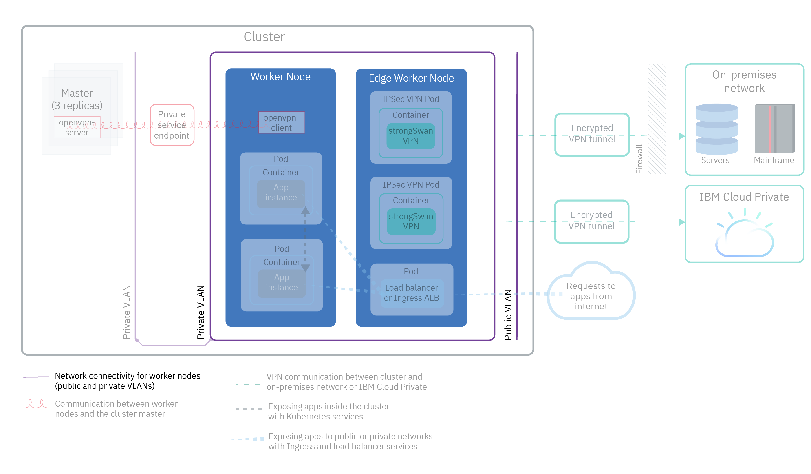
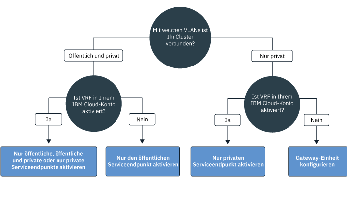

---

copyright:
  years: 2014, 2019
lastupdated: "2019-04-15"

---

{:new_window: target="_blank"}
{:shortdesc: .shortdesc}
{:screen: .screen}
{:pre: .pre}
{:table: .aria-labeledby="caption"}
{:codeblock: .codeblock}
{:tip: .tip}
{:note: .note}
{:important: .important}
{:deprecated: .deprecated}
{:download: .download}

# Clusternetz planen
{: #cs_network_ov}

Sie können die Netzkonfiguration für Ihren {{site.data.keyword.containerlong}}-Cluster planen.
{: shortdesc}

Die Informationen auf dieser Seite helfen Ihnen bei der Einrichtung der Netzkonfiguration für Ihren Cluster. Suchen Sie nach Informationen zur Einrichtung des Netzes für Ihre App? Weitere Informationen finden Sie unter [Zugänglichmachen von Apps mit clusterinternem Netz und mit externem Netz planen](/docs/containers?topic=containers-cs_network_planning).
{: tip}

## Grundlegende Informationen zu {{site.data.keyword.containerlong_notm}}-Netzen
{: #cs_network_ov_basics}

Vor Beginn der Einrichtung eines Clusternetzes ist es wichtig, die Basiskonzepte des Netzbetriebs in {{site.data.keyword.containerlong_notm}}-Clustern zu verstehen.
{: shortdesc}

### Welche Clusterkomponenten müssen miteinander kommunizieren?
{: #cs_network_ov_basics_components}

Wenn Sie Ihren Cluster erstellen, müssen Sie die Netzeinrichtung auswählen, damit Clusterkomponenten miteinander kommunizieren können.
{: shortdesc}

* Alle Workerknoten müssen mit einem VLAN verbunden sein, damit sie miteinander und mit dem Kubernetes-Master kommunizieren können. Informationen zur Auswahl von VLANs finden Sie unter [Kommunikation zwischen Workerknoten planen](#cs_network_ov_worker).
* Die Kommunikation muss über mehrere private VLANs hinweg zugelassen werden, damit Worker Verbindungen zueinander und zum Master herstellen können. Informationen zur Aktivierung einer VRF-Funktion (Virtual Router Function) oder des VLAN-Spannings finden Sie unter [Wie werden VLANs und Teilnetze zur Sicherstellung der Netzsegmentierung konfiguriert?](#cs_network_ov_basics_segmentation).
* Ihre Worker können mit dem Kubernetes-Master sicher über das öffentliche Netz oder über das private Netz kommunizieren. Informationen zur Auswahl des Kommunikationskanals zwischen Workern und Master finden Sie unter [Kommunikation zwischen Master und Workern planen](#cs_network_ov_master).

### Wie funktioniert der Netzbetrieb in {{site.data.keyword.containerlong_notm}}?
{: #cs_network_ov_basics_vlans}

{{site.data.keyword.containerlong_notm}} verwendet VLANs, Teilnetze und IP-Adressen, um Clusterkomponenten mit Netzkonnektivität auszustatten.
{: shortdesc}

**Was sind VLANs? Welche Typen von VLANs bietet {{site.data.keyword.containerlong_notm}} an?** 

Beim Erstellen eines Clusters werden die Workerknoten des Clusters automatisch mit einem VLAN verbunden. Ein VLAN konfiguriert eine Gruppe von Workerknoten und Pods so, als wären diese an dasselbe physische Kabel angeschlossen und es bietet einen Kanal für die Konnektivität zwischen Worker und Pods.
{: shortdesc}

<dl>
<dt>VLANs für kostenlose Cluster</dt>
<dd>Bei kostenlosen Clustern werden die Workerknoten des Clusters standardmäßig mit einem öffentlichen und einem privaten VLAN verbunden, deren Eigner IBM ist. Da IBM die VLANs, Teilnetze und IP-Adressen steuert, können Sie keine Mehrzonencluster erstellen oder Ihrem Cluster Teilnetze hinzufügen; darüber hinaus können Sie zum Verfügbarmachen Ihrer App nur NodePort-Services verwenden.</dd>
<dt>VLANs für Standardcluster</dt>
<dd>Wenn Sie bei Standardclustern in einer Zone zum ersten Mal einen Cluster erstellen, werden in dieser Zone automatisch ein öffentliches und ein privates VLAN für Sie in Ihrem Konto der IBM Cloud-Infrastruktur (SoftLayer) bereitgestellt. Für jeden weiteren Cluster, den Sie in dieser Zone erstellen, müssen Sie das VLAN-Paar angeben, das Sie in dieser Zone verwenden möchten. Sie können dasselbe öffentliche und private VLAN wiederverwenden, die für Sie erstellt wurden, da ein VLAN von mehreren Clustern gemeinsam genutzt werden kann. 
 Sie können Ihre Workerknoten entweder mit einem öffentlichen und dem privaten VLAN verbinden oder nur mit dem privaten VLAN. Wenn Ihre Workerknoten nur mit einem privaten VLAN verbunden werden sollen, können Sie die ID eines vorhandenen privaten VLANs verwenden oder [ein privates VLAN erstellen](/docs/cli/reference/ibmcloud?topic=cloud-cli-manage-classic-vlans#sl_vlan_create) und die ID während der Clustererstellung verwenden.</dd></dl>

Um die VLANs anzuzeigen, die in den einzelnen Zonen für Ihr Konto bereitgestellt sind, führen Sie den Befehl `ibmcloud ks vlans --zone <zone>` aus. Um die VLANs anzuzeigen, in denen ein Cluster bereitgestellt ist, führen Sie den Befehl `ibmcloud ks cluster-get --cluster <clustername_oder_-id> --showResources` aus und suchen nach dem Abschnitt für VLANs von Teilnetzen (**Subnet VLANs**).

Die IBM Cloud-Infrastruktur (SoftLayer) verwaltet die VLANs, die automatisch bereitgestellt werden, wenn Sie Ihren ersten Cluster in einer Zone erstellen. Wenn ein VLAN nicht mehr verwendet wird, z. B. nach dem Entfernen aller Workerknoten aus dem VLAN, wird das VLAN von der IBM Cloud-Infrastruktur (SoftLayer) freigegeben. Wenn Sie ein neues VLAN benötigen, [wenden Sie sich an den {{site.data.keyword.Bluemix_notm}}-Support](/docs/infrastructure/vlans?topic=vlans-ordering-premium-vlans#ordering-premium-vlans).

**Wie wirkt sich meine Auswahl von VLANs auf meinen Cluster aus?** 

Ihre Auswahl von VLAN-Verbindungen bestimmt, wie der Kubernetes-Master und die Workerknoten in Ihrem Cluster miteinander kommunizieren können. Weitere Informationen finden Sie unter [Kommunikation zwischen Workerknoten und dem Kubernetes-Master planen](/docs/containers?topic=containers-cs_network_ov#cs_network_ov_master).

Ihre Auswahl von VLAN-Verbindungen bestimmt darüber hinaus die Netzkonnektivität für Ihre Apps. Weitere Informationen finden Sie unter [Zugänglichmachen von Apps mit clusterinternem Netz und mit externem Netz planen](/docs/containers?topic=containers-cs_network_planning).

### Was sind Teilnetze? Welche Typen von Teilnetzen bietet {{site.data.keyword.containerlong_notm}} an?
{: #cs_network_ov_basics_subnets}

Neben Workerknoten und Pods werden auch Teilnetze automatisch in VLANs bereitgestellt. Teilnetze stellen für Ihre Clusterkomponenten Netzkonnektivität bereit, indem sie ihnen IP-Adressen zuordnen.
{: shortdesc}

Folgende Teilnetze werden in den standardmäßigen öffentlichen und privaten VLANs automatisch bereitgestellt:

**Öffentliche VLAN-Teilnetze**
* Durch das primäre öffentliche Teilnetz werden die öffentlichen IP-Adressen festgelegt, die während der Clustererstellung den Workerknoten zugeordnet werden. Mehrere im selben VLAN vorhandene Cluster können ein einzelnes primäres öffentliches Teilnetz gemeinsam nutzen.
* Das portierbare öffentliche Teilnetz ist nur an einen einzigen Cluster gebunden und stellt dem Cluster acht öffentliche IP-Adressen zur Verfügung. 3 IP-Adressen sind für Funktionen der IBM Cloud-Infrastruktur (SoftLayer) reserviert. Eine IP wird von der standardmäßigen öffentlichen Ingress-ALB verwendet; vier IPs können verwendet werden, um öffentliche NLB-Services (NLB = Netzausgleichsfunktion) zu erstellen. Portierbare öffentliche IPs sind permanente, feste IP-Adressen, die für den Zugriff auf NLBs über das Internet verwendet werden können. Wenn Sie für NLBs mehr als 4 IPs benötigen, lesen Sie die Informationen unter [Portierbare IP-Adressen hinzufügen](/docs/containers?topic=containers-subnets#adding_ips).

**Private VLAN-Teilnetze**
* Durch das primäre private Teilnetz werden die privaten IP-Adressen festgelegt, die während der Clustererstellung den Workerknoten zugeordnet werden. Mehrere im selben VLAN vorhandene Cluster können ein einzelnes primäres privates Teilnetz gemeinsam nutzen.
* Das portierbare private Teilnetz ist nur an einen einzigen Cluster gebunden und stellt dem Cluster acht private IP-Adressen zur Verfügung. 3 IP-Adressen sind für Funktionen der IBM Cloud-Infrastruktur (SoftLayer) reserviert. Eine IP wird von der standardmäßigen privaten Ingress-ALB verwendet; vier IPs können verwendet werden, um private NLB-Services (NLB = Netzausgleichsfunktion) zu erstellen. Portierbare private IPs sind permanente, feste IP-Adressen, die für den Zugriff auf NLBs über ein privates Netz verwendet werden können. Wenn Sie für private NLBs mehr als 4 IPs benötigen, lesen Sie die Informationen unter [Portierbare IP-Adressen hinzufügen](/docs/containers?topic=containers-subnets#adding_ips).

Führen Sie `ibmcloud ks subnets` aus, um alle in Ihrem Konto bereitgestellten Teilnetze anzuzeigen. Um die portierbaren öffentlichen und die portierbaren privaten Teilnetze anzuzeigen, die an einen einzigen Cluster gebunden sind, können Sie den Befehl `ibmcloud ks cluster-get --cluster <clustername_oder_-id> --showResources` ausführen und nach dem Abschnitt für VLANs von Teilnetzen (**Subnet VLANs**) suchen.

In {{site.data.keyword.containerlong_notm}} haben VLANs ein Limit von 40 Teilnetzen. Überprüfen Sie bei Erreichen dieses Grenzwerts zunächst, ob Sie [Teilnetze im VLAN wiederverwenden können, um neue Cluster zu erstellen](/docs/containers?topic=containers-subnets#subnets_custom). Wenn Sie ein neues VLAN benötigen, fordern Sie eines an, indem Sie den [{{site.data.keyword.Bluemix_notm}}-Support kontaktieren](/docs/infrastructure/vlans?topic=vlans-ordering-premium-vlans#ordering-premium-vlans). [Erstellen Sie dann einen Cluster](/docs/containers?topic=containers-cs_cli_reference#cs_cluster_create), der dieses neue VLAN verwendet.
{: note}

### Wie werden VLANs und Teilnetze zur Sicherstellung der Netzsegmentierung konfiguriert?
{: #cs_network_ov_basics_segmentation}

Mit 'Netzsegmentierung' wird die Methode beschrieben, bei der ein Netz in mehrere Teilnetze aufgeteilt wird. Apps, die in einem Teilnetz ausgeführt werden, können Apps in einem anderen Teilnetz nicht anzeigen oder auf sie zugreifen. Weitere Informationen zu Optionen der Netzsegmentierung und ihrer Beziehung zu VLANs finden Sie [in diesem Abschnitt zur Clustersicherheit](/docs/containers?topic=containers-security#network_segmentation).
{: shortdesc}

In verschiedenen Situationen müssen Komponenten in Ihrem Cluster jedoch berechtigt werden, über mehrere private VLANs hinzu zu kommunizieren. Wenn Sie zum Beispiel einen Mehrzonencluster erstellen wollen, wenn Sie mehrere VLANs für einen Cluster haben oder wenn Sie mehrere Teilnetze im selben VLAN haben, können die Workerknoten in verschiedenen Teilnetzen desselben VLAN oder in verschiedenen VLANs nicht automatisch miteinander kommunizieren. Sie müssen entweder eine VRF-Funktion (Virtual Router Function) oder das VLAN-Spanning für Ihr IBM Cloud-Infrastrukturkonto (SoftLayer) aktivieren.

**Was sind VRF-Funktionen und VLAN-Spanning?** 

<dl>
<dt>[Virtual Router Function (VRF)](/docs/infrastructure/direct-link?topic=direct-link-overview-of-virtual-routing-and-forwarding-vrf-on-ibm-cloud#overview-of-virtual-routing-and-forwarding-vrf-on-ibm-cloud)</dt>
<dd>Eine VRF-Funktion ermöglicht allen VLANs und Teilnetzen in Ihrem Infrastrukturkonto die Kommunikation miteinander. Darüber hinaus ist eine VRF-Funktion erforderlich, um die Kommunikation Ihrer Worker und Ihres Masters über den privaten Serviceendpunkt zu ermöglichen. Zur Aktivierung von VRF [wenden Sie sich an Ihren Ansprechpartner für die IBM Cloud-Infrastruktur (SoftLayer)](/docs/infrastructure/direct-link?topic=direct-link-overview-of-virtual-routing-and-forwarding-vrf-on-ibm-cloud#how-you-can-initiate-the-conversion). Beachten Sie, dass VRF die Option des VLAN-Spannings für Ihr Konto ausschließt, da alle VLANs kommunizieren können, sofern Sie keine Gateway-Appliance zur Verwaltung des Datenverkehrs konfigurieren.</dd>
<dt>[VLAN-Spanning](/docs/infrastructure/vlans?topic=vlans-vlan-spanning#vlan-spanning)</dt>
<dd>Wenn Sie VRF nicht aktivieren können oder wollen, aktivieren Sie das VLAN-Spanning. Um diese Aktion durchführen zu können, müssen Sie über die [Infrastrukturberechtigung](/docs/containers?topic=containers-users#infra_access) **Netz > VLAN-Spanning im Netz verwalten** verfügen oder Sie können den Kontoeigner bitten, diese zu aktivieren. Zum Prüfen, ob das VLAN-Spanning bereits aktiviert ist, verwenden Sie den [Befehl](/docs/containers?topic=containers-cs_cli_reference#cs_vlan_spanning_get) `ibmcloud ks vlan-spanning-get`. Beachten Sie, dass Sie den privaten Serviceendpunkt nicht aktivieren können, wenn Sie das VLAN-Spanning anstatt einer VRF-Funktion aktivieren.</dd>
</dl>

**Wie wirkt sich eine VRF-Funktion oder das VLAN-Spanning auf die Netzsegmentierung aus?** 

Wenn eine VRF-Funktion oder das VLAN-Spanning aktiviert ist, kann jedes System, das mit einem der privaten VLANs im selben {{site.data.keyword.Bluemix_notm}}-Konto verbunden ist, mit Workerknoten kommunizieren. Sie können Ihren Cluster von anderen Systemen im privaten Netz mithilfe von [Calico-Richtlinien für private Netze](/docs/containers?topic=containers-network_policies#isolate_workers) isolieren. {{site.data.keyword.containerlong_notm}} ist darüber hinaus mit allen [Firewallangeboten der IBM Cloud-Infrastruktur (SoftLayer) ](https://www.ibm.com/cloud-computing/bluemix/network-security) kompatibel. Sie können eine Firewall wie [Virtual Router Appliance](/docs/infrastructure/virtual-router-appliance?topic=virtual-router-appliance-about-the-vra) mit angepassten Netzrichtlinien einrichten, um für Ihren Standardcluster dedizierte Netzsicherheit bereitzustellen und unbefugten Zugriff zu erkennen und zu unterbinden.

 

## Kommunikation zwischen Workerknoten planen
{: #cs_network_ov_worker}

Alle Workerknoten müssen mit einem VLAN verbunden sein, um über eine Netzschnittstelle zu verfügen. Diese Netzschnittstelle ermöglicht es jedem Workerknoten, Informationen an andere Workerknoten zu senden und von diesen zu empfangen.
{: shortdesc}

### Welche Optionen für die VLAN-Konnektivität für Workerknoten sind verfügbar?
{: #cs_network_ov_worker_options}

Wenn Sie einen Cluster erstellen, können Sie Ihre Workerknoten mit einem öffentlichen und einem privaten VLAN oder nur mit einem privaten VLAN verbinden.
{: shortdesc}

**Warum sollte ich meinen Cluster mit einem öffentlichen und einem privaten VLAN verbinden?** 

In den meisten Fällen können Sie Netzflexibilität erreichen, wenn Sie einen Cluster erstellen, der sowohl mit einem öffentlichen als auch mit einem privaten VLAN verbunden ist. Beispiel:
* Sie haben eine App, die über das öffentliche Internet zugänglich sein muss.
* Sie haben eine App, die Sie nur für Pods innerhalb des Clusters oder in anderen Clustern, die mit demselben privaten VLAN verbunden sind, zugänglich machen wollen. Es sind verschiedene Optionen zum Schützen Ihrer App gegen die öffentliche Schnittstelle verfügbar, wie zum Beispiel die Verwendung von Calico-Netzrichtlinien oder die Isolation von externen Netzworkloads auf Edge-Workerknoten.

Die folgende Abbildung zeigt die Netzkonnektivität für Workerknoten, die mit einem öffentlichen und einem privaten VLAN verbunden sind.

<figure>
 
 <figcaption>Netzkonnektivität für Workerknoten, die mit einem öffentlichen und einem privaten VLAN verbunden sind</figcaption>
</figure>

Wenn Sie einen Mehrzonencluster erstellen wollen, wenn Sie mehrere VLANs für einen Cluster haben oder wenn Sie mehrere Teilnetze im selben VLAN haben, können die Workerknoten in verschiedenen Teilnetzen desselben VLAN oder in verschiedenen VLANs nicht automatisch miteinander kommunizieren. Sie müssen entweder eine [VRF-Funktion oder das VLAN-Spanning](#cs_network_ov_basics_segmentation) für Ihr IBM Cloud-Infrastrukturkonto (SoftLayer) aktivieren. Wählen Sie VRF aus, um den [privaten Serviceendpunkt für die Kommunikation zwischen Master- und Workerknoten](#cs_network_ov_master_private) zu aktivieren. Wenn Sie VRF nicht aktivieren können oder wollen, aktivieren Sie das VLAN-Spanning.

**Warum sollte ich meinen Cluster nur mit einem privaten VLAN verbinden?** 

Erstellen Sie einen Cluster nur mit einem privaten VLAN, wenn Sie bestimmte Sicherheitsanforderungen haben oder angepasste Netzrichtlinien und Routing-Regeln erstellen müssen, um eine dedizierte Netzsicherheit bereitzustellen.
{: shortdesc}

Die folgende Abbildung zeigt die Netzkonnektivität für Workerknoten, die nur mit einem privaten VLAN verbunden sind.

<figure>
 
 <figcaption>Netzkonnektivität für Workerknoten in einer privaten Netzkonfiguration</figcaption>
</figure>

Wenn Sie einen Mehrzonencluster erstellen wollen, wenn Sie mehrere VLANs für einen Cluster haben oder wenn Sie mehrere Teilnetze im selben VLAN haben, können die Workerknoten in verschiedenen Teilnetzen desselben VLAN oder in verschiedenen VLANs nicht automatisch miteinander kommunizieren. Sie müssen entweder eine [VRF-Funktion oder das VLAN-Spanning](#cs_network_ov_basics_segmentation) für Ihr IBM Cloud-Infrastrukturkonto (SoftLayer) aktivieren. Wählen Sie VRF aus, um den [privaten Serviceendpunkt für die Kommunikation zwischen Master- und Workerknoten](#cs_network_ov_master_private) zu aktivieren. Wenn Sie VRF nicht aktivieren können oder wollen, müssen Sie für die Kommunikation zwischen Master- und Workerknoten das VLAN-Spanning aktivieren und außerdem eine Gateway-Einheit konfigurieren.

### Ich habe meine Wahl für VLAN-Verbindungen getroffen. Wie richte ich diese nun ein?
{: #cs_network_ov_worker_setup}

Sie können die Schritte unter [Clusternetz mit einem öffentlichen und einem privaten VLAN einrichten](/docs/containers?topic=containers-cs_network_cluster#both_vlans) oder [Clusternetz nur mit einem privaten VLAN einrichten](/docs/containers?topic=containers-cs_network_cluster#setup_private_vlan) ausführen.
{: shortdesc}

### Kann ich meine VLAN-Entscheidung später ändern? Ändern sich die IP-Adressen meines Workerknotens?
{: #cs_network_ov_worker_change}

Sie können Ihre VLAN-Konfiguration ändern, indem Sie die Worker-Pools in Ihrem Cluster modifizieren. Weitere Informationen finden Sie unter [VLAN-Verbindungen für Workerknoten ändern](/docs/containers?topic=containers-cs_network_cluster#change-vlans).
{: shortdesc}

Ihrem Workerknoten wird eine IP-Adresse für die öffentlichen oder privaten VLANs zugewiesen, die vom Cluster verwendet werden. Nach der Bereitstellung des Workerknotens ändern sich die IP-Adressen nicht mehr. Die IP-Adressen des Workerknotens bleiben beispielsweise bei den Operationen `reload`, `reboot` und `update` bestehen. Darüber hinaus wird die private IP-Adresse des Workerknotens in den meisten `kubectl`-Befehlen für die Identität des Workerknotens verwendet. Wenn Sie die vom Worker-Pool verwendeten VLANs ändern, verwenden neue Workerknoten, die in diesem Pool bereitgestellt werden, die neuen VLANs für ihre IP-Adressen. Bestehende IP-Adressen von Workerknoten ändern sich nicht, Sie können jedoch entscheiden, die Workerknoten, die die alten VLANs verwenden, zu entfernen.

 

## Kommunikation zwischen Master- und Workerknoten planen
{: #cs_network_ov_master}

Wenn Sie Ihren Cluster erstellen, müssen Sie wählen, wie Ihre Workerknoten und der Kubernetes-Master kommunizieren, um Ihre Clusterkonfigurationen zu koordinieren.
{: shortdesc}

Es muss ein Kommunikationskanal eingerichtet werden, damit der Kubernetes-Master Ihre Workerknoten verwalten kann. Die Einrichtung dieser Kommunikation hängt von Ihrer eingerichteten VLAN-Konnektivität ab. Sie können die Kommunikation zwischen Ihren Workerknoten und dem Kubernetes-Master dadurch ermöglichen, dass Sie nur öffentliche Serviceendpunkte, öffentliche und private Serviceendpunkte oder nur private Serviceendpunkte aktivieren. Ob Sie Serviceendpunkte verwenden können, können Sie anhand des folgenden Entscheidungsbaums ermitteln.

<map name="dt-image-map" id="dt-image-map">
  <area alt="Standardnetz mit öffentlichen, öffentlichen und privaten oder nur privaten Serviceendpunkten" title="Standardnetz mit öffentlichen, öffentlichen und privaten oder nur privaten Serviceendpunkten" href="#cs_network_ov_master_both" coords="0,296,195,354" shape="rect" />
  <area alt="Standardnetz nur mit einem öffentlichen Serviceendpunkt" title="Standardnetz nur mit einem öffentlichen Serviceendpunkt" href="#cs_network_ov_master_public" coords="220,295,353,352" shape="rect" />
  <area alt="Privates Netz nur mit einem privaten Serviceendpunkt" title="Privates Netz nur mit einem privaten Serviceendpunkt" href="#cs_network_ov_master_private" coords="393,294,524,356" shape="rect" />
  <area alt="Privates Netz mit einer Gateway-Appliance" title="Privates Netz mit einer Gateway-Appliance" href="#cs_network_ov_master_gateway" coords="579,294,697,354" shape="rect" />
</map>

Weitere Informationen zu den einzelnen Konfigurationen finden Sie in den folgenden Abschnitten.

### Nur öffentlicher Serviceendpunkt
{: #cs_network_ov_master_public}

Wenn Ihre Workerknoten mit einem privaten und einem öffentlichen VLAN eingerichtet sind, können Ihre Workerknoten automatisch Verbindungen zum Master über das öffentliche Netz und den öffentlichen Serviceendpunkt herstellen. Eine VRF-Funktion ist in Ihrem {{site.data.keyword.Bluemix_notm}}-Konto nicht erforderlich.
{: shortdesc}

Die folgende Abbildung zeigt die Kommunikation zwischen Workerknoten und dem Kubernetes-Master über einen öffentlichen Serviceendpunkt.

<figure>
 
 <figcaption>Kommunikation zwischen Workerknoten und dem Kubernetes-Master über einen öffentlichen Serviceendpunkt</figcaption>
</figure>

**Kommunikation zwischen Workerknoten und Master** 
Die Kommunikation wird sicher über das öffentliche Netz und den öffentlichen Serviceendpunkt eingerichtet. Workerknoten senden Nachrichten mithilfe von TLS-Zertifikaten sicher an den Master und der Master sendet Nachrichten über eine OpenVPN-Verbindung an die Workerknoten.

**Zugriff auf den Master** 
Der Master ist für berechtigte Clusterbenutzer über den öffentlichen Serviceendpunkt öffentlich zugänglich. Ihre Clusterbenutzer können sicher auf Ihren Kubernetes-Master über das Internet zugreifen, um zum Beispiel `kubectl`-Befehle auszuführen.

Zur Einrichtung nur des öffentlichen Serviceendpunkts bei oder nach der Clustererstellung führen Sie die Schritte unter [Öffentlichen Serviceendpunkt einrichten](/docs/containers?topic=containers-cs_network_cluster#set-up-public-se) aus.

### Nur privater Serviceendpunkt
{: #cs_network_ov_master_private}

Wenn Sie Ihren Master nur privat zugänglich machen wollen, können Sie den privaten Serviceendpunkt in Clustern aktivieren, die Kubernetes Version 1.11 oder höher ausführen. Es ist eine VRF-Funktion in Ihrem {{site.data.keyword.Bluemix_notm}}-Konto erforderlich. Wenn Ihr Cluster nur mit einem privaten VLAN verbunden ist, kann eine sichere Verbindung zum Master durch einen privaten Serviceendpunkt ohne Gateway-Einheit hergestellt werden.
{: shortdesc}

Die folgende Abbildung zeigt die Kommunikation zwischen Workerknoten und dem Kubernetes-Master über einen privaten Serviceendpunkt.

<figure>
 
 <figcaption>Kommunikation zwischen Workerknoten und dem Kubernetes-Master über einen privaten Serviceendpunkt</figcaption>
</figure>

**Kommunikation zwischen Workerknoten und Master** 
Die Kommunikation wird über das private Netz und den privaten Serviceendpunkt hergestellt.

**Zugriff auf den Master** 
Ihre Clusterbenutzer müssen sich in Ihrem privaten {{site.data.keyword.Bluemix_notm}}-Netz befinden oder eine Verbindung zu dem privaten Netz durch eine VPN-Verbindung herstellen, um auf den Master zuzugreifen.

Zur Einrichtung nur des privaten Serviceendpunkts bei oder nach der Clustererstellung führen Sie die Schritte unter [Privaten Serviceendpunkt einrichten](/docs/containers?topic=containers-cs_network_cluster#set-up-private-se) aus.

### Öffentlicher und privater Serviceendpunkt
{: #cs_network_ov_master_both}

Wenn Sie Ihren Master öffentlich oder privat für Clusterbenutzer zugänglich machen wollen, können Sie die öffentlichen und die privaten Serviceendpunkte in Clustern aktivieren, die Kubernetes Version 1.11 oder höher ausführen. Es ist eine VRF-Funktion in Ihrem {{site.data.keyword.Bluemix_notm}}-Konto erforderlich.
{: shortdesc}

**Kommunikation zwischen Workerknoten und Master** 
Die Kommunikation wird sowohl über das private Netz durch den privaten Serviceendpunkt als auch über das öffentliche Netz durch den öffentlichen Serviceendpunkt hergestellt. Dadurch, dass die Hälfte des Worker-zu-Master-Datenverkehrs über den öffentlichen Endpunkt und die andere Hälfte über den privaten Endpunkt geleitet wird, ist Ihre Master-zu-Worker-Kommunikation vor potenziellen Ausfällen des öffentlichen oder privaten Netzes geschützt.

**Zugriff auf den Master** 
Der Master ist privat über den privaten Serviceendpunkt zugänglich, wenn sich berechtigte Clusterbenutzer in Ihrem privaten {{site.data.keyword.Bluemix_notm}}-Netz befinden oder durch eine VPN-Verbindung mit dem privaten Netz verbunden sind. Ansonsten ist der Master für berechtigte Clusterbenutzer öffentlich über den öffentlichen Serviceendpunkt zugänglich.

Zur Einrichtung des öffentlichen und des privaten Serviceendpunkts bei oder nach der Clustererstellung führen Sie die Schritte unter [Privaten Serviceendpunkt einrichten](/docs/containers?topic=containers-cs_network_cluster#set-up-private-se) aus. Nach der Clustererstellung können Sie den [öffentlichen](/docs/containers?topic=containers-cs_network_cluster#set-up-public-se) oder [privaten](/docs/containers?topic=containers-cs_network_cluster#set-up-private-se) Serviceendpunkt einzeln aktivieren.

### Privates Netz mit einer Gateway-Appliance
{: #cs_network_ov_master_gateway}

Wenn Workerknoten nur mit einem privaten VLAN eingerichtet werden und die VRF-Funktion in Ihrem {{site.data.keyword.Bluemix_notm}}-Konto nicht aktiviert ist, müssen Sie eine alternative Lösung für die Netzkonnektivität zwischen Ihren Workerknoten und dem Master konfigurieren. Sie können eine Firewall mit angepassten Netzrichtlinien einrichten, um für Ihren Standardcluster dedizierte Netzsicherheit bereitzustellen und unbefugten Zugriff zu erkennen und zu unterbinden. Sie können beispielsweise [Virtual Router Appliance](/docs/infrastructure/virtual-router-appliance?topic=virtual-router-appliance-about-the-vra) oder [Fortigate Security Appliance](/docs/services/vmwaresolutions/services?topic=vmware-solutions-fsa_considerations) als Ihre Firewall und zum Blockieren unerwünschten Datenverkehrs einrichten. Wenn Sie eine Firewall einrichten, müssen Sie auch [die erforderlichen Ports und IP-Adressen für die einzelnen Regionen öffnen](/docs/containers?topic=containers-firewall#firewall_outbound), damit der Master und die Workerknoten kommunizieren können.
{: shortdesc}

Wenn Sie über eine vorhandene Router Appliance verfügen und dann einen Cluster hinzufügen, werden die neuen portierbaren Teilnetze, die für den Cluster bestellt sind, nicht in der Router Appliance konfiguriert. Um Netzservices verwenden zu können, müssen Sie die Weiterleitung zwischen Teilnetzen im selben VLAN aktivieren, indem Sie [VLAN-Spanning aktivieren](/docs/containers?topic=containers-subnets#vra-routing).
{: important}

## Kommunikation zwischen Cluster und lokalem Netz oder {{site.data.keyword.icpfull_notm}} planen
{: #cs_network_ov_vpn}

Sie können Ihre Workerknoten und Apps mit einem lokalen Netz (On-Premises-Netz) oder mit {{site.data.keyword.icpfull_notm}} verbinden, indem Sie eine strongSwan-VPN-Verbindungsservice in Ihrem Cluster einrichten.
{: shortdesc}

### VPN-Verbindung für eine öffentliche und private VLAN-Konfiguration einrichten
{: #cs_network_ov_vpn_public}

<figure>
 
 <figcaption>VPN-Kommunikation zwischen einem Cluster und einem lokalen Netz oder {{site.data.keyword.icpfull_notm}} in einer Standardnetzkonfiguration</figcaption>
</figure>

Um eine sichere Verbindung Ihrer Workerknoten und Apps zu einem lokalen Netz herzustellen, können Sie einen [strongSwan-IPSec-VPN-Service ](https://www.strongswan.org/about.html) direkt in Ihrem Cluster einrichten. Der strongSwan-IPSec-VPN-Service stellt einen sicheren End-to-End-Kommunikationskanal über das Internet bereit, der auf der standardisierten IPSec-Protokollsuite (IPSec - Internet Protocol Security) basiert.
* Um eine sichere Verbindung zwischen Ihrem Cluster und einem lokalen Netz einzurichten, [konfigurieren Sie den StrongSwan-IPSec-VPN-Service und stellen ihn](/docs/containers?topic=containers-vpn#vpn-setup) direkt in einem Pod in Ihrem Cluster bereit.
* Um eine sichere Verbindung zwischen Ihrem Cluster und einer {{site.data.keyword.icpfull_notm}}-Instanz einzurichten, führen Sie die Schritte unter [Öffentliche und private Cloud mit dem strongSwan-VPN verbinden](/docs/containers?topic=containers-hybrid_iks_icp#hybrid_vpn) aus.

### VPN-Verbindung nur für eine private VLAN-Konfiguration einrichten
{: #cs_network_ov_vpn_private}

Wenn Ihr Cluster nur mit einem privaten VLAN verbunden ist, müssen Sie einen IPSec-VPN-Endpunkt auf einer VRA- (Vyatta) oder FSA-Gateway-Einheit einrichten. Anschließend können Sie [den strongSwan-IPSec-VPN-Service einrichten](/docs/containers?topic=containers-vpn#vpn-setup) und in Ihrem Cluster bereitstellen, um den VPN-Endpunkt auf Ihrem Gateway zu verwenden. Wenn Sie strongSwan nicht verwenden wollen, können Sie die [VPN-Konnektivität direkt mit VRA einrichten](/docs/containers?topic=containers-vpn#vyatta).
{: shortdesc}

<figure>
 
 <figcaption>VPN-Kommunikation zwischen einem Cluster und einem lokalen Netz oder {{site.data.keyword.icpfull_notm}} über eine Gateway-Einheit in einer privaten Netzkonfiguration</figcaption>
</figure>

