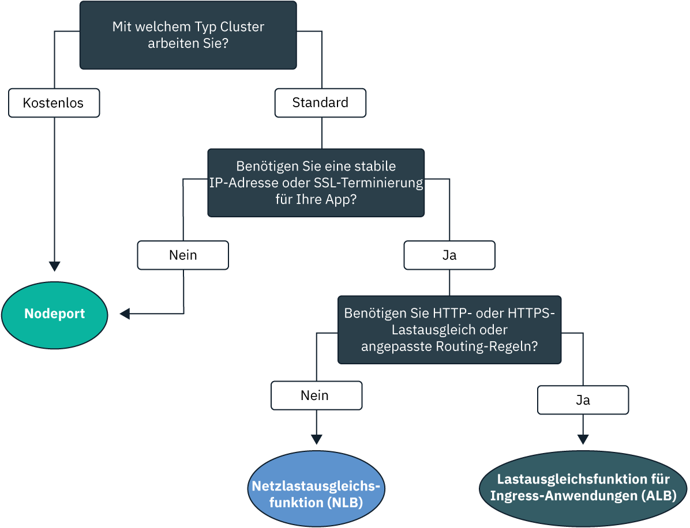
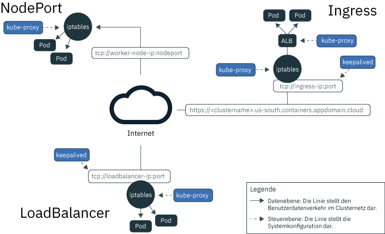
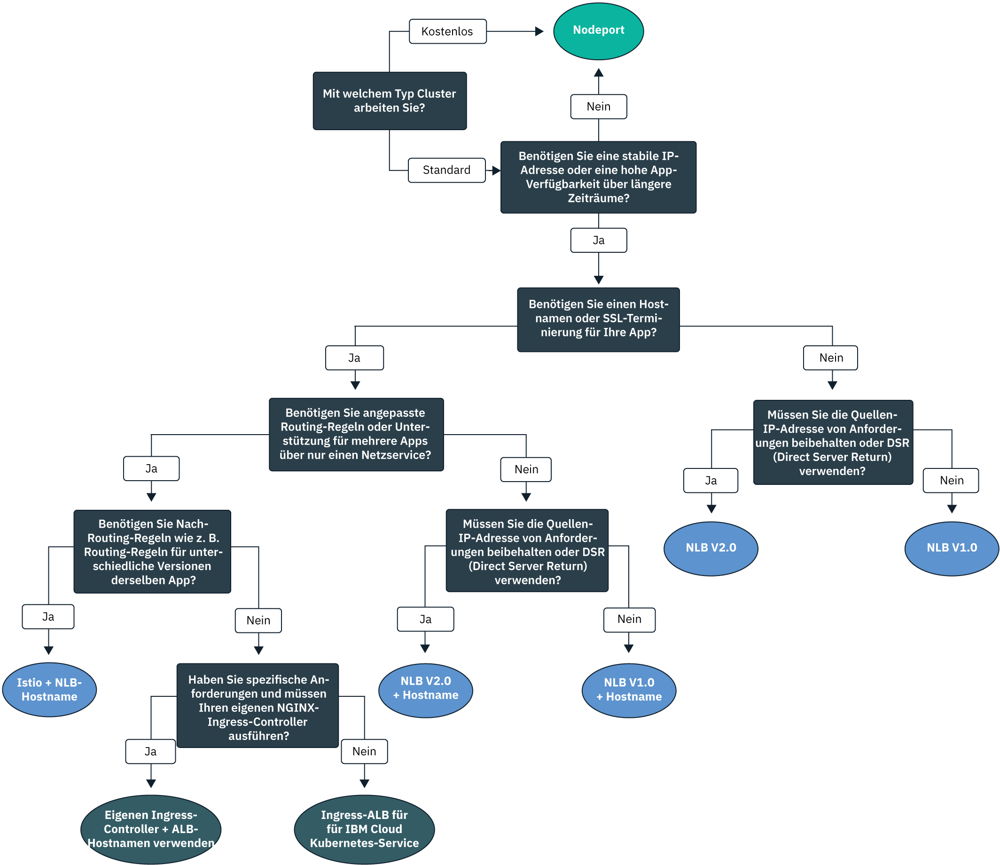

---

copyright:
  years: 2014, 2019
lastupdated: "2019-04-18"

keywords: kubernetes, iks

subcollection: containers

---

{:new_window: target="_blank"}
{:shortdesc: .shortdesc}
{:screen: .screen}
{:pre: .pre}
{:table: .aria-labeledby="caption"}
{:codeblock: .codeblock}
{:tip: .tip}
{:note: .note}
{:important: .important}
{:deprecated: .deprecated}
{:download: .download}

# Zugänglichmachen von Apps mit clusterinternem Netzbetrieb und mit externem Netzbetrieb planen
{: #cs_network_planning}

Mit {{site.data.keyword.containerlong}} können Sie die clusterinterne und externe Vernetzung verwalten, indem Sie Apps öffentlich oder privat zugänglich machen.
{: shortdesc}

Die Informationen dieser Seite unterstützen Sie bei der Planung der clusterinternen und externen Netzbetriebs für Ihre Apps. Informationen zur Einrichtung Ihres Clusters für den Netzbetrieb finden Sie unter [Clusternetz einrichten](/docs/containers?topic=containers-cs_network_cluster).
{: tip}

Um schnell mit dem App-Netzbetrieb zu beginnen, folgen Sie diesem Entscheidungsbaum und klicken Sie auf eine Option, um die zugehörigen Setup-Dokumente anzuzeigen:

<map name="networking_map" id="networking_map">
<area target="" href="/docs/containers?topic=containers-nodeport" alt="NodePort-Service" coords="52,254,78,260,93,270,101,285,92,302,72,314,49,318,19,309,0,281,18,263" shape="poly">
<area target="" href="/docs/containers?topic=containers-loadbalancer" alt="Netzlastausgleichsfunktions- (NLB-) Service" coords="288,405,324,414,348,434,350,455,327,471,295,477,246,471,222,446,237,417" shape="poly">
<area target="" href="/docs/containers?topic=containers-ingress" alt="Ingress-ALB-Service (Application Load Balancer)" coords="532,405,568,410,593,427,600,448,582,468,554,477,508,476,467,463,454,441,474,419" shape="poly">
</map>

## Informationen zum Lastausgleich für Apps über die Kubernetes-Serviceerkennung
{: #in-cluster}

Die Kubernetes-Serviceerkennung stellt Apps mit einer Netzverbindung unter Verwendung von Netzservices und eines lokalen Kubernetes-Proxys zur Verfügung.
{: shortdesc}

**Services** 
Alle Pods, die auf einem Workerknoten bereitgestellt werden, erhalten im Bereich 172.30.0.0/16 eine private IP-Adresse und werden nur zwischen den Workerknoten weitergeleitet. Vermeiden Sie Konflikte, indem Sie diesen IP-Bereich nicht auf Knoten verwenden, die mit Ihren Workerknoten kommunizieren. Workerknoten und Pods können im privaten Netz durch die Verwendung von privaten IP-Adressen sicher kommunizieren. Wenn ein Pod ausfällt oder ein Workerknoten neu erstellt werden muss, wird jedoch eine neue private IP-Adresse zugewiesen.

Anstatt zu versuchen, sich ändernde private IP-Adressen für Apps nachzuverfolgen, die hoch verfügbar sein müssen, können Sie die integrierten Kubernetes-Serviceerkennungsfunktionen nutzen, um Apps als Services zugänglich zu machen. Ein Kubernetes-Service fasst eine Gruppe von Pods zusammen und stellt diesen Pods eine Netzverbindung zur Verfügung. Der Service wählt die Ziel-Pods aus, an die er den Datenverkehr über Bezeichnungen weiterleitet.

Ein Service stellt Konnektivität zwischen Ihren App-Pods und anderen Services im Cluster bereit, ohne hierbei die tatsächlichen privaten IP-Adressen der einzelnen Pods preiszugeben. Services wird eine Cluster-interne IP-Adresse zugeordnet, die `clusterIP`, die nur innerhalb des Clusters zugänglich ist. Diese IP-Adresse ist für die gesamte Lebensdauer des Service an diesen gebunden und ändert sich nicht, solange der Service besteht.
* Neuere Cluster: In Clustern, die nach Februar 2018 in der Zone 'dal13' oder nach Oktober 2017 in einer anderen Zone erstellt wurden, wird Services eine der 65.000 IPs im Bereich 172.21.0.0/16 zugeordnet.
* Ältere Cluster: In Clustern, die vor Februar 2018 in der Zone 'dal13' oder vor Oktober 2017 in einer anderen Zone erstellt wurden, wird Services eine der 254 IPs im Bereich 10.10.10.0/24 zugeordnet. Wenn Sie den Grenzwert von 254 Services erreicht haben und mehr Services benötigen, müssen Sie einen neuen Cluster erstellen.

Vermeiden Sie Konflikte, indem Sie diesen IP-Bereich nicht auf Knoten verwenden, die mit Ihren Workerknoten kommunizieren. Es wird auch ein Eintrag für die DNS-Suche für den Service erstellt und in der Komponente `kube-dns` des Clusters gespeichert. Der DNS-Eintrag enthält den Namen des Service, den Namensbereich, in dem der Service erstellt wurde, und den Link zu der zugeordneten IP-Adresse, die im Cluster enthalten ist.

**`kube-proxy`** 
Um einen grundlegenden Lastausgleich für den gesamten TCP- und UDP-Netzverkehr für Services bereitzustellen, wird ein lokaler Kubernetes-Netzproxy, `kube-proxy`, als Dämon für jeden Workerknoten im Namensbereich `kube-system` ausgeführt. `kube-proxy` verwendet 'Iptables'-Regeln, ein Linux-Kernel-Feature, zum Weiterleiten von Anforderungen an den Pod hinter einem Service, unabhängig von den Cluster-internen IP-Adressen und dem Workerknoten des jeweiligen Pods, für den sie bereitgestellt werden.

Apps innerhalb des Clusters können beispielsweise auf einen Pod hinter einem Cluster-Service zugreifen, indem sie die Cluster-interne IP des Service verwenden oder eine Anforderung an den Namen des Service senden. Wenn Sie den Namen des Service verwenden, sucht `kube-proxy` nach dem Namen im DNS-Provider des Clusters und leitet die Anforderung an die Cluster-interne IP-Adresse des Service weiter.

Wenn Sie einen Service verwenden, der sowohl eine interne Cluster-IP-Adresse als auch eine externe IP-Adresse bereitstellt, können Clients außerhalb des Clusters Anforderungen an die externe öffentliche oder private IP-Adresse des Service senden. `kube-proxy` leitet die Anforderungen an die Cluster-interne IP-Adresse des Service weiter und schafft den Lastausgleich zwischen den App-Pods hinter dem Service.

Die folgende Abbildung zeigt, wie Kubernetes öffentlichen Netzverkehr über `kube-poxy` und den NodePort-, LoadBalancer- oder Ingress-Service in {{site.data.keyword.containerlong_notm}} weiterleitet.

<Abbildung>
  <figcaption>Wie Kubernetes öffentlichen Netzverkehr über den NodePort-, LoadBalancer- oder Ingress-Service in {{site.data.keyword.containerlong_notm}} weiterleitet</figcaption> </figure>

 

## Informationen über Kubernetes-Servicetypen
{: #external}

Kubernetes unterstützt vier Basistypen von Netzservices: `ClusterIP`, `NodePort`, `LoadBalancer` und `Ingress`. `ClusterIP`-Services machen Ihre Apps intern zugänglich, um die Kommunikation nur zwischen Pods in Ihrem Cluster zuzulassen. Der `NodePort`-, `LoadBalancer`- und `Ingress`-Service machen Ihre Apps extern vom öffentlichen Internet oder einem privaten Netz aus zugänglich.
{: shortdesc}

<dl>
<dt>[ClusterIP](https://kubernetes.io/docs/concepts/services-networking/service/#defining-a-service)</dt>
<dd>Sie können Apps nur als Cluster-IP-Services im privaten Netz zugänglich machen. Ein `clusterIP`-Service stellt eine Cluster-interne IP-Adresse bereit, auf die nur andere Pods und Services innerhalb des Clusters zugreifen können. Für die App wird keine externe IP-Adresse erstellt. Um auf einen Pod hinter einem Cluster-Service zuzugreifen, können andere Apps im Cluster entweder die Cluster-interne IP-Adresse des Service verwenden oder eine Anforderung unter Verwendung des Servicenamens senden. Wenn eine Anforderung den Service erreicht, leitet der Service die Anforderungen an die Pods weiter, unabhängig von den IP-Adressen der Pods im Cluster und dem Workerknoten, auf dem sie bereitgestellt wurden. Beachten Sie Folgendes: Wenn Sie keinen Typ (`type`) in der YAML-Konfigurationsdatei eines Service angeben, wird standardmäßig der Typ `ClusterIP` erstellt.</dd>

<dt>[NodePort](/docs/containers?topic=containers-nodeport)</dt>
<dd>Wenn Sie Ihre App mit einem NodePort-Service zugänglich machen, werden dem Service eine Knotenportnummer im Zahlenbereich 30000-32767 und eine interne Cluster-IP-Adresse zugewiesen. Um von außerhalb des Clusters auf den Service zuzugreifen, können Sie die öffentlichen oder private IP-Adresse eines beliebigen Workerknotens und den Knotenport im Format <code>&lt;IP_address&gt;:&lt;nodeport&gt;</code> verwenden. Die öffentliche und private IP-Adresse des Workerknotens sind jedoch keine permanenten Adressen. Wenn ein Workerknoten entfernt oder neu erstellt wird, werden ihm eine neue öffentliche und eine neue private IP-Adresse zugewiesen. Knotenports eignen sich auch ideal zum Testen des öffentlichen oder privaten Zugriffs oder zum Bereitstellen von Zugriff nur für kurze Zeit.</dd>

<dt>[LoadBalancer (NLB)](/docs/containers?topic=containers-loadbalancer)</dt>
<dd>Jeder Standardcluster wird mit 4 portierbaren öffentlichen IP-Adressen und 4 portierbaren privaten IP-Adressen bereitgestellt, mit denen Sie eine Layer 4-TCP/UDP-Netzlastausgleichsfunktion (NLB) für Ihre App erstellen können. Diese NLB kann durch Zugänglichmachen jedes beliebigen Ports, den Ihre App benötigt, entsprechend angepasst werden. Die der NLB zugewiesenen portierbaren öffentlichen und privaten IP-Adressen sind dauerhaft und ändern sich nicht, wenn im Cluster ein Workerknoten neu erstellt wird. Sie können einen Hostnamen für Ihre App erstellen, der öffentliche NLB-IP-Adressen in einem DNS-Eintrag registriert. Sie können außerdem Statusprüfmonitore für die NLB-IP-Adressen für jeden Hostnamen aktivieren.</dd>

<dt>[Ingress (ALB)](/docs/containers?topic=containers-ingress)</dt>
<dd>Sie können mehrere Apps in einem Cluster zugänglich machen, indem Sie eine HTTP-, HTTPS- oder TCP-Lastausgleichsfunktion für Anwendungen (ALB) mit Layer 7 erstellen. Diese ALB verwendet einen geschützten und eindeutigen öffentlichen oder privaten Einstiegspunkt, eine Ingress-Unterdomäne, für die Weiterleitung eingehender Anforderungen an Ihre Apps. Sie können eine Route verwenden, um mehrere Apps in Ihrem Cluster als Services zugänglich zu machen. Ingress besteht aus drei Komponenten:<ul>
  <li>Die Ingress-Ressource definiert die Regeln, die festlegen, wie die Weiterleitung der eingehenden Anforderungen für eine App und deren Lastausgleich erfolgen soll.</li>
  <li>Die ALB ist für eingehende HTTP-, HTTPS- oder TCP-Serviceanforderungen empfangsbereit. Sie leitet Anforderungen über die Pods der App in Übereinstimmung mit den für jede Ingress-Ressource definierten Regeln weiter.</li>
  <li>Der Lastausgleichsfunktion für mehrere Zonen (MZLB) verarbeitet alle eingehenden Anforderungen an Ihre Apps und verteilt diese an die ALBs in den verschiedenen Zonen. Sie aktiviert auch Statusprüfungen für die IP-Adressen der ALB in jeder Zone.</li></ul></dd>
</dl>

 
In der folgenden Tabelle werden die Features der einzelnen Netzservicetypen verglichen.

|Merkmale|ClusterIP|NodePort|LoadBalancer (NLB)|Ingress (ALB)|
|---------------|---------|--------|------------|-------|
|Kostenlose Cluster||| | |
|Standardcluster|||||
|Extern zugänglich| ||||
|Stabile externe IP| | |||
|Externer Hostname| | |||
|SSL-Beendigung| | |||
|HTTP(S)-Lastausgleich| | | ||
|Angepasste Routing-Regeln| | | ||
|Mehrere Apps pro Service| | | ||
{: caption="Merkmale von Kubernetes-Netzservicetypen" caption-side="top"}

Informationen zum Auswählen eines Bereitstellungsmusters für Lastausgleich auf Grundlage eines oder mehrerer dieser Netzservices finden Sie im Abschnitt [Bereitstellungsmuster für den öffentlichen externen Lastausgleich auswählen](#pattern_public) oder [Bereitstellungsmuster für den privaten externen Lastausgleich auswählen](#private_access).

 

## Öffentlichen externen Lastausgleich planen
{: #public_access}

Stellen Sie eine App in Ihrem Cluster öffentlich für das Internet bereit.
{: shortdesc}

Wenn Sie einen Kubernetes-Cluster in {{site.data.keyword.containerlong_notm}} erstellen, können Sie den Cluster mit einem öffentlichen VLAN verbinden. Das öffentliche VLAN bestimmt die öffentliche IP-Adresse, die dem jeweiligen Workerknoten zugeordnet ist. Diese Adresse stellt jedem Workerknoten eine öffentliche Netzschnittstelle bereit. Öffentliche Netzservices stellen eine Verbindung zu dieser öffentlichen Netzschnittstelle her, indem sie Ihre App mit einer öffentlichen IP-Adresse und wahlweise einer öffentlichen URL bereitstellen. Wenn eine App öffentlich zugänglich gemacht wird, kann jeder, der über die öffentliche Service-IP-Adresse oder die URL verfügt, die Sie für Ihre App eingerichtet haben, eine Anforderung an Ihre App senden. Aus diesem Grund machen Sie so wenige Apps wie möglich zugänglich. Machen Sie eine App nur dann der Öffentlichkeit zugänglich, wenn Sie bereit sind, Datenverkehr von externen Web-Clients oder Benutzern zu akzeptieren.

Die öffentliche Netzschnittstelle für Workerknoten wird durch [vordefinierte Calico-Netzrichtlinieneinstellungen](/docs/containers?topic=containers-network_policies#default_policy) geschützt, die bei der Clustererstellung auf jedem Workerknoten konfiguriert werden. Standardmäßig wird der gesamte ausgehende Netzverkehr für alle Workerknoten zugelassen. Eingehender Netzverkehr wird abgesehen von bestimmten Ports blockiert. Diese Ports werden geöffnet, damit IBM den Netzverkehr überwachen und Sicherheitsupdates für den Kubernetes-Master automatisch installieren kann und damit Verbindungen zu NodePort-, LoadBalancer- und Ingress-Services hergestellt werden können. Weitere Informationen zu diesen Richtlinien und zur Vorgehensweise bei der Änderung dieser Richtlinien finden Sie in [Netzrichtlinien](/docs/containers?topic=containers-network_policies#network_policies).

Um eine App öffentlich für das Internet verfügbar zu machen, wählen Sie ein Bereitstellungsmuster für Lastausgleich für Ihre App aus, um öffentliche NodePort-, LoadBalancer- oder Ingress-Services zu erstellen.

### Bereitstellungsmuster für öffentlichen externen Lastausgleich planen
{: #pattern_public}

Wenn es um die Bereitstellung einer App mit einem Netzservice geht, haben Sie mehrere Auswahlmöglichkeiten für Bereitstellungsmuster. Für einen schnellen Start folgen Sie dem Entscheidungsbaum, um ein Bereitstellungsmuster auszuwählen. Weitere Informationen zu den jeweiligen Bereitstellungsmustern, Gründen für ihre Verwendung und Konfigurationsmöglichkeiten finden Sie in der Tabelle nach dem Entscheidungsbaum. Basisinformationen zu den Netzservices, die diese Bereitstellungsmuster verwenden, finden Sie unter [Informationen über Kubernetes-Servicetypen](#external).
{: shortdesc}

<Abbildung>
  
  <figcaption>Anhand dieses Entscheidungsbaums können Sie das bestes Netz-Bereitstellungsmuster für Ihre App auswählen. Die folgende Tabelle liefert Informationen zu den einzelnen Bereitstellungsmustern.</figcaption>
</figure>

<table summary="Die Spalten dieser Tabelle enthalten von links nach rechts Spalten Name, Merkmale, Anwendungsfälle und Bereitstellungsschritte für Bereitstellungsmuster für das öffentliche Netz.">
<caption>Merkmale der Bereitstellungsmuster für das öffentliche Netz im IBM Cloud Kubernetes-Service</caption>
<col width="10%">
<col width="25%">
<col width="25%">
<thead>
<th>Name</th>
<th>Lastausgleichsmethode</th>
<th>Anwendungsfall</th>
<th>Implementierung</th>
</thead>
<tbody>
<tr>
<td>NodePort</td>
<td>Port auf einem Worker-Knoten, der die App für die öffentliche IP-Adresse des Workers verfügbar macht</td>
<td>Testen Sie den öffentlichen Zugriff auf eine App oder bieten Sie Zugriff nur für kurze Zeit.</td>
<td>[Erstellen Sie einen öffentlichen NodePort-Service](/docs/containers?topic=containers-nodeport#nodeport_config).</td>
</tr><tr>
<td>NLB V1.0 (+ Hostname)</td>
<td>Basislastausgleich, der die App mit einer IP-Adresse oder einem Hostnamen zugänglich macht</td>
<td>Sie können eine App mit einer IP-Adresse oder einem Hostnamen, der die SSL-Terminierung unterstützt, schnell für die Öffentlichkeit zugänglich machen.</td>
<td><ol><li>Erstellen Sie eine öffentliche Netzlastausgleichsfunktion (NLB) 1.0 in einem [Einzel](/docs/containers?topic=containers-loadbalancer#lb_config)- oder [Mehrzonen](/docs/containers?topic=containers-loadbalancer#multi_zone_config)-Cluster.</li><li>Optional [registrieren](/docs/containers?topic=containers-loadbalancer#loadbalancer_hostname) Sie einen Hostnamen und Statusprüfungen.</li></ol></td>
</tr><tr>
<td>NLB V2.0 (+ Hostname)</td>
<td>DSR-Lastausgleich, der die App mit einer IP-Adresse oder einem Hostnamen zugänglich macht</td>
<td>Sie können eine App zugänglich machen, die ein hohes Maß an Datenverkehr für die Öffentlichkeit mit einer IP-Adresse oder einem Hostnamen, der die SSL-Terminierung unterstützt, empfangen kann.</td>
<td><ol><li>Vervollständigen Sie die [Voraussetzungen](/docs/containers?topic=containers-loadbalancer#ipvs_provision).</li><li>Erstellen Sie eine öffentliche NLB 2.0 in einem [Einzel](/docs/containers?topic=containers-loadbalancer#ipvs_single_zone_config)- oder [Mehrzonen](/docs/containers?topic=containers-loadbalancer#ipvs_multi_zone_config)-Cluster.</li><li>Optional [registrieren](/docs/containers?topic=containers-loadbalancer#loadbalancer_hostname) Sie einen Hostnamen und Statusprüfungen.</li></ol></td>
</tr><tr>
<td>Istio + NLB-Hostname</td>
<td>Basislastausgleich, der die App mit einem Hostnamen zugänglich macht und Istio-Routing-Regeln verwendet</td>
<td>Implementieren Sie Istio-Regeln nach dem Routing, z. B. Regeln für unterschiedliche Versionen eines App-Microservice, und machen Sie eine Istio-verwaltete App mit einem öffentlichen Hostnamen zugänglich.</li></ol></td>
<td><ol><li>Installieren Sie das [verwaltete Istio-Add-on](/docs/containers?topic=containers-istio#istio_install).</li><li>Beziehen Sie Ihre App in das [Istio-Servicenetz](/docs/containers?topic=containers-istio#istio_sidecar) ein.</li><li>Registrieren Sie die standardmäßige Istio-Lastausgleichsfunktion mit [einem Hostnamen](/docs/containers?topic=containers-istio#istio_expose_link).</li></ol></td>
</tr><tr>
<td>Ingress-ALB</td>
<td>HTTPS-Lastausgleich, der die App mit einem Hostnamen zugänglich macht und angepasste Routing-Regeln verwendet</td>
<td>Implementieren Sie angepasste Routing-Regeln und die SSL-Terminierung für mehrere Apps.</td>
<td><ol><li>Erstellen Sie einen [Ingress-Service](/docs/containers?topic=containers-ingress#ingress_expose_public) für die öffentliche ALB.</li><li>Passen Sie die ALB-Routing-Regeln mit [Annotationen](/docs/containers?topic=containers-ingress_annotation)an.</li></ol></td>
</tr><tr>
<td>Eigenen Ingress-Controller + ALB-Hostnamen verwenden</td>
<td>HTTPS-Lastausgleich mit angepasstem Ingress-Controller, der die App mit einem von IBM bereitgestellten Hostnamen zugänglich macht und angepasste Routing-Regeln verwendet</td>
<td>Implementieren Sie angepasste Routing-Regeln oder andere spezifische Anforderungen für die angepasste Optimierung für mehrere Anwendungen.</td>
<td>[Stellen Sie Ihren Ingress-Controller bereit und nutzen Sie den von IBM bereitgestellten ALB-Hostnamen](/docs/containers?topic=containers-ingress#user_managed).</td>
</tr>
</tbody>
</table>

Wünschen Sie noch weitere Details zu den Bereitstellungsmustern für Lastausgleich, die in {{site.data.keyword.containerlong_notm}} verfügbar sind? Schauen Sie sich diesen [Blogeintrag ](https://www.ibm.com/blogs/bluemix/2018/10/ibm-cloud-kubernetes-service-deployment-patterns-for-maximizing-throughput-and-availability/) an.
{: tip}

 

## Privaten externen Lastausgleich planen
{: #private_access}

Stellen Sie eine App privat in Ihrem Cluster nur für das private Netz bereit.
{: shortdesc}

Wenn Sie eine App in einem Kubernetes-Cluster in {{site.data.keyword.containerlong_notm}} bereitstellen, haben Sie die Möglichkeit, die App nur für solche Benutzer und Services zugänglich zu machen, die sich in demselben privaten Netz wie Ihr Cluster befinden. Nehmen Sie zum Beispiel an, dass Sie eine private NLB für Ihre App erstellt haben. Auf diese private NLB ist der Zugriff wie folgt möglich:
* Von einem beliebigen Pod im selben Cluster.
* Von einem beliebigen Pod in einem beliebigen Cluster im selben {{site.data.keyword.Bluemix_notm}}-Konto.
* Von jedem System, das mit einem beliebigen der privaten VLANs im selben {{site.data.keyword.Bluemix_notm}}-Konto verbunden ist (wenn eine [VRF-Funktion](/docs/containers?topic=containers-cs_network_ov#cs_network_ov_basics_segmentation) oder [VLAN-Spanning](/docs/containers?topic=containers-subnets#subnet-routing) aktiviert ist).
* Von allen Systemen über eine VPN-Verbindung zu dem Teilnetz, auf dem sich die NLB-IP-Adresse befindet (wenn Sie sich nicht im {{site.data.keyword.Bluemix_notm}}-Konto, aber dennoch hinter der Unternehmensfirewall befinden).
* Von einem beliebigen System über eine VPN-Verbindung zu dem Teilnetz, auf dem sich die NLB-IP-Adresse befindet (wenn Sie sich nicht im selben {{site.data.keyword.Bluemix_notm}}-Konto befinden).
Der private Lastausgleich eignet sich ideal, um Ihre App für Anforderungen von außerhalb des Clusters verfügbar zu machen, ohne die App der allgemeinen Öffentlichkeit zugänglich zu machen. Sie können den privaten Lastausgleich auch verwenden, um den Zugriff, das Anforderungsrouting und andere Konfigurationen für Ihre App zu testen, bevor Sie Ihre App später mit öffentlichen Netzservices der Öffentlichkeit zugänglich machen.

Um eine App nur über ein privates Netz verfügbar zu machen, wählen Sie ein Bereitstellungsmuster für Lastausgleich basierend auf der VLAN-Konfiguration Ihres Clusters:
* [Öffentliche und private VLAN-Konfiguration](#private_both_vlans)
* [Nur private VLAN-Konfiguration](#plan_private_vlan)

### Privaten Lastausgleich in öffentlicher und privater VLAN-Konfiguration einrichten
{: #private_both_vlans}

Wenn die Workerknoten sowohl mit einem öffentlichen als auch mit einem privaten VLAN verbunden sind, können Sie Ihre App ausschließlich über ein privates Netz zugänglich machen, indem Sie private NodePort-, LoadBalancer- oder Ingress-Services verwenden. Anschließend können Sie Calico-Richtlinien erstellen, um den öffentlichen Datenverkehr an die Services zu blockieren.
{: shortdesc}

Die öffentliche Netzschnittstelle für Workerknoten wird durch [vordefinierte Calico-Netzrichtlinieneinstellungen](/docs/containers?topic=containers-network_policies#default_policy) geschützt, die bei der Clustererstellung auf jedem Workerknoten konfiguriert werden. Standardmäßig wird der gesamte ausgehende Netzverkehr für alle Workerknoten zugelassen. Eingehender Netzverkehr wird abgesehen von bestimmten Ports blockiert. Diese Ports werden geöffnet, damit IBM den Netzverkehr überwachen und Sicherheitsupdates für den Kubernetes-Master automatisch installieren kann und damit Verbindungen zu NodePort-, LoadBalancer- und Ingress-Services hergestellt werden können.

Überprüfen Sie die folgenden Bereitstellungsmuster für Lastausgleich für privaten Netzbetrieb:

|Name|Lastausgleichsmethode|Anwendungsfall|Implementierung|
|----|---------------------|--------|--------------|
|NodePort|Port auf einem Worker-Knoten, der die App für die private IP-Adresse des Workers verfügbar macht|Testen Sie den privaten Zugriff auf eine App oder bieten Sie Zugriff nur für kurze Zeit.|<ol><li>[Erstellen Sie einen NodePort-Service](/docs/containers?topic=containers-nodeport).</li><li>Ein NodePort-Service öffnet einen Port auf einem Workerknoten sowohl über die private als auch über die öffentliche IP-Adresse des Workerknotens. Sie müssen eine [Calico-PreDNAT-Netzrichtlinie](/docs/containers?topic=containers-network_policies#block_ingress) verwenden, um Datenverkehr zu den öffentlichen Knotenports zu blockieren.</li></ol>|
|NLB V1.0|Basislastausgleich, der die App mit einer privaten IP-Adresse zugänglich macht|Schnelles Zugänglichmachen von nur einer App in einem privaten Netzwerk mit einer privaten IP-Adresse.|<ol><li>[Erstellen Sie einen privaten NLB-Service](/docs/containers?topic=containers-loadbalancer).</li><li>Eine NLB mit einer portierbaren privaten IP-Adresse verfügt weiterhin auf jedem Workerknoten über einen offenen öffentlichen Knotenport (NodePort). Erstellen Sie eine [Calico-PreDNAT-Netzrichtlinie](/docs/containers?topic=containers-network_policies#block_ingress), um Datenverkehr zu den öffentlichen Knotenports zu blockieren.</li></ol>|
|NLB V2.0|DSR-Lastausgleich, der die App mit einer privaten IP-Adresse zugänglich macht|Sie können eine App zugänglich machen, die ein hohes Maß an Datenverkehr für ein privates Netz mit einer IP-Adresse empfangen kann.|<ol><li>[Erstellen Sie einen privaten NLB-Service](/docs/containers?topic=containers-loadbalancer).</li><li>Eine NLB mit einer portierbaren privaten IP-Adresse verfügt weiterhin auf jedem Workerknoten über einen offenen öffentlichen Knotenport (NodePort). Erstellen Sie eine [Calico-PreDNAT-Netzrichtlinie](/docs/containers?topic=containers-network_policies#block_ingress), um Datenverkehr zu den öffentlichen Knotenports zu blockieren.</li></ol>|
|Ingress-ALB|HTTPS-Lastausgleich, der die App mit einem Hostnamen zugänglich macht und angepasste Routing-Regeln verwendet|Implementieren Sie angepasste Routing-Regeln und die SSL-Terminierung für mehrere Apps.|<ol><li>[Inaktivieren Sie die öffentliche ALB](/docs/containers?topic=containers-cs_cli_reference#cs_alb_configure)</li><li>[Aktivieren Sie die private ALB und erstellen Sie eine Ingress-Ressource](/docs/containers?topic=containers-ingress#private_ingress).</li><li>Passen Sie die ALB-Routing-Regeln mit [Annotationen](/docs/containers?topic=containers-ingress_annotation)an.</li></ol>|
{: caption="Merkmale von Netzbereitstellungsmustern für die öffentliche und private VLAN-Konfiguration" caption-side="top"}

Da die Standard-Calico-Netzrichtlinien eingehenden öffentlichen Datenverkehr an diese Services zulassen, können Sie Calico-Richtlinien erstellen, um den gesamten öffentlichen Datenverkehr an die Services stattdessen zu blockieren. Beispielsweise öffnet ein NodePort-Service einen Port auf einem Workerknoten sowohl über die private als auch über die öffentliche IP-Adresse des Workerknotens. Ein NLB-Service mit einer portierbaren privaten IP-Adresse öffnet einen öffentlichen Knotenport auf jedem Workerknoten. Sie müssen eine [Calico-PreDNAT-Netzrichtlinie](/docs/containers?topic=containers-network_policies#block_ingress) erstellen, um öffentliche Knotenports (NodePorts) zu blockieren.
{: tip}

 

### Privaten Lastausgleich nur für private VLAN-Konfiguration einrichten
{: #plan_private_vlan}

Wenn die Workerknoten nur mit einem privaten VLAN verbunden sind, können Sie Ihre App ausschließlich über ein privates Netz extern zugänglich machen, indem Sie einen privaten NodePort-, LoadBalancer- oder Ingress-Service erstellen.
{: shortdesc}

Wenn Ihr Cluster nur mit einem privaten VLAN verbunden ist und Sie die Kommunikation zwischen dem Master und den Workerknoten über einen nur privaten Serviceendpunkt einrichten, können Sie Ihre Apps nicht automatisch für ein privates Netz zugänglich machen. Sie müssen eine Gateway-Einheit, wie zum Beispiel eine [VRA (Vyatta)](/docs/infrastructure/virtual-router-appliance?topic=virtual-router-appliance-about-the-vra) oder eine [FSA](/docs/services/vmwaresolutions/services?topic=vmware-solutions-fsa_considerations), als Firewall und zum Blockieren bzw. Zulassen von Datenverkehr einrichten. Da Ihre Workerknoten nicht mit einem öffentlichen VLAN verbunden sind, wird kein öffentlicher Datenverkehr an den NodePort-, LoadBalancer- oder Ingress-Service weitergeleitet. Allerdings müssen Sie die erforderlichen Ports und IP-Adressen in der Firewall Ihrer Gateway-Einheit öffnen, um eingehenden Datenverkehr für diese Services zuzulassen.

Überprüfen Sie die folgenden Bereitstellungsmuster für Lastausgleich für privaten Netzbetrieb:

|Name|Lastausgleichsmethode|Anwendungsfall|Implementierung|
|----|---------------------|--------|--------------|
|NodePort|Port auf einem Worker-Knoten, der die App für die private IP-Adresse des Workers verfügbar macht|Testen Sie den privaten Zugriff auf eine App oder bieten Sie Zugriff nur für kurze Zeit.|<ol><li>[Erstellen Sie einen NodePort-Service](/docs/containers?topic=containers-nodeport).</li><li>Öffnen Sie in der Firewall den Port, den Sie bei der Bereitstellung des Service an den privaten IP-Adressen für alle Workerknoten konfiguriert haben, mit denen Datenverkehr möglich sein soll. Führen Sie `kubectl get svc` aus, um den Port zu suchen. Der Port liegt im Bereich 20000-32000.</li></ol>|
|NLB V1.0|Basislastausgleich, der die App mit einer privaten IP-Adresse zugänglich macht|Schnelles Zugänglichmachen von nur einer App in einem privaten Netzwerk mit einer privaten IP-Adresse.|<ol><li>[Erstellen Sie einen privaten NLB-Service](/docs/containers?topic=containers-loadbalancer).</li><li>Öffnen Sie in der privaten Firewall den Port, den Sie bei der Bereitstellung des Service an der privaten NLB-IP-Adresse konfiguriert haben.</li></ol>|
|NLB V2.0|DSR-Lastausgleich, der die App mit einer privaten IP-Adresse zugänglich macht|Sie können eine App zugänglich machen, die ein hohes Maß an Datenverkehr für ein privates Netz mit einer IP-Adresse empfangen kann.|<ol><li>[Erstellen Sie einen privaten NLB-Service](/docs/containers?topic=containers-loadbalancer).</li><li>Öffnen Sie in der privaten Firewall den Port, den Sie bei der Bereitstellung des Service an der privaten NLB-IP-Adresse konfiguriert haben.</li></ol>|
|Ingress-ALB|HTTPS-Lastausgleich, der die App mit einem Hostnamen zugänglich macht und angepasste Routing-Regeln verwendet|Implementieren Sie angepasste Routing-Regeln und die SSL-Terminierung für mehrere Apps.|<ol><li>Konfigurieren Sie einen [DNS-Service, der für das private Netz verfügbar ist](https://kubernetes.io/docs/tasks/administer-cluster/dns-custom-nameservers/).</li><li>[Aktivieren Sie die private ALB und erstellen Sie eine Ingress-Ressource](/docs/containers?topic=containers-ingress#private_ingress).</li><li>Öffnen Sie in Ihrer privaten Firewall Port 80 für HTTP oder Port 443 für HTTPS an der IP-Adresse für die private ALB.</li><li>Passen Sie die ALB-Routing-Regeln mit [Annotationen](/docs/containers?topic=containers-ingress_annotation)an.</li></ol>|
{: caption="Merkmale von Netzbereitstellungsmustern nur für private VLAN-Konfiguration" caption-side="top"}
