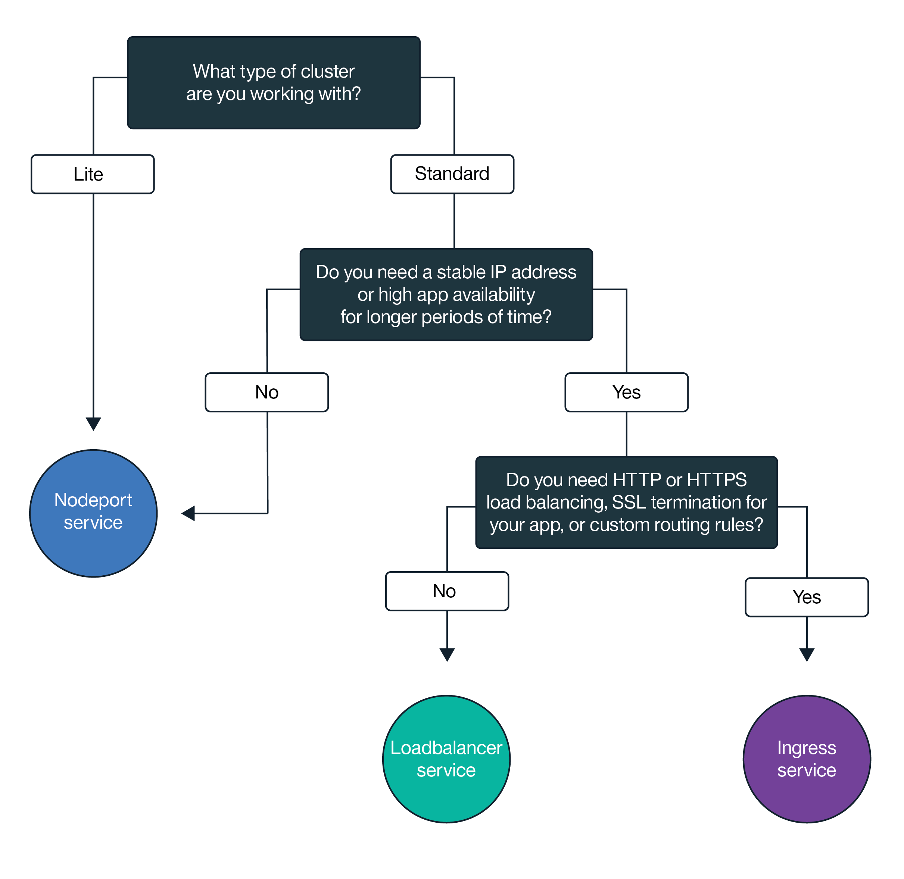

---

copyright:
  years: 2014, 2019
lastupdated: "2019-03-21"

keywords: kubernetes, iks

subcollection: containers

---

{:new_window: target="_blank"}
{:shortdesc: .shortdesc}
{:screen: .screen}
{:pre: .pre}
{:table: .aria-labeledby="caption"}
{:codeblock: .codeblock}
{:tip: .tip}
{:note: .note}
{:important: .important}
{:deprecated: .deprecated}
{:download: .download}

# Zugänglichmachen von Apps mit clusterinternem Netzbetrieb und mit externem Netzbetrieb planen
{: #cs_network_planning}

Mit {{site.data.keyword.containerlong}} können Sie die clusterinterne und externe Vernetzung verwalten, indem Sie Apps öffentlich oder privat zugänglich machen.
{: shortdesc}

Die Informationen dieser Seite unterstützen Sie bei der Planung der clusterinternen und externen Netzbetriebs für Ihre Apps. Informationen zur Einrichtung Ihres Clusters für den Netzbetrieb finden Sie unter [Clusternetz einrichten](/docs/containers?topic=containers-cs_network_cluster).
{: tip}

## Apps für Datenverkehr innerhalb des Clusters durch Kubernetes-Services zugänglich machen
{: #in-cluster}

Erstellen Sie Kubernetes Erkennungsservices, um die Kommunikation zwischen Pods in Ihrem Cluster zu ermöglichen.
{: shortdesc}

<figure>
 
 <figcaption>Apps im Cluster mit Kubernetes- Services zugänglich machen</figcaption>
</figure>

Alle Pods, die auf einem Workerknoten bereitgestellt werden, erhalten im Bereich 172.30.0.0/16 eine private IP-Adresse und werden nur zwischen den Workerknoten weitergeleitet. Vermeiden Sie Konflikte, indem Sie diesen IP-Bereich nicht auf Knoten verwenden, die mit Ihren Workerknoten kommunizieren. Workerknoten und Pods können im privaten Netz durch die Verwendung von privaten IP-Adressen sicher kommunizieren. Wenn ein Pod ausfällt oder ein Workerknoten neu erstellt werden muss, wird jedoch eine neue private IP-Adresse zugewiesen.

Standardmäßig ist es schwierig, sich ändernde private IP-Adressen für Apps nachzuverfolgen, die hoch verfügbar sein müssen. Stattdessen können Sie die integrierten Erkennungsfunktionen des Kubernetes-Service nutzen, um Anwendungen als Cluster-IP-Services im privaten Netz zugänglich zu machen. Ein Kubernetes-Service fasst eine Gruppe von Pods zusammen und stellt diesen Pods eine Netzverbindung zur Verfügung. Diese Verbindung stellen Konnektivität zu anderen Services im Cluster bereit, ohne hierbei die tatsächlichen privaten IP-Adressen der einzelnen Pods preiszugeben. Services wird eine IP-Cluster-IP-Adresse zugeordnet, auf die nur innerhalb des Clusters zugegriffen werden kann.
* Ältere Cluster: In Clustern, die vor Februar 2018 in der Zone 'dal13' oder vor Oktober 2017 in einer anderen Zone erstellt wurden, wird den Services eine der 254 IPs im Bereich 10.10.10.0/24 zugeordnet. Wenn Sie den Grenzwert von 254 Services erreicht haben und mehr Services benötigen, müssen Sie einen neuen Cluster erstellen.
* Neuere Cluster: In Clustern, die nach Februar 2018 in der Zone 'dal13' oder nach Oktober 2017 in einer anderen Zone erstellt wurden, wird den Services eine der 65.000 IPs im Bereich 172.21.0.0/16 zugeordnet.

Vermeiden Sie Konflikte, indem Sie diesen IP-Bereich nicht auf Knoten verwenden, die mit Ihren Workerknoten kommunizieren. Es wird auch ein Eintrag für die DNS-Suche für den Service erstellt und in der Komponente `kube-dns` des Clusters gespeichert. Der DNS-Eintrag enthält den Namen des Service, den Namensbereich, in dem der Service erstellt wurde, und den Link zu der zugeordneten IP-Adresse, die im Cluster enthalten ist.

Um auf einen Pod hinter einem Cluster-Service zuzugreifen, können Apps entweder die IP-Adresse des Service im Cluster verwenden oder eine Anforderung mit dem Namen des Service senden. Wenn Sie den Namen des Service verwenden, wird dieser in der Komponente `kube-dns` gesucht und an die IP-Adresse des Service im Cluster weitergeleitet. Wenn eine Anforderung den Service erreicht, leitet der Service die Anforderungen an die Pods weiter, unabhängig von den IP-Adressen der Pods im Cluster und dem Workerknoten, auf dem sie bereitgestellt wurden.

 

## NodePort-, LoadBalancer- oder Ingress-Service auswählen, um Apps für Datenverkehr außerhalb des Clusters zugänglich zu machen
{: #external}

Wenn Sie Ihre Apps extern über das öffentliche Internet oder ein privates Netz zugänglich machen möchten, unterstützt {{site.data.keyword.containerlong_notm}} drei Netzservices.
{:shortdesc}

**[NodePort-Service](/docs/containers?topic=containers-nodeport)** (kostenlose Cluster und Standardcluster)
* Machen Sie auf jedem Workerknoten einen Port zugänglich und verwenden Sie die öffentliche oder private IP-Adresse der einzelnen Workerknoten, um auf Ihren Service im Cluster zuzugreifen.
* Iptables ist ein Linux-Kernel-Feature für den Lastausgleich von Anforderungen in allen Pods der App, das eine Hochleistungsnetzweiterleitung und Netzzugriffssteuerung bietet.
* Die öffentlichen und privaten IP-Adressen des Workerknotens sind nicht permanente Adressen. Wenn ein Workerknoten entfernt oder neu erstellt wird, werden ihm eine neue öffentliche und eine neue private IP-Adresse zugewiesen.
* Der NodePort-Service eignet sich gut zum Testen des öffentlichen oder privaten Zugriffs. Er kann auch verwendet werden, wenn Sie nur für kurze Zeit einen öffentlichen oder privaten Zugriff benötigen.

**[LoadBalancer-Service](/docs/containers?topic=containers-loadbalancer)** (nur Standardcluster)
* Jeder Standardcluster wird mit 4 portierbaren öffentlichen IP-Adressen und 4 portierbaren privaten IP-Adressen bereitgestellt, mit denen Sie eine externe TCP/UDP-Lastausgleichsfunktion (LoadBalancer) für Ihre App erstellen können. Diese Lastausgleichsfunktion kann durch Offenlegung jedes beliebigen Ports, den Ihre App benötigt, entsprechend angepasst werden.
* Iptables ist ein Linux-Kernel-Feature für den Lastausgleich von Anforderungen in allen Pods der App, das eine Hochleistungsnetzweiterleitung und Netzzugriffssteuerung bietet.
* Die der Lastausgleichsfunktion zugewiesenen portierbaren öffentlichen und privaten IP-Adressen sind dauerhaft und ändern sich nicht, wenn im Cluster ein Workerknoten neu erstellt wird.
* Sie können einen Hostnamen für Ihre App erstellen, der öffentliche IP-Adressen für die Lastausgleichsfunktion in einem DNS-Eintrag registriert. Sie können außerdem Statusprüfmonitore für die IP-Adressen der Lastausgleichsfunktion für jeden Hostnamen aktivieren.

**[Ingress](/docs/containers?topic=containers-ingress)** (nur Standardcluster)
* Sie können mehrere Apps in einem Cluster zugänglich machen, indem Sie eine externe HTTP-, HTTPS- oder TCP-Lastausgleichsfunktion für Anwendungen (ALB) erstellen. Diese ALB verwendet einen geschützten und eindeutigen öffentlichen oder privaten Einstiegspunkt, eine Ingress-Unterdomäne, für die Weiterleitung eingehender Anforderungen an Ihre Apps.
* Sie können eine Route verwenden, um mehrere Apps in Ihrem Cluster als Services zugänglich zu machen.
* Ingress besteht aus drei Komponenten:
  * Die Ingress-Ressource definiert die Regeln, die festlegen, wie die Weiterleitung der eingehenden Anforderungen für eine App und deren Lastausgleich erfolgen soll.
  * Die ALB ist für eingehende HTTP-, HTTPS- oder TCP-Serviceanforderungen empfangsbereit. Sie leitet Anforderungen über die Pods der App in Übereinstimmung mit den für jede Ingress-Ressource definierten Regeln weiter.
  * Der Lastausgleichsfunktion für mehrere Zonen (MZLB) verarbeitet alle eingehenden Anforderungen an Ihre Apps und verteilt diese an die ALBs in den verschiedenen Zonen. Sie aktiviert auch Statusprüfungen für die IP-Adressen der ALB in jeder Zone.
* Verwenden Sie Ingress, wenn Sie Ihre eigene ALB mit angepassten Routing-Regeln implementieren müssen und eine SSL-Terminierung für Ihre Apps benötigen.

Um den besten Netzservice für Ihre App auszuwählen, können Sie diesem Entscheidungsbaum folgen und auf eine der Optionen klicken, um zu beginnen.

<map name="networking_map" id="networking_map">
<area href="/docs/containers?topic=containers-nodeport" alt="NodePort-Service" shape="circle" coords="52, 283, 45"/>
<area href="/docs/containers?topic=containers-loadbalancer" alt="LoadBalancer-Service" shape="circle" coords="247, 419, 44"/>
<area href="/docs/containers?topic=containers-ingress" alt="Ingress-Service" shape="circle" coords="445, 420, 45"/>
</map>

Wünschen Sie weitere Details zu den Bereitstellungsmustern für Lastausgleich, die in {{site.data.keyword.containerlong_notm}} verfügbar sind? Schauen Sie sich diesen [Blogeintrag ](https://www.ibm.com/blogs/bluemix/2018/10/ibm-cloud-kubernetes-service-deployment-patterns-for-maximizing-throughput-and-availability/) an.
{: tip}

 

## Öffentliche externe Vernetzung für eine öffentliche und private VLAN-Konfiguration planen
{: #public_access}

Wenn Sie einen Kubernetes-Cluster in {{site.data.keyword.containerlong_notm}} erstellen, können Sie den Cluster mit einem öffentlichen VLAN verbinden. Das öffentliche VLAN bestimmt die öffentliche IP-Adresse, die dem jeweiligen Workerknoten zugeordnet ist. Diese Adresse stellt jedem Workerknoten eine öffentliche Netzschnittstelle bereit.
{:shortdesc}

<figure>
 
 <figcaption>Apps für ein öffentliches Netz in einer Standardnetzkonfiguration zugänglich machen</figcaption>
</figure>

Die öffentliche Netzschnittstelle für Workerknoten wird durch [vordefinierte Calico-Netzrichtlinieneinstellungen](/docs/containers?topic=containers-network_policies#default_policy) geschützt, die bei der Clustererstellung auf jedem Workerknoten konfiguriert werden.

Standardmäßig wird der gesamte ausgehende Netzverkehr für alle Workerknoten zugelassen. Eingehender Netzverkehr wird abgesehen von bestimmten Ports blockiert. Diese Ports werden geöffnet, damit IBM den Netzverkehr überwachen und Sicherheitsupdates für den Kubernetes-Master automatisch installieren kann und damit Verbindungen zu NodePort-, LoadBalancer- und Ingress-Services hergestellt werden können. Weitere Informationen zu diesen Richtlinien und zur Vorgehensweise bei der Änderung dieser Richtlinien finden Sie in [Netzrichtlinien](/docs/containers?topic=containers-network_policies#network_policies).

Um eine App öffentlich für das Internet verfügbar zu machen, können Sie einen NodePort-, LoadBalancer- oder Ingress-Service erstellen. Informationen zum Vergleichen der einzelnen Services finden Sie im Abschnitt [NodePort-, LoadBalancer- oder Ingress-Service auswählen](#external).

Das folgende Diagramm zeigt, wie Kubernetes den öffentlichen Netzverkehr in {{site.data.keyword.containerlong_notm}} weiterleitet.

 

## Private externe Vernetzung für ein öffentliches und privates VLAN-Setup planen
{: #private_both_vlans}

Wenn die Workerknoten sowohl mit einem öffentlichen als auch mit einem privaten VLAN verbunden sind, können Sie Ihre App ausschließlich über ein privates Netz zugänglich machen, indem Sie private NodePort-, LoadBalancer- oder Ingress-Services verwenden. Anschließend können Sie Calico-Richtlinien erstellen, um den öffentlichen Datenverkehr an die Services zu blockieren.
{: shortdesc}

Die öffentliche Netzschnittstelle für Workerknoten wird durch [vordefinierte Calico-Netzrichtlinieneinstellungen](/docs/containers?topic=containers-network_policies#default_policy) geschützt, die bei der Clustererstellung auf jedem Workerknoten konfiguriert werden. Standardmäßig wird der gesamte ausgehende Netzverkehr für alle Workerknoten zugelassen. Eingehender Netzverkehr wird abgesehen von bestimmten Ports blockiert. Diese Ports werden geöffnet, damit IBM den Netzverkehr überwachen und Sicherheitsupdates für den Kubernetes-Master automatisch installieren kann und damit Verbindungen zu NodePort-, LoadBalancer- und Ingress-Services hergestellt werden können.

Wenn Sie Ihre Apps ausschließlich über ein privates Netz zugänglich machen möchten, können Sie private NodePort-, LoadBalancer- oder Ingress-Services erstellen.

**NodePort**
* [Erstellen Sie einen NodePort-Service](/docs/containers?topic=containers-nodeport). Zusätzlich zur öffentlichen IP-Adresse steht ein NodePort-Service über die private IP-Adresse eines Workerknotens zur Verfügung.
* Ein NodePort-Service öffnet einen Port auf einem Workerknoten sowohl über die private als auch über die öffentliche IP-Adresse des Workerknotens. Sie müssen eine [Calico-PreDNAT-Netzrichtlinie](/docs/containers?topic=containers-network_policies#block_ingress) verwenden, um die öffentlichen Knotenports (NodePorts) zu blockieren.

**LoadBalancer**
* [Erstellen Sie einen privaten LoadBalancer-Service](/docs/containers?topic=containers-loadbalancer).
* Ein LoadBalancer-Service mit einer portierbaren privaten IP-Adresse verfügt weiterhin auf jedem Workerknoten über einen offenen öffentlichen Knotenport (NodePort). Sie müssen eine [Calico-PreDNAT-Netzrichtlinie ](/docs/containers?topic=containers-network_policies#block_ingress) verwenden, um die öffentlichen Knotenports für den Knoten zu blockieren.

**Ingress**
* Wenn Sie einen Cluster erstellen, werden automatisch eine öffentliche und eine private Ingress-Lastausgleichsfunktion für Anwendungen (ALB) erstellt. Da die öffentliche ALB aktiviert ist und die private ALB standardmäßig inaktiviert ist, müssen Sie [die öffentliche ALB inaktivieren](/docs/containers?topic=containers-cs_cli_reference#cs_alb_configure) und [die private ALB aktivieren](/docs/containers?topic=containers-ingress#private_ingress).
* Erstellen Sie anschließend [einen privaten Ingress-Service](/docs/containers?topic=containers-ingress#ingress_expose_private).

Da die Standard-Calico-Netzrichtlinien eingehenden öffentlichen Datenverkehr an diese Services zulassen, können Sie Calico-Richtlinien erstellen, um den gesamten öffentlichen Datenverkehr an die Services stattdessen zu blockieren. Beispielsweise öffnet ein NodePort-Service einen Port auf einem Workerknoten sowohl über die private als auch über die öffentliche IP-Adresse des Workerknotens. Ein Lastausgleichsservice mit einer portierbaren privaten IP-Adresse öffnet einen öffentlichen Knotenport auf jedem Workerknoten. Sie müssen eine [Calico-PreDNAT-Netzrichtlinie](/docs/containers?topic=containers-network_policies#block_ingress) erstellen, um öffentliche Knotenports (NodePorts) zu blockieren.

Nehmen Sie zum Beispiel an, dass Sie einen privaten Lastausgleichsservice erstellt haben. Außerdem haben Sie eine Calico-PreDNAT-Richtlinie erstellt, um den öffentlichen Datenverkehr zu blockieren, sodass er nicht zu den öffentlichen NodePorts gelangt, die von der Lastausgleichsfunktion geöffnet werden. Auf diese private Lastausgleichsfunktion ist der Zugriff wie folgt möglich:
* Von einem beliebigen Pod in demselben Cluster
* Von einem Pod in einem beliebigen Cluster in demselben {{site.data.keyword.Bluemix_notm}}-Konto
* Von allen Systemen, die mit einem der privaten VLANs in demselben {{site.data.keyword.Bluemix_notm}}-Konto verbunden sind (wenn das [VLAN-Spanning aktiviert](/docs/containers?topic=containers-subnets#subnet-routing) ist)
* Von allen Systemen über eine VPN-Verbindung zu dem Teilnetz, auf dem sich die IP-Adresse der Lastausgleichsfunktion befindet (wenn Sie sich nicht im {{site.data.keyword.Bluemix_notm}}-Konto, aber dennoch hinter der Unternehmensfirewall befinden)
* Von allen Systemen über eine VPN-Verbindung zu dem Teilnetz, auf dem sich die IP-Adresse der Lastausgleichsfunktion befindet (wenn Sie sich in einem anderen {{site.data.keyword.Bluemix_notm}}-Konto befinden)

 

## Private externe Netze ausschließlich für private VLAN-Konfiguration planen
{: #plan_private_vlan}

Wenn die Workerknoten nur mit einem privaten VLAN verbunden sind und Sie die Kommunikation zwischen dem Master und den Workerknoten durch eine [Gateway-Einheit](/docs/containers?topic=containers-cs_network_ov#cs_network_ov_master_gateway) einrichten, können Sie Ihre App ausschließlich über ein privates Netz zugänglich machen, indem Sie private NodePort-, LoadBalancer- oder Ingress-Services erstellen.
{: shortdesc}

<figure>
 
 <figcaption>Apps für ein privates Netz in einer privaten Netzkonfiguration zugänglich machen</figcaption>
</figure>

Da Ihre Workerknoten nicht mit einem öffentlichen VLAN verbunden sind, wird kein öffentlicher Datenverkehr an diese Services weitergeleitet. Sie müssen außerdem [die erforderlichen Ports und IP-Adressen in Ihrer Firewall für die Gateway-Einheit öffnen](/docs/containers?topic=containers-firewall#firewall_inbound), um den eingehenden Datenverkehr für diese Services zuzulassen.

**NodePort**:
* [Erstellen Sie einen privaten NodePort-Service](/docs/containers?topic=containers-nodeport). Der Service ist über die private IP-Adresse eines Workerknotens verfügbar.
* Öffnen Sie in der Firewall den Port, den Sie bei der Bereitstellung des Service an den privaten IP-Adressen für alle Workerknoten konfiguriert haben, mit denen Datenverkehr möglich sein soll. Führen Sie `kubectl get svc` aus, um den Port zu suchen. Der Port liegt im Bereich 20000-32000.

**LoadBalancer**
* [Erstellen Sie einen privaten LoadBalancer-Service](/docs/containers?topic=containers-loadbalancer). Wenn Ihr Cluster ausschließlich in einem privaten VLAN verfügbar ist, wird eine der vier verfügbaren, portierbaren, privaten IP-Adressen verwendet.
* Öffnen Sie in der privaten Firewall den Port, den Sie bei der Bereitstellung des LoadBalancer-Service an der privaten IP-Adresse konfiguriert haben.

**Ingress**:
* Sie müssen einen [DNS-Service konfigurieren, der im privaten Netz verfügbar ist ](https://kubernetes.io/docs/tasks/administer-cluster/dns-custom-nameservers/).
* Wenn Sie einen Cluster erstellen, wird automatisch eine private Ingress-Lastausgleichsfunktion für Anwendungen (ALB) erstellt, die jedoch standardmäßig nicht aktiviert ist. Sie müssen [die private ALB aktivieren](/docs/containers?topic=containers-ingress#private_ingress).
* Erstellen Sie anschließend [einen privaten Ingress-Service](/docs/containers?topic=containers-ingress#ingress_expose_private).
* Öffnen Sie in Ihrer privaten Firewall Port 80 für HTTP oder Port 443 für HTTPS an der IP-Adresse für die private ALB.

Wenn Ihr Cluster nur mit einem privaten VLAN verbunden ist und Sie die Kommunikation zwischen dem Master und den Workerknoten über einen nur privaten Serviceendpunkt einrichten, können Sie Ihre Apps nicht für ein privates Netz zugänglich machen. Sie müssen eine Gateway-Einheit, wie zum Beispiel eine [VRA](/docs/infrastructure/virtual-router-appliance?topic=virtual-router-appliance-about-the-vra) oder eine [FSA](/docs/services/vmwaresolutions/services?topic=vmware-solutions-fsa_considerations), als Ihre Firewall und zum Blockieren unerwünschten Datenverkehrs einrichten. Wenn Sie keine Gateway-Einheit einrichten wollen, können Sie einen [Worker-Pool erstellen](/docs/containers?topic=containers-clusters#add_pool), der mit öffentlichen und privaten VLANs verbunden ist. Anschließend können Sie diese Workerknoten durch Bezeichnungen (Labels) als Edge-Knoten angeben und Calico-Richtlinien verwenden, um allen unerwünschten öffentlichen Datenverkehr zu blockieren. Weitere Informationen finden Sie unter [Netzworkloads auf Edge-Workerknoten isolieren](/docs/containers?topic=containers-cs_network_planning#both_vlans_private_edge).
{: note}

 

## Optional: Netzworkloads auf Edge-Workerknoten isolieren
{: #both_vlans_private_edge}

Mit Edge-Workerknoten kann die Sicherheit des Clusters verbessert werden, indem der externe Zugriff auf weniger Workerknoten eingeschränkt und die Netzworkload isoliert wird. Um sicherzustellen, dass Ingress- und Lastausgleichsfunktions-Pods nur auf den angegebenen Workerknoten bereitgestellt werden, [kennzeichnen Sie die Workerknoten als Edge-Knoten](/docs/containers?topic=containers-edge#edge_nodes). Um außerdem zu verhindern, dass andere Workloads auf Edge-Knoten ausgeführt werden, [wenden Sie Taints auf die Edge-Knoten an](/docs/containers?topic=containers-edge#edge_workloads).
{: shortdesc}

Wenn Ihr Cluster mit einem öffentlichen VLAN verbunden ist, Sie jedoch Datenverkehr an öffentliche Knotenports (NodePorts) auf Edge-Workerknoten blockieren möchten, können Sie auch eine [Calico-Netzrichtlinie vom Typ 'preDNAT'](/docs/containers?topic=containers-network_policies#block_ingress) verwenden. Durch das Blockieren von Knotenports wird sichergestellt, dass die Edge-Workerknoten die einzigen Workerknoten sind, die eingehenden Datenverkehr verarbeiten.

## Optional: Cluster im privaten Netz isolieren
{: #isolate}

Wenn Sie einen Mehrzonencluster, mehrere VLANs für einen Einzelzonencluster oder mehrere Teilnetze in demselben VLAN haben, müssen Sie das [VLAN-Spanning](/docs/infrastructure/vlans?topic=vlans-vlan-spanning#vlan-spanning) oder die [VRF-Funktion](/docs/infrastructure/direct-link?topic=direct-link-overview-of-virtual-routing-and-forwarding-vrf-on-ibm-cloud#customer-vrf-overview) aktivieren, damit Ihre Workerknoten miteinander im privaten Netz kommunizieren können. Wenn das VLAN-Spanning oder die VRF-Funktion aktiviert ist, kann jedes System, das mit einem der privaten VLANs in demselben IBM Cloud-Konto verbunden ist, auf Ihre Worker zugreifen. Sie können Ihren Mehrzonencluster von anderen Systemen im privaten Netz mithilfe von [Calico-Netzrichtlinien](/docs/containers?topic=containers-network_policies#isolate_workers) isolieren. Diese Richtlinien ermöglichen auch eingehenden und abgehenden Datenverkehr für die privaten IP-Bereiche und Ports, die Sie in Ihrer privaten Firewall geöffnet haben.
{: shortdesc}
