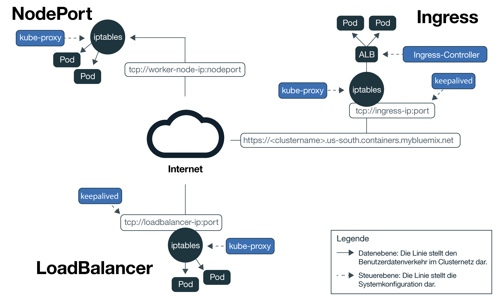
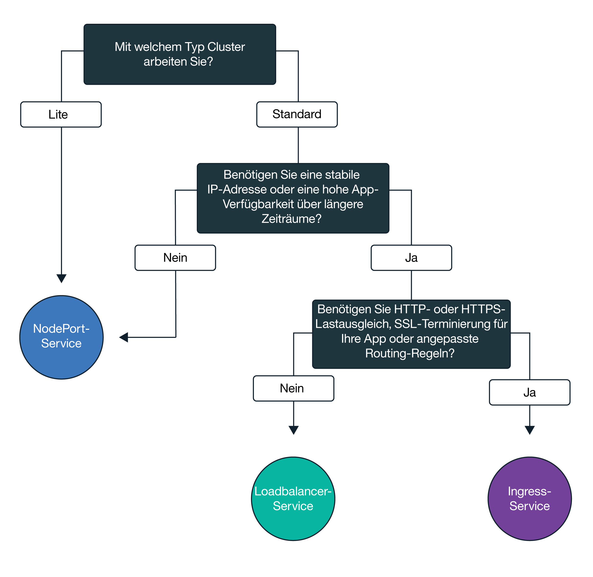

---

copyright:
  years: 2014, 2018
lastupdated: "2018-03-16"

---

{:new_window: target="_blank"}
{:shortdesc: .shortdesc}
{:screen: .screen}
{:pre: .pre}
{:table: .aria-labeledby="caption"}
{:codeblock: .codeblock}
{:tip: .tip}
{:download: .download}

# Externen Netzbetrieb planen
{: #planning}

Wenn Sie einen Kubernetes-Cluster in {{site.data.keyword.containerlong}} erstellen, muss jeder Cluster mit einem öffentlichen VLAN verbunden sein. Das öffentliche VLAN bestimmt, welche öffentliche IP-Adresse einem Workerknoten während der Clustererstellung zugewiesen wird.
{:shortdesc}

Die öffentliche Netzschnittstelle für die Workerknoten in kostenlosen Clustern und in Standardclustern wird durch Calico-Netzrichtlinien geschützt. Diese Richtlinien blockieren standardmäßig den Großteil des eingehenden Datenverkehrs. Allerdings wird der eingehende Datenverkehr, der zur ordnungsgemäßen Funktion von Kubernetes erforderlich ist, zugelassen. Dies gilt auch für die Verbindungen zu NodePort-, LoadBalancer- und Ingress-Services. Weitere Informationen zu diesen Richtlinien und zur Vorgehensweise bei der Änderung dieser Richtlinien finden Sie in [Netzrichtlinien](cs_network_policy.html#network_policies).

|Clustertyp|Manager des öffentlichen VLANs für den Cluster|
|------------|------------------------------------------|
|Kostenlose Cluster in {{site.data.keyword.Bluemix_notm}}|{{site.data.keyword.IBM_notm}}|
|Standardcluster in {{site.data.keyword.Bluemix_notm}}|Sie bei Ihrem Konto von IBM Cloud Infrastructure (SoftLayer)|
{: caption="Zuständigkeiten beim Management von VLANs" caption-side="top"}

Informationen zur clusterinternen Netzkommunikation zwischen Workerknoten und Pods finden Sie in [Netzbetrieb in Clustern](cs_secure.html#in_cluster_network). Informationen zu sicheren Verbindungen von Apps, die in einem Kubernetes-Cluster ausgeführt werden, zu einem lokalen Netz oder zu Apps außerhalb Ihres Clusters finden Sie in [VPN-Konnektivität einrichten](cs_vpn.html).

## Öffentlichen Zugriff auf Apps zulassen
{: #public_access}

Um eine App öffentlich für das Internet zugänglich zu machen, müssen Sie vor der Bereitstellung der App in einem Cluster Ihre Konfigurationsdatei aktualisieren.
{:shortdesc}

*Kubernetes-Datenebene in {{site.data.keyword.containershort_notm}}*

Das Diagramm zeigt, wie Kubernetes Benutzernetzverkehr in {{site.data.keyword.containershort_notm}} überträgt. Je nachdem, ob Sie einen kostenlosen Cluster oder einen Standardcluster erstellt haben, gibt es verschiedene Möglichkeiten, Ihre App im Internet zugänglich zu machen.

<dl>
<dt><a href="cs_nodeport.html#planning" target="_blank">NodePort-Service</a> (kostenlose Cluster und Standardcluster)</dt>
<dd>
 <ul>
  <li>Machen Sie auf jedem Workerknoten einen öffentlichen Port zugänglich und verwenden Sie die öffentliche IP-Adresse der einzelnen Workerknoten, um öffentlich auf Ihren Service im Cluster zuzugreifen.</li>
  <li>Iptables ist ein Linux-Kernel-Feature für den Lastausgleich von Anforderungen in allen Pods der App, das eine Hochleistungsnetzweiterleitung und Netzzugriffssteuerung bietet.</li>
  <li>Die öffentliche IP-Adresse des Workerknotens ist nicht permanent. Wird ein Workerknoten entfernt oder neu erstellt, so wird ihm eine neue öffentliche IP-Adresse zugewiesen.</li>
  <li>Der NodePort-Service eignet sich hervorragend zum Testen des öffentlichen Zugriffs. Er kann auch verwendet werden, wenn Sie nur für kurze Zeit einen öffentlichen Zugriff einrichten möchten.</li>
 </ul>
</dd>
<dt><a href="cs_loadbalancer.html#planning" target="_blank">LoadBalancer-Service</a> (nur Standardcluster)</dt>
<dd>
 <ul>
  <li>Jeder Standardcluster wird mit 4 portierbaren öffentlichen IP-Adressen und 4 portierbaren privaten IP-Adressen bereitgestellt, mit denen Sie eine externe TCP/UDP-Lastausgleichsfunktion (LoadBalancer) für Ihre App erstellen können.</li>
  <li>Iptables ist ein Linux-Kernel-Feature für den Lastausgleich von Anforderungen in allen Pods der App, das eine Hochleistungsnetzweiterleitung und Netzzugriffssteuerung bietet.</li>
  <li>Die der Lastausgleichsfunktion zugewiesene portierbare öffentliche IP-Adresse ist dauerhaft und ändert sich nicht, wenn im Cluster ein Workerknoten neu erstellt wird.</li>
  <li>Diese Lastausgleichsfunktion kann durch Offenlegung jedes beliebigen Ports, den Ihre App benötigt, entsprechend angepasst werden.</li></ul>
</dd>
<dt><a href="cs_ingress.html#planning" target="_blank">Ingress</a> (nur Standardcluster)</dt>
<dd>
 <ul>
  <li>Sie können mehrere Apps in ihrem Cluster öffentlich zugänglich machen, indem Sie eine einzelne externe HTTP- oder HTTPS-, TCP- oder UDP-Lastausgleichsfunktion (LoadBalancer) erstellen, die einen geschützten und eindeutigen Einstiegspunkt für die Weiterleitung eingehender Anforderungen an Ihre Apps verwendet.</li>
  <li>Sie können eine öffentliche Route verwenden, um mehrere Apps in Ihrem Cluster als Services zugänglich zu machen.</li>
  <li>Ingress besteht aus zwei Hauptkomponenten: der Ingress-Ressource und der Lastausgleichsfunktion für Anwendungen.
   <ul>
    <li>Die Ingress-Ressource definiert die Regeln, die festlegen, wie die Weiterleitung der eingehenden Anforderungen für eine App und deren Lastausgleich erfolgen soll.</li>
    <li>Die Lastausgleichsfunktion für Anwendungen (ALB) ist für eingehende HTTP- oder HTTPS-, TCP- oder UDP-Serviceanforderungen  empfangsbereit und leitet Anforderungen über die Pods der App in Übereinstimmung mit den für jede Ingress-Ressource definierten Regeln weiter. </li>
   </ul>
  <li>Verwenden Sie Ingress, wenn Sie Ihre eigene ALB mit angepassten Regeln für die Weiterleitung implementieren möchten und wenn Sie SSL-Terminierung für Ihre Apps benötigen.

</li>
 </ul>
</dd></dl>

Folgen Sie diesem Entscheidungsbaum, um die beste Netzoption für Ihre Anwendung auszuwählen. Informationen zur Planung und Anweisungen zur Konfiguration erhalten Sie, indem Sie auf die von Ihnen ausgewählte Option für Networking Services klicken. 

<map name="networking_map" id="networking_map">
<area href="/docs/containers/cs_nodeport.html#planning" alt="NodePort-Service" shape="circle" coords="52, 283, 45"/>
<area href="/docs/containers/cs_loadbalancer.html#planning" alt="LoadBalancer-Service" shape="circle" coords="247, 419, 44"/>
<area href="/docs/containers/cs_ingress.html#planning" alt="Ingress-Service" shape="circle" coords="445, 420, 45"/>
</map>
