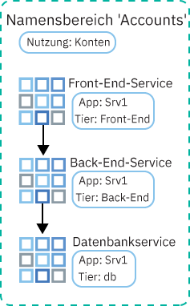
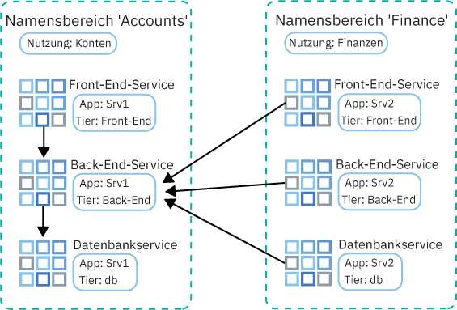

---

copyright:
  years: 2014, 2019
lastupdated: "2019-04-15"

keywords: kubernetes, iks

subcollection: containers

---

{:new_window: target="_blank"}
{:shortdesc: .shortdesc}
{:screen: .screen}
{:pre: .pre}
{:table: .aria-labeledby="caption"}
{:codeblock: .codeblock}
{:tip: .tip}
{:note: .note}
{:important: .important}
{:deprecated: .deprecated}
{:download: .download}


# Datenverkehr mit Netzrichtlinien steuern
{: #network_policies}

Jeder Kubernetes-Cluster wird mit einem Netz-Plug-in namens Calico eingerichtet. Standardnetzrichtlinien werden zum Schutz der öffentlichen Netzschnittstelle der einzelnen Workerknoten in {{site.data.keyword.containerlong}} eingerichtet.
{: shortdesc}

Wenn Sie spezielle Sicherheitsanforderungen haben oder über einen Mehrfachzonencluster mit aktiviertem VLAN-Spanning verfügen, können Sie Calico und Kubernetes zum Erstellen von Netzrichtlinien für einen Cluster verwenden. Mit Kubernetes-Netzrichtlinien können Sie den Netzverkehr angeben, den Sie zu und von einem Pod in einem Cluster zulassen oder blockieren möchten. Um erweiterte Netzrichtlinien einzurichten, beispielsweise zum Blockieren von eingehendem Datenverkehr (Ingress) an Netzausgleichsfunktions- (NLB-) Services, verwenden Sie Calico-Netzrichtlinien.

<ul>
  <li>
  [Kubernetes-Netzrichtlinien ](https://kubernetes.io/docs/concepts/services-networking/network-policies/): Diese Richtlinien geben an, wie Pods mit anderen Pods und externen Endpunkten kommunizieren können. Ab Kubernetes Version 1.8 kann eingehender und abgehender Datenverkehr basierend auf Protokoll, Port, IP-Quellenadressen oder -Zieladressen erlaubt oder blockiert werden. Der Datenverkehr kann zudem anhand von Pod- und Namensbereichsbezeichnungen gefiltert werden. Kubernetes-Netzrichtlinien werden mithilfe von `kubectl`-Befehlen oder den Kubernetes-APIs angewendet. Werden diese Richtlinien angewendet, werden sie automatisch in Calico-Netzrichtlinien konvertiert und Calico erzwingt sie.
  </li>
  <li>
  [Calico-Netzrichtlinien ](https://docs.projectcalico.org/v3.3/getting-started/bare-metal/policy/): Diese Richtlinien sind eine übergeordnete Gruppe der Kubernetes-Netzrichtlinien und werden mithilfe von `calicoctl`-Befehlen angewendet. Im Rahmen von Calico-Richtlinien werden die folgenden Features hinzugefügt.
    <ul>
    <li>Zulassen oder Blockieren von Netzverkehr in bestimmten Netzschnittstellen, unabhängig von der IP-Quellenadresse oder -Zieladresse von Kubernetes-Pods oder vom CIDR.</li>
    <li>Zulassen oder Blockieren von Netzverkehr für Pods über Namensbereiche hinweg.</li>
    <li>[Blockieren von eingehendem Datenverkehr (Ingress) an die LoadBalancer- oder NodePort-Services von Kubernetes](#block_ingress).</li>
    </ul>
  </li>
  </ul>

Calico erzwingt diese Richtlinien, einschließlich aller Kubernetes-Netzrichtlinien, die automatisch in Calico-Richtlinien konvertiert werden, indem 'Iptables'-Regeln von Linux in den Kubernetes-Workerknoten konfiguriert werden. 'Iptables'-Regeln dienen als Firewall für den Workerknoten, um die Merkmale zu definieren, die der Netzverkehr erfüllen muss, damit er an die Zielressource weitergeleitet wird.

Um die Services NLB (Netzlastausgleichsfunktion) und Ingress-ALB (Ingress-Lastausgleichsfunktion für Anwendungen) zu verwenden, verwalten Sie Netzverkehr in und aus Ihrem Cluster mithilfe von Calico- und Kubernetes-Richtlinien. Verwenden Sie keine [Sicherheitsgruppen](/docs/infrastructure/security-groups?topic=security-groups-about-ibm-security-groups#about-ibm-security-groups) der IBM Cloud-Infrastruktur (SoftLayer). Die Sicherheitsgruppen der IBM Cloud-Infrastruktur (SoftLayer) werden auf die Netzschnittstelle eines einzelnen virtuellen Servers angewendet, um den Datenverkehr auf Hypervisor-Ebene zu filtern. Sicherheitsgruppen unterstützen jedoch nicht das VRRP-Protokoll (VRRP – Virtual Router Redundancy Protocol), das von {{site.data.keyword.containerlong_notm}} zur Verwaltung der ALB- und NLB-IP-Adressen verwendet wird. Wenn das VRRP-Protokoll nicht für die Verwaltung der IP vorhanden ist, funktionieren die ALB- und NLB-Services nicht ordnungsgemäß.
{: tip}

<br />


## Standardmäßige Calico- und Kubernetes-Netzrichtlinien
{: #default_policy}

Wenn ein Cluster mit einem öffentlichen VLAN erstellt wird, wird für jeden Workerknoten und die entsprechende öffentliche Netzschnittstelle automatisch eine Host-Endpunkt-Ressource (`HostEndpoint`) mit der Bezeichnung `ibm.role: worker_public` erstellt. Um die öffentliche Netzschnittstelle eines Workerknotens zu schützen, werden Calico-Standardrichtlinien auf alle Host-Endpunkte mit der Bezeichnung `ibm.role: worker_public` angewendet.
{:shortdesc}

Diese standardmäßigen Calico-Hostrichtlinien lassen sämtlichen ausgehenden und eingehenden Netzdatenverkehr zu bestimmten Clusterkomponenten, wie NodePort-, LoadBalancer- und Ingress-Services von Kubernetes, zu. Jeglicher eingehender Netzdatenverkehr aus dem Internet zu den Workerknoten, der nicht in den Standardrichtlinien festgelegt ist, wird blockiert. Die Standardrichtlinien wirken sich nicht auf Datenverkehr zwischen Pods aus.

Sehen Sie sich die folgenden standardmäßigen Calico-Hostrichtlinien an, die automatisch auf Ihren Cluster angewendet werden.

Entfernen Sie keine Richtlinien, die auf einen Host-Endpunkt angewendet sind, es sei denn, Sie kennen die Richtlinie. Vergewissern Sie sich, dass Sie den Datenverkehr, der aufgrund dieser Richtlinie zulässig ist, nicht benötigen.
{: important}

 <table summary="Die erste Zeile in der Tabelle erstreckt sich über beide Spalten. Die verbleibenden Zeilen enthalten von links nach rechts die jeweilige Serverzone in der ersten Spalte und die entsprechenden IP-Adressen in der zweiten Spalte.">
 <caption>Standardmäßige Calico-Hostrichtlinien für die einzelnen Cluster</caption>
  <thead>
  <th colspan=2> Standardmäßige Calico-Hostrichtlinien für die einzelnen Cluster</th>
  </thead>
  <tbody>
    <tr>
      <td><code>allow-all-outbound</code></td>
      <td>Lässt den gesamten ausgehenden Datenverkehr zu.</td>
    </tr>
    <tr>
      <td><code>allow-bigfix-port</code></td>
      <td>Lässt eingehenden Datenverkehr an Port 52311 zur BigFix-App zu, um erforderliche Aktualisierungen für Workerknoten zu ermöglichen.</td>
    </tr>
    <tr>
      <td><code>allow-icmp</code></td>
      <td>Lässt eingehende 'ICMP-Pakete (Pings) zu.</td>
     </tr>
    <tr>
      <td><code>allow-node-port-dnat</code></td>
      <td>Lässt eingehenden Datenverkehr für die Netzlastausgleichsfunktion (NLB), die Ingress-Lastausgleichsfunktion für Anwendungen (ALB) und für NodePort zu den Pods zu, die diese Services zugänglich machen. <strong>Hinweis</strong>: Sie müssen die zugänglich gemachten Ports nicht angeben, weil Kubernetes DNAT (Destination Network Address Translation, Zielnetzadressumsetzung) verwendet, um die Serviceanforderungen an die korrekten Pods weiterzuleiten. Diese Weiterleitung findet statt, bevor der Host-Endpunkt in 'Iptables' angewendet wird.</td>
   </tr>
   <tr>
      <td><code>allow-sys-mgmt</code></td>
      <td>Lässt eingehende Verbindungen für bestimmte Systeme der IBM Cloud-Infrastruktur (SoftLayer) zu, die zum Verwalten der Workerknoten verwendet werden.</td>
   </tr>
   <tr>
    <td><code>allow-vrrp</code></td>
    <td>Lässt VRRP-Pakete zu, die zum Überwachen und Verschieben von virtuellen IP-Adressen zwischen Workerknoten verwendet werden.</td>
   </tr>
  </tbody>
</table>

Eine Kubernetes-Standardrichtlinie, die den Zugriff auf das Kubernetes-Dashboard einschränkt, wird ebenfalls erstellt. Kubernetes-Richtlinien gelten nicht für den Host-Endpunkt, sondern für den Pod `kube-dashboard`. Diese Richtlinie wird auf Cluster angewendet, die ausschließlich mit einem privaten VLAN verbunden sind, sowie Cluster, die mit einem öffentlichen und einem privaten VLAN verbunden sind.

<table>
<caption>Kubernetes-Standardrichtlinien für die einzelnen Cluster</caption>
<thead>
<th colspan=2> Kubernetes-Standardrichtlinien für die einzelnen Cluster</th>
</thead>
<tbody>
 <tr>
  <td><code>kubernetes-dashboard</code></td>
  <td>Im <code>kube-system</code>-Namensbereich bereitgestellt: blockiert für alle Pods den Zugriff auf das Kubernetes-Dashboard. Diese Richtlinie hat keinerlei Auswirkungen auf den Zugriff auf das Dashboard über die {{site.data.keyword.Bluemix_notm}}-Konsole oder mithilfe von <code>kubectl proxy</code>. Wenn ein Pod Zugriff auf das Dashboard benötigt, stellen Sie den Pod in einem Namensbereich mit der Bezeichnung <code>kubernetes-dashboard-policy: allow</code> bereit.</td>
 </tr>
</tbody>
</table>

<br />


## Calico-CLI installieren und konfigurieren
{: #cli_install}

Installieren und konfigurieren Sie die Calico-CLI zum Anzeigen, Verwalten und Hinzufügen von Calico-Richtlinien.
{:shortdesc}

1. [Melden Sie sich an Ihrem Konto an. Geben Sie als Ziel die entsprechende Region und, sofern zutreffend, die Ressourcengruppe an. Legen Sie den Kontext für den Cluster fest.](/docs/containers?topic=containers-cs_cli_install#cs_cli_configure) Schließen Sie die Optionen `--admin` und `--network` in den Befehl `ibmcloud ks cluster-config` ein. Durch `--admin` werden die Schlüssel für den Zugriff auf Ihr Infrastrukturportfolio und zum Ausführen von Calico-Befehlen auf Ihren Workerknoten heruntergeladen. Durch `--network` wird die Calico-Konfigurationsdatei für die Ausführung aller Calico-Befehle heruntergeladen.

  ```
  ibmcloud ks cluster-config --cluster <clustername_oder_-id> --admin --network
  ```
  {: pre}

3. OS X- und Linux-Benutzer müssen die folgenden Schritte ausführen:
    1. Erstellen Sie das Verzeichnis `/etc/calico`.
        ```
        sudo mkdir /etc/calico
        ```
        {: pre}

    2. Verschieben Sie die Calico-Konfigurationsdatei, die Sie vorher heruntergeladen haben, in das Verzeichnis.
        ```
        sudo mv /Users/<user>/.bluemix/plugins/container-service/clusters/<cluster_name>-admin/calicoctl.cfg /etc/calico
        ```
        {: pre}

4. [Laden Sie die Calico-CLI ](https://github.com/projectcalico/calicoctl/releases) herunter.

    Wenn Sie OS X verwenden, laden Sie die Version `-darwin-amd64` herunter. Wenn Sie Windows verwenden, installieren Sie die Calico-CLI in demselben Verzeichnis wie die {{site.data.keyword.Bluemix_notm}}-CLI. Diese Konfiguration erspart Ihnen bei der späteren Ausführung von Befehlen einige Dateipfadänderungen. Stellen Sie sicher, dass die Datei als `calicoctl.exe` gespeichert wird.
    {: tip}

5. OS X- und Linux-Benutzer müssen die folgenden Schritte ausführen:
    1. Verschieben Sie die ausführbare Datei in das Verzeichnis _/usr/local/bin_.
        - Linux:

          ```
          mv filepath/calicoctl /usr/local/bin/calicoctl
          ```
          {: pre}

        - OS
X:

          ```
          mv filepath/calicoctl-darwin-amd64 /usr/local/bin/calicoctl
          ```
          {: pre}

    2. Konvertieren Sie die Datei in eine ausführbare Datei.

        ```
        chmod +x /usr/local/bin/calicoctl
        ```
        {: pre}

6. Falls Unternehmensnetzrichtlinien den Zugriff von Ihrem lokalen System auf öffentliche Endpunkte über Proxys oder Firewalls verhindert, [lassen Sie TCP-Zugriff für Calico-Befehle zu](/docs/containers?topic=containers-firewall#firewall).

7. Vergewissern Sie sich, dass die Calico-Konfiguration ordnungsgemäß funktioniert.

    - Linux und OS X:

      ```
      calicoctl get nodes
      ```
      {: pre}

    - Windows: Verwenden Sie das Flag `--config`, um auf die Netzkonfigurationsdatei zu verweisen, die Sie in Schritt 1 abgerufen haben. Schließen Sie dieses Flag bei jeder Ausführung eines `calicoctl`-Befehls ein.

      ```
      calicoctl get nodes --config=filepath/calicoctl.cfg
      ```
      {: pre}

      Ausgabe:

      ```
      NAME
              kube-dal10-crc21191ee3997497ca90c8173bbdaf560-w1.cloud.ibm
              kube-dal10-crc21191ee3997497ca90c8173bbdaf560-w2.cloud.ibm
              kube-dal10-crc21191ee3997497ca90c8173bbdaf560-w3.cloud.ibm
      ```
      {: screen}

<br />


## Netzrichtlinien anzeigen
{: #view_policies}

Zeigen Sie die Details für Standardrichtlinien und allen weiteren hinzugefügten Netzrichtlinien an, die auf Ihren Cluster angewendet werden.
{:shortdesc}

Vorbereitende Schritte:
1. [Installieren und konfigurieren Sie die Calico-CLI.](#cli_install)
2. [Melden Sie sich an Ihrem Konto an. Geben Sie als Ziel die entsprechende Region und, sofern zutreffend, die Ressourcengruppe an. Legen Sie den Kontext für den Cluster fest.](/docs/containers?topic=containers-cs_cli_install#cs_cli_configure) Schließen Sie die Optionen `--admin` und `--network` in den Befehl `ibmcloud ks cluster-config` ein. Durch `--admin` werden die Schlüssel für den Zugriff auf Ihr Infrastrukturportfolio und zum Ausführen von Calico-Befehlen auf Ihren Workerknoten heruntergeladen. Durch `--network` wird die Calico-Konfigurationsdatei für die Ausführung aller Calico-Befehle heruntergeladen.

  ```
  ibmcloud ks cluster-config --cluster <clustername_oder_-id> --admin --network
  ```
  {: pre}

**Gehen Sie wie folgt vor, um Netzrichtlinien in Clustern anzuzeigen:**

Linux- und Mac-Benutzer müssen das Flag `--config=filepath/calicoctl.cfg` nicht in Befehle des Typs `calicoctl` einschließen.
{: tip}

1. Zeigen Sie den Calico-Host-Endpunkt an.

    ```
    calicoctl get hostendpoint -o yaml --config=filepath/calicoctl.cfg
    ```
    {: pre}

2. Zeigen Sie alle Calico- und Kubernetes-Netzrichtlinien an, die für den Cluster erstellt wurden. Diese Liste enthält Richtlinien, die möglicherweise noch nicht auf Pods oder Hosts angewendet wurden. Damit eine Netzrichtlinie erzwungen wird, muss eine Kubernetes-Ressource gefunden werden, die mit dem Selektor übereinstimmt, der in der Calico-Netzrichtlinie definiert wurde.

    [Netzrichtlinien ](https://docs.projectcalico.org/v3.3/reference/calicoctl/resources/networkpolicy) beziehen sich auf bestimmte Namensbereiche:
    ```
    calicoctl get NetworkPolicy --all-namespaces -o wide --config=filepath/calicoctl.cfg
    ```
    {:pre}

    [Globale Netzrichtlinien ](https://docs.projectcalico.org/v3.3/reference/calicoctl/resources/globalnetworkpolicy) beziehen sich nicht auf bestimmte Namensbereiche:
    ```
    calicoctl get GlobalNetworkPolicy -o wide --config=filepath/calicoctl.cfg
    ```
    {: pre}

3. Zeigen Sie Details für ein Netzrichtlinie an.

    ```
    calicoctl get NetworkPolicy -o yaml <richtlinienname> --namespace <namensbereich_für_richtlinie> --config=filepath/calicoctl.cfg
    ```
    {: pre}

4. Zeigen Sie die Details aller globalen Netzrichtlinien für den Cluster an.

    ```
    calicoctl get GlobalNetworkPolicy -o yaml --config=filepath/calicoctl.cfg
    ```
    {: pre}

<br />


## Netzrichtlinien hinzufügen
{: #adding_network_policies}

In den meisten Fällen müssen die Standardrichtlinien nicht geändert werden. Nur erweiterte Szenarios können unter Umständen Änderungen erforderlich machen. Wenn Sie feststellen, dass Sie Änderungen vornehmen müssen, können Sie Ihre eigenen Netzrichtlinien erstellen.
{:shortdesc}

Informationen zum Erstellen von Kubernetes-Netzrichtlinien finden Sie in der [Dokumentation zu Kubernetes-Netzrichtlinien ](https://kubernetes.io/docs/concepts/services-networking/network-policies/).

Um Calico-Richtlinien zu erstellen, führen Sie die folgenden Schritte aus.

1. [Installieren und konfigurieren Sie die Calico-CLI.](#cli_install)
2. [Melden Sie sich an Ihrem Konto an. Geben Sie als Ziel die entsprechende Region und, sofern zutreffend, die Ressourcengruppe an. Legen Sie den Kontext für den Cluster fest.](/docs/containers?topic=containers-cs_cli_install#cs_cli_configure) Schließen Sie die Optionen `--admin` und `--network` in den Befehl `ibmcloud ks cluster-config` ein. Durch `--admin` werden die Schlüssel für den Zugriff auf Ihr Infrastrukturportfolio und zum Ausführen von Calico-Befehlen auf Ihren Workerknoten heruntergeladen. Durch `--network` wird die Calico-Konfigurationsdatei für die Ausführung aller Calico-Befehle heruntergeladen.

  ```
  ibmcloud ks cluster-config --cluster <clustername_oder_-id> --admin --network
  ```
  {: pre}

3. Definieren Sie Ihre Calico-[Netzrichtlinie](https://docs.projectcalico.org/v3.3/reference/calicoctl/resources/networkpolicy) oder [globale Netzrichtlinie](https://docs.projectcalico.org/v3.3/reference/calicoctl/resources/globalnetworkpolicy) durch Erstellung eines Konfigurationsscripts (`.yaml`) mit der Calico V3-Richtliniensyntax. Diese Konfigurationsdateien enthalten die Selektoren, die beschreiben, auf welche Pods, Namensbereiche oder Hosts diese Richtlinien angewendet werden. Ziehen Sie diese [Calico-Beispielrichtlinien ](http://docs.projectcalico.org/v3.3/getting-started/kubernetes/tutorials/advanced-policy) als Hilfestellung heran, wenn Sie Ihre eigenen erstellen.

4. Wenden Sie die Richtlinien auf den Cluster an.
    - Linux und OS X:

      ```
      calicoctl apply -f policy.yaml
      ```
      {: pre}

    - Windows:

      ```
      calicoctl apply -f filepath/policy.yaml --config=filepath/calicoctl.cfg
      ```
      {: pre}

<br />


## Eingehenden Datenverkehr an NLB- oder NodePort-Services steuern
{: #block_ingress}

[Standardmäßig](#default_policy) sind die NodePort- und LoadBalancer-Services von Kubernetes so konzipiert, dass Ihre App in allen öffentlichen und privaten Clusterschnittstellen verfügbar ist. Sie können jedoch die Richtlinien von Calico verwenden, um den eingehenden Datenverkehr auf Basis der Datenverkehrsquelle oder des Ziels zu blockieren.
{:shortdesc}

Die standardmäßigen Kubernetes- und Calico-Richtlinien sind aufgrund der DNAT-Iptables-Regeln, die für die Kubernetes-NodePort- und Kubernetes-LoadBalancer-Services generiert werden, zum Schutz dieser Services schwierig anzuwenden. Mit Pre-DNAT-Richtlinien wird jedoch verhindert, dass angegebener Datenverkehr Ihre Apps erreicht, da durch sie 'Iptables'-Regeln generiert und angewendet werden, bevor Kubernetes reguläre DNAT verwendet, um Datenverkehr an Pods weiterzuleiten.

Nachfolgend finden Sie einige gängige Anwendungsbereiche für die Calico-Netzrichtlinien des Typs Pre-DNAT:

  - Blockieren von Datenverkehr zu öffentlichen Knotenports eines privaten Netzausgleichsfunktions- (NLB-) Service: Ein NLB-Service macht Ihre App über die NLB-IP-Adresse und den -Port zugänglich und macht die App über die Knotenports des Service verfügbar. Auf Knotenports kann über jede IP-Adresse (öffentlich und privat) für jeden Knoten innerhalb des Clusters zugegriffen werden.
  - Blockieren von Datenverkehr zu öffentlichen Knotenports auf Clustern, auf denen [Edge-Workerknoten](/docs/containers?topic=containers-edge#edge) ausgeführt werden: Durch das Blockieren der Knotenports wird sichergestellt, dass die Edge-Workerknoten die einzigen Workerknoten sind, von denen ankommender Datenverkehr verarbeitet wird.
  - Blockieren von Datenverkehr von bestimmten Quellen-IP-Adressen oder CIDRs (Blacklisting)
  - Zulassen von Datenverkehr nur von bestimmten Quellen-IP-Adressen oder CIDRs (Whitelisting) und Blockieren des gesamten restlichen Datenverkehrs

Um zu erfahren, wie Sie Quellen-IP-Adressen in Whitelists oder Blacklists aufnehmen, sehen Sie sich das [Lernprogramm zur Verwendung von Calico-Netzrichtlinien zum Blockieren von Datenverkehr](/docs/containers?topic=containers-policy_tutorial#policy_tutorial) an. Weitere Beispiele für Calico-Netzrichtlinien, die den Datenverkehr zu und von Ihrem Cluster steuern, finden Sie in der [Demo zur stars-Richtlinie ](https://docs.projectcalico.org/v3.3/getting-started/kubernetes/tutorials/stars-policy/) und in der [Demo zur erweiterten Richtlinie ](https://docs.projectcalico.org/v3.3/getting-started/kubernetes/tutorials/advanced-policy).
{: tip}

Vorbereitende Schritte:
1. [Installieren und konfigurieren Sie die Calico-CLI.](#cli_install)
2. [Melden Sie sich an Ihrem Konto an. Geben Sie als Ziel die entsprechende Region und, sofern zutreffend, die Ressourcengruppe an. Legen Sie den Kontext für den Cluster fest.](/docs/containers?topic=containers-cs_cli_install#cs_cli_configure) Schließen Sie die Optionen `--admin` und `--network` in den Befehl `ibmcloud ks cluster-config` ein. Durch `--admin` werden die Schlüssel für den Zugriff auf Ihr Infrastrukturportfolio und zum Ausführen von Calico-Befehlen auf Ihren Workerknoten heruntergeladen. Durch `--network` wird die Calico-Konfigurationsdatei für die Ausführung aller Calico-Befehle heruntergeladen.

  ```
  ibmcloud ks cluster-config --cluster <clustername_oder_-id> --admin --network
  ```
  {: pre}

Gehen Sie wie folgt vor, um Pre-DNAT-Richtlinie zu erstellen:

1. Definieren Sie eine Calico-Netzrichtlinie des Typs Pre-DNAT für den Ingress-Zugriff (eingehenden Datenverkehr) auf Kubernetes-Services.
    * Verwenden Sie die [Calico V3-Richtliniensyntax ](https://docs.projectcalico.org/v3.3/reference/calicoctl/resources/networkpolicy).
    * Wenn Sie Datenverkehr an eine [NLB 2.0](/docs/containers?topic=containers-loadbalancer#planning_ipvs) verwalten, müssen Sie die Felder `applyOnForward: true` und `doNotTrack: true` in den Abschnitt `spec` der Richtlinie einbeziehen.

        Beispielressource, von der alle Knotenports blockiert werden:

        ```
        apiVersion: projectcalico.org/v3
        kind: GlobalNetworkPolicy
        metadata:
          name: deny-nodeports
        spec:
          applyOnForward: true
          preDNAT: true
          ingress:
          - action: Deny
            destination:
              ports:
              - 30000:32767
            protocol: TCP
            source: {}
          - action: Deny
            destination:
              ports:
              - 30000:32767
        protocol: UDP
        source: {}
      selector: ibm.role=='worker_public'
      order: 1100
      types:
          - Ingress
        ```
        {: codeblock}

        Beispielressource, die den Datenverkehr von nur einen angegebenen Quellen-CIDR an eine NLB 2.0 auf eine Whitelist setzt:

        ```
        apiVersion: projectcalico.org/v3
    kind: GlobalNetworkPolicy
    metadata:
      name: whitelist
    spec:
      applyOnForward: true
      doNotTrack: true
      ingress:
          - action: Allow
        destination:
          nets:
              - <ip_der_lastausgleichsfunktion>/32
          ports:
              - 80
        protocol: TCP
        source:
          nets:
              - <clientadresse>/32
      selector: ibm.role=='worker_public'
      order: 500
      types:
          - Ingress
        ```
        {: codeblock}

        Beispielressource, die den Datenverkehr von nur einen angegebenen Quellen-CIDR an eine NLB 1.0 auf eine Whitelist setzt:

        ```
        apiVersion: projectcalico.org/v3
        kind: GlobalNetworkPolicy
        metadata:
          name: whitelist
        spec:
          applyOnForward: true
          preDNAT: true
          ingress:
          - action: Allow
        destination:
          nets:
              - <ip_der_lastausgleichsfunktion>/32
          ports:
              - 80
        protocol: TCP
        source:
          nets:
              - <clientadresse>/32
      selector: ibm.role=='worker_public'
      order: 500
      types:
          - Ingress
        ```
        {: codeblock}

2. Wenden Sie die Calico-Netzrichtlinie vom Typ 'preDNAT' an. Es dauert ca. eine Minute, bis die Richtlinienänderungen im Cluster angewendet sind.

  - Linux und OS X:

    ```
    calicoctl apply -f deny-nodeports.yaml
    ```
    {: pre}

  - Windows:

    ```
    calicoctl apply -f filepath/deny-nodeports.yaml --config=filepath/calicoctl.cfg
    ```
    {: pre}

3. Optional: In Mehrzonenclustern werden vom Status der Lastausgleichsfunktion für mehrere Zonen (MZLB-Status) die Ingress-Lastausgleichsfunktionen für Anwendungen (Ingress-ALBs) in jeder Zone des Clusters überprüft und die Ergebnisse der DNS-Suche auf der Basis dieser Statusprüfungen aktualisiert. Wenn Sie die Pre-DNAT-Richtlinien verwenden, um den gesamten eingehenden Datenverkehr zu Ingress-Services zu blockieren, müssen Sie auch die [Cloudflare-IPv4-IPs ](https://www.cloudflare.com/ips/), die zur Überprüfung des Status Ihrer ALBs verwendet werden, in die Whitelist stellen. Informationen zum Erstellen einer Calico-preDNAT-Richtlinie für die Whitelist für diese IPs finden Sie in der Lerneinheit 3 des [Lernprogramms zur Calico-Netzrichtlinie](/docs/containers?topic=containers-policy_tutorial#lesson3).

## Cluster im privaten Netz isolieren
{: #isolate_workers}

Wenn Sie einen Mehrzonencluster, mehrere VLANs für einen Einzelzonencluster oder mehrere Teilnetze in demselben VLAN haben, müssen Sie das [VLAN-Spanning aktivieren](/docs/infrastructure/vlans?topic=vlans-vlan-spanning#vlan-spanning), damit Ihre Workerknoten miteinander im privaten Netz kommunizieren können. Wenn das VLAN-Spanning aktiviert ist, kann jedes System, das mit einem der privaten VLANs in demselben IBM Cloud-Konto verbunden ist, mit Workern kommunizieren.
{: shortdesc}

Sie können Ihren Cluster von anderen Systemen im privaten Netz mithilfe von [Calico-Richtlinien für private Netze ](https://github.com/IBM-Cloud/kube-samples/tree/master/calico-policies/private-network-isolation) isolieren. Diese Gruppe von Calico-Richtlinien und -Hostendpunkten isoliert den privaten Netzdatenverkehr eines Clusters von anderen Ressourcen im privaten Netz des Kontos.

Die Richtlinien zielen auf die private Schnittstelle des Workerknotens (eth0) und das Podnetz eines Clusters ab.

**Workerknoten**

* Abgehender Datenverkehr (Egress) an der privaten Schnittstelle ist nur für Pod-IPs, Workers in diesem Cluster, den UPD/TCP-Port 53, Port 2049 für die Kommunikation mit NFS-Dateiservern und die Ports 443 und 3260 für die Kommunikation mit Blockspeicher zulässig.
* Eingehender Datenverkehr an der privaten Schnittstelle ist nur von Workern in dem Cluster und nur an DNS, kubelet, ICMP und VRRP zulässig.

**Pods**

* Der gesamte eingehende Datenverkehr an Pods von den Workern im Cluster ist zulässig.
* Der abgehende Datenverkehr von Pods wird nur auf öffentliche IPs, DNS, kubelet und andere Pods im Cluster beschränkt.

Vorbereitende Schritte:
1. [Installieren und konfigurieren Sie die Calico-CLI.](#cli_install)
2. [Melden Sie sich an Ihrem Konto an. Geben Sie als Ziel die entsprechende Region und, sofern zutreffend, die Ressourcengruppe an. Legen Sie den Kontext für den Cluster fest.](/docs/containers?topic=containers-cs_cli_install#cs_cli_configure) Schließen Sie die Optionen `--admin` und `--network` in den Befehl `ibmcloud ks cluster-config` ein. Durch `--admin` werden die Schlüssel für den Zugriff auf Ihr Infrastrukturportfolio und zum Ausführen von Calico-Befehlen auf Ihren Workerknoten heruntergeladen. Durch `--network` wird die Calico-Konfigurationsdatei für die Ausführung aller Calico-Befehle heruntergeladen.

  ```
  ibmcloud ks cluster-config --cluster <clustername_oder_-id> --admin --network
  ```
  {: pre}

Gehen Sie wie folgt vor, um Ihren Cluster mithilfe von Calico-Richtlinien im privaten Netz zu isolieren:

1. Klonen Sie das Repository `IBM-Cloud/kube-samples`.
    ```
    git clone https://github.com/IBM-Cloud/kube-samples.git
    ```
    {: pre}

2. Navigieren Sie zum Verzeichnis mit den Richtlinien für private Netze für die Calico-Version, mit der Ihre Clusterversion kompatibel ist.
   ```
   cd <dateipfad>/IBM-Cloud/kube-samples/calico-policies/private-network-isolation/calico-v3
   ```
   {: pre}

3. Richten Sie eine Richtlinie für den privaten Hostendpunkt ein.
    1. Öffnen Sie die Richtlinie `generic-privatehostendpoint.yaml`.
    2. Ersetzen Sie `<workername>` durch den Namen eines Workerknotens. **Wichtig:** Einige Workerknoten müssen für Calico-Richtlinien einer anderen Benennungsstruktur folgen. Sie müssen den Namen eines Workerknotens in dem Format verwenden, in dem er durch den folgenden Befehl zurückgegeben wird.
      ```
      ibmcloud ks calicoctl get nodes --config==filepath/calicoctl.cfg
      ```
      {: pre}
    3. Ersetzen Sie `<private_ip-adresse_des_workerknotens>` durch die private IP-Adresse für den Workerknoten. Wenn Sie die privaten IPs Ihrer Workerknoten anzeigen wollen, führen Sie `ibmcloud ks workers --cluster <mein_cluster>` aus.
    4. Wiederholen Sie diese Gruppe von Schritten in einem neuen Abschnitt für jeden Workerknoten in Ihrem Cluster. **Hinweis:** Jedes Mal, wenn Sie einem Cluster einen Workerknoten hinzufügen, müssen Sie die Hostendpunktdatei mit den neuen Einträgen aktualisieren.

4. Wenden Sie alle Richtlinien auf Ihren Cluster an.
    - Linux und OS X:

      ```
      calicoctl apply -f allow-all-workers-private.yaml
      calicoctl apply -f allow-ibm-ports-private.yaml
      calicoctl apply -f allow-egress-pods.yaml
      calicoctl apply -f allow-icmp-private.yaml
      calicoctl apply -f allow-vrrp-private.yaml
      calicoctl apply -f generic-privatehostendpoint.yaml
      ```
      {: pre}

    - Windows:

      ```
      calicoctl apply -f allow-all-workers-private.yaml --config=filepath/calicoctl.cfg
      calicoctl apply -f allow-ibm-ports-private.yaml --config=filepath/calicoctl.cfg
      calicoctl apply -f allow-egress-pods.yaml --config=filepath/calicoctl.cfg
      calicoctl apply -f allow-icmp-private.yaml --config=filepath/calicoctl.cfg
      calicoctl apply -f allow-vrrp-private.yaml --config=filepath/calicoctl.cfg
      calicoctl apply -f generic-privatehostendpoint.yaml --config=filepath/calicoctl.cfg
      ```
      {: pre}

## Datenverkehr zwischen Pods steuern
{: #isolate_services}

Kubernetes-Richtlinien schützen Pods vor internem Netzdatenverkehr. Sie können einfache Kubernetes-Netzrichtlinien erstellen, um die App-Microservices innerhalb eines Namensbereichs oder über Namensbereiche hinweg voneinander zu trennen.
{: shortdesc}

Weitere Informationen darüber, wie Kubernetes-Netzrichtlinien Pod-zu-Pod-Datenverkehr steuern, sowie weitere Beispielrichtlinien finden Sie in der [Kubernetes-Dokumentation ](https://kubernetes.io/docs/concepts/services-networking/network-policies/).
{: tip}

### App-Services in einem Namensbereich isolieren
{: #services_one_ns}

Das folgende Szenario veranschaulicht, wie der Datenverkehr zwischen App-Microservices in einem Namensbereich verwaltet wird.

Ein Team 'Accounts' stellt mehrere App-Services in einem Namensbereich bereit. Diese müssen jedoch isoliert werden, um nur die erforderliche Kommunikation zwischen den Microservices über das öffentliche Netz zu ermöglichen. Für die App `Srv1` verfügt das Team über Front-End-, Back-End- und Datenbankservices. Jeder Service erhält die Bezeichnung `App: Srv1` sowie die Bezeichnung `Tier: Front-End`, `Tier: Back-End` oder `Tier: db`.



Das Team 'Accounts' möchte Datenverkehr vom Front-End zum Back-End und vom Back-End zur Datenbank zulassen. Es verwendet Bezeichnungen in den Netzrichtlinien, um festzulegen, welche Datenflüsse zwischen den Microservices zulässig sind.

Zunächst erstellt das Team eine Kubernetes-Netzrichtlinie, die den Datenverkehr vom Front-End zum Back-End ermöglicht:

```
kind: NetworkPolicy
apiVersion: networking.k8s.io/v1
metadata:
  name: backend-allow
spec:
  podSelector:
    matchLabels:
      app: Srv1
      tier: backend
  ingress:
  - from:
    - podSelector:
        matchLabels:
          app: Srv1
          Tier: frontend
```
{: codeblock}

Im Abschnitt `spec.podSelector.matchLabels` sind die Bezeichnungen für den Back-End-Service für Srv1 aufgeführt, sodass die Richtlinie nur _für_ diese Pods gilt. Im Abschnitt ` spec.ingress.from.podSelector.matchLabels ` werden die Bezeichnungen für den Front-End-Service für Srv1 aufgelistet, sodass Ingress nur _über_ diese Pods zulässig ist.

Anschließend erstellt das Team eine ähnliche Kubernetes-Netzrichtlinie, durch die der Datenverkehr vom Back-End zur Datenbank zulässig ist:

```
kind: NetworkPolicy
apiVersion: networking.k8s.io/v1
metadata:
  name: db-allow
spec:
  podSelector:
    matchLabels:
      app: Srv1
      tier: db
  ingress:
  - from:
    - podSelector:
        matchLabels:
          app: Srv1
          Tier: backend
  ```
  {: codeblock}

Im Abschnitt `spec.podSelector.matchLabels` sind die Bezeichnungen für den Datenbankservice für Srv1 aufgeführt, sodass die Richtlinie nur _für_ diese Pods gilt. Im Abschnitt `spec.ingress.from.podSelector.matchLabels` werden die Bezeichnungen für den Back-End-Service für Srv1 aufgelistet, sodass Ingress nur _über_ diese Pods zulässig ist.

Der Datenverkehr kann nun vom Front-End zum Back-End und vom Back-End zur Datenbank fließen. Die Datenbank kann auf das Back-End reagieren und das Back-End auf das Front-End; es können jedoch keine umgekehrten Datenverkehrsverbindungen aufgebaut werden.

### App-Services zwischen Namensbereichen isolieren
{: #services_across_ns}

Im folgenden Szenario wird gezeigt, wie der Datenverkehr zwischen App-Microservices über mehrere Namensbereiche hinweg verwaltet wird.

Services, deren Eigner verschiedene untergeordnete Teams sind, müssen kommunizieren, die Services werden jedoch in unterschiedlichen Namensbereichen innerhalb desselben Clusters bereitgestellt. Das Team 'Accounts' stellt Front-End-, Back-End- und Datenbankservices für die App 'Srv1' im Namensbereich 'account' bereit. Das Team 'Finance' stellt Front-End-, Back-End- und Datenbankservices für die App 'Srv2' im Namensbereich 'finance' bereit. Jeder Service erhält von den Teams die Bezeichnung `App: Srv1` oder `App: Srv2` sowie die Bezeichnung `Tier: Front-End`, `Tier: Back-End` oder `Tier: db`. Außerdem werden die Namensbereiche mit der Bezeichnung `usage: accounts` oder `usage: finance` versehen.



'Srv2' des Teams 'Finance' muss Informationen vom Back-End für 'Srv1' des Teams 'Accounts' aufrufen. Das Team 'Accounts' erstellt daher eine Kubernetes-Netzrichtlinie, die mithilfe von Bezeichnungen den gesamten Datenverkehr vom Namensbereich 'finance' zum Back-End für 'Srv1' im Namensbereich 'accounts' zulässt. Das Team gibt zudem den Port 3111 an, um den Zugriff ausschließlich an diesem Port zu ermöglichen.

```
kind: NetworkPolicy
apiVersion: networking.k8s.io/v1
metadata:
  Namespace: accounts
  name: accounts-allow
spec:
  podSelector:
    matchLabels:
      app: Srv1
      Tier: backend
  ingress:
  - from:
    - NamespaceSelector:
        matchLabels:
          usage: finance
      ports:
        port: 3111
```
{: codeblock}

Im Abschnitt `spec.podSelector.matchLabels` sind die Bezeichnungen für den Back-End-Service für Srv1 aufgeführt, sodass die Richtlinie nur _für_ diese Pods gilt. Der Abschnitt `spec.ingress.from.NamespaceSelector.matchLabels` enthält die Bezeichnung für den Namensbereich 'finance', sodass Ingress nur _aus_ Services in diesem Namensbereich zulässig ist.

Der Datenverkehr kann nun von den Microservices von 'finance' zum Back-End für 'Srv1' von 'accounts' fließen. Das Back-End für Srv1 von 'accounts' kann auf die Microservices von 'finance' antworten, jedoch keine umgekehrte Datenverkehrsverbindung herstellen.

In diesem Beispiel ist der gesamte Datenverkehr von allen Microservices im Namensbereich 'finance' zulässig. Der Datenverkehr von bestimmten App-Pods in einem anderen Namensbereich ist nicht möglich, da `podSelector` und `namespaceSelector` nicht kombiniert werden können.

<br />


## Verweigerten Datenverkehr protokollieren
{: #log_denied}

Sie können eine Calico-Protokollnetzrichtlinie erstellen, um die verweigerten Datenverkehrsanforderungen an bestimmte Pods in Ihrem Cluster zu protokollieren.
{: shortdesc}

Wenn Sie Netzrichtlinien einrichten, um den Datenverkehr an App-Pods zu beschränken, werden Datenverkehrsanforderungen, die aufgrund dieser Richtlinien nicht zulässig sind, verweigert und gelöscht. In bestimmten Szenarios wünschen Sie möglicherweise weitere Informationen zu verweigerten Datenverkehrsanforderungen. Beispielsweise könnte es sein, dass Sie ungewöhnlichen Datenverkehr bemerken, der kontinuierlich durch eine Ihrer Netzrichtlinien verweigert wird. Um die potenzielle Sicherheitsbedrohung zu überwachen, können Sie eine Protokollierung einrichten, um jeden Zeitpunkt aufzuzeichnen, zu dem die Richtlinie eine versuchte Aktion für die angegebenen App-Pods verweigert.

In diesem Abschnitt wird gezeigt, wie Datenverkehr protokolliert wird, der von einer Kubernetes-Netzrichtlinie verweigert wird. Informationen zu Datenverkehr, der von einer Calico-Netzrichtlinie abgelehnt wird, finden Sie in [Lerneinheit 5 des Lernprogramms zur Calico-Netzrichtlinie](/docs/containers?topic=containers-policy_tutorial#lesson5).
{: tip}

Vorbereitende Schritte:
1. [Installieren und konfigurieren Sie die Calico-CLI.](#cli_install)
2. [Richten Sie die Kubernetes-CLI auf den Cluster aus](/docs/containers?topic=containers-cs_cli_install#cs_cli_configure). Schließen Sie die Option `--admin` mit dem Befehl `ibmcloud ks cluster-config` ein, der zum Herunterladen der Zertifikate und Berechtigungsdateien verwendet wird. Dieser Download umfasst auch die Schlüssel für den Zugriff auf Ihr Infrastrukturportfolio und zur Ausführung von Calico-Befehlen auf Ihren Workerknoten.
    ```
    ibmcloud ks cluster-config --cluster <clustername> --admin
    ```
    {: pre}

Gehen Sie wie folgt vor, um verweigerten Datenverkehr zu protokollieren:

1. Erstellen oder verwenden Sie eine vorhandene Kubernetes-Netzrichtlinie, die den eingehenden Datenverkehr blockiert oder begrenzt. 
  1. Erstellen Sie eine Kubernetes-Netzrichtlinie. Wenn Sie beispielsweise den Datenverkehr zwischen Pods steuern möchten, können Sie die folgende Kubernetes-Beispielrichtlinie mit dem Namen `access-nginx` verwenden, die den Zugriff auf eine NGINX-App einschränkt. Der eingehende Datenverkehr an Pods mit der Bezeichnung "run=nginx" ist nur von Pods mit der Bezeichnung "run=access" zulässig. Der gesamte weitere eingehende Datenverkehr für die "run=nginx"-App-Pods wird blockiert.
    ```
    kind: NetworkPolicy
    apiVersion: networking.k8s.io/v1
    metadata:
      name: access-nginx
    spec:
      podSelector:
        matchLabels:
          run: nginx
      ingress:
        - from:
          - podSelector:
              matchLabels:
                run: access
    ```
    {: codeblock}

  2. Wenden Sie die Richtlinie an.
    ```
    kubectl apply -f <richtlinienname>.yaml
    ```
    {: pre}

  3. Die Kubernetes-Richtlinie wird automatisch in eine Calico-Netzrichtlinie (`NetworkPolicy`) konvertiert, sodass Calico sie als Iptables-Regeln anwenden kann. Überprüfen Sie die Syntax der automatisch erstellten Calico-Richtlinie und kopieren Sie den Wert des Felds `spec.selector`.
    ```
    calicoctl get policy -o yaml <richtlinienname> --config=<dateipfad>/calicoctl.cfg
    ```
    {: pre}

    Beispiel: Nachdem die Kubernetes-Richlinie angewendet und in eine Calico-Netzrichtlinie konvertiert wurde, hat die `access-nginx`-Richtlinie die folgende Calico V3-Syntax. Das Feld `spec.selector` hat den Wert `projectcalico.org/orchestrator == 'k8s' && run == 'nginx'`.
    ```
    apiVersion: projectcalico.org/v3
    kind: NetworkPolicy
    metadata:
      name: access-nginx
    spec:
      ingress:
      - action: Allow
        destination: {}
        source:
          selector: projectcalico.org/orchestrator == 'k8s' && run == 'access'
      order: 1000
      selector: projectcalico.org/orchestrator == 'k8s' && run == 'nginx'
      types:
      - Ingress
    ```
    {: screen}

2. Um den gesamten Datenverkehr zu protokollieren, der von der im vorigen Schritt erstellten Richtlinie verweigert wurde, erstellen Sie eine Calico-Netzrichtlinie mit dem Namen `log-denied-packets`. Zum Beispiel verwendet die folgende Protokollrichtlinie denselben Pod-Selektor wie die Kubernetes-Beispielrichtlinie `access-nginx`, die in Schritt 1 beschrieben wird, bei dem diese Richtlinie zur Calico-'Iptables'-Regelkette hinzugefügt wird. Wenn Sie eine höhere Folgenummer verwenden (z. B. `3000`), können Sie sicherstellen, dass diese Regel am Ende der Regelkette 'Iptables' hinzugefügt wird. Jedes Anforderungspaket aus dem Pod `run=access`, das mit der Richtlinienregel `access-nginx` übereinstimmt, wird von den `run=nginx`-Pods akzeptiert. Wenn jedoch Pakete aus einer anderen Quelle versuchen, mit der niederwertigen Richtlinienregel `access-nginx` übereinzustimmen, werden sie verweigert. Diese Pakete versuchen dann, mit der höherwertigen Richtlinienregel `log-denied-packets` übereinzustimmen. `log-denied-packets` protokolliert alle ankommenden Pakete, d. h. es werden nur Pakete aufgezeichnet, die von `run=nginx`-Pods verweigert wurden. Nachdem die Versuche der Pakete protokolliert wurden, werden die Pakete gelöscht.
  ```
  apiVersion: projectcalico.org/v3
  kind: NetworkPolicy
  metadata:
    name: log-denied-packets
  spec:
    types:
    - Ingress
    ingress:
    - action: Log
      destination: {}
      source: {}
    selector: projectcalico.org/orchestrator == 'k8s' && run == 'nginx'
    order: 3000
  ```
  {: codeblock}

  <table>
  <caption>Erklärung der YAML-Komponenten der Protokollrichtlinie</caption>
  <thead>
  <th colspan=2> Erklärung der YAML-Komponenten der Protokollrichtlinie</th>
  </thead>
  <tbody>
  <tr>
   <td><code>types</code></td>
   <td>Diese <code>Ingress</code>-Richtlinie bezieht sich auf alle eingehenden Datenverkehrsanforderungen. Der Wert <code>Ingress</code> ist ein allgemeiner Begriff für den gesamten eingehenden Datenverkehr und bezieht sich nicht nur auf den Datenverkehr von der IBM Ingress ALB.</td>
  </tr>
   <tr>
    <td><code>ingress</code></td>
    <td><ul><li><code>action</code>: Die Aktion <code>Log</code> schreibt einen Protokolleintrag für alle Anforderungen, die mit dieser Richtlinie übereinstimmen, in den Pfad `/var/log/syslog` auf dem Workerknoten.</li><li><code>destination</code>: Es wurde kein Ziel angegeben, da der <code>selector</code> diese Richtlinie auf alle Pods mit einer bestimmten Bezeichnung anwendet.</li><li><code>source</code>: Diese Richtlinie gilt für Anforderungen von jeder Quelle.</li></ul></td>
   </tr>
   <tr>
    <td><code>selector</code></td>
    <td>Ersetzen Sie &lt;selector&gt; durch denselben Selektor im Feld `spec.selector`, den Sie in Ihrer Richtlinie aus Schritt 1 verwendet haben. Wenn Sie beispielsweise den Selektor<code>selector: projectcalico.org/orchestrator == 'k8s' && run == 'nginx'</code> verwenden, wird die Regel dieser Richtlinie zu derselben 'Iptables'-Kette hinzugefügt wie die Kubernetes-Beispielnetzrichtlinie <code>access-nginx</code> in Schritt 1. Diese Richtlinie gilt nur für den eingehenden Netzdatenverkehr an Pods, die dieselbe Pod-Selektorbezeichnung verwenden.</td>
   </tr>
   <tr>
    <td><code>order</code></td>
    <td>Calico-Richtlinien haben eine Reihenfolge, die bestimmt, wann sie auf eingehende Anforderungspakete angewendet werden. Richtlinien mit niedrigerem Wert (z. B. <code>1000</code>) werden zuerst angewendet. Richtlinien mit höherem Wert werden nach den Richtlinien mit niedrigerem Wert angewendet. Beispiel: Eine Richtlinie mit einem sehr hohen Folgewert, z. B. <code>3000</code>, wird angewendet, nachdem alle Richtlinien mit niedrigerem Wert angewendet wurden.</br></br>Eingehende Anforderungspakete durchlaufen die 'Iptables'-Regelkette und werden zuerst mit den Regeln aus den Richtlinien mit niedrigerem Wert abgeglichen. Wenn ein Paket mit einer beliebigen Regel übereinstimmt, wird das Paket akzeptiert. Wenn ein Paket jedoch mit keiner Regel übereinstimmt, gelangt es zur letzten Regel in der 'Iptables'-Regelkette mit dem höchsten Wert. Um sicherzustellen, dass es sich um die letzte Richtlinie in der Kette handelt, verwenden Sie einen viel höheren Wert (z. B. <code>3000</code>) als den der Richtlinie, die Sie in Schritt 1 erstellt haben.</td>
   </tr>
  </tbody>
  </table>

3. Wenden Sie die Richtlinie an.
  ```
  calicoctl apply -f log-denied-packets.yaml --config=<dateipfad>/calicoctl.cfg
  ```
  {: pre}

4. Generieren Sie Protokolleinträge, indem Sie Anforderungen senden, die von der in Schritt 1 erstellten Richtlinie nicht zugelassen werden. Versuchen Sie beispielsweise, den Pod mit Ping zu überprüfen, der durch die Netzrichtlinie von einem nicht zulässigen Pod oder einer nicht zulässigen IP-Adresse geschützt ist.

5. Suchen Sie nach Protokolleinträgen, die in den Pfad `/var/log/syslog` geschrieben werden. Beachten Sie, dass die DST- (Ziel-) oder SRC- (Quellen-) IP-Adressen im Protokolleintrag aufgrund von Proxys, Network Address Translation (NAT) und anderen Netzprozessen von den erwarteten Werten abweichen können. Der Protokolleintrag ähnelt dem folgenden.
  ```
  Sep 5 14:34:40 <worker_hostname> kernel: [158271.044316] calico-packet: IN=eth1 OUT= MAC=08:00:27:d5:4e:57:0a:00:27:00:00:00:08:00 SRC=192.XXX.XX.X DST=192.XXX.XX.XX LEN=60 TOS=0x00 PREC=0x00 TTL=64 ID=52866 DF PROTO=TCP SPT=42962 DPT=22 WINDOW=29200 RES=0x00 SYN URGP=0
  ```
  {: screen}

6. Optional: [Leiten Sie die Protokolle](/docs/containers?topic=containers-health#configuring) von `/var/log/syslog` an einen externen Syslog-Server weiter.
