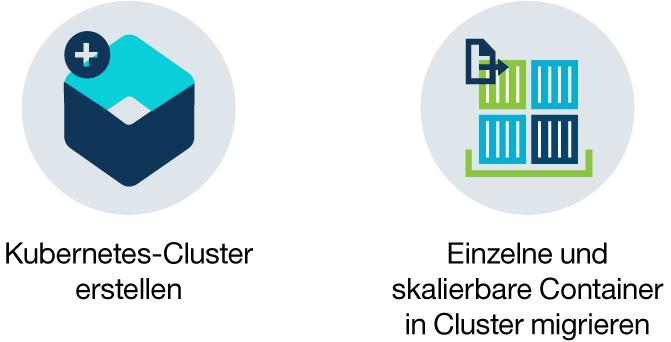

---

copyright:
  years: 2014, 2017
lastupdated: "2017-10-12"

---

{:new_window: target="_blank"}
{:shortdesc: .shortdesc}
{:screen: .screen}
{:pre: .pre}
{:table: .aria-labeledby="caption"}
{:codeblock: .codeblock}
{:tip: .tip}
{:download: .download}

# Informationen zu {{site.data.keyword.containerlong_notm}}
{: #cs_ov}

{{site.data.keyword.containershort}} kombiniert Docker und Kubernetes, um leistungsstarke Tools, ein intuitives Benutzererlebnis sowie integrierte Sicherheit und Isolation zu bieten und um die Bereitstellung, den Betrieb, die Skalierung und die Überwachung von containerisierten Apps über einen Cluster unabhängiger Rechenhosts anhand der Kubernetes-APIs zu automatisieren.
{:shortdesc}

 

## Docker-Container
{: #cs_ov_docker}

Docker ist ein Open-Source-Projekt, das von dotCloud 2013 veröffentlicht wurde. Aufbauend auf Features der vorhandenen LXC (Linux Containers)-Technologie hat sich Docker zu einer Softwareplattform entwickelt, die Sie zum schnellen Erstellen, Testen, Bereitstellen und Skalieren von Apps einsetzen können. Docker packt Software in standardisierten Einheiten, die als Container bezeichnet werden und alle Elemente enthalten, die eine App für die Ausführung benötigt.
{:shortdesc}

Lesen Sie hier mehr über die grundlegenden Docker-Konzepte.

<dl>
<dt>Container</dt>
<dd>Ein Container ist ein Standardverfahren zum Packen einer App mit den zugehörigen Abhängigkeiten, sodass die App in eine andere Umgebungen verlagert und dort ohne Änderungen ausgeführt werden kann. Im Unterschied zu virtuellen Maschinen virtualisieren Container keine Einheiten, die zugehörigen Betriebssysteme und die zugrunde liegende Hardware. Nur App-Code, Laufzeit, Systemtools, Bibliotheken und Einstellungen werden in dem Container gepackt. Container werden als isolierte Prozesse auf dem Rechenhost ausgeführt, auf dem sie bereitgestellt werden, und nutzen dasselbe Hostbetriebssystem und dieselben Hardwareressourcen. Dadurch ist ein Container schlanker, leichter portierbar und effizienter als eine virtuelle Maschine.</dd>
<dt>Image</dt>
<dd>Jeder Container basiert auf einem Docker-Image und wird als eine Instanz eines Images betrachtet. Ein Image wird auf der Grundlage einer Dockerfile erstellt. Hierbei handelt es sich um eine Datei, die Anweisungen zum Erstellen des Image und zum Erstellen von beliebigen Artefakten wie etwa einer App, der Konfiguration der App und ihren Abhängigkeiten enthält.</dd>
<dt>Registry</dt>
<dd>Eine Image-Registry ist ein Ort, an dem Docker-Images gespeichert, abgerufen und von gemeinsam genutzt werden können. Die in einer Registry gespeicherten Images können öffentlich verfügbar sein (öffentliche Registry) oder aber nur für eine kleine Gruppe von Benutzern zugänglich sein (private Registry). {{site.data.keyword.containershort_notm}} bietet öffentliches Images, z. B. ibmliberty, die geeignet sind, sich mit Docker und Kubernetes vertraut zu machen und die erste containerisierte App in einem Cluster zu erstellen. Was Unternehmensanwendungen betrifft, so sollten Sie jedoch eine private Registry (wie z. B. die von {{site.data.keyword.Bluemix_notm}} bereitgestellte Registry) verwenden, um zu verhindern, dass Ihre Images durch nicht berechtigte Benutzer verwendet oder unbefugt Änderungen an ihnen vorgenommen werden.

  
Wenn Sie einen Container aus einem Image bereitstellen wollen, müssen Sie sicherstellen, dass das Image entweder in einer öffentlichen oder einer privaten Image-Registry gespeichert ist.</dd>
</dl>

### Die wichtigsten Vorteile der Verwendung von Containern
{: #container_benefits}

<dl>
<dt>Container sind agil</dt>
<dd>Container vereinfachen die Systemverwaltung durch die Bereitstellung standardisierter Umgebungen für Entwicklungs- und Produktionsteams. Die schlanke Laufzeitumgebung der Engine ermöglicht schnelle Scale-up- und Scale-down-Operationen als Antwort auf Änderungen in der Nachfrage. Sie helfen dabei, die Verwaltung unterschiedlicher Betriebssystemplattformen und der zugrunde liegenden Infrastruktur zu erleichtern. Mithilfe von Containern können Sie jede App in jeder Infrastruktur bereitstellen und schnell und zuverlässig ausführen.</dd>
<dt>Container sind klein</dt>
<dd>Sie können in dem Speicherbereich, den eine einzelne virtuelle Maschine benötigen würde, mehrere Container unterbringen.</dd>
<dt>Container sind portierbar</dt>
<dd>Erstellen Sie ein Image für einen Container, indem Sie ein anderes Image als Grundlage verwenden. So wird die Hauptarbeit für ein Image von jemand anderem ausgeführt und Sie müssen das Image nur noch für Ihre Nutzung optimieren. Sie können auch App-Code schnell von einer Staging-Umgebung in eine Produktionsumgebung migrieren. Der Migrationsprozess kann mit Tools wie Delivery Pipeline oder UrbanCode Deploy automatisiert werden.</dd>
</dl>

 

## Grundlegende Informationen zu Kubernetes
{: #kubernetes_basics}

Kubernetes wurde von Google als Teil des Borg-Projekts entwickelt und im Jahr 2014 an die Open-Source-Community übergeben. Kubernetes vereint über 15 Jahre Google-Forschung in der Ausführung einer containerisierten Infrastruktur mit Produktionsarbeitslasten, Open-Source-Beiträgen und Managementtools für Docker-Container und stellt nun eine isolierte und sichere App-Plattform zur Verfügung, die portierbar, erweiterbar und bei Auftreten von Failover-Situationen selbstheilend ist.
{:shortdesc}

Lernen Sie zunächst die grundlegende Terminologie von Kubernetes kennen.

<dl>
<dt>Cluster</dt>
<dd>Ein Kubernetes-Cluster besteht aus einer oder mehreren virtuellen Maschinen, die als Workerknoten bezeichnet werden. Jeder Workerknoten stellt einen Rechenhost dar, auf dem Sie containerisierte Apps bereitstellen, ausführen und verwalten können. Workerknoten werden von einem Kubernetes-Master verwaltet, der alle Kubernetes-Ressourcen im Cluster zentral steuert und überwacht. Wenn Sie eine containerisierte App bereitstellen, entscheidet der Kubernetes-Master, wo die Bereitstellung der App erfolgt, und zwar unter Berücksichtigung der Bereitstellungsanforderungen und der im Cluster verfügbaren Kapazität.</dd>
<dt>Pod</dt>
<dd>Jede containerisierte App, die in einem Kubernetes-Cluster bereitgestellt wird, wird von einem Pod bereitgestellt, ausgeführt und verwaltet. Pods stellen die kleinsten bereitstellbaren Einheiten in einem Kubernetes-Cluster dar und werden verwendet, um Container zu gruppieren, die als einzelne Einheit verarbeitet werden müssen. In den meisten Fällen wird ein Container auf einem eigenen Pod bereitgestellt. Es kann jedoch erforderlich sein, dass für eine App ein Container und weitere Hilfscontainer in einem Pod bereitgestellt werden, damit diese Container mit derselben privaten IP-Adresse referenziert werden können.</dd>
<dt>Bereitstellung</dt>
<dd>Eine Bereitstellung ist eine Kubernetes-Ressource, in der Sie Ihre Container und andere Kubernetes-Ressourcen angeben, die für die Ausführung Ihrer App erforderlich sind, z. B. persistenter Speicher, Services oder Annotationen. Bereitstellungen werden in einem Kubernetes-Bereitstellungsscript dokumentiert. Wenn Sie eine Bereitstellung ausführen, stellt der Kubernetes-Master die angegebenen Container in Pods bereit, wobei die auf den Workerknoten des Clusters verfügbare Kapazität berücksichtigt wird. Andere Kubernetes-Ressourcen werden wie im Bereitstellungsscript angegeben erstellt und konfiguriert.

  
Mit einer Bereitstellung können Sie Aktualisierungsstrategien für Ihre App definieren. Dabei können Sie unter Anderem die Anzahl von Pods angeben, die Sie bei einer rollierenden Aktualisierung hinzufügen wollen, und festlegen, wie viele Pods zur gleichen Zeit nicht verfügbar sein dürfen. Wenn Sie eine rollierende Aktualisierung durchführen, prüft die Bereitstellung, ob die Überarbeitung funktioniert, und stoppt den Rollout, wenn Fehler erkannt werden.</dd>
<dt>Service</dt>
<dd>Ein Kubernetes-Service fassen eine Gruppe von Pods zusammen und stellen diesen Pods eine Netzverbindung für andere Services im Cluster bereit, ohne hierbei die tatsächlichen IP-Adressen der einzelnen Pods preiszugeben. Mithilfe von Services können Sie Ihre App innerhalb Ihres Clusters oder im öffentlichen Internet zugänglich machen.

  
Weitere Informationen zur Kubernetes-Terminologie erhalten Sie im <a href="cs_tutorials.html#cs_cluster_tutorial" target="_blank">Lernprogramm</a>.</dd>
</dl>

 

## Vorteile durch die Verwendung von Clustern
{: #cs_ov_benefits}

Jeder Cluster wird auf gemeinsam genutzten oder dedizierten virtuellen Maschinen bereitgestellt, die native Kubernetes-Funktionalität und durch {{site.data.keyword.IBM_notm}} hinzugefügte Funktionen zur Verfügung stellen.
{:shortdesc}

|Vorteil|Beschreibung|
|-------|-----------|
|Single-Tenant-Kubernetes-Cluster mit Isolation der Berechnungs-, Netz- und Speicherinfrastruktur|<ul><li>Ermöglicht die Erstellung einer eigenen angepassten Infrastruktur, die den Anforderungen Ihrer Unternehmens- und Entwicklungsumgebung entspricht.</li><li>Ermöglicht die Einrichtung eines dedizierten und geschützten Kubernetes-Masters sowie von Workerknoten, virtuellen Netzen und Speicher unter Nutzung der von IBM Bluemix Infrastructure (SoftLayer) bereitgestellten Ressourcen. </li><li>Ermöglicht das Speichern persistenter Daten, die gemeinsame Nutzung von Daten durch Kubernetes-Pods und bei Bedarf die Wiederherstellung von Daten mit dem integrierten und sicheren Datenträgerservice.</li><li>Der komplett verwaltete Kubernetes-Master, der kontinuierlich von {{site.data.keyword.IBM_notm}} überwacht und aktualisiert wird, um Ihren Cluster verfügbar zu halten.</li><li>Bietet volle Unterstützung für alle nativen Kubernetes-APIs.</li></ul>|
|Einhaltung von Sicherheitsbestimmungen für Images mit Vulnerability Advisor|<ul><li>Ermöglicht die Einrichtung einer eigenen geschützten privaten Docker-Image-Registry, in der Images gespeichert und von allen Benutzern der Organisation gemeinsam genutzt werden können.</li><li>Bietet den Vorteil des automatischen Scannens von Images in Ihrer privaten {{site.data.keyword.Bluemix_notm}}-Registry.</li><li>Ermöglicht die Überprüfung von Empfehlungen für das im Image verwendete Betriebssystem, um potenzielle Schwachstellen zu beheben.</li></ul>|
|Automatische Skalierung von Apps|<ul><li>Ermöglicht das Definieren angepasster Richtlinien, um Apps auf der Grundlage der CPU-Auslastung und des Speicherbedarfs vertikal nach oben oder nach unten zu skalieren.</li></ul>|
|Kontinuierliche Überwachung des Clusterzustands|<ul><li>Über das Cluster-Dashboard können Sie den Zustand Ihrer Cluster, Workerknoten und Containerbereitstellungen rasch anzeigen und verwalten.</li><li>Ermöglicht die Feststellung detaillierter Metriken zur Auslastung mit {{site.data.keyword.monitoringlong}} und die rasche Erweiterung des Clusters als Reaktion auf die Arbeitslast.</li><li>Stellt detaillierte Protokollinformationen zu Clusteraktivitäten über den {{site.data.keyword.loganalysislong}} bereit.</li></ul>|
|Automatische Wiederherstellung von nicht ordnungsgemäß funktionierenden Containern|<ul><li>Führt kontinuierlich Statusprüfungen für Container aus, die auf einem Workerknoten bereitgestellt sind.</li><li>Bewirkt bei Ausfällen die automatische Neuerstellung von Containern.</li></ul>|
|Serviceerkennung und Service-Management|<ul><li>Ermöglicht das zentrale Registrieren von App-Services, um diese für andere Apps in Ihrem Cluster verfügbar zu machen, jedoch ohne sie öffentlich zugänglich zu machen.</li><li>Ermöglicht das Erkennen registrierter Services, ohne dass Sie den Überblick über wechselnde IP-Adressen oder Container-IDs behalten müssen, und versetzt Sie in die Lage, die Vorteile des automatischen Routing zu verfügbaren Instanzen auszuschöpfen.</li></ul>|
|Sichere Offenlegung von Services gegenüber der Allgemeinheit|<ul><li>Ermöglicht das Einrichten privater Overlay-Netze mit voller Unterstützung der Lastausgleichsfunktion (Load Balancer) und voller Ingress-Unterstützung, um Ihre Apps öffentlich zugänglich zu machen und Arbeitslasten über mehrere Workerknoten gleichmäßig zu verteilen, ohne den Überblick über die wechselnden IP-Adressen in Ihrem Cluster behalten zu müssen.</li><li>Sie haben die Auswahl zwischen einer öffentlichen IP-Adresse, einer von {{site.data.keyword.IBM_notm}} bereitgestellten Route oder Ihrer eigenen angepassten Domäne, um aus dem Internet auf Services in Ihrem Cluster zuzugreifen.</li></ul>|
|Integration des {{site.data.keyword.Bluemix_notm}}-Service|<ul><li>Ermöglicht das Hinzufügen zusätzlicher Funktionalität zu Ihrer App durch die Integration von {{site.data.keyword.Bluemix_notm}}-Services wie zum Beispiel Watson-APIs, Blockchain, Datenservices oder Internet of Things und hilft den Benutzern des Clusters, den Prozess der Entwicklung von Apps und Verwaltung von Containern zu vereinfachen.</li></ul>|
{: caption="Tabelle 1. Vorteile durch die Verwendung von Clustern mit {{site.data.keyword.containerlong_notm}}" caption-side="top"}

 

## Cloudumgebungen
{: #cs_ov_environments}

Sie können die {{site.data.keyword.Bluemix_notm}}-Cloudumgebung auswählen, in der Cluster und Container bereitgestellt werden sollen.
{:shortdesc}

### {{site.data.keyword.Bluemix_notm}} Public
{: #public_environment}

Implementieren Sie Cluster in der öffentlichen Cloudumgebung ([https://console.bluemix.net ](https://console.bluemix.net)) und stellen Sie eine Verbindung zu einem beliebigen Service im {{site.data.keyword.Bluemix_notm}}-Katalog her.

Sie können mit Clustern in {{site.data.keyword.Bluemix_notm}} Public die Ebene der Hardwareisolierung für die Workerknoten in Ihrem Cluster auswählen. Verwenden Sie dedizierte Hardware für die verfügbaren physischen Ressourcen, die nur Ihrem Cluster zugeordnet werden sollen, oder für gemeinsam genutzte Hardware, damit die physischen Ressourcen gemeinsam mit Clustern von anderen {{site.data.keyword.IBM_notm}} Kunden genutzt werden können. Sie können einen dedizierten Cluster in der {{site.data.keyword.Bluemix_notm}} Public-Umgebung auswählen, wenn Sie für Ihren Cluster eine Isolierung wünschen. Aber Sie benötigen keine solche Isolierung für andere {{site.data.keyword.Bluemix_notm}}-Services, die Sie nutzen.

Klicken Sie für die ersten Schritte auf eine der folgenden Optionen:

    <map name="public_options" id="public_options">
    <area href="container_index.html#clusters" alt="Einführung in Kubernetes-Cluster in {{site.data.keyword.Bluemix_notm}} " title="Einführung in Kubernetes-Cluster in {{site.data.keyword.Bluemix_notm}} " shape="rect" coords="-5, -6, 123, 154" />
    <area href="cs_classic.html#cs_classic" alt="Einzelne und skalierbare Container in {{site.data.keyword.containershort_notm}} ausführen" title="Einzelne und skalierbare Container in {{site.data.keyword.containershort_notm}} ausführen" shape="rect" coords="181, -5, 320, 161" />
    </map>

### {{site.data.keyword.Bluemix_notm}} Dedicated
{: #dedicated_environment}

Stellen Sie Cluster (Closed Beta) oder einzelne und skalierbare Container in einer dedizierten Cloudumgebung (`https://<my-dedicated-cloud-instance>.bluemix.net`) bereit und stellen Sie eine Verbindung mit den vorausgewählten {{site.data.keyword.Bluemix_notm}}-Services her, die ebenfalls darin ausgeführt werden.

Cluster mit {{site.data.keyword.Bluemix_notm}} Dedicated sind äquivalent zu Clustern, die mit dedizierter Hardware in {{site.data.keyword.Bluemix_notm}} Public erstellt wurden. Verfügbare physische Ressourcen werden Ihren Clustern zugeordnet und nicht mit Clustern von anderen {{site.data.keyword.IBM_notm}} Kunden gemeinsam verwendet. Sowohl für Public als auch für Dedicated wird der öffentliche API-Endpunkt verwendet, um Cluster zu erstellen. Bei {{site.data.keyword.Bluemix_notm}} Dedicated lauten die wichtigsten Unterschiede jedoch wie folgt.

*   {{site.data.keyword.IBM_notm}} besitzt und verwaltet das Konto von IBM Bluemix Infrastructure (SoftLayer), unter dem die Workerknoten, VLANs und Teilnetze bereitgestellt werden. Die Bereitstellung wird nicht unter einem Konto durchgeführt, dessen Eigner Sie sind.
*   Die Spezifikationen für diese VLANs und Teilnetze werden bestimmt, wenn die Dedicated-Umgebung erstellt wird und nicht, wenn der Cluster erstellt wird.

Sie können eine {{site.data.keyword.Bluemix_notm}} Dedicated-Umgebung einrichten, wenn Sie eine Isolation für Ihren Cluster sowie eine Isolation für die anderen, von Ihnen genutzten {{site.data.keyword.Bluemix_notm}}-Services benötigen.

Klicken Sie für die ersten Schritte auf eine der folgenden Optionen:

    <map name="dedicated_options" id="dedicated_options">
    <area href="#setup_dedicated" alt="{{site.data.keyword.containershort_notm}} unter {{site.data.keyword.Bluemix_notm}} Dedicated (Closed Beta) einrichten" title="{{site.data.keyword.containershort_notm}} unter {{site.data.keyword.Bluemix_notm}} Dedicated (Closed Beta) einrichten" shape="rect" coords="-5, -15, 100, 153" />
    <area href="container_index.html#dedicated" alt="Einführung zu Kubernetes-Clustern in {{site.data.keyword.Bluemix_notm}} Dedicated (Closed Beta)" title="Einführung zu Kubernetes-Clustern in {{site.data.keyword.Bluemix_notm}} Dedicated (Closed Beta)" shape="rect" coords="153, -10, 276, 182" />
    <area href="cs_classic.html#cs_classic" alt="Einzelne und skalierbare Container in {{site.data.keyword.containershort_notm}} ausführen" title="Einzelne und skalierbare Container in {{site.data.keyword.containershort_notm}} ausführen" shape="rect" coords="317, -11, 436, 188" />
    <area href="container_ha.html#container_group_ui" alt="Langfristige Services als Containergruppen über die {{site.data.keyword.Bluemix_notm}}-GUI ausführen" title="Langfristige Services als Containergruppen über die {{site.data.keyword.Bluemix_notm}}-GUI ausführen" shape="rect" coords="485, -1, 600, 173" />
    </map>

### Unterschiede in der Clusterverwaltung zwischen den Cloudumgebungen
{: #env_differences}

|Bereich|{{site.data.keyword.Bluemix_notm}} Public|{{site.data.keyword.Bluemix_notm}} Dedicated (Closed Beta)|
|--|--------------|--------------------------------|
|Clustererstellung|Erstellen Sie einen Lite-Cluster oder geben Sie die folgenden Details für einen Standardcluster an:<ul><li>Clustertyp</li><li>Name</li><li>Standort</li><li>Maschinentyp</li><li>Anzahl von Workerknoten</li><li>Öffentliches VLAN</li><li>Privates VLAN</li><li>Hardware</li></ul>|Geben Sie die folgenden Details für einen Standardcluster an:<ul><li>Name</li><li>Kubernetes-Version</li><li>Maschinentyp</li><li>Anzahl von Workerknoten</li></ul>
**Hinweis:** Die VLAN- und Hardware-Einstellungen werden beim Erstellen der {{site.data.keyword.Bluemix_notm}}-Umgebung vordefiniert.
|
|Cluster-Hardware und Eigentumsrechte|In Standardclustern kann die Hardware mit anderen {{site.data.keyword.IBM_notm}} Kunden gemeinsam genutzt oder nur Ihnen zugeordnet werden. Die öffentlichen und privaten VLANs sind Ihr Eigentum und werden von Ihnen in Ihrem Konto von IBM Bluemix Infrastructure (SoftLayer) verwaltet. |In Clustern in {{site.data.keyword.Bluemix_notm}} Dedicated ist die Hardware immer dediziert. Die öffentlichen und privaten VLANs sind Eigentum von IBM und werden von IBM verwaltet. Die Position ist für die {{site.data.keyword.Bluemix_notm}}-Umgebung vordefiniert.|
|Servicebindung mit einem Cluster|Verwenden Sie den Befehl[bx cs cluster-service-bind](cs_cluster.html#cs_cluster_service), um einen geheimen Kubernetes-Schlüssel an den Cluster zu binden.|Erstellen Sie eine [JSON-Schlüsseldatei](cs_cluster.html#binding_dedicated) für die Berechtigungsnachweise des Services. Erstellen Sie anschließend einen geheimen Kubernetes-Schlüssel aus dieser Datei, um den Cluster zu binden.|
|Lastausgleichsfunktion und Ingress Networking|Bei der Bereitstellung von Standardclustern werden die folgenden Aktionen automatisch ausgeführt.<ul><li>Ein öffentliches portierbares Teilnetz wird an Ihren Cluster gebunden und Ihrem Konto von IBM Bluemix Infrastructure (SoftLayer) zugeordnet. </li><li>Eine portierbare öffentliche IP-Adresse wird für einen hoch verfügbaren Ingress-Controller verwendet und eine eindeutige öffentliche Route wird im Format '&lt;clustername&gt;.containers.mybluemix.net' zugeordnet. Sie können diese Route verwenden, um mehrere Apps öffentlich zugänglich zu machen.</li><li>Es werden vier portierbare öffentliche IP-Adressen dem Cluster zugeordnet, mit denen Apps über Lastausgleichsservices öffentlich zugänglich gemacht werden können. Zusätzliche Teilnetze können über Ihr Konto von IBM Bluemix Infrastructure (SoftLayer) angefordert werden. </li></ul>|Wenn Sie Ihr Dedicated-Konto erstellen, treffen Sie die folgenden Entscheidungen:<ul><li>Gewünschte Anzahl der Teilnetze</li><li>Gewünschter Typ der Teilnetze (Lastausgleichsfunktion oder Ingress) {{site.data.keyword.IBM_notm}} erstellt die Teilnetze und führt für Sie die Netzmanagementtasks durch. Je nachdem, was Sie gewählt haben, wird möglicherweise ein Ingress-Controller erstellt und eine öffentliche Route zugeordnet. Zusätzliche Teilnetze können mit dem [Öffnen eines Support-Tickets](/docs/support/index.html#contacting-support) angefordert werden, um das Teilnetz zu erstellen. Verwenden Sie dann den Befehl [`bx cs cluster-subnet-add`](cs_cli_reference.html#cs_cluster_subnet_add), um den Cluster das Teilnetz zuzuordnen.|
|NodePort Networking|Machen Sie auf Ihrem Workerknoten einen öffentlichen Port zugänglich und verwenden Sie die öffentliche IP-Adresse des Workerknotens, um öffentlich auf Ihren Service im Cluster zuzugreifen.|Alle öffentlichen IP-Adressen der Workerknoten sind durch eine Firewall blockiert. Bei {{site.data.keyword.Bluemix_notm}}-Services, die dem Cluster hinzugefügt wurden, kann der Knotenport jedoch über eine öffentliche IP-Adresse oder eine private IP-Adresse zugegriffen werden.|
|Persistenter Speicher|Verwenden Sie für Datenträger eine [dynamische Bereitstellung](cs_apps.html#cs_apps_volume_claim) oder eine [statische Bereitstellung](cs_cluster.html#cs_cluster_volume_create).|Verwenden Sie für Datenträger eine [dynamische Bereitstellung](cs_apps.html).</li></ul>|
|Image-Registry-URL in {{site.data.keyword.registryshort_notm}}|<ul><li>Vereinigte Staaten (Süden) und Vereinigte Staaten (Osten): <code>registry.ng bluemix.net</code></li><li>Vereinigtes Königreich (Süden): <code>registry.eu-gb.bluemix.net</code></li><li>EU-Central (Frankfurt): <code>registry.eu-de.bluemix.net</code></li><li>Australien (Sydney): <code>registry.au-syd.bluemix.net</code></li></ul>|<ul><li>Verwenden Sie für neue Namensbereiche dieselben regionsbasierenden Registrys, die für {{site.data.keyword.Bluemix_notm}} Public definiert sind.</li><li>Verwenden Sie für Namensbereiche, die für einzelne und skalierbare Container in {{site.data.keyword.Bluemix_notm}} Dedicated eingerichtet wurden, <code>'registry.&lt;dedizierte_domäne&gt;'.</code></li></ul>|
|Auf die Registry zugreifen|Die einzelnen Optionen sind unter [Private und öffentliche Image-Registrys mit {{site.data.keyword.containershort_notm}} verwenden](cs_cluster.html#cs_apps_images) beschrieben.|<ul><li>Die einzelnen Optionen für neue Namensbereiche sind unter [Private und öffentliche Image-Registrys mit {{site.data.keyword.containershort_notm}} verwenden](cs_cluster.html#cs_apps_images) beschrieben.</li><li>Für Namensbereiche, die für einzelne und skalierbare Gruppen eingerichtet wurden: [Verwenden Sie ein Token und erstellen Sie einen geheimen Kubernetes-Schlüssel](cs_dedicated_tokens.html#cs_dedicated_tokens) zur Authentifizierung.</li></ul>|
{: caption="Tabelle 2. Funktionsunterschiede zwischen {{site.data.keyword.Bluemix_notm}} Public und {{site.data.keyword.Bluemix_notm}} Dedicated" caption-side="top"}

### {{site.data.keyword.containershort_notm}} unter {{site.data.keyword.Bluemix_notm}} Dedicated (Closed Beta) einrichten
{: #setup_dedicated}

Administratoren müssen die IBM Administrator-ID und die Benutzer Ihrer Organisation zur Dedicated-Umgebung hinzufügen.

[Richten Sie zunächst eine {{site.data.keyword.Bluemix_notm}} Dedicated-Umgebung ein.](/docs/dedicated/index.html#setupdedicated)

Gehen Sie wie folgt vor, um Ihre Dedicated-Umgebung einzurichten:

1.  Fügen Sie der Umgebung Ihre IBM Administrator-ID hinzu.
    1.  Wählen Sie Ihr {{site.data.keyword.Bluemix_notm}} Dedicated-Konto aus.
    2.  Klicken Sie in der Menüleiste auf **Verwalten>Sicherheit>Identität und Zugriff**. Im Fenster Benutzer wird eine Liste der Benutzer mit ihren E-Mail-Adressen und Status für das ausgewählte Konto angezeigt.
    3.  Klicken Sie auf **Benutzer einladen**.
    4.  Geben Sie in **E-Mail-Adresse oder bereits vorhandene IBMid** die folgende E-Mail-Adresse ein: `cfsdl@us.ibm.com`.
    5.  Erweitern Sie im Abschnitt **Zugriff** den Eintrag **Durch Identity and Access aktivierte Services**.
    6.  Wählen Sie in der Dropdown-Liste **Services** den Eintrag **{{site.data.keyword.containershort_notm}}** aus.
    7.  Wählen Sie in der Dropdown-Liste **Rollen** den Eintrag **Administrator** aus.
    8.  Klicken Sie auf **Benutzer einladen**.
2.  [Erstellen Sie IBMids für die Endbenutzer Ihres {{site.data.keyword.Bluemix_notm}}-Kontos ](https://www.ibm.com/account/us-en/signup/register.html).
3.  [Fügen Sie die Benutzer aus dem vorherigen Schritt zu Ihrem {{site.data.keyword.Bluemix_notm}}-Konto hinzu.](cs_cluster.html#add_users)
4.  Greifen Sie über die Public-Konsole auf Ihr {{site.data.keyword.Bluemix_notm}} Dedicated-Konto hinzu und erstellen Sie Cluster.
    1.  Melden Sie sich bei der {{site.data.keyword.Bluemix_notm}} Public-Konsole ([https://console.bluemix.net ](https://console.bluemix.net)) mit Ihrer IBMid an.
    2.  Wählen Sie im Kontomenü Ihr {{site.data.keyword.Bluemix_notm}} Dedicated-Konto aus. Die Konsole wird mit den Services und Informationen für Ihre {{site.data.keyword.Bluemix_notm}} Dedicated-Instanz aktualisiert.
    3.  Wählen Sie im Katalog für Ihre {{site.data.keyword.Bluemix_notm}} Dedicated-Instanz **Container** aus und klicken Sie auf **Kubernetes-Cluster**. Weitere Informationen zum Erstellen eines Clusters finden Sie unter [Kubernetes-Cluster über die GUI in {{site.data.keyword.Bluemix_notm}} Dedicated (Closed Beta) erstellen](cs_cluster.html#creating_ui_dedicated).
5. Wenn Ihr lokales System oder Ihr Unternehmensnetz die öffentlichen Internetendpunkte mithilfe von Proxys oder Firewalls steuert, dann lesen Sie die weiterführenden Informationen zur Zulassung von ausgehendem Datenverkehr im Abschnitt [Erforderliche Ports und IP-Adressen in Ihrer Firewall öffnen](cs_security.html#opening_ports).

 

## Servicearchitektur
{: #cs_ov_architecture}

Jeder Workerknoten ist mit einer von {{site.data.keyword.IBM_notm}} verwalteten Docker Engine, getrennten Berechnungsressourcen, Netzbetrieb und Datenträgerservice eingerichtet und verfügt ferner über integrierte Sicherheitsfeatures, die die Isolation, die Funktionalität für die Verwaltung von Ressourcen und die Einhaltung der Sicherheitsbestimmungen für die Workerknoten sicherstellen. Der Workerknoten kommuniziert über sichere TLS-Zertifikate und eine openVPN-Verbindung mit dem Master.
{:shortdesc}

*Abbildung 1. Kubernetes-Architektur und Netzbetrieb in {{site.data.keyword.containershort_notm}}*

 

## Missbrauch von Containern
{: #cs_terms}

Der unsachgemäße Gebrauch von {{site.data.keyword.containershort_notm}} ist untersagt.
{:shortdesc}

Ein unsachgemäßer Gebrauch umfasst:

*   Illegale Aktivitäten
*   Verteilung und Ausführung von Malware
*   {{site.data.keyword.containershort_notm}} beschädigen oder Verwendung von {{site.data.keyword.containershort_notm}} durch einen anderen Benutzer stören
*   Schäden verursachen oder Verwendung durch einen anderen Benutzer stören
*   Unbefugter Zugriff auf Services oder Systeme
*   Unberechtigte Änderung von Services oder Systemen
*   Verletzung von Rechten anderer Benutzer

Alle Nutzungsbedingungen finden Sie unter [Bedingungen für Cloud-Services](/docs/navigation/notices.html#terms).
