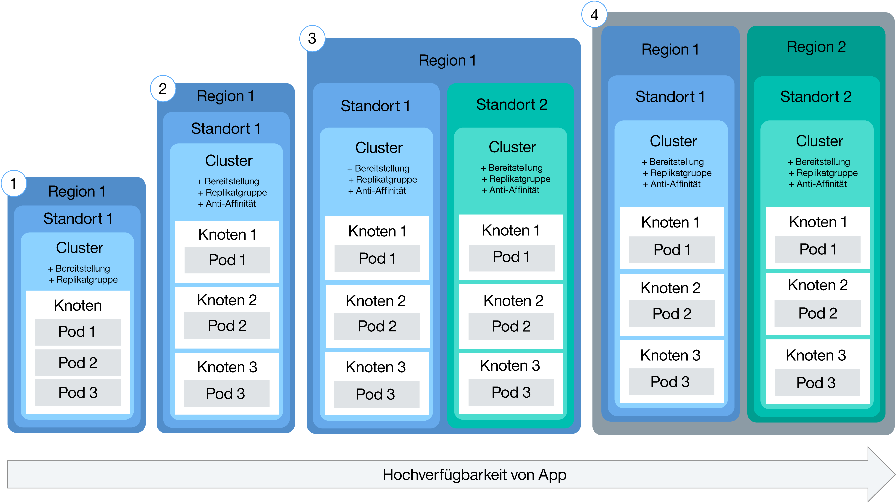
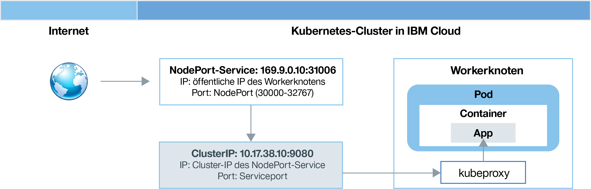
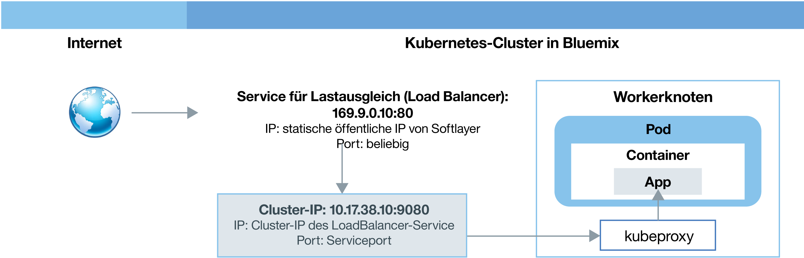
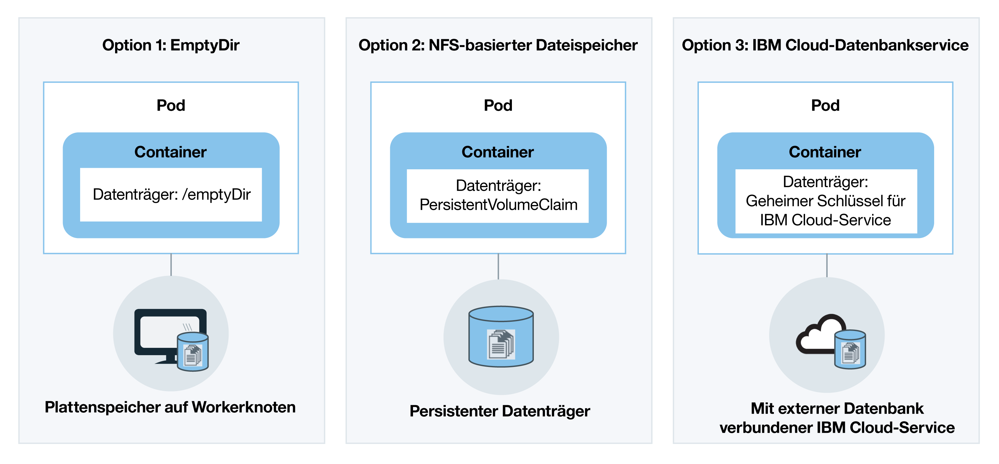

---

copyright:
  years: 2014, 2017
lastupdated: "2017-12-13"

---

{:new_window: target="_blank"}
{:shortdesc: .shortdesc}
{:screen: .screen}
{:pre: .pre}
{:table: .aria-labeledby="caption"}
{:codeblock: .codeblock}
{:tip: .tip}
{:download: .download}


# Cluster und Apps planen
{: #cs_planning}

Lernen Sie, wie Sie die richtigen Entscheidungen beim Konfigurieren und Anpassen von Kubernetes-Clustern in {{site.data.keyword.containershort_notm}} treffen. An einigen dieser Konfigurationen können nach der Erstellung eines Clusters keine Änderungen mehr durchgeführt werden. Wenn Sie sich im Vorfeld über diese Konfigurationen informieren, können Sie sicherstellen, dass den Entwicklungsteams bei Bedarf alle Ressourcen wie Hauptspeicher, Plattenspeicherplatz und IP-Adressen zur Verfügung stehen.
{:shortdesc}

<br />


## Vergleich von Lite-Clustern und Standardclustern
{: #cs_planning_cluster_type}

Sie können Lite- oder Standardcluster erstellen. Testen Sie Lite-Cluster, um sich mit einigen Kubernetes-Leistungsmerkmalen vertraut zu machen. Oder erstellen Sie Standardcluster, um das vollständige Leistungsspektrum von Kubernetes zum Bereitstellen von Apps zu nutzen.
{:shortdesc}

|Merkmale|Lite-Cluster|Standardcluster|
|---------------|-------------|-----------------|
|[Verfügbar in {{site.data.keyword.Bluemix_notm}}](cs_ov.html#cs_ov)|||
|[Netzbetrieb in Clustern](#cs_planning_private_network)|||
|[Öffentlicher App-Zugriff durch einen NodePort-Service](#cs_nodeport)|||
|[Benutzerzugriffsverwaltung](cs_cluster.html#cs_cluster_user)|||
|[Zugriff auf den {{site.data.keyword.Bluemix_notm}}-Service über das Cluster und die Apps](cs_cluster.html#cs_cluster_service)|||
|[Plattenspeicher auf Workerknoten für Speicher](#cs_planning_apps_storage)|||
|[Persistenter NFS-dateibasierter Speicher mit Datenträgern](#cs_planning_apps_storage)| ||
|[Öffentlicher oder privater App-Zugriff durch einen Lastausgleichsservice](#cs_loadbalancer)| ||
|[Öffentlicher App-Zugriff durch einen Ingress-Service](#cs_ingress)| ||
|[Portierbare öffentliche IP-Adressen](cs_apps.html#cs_cluster_ip_subnet)| ||
|[Protokollierung und Überwachung](cs_cluster.html#cs_logging)| ||
|[Verfügbar in {{site.data.keyword.Bluemix_dedicated_notm}}](cs_dedicated.html#dedicated_environment)| ||
{: caption="Tabelle 1. Unterschiede zwischen Lite-Clustern und Standardclustern" caption-side="top"}

<br />


## Clusterkonfiguration
{: #cs_planning_cluster_config}

Verwenden Sie Standardcluster, um die Verfügbarkeit von Apps zu erhöhen. Die Wahrscheinlichkeit, dass Ihre Benutzer Ausfallzeiten verzeichnen, ist
geringer, wenn Sie Ihre Containerkonfiguration auf mehrere Workerknoten und Cluster verteilen. Integrierte Funktionen wie Lastausgleich (Load Balancing) und Isolation erhöhen die Ausfallsicherheit gegenüber möglichen Fehlerbedingungen mit Hosts,
Netzen oder Apps.
{:shortdesc}

Betrachten Sie diese potenziellen Clusterkonfigurationen, die nach zunehmendem Grad der Verfügbarkeit angeordnet sind:


1.  Ein Cluster mit mehreren Knoten.
2.  Zwei Cluster, die an verschiedenen Standorten in derselben Region ausgeführt werden und jeweils mehrere Workerknoten besitzen.
3.  Zwei Cluster, die in verschiedenen Regionen ausgeführt werden und jeweils mehrere Workerknoten besitzen.

Steigern Sie die Verfügbarkeit Ihres Clusters mithilfe dieser Verfahren: 

<dl>
<dt>Streuung von Apps durch Verteilen auf mehrere Workerknoten </dt>
<dd>Erlauben Sie den Entwicklern die Streuung ihrer Apps in Containern auf mehrere Workerknoten pro Cluster. Eine App-Instanz in jedem dritten Workerknoten ermöglicht, die Ausfallzeit eines Workerknotens abzufangen, ohne dass die Nutzung der App unterbrochen wird. Sie können angeben, wie viele Workerknoten eingeschlossen werden, wenn Sie einen Cluster über die [{{site.data.keyword.Bluemix_notm}}-GUI](cs_cluster.html#cs_cluster_ui) oder die [CLI](cs_cluster.html#cs_cluster_cli) erstellen. Kubernetes beschränkt die maximale Anzahl von Workerknoten, die in einem Cluster vorhanden sein können. Beachten Sie deshalb die [Kontingente für Workerknoten und Pods ](https://kubernetes.io/docs/admin/cluster-large/).
<pre class="codeblock">
<code>bx cs cluster-create --location &lt;dal10&gt; --workers 3 --public-vlan &lt;meine_id_des_öffentlichen_vlan&gt; --private-vlan &lt;meine_id_des_privaten_vlan&gt; --machine-type &lt;u2c.2x4&gt; --name &lt;mein_cluster&gt;</code>
</pre>
</dd>
<dt>Streuung von Apps durch Verteilen auf mehrere Cluster</dt>
<dd>Erstellen Sie mehrere Cluster, die jeweils mehrere Workerknoten besitzen. Sollte es bei einem Cluster zu einem Ausfall kommen, können Benutzer immer noch auf eine App zugreifen, die auch auf einem anderen Cluster bereitgestellt ist.
<p>Cluster
1:</p>
<pre class="codeblock">
<code>bx cs cluster-create --location &lt;dal10&gt; --workers 3 --public-vlan &lt;meine_id_des_öffentlichen_vlan&gt; --private-vlan &lt;meine_id_des_privaten_vlan&gt; --machine-type &lt;u2c.2x4&gt; --name &lt;mein_cluster1&gt;</code>
</pre>
<p>Cluster
2:</p>
<pre class="codeblock">
<code>bx cs cluster-create --location &lt;dal12&gt; --workers 3 --public-vlan &lt;meine_id_des_öffentlichen_vlan&gt; --private-vlan &lt;meine_id_des_privaten_vlan&gt; --machine-type &lt;u2c.2x4&gt;  --name &lt;mein_cluster2&gt;</code>
</pre>
</dd>
<dt>Streuung von Apps durch Verteilen auf mehrere Cluster in verschiedenen Regionen</dt>
<dd>Wenn Sie Apps auf mehrere Cluster in verschiedenen Regionen verteilen, kann der Lastausgleich auf der Grundlage der Region erfolgen, in der sich der Benutzer befindet. Wenn der Cluster, die Hardware oder gar ein kompletter Standort in einer Region ausfällt, wird der Datenverkehr an den Container weitergeleitet,
der an einem anderen Standort bereitgestellt ist.
<p><strong>Wichtig:</strong> Nachdem Sie eine angepasste Domäne konfiguriert haben, können Sie die Cluster anhand der folgenden Befehle erstellen. </p>
<p>Standort
1:</p>
<pre class="codeblock">
<code>bx cs cluster-create --location &lt;dal10&gt; --workers 3 --public-vlan &lt;meine_id_des_öffentlichen_vlan&gt; --private-vlan &lt;meine_id_des_privaten_vlan&gt; --machine-type &lt;u2c.2x4&gt; --name &lt;mein_cluster1&gt;</code>
</pre>
<p>Standort
2:</p>
<pre class="codeblock">
<code>bx cs cluster-create --location &lt;ams03&gt; --workers 3 --public-vlan &lt;meine_id_des_öffentlichen_vlan&gt; --private-vlan &lt;meine_id_des_privaten_vlan&gt; --machine-type &lt;u2c.2x4&gt; --name &lt;mein_cluster2&gt;</code>
</pre>
</dd>
</dl>

<br />


## Konfiguration von Workerknoten
{: #cs_planning_worker_nodes}

Ein Kubernetes-Cluster besteht aus Workerknoten, die vom Kubernetes-Master zentral überwacht und verwaltet werden. Clusteradministratoren entscheiden, wie sie den Cluster aus Workerknoten einrichten, um sicherzustellen, dass den Clusterbenutzern alle Ressourcen
für die Bereitstellung und Ausführung von Apps im Cluster zur Verfügung stehen.
{:shortdesc}

Wenn Sie einen Standardcluster erstellen, werden in IBM Cloud Infrastructure (SoftLayer) in Ihrem Namen Workerknoten bestellt und in {{site.data.keyword.Bluemix_notm}} eingerichtet. Jedem Workerknoten werden eine eindeutige Workerknoten-ID und ein Domänenname zugeordnet, die nach dem Erstellen des Clusters nicht geändert werden dürfen. Abhängig von dem ausgewählten Grad an Hardware-Isolation können Workerknoten als gemeinsam genutzte oder als dedizierte Knoten eingerichtet werden. Jeder Workerknoten wird mit einem bestimmten Maschinentyp bereitgestellt, der die Anzahl von vCPUs sowie die Menge an Haupt- und an Plattenspeicher festlegt, die den auf Ihrem Workerknoten bereitgestellten Containern zur Verfügung stehen. Kubernetes beschränkt die maximale Anzahl von Workerknoten, die in einem Cluster vorhanden sein können. Weitere Informationen finden Sie unter [Worker node and pod quotas ](https://kubernetes.io/docs/admin/cluster-large/).


### Hardware für Workerknoten
{: #shared_dedicated_node}

Jeder Arbeiterknoten wird als virtuelle Maschine auf physischer Hardware eingerichtet. Wenn Sie einen Standardcluster in {{site.data.keyword.Bluemix_notm}} erstellen, müssen Sie auswählen, ob die zugrunde liegende Hardware von mehreren {{site.data.keyword.IBM_notm}} Kunden gemeinsam genutzt werden kann (Multi-Tenant-Konfiguration) oder Sie die ausschließlich Ihnen vorbehaltene, dedizierte Nutzung vorziehen (Single-Tenant-Konfiguration).
{:shortdesc}

Bei einer Multi-Tenant-Konfiguration werden physische Ressourcen wie CPU und Speicher von allen virtuellen Maschinen, die auf derselben physischen Hardware bereitgestellt wurden, gemeinsam genutzt. Um sicherzustellen, dass jede virtuelle Maschine unabhängig von anderen Maschinen ausgeführt werden kann, segmentiert ein VM-Monitor, d. h. eine Überwachungsfunktion für virtuelle Maschinen, die auch als Hypervisor bezeichnet wird, die physischen Ressourcen in isolierte Entitäten und ordnet diese einer virtuellen Maschine als dedizierte Ressourcen zu. Dies wird als Hypervisor-Isolation bezeichnet.

Bei einer Single-Tenant-Konfiguration ist die Nutzung aller physischen Ressourcen ausschließlich Ihnen vorbehalten. Sie können mehrere Workerknoten als virtuelle Maschinen auf demselben physischen Host bereitstellen. Ähnlich wie bei der Multi-Tenant-Konfiguration stellt der Hypervisor auch hier sicher, dass jeder Workerknoten seinen Anteil an den verfügbaren physischen Ressourcen erhält.

Gemeinsam genutzte Knoten sind in der Regel kostengünstiger als dedizierte Knoten, weil die Kosten für die ihnen zugrunde liegende Hardware von mehreren Kunden getragen werden. Bei der Entscheidungsfindung hinsichtlich gemeinsam genutzter Knoten versus dedizierter Knoten sollten Sie mit Ihrer Rechtsabteilung Rücksprache halten, um zu klären, welcher Grad an Infrastrukturisolation und Compliance für Ihre App-Umgebung erforderlich ist.

Wenn Sie einen Lite-Cluster erstellen, wird Ihr Workerknoten im Konto von IBM Cloud Infrastructure (SoftLayer) automatisch als gemeinsam genutzter Knoten eingerichtet. 

<br />


### Speicherbegrenzung für Workerknoten
{: #resource_limit_node}

{{site.data.keyword.containershort_notm}} legt für jeden Workerknoten eine Speicherbegrenzung fest. Wenn Pods, die auf einem Workerknoten ausgeführt werden, diese Speicherbegrenzung überschreiten, werden die Pods entfernt. In Kubernetes wird diese Begrenzung als [harte Räumungsschwelle ](https://kubernetes.io/docs/tasks/administer-cluster/out-of-resource/#hard-eviction-thresholds) bezeichnet.

Wenn Ihre Pods häufig entfernt werden, fügen Sie zusätzliche Workerknoten zu Ihrem Cluster hinzu oder legen Sie [Ressourcenbegrenzungen ](https://kubernetes.io/docs/concepts/configuration/manage-compute-resources-container/#resource-requests-and-limits-of-pod-and-container) für die Pods fest.

Jeder Maschinentyp verfügt über eine andere Speicherkapazität. Wenn weniger Speicher auf dem Workerknoten als der zulässige Mindestschwellenwert verfügbar ist, entfernt Kubernetes den Pod sofort. Wenn ein anderer Workerknoten verfügbar ist, wird die Planung für den Pod auf diesem Workerknoten neu erstellt.

|Speicherkapazität für Workerknoten|Mindestspeicherschwellenwert eines Workerknotens|
|---------------------------|------------|
|4 GB  | 256 MB |
|16 GB | 1024 MB |
|64 GB | 4096 MB |
|128 GB| 4096 MB |
|242 GB| 4096 MB |

Um zu sehen, wie viel Speicher auf dem Workerknoten belegt ist, führen Sie [kubectl top node ](https://kubernetes.io/docs/reference/generated/kubectl/kubectl-commands#top) aus.


## Zuständigkeiten beim Cluster-Management
{: #responsibilities}

Informieren Sie sich über die Zuständigkeiten, die Sie gemeinsam mit IBM bei der Verwaltung von Clustern haben. {:shortdesc}

**IBM ist für Folgendes verantwortlich:**

- Bereitstellen des Masters, der Workerknoten und Managementkomponenten im Cluster (z. B. Ingress-Controller) bei der Clustererstellung
- Verwalten der Aktualisierungen, Überwachen und Wiederherstellen des Kubernetes-Masters für den Cluster
- Überwachen des Zustands der Workerknoten und Bereitstellen der Automatisierung für Aktualisierung und Wiederherstellung dieser Workerknoten
- Ausführen von Automatisierungstasks für das Infrastrukturkonto einschließlich Hinzufügen von Workerknoten, Entfernen von Workerknoten und Erstellen eines Standardteilnetzes
- Verwalten, Aktualisieren und Wiederherstellen der aktiven Komponenten im Cluster (z. B. Ingress-Controller und Speicher-Plug-in)
- Bereitstellen der Speicherdatenträger auf Anforderung von PVCs (Persistant Volume Claims)
- Bereitstellen der Sicherheitseinstellungen auf allen Workerknoten

<br />
**Sie sind für Folgendes verantwortlich:**

- [Bereitstellen und Verwalten der Kubernetes-Ressourcen (z. B. Pods, Services und Bereitstellungen) im Cluster](cs_apps.html#cs_apps_cli)
- [Nutzen der Funktionalität des Service und von Kubernetes zur Sicherstellung einer hohen Verfügbarkeit der Apps](cs_planning.html#highly_available_apps)
- [Hinzufügen oder Entfernen von Kapazitäten über die CLI durch Hinzufügen und Entfernen von Workerknoten](cs_cli_reference.html#cs_worker_add)
- [Erstellen öffentlicher und privater VLANs in IBM Cloud Infrastructure (SoftLayer) zur Netzisolation Ihres Clusters](https://knowledgelayer.softlayer.com/topic/vlans)
- [Sicherstellen der Netzkonnektivität zur Kubernetes-Master-URL für alle Workerknoten](cs_security.html#opening_ports) <p>**Hinweis**: Wenn ein Workerknoten sowohl über öffentliche als auch private VLANs verfügt, dann ist die Netzkonnektivität konfiguriert. Wenn für den Workerknoten ausschließlich ein privates VLAN konfiguriert wurde, dann ist eine Vyatta-Einheit erforderlich, um die Netzkonnektivität bereitzustellen.</p>
- [Aktualisieren der Master-Komponente 'kube-apiserver' und der Workerknoten, wenn Aktualisierungen für Haupt- und Nebenversionen von Kubernetes verfügbar sind](cs_cluster.html#cs_cluster_update)
- [Ausführen von Aktionen zur Wiederherstellung von fehlerhaften Workerknoten durch Ausführung der geeigneten `kubectl`-Befehle (z. B. `cordon` oder `drain`) und durch Ausführen der geeigneten `bx cs`-Befehle (z. B. `reboot`, `reload` oder `delete`)](cs_cli_reference.html#cs_worker_reboot)
- [Hinzufügen oder Entfernen zusätzlicher Teilnetze in IBM Cloud Infrastructure (SoftLayer) nach Bedarf](cs_cluster.html#cs_cluster_subnet)
- [Sichern und Wiederherstellen von Daten im persistenten Speicher in IBM Cloud Infrastructure (SoftLayer) ](../services/RegistryImages/ibm-backup-restore/index.html#ibmbackup_restore_starter)

<br />


## Bereitstellungen
{: #highly_available_apps}

Je breiter gefächert Sie Ihre Containerkonfiguration auf mehrere Workerknoten und Cluster verteilen, umso geringer ist die Wahrscheinlichkeit, dass Ihre Benutzer Ausfallzeiten mit Ihrer App verzeichnen.
{:shortdesc}

Betrachten Sie diese potenziellen App-Konfigurationen, die nach zunehmendem Grad der Verfügbarkeit angeordnet sind.



1.  Bereitstellung mit n+2 Pods, deren Verwaltung durch eine Replikatgruppe erfolgt.
2.  Bereitstellung mit n+2 Pods, deren Verwaltung durch eine Replikatgruppe erfolgt und die auf mehrere Knoten
(Anti-Affinität) an demselben Standort verteilt sind.
3.  Bereitstellung mit n+2 Pods, deren Verwaltung durch eine Replikatgruppe erfolgt und die auf mehrere Knoten
(Anti-Affinität) an unterschiedlichen Standorten verteilt sind.
4.  Bereitstellung mit n+2 Pods, deren Verwaltung durch eine Replikatgruppe erfolgt und die auf mehrere Knoten (Anti-Affinität) in unterschiedlichen Regionen verteilt sind.

Erfahren Sie mehr über die Verfahren zum Verbessern der Verfügbarkeit Ihrer App:

<dl>
<dt>Bereitstellungen und Replikatgruppen zum Bereitstellen Ihrer App und deren Abhängigkeiten verwenden</dt>
<dd>Eine Bereitstellung ist eine Kubernetes-Ressource, mit der Sie alle Komponenten Ihrer App und deren Abhängigkeiten deklarieren können. Dadurch, dass Sie die einzelnen Komponenten beschreiben und nicht etwa notieren, welche Schritte notwendig sind und in welcher Reihenfolge ausgeführt müssen, um sie zu erstellen, können Sie sich voll darauf konzentrieren, wie Ihre App zur Ausführungszeit aussehen soll.
</br></br>
Wenn Sie mehrere Pods bereitstellen, wird für Ihre Bereitstellungen automatisch eine Replikatgruppe erstellt, anhand der die Pods überwacht werden und sichergestellt wird, dass die gewünschte Anzahl von Pods jederzeit betriebsbereit ist. Wird ein Pod inaktiv, so ersetzt die Replikatgruppe den inaktiven Pod durch einen neuen Pod.
</br></br>
Mit einer Bereitstellung können Sie Aktualisierungsstrategien für Ihre App definieren. Dabei können Sie unter Anderem die Anzahl von Pods angeben, die Sie bei einer rollierenden Aktualisierung hinzufügen wollen, und festlegen, wie viele Pods zur gleichen Zeit nicht verfügbar sein dürfen. Wenn Sie eine rollierende Aktualisierung durchführen, prüft die Bereitstellung, ob die Überarbeitung funktioniert, und stoppt den Rollout, wenn Fehler erkannt werden.
</br></br>
Bereitstellungen bieten ferner die Möglichkeit der gleichzeitigen (simultanen) Bereitstellung mehrerer Revisionen (Überarbeitungen) mit verschiedenen Flags. Dadurch können Sie beispielsweise eine Bereitstellung testen, bevor Sie sich entschließen, sie mit einer Push-Operation an die Produktion zu übertragen.
</br></br>
Jede Bereitstellung verfolgt die Revisionen, die bereitgestellt wurden. Dieses Verlaufsprotokoll von Revisionen können Sie verwenden, um ein Rollback auf eine vorherige Version durchzuführen, falls Sie feststellen, dass Ihre Aktualisierungen nicht wie erwartet funktionieren.</dd>
<dt>Ausreichende Anzahl von Replikaten für die Arbeitslast Ihrer App plus 2 einbeziehen</dt>
<dd>Um Ihre App noch verfügbarer zu machen und ihre Ausfallsicherheit zu steigern, sollten Sie erwägen, über die Mindestzahl hinaus zusätzliche Replikate einzubinden, damit die erwartete Arbeitslast verarbeitet werden kann. Zusätzliche Replikate sind in der Lage, die Arbeitslast abzufangen, wenn ein Pod ausfällt und der ausgefallene Pod noch nicht durch die Replikatgruppe ersetzt wurde. Zum Schutz vor zwei gleichzeitigen Ausfällen sollten Sie zwei zusätzliche Replikate einbinden. Diese Konfiguration folgt dem Muster 'N+2'. Hierbei steht 'N' für die Anzahl der Replikate, die für die Verarbeitung der eingehenden Arbeitslast zur Verfügung steht, während der Wert '+2' die beiden zusätzlich eingebundenen Replikate angibt. Sie können in einem Cluster mit beliebig vielen Pods arbeiten, solange im Cluster ein genügend großer Bereich dafür zur Verfügung steht.</dd>
<dt>Pods auf mehrere Knoten (Anti-Affinität) verteilen</dt>
<dd>Wenn Sie Ihre Bereitstellung erstellen, ist es möglich, dass jeder Pod auf demselben Workerknoten bereitgestellt wird. Diese Konfiguration, bei der sich die Pods auf demselben Workerknoten befinden, wird als Affinität oder Kollokation (Zusammenstellung) bezeichnet. Zum Schutz Ihrer App vor dem Ausfall eines Workerknotens können Sie von Ihrer Bereitstellung durch Verwenden der Option <strong>podAntiAffinity</strong> die Verteilung der Pods auf mehrere Workerknoten erzwingen. Diese Option steht nur für Standardcluster zur Verfügung.

</br></br>
<strong>Hinweis:</strong> Die folgende YAML-Datei setzt durch, dass jeder Pod auf einem anderen Workerknoten bereitgestellt wird. Sind mehr Replikate definiert als Workerknoten in Ihrem Cluster verfügbar sind, so wird nur die Anzahl an Replikaten bereitgestellt, die die Anti-Affinitätsanforderung erfüllen kann. Alle zusätzlichen Replikate verweilen so lange in einem Wartestatus, bis weitere Workerknoten zum Cluster hinzugefügt werden.

<pre class="codeblock">
<code>apiVersion: extensions/v1beta1
kind: Deployment
metadata:
  name: wasliberty
spec:
  replicas: 3
  template:
    metadata:
      labels:
        app: wasliberty
    spec:
      affinity:
        podAntiAffinity:
          preferredDuringSchedulingIgnoredDuringExecution:
          - weight: 100
            podAffinityTerm:
              labelSelector:
                matchExpressions:
                - key: app
                  operator: In
                  values:
                  - wasliberty
              topologyKey: kubernetes.io/hostname
      containers:
      - name: wasliberty
        image: registry.&lt;region&gt;.bluemix.net/ibmliberty
        ports:
        - containerPort: 9080
---
apiVersion: v1
kind: Service
metadata:
  name: wasliberty
  labels:
    app: wasliberty
spec:
  ports:
    # Port, den dieser Service bedienen soll
  - port: 9080
  selector:
    app: wasliberty
  type: NodePort</code></pre>

</dd>
<dt>Pods auf mehrere Standorte oder Regionen verteilen</dt>
<dd>Als Schutz Ihrer App vor einem Ausfall des Standorts oder der Region können Sie an einem anderen Standort oder in einer anderen Region
einen zweiten Cluster erstellen und mit der YAML-Datei für die Bereitstellung ein Duplikat der Replikatgruppe bereitstellen. Durch Einfügen einer gemeinsam genutzten Route und einer Lastausgleichsfunktion (Load Balancer)
vor Ihren Clustern können Sie eine Verteilung der Arbeitslast auf mehrere Standorte oder Regionen bewirken. Weitere Informationen zur gemeinsamen Nutzung einer Route durch mehrere Cluster enthält <a href="cs_cluster.html#cs_cluster" target="_blank">Hochverfügbarkeit von Clustern</a>.

Weitere Details finden Sie unter den Optionen für <a href="cs_planning.html#cs_planning_cluster_config" target="_blank">hoch verfügbare Bereitstellungen</a>.</dd>
</dl>


### Minimale App-Bereitstellung
{: #minimal_app_deployment}

Eine grundlegende App-Bereitstellung in einem Lite-Cluster oder Standardcluster kann die folgenden Komponenten enthalten.
{:shortdesc}


Um die Komponenten für eine minimale App wie im Diagramm dargestellt bereitzustellen, verwenden Sie eine Konfigurationsdatei wie im folgenden Beispiel:
```
apiVersion: extensions/v1beta1
kind: Deployment
metadata:
  name: ibmliberty
spec:
  replicas: 1
  template:
    metadata:
      labels:
        app: ibmliberty
    spec:
      containers:
      - name: ibmliberty
        image: registry.<region>.bluemix.net/ibmliberty:latest
---
apiVersion: v1
kind: Service
metadata:
  name: ibmliberty-service
  labels:
    app: ibmliberty
spec:
  selector:
    run: ibmliberty
  type: NodePort
  ports:
   - protocol: TCP
     port: 9080
```
{: codeblock}

Um mehr über die einzelnen Komponenten zu erfahren, lesen Sie sich den Abschnitt [Grundlegende Informationen zu Kubernetes](cs_ov.html#kubernetes_basics) durch.

<br />


## Netzbetrieb in Clustern
{: #cs_planning_private_network}

Die geschützte clusterinterne Netzkommunikation zwischen Workerknoten und Pods erfolgt über private virtuelle LANs (VLANs). Ein VLAN konfiguriert eine Gruppe von Workerknoten und Pods so, als wären diese an dasselbe physische Kabel angeschlossen.
{:shortdesc}

Wenn Sie einen Cluster erstellen, wird jeder Cluster automatisch mit einem privaten VLAN von IBM verbunden. Das private VLAN bestimmt, welche private IP-Adresse einem Workerknoten bei der Clustererstellung zugewiesen wird.

|Clustertyp|Manager des privaten VLANs für den Cluster|
|------------|-------------------------------------------|
|Lite-Cluster in {{site.data.keyword.Bluemix_notm}}|{{site.data.keyword.IBM_notm}}|
|Standardcluster in {{site.data.keyword.Bluemix_notm}}|Sie bei Ihrem Konto von IBM Cloud Infrastructure (SoftLayer) <p>**Tipp:** Für den Zugriff auf alle VLANs in Ihrem Konto aktivieren Sie [VLAN-Spanning ](https://knowledgelayer.softlayer.com/procedure/enable-or-disable-vlan-spanning).</p>|
{: caption="Tabelle 2. Zuständigkeiten beim Management von privaten VLANs" caption-side="top"}

Allen Pods, die auf einem Workerknoten bereitgestellt werden, wird ebenfalls eine private IP-Adresse zugewiesen. Pods wird eine
IP im privaten Adressbereich '172.30.0.0/16' zugewiesen und eine Weiterleitung findet nur zwischen Workerknoten statt. Vermeiden Sie Konflikte, indem Sie diesen IP-Bereich nicht auf Knoten verwenden, die mit Ihren Workerknoten kommunizieren. Workerknoten und Pods können im privaten Netz durch die Verwendung der privaten IP-Adressen sicher kommunizieren. Wenn ein Pod ausfällt oder ein Workerknoten neu erstellt werden muss, wird jedoch eine neue private IP-Adresse zugewiesen.

Da es schwierig ist, sich ändernde private IP-Adressen für Apps nachzuverfolgen, die hoch verfügbar sein müssen,
können Sie die integrierten Erkennungsfunktionen des Kubernetes-Service nutzen und Apps als Cluster-IP-Services auf dem privaten Netz im Cluster zugänglich machen. Ein Kubernetes-Service fassen eine Gruppe von Pods zusammen und stellen diesen Pods eine Netzverbindung für andere Services im Cluster bereit, ohne hierbei die tatsächlichen IP-Adressen der einzelnen Pods preiszugeben. Wenn Sie einen Cluster-IP-Service erstellen, wird dem Service eine private IP-Adresse aus dem privaten Adressbereich '10.10.10.0/24' zugewiesen. Verwenden Sie, wie beim privaten Pod-Adressbereich, diesen IP-Bereich nicht auf Knoten, die mit Ihren Workerknoten kommunizieren. Auf diese IP-Adresse kann nur aus dem Cluster selbst heraus zugegriffen werden. Vom Internet aus ist der Zugriff auf diese IP-Adresse nicht möglich. Zur gleichen Zeit wird für den Service ein Eintrag für die DNS-Suche erstellt und in der Komponente 'kube-dns' des Clusters gespeichert. Der DNS-Eintrag enthält den Namen des Service, den Namensbereich, in dem der Service erstellt wurde und den Link zur zugewiesenen privaten IP-Adresse des Clusters.

Wenn eine App im Cluster Zugriff auf einen Pod benötigt, der sich hinter einem Cluster-IP-Service befindet, kann sie entweder die private Cluster-IP-Adresse verwenden, die dem Service zugewiesen wurde, oder eine Anforderung unter Nennung des Servicenamens senden. Wenn Sie den Namen des Service nennen, wird dieser in der 'kube-dns'-Komponente gesucht und an die private Cluster-IP-Adresse des Service weitergeleitet. Wenn
eine Anforderung den Service erreicht, stellt der Service sicher, dass alle Anforderungen im gleichen Maße an die Pods weitergeleitet werden, und zwar unabhängig von ihren jeweiligen privaten IP-Adressen und dem Workerknoten, auf dem sie bereitgestellt sind.

Weitere Informationen zum Erstellen eines Service vom Typ 'Cluster-IP' finden Sie unter [Kubernetes-Services ](https://kubernetes.io/docs/concepts/services-networking/service/#publishing-services---service-types).

<br />


## Öffentliche Netze
{: #cs_planning_public_network}

Wenn Sie einen Cluster erstellen, muss jeder Cluster mit einem öffentlichen VLAN verbunden sein. Das öffentliche VLAN bestimmt, welche öffentliche IP-Adresse einem Workerknoten während der Clustererstellung zugewiesen wird.
{:shortdesc}

Die öffentliche Netzschnittstelle für Workerknoten in Lite-Clustern und Standardclustern wird anhand der Calico-Netzrichtlinien geschützt. Diese Richtlinien blockieren standardmäßig den Großteil des eingehenden Datenverkehrs. Allerdings wird der eingehende Datenverkehr, der zur ordnungsgemäßen Funktion von Kubernetes erforderlich ist, zugelassen. Dies gilt auch für die Verbindungen zu NodePort-, Loadbalancer- und Ingress-Services. Weitere Informationen zu diesen Richtlinien und zur Vorgehensweise bei der Änderung dieser Richtlinien finden Sie in [Netzrichtlinien](cs_security.html#cs_security_network_policies).

|Clustertyp|Manager des öffentlichen VLANs für den Cluster|
|------------|------------------------------------------|
|Lite-Cluster in {{site.data.keyword.Bluemix_notm}}|{{site.data.keyword.IBM_notm}}|
|Standardcluster in {{site.data.keyword.Bluemix_notm}}|Sie bei Ihrem Konto von IBM Cloud Infrastructure (SoftLayer)|
{: caption="Tabelle 3. Zuständigkeiten beim Management von VLANs" caption-side="top"}

Je nachdem, ob Sie einen Lite-Cluster oder einen Standardcluster erstellt haben, können Sie zwischen den folgenden Optionen auswählen, um eine App öffentlich zugänglich zu machen.

-   [NodePort-Service](#cs_nodeport) (Lite-Cluster und Standardcluster)
-   [LoadBalancer-Service](#cs_loadbalancer) (nur Standardcluster)
-   [Ingress](#cs_ingress) (nur Standardcluster)


### App mithilfe eines NodePort-Service im Internet zugänglich machen
{: #cs_nodeport}

Machen Sie auf Ihrem Workerknoten einen öffentlichen Port zugänglich und verwenden Sie die öffentliche IP-Adresse des Workerknotens, um öffentlich über das Internet auf Ihren Service im Cluster zuzugreifen.
{:shortdesc}

Wenn Sie Ihre App durch Erstellen eines Kubernetes-Service vom Typ 'NodePort' zugänglich machen, wird dem Service eine Knotenportnummer im Zahlenbereich 30000-32767 und eine interne Cluster-IP-Adresse zugewiesen. Der NodePort-Service fungiert als externer Einstiegspunkt für eingehende Anforderungen an die App. Der zugewiesene NodePort wird in den kubeproxy-Einstellungen eines jeden Workerknotens im Cluster zugänglich gemacht. Jeder Workerknoten beginnt, am zugewiesenen Knotenport empfangsbereit für eingehende Anforderungen für den Service zu sein. Um vom Internet aus auf den Service zuzugreifen, können Sie die öffentliche IP-Adresse eines beliebigen Workerknotens, die bei der Clustererstellung zugewiesen wurde, in Verbindung mit der Knotenportnummer im Format `<ip_address>:<nodeport>`. Zusätzlich zur öffentlichen IP-Adresse steht ein NodePort-Service über die private IP-Adresse eines Workerknotens zur Verfügung.

Das folgende Diagramm veranschaulicht, wie die Kommunikation vom Internet an eine App geleitet wird, wenn NodePort-Service konfiguriert ist.



Wenn eine Anforderung beim NodePort-Service eingeht, wird sie, wie im Diagramm dargestellt, automatisch an die interne Cluster-IP des Service weitergeleitet und dann von der `kube-proxy`-Komponente weiter an die private IP-Adresse des Pods weitergeleitet, durch den die App bereitgestellt wird. Auf die Cluster-IP kann nur aus dem Cluster selbst heraus zugegriffen werden. Werden mehrere Replikate Ihrer App in verschiedenen Pods ausgeführt, so führt die `kube-proxy`-Komponente für die eingehenden Anforderungen über alle Replikate hinweg einen Lastausgleich aus.

**Hinweis:** Die öffentliche IP-Adresse des Workerknotens ist nicht permanent. Wird ein Workerknoten entfernt oder neu erstellt, so wird ihm eine neue öffentliche IP-Adresse zugewiesen. Sie können den NodePort-Service verwenden, wenn Sie den öffentlichen Zugriff auf Ihre App testen möchten oder der öffentliche Zugriff nur über einen beschränkten Zeitraum erforderlich ist. Wenn Sie eine stabile öffentliche IP-Adresse und ein höheres Maß an Verfügbarkeit für Ihren Service benötigen, sollten Sie Ihre App über einen [LoadBalancer-Service](#cs_loadbalancer) oder über [Ingress](#cs_ingress) verfügbar machen.

Weitere Informationen zum Erstellen eines Service vom Typ 'NodePort' mit {{site.data.keyword.containershort_notm}} enthält [Öffentlichen Zugriff auf eine App durch Verwenden des Servicetyps 'NodePort' konfigurieren](cs_apps.html#cs_apps_public_nodeport).


### App mithilfe eines LoadBalancer-Service im Internet zugänglich machen
{: #cs_loadbalancer}

Machen Sie einen Port zugänglich und verwenden Sie die öffentliche oder private IP-Adresse für die Lastausgleichsfunktion (Load Balancer), um auf die App zuzugreifen.
{:shortdesc}


Wenn Sie einen Standardcluster erstellen, fordert {{site.data.keyword.containershort_notm}} automatisch fünf portierbare öffentliche IP-Adressen und fünf portierbare private IP-Adressen an und richtet diese bei der Erstellung des Clusters in Ihrem Konto von IBM Cloud Infrastructure (SoftLayer) ein. Zwei der portierbaren IP-Adressen (eine öffentliche und eine private) werden für [Ingress-Lastausgleichsfunktionen für Anwendungen](#cs_ingress) verwendet. Vier portierbare öffentliche und vier portierbare private IP-Adressen können verwendet werden, um Apps verfügbar zu machen, indem Sie einen LoadBalancer-Service erstellen.

Wenn Sie einen Kubernetes-LoadBalancer-Service in einem Cluster in einem öffentlichen VLAN erstellen, wird eine externe Lastausgleichsfunktion erstellt. Eine der vier verfügbaren öffentlichen IP-Adressen wird der Lastausgleichsfunktion zugewiesen. Sind keine portierbaren öffentlichen IP-Adresse verfügbar, schlägt die Erstellung des 'LoadBalancer'-Service fehl. Der LoadBalancer-Service fungiert als externer Einstiegspunkt für eingehende Anforderungen an die App. Anders als bei NodePort-Services können Sie Ihrer Lastausgleichsfunktion jeden beliebigen Port zuweisen und sind dabei nicht an einen bestimmten Portnummernbereich gebunden. Die dem LoadBalancer-Service zugewiesene portierbare öffentliche IP-Adresse ist dauerhaft und ändert sich nicht, wenn ein Workerknoten entfernt oder neu erstellt wird. Dadurch bietet der LoadBalancer-Service eine höhere Verfügbarkeit als der NodePort-Service. Um vom Internet aus auf den LoadBalancer-Service zuzugreifen, können Sie die öffentliche IP-Adresse Ihrer Lastausgleichsfunktion in Verbindung mit der zugewiesenen Portnummer im Format `<ip_address>:<port>`.

Das folgende Diagramm veranschaulicht, wie die Lastausgleichsfunktion (LoadBalancer) die Kommunikation vom Internet an eine App leitet:



Wenn eine Anforderung beim LoadBalancer-Service eingeht, wird diese, wie im Diagramm dargestellt, automatisch an die interne Cluster-IP-Adresse weitergeleitet, die dem LoadBalancer-Service bei der Erstellung des Service zugewiesen wurde. Auf die Cluster-IP-Adresse kann nur aus dem Cluster selbst heraus zugegriffen werden. Von der Cluster-IP-Adresse werden eingehende Anforderungen weiter an die `kube-proxy`-Komponente Ihres Workerknotens weitergeleitet. Dann werden die Anforderungen an die private IP-Adresse des Pods weitergeleitet, durch den die App bereitgestellt wird. Werden mehrere Replikate Ihrer App in verschiedenen Pods ausgeführt, so führt die `kube-proxy`-Komponente für die eingehenden Anforderungen über alle Replikate hinweg einen Lastausgleich aus.

Wenn Sie einen LoadBalancer-Service verwenden, steht für jede IP-Adresse aller Workerknoten auch ein Knotenport zur Verfügung. Informationen zum Blockieren des Zugriffs auf den Knotenport während der Nutzung eines LoadBalancer-Service finden Sie in [Eingehenden Datenverkehr blockieren](cs_security.html#cs_block_ingress).

Ihre Optionen für IP-Adressen bei Erstellung eines LoadBalancer-Service lauten wie folgt:

- Wenn sich Ihr Cluster in einem öffentlichen VLAN befindet, dann wird eine portierbare öffentliche IP-Adresse verwendet.
- Wenn Ihr Cluster ausschließlich in einem privaten VLAN verfügbar ist, wird eine portierbare private IP-Adresse verwendet.
- Sie können eine portierbare öffentliche oder private IP-Adresse für einen LoadBalancer-Service anfordern, indem Sie eine Annotation zur Konfigurationsdatei hinzufügen: `service.kubernetes.io/ibm-load-balancer-cloud-provider-ip-type: <public_or_private>`.

Weitere Informationen zur Vorgehensweise beim Erstellen eines LoadBalancer-Service mit {{site.data.keyword.containershort_notm}} enthält der Abschnitt [Öffentlichen Zugriff auf eine App durch Verwenden des Servicetyps 'LoadBalancer' konfigurieren](cs_apps.html#cs_apps_public_load_balancer).

### App mithilfe von Ingress im Internet zugänglich machen
{: #cs_ingress}

Ingress ermöglicht es Ihnen, mehrere Services in Ihrem Cluster zugänglich zu machen und diese unter Verwendung eines einzelnen öffentlichen Einstiegspunkts öffentlich verfügbar zu machen.
{:shortdesc}

Anstatt für jede App, die öffentlich zugänglich gemacht werden soll, einen Lastausgleichsservice zu erstellen,
bietet Ingress eine eindeutige öffentliche Route, mit der Sie öffentliche Anforderungen a Apps basierend auf ihren individuellen Pfaden innerhalb Ihres Clusters weiterleiten können. Ingress besteht aus zwei Hauptkomponenten. Die Ingress-Ressource definiert die Regeln, die festlegen,
wie die Weiterleitung der eingehenden Anforderungen für eine App erfolgen soll. Alle Ingress-Ressourcen müssen bei dem Ingress-Controller registriert sein, der für eingehende HTTP- oder HTTPS-Serviceanforderungen empfangsbereit ist und die Weiterleitung auf der Grundlage der für jede Ingress-Ressource definierten Regeln durchführt.

Wenn Sie einen Standardcluster erstellen, erstellt {{site.data.keyword.containershort_notm}} automatisch einen hoch verfügbaren Ingress-Controller für Ihren Cluster und weist diesem eine eindeutige öffentliche Route im Format `<cluster_name>.<region>.containers.mybluemix.net` zu. Die öffentliche Route ist mit einer portierbaren öffentlichen IP-Adresse verknüpft, die bei der Erstellung des Clusters in Ihrem Konto von IBM Cloud Infrastructure (SoftLayer) eingerichtet wird.

Das folgende Diagramm veranschaulicht, wie Ingress die Kommunikation vom Internet an eine App leitet:


Um eine App über Ingress zugänglich machen, müssen Sie einen Kubernetes-Service für Ihre App erstellen und diesen Service beim Ingress-Controller registrieren, indem Sie eine Ingress-Ressource definieren. Die Ingress-Ressource gibt den Pfad an, den Sie an die öffentliche Route anfügen möchten, um eine eindeutige URL für Ihre zugänglich gemachte App zu bilden, z. B. `mein_cluster.us-süden.container.mein_bluemix.net/meine_app`. Wenn Sie diese Route in Ihren Web-Browser eingeben, wird die Anforderung, wie im Diagramm dargestellt, an die verknüpfte, portierbare, öffentliche IP-Adresse des Ingress-Controllers gesendet. Der Ingress-Controller prüft, ob für den Pfad `meine_app` im Cluster `mein_cluster` eine Routing-Regel vorhanden ist. Wird eine übereinstimmende Regel gefunden, so wird die Anforderung einschließlich dem einzelnen Pfad an den Pod weitergeleitet, über den die App bereitgestellt wird. Diese Weiterleitung erfolgt unter Berücksichtigung der Regeln, die im ursprünglichen Ingress-Ressourcenobjekt definiert waren. Damit die App eingehende Anforderungen verarbeitet, müssen Sie sicherstellen, dass Ihre App unter dem jeweiligen Pfad empfangsbereit ist, den Sie in der Ingress-Ressource definiert haben.

Sie können den Ingress-Controller so konfigurieren, dass eingehender Netzverkehr für Ihre Apps in den folgenden Szenarios verwaltet wird:

-   Von IBM bereitgestellte Domäne ohne TLS-Terminierung verwenden
-   Von IBM bereitgestellte Domäne und TLS-Zertifikat mit TLS-Terminierung verwenden
-   Angepasste Domäne und TLS-Zertifikat für TLS-Terminierung verwenden
-   Von IBM bereitgestellte oder angepasste Domäne und TLS-Zertifikat für den Zugriff auf Apps außerhalb Ihres Clusters verwenden
-   Funktionen mit Annotationen zum Ingress-Controller hinzufügen

Weitere Informationen zur Verwendung von Ingress mit {{site.data.keyword.containershort_notm}} finden Sie unter [Öffentlichen Zugriff auf eine App durch Verwenden des Ingress-Controllers konfigurieren](cs_apps.html#cs_apps_public_ingress).

<br />


## Benutzerzugriffsverwaltung
{: #cs_planning_cluster_user}

Um sicherzustellen, dass nur autorisierte Benutzer mit dem Cluster arbeiten und Apps auf dem Cluster bereitstellen können, können Sie anderen Benutzern in Ihrer Organisation Zugriff auf einen Cluster erteilen.
{:shortdesc}

Weitere Informationen finden Sie unter [Benutzer und Zugriff auf einen Cluster in {{site.data.keyword.containershort_notm}}](cs_cluster.html#cs_cluster_user) verwalten.

<br />


## Image-Registrys
{: #cs_planning_images}

Ein Docker-Image bildet die Grundlage für die Erstellung eines jeden Containers. Ein Image wird auf der Grundlage einer Dockerfile erstellt. Hierbei handelt es sich um eine Datei, die Anweisungen zum Erstellen des Image enthält. Eine Dockerfile referenziert möglicherweise in ihren Anweisungen Buildartefakte, die separat gespeichert sind, z. B. eine App, die Konfiguration der App und ihre Abhängigkeiten.
{:shortdesc}

Images werden in der Regel in einer Registry gespeichert, auf die der Zugriff entweder öffentlich (extern) möglich ist (öffentliche Registry) oder aber so eingerichtet ist, dass der Zugriff auf eine kleine Gruppe von Benutzern beschränkt ist (private Registry). Öffentliche Registrys wie Docker Hub sind gut dafür geeignet, sich mit Docker und Kubernetes vertraut zu machen und die erste containerisierte App in einem Cluster zu erstellen. Was Unternehmensanwendungen betrifft, so sollten Sie jedoch eine private Registry (wie z. B. die von {{site.data.keyword.registryshort_notm}} bereitgestellte Registry) verwenden,
um zu verhindern, dass Ihre Images durch nicht berechtigte Benutzer verwendet oder unbefugt Änderungen an ihnen vorgenommen werden. Private Registrys müssen vom Clusteradministrator eingerichtet werden, damit sichergestellt ist, dass die Berechtigungsnachweise für den Zugriff auf die private Registry den Clusterbenutzern zur Verfügung stehen.

Für die Bereitstellung Ihrer Apps im Cluster können Sie mehrere Registrys mit {{site.data.keyword.containershort_notm}} verwenden.

|Registry|Beschreibung|Vorteil|
|--------|-----------|-------|
|[{{site.data.keyword.registryshort_notm}}](/docs/services/Registry/index.html)|Mit dieser Option können Sie Ihr eigenes geschütztes Docker-Image-Repository in {{site.data.keyword.registryshort_notm}} einrichten, in dem Sie Images sicher speichern und gemeinsam mit den Clusterbenutzern nutzen können.|<ul><li>Ermöglicht die Verwaltung des Zugriffs auf Images in Ihrem Konto.</li><li>Ermöglicht die Verwendung der von {{site.data.keyword.IBM_notm}} bereitgestellten Images und Beispielapps wie zum Beispiel {{site.data.keyword.IBM_notm}} Liberty als übergeordnetes Image, zu dem eigener App-Code hinzugefügt werden kann.</li><li>Automatisches Scannen der Images durch Vulnerability Advisor auf potenzielle Sicherheitslücken und Bereitstellung betriebssystemspezifischer Empfehlungen, um diese zu schließen.</li></ul>|
|Beliebige andere private Registry|Ermöglicht die Verbindung einer beliebigen vorhandenen privaten Registry mit Ihrem Cluster durch Erstellung eines geheimen Schlüssels vom Typ [imagePullSecret ](https://kubernetes.io/docs/concepts/containers/images/). Dieser dient dazu, die URL zur Ihrer Registry und die Berechtigungsnachweise sicher in einem geheimen Kubernetes-Schlüssel zu speichern.|<ul><li>Ermöglicht die Verwendung vorhandener privater Registrys unabhängig von ihrer jeweiligen Quelle (Docker Hub, organisationseigene Registrys oder andere private Cloud-Registrys).</li></ul>|
|Öffentliche Docker Hub-Registry|Verwenden Sie diese Option, um vorhandene öffentliche Images von Docker Hub direkt zu verwenden, wenn keine Dockerfile-Änderungen erforderlich sind. <p>**Hinweis:** Berücksichtigen Sie, dass diese Option möglicherweise den Sicherheitsanforderungen Ihrer Organisation (wie beispielsweise bei der Zugriffsverwaltung, der Ermittlung von Sicherheitslücken oder der Vertraulichkeit von App-Daten) nicht entspricht.</p>|<ul><li>Für Ihr Cluster ist keine zusätzliche Einrichtung erforderlich.</li><li>Enthält eine Vielzahl von Open-Source-Anwendungen.</li></ul>|
{: caption="Tabelle 4. Optionen für öffentliche und für private Image-Registrys" caption-side="top"}

Nachdem Sie eine Image-Registry eingerichtet haben, können Benutzer diese Images zur Bereitstellung ihrer Apps im Cluster verwenden.

Weitere Informationen dazu, wie Sie auf eine öffentliche oder eine private Registry zugreifen und ein Image zum Erstellen Ihres Containers verwenden, finden Sie unter [Private und öffentliche Image-Registrys mit {{site.data.keyword.containershort_notm}} verwenden](cs_cluster.html#cs_apps_images).

<br />


## Persistenter Datenspeicher
{: #cs_planning_apps_storage}

Ein Container ist designbedingt kurzlebig. Sie haben jedoch, wie im Diagramm dargestellt, die Wahl zwischen mehreren Optionen, um Daten für den Fall eines Container-Failovers persistent zu speichern und Daten zwischen mehreren Containern gemeinsam zu nutzen.


**Hinweis**: Wenn Sie über eine Firewall verfügen, [gewähren Sie Egress-Zugriff](cs_security.html#opening_ports) für die IBM Cloud Infrastructure (SoftLayer)-IP-Bereiche der Standorte (Rechenzentren), in denen sich Ihre Cluster befinden, damit Sie Persistent Volume Claims erstellen können.
{:shortdesc}



|Option|Beschreibung|
|------|-----------|
|Option 1: Verwenden von `/emptyDir`, um Daten unter Verwendung des verfügbaren Plattenspeichers auf dem Workerknoten zu speichern<p>Dieses Feature ist nur für Lite-Cluster und Standardcluster verfügbar.</p>|Bei dieser Option können Sie auf dem Plattenspeicher Ihres Workerknotens einen leeren Datenträger erstellen, der einem Pod zugewiesen ist. Der Container in diesem Pod kann auf diesen Datenträger schreiben und von ihm lesen. Da der Datenträger einem ganz bestimmten Pod zugewiesen ist, können Daten nicht mit anderen Pods in einer Replikatgruppe gemeinsam genutzt werden.<p>Ein `/emptyDir`-Datenträger und die in ihm enthaltenen Daten werden entfernt, sobald der zugewiesene Pod endgültig vom Workerknoten gelöscht wird.</p><p>**Hinweis:** Wenn der Container im Pod ausfällt, sind die im Datenträger enthaltenen Daten trotzdem noch auf dem Workerknoten verfügbar.</p><p>Weitere Informationen finden Sie unter [Kubernetes-Datenträger ](https://kubernetes.io/docs/concepts/storage/volumes/).</p>|
|Option 2: Erstellen eines Persistent Volume Claims (PVCs), um NFS-basierten persistenten Speicher für die Bereitstellung einzurichten <p>Dieses Feature ist nur für Standardcluster verfügbar.</p>|<p>Diese Option bietet persistente Speicherung von App- und Containerdaten durch Persistent Volumes (PVs). Die Volumes sind in einem [NFS-basierten Endurance- und Performance-Dateispeicher ](https://www.ibm.com/cloud/file-storage/details) gehostet. Der Dateispeicher ist im Ruhezustand verschlüsselt und Sie können Replikate der gespeicherten Daten erstellen. </p> <p>Sie erstellen einen [Persistent Volume Claim](cs_apps.html) (PVC), um eine Anforderung für NFS-basierten Dateispeicher zu stellen. {{site.data.keyword.containershort_notm}} stellt vordefinierte Speicherklassen bereit, die den Größenbereich des Speichers, die E/A-Operationen pro Sekunde, die Löschrichtlinie sowie die Lese- und Schreibberechtigungen für den Datenträger definieren. Beim Erstellen Ihres Persistent Volume Claims können Sie zwischen diesen Speicherklassen wählen. Nachdem Sie einen Persistent Volume Claim (PVC) übergeben haben, stellt {{site.data.keyword.containershort_notm}} dynamisch ein Persistent Volume (PV) bereit, das in NFS-basiertem Dateispeicher gehostet wird. [Sie hängen den Persistent Volume Claim (PVC)](cs_apps.html#cs_apps_volume_claim) als Datenträger an Ihre Bereitstellung an, damit die Container den Datenträger lesen und beschreiben können. Persistent Volumes (PV) können in derselben Replikatgruppe oder von mehreren Bereitstellungen in demselben Cluster gemeinsam genutzt werden. </p><p>Wenn ein Container ausfällt oder ein Pod von einem Workerknoten entfernt wird, werden die Daten selbst nicht entfernt; auf sie kann über andere Bereitstellungen zugegriffen werden, an die der Datenträger angehängt ist. Persistent Volume Claims (PVCs) werden im persistenten Speicher gehostet, Sicherungen sind jedoch keine verfügbar. Falls Sie eine Sicherung Ihrer Daten benötigen, können Sie eine manuelle Sicherung erstellen.</p><p>**Hinweis:** Die Speicherung in persistenten NFS-Dateifreigaben wird monatlich berechnet. Wenn Sie persistenten Speicher für Ihren Cluster einrichten und diesen unverzüglich nach der Einrichtung entfernen, bezahlen Sie trotzdem die monatliche Gebühr für den persistenten Speicher, auch wenn sie ihn nur über einen kurzen Zeitraum genutzt haben. </p>|
|Option 3: Binden eines {{site.data.keyword.Bluemix_notm}}-Datenbankservice an Ihren Pod<p>Dieses Feature ist nur für Lite-Cluster und Standardcluster verfügbar.</p>|Bei dieser Option können Sie unter Verwendung eines {{site.data.keyword.Bluemix_notm}}-Cloud-Service für Datenbanken Daten persistent speichern und auf diese zugreifen. Wenn Sie den {{site.data.keyword.Bluemix_notm}}-Service an einen Namensbereich in Ihrem Cluster anhängen, wird ein geheimer Kubernetes-Schlüssel erstellt. Der geheime Kubernetes-Schlüssel beherbergt vertrauliche Informationen zum Service wie zum Beispiel die URL zum Service, Ihren Benutzernamen und das zugehörige Kennwort. Sie können den geheimen Schlüssel als Datenträger für geheime Schlüssel an Ihren Pod anhängen und unter Verwendung der im geheimen Schlüssel gespeicherten Berechtigungsnachweise auf den Service zugreifen. Durch Anhängen des Datenträgers für geheime Schlüssel an andere Pods können Sie Daten podübergreifend gemeinsam nutzen.<p>Wenn ein Container ausfällt oder ein Pod von einem Workerknoten entfernt wird, werden die Daten selbst nicht entfernt; auf sie kann über andere Pods zugegriffen werden, an die der Datenträger für geheime Schlüssel angehängt ist.</p><p>Die meisten {{site.data.keyword.Bluemix_notm}}-Datenbankservices stellen Plattenspeicher für ein geringes Datenvolumen gebührenfrei zur Verfügung, damit Sie dessen Funktionen testen können.</p><p>Weitere Informationen zum Binden eines {{site.data.keyword.Bluemix_notm}}-Service an einen Pod finden Sie unter [{{site.data.keyword.Bluemix_notm}}-Services für Apps in {{site.data.keyword.containershort_notm}} hinzufügen](cs_apps.html#cs_apps_service).</p>|
{: caption="Tabelle 5. Optionen für persistentes Speichern von Daten bei Bereitstellungen in Kubernetes-Clustern" caption-side="top"}

<br />


## Integrationen
{: #cs_planning_integrations}

Sie können verschiedene externe Services und Services im {{site.data.keyword.Bluemix_notm}}-Katalog mit einem Standardcluster in {{site.data.keyword.containershort_notm}} verwenden.
{:shortdesc}

<table summary="Zusammenfassung der Zugriffsmöglichkeiten">
<caption>Tabelle 6. Integrationsoptionen für Cluster und Apps in Kubernetes</caption>
<thead>
<tr>
<th>Service</th>
<th>Beschreibung</th>
</tr>
</thead>
<tbody>
<tr>
<td>Blockchain</td>
<td>Implementieren Sie eine öffentlich verfügbare Entwicklungsumgebung für IBM Blockchain in einem Kubernetes-Cluster in {{site.data.keyword.containerlong_notm}}. Verwenden Sie diese Umgebung für die Entwicklung und Anpassung Ihres eigenen Blockchain-Netzes, um Apps bereitzustellen, die ein nicht veränderbares Hauptbuch zur Aufzeichnung des Transaktionsprotokolls gemeinsam nutzen. Weitere Informationen finden Sie unter <a href="https://ibm-blockchain.github.io" target="_blank">In einer Cloud-Sandbox entwickeln - IBM Blockchain Platform </a>. </td>
</tr>
<tr>
<td>Continuous Delivery</td>
<td>Automatisieren Sie die App-Builds und die Containerbereitstellungen in Kubernetes-Clustern mithilfe einer Toolchain. Informationen zur Konfiguration finden Sie in dem Blog <a href="https://developer.ibm.com/recipes/tutorials/deploy-kubernetes-pods-to-the-bluemix-container-service-using-devops-pipelines/" target="_blank">Deploy Kubernetes pods to the {{site.data.keyword.containerlong_notm}} using DevOps Pipelines </a>. </td>
</tr>
<tr>
<td>Helm</td>
<td> <a href="https://helm.sh/" target="_blank">Helm </a> ist ein Kubernetes-Paketmanager. Erstellen Sie Helm-Diagramme zum Definieren, Installieren und Durchführen von Upgrades für komplexe Kubernetes-Anwendungen, die in {{site.data.keyword.containerlong_notm}}-Clustern ausgeführt werden. Über den folgenden Link finden Sie weitere Informationen zur Vorgehensweise bei der <a href="https://developer.ibm.com/recipes/tutorials/increase-deployment-velocity-with-kubernetes-helm-charts/" target="_blank">Erhöhung der Bereitstellungsgeschwindigkeit mit Kubernetes-Helm-Diagrammen </a>. </td>
</tr>
<tr>
<td>Instana</td>
<td> <a href="https://www.instana.com/" target="_blank">Instana </a> bietet eine Leistungsüberwachung von Infrastrukturen und Apps über eine grafische Benutzerschnittstelle, die automatisch Apps erkennt und zuordnet. Außerdem erfasst Istana alle Anforderungen an Ihre Apps, wodurch Sie Fehlerbehebungen und Ursachenanalysen durchführen können, um zu verhindern, dass Probleme erneut auftreten. Lesen Sie dazu den Blogeintrag zur <a href="https://www.instana.com/blog/precise-visibility-applications-ibm-bluemix-container-service/" target="_blank">Bereitstellung von Istana in {{site.data.keyword.containershort_notm}} </a>, um weitere Informationen zu erhalten. </td>
</tr>
<tr>
<td>Istio</td>
<td><a href="https://www.ibm.com/cloud/info/istio" target="_blank">Istio </a> ist ein Open-Source-Service, der Entwicklern eine Möglichkeit zum Verbinden, Sichern, Verwalten und Überwachen
eines Netzes von Microservices, auch als Servicenetz bezeichnet, auf Cloudorchestrierungsplattformen wie Kubernetes bietet. Lesen Sie den Blogbeitrag darüber, <a href="https://developer.ibm.com/dwblog/2017/istio/" target="_blank">wie IBM Istio mitgegründet und auf den Markt gebracht hat </a>, um weitere Informationen zu dem Open-Source-Projekt zu erhalten. Weitere Informationen zum Installieren von Istio aud Ihrem Kubernetes-Cluster in {{site.data.keyword.containershort_notm}} und zu den ersten Schritten mit einer Beispiel-App erhalten Sie im [Lernprogramm: Microservices mit Istio verwalten](cs_tutorials_istio.html#istio_tutorial). </td>
</tr>
<tr>
<td>Prometheus</td>
<td>Prometheus ist ein Open-Source-Tool für Überwachung, Protokollierung und Benachrichtigung bei Alerts, das speziell für Kubernetes entwickelt wurde, um auf Grundlage der Kubernetes-Protokollierungsinformationen detaillierte Informationen zu Cluster, Workerknoten und Bereitstellungszustand abzurufen. Die CPU-, Speicher-, Ein-/Ausgabe- und Netzaktivität aller aktiven Container in einem Cluster wird erfasst und kann in angepassten Abfragen oder Alerts für die Überwachung der Leistung und der einzelnen Arbeitslasten in Ihrem Cluster verwendet werden.
<p>Gehen Sie wie folgt vor, um Prometheus zu verwenden:</p>
<ol>
<li>Installieren Sie Prometheus, indem Sie die <a href="https://github.com/coreos/prometheus-operator/tree/master/contrib/kube-prometheus" target="_blank">CoreOS-Anweisungen  befolgen</a>.
<ol>
<li>Wenn Sie den Exportbefehl ausführen, verwenden Sie Ihren 'kube-system'-Namensbereich. <p><code>export NAMESPACE=kube-system hack/cluster-monitoring/deploy</code></p></li>
</ol>
</li>
<li>Bearbeiten Sie nach der erfolgten Bereitstellung von Prometheus in Ihrem Cluster die Prometheus-Datenquelle in Grafana, sodass sie sich auf <code>prometheus.kube-system:30900</code> bezieht.</li>
</ol>
</td>
</tr>
<tr>
<td>{{site.data.keyword.bpshort}}</td>
<td>{{site.data.keyword.bplong}} ist ein Automatisierungstool, das Terraform für die Bereitstellung Ihrer Infrastruktur als Code verwendet. Wenn Sie Ihre Infrastruktur als einzelne Einheit bereitstellen, können Sie diese Cloudressourcendefinitionen in beliebig vielen Umgebungen wiederverwenden. Um einen Kubernetes-Cluster als Ressource mit {site.data.keyword.bpshort}} zu definieren, versuchen Sie, eine Umgebung mit [container-cluster template](https://console.bluemix.net/schematics/templates/details/Cloud-Schematics%2Fcontainer-cluster) zu erstellen. Weitere Informationen zu Schematics finden Sie unter [Informationen zu {{site.data.keyword.bplong_notm}}](/docs/services/schematics/schematics_overview.html#about). </td>
</tr>
<tr>
<td>Weave Scope</td>
<td>Weave Scope liefert eine grafisch orientierte Diagrammdarstellung Ihrer Ressourcen in einem Kubernetes-Cluster unter Einbeziehung von Services, Pods, Containern, Prozessen, Knoten und vielem mehr. Weave Scope stellt interaktive Metriken für CPU und Speicher bereit und bietet Tools, um 'tail'- und 'exec'-Aufrufe in einem Container durchzuführen.<p>Weitere Informationen finden Sie unter [Kubernetes-Clusterressourcen mit Weave Scope und {{site.data.keyword.containershort_notm}} grafisch darstellen](cs_cluster.html#cs_weavescope).</p></li></ol>
</td>
</tr>
</tbody>
</table>

<br />


## Auf das Portfolio von IBM Cloud Infrastructure (SoftLayer) zugreifen
{: #cs_planning_unify_accounts}

Um einen Kubernetes-Standardcluster zu erstellen, benötigen Sie Zugriff auf das Portfolio von IBM Cloud Infrastructure (SoftLayer). Dieser Zugriff wird benötigt, um bezahlte Infrastrukturressourcen, wie z. B. Workerknoten, portierbare öffentliche
IP-Adressen oder permanenten Speicher für Ihren Cluster anzufordern.
{:shortdesc}

Nutzungsabhängige {{site.data.keyword.Bluemix_notm}}-Konten, die erstellt wurden, nachdem die automatische Kontoverknüpfung aktiviert wurde, haben bereits Zugriff auf das Portfolio von IBM Cloud Infrastructure (SoftLayer). Somit können Sie Infrastrukturressourcen für Ihren Cluster ohne weitere Konfiguration kaufen.

Benutzer mit anderen {{site.data.keyword.Bluemix_notm}}-Kontotypen oder Benutzer, die bereits ein Konto von IBM Cloud Infrastructure (SoftLayer) haben, das mit dem {{site.data.keyword.Bluemix_notm}}-Konto noch nicht verknüpft ist, müssen ihre Konten konfigurieren, um Standardcluster zu erstellen.

Sehen Sie sich die folgende Tabelle an, um die verfügbaren Optionen für die einzelnen Kontotypen zu finden.

|Kontotyp|Beschreibung|Verfügbare Optionen zum Erstellen eines Standardclusters|
|------------|-----------|----------------------------------------------|
|Lite-Konten|Lite-Konten können keine Cluster bereitstellen.|<ul><li>[Aktualisieren Sie Ihr Lite-Konto auf ein nutzungsabhängiges {{site.data.keyword.Bluemix_notm}}-Konto](/docs/pricing/billable.html#upgradetopayg), das mit Zugriff auf das Portfolio von IBM Cloud Infrastructure (SoftLayer) eingerichtet ist.</li></ul>|
|Ältere nutzungsabhängige Konten|Nutzungsabhängige Konten, die erstellt wurden, bevor die automatische Kontoverknüpfung verfügbar war, haben keinen Zugriff auf das Portfolio von IBM Cloud Infrastructure (SoftLayer).<p>Wenn Sie ein Konto von IBM Cloud Infrastructure (SoftLayer) haben, können Sie dieses Konto nicht mit einem älteren nutzungsabhängigen Konto verknüpfen.</p>|<ul><li>Option 1: [Erstellen Sie ein neues nutzungsabhängiges Konto](/docs/pricing/billable.html#billable), das mit Zugriff auf das Portfolio von IBM Cloud Infrastructure (SoftLayer) eingerichtet wird. Wenn Sie diese Option auswählen, erhalten Sie zwei separate {{site.data.keyword.Bluemix_notm}}-Konten und -Rechnungen.<p>Wenn Sie Ihr altes nutzungsabhängiges Konto weiterhin verwenden möchten, um Standardcluster zu erstellen, können Sie mit Ihrem neuen nutzungsabhängigen Konto einen API-Schlüssel generieren. Mit diesem API-Schlüssel greifen Sie auf das Portfolio von IBM Cloud Infrastructure (SoftLayer) zu. Sie müssen nur den API-Schlüssel für Ihr altes nutzungsabhängiges Konto einrichten. Weitere Informationen finden Sie unter
[Einen API-Schlüssel für alte nutzungsabhängige Konten und Abonnementkonten generieren](#old_account). Beachten Sie, dass Ressourcen von IBM Cloud Infrastructure (SoftLayer) über Ihr neues nutzungsabhängiges Konto in Rechnung gestellt werden.</p></li><li>Option 2: Wenn Sie bereits ein Konto von IBM Cloud Infrastructure (SoftLayer) haben, das Sie verwenden möchten, können Sie [Ihre Berechtigungsnachweise](cs_cli_reference.html#cs_credentials_set) für Ihr {{site.data.keyword.Bluemix_notm}}-Konto festlegen.<p>**Hinweis:** Das Konto von IBM Cloud Infrastructure (SoftLayer), das Sie mit Ihrem {{site.data.keyword.Bluemix_notm}}-Konto verwenden, muss mit Superuser-Berechtigungen konfiguriert sein.</p></li></ul>|
|Abonnementkonten|Abonnementkonten werden ohne Zugriff auf das Portfolio von IBM Cloud Infrastructure (SoftLayer) eingerichtet.|<ul><li>Option 1: [Erstellen Sie ein neues nutzungsabhängiges Konto](/docs/pricing/billable.html#billable), das mit Zugriff auf das Portfolio von IBM Cloud Infrastructure (SoftLayer) eingerichtet wird. Wenn Sie diese Option auswählen, erhalten Sie zwei separate {{site.data.keyword.Bluemix_notm}}-Konten und -Rechnungen.<p>Wenn Sie Ihr Abonnementkonto weiterhin verwenden möchten, um Standardcluster zu erstellen, können Sie mit Ihrem neuen nutzungsabhängigen Konto einen API-Schlüssel generieren. Mit diesem API-Schlüssel greifen Sie auf das Portfolio von IBM Cloud Infrastructure (SoftLayer) zu. Sie müssen nur den API-Schlüssel für Ihr Abonnementkonto einrichten. Weitere Informationen finden Sie unter
[Einen API-Schlüssel für alte nutzungsabhängige Konten und Abonnementkonten generieren](#old_account). Beachten Sie, dass Ressourcen von IBM Cloud Infrastructure (SoftLayer) über Ihr neues nutzungsabhängiges Konto in Rechnung gestellt werden.</p></li><li>Option 2: Wenn Sie bereits ein Konto von IBM Cloud Infrastructure (SoftLayer) haben, das Sie verwenden möchten, können Sie [Ihre Berechtigungsnachweise](cs_cli_reference.html#cs_credentials_set) für Ihr {{site.data.keyword.Bluemix_notm}}-Konto festlegen.<p>**Hinweis:** Das Konto von IBM Cloud Infrastructure (SoftLayer), das Sie mit Ihrem {{site.data.keyword.Bluemix_notm}}-Konto verwenden, muss mit Superuser-Berechtigungen konfiguriert sein.</p></li></ul>|
|Konten von IBM Cloud Infrastructure (SoftLayer), kein {{site.data.keyword.Bluemix_notm}}-Konto|Um einen Standardcluster zu erstellen, müssen Sie ein {{site.data.keyword.Bluemix_notm}}-Konto haben.|<ul><li>[Erstellen Sie ein neues nutzungsabhängiges Konto](/docs/pricing/billable.html#billable), das mit Zugriff auf das Portfolio von IBM Cloud Infrastructure (SoftLayer) eingerichtet wird. Wenn Sie diese Option auswählen, wird ein Konto von IBM Cloud Infrastructure (SoftLayer) für Sie erstellt. Sie haben zwei separate Konten von IBM Cloud Infrastructure (SoftLayer) und eine jeweils separate Abrechnung.</li></ul>|
{: caption="Tabelle 7. Verfügbare Optionen zum Erstellen von Standardclustern mit Konten, die mit keinem Konto von IBM Cloud Infrastructure (SoftLayer) verknüpft sind" caption-side="top"}


### API-Schlüssel für IBM Cloud Infrastructure (SoftLayer) zur Verwendung mit {{site.data.keyword.Bluemix_notm}}-Konten generieren
{: #old_account}

Wenn Sie Ihr altes nutzungsabhängiges Konto oder Ihr Abonnementkonto weiterhin verwenden möchten, um Standardcluster zu erstellen, müssen Sie
einen API-Schlüssel für Ihr neues nutzungsabhängiges Konto erstellen. Legen Sie dann den API-Schlüssel für Ihr altes Konto fest.
{:shortdesc}

Erstellen Sie zunächst ein nutzungsabhängiges {{site.data.keyword.Bluemix_notm}}-Konto, das automatisch mit Zugriff auf das Portfolio vom IBM Cloud Infrastructure (SoftLayer) eingerichtet wird.

1.  Melden Sie sich beim [Portal von IBM Cloud Infrastructure (SoftLayer) ](https://control.softlayer.com/) an, indem Sie die {{site.data.keyword.ibmid}} und das Kennwort benutzen, die Sie für Ihr neues nutzungsabhängiges Konto erstellt haben.
2.  Wählen Sie **Konto** und dann **Benutzer** aus.
3.  Klicken Sie auf **Generieren**, um einen API-Schlüssel für IBM Cloud Infrastructure (SoftLayer) für Ihr neues nutzungsabhängiges Konto zu generieren.
4.  Kopieren Sie den API-Schlüssel.
5.  Melden Sie sich über die Befehlszeilenschnittstelle (CLI) bei {{site.data.keyword.Bluemix_notm}} an, indem
Sie die {{site.data.keyword.ibmid}} und das Kennwort für Ihr altes nutzungsabhängiges Konto oder Abonnementkonto verwenden.

  ```
  bx login
  ```
  {: pre}

6.  Legen Sie den API-Schlüssel fest, den Sie zuvor generiert haben, um auf das Portfolio von IBM Cloud Infrastructure (SoftLayer) zuzugreifen. Ersetzen Sie `<API_KEY>` durch den API-Schlüssel und `<USERNAME>` durch die {{site.data.keyword.ibmid}} Ihres neuen nutzungsabhängigen Kontos.

  ```
  bx cs credentials-set --infrastructure-api-key <API-SCHLÜSSEL> --infrastructure-username <BENUTZERNAME>
  ```
  {: pre}

7.  [Erstellen Sie jetzt Standardcluster](cs_cluster.html#cs_cluster_cli).

**Hinweis:** Nachdem Sie Ihren API-Schlüssel generiert haben, überprüfen Sie ihn. Befolgen Sie dazu Schritt 1 und 2. Klicken Sie dann im Abschnitt
**API-Schlüssel** auf **Anzeigen**, um den API-Schlüssel für Ihre Benutzer-ID anzuzeigen.
