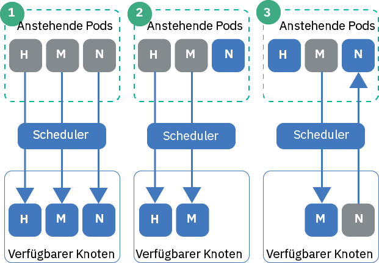

---

copyright:
  years: 2014, 2019
lastupdated: "2019-04-05"

keywords: kubernetes, iks 

subcollection: containers

---

{:new_window: target="_blank"}
{:shortdesc: .shortdesc}
{:screen: .screen}
{:pre: .pre}
{:table: .aria-labeledby="caption"}
{:codeblock: .codeblock}
{:tip: .tip}
{:note: .note}
{:important: .important}
{:deprecated: .deprecated}
{:download: .download}

# Podpriorität festlegen
{: #pod_priority}

Mit Kubernetes-Podpriorität und -Zurückstellung (Pod Priority and Preemption) können Sie Prioritätsklassen konfigurieren, um die relative Priorität eines Pods anzugeben. Der Kubernetes-Scheduler berücksichtigt die Priorität eines Pods und kann Pods mit niedrigerer Priorität zurückstellen (entfernen), um auf einem Workerknoten den erforderlichen Platz für Pods mit höherer Priorität zu schaffen. Ihre {{site.data.keyword.containerlong}}-Cluster, auf denen Kubernetes Version 1.11.2 oder höher ausgeführt wird, unterstützen den Zugangscontroller für die `Prioritätsfunktion`, der diese Klassen durchsetzt.
{: shortdesc}

**Warum lege ich die Podpriorität fest?**</br>
Als Clusteradministrator steuern Sie, welche Pods kritischer für Ihre Clusterauslastung sind. Prioritätsklassen können Ihnen helfen, die Entscheidungen des Kubernetes-Schedulers zu steuern, um Pods mit höherer Priorität gegenüber Pods mit niedrigerer Priorität zu bevorzugen. Der Scheduler kann sogar Pods mit niedrigerer Priorität, die gerade ausgeführt werden, zurückstellen (entfernen), sodass anstehende Pods mit höherer Priorität geplant werden können.

Indem Sie die Podpriorität festlegen, können Sie verhindern, dass kritische Workloads in Ihrem Cluster von Workloads mit niedrigerer Priorität beeinträchtigt werden, insbesondere in den Fällen, in denen der Cluster seine Ressourcenkapazität erreicht.

Stellen Sie sicher, dass Sie den [richtigen Benutzerzugriff](/docs/containers?topic=containers-users#users) auf Ihren Cluster und gegebenenfalls [Podsicherheitsrichtlinien](/docs/containers?topic=containers-psp#psp) eingerichtet haben. Zugriffs- und Podsicherheitsrichtlinien können dazu beitragen, nicht vertrauenswürdige Benutzer daran zu hindern, Pods mit hoher Priorität bereitzustellen, die die Planung anderer Pods verhindern.
{: tip}

{: #priority_scheduling}
**Wie funktionieren die prioritätsgesteuerte Planung und Zurückstellung?**</br>
Im Allgemeinen werden anstehende Pods, die eine höhere Priorität haben, vor Pods mit niedrigerer Priorität geplant. Wenn in Ihren Workerknoten nicht genügend Ressourcen zur Verfügung stehen, kann der Scheduler Pods zurückstellen (entfernen), um genügend Ressourcen für die Planung der höher priorisierten Pods freizugeben. Ordnungsgemäße Beendigung, Budgets für den Podausfall (Pod Disruption Budgets) und Workerknotenaffinität wirken sich ebenfalls auf die Zurückstellung aus.

Wenn Sie für Ihre Podbereitstellung keine Priorität angeben, wird die Standardeinstellung auf die Prioritätsklasse gesetzt, die als `globalDefault` festgelegt ist. Wenn Sie keine Prioritätsklasse `globalDefault` haben, ist die Standardpriorität für alle Pods null (`0`). Standardmäßig legt {{site.data.keyword.containerlong_notm}} keinen Wert für `globalDefault` fest, sodass die Podstandardpriorität null ist.

Wenn Sie wissen möchten, wie die Podpriorität und der Scheduler zusammenarbeiten, sehen Sie sich die Szenarios in der folgenden Abbildung an. Sie müssen priorisierte Pods auf Workerknoten mit verfügbaren Ressourcen platzieren. Andernfalls kann es geschehen, dass Pods mit hoher Priorität in Ihrem Cluster weiter zur Verarbeitung anstehen, während gleichzeitig vorhandene Pods entfernt werden (siehe Szenario 3).

_Abbildung: Szenarios für die Podpriorität_


1.  Drei Pods mit hoher, mittlerer und niedriger Priorität stehen für die Planung an. Der Scheduler sucht nach einem verfügbaren Workerknoten mit der Kapazität für alle drei Pods und plant sie in der Reihenfolge ihrer Priorität, wobei der höchste Pod zuerst geplant wird.
2.  Drei Pods mit hoher, mittlerer und niedriger Priorität stehen für die Planung an. Der Scheduler sucht einen verfügbaren Workerknoten, aber der Workerknoten verfügt nur über die Ressourcen, die zur Unterstützung der Pods mit hoher und mittlerer Priorität erforderlich sind. Der Pod mit niedriger Priorität wird nicht geplant und verbleibt im Status 'Anstehend'.
3.  Zwei Pods mit hoher und mittlerer Priorität stehen für die Planung an. Ein dritter Pod mit niedriger Priorität ist auf einem verfügbaren Workerknoten vorhanden. Der Workerknoten verfügt jedoch nicht über genügend Ressourcen, um einen der anstehenden Pods zu planen. Der Scheduler stellt den Pod mit niedriger Priorität zurück (oder entfernt ihn), wodurch der Pod in den Status 'Anstehend' zurückgesetzt wird. Anschließend versucht der Scheduler, den Pod mit hoher Priorität zu planen. Der Workerknoten verfügt jedoch nicht über genügend Ressourcen, um den Pod mit hoher Priorität zu planen. Stattdessen plant der Scheduler den Pod mit mittlerer Priorität.

**Weitere Informationen** finden Sie in der Kubernetes-Dokumentation zu [Podpriorität und Zurückstellung (Pod Priority and Preemption) ](https://kubernetes.io/docs/concepts/configuration/pod-priority-preemption/).

**Kann ich die Zugangssteuerung für die Podpriorität inaktivieren?**</br>
Nein. Wenn Sie die Podpriorität nicht verwenden möchten, legen Sie keinen Wert für `globalDefault` fest oder fügen Sie eine Prioritätsklasse in Ihre Podbereitstellungen ein. Jeder Pod nimmt standardmäßig den Wert null an, mit Ausnahme der clusterkritischen Pods, die von IBM mit den [Standardprioritätsklassen](#default_priority_class) bereitgestellt werden. Da die Podpriorität relativ ist, stellt diese Basiskonfiguration sicher, dass die clusterkritischen Pods für Ressourcen priorisiert werden, und plant alle anderen Pods nach den bestehenden Planungsrichtlinien, die Sie eingerichtet haben.

**Wie wirken sich Ressourcenquoten auf die Podpriorität aus?**</br>
Sie können Podpriorität in Kombination mit Ressourcenquoten verwenden, einschließlich [Quotenbereiche ](https://kubernetes.io/docs/concepts/policy/resource-quotas/#quota-scopes) für Cluster, auf denen Kubernetes 1.12 oder höher ausgeführt wird. Mithilfe von Quotenbereichen können Sie Ihre Ressourcenquoten für die Podpriorität einrichten. Die Pods mit höherer Priorität können Systemressourcen nutzen, die durch die Ressourcenquote eingeschränkt werden, bevor Pods mit niedrigerer Priorität darauf Zugriff erhalten.

## Erklärung der Standardprioritätsklassen
{: #default_priority_class}

Ihre {{site.data.keyword.containerlong_notm}}-Cluster verfügen bereits standardmäßig über bestimmte Prioritätsklassen.
{: shortdesc}

Ändern Sie nicht die Standardklassen, die zur ordnungsgemäßen Verwaltung Ihres Clusters verwendet werden. Sie können diese Klassen in Ihren App-Bereitstellungen verwenden oder [eigene Prioritätsklassen erstellen](#create_priority_class).
{: important}

In der folgenden Tabelle werden die Prioritätsklassen, die in Ihrem Cluster standardmäßig vorhanden sind, und die Gründe für ihre Verwendung beschrieben.

| Name | Festgelegt durch | Prioritätswert | Zweck |
|---|---|---|
| `system-node-critical` | Kubernetes | 2000001000 | Wählen Sie Pods aus, die beim Erstellen des Clusters im Namensbereich `kube-system` bereitgestellt werden. Verwenden Sie diese Prioritätsklasse, um kritische Funktionen für Workerknoten zu schützen, z. B. Pods für Netzbetrieb, Speicher, Protokollierung, Überwachung und Metriken. |
| `system-cluster-critical` | Kubernetes | 2000000000 | Wählen Sie Pods aus, die beim Erstellen des Clusters im Namensbereich `kube-system` bereitgestellt werden. Verwenden Sie diese Prioritätsklasse, um kritische Funktionen für Cluster zu schützen, z. B. Pods für Netzbetrieb, Speicher, Protokollierung, Überwachung und Metriken. |
| `ibm-app-cluster-critical` | IBM | 900000000 | Wählen Sie Pods aus, die beim Erstellen des Clusters im Namensbereich `ibm-system` bereitgestellt werden. Verwenden Sie diese Prioritätsklasse, um kritische Funktionen für Apps zu schützen, z. B. Apps für Lastausgleichsfunktionen. |
{: caption="Standardprioritätsklassen, die nicht geändert werden dürfen" caption-side="top"}

Sie können überprüfen, welche Pods die Prioritätsklassen verwenden, indem Sie den folgenden Befehl ausführen.

```
kubectl get pods --all-namespaces -o custom-columns=NAME:.metadata.name,PRIORITY:.spec.priorityClassName
```
{: pre}

## Prioritätsklasse erstellen
{: #create_priority_class}

Um die Podpriorität festzulegen, müssen Sie eine Prioritätsklasse verwenden.
{: shortdesc}

Vorbereitende Schritte:
* [Melden Sie sich an Ihrem Konto an. Geben Sie als Ziel die entsprechende Region und, sofern zutreffend, die Ressourcengruppe an. Legen Sie den Kontext für den Cluster fest.](/docs/containers?topic=containers-cs_cli_install#cs_cli_configure)
* Stellen Sie sicher, dass Sie die [{{site.data.keyword.Bluemix_notm}} IAM-Servicerolle **Schreibberechtigter** oder **Manager**](/docs/containers?topic=containers-users#platform) für den Namensbereich `default` innehaben.
* [Erstellen](/docs/containers?topic=containers-clusters#clusters_ui) oder [aktualisieren](/docs/containers?topic=containers-update#update) Sie den Cluster so, dass Kubernetes Version 1.11 oder eine höhere Version verwendet wird.

Gehen Sie wie folgt vor, um eine Prioritätsklasse zu verwenden:

1.  Optional: Verwenden Sie eine vorhandene Prioritätsklasse als Vorlage für die neue Klasse.

    1.  Listen Sie die vorhandenen Prioritätsklassen auf.

        ```
        kubectl get priorityclasses
        ```
        {: pre}

    2.  Wählen Sie die Prioritätsklasse aus, die Sie kopieren möchten, und erstellen Sie eine lokale YAML-Datei.

        ```
        kubectl get priorityclass <prioritätsklasse> -o yaml > Downloads/priorityclass.yaml
        ```
        {: pre}

2.  Erstellen Sie Ihre YAML-Datei für die Prioritätsklasse.

    ```yaml
    apiVersion: scheduling.k8s.io/v1alpha1
    kind: PriorityClass
    metadata:
      name: <name_der_prioritätsklasse>
    value: <1000000>
    globalDefault: <false>
    description: "Use this class for XYZ service pods only."
    ```
    {: codeblock}

    <table>
    <caption>Erklärung der Komponenten der YAML-Datei</caption>
    <thead>
    <th colspan=2> Erklärung der YAML-Dateikomponenten</th>
    </thead>
    <tbody>
    <tr>
    <td><code>metadata.name</code></td>
    <td>Erforderlich: Der Name der Prioritätsklasse, die Sie erstellen möchten.</td>
    </tr>
    <tr>
    <td><code>value</code></td>
    <td>Erforderlich: Geben Sie eine ganze Zahl kleiner-gleich 1 Milliarde (1000000000) ein. Je höher der Wert, umso höher ist die Priorität. Die Werte sind relativ zu den Werten anderer Prioritätsklassen im Cluster. Reservieren Sie sehr hohe Zahlen für systemkritische Pods, die nicht zurückgestellt (entfernt) werden sollen. </br></br>Beispiel: Die [clusterkritischen Standardprioritätsklasse](#default_priority_class) liegen im Wertebereich zwischen 900000000 bis 2000001000. Geben Sie daher für neue Prioritätsklassen einen Wert kleiner als diese Zahlen ein, sodass diese Pods immer die höchste Priorität behalten.</td>
    </tr>
    <tr>
    <td><code>globalDefault</code></td>
    <td>Optional: Setzen Sie das Feld auf `true`, um diese Prioritätsklasse zum globalen Standard zu machen, der auf jeden Pod angewendet wird, der ohne den Wert `priorityClassName` geplant wird. Nur eine Prioritätsklasse in Ihrem Cluster kann als globaler Standardwert festgelegt werden. Wenn kein globaler Standardwert festgelegt ist, haben Pods ohne angegebenen `priorityClassName` die Priorität Null (`0`).</br></br>
    Die [Standardprioritätsklassen](#default_priority_class) legen keinen Wert für `globalDefault` fest. Wenn Sie andere Prioritätsklassen in Ihrem Cluster erstellt haben, können Sie sicherstellen, dass diese keinen Wert für `globalDefault` festgelegt haben, indem sie `kubectl describe priorityclass <name>` ausführen.</td>
    </tr>
    <tr>
    <td><code>description</code></td>
    <td>Optional: Teilen Sie den Benutzern mit, warum diese Prioritätsklasse verwendet werden soll. Schließen Sie die Zeichenfolge in Anführungszeichen ein (`""`).</td>
    </tr></tbody></table>

3.  Erstellen Sie die Prioritätsklasse in Ihrem Cluster.

    ```
    kubectl apply -f filepath/priorityclass.yaml
    ```
    {: pre}

4.  Stellen Sie sicher, dass die Prioritätsklasse erstellt wurde.

    ```
    kubectl get priorityclasses
    ```
    {: pre}

Super! Sie haben jetzt eine Prioritätsklasse erstellt. Informieren Sie Ihr Team über die Prioritätsklasse und teilen Sie ihm mit, welche Prioritätsklasse für die Podbereitstellungen verwendet werden muss.  

## Priorität für Pods zuweisen
{: #prioritize}

Ordnen Sie Ihrer Podspezifikation eine Prioritätsklasse zu, um die Priorität des Pods in Ihrem {{site.data.keyword.containerlong_notm}}-Cluster festzulegen. Wenn Ihre Pods vorhanden waren, bevor die Prioritätsklassen für Kubernetes Version 1.11 verfügbar wurden, müssen Sie die Pod-YAML-Dateien bearbeiten, um den Pods eine Priorität zuzuweisen.
{: shortdesc}

Vorbereitende Schritte:
* [Melden Sie sich an Ihrem Konto an. Geben Sie als Ziel die entsprechende Region und, sofern zutreffend, die Ressourcengruppe an. Legen Sie den Kontext für den Cluster fest.](/docs/containers?topic=containers-cs_cli_install#cs_cli_configure)
* Stellen Sie sicher, dass Sie die [ {{site.data.keyword.Bluemix_notm}} IAM-Servicerolle **Schreibberechtigter** oder **Manager**](/docs/containers?topic=containers-users#platform) für den Namensbereich innehaben, in dem Sie die Pods bereitstellen wollen.
* [Erstellen](/docs/containers?topic=containers-clusters#clusters_ui) oder [aktualisieren](/docs/containers?topic=containers-update#update) Sie den Cluster so, dass Kubernetes Version 1.11 oder eine höhere Version verwendet wird.
* [Machen Sie sich damit vertraut, wie die Planung anhand der Priorität funktioniert](#priority_scheduling), da die Priorität die Zurückstellung vorhandener Pods bewirken und außerdem beeinflussen kann, wie die Ressourcen Ihres Clusters genutzt werden.

Gehen Sie wie folgt vor, um Ihren Pods eine Priorität zuzuweisen:

1.  Überprüfen Sie die Wichtigkeit anderer bereitgestellter Pods, sodass Sie die richtige Prioritätsklasse für Ihre Pods im Verhältnis zu dem, was bereits bereitgestellt ist, auswählen können.

    1.  Zeigen Sie die Prioritätsklassen an, die andere Pods im Namensbereich verwenden.

        ```
        kubectl get pods -n <namensbereich> -o custom-columns=NAME:.metadata.name,PRIORITY:.spec.priorityClassName
        ```
        {: pre}

    2.  Rufen Sie die Details der Prioritätsklasse ab und notieren Sie die Zahl für **value**. Pods mit höheren Zahlen werden vor Pods mit niedrigeren Zahlen priorisiert. Wiederholen Sie diesen Schritt für jede Prioritätsklasse, die Sie prüfen wollen.

        ```
        kubectl describe priorityclass <name_der_prioritätsklasse>
        ```
        {: pre}

2.  Rufen Sie die Prioritätsklasse ab, die Sie verwenden möchten, oder [erstellen Sie Ihre eigene Prioritätsklasse](#create_priority_class).

    ```
    kubectl get priorityclasses
    ```
    {: pre}

3.  Fügen Sie in Ihrer Podspezifikation das Feld `priorityClassName` mit dem Namen der Prioritätsklasse hinzu, die Sie im vorherigen Schritt abgerufen haben.

    ```yaml
    apiVersion: apps/v1
    kind: Deployment
    metadata:
      name: ibmliberty
    spec:
      replicas: 1
      selector:
        matchLabels:
          app: ibmliberty
      template:
        metadata:
          labels:
            app: ibmliberty
        spec:
          containers:
          - name: ibmliberty
            image: registry.bluemix.net/ibmliberty:latest
            ports:
            - containerPort: 9080
          priorityClassName: <name_der_prioritätsklasse>
    ```
    {: codeblock}

4.  Erstellen Sie Ihre priorisierten Pods in dem Namensbereich, in dem sie bereitgestellt werden sollen.

    ```
    kubectl apply -f filepath/pod-deployment.yaml
    ```
    {: pre}
