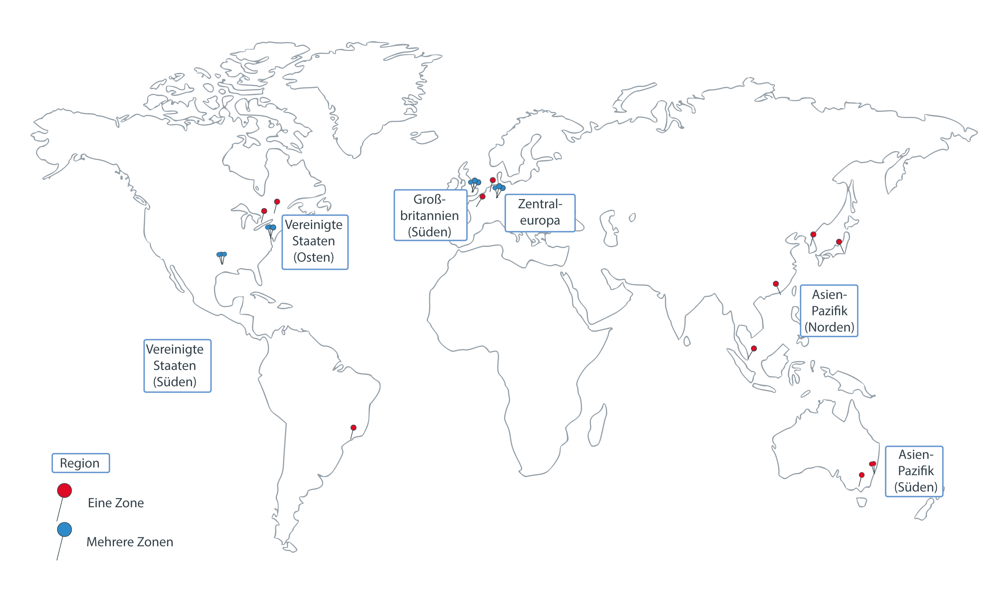

---

copyright:
  years: 2014, 2018
lastupdated: "2018-12-05"

---

{:new_window: target="_blank"}
{:shortdesc: .shortdesc}
{:screen: .screen}
{:pre: .pre}
{:table: .aria-labeledby="caption"}
{:codeblock: .codeblock}
{:tip: .tip}
{:note: .note}
{:important: .important}
{:deprecated: .deprecated}
{:download: .download}

# Regionen und Zonen
{: #regions-and-zones}

Eine Region ist ein bestimmter Standort, an dem Sie Apps, Services und andere {{site.data.keyword.Bluemix}}-Ressourcen bereitstellen können. [{{site.data.keyword.Bluemix_notm}}-Regionen](#bluemix_regions) unterscheiden sich von [{{site.data.keyword.containerlong}}-Regionen](#container_regions). Regionen bestehen aus einer oder mehreren Zonen, bei denen es sich um physische Rechenzentren handelt, in denen die Berechnungs-, Netz- und Speicherressourcen sowie die zugehörige Kühlung und Stromversorgung für Services und Anwendungen gehostet werden. Zonen sind isoliert voneinander, wodurch sichergestellt wird, dass es keinen gemeinsamen Fehlerpunkt gibt.
{:shortdesc}



_{{site.data.keyword.containerlong_notm}}-Regionen und -Zonen_

{{site.data.keyword.Bluemix_notm}} wird weltweit gehostet. Die Services in {{site.data.keyword.Bluemix_notm}} sind möglicherweise global verfügbar, oder aber nur innerhalb einer bestimmten Region. Wenn Sie einen Kubernetes-Cluster in {{site.data.keyword.containerlong_notm}} erstellen, verbleiben seine Ressourcen in der Region, in der Sie den Cluster bereitgestellt haben.

Sie können Standardcluster in jeder unterstützten {{site.data.keyword.containerlong_notm}}-Region erstellen. Freie Cluster sind nur in ausgewählten Regionen verfügbar.
{: note}

| {{site.data.keyword.containerlong_notm}}-Region | Entspricht {{site.data.keyword.Bluemix_notm}}-Standort |
| --- | --- |
| Asien-Pazifik (nur Standardcluster) | Tokio |
| Asien-Pazifik (Süden) | Sydney |
| Mitteleuropa | Frankfurt |
| Vereinigtes Königreich (Süden) | London |
| Vereinigte Staaten (Osten) (nur Standardcluster) | Washington DC |
| Vereinigte Staaten (Süden) | Dallas |
{: caption="Tabelle: Unterstützte Kubernetes-Serviceregionen und entsprechende IBM Cloud-Standorte" caption-side="top"}

<br />


## Standorte in {{site.data.keyword.Bluemix_notm}}
{: #bluemix_regions}

Sie können Ihre Ressourcen übergreifend für die {{site.data.keyword.Bluemix_notm}}-Services organisieren, indem Sie die {{site.data.keyword.Bluemix_notm}}-Standorte, auch Regionen genannt, verwenden. Sie können beispielsweise einen Kubernetes-Cluster mithilfe eines privaten Docker-Images erstellen, das in Ihrem {{site.data.keyword.registryshort_notm}} an demselben Standort gespeichert ist.
{:shortdesc}

Um zu überprüfen, an welchem {{site.data.keyword.Bluemix_notm}}-Standort Sie sich momentan befinden, müssen Sie den Befehl `ibmcloud info` ausführen und dann den Wert im Feld **Region** überprüfen.

Auf {{site.data.keyword.Bluemix_notm}}-Standorte kann zugegriffen werden, indem bei der Anmeldung der API-Endpunkt der Region angegeben wird. Wenn Sie keinen Regionsendpunkt angeben, werden Sie automatisch bei der nächstgelegenen Region angemeldet.

Beispielsweise können Sie die folgenden Befehle für die Anmeldung bei den API-Endpunkten der {{site.data.keyword.Bluemix_notm}}-Region verwenden:

  * Dallas
      ```
      ibmcloud login -a api.ng.bluemix.net
      ```
      {: pre}

  * Washington DC
      ```
      ibmcloud login -a api.us-east.bluemix.net
      ```
      {: pre}

  * Sydney und Tokio
      ```
      ibmcloud login -a api.au-syd.bluemix.net
      ```
      {: pre}

  * Frankfurt
      ```
      ibmcloud login -a api.eu-de.bluemix.net
      ```
      {: pre}

  * London
      ```
      ibmcloud login -a api.eu-gb.bluemix.net
      ```
      {: pre}

<br />


## Regionen in {{site.data.keyword.containerlong_notm}}
{: #container_regions}

Mithilfe von {{site.data.keyword.containerlong_notm}}-Regionen können Sie Kubernetes-Cluster erstellen oder auf Kubernetes-Cluster in einer Region zugreifen, die von der {{site.data.keyword.Bluemix_notm}}-Region abweicht, in der Sie angemeldet sind. Die Endpunkte für die {{site.data.keyword.containerlong_notm}}-Region verweisen speziell auf {{site.data.keyword.containerlong_notm}} und nicht auf {{site.data.keyword.Bluemix_notm}} im Allgemeinen.
{:shortdesc}

Sie können Standardcluster in jeder unterstützten {{site.data.keyword.containerlong_notm}}-Region erstellen. Freie Cluster sind nur in ausgewählten Regionen verfügbar.
{: note}

Unterstützte {{site.data.keyword.containerlong_notm}}-Regionen:
  * Asien-Pazifik (nur Standardcluster)
  * Asien-Pazifik (Süden)
  * Mitteleuropa
  * Vereinigtes Königreich (Süden)
  * Vereinigte Staaten (Osten) (nur Standardcluster)
  * Vereinigte Staaten (Süden)

Sie können auf {{site.data.keyword.containerlong_notm}} über einen globalen Endpunkt zugreifen: `https://containers.bluemix.net/v1`.
* Um zu überprüfen, in welcher {{site.data.keyword.containerlong_notm}}-Region Sie sich momentan befinden, führen Sie `ibmcloud ks region` aus.
* Um eine Liste der verfügbaren Region samt den zugehörigen Endpunkten abzurufen, führen Sie den Befehl `ibmcloud ks regions` aus.

Um die API mit dem globalen Endpunkt zu verwenden, übergeben Sie in allen Ihren Anforderungen den Regionsnamen im Header vom Typ `X-Region`.
{: tip}

### Bei einer anderen {{site.data.keyword.containerlong_notm}}-Region anmelden
{: #container_login_endpoints}

Sie können Regionen mithilfe der {{site.data.keyword.containerlong_notm}}-CLI ändern.
{:shortdesc}

Sie können sich beispielsweise aus den folgenden Gründen bei einer anderen Region als der {{site.data.keyword.containerlong_notm}}-Region anmelden:
  * Sie haben {{site.data.keyword.Bluemix_notm}}-Services oder private Docker-Images in einer Region erstellt und wollen sie mit {{site.data.keyword.containerlong_notm}} in einer anderen Region verwenden.
  * Sie möchten auf einen Cluster in einer Region zugreifen, die sich von der {{site.data.keyword.Bluemix_notm}}-Standardregion unterscheidet, bei der Sie angemeldet sind.

Um schnell zwischen Regionen zu wechseln, führen Sie den Befehl [`ibmcloud ks region-set`](cs_cli_reference.html#cs_region-set) aus.

### {{site.data.keyword.containerlong_notm}}-API-Befehle verwenden
{: #containers_api}

Um mit der {{site.data.keyword.containerlong_notm}}-API interagieren zu können, müssen Sie den Befehlstyp eingeben und an den globalen Endpunkt die Zeichenfolge `/v1/command` anfügen.
{:shortdesc}

Beispiel für die API `GET /clusters`:
  ```
  GET https://containers.bluemix.net/v1/clusters
  ```
  {: codeblock}

</br>

Um die API mit dem globalen Endpunkt zu verwenden, übergeben Sie in allen Ihren Anforderungen den Regionsnamen im Header vom Typ `X-Region`. Führen Sie den Befehl `ibmcloud ks regions` aus, um verfügbaren Regionen aufzuführen.
{: tip}

Die Dokumentation zu den API-Befehlen finden Sie unter [https://containers.bluemix.net/swagger-api/](https://containers.bluemix.net/swagger-api/).

## Zonen in {{site.data.keyword.containerlong_notm}}
{: #zones}

Zonen sind physische Rechenzentren, die in einer {{site.data.keyword.Bluemix_notm}}-Region verfügbar sind. Regionen sind ein konzeptionelles Hilfsmittel, um Zonen zu organisieren. Sie können Zonen (Rechenzentren) in verschiedenen Ländern umfassen. Die folgende Tabelle zeigt die pro Region verfügbaren Zonen.
{:shortdesc}

* **Metropole mit mehreren Zonen**: Workerknoten in Clustern, die in einer Metropole mit mehreren Zonen erstellt werden, können auf mehrere Zonen verteilt werden. Darüber hinaus erstrecken sich die hochverfügbaren Master über mehrere Zonen, wenn Sie ein Cluster mit der Kubernetes-Version 1.0 oder höher in einer Metropole mit mehreren Zonen erstellen.
* **Stadt mit einer einzelnen Zone**: Workerknoten in Clustern, die in einer Einzelzonenstadt erstellt werden, bleiben in einer Zone. Workerknoten können nicht über mehrere Zonen verteilt werden. Der hoch verfügbare Master enthält drei Replikate auf separaten Hosts, erstreckt sich jedoch nicht über mehrere Zonen.

<table summary="Die Tabelle zeigt die nach Regionen verfügbaren Zonen. Die Tabellenzeilen enthalten von links nach rechts die Region in der ersten Spalte, die Metropolen mit mehreren Zonen in der zweiten Spalte und die Einzelzonenstädte in der dritten Spalte.">
<caption>Verfügbare Städte mit einer und mehreren Zonen nach Region.</caption>
  <thead>
  <th>Region</th>
  <th>Metropole mit mehreren Zonen</th>
  <th>Stadt mit einer einzelnen Zonen</th>
  </thead>
  <tbody>
    <tr>
      <td>Asien-Pazifik (Norden)</td>
      <td>Tokio: tok02, tok04, tok05</td>
      <td><p>Chennai: che01</p>
      <p>Hongkong (Sonderverwaltungsregion der VR China): hkg02</p>
      <p>Seoul: seo01</p>
      <p>Singapur: sng01</p></td>
    </tr>
    <tr>
      <td>Asien-Pazifik (Süden)</td>
      <td>Keine</td>
      <td><p>Sydney: syd01, syd04</p>
      <p>Melbourne: mel01</p></td>
    </tr>
    <tr>
      <td>Mitteleuropa</td>
      <td>Frankfurt: fra02, fra04, fra05</td>
      <td><p>Amsterdam: ams03</p>
      <p>Mailand: mil01</p>
      <p>Oslo: osl01</p>
      <p>Paris: par01</p>
      </td>
    </tr>
    <tr>
      <td>Vereinigtes Königreich (Süden)</td>
      <td>London: lon04, lon05, lon06 **Hinweis:** lon02 wird durch lon05 ersetzt. Neue Cluster müssen lon05 verwenden, und nur lon05 unterstützt hoch verfügbare Master, die sich über mehrere Zonen erstrecken.</td>
      <td></td>
    </tr>
    <tr>
      <td>Vereinigte Staaten (Osten)</td>
      <td>Washington DC: wdc04, wdc06, wdc07</td>
      <td><p>Montreal: mon01</p>
      <p>Toronto: tor01</p></td>
    </tr>
    <tr>
      <td>Vereinigte Staaten (Süden)</td>
      <td>Dallas: dal10, dal12, dal13</td>
      <td><p>San Jose: sjc03, sjc04</p><p>São Paulo: sao01</p></td>
    </tr>
  </tbody>
</table>

### Einzelzonencluster
{: #single_zone}

In einem Einzelzonencluster bleiben die Ressourcen Ihres Clusters in der Zone, in der der Cluster bereitgestellt wird. Die folgende Abbildung stellt die Beziehung zwischen Komponenten eines Einzelzonenclusters in der Beispielregion 'Vereinigte Staaten (Osten)' genauer dar:


_Erklärung, wo Ihre Einzelzonenclusterressourcen sich befinden._

1.  Die Ressourcen Ihres Clusters, einschließlich der Master- und Workerknoten, befinden sich in der Zone, in der Sie auch den Cluster bereitgestellt haben. Wenn Sie lokale Container-Orchestrierungsaktionen wie z. B. `kubectl`-Befehle einleiten, werden die Informationen zwischen den Master- und Workerknoten innerhalb derselben Zone ausgetauscht.

2.  Wenn Sie andere Clusterressourcen konfigurieren, z. B. Speicher-, Netz- und Rechenressourcen oder Apps, die in Pods ausgeführt werden, verbleiben die Ressourcen und ihre Daten in der Zone, in der Sie den Cluster bereitgestellt haben.

3.  Wenn Sie Clusterverwaltungsaktionen wie `ibmcloud ks`-Befehle ausführen, werden Basisinformationen über die Cluster (wie z. B. Name, ID, Benutzer, Befehl) an den regionalen Endpunkt weitergeleitet.

### Mehrzonencluster
{: #multizone}

In einem Mehrzonencluster wird der Masterknoten in einer auf mehrere Zonen ausgelegten Zone bereitgestellt und die Ressourcen Ihres Clusters werden auf mehrere Zonen verteilt.

1.  Die Workerknoten verteilen sich auf mehrere Zonen in einer Region, um mehr Verfügbarkeit für Ihren Cluster bereitzustellen. Der Master verbleibt in derselben mehrzonenfähigen Zone, in der Sie den Cluster bereitgestellt haben. Wenn Sie lokale Container-Orchestrierungsaktionen (z. B. `kubectl`-Befehle) einleiten, werden die Informationen zwischen Ihrem Master- und Workerknoten über einen regionalen Endpunkt ausgetauscht.

2.  Andere Clusterressourcen, z. B. Speicher-, Netz- und Rechenressourcen oder Apps, die in Pods ausgeführt werden, variieren in der Art und Weise, wie sie in den Zonen in Ihrem Mehrzonencluster bereitgestellt werden. Weitere Informationen finden Sie in den folgenden Abschnitten:
    * [Dateispeicher](cs_storage_file.html#add_file) und [Blockspeicher](cs_storage_block.html#add_block) in Mehrzonenclustern einrichten
    * [Öffentlichen oder privaten Zugriff auf eine App mithilfe eines LoadBalancer-Service in einem Mehrzonencluster aktivieren](cs_loadbalancer.html#multi_zone_config)
    * [Netzverkehr mithilfe von Ingress verwalten](cs_ingress.html#planning)
    * [Verfügbarkeit Ihrer App erhöhen](cs_app.html#increase_availability)

3.  Wenn Sie Clusterverwaltungsaktionen initiieren, wie z. B. die Verwendung von [`ibmcloud ks`-Befehlen](cs_cli_reference.html#cs_cli_reference), werden grundlegende Informationen (wie Name, ID, Benutzer, Befehl) über einen regionalen Endpunkt weitergeleitet.
