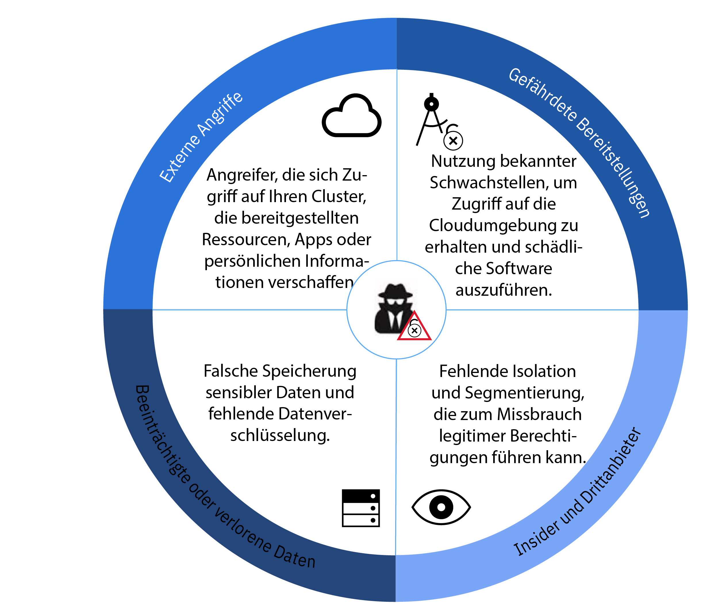
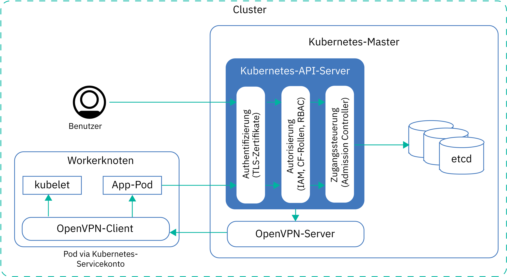
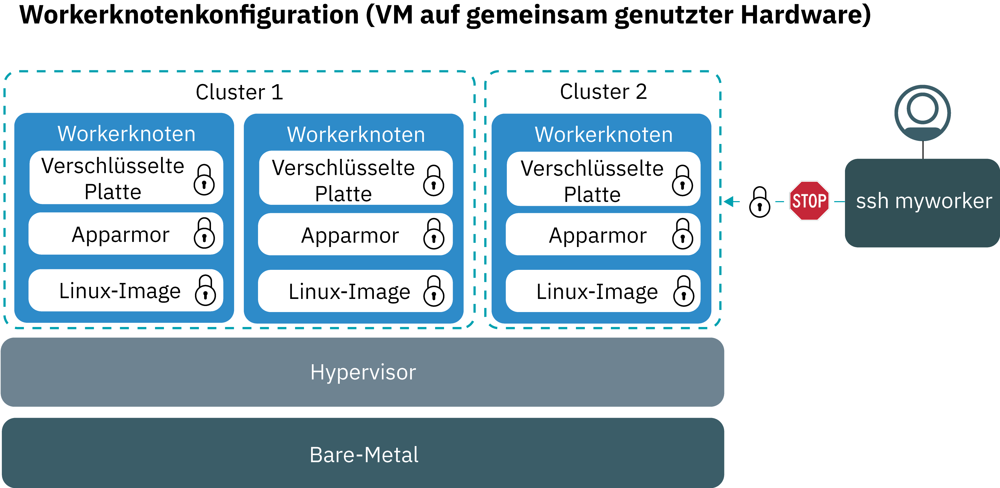
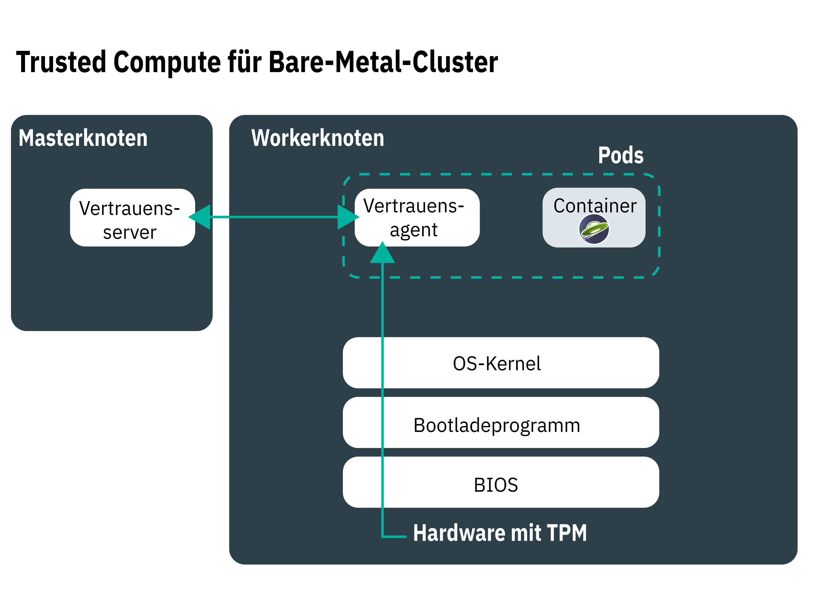
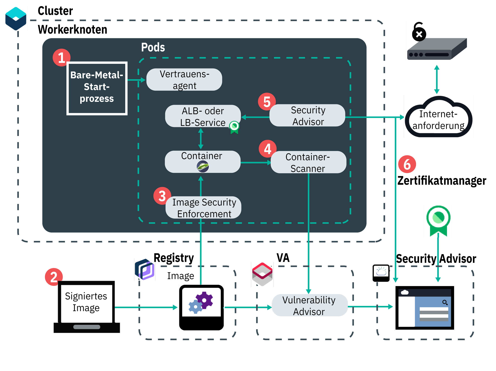
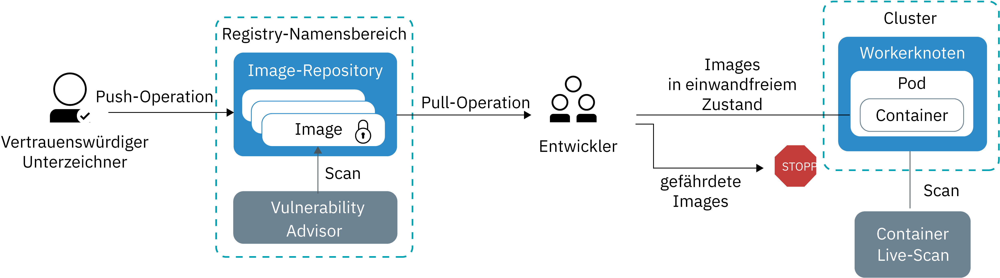
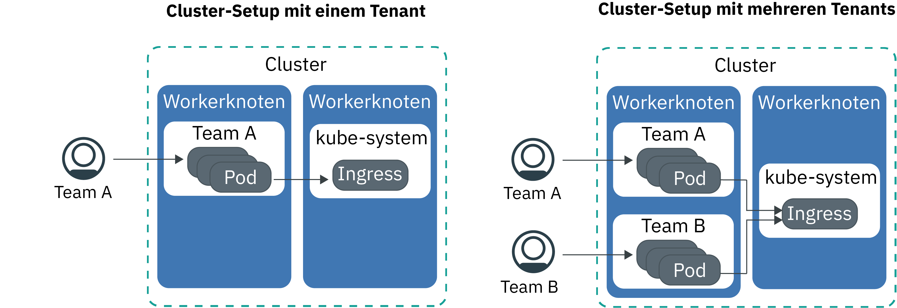

---

copyright:
  years: 2014, 2019
lastupdated: "2019-04-15"

keywords: kubernetes, iks

subcollection: containers

---

{:new_window: target="_blank"}
{:shortdesc: .shortdesc}
{:screen: .screen}
{:pre: .pre}
{:table: .aria-labeledby="caption"}
{:codeblock: .codeblock}
{:tip: .tip}
{:note: .note}
{:important: .important}
{:deprecated: .deprecated}
{:download: .download}

# Sicherheit für {{site.data.keyword.containerlong_notm}}
{: #security}

Sie können die integrierten Sicherheitsfunktionen in {{site.data.keyword.containerlong}} für die Risikoanalyse und den Sicherheitsschutz verwenden. Diese Funktionen helfen Ihnen, die Kubernetes-Clusterinfrastruktur und Netzkommunikation zu schützen, die Rechenressourcen zu isolieren und die Einhaltung von Sicherheitsbestimmungen über die einzelnen Infrastrukturkomponenten und Containerbereitstellungen hinweg sicherzustellen.
{: shortdesc}

## Sicherheitsbedrohungen für Ihren Cluster – Übersicht
{: #threats}

Zum Schützen Ihres Clusters vor Gefährdung müssen Sie potenzielle Sicherheitsbedrohungen für Ihren Cluster und die Möglichkeiten zur Verringerung von Sicherheitslücken verstehen.
{: shortdesc}

Die Cloudsicherheit und der Schutz Ihrer Systeme, Infrastruktur und Daten gegen Angriffe wurden in den letzten Jahren sehr wichtig, da Unternehmen ihre Workloads auch weiterhin in die öffentliche Cloud verschieben. Ein Cluster besteht aus mehreren Komponenten, die jede für sich Ihre Umgebung böswilligen Angriffen aussetzen können. Um den Cluster vor diesen Sicherheitsbedrohungen zu schützen, müssen Sie sicherstellen, dass die neuesten Sicherheitsfunktionen und Aktualisierungen von {{site.data.keyword.containerlong_notm}} und Kubernetes in allen Clusterkomponenten angewendet werden.

Zu diesen Komponenten gehören:
- [Kubernetes-API-Server und Datenspeicher 'etcd'](#apiserver)
- [Workerknoten](#workernodes)
- [Network](#network)
- [Persistenter Speicher](#storage)
- [Überwachung und Protokollierung](#monitoring_logging)
- [Container-Images und Registry](#images_registry)
- [Containerisolation und Sicherheit](#container)
- [Personenbezogene Daten](#pi)

 

## Kubernetes-API-Server und 'etcd'
{: #apiserver}

Der Kubernetes-API-Server und 'etcd' sind die am meisten gefährdeten Komponenten, die in Ihrem Kubernetes-Master ausgeführt werden. Wenn ein nicht berechtigter Benutzer oder ein nicht berechtigtes System Zugriff auf Ihren Kubernetes-API-Server erhält, kann der Benutzer oder das System Einstellungen ändern, Ihren Cluster manipulieren oder dessen Steuerung übernehmen, wodurch Ihr Cluster böswillige Angriffen ausgesetzt wird.
{: shortdesc}

Zum Schützen Ihres Kubernetes-API-Servers und des Datenspeichers 'etcd' müssen Sie den Zugriff von Benutzern als auch Kubernetes-Servicekonten auf Ihren Kubernetes-API-Server schützen und beschränken.

**Wie wird der Zugriff auf meinen Kubernetes-API-Server gewährt?**  
Standardmäßig verlangt Kubernetes für jede Anforderung, dass mehrere Stufen durchlaufen werden, bevor Zugriff auf den API-Server erteilt wird:

<ol><li><strong>Authentifizierung: </strong>Validiert die Identität eines registrierten Benutzers oder eines Servicekontos.</li><li><strong>Berechtigung: </strong>Begrenzt die Berechtigungen von authentifizierten Benutzern und Servicekonten, um sicherzustellen, dass diese nur auf Clusterkomponenten zugreifen und diese verwenden können, wenn dies von Ihnen gewünscht ist.</li><li><strong>Zugangssteuerung: </strong>Überprüft oder ändert Anforderungen, bevor Sie vom Kubernetes-API-Server verarbeitet werden. Für viele Kubernetes-Funktionen sind Zugangscontroller erforderlich, damit sie ordnungsgemäß funktionieren.</li></ol>

**Was wird von {{site.data.keyword.containerlong_notm}} unternommen, um meinen Kubernetes-API-Server und den Datenspeicher 'etcd' zu schützen?**  
Die folgende Abbildung zeigt die Standardeinstellungen für die Clustersicherheit, die die Authentifizierung, Autorisierung, Zugangssteuerung und die sichere Konnektivität zwischen dem Kubernetes-Master und den Workerknoten betreffen.

<table>
<caption>Sicherheit für Kubernetes-API-Server und 'etcd'</caption>
  <thead>
  <th>Sicherheitsfunktion</th>
  <th>Beschreibung</th>
  </thead>
  <tbody>
    <tr>
      <td>Vollständig verwalteter und dedizierter Kubernetes-Master</td>
      <td>
Jeder Kubernetes-Cluster in {{site.data.keyword.containerlong_notm}} wird von einem dedizierten Kubernetes-Master gesteuert, der von IBM in einem IBM eigenen Konto von IBM Cloud Infrastructure (SoftLayer) verwaltet wird. Der Kubernetes-Master ist mit den folgenden dedizierten Komponenten konfiguriert, die nicht mit anderen IBM Kunden gemeinsam genutzt werden.

        <ul><li><strong>Datenspeicher 'etcd':</strong> Speichert alle Kubernetes-Ressourcen eines Clusters, zum Beispiel `Services`, `Bereitstellungen` und `Pods`. `Konfigurationszuordnungen` und `geheime Schlüssel` von Kubernetes sind App-Daten, die in Form von Schlüssel/Wert-Paaren gespeichert werden, damit sie von einer in einem Pod ausgeführten App verwendet werden können. Daten in etcd werden auf dem lokalen Datenträger des Kubernetes-Masters gespeichert und in {{site.data.keyword.cos_full_notm}} gesichert. Daten werden während des Transits an {{site.data.keyword.cos_full_notm}} verschlüsselt und wenn sie ruhen. Sie können die Verschlüsselung für Ihre etcd-Daten auf der lokalen Festplatte Ihres Kubernetes-Masters aktivieren, indem Sie für Ihren Cluster die [{{site.data.keyword.keymanagementservicelong_notm}}-Verschlüsselung aktivieren](/docs/containers?topic=containers-encryption#encryption). Die etcd-Daten für Cluster, auf denen eine frühere Version von Kubernetes ausgeführt wird, werden auf einem verschlüsselten Datenträger gespeichert, der von IBM verwaltet und täglich gesichert wird. Wenn etcd-Daten an einen Pod gesendet werden, werden sie über TLS verschlüsselt, um den Datenschutz und die Datenintegrität sicherzustellen.</li>
          <li><strong>kube-apiserver:</strong> Dient als Haupteinstiegspunkt für alle Anforderungen der Clusterverwaltung vom Workerknoten zum Kubernetes-Master. Die Komponente 'kube-apiserver' validiert und verarbeitet Anforderungen und besitzt Lese- und Schreibberechtigungen für den Datenspeicher 'etcd'.</li>
          <li><strong>kube-scheduler:</strong> Entscheidet unter Berücksichtigung von Kapazitätsbedarf und Leistungsanforderungen, Beschränkungen durch Hardware- und Softwarerichtlinien, Anti-Affinitäts-Spezifikationen und Anforderungen für Workloads darüber, wo die Bereitstellung von Pods erfolgt. Wird kein Workerknoten gefunden, der mit den Anforderungen übereinstimmt, so wird der Pod nicht im Cluster bereitgestellt.</li>
          <li><strong>kube-controller-manager:</strong> Verantwortlich für die Überwachung von Replikatgruppen und für die Erstellung entsprechender Pods, um den angegebenen Zustand (Soll-Status) zu erreichen.</li>
          <li><strong>OpenVPN:</strong> Für {{site.data.keyword.containerlong_notm}} spezifische Komponente, die sichere Netzkonnektivität für die gesamte Kommunikation zwischen dem Kubernetes-Master und dem Workerknoten bereitstellt. Die Kommunikation zwischen Kubernetes-Master- und Workerknoten wird durch den Benutzer initiiert und umfasst <code>kubectl</code>-Befehle wie beispielsweise <code>logs</code>, <code>attach</code>, <code>exec</code> und <code>top</code>.</li></ul></td>
    </tr>
    <tr>
    <td>Kontinuierliche Überwachung durch IBM Site Reliability Engineers (SREs)</td>
    <td>Der Kubernetes-Master, einschließlich aller Masterkomponenten, Rechen-, Netzbetriebs- und Speicherressourcen, wird fortlaufend von IBM Site Reliability Engineers (SREs) überwacht. Von SREs werden die neuesten Sicherheitsstandards angewendet, böswillige Aktivitäten ermittelt und korrigiert und somit die Zuverlässigkeit und Verfügbarkeit von {{site.data.keyword.containerlong_notm}} sichergestellt. </td>
    </tr>
    <tr>
      <td>Sichere Kommunikation über TLS</td>
      <td>Zum Verwenden von {{site.data.keyword.containerlong_notm}} müssen Sie sich mithilfe Ihrer Berechtigungsnachweise bei dem Service authentifizieren. Nach der Authentifizierung generiert {{site.data.keyword.containerlong_notm}} TLS-Zertifikate, die die Kommunikation mit dem Kubernetes-API-Server und dem Datenspeicher 'etcd' in beiden Richtungen verschlüsseln, um eine sichere und durchgängige Kommunikation zwischen den Workerknoten und dem Kubernetes-Master zu gewährleisten. Diese Zertifikate werden zu keinem Zeitpunkt von mehreren Clustern oder Komponenten des Kubernetes-Masters gemeinsam genutzt. </td>
    </tr>
    <tr>
      <td>OpenVPN-Konnektivität zu Workerknoten</td>
      <td>Kubernetes schützt die Kommunikation zwischen dem Kubernetes-Master und den Workerknoten zwar durch die Verwendung des Protokolls <code>https</code>, doch auf dem Workerknoten wird keine standardmäßige Authentifizierung bereitgestellt. Zum Schutz dieser Kommunikation richtet {{site.data.keyword.containerlong_notm}} bei der Erstellung des Clusters automatisch eine OpenVPN-Verbindung zwischen dem Kubernetes-Master und den Workerknoten ein.</td>
    </tr>
    <tr>
      <td>Differenzierte Zugriffssteuerung</td>
      <td>Als Kontoadministrator können Sie [anderen Benutzern Zugriff auf {{site.data.keyword.containerlong_notm}}](/docs/containers?topic=containers-users#users) erteilen, indem Sie das Identitäts- und Zugriffsmanagement (IAM – Identity and Access Management) von {{site.data.keyword.Bluemix_notm}} verwenden. {{site.data.keyword.Bluemix_notm}} IAM bietet eine sichere Authentifizierung für die {{site.data.keyword.Bluemix_notm}}-Plattform, für {{site.data.keyword.containerlong_notm}} und alle Ressourcen Ihres Kontos. Die Konfiguration ordnungsgemäßer Benutzerrollen und Berechtigungen hat eine Schlüsselfunktion, um den Zugriff auf Ihre Ressourcen einzuschränken und um den Schaden zu begrenzen, den ein Benutzer anrichten kann, wenn es zum Missbrauch legitimer Berechtigungen kommt.   Sie können aus folgenden vordefinierten Benutzerrollen wählen, mit denen die Aktionen festgelegt werden, die der jeweilige Benutzer ausführen kann: <ul><li><strong>Plattformrollen:</strong> Legen Sie die auf den Cluster und den Workerknoten bezogenen Aktivitäten fest, die ein Benutzer in {{site.data.keyword.containerlong_notm}} ausführen kann.</li><li><strong>Infrastrukturrollen:</strong> Legen Sie die Berechtigungen zum Bestellen, Aktualisieren oder Entfernen von Infrastrukturressourcen wie beispielsweise Workerknoten, VLANs oder Subnetzen fest.</li><li><strong>Kubernetes-RBAC-Rollen:</strong> Legen Sie die `kubectl`-Befehle fest, die Benutzer ausführen können, wenn sie für den Zugriff auf einen Cluster berechtigt sind. RBAC-Rollen werden für den Standardnamensbereich eines Clusters automatisch konfiguriert. Wenn Sie dieselben RBAC-Rollen in anderen Namensbereichen verwenden möchten, können Sie RBAC-Rollen aus dem Standardnamensbereich kopieren.  </li></ul>   Statt vordefinierte Benutzerrollen zu verwenden, können Sie wählen, [Infrastrukturberechtigungen anzupassen](/docs/containers?topic=containers-users#infra_access) oder [Ihre eigenen RBAC-Rollen einzurichten](/docs/containers?topic=containers-users#rbac), um eine differenziertere Zugriffssteuerung hinzuzufügen. </td>
    </tr>
    <tr>
      <td>Zugangscontroller</td>
      <td>Zugangscontroller werden für bestimmte Funktionen in Kubernetes und {{site.data.keyword.containerlong_notm}} implementiert. Mit den Zugangscontrollern können Sie Richtlinien in Ihrem Cluster definieren, die festlegen, ob eine bestimmte Aktion im Cluster zulässig ist. In der Richtlinie können Sie Bedingungen angeben, sodass ein Benutzer eine Aktion nicht ausführen kann, selbst wenn diese Aktion innerhalb der allgemeinen Berechtigungen liegt, die Sie dem Benutzer über RBAC zugewiesen haben. Zugangscontroller stellen dadurch eine zusätzliche Sicherheitsebene für Ihren Cluster dar, die wirksam wird, bevor eine API-Anforderung vom Kubernetes-API-Server verarbeitet wird.    Wenn Sie einen Cluster erstellen, installiert {{site.data.keyword.containerlong_notm}} im Kubernetes-Master automatisch folgende [Kubernetes-Zugangscontroller ](https://kubernetes.io/docs/admin/admission-controllers/), die vom Benutzer nicht geändert werden können: <ul>
      <li>`DefaultTolerationSeconds`</li>
      <li>`DefaultStorageClass`</li>
      <li>`GenericAdmissionWebhook`</li>
      <li>`Initializers`</li>
      <li>`LimitRanger`</li>
      <li>`MutatingAdmissionWebhook`</li>
      <li>`NamespaceLifecycle`</li>
      <li>`PersistentVolumeLabel`</li>
      <li>[`PodSecurityPolicy`](/docs/containers?topic=containers-psp#ibm_psp)</li>
      <li>[`Priority`](/docs/containers?topic=containers-pod_priority#pod_priority) (Kubernetes 1.11.2 oder höher)</li>
      <li>`ResourceQuota`</li>
      <li>`ServiceAccount`</li>
      <li>`StorageObjectInUseProtection`</li>
      <li>`ValidatingAdmissionWebhook`</li></ul> 
      Sie können im Cluster [Ihre eigenen Zugangscontroller installieren ](https://kubernetes.io/docs/reference/access-authn-authz/extensible-admission-controllers/#admission-webhooks) oder einen der von {{site.data.keyword.containerlong_notm}} bereitgestellten optionalen Zugangscontroller auswählen: <ul><li><strong>[Container Image Security Enforcement](/docs/services/Registry?topic=registry-security_enforce#security_enforce):</strong> Verwenden Sie diesen Zugangscontroller, um in Ihrem Cluster Vulnerability Advisor-Richtlinien durchzusetzen, mit denen die Verwendung von gefährdeten Images in Bereitstellungen blockiert wird.</li></ul> 
Wenn Sie Zugangscontroller manuell installiert haben und Sie sie nicht mehr verwenden möchten, müssen Sie sie vollständig entfernen. Wenn Zugangscontroller nicht vollständig entfernt werden, blockieren sie möglicherweise alle Aktionen, die Sie für den Cluster ausführen möchten.
</td>
    </tr>
  </tbody>
</table>

**Was kann ich noch tun, um meinen Kubernetes-API-Server zu schützen?** 

Wenn Ihr Cluster mit einem privaten und einem öffentlichen VLAN verbunden ist, richtet {{site.data.keyword.containerlong_notm}} automatisch eine sichere OpenVPN-Verbindung zwischen dem Cluster-Master- und Workerknoten über einen öffentlichen Serviceendpunkt ein. Wenn VRF (Virtual Routing and Forwarding) in Ihrem {{site.data.keyword.Bluemix_notm}}-Konto aktiviert ist, können Sie die Kommunikation zwischen Ihrem Cluster-Master und den Workerknoten stattdessen über das private Netz und einen privaten Serviceendpunkt einrichten.

Serviceendpunkte legen fest, wie Workerknoten und Clusterbenutzer auf den Cluster-Master zugreifen können.
* Nur öffentlicher Servicepunkt: Eine sichere OpenVPN-Verbindung zwischen dem Cluster-Master und den Workerknoten wird über das öffentliche Netz hergestellt. Der Master ist für Ihre Clusterbenutzer öffentlich zugänglich.
* Öffentlicher und privater Serviceendpunkt: Die Kommunikation zwischen dem Master und den Workerknoten wird über das private Netz über den privaten Serviceendpunkt hergestellt. Auch wenn Sie den öffentlichen Serviceendpunkt für Ihren Cluster aktivieren, verbleibt die Kommunikation zwischen dem Kubernetes-Master und den Workerknoten im privaten Netz. Der öffentliche Serviceendpunkt wird für den sicheren Zugriff auf Ihren Kubernetes-Master über das Internet verwendet, sodass berechtigte Clusterbenutzer zum Beispiel `kubectl`-Befehle ausführen können.
* Nur privater Serviceendpunkt: Die Kommunikation zwischen dem Master und den Workerknoten wird über das private Netz hergestellt. Ihre Clusterbenutzer müssen sich in Ihrem privaten {{site.data.keyword.Bluemix_notm}}-Netz befinden oder eine Verbindung zu dem privaten Netz durch eine VPN-Verbindung herstellen, um auf den Master zuzugreifen.

Weitere Informationen zu Serviceendpunkten finden Sie unter [Kommunikation zwischen Master- und Workerknoten planen](/docs/containers?topic=containers-cs_network_ov#cs_network_ov_master).

 

## Workerknoten
{: #workernodes}

Workerknoten führen die Bereitstellungen und Services aus, aus denen Ihre App besteht. Wenn Sie Workloads in der öffentlichen Cloud hosten, möchten Sie sicherstellen, dass Ihre App vor dem Zugriff nicht berechtigter Benutzer oder Software geschützt ist und von diesen nicht geändert oder überwacht werden kann.
{: shortdesc}

**Wer ist Eigner des Workerknotens und bin ich für seinen Schutz verantwortlich?**  
Die Eigentumsrechte eines Workerknotens hängen vom Typ des Clusters ab, den Sie erstellen. Workerknoten in kostenlosen Clustern werden im Konto der IBM Cloud-Infrastruktur (SoftLayer) bereitgestellt, dessen Kontoeigner IBM ist. Sie können können zwar Apps im Workerknoten bereitstellen, sie können im Workerknoten jedoch weder Einstellungen ändern noch zusätzliche Software installieren. Führen Sie in kostenlosen Clustern wegen der begrenzten Kapazität und der begrenzten {{site.data.keyword.containerlong_notm}}-Funktionen keine Workloads im Produktionsbetrieb aus. Ziehen Sie für Ihre Workloads im Produktionsbetrieb die Verwendung von Standardclustern in Betracht.

Workerknoten in Standardclustern werden im Konto der IBM Cloud-Infrastruktur (SoftLayer) bereitgestellt, das Ihrem öffentlichen oder dedizierten {{site.data.keyword.Bluemix_notm}}-Konto zugeordnet ist. Die Workerknoten sind Ihrem Konto zugeordnet und es liegt in Ihrer Verantwortung, zeitnahe Aktualisierungen für die Workerknoten anzufordern, um sicherzustellen, dass das Betriebssystem der Workerknoten und die {{site.data.keyword.containerlong_notm}}-Komponenten die neuesten Sicherheitsupdates und Patches anwenden.

Führen Sie den [Befehl](/docs/containers?topic=containers-cs_cli_reference#cs_worker_update) `ibmcloud ks worker-update` in regelmäßigen Abständen (z. B. monatlich) aus, um Aktualisierungen und Sicherheitspatches für das Betriebssystem bereitzustellen und um die Kubernetes-Version zu aktualisieren. Sind Aktualisierungen verfügbar, werden Sie benachrichtigt, wenn Sie Informationen zu den Master- und Workerknoten in der {{site.data.keyword.Bluemix_notm}}-Konsole oder der -CLI anzeigen, beispielsweise mithilfe des Befehls `ibmcloud ks clusters` oder `ibmcloud ks workers --cluster <clustername>`. Die Workerknotenaktualisierungen werden von IBM als vollständiges Workerknoten-Image bereitgestellt, das die neuesten Sicherheitspatches enthält. Zum Anwenden der Aktualisierungen muss das Image des Workerknotens erneut erstellt und der Workerknoten mit dem neuen Image erneut geladen werden. Schlüssel für den Rootbenutzer werden automatisch gewechselt, wenn der Workerknoten erneut geladen wird.
{: important}

**Wie sieht die Konfiguration meines Workerknotens aus?** 
Die folgende Abbildung zeigt die Komponenten, die für die einzelnen Workerknoten konfiguriert sind, um sie vor böswilligen Angriffen zu schützen.

Das Image enthält keine Komponenten, die eine sichere durchgängige Kommunikation zum und vom Workerknoten gewährleisten. Weitere Informationen finden Sie unter [Netzsicherheit](#network).
{: note}

<table>
<caption>Sicherheitskonfiguration von Workerknoten</caption>
  <thead>
  <th>Sicherheitsfunktion</th>
  <th>Beschreibung</th>
  </thead>
  <tbody>
    <tr><td>CIS-konformes Linux-Image</td><td>Jeder Workerknoten wird mit dem Betriebssystem Ubuntu eingerichtet, das die Benchmarks implementiert, die vom Center for Internet Security (CIS) veröffentlicht werden. Das Ubuntu-Betriebssystem kann vom Benutzer oder Eigner der Maschine nicht geändert werden. Um die aktuelle Ubuntu-Version zu überprüfen, führen Sie <code>kubectl get nodes -o wide</code> aus. IBM arbeitet mit internen und externen Beratungsteams für Sicherheit zusammen, um potenzielle Schwachstellen in Bezug auf die Einhaltung von Sicherheitsbestimmungen zu beseitigen. Sicherheitsupdates und Patches für das Betriebssystem werden über {{site.data.keyword.containerlong_notm}} bereitgestellt und müssen vom Benutzer installiert werden, damit der Workerknoten sicher bleibt.
{{site.data.keyword.containerlong_notm}} verwendet einen Ubuntu-Linux-Kernel für Workerknoten. Sie können Container auf der Basis einer beliebigen Linux-Distribution in {{site.data.keyword.containerlong_notm}} ausführen. Klären Sie bei Ihrem Container-Image-Provider, ob das Container-Image auf Ubuntu-Linux-Kernels ausgeführt werden kann.
</td></tr>
    <tr>
    <td>Kontinuierliche Überwachung durch Site Reliability Engineers (SREs) </td>
    <td>Das Linux-Image wird auf den Workerknoten installiert und von IBM Site Reliability Engineers (SREs) kontinuierlich überwacht, um Sicherheitslücken und Probleme bei der Einhaltung von Sicherheitsbestimmungen zu ermitteln. Zum Beseitigen von Schwachstellen werden von SREs Sicherheitspatches und Fixpacks für die Workerknoten erstellt. Stellen Sie sicher, dass diese Patches angewendet werden, sobald Sie verfügbar sind, um eine sichere Umgebung für die Workerknoten und auf ihnen ausgeführten Apps zu gewährleisten.</td>
    </tr>
    <tr>
  <td>Isolation der Rechenvorgänge</td>
  <td>Workerknoten arbeiten dediziert für einen einzigen Cluster und hosten nicht die Arbeitslast anderer Cluster. Wenn Sie einen Standardcluster erstellen, können Sie auswählen, ob Ihre Workerknoten als [physische Maschinen (Bare-Metal-Maschinen) oder als virtuelle Maschinen](/docs/containers?topic=containers-plan_clusters#planning_worker_nodes), die auf gemeinsam genutzter oder dedizierter physischer Hardware ausgeführt werden, bereitgestellt werden. Der Workerknoten in einem kostenlosen Cluster wird automatisch als virtueller, gemeinsam genutzter Knoten im Konto von IBM Cloud Infrastruktur (SoftLayer) bereitgestellt, dessen Kontoeigner IBM ist.</td>
</tr>
<tr>
<td>Option zum Bereitstellen von Bare-Metal-Einheiten</td>
<td>Wenn Sie Ihre Workerknoten auf physischen Bare-Metal-Servern bereitstellen möchten (und nicht auf virtuellen Serverinstanzen), haben Sie zusätzliche Kontrolle über den Rechenhost, wie z. B. über den Speicher oder die CPU. Durch diese Konfiguration wird der Hypervisor der virtuellen Maschine entfernt, der physische Ressourcen zu virtuellen Maschinen zuordnet, die auf dem Host ausgeführt werden. Stattdessen sind alle Ressourcen der Bare-Metal-Maschine ausschließlich dem Worker gewidmet, also müssen Sie sich keine Sorgen machen, dass "lärmende Nachbarn" Ressourcen gemeinsam nutzen oder die Leistung verlangsamen. Bare-Metal-Server sind Ihnen mit allen Ressourcen zugeordnet, die für die Clusternutzung zur Verfügung stehen.</td>
</tr>
<tr>
  <td id="trusted_compute">Option für Trusted Compute</td>
    <td>Wenn Sie Ihren Cluster auf einem Bare-Metal-Server bereitstellen, der Trusted Compute unterstützt, können Sie [Trusted Compute aktivieren](/docs/containers?topic=containers-cs_cli_reference#cs_cluster_feature_enable). Der TPM-Chip (TPM, Trusted Platform Module) ist auf jedem Bare-Metal-Workerknoten im Cluster aktiviert, der Trusted Compute unterstützt (einschließlich zukünftiger Knoten, die Sie dem Cluster hinzufügen). Nachdem Sie Trusted Compute aktiviert haben, können Sie es später nicht mehr inaktivieren. Ein Vertrauensserver wird auf dem Masterknoten bereitgestellt und ein Vertrauensagent wird als Pod auf dem Workerknoten implementiert. Wenn der Workerknoten gestartet wird, überwacht der Vertrauensagent-Pod die einzelnen Phasen des Prozesses.
Die Hardware befindet sich im Stammelement von Trusted Compute, das über Trusted Platform Module (TPM) Messwerte sendet. TPM generiert Verschlüsselungsschlüssel, die während des gesamten Prozesses zum Schützen der Messdatenübertragung verwendet werden. Der Vertrauensagent übergibt die Messdaten der einzelnen Komponenten im Startprozess an den Vertrauensserver: von der BIOS-Firmware, die mit der TPM-Hardware interagiert, zum Bootladeprogramm und zum OS-Kernel. Der vertrauenswürdige Agent vergleicht diese Messdaten anschließend mit den erwarteten Werten im vertrauenswürdigen Server, um zu bestätigen, dass der Start gültig war. Der Trusted Compute-Prozess überwacht keine weiteren Pods in Ihren Workerknoten, beispielsweise Anwendungen.

Wenn zum Beispiel ein nicht berechtigter Benutzer Zugriff auf Ihr System erlangt und den OS-Kernel durch zusätzliche Logik zum Sammeln von Daten verändert, erkennt der Vertrauensagent diese Änderung und markiert die Knoten als nicht vertrauenswürdig. Mit Trusted Compute können Sie Ihre Workerknoten vor Manipulation schützen.

    
Trusted Compute ist für ausgewählte Bare-Metal-Maschinentypen verfügbar. Beispielsweise unterstützen die GPU-Typen `mgXc` Trusted Compute nicht.

    

</td>
  </tr>
    <tr>
  <td id="encrypted_disk">Verschlüsselte Platten</td>
    <td>Jeder Workerknoten wird standardmäßig mit zwei lokalen SSD-Datenpartitionen mit 256-Bit-AES-Verschlüsselung bereitgestellt. Die erste Partition enthält das Kernel-Image, das zum Booten des Workerknotens verwendet wird und nicht verschlüsselt ist. Die zweite Partition enthält das Containerdateisystem und wird mithilfe von LUKS-Verschlüsselungsschlüsseln entsperrt. Alle Workerknoten in den einzelnen Kubernetes-Clustern haben ihren eigenen eindeutigen LUKS-Verschlüsselungsschlüssel, der von {{site.data.keyword.containerlong_notm}} verwaltet wird. Wenn Sie einen Cluster erstellen oder einen Workerknoten zu einem vorhandenen Cluster hinzufügen, werden die Schlüssel sicher extrahiert und nach dem Entsperren der verschlüsselten Platte gelöscht. 
Die Verschlüsselung kann sich negativ auf die Platten-E/A-Leistung auswirken. Für Workloads, die eine leistungsfähige Platten-E/A erfordern, sollten Sie einen Cluster mit aktivierter und mit inaktivierter Verschlüsselung testen, um besser entscheiden zu können, ob die Verschlüsselung ausgeschaltet werden muss.
</td>
      </tr>
    <tr>
      <td>AppArmor-Richtlinien von Experten</td>
      <td>Jeder Workerknoten wird mit Sicherheits- und Zugriffsrichtlinien konfiguriert, die von [AppArmor-Profilen ](https://wiki.ubuntu.com/AppArmor) durchgesetzt werden, die während des Bootstrappings in den Workerknoten geladen werden. AppArmor-Profile können vom Benutzer oder Eigner der Maschine nicht geändert werden. </td>
    </tr>
    <tr>
      <td>SSH inaktiviert</td>
      <td>Der SSH-Zugriff auf dem Workerknoten ist standardmäßig inaktiviert, um Ihren Cluster vor böswilligen Angriffen zu schützen. Wenn der SSH-Zugriff inaktiviert ist, wird der Zugriff auf den Cluster über den Kubernetes-API-Server erzwungen. Der Kubernetes-API-Server erfordert, dass jede Anforderung anhand der Richtlinien überprüft wird, die im Modul für Authentifizierung, Berechtigung und Zugriffssteuerung definiert sind, bevor die Anforderung im Cluster ausgeführt wird.     Wenn Sie über einen Standardcluster verfügen und weitere Features auf Ihrem Workerknoten installieren möchten, können Sie unter den von {{site.data.keyword.containerlong_notm}} bereitgestellten Add-ons wählen oder die [Kubernetes-Dämon-Sets ](https://kubernetes.io/docs/concepts/workloads/controllers/daemonset/) für alle Vorgänge verwenden, die auf den einzelnen Workerknoten ausgeführt werden sollen. Verwenden Sie für alle einmaligen Aktionen, die ausgeführt werden müssen, [Kubernetes-Jobs ](https://kubernetes.io/docs/concepts/workloads/controllers/jobs-run-to-completion/).</td>
    </tr>
  </tbody>
  </table>

 

## Netz
{: #network}
Der klassische Ansatz zum Schutz eines Unternehmensnetzes ist die Einrichtung einer Firewall und die Blockierung unerwünschten Netzverkehrs zu Ihren Apps. Obwohl dies immer noch zutreffend ist, zeigt die Forschung, dass viele böswillige Angriffe von Insidern oder autorisierten Benutzern verübt werden, die die ihnen zugewiesenen Berechtigungen missbrauchen.
{: shortdesc}

Zum Schützen Ihres Netzes und zum Begrenzen des Schadens, den ein Benutzer anrichten kann, wenn ihm Zugriff auf ein Netz gewährt wird, müssen Sie sicherstellen, dass Ihre Workloads so isoliert wie möglich sind und dass Sie die Anzahl der Apps und Workerknoten begrenzen, die öffentlich zugänglich gemacht werden.

**Welcher Netzverkehr ist standardmäßig für meinen Cluster zulässig?** 
Alle Container sind durch [vordefinierte Calico-Netzrichtlinieneinstellungen](/docs/containers?topic=containers-network_policies#default_policy) geschützt, die während der Clustererstellung in den einzelnen Workerknoten konfiguriert werden. Der gesamte ausgehende Netzverkehr ist standardmäßig für alle Workerknoten zulässig. Eingehender Netzverkehr wird blockiert, mit Ausnahme einiger geöffneter Ports, die IBM die Überwachung des Netzverkehrs und die automatische Installation von Sicherheitsaktualisierungen für den Kubernetes-Master ermöglichen. Der Zugriff des Kubernetes-Masters auf das Kubelet des Workerknotens ist durch einen OpenVPN-Tunnel geschützt. Weitere Informationen finden Sie unter [{{site.data.keyword.containerlong_notm}}-Architektur](/docs/containers?topic=containers-ibm-cloud-kubernetes-service-technology).

Wenn Sie eingehenden Netzverkehr aus dem Internet zulassen möchten, müssen Sie Ihre Apps mit einem [NodePort-Service, einer Netzlastausgleichsfunktion (NLB) oder einer Ingress-Lastausgleichsfunktion für Anwendungen](/docs/containers?topic=containers-cs_network_planning#external) zugänglich machen.  

{: #network_segmentation}
**Was ist eine Netzsegmentierung und wie kann ich sie für einen Cluster einrichten?**  
Mit 'Netzsegmentierung' wird die Methode beschrieben, bei der ein Netz in mehrere Teilnetze aufgeteilt wird. Sie können Apps und zugehörige Daten gruppieren, sodass auf sie von einer bestimmten Gruppe in Ihrem Unternehmen zugegriffen werden kann. Apps, die in einem Teilnetz ausgeführt werden, können Apps in einem anderen Teilnetz nicht anzeigen oder auf sie zugreifen. Die Netzsegmentierung begrenzt auch den Zugriff, der einem Insider oder der Software anderer Anbieter gewährt wird, und sie kann die Reichweite böswilliger Aktivitäten begrenzen.   

{{site.data.keyword.containerlong_notm}} stellt VLANs der IBM Cloud-Infrastruktur (SoftLayer) bereit, die eine hohe Qualität der Netzleistung sowie Netzisolation für Workerknoten sicherstellen. Ein VLAN konfiguriert eine Gruppe von Workerknoten und Pods so, als wären diese an dasselbe physische Kabel angeschlossen. VLANs sind Ihrem {{site.data.keyword.Bluemix_notm}}-Konto zugeordnet und werden von IBM Kunden nicht gemeinsam genutzt. Wenn Sie über mehrere VLANs für einen Cluster, mehrere Teilnetze in demselben VLAN oder einen Cluster mit mehreren Zonen verfügen, müssen Sie eine [VRF-Funktion (Virtual Router Function)](/docs/infrastructure/direct-link?topic=direct-link-overview-of-virtual-routing-and-forwarding-vrf-on-ibm-cloud#overview-of-virtual-routing-and-forwarding-vrf-on-ibm-cloud) für Ihr Konto für die IBM Cloud-Infrastruktur (SoftLayer) aktivieren, damit die Workerknoten über das private Netz miteinander kommunizieren können. Zur Aktivierung von VRF [wenden Sie sich an Ihren Ansprechpartner für die IBM Cloud-Infrastruktur (SoftLayer)](/docs/infrastructure/direct-link?topic=direct-link-overview-of-virtual-routing-and-forwarding-vrf-on-ibm-cloud#how-you-can-initiate-the-conversion). Wenn Sie VRF nicht aktivieren können oder wollen, aktivieren Sie das [VLAN-Spanning](/docs/infrastructure/vlans?topic=vlans-vlan-spanning#vlan-spanning). Um diese Aktion durchführen zu können, müssen Sie über die [Infrastrukturberechtigung](/docs/containers?topic=containers-users#infra_access) **Netz > VLAN-Spanning im Netz verwalten** verfügen oder Sie können den Kontoeigner bitten, diese zu aktivieren. Zum Prüfen, ob das VLAN-Spanning bereits aktiviert ist, verwenden Sie den [Befehl](/docs/containers?topic=containers-cs_cli_reference#cs_vlan_spanning_get) `ibmcloud ks vlan-spanning-get`.

Wenn Sie VRF oder das VLAN-Spanning für Ihr Konto aktivieren, wird die Netzsegmentierung für Ihre Cluster entfernt.

In der folgenden Tabelle finden Sie die für Sie verfügbaren Optionen, wie Sie Netzsegmentierung erzielen können, wenn Sie VRF oder das VLAN-Spanning für Ihr Konto aktivieren.

|Sicherheitsfunktion|Beschreibung|
|-------|----------------------------------|
|Angepasste Netzrichtlinien mit Calico konfigurieren|Sie können die integrierte Calico-Schnittstelle verwenden, um [angepasste Calico-Netzrichtlinien](/docs/containers?topic=containers-network_policies#network_policies) für Ihre Workerknoten einzurichten. Sie können z. B. den Netzverkehr in bestimmten Netzschnittstellen, für bestimmte Pods oder Services zulassen oder blockieren. Zum Festlegen von angepassten Netzrichtlinien müssen Sie [die Befehlszeilenschnittstelle (CLI) für <code>calicoctl</code> installieren](/docs/containers?topic=containers-network_policies#cli_install).|
|Unterstützung für Netzfirewalls der IBM Cloud-Infrastruktur (SoftLayer)|{{site.data.keyword.containerlong_notm}} ist mit allen [Firewallangeboten der IBM Cloud-Infrastruktur (SoftLayer)  kompatibel](https://www.ibm.com/cloud-computing/bluemix/network-security). Sie können unter {{site.data.keyword.Bluemix_notm}} Public eine Firewall mit angepassten Netzrichtlinien einrichten, um für Ihren Standardcluster dedizierte Netzsicherheit bereitzustellen und unbefugten Zugriff zu erkennen und zu unterbinden. Sie können beispielsweise [Virtual Router Appliance](/docs/infrastructure/virtual-router-appliance?topic=virtual-router-appliance-about-the-vra) als Ihre Firewall und zum Blockieren unerwünschten Datenverkehrs einrichten. Wenn Sie eine Firewall einrichten, [müssen Sie auch die erforderlichen Ports und IP-Adressen für die einzelnen Regionen öffnen](/docs/containers?topic=containers-firewall#firewall), damit der Master und die Workerknoten kommunizieren können.|
{: caption="Optionen für die Netzsegmentierung" caption-side="top"}

**Was kann ich noch tun, um die Angriffsfläche für externe Attacken zu reduzieren?** 
Je mehr Apps oder Workerknoten Sie öffentlich zugänglich machen, desto mehr Schritte müssen Sie unternehmen, um externe böswillige Angriffen zu verhindern. In der folgenden Tabelle finden Sie Optionen, wie Apps und Workerknoten privat gehalten werden können.

|Sicherheitsfunktion|Beschreibung|
|-------|----------------------------------|
|Anzahl zugänglich gemachter Apps begrenzen|Ihre Apps und Services, die innerhalb des Clusters ausgeführt werden, sind standardmäßig nicht über das öffentliche Internet erreichbar. Sie können wählen, ob Ihre Apps öffentlich zugänglich gemacht werden sollen oder ob Ihre Apps und Services nur im privaten Netz erreichbar sein sollen. Wenn Sie Ihre Apps und Services privat halten, können Sie die integrierten Sicherheitsfunktionen nutzen, um eine sichere Kommunikation zwischen Workerknoten und Pods zu gewährleisten. Um Services und Apps im öffentlichen Internet zugänglich zu machen, können Sie die [NLB- und Ingress-ALB-Unterstützung](/docs/containers?topic=containers-cs_network_planning#external) nutzen, die Ihnen hilft, Ihre Services auf sichere Weise öffentlich verfügbar zu machen. Stellen Sie sicher, dass nur erforderliche Services zugänglich gemacht werden und bearbeiten Sie die Liste der zugänglich gemachten Apps regelmäßig, um sicherzustellen, dass sie noch gültig sind. |
|Workerknoten privat halten|Wenn Sie einen Cluster erstellen, wird jeder Cluster automatisch mit einem privaten VLAN von IBM verbunden. Das private VLAN legt fest, welche private IP-Adresse einem Workerknoten zugewiesen wird. Sie können wählen, dass Ihre Workerknoten privat bleiben, indem Sie sie nur mit einem privaten VLAN verbinden. Private VLANs in kostenlosen Clustern werden von IBM verwaltet und private VLANs in Standardclustern werden von Ihnen in Ihrem Konto der IBM Cloud-Infrastruktur (SoftLayer) verwaltet.   <strong>Achtung:</strong> Denken Sie daran, dass Sie öffentliche Konnektivität zu [bestimmten URLs und IP-Adressen](/docs/containers?topic=containers-firewall#firewall_outbound) konfigurieren müssen, damit Sie mit dem Kubernetes-Master kommunizieren können und {{site.data.keyword.containerlong_notm}} ordnungsgemäß funktioniert. Zum Einrichten dieser öffentlichen Konnektivität können Sie vor Ihren Workerknoten eine Firewall wie z. B. eine [Virtual Router Appliance](/docs/infrastructure/virtual-router-appliance?topic=virtual-router-appliance-about-the-vra) konfigurieren und den Netzverkehr zu diesen URLs und IP-Adressen aktivieren.|
|Konnektivität im öffentlichen Internet mit Edge-Knoten begrenzen|Jeder Workerknoten ist standardmäßig so konfiguriert, dass er App-Pods und zugeordnete Pods von Lastausgleichsfunktionen und Ingress akzeptiert. Sie können Workerknoten als [Edge-Knoten](/docs/containers?topic=containers-edge#edge) kennzeichnen, damit erzwungen wird, dass Pods von Lastausgleichsfunktionen und Ingress nur auf diesen Workerknoten implementiert werden. Darüber hinaus können Sie [Taints auf Ihre Workerknoten anwenden](/docs/containers?topic=containers-edge#edge_workloads), sodass App-Pods nicht auf den Edge-Knoten terminiert werden können. Mit Edge-Knoten können Sie die Netzarbeitslast auf eine geringere Anzahl Workerknoten in Ihrem Cluster isolieren, sodass andere Workerknoten im Cluster privat bleiben können.|
{: caption="Optionen für private Services und Workerknoten" caption-side="top"}

**Wie muss ich vorgehen, wenn ich meinen Cluster mit einem lokalen Rechenzentrum verbinden will?** 
Zum Verbinden Ihrer Workerknoten und Apps mit einem lokalen Rechenzentrum können Sie einen [VPN-IPSec-Endpunkt mit einem strongSwan-Service, einer Virtual Router Appliance oder einer Fortigate Security Appliance](/docs/containers?topic=containers-vpn#vpn) konfigurieren.

### LoadBalancer- und Ingress-Services
{: #network_lb_ingress}

Sie können die Netzservices der Netzlastausgleichsfunktion (NLB) und der Ingress-Lastausgleichsfunktion für Anwendungen (ALB) verwenden, um Ihre Apps mit dem öffentlichen Internet oder dem externen privaten Netz zu verbinden. Im Folgenden finden Sie optionale Einstellungen für NLBs und ALBs, die Sie verwenden können, um Sicherheitsanforderungen von Back-End-Apps zu erfüllen oder um den Datenverkehr innerhalb Ihres Clusters zu verschlüsseln.
{: shortdesc}

**Kann ich zum Verwalten des Netzverkehrs in meinem Cluster Sicherheitsgruppen verwenden?**  
Um NLB- oder Ingress-ALB-Services zu verwenden, verwalten Sie den Netzverkehr in und aus Ihrem Cluster mithilfe von [Calico- und Kubernetes-Richtlinien](/docs/containers?topic=containers-network_policies). Verwenden Sie keine [Sicherheitsgruppen](/docs/infrastructure/security-groups?topic=security-groups-about-ibm-security-groups#about-ibm-security-groups) der IBM Cloud-Infrastruktur (SoftLayer). Sicherheitsgruppen der IBM Cloud-Infrastruktur (SoftLayer) werden auf die Netzschnittstelle eines einzelnen virtuellen Servers angewendet, um den Datenverkehr auf Hypervisor-Ebene zu filtern. Sicherheitsgruppen unterstützen jedoch nicht das VRRP-Protokoll (VRRP – Virtual Router Redundancy Protocol), das von {{site.data.keyword.containerlong_notm}} zum Verwalten der NLB-IP-Adresse verwendet wird. Wenn das VRRP-Protokoll nicht für die Verwaltung der NLB-IP vorhanden ist, funktionieren NLB- und Ingress-ALB-Services nicht ordnungsgemäß. Wenn Sie keine NLB- oder Ingress-ALB-Services verwenden und Sie Ihren Workerknoten vollständig von der Öffentlichkeit isolieren möchten, können Sie Sicherheitsgruppen verwenden.

**Wie kann ich die Quellen-IP innerhalb des Clusters schützen?**  
In NLBs der Version 2.0 wird die Quellen-IP-Adresse der Clientanforderung standardmäßig beibehalten. In NLBs der Version 1.0 und in allen anderen Ingress-ALBs wird die Quellen-IP-Adresse der Clientanforderung jedoch nicht beibehalten. Wenn eine Clientanforderung für Ihre App an Ihren Cluster gesendet wird, wird die Anforderung an einen Pod für eine NLB 1.0 oder ALB weitergeleitet. Wenn ein App-Pod nicht auf demselben Workerknoten vorhanden ist wie der Lastausgleichsfunktions-Pod, leitet die NLB oder ALB die Anforderung an einen App-Pod auf einem anderen Workerknoten weiter. Die Quellen-IP-Adresse des Pakets wird in die öffentliche IP-Adresse des Workerknotens geändert, auf dem der App-Pod ausgeführt wird.

Das Beibehalten der IP des Clients ist nützlich, z. B. wenn App-Server Sicherheits- und Zugriffssteuerungsrichtlinien genügen müssen. Um die ursprüngliche Quellen-IP-Adresse der Clientanforderung beizubehalten, können Sie die Quellen-IP-Beibehaltung für [NLBs der Version 1.0](/docs/containers?topic=containers-loadbalancer#node_affinity_tolerations) oder [Ingress-ALBs](/docs/containers?topic=containers-ingress#preserve_source_ip) aktivieren.

**Wie kann ich den Datenverkehr mit TLS verschlüsseln?**  
Der Ingress-Service bietet die TLS-Terminierung an zwei Punkten im Datenfluss an:
* [Paket bei Eintreffen entschlüsseln](/docs/containers?topic=containers-ingress#public_inside_2): Die Ingress-ALB führt für den HTTP-Netzverkehr standardmäßig einen Lastausgleich zwischen den Apps in Ihrem Cluster aus. Um auch einen Lastausgleich für eingehende HTTPS-Verbindungen durchführen zu können, können Sie die Lastausgleichsfunktion so konfigurieren, dass der Netzverkehr entschlüsselt und die entschlüsselte Anforderung an die Apps weitergeleitet wird, die in Ihrem Cluster zugänglich sind. Wenn Sie die von IBM bereitgestellte Ingress-Unterdomäne verwenden, können Sie das von IBM bereitgestellte TLS-Zertifikat verwenden. Wenn Sie eine angepasste Domäne verwenden, können Sie Ihr eigenes TLS-Zertifikat zum Verwalten der TLS-Terminierung nutzen.
* [Paket vor dem Weiterleiten an Upstream-Apps erneut verschlüsseln](/docs/containers?topic=containers-ingress_annotation#ssl-services): Die ALB entschlüsselt HTTPS-Anforderungen, bevor Datenverkehr an Ihre Apps weitergeleitet wird. Wenn Sie über Apps verfügen, die HTTPS benötigen und für die der Datenverkehr verschlüsselt werden müssen, bevor sie an diese Upstream-Apps weitergeleitet werden, können Sie die Annotation `ssl-services` verwenden. Wenn Ihre Upstream-Apps TLS verarbeiten können, können Sie optional ein Zertifikat bereitstellen, das in einem geheimen TLS-Schlüssel mit unidirektionaler oder gegenseitiger Authentifizierung enthalten ist.

Zum Schützen der Kommunikation zwischen Services können Sie die [gegenseitige TLS-Authentifizierung von Istio ](https://istio.io/docs/concepts/security/mutual-tls/) verwenden. Istio ist ein Open-Source-Service, der Entwicklern eine Möglichkeit zum Verbinden, Sichern, Verwalten und Überwachen eines Netzes von Microservices (auch als Servicenetz bezeichnet) auf Cloudorchestrierungsplattformen wie Kubernetes bietet.

 

## Persistenter Speicher
{: #storage}

Wenn Sie den persistenten Speicher bereitstellen, um Daten in Ihrem Cluster zu speichern, werden Ihre Daten beim Speichern in Ihrem gemeinsam genutzten Dateispeicher oder Ihrem Blockspeicher automatisch ohne zusätzliche Kosten verschlüsselt. Die Verschlüsselung umfasst Snapshots und replizierten Speicher.
{: shortdesc}

Weitere Informationen zur Vorgehensweise beim Verschlüsseln von Daten für bestimmte Speichertypen finden Sie in den folgenden Links.
- [NFS-Dateispeicher](/docs/infrastructure/FileStorage?topic=FileStorage-encryption#encryption)
- [Blockspeicher](/docs/infrastructure/BlockStorage?topic=BlockStorage-encryption#block-storage-encryption-at-rest)  

Sie können auch einen {{site.data.keyword.Bluemix_notm}}Datenbankservice verwenden, wie zum Beispiel den [{{site.data.keyword.cloudant}} NoSQL-Datenbankservice](/docs/services/Cloudant?topic=cloudant-getting-started#getting-started), um Daten in einer verwalteten Datenbank außerhalb des Clusters als persistent zu erhalten. Auf Daten, die mit einem Datenbankservice gespeichert wurden, kann cluster-, zonen- und regionsübergreifend zugegriffen werden. Sicherheitsrelevante Informationen zur IBM Cloudant NoSQL-Datenbank finden Sie in der [Servicedokumentation](/docs/services/Cloudant/offerings?topic=cloudant-security#security).

 

## Überwachung und Protokollierung
{: #monitoring_logging}

Der Schlüssel zum Erkennen böswilliger Angriffe in Ihrem Cluster ist die geeignete Überwachung und Protokollierung von Metriken sowie aller Ereignisse, die im Cluster auftreten. Die Überwachung und Protokollierung kann Ihnen auch dabei helfen, die Clusterkapazität und die Verfügbarkeit von Ressourcen für Ihre App zu verstehen, sodass Sie entsprechend planen können, um Ihre Apps vor Ausfallzeiten zu schützen.
{: shortdesc}

**Wird mein Cluster von IBM überwacht?** 
Jeder Kubernetes-Master wird kontinuierlich von IBM überwacht, um Denial-of-Service-Attacken (DoS) auf Prozessebene zu steuern und zu korrigieren. {{site.data.keyword.containerlong_notm}} überprüft automatisch jeden Knoten, auf dem der Kubernetes-Master bereitgestellt ist, auf Schwachstellen bzw. Sicherheitslücken, die in Kubernetes festgestellt wurden, und auf betriebssystemspezifische Korrekturen (Fixes) für die Sicherheit. Werden Schwachstellen bzw. Sicherheitslücken festgestellt, wendet {{site.data.keyword.containerlong_notm}} automatisch entsprechende Korrekturen (Fixes) und beseitigt Schwachstellen bzw. Sicherheitslücken zugunsten des Benutzers, um den Schutz des Masterknotens sicherzustellen.  

**Welche Informationen werden protokolliert?** 
Für Standardcluster können Sie die [Protokollweiterleitung](/docs/containers?topic=containers-health#logging) für alle clusterbezogenen Ereignisse von verschiedenen Quellen zu {{site.data.keyword.loganalysislong_notm}} oder zu einem anderen externen Server einrichten, damit Sie Ihre Protokolle filtern und analysieren können. Zu diesen Quellen gehören Protokolle von Folgendem:

- **Container**: Protokolliere, die in STDOUT oder STDERR geschrieben werden.
- **Apps**: Protokolle, die in einen bestimmten Pfad in Ihrer App geschrieben werden.
- **Worker**: Protokolle vom Betriebssystem Ubuntu, die an /var/log/syslog und /var/log/auth.log gesendet werden.
- **Kubernetes-API-Server**: Jede clusterbezogene Aktion, die an den Kubernetes-API-Server gesendet wird, wird aus Auditgründen protokolliert, einschließlich der Zeit, des Benutzers und der betroffenen Ressource. Weitere Informationen finden Sie unter [Kubernetes-Auditprotokolle](https://kubernetes.io/docs/tasks/debug-application-cluster/audit/)
- **Kubernetes-Systemkomponenten**: Protokolle aus dem `kubelet`, dem `kube-proxy` und anderen Komponenten, die im Namensbereich `kube-system` ausgeführt werden.
- **Ingress:** Protokolle für eine Ingress-Lastausgleichsfunktion für Anwendungen (ALB), die den eingehenden Netzverkehr in einem Cluster verwaltet.

Sie können auswählen, welche Ereignisse Sie für Ihren Cluster protokollieren wollen und wohin Ihre Protokolle weitergeleitet werden sollen. Zum Erkennen von böswilligen Aktivitäten und zum Überprüfen des Zustands Ihres Clusters müssen Sie Ihre Protokolle kontinuierlich analysieren.

**Wie kann ich den Zustand und die Leistung meines Clusters überwachen?** 
Sie können die Kapazität und Leistung Ihres Clusters überprüfen, indem Sie Ihre Clusterkomponenten überwachen und Ressourcen wie z. B. die CPU- und die Speicherbelegung berechnen. {{site.data.keyword.containerlong_notm}} sendet Metriken für Standardcluster automatisch an {{site.data.keyword.monitoringlong}}, sodass Sie sie in [Grafana anzeigen und analysieren](/docs/containers?topic=containers-health#view_metrics) können.

Sie können auch integrierte Tools verwenden, wie z. B. die {{site.data.keyword.containerlong_notm}}-Detailseite oder das Kubernetes-Dashboard oder Sie können [Integrationen von Drittanbietern einrichten](/docs/containers?topic=containers-supported_integrations#health_services), wie z. B. Prometheus, Sysdig, LogDNA, Weave Scope und andere.

Zur Einrichtung eines hostbasierten Warnsystems gegen Angriffe von außen (Host-based Intrusion-Detection-System - HIDS) und einer Überwachung von Sicherheitsereignisprotokollen (SELM - Security Event Log Monitoring) installieren Sie Tools anderer Anbieter, die dazu konzipiert sind, Ihren Cluster und containerisierten Apps zu überwachen, um unbefugten Zugriff oder unsachgemäßen Gebrauch aufzudecken, wie zum Beispiel [Twistlock ](https://www.twistlock.com/) oder das [Sysdig Falco-Projekt ](https://sysdig.com/opensource/falco/). Sysdig Falco ist ein separates Tool und nicht enthalten, wenn Sie das von IBM bereitgestellte [Sysdig-Add-on](/docs/services/Monitoring-with-Sysdig/tutorials?topic=Sysdig-kubernetes_cluster#kubernetes_cluster) in Ihrem Cluster installieren.  

**Wie kann ich ein Audit für Ereignisse durchführen, die in meinem Cluster auftreten?** 
Sie können [{{site.data.keyword.cloudaccesstraillong}} in Ihrem {{site.data.keyword.containerlong_notm}}-Cluster einrichten](/docs/containers?topic=containers-at_events#at_events). Weitere Informationen finden Sie in der [{{site.data.keyword.cloudaccesstrailshort}}-Dokumentation](/docs/services/cloud-activity-tracker?topic=cloud-activity-tracker-activity_tracker_ov#activity_tracker_ov).

**Welche Optionen habe ich, um Trusted Compute in meinem Cluster zu aktivieren?**  
{{site.data.keyword.containerlong_notm}} stellt standardmäßig viele Features für Ihre Clusterkomponenten bereit, sodass Sie Ihre containerisierten Apps in einer Umgebung mit umfassender Sicherheit bereitstellen können. Erweitern Sie Ihre Trusted Compute-Version in Ihrem Cluster, damit Sie noch sicherer sein können, dass die Vorgänge, die in Ihrem Cluster passieren, beabsichtigt sind. Sie haben wie im folgenden Diagramm gezeigt mehrere Möglichkeiten, um Trusted Compute in Ihrem Cluster zu implementieren.

1.  **{{site.data.keyword.containerlong_notm}} mit Trusted Compute**: Auf Bare-Metal-Workerknoten können Sie Trusted Compute aktivieren. Der Vertrauensagent überwacht Hardwarestartprozesse und berichtet alle Änderungen, damit Sie Ihre Bare-Metal-Workerknoten auf Manipulation überprüfen können. Mit Trusted Compute können Sie Ihre Container auf überprüften Bare-Metal-Hosts bereitstellen, sodass Ihre Workloads auf vertrauenswürdiger Hardware ausgeführt werden. Beachten Sie, dass einige Bare-Metal-Maschinen, wie GPU, Trusted Compute nicht unterstützen. [Weitere Informationen zur Funktionsweise von Trusted Compute](#trusted_compute).

2.  **Content Trust für Ihre Images**: Stellen Sie die Integrität Ihrer Images durch Aktivieren von Content Trust in Ihrer {{site.data.keyword.registryshort_notm}} sicher. Mit vertrauenswürdigen Inhalten können Sie steuern, wer Images als vertrauenswürdig signieren kann. Nachdem vertrauenswürdige Unterzeichner ein Image in Ihre Registry übertragen haben, können die Benutzer den signierten Inhalt extrahieren, um die Quelle des Images zu überprüfen. Weitere Informationen finden Sie unter [Images für vertrauenswürdige Inhalte unterzeichnen](/docs/services/Registry?topic=registry-registry_trustedcontent#registry_trustedcontent).

3.  **Container Image Security Enforcement (beta)**: Erstellen Sie einen Admission Controller mit angepassten Richtlinien, sodass Sie Container-Images überprüfen können, bevor sie bereitgestellt werden. Mit Container Image Security Enforcement steuern Sie, von wo die Images bereitgestellt werden, und stellen sicher, dass sie [Vulnerability Advisor](/docs/services/va?topic=va-va_index)-Richtlinien oder [Content Trust](/docs/services/Registry?topic=registry-registry_trustedcontent#registry_trustedcontent)-Anforderungen erfüllen. Falls eine Bereitstellung die festgelegten Richtlinien nicht erfüllt, verhindern Sicherheitsfunktionen Änderungen an Ihrem Cluster. Weitere Informationen finden Sie unter [Container Image Security Enforcement (beta)](/docs/services/Registry?topic=registry-security_enforce#security_enforce).

4.  **Anfälligkeitsscanner für Container**: Standardmäßig scannt Vulnerability Advisor in {{site.data.keyword.registryshort_notm}} gespeicherte Images. Um den Status von Live-Containern in Ihrem Cluster zu prüfen, können Sie den Container-Scanner installieren. Weitere Informationen finden Sie unter [Container-Scanner installieren](/docs/services/va?topic=va-va_index#va_install_container_scanner).

5.  **Netzanalyse mit Security Advisor (Vorschau)**: Mit {{site.data.keyword.Bluemix_notm}} Security Advisor können Sie Sicherheits-Know-how aus {{site.data.keyword.Bluemix_notm}}-Services wie Vulnerability Advisor und {{site.data.keyword.cloudcerts_short}} zentral zusammenführen. Wenn Sie in Ihrem Cluster Security Advisor aktivieren, können Sie Berichte zu verdächtigem eingehenden und ausgehenden Netzverkehr anzeigen. Weitere Informationen finden Sie unter [Netzanalysen](/docs/services/security-advisor?topic=security-advisor-setup-network#setup-network). Informationen zur Installation finden Sie unter [Überwachung verdächtiger Clients und Server-IP-Adressen für einen Kubernetes-Cluster einrichten](/docs/services/security-advisor?topic=security-advisor-setup-network#setup-network).

6.  **{{site.data.keyword.cloudcerts_long_notm}}**: Wenn Sie Ihre [App durch eine angepasste Domäne mit TLS zugänglich machen](/docs/containers?topic=containers-ingress#ingress_expose_public) wollen, können Sie Ihr TLS-Zertifikat in {{site.data.keyword.cloudcerts_short}} speichern. Auf bereits oder bald abgelaufene Zertifikate kann auch in Ihrem {{site.data.keyword.security-advisor_short}}-Dashboard hingewiesen werden. Weitere Informationen finden Sie unter [Einführung in {{site.data.keyword.cloudcerts_short}}](/docs/services/certificate-manager?topic=certificate-manager-getting-started#getting-started).

 

## Image und Registry
{: #images_registry}

Jede Implementierung basiert auf einem Image, das die Anweisungen enthält, wie der Container, der die Apps ausführt, den Betrieb aufnimmt. Diese Anweisungen umfassen das Betriebssystem innerhalb des Containers und die zusätzliche Software, die Sie installieren möchten. Zum Schützen Ihrer App müssen Sie das Image schützen und Überprüfungen festlegen, um die Integrität des Images sicherzustellen.
{: shortdesc}

**Soll ich zum Speichern meiner Images eine öffentliche oder eine private Registry verwenden?**  
Öffentliche Registrys wie Docker Hub eignen sich, um Kenntnisse über Docker-Images und Kubernetes zu erwerben und die erste containerisierte App in einem Cluster zu erstellen. Wenn es jedoch um Unternehmensanwendungen geht, sollten Sie Registrys vermeiden, die Sie nicht kennen oder denen Sie nicht vertrauen, um Ihren Cluster vor böswilligen Images zu schützen. Belassen Sie Ihre Images in einer privaten Registry wie der in {{site.data.keyword.registryshort_notm}} bereitgestellten und stellen Sie sicher, dass Sie den Zugriff auf die Registry und den Imageinhalt steuern, für den eine Push-Operation durchgeführt werden kann.

**Warum ist es wichtig, Images auf Sicherheitslücken zu überprüfen?**  
Die Forschung zeigt, dass die meisten böswilligen Angriffe bekannte Softwareanfälligkeiten und schwache Systemkonfigurationen nutzen. Wenn Sie einen Container von einem Image aus bereitstellen, nimmt der Container zusammen mit dem Betriebssystem und zusätzlichen Binärdateien, die Sie im Image beschrieben haben, den Betrieb auf. Genau wie Sie Ihre virtuelle oder physische Maschine schützen, müssen Sie bekannte Sicherheitslücken im Betriebssystem und in den Binärdateien, die Sie innerhalb des Containers verwenden, beseitigen, um Ihre App vor dem Zugriff durch nicht berechtigte Benutzer zu schützen.  

Ziehen Sie zum Schützen Ihrer Apps die folgenden Bereiche in Betracht:

1. **Erstellungsprozess automatisieren und Berechtigungen einschränken**:  
Automatisieren Sie den Prozess zur Erstellung Ihres Container-Image aus Ihrem Quellcode, um Quellcodevarianten und Mängel zu beseitigen. Durch eine Integration Ihres Erstellungsprozesses in Ihre CI/CD-Pipeline können Sie sicherstellen, dass Ihr Image gescant wird und nur erstellt wird, wenn das Image die von Ihnen angegebenen Sicherheitsprüfungen besteht. Um zu verhindern, dass Entwickler Hotfixes auf sensible Images anwenden, begrenzen Sie die Anzahl der Personen in Ihrer Organisation, die Zugriff auf den Erstellungsprozess haben.

2. **Images prüfen, bevor sie in der Produktion bereitgestellt werden:**  
Stellen Sie sicher, dass jedes einzelne Image geprüft wird, bevor Sie einen Container aus einem Image bereitstellen. Wenn Sie zum Beispiel {{site.data.keyword.registryshort_notm}} verwenden, werden alle Images automatisch auf Schwachstellen gescannt, wenn Sie sie durch eine Push-Operation in Ihren Namensbereich übertragen. Wenn Schwachstellen gefunden werden, sollten Sie in Betracht ziehen, diese Schwachstellen zu beseitigen oder die Bereitstellung solcher Images zu blockieren. Bestimmen Sie eine Person oder ein Team in Ihrer Organisation, die bzw. das für die Überwachung und Beseitigung von Schwachstellen verantwortlich ist. Abhängig von Ihrer Organisationsstruktur kann diese Person zu einem Sicherheits-, Betriebs- oder Bereitstellungsteam gehören. Verwenden Sie Zugangscontroller wie [Container Image Security Enforcement](/docs/services/Registry?topic=registry-security_enforce#security_enforce), um Bereitstellungen aus Images zu blockieren, die Schwachstellenprüfungen nicht bestanden haben, und aktivieren [Content Trust](/docs/services/Registry?topic=registry-registry_trustedcontent#registry_trustedcontent), sodass Images von einem vertrauenswürdigen Unterzeichner genehmigt werden müssen, bevor sie in die Container-Registry übertragen werden können.

3. **Aktive Container regelmäßig prüfen:**  
Selbst wenn Sie einen Container von einem Image aus bereitgestellt haben, das die Prüfung auf Sicherheitslücken bestanden hat, können das Betriebssystem oder die Binärdateien, die im Container ausgeführt werden, im Laufe der Zeit anfällig werden. Zum Schützen Ihrer App müssen Sie sicherstellen, dass aktive Container regelmäßig geprüft werden, damit Sie Sicherheitslücken erkennen und beheben können. Abhängig von der App können Sie zum Hinzufügen zusätzlicher Sicherheit einen Prozess einrichten, der gefährdete Container nach dem Erkennen in den inaktiven Status versetzt.

**Wie hilft {{site.data.keyword.registryshort_notm}} beim Schutz meiner Images und des Bereitstellungsprozesses?**  

<table>
<caption>Sicherheit für Images und Bereitstellungen</caption>
  <thead>
    <th>Sicherheitsfunktion</th>
    <th>Beschreibung</th>
  </thead>
  <tbody>
    <tr>
      <td>Geschütztes privates Docker-Image-Repository in {{site.data.keyword.registryshort_notm}}</td>
      <td>Richten Sie Ihr eigenes [Image-Repository](/docs/services/Registry?topic=registry-getting-started#getting-started) von Docker in einer hoch verfügbaren, skalierbaren und privaten Multi-Tenant-Image-Registry ein, die von IBM gehostet und verwaltet wird. Durch die Verwendung der Registry können Sie Docker-Images erstellen, sicher speichern und gemeinsam mit anderen Clusterbenutzern nutzen.   Erfahren Sie mehr über das [Sichern der persönlichen Daten](/docs/containers?topic=containers-security#pi) bei der Arbeit mit Container-Images.</td>
    </tr>
    <tr>
      <td>Push-Operation nur für Images mit vertrauenswürdigen Inhalten durchführen</td>
      <td>Stellen Sie die Integrität Ihrer Images sicher, indem Sie in Ihrem Image-Repository [Content Trust](/docs/services/Registry?topic=registry-registry_trustedcontent#registry_trustedcontent) aktivieren. Mit vertrauenswürdigen Inhalten können Sie steuern, wer Images als vertrauenswürdig signieren und für Images eine Push-Operation an einen bestimmten Registry-Namensbereich durchführen kann. Nach dem Durchführen einer Push-Operation für ein Image an einen Registry-Namensbereich durch vertrauenswürdige Unterzeichner können die Benutzer den signierten Inhalt extrahieren, um den Bereitsteller und die Integrität des Images zu überprüfen.</td>
    </tr>
    <tr>
      <td>Automatische Scans auf Sicherheitslücken</td>
      <td>Wenn Sie {{site.data.keyword.registryshort_notm}} verwenden, können Sie die integrierte Sicherheitsfunktion zum Scannen einsetzen, die von [Vulnerability Advisor](/docs/services/va?topic=va-va_index#va_registry_cli) bereitgestellt wird. Jedes Image, für das eine Push-Operation an Ihren Registry-Namensbereich durchgeführt wird, wird automatisch auf Schwachstellen und Sicherheitslücken gescannt. Dieser Scanvorgang erfolgt im Abgleich mit einer Datenbank mit bekannten CentOS-, Debian-, Red Hat- und Ubuntu-Problemen. Werden derartige Schwachstellen oder Sicherheitslücken festgestellt, stellt Vulnerability Advisor Anweisungen dazu bereit, wie Sie diese beseitigen bzw. schließen, um die Integrität und Sicherheit des Image sicherzustellen.</td>
    </tr>
    <tr>
      <td>Bereitstellungen durch gefährdete Images oder nicht vertrauenswürdige Benutzer blockieren</td>
      <td>Erstellen Sie einen Zugangscontroller mit angepassten Richtlinien, sodass Sie Container-Images vor dem Bereitstellen überprüfen können. Mit [Container Image Security Enforcement](/docs/services/Registry?topic=registry-security_enforce#security_enforce) steuern Sie, von wo aus die Images bereitgestellt werden, und Sie stellen sicher, dass diese Vulnerability Advisor-Richtlinien oder Content Trust-Anforderungen erfüllen. Falls eine Bereitstellung die von Ihnen festgelegten Richtlinien nicht erfüllt, blockiert der Zugangscontroller die Bereitstellung in Ihrem Cluster.</td>
    </tr>
    <tr>
      <td>Live-Scan von Containern</td>
      <td>Zum Erkennen von Schwachstellen bzw. Sicherheitslücken in aktiven Containern können Sie den [ibmcloud-container-scanner](/docs/services/va?topic=va-va_index#va_install_container_scanner) installieren. Ähnlich wie bei den Images können Sie den Container-Scanner einrichten, um die Container in allen Clusternamensbereichen auf Schwachstellen bzw. Sicherheitslücken zu überwachen. Wenn Schwachstellen bzw. Sicherheitslücken gefunden werden, aktualisieren Sie das Quellenimage und stellen Sie den Container erneut bereit.</td>
    </tr>
  </tbody>
  </table>

 

## Containerisolation und Sicherheit
{: #container}

**Was ist ein Kubernetes-Namensbereich und wozu verwendet man ihn?**  
Kubernetes-Namensbereiche bieten die Möglichkeit, einen Cluster virtuell zu partitionieren und Isolation für Ihre Bereitstellungen und die Benutzergruppen, die ihre Workload auf den Cluster verschieben möchten, bereitzustellen. Mit Namensbereichen können Sie Ressourcen workerknotenübergreifend und in Mehrzonenclustern auch zonenübergreifend organisieren.  

Jeder Cluster wird mit folgenden Namensbereichen konfiguriert:
- **default:** Der Namensbereich, in dem alle Inhalte bereitgestellt werden, für die kein bestimmter Namensbereich definiert ist. Wenn Sie einem Benutzer die Rolle 'Anzeigeberechtigter', 'Editor (Bearbeiter)' oder 'Operator' zuordnen, kann der Benutzer auf den Standardnamensbereich (default) zugreifen, jedoch nicht auf die Namensbereiche `kube-system`, `ibm-system` oder `ibm-cloud-cert`.
- **kube-system und ibm-system:** Diese Namensbereiche enthalten Bereitstellungen und Services, die für Kubernetes und {{site.data.keyword.containerlong_notm}} zum Verwalten des Clusters erforderlich sind. Clusteradministratoren können diesen Namensbereich verwenden, um eine Kubernetes-Ressource namensbereichsübergreifend zur Verfügung zu stellen.
- **ibm-cloud-cert:** Dieser Namensbereich wird für Ressourcen verwendet, die auf {{site.data.keyword.cloudcerts_long_notm}} zugehörig sind.
- **kube-public:** Auf diesen Namensbereich können alle Benutzer zugreifen, auch wenn sie nicht für den Cluster authentifiziert sind. Seien Sie mit der Bereitstellung von Ressourcen in diesen Namensbereich vorsichtig, da Sie Ihren Cluster möglicherweise Beeinträchtigungen aussetzen.

Clusteradministratoren können zusätzliche Namensbereiche im Cluster einrichten und sie an ihre Anforderungen anpassen.

Stellen Sie für jeden im Cluster vorhandenen Namensbereich sicher, dass die richtigen [RBAC-Richtlinien](/docs/containers?topic=containers-users#rbac) festgelegt sind, der Zugriff auf diesen Namensbereich begrenzt ist, die Bereitstellungsinhalte gesteuert werden und ordnungsgemäße [Ressourcenquoten](https://kubernetes.io/docs/concepts/policy/resource-quotas/) und [Bereichsbegrenzungen ](https://kubernetes.io/docs/tasks/administer-cluster/memory-default-namespace/) festgelegt sind.
{: important}

**Soll ich einen Cluster mit einem Tenant oder einen Multi-Tenant-Cluster einrichten?**  
In einem Cluster mit einem Tenant erstellen Sie für jede Gruppe von Personen, die Workloads in einem Cluster ausführen müssen, einen einzigen Cluster. In der Regel ist dieses Team dafür verantwortlich, den Cluster zu verwalten und ihn ordnungsgemäß zu konfigurieren und zu schützen. Multi-Tenant-Cluster verwenden mehrere Namensbereiche, um Tenants und ihre Workloads gegeneinander zu isolieren.

Cluster mit einem Tenant und Multi-Tenant-Cluster bieten für Ihre Workloads die gleiche Isolationsstufe und erfordern ähnliche Kosten. Welche Option für Sie richtig ist, hängt von der Anzahl der Teams ab, die Workloads in einem Cluster ausführen müssen, von ihren Serviceanforderungen und der Größe des Service.

Ein Cluster mit einem Tenant kann für Sie die richtige Option sein, wenn Sie viele Teams mit komplexen Services haben, die jedes für sich den Lebenszyklus im Cluster steuern müssen. Hierzu gehört auch die Möglichkeit frei zu entscheiden, zu welchem Zeitpunkt ein Cluster aktualisiert wird oder welche Ressourcen im Cluster bereitgestellt werden können. Beachten Sie, dass die Verwaltung eines Clusters umfassende Kenntnisse zu Kubernetes und zur Infrastruktur erfordert, um Clusterkapazität und Sicherheit für Ihre Bereitstellungen sicherzustellen.  

Multi-Tenant-Cluster haben den Vorteil, dass Sie denselben Servicenamen in verschiedenen Namensbereichen verwenden können, was nützlich sein kann, wenn Sie Namensbereiche zum Trennen Ihrer Produktions- Staging- und Entwicklungsumgebung verwenden möchten. Während für Multi-Tenant-Cluster in der Regel weniger Personen für die Verwaltung des Clusters erforderlich sind, ergibt sich in den folgenden Bereichen jedoch häufig eine größere Komplexität:

- **Zugriff:** Wenn Sie mehrere Namensbereiche festlegen, müssen Sie für jeden Namensbereich die richtigen RBAC-Richtlinien konfigurieren, um die Ressourcenisolation sicherzustellen. RBAC-Richtlinien sind komplex und erfordern umfassendes Wissen zu Kubernetes.
- **Begrenzung von Rechenressourcen:** Um sicherzustellen, dass jedes Team über die erforderlichen Ressourcen zum Bereitstellen von Services und zum Ausführen von Apps im Cluster verfügt, müssen Sie für jeden Namensbereich [Ressourcenquoten](https://kubernetes.io/docs/concepts/policy/resource-quotas/) festlegen. Ressourcenquoten legen die Bereitstellungsbedingungen für einen Namensbereich fest, z. B. die Anzahl der bereitzustellenden Kubernetes-Ressourcen sowie die Menge an CPU und Speicher, die von diesen Ressourcen verbraucht werden kann. Nachdem Sie eine Beschränkung festgelegt haben, müssen Benutzer Ressourcenanforderungen und -begrenzungen in ihre Bereitstellungen aufnehmen.
- **Gemeinsam genutzte Clusterressourcen:** Wenn Sie mehrere Tenants in einem einzigen Cluster ausführen, werden einige Clusterressourcen, wie z. B. die Ingress-Lastausgleichsfunktion für Anwendungen (ALB) oder die verfügbaren portierbaren IP-Adressen, von den Tenants gemeinsam genutzt. Für kleinere Services ist es möglicherweise schwierig, gemeinsam genutzte Ressourcen zu verwenden, wenn Sie in Konkurrenz zu großen Services im Cluster stehen.
- **Aktualisierungen: ** Sie können gleichzeitig nur eine einzige Version der Kubernetes-API ausführen. Alle Anwendungen, die in einem Cluster ausgeführt werden, müssen mit der aktuellen Kubernetes-API-Version konform sein; dabei ist es unerheblich, welches Team Eigner der App ist. Wenn Sie einen Cluster aktualisieren möchten, müssen Sie sicherstellen, dass alle Teams für den Wechsel auf eine neue Version der Kubernetes-API bereit sind und dass Apps aktualisiert werden, sodass sie mit der neuen Version der Kubernetes-API funktionieren. Dies bedeutet auch, dass die einzelnen Teams weniger steuern können, welche Version der Kubernetes-API sie ausführen.
- **Änderungen im Cluster-Setup:** Wenn Sie das Cluster-Setup ändern oder wenn Sie Workloads auf neuen Workerknoten neu planen möchten, müssen Sie diese Änderung tenantübergreifend implementieren. Dieses Durchführen eines Rollouts erfordert mehr Abstimmung und Tests als in einem Cluster mit einem Tenant.
- **Kommunikationsprozess:** Bei Verwaltung mehrerer Tenants sollten Sie einen Kommunikationsprozess einrichten, um Tenants anzuweisen, wie sie bei Problemen mit dem Cluster reagieren oder falls sie mehr Ressourcen für ihre Services benötigen reagieren sollen. Zu diesem Kommunikationsprozess gehört auch, dass Ihre Tenants über alle Änderungen im Cluster-Setup oder über geplante Aktualisierungen informiert werden.

**Was kann ich noch tun, um meinen Container zu schützen?**

|Sicherheitsfunktion|Beschreibung|
|-------|----------------------------------|
|Anzahl der privilegierten Container begrenzen|Container werden als separater Linux-Prozess auf dem Rechenhost ausgeführt, der von anderen Prozessen isoliert ist. Obwohl Benutzer innerhalb des Containers über Rootzugriff verfügen, sind die Berechtigungen dieses Benutzers außerhalb des Containers begrenzt, um andere Linux-Prozesse und das Dateisystem sowie die Einheiten des Hosts zu schützen. Bei einigen Anwendungen sind für eine ordnungsgemäße Ausführung erweiterte Berechtigungen oder der Zugriff auf das Dateisystem des Hosts erforderlich. Sie können Container im privilegierten Modus ausführen, um ihnen denselben Zugriff zu ermöglichen wie Prozessen, die auf dem Rechenhost ausgeführt werden.
Beachten Sie, dass privilegierte Container dem Cluster und dem zugrunde liegenden Rechenhost großen Schaden zufügen können, falls sie beeinträchtigt werden. Versuchen Sie, die Anzahl der im privilegierten Modus ausgeführten Container zu begrenzen, und ziehen Sie in Betracht, die Konfiguration Ihrer App so zu ändern, dass die App ohne erweiterte Berechtigungen ausgeführt werden kann. Wenn Sie die Ausführung privilegierter Container in Ihrem Cluster verhindern möchten, sollten Sie die Festlegung angepasster [Sicherheitsrichtlinien für Pods](/docs/containers?topic=containers-psp#customize_psp) in Betracht ziehen.
|
|CPU- und Speicherbegrenzungen für Container festlegen|Jeder Container benötigt eine bestimmte Menge an CPU und Speicher, um ordnungsgemäß zu starten und weiterhin aktiv zu bleiben. Sie können [Kubernetes-Ressourcenanforderungen und Ressourcengrenzen](https://kubernetes.io/docs/concepts/configuration/manage-compute-resources-container/) für Ihre Container definieren, um die Menge an CPU und Speicher zu begrenzen, die der Container verbrauchen kann. Wenn keine Grenzwerte für CPU und Speicher festgelegt sind und der Container ausgelastet ist, verwendet der Container alle verfügbaren Ressourcen. Dieser hohe Ressourcenverbrauch kann sich auf andere Container auf dem Workerknoten auswirken, sodass diese für einen ordnungsgemäßen Start oder Betrieb nicht über ausreichend Ressourcen verfügen; darüber hinaus kann dies Ihren Workerknoten anfällig für Denial-of-Service-Attacken (DoS) werden lassen.|
|Sicherheitseinstellungen des Betriebssystems auf Pods anwenden|Sie können Ihrer Pod-Bereitstellung den Abschnitt [<code>securityContext</code> ](https://kubernetes.io/docs/tasks/configure-pod-container/security-context/) hinzufügen, um Linux-spezifische Sicherheitseinstellungen auf den Pod oder auf einen bestimmten Container innerhalb des Pods anzuwenden. Die Sicherheitseinstellungen umfassen die Steuerung der Benutzer-ID und der Gruppen-ID, die Scripts innerhalb des Containers ausführt, wie z. B. das Script für den Einstiegspunkt (entrypoint), oder die Benutzer-ID und die Gruppen-IP, die Eigner des Datenträgermountpfads sind.   <strong>Tipp:</strong> Wenn Sie <code>securityContext</code> verwenden möchten, um die Benutzer-ID <code>runAsUser</code> oder die Gruppen-ID <code>fsGroup</code> festzulegen, sollten Sie beim [Erstellen von persistentem Speicher](/docs/containers?topic=containers-block_storage#add_block) in Betracht ziehen, Blockspeicher zu verwenden. Der NFS-Speicher unterstützt <code>fsGroup</code> nicht und <code>runAsUser</code> muss auf Containerebene festgelegt werden, nicht auf Podebene. |
|Richtlinienbasierte Authentifizierung durchsetzen|Sie können Ihren Bereitstellungen eine Ingress-Annotation hinzufügen, durch die Sie den Zugriff auf Ihre Services und APIs steuern können. Durch Verwendung von {{site.data.keyword.appid_short_notm}} und deklarativer Sicherheit können Sie Benutzerauthentifizierung und Tokenvalidierung sicherstellen. |
{: caption="Weiterer Sicherheitsschutz" caption-side="top"}

 

## Persönliche Daten sichern
{: #pi}

Sie sind für den Schutz Ihrer persönlichen Daten in Kubernetes-Ressourcen und Container-Images verantwortlich. Zu solchen Daten zählen Name, Adresse, Telefonnummer, E-Mail-Adresse oder andere Informationen, anhand derer Sie, Ihre Kunden oder Dritte identifiziert, kontaktiert oder lokalisiert werden können.
{: shortdesc}

<dl>
  <dt>Geheimen Kubernetes-Schlüssel zum Speichern persönlicher Daten verwenden</dt>
  <dd>Speichern Sie nur persönliche Daten in Kubernetes-Ressourcen, die zum Speichern personenbezogenen Daten konzipiert sind. Verwenden Sie beispielsweise nicht Ihren Namen im Namen eines Kubernetes-Namensbereichs, einer Bereitstellung, eines Service oder einer Konfigurationszuordnung. Um einen angemessen Schutz und eine optimale Verschlüsselung zu erzielen, speichern Sie stattdessen persönliche Daten in <a href="/docs/containers?topic=containers-encryption#secrets">geheimen Kubernetes-Schlüsseln</a>.</dd>

  <dt>Geheime Kubernetes-Schlüssel für Image-Pull-Operationen (`imagePullSecret`) zum Speichern von Berechtigungsnachweisen für Image-Registrys verwenden</dt>
  <dd>Speichern Sie persönliche Daten nicht in Container-Images oder Registry-Namensbereichen. Um einen angemessen Schutz und eine optimale Verschlüsselung zu erzielen, speichern Sie Berechtigungsnachweise für Image-Registrys in <a href="/docs/containers?topic=containers-images#other">geheimen Kubernetes-Schlüsseln für Image-Pull-Operationen (imagePullSecret)`</a> und andere persönliche Daten in <a href="/docs/containers?topic=containers-encryption#secrets">geheimen Kubernetes-Schlüsseln</a>. Wenn persönliche Daten in einem vorherigen Layer eines Image gespeichert werden, kann das Löschen eines Image möglicherweise nicht ausreichen, wenn diese persönlichen Daten gelöscht werden sollen.</dd>
  </dl>

Informationen zum Einrichten der Verschlüsselung für geheime Schlüssel finden Sie in [Geheime Kubernetes-Schlüssel mit {{site.data.keyword.keymanagementserviceshort}} verschlüsseln](/docs/containers?topic=containers-encryption#keyprotect).

Auf SGX-fähigen Bare-Metal-Workerknoten können Sie Ihre im Gebrauch befindlichen Daten mit dem [{{site.data.keyword.datashield_short}}-Service (Beta) ](/docs/services/data-shield?topic=data-shield-getting-started#getting-started) verschlüsseln. Ähnlich wie bei der Verschlüsselung ruhender und bewegter Daten schützt die in {{site.data.keyword.datashield_short}} integrierte Komponente 'Fortanix Runtime Encryption' Schlüssel, Daten und Apps gegen externe und interne Bedrohungen. Solche Bedrohungen können böswillige Insider, Cloud-Provider, Hackerangriffe auf Betriebssystemebene oder Netzeindringlinge sein.

## Kubernetes-Sicherheitsbulletins
{: #security_bulletins}

Wenn Sicherheitslücken in Kubernetes gefunden werden, veröffentlicht Kubernetes CVEs in Sicherheitsbulletins, um Benutzer zu informieren und die Aktionen zu beschreiben, die Benutzer zur Korrektur der Sicherheitslücke ausführen müssen. Kubernetes-Sicherheitsbulletins, die {{site.data.keyword.containerlong_notm}}-Benutzer oder die {{site.data.keyword.Bluemix_notm}}-Plattform betreffen, werden im [{{site.data.keyword.Bluemix_notm}}-Sicherheitsbulletin](https://cloud.ibm.com/status?component=containers-kubernetes&selected=security) veröffentlicht.

Einige CVEs erfordern die neueste Patchaktualisierung für eine Kubernetes-Version, die Sie als Teil des regulären [Clusteraktualisierungsprozesses](/docs/containers?topic=containers-update#update) in {{site.data.keyword.containerlong_notm}} installieren können. Stellen Sie sicher, dass Sie Sicherheitspatches zeitgerecht anwenden, um Ihren Cluster gegen böswillige Angriffe zu schützen. Informationen dazu, was ein Sicherheitspatch enthält, finden Sie im [Änderungsprotokoll der Version](/docs/containers?topic=containers-changelog#changelog).
