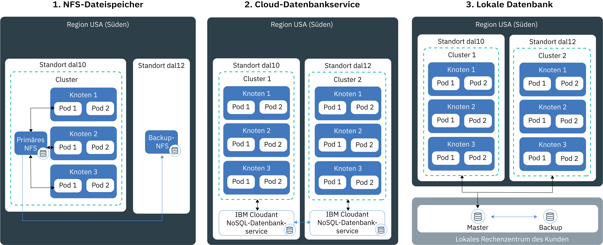

---

copyright:
  years: 2014, 2018
lastupdated: "2018-05-24"

---

{:new_window: target="_blank"}
{:shortdesc: .shortdesc}
{:screen: .screen}
{:pre: .pre}
{:table: .aria-labeledby="caption"}
{:codeblock: .codeblock}
{:tip: .tip}
{:download: .download}


# Daten in Ihrem Cluster speichern
{: #storage}
Sie können Daten in {{site.data.keyword.containerlong}} persistent speichern, um Daten zwischen App-Instanzen gemeinsam zu nutzen und um Ihre Daten vor Verlust zu schützen, wenn eine Komponente in Ihrem Kubernetes-Cluster ausfällt.


## Hochverfügbarkeitsspeicher planen
{: #planning}

In {{site.data.keyword.containerlong_notm}} stehen verschiedene Optionen zum Speichern Ihrer App-Daten und für die gemeinsame Datennutzung zwischen Pods in Ihrem Cluster zur Auswahl. Nicht alle Speicheroptionen bieten denselben Grad an Permanenz und Verfügbarkeit, falls eine Komponente in Ihrem Cluster oder ein ganzer Standort ausfällt.
{: shortdesc}


### Optionen für nicht persistente Datenspeicherung
{: #non_persistent}

Optionen für nicht persistente Speicherung können verwendet werden, wenn die zu speichernden Daten nicht permanent verfügbar sein müssen oder nicht von App-Instanzen gemeinsam genutzt werden. Außerdem können diese Speicheroptionen zum Testen von App-Komponenten oder neuen Funktionen verwendet werden.
{: shortdesc}

Die folgende Abbildung zeigt die verfügbaren Optionen für nicht persistente Datenspeicherung in {{site.data.keyword.containerlong_notm}}. Diese Optionen stehen für kostenlose Cluster und für Standardcluster zur Verfügung.
<p>
</p>

<table summary="Die Tabelle zeigt nicht persistente Datenspeicherungsoptionen. Die Tabellenzeilen enthalten von links nach rechts die Nummer der Option in der ersten Spalte, den Titel der Option in der zweiten Spalte und die Beschreibung in der dritten Spalte." style="width: 100%">
<caption>Nicht persistente Speicheroptionen</caption>
  <thead>
  <th>Option</th>
  <th>Beschreibung</th>
  </thead>
  <tbody>
    <tr>
      <td>1. Innerhalb des Containers oder Pods</td>
      <td>Container und Pods sind per Definition Komponenten mit kurzer Lebensdauer, die kurzfristig und unerwartet ausfallen können. Sie können jedoch Daten in das lokale Dateisystem eines Containers schreiben, um diese Daten für die Lebensdauer des Containers zu speichern. Daten in einem Container können nicht mit anderen Containern oder Pods gemeinsam genutzt werden und gehen verloren, wenn der Container ausfällt oder entfernt wird. Weitere Informationen finden Sie unter [Storing data in a container](https://docs.docker.com/storage/).</td>
    </tr>
  <tr>
    <td>2. Auf dem Workerknoten</td>
    <td>Für jeden Workerknoten wird primärer und sekundärer Speicher entsprechend dem Maschinentyp eingerichtet, den Sie für Ihren Workerknoten auswählen. Der primäre Speicher dient zum Speichern von Betriebssystemdaten und auf ihn kann mithilfe eines [Kubernetes-<code>HostPath</code>-Datenträgers](https://kubernetes.io/docs/concepts/storage/volumes/#hostpath) zugegriffen werden. The secondary storage is used to store data from thDer sekundäre Speicher dient zum Speichern von Daten aus `kubelet` und der Laufzeitengine des Containers. Sie können auf den zweiten Speicher zugreifen, indem Sie einen [Kubernetes-<code>emptyDir</code>-Datenträger verwenden](https://kubernetes.io/docs/concepts/storage/volumes/#emptydir)<br/><br/>Während <code>HostPath</code>-Datenträger verwendet werden, um Dateien vom Dateisystem des Workerknotens auf Ihrem Pod anzuhängen (mount), erstellt <code>emptyDir</code> ein leeres Verzeichnis, das einem Pod in Ihrem Cluster zugewiesen ist. Alle Container in diesem Pod können von diesem Datenträger lesen und auf diesen Datenträger schreiben. Da der Datenträger einem ganz bestimmten Pod zugewiesen ist, können Daten nicht mit anderen Pods in einer Replikatgruppe gemeinsam genutzt werden.<br/><br/><p>Ein <code>HostPath</code>- oder <code>emptyDir</code>-Datenträger und die zugehörigen Daten werden in folgenden Situationen entfernt: <ul><li>Der Workerknoten wird gelöscht.</li><li>Der Workerknoten wird neu geladen oder aktualisiert.</li><li>Der Cluster wird gelöscht.</li><li>Das {{site.data.keyword.Bluemix_notm}}-Konto wird ausgesetzt. </li></ul></p><p>Zusätzlich werden Daten auf einem <code>emptyDir</code>-Datenträger in folgenden Situationen entfernt: <ul><li>Der zugewiesene Pod auf dem Workerknoten wird permanent gelöscht.</li><li>Der zugewiesene Pod wird auf einem anderen Workerknoten terminiert.</li></ul></p><p><strong>Hinweis:</strong> Wenn der Container im Pod ausfällt, sind die im Datenträger enthaltenen Daten trotzdem noch auf dem Workerknoten verfügbar.</p></td>
    </tr>
    </tbody>
    </table>


### Optionen für persistenten Datenspeicher mit hoher Verfügbarkeit
{: #persistent}

Die größte Herausforderung bei der Erstellung von hoch verfügbaren, statusabhängigen Apps besteht in der Persistenz von Daten zwischen mehreren App-Instanzen an mehreren Standorten und darin, die Daten ständig synchron zu halten. Bei hoch verfügbaren Daten sollten Sie sicherstellen, dass eine Masterdatenbank mit mehreren Instanzen vorhanden ist, die auf mehrere Rechenzentren oder Regionen verteilt ist. Diese Masterdatenbank muss fortlaufend repliziert werden, um eine einzelne Wissensressource beizubehalten. Alle Instanzen in Ihrem Cluster müssen aus dieser Masterdatenbank lesen und in sie schreiben. Wenn eine Instanz der Masterdatenbank nicht betriebsbereit ist, übernehmen anderen Instanzen die Arbeitslast, damit keine Ausfallzeiten für Ihre Apps entstehen.
{: shortdesc}

Die folgende Abbildung zeigt, mit welchen Optionen Sie Ihre Daten in {{site.data.keyword.containerlong_notm}} in einem Standardcluster hoch verfügbar machen können. Welche Option für Ihr Szenario am besten geeignet ist, hängt von den folgenden Faktoren ab:
  * **Typ der verwendeten App:** Möglicherweise muss Ihre App Daten in Dateien speichern und nicht in einer Datenbank.
  * **Gesetzliche Anforderungen für das Speichern und Weiterleiten der Daten:** Möglicherweise sind Sie dazu verpflichtet, Daten ausschließlich in den USA zu speichern und weiterzuleiten, d. h. Sie dürfen keinen Service mit Standort in Europa verwenden.
  * **Optionen für Sicherung und Wiederherstellung:** Jede Speicheroption bietet Funktionen zum Sichern und Wiederherstellen von Daten. Überprüfen Sie, dass die verfügbaren Optionen für Sicherung und Wiederherstellung den Anforderungen (z. B. Häufigkeit der Sicherungen oder Möglichkeiten zur Datenspeicherung außerhalb Ihres primären Rechenzentrums) Ihres Disaster-Recovery-Plans entsprechen.
  * **Globale Replikation:** Für die Hochverfügbarkeit kann es sinnvoll sein, mehrere Speicherinstanzen einzurichten, die auf Rechenzentren in der ganzen Welt verteilt und repliziert werden.

<br/>


<table summary="In der Tabelle sind Optionen für persistenten Speicher aufgeführt. Die einzelnen Tabellenzeilen enthalten von links nach rechts die Nummer der Option in der ersten Spalte, den Titel der Option in der zweiten Spalte und die Beschreibung in der dritten Spalte.">
<caption>Persistente Speicheroptionen</caption>
  <thead>
  <th>Option</th>
  <th>Beschreibung</th>
  </thead>
  <tbody>
  <tr>
  <td>1. NFS-Dateispeicher oder -Blockspeicher</td>
  <td>Diese Option stellt persistente App- und Containerdaten mithilfe von persistenten Kubernetes-Datenträgern bereit. Die Datenträger werden in [NFS-basiertem Endurance- und Performance-Dateispeicher ](https://www.ibm.com/cloud/file-storage/details) oder [-Blockspeicher ](https://www.ibm.com/cloud/block-storage) gehostet, der für Apps verwendet werden kann, die Daten in Dateiform speichern und nicht in einer Datenbank. Datei- und Blockspeicher werden im Ruhezustand verschlüsselt.<p>{{site.data.keyword.containershort_notm}} stellt vordefinierte Speicherklassen bereit, die den Größenbereich des Speichers, die E/A-Operationen pro Sekunde, die Löschrichtlinie sowie die Lese- und Schreibberechtigungen für den Datenträger definieren. Um eine Anforderung für Datei- oder Blockspeicher zu stellen, müssen Sie einen [PVC (Persistent Volume Claim](cs_storage.html#create)) erstellen. Nachdem Sie einen PVC übergeben haben, stellt {{site.data.keyword.containershort_notm}} dynamisch einen persistenten Datenträger dar, der in einem NFS-basierten Datei- oder Blockspeicher gehostet wird. [Sie hängen den PVC (Persistent Volume Claim)](cs_storage.html#app_volume_mount) als Datenträger an Ihre Bereitstellung an, damit die Container den Datenträger lesen und beschreiben können. </p><p>Persistent Volumes (persistente Datenträger) werden in dem Rechenzentrum bereitgestellt, in dem sich der Workerknoten befindet. Daten können von derselben Replikatgruppe oder von verschiedenen Implementierungen im selben Cluster gemeinsam genutzt werden. Daten können nicht von Clustern gemeinsam genutzt werden, die sich in verschiedenen Rechenzentren oder Regionen befinden. </p><p>Standardmäßig wird keine automatische Sicherung des NFS-Speichers und Blockspeichers erstellt. Mit den verfügbaren [Sicherungs- und Wiederherstellungsverfahren](cs_storage.html#backup_restore) können Sie regelmäßige Sicherungen für Ihren Cluster konfigurieren. Wenn ein Container ausfällt oder ein Pod von einem Workerknoten entfernt wird, werden die Daten selbst nicht entfernt; auf sie kann über andere Bereitstellungen zugegriffen werden, an die der Datenträger angehängt ist. </p><p><strong>Hinweis:</strong> Sie können angeben, ob die Speicherung in persistenten NFS-Dateifreigaben und Blockspeichern stündlich oder monatlich berechnet werden soll. Wenn Sie die monatliche Berechnung auswählen, zahlen Sie beim Entfernen des persistenten Speichers immer noch eine monatliche Gebührt dafür, selbst dann, wenn Sie den Speicher nur für eine kurze Zeit genutzt haben.</p></td>
  </tr>
  <tr id="cloud-db-service">
    <td>2. Cloud-Datenbankservice</td>
    <td>Mit dieser Option können Sie über einen {{site.data.keyword.Bluemix_notm}}-Cloud-Service für Datenbanken (z. B. [IBM Cloudant NoSQL DB](/docs/services/Cloudant/getting-started.html#getting-started-with-cloudant)) Daten persistent speichern und auf sie zugreifen. Auf Daten, die mit dieser Option gespeichert wurden, kann in mehreren Clustern sowie an mehreren Standorten und Regionen zugegriffen werden. <p> Sie können entweder eine einzelne Datenbankinstanz konfigurieren, auf die alle Ihre Apps zugreifen, oder [mehrere Instanzen mit übergreifender Replikation in Rechenzentren einrichten](/docs/services/Cloudant/guides/active-active.html#configuring-cloudant-nosql-db-for-cross-region-disaster-recovery), um hohe Verfügbarkeit für die Daten bereitzustellen. In der IBM Cloudant NoSQL-Datenbank werden Daten nicht automatisch gesichert. Sie können die bereitgestellten [Sicherungs- und Wiederherstellungsverfahren](/docs/services/Cloudant/guides/backup-cookbook.html#cloudant-nosql-db-backup-and-recovery) verwenden, um Ihre Daten vor Siteausfällen zu schützen.</p> <p> Um einen Service in Ihrem Cluster zu verwenden, [binden Sie den {{site.data.keyword.Bluemix_notm}}-Service](cs_integrations.html#adding_app) an einen Namensbereich in Ihrem Cluster. Bei diesem Vorgang wird ein geheimer Kubernetes-Schlüssel erstellt. Der geheime Kubernetes-Schlüssel enthält vertrauliche Informationen zu dem Service (z. B. die URL für den Service, Ihren Benutzernamen und das Kennwort). Sie können den geheimen Schlüssel als Datenträger für geheime Schlüssel an Ihren Pod anhängen und unter Verwendung der im geheimen Schlüssel gespeicherten Berechtigungsnachweise auf den Service zugreifen. Durch Anhängen des Datenträgers für geheime Schlüssel an andere Pods können Sie Daten podübergreifend gemeinsam nutzen. Wenn ein Container ausfällt oder ein Pod von einem Workerknoten entfernt wird, werden die Daten selbst nicht entfernt; auf sie kann über andere Pods zugegriffen werden, an die der Datenträger für geheime Schlüssel angehängt ist. <p>Die meisten {{site.data.keyword.Bluemix_notm}}-Datenbankservices stellen Plattenspeicher für ein geringes Datenvolumen gebührenfrei zur Verfügung, damit Sie dessen Funktionen testen können.</p></td>
  </tr>
  <tr>
    <td>3. Lokale Datenbank</td>
    <td>Wenn Ihre Daten aus rechtlichen Gründen lokal gespeichert werden müssen, können Sie eine [VPN-Verbindung zur lokalen Datenbank einrichten](cs_vpn.html#vpn) und die in Ihrem Rechenzentrum vorhandenen Sicherungs- und Wiederherstellungsverfahren verwenden.</td>
  </tr>
  </tbody>
  </table>

{: caption="Tabelle. Optionen für persistentes Speichern von Daten bei Bereitstellungen in Kubernetes-Clustern" caption-side="top"}

<br />


## Vorhandene NFS-Dateifreigaben in Clustern verwenden
{: #existing}

Wenn NFS-Dateifreigaben in Ihrem Konto von IBM Cloud Infrastructure (SoftLayer) vorhanden sind, die Sie verwenden möchten, können Sie dies tun, indem Sie einen persistenten Datenträger (PV, Persistent Volume) für Ihren vorhandenen Speicher erstellen.
{:shortdesc}

Ein persistenter Datenträger (PV) ist eine Kubernetes-Ressource, die eine tatsächliche Speichereinheit darstellt, die in einem Rechenzentrum bereitgestellt wird. Persistente Datenträger abstrahieren die Details dazu, wie ein bestimmter Speichertyp von {{site.data.keyword.Bluemix_notm}} Storage bereitgestellt wird. Um einen persistenten Datenträger (PV) an Ihren Cluster anzuhängen (mount), müssen Sie persistenten Speicher für Ihren Pod anfordern, indem Sie einen PVC (Persistent Volume Claim) erstellen. Das folgende Diagramm zeigt die Beziehung zwischen PVs und PVCs.


Wenn Sie, wie im Diagramm dargestellt, die Verwendung von NFS-Speicher ermöglichen möchten, müssen Sie PVs (Persistent Volumes) mit einer bestimmten Größe und einem bestimmten Zugriffsmodus erstellen und dann einen PVC (Persistent Volume Claim) erstellen, der mit der Angabe des PV (Persistent Volume) übereinstimmt. Wenn PV (Persistent Volume) und PVC (Persistent Volume Claim) übereinstimmen, werden sie aneinander gebunden. Vom Clusterbenutzer können nur gebundene PVCs (Persistent Volume Claims) verwendet werden, um den Datenträger an eine Bereitstellung anzuhängen. Dieser Prozess wird als statische Bereitstellung von persistentem Speicher bezeichnet.

Stellen Sie zunächst sicher, dass Sie über eine NFS-Dateifreigabe verfügen, die Sie zum Erstellen Ihres PV (Persistent Volume) verwenden können. Wenn Sie beispielsweise zuvor [einen PVC mit der Speicherklassenrichtlinie `retain` erstellt haben](#create), können Sie die beibehaltenen Daten in der vorhandenen NFS-Datei für diesen neuen PVC zur gemeinsamen Nutzung verwenden.

**Hinweis:** Eine statische Bereitstellung von persistentem Speicher gilt nur für vorhandene NFS-Dateifreigaben. Wenn keine NFS-Dateifreigaben vorhanden sind, können Clusterbenutzer den Prozess der [dynamischen Bereitstellung](cs_storage.html#create) nutzen, um Persistent Volumes (PVs) hinzuzufügen.

Führen Sie die folgenden Schritte aus, um ein PV und einen übereinstimmenden PVC zu erstellen.

1.  Suchen Sie in Ihrem Konto von IBM Cloud Infrastructure (SoftLayer) nach der ID und dem Pfad der NFS-Dateifreigabe, in der Sie Ihr PV-Objekt erstellen möchten. Autorisieren Sie darüber hinaus den Dateispeicher für die Teilnetze im Cluster. Diese Autorisierung erteilt Ihrem Cluster Zugriff auf den Speicher.
    1.  Melden Sie sich bei Ihrem Konto von IBM Cloud Infrastructure (SoftLayer) an.
    2.  Klicken Sie auf **Speicher**.
    3.  Klicken Sie auf **Dateispeicher** und wählen Sie im Menü **Aktionen** die Option zum Autorisieren des Hosts**** aus.
    4.  Wählen Sie **Teilnetze** aus.
    5.  Wählen Sie in der Dropdown-Liste das private VLAN-Teilnetz aus, mit dem der Workerknoten verbunden ist. Um das Teilnetz Ihres Workerknotens zu finden, führen Sie den Befehl `bx cs workers <cluster_name>` aus und vergleichen die `Private IP` Ihres Workerknotens mit dem Teilnetz, das Sie in der Dropdown-Liste gefunden haben.
    6.  Klicken Sie auf **Übergeben**.
    6.  Klicken Sie auf den Namen des Dateispeichers.
    7.  Beachten Sie das Feld **Mountpunkt**. Das Feld hat dieses Format: `<server>:/<path>`.
2.  Erstellen Sie eine Speicherkonfigurationsdatei für Ihr PV (Persistent Volume). Schließen Sie die im Feld **Mountpunkt** des Dateispeichers angegebenen Server und Pfad ein.

    ```
    apiVersion: v1
    kind: PersistentVolume
    metadata:
     name: mypv
    spec:
     capacity:
       storage: "20Gi"
     accessModes:
       - ReadWriteMany
     nfs:
       server: "nfslon0410b-fz.service.networklayer.com"
       path: "/IBM01SEV8491247_0908/data01"
    ```
    {: codeblock}

    <table>
    <caption>Erklärung der Komponenten der YAML-Datei</caption>
    <thead>
    <th colspan=2> Erklärung der YAML-Dateikomponenten</th>
    </thead>
    <tbody>
    <tr>
    <td><code>name</code></td>
    <td>Geben Sie den Namen des PV-Objekts ein, das erstellt werden soll.</td>
    </tr>
    <tr>
    <td><code>spec/capacity/storage</code></td>
    <td>Geben Sie die Speichergröße der vorhandenen NFS Dateifreigabe ein. Die Größe des Speichers muss in Gigabyte angegeben werden, z. B. 20Gi (20 GB) oder 1000Gi (1 TB), und sie muss mit der Größe der vorhandenen Dateifreigabe übereinstimmen.</td>
    </tr>
    <tr>
    <td><code>accessMode</code></td>
    <td>Der Zugriffsmodus definiert, auf welche Art ein Persistent Volume Claim (PVC) an einen Workerknoten angehängt werden kann.<ul><li>ReadWriteOnce (RWO): Das Persistent Volume kann nur an die Bereitstellungen in einem einzigen Workerknoten angehängt werden. Die an dieses Persistent Volume angehängten Container können auf diesen Datenträger schreiben und ihn lesen.</li><li>ReadOnlyMany (ROX): Das PV (Persistent Volume) kann an Bereitstellungen angehängt werden, die auf verschiedenen Workerknoten gehostet sind. Die an dieses PV (Persistent Volume) angehängten Bereitstellungen können den Datenträger nur lesen.</li><li>ReadWriteMany (RWX): Dieses PV (Persistent Volume) kann an Bereitstellungen angehängt werden, die auf verschiedenen Workerknoten gehostet sind. Bereitstellungen, die an dieses PV (Persistent Volume) angehängt werden, können den Datenträger lesen und ihn beschreiben.</li></ul></td>
    </tr>
    <tr>
    <td><code>spec/nfs/server</code></td>
    <td>Geben Sie die Server-ID der NFS-Dateifreigabe ein.</td>
    </tr>
    <tr>
    <td><code>path</code></td>
    <td>Geben Sie den Pfad zur NFS-Dateifreigabe ein, in der Sie das PV-Objekt erstellen möchten.</td>
    </tr>
    </tbody></table>

3.  Erstellen Sie das PV-Objekt in Ihrem Cluster.

    ```
    kubectl apply -f deploy/kube-config/mypv.yaml
    ```
    {: pre}

4.  Überprüfen Sie, dass das PV erstellt wurde.

    ```
    kubectl get pv
    ```
    {: pre}

5.  Erstellen Sie eine weitere Konfigurationsdatei, um Ihren Persistent Volume Claim (PVC) zu erstellen. Damit der Persistent Volume Claim (PVC) mit dem zuvor erstellten Persistent Volume-Objekt übereinstimmt, müssen Sie denselben Wert für `storage` und `accessMode` auswählen. Das Feld `storage-class` muss leer sein. Wenn eines dieser Felder nicht mit dem PV (Persistent Volume) übereinstimmt, wird stattdessen automatisch ein neues PV erstellt.

    ```
    kind: PersistentVolumeClaim
    apiVersion: v1
    metadata:
     name: mypvc
     annotations:
       volume.beta.kubernetes.io/storage-class: ""
    spec:
     accessModes:
       - ReadWriteMany
     resources:
       requests:
         storage: "20Gi"
    ```
    {: codeblock}

6.  Erstellen Sie Ihren PVC.

    ```
    kubectl apply -f deploy/kube-config/mypvc.yaml
    ```
    {: pre}

7.  Überprüfen Sie, ob Ihr PVC erstellt und an das PV-Objekt gebunden wurde. Dieser Prozess kann einige Minuten dauern.

    ```
    kubectl describe pvc mypvc
    ```
    {: pre}

    Beispielausgabe:

    ```
    Name: mypvc
    Namespace: default
    StorageClass: ""
    Status: Bound
    Volume: pvc-0d787071-3a67-11e7-aafc-eef80dd2dea2
    Labels: <none>
    Capacity: 20Gi
    Access Modes: RWX
    Events:
      FirstSeen LastSeen Count From        SubObjectPath Type Reason Message
      --------- -------- ----- ----        ------------- -------- ------ -------
      3m 3m 1 {ibm.io/ibmc-file 31898035-3011-11e7-a6a4-7a08779efd33 } Normal Provisioning External provisioner is provisioning volume for claim "default/my-persistent-volume-claim"
      3m 1m	 10 {persistentvolume-controller } Normal ExternalProvisioning cannot find provisioner "ibm.io/ibmc-file", expecting that a volume for the claim is provisioned either manually or via external software
      1m 1m 1 {ibm.io/ibmc-file 31898035-3011-11e7-a6a4-7a08779efd33 } Normal ProvisioningSucceeded	Successfully provisioned volume pvc-0d787071-3a67-11e7-aafc-eef80dd2dea2
    ```
    {: screen}


Sie haben erfolgreich ein PV-Objekt (Persistent Volume-Objekt) erstellt und an einen PVC (Persistent Volume Claim) gebunden. Clusterbenutzer können jetzt den [PVC (Persistent Volume Claim) an ihre Bereitstellungen anhängen](#app_volume_mount) und mit dem Lesen und Schreiben in dem PV-Objekt (Persistent Volume-Objekt) beginnen.

<br />


## Vorhandenen Blockspeicher in Ihrem Cluster verwenden
{: #existing_block}

Stellen Sie zunächst sicher, dass Sie über eine vorhandene Blockspeicherinstanz verfügen, die Sie zum Erstellen Ihres PV (Persistent Volume) verwenden können. Wenn Sie beispielsweise zuvor [einen PVC mit der Speicherklassenrichtlinie `retain` erstellt haben](#create), können Sie die beibehaltenen Daten im vorhandenen Blockspeicher für diesen neuen PVC verwenden.

**Hinweis**: Blockspeicher ist eine Einheit mit dem Zugriffsmodus `ReadWriteOnce`. Sie können ihn jeweils immer nur an einen Pod auf einem Workerknoten im Cluster anhängen.

Führen Sie die folgenden Schritte aus, um ein PV und einen übereinstimmenden PVC zu erstellen.

1.  Rufen Sie einen API-Schlüssel für Ihr IBM Cloud Infrastructure-Konto (SoftLayer) ab oder generieren Sie einen API-Schlüssel.
    1. Melden Sie sich beim [Portal von IBM Cloud Infrastructure (SoftLayer) ](https://control.softlayer.com/) an.
    2. Wählen Sie **Konto**, dann **Benutzer** und dann **Benutzerliste** aus.
    3. Suchen Sie nach Ihrer Benutzer-ID.
    4. Klicken Sie in der Spalte **API-SCHLÜSSEL** auf **Generieren**, um einen API-Schlüssel zu generieren, oder auf **Anzeigen**, um Ihren vorhandenen API-Schlüssel anzuzeigen.
2.  Rufen Sie den API-Benutzernamen für Ihr IBM Cloud Infrastructure-Konto (SoftLayer) ab.
    1. Wählen Sie im Menü **Benutzerliste** Ihre Benutzer-ID aus.
    2. Suchen Sie im Abschnitt **API-Zugriffsinformationen** nach Ihrem **API-Benutzernamen**.
3.  Melden Sie sich beim Befehlszeilen-Plug-in von IBM Cloud Infrastructure an.
    ```
    bx sl init
    ```
    {: pre}

4.  Wählen Sie die Authentifizierung anhand des Benutzernamens und API-Schlüssels für Ihr IBM Cloud Infrastructure-Konto (SoftLayer) aus.
5.  Geben Sie den Benutzernamen und den API-Schlüssel ein, die Sie in den vorherigen Schritten abgerufen haben.
6.  Listen Sie verfügbare Blockspeichereinheiten auf.
    ```
    bx sl block volume-list
    ```
    {: pre}

    Beispielausgabe:
    ```
    id         username            datacenter   storage_type              capacity_gb   bytes_used   ip_addr         lunId   active_transactions
    38642141   IBM02SEL1543159-1   dal10        endurance_block_storage   20            -            169.xx.xxx.xxx   170     0
    ```
    {: screen}

7.  Notieren Sie sich die Angaben `id`, `ip_addr`, `capacity_gb` und `lunId` der Blockspeichereinheit, die Sie an Ihr Cluster anhängen möchten.
8.  Erstellen Sie eine Konfigurationsdatei für Ihr PV (Persistent Volume). Geben Sie die Blockspeicher-ID, die IP-Adresse, die Größe und die LUN-ID ein, die Sie im vorherigen Schritt abgerufen haben.

    ```
    apiVersion: v1
    kind: PersistentVolume
    metadata:
      name: mypv
    spec:
      capacity:
        storage: "<speichergröße>"
      accessModes:
        - ReadWriteOnce
      flexVolume:
        driver: "ibm/ibmc-block"
        fsType: "<fs-typ>"
        options:
          "Lun": "<lun-id>"
          "TargetPortal": "<ip-adresse>"
          "VolumeID": "<datenträger-id>"
          "volumeName": "<datenträgername>"
      ```
      {: codeblock}

    <table>
    <caption>Erklärung der Komponenten der YAML-Datei</caption>
    <thead>
    <th colspan=2> Erklärung der YAML-Dateikomponenten</th>
    </thead>
    <tbody>
    <tr>
    <td><code>metadata/name</code></td>
    <td>Geben Sie den Namen des PV ein, das Sie erstellen möchten.</td>
    </tr>
    <tr>
    <td><code>spec/flexVolume/fsType</code></td> 
    <td>Geben Sie den Dateisystemtyp ein, der für den vorhandenen Blockspeicher konfiguriert ist. Wählen Sie zwischen <code>ext4</code> oder <code>xfs</code>. Wenn Sie diese Option nicht angeben, nimmt das PV standardmäßig den Wert <code>ext4</code> ein. Wenn der falsche Wert für 'fsType' definiert ist, ist zwar die PV-Erstellung erfolgreich, das Anhängen des PVs an einen Pod schlägt jedoch fehl. </td></tr>	    
    <tr>
    <td><code>spec/capacity/storage</code></td>
    <td>Geben Sie die Speichergröße des vorhandenen Blockspeichers ein, den Sie im vorherigen Schritt als <code>capacity-gb</code> abgerufen haben. Die Größe des Speichers muss in Gigabyte angegeben werden, z. B. 20Gi (20 GB) oder 1000Gi (1 TB).</td>
    </tr>
    <tr>
    <td><code>flexVolume/options/Lun</code></td>
    <td>Geben Sie die LUN-ID für Ihren Blockspeicher ein, die Sie im vorherigen Schritt als <code>lunId</code> abgerufen haben.</td>
    </tr>
    <tr>
    <td><code>flexVolume/options/TargetPortal</code></td>
    <td>Geben Sie die IP-Adresse Ihres Blockspeichers ein, die Sie im vorherigen Schritt als <code>ip_addr</code> abgerufen haben. </td>
    </tr>
    <tr>
	    <td><code>flexVolume/options/VolumeId</code></td>
	    <td>Geben Sie die ID Ihres Blockspeichers ein, die Sie im vorherigen Schritt als <code>id</code> abgerufen haben.</td>
	    </tr>
	    <tr>
		    <td><code>flexVolume/options/volumeName</code></td>
		    <td>Geben Sie einen Namen für Ihren Datenträger ein.</td>
	    </tr>
    </tbody></table>

9.  Erstellen Sie das PV in Ihrem Cluster.
    ```
    kubectl apply -f mypv.yaml
    ```
    {: pre}

10. Überprüfen Sie, dass das PV erstellt wurde.
    ```
    kubectl get pv
    ```
    {: pre}

11. Erstellen Sie eine weitere Konfigurationsdatei, um Ihren Persistent Volume Claim (PVC) zu erstellen. Damit der Persistent Volume Claim (PVC) mit dem zuvor erstellten Persistent Volume übereinstimmt, müssen Sie denselben Wert für `storage` und `accessMode` auswählen. Das Feld `storage-class` muss leer sein. Wenn eines dieser Felder nicht mit dem PV (Persistent Volume) übereinstimmt, wird stattdessen automatisch ein neues PV erstellt.

     ```
     kind: PersistentVolumeClaim
    apiVersion: v1
    metadata:
     name: mypvc
     annotations:
       volume.beta.kubernetes.io/storage-class: ""
     spec:
      accessModes:
        - ReadWriteOnce
      resources:
        requests:
          storage: "20Gi"
     ```
     {: codeblock}

12.  Erstellen Sie Ihren PVC.
     ```
     kubectl apply -f mypvc.yaml
     ```
     {: pre}

13.  Überprüfen Sie, ob Ihr PVC erstellt und an das zuvor erstellte PV gebunden wurde. Dieser Prozess kann einige Minuten dauern.
     ```
     kubectl describe pvc mypvc
     ```
     {: pre}

     Beispielausgabe:

     ```
     Name: mypvc
    Namespace: default
    StorageClass: ""
     Status: Bound
     Volume: pvc-0d787071-3a67-11e7-aafc-eef80dd2dea2
     Labels: <none>
     Capacity: 20Gi
     Access Modes: RWO
     Events:
       FirstSeen LastSeen Count From        SubObjectPath Type Reason Message
       --------- -------- ----- ----        ------------- -------- ------ -------
       3m 3m 1 {ibm.io/ibmc-block 31898035-3011-11e7-a6a4-7a08779efd33 } Normal Provisioning External provisioner is provisioning volume  for claim "default/my-persistent-volume-claim"
       3m 1m	 10 {persistentvolume-controller } Normal ExternalProvisioning cannot find provisioner "ibm.io/ibmc-block", expecting that  a volume for the claim is provisioned either manually or via external software
       1m 1m 1 {ibm.io/ibmc-block 31898035-3011-11e7-a6a4-7a08779efd33 } Normal ProvisioningSucceeded	Successfully provisioned volume  pvc-0d787071-3a67-11e7-aafc-eef80dd2dea2
     ```
     {: screen}

Sie haben erfolgreich ein PV (Persistent Volume) erstellt und an einen PVC (Persistent Volume Claim) gebunden. Clusterbenutzer können jetzt den [PVC (Persistent Volume Claim) an ihre Bereitstellungen anhängen](#app_volume_mount) und mit dem Lesen und Schreiben in dem PV (Persistent Volume) beginnen.

<br />


## NFS-Dateispeicher oder -Blockspeicher zu Apps hinzufügen
{: #create}

Um NFS-Dateispeicher oder -Blockspeicher für Ihren Cluster bereitzustellen, erstellen Sie einen PVC (Persistent Volume Claim). Anschließend hängen Sie diese Anforderung (PVC) an ein PV (Persistent Volume) an, um sicherzustellen, dass Daten auch dann verfügbar sind, wenn die Pods ausfallen oder abgeschaltet werden.
{:shortdesc}

Der NFS-Dateispeicher oder -Blockspeicher, auf den sich das PV (Persistent Volume) stützt, wird von IBM in Gruppen zusammengefasst, um hohe Verfügbarkeit für Ihre Daten bereitzustellen. Die Speicherklassen beschreiben die Typen der verfügbaren Speicherangebote und definieren Aspekte wie die Datenaufbewahrungsrichtlinie, die Größe in Gigabyte und die E/A-Operationen pro Sekunde (IOPS), wenn Sie Ihren persistenten Datenträger (PV) erstellen.

**Hinweis**: Blockspeicher ist eine Einheit mit dem Zugriffsmodus `ReadWriteOnce`. Sie können ihn jeweils immer nur an einen Pod auf einem Workerknoten im Cluster anhängen. NFS-Dateispeicher weist den Zugriffsmodus `ReadWriteMany` auf, sodass Sie ihn an mehrere Pods über Worker hinweg im Cluster anhängen können.

Vorbemerkungen:
- Wenn Sie über eine Firewall verfügen, [gewähren Sie Egress-Zugriff](cs_firewall.html#pvc) für die IBM Cloud Infrastructure-IP-Bereiche (SoftLayer) der Standorte (Rechenzentren), in denen sich Ihre Cluster befinden, damit Sie Persistent Volume Claims (PVCs) erstellen können.
- Wenn Sie Blockspeicher an Ihre Apps anhängen möchten, müssen Sie zunächst das [{{site.data.keyword.Bluemix_notm}} Storage-Plug-in für Blockspeicher](#install_block) installieren.

Gehen Sie wie folgt vor, um einen persistenter Speicher hinzuzufügen:

1.  Überprüfen Sie die verfügbaren Speicherklassen. {{site.data.keyword.containerlong}} stellt vordefinierte Speicherklassen für NFS-Dateispeicher und -Blockspeicher zur Verfügung, sodass der Clusteradministrator keine Speicherklassen erstellen muss. Die Speicherklasse `ibmc-file-bronze` ist identisch mit der Speicherklasse `default`. Standardmäßig wird Dateispeicher mit einem `nfs`-Dateisystem und Blockspeicher mit einem `ext4`-Dateisystem bereitgestellt. Wenn Sie Blockspeicher mit einem `XFS`-Dateisystem bereitstellen möchten, [erstellen Sie Ihre eigene angepasste Speicherklasse](#custom_storageclass). 

    ```
    kubectl get storageclasses
    ```
    {: pre}

    ```
    $ kubectl get storageclasses
    NAME                         TYPE
    default                      ibm.io/ibmc-file
    ibmc-file-bronze (default)   ibm.io/ibmc-file
    ibmc-file-custom             ibm.io/ibmc-file
    ibmc-file-gold               ibm.io/ibmc-file
    ibmc-file-retain-bronze      ibm.io/ibmc-file
    ibmc-file-retain-custom      ibm.io/ibmc-file
    ibmc-file-retain-gold        ibm.io/ibmc-file
    ibmc-file-retain-silver      ibm.io/ibmc-file
    ibmc-file-silver             ibm.io/ibmc-file
    ibmc-block-custom            ibm.io/ibmc-block
    ibmc-block-bronze            ibm.io/ibmc-block
    ibmc-block-gold              ibm.io/ibmc-block
    ibmc-block-silver            ibm.io/ibmc-block
    ibmc-block-retain-bronze     ibm.io/ibmc-block
    ibmc-block-retain-silver     ibm.io/ibmc-block
    ibmc-block-retain-gold       ibm.io/ibmc-block
    ibmc-block-retain-custom     ibm.io/ibmc-block
    ```
    {: screen}

    **Tipp:** Wenn Sie die Standardspeicherklasse ändern möchten, führen Sie den Befehl `kubectl patch storageclass <storageclass> -p '{"metadata": {"annotations":{"storageclass.kubernetes.io/is-default-class":"true"}}}'` aus und ersetzen Sie `<storageclass>` durch den Namen der Speicherklasse.

2.  Legen Sie fest, ob Sie Ihre Daten und die NFS-Dateifreigabe oder den Blockspeicher nach dem Löschen des PVC speichern möchten.
    - Wenn Sie die Daten aufbewahren möchten, dann wählen Sie eine Speicherklasse vom Typ `retain` aus. Beim Löschen des PVC wird nur der PVC gelöscht. Das PV ist weiterhin im Cluster vorhanden und die Daten darin werden gespeichert, können jedoch nicht mit einem anderen PVC wiederverwendet werden. Der NFS-Dateispeicher oder -Blockspeicher und Ihre Daten sind jedoch noch immer im Konto von IBM Cloud Infrastructure (SoftLayer) vorhanden. Um später auf diese Daten in Ihrem Cluster zugreifen zu können, erstellen Sie einen PVC und ein übereinstimmendes PV, das auf Ihren vorhandenen [NFS-Dateispeicher](#existing) oder [-Blockspeicher](#existing_block) verweist. 
    - Wenn das PV, die Daten und die NFS-Dateifreigabe oder der Blockspeicher bei der Löschung des PVC ebenfalls gelöscht werden sollen, dann wählen Sie eine Speicherklasse ohne `retain` aus.

3.  **Wenn Sie eine Speicherklasse wie 'bronze', 'silver' oder 'gold' ausgewählt haben**: Erhalten Sie einen [Endurance-Speicher ](https://knowledgelayer.softlayer.com/topic/endurance-storage) mit einem definierten Wert für die E/A-Operationen pro Sekunde (IOPS) pro GB für jede Klasse. Sie können den Gesamtwert für IOPS festlegen, indem Sie eine Größe innerhalb des verfügbaren Bereichs auswählen. Sie können innerhalb des zulässigen Größenbereichs (z. B. 20 Gi, 256 Gi, 11854 Gi) eine beliebige ganze Zahl von Gigabyte-Größen auswählen. Wenn Sie beispielsweise eine Größe von 1000Gi für die Dateifreigabe oder den Blockspeicher in der Speicherklasse 'silver' mit 4 IOPS pro GB auswählen, verfügt Ihr Datenträger insgesamt über 4000 IOPS. Je höher der IOPS-Wert Ihres persistenten Datenträgers (PV), umso höher die Verarbeitungsgeschwindigkeit für Ein- und Ausgabeoperationen. In der folgenden Tabelle werden die IOPS pro Gigabyte und der Größenbereich für jede Speicherklasse beschrieben.

    <table>
         <caption>Tabelle der Größenbereiche der Speicherklasse und der IOPS pro Gigabyte</caption>
         <thead>
         <th>Speicherklasse</th>
         <th>IOPS pro Gigabyte</th>
         <th>Größenbereich in Gigabyte</th>
         </thead>
         <tbody>
         <tr>
         <td>Bronze (Standardwert)</td>
         <td>2 IOPS/GB</td>
         <td>20-12000 Gi</td>
         </tr>
         <tr>
         <td>Silver</td>
         <td>4 IOPS/GB</td>
         <td>20-12000 Gi</td>
         </tr>
         <tr>
         <td>Gold</td>
         <td>10 IOPS/GB</td>
         <td>20-4000 Gi</td>
         </tr>
         </tbody></table>

    <p>**Beispielbefehl zum Anzeigen der Details der Speicherklasse**:</p>

    <pre class="pre"><code>kubectl describe storageclasses ibmc-file-silver</code></pre>

4.  **Wenn Sie die angepasste Speicherklasse auswählen**: Sie erhalten einen [Leistungsspeicher](https://knowledgelayer.softlayer.com/topic/performance-storage) und haben mehr Kontrolle über die Auswahl der Kombination von IOPS und Größe. Wenn Sie zum Beispiel eine Größe von 40Gi für Ihren PVC auswählen, können Sie IOPS auswählen, die ein Vielfaches von 100 sind und im Bereich von 100 - 2000 IOPS liegen. Der von Ihnen ausgewählte Wert für IOPS ist statisch und wird nicht mit der Größe des Speichers skaliert. Wenn Sie 40Gi mit 100 IOPS auswählen, bleibt der Gesamtwert für IOPS 100. Die folgende Tabelle zeigt Ihnen, aus welchem IOPS-Bereich Sie abhängig von der ausgewählten Größe auswählen können.

    <table>
         <caption>Tabelle mit Größenbereichen und IOPS für angepasste Speicherklassen</caption>
         <thead>
         <th>Größenbereich in Gigabyte</th>
         <th>IOPS-Bereich in Vielfachen von 100</th>
         </thead>
         <tbody>
         <tr>
         <td>20-39 Gi</td>
         <td>100-1000 IOPS</td>
         </tr>
         <tr>
         <td>40-79 Gi</td>
         <td>100-2000 IOPS</td>
         </tr>
         <tr>
         <td>80-99 Gi</td>
         <td>100-4000 IOPS</td>
         </tr>
         <tr>
         <td>100-499 Gi</td>
         <td>100-6000 IOPS</td>
         </tr>
         <tr>
         <td>500-999 Gi</td>
         <td>100-10000 IOPS</td>
         </tr>
         <tr>
         <td>1000-1999 Gi</td>
         <td>100-20000 IOPS</td>
         </tr>
         <tr>
         <td>2000-2999 Gi</td>
         <td>200-40000 IOPS</td>
         </tr>
         <tr>
         <td>3000-3999 Gi</td>
         <td>200-48000 IOPS</td>
         </tr>
         <tr>
         <td>4000-7999 Gi</td>
         <td>300-48000 IOPS</td>
         </tr>
         <tr>
         <td>8000-9999 Gi</td>
         <td>500-48000 IOPS</td>
         </tr>
         <tr>
         <td>10000-12000 Gi</td>
         <td>1000-48000 IOPS</td>
         </tr>
         </tbody></table>

    <p>**Beispielbefehl zum Anzeigen der Details für angepasste Speicherklassen**:</p>

    <pre class="pre"><code>kubectl describe storageclasses ibmc-file-retain-custom</code></pre>

5.  Entscheiden Sie, ob Sie die Abrechnung auf Stundenbasis oder monatlich erhalten möchten. Die Rechnung erfolgt standardmäßig pro Monat.

6.  Erstellen Sie eine Konfigurationsdatei, um Ihren PVC zu definieren und speichern Sie die Konfiguration als `.yaml`-Datei.

    -  **Beispiel für die Speicherlassen 'bronze', 'silver' und 'gold'**:
       Die folgende `.yaml`-Datei erstellt eine Anforderung mit dem Namen `mypvc` der Speicherklasse `"ibmc-file-silver"` und einer Abrechnung auf Stundenbasis (`"hourly"`) mit einer Größe von `24Gi`. Wenn Sie einen PVC erstellen möchten, um Blockspeicher in Ihrem Cluster anzuhängen, müssen Sie `ReadWriteOnce` im Abschnitt `accessModes` eingeben.

       ```
       apiVersion: v1
       kind: PersistentVolumeClaim
       metadata:
         name: mypvc
         annotations:
           volume.beta.kubernetes.io/storage-class: "ibmc-file-silver"
         labels:
           billingType: "hourly"
       spec:
         accessModes:
           - ReadWriteMany
         resources:
           requests:
             storage: 24Gi
        ```
        {: codeblock}

    -  **Beispiel für angepasste Speicherklassen**:
       Die folgende `.yaml`-Datei erstellt eine Anforderung mit dem Namen `mypvc` der Speicherklasse `ibmc-file-retain-custom` und einer monatlichen Abrechnung (`"monthly"`) mit einer Größe von `45Gi` und `"300"` IOPS. Wenn Sie einen PVC erstellen möchten, um Blockspeicher in Ihrem Cluster anzuhängen, müssen Sie `ReadWriteOnce` im Abschnitt `accessModes` eingeben.

       ```
       apiVersion: v1
       kind: PersistentVolumeClaim
       metadata:
         name: mypvc
         annotations:
           volume.beta.kubernetes.io/storage-class: "ibmc-file-retain-custom"
         labels:
           billingType: "monthly"
       spec:
         accessModes:
           - ReadWriteMany
         resources:
           requests:
             storage: 45Gi
             iops: "300"
        ```
        {: codeblock}

        <table>
        <caption>Erklärung der Komponenten der YAML-Datei</caption>
        <thead>
        <th colspan=2> Erklärung der YAML-Dateikomponenten</th>
        </thead>
        <tbody>
        <tr>
        <td><code>metadata/name</code></td>
        <td>Geben Sie den Namen des PVC ein.</td>
        </tr>
        <tr>
        <td><code>metadata/annotations</code></td>
        <td>Geben Sie eine Speicherklasse für das PV an:
          <ul>
          <li>ibmc-file-bronze / ibmc-file-retain-bronze : 2 E/A-Operationen pro Sekunde pro GB.</li>
          <li>ibmc-file-silver / ibmc-file-retain-silver: 4 E/A-Operationen pro Sekunde pro GB.</li>
          <li>ibmc-file-gold / ibmc-file-retain-gold: 10 E/A-Operationen pro Sekunde pro GB.</li>
          <li>ibmc-file-custom / ibmc-file-retain-custom: Mehrere Werte für E/A-Operationen pro Sekunde verfügbar.</li>
          <li>ibmc-block-bronze / ibmc-block-retain-bronze: 2 E/A-Operationen pro Sekunde pro GB.</li>
          <li>ibmc-block-silver / ibmc-block-retain-silver: 4 E/A-Operationen pro Sekunde pro GB.</li>
          <li>ibmc-block-gold / ibmc-block-retain-gold: 10 E/A-Operationen pro Sekunde pro GB.</li>
          <li>ibmc-block-custom / ibmc-block-retain-custom: Mehrere Werte für E/A-Operationen pro Sekunde verfügbar.</li></ul>
          <p>Wenn keine Speicherklasse angegeben ist, wird das PV (Persistent Volume) mit der Standardspeicherklasse erstellt.</p><p>**Tipp:** Wenn Sie die Standardspeicherklasse ändern möchten, führen Sie den Befehl <code>kubectl patch storageclass &lt;speicherklasse&gt; -p '{"metadata": {"annotations":{"storageclass.kubernetes.io/is-default-class":"true"}}}'</code> aus und ersetzen Sie <code>&lt;speicherklasse&gt;</code> durch den Namen der Speicherklasse.</p></td>
        </tr>
        <tr>
          <td><code>metadata/labels/billingType</code></td>
          <td>Geben Sie die Häufigkeit an, mit der Ihre Speicherrechnung berechnet wird, monatlich ("monthly") oder stündlich ("hourly"). Der Standardwert ist "monthly".</td>
        </tr>
        <tr>
        <td><code>spec/resources/requests/storage</code></td>
        <td>Geben Sie die Größe des Dateispeichers in Gigabytes (Gi) an. Wählen Sie eine ganze Zahl innerhalb des zulässigen Größenbereichs. </br></br><strong>Hinweis:</strong> Nachdem Ihr Speicher bereitgestellt wurde, können Sie die Größe Ihrer NFS-Dateifreigabe oder Ihres Blockspeichers nicht mehr ändern. Stellen Sie sicher, dass Sie eine Größe angeben, die dem Umfang der Daten entspricht, die Sie speichern möchten. </td>
        </tr>
        <tr>
        <td><code>spec/resources/requests/iops</code></td>
        <td>Diese Option gilt nur für angepasste Speicherklassen (`ibmc-file-custom / ibmc-file-retain-custom / ibmc-block-custom / ibmc-block-retain-custom`). Geben Sie die Gesamtzahl der E/A-Operationen pro Sekunde für den Speicher an, indem Sie ein Vielfaches von 100 innerhalb des zulässigen Bereichs auswählen. Führen Sie den folgenden Befehl aus, um alle Speicherklassen anzuzeigen: `kubectl describe storageclasses <storageclass>`. Wenn Sie einen Wert für die E/A-Operationen pro Sekunde auswählen, der nicht aufgelistet ist, wird der Wert aufgerundet.</td>
        </tr>
        </tbody></table>
	
    Wenn Sie eine angepasste Speicherklasse verwenden möchten, erstellen Sie den PVC mit dem entsprechenden Speicherklassennamen, einem gültigen Wert für IOPS und einer Größe.   
    {: tip}

7.  Erstellen Sie den PVC.

    ```
    kubectl apply -f mypvc.yaml
    ```
    {: pre}

8.  Überprüfen Sie, ob Ihr PVC erstellt und an das PV gebunden wurde. Dieser Prozess kann einige Minuten dauern.

    ```
    kubectl describe pvc mypvc
    ```
    {: pre}

    Beispielausgabe:

    ```
    Name: mypvc
    Namespace: default
    StorageClass: ""
    Status:		Bound
    Volume:		pvc-0d787071-3a67-11e7-aafc-eef80dd2dea2
    Labels:		<none>
    Capacity:	20Gi
    Access Modes:	RWX
    Events:
      FirstSeen	LastSeen	Count	From								SubObjectPath	Type		Reason			Message
      ---------	--------	-----	----								-------------	--------	------			-------
      3m		3m		1	{ibm.io/ibmc-file 31898035-3011-11e7-a6a4-7a08779efd33 }			Normal		Provisioning		External provisioner is provisioning volume for claim "default/my-persistent-volume-claim"
      3m		1m		10	{persistentvolume-controller }							Normal		ExternalProvisioning	cannot find provisioner "ibm.io/ibmc-file", expecting that a volume for the claim is provisioned either manually or via external software
      1m		1m		1	{ibm.io/ibmc-file 31898035-3011-11e7-a6a4-7a08779efd33 }			Normal		ProvisioningSucceeded	Successfully provisioned volume pvc-0d787071-3a67-11e7-aafc-eef80dd2dea2

    ```
    {: screen}

9.  {: #app_volume_mount}Erstellen Sie eine `.yaml`-Konfigurationsdatei, um den PVC an Ihre Bereitstellung anzuhängen.

    ```
    apiVersion: apps/v1beta1
    kind: Deployment
    metadata:
      name: <bereitstellungsname>
      labels:
        app: <bereitstellungsbezeichnung>
    spec:
      selector:
        matchLabels:
          app: <app-name>
      template:
        metadata:
          labels:
            app: <app-name>
        spec:
          containers:
          - image: <imagename>
            name: <containername>
            volumeMounts:
            - name: <datenträgername>
              mountPath: /<dateipfad>
          volumes:
          - name: <datenträgername>
            persistentVolumeClaim:
              claimName: <pvc-name>
    ```
    {: codeblock}

    <table>
    <caption>Erklärung der Komponenten der YAML-Datei</caption>
    <thead>
    <th colspan=2> Erklärung der YAML-Dateikomponenten</th>
    </thead>
    <tbody>
        <tr>
    <td><code>metadata/labels/app</code></td>
    <td>Eine Bezeichnung für die Bereitstellung.</td>
      </tr>
      <tr>
        <td><code>spec/selector/matchLabels/app</code> <br/> <code>spec/template/metadata/labels/app</code></td>
        <td>Eine Bezeichnung für Ihre App.</td>
      </tr>
    <tr>
    <td><code>template/metadata/labels/app</code></td>
    <td>Eine Bezeichnung für die Bereitstellung.</td>
      </tr>
    <tr>
    <td><code>spec/containers/image</code></td>
    <td>Der Name des Images, das Sie verwenden möchten. Um die verfügbaren Images in Ihrem {{site.data.keyword.registryshort_notm}}-Konto aufzulisten, führen Sie den Befehl `bx cr image-list` aus.</td>
    </tr>
    <tr>
    <td><code>spec/containers/name</code></td>
    <td>Der Name des Containers, den Sie in Ihrem Cluster bereitstellen möchten.</td>
    </tr>
    <tr>
    <td><code>spec/containers/volumeMounts/mountPath</code></td>
    <td>Der absolute Pfad des Verzeichnisses, in dem der Datenträger innerhalb des Containers angehängt wird.</td>
    </tr>
    <tr>
    <td><code>spec/containers/volumeMounts/name</code></td>
    <td>Der Name des Datenträgers, der an Ihren Pod angehängt werden soll.</td>
    </tr>
    <tr>
    <td><code>volumes/name</code></td>
    <td>Der Name des Datenträgers, der an Ihren Pod angehängt werden soll. Normalerweise ist dieser Name deckungsgleich mit <code>volumeMounts/name</code>.</td>
    </tr>
    <tr>
    <td><code>volumes/persistentVolumeClaim/claimName</code></td>
    <td>Der Name des PVCs, die Sie als Ihren Datenträger verwenden wollen. Wenn Sie den Datenträger an den Pod anhängen (mount), erkennt Kubernetes das PV, das an den PVC gebunden ist, und  ermöglicht dem Benutzer das Lesen von und Schreiben auf das PV.</td>
    </tr>
    </tbody></table>

10.  Bereitstellung erstellen und PVC anhängen (mount)
     ```
     kubectl apply -f <lokaler_yaml-pfad>
     ```
     {: pre}

11.  Überprüfen Sie, dass der Datenträger erfolgreich angehängt wurde.

     ```
     kubectl describe deployment <bereitstellungsname>
     ```
     {: pre}

     Der Mountpunkt wird im Feld **Volume Mounts** und der Datenträger wird im Feld **Volumes** angegeben.

     ```
      Volume Mounts:
          /var/run/secrets/kubernetes.io/serviceaccount from default-token-tqp61 (ro)
          /volumemount from myvol (rw)
     ...
     Volumes:
      myvol:
        Type: PersistentVolumeClaim (Referenz auf einen PersistentVolumeClaim im gleichen Namensbereich)
        ClaimName: mypvc
        ReadOnly: false
     ```
     {: screen}

{: #nonroot}
{: #enabling_root_permission}

**NFS-Berechtigungen**: Suchen Sie nach Informationen zum Aktivieren von NFS-Berechtigungen ohne Rootberechtigung? Hier werden Sie fündig: [Zugriff für Benutzer ohne Rootberechtigung auf NFS-Dateispeicher hinzufügen](cs_troubleshoot_storage.html#nonroot).

<br />

	
## Speicherklasse für XFS-Blockspeicher anpassen
{: #custom_storageclass}

Die Speicherklassen, die durch {{site.data.keyword.containerlong}} vordefiniert sind, stellen Blockspeicher standardmäßig mit einem `ext4`-Dateisystem bereit. Um Blockspeicher mit einem `XFS`-Dateisystem bereitzustellen, können Sie eine angepasste Speicherklasse erstellen.
{: shortdesc}

Vorbemerkungen: 
- [Richten Sie die Kubernetes-CLI auf den Cluster aus](cs_cli_install.html#cs_cli_configure).
- Installieren Sie das [{{site.data.keyword.Bluemix_notm}} Storage-Plug-in für Blockspeicher](#install_block).

Gehen Sie wie folgt vor, um eine angepasste Speicherklasse zu erstellen: 
1. Erstellen Sie eine YALM-Datei für die angepasste Speicherklasse. 
   ```
   apiVersion: storage.k8s.io/v1
   kind: StorageClass
   metadata:
     name: ibmc-block-custom-xfs
     labels:
       addonmanager.kubernetes.io/mode: Reconcile
   provisioner: ibm.io/ibmc-block
   parameters:
     type: "Performance"
     sizeIOPSRange: |-
       [20-39]Gi:[100-1000]
       [40-79]Gi:[100-2000]
       [80-99]Gi:[100-4000]
       [100-499]Gi:[100-6000]
       [500-999]Gi:[100-10000]
       [1000-1999]Gi:[100-20000]
       [2000-2999]Gi:[200-40000]
       [3000-3999]Gi:[200-48000]
       [4000-7999]Gi:[300-48000]
       [8000-9999]Gi:[500-48000]
       [10000-12000]Gi:[1000-48000]
     fsType: "xfs"
     reclaimPolicy: "Delete"
     classVersion: "2"
   ```
   {: codeblock}
   
   Wenn Sie Daten nach dem Entfernen von Blockspeicher aus Ihrem Cluster die Daten behalten möchten, ändern Sie den Wert für `reclaimPolicy` in `Retain`.
   {: tip}
   
2. Erstellen Sie die Speicherklasse in Ihrem Cluster. 
   ```
   kubectl apply -f <filepath/xfs_storageclass.yaml>
   ```
   {: pre}
       
3. Überprüfen Sie, dass die angepasste Speicherklasse erstellt wurde. 
   ```
   kubectl get storageclasses
   ```
   {: pre}

4. Stellen Sie [XFS-Blockspeicher](#create) mit der angepassten Speicherklasse bereit. 

<br />


## Standardversion der des NFS-Dateispeichers ändern
{: #nfs_version}

Die Version des NFS-Dateispeichers bestimmt das Protokoll, das für die Kommunikation mit dem NFS-Dateispeicherservers verwendet wird. Standardmäßig sind alle Dateispeicherinstanzen mit NFS Version 4 eingerichtet. Sie können das vorhandenen PV in eine ältere NFS-Version ändern, wenn Ihre App für einen ordnungsgemäßen Betrieb eine bestimmte Version benötigt.
{: shortdesc}

Um die NFS-Standardversion zu ändern, können Sie entweder eine neue Speicherklasse erstellen, um den Dateispeicher dynamisch in Ihrem Cluster bereitzustellen, oder ändern Sie ein vorhandenes PV, der an den Pod angehängt ist. 

Um die aktuellen Sicherheitsupdates anzuwenden und eine bessere Leistung zu erzielen, verwenden Sie die NFS-Standardversion und wechseln Sie nicht zu einer älteren NFS-Version.
{: tip}

**Gehen Sie wie folgt vor, um eine angepasste Speicherklasse mit der gewünschten NFS-Version zu erstellen:**
1. Erstellen Sie eine YALM-Datei für die angepasste Speicherklasse. Ersetzen Sie <nfs-version> durch die NFS-Version, die Sie verwenden möchten. Um beispielsweise NFS Version 3.0 bereitzustellen, geben Sie **3.0** ein.
   ```
   apiVersion: storage.k8s.io/v1
   kind: StorageClass
   metadata:
     name: ibmc-file-mount
     #annotations:
     #  storageclass.beta.kubernetes.io/is-default-class: "true"
     labels:
       kubernetes.io/cluster-service: "true"
   provisioner: ibm.io/ibmc-file
   parameters:
     type: "Endurance"
     iopsPerGB: "2"
     sizeRange: "[1-12000]Gi"
     reclaimPolicy: "Delete"
     classVersion: "2"
     mountOptions: nfsvers=<nfs-version>
   ```
   {: codeblock}
   
   Wenn Sie nach dem Entfernen von Blockspeicher aus Ihrem Cluster die Daten behalten möchten, ändern Sie den Wert für `reclaimPolicy` in `Retain`.
   {: tip}
   
2. Erstellen Sie die Speicherklasse in Ihrem Cluster. 
   ```
   kubectl apply -f <filepath/nfsversion_storageclass.yaml>
   ```
   {: pre}
       
3. Überprüfen Sie, dass die angepasste Speicherklasse erstellt wurde. 
   ```
   kubectl get storageclasses
   ```
   {: pre}

4. Stellen Sie [Dateispeicher](#create) mit der angepassten Speicherklasse bereit. 

**Gehen Sie wie folgt vor, um das vorhandene PV (Persistent Volume) so zu ändern, dass eine andere NFS-Version verwendet wird:**

1. Rufen Sie das PV des Dateispeichers ab, für das die NFS-Version geändert werden soll, und notieren Sie den Namen des PV.
   ```
   kubectl get pv
   ```
   {: pre}

2. Fügen Sie dem PV eine Annotation hinzu. Ersetzen Sie `<version_number>` durch die zu verwendende NFS-Version. Um beispielsweise eine Änderung in NFS Version 3.0 vorzunehmen, geben Sie **3** ein.  
   ```
   kubectl patch pv <pv-name> -p '{"metadata": {"annotations":{"volume.beta.kubernetes.io/mount-options":"vers=<versionsnummer>"}}}'
   ```
   {: pre}
   
3. Löschen Sie den Pod, der den Dateispeicher verwendet, und erstellen Sie den Pod erneut. 
   1. Speichern Sie die YALM-Datei für den Pod auf der lokalen Maschine.
      ```
      kubect get pod <podname> -o yaml > <filepath/pod.yaml>
      ```
      {: pre}
      
   2. Löschen Sie den Pod.
      ```
      kubectl deleted pod <podname>
      ```
      {: pre}
   
   3. Erstellen Sie den Pod erneut.
      ```
      kubectl apply -f <filepath/pod.yaml>
      ```
      {: pre}

4. Warten Sie, bis der Pod bereitgestellt wurde. 
   ```
   kubectl get pods
   ```
   {: pre}
   
   Der Pod wird vollständig bereitgestellt, wenn der Status in `Aktiv` geändert wird. 

5. Melden Sie sich beim Pod an. 
   ```
   kubectl exec -it <podname> sh
   ```
   {: pre}
   
6. Stellen Sie sicher, dass der Dateispeicher mit der von Ihnen zuvor angegebenen NFS-Version angehängt wurde. 
   ```
   mount | grep "nfs" | awk -F" |," '{ print $5, $8 }'
   ```
   {: pre}
   
   Beispielausgabe: 
   ```
   nfs vers=3.0
   ```
   {: screen}
   
<br />


## IBM Cloud Infrastructure-CLI (SoftLayer) installieren
{: #slcli}

Installieren Sie die IBM Cloud Infrastructure-CLI (SoftLayer) für die Interaktion mit den Infrastructure-Ressourcen, wie NFS-Datei- und Blockspeicherinstanzen.
{: shortdesc}

[Installieren Sie zunächst Python 3.6](https://www.python.org/downloads/).

1.  Werfen Sie einen Blick auf die [Installationsdokumente ](http://softlayer-api-python-client.readthedocs.io/en/latest/install/).

    1.  Klicken Sie auf den Link in den Schritten zum **Herunterladen der TAR-Datei** oder **Herunterladen der ZIP-Datei**. Verwenden Sie sich den `curl`-Befehl.
    2.  Suchen Sie nach dem heruntergeladenen Paket, dekomprimieren Sie es und navigieren Sie in das entsprechende Verzeichnis.
    3.  Installieren Sie die CLI.
    
        ```
        python3 setup.py install
        ```
        {: pre}
    
2.  Rufen Sie den API-Benutzernamen und API-Schlüssel von IBM Cloud Infrastructure (SoftLayer) ab.

    1.  Erweitern Sie in der [{{site.data.keyword.Bluemix_notm}}-Konsole](https://console.bluemix.net/) das Menü und wählen Sie **Infrastruktur** aus.
    2.  Wählen sie in Ihrem Profil in der Menüleiste das Infrastrukturkonto aus, das Sie verwenden möchten.
    3.  Wählen Sie **Konto** > **Benutzer** > **Benutzerliste** aus.
    4.  Klicken Sie in der Tabelle **Benutzer** in der Spalte **API-SCHLÜSSEL** auf **Anzeigen**. Wenn kein API-Schlüssel angezeigt wird, klicken Sie auf **Generieren**.
    5.  Kopieren Sie den Benutzernamen und den API-Schlüssel im Popup-Fenster.

3.  Konfigurieren Sie die CLI für die Verbindung mit Ihrem Konto von IBM Cloud Infrastructure (SoftLayer).

    1.  Konfigurieren Sie die CLI von IBM Cloud Infrastructure (SoftLayer).
        ```
        slcli setup
        ```
        {: pre}

    2.  Geben Sie die erforderlichen Informationen an.
    
        * **Username**: Geben Sie den zuvor abgerufenen API-Benutzernamen von IBM Cloud-Infrastructure (SoftLayer) ein.
        * **API Key or Password**: Geben Sie den zuvor abgerufenen API-Schlüssel von IBM Cloud Infrastructure (SoftLayer) ein.
        * **Endpoint (public|private|custom) [public]**: Geben Sie `https://api.softlayer.com/rest/v3.1` ein.
        * **Timeout [0]**: Geben Sie in Sekunden an, wie lange die CLI auf eine Antwort von der API warten soll. Bei einem Wert von `0` wartet die CLI unbegrenzt lange.
        
        **Beispiel**:
        
        ```
        $ slcli setup
        Username []: 1234567_user.name@example.com
        API Key or Password []:         Endpoint (public|private|custom) [public]: https://api.softlayer.com/rest/v3.1
        Timeout [0]: 6000
        :..............:..................................................................:
        :         name : value                                                            :
        :..............:..................................................................:
        :     Username : 1234567_user.name@example.com                                    :
        :      API Key : 1111aa1111bbb22222b2b3c33333c3c3cc44d4444444444dd4444eee55e5e5e5 :
        : Endpoint URL : https://api.softlayer.com/xmlrpc/v3.1/                           :
        :      Timeout : 6000                                                             :
        :..............:..................................................................:
        Are you sure you want to write settings to "/Users/name/.softlayer"? [Y/n]: Y
        Configuration Updated Successfully
        ```
        {: screen}

Sie können jetzt die CLI von IBM Cloud Infrastructure (SoftLayer) verwenden.

## {{site.data.keyword.Bluemix_notm}}-Blockspeicher-Plug-in in Ihrem Cluster installieren
{: #install_block}

Installieren Sie das {{site.data.keyword.Bluemix_notm}}-Blockspeicher-Plug-in mit einem Helm-Diagramm, um vordefinierte Speicherklassen für den Blockspeicher einzurichten. Mit diesen Speicherklassen können Sie einen PVC zum Bereitstellen von Blockspeicher für Ihre Apps erstellen.
{: shortdesc}

Führen Sie zunächst den folgenden Schritt aus: [Geben Sie als Ziel der CLI](cs_cli_install.html#cs_cli_configure) den Cluster an, auf dem Sie das {{site.data.keyword.Bluemix_notm}}-Blockspeicher-Plug-in installieren möchten.

1. Installieren Sie [Helm](cs_integrations.html#helm) auf dem Cluster, auf dem Sie das {{site.data.keyword.Bluemix_notm}}-Blockspeicher-Plug-in verwenden möchten.
2. Aktualisieren Sie das Helm-Repository, um die aktuelle Version aller Helm-Diagramme in diesem Repository abzurufen.
   ```
   helm repo update
   ```
   {: pre}

3. Installieren Sie das {{site.data.keyword.Bluemix_notm}}-Blockspeicher-Plug-in. Wenn Sie das Plug-in installieren, werden vordefinierte Blockspeicherklassen zu Ihrem Cluster hinzugefügt.
   ```
   helm install ibm/ibmcloud-block-storage-plugin
   ```
   {: pre}

   Beispielausgabe:
   ```
   NAME:   bald-olm
   LAST DEPLOYED: Wed Apr 18 10:02:55 2018
   NAMESPACE: default
   STATUS: DEPLOYED

   RESOURCES:
   ==> v1beta1/DaemonSet
   NAME                           DESIRED  CURRENT  READY  UP-TO-DATE  AVAILABLE  NODE SELECTOR  AGE
   ibmcloud-block-storage-driver  0        0        0      0           0          <none>         0s

   ==> v1beta1/Deployment
   NAME                           DESIRED  CURRENT  UP-TO-DATE  AVAILABLE  AGE
   ibmcloud-block-storage-plugin  1        0        0           0          0s

   ==> v1/StorageClass
   NAME                      PROVISIONER        AGE
   ibmc-block-bronze         ibm.io/ibmc-block  0s
   ibmc-block-custom         ibm.io/ibmc-block  0s
   ibmc-block-gold           ibm.io/ibmc-block  0s
   ibmc-block-retain-bronze  ibm.io/ibmc-block  0s
   ibmc-block-retain-custom  ibm.io/ibmc-block  0s
   ibmc-block-retain-gold    ibm.io/ibmc-block  0s
   ibmc-block-retain-silver  ibm.io/ibmc-block  0s
   ibmc-block-silver         ibm.io/ibmc-block  0s

   ==> v1/ServiceAccount
   NAME                           SECRETS  AGE
   ibmcloud-block-storage-plugin  1        0s

   ==> v1beta1/ClusterRole
   NAME                           AGE
   ibmcloud-block-storage-plugin  0s

   ==> v1beta1/ClusterRoleBinding
   NAME                           AGE
   ibmcloud-block-storage-plugin  0s

   NOTES:
   Thank you for installing: ibmcloud-block-storage-plugin.   Your release is named: bald-olm
   ```
   {: screen}

4. Überprüfen Sie, dass die Installation erfolgreich war.
   ```
   kubectl get pod -n kube-system | grep block
   ```
   {: pre}

   Beispielausgabe:
   ```
   ibmcloud-block-storage-driver-kh4mt                              1/1       Running   0          27d       10.118.98.19   10.118.98.19
   ibmcloud-block-storage-plugin-58c5f9dc86-pbl4t                   1/1       Running   0          14d       172.21.0.204   10.118.98.19
   ```
   {: screen}
   
   Die Installation ist erfolgreich, wenn ein Pod des Typs `ibmcloud-block-storage-plugin` und ein oder mehrere Pods des Typs `ibmcloud-block-storage-driver` angezeigt werden. Die Anzahl der Pods des Typs `ibmcloud-block-storage-driver` entspricht der Anzahl der Workerknoten in Ihrem Cluster. Alle Pods müssen den Status **Aktiv** aufweisen. 

5. Überprüfen Sie, dass die Speicherklassen für Blockspeicher zu Ihrem Cluster hinzugefügt wurden.
   ```
   kubectl get storageclasses | grep block
   ```
   {: pre}

   Beispielausgabe:
   ```
   ibmc-block-bronze            ibm.io/ibmc-block
   ibmc-block-custom            ibm.io/ibmc-block
   ibmc-block-gold              ibm.io/ibmc-block
   ibmc-block-retain-bronze     ibm.io/ibmc-block
   ibmc-block-retain-custom     ibm.io/ibmc-block
   ibmc-block-retain-gold       ibm.io/ibmc-block
   ibmc-block-retain-silver     ibm.io/ibmc-block
   ibmc-block-silver            ibm.io/ibmc-block
   ```
   {: screen}

6. Wiederholen Sie diese Schritte für jeden Cluster, in dem Sie Blockspeicher bereitstellen möchten.

Sie können jetzt mit dem [Erstellen eines PVC](#create) zum Bereitstellen von Blockspeicher für Ihre App fortfahren.

<br />


### {{site.data.keyword.Bluemix_notm}}-Blockspeicher-Plug-in aktualisieren
Sie können ein Upgrade des vorhandenen {{site.data.keyword.Bluemix_notm}}Blockspeicher-Plug-ins auf die aktuelle Version durchführen.
{: shortdesc}

Führen Sie zunächst den folgenden Schritt aus: [Richten Sie Ihre CLI](cs_cli_install.html#cs_cli_configure) auf den Cluster aus.

1. Suchen Sie nach dem Namen des Blockspeicher-Helm-Diagramms, das Sie in Ihrem Cluster installiert haben.
   ```
   helm ls | grep ibmcloud-block-storage-plugin
   ```
   {: pre}

   Beispielausgabe:
   ```
   myhelmchart 	1       	Mon Sep 18 15:31:40 2017	DEPLOYED	ibmcloud-block-storage-plugin-0.1.0	default
   ```
   {: screen}

2. Führen Sie ein Upgrade des {{site.data.keyword.Bluemix_notm}}-Blockspeicher-Plug-ins auf die aktuelle Version durch.
   ```
   helm upgrade --force --recreate-pods <name_des_helm-diagramms>  ibm/ibmcloud-block-storage-plugin
   ```
   {: pre}

<br />


### {{site.data.keyword.Bluemix_notm}}-Blockspeicher-Plug-in entfernen
Wenn Sie in Ihrem Cluster keinen {{site.data.keyword.Bluemix_notm}}-Blockspeicher bereitstellen und verwenden möchten, können Sie das Helm-Diagramm deinstallieren.
{: shortdesc}

**Hinweis:** Durch das Entfernen des Plug-ins werden keine vorhandenen PVCs, PVs oder Daten entfernt. Wenn Sie das Plug-in entfernen, werden alle zugehörigen Pods und Dämongruppen aus Ihrem Cluster entfernt. Nachdem Sie das Plug-in entfernt haben, können Sie keinen neuen Blockspeicher für Ihren Cluster bereitstellen oder vorhandene Blockspeicher-PVCs und -PVs verwenden.

Führen Sie zunächst den folgenden Schritt aus: [Geben Sie als Ziel der CLI](cs_cli_install.html#cs_cli_configure) den Cluster an und stellen Sie sicher, dass in Ihrem Cluster keine PVCs oder PVs enthalten sind, die Blockspeicher verwenden.

1. Suchen Sie nach dem Namen des Blockspeicher-Helm-Diagramms, das Sie in Ihrem Cluster installiert haben.
   ```
   helm ls | grep ibmcloud-block-storage-plugin
   ```
   {: pre}

   Beispielausgabe:
   ```
   myhelmchart 	1       	Mon Sep 18 15:31:40 2017	DEPLOYED	ibmcloud-block-storage-plugin-0.1.0	default
   ```
   {: screen}

2. Löschen Sie das {{site.data.keyword.Bluemix_notm}}-Blockspeicher-Plug-in.
   ```
   helm delete <name_des_helm-diagramms>
   ```
   {: pre}

3. Überprüfen Sie, dass die Blockspeicher-Pods entfernt wurden.
   ```
   kubectl get pod -n kube-system | grep ibmcloud-block-storage-plugin
   ```
   {: pre}
   Das Entfernen der Pods war erfolgreich, wenn in Ihrer CLI-Ausgabe keine Pods angezeigt werden.

4. Überprüfen Sie, dass die Blockspeicherklassen entfernt wurden.
   ```
   kubectl get storageclasses | grep block
   ```
   {: pre}
   Das Entfernen der Speicherklassen war erfolgreich, wenn in Ihrer CLI-Ausgabe keine Speicherklassen angezeigt werden.

<br />


## Lösungen zum Sichern und Wiederherstellen für NFS-Dateifreigaben und Blockspeicher konfigurieren
{: #backup_restore}

Dateifreigaben und Blockspeicher werden am selben Standort bereitgestellt wie Ihr Cluster. Der Speicher wird auf in Gruppen zusammengefassten Servern von {{site.data.keyword.IBM_notm}} gehostet, um Verfügbarkeit sicherzustellen, falls ein Server ausfallen sollte. Dateifreigaben und Blockspeicher werden jedoch nicht automatisch gesichert und sind möglicherweise nicht zugänglich, wenn der gesamte Standort fehlschlägt. Um Ihre Daten vor Verlust oder Beschädigung zu schützen, können Sie regelmäßige Sicherungen konfigurieren, mit denen Sie bei Bedarf Daten wiederherstellen können.
{: shortdesc}

Überprüfen Sie die folgenden Optionen zum Sichern und Wiederherstellen Ihrer NFS-Dateifreigaben und des Blockspeichers:

<dl>
  <dt>Regelmäßige Snapshots konfigurieren</dt>
  <dd><p>Sie können regelmäßige Snapshots für Ihre NFS-Dateifreigaben oder Ihren Blockspeicher konfigurieren. Dies ist ein schreibgeschütztes Image, das den Status des Datenträgers zu einem bestimmten Zeitpunkt erfasst. Um den Snapshot zu speichern, müssen Sie Speicherplatz für den Snapshot auf der NFS-Dateifreigabe oder im Blockspeicher anfordern. Snapshots werden auf derselben Speicherinstanz am selben Standort gespeichert. Sie können Daten von einem Snapshot wiederherstellen, falls ein Benutzer versehentlich wichtige Daten von dem Datenträger entfernt. </br></br> <strong>Gehen Sie wie folgt vor, um einen Snapshot für den Datenträger zu erstellen: </strong><ol><li>Listen Sie alle vorhandenen PVs in Ihrem Cluster auf. <pre class="pre"><code>    kubectl get pv
    </code></pre></li><li>Rufen Sie die Details für das PV ab, für das Snapshotspeicherplatz angefordert werden soll, und notieren Sie sich die Datenträger-ID, die Größe und die E/A-Operationen pro Sekunde (IOPS). <pre class="pre"><code>kubectl describe pv &lt;pv-name&gt;</code></pre> Für Dateispeicher finden Sie die Datenträger-ID, die Größe und den Wert für IOPS im Abschnitt <strong>Labels</strong> der CLI-Ausgabe. Für Blockspeicher werden die Größe und der Wert für IOPS im Abschnitt <strong>Labels</strong> der CLI-Ausgabe angezeigt. Um die Datenträger-ID zu finden, überprüfen Sie die Annotation <code>ibm.io/network-storage-id</code> der CLI-Ausgabe. </li><li>Erstellen Sie die Snapshotgröße für den vorhandenen Datenträger mit den Parametern, die Sie im vorherigen Schritt abgerufen haben. <pre class="pre"><code>slcli file snapshot-order --capacity &lt;größe&gt; --tier &lt;iops&gt; &lt;datenträger-id&gt;</code></pre><pre class="pre"><code>slcli block snapshot-order --capacity &lt;größe&gt; --tier &lt;iops&gt; &lt;datenträger-id&gt;</code></pre></li><li>Warten Sie, bis die Snapshotgröße erstellt wurde. <pre class="pre"><code>slcli file volume-detail &lt;datenträger-id&gt;</code></pre><pre class="pre"><code>slcli block volume-detail &lt;datenträger-id&gt;</code></pre>Die Snapshotgröße wird erfolgreich bereitgestellt, wenn der Wert für <strong>Snapshot Capacity (GB)</strong> in der CLI-Ausgabe von '0' in die von Ihnen angeforderte Größe geändert wird. </li><li>Erstellen Sie einen Snapshot für den Datenträger und notieren Sie die ID des von Sie erstellten Snapshots. <pre class="pre"><code>slcli file snapshot-create &lt;datenträger-id&gt;</code></pre><pre class="pre"><code>slcli block snapshot-create &lt;datenträger-id&gt;</code></pre></li><li>Überprüfen Sie, dass der Snapshot erfolgreich erstellt wurde. <pre class="pre"><code>slcli file volume-detail &lt;snapshot-id&gt;</code></pre><pre class="pre"><code>slcli block volume-detail &lt;snapshot-id&gt;</code></pre></li></ol></br><strong>Gehen Sie wie folgt vor, um Daten aus einem Snapshot auf einem vorhandenen Datenträger wiederherzustellen: </strong><pre class="pre"><code>slcli file snapshot-restore -s &lt;snapshot_id&gt; &lt;datenträger-id&gt;</code></pre><pre class="pre"><code>slcli block snapshot-restore -s &lt;snapshot-id&gt; &lt;datenträger-id&gt;</code></pre></br>Weitere Informationen finden Sie unter:<ul><li>[Regelmäßige NFS-Snapshots](/docs/infrastructure/FileStorage/snapshots.html)</li><li>[Regelmäßige Blockspeicher-Snapshots](/docs/infrastructure/BlockStorage/snapshots.html#snapshots)</li></ul></p></dd>
  <dt>Snapshots an einen anderen Standort replizieren</dt>
 <dd><p>Um Daten vor einem Standortausfall zu schützen, können Sie in einer NFS-Dateifreigabe oder einer Blockspeicherinstanz, die an einem anderen Standort konfiguriert ist, [Snapshots replizieren](/docs/infrastructure/FileStorage/replication.html#working-with-replication). Daten können nur aus dem primären Speicher an den Sicherungsspeicher repliziert werden. Sie können eine replizierte NFS-Dateifreigabe oder Blockspeicherinstanz nicht an einen Cluster anhängen. Wenn Ihr primärer Speicher fehlschlägt, können Sie Ihren replizierten Sicherungsspeicher manuell als primären Speicher festlegen. Anschließend können Sie ihn an den Cluster anhängen. Nachdem Ihr primärer Speicher wiederhergestellt wurde, können Sie die Daten aus dem Sicherungsspeicher wiederherstellen.</p>
 <p>Weitere Informationen finden Sie unter:<ul><li>[Snapshots für NFS replizieren](/docs/infrastructure/FileStorage/replication.html#working-with-replication)</li><li>[Snapshots für Blockspeicher replizieren](/docs/infrastructure/BlockStorage/replication.html#working-with-replication)</li></ul></p></dd>
 <dt>Speicher duplizieren</dt>
 <dd><p>Sie können Ihre NFS-Dateifreigabe oder Blockspeicherinstanz an demselben Standort wie die Originalspeicherinstanz duplizieren. Ein Duplikat hat dieselben Daten wie die Originalspeicherinstanz zu dem Zeitpunkt, an dem das Duplikat erstellt wurde. Verwenden Sie das Duplikat - im Gegensatz zu den Replikaten - als unabhängige Speicherinstanz. Erstellen Sie zur Vorbereitung einer Duplizierung zunächst Snapshots für den Datenträger.</p>
 <p>Weitere Informationen finden Sie unter:<ul><li>[NFS-Snapshots duplizieren](/docs/infrastructure/FileStorage/how-to-create-duplicate-volume.html#creating-a-duplicate-file-storage)</li><li>[Blockspeicher-Snapshots duplizieren](/docs/infrastructure/BlockStorage/how-to-create-duplicate-volume.html#creating-a-duplicate-block-volume)</li></ul></p></dd>
  <dt>Daten in Object Storage sichern</dt>
  <dd><p>Sie können den Befehl [**ibm-backup-restore image**](/docs/services/RegistryImages/ibm-backup-restore/index.html#ibmbackup_restore_starter) verwenden, damit ein Pod für Sicherung und Wiederherstellung in Ihrem Cluster den Betrieb aufnimmt. Dieser Pod enthält ein Script zur Ausführung einer einmaligen oder regelmäßigen Sicherung für alle PVCs (Persistent Volume Claims) in Ihrem Cluster. Die Daten werden in Ihrer {{site.data.keyword.objectstoragefull}}-Instanz gespeichert, die Sie an einem Standort konfiguriert haben.</p>
  <p>Damit Ihre Daten besser verfügbar sind und um Ihre App vor einem Standortausfall zu schützen, konfigurieren Sie eine zweite {{site.data.keyword.objectstoragefull}}-Instanz und replizieren die Daten über die Standorte hinweg. Falls Sie Daten von Ihrer {{site.data.keyword.objectstoragefull}}-Instanz wiederherstellen müssen, verwenden Sie das Wiederherstellungsscript, das mit dem Image bereitgestellt wird.</p></dd>
<dt>Daten in und aus Pods und Containern kopieren</dt>
<dd><p>Sie können den [Befehl ](https://kubernetes.io/docs/reference/kubectl/overview/#cp) `kubectl cp` verwenden, um Dateien und Verzeichnisse in und aus Pods oder spezifischen Containern in Ihrem Cluster zu kopieren.</p>
<p>Führen Sie zunächst den folgenden Schritt aus: [Geben Sie als Ziel Ihrer Kubernetes-CLI](cs_cli_install.html#cs_cli_configure) den gewünschten Cluster an. Wenn Sie keinen Container mit <code>-c</code> angeben, verwendet der Befehl den ersten verfügbaren Container im Pod.</p>
<p>Sie können den Befehl auf verschiedene Weisen verwenden:</p>
<ul>
<li>Kopieren Sie Daten von Ihrer lokalen Maschine in einen Pod in Ihrem Cluster: <pre class="pre"><code>kubectl cp <var>&lt;lokaler_dateipfad&gt;/&lt;dateiname&gt;</var> <var>&lt;namensbereich&gt;/&lt;pod&gt;:&lt;dateipfad_des_pods&gt;</var></code></pre></li>
<li>Kopieren Sie Daten von einem Pod in Ihrem Cluster auf Ihre lokale Maschine: <pre class="pre"><code>kubectl cp <var>&lt;namensbereich&gt;/&lt;pod&gt;:&lt;dateipfad_des_pods&gt;/&lt;dateiname&gt;</var> <var>&lt;lokaler_dateipfad&gt;/&lt;dateiname&gt;</var></code></pre></li>
<li>Kopieren Sie Daten von einem Pod in Ihrem Cluster in einen spezifischen Container in einem anderen Pod: <pre class="pre"><code>kubectl cp <var>&lt;namensbereich&gt;/&lt;pod&gt;:&lt;dateipfad_des_pods&gt;</var> <var>&lt;namensbereich&gt;/&lt;anderer_pod&gt;:&lt;dateipfad_des_pods&gt;</var> -c <var>&lt;container></var></code></pre></li>
</ul></dd>
  </dl>


