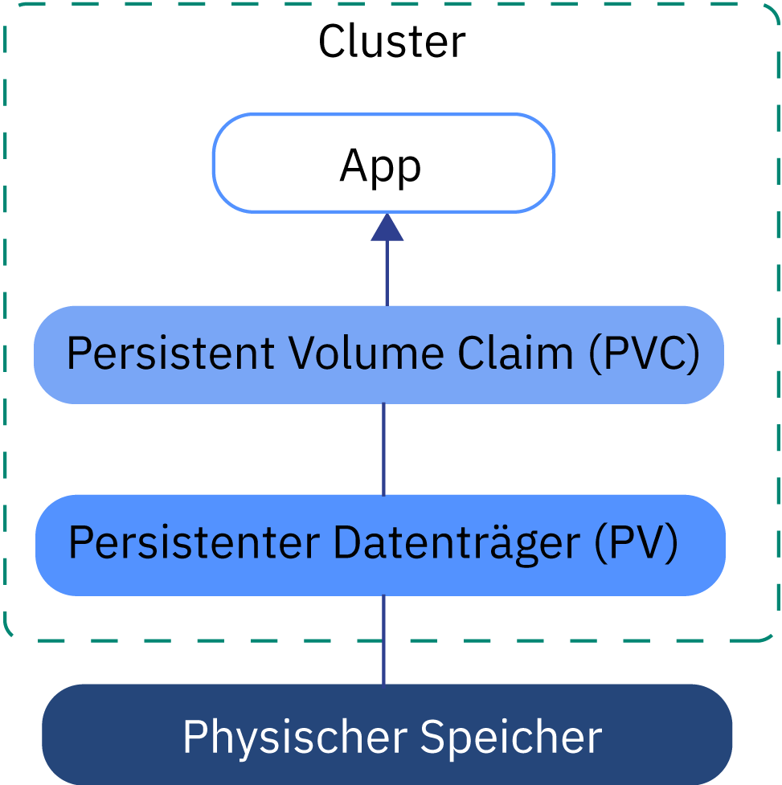
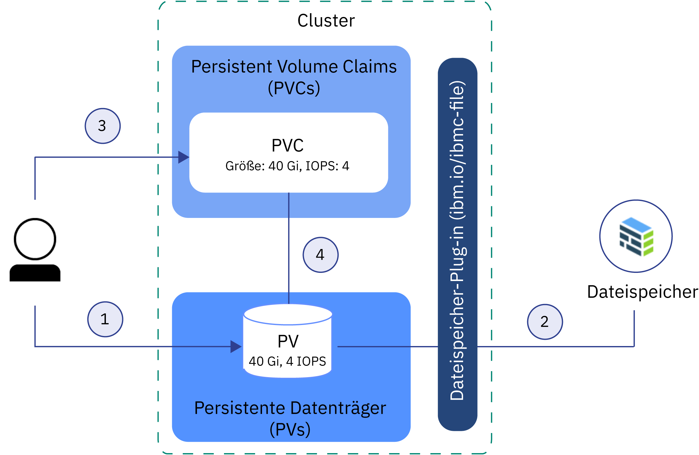

---

copyright:
  years: 2014, 2018
lastupdated: "2018-09-10"

---

{:new_window: target="_blank"}
{:shortdesc: .shortdesc}
{:screen: .screen}
{:pre: .pre}
{:table: .aria-labeledby="caption"}
{:codeblock: .codeblock}
{:tip: .tip}
{:download: .download}


# Erklärung der grundlegenden Voraussetzungen für Kubernetes-Speicher
{: #kube_concepts}

## Persistente Datenträger und Anforderungen nach persistenten Datenträgern (Persistent Volume Claim)
{: #pvc_pv}

Vor der Bereitstellung von Speicher ist es wichtig, die Kubernetes-Konzepte 'Persistent Volume (PV)' (persistenter Datenträger) und 'Persistent Volume Claim (PVC)' (Anforderung nach persistentem Datenträger) sowie deren Zusammenwirken in einem Cluster zu verstehen. 
{: shortdesc}

Die folgende Abbildung zeigt die Speicherkomponenten in einem Kubernetes-Cluster. 



- **Cluster**</br> Standardmäßig ist jedes Cluster mit einem Plug-in zur [Bereitstellung von Dateispeicher](cs_storage_file.html#add_file) eingerichtet. Sie können auch auswählen, weitere Add-ons zu installieren, wie z. B. das Add-on für [Blockspeicher](cs_storage_block.html). Zum Verwenden von Speicher in einem Cluster müssen Sie eine Anforderung nach einem persistenten Datenträger (Persistent Volume Claim), einen persistenten Datenträger und eine physische Speicherinstanz erstellen. Beim Löschen des Clusters haben Sie die Option, zugehörige Speicherinstanzen zu löschen.
- **App**</br> Um Lese- und Schreibvorgänge für Ihre Speicherinstanz auszuführen, müssen Sie den Persistent Volume Claim (PVC) an Ihre App anhängen. Die Lese-/Schreibregeln unterscheiden sich je nach Speichertyp. Sie können z. B. mehrere Pods an dieselben PVC anhängen, mit dem Dateispeicher angefordert wird. Der Blockspeicher wird mit dem RWO-Zugriffsmodus (ReadWriteOnce) geliefert, sodass Sie den Speicher nur an einen Pod anhängen können. 
- **Persistent Volume Claim (PVC)** </br> Ein PVC ist die Anforderung, persistenten Speicher mit einem bestimmten Typ und einer bestimmten Konfiguration bereitzustellen. Verwenden Sie die [Kubernetes-Speicherklassen](#storageclasses), um den von Ihnen gewünschten Typ von persistentem Datenträger anzugeben. Der Clusteradministrator kann Speicherklassen definieren oder Sie können eine der in {{site.data.keyword.containerlong_notm}} vordefinierten Speicherklassen auswählen. Nachdem Sie einen PVC erstellt haben, wird dieser an den {{site.data.keyword.Bluemix}} Storage Provider gesendet. Abhängig von der in der Speicherklasse definierten Konfiguration wird die physische Speichereinheit bestellt und in Ihrem Konto der IBM Cloud-Infrastruktur (SoftLayer) bereitgestellt. Wenn die angeforderte Konfiguration nicht vorhanden ist, wird der Speicher nicht erstellt. 
- **Persistent Volume (PV)** </br> Ein Persistent Volume (persistenter Datenträger) ist eine virtuelle Speicherinstanz, die dem Cluster als Datenträger hinzugefügt wird. Der persistente Datenträger verweist auf eine physische Speichereinheit, die sich in Ihrem Konto der IBM Cloud-Infrastruktur (SoftLayer) befindet, und abstrahiert die API, die für die Kommunikation mit der Speichereinheit verwendet wird. Zum Anhängen eines persistenten Datenträgers (PV) an eine App müssen Sie über einen entsprechenden PVC (Persistent Volume Claim) verfügen. Angehängte PVs werden im Dateisystem des Containers als Ordner angezeigt. 
- **Physischer Speicher** </br> Eine physische Speicherinstanz, die Sie verwenden können, um Ihre Daten als persistent zu definieren. {{site.data.keyword.containerlong_notm}} bietet Hochverfügbarkeit für physische Speicherinstanzen. In einer physischen Speicherinstanz gespeicherte Daten, werden jedoch nicht automatisch gesichert. Abhängig vom verwendeten Speichertyp gibt es verschiedene Methoden, um Sicherungs- und Wiederherstellungslösungen festzulegen. 

Weitere Informationen zur Vorgehensweise beim Erstellen und Verwenden von PVCs, PVs und der physischen Speichereinheit finden Sie unter: 
- [Dynamische Bereitstellung](#dynamic_provisioning)
- [Statische Bereitstellung](#static_provisioning) 

## Dynamische Bereitstellung
{: #dynamic_provisioning}

Verwenden Sie die dynamische Bereitstellung, wenn Sie Entwicklern die Entscheidung überlassen wollen, wann Speicher bereitgestellt werden soll. 
{: shortdesc}

**Wie funktioniert das?**</br>

Bei der dynamischen Bereitstellung handelt es sich um eine Funktion, die für Kubernetes nativ ist und die es einem Clusterentwickler ermöglicht, Speicher mit einem vordefinierten Typ und einer vordefinierten Konfiguration zu bestellen, ohne alle Details darüber zu kennen, wie die physische Speichereinheit bereitgestellt wird. Um die Details zu dem bestimmten Speichertyp zusammenzufassen, muss der Clusteradministrator [Speicherklassen](#storageclasses) definieren, die der Entwickler verwenden kann, oder der Entwickler muss die Speicherklassen verwenden, die mit {{site.data.keyword.Bluemix}}-Speicher-Plug-ins bereitgestellt werden.

Um den Speicher zu bestellen, müssen Sie einen PVC erstellen. Der PVC bestimmt die Spezifikation für den Speicher, den Sie bereitstellen möchten. Nachdem der PVC erstellt wurde, werden die Speichereinheit und der PV automatisch für Sie erstellt.  

Die folgende Abbildung zeigt, wie Dateispeicher in einem Cluster dynamisch bereitgestellt wird. Dieser Beispielablauf funktioniert ähnlich auch mit anderen Speichertypen, wie z. B. Blockspeicher. 

**Beispielablauf für die dynamische Bereitstellung von Dateispeicher mit der vordefinierten Speicherklasse 'silver'**


1. Der Benutzer erstellt einen Persistent Volume Claim (PVC), der den Speichertyp, die Speicherklasse, die Größe in Gigabyte, die Anzahl der E/A-Operationen pro Sekunde und den Abrechnungstyp angibt. Die Speicherklasse bestimmt den Typ des bereitgestellten Speichers und die zulässigen Bereiche für Größe und E/A-Operationen pro Sekunde. Wenn Sie einen PVC in einem Cluster erstellen, wird das Speicher-Plug-in für den angeforderten Typ von Speicher automatisch ausgelöst, um Speicher mit der angegebenen Spezifikation bereitzustellen. 
2. Die Speichereinheit wird automatisch bestellt und in Ihrem Konto der IBM Cloud-Infrastruktur (SoftLayer) bereitgestellt. Der Abrechnungszyklus für Ihre Speichereinheit wird gestartet. 
3. Das Speicher-Plug-in erstellt automatisch einen persistenten Datenträger (PV) im Cluster, eine virtuelle Speichereinheit, die auf die tatsächliche Speichereinheit in Ihrem Konto der IBM Cloud-Infrastruktur (SoftLayer) verweist. 
4. Der Persistent Volume Claim und der persistente Datenträger werden automatisch miteinander verbunden. Der Status des PVC und des persistenten Datenträgers ändert sich in `Bound`. Sie können den PVC jetzt verwenden, um persistenten Speicher an Ihre App anzuhängen. Wenn Sie den PVC löschen, wird der persistente Datenträger und die zugehörige Speicherinstanz auch gelöscht. </br>

**In welchen Fällen verwende ich die dynamische Bereitstellung?**</br>

Sehen Sie sich folgende allgemeine Anwendungsfälle für die dynamische Bereitstellung an: 
1. **Bereitstellung von Speicher bei Bedarf:** Anstatt einen persistenten Speicher für Entwickler bereitzustellen und für Speicher zu zahlen, der nicht verwendet wird, können Sie Entwicklern die Entscheidung überlassen, wann Speicher bereitgestellt werden soll. Um den Typ des Speichers zu festzulegen, den der Entwickler bereitstellen kann, können Sie [Speicherklassen](#storageclasses) definieren. 
2. **Automatisierte Erstellung von PVCs, persistenten Datenträgern und Speichereinheiten:** Sie möchten Speicher automatisch bereitstellen und die Bereitstellung aufheben, ohne dass ein Clusteradministrator manuell eingreifen muss. 
3. **Häufiges Erstellen und Löschen von Speicher:** Sie haben einen App oder Sie richten eine Continuous-Delivery-Pipeline ein, die persistenten Speicher regelmäßig erstellt und löscht. Persistenter Speicher, der mit einer Speicherklasse ohne 'retain' bereitgestellt wird, kann durch Löschen des PVC entfernt werden. 

Weitere Informationen zur Vorgehensweise beim dynamischen Bereitstellen von persistentem Speicher finden Sie im Folgenden: 
- [File Storage](cs_storage_file.html#add_file)
- [Block Storage](cs_storage_block.html#add_block)

## Statische Bereitstellung
{: #static_provisioning}

Wenn Sie über eine vorhandene persistente Speichereinheit in Ihrem Konto der IBM Cloud-Infrastruktur (SoftLayer) verfügen, können Sie die Speicherinstanz mithilfe der statischen Bereitstellung für Ihren Cluster verfügbar machen. 
{: shortdesc}

**Wie funktioniert das?**</br>

Bei der statischen Bereitstellung handelt es sich um eine Funktion, die für Kubernetes nativ ist und die es den Clusteradministratoren ermöglicht, vorhandene Speichereinheiten für einen Cluster verfügbar zu machen. Als Clusteradministrator müssen Sie mit den Details der Speichereinheit, den unterstützten Konfigurationen und den Mountoptionen vertraut sein.  

Um vorhandenen Speicher einem Clusterbenutzer zur Verfügung zu stellen, müssen Sie die Speichereinheit, einen persistenten Datenträger und einen Persistent Volume Claim manuell erstellen.  

Die folgende Abbildung zeigt, wie Dateispeicher in einem Cluster statisch bereitgestellt wird. Dieser Beispielablauf funktioniert ähnlich auch mit anderen Speichertypen, wie z. B. Blockspeicher. 

**Beispielablauf für die statische Bereitstellung von Dateispeicher**



1. Der Clusteradministrator erfasst alle Details zur vorhandenen Speichereinheit und erstellt einen persistenten Datenträger (PV) im Cluster. 
2. Auf der Basis der Speicherdetails im persistenten Datenträger verbindet das Speicher-Plug-in den persistenten Datenträger mit der in Ihrem Konto der IBM Cloud-Infrastruktur (SoftLayer) vorhandenen Speichereinheit. 
3. Der Clusteradministrator oder ein Entwickler erstellt einen PVC. Da der persistente Datenträger und die Speichereinheit bereits vorhanden sind, wird im PVC keine Speicherklasse angegeben. 
4. Nachdem der PVC erstellt wurde, versucht das Speicher-Plug-in, einen vorhandenen persistenten Datenträger zu finden, der mit dem PVC übereinstimmt. Der PVC und der persistente Datenträger stimmen überein, wenn im PVC und dem persistenten Datenträger dieselben Werte für Größe, E/A-Operationen pro Sekunde und Zugriffsmodus verwendet werden. Wenn PVC und persistenter Datenträger übereinstimmen, ändert sich der Status des PVC und des persistenten Datenträgers in `Bound`. Sie können den PVC jetzt verwenden, um persistenten Speicher an Ihre App anzuhängen. Wenn Sie den PVC löschen, werden der persistente Datenträger und die physische Speicherinstanz nicht entfernt. Sie müssen den PVC, den persistenten Datenträger und die physische Speicherinstanz separat voneinander entfernen.  </br>

**In welchen Fällen verwende ich die statische Bereitstellung?**</br>

Sehen Sie sich folgende allgemeine Anwendungsfälle für die statische Bereitstellung von persistentem Speicher an: 
1. **Beibehaltene Daten für den Cluster verfügbar machen:** Sie haben mithilfe der dynamischen Bereitstellung persistenten Speicher mit einer Speicherklasse für die Beibehaltung bereitgestellt. Sie haben den PVC entfernt, aber der persistente Datenträger, die physische Speichereinheit in der IBM Cloud-Infrastruktur (SoftLayer) und die Daten sind weiterhin vorhanden. Sie wollen von einer App in Ihrem Cluster aus auf die beibehaltenen Daten zugreifen. 
2. **Vorhandene Speichereinheit verwenden:** Sie haben persistenten Speicher direkt in Ihrem Konto der IBM Cloud-Infrastruktur (SoftLayer) bereitgestellt und Sie möchten diese Speichereinheit in Ihrem Cluster verwenden. 
3. **Persistenten Speicher clusterübergreifend in derselben Zone verwenden:** Sie haben persistenten Speicher für Ihren Cluster bereitgestellt. Um dieselbe persistente Speicherinstanz mit anderen Clustern gemeinsam zu verwenden, müssen Sie den persistenten Datenträger und den entsprechenden PVC in dem anderen Cluster manuell erstellen. **Anmerkung:** Die gemeinsame Nutzung von persistentem Speicher ist clusterübergreifend nur verfügbar, wenn sich der Cluster und die Speicherinstanz in derselben Zone befinden. 
4. **Persistenten Speicher namensbereichsübergreifend im selben Cluster gemeinsam verwenden:** Sie haben persistenten Speicher in einem Namensbereich Ihres Cluster bereitgestellt. Sie möchten dieselbe Speicherinstanz für einen App-Pod verwenden, der in einem anderen Namensbereich Ihres Clusters bereitgestellt wurde. 

Weitere Informationen zur Vorgehensweise beim statischen Bereitstellen von Speicher finden Sie im Folgenden:
- [File Storage](cs_storage_file.html#predefined_storageclass)
- [Block Storage](cs_storage_block.html#predefined_storageclass)

## Speicherklassen
{: #storageclasses}

Um persistenten Speicher dynamisch bereitzustellen, müssen Sie den Typ und die Konfiguration des gewünschten Speichers definieren. 
{: shortdesc}

Eine Kubernetes-Speicherklasse wird verwendet, um die in {{site.data.keyword.Bluemix_notm}} unterstützte, zugrundeliegende Speicherplattform zusammenzufassen, damit Sie nicht sämtliche Details zu unterstützten Größen, E/A-Operationen pro Sekunde oder Aufbewahrungsrichtlinien kennen müssen, um erfolgreich persistenten Speicher in einem Cluster bereitzustellen. {{site.data.keyword.containerlong_notm}} stellt für jeden unterstützten Speichertyp vordefinierte Speicherklassen bereit. Jede Speicherklasse ist so konzipiert, dass das unterstützte Speichertier zusammengefasst wird, während Sie die Möglichkeit haben, nach Ihren Wünschen Größe, E/A-Operationen pro Sekunde und die Aufbewahrungsrichtlinie festzulegen. 

Informationen zu den vordefinierten Spezifikationen für Speicherklassen finden Sie im Folgenden: 
- [File Storage](cs_storage_file.html#storageclass_reference)
- [Block Storage](cs_storage_block.html#storageclass_reference)

Sie finden nicht das, wonach Sie suchen? Sie können auch eine eigene angepasste Speicherklasse erstellen, um den von Ihnen gewünschten Speichertyp bereitzustellen.
{: tip}

### Speicherklasse anpassen
{: #customized_storageclass}

Wenn Sie keine der bereitgestellten Speicherklassen verwenden können, können Sie Ihre eigene angepasste Speicherklasse erstellen. 
{: shortdesc}

1. Erstellen Sie eine angepasste Speicherklasse. Sie können beginnen, indem Sie eine der vordefinierten Speicherklassen verwenden oder unter den Beispielen für angepasste Speicherklassen wählen. 
   - Vordefinierte Speicherklassen: 
     - [File Storage](cs_storage_file.html#storageclass_reference)
     - [Block Storage](cs_storage_block.html#storageclass_reference)
   - Beispiele für angepasste Speicherklassen: 
     - [File Storage](cs_storage_file.html#custom_storageclass)
     - [Block Storage](cs_storage_block.html#custom_storageclass)
     
2. Erstellen Sie die angepasste Speicherklasse.
   ```
   kubectl apply -f <lokaler_dateipfad>
   ```
   {: pre}

3.  Überprüfen Sie, ob die angepasste Speicherklasse erstellt wurde.
    ```
    kubectl get storageclasses                                                        
    ```
    {: pre}

4. Erstellen Sie einen Persistent Volume Claim (PVC), um mithilfe Ihrer angepassten Speicherklasse Speicher dynamisch bereitzustellen.
   - [File Storage](cs_storage_file.html#add_file)
   - [Block Storage](cs_storage_block.html#add_block)
   
5. Überprüfen Sie, ob Ihr PVC erstellt und an einen persistenten Datenträger gebunden wurde. Dieser Prozess kann einige Minuten dauern. 
   ```
   kubectl get pvc
   ```
   {: pre}
   
### Ändern oder Aktualisieren in eine andere Speicherklasse
{: #update_storageclass}

Wenn Sie persistenten Speicher mithilfe einer Speicherklasse dynamisch bereitstellen, stellen Sie persistenten Speicher mit einer bestimmten Konfiguration bereit, die auch als 'Version' (flavor) bezeichnet wird. Diese Version kann nach der Bereitstellung des Speichers nicht mehr geändert werden. 

Wenn Sie die Größe, die E/A-Operationen pro Sekunde, den Typ oder die Aufbewahrungsrichtlinie für eine Speichereinheit ändern möchten, müssen Sie eine neue Speichereinheit bereitstellen und Ihre Daten aus dem alten Speicher in den neuen Speicher kopieren. 

1. Treffen Sie eine Entscheidung, welche Version des persistenten Speichers Sie bereitstellen möchten.
   - [File Storage](cs_storage_file.html#predefined_storageclass)
   - [Block Storage](cs_storage_block.html#predefined_storageclass)
   
2. Erstellen Sie einen PVC, mit dem Ihr persistenter Speicher bereitgestellt wird. 
   - [File Storage](cs_storage_file.html#add_file)
   - [Block Storage](cs_storage_block.html#add_block)
   
3. Kopieren Sie die Daten aus Ihrer vorhandenen Speichereinheit in Ihre neue Einheit. Jeder Speichertyp verfügt über andere Optionen zum Sichern und Wiederherstellen von Daten. 
   - [File Storage](cs_storage_file.html#backup_restore)
   - [Block Storage](cs_storage_block.html#backup_restore)
   
4. Aktualisieren Sie Ihre App-Bereitstellung, um auf die neue Speichereinheit zu verweisen. 
   1. Rufen Sie den Namen des von Ihnen zuvor erstellten Persistent Volume Claims (PVC) ab. 
      ```
      kubectl get pvc
      ```
      {: pre}
      
   2. Listen Sie die in Ihrem Cluster vorhandenen Bereitstellungen auf. 
      ```
      kubectl get deployments
      ```
      {: pre}
      
   3. Rufen Sie die YAML-Bereitstellungsdatei für die Bereitstellung ab, die die alte persistente Speichereinheit verwendet. 
      ```
      kubectl get deployment <bereitstellungsname> -o yaml
      ```
      {: pre}
      
   4. Ändern Sie den Namen des PVC im Abschnitt `spec.volumes` Ihrer Implementierung.
   5. Wenden Sie die Änderungen auf Ihre Bereitstellung an. Wenn Sie Änderungen anwenden, wird ein neuer Pod erstellt und der PVC, der den persistenten Datenträger bindet, wird an Ihren Pod angehängt. Der Pod, der die alte persistente Speicherinstanz angehängt hat, wird entfernt. 
      ```
      kubectl apply -f deployment.yaml
      ```
      {: pre}
      

## Vorhandenen Speicher mit Kubernetes-Bezeichnungen für die Mehrzonenverwendung vorbereiten
{: #multizone}

Wenn Sie Ihren Cluster von einem Cluster mit einer einzelnen Zone auf einen Mehrzonencluster aktualisiert haben und persistente Datenträger (PVs) bereits vorhanden waren, fügen Sie die Kubernetes-Zone und die Regionsbezeichnungen zu Ihren persistenten Datenträgern hinzu. Durch die Bezeichnungen wird sichergestellt, dass Pods, die diesen Speicher anhängen, in der Zone bereitgestellt werden, in der sich der persistente Speicher befindet.
{:shortdesc}

**Anmerkung:** Diese Schritte sind nur erforderlich, wenn bereits persistente Datenträger vorhanden waren, die vor Verfügbarkeit der Mehrzonenfunktionalität erstellt wurden. Persistente Datenträger, die nach Aktivieren der Mehrzonenfunktionalität erstellt wurden, weisen die Kubernetes-Region und die Zonenbezeichnung bereits auf. 

Verwenden Sie ein Script, um alle persistenten Datenträger in Ihrem Cluster zu suchen und die Kubernetes-Bezeichnungen `failure-domain.beta.kubernetes.io/region` und `failure-domain.beta.kubernetes.io/zone` anzuwenden. Wenn der persistente Datenträger die Bezeichnungen bereits aufweist, überschreibt das Script die vorhandenen Werte nicht.

Vorbemerkungen:
- [Richten Sie die Kubernetes-CLI auf den Cluster aus](cs_cli_install.html#cs_cli_configure).
- Wenn Sie über mehrere VLANs für einen Cluster, mehrere Teilnetze in demselben VLAN oder einen Cluster mit mehreren Zonen verfügen, müssen Sie [VLAN-Spanning](/docs/infrastructure/vlans/vlan-spanning.html#vlan-spanning) für Ihr Konto für die IBM Cloud-Infrastruktur (SoftLayer) aktivieren, damit die Workerknoten in dem privaten Netz miteinander kommunizieren können. Um diese Aktion durchführen zu können, müssen Sie über die [Infrastrukturberechtigung](cs_users.html#infra_access) **Netz > VLAN-Spanning im Netz verwalten** verfügen oder Sie können den Kontoeigner bitte, diese zu aktivieren. Um zu prüfen, ob das VLAN-Spanning bereits aktiviert ist, verwenden Sie den [Befehl](/docs/containers/cs_cli_reference.html#cs_vlan_spanning_get) `ibmcloud ks vlan-spanning-get`. Wenn Sie {{site.data.keyword.BluDirectLink}} verwenden, müssen Sie stattdessen eine [ VRF-Funktion (Virtual Router Function)](/docs/infrastructure/direct-link/subnet-configuration.html#more-about-using-vrf) verwenden. Um VRF zu aktivieren, wenden Sie sich an Ihren Ansprechpartner für die IBM Cloud-Infrastruktur (SoftLayer). 

Gehen Sie wie folgt vor, um vorhandene persistente Datenträger zu aktualisieren:

1.  Wenden Sie die Mehrzonenbezeichnungen auf Ihre persistenten Datenträger an, indem Sie das Script ausführen.  Ersetzen Sie <mycluster> durch den Namen Ihres Clusters. Bestätigen Sie die Aktualisierung Ihrer persistenten Datenträger, wenn Sie dazu aufgefordert werden.

    ```
    bash <(curl -Ls https://raw.githubusercontent.com/IBM-Cloud/kube-samples/master/file-pv-labels/apply_pv_labels.sh) <mycluster>
    ```
    {: pre}

    **Beispielausgabe**:

    ```
    Retrieving cluster storage...
    OK

    Name:			mycluster
    ID:			  myclusterID1234
    State:			normal
    ...
    Addons
    Name                   Enabled
    storage-watcher-pod    true
    basic-ingress-v2       true
    customer-storage-pod   true
    us-south
    kube-config-dal10-storage.yml
    storage.yml
    dal10\n
    The persistent volumes which do not have region and zone labels will be updated with REGION=
    us-south and ZONE=dal10. Are you sure to continue (y/n)?y
    persistentvolume "pvc-ID-123456" labeled
    persistentvolume "pvc-ID-789101" labeled
    ['failure-domain.beta.kubernetes.io/region' already has a value (us-south), and --overwrite is false, 'failure-domain.beta.kubernetes.io/zone' already has a value (dal10), and --overwrite is false]
    ['failure-domain.beta.kubernetes.io/region' already has a value (us-south), and --overwrite is false, 'failure-domain.beta.kubernetes.io/zone' already has a value (dal10), and --overwrite is false]
    \nSuccessfully applied labels to persistent volumes which did not have region and zone labels.
    ```
    {: screen}

2.  Überprüfen Sie, dass die Bezeichnungen auf Ihre persistenten Datenträger angewendet wurden.

    1.  Suchen Sie in der Ausgabe des vorherigen Befehls nach den IDs der persistenten Datenträger, die bezeichnet wurden.

        ```
        persistentvolume "pvc-ID-123456" labeled
        persistentvolume "pvc-ID-789101" labeled
        ```
        {: screen}

    2.  Überprüfen Sie die Regions- und Zonenbezeichnungen für Ihre persistenten Datenträger.

        ```
        kubectl describe pv pvc-ID-123456
        ```
        {: pre}

        **Beispielausgabe**:
        ```
        Name:		pvc-ID-123456
        Labels:		CapacityGb=4
        		Datacenter=dal10
            ...
        		failure-domain.beta.kubernetes.io/region=us-south
        		failure-domain.beta.kubernetes.io/zone=dal10
            ...
        ```
        {: screen}
        
**Womit möchten Sie fortfahren? **

Nachdem Sie Ihre vorhandenen persistenten Datenträger mit einer Bezeichnung versehen haben, können Sie den persistenten Datenträger an Ihren Mehrzonencluster anhängen. Weitere Informationen finden Sie über die folgenden Links. 
- [Vorhandenen NFS-Dateispeicher](cs_storage_file.html#existing_file) verwenden
- [Vorhandenen Blockspeicher](cs_storage_block.html#existing_block) verwenden
