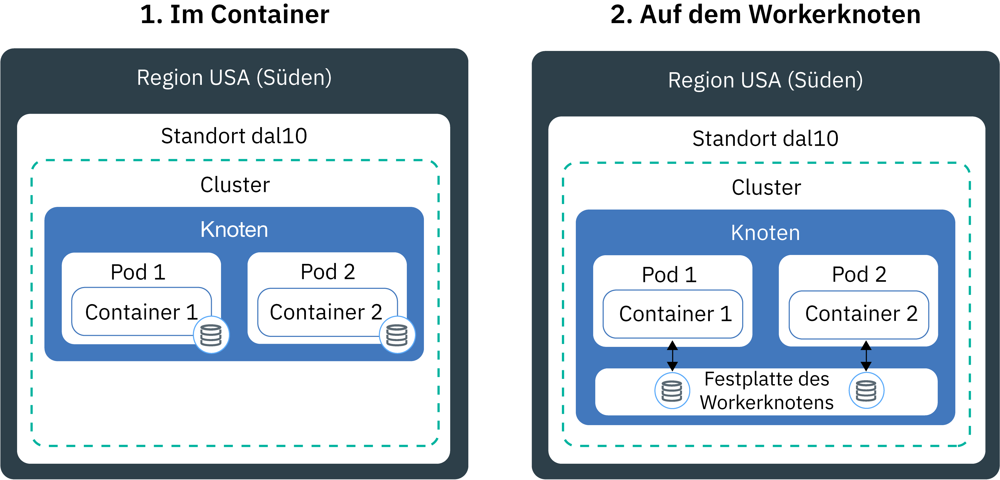
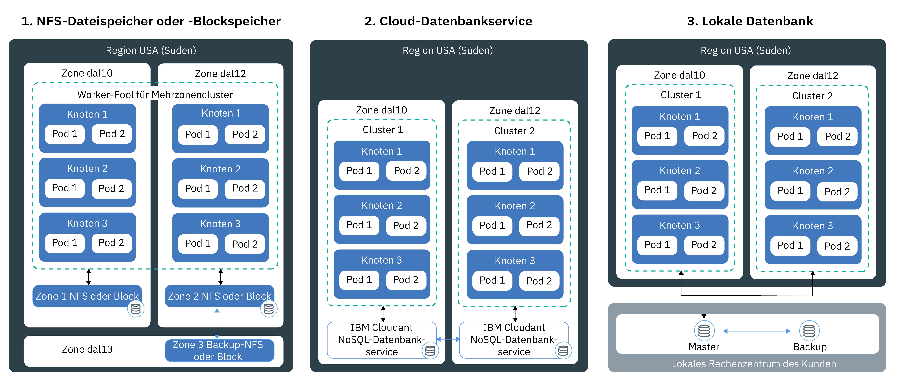

---

copyright:
  years: 2014, 2018
lastupdated: "2018-12-05"

---

{:new_window: target="_blank"}
{:shortdesc: .shortdesc}
{:screen: .screen}
{:pre: .pre}
{:table: .aria-labeledby="caption"}
{:codeblock: .codeblock}
{:tip: .tip}
{:note: .note}
{:important: .important}
{:deprecated: .deprecated}
{:download: .download}

# Persistenten Hochverfügbarkeitsspeicher planen
{: #storage_planning}

## Speicherlösung wählen
{: #choose_storage_solution}

Bevor Sie entscheiden können, welcher Speichertyp die richtige Lösung für Sie ist, müssen Sie die Anforderungen Ihrer App, den Typ der Daten, die gespeichert werden sollen, und die erforderliche Zugriffshäufigkeit auf diese Daten kennen.
{: shortdesc}

1. Entscheiden Sie, ob Ihre Daten dauerhaft gespeichert werden müssen oder ob sie bei Bedarf entfernt werden können.
   - **Persistenter Speicher:** Ihre Daten müssen auch dann verfügbar sein, wenn der Container, der Workerknoten oder der Cluster entfernt wurde. Verwenden Sie persistenten Speicher in den folgenden Szenarios:
       - Statusabhängige Apps
       - Kerngeschäftsdaten
       - Daten, die aufgrund gesetzlicher Bestimmungen zugänglich sein müssen (z. B. eine definierte Aufbewahrungsfrist)
       - Auditing
       - Daten, bei denen Zugriff und Nutzung über verschiedene App-Instanzen hinweg möglich sein muss
   - **Nicht persistenter Speicher:** Ihre Daten können entfernt werden, wenn der Container, der Workerknoten oder der Cluster entfernt wird. Nicht persistenter Speicher wird normalerweise zum Protokollieren von Informationen (z. B. für Systemprotokolle oder Containerprotokolle), für Entwicklungstests oder für den Zugriff auf Daten aus dem Dateisystem des Hosts verwendet. Eine Übersicht über verfügbare nicht persistente Speicheroptionen finden Sie im Abschnitt [Vergleich nicht persistenter Speicheroptionen](#non_persistent_overview).

2. Wenn Sie Ihre Daten persistent speichern müssen, untersuchen Sie, ob Ihre App einen bestimmten Speichertyp erfordert. Wenn Sie eine vorhandene App verwenden, ist die App möglicherweise so konzipiert, dass die Daten auf eine der folgenden Arten gespeichert werden:  
   - **In einem Dateisystem:** Die Daten können als Datei in einem Verzeichnis gespeichert werden. Sie können die Datei z. B. auf der lokalen Festplatte speichern. Manche Apps setzen voraus, dass die Daten in einem bestimmten Dateisystem gespeichert werden (z. B. `nfs` oder `ext4`), um den Datenspeicher zu optimieren und Leistungsziele zu erreichen.
   - **In einer Datenbank:** Die Daten müssen in einer Datenbank gespeichert werden, die einem bestimmten Schema entspricht. Verschiedene Apps sind mit einer Datenbankschnittstelle ausgestattet, die Sie zum Speichern Ihrer Daten verwenden können. WordPress ist zum Beispiel dafür optimiert, dass Daten in einer MySQL-Datenbank gespeichert werden. In diesen Fällen wird der Typ des Speichers für Sie ausgewählt.

3. Wenn Ihre App nicht auf einen bestimmten Speichertyp festgelegt ist, bestimmen Sie den Typ der Daten, die gespeichert werden sollen.
   - **Strukturierte Daten:** Daten, die Sie in einer relationalen Datenbank speichern können, in der Sie über eine Tabelle mit Spalten und Zeilen verfügen. Daten in Tabellen können mithilfe von Schlüsseln verbunden werden und sind in der Regel aufgrund des vordefinierten Datenmodells leicht zugänglich. Beispiele sind Telefonnummern, Kontonummern, Sozialversicherungsnummern oder Postleitzahlen.
   - **Teilweise strukturierte Daten:** Daten, die nicht in einer relationalen Datenbank enthalten sein können, die jedoch Organisationskriterien aufweisen, die Sie zum einfacheren Lesen und Analysieren dieser Daten verwenden können. Beispiele sind Dateien von Markup-Sprachen wie CSV, XML oder JSON.  
   - **Unstrukturierte Daten:** Daten, die keinem Organisationsmuster folgen und so komplex sind, dass Sie sie nicht in einer relationalen Datenbank mit vordefinierten Datenmodellen speichern können. Um auf diese Daten zugreifen zu können, benötigen Sie erweiterte Tools und Software. Beispiele sind E-Mail-Nachrichten, Videos, Fotos, Audiodateien, Präsentationen, Social-Media-Daten oder Webseiten.

   Wenn Sie über strukturierte und unstrukturierte Daten verfügen, versuchen Sie, jeden dieser Datentyp separat in einer separaten Speicherlösung zu speichern, die für den jeweiligen Datentyp konzipiert wurde. Die Verwendung einer geeigneten Speicherlösung für Ihren Datentyp erleichtert Ihnen den Zugriff auf Ihre Daten und ermöglicht bessere Leistung, Skalierbarkeit, Permanenz und Konsistenz.
   {: tip}

4. Analysieren Sie, wie Sie auf Ihre Daten zugreifen möchten. Speicherlösungen werden in der Regel zur Unterstützung von Lese- oder Schreiboperationen konzipiert und optimiert.  
   - **Lesezugriff:** Ihre Daten können nur gelesen werden. Sie möchten die Daten nicht schreiben oder ändern.
   - **Lese-/Schreibzugriff:** Sie möchten die Daten lesen, schreiben und ändern. Für Daten, die gelesen und geschrieben werden, ist es wichtig zu wissen, ob die Operationen leseintensiv, schreibintensiv oder ausgeglichen sind.

4. Bestimmen Sie die Häufigkeit, mit der auf Ihre Daten zugegriffen wird. Wenn die Häufigkeit des Datenzugriffs bekannt ist, kann die erforderliche Speicherleistung ermittelt werden. Daten, auf die häufig zugegriffen wird, befinden sich in der Regel im Schnellzugriffsspeicher.
   - **Hot Data:** Daten, auf die häufig zugegriffen wird. Gängige Anwendungsfälle sind Web-Apps oder Mobile Apps.
   - **Cool Data oder Warm Data:** Daten, auf die selten zugegriffen wird, z. B. einmal im Monat oder seltener. Gängige Anwendungsfälle sind Archive, kurzfristige Datenaufbewahrung oder Disaster-Recovery.
   - **Cold Data:** Daten, auf die selten zugegriffen wird (wenn überhaupt). Gängige Anwendungsfälle sind Archive, langfristige Sicherung, Langzeitdaten.
   - **Frozen Data:** Daten, auf die nicht zugegriffen wird und die Sie nur aus rechtlichen Gründen aufbewahren müssen.

   Wenn Sie die Häufigkeit nicht vorhersagen können oder wenn die Häufigkeit keinem bestimmten Muster folgt, ermitteln Sie, ob Ihre Workloads leseintensiv, schreibintensiv oder ausgeglichen sind. Sehen Sie sich dann die Speicheroption an, die Ihrer Workload entspricht, und untersuchen Sie, welche Speicherschicht (Storage Tier) Ihnen die erforderliche Flexibilität bietet. {{site.data.keyword.cos_full_notm}} bietet beispielsweise eine Speicherklasse `flex`, die berücksichtigt, wie häufig in einem Monat auf Daten zugegriffen wird, und optimiert die monatliche Abrechnung auf der Basis dieser Messung.
   {: tip}

5. Untersuchen Sie, ob Ihre Daten über mehrere App-Instanzen, Zonen oder Regionen hinweg gemeinsam genutzt werden müssen.
   - **Zugriff über mehrere Pods hinweg:** Wenn Sie persistente Kubernetes-Datenträger für den Zugriff auf Ihren Speicher verwenden, können Sie die Anzahl der Pods bestimmen, die den Datenträger gleichzeitig anhängen können. Bestimmte Speicherlösungen - wie z. B. Blockspeicher - können jeweils nur von einem Pod gleichzeitig aufgerufen werden. Bei anderen Speicherlösungen können Sie denselben Datenträger über mehrere Pods hinweg gemeinsam nutzen.
   - **Zugriff über mehrere Zonen und Regionen hinweg:** Möglicherweise müssen Sie Ihre Daten über mehrere Zonen oder Regionen hinweg zugänglich machen. Bestimmte Speicherlösungen - z. B. Datei- und Blockspeicher - sind spezifisch für Rechenzentren und können in einer Mehrzonenclusterkonfiguration nicht über mehrere Zonen hinweg gemeinsam genutzt werden.
   
   Wenn Sie Ihre Daten zonen- oder regionsübergreifend zugänglich machen möchten, sollten Sie Ihre Rechtsabteilung zu Rate ziehen, um sicherzustellen, dass Ihre Daten in mehreren Zonen oder einem anderen Land gespeichert werden können. 
   {: note}

6. Prüfen Sie andere Speichermerkmale, die Ihre Wahl beeinflussen.
   - **Konsistenz:** Die Zuverlässigkeit, dass eine Leseoperation die neueste Version einer Datei zurückgibt. Speicherlösungen bieten `starke Konsistenz`, wenn sichergestellt ist, dass immer die neueste Version einer Datei zurückgegeben wird, oder `schwache Konsistenz`, wenn die Leseoperation nicht unbedingt die neueste Version zurückgibt. Häufig findet sich die schwache Konsistenz bei geografisch verteilten Systemen, in denen eine Schreiboperation zuerst repliziert werden muss.
   - **Leistung:** Die Zeit, die benötigt wird, um eine Lese- oder Schreiboperation auszuführen.
   - **Permanenz:** Die Zuverlässigkeit, dass eine Schreiboperation, die für Ihren Speicher festgeschrieben wurde, dauerhaft erhalten bleibt und nicht beschädigt wird oder verloren geht, selbst wenn sehr große Datenmengen (Gigabytes oder Terabytes) gleichzeitig in den Speicher geschrieben werden.
   - **Ausfallsicherheit:** Die Fähigkeit zur Wiederherstellung nach einem Ausfall und zur Fortsetzung der Operationen, auch wenn eine Hardware- oder Softwarekomponente fehlgeschlagen ist. Zum Beispiel, wenn Ihr physischer Speicher von einem Stromausfall, einem Netzausfall oder einer Naturkatastrophe betroffen ist.
   - **Verfügbarkeit:** Die Möglichkeit, den Zugriff auf Ihre Daten bereitzustellen, auch wenn ein Rechenzentrum oder eine Region nicht verfügbar ist. Die Verfügbarkeit Ihrer Daten wird in der Regel durch das Hinzufügen von Redundanz und die Einrichtung von Failover-Mechanismen erreicht.
   - **Skalierbarkeit:** Die Fähigkeit, die Kapazität zu erweitern und die Leistung auf der Basis Ihrer Anforderungen anzupassen.
   - **Verschlüsselung:** Das Maskieren von Daten, um eine Einsicht durch unbefugte Benutzer zu verhindern.

7. [Prüfen Sie die verfügbaren persistenten Speicherlösungen](#persistent_storage_overview) und wählen Sie die Lösung aus, die am besten für Ihre App- und Datenanforderungen geeignet ist.

## Vergleich nicht persistenter Speicheroptionen
{: #non_persistent_overview}

Sie können nicht persistente Speicheroptionen verwenden, wenn Ihre Daten nicht permanent gespeichert werden müssen oder wenn Sie einen Komponententest Ihrer App durchführen möchten.
{: shortdesc}

Die folgende Abbildung zeigt die verfügbaren Optionen für nicht persistente Datenspeicherung in {{site.data.keyword.containerlong_notm}}. Diese Optionen stehen für kostenlose Cluster und für Standardcluster zur Verfügung.

<table>
<thead>
<th style="text-align:left">Merkmale</th>
<th style="text-align:left">Innerhalb des Containers</th>
<th style="text-align:left">Auf der primären oder sekundären Platte des Workerknotens</th>
</thead>
<tbody>
<tr>
<td style="text-align:left">Mehrzonenfähig</td>
<td style="text-align:left">Nein</td>
<td style="text-align:left">Nein</td>
</tr>
<tr>
<td style="text-align:left">Datentypen</td>
<td style="text-align:left">Alle</td>
<td style="text-align:left">Alle</td>
</tr>
<tr>
<td style="text-align:left">Kapazität</td>
<td style="text-align:left">Begrenzt auf die verfügbare Sekundärplatte des Workerknotens. Orientieren Sie sich an den Ressourcenanforderungen und -begrenzungen für [ephemeren Speicher](https://kubernetes.io/docs/concepts/configuration/manage-compute-resources-container/#local-ephemeral-storage), um die Menge des sekundären Speichers zu begrenzen, der von Ihrem Pod genutzt wird.</td>
<td style="text-align:left">Begrenzt auf den verfügbaren Speicherplatz des Workerknotens auf der primären Platte (hostPath) oder der sekundären Platte (leemptyDir). Orientieren Sie sich an den Ressourcenanforderungen und -begrenzungen für [ephemeren Speicher](https://kubernetes.io/docs/concepts/configuration/manage-compute-resources-container/#local-ephemeral-storage), um die Menge des sekundären Speichers zu begrenzen, der von Ihrem Pod genutzt wird.</td>
</tr>
<tr>
<td style="text-align:left">Datenzugriffsmuster</td>
<td style="text-align:left">Lese- und Schreiboperationen mit beliebiger Häufigkeit</td>
<td style="text-align:left">Lese- und Schreiboperationen mit beliebiger Häufigkeit</td>
</tr>
<tr>
<td style="text-align:left">Zugriff</td>
<td style="text-align:left">Über das lokale Dateisystem des Containers</td>
<td style="text-align:left"><ul style="margin:0px 0px 0px 20px; padding:0px"><li style="margin:0px; padding:0px">Über [Kubernetes-<code>hostPath</code>-Datenträger ](https://kubernetes.io/docs/concepts/storage/volumes/#hostpath) für den Zugriff auf den primären Speicher eines Workerknotens. </li><li style="margin:0px; padding:0px">Über [Kubernetes-<code>emptyDir</code>-Datenträger ](https://kubernetes.io/docs/concepts/storage/volumes/#emptydir) für den Zugriff auf den sekundären Speicher eines Workerknotens.</li></ul></td>
</tr>
<tr>
<td style="text-align:left">Leistung</td>
<td style="text-align:left">Hoch</td>
<td style="text-align:left">Hoch mit geringer Latenz bei Verwendung von SSD</td>
</tr>
<tr>
<td style="text-align:left">Konsistenz</td>
<td style="text-align:left">Stark</td>
<td style="text-align:left">Stark</td>
</tr>
<tr>
<td style="text-align:left">Ausfallsicherheit</td>
<td style="text-align:left">Niedrig</td>
<td style="text-align:left">Niedrig</td>
</tr>
<tr>
<td style="text-align:left">Verfügbarkeit</td>
<td style="text-align:left">Spezifisch für den Container</td>
<td style="text-align:left">Spezifisch für den Workerknoten</td>
</tr>
<tr>
<td style="text-align:left">Skalierbarkeit</td>
<td style="text-align:left">Schwierig zu erweitern, da auf die Kapazität der sekundären Platte des Workerknotens begrenzt</td>
<td style="text-align:left">Schwierig zu erweitern, da auf die Kapazität der primären und sekundären Platte des Workerknotens begrenzt</td>
</tr>
<tr>
<td style="text-align:left">Permanenz</td>
<td style="text-align:left">Die Daten gehen verloren, wenn der Container abstürzt oder entfernt wird. </td>
<td style="text-align:left">Die Daten auf den Datenträgern <code>hostPath</code> oder <code>emptyDir</code> gehen in folgenden Situationen verloren: <ul><li>Der Workerknoten wird gelöscht.</li><li>Der Workerknoten wird neu geladen oder aktualisiert.</li><li>Der Cluster wird gelöscht.</li><li>Das {{site.data.keyword.Bluemix_notm}}-Konto wird ausgesetzt. </li></ul>

Zusätzlich werden Daten auf einem <code>emptyDir</code>-Datenträger in folgenden Situationen entfernt: <ul><li>Der zugewiesene Pod auf dem Workerknoten wird permanent gelöscht.</li><li>Der zugewiesene Pod wird auf einem anderen Workerknoten terminiert.</li></ul>
</tr>
<tr>
<td style="text-align:left">Allgemeine Anwendungsfälle</td>
<td style="text-align:left"><ul style="margin:0px 0px 0px 20px; padding:0px"><li style="margin:0px; padding:0px">Lokaler Image-Cache</li><li style="margin:0px; padding:0px">Containerprotokolle</li></ul></td>
<td style="text-align:left"><ul style="margin:0px 0px 0px 20px; padding:0px"><li style="margin:0px; padding:0px">Lokaler Cache mit hoher Leistung</li><li style="margin:0px; padding:0px">Zugriff auf Dateien vom Dateisystem des Workerknotens</li><li style="margin:0px; padding:0px">Komponententests</li></ul></td>
</tr>
<tr>
<td style="text-align:left">Nicht ideale Anwendungsfälle</td>
<td style="text-align:left"><ul style="margin:0px 0px 0px 20px; padding:0px"><li style="margin:0px; padding:0px">Persistenter Datenspeicher</li><li style="margin:0px; padding:0px">Gemeinsame Datennutzung über mehrere Container hinweg</li></ul></td>
<td style="text-align:left"><ul style="margin:0px 0px 0px 20px; padding:0px"><li style="margin:0px; padding:0px">Persistenter Datenspeicher</li></ul></td>
</tr>
</tbody>
</table>

## Vergleich persistenter Speicheroptionen
{: #persistent_storage_overview}

Sie können persistente Speicheroptionen für beliebige Daten verwenden, und zwar auch dann, wenn der Container, der Workerknoten oder der Cluster entfernt wurde.
{: shortdesc}

Persistente Datenspeicheroptionen sind nur für Standardcluster verfügbar.

Sie möchten Ihren Cluster stattdessen mit einer lokalen Datenbank verbinden? Weitere Informationen hierzu finden Sie im Abschnitt [VPN-Konnektivität zu Ihrem Cluster einrichten](cs_vpn.html#vpn).
{: tip}

Die folgende Abbildung zeigt, mit welchen Optionen Sie Ihre Daten in {{site.data.keyword.containerlong_notm}} permanent speichern und in einem Cluster hoch verfügbar machen können.

<table>
<thead>
<th style="text-align:left">Merkmale</th>
<th style="text-align:left">Datei</th>
<th style="text-align:left">Block</th>
<th style="text-align:left">Objekt</th>
<th style="text-align:left">DBaaS</th>
</thead>
<tbody>
<tr>
<td style="text-align:left">Mehrzonenfähig</td>
<td style="text-align:left">Nein, da spezifisch für ein Rechenzentrum. Daten können nicht in mehreren Zonen gemeinsam genutzt werden, es sei denn, Sie implementieren Ihre eigene Datenreplikation.</td>
<td style="text-align:left">Nein, da spezifisch für ein Rechenzentrum. Daten können nicht in mehreren Zonen gemeinsam genutzt werden, es sei denn, Sie implementieren Ihre eigene Datenreplikation.</td>
<td style="text-align:left">Ja</td>
<td style="text-align:left">Ja</td>
</tr>
<tr>
<td style="text-align:left">Ideale Datentypen</td>
<td style="text-align:left">Alle</td>
<td style="text-align:left">Alle</td>
<td style="text-align:left">Teilweise strukturierte und unstrukturierte Daten</td>
<td style="text-align:left">Abhängig von DBaaS</td>
</tr>
<tr>
<td style="text-align:left">Datennutzungsmuster</td>
<td style="text-align:left"><ul style="margin:0px 0px 0px 20px; padding:0px"><li style="margin:0px; padding:0px">Wahlfreie Lese-/Schreiboperationen</li><li style="margin:0px; padding:0px">Sequenzielle Lese-/Schreiboperationen</li></ul></td>
<td style="text-align:left"><ul style="margin:0px 0px 0px 20px; padding:0px"><li style="margin:0px; padding:0px">Wahlfreie Lese-/Schreiboperationen</li><li style="margin:0px; padding:0px">Schreibintensive Workloads</li></ul></td>
<td style="text-align:left"><ul style="margin:0px 0px 0px 20px; padding:0px"><li style="margin:0px; padding:0px">Leseintensive Workloads</li><li style="margin:0px; padding:0px">Wenige oder keine Schreiboperationen</li></ul></td>
<td style="text-align:left"><ul style="margin:0px 0px 0px 20px; padding:0px"><li style="margin:0px; padding:0px">Lese-/Schreibintensive Workloads</li></ul></td>
</tr>
<tr>
<td style="text-align:left">Zugriff</td>
<td style="text-align:left">Über das Dateisystem auf dem angehängten Datenträger</td>
<td style="text-align:left">Über das Dateisystem auf dem angehängten Datenträger</td>
<td style="text-align:left">Über das Dateisystem auf dem angehängten Datenträger (Plug-in) oder über die REST-API von Ihrer App</td>
<td style="text-align:left">Über die REST-API von Ihrer App</td>
</tr>
<tr>
<td style="text-align:left">Unterstützte Kubernetes-Schreibzugriffe</td>
<td style="text-align:left"><ul style="margin:0px 0px 0px 20px; padding:0px"><li style="margin:0px; padding:0px">ReadWriteMany (RWX)</li><li style="margin:0px; padding:0px"> ReadOnlyMany (ROX)</li><li style="margin:0px; padding:0px">ReadWriteOnce (RWO)</li></ul></td>
<td style="text-align:left"><ul style="margin:0px 0px 0px 20px; padding:0px"><li style="margin:0px; padding:0px">ReadWriteOnce (RWO)</li></ul></td>
<td style="text-align:left"><ul style="margin:0px 0px 0px 20px; padding:0px"><li style="margin:0px; padding:0px">ReadWriteMany (RWX)</li><li style="margin:0px; padding:0px"> ReadOnlyMany (ROX)</li><li style="margin:0px; padding:0px">ReadWriteOnce (RWO)</li></ul></td>
<td style="text-align:left"><ul style="margin:0px 0px 0px 20px; padding:0px"><li style="margin:0px; padding:0px">Nicht zutreffend, da der Zugriff direkt von der App erfolgt</li></ul></td>
</tr>
<tr>
<td style="text-align:left">Leistung</td>
<td style="text-align:left">Vorhersehbar aufgrund zugeordneter IOPS und Größe. IOPS werden von den Pods gemeinsam genutzt, die auf den Datenträger zugreifen.</td>
<td style="text-align:left">Vorhersehbar aufgrund zugeordneter IOPS und Größe. IOPS werden von den Pods nicht gemeinsam genutzt. </td>
<td style="text-align:left">Hoch für Leseoperationen. Nicht vorhersehbar für Schreiboperationen.</td>
<td style="text-align:left">Hoch (bei Bereitstellung in demselben Rechenzentrum wie Ihre App).</td>
</tr>
<tr>
<td style="text-align:left">Konsistenz</td>
<td style="text-align:left">Stark</td>
<td style="text-align:left">Stark</td>
<td style="text-align:left">Schwach</td>
<td style="text-align:left">Abhängig von DBaaS</td>
</tr>
<tr>
<td style="text-align:left">Permanenz</td>
<td style="text-align:left">Hoch</td>
<td style="text-align:left">Hoch</td>
<td style="text-align:left">Sehr hoch, wenn Datenausschnitte über einen Cluster der Speicherknoten verteilt sind. Auf jedem Knoten ist nur ein Teil der Daten gespeichert. </td>
<td style="text-align:left">Hoch</td>
</tr>
<tr>
<td style="text-align:left">Ausfallsicherheit</td>
<td style="text-align:left">Mittel, da spezifisch für ein Rechenzentrum. Dateispeicher auf von IBM in Gruppen zusammengefassten Servern mit redundanter Vernetzung.</td>
<td style="text-align:left">Mittel, da spezifisch für ein Rechenzentrum. Blockspeicher auf von IBM in Gruppen zusammengefassten Servern mit redundanter Vernetzung.</td>
<td style="text-align:left">Hoch, da Datenausschnitte auf drei Zonen oder Regionen verteilt sind. Mittel, wenn sich die Daten in nur einer einzigen Zone befinden.</td>
<td style="text-align:left">Abhängig von DBaaS und Ihrer Konfiguration. </td>
</tr>
<tr>
<td style="text-align:left">Verfügbarkeit</td>
<td style="text-align:left">Mittel, da spezifisch für ein Rechenzentrum.</td>
<td style="text-align:left">Mittel, da spezifisch für ein Rechenzentrum.</td>
<td style="text-align:left">Hoch aufgrund der Verteilung über Zonen oder Regionen. </td>
<td style="text-align:left">Hoch, wenn Sie mehrere Instanzen einrichten. </td>
</tr>
<tr>
<td style="text-align:left">Skalierbarkeit</td>
<td style="text-align:left">Schwierig über das Rechenzentrum hinaus zu erweitern. Sie können eine vorhandene Speicherschicht (Storage Tier) nicht ändern. </td>
<td style="text-align:left">Schwierig über das Rechenzentrum hinaus zu erweitern. Sie können eine vorhandene Speicherschicht (Storage Tier) nicht ändern.</td>
<td style="text-align:left">Einfach zu skalieren.</td>
<td style="text-align:left">Einfach zu skalieren.</td>
</tr>
<tr>
<td style="text-align:left">Verschlüsselung</td>
<td style="text-align:left">Ruhende Daten</td>
<td style="text-align:left">Ruhende Daten</td>
<td style="text-align:left">Bei Übertragung und ruhende Daten</td>
<td style="text-align:left">Ruhende Daten</td>
</tr>
<tr>
<td style="text-align:left">Allgemeine Anwendungsfälle</td>
<td style="text-align:left"><ul style="margin:0px 0px 0px 20px; padding:0px"><li style="margin:0px; padding:0px">Massen- oder Einzeldateispeicher</li><li style="margin:0px; padding:0px">Gemeinsame Dateinutzung in Einzelzonencluster</li></ul></td>
<td style="text-align:left"><ul style="margin:0px 0px 0px 20px; padding:0px"><li style="margin:0px; padding:0px">Statusabhängige Gruppen</li><li style="margin:0px; padding:0px">Sicherungsspeicher, wenn Sie ein eigene Datenbank ausführen</li><li style="margin:0px; padding:0px">Hochleistungszugriff für einzelne Pods</li></ul></td>
<td style="text-align:left"><ul style="margin:0px 0px 0px 20px; padding:0px"><li style="margin:0px; padding:0px">Mehrzonencluster</li><li style="margin:0px; padding:0px">Geografisch verteilte Daten</li><li style="margin:0px; padding:0px">Statische 'Big Data'</li><li style="margin:0px; padding:0px">Statische Multimediainhalte</li><li style="margin:0px; padding:0px">Web-Apps</li><li style="margin:0px; padding:0px">Sicherungen</li><li style="margin:0px; padding:0px">Archive</li></ul></td>
<td style="text-align:left"><ul style="margin:0px 0px 0px 20px; padding:0px"><li style="margin:0px; padding:0px">Mehrzonencluster</li><li style="margin:0px; padding:0px">Relationale und nicht relationale Datenbanken</li><li style="margin:0px; padding:0px">Geografisch verteilte Daten</li></ul></td>
</tr>
<tr>
<td style="text-align:left">Nicht ideale Anwendungsfälle</td>
<td style="text-align:left"><ul style="margin:0px 0px 0px 20px; padding:0px"><li style="margin:0px; padding:0px">Mehrzonencluster</li><li style="margin:0px; padding:0px">Geografisch verteilte Daten</li></ul></td>
<td style="text-align:left"><ul style="margin:0px 0px 0px 20px; padding:0px"><li style="margin:0px; padding:0px">Mehrzonencluster</li><li style="margin:0px; padding:0px">Geografisch verteilte Daten</li><li style="margin:0px; padding:0px">Gemeinsame Datennutzung über mehrere App-Instanzen hinweg</li></ul></td>
<td style="text-align:left"><ul style="margin:0px 0px 0px 20px; padding:0px"><li style="margin:0px; padding:0px">Schreibintensive Workloads</li><li style="margin:0px; padding:0px">Wahlfreie Schreiboperationen</li><li style="margin:0px; padding:0px">Inkrementelle Datenaktualisierungen</li><li style="margin:0px; padding:0px">Transaktionsdatenbanken</li></ul></td>
<td style="text-align:left"><ul style="margin:0px 0px 0px 20px; padding:0px"><li style="margin:0px; padding:0px">App, die für das Schreiben in ein Dateisystem konzipiert wurde</li></ul></td>
</tr>
</tbody>
</table>

