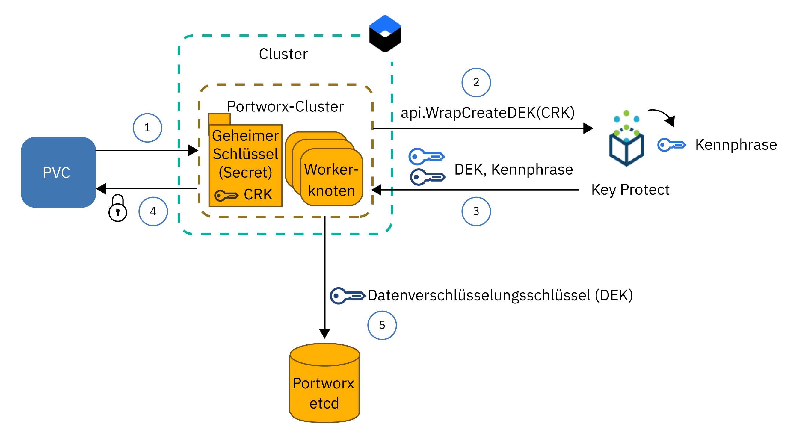
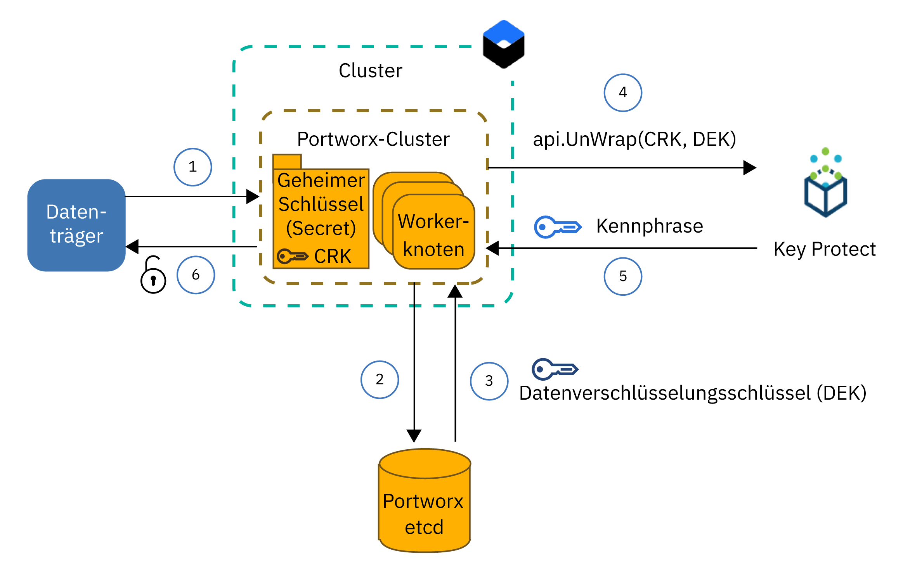

---

copyright:
  years: 2014, 2019
lastupdated: "2019-04-04"

keywords: kubernetes, iks, local persistent storage

subcollection: containers

---

{:new_window: target="_blank"}
{:shortdesc: .shortdesc}
{:screen: .screen}
{:pre: .pre}
{:table: .aria-labeledby="caption"}
{:codeblock: .codeblock}
{:tip: .tip}
{:note: .note}
{:important: .important}
{:deprecated: .deprecated}
{:download: .download}


# Daten in softwaredefiniertem Speicher (SDS) mit Portworx speichern
{: #portworx}

[Portworx ](https://portworx.com/products/introduction/) ist eine Lösung für hoch verfügbaren, durch Software definierten Speicher, die Sie zur Verwaltung von persistentem Speicher für Ihre containerisierten Datenbanken und andere statusabhängigen Apps oder zur zonenübergreifenden gemeinsamen Nutzung von Daten zwischen Pods einsetzen können.
{: shortdesc}

**Was ist softwaredefinierter Speicher (SDS)?** </br>
Eine SDS-Lösung (SDS - Software-Defined Storage) fasst Speichereinheiten verschiedener Typen, Größen und Hersteller zusammen, die den Workerknoten in Ihrem Cluster zugeordnet sind. Workerknoten mit verfügbarem Speicher auf Festplatten werden einem Speichercluster als Knoten hinzugefügt. In diesem Cluster wird der physische Speicher virtualisiert und für den Benutzer als virtueller Speicherpool dargestellt. Der Speichercluster wird durch die SDS-Software verwaltet. Wenn Daten auf dem Speichercluster gespeichert werden müssen, entscheidet die SDS-Software, wo die Daten zwecks höchster Verfügbarkeit zu speichern sind. Ihr virtueller Speicher wird mit einer allgemeinen Gruppe von Funktionen und Services bereitgestellt, die Sie nutzen können, ohne sich um die eigentliche Speicherarchitektur, die ihnen zugrunde liegt, kümmern zu müssen.

**Wie funktioniert Portworx?** </br>
Portworx fasst verfügbaren Speicher, der Ihren Workerknoten zugeordnet ist, zusammen und schafft eine einheitliche persistente Speicherebene für containerisierte Datenbanken und andere statusabhängige Apps, die in dem Cluster ausgeführt werden sollen. Portworx stellt durch eine workerknotenübergreifende Datenträgerreplikation für jeden Datenträger auf Containerebene eine zonenübergreifende Datenpersistenz und Datenverfügbarkeit sicher.

Darüber hinaus wird Portworx mit zusätzlichen Funktionen bereitgestellt, die Sie für Ihre statusabhängigen Apps nutzen können, wie zum Beispiel Datenträgersnapshots, Datenträgerverschlüsselung und Isolation. Und schließlich lässt sich durch die integrierte Funktionalität von Storage Orchestrator for Kubernetes (Stork) die optimale Platzierung von Datenträgern im Cluster sicherstellen. Weitere Informationen finden Sie in der [Portworx-Dokumentation ](https://docs.portworx.com/).

**Welcher Workerknotentyp in {{site.data.keyword.containerlong_notm}} ist für Portworx geeignet?** </br>
{{site.data.keyword.containerlong_notm}} stellt Typen von Bare-Metal-Workerknoten bereit, die zur [Verwendung für softwaredefinierten Speicher (SDS)](/docs/containers?topic=containers-plan_clusters#sds) optimiert sind und mit einem oder mehreren unaufbereiteten, unformatierten und nicht angehängten lokalen Platten zur Verfügung gestellt werden, die Sie für Ihre Portworx-Speicherebene verwenden können. Portworx bietet die beste Leistung, wenn Sie SDS-Workerknotenmaschinen mit einer Netzgeschwindigkeit von 10 Gb/s einsetzen.

**Lässt sich Portworx auch auf anderen Workerknoten als SDS-Workerknoten verwenden?** </br>
Sie können Portworx auf anderen Workerknotentypen als SDS-Typen installieren, allerdings werden möglicherweise nicht die Leistungsvorteile erzielt, die für Ihre App erforderlich sind. Nicht-SDS-Workerknoten können virtuelle Workerknoten oder Bare-Metal-Workerknoten sein. Wenn Sie virtuelle Maschinen verwenden, verwenden Sie mindestens den Workerknotentyp `b2c.16x64` oder einen besseren. Virtuelle Maschinen der Typen `b3c.4x16` oder `u3c.2x4` stellen nicht die für eine ordnungsgemäße Funktion von Portworx erforderlichen Ressourcen bereit. Beachten Sie, dass virtuelle Maschinen mit einer Geschwindigkeit von 1000 Mb/s bereitgestellt werden, die für eine ideale Leistung von Portworx nicht ausreicht. Bare-Metal-Maschinen verfügen über ausreichend Rechenressourcen und Netzgeschwindigkeit für Portworx, jedoch müssen Sie [unaufbereiteten, unformatierten und nicht angehängten Blockspeicher hinzufügen](#create_block_storage), bevor Sie solche Maschinen verwenden können.

**Wie lässt sich sicherstellen, dass die Daten hoch verfügbar gespeichert werden?** </br>
Sie benötigen mindestens drei Workerknoten in Ihrem Portworx-Cluster, sodass Portworx Ihre Daten über Knoten hinweg replizieren kann. Durch die Replikation Ihrer Daten auf andere Workerknoten kann Portworx im Fall eines Fehlers sicherstellen, dass Ihre statusabhängige App ohne Datenverlust zur erneuten Ausführung auf einem anderen Workerknoten geplant werden kann. Noch höhere Verfügbarkeit kann durch die Verwendung eines [Mehrzonenclusters](/docs/containers?topic=containers-plan_clusters#multizone) und durch Replikation der Datenträger auf SDS-Workerknoten in drei oder mehr Zonen realisiert werden.

**Welche Datenträgertopologie bietet die beste Leistung für meine Pods?** </br>
Eine der größten Herausforderungen bei der Ausführung statusabhängiger Apps in einem Cluster ist die Sicherstellung, dass eine erneute Ausführung des Containers auf einem anderen Host geplant werden kann, wenn der Container oder sogar der gesamte Host ausfällt. Wenn ein Container in Docker zur erneuten Ausführung auf einem anderen Host geplant werden muss, wird der Datenträger nicht auf den neuen Host verlegt. Portworx kann für eine hyperkonvergente (`hyper-converged`) Ausführung konfiguriert werden, um sicherzustellen, dass Ihre Rechenressourcen und der Speicher immer auf demselben Workerknoten platziert werden. Wenn Ihre App zur erneuten Ausführung geplant werden muss, verlegt Portworx Ihre App auf einen Workerknoten, auf dem sich eines Ihrer Datenträgerreplikate befindet, um die Zugriffsgeschwindigkeit lokaler Festplattenzugriffe und die beste Leistung für Ihre statusabhängige App sicherzustellen. Die hyperkonvergente (`hyper-converged`) Ausführung bietet die beste Leistung für Ihre Pods, erfordert jedoch die Verfügbarkeit des Speichers auf allen Workerknoten in Ihrem Cluster.

Sie können auch nur eine Untergruppe von Workerknoten für Ihre Portworx-Speicherebene verwenden. Sie verfügen zum Beispiel über einen Worker-Pool mit SDS-Workerknoten, die lokalen unaufbereiteten Blockspeicher besitzen, sowie über einen anderen Worker-Pool, der virtuelle Workerknoten enthält, die keinen lokalen Speicher haben. Wenn Sie Portworx installieren, wird ein Portworx-Pod auf jedem Workerknoten in Ihrem Cluster als Teil einer Dämongruppe geplant. Da Ihre SDS-Workerknoten über lokalen Speicher verfügen, werden diese Workerknoten nur in die Portworx-Speicherebene eingeschlossen. Ihre virtuellen Workerknoten werden wegen des fehlenden lokalen Speichers nicht als Speicherknoten eingeschlossen. Wenn Sie jedoch einen App-Pod auf Ihrem virtuellen Workerknoten bereitstellen, kann dieser Pod über den Portworx-Dämongruppenpod trotzdem auf Daten zugreifen, die physisch auf einem SDS-Workerknoten gespeichert sind. Diese Konfiguration wird als speicherlastig (`storage-heavy`) bezeichnet und bietet eine geringfügig langsamere Leistung als die hyperkonvergente (`hyper-converged`) Konfiguration, weil der virtuelle Workerknoten mit dem SDS-Workerknoten über das private Netz für den Zugriff auf die Daten kommunizieren muss.

**Was ist zur Bereitstellung von Portworx erforderlich?** </br>
{{site.data.keyword.containerlong}} stellt Typen von Workerknoten bereit, die zur Verwendung für softwaredefinierten Speicher (SDS) optimiert sind und mit einem oder mehreren unaufbereiteten, unformatierten und nicht angehängten lokalen Platten zur Verfügung gestellt werden, die Sie zum Speichern Ihrer Daten verwenden können. Portworx bietet die beste Leistung, wenn Sie [SDS-Workerknotenmaschinen](/docs/containers?topic=containers-plan_clusters#sds) mit einer Netzgeschwindigkeit von 10 Gb/s einsetzen. Sie können Portworx jedoch auf anderen Workerknotentypen als SDS-Typen installieren, allerdings werden möglicherweise nicht die Leistungsvorteile erzielt, die für Ihre App erforderlich sind. Zu den Mindestvoraussetzungen für eine erfolgreiche Ausführung von Portworx gehören die folgenden:
- 4 CPU-Cores (Kerne)
- 4 GB Hauptspeicher
- 128 GB unaufbereiteter, unformatierter Speicher
- 10 Gb/s Netzgeschwindigkeit

**Wie lässt sich sicherstellen, dass die Daten hoch verfügbar gespeichert werden?** </br>
Sie benötigen mindestens drei Workerknoten in Ihrem Portworx-Cluster, sodass Portworx Ihre Daten über Knoten hinweg replizieren kann. Durch die Replikation Ihrer Daten auf andere Workerknoten kann Portworx im Fall eines Fehlers sicherstellen, dass Ihre statusabhängige App ohne Datenverlust zur erneuten Ausführung auf einem anderen Workerknoten geplant werden kann. Noch höhere Verfügbarkeit kann durch die Verwendung eines [Mehrzonenclusters](/docs/containers?topic=containers-plan_clusters#multizone) und durch Replikation der Datenträger auf SDS-Workerknoten in drei Zonen realisiert werden.

**Welche Einschränkungen müssen mit eingeplant werden?** </br>
Portworx ist für Standardcluster verfügbar, die mit öffentlicher Netzkonnektivität eingerichtet sind. Wenn Ihr Cluster auf das öffentliche Netz nicht zugreifen kann, wie dies zum Beispiel bei einem privaten Cluster hinter einer Firewall oder bei einem Cluster mit nur einem aktivierten privaten Serviceendpunkt der Fall ist, können Sie Portworx in Ihrem Cluster nicht verwenden, ohne dass Sie sämtlichen Egress-Netzverkehr über TCP-Port 443 öffnen oder den öffentlichen Serviceendpunkt aktivieren.


Alle Fragen beantwortet? Starten Sie also nun, indem Sie einen [Cluster mit einem SDS-Worker-Pool von mindestens drei Workerknoten erstellen](/docs/containers?topic=containers-clusters#clusters_ui). Wenn Sie Nicht-SDS-Workerknoten in Ihren Portworx-Cluster einschließen möchten, [fügen Sie jedem Workerknoten unaufbereiteten Blockspeicher hinzu](#create_block_storage). Wenn Ihr Cluster vorbereitet ist, [installieren Sie das Portworx-Helm-Diagramm](#install_portworx) in Ihrem Cluster und erstellen Ihren ersten hyperkonvergenten Speichercluster.  

## Unaufbereiteten, unformatierten und nicht angehängten Blockspeicher für Nicht-SDS-Workerknoten erstellen
{: #create_block_storage}

Portworx funktioniert am besten, wenn Sie Workerknotentypen verwenden, die zur [Verwendung von softwaredefiniertem Speicher (SDS)](/docs/containers?topic=containers-plan_clusters#sds) optimiert sind. Wenn Sie jedoch keine SDS-Workerknoten verwenden können oder wollen, können Sie Portworx auf anderen Typen von Workerknoten als SDS installieren. Beachten Sie dabei, dass Nicht-SDS-Workerknoten nicht für Portworx optimiert sind und möglicherweise nicht die Leistungsvorteile bieten, die Ihre App benötigt.
{: shortdesc}

Wenn Sie Nicht-SDS-Workerknoten in Ihren Portworx-Cluster einschließen wollen, müssen Sie Ihren Workerknoten unaufbereitete, unformatierte und nicht angehängte Blockspeichereinheiten durch Verwendung des {{site.data.keyword.Bluemix_notm}}-Plug-ins 'Block Volume Attacher' hinzufügen. Unaufbereiteter Blockspeicher kann nicht durch Anforderungen persistenter Datenträger (PVCs - Persistent Volume Claims) von Kubernetes bereitgestellt werden, da die Blockspeichereinheit automatisch von {{site.data.keyword.containerlong_notm}} formatiert wird. Portworx unterstützt ausschließlich Blockspeicher. Nicht-SDS-Workerknoten, die Datei- oder Objektspeicher anhängen, können für die Portworx-Datenebene nicht verwendet werden.

Wenn Sie SDS-Workerknotentypen in Ihrem Cluster haben und diese Workerknoten nur zum Erstellen Ihrer Portworx-Speicherebene verwenden wollen, können Sie diesen gesamten Schritt überspringen und mit dem [Einrichten der Portworx-Datenbank](#portworx_database) fortfahren.
{: note}

1. [Installieren Sie das {{site.data.keyword.Bluemix_notm}}-Plug-in 'Block Volume Attacher'](/docs/containers?topic=containers-utilities#block_storage_attacher).
2. Wenn Sie allen Ihren Workerknoten Blockspeicher mit derselben Konfiguration hinzufügen wollen, [fügen Sie Blockspeicher automatisch](/docs/containers?topic=containers-utilities#automatic_block) mit dem {{site.data.keyword.Bluemix_notm}}-Plug-in 'Block Volume Attacher' hinzu. Wollen Sie Blockspeicher mit unterschiedlicher Konfiguration hinzufügen, fügen Sie Blockspeicher nur einer Untergruppe der Workerknoten hinzu oder, wenn Sie mehr Kontrolle über den Bereitstellungsprozess haben möchten, [fügen Sie Blockspeicher manuell hinzu](/docs/containers?topic=containers-utilities#manual_block).
3. [Schließen Sie den Blockspeicher](/docs/containers?topic=containers-utilities#attach_block) an Ihre Workerknoten an.

## Portworx-Lizenz abrufen
{: #portworx_license}

Wenn Sie [Portworx mit einem Helm-Diagramm installieren](#install_portworx), erhalten Sie die Portworx-Edition `px-enterprise` als Testversion. Die Testversion bietet Ihnen die volle Portworx-Funktionalität, die Sie 30 Tage lang testen können. Nach Ablauf der Testversion müssen Sie eine Portworx-Lizenz kaufen, um Ihren Portworx-Cluster weiterhin verwenden zu können.
{: shortdesc}

Weitere Informationen zu verfügbaren Lizenztypen sowie zum Upgrade Ihrer Testlizenz finden Sie unter [Portworx-Lizenzierung ](https://docs.portworx.com/reference/knowledge-base/px-licensing/). IBM Mitarbeiter müssen eine Portworx-Lizenz [mit diesem Verfahren](https://github.ibm.com/alchemy-containers/armada-storage/blob/master/portworx/px-license.md) bestellen.

## Datenbank für Portworx-Metadaten einrichten
{: #portworx_database}

Richten Sie einen {{site.data.keyword.Bluemix_notm}}-Datenbankservice ein, wie zum Beispiel [Databases for etcd](#databaseetcd) oder [{{site.data.keyword.composeForEtcd}}](#compose), um einen Schlüssel/Wert-Speicher für die Portworx-Clustermetadaten zu erstellen.
{: shortdesc}

Der Portworx-Schlüssel/Wert-Speicher dient als einzelne Wissensressource für Ihren Portworx-Cluster. Wenn der Schlüssel/Wert-Speicher nicht verfügbar ist, können Sie nicht mit Ihrem Portworx-Cluster arbeiten, um auf Ihre Daten zuzugreifen oder sie zu speichern. Vorhandene Daten werden nicht geändert oder entfernt, wenn die Portworx-Datenbank nicht verfügbar ist.

### Databases for etcd-Serviceinstanz einrichten
{: #databaseetcd}

Databases for etcd ist ein verwalteter Etcd-Service, der Ihre Daten sicher über drei Speicherinstanzen hinweg speichert und repliziert, um hohe Verfügbarkeit und Ausfallsicherheit für Ihre Daten bereitzustellen. Weitere Informationen finden Sie im [Lernprogramm zur Einführung in Databases for etcd](/docs/services/databases-for-etcd?topic=databases-for-etcd-getting-started#getting-started).

Die folgenden Schritte erläutern, wie eine Databases for etcd-Serviceinstanz für Portworx bereitgestellt und eingerichtet wird.

1. Stellen Sie sicher, dass Sie über die [Plattformzugriffsrolle `Administrator` in {{site.data.keyword.Bluemix_notm}} Identity and Access Management (IAM)](/docs/iam?topic=iam-iammanidaccser#iammanidaccser) für den Databases for etcd-Service verfügen.  

2. Stellen Sie Ihre Databases for etcd-Serviceinstanz bereit.
   1. Öffnen Sie die [Katalogseite für Databases for etcd](https://cloud.ibm.com/catalog/services/databases-for-etcd).
   2. Geben Sie einen Namen für Ihre Serviceinstanz ein. Beispiel: `px-etcd`.
   3. Wählen Sie die Region aus, in der Sie Ihre Serviceinstanz bereitstellen wollen. Wählen Sie für eine optimale Leistung die Region aus, in der sich Ihr Cluster befindet.
   4. Wählen Sie dieselbe Ressourcengruppe aus, in der sich auch Ihr Cluster befindet.
   5. Verwenden Sie die Standardeinstellungen für die Erstzuordnung an Hauptspeicher und Plattenspeicher.
   6. Wählen Sie aus, ob Sie die {{site.data.keyword.keymanagementserviceshort}}-Standardserviceinstanz oder Ihre eigene verwenden möchten.
   5. Prüfen Sie den Preistarif.
   6. Klicken Sie auf **Erstellen**, um mit der Einrichtung Ihrer Serviceinstanz zu beginnen. Die Einrichtung kann einige Minuten dauern.
3. Erstellen Sie Serviceberechtigungsnachweise für Ihre Databases for etcd-Serviceinstanz.
   1. Klicken Sie in der Navigation auf der Seite mit den Servicedetails auf **Serviceberechtigungsnachweise**.
   2. Klicken Sie auf **Neue Berechtigungsnachweise**.
   3. Geben Sie einen Namen für Ihre Serviceberechtigungsnachweise ein und klicken Sie auf **Hinzufügen**.
4. {: #databases_credentials}Rufen Sie Ihre Serviceberechtigungsnachweise und das Zertifikat ab.
   1. Klicken Sie in der Spalte **Aktionen** in der Tabelle der Serviceberechtigungsnachweise auf **Berechtigungsnachweise anzeigen**.
   2. Suchen Sie den Abschnitt `grp.authentication` Ihrer Serviceberechtigungsnachweise und notieren Sie den Benutzernamen (**`username`**) und das Kennwort (**`password`**).
      Beispielausgabe für Benutzername und Kennwort:
      ```
      "grpc": {
      "authentication": {
        "method": "direct",
        "password": "123a4567ab89cde09876vaa543a2bc2a10a123456bcd123456f0a7895aab1de",
        "username": "ibm_cloud_1abd2e3f_g12h_3bc4_1234_5a6bc7890ab"
      }
      ```
      {: screen}
   3. Suchen Sie den Abschnitt `composed` Ihrer Serviceberechtigungsnachweise und notieren Sie den Wert für die Etcd-Endpunkte (**`--endpoints`**).  
      Beispielausgabe für `--endpoints`:
      ```
      --endpoints=https://1ab234c5-12a1-1234-a123-123abc45cde1.123456ab78cd9ab1234a456740ab123c.databases.appdomain.cloud:32059
      ```
      {: screen}

   4. Suchen Sie den Abschnitt `certificate` Ihrer Serviceberechtigungsnachweise und notieren Sie den Wert für **`certificate_base64`**.
      Beispielausgabe für `certificate`
      ```
      "certificate": {
        "certificate_base64": "AB0cAB1CDEaABcCEFABCDEF1ACB3ABCD1ab2AB0cAB1CDEaABcCEFABCDEF1ACB3ABCD1ab2AB0cAB1CDEaABcCEFABCDEF1ACB3ABCD1ab2..."
      ```
      {: screen}

5. Erstellen Sie einen geheimen Kubernetes-Schlüssel (Secret) für Ihr Zertifikat.
   1. Erstellen Sie eine Konfigurationsdatei für Ihren geheimen Schlüssel.
      ```
      apiVersion: v1
      kind: Secret
      metadata:
        name: px-etcd-certs
        namespace: kube-system
      type: Opaque
      data:
        ca.pem: <certificate_base64>
        client-key.pem: ""
        client.pem: ""
      ```
      {: codeblock}

   2. Erstellen Sie den geheimen Schlüssel in Ihrem Cluster.
      ```
      kubectl apply -f secret.yaml
      ```

6. [Installieren Sie Portworx in Ihrem Cluster](#install_portworx).


### Compose for etcd-Serviceinstanz einrichten
{: #compose}

{{site.data.keyword.composeForEtcd}} wird mit der Option bereitgestellt, Ihre Datenbank als Teil eines Cloudspeicherclusters einzurichten, der hohe Verfügbarkeit und Ausfallsicherheit für den Fall eine Zonenausfalls bietet. Weitere Informationen finden Sie im [Lernprogramm für die Einführung](/docs/services/ComposeForEtcd?topic=compose-for-etcd-getting-started-tutorial#getting-started-tutorial) in {{site.data.keyword.composeForEtcd}}.
{: shortdesc}

Die folgenden Schritte erläutern, wie der {{site.data.keyword.composeForEtcd}}-Datenbankservice für Portworx bereitgestellt und eingerichtet wird.

1. Stellen Sie sicher, dass Sie über die [Cloud Foundry-Rolle `Entwickler` (Developer) für den Bereich](/docs/iam?topic=iam-mngcf#mngcf) verfügen, in dem Sie Ihren {{site.data.keyword.composeForEtcd}}-Datenbankservice erstellen wollen.

2. Stellen Sie eine {{site.data.keyword.composeForEtcd}}-Serviceinstanz bereit.
   1. Öffnen Sie die [Katalogseite für {{site.data.keyword.composeForEtcd}}](https://cloud.ibm.com/catalog/services/compose-for-etcd).
   2. Geben Sie einen Namen für Ihre Serviceinstanz ein. Beispiel: `px-etcd`.
   3. Wählen Sie die Region aus, in der Sie Ihre Serviceinstanz bereitstellen wollen. Wählen Sie für eine optimale Leistung die Region aus, in der sich Ihr Cluster befindet.
   4. Wählen Sie eine Cloud Foundry-Organisation und einen Cloud Foundry-Bereich aus.
   5. Prüfen Sie die Preistarife und wählen Sie den gewünschten Tarif aus.
   6. Klicken Sie auf **Erstellen**, um mit der Einrichtung Ihrer Serviceinstanz zu beginnen. Wenn die Einrichtung abgeschlossen ist, wird die Servicedetailseite geöffnet.
3. {: #etcd_credentials}Rufen Sie die {{site.data.keyword.composeForEtcd}}-Serviceberechtigungsnachweise ab.
   1. Klicken Sie in der Navigation auf der Seite mit den Servicedetails auf **Verwalten**.
   2. Wechseln Sie zur Registerkarte **Übersicht**.
   3. Wählen Sie im Abschnitt für Verbindungszeichenfolgen (**Connection Strings**) den Eintrag für Befehlzeile (**Command Line**) aus.
   4. Notieren Sie die Werte der Parameter `--endpoints` und `--user`.
      Beispielausgabe für `--endpoints`:
      ```
      --endpoints=https://portal-ssl123-34.bmix-dal-yp-12a23b5c-123a-12ab-a1b2-1a2bc3d34567.1234567890.composedb.com:12345,https://portal-ssl123-35.bmix-dal-yp-12a23b5c-123a-12ab-a1b2-1a2bc3d34567.1234567890.composedb.com:12345
      ```
      {: screen}

      Beispielausgabe für `--user`:
      ```
      --user=root:ABCDEFGHIJKLMNOP
      ```
      {: screen}
   5. Verwenden Sie diese Serviceberechtigungsnachweise, wenn Sie [Portworx in Ihrem Cluster installieren](#install_portworx).


## Portworx im Cluster installieren
{: #install_portworx}

Installieren Sie Portworx mit einem Helm-Diagramm. Das Helm-Diagramm stellt eine Testversion der Portworx Enterprise Edition `px-enterprise` bereit, die Sie 30 Tage lang verwenden können. Darüber hinaus wird auch [Stork ](https://docs.portworx.com/portworx-install-with-kubernetes/storage-operations/stork/) in Ihrem Kubernetes-Cluster installiert. Stork ist der Portworx-Speicherscheduler, mit dem Sie Pods mit ihren Daten zusammen platzieren sowie Snapshots von Portworx-Datenträgern erstellen und wiederherstellen können.
{: shortdesc}

Suchen Sie nach Anweisungen zum Aktualisieren oder Entfernen von Portworx? Siehe [Portworx aktualisieren](#update_portworx) und [Portworx entfernen](#remove_portworx).
{: tip}

Vorbereitende Schritte:
- [Erstellen Sie einen Cluster oder verwenden Sie einen vorhandenen Cluster](/docs/containers?topic=containers-clusters#clusters_ui).
- Wenn Sie Nicht-SDS-Workerknoten für Ihre Portworx-Speicherebene verwenden wollen, [fügen Sie Ihrem Nicht-SDS-Workerknoten eine unformatierte Blockspeichereinheit hinzu](#create_block_storage).
- Erstellen Sie eine [{{site.data.keyword.composeForEtcd}}-Serviceinstanz](#portworx_database) zum Speichern der Konfigurations- und Metadaten für Portworx.
- Entscheiden Sie, ob Ihre Portworx-Datenträger mit {{site.data.keyword.keymanagementservicelong_notm}} verschlüsselt werden sollen. Zur Verschlüsselung Ihrer Datenträger müssen Sie [eine {{site.data.keyword.keymanagementservicelong_notm}}-Serviceinstanz einrichten und Ihre Serviceinformationen in einem geheimen Kubernetes-Schlüssel speichern](#encrypt_volumes).
- [Melden Sie sich an Ihrem Konto an. Geben Sie als Ziel die entsprechende Region und, sofern zutreffend, die Ressourcengruppe an. Legen Sie den Kontext für den Cluster fest.](/docs/containers?topic=containers-cs_cli_install#cs_cli_configure)

Gehen Sie wie folgt vor, um Portworx zu installieren:

1.  [Befolgen Sie die Anweisungen](/docs/containers?topic=containers-helm#public_helm_install) zum Installieren des Helm-Clients auf Ihrer lokalen Maschine und installieren Sie den Helm-Server (tiller) mit einem Servicekonto in Ihrem Cluster.

2.  Überprüfen Sie, ob 'tiller' mit einem Servicekonto installiert ist.

    ```
    kubectl get serviceaccount -n kube-system tiller
    ```
    {: pre}

    Beispielausgabe:

    ```
    NAME                                 SECRETS   AGE
    tiller                               1         2m
    ```
    {: screen}

3. Rufen Sie den Etcd-Endpunkt, den Benutzernamen und das Kennwort der Portworx-Datenbank ab, die Sie zuvor eingerichtet haben. Verwenden Sie [{{site.data.keyword.composeForEtcd}}](#etcd_credentials) oder [Databases for etcd](#databases_credentials) abhängig vom Typ des Datenbankservice, den Sie verwendet haben.

4. Laden Sie das Helm-Diagramm für Portworx herunter.
   ```
   git clone https://github.com/portworx/helm.git
   ```
   {: pre}

5. Öffnen Sie die Datei `values.yaml` mit Ihrem bevorzugten Editor. In diesem Beispiel wird der Editor `nano` verwendet.
   ```
   nano helm/charts/portworx/values.yaml
   ```
   {: pre}

6. Aktualisieren Sie die folgenden Werte und speichern Sie die Änderungen.
   - **`etcdEndPoint`**: Fügen Sie den Endpunkt Ihrer {{site.data.keyword.composeForEtcd}}-Serviceinstanz, den Sie zuvor abgerufen haben, im folgenden Format hinzu: `"etcd:<etcd-endpunkt1>;etcd:<etcd-endpunkt2>"`. Wenn Sie mehr als einen Endpunkt haben, schließen Sie alle Endpunkte ein und trennen Sie sie mit einem Semikolon (`;`).
    - **`imageVersion`**: Geben Sie die neueste Version des Helm-Diagramms für Portworx ein. Die neueste Version ist den [Releaseinformationen ](https://docs.portworx.com/reference/release-notes/) zu Portworx zu entnehmen.
   - **`clusterName`**: Geben Sie den Namen des Clusters ein, in dem Sie Portworx installieren wollen.
   - **`usedrivesAndPartitions`**: Geben Sie `true` ein, um Portworx nicht angehängte Festplattenlaufwerke und Partitionen suchen zu lassen.
   - **`usefileSystemDrive`**: Geben Sie `true` ein, um Portworx nicht angehängte Festplattenlaufwerke suchen zu lassen, auch wenn sie formatiert sind.
   - **`drives`**: Geben Sie `none` ein, um Portworx nicht angehängte und unformatierte Festplattenlaufwerke suchen zu lassen.
   - **`etcd.credentials`**: Geben Sie den Benutzernamen und das Kennwort Ihrer {{site.data.keyword.composeForEtcd}}-Serviceinstanz, die Sie zuvor abgerufen haben, im folgenden Format ein: `<benutzername>:<kennwort>`.
   - **`etcd.certPath`**: Geben Sie den Pfad ein, in dem das Zertifikat für Ihre Datenbankserviceinstanz gespeichert ist. Wenn Sie eine Databases for etcd-Serviceinstanz eingerichtet haben, geben Sie `/etc/pwx/etcdcerts` ein. Für {{site.data.keyword.composeForEtcd}} geben Sie `none` ein.
   - **`etcd.ca`**: Geben Sie den Pfad zur Datei der Zertifizierungsstelle (CA) ein. Wenn Sie eine Databases for etcd-Serviceinstanz eingerichtet haben, geben Sie `/etc/pwx/etcdcerts/ca.pem` ein. Für {{site.data.keyword.composeForEtcd}} geben Sie `none` ein.

   Die vollständige Liste der unterstützten Parameter finden Sie in der [Dokumentation zum Helm-Diagramm für Portworx ](https://github.com/portworx/helm/blob/master/charts/portworx/README.md#configuration).

   Beispiel für die Datei `values.yaml` für Databases for etcd:
   ```
   # Please uncomment and specify values for these options as per your requirements.

   deploymentType: oci                     # accepts "oci" or "docker"
   imageType: none                         #
   imageVersion: 2.0.2                   # Version of the PX Image.

   openshiftInstall: false                 # Defaults to false for installing Portworx on Openshift .
   isTargetOSCoreOS: false                 # Is your target OS CoreOS? Defaults to false.
   pksInstall: false                       # installation on PKS (Pivotal Container Service)
   AKSorEKSInstall: false                  # installation on AKS or EKS.
   etcdEndPoint: "etcd:<etcd-endpunkt1>;etcd:<etcd-endpunkt2>"
                                         # the default value is empty since it requires to be explicity set using either the --set option of -f values.yaml.
   clusterName: <clustername>                 # This is the default. please change it to your cluster name.
   usefileSystemDrive: true             # true/false Instructs PX to use an unmounted Drive even if it has a file system.
   usedrivesAndPartitions: true          # Defaults to false. Change to true and PX will use unmounted drives and partitions.
   secretType: none                      # Defaults to None, but can be AWS / KVDB / Vault.
   drives: none                          # NOTE: This is a ";" seperated list of drives. For eg: "/dev/sda;/dev/sdb;/dev/sdc" Defaults to use -A switch.
   dataInterface: none                   # Name of the interface <ethX>
   managementInterface: none             # Name of the interface <ethX>
   envVars: none                         # NOTE: This is a ";" seperated list of environment variables. For eg: MYENV1=myvalue1;MYENV2=myvalue2

   stork: true                           # Use Stork https://docs.portworx.com/portworx-install-with-kubernetes/storage-operations/stork/ for hyperconvergence.
   storkVersion: 1.1.3

   customRegistryURL:
   registrySecret:

   lighthouse: false
   lighthouseVersion: 1.4.0

   journalDevice:

   deployOnMaster:  false                # For POC only
   csi: false                            # Enable CSI

   internalKVDB: false                   # internal KVDB
   etcd:
     credentials: <benutzername>:<kennwort>  # Username and password for ETCD authentication in the form user:password
     certPath: /etc/pwx/etcdcerts                      # Base path where the certificates are placed. (example: if the certificates ca,crt and the key are in /etc/pwx/etcdcerts the value should be provided as /etc/pwx/$
     ca: /etc/pwx/etcdcerts/ca.pem                            # Location of CA file for ETCD authentication. Should be /path/to/server.ca
     cert: none                          # Location of certificate for ETCD authentication. Should be /path/to/server.crt
     key: none                           # Location of certificate key for ETCD authentication Should be /path/to/servery.key
   consul:
     token: none                           # ACL token value used for Consul authentication. (example: 398073a8-5091-4d9c-871a-bbbeb030d1f6)

   serviceAccount:
     hook:
       create: true
       name:
   ```
   {: codeblock}

7. Installieren Sie das Helm-Diagramm für Portworx.
   ```
   helm install ./helm/charts/portworx/ --debug --name portworx
   ```
   {: pre}

   Beispielausgabe:
   ```
   LAST DEPLOYED: Mon Sep 17 16:33:01 2018
   NAMESPACE: default
   STATUS: DEPLOYED

   RESOURCES:
   ==> v1/Pod(related)
   NAME                             READY  STATUS             RESTARTS  AGE
   portworx-594rw                   0/1    ContainerCreating  0         1s
   portworx-rn6wk                   0/1    ContainerCreating  0         1s
   portworx-rx9vf                   0/1    ContainerCreating  0         1s
   stork-6b99cf5579-5q6x4           0/1    ContainerCreating  0         1s
   stork-6b99cf5579-slqlr           0/1    ContainerCreating  0         1s
   stork-6b99cf5579-vz9j4           0/1    ContainerCreating  0         1s
   stork-scheduler-7dd8799cc-bl75b  0/1    ContainerCreating  0         1s
   stork-scheduler-7dd8799cc-j4rc9  0/1    ContainerCreating  0         1s
   stork-scheduler-7dd8799cc-knjwt  0/1    ContainerCreating  0         1s

   ==> v1/ConfigMap
   NAME          DATA  AGE
   stork-config  1     1s

   ==> v1/ClusterRoleBinding
   NAME                          AGE
   node-role-binding             1s
   stork-scheduler-role-binding  1s
   stork-role-binding            1s

   ==> v1/ServiceAccount
   NAME                     SECRETS  AGE
   px-account               1        1s
   stork-account            1        1s
   stork-scheduler-account  1        1s

   ==> v1/ClusterRole
   NAME                    AGE
   node-get-put-list-role  1s
   stork-scheduler-role    1s
   stork-role              1s

   ==> v1/Service
   NAME              TYPE       CLUSTER-IP     EXTERNAL-IP  PORT(S)   AGE
   portworx-service  ClusterIP  172.21.50.26   <none>       9001/TCP  1s
   stork-service     ClusterIP  172.21.132.84  <none>       8099/TCP  1s

   ==> v1beta1/DaemonSet
   NAME      DESIRED  CURRENT  READY  UP-TO-DATE  AVAILABLE  NODE SELECTOR  AGE
   portworx  3        3        0      3           0          <none>         1s

   ==> v1beta1/Deployment
   NAME             DESIRED  CURRENT  UP-TO-DATE  AVAILABLE  AGE
   stork            3        3        3           0          1s
   stork-scheduler  3        3        3           0          1s

   ==> v1/StorageClass
   NAME                                    PROVISIONER                    AGE
   px-sc-repl3-iodb-512blk-snap60-15snaps  kubernetes.io/portworx-volume  1s
   px-sc-repl3-iodb-snap60-15snaps         kubernetes.io/portworx-volume  1s

   ==> v1/StorageClass
   stork-snapshot-sc  stork-snapshot  1s

   NOTES:

   Your Release is named "portworx"
   Portworx Pods should be running on each node in your cluster.

   Portworx would create a unified pool of the disks attached to your Kubernetes nodes.
   No further action should be required and you are ready to consume Portworx Volumes as part of your application data requirements.

   For further information on usage of the Portworx in creating Volumes please refer
       https://docs.portworx.com/scheduler/kubernetes/preprovisioned-volumes.html

   For dynamically provisioning volumes for your Stateful applications as they run on Kubernetes please refer
       https://docs.portworx.com/scheduler/kubernetes/dynamic-provisioning.html

   Want to use Storage Orchestration for hyperconvergence, Please look at STork here. (NOTE: This isnt currently deployed as part of the Helm chart)
       https://docs.portworx.com/portworx-install-with-kubernetes/storage-operations/stork/

   Refer application solutions such as Cassandra, Kafka etcetera.
       https://docs.portworx.com/portworx-install-with-kubernetes/application-install-with-kubernetes/cassandra/
       https://docs.portworx.com/portworx-install-with-kubernetes/application-install-with-kubernetes/kafka-with-zookeeper/

   For options that you could provide while installing Portworx on your cluster head over to the README.md
   ```
   {: screen}

8. Überprüfen Sie, ob Portworx erfolgreich installiert wurde.
   1. Listen Sie die Portworx-Pods in Ihrem Namensbereich `kube-system` auf.
      ```
      kubectl get pods -n kube-system | grep 'portworx\|stork'
      ```
      {: pre}

      Beispielausgabe:
      ```
      portworx-594rw                          1/1       Running     0          20h
      portworx-rn6wk                          1/1       Running     0          20h
      portworx-rx9vf                          1/1       Running     0          20h
      stork-6b99cf5579-5q6x4                  1/1       Running     0          20h
      stork-6b99cf5579-slqlr                  1/1       Running     0          20h
      stork-6b99cf5579-vz9j4                  1/1       Running     0          20h
      stork-scheduler-7dd8799cc-bl75b         1/1       Running     0          20h
      stork-scheduler-7dd8799cc-j4rc9         1/1       Running     0          20h
      stork-scheduler-7dd8799cc-knjwt         1/1       Running     0          20h
      ```
      {: screen}

      Die Installation war erfolgreich, wenn ein oder mehrere Pods `portworx`, `stork` und `stork-scheduler` angezeigt werden. Die Anzahl der Pods `portworx`, `stork` und `stork-scheduler` entspricht der Anzahl der Workerknoten, die in Ihrem Portworx-Cluster enthalten sind. Alle Pods müssen den Status **Running** (Aktiv) aufweisen.

9. Überprüfen Sie, ob Ihr Portworx-Cluster ordnungsgemäß eingerichtet ist.      
   1. Melden Sie sich bei einem Ihrer Pods `portworx` an und listen Sie den Status Ihres Portworx-Clusters auf.
      ```
      kubectl exec <portworx-pod> -it -n kube-system -- /opt/pwx/bin/pxctl status
      ```
      {: pre}

      Beispielausgabe:
      ```
      Status: PX is operational
      License: Trial (expires in 30 days)
      Node ID: 10.176.48.67
	      IP: 10.176.48.67
 	      Local Storage Pool: 1 pool
	      POOL	IO_PRIORITY	RAID_LEVEL	USABLE	USED	STATUS	ZONE	REGION
      	0	LOW		raid0		20 GiB	3.0 GiB	Online	dal10	us-south
      	Local Storage Devices: 1 device
      	Device	Path						Media Type		Size		Last-Scan
       	0:1	/dev/mapper/3600a09803830445455244c4a38754c66	STORAGE_MEDIUM_MAGNETIC	20 GiB		17 Sep 18 20:36 UTC
      	total							-			20 GiB
      Cluster Summary
	      Cluster ID: multizone
	      Cluster UUID: a0d287ba-be82-4aac-b81c-7e22ac49faf5
	      Scheduler: kubernetes
	      Nodes: 2 node(s) with storage (2 online), 1 node(s) without storage (1 online)
	      IP		ID		StorageNode	Used	Capacity	Status	StorageStatus	Version		Kernel			OS
	      10.184.58.11	10.184.58.11	Yes		3.0 GiB	20 GiB		Online	Up		1.5.0.0-bc1c580	4.4.0-133-generic	Ubuntu 16.04.5 LTS
	      10.176.48.67	10.176.48.67	Yes		3.0 GiB	20 GiB		Online	Up (This node)	1.5.0.0-bc1c580	4.4.0-133-generic	Ubuntu 16.04.5 LTS
	      10.176.48.83	10.176.48.83	No		0 B	0 B		Online	No Storage	1.5.0.0-bc1c580	4.4.0-133-generic	Ubuntu 16.04.5 LTS
      Global Storage Pool
	      Total Used    	:  6.0 GiB
	      Total Capacity	:  40 GiB
      ```
      {: screen}

   2. Überprüfen Sie, ob alle Workerknoten, die Sie in Ihren Portworx-Cluster einschließen wollten, eingeschlossen wurden, indem Sie die Spalte **`StorageNode`** im Abschnitt **Cluster Summary** der Ausgabe Ihres CLI-Befehls prüfen. Wenn ein Workerknoten als Speicherknoten (StorageNode) in den Portworx-Cluster eingeschlossen wurde, wird dieser Workerknoten mit **Yes** in der Spalte **`StorageNode`** angezeigt. Wenn ein Workerknoten nicht in den Portworx-Cluster eingeschlossen wurde, konnte Portworx die unaufbereitete und unformatierte Blockspeichereinheit nicht finden, die Ihrem Workerknoten zugeordnet ist.

      Da Portworx als Dämongruppe in Ihrem Cluster ausgeführt wird, werden neue Workerknoten, die Sie Ihrem Cluster hinzufügen, automatisch auf unaufbereiteten Speicher untersucht und der Portworx-Datenebene hinzugefügt.
      {: note}

   3. Vergewissern Sie sich, dass jeder Speicherknoten mit der richtigen Menge an unaufbereitetem Blockspeicher aufgeführt wird, indem Sie die Spalte **Capacity** im Abschnitt **Cluster Summary** der Ausgabe Ihres CLI-Befehls prüfen.

   4. Prüfen Sie die Portworx-E/A-Klassifikation, die den Platten zugeordnet wurde, die Teil des Portworx-Clusters sind. Während der Einrichtung Ihres Portworx-Clusters wird jede Platte untersucht, um das Leistungsprofil der Einheit zu bestimmen. Die Profilklassifikation hängt von der Geschwindigkeit des Netzes, mit dem Ihr Workerknoten verbunden ist, sowie vom Typ der verwendeten Speichereinheit ab. Platten von SDS-Workerknoten werden mit `high` (hoch) klassifiziert. Wenn Sie Platten manuell einem virtuellen Workerknoten zuordnen, werden diese Platten aufgrund der niedrigeren Netzgeschwindigkeit bei virtuellen Workerknoten mit `low` (niedrig) klassifiziert.

      ```
      kubectl exec -it <portworx-pod> -n kube-system -- /opt/pwx/bin/pxctl cluster provision-status
      ```
      {: pre}

      Beispielausgabe:
      ```
      NODE		NODE STATUS	POOL	POOL STATUS	IO_PRIORITY	SIZE	AVAILABLE	USED	PROVISIONED	RESERVEFACTOR	ZONE	REGION		RACK
      10.184.58.11	Up		0	Online		LOW		20 GiB	17 GiB		3.0 GiB	0 B		0		dal12	us-south	default
      10.176.48.67	Up		0	Online		LOW		20 GiB	17 GiB		3.0 GiB	0 B		0		dal10	us-south	default
      10.176.48.83	Up		0	Online		HIGH		3.5 TiB	3.5 TiB		10 GiB	0 B		0		dal10	us-south	default
      ```
      {: screen}

Super! Nun haben Sie Ihren Portworx-Cluster eingerichtet und können [Ihren Apps Speicher aus Ihrem Cluster zuordnen](#add_portworx_storage).

### Portworx im Cluster aktualisieren
{: #update_portworx}

Sie können ein Upgrade von Portworx auf die neueste Version durchführen.
{: shortdesc}

1. Führen Sie die Schritte 2 - 5 unter [Portworx im Cluster installieren](#install_portworx) aus.

2. Ermitteln Sie den Installationsnamen Ihres Helm-Diagramms für Portworx.
   ```
   helm list | grep portworx
   ```
   {: pre}

   Beispielausgabe:
   ```
   <helm-diagrammname>            1       	Mon Sep 17 16:33:01 2018	DEPLOYED	portworx-1.0.0     default     
   ```
   {: screen}

3. Aktualisieren Sie Ihr Helm-Diagramm für Portworx.
   ```
   helm upgrade <helm-diagrammname> ./helm/charts/portworx/
   ```
   {: pre}

### Portworx aus dem Cluster entfernen
{: #remove_portworx}

Wenn Sie Portworx in Ihrem Cluster nicht verwenden wollen, können Sie das Helm-Diagramm deinstallieren.
{: shortdesc}

1. Ermitteln Sie den Installationsnamen Ihres Helm-Diagramms für Portworx.
   ```
   helm list | grep portworx
   ```
   {: pre}

   Beispielausgabe:
   ```
   <helm-diagrammname>            1       	Mon Sep 17 16:33:01 2018	DEPLOYED	portworx-1.0.0     default     
   ```
   {: screen}

2. Löschen Sie Portworx, indem Sie das Helm-Diagramm entfernen.
   ```
   helm delete --purge <helm-diagrammname>
   ```
   {: pre}

3. Überprüfen Sie, ob die Portworx-Pods entfernt wurden.
   ```
   kubectl get pod -n kube-system | grep 'portworx\|stork'
   ```
   {: pre}

   Das Entfernen der Pods war erfolgreich, wenn in Ihrer CLI-Ausgabe keine Pods angezeigt werden.

## Portworx-Datenträger mit {{site.data.keyword.keymanagementservicelong_notm}} verschlüsseln
{: #encrypt_volumes}

Zum Schutz Ihrer Daten auf einem Portworx-Datenträger haben Sie die Möglichkeit, Ihre Datenträger mit {{site.data.keyword.keymanagementservicelong_notm}} zu schützen.
{: shortdesc}

{{site.data.keyword.keymanagementservicelong_notm}} unterstützt Sie bei der Bereitstellung verschlüsselter Schlüssel, die durch cloudbasierte, mit FIPS 140-2 Level 2 zertifizierte Hardwaresicherheitsmodule (HSM) gesichert werden. Mit diesen Schlüsseln können Sie Ihre Daten vor nicht berechtigten Benutzern sicher schützen. Sie können zwischen nur einem Verschlüsselungsschlüssel zur Verschlüsselung aller Datenträger in einem Cluster oder je einem Verschlüsselungsschlüssel für jeden Datenträger wählen. Portworx verwendet diesen Schlüssel, um ruhende Daten und Daten bei der Übertragung zu verschlüsseln, wenn sie an einen anderen Workerknoten gesendet werden. Weitere Informationen finden Sie im Abschnitt zur [Datenträgerverschlüsselung ](https://docs.portworx.com/portworx-install-with-kubernetes/storage-operations/create-pvcs/create-encrypted-pvcs/#volume-encryption). Höhere Sicherheit erreichen Sie durch die Verschlüsselung der einzelnen Datenträger.

Prüfen Sie die folgenden Informationen:
- Übersicht über den [Ablauf der Portworx-Datenträgerverschlüsselung](#px_encryption) mit {{site.data.keyword.keymanagementservicelong_notm}} zur Verschlüsselung einzelner Datenträger
- Übersicht über den [Ablauf der Portworx-Datenträgerentschlüsselung](#decryption) mit {{site.data.keyword.keymanagementservicelong_notm}} bei Verschlüsslung einzelner Datenträger
- [Verschlüsslung einzelner Datenträger](#setup_encryption) für Portworx-Datenträger einrichten

### Ablauf der Portworx-Datenträgerverschlüsselung einzelner Datenträger
{: #px_encryption}

Die folgende Abbildung veranschaulicht den Ablauf der Verschlüsselung in Portworx mit {{site.data.keyword.keymanagementservicelong_notm}}, wenn Sie eine Verschlüsselung der einzelnen Datenträger eingerichtet haben.
{: shortdesc}



1. Der Benutzer erstellt einen PVC (PersistentVolumeClaim) mit einer Portworx-Speicherklasse und fordert die Verschlüsslung des Speichers an.
2. Portworx ruft die {{site.data.keyword.keymanagementservicelong_notm}}-API `WrapCreateDEK` auf, um eine Kennphrase mithilfe des Kundenrootschlüssels (Customer Root Key - CRK) zu erstellen, der im geheimen Schlüssel von Portworx gespeichert ist.
3. Die {{site.data.keyword.keymanagementservicelong_notm}}-Serviceinstanz generiert eine 256-Bit-Kennphrase und schließt die Kennphrase in den Datenverschlüsselungsschlüssel (DEK) ein. Der DEK wird an den Portworx-Cluster zurückgegeben.
4. Der Portworx-Cluster verwendet die Kennphrase zur Verschlüsselung des Datenträgers.
5. Der Portworx-Cluster speichert den DEK im Klartext in der Portworx-Etcd-Datenbank, ordnet die Datenträger-ID dem DEK zu und entfernt die Kennphrase aus dem Hauptspeicher.

### Ablauf der Portworx-Datenträgerentschlüsselung einzelner Datenträger
{: #decryption}

Die folgende Abbildung veranschaulicht den Ablauf der Entschlüsselung in Portworx mit {{site.data.keyword.keymanagementservicelong_notm}}, wenn Sie eine Verschlüsselung der einzelnen Datenträger eingerichtet haben.



1. Kubernetes sendet eine Anforderung zur Entschlüsselung eines verschlüsselten Datenträgers.
2. Portworx fordert den DEK für den Datenträger aus der Portworx-Etcd-Datenbank an.
3. Die Portworx-Etcd-Datenbank ruft den DEK ab und gibt ihn an den Portworx-Cluster zurück.
4. Der Portworx-Cluster ruft die {{site.data.keyword.keymanagementservicelong_notm}}-API `UnWrapDEK` unter Angabe des DEK und des Rootschlüssels (CRK), der im geheimen Schlüssel von Portworx gespeichert ist, auf.
5. {{site.data.keyword.keymanagementservicelong_notm}} öffnet den DEK, um die Kennphrase zu extrahieren, und gibt die Kennphrase an den Portworx-Cluster zurück.
6. Der Portworx-Cluster verwendet die Kennphrase zur Entschlüsselung des Datenträgers. Nach der Entschlüsselung des Datenträgers wird die Kennphrase aus dem Portworx-Cluster entfernt.  

### Verschlüsselung einzelner Datenträger für Portworx-Datenträger einrichten
{: #setup_encryption}

Führen Sie die folgenden Schritte aus, um die Verschlüsselung für Ihre Portworx-Datenträger mit {{site.data.keyword.keymanagementservicelong_notm}} einzurichten.
{: shortdesc}

1. Stellen Sie sicher, dass Ihnen die [Plattformrolle `Editor` und die Servicezugriffsrolle `Writer`](/docs/services/key-protect?topic=key-protect-manage-access#manage-access) in {{site.data.keyword.Bluemix_notm}} Identity and Access Management für {{site.data.keyword.keymanagementservicelong_notm}} zugeordnet sind.

2. Erstellen Sie eine {{site.data.keyword.keymanagementservicelong_notm}}-Serviceinstanz.
   1. Öffnen Sie die [{{site.data.keyword.keymanagementservicelong_notm}}-Katalogseite](https://cloud.ibm.com/catalog/services/key-protect).
   2. Geben Sie in das Feld **Servicename** einen Namen für Ihre Serviceinstanz ein.
   3. Wählen Sie die Region aus, in der Sie Ihre Serviceinstanz bereitstellen wollen. Wählen Sie für eine optimale Leistung die Region aus, in der sich Ihr Cluster befindet.
   4. Wählen Sie die Ressourcengruppe aus, in der sich Ihr Cluster befindet.
   5. Prüfen Sie den Preistarif.
   6. Klicken Sie auf **Erstellen**, um Ihre Serviceinstanz zu erstellen. Wenn die Erstellung abgeschlossen ist, wird die Servicedetailseite geöffnet.

3. Erstellen Sie einen {{site.data.keyword.keymanagementservicelong_notm}}-Rootschlüssel.
   1. Wählen Sie auf der Servicedetailseite die Option **Verwalten** aus.
   2. Klicken Sie auf **Schlüssel hinzufügen**.
   3. Geben Sie im Feld **Name** den Namen Ihres Schlüssels ein und wählen Sie **Rootschlüssel** in der Dropdown-Liste **Schlüsseltyp** aus.
   4. Klicken Sie auf **Schlüssel erstellen**.
   5. Notieren Sie die ID des Rootschlüssels, den Sie erstellt haben.

4. Rufen Sie die **GUID** Ihrer Serviceinstanz ab.
   ```
   ibmcloud resource service-instance <serviceinstanzname_oder_-id>
   ```
   {: pre}

   Beispielausgabe:
   ```
   Retrieving service instance portworx in resource group default under account IBM as nspies@us.ibm.com...
   OK

   Name:                  portworx   
   ID:                    crn:v1:bluemix:public:kms:us-south:a/1ab123ab3c456789cde1f1234ab1cd123:a1a2b345-1d12-12ab-a12a-1abc2d3e1234::   
   GUID:                  a1a2b345-1d12-12ab-a12a-1abc2d3e1234  
   Location:              us-south   
   Service Name:          kms   
   Service Plan Name:     tiered-pricing   
   Resource Group Name:   default   
   State:                 active   
   Type:                  service_instance   
   Sub Type:                 
   Tags:                     
   Created at:            2018-10-30T20:24:54Z   
   Updated at:            2018-10-30T20:24:54Z  
   ```
   {: screen}

5. [Erstellen Sie eine Service-ID für Ihr Konto](/docs/iam?topic=iam-serviceids#serviceids).  

6. [Weisen Sie die Service-ID-Berechtigungen](/docs/iam?topic=iam-serviceidpolicy#serviceidpolicy) Ihrer {{site.data.keyword.keymanagementservicelong_notm}}-Serviceinstanz zu.

7. [Erstellen Sie einen API-Schlüssel für Ihre Service-ID](/docs/iam?topic=iam-serviceidapikeys#serviceidapikeys). Dieser API-Schlüssel wird von Portworx für den Zugriff auf die {{site.data.keyword.keymanagementservicelong_notm}}-API verwendet.

8. [Rufen Sie den {{site.data.keyword.keymanagementservicelong_notm}}-API-Endpunkt](/docs/services/key-protect?topic=key-protect-regions#regions) für die Region ab, in der Sie Ihre Serviceinstanz erstellt haben. Stellen Sie sicher, dass Sie Ihren API-Endpunkt im Format `https://<api-endpunkt>` notieren.

9. Codieren Sie die {{site.data.keyword.keymanagementservicelong_notm}}-GUID, den API-Schlüssel, den Rootschlüssel und den {{site.data.keyword.keymanagementservicelong_notm}}-API-Endpunkt in Base64-Codierung und notieren Sie alle base64-codierten Werte. Wiederholen Sie diesen Befehl für jeden Parameter, um den base64-codierten Wert abzurufen.
   ```
   echo -n "<wert>" | base64
   ```
   {: pre}

10. Erstellen Sie einen Namensbereich mit dem Namen `portworx` in Ihrem Cluster und lassen Sie zu, dass Portworx auf alle geheimen Kubernetes-Schlüssel zugreift, die in diesem Namensbereich gespeichert werden.
    ```
    apiVersion: v1
    kind: Namespace
    metadata:
      name: portworx
    ---
    # Role to access Kubernetes secrets in the portworx namespace only
    kind: Role
    apiVersion: rbac.authorization.k8s.io/v1
    metadata:
      name: px-role
      namespace: portworx
    rules:
    - apiGroups: [""]
      resources: ["secrets"]
      verbs: ["get", "list", "create", "update", "patch"]
    ---
    # Allow portworx service account to access the secrets in the portworx namespace
    kind: RoleBinding
    apiVersion: rbac.authorization.k8s.io/v1
    metadata:
      name: px-role-binding
      namespace: portworx
    subjects:
    - kind: ServiceAccount
      name: px-account
      namespace: kube-system
    roleRef:
      kind: Role
      name: px-role
      apiGroup: rbac.authorization.k8s.io
    ```
    {: codeblock}

11. Erstellen Sie einen geheimen Schlüssel für Kubernetes mit dem Namen `px-ibm` im Namensbereich `portworx` Ihres Clusters, um Ihre {{site.data.keyword.keymanagementservicelong_notm}}-Informationen zu speichern.
   1. Erstellen Sie eine Konfigurationsdatei für Ihren geheimen Kubernetes-Schlüssel mit dem folgenden Inhalt.
      ```
      apiVersion: v1
      kind: Secret
      metadata:
        name: px-ibm
        namespace: portworx
      type: Opaque
      data:
        IBM_SERVICE_API_KEY: <base64-api-schlüssel>
        IBM_INSTANCE_ID: <base64-guid>
        IBM_CUSTOMER_ROOT_KEY: <base64-rootschlüssel>
	    IBM_BASE_URL: <base64-kp-api-endpunkt>
      ```
      {: codeblock}

      <table>
      <caption>Erklärung der Komponenten der YAML-Datei</caption>
      <thead>
      <th colspan=2> Erklärung der YAML-Dateikomponenten</th>
      </thead>
      <tbody>
      <tr>
      <td><code>metadata.name</code></td>
      <td>Geben Sie <code>px-ibm</code> als Namen für Ihren geheimen Kubernetes-Schlüssel ein. Wenn Sie einen anderen Namen verwenden, erkennt Portworx den geheimen Schlüssel während der Installation nicht. </td>
      </tr>
      <tr>
      <td><code>data.IBM_SERVICE_API_KEY</code></td>
      <td>Geben Sie den base64-codierten {{site.data.keyword.keymanagementservicelong_notm}}-API-Schlüssel ein, die Sie zuvor abgerufen haben. </td>
      </tr>
      <tr>
      <td><code>data.IBM_INSTANCE_ID</code></td>
      <td>Geben Sie die base64-codierte {{site.data.keyword.keymanagementservicelong_notm}}-GUID ein, die Sie zuvor abgerufen haben. </td>
      </tr>
      <tr>
      <td><code>data.IBM_CUSTOMER_ROOT_KEY</code></td>
      <td>Geben Sie den base64-codierten {{site.data.keyword.keymanagementservicelong_notm}}-Rootschlüssel ein, den Sie zuvor abgerufen haben. </td>
      </tr>
      <tr>
      <td><code>data.IBM_BASE_URL</code></td>
      <td>Geben Sie den base64-codierten API-Endpunkt Ihrer {{site.data.keyword.keymanagementservicelong_notm}}-Serviceinstanz ein. </td>
      </tr>
      </tbody>
      </table>

   2. Erstellen Sie den geheimen Schlüssel im Namensbereich `portworx` Ihres Clusters.
      ```
      kubectl apply -f secret.yaml
      ```
      {: pre}

   3. Überprüfen Sie, ob der geheime Schlüssel erfolgreich erstellt wurde.
      ```
      kubectl get secrets -n portworx
      ```
      {: pre}

12. Wenn Sie die Verschlüsselung vor der Installation von Portworx einrichten, können Sie jetzt [Portworx in Ihrem Cluster installieren](#add_portworx_storage). Wenn Sie die Verschlüsselung Ihrem Cluster nach der Installation von Portworx hinzufügen, aktualisieren Sie die Portworx-Dämongruppe, um der Portworx-Containerdefinition die zusätzlichen Argumente `"-secret_type"` und `"ibm-kp"` hinzuzufügen.
   1. Aktualisieren Sie die Portworx-Dämongruppe.
      ```
      kubectl edit daemonset portworx -n kube-system
      ```
      {: pre}

      Beispiel für eine aktualisierte Dämongruppe:
      ```
      containers:
       - args:
       - -c
       - testclusterid
       - -s
       - /dev/sdb
       - -x
       - kubernetes
       - -secret_type
       - ibm-kp
       name: portworx
      ```
      {: codeblock}

      Nach der Bearbeitung der Dämongruppe werden die Portworx-Pods erneut gestartet und die Datei `config.json` auf dem Workerknoten automatisch aktualisiert, um diese Änderung abzubilden.

   2. Listen Sie die Portworx-Pods in Ihrem Namensbereich `kube-system` auf.
      ```
      kubectl get pods -n kube-system | grep portworx
      ```
      {: pre}

   3. Melden Sie sich bei einem Ihrer Portworx-Pods an.
      ```
      kubectl exec -it <podname> -it -n kube-system
      ```
      {: pre}

   4. Navigieren Sie in das Verzeichnis `pwx`.
      ```
      cd etc/pwx
      ```
      {: pre}

   5. Prüfen Sie die Datei `config.json`, um sich zu vergewissern, dass `"secret_type": "ibm-kp"` im Abschnitt **secret** Ihrer CLI-Ausgabe hinzugefügt wurde.
      ```
      cat config.json
      ```
      {: pre}

      Beispielausgabe:
      ```
      {
      "alertingurl": "",
      "clusterid": "px-kp-test",
      "dataiface": "",
      "kvdb": [
          "etcd:https://portal-ssl748-34.bmix-dal-yp-12a2312v5-123a-44ac-b8f7-5d8ce1d123456.123456789.composedb.com:56963",
          "etcd:https://portal-ssl735-35.bmix-dal-yp-12a2312v5-123a-44ac-b8f7-5d8ce1d123456.12345678.composedb.com:56963"
      ],
      "mgtiface": "",
      "password": "ABCDEFGHIJK",
      "scheduler": "kubernetes",
      "secret": {
         "cluster_secret_key": "",
         "secret_type": "ibm-kp"
      },
      "storage": {
        "devices": [
         "/dev/sdc1"
        ],
        "journal_dev": "",
        "max_storage_nodes_per_zone": 0,
        "system_metadata_dev": ""
      },
      "username": "root",
      "version": "1.0"
      }
      ```
      {: screen}

   6. Verlassen Sie den Pod.

Informieren Sie sich, wie die [geheimen Schlüssel in Ihrem Kubernetes-Cluster verschlüsselt werden](/docs/containers?topic=containers-encryption#keyprotect), einschließlich des geheimen Schlüssels, in dem Sie Ihren {{site.data.keyword.keymanagementserviceshort}}-Kundenrootschlüssel (CRK) für Ihren Portworx-Speichercluster gespeichert haben.
{: tip}

## Speicher aus dem Portworx-Cluster zu Apps hinzufügen
{: #add_portworx_storage}

Nun, da Ihr Portworx-Cluster vollständig eingerichtet ist, können Sie damit beginnen, Portworx-Datenträger unter Verwendung der [dynamischen Kubernetes-Bereitstellung](/docs/containers?topic=containers-kube_concepts#dynamic_provisioning) zu erstellen.
{: shortdesc}

### Schritt 1: Speicherklasse für Ihren PVC erstellen oder eine vorhandene Speicherklasse verwenden
{: #create_storageclass}

Zur Anforderung von Speicher aus Ihrem Portworx-Cluster und zur Verwendung dieses Speichers in Ihrer App müssen Sie damit beginnen, dass Sie eine Speicherklasse erstellen oder suchen, die Sie zum Bereitstellen eines Portworx-Datenträgers verwenden können.
{: shortdesc}

1. Listen Sie die in Ihrem Cluster verfügbaren Speicherklassen auf und prüfen Sie, ob Sie eine vorhandene Portworx-Speicherklasse verwenden können. Portworx wird mit einer Gruppe von Standardspeicherklassen zur Verfügung gestellt, die für die Datenbankverwendung zur gemeinsamen Datennutzung durch Pods optimiert sind.
   ```
   kubectl get storageclasses | grep portworx
   ```
   {: pre}

   Zum Anzeigen der Details einer Speicherklasse führen Sie den Befehl `kubectl describe storageclass <speicherklassenname>` aus.
   {: tip}

2. Wenn Sie keine vorhandene Speicherklasse verwenden wollen, erstellen Sie eine Konfigurationsdatei für eine neue Speicherklasse.

   Eine vollständige Liste der unterstützten Optionen, die Sie in Ihrer Speicherklasse angeben können, finden Sie in den Informationen zur [Verwendung der dynamischen Bereitstellung ](https://docs.portworx.com/portworx-install-with-kubernetes/storage-operations/create-pvcs/dynamic-provisioning/#using-dynamic-provisioning).

   ```
   kind: StorageClass
   apiVersion: storage.k8s.io/v1
   metadata:
       name: <storageclass_name>
   provisioner: kubernetes.io/portworx-volume
   parameters:
      repl: "<replication_factor>"
      secure: "<true_or_false>"
      priority_io: "<io_priority>"
      shared: "<true_or_false>"
   ```
   {: codeblock}

   <table>
   <caption>Erklärung der Komponenten der YAML-Datei</caption>
   <thead>
   <th colspan=2> Erklärung der YAML-Dateikomponenten</th>
   </thead>
   <tbody>
   <tr>
   <td><code>metadata.name</code></td>
   <td>Geben Sie einen Namen für Ihre Speicherklasse ein. </td>
   </tr>
   <tr>
   <td><code>parameters.repl</code></td>
   <td>Geben Sie die Anzahl der Replikate für Ihre Daten ein, die Sie auf verschiedenen Workerknoten speichern wollen. Zulässige Anzahlen sind`1`,`2` oder `3`. Beispiel: Wenn Sie `3` eingeben, werden Ihre Daten auf drei verschiedene Workerknoten in Ihrem Portworx-Cluster repliziert. Zur hoch verfügbaren Speicherung Ihrer Daten verwenden Sie einen Mehrzonencluster und replizieren Ihre Daten auf drei Workerknoten in verschiedenen Zonen. <strong>Hinweis:</strong> Sie müssen über genügend Workerknoten verfügen, um Ihre Replikationsanforderung zu erfüllen. Wenn Sie zum Beispiel zwei Workerknoten haben, jedoch drei Replikate angeben, schlägt die Erstellung des PVC mit dieser Speicherklasse fehl. </td>
   </tr>
   <tr>
   <td><code>parameters.secure</code></td>
   <td>Geben Sie an, ob die Daten auf Ihrem Datenträger mit {{site.data.keyword.keymanagementservicelong_notm}} verschlüsselt werden sollen. Wählen Sie eine der beiden folgenden Optionen aus: <ul><li><strong>true</strong>: Geben Sie <code>true</code> ein, um die Verschlüsselung für Ihre Portworx-Datenträger zu aktivieren. Zur Verschlüsselung von Datenträgern müssen Sie eine {{site.data.keyword.keymanagementservicelong_notm}}-Serviceinstanz und einen geheimen Schlüssel für Kubernetes haben, in dem Ihr Kundenrootschlüssel (CRK) gespeichert ist. Weitere Informationen zur Einrichtung der Verschlüsselung für Portworx-Datenträger finden Sie unter [Portworx-Datenträger verschlüsseln](#encrypt_volumes). </li><li><strong>false</strong>: Wenn Sie <code>false</code> eingeben, werden Ihre Portworx-Datenträger nicht verschlüsselt. </li></ul> Wenn Sie diese Option nicht angeben, werden Ihre Portworx-Datenträger standardmäßig nicht verschlüsselt. <strong>Hinweis:</strong> Sie haben die Möglichkeit, die Datenträgerverschlüsselung in Ihrem PVC zu aktivieren, auch wenn Sie die Verschlüsselung in Ihrer Speicherklasse inaktiviert haben. Die Einstellung, die Sie im PVC angeben, hat Vorrang vor den Einstellungen in der Speicherklasse.  </td>
   </tr>
   <tr>
   <td><code>parameters.priority_io</code></td>
   <td>Geben Sie die Portworx-E/A-Priorität ein, die Sie für Ihre Daten anfordern wollen. Verfügbare Optionen: `high`, `medium` und `low`. Während der Einrichtung Ihres Portworx-Clusters wird jede Platte untersucht, um das Leistungsprofil der Einheit zu bestimmen. Die Profilklassifikation hängt von der Netzbandbreite Ihres Workerknotens sowie vom Typ der verwendeten Speichereinheit ab. Platten von SDS-Workerknoten werden mit `high` (hoch) klassifiziert. Wenn Sie Platten manuell einem virtuellen Workerknoten zuordnen, werden diese Platten aufgrund der niedrigeren Netzgeschwindigkeit von virtuellen Workerknoten mit `low` (niedrig) klassifiziert. </br><br> Wenn Sie einen PVC mit einer Speicherklasse erstellen, hat die Anzahl Replikate, die Sie in <code>parameters/repl</code> angeben, Vorrang vor der E/A-Priorität. Wenn Sie zum Beispiel 3 Replikate angeben, die Sie auf Hochgeschwindigkeitsplatten speichern möchten, jedoch nur einen Workerknoten mit einer Hochgeschwindigkeitsplatte in Ihrem Cluster haben, wird der PVC trotzdem erfolgreich erstellt. Ihre Daten werden sowohl auf Hochgeschwindigkeitsplatten als auch auf Niedergeschwindigkeitsplatten repliziert. </td>
   </tr>
   <tr>
   <td><code>parameters.shared</code></td>
   <td>Definieren Sie, ob Sie zulassen wollen, dass mehrere Pods auf denselben Datenträger zugreifen. Wählen Sie eine der beiden folgenden Optionen aus: <ul><li><strong>True:</strong> Wenn Sie diese Option auf <code>true</code> setzen, können Sie durch mehrere Pods, die auf Workerknoten in verschiedenen Zonen verteilt sind, auf denselben Datenträger zugreifen. </li><li><strong>False:</strong> Wenn Sie diese Option auf <code>false</code> setzen, können Sie durch mehrere Pods auf den Datenträger nur zugreifen, wenn die Pods auf dem Workerknoten bereitgestellt wurden, dem die physische Platte zugeordnet ist, die den Datenträger unterstützt. Wenn Ihr Pod auf einem anderen Workerknoten bereitgestellt ist, kann er nicht auf den Datenträger zugreifen.</li></ul></td>
   </tr>
   </tbody>
   </table>

3. Erstellen Sie die Speicherklasse.
   ```
   kubectl apply -f storageclass.yaml
   ```
   {: pre}

4. Überprüfen Sie, ob die Speicherklasse erstellt wurde.
   ```
   kubectl get storageclasses
   ```
   {: pre}

### Schritt 2: PersistentVolumeClaim (PVC) erstellen
{: #create_dynamic_pvc}

Wenn Sie den PersistentVolumeClaim (PVC - Anforderung eines persistenten Datenträgers) durch Angabe der Speicherklasse erstellen, die Sie zuvor erstellt haben, stellen Sie den persistenten Datenträger (PV) und den Portworx-Datenträger, der den Speicherplatz auf den Platten Ihres Portworx-Clusters in Blöcken organisiert, dynamisch bereit.
{: shortdesc}

1. Erstellen Sie eine Konfigurationsdatei für Ihren PVC.
   ```
   kind: PersistentVolumeClaim
   apiVersion: v1
   metadata:
      name: mypvc
   spec:
      accessModes:
        - <zugriffsmodus>
      resources:
        requests:
          storage: <größe>
      storageClassName: portworx-shared-sc
    ```
    {: codeblock}

    <table>
    <caption>Erklärung der Komponenten der YAML-Datei</caption>
    <thead>
    <th colspan=2> Erklärung der YAML-Dateikomponenten</th>
    </thead>
    <tbody>
    <tr>
    <td><code>metadata.name</code></td>
    <td>Geben Sie einen Namen für Ihren PVC ein. Beispiel: <code>mypvc</code>. </td>
    </tr>
    <tr>
    <td><code>spec.accessModes</code></td>
    <td>Geben Sie den [Kubernetes-Zugriffsmodus ](https://kubernetes.io/docs/concepts/storage/persistent-volumes/#access-modes) ein, den Sie verwenden wollen. </td>
    </tr>
    <tr>
    <td><code>resources.requests.storage</code></td>
    <td>Geben Sie die Speicherkapazität in Gigabyte an, die Sie aus Ihrem Portworx-Cluster zuordnen wollen. Beispiel: Zur Zuordnung von 2 Gigabyte aus Ihrem Portworx-Cluster geben Sie `2Gi` ein. Die Speicherkapazität, die Sie angeben, wird durch die Speicherkapazität begrenzt, die in Ihrem Portworx-Cluster verfügbar ist. Wenn Sie einen Replikationsfaktor in Ihrer [Speicherklasse](#create_storageclass) größer 1 angegeben haben, wird die Speicherkapazität, die Sie in Ihrem PVC angeben, auf mehreren Workerknoten reserviert.   </td>
    </tr>
    <tr>
    <td><code>spec.storageClassName</code></td>
    <td>Geben Sie den Namen der Speicherklasse ein, die Sie zuvor ausgewählt oder erstellt haben und die zur Bereitstellung Ihres persistenten Datenträgers (PV) verwendet werden soll. In der YAML-Beispieldatei wird die Speicherklasse <code>portworx-shared-sc</code> verwendet. </td>
    </tr>
    </tbody>
    </table>

2. Erstellen Sie Ihren PVC.
   ```
   kubectl apply -f pvc.yaml
   ```
   {: pre}

3. Überprüfen Sie, ob Ihr PVC erstellt und an einen persistenten Datenträger gebunden wurde. Dieser Prozess kann einige Minuten dauern.
   ```
   kubectl get pvc
   ```
   {: pre}

### Schritt 3: PVC an Ihre App anhängen
{: #mount_pvc}

Damit Ihre App auf den Speicher zugreifen kann, müssen Sie den PVC an Ihre App anhängen.
{: shortdesc}

1. Erstellen Sie eine Konfigurationsdatei für eine Bereitstellung, die den PVC anhängt.

   Tipps zur Bereitstellung einer statusabhängigen Gruppe mit Portworx finden Sie in den Informationen zu [statusabhängigen Gruppen (StatefulSets) ](https://docs.portworx.com/portworx-install-with-kubernetes/application-install-with-kubernetes/cassandra/). Die Portworx-Dokumentation enthält darüber hinaus Beispiele für die Bereitstellung von [Cassandra ](https://docs.portworx.com/portworx-install-with-kubernetes/application-install-with-kubernetes/cassandra/), [Kafka ](https://docs.portworx.com/portworx-install-with-kubernetes/application-install-with-kubernetes/kafka-with-zookeeper/), [ElasticSearch mit Kibana ](https://docs.portworx.com/portworx-install-with-kubernetes/application-install-with-kubernetes/elastic-search-and-kibana/) und [WordPress mit MySQL ](https://docs.portworx.com/portworx-install-with-kubernetes/application-install-with-kubernetes/wordpress/).
   {: tip}

   ```
   apiVersion: apps/v1
   kind: Deployment
   metadata:
     name: <bereitstellungsname>
     labels:
       app: <bereitstellungsbezeichnung>
   spec:
     selector:
       matchLabels:
         app: <app-name>
     template:
       metadata:
         labels:
           app: <app-name>
       spec:
         schedulerName: stork
         containers:
         - image: <imagename>
           name: <containername>
	   securityContext:
             fsGroup: <gruppen-id>
           volumeMounts:
           - name: <datenträgername>
             mountPath: /<dateipfad>
         volumes:
         - name: <datenträgername>
           persistentVolumeClaim:
             claimName: <pvc-name>
   ```
   {: codeblock}

   <table>
    <caption>Erklärung der Komponenten der YAML-Datei</caption>
    <thead>
    <th colspan=2> Erklärung der YAML-Dateikomponenten</th>
    </thead>
    <tbody>
        <tr>
    <td><code>metadata.labels.app</code></td>
    <td>Eine Bezeichnung für die Bereitstellung.</td>
      </tr>
      <tr>
        <td><code>spec.selector.matchLabels.app</code> <br/> <code>spec.template.metadata.labels.app</code></td>
        <td>Eine Bezeichnung für Ihre App.</td>
      </tr>
    <tr>
    <td><code>template.metadata.labels.app</code></td>
    <td>Eine Bezeichnung für die Bereitstellung.</td>
      </tr>
    <tr>
    <td><code>spec.schedulerName</code></td>
    <td>Verwenden Sie [Stork ](https://docs.portworx.com/portworx-install-with-kubernetes/storage-operations/stork/) als Scheduler für Ihren Portworx-Cluster. Stork ermöglicht es, die Pods mit ihren Daten zusammen zu platzieren, stellt eine nahtlose Migration von Pods bei Speicherfehlern zur Verfügung und erleichtert die Erstellung und Wiederherstellung von Snapshots von Portworx-Datenträgern. </td>
    </tr>
    <tr>
    <td><code>spec.containers.image</code></td>
    <td>Der Name des Images, das Sie verwenden möchten. Um die in Ihrem {{site.data.keyword.registryshort_notm}}-Konto verfügbaren Images aufzulisten, führen Sie den Befehl <code>ibmcloud cr image-list</code> aus.</td>
    </tr>
    <tr>
    <td><code>spec.containers.name</code></td>
    <td>Der Name des Containers, den Sie in Ihrem Cluster bereitstellen möchten.</td>
    </tr>
    <tr>
    <td><code>spec.containers.securityContext.fsGroup</code></td>
    <td>Optional: Für den Zugriff auf Ihren Speicher mit einem Benutzer ohne Rootberechtigung geben Sie den [Sicherheitskontext ](https://kubernetes.io/docs/tasks/configure-pod-container/security-context/) für Ihren Pod an und definieren die Gruppe von Benutzern, der Sie Zugriff erteilen wollen, im Abschnitt `fsGroup` Ihrer YAML-Datei für die Bereitstellung. Weitere Informationen finden Sie im Abschnitt über den [Zugriff auf Portworx-Datenträger mit einem Benutzer ohne Rootberechtigung ](https://docs.portworx.com/portworx-install-with-kubernetes/storage-operations/create-pvcs/access-via-non-root-users/). </td>
    </tr>
    <tr>
    <td><code>spec.containers.volumeMounts.mountPath</code></td>
    <td>Der absolute Pfad des Verzeichnisses, in dem der Datenträger innerhalb des Containers angehängt wird. Wenn Sie einen Datenträger zwischen verschiedenen Apps gemeinsam nutzen möchten, können Sie [Unterpfade für Datenträger  ](https://kubernetes.io/docs/concepts/storage/volumes/#using-subpath) für jede Ihrer Apps angeben.</td>
    </tr>
    <tr>
    <td><code>spec.containers.volumeMounts.name</code></td>
    <td>Der Name des Datenträgers, der an Ihren Pod angehängt werden soll.</td>
    </tr>
    <tr>
    <td><code>volumes.name</code></td>
    <td>Der Name des Datenträgers, der an Ihren Pod angehängt werden soll. Normalerweise ist dieser Name mit <code>volumeMounts/name</code> identisch.</td>
    </tr>
    <tr>
    <td><code>volumes.persistentVolumeClaim.claimName</code></td>
    <td>Der Name des PVC, der den zu verwendenden persistenten Datenträger bindet. </td>
    </tr>
    </tbody></table>

2. Erstellen Sie Ihre Bereitstellung.
   ```
   kubectl apply -f deployment.yaml
   ```
   {: pre}

3. Überprüfen Sie, dass der persistente Datenträger (PV) erfolgreich an Ihre App angehängt wurde.

   ```
   kubectl describe deployment <bereitstellungsname>
   ```
   {: pre}

   Der Mountpunkt wird im Feld **Volume Mounts** und der Datenträger wird im Feld **Volumes** angegeben.

   ```
    Volume Mounts:
         /var/run/secrets/kubernetes.io/serviceaccount from default-token-tqp61 (ro)
         /volumemount from myvol (rw)
   ...
   Volumes:
     myvol:
       Type:	PersistentVolumeClaim (a reference to a PersistentVolumeClaim in the same namespace)
       ClaimName:	mypvc
       ReadOnly:	false
   ```
   {: screen}

4. Überprüfen Sie, ob Sie Daten in Ihren Portworx-Cluster schreiben können.
   1. Melden Sie sich bei dem Pod an, der Ihren PV anhängt.
      ```
      kubectl exec <podname> -it bash
      ```
      {: pre}

   2. Navigieren Sie zu Ihrem Datenträgermountpfad, den Sie in Ihrer App-Bereitstellung definiert haben.
   3. Erstellen Sie eine Textdatei.
      ```
      echo "Dies ist ein Test" > test.txt
      ```
      {: pre}

   4. Lesen Sie die Datei, die Sie erstellt haben.
      ```
      cat test.txt
      ```
      {: pre}


## Weitere Portworx-Funktionen erkunden
{: #features}

<dl>
<dt>Vorhandene Portworx-Datenträger verwenden</dt>
<dd>Wenn Sie über einen vorhandenen Portworx-Datenträger verfügen, den Sie manuell erstellt haben oder der nicht automatisch gelöscht wurde, als Sie den PVC gelöscht haben, können Sie den entsprechenden persistenten Datenträger (PV) und den PVC bereitstellen und diesen Datenträger mit Ihrer App verwenden. Weitere Informationen finden Sie unter [Vorhandene Datenträger verwenden ](https://docs.portworx.com/portworx-install-with-kubernetes/storage-operations/create-pvcs/using-preprovisioned-volumes/#using-the-portworx-volume). </dd>
<dt>Statusabhängige Gruppen in Portworx ausführen</dt>
<dd>Wenn Sie eine statusabhängige App haben, die Sie als statusabhängige Gruppe in Ihrem Cluster bereitstellen wollen, können Sie Ihre statusabhängige Gruppe so einrichten, dass sie Speicher aus Ihrem Portworx-Cluster verwendet. Weitere Informationen finden Sie unter [Statusabhängige MySQL-Gruppe (MySQL StatefulSet ) erstellen ](https://docs.portworx.com/portworx-install-with-kubernetes/application-install-with-kubernetes/cassandra/#create-a-mysql-statefulset). </dd>
<dt>Pods hyperkonvergent ausführen</dt>
<dd>Sie können Ihren Portworx-Cluster so konfigurieren, dass Pods auf demselben Workerknoten geplant werden, auf dem sich der Datenträger des Pods befindet. Diese Konfiguration wird auch als `hyperkonvergent` (hyperconverged) bezeichnet und kann die Leistung der Datenspeicherung verbessern. Weitere Informationen finden Sie unter [Pods auf demselben Host wie einen Datenträger ausführen ](https://docs.portworx.com/portworx-install-with-kubernetes/storage-operations/hyperconvergence/).</dd>
<dt>Snapshots der Portworx-Datenträger erstellen</dt>
<dd>Sie können den aktuellen Stand eines Datenträgers und seiner Daten durch Erstellen eines Portworx-Snapshots speichern. Snapshots können in Ihrem lokalen Portworx-Cluster oder in der Cloud gespeichert werden. Weitere Informationen finden Sie unter [Lokale Snapshots erstellen und verwenden ](https://docs.portworx.com/portworx-install-with-kubernetes/storage-operations/create-snapshots/). </dd>
	<dt>Portworx-Cluster mit Lighthouse überwachen und verwalten</dt>
	<dd>[Lighthouse ](https://docs.portworx.com/reference/lighthouse/) ist ein intuitives, grafisches Tool, das Ihnen hilft, Ihre Portworx-Cluster und Datenträgersnapshots zu verwalten und zu überwachen. Mit Lighthouse können Sie den Allgemeinzustand Ihres Portworx-Clusters anzeigen, einschließlich der Anzahl der verfügbaren Speicherknoten, der Datenträger und der verfügbaren Kapazität, sowie Ihre Daten in Prometheus, Grafana oder Kibana analysieren. </dd>
</dl>

## Portworx-Datenträger und -Cluster bereinigen
{: #portworx_cleanup}

Entfernen Sie einen [Portworx-Datenträger](#remove_pvc), einen [Speicherknoten](#remove_storage_node_cluster) oder den [gesamten Portworx-Cluster](#remove_storage_node_cluster), wenn Sie diese Komponenten nicht mehr benötigen.
{: shortdesc}

### Portworx-Datenträger von Apps entfernen
{: #remove_pvc}

Wenn Sie Ihrer App Speicher aus Ihrem Portworx-Cluster hinzugefügt haben, haben Sie drei Hauptkomponenten: den Kubernetes-PVC (PersistentVolumeClaim - Anforderung für persistenten Datenträger), der den Speicher angefordert hat, den persistenten Kubernetes-Datenträger (PV), der an Ihren Pod angehängt und im PVC beschrieben wurde, und den Portworx-Datenträger, der den Speicher auf den physischen Platten Ihres Portworx-Clusters in Blöcken organisiert. Zum Entfernen von Speicher von Ihrer App müssen Sie alle Komponenten entfernen.
{: shortdesc}

1. Listen Sie die PVCs in Ihrem Cluster auf und notieren Sie den Namen (**NAME**) des PVC und den Namen des persistenten Datenträgers (PV), der an den PVC gebunden ist und als **VOLUME** angezeigt wird.
    ```
    kubectl get pvc
    ```
    {: pre}

    Beispielausgabe:
    ```
    NAME                  STATUS    VOLUME                                     CAPACITY   ACCESSMODES   STORAGECLASS            AGE
    px-pvc		  Bound     pvc-06886b77-102b-11e8-968a-f6612bb731fb   20Gi       RWO           px-high                 78d
    ```
    {: screen}

2. Prüfen Sie die Zurückforderungsrichtlinie (**`ReclaimPolicy`**) für die Speicherklasse.
   ```
   kubectl describe storageclass <name_der_speicherklasse>
   ```
   {: pre}

   Wenn die Zurückforderungsrichtlinie `Delete` (Löschen) angibt, werden Ihr persistenter Datenträger und die Daten auf dem physischen Speicher in Ihrem Portworx-Cluster entfernt, wenn Sie den PVC entfernen. Wenn die Zurückforderungsrichtlinie `Retain` angibt oder wenn Sie Ihren Speicher ohne Speicherklasse bereitgestellt haben, werden Ihr persistenter Datenträger und Ihre Daten nicht entfernt, wenn Sie den PVC entfernen. Sie müssen den PVC, den persistenten Datenträger und die Daten separat entfernen.

3. Entfernen Sie alle Pods, die den Persistent Volume Claim anhängen.
   1. Listen Sie die Pods auf, die den PVC anhängen.
      ```
      kubectl get pods --all-namespaces -o=jsonpath='{range .items[*]}{"\n"}{.metadata.name}{":\t"}{range .spec.volumes[*]}{.persistentVolumeClaim.claimName}{" "}{end}{end}' | grep "<pvc-name>"
      ```
      {: pre}

      Beispielausgabe:
      ```
      blockdepl-12345-prz7b:	claim1-block-bronze  
      ```
      {: screen}

      Wenn in Ihrer CLI-Ausgabe kein Pod zurückgegeben wird, haben Sie keine Pods, die den PVC verwenden.

   2. Entfernen Sie den Pod, der den PVC verwendet.

      Wenn der Pod Teil einer Bereitstellung ist, entfernen Sie die Bereitstellung.
      {: tip}

      ```
      kubectl delete pod <podname>
      ```
      {: pre}

   3. Überprüfen Sie, dass der Pod entfernt wurde.
      ```
      kubectl get pods
      ```
      {: pre}

4. Entfernen Sie den Persistent Volume Claim.
   ```
   kubectl delete pvc <pvc-name>
   ```
   {: pre}

5. Überprüfen Sie den Status Ihres persistenten Datenträgers. Verwenden Sie den Namen des persistenten Datenträgers (PV), den Sie zuvor als **VOLUME** abgerufen haben.
   ```
   kubectl get pv <pv-name>
   ```
   {: pre}

   Wenn Sie den PVC entfernen, wird der an den PVC gebundene persistente Datenträger freigegeben. Abhängig davon, wie Sie Ihren Speicher bereitgestellt haben, wird Ihr persistenter Datenträger bei automatischem Löschen in den Status `Deleting` (Wird gelöscht) oder bei manuellem Löschen in den Status `Released` (Freigegeben) versetzt. **Hinweis**: Bei automatisch zu löschenden persistenten Datenträgern kann vor dem Löschen kurzzeitig der Status `Released` angezeigt werden. Führen Sie den Befehl nach einigen Minuten erneut aus, um zu prüfen, ob der persistente Datenträger entfernt wurde.

6. Wenn der persistente Datenträger nicht entfernt wurde, entfernen Sie ihn manuell.
   ```
   kubectl delete pv <pv-name>
   ```
   {: pre}

7. Überprüfen Sie, ob der persistente Datenträger entfernt wurde.
   ```
   kubectl get pv
   ```
   {: pre}

8. Überprüfen Sie, ob Ihr Portworx-Datenträger entfernt wurde. Melden Sie sich bei einem Ihrer Portworx-Pods in Ihrem Cluster an, um Ihre Datenträger aufzulisten. Führen Sie zum Suchen der verfügbaren Portworx-Pods den Befehl `kubectl get pods -n kube-system | grep portworx` aus.
   ```
   kubectl exec <portworx-pod>  -it -n kube-system -- /opt/pwx/bin/pxctl volume list
   ```
   {: pre}

9. Wenn Ihr Portworx-Datenträger nicht entfernt wurde, entfernen Sie den Datenträger manuell.
   ```
   kubectl exec <portworx-pod>  -it -n kube-system -- /opt/pwx/bin/pxctl volume delete <datenträger-id>
   ```
   {: pre}

### Workerknoten aus dem Portworx-Cluster oder gesamten Portworx-Cluster entfernen
{: #remove_storage_node_cluster}

Sie können Workerknoten aus Ihrem Portworx-Cluster ausschließen oder den gesamten Portworx-Cluster entfernen, wenn Sie Portworx nicht mehr verwenden wollen.
{: shortdesc}

Durch das Entfernen des Portworx-Clusters werden alle Daten aus Ihrem Portworx-Cluster entfernt. Stellen Sie sicher, dass Sie einen [Snapshot für Ihre Daten erstellen und in der Cloud speichern ](https://docs.portworx.com/portworx-install-with-kubernetes/storage-operations/create-snapshots/).
{: important}

- **Workerknoten aus dem Portworx-Cluster entfernen:** Wenn Sie einen Workerknoten, der Portworx ausführt und Daten in Ihrem Portworx-Cluster speichert, entfernen wollen, müssen Sie vorhandene Pods auf verbleibende Workerknoten migrieren und anschließend Portworx von dem Knoten deinstallieren. Weitere Informationen finden Sie im Abschnitt zur [Stilllegung eines Portworx-Knotens in Kubernetes ](https://docs.portworx.com/portworx-install-with-kubernetes/operate-and-maintain-on-kubernetes/uninstall/decommission-a-node/).
- **Gesamten Portworx-Cluster entfernen:** Sie können einen Portworx-Cluster mit dem [Befehl `kubectl exec <portworx-pod>  -it -n kube-system -- /opt/pwx/bin/pxctl cluster-delete` ](https://docs.portworx.com/reference/cli/#pxctl-cluster-delete) oder durch [Deinstallieren des Helm-Diagramms für Portworx](#remove_portworx) entfernen.

## Hilfe und Unterstützung anfordern
{: #portworx_help}

Wenn ein Problem mit der Verwendung von Portworx auftritt oder Sie zu Fragen der Portworx-Konfiguration für Ihren speziellen Anwendungsfall chatten möchten, senden Sie eine Frage über den Kanal `portworx-on-iks` in [{{site.data.keyword.containerlong_notm}} Slack ](https://ibm-container-service.slack.com/) ein. Melden Sie bei Slack mit Ihrer IBM ID an. Wenn Sie keine IBM ID für Ihr {{site.data.keyword.Bluemix_notm}}-Konto verwenden, [fordern Sie eine Einladung in diesen Slack ](https://bxcs-slack-invite.mybluemix.net/) an.
