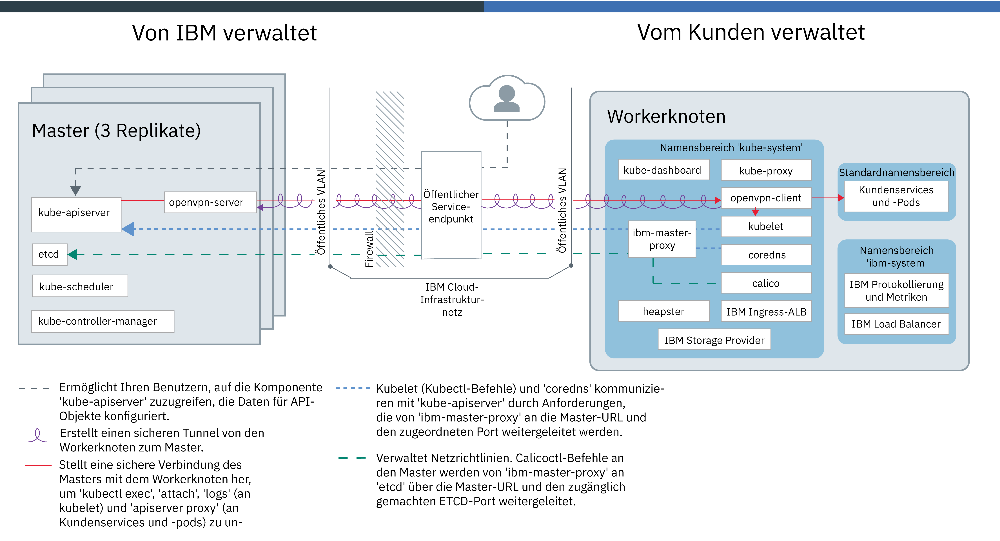
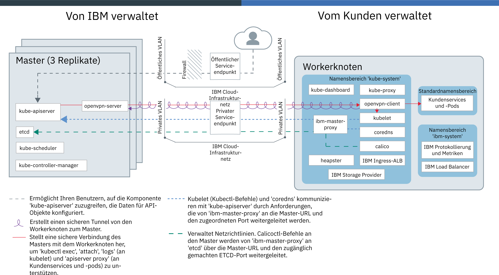

---

copyright:
  years: 2014, 2019
lastupdated: "2019-04-04"

keywords: kubernetes, iks, docker

subcollection: containers

---

{:new_window: target="_blank"}
{:shortdesc: .shortdesc}
{:screen: .screen}
{:pre: .pre}
{:table: .aria-labeledby="caption"}
{:codeblock: .codeblock}
{:tip: .tip}
{:note: .note}
{:important: .important}
{:deprecated: .deprecated}
{:download: .download}

# {{site.data.keyword.containerlong_notm}}-Technologie

Weitere Informationen zur Technologie hinter {{site.data.keyword.containerlong}}.
{:shortdesc}

## Docker-Container
{: #docker_containers}

Das auf die Basis von vorhandener Linux-Containertechnologie (LXC) aufbauende Open Source-Projekt Docker definiert Vorlagen, mit denen Software als standardisierte Einheiten gepackt wird, die als 'Container' bezeichnet werden und die alle Elemente enthalten, die Apps für die Ausführung benötigen. {{site.data.keyword.containerlong_notm}} verwendet `containerd` als Containerlaufzeit, um Container aus Docker-Container-Images in Ihrem Cluster bereitzustellen.
{:shortdesc}

Erfahren Sie mehr über einige grundlegende Docker-Konzepte:

<dl>
<dt>Image</dt>
<dd>Die Basis jedes Containers, den Sie ausführen möchten, ist ein Containerimage. Container-Images werden auf der Grundlage einer Dockerfile erstellt, bei der es sich um eine Textdatei handelt, die definiert, wie das Image erstellt wird und welche Buildartefakte darin enthalten sein sollen, z. B. die App, die Konfiguration der App und ihre Abhängigkeiten. Images werden immer auf der Grundlage anderer Images erstellt, wodurch sie schneller konfiguriert werden können. So wird die Hauptarbeit für ein Image von jemand anderem ausgeführt und Sie müssen das Image nur noch für Ihre Nutzung optimieren.</dd>
<dt>Registry</dt>
<dd>In einer 'Image-Registry' werden Docker-Images gespeichert, abgerufen und gemeinsam genutzt. Die in einer Registry gespeicherten Images können öffentlich verfügbar sein (öffentliche Registry) oder aber für eine kleine Gruppe von Benutzern zugänglich sein (private Registry). {{site.data.keyword.containerlong_notm}} bietet öffentliches Images, z. B. 'ibmliberty', mit denen Sie Ihre erste containerisierte App erstellen können. Was Unternehmensanwendungen betrifft, so sollten Sie jedoch eine private Registry (wie z. B. die von {{site.data.keyword.Bluemix_notm}} bereitgestellte Registry) verwenden, um zu verhindern, dass Ihre Images durch nicht berechtigte Benutzer verwendet werden.
</dd>
<dt>Container</dt>
<dd>Jeder Container wird auf der Grundlage eines Images erstellt. Ein Container ist eine gepackte App mit den zugehörigen Abhängigkeiten, sodass die App in eine andere Umgebungen verlagert und dort ohne Änderungen ausgeführt werden kann. Im Unterschied zu virtuellen Maschinen virtualisieren Container keine Einheiten, die zugehörigen Betriebssysteme und die zugrunde liegende Hardware. Nur App-Code, Laufzeit, Systemtools, Bibliotheken und Einstellungen werden in dem Container gepackt. Container werden als isolierte Prozesse auf Ubuntu-Rechenhosts ausgeführt und nutzen dasselbe Hostbetriebssystem und dieselben Hardwareressourcen. Dadurch ist ein Container schlanker, leichter portierbar und effizienter als eine virtuelle Maschine.</dd>
</dl>

### Die wichtigsten Vorteile der Verwendung von Containern
{: #container_benefits}

<dl>
<dt>Container sind agil</dt>
<dd>Container vereinfachen die Systemverwaltung durch die Bereitstellung standardisierter Umgebungen für Entwicklungs- und Produktionsbereitstellungen. Die schlanke Laufzeitumgebung ermöglicht schnelle Scale-up- und Scale-down-Operationen von Bereitstellungen. Reduzieren Sie die Komplexität bei der Verwaltung verschiedener Betriebssystemplattformen und ihrer zugrunde liegenden Infrastrukturen, indem Sie Container verwenden, um alle Apps in allen Infrastrukturen schnell und zuverlässig bereitstellen und ausführen zu können.</dd>
<dt>Container sind klein</dt>
<dd>Sie können in dem Speicherbereich, den eine einzelne virtuelle Maschine benötigt, viele Container unterbringen.</dd>
<dt>Container sind portierbar</dt>
<dd>
<ul>
  <li>Verwenden Sie Teile von Images wieder, um Container zu erstellen. </li>
  <li>Verschieben Sie App-Code schnell von Staging- in Produktionsumgebungen.</li>
  <li>Automatisieren Sie Ihre Prozesse mit Continuous Delivery-Tools.</li>
  </ul>
  </dd>

Erfahren Sie mehr über das [Sichern der persönlichen Daten](/docs/containers?topic=containers-security#pi) bei der Arbeit mit Container-Images.

Sind Sie bereit, mehr über Docker zu erfahren? <a href="https://developer.ibm.com/courses/all/docker-essentials-a-developer-introduction/" target="_blank">Erfahren Sie, wie Docker und {{site.data.keyword.containerlong_notm}} zusammenarbeiten, indem Sie diesen Kurs absolvieren.</a>

</dl>

 

## Kubernetes-Cluster
{: #kubernetes_basics}

Das Open-Source-Projekt Kubernetes vereint die Ausführung einer containerisierten Infrastruktur mit Produktionsarbeitslasten, Open-Source-Beiträgen und Managementtools für Docker-Container. Die Kubernetes-Infrastruktur bietet eine isolierte und sichere App-Plattform für die Verwaltung von Containern, die portierbar, erweiterbar und bei Auftreten von Failover-Situationen selbstheilend ist.
{:shortdesc}

Im folgenden Diagramm sind einige grundlegende Kubernetes-Konzepte veranschaulicht.

<dl>
<dt>Konto</dt>
<dd>Das Konto bezieht sich auf Ihr {{site.data.keyword.Bluemix_notm}}-Konto.</dd>

<dt>Cluster</dt>
<dd>Ein Kubernetes-Cluster besteht aus einem oder mehreren Rechenhosts, die als Workerknoten bezeichnet werden. Workerknoten werden von einem Kubernetes-Master verwaltet, der alle Kubernetes-Ressourcen im Cluster zentral steuert und überwacht. Wenn Sie also die Ressourcen für eine containerisierte App bereitstellen, entscheidet der Kubernetes-Master, auf welchen Workerknoten diese Ressourcen bereitgestellt werden sollen, und zwar unter Berücksichtigung der Bereitstellungsanforderungen und der im Cluster verfügbaren Kapazität. Kubernetes-Ressourcen sind Services, Bereitstellungen und Pods.</dd>

<dt>Service</dt>
<dd>Ein Service ist eine Kubernetes-Ressource, die eine Gruppe von Pods zusammenfasst und diesen Pods eine Netzverbindung bereitstellt, ohne hierbei die tatsächlichen IP-Adressen der einzelnen Pods preiszugeben. Mithilfe von Services können Sie Ihre App innerhalb Ihres Clusters oder im öffentlichen Internet zugänglich machen.
</dd>

<dt>Bereitstellung</dt>
<dd>Eine Bereitstellung ist eine Kubernetes-Ressource, in der Sie Informationen zu anderen Ressourcen oder Funktionalitäten angeben, die für die Ausführung Ihrer App erforderlich sind, z. B. Services, persistenter Speicher oder Annotationen. Sie dokumentieren eine Bereitstellung in einer YAML-Konfigurationsdatei und wenden diese dann auf den Cluster an. Der Kubernetes-Master konfiguriert die Ressourcen und stellt Container in Pods auf den Workerknoten mit verfügbarer Kapazität bereit.
  
Definieren Sie Aktualisierungsstrategien für Ihre App. Dabei können Sie unter anderem die Anzahl von Pods angeben, die Sie bei einer rollierenden Aktualisierung hinzufügen wollen, und festlegen, wie viele Pods zur gleichen Zeit unverfügbar sein dürfen. Wenn Sie eine rollierende Aktualisierung durchführen, prüft die Bereitstellung, ob die Aktualisierung funktioniert, und stoppt den Rollout, wenn Fehler erkannt werden.</dd>

<dt>Pod</dt>
<dd>Jede containerisierte App, die in einem Cluster bereitgestellt wird, wird von einer Kubernetes-Ressource namens Pod bereitgestellt, ausgeführt und verwaltet. Pods stellen kleine bereitstellbare Einheiten in einem Kubernetes-Cluster dar und werden verwendet, um Container zu gruppieren, die als einzelne Einheit verarbeitet werden müssen. In den meisten Fällen wird ein Container in einem eigenen Pod bereitgestellt. Es kann jedoch erforderlich sein, dass für eine App ein Container und weitere Hilfscontainer in einem Pod bereitgestellt werden, damit diese Container mit derselben privaten IP-Adresse referenziert werden können.</dd>

<dt>App</dt>
<dd>Eine App kann sich auf eine gesamte App oder eine Komponente einer App beziehen. Sie können Komponenten einer App in verschiedenen Pods oder Workerknoten bereitstellen.</dd>

Erfahren Sie mehr über das [Sichern der persönlichen Daten](/docs/containers?topic=containers-security#pi) bei der Arbeit mit Kubernetes-Ressourcen.

Sind Sie bereit, mehr über Kubernetes zu erfahren?

<ul><li><a href="/docs/containers?topic=containers-cs_cluster_tutorial#cs_cluster_tutorial" target="_blank">Erweitern Sie Ihr terminologisches Wissen mithilfe des Lernprogramms "Cluster erstellen"</a>.</li>
<li><a href="https://developer.ibm.com/courses/all/container-kubernetes-essentials-with-ibm-cloud/" target="_blank">Erfahren Sie, wie Kubernetes und {{site.data.keyword.containerlong_notm}} zusammenarbeiten, indem Sie diesen Kurs absolvieren.</a></li></ul>

</dl>

 

## Servicearchitektur
{: #architecture}

In einem Kubernetes-Cluster, der auf {{site.data.keyword.containerlong_notm}} ausgeführt wird, sind Ihre containerisierten Apps auf Rechenhosts gehostet, die als Workerknoten bezeichnet werden. Genauer genommen, werden die Apps auf Pods ausgeführt, die wiederum auf Workerknoten gehostet werden. Workerknoten werden vom Kubernetes-Master verwaltet. Die Einrichtung der Kommunikation zwischen dem Kubernetes-Master und den Workerknoten hängt davon ab, wie Sie Ihr IBM Cloud-Infrastrukturnetz (SoftLayer) einrichten: ein Konto mit einem öffentlichen Servicepunkt oder ein VRF-aktiviertes Konto mit öffentlichen und privaten Endpunkten.
{: shortdesc}

Die folgende Abbildung zeigt die Komponenten Ihres Clusters und die Art und Weise ihrer Interaktion, wenn nur der [öffentliche Serviceendpunkt aktiviert ist](/docs/containers?topic=containers-cs_network_ov#cs_network_ov_master_public).

<figure>
 
 <figcaption>{{site.data.keyword.containerlong_notm}}-Architektur, wenn nur der öffentliche Serviceendpunkt aktiviert ist</figcaption>
</figure>

Die folgende Abbildung zeigt die Komponenten Ihres Clusters und die Art und Weise ihrer Interaktion in einem VRF-aktivierten Konto, wenn der [öffentliche und der private Serviceendpunkt aktiviert sind](/docs/containers?topic=containers-cs_network_ov#cs_network_ov_master_both).

<figure>
 
 <figcaption>{{site.data.keyword.containerlong_notm}}-Architektur, wenn öffentliche und private Serviceendpunkte aktiviert sind</figcaption>
</figure>

Worin besteht der Unterschied zwischen dem Kubernetes-Master und einem Workerknoten? Gut, dass Sie das fragen.

<dl>
  <dt>Kubernetes-Master</dt>
    <dd>Der Kubernetes-Master hat die Aufgabe, alle Rechen-, Netz- und Speicherressourcen im Cluster zu verwalten. Der Kubernetes-Master stellt sicher, dass Ihre containerisierten Apps und Services auf den Workerknoten im Cluster gleichmäßig bereitgestellt werden. Abhängig davon, wie Sie Ihre App und Services konfigurieren, bestimmt der Master den Workerknoten, der über ausreichend Ressourcen verfügt, um die Anforderungen einer App zu erfüllen.  Die folgende Tabelle beschreibt die Komponenten des Kubernetes-Masters.
    <table>
    <caption>Komponenten des Kubernetes-Masters</caption>
    <thead>
    <th>Masterkomponente</th>
    <th>Beschreibung</th>
    </thead>
    <tbody>
    <tr>
    <td>kube-apiserver</td>
    <td>Der Kubernetes-API-Server dient als Haupteinstiegspunkt für alle Anforderungen der Clusterverwaltung vom Workerknoten zum Kubernetes-Master. Der Kubernetes-API-Server validiert und verarbeitet Anforderungen, die den Status von Kubernetes-Ressourcen (z. B. Pods oder Services) ändern, und speichert diesen Status in 'etcd'.</td>
    </tr>
    <tr>
    <td>openvpn-server</td>
    <td>Der OpenVPN-Server arbeitet mit dem OpenVPN-Client zusammen, um den Master sicher mit dem Workerknoten zu verbinden. Diese Verbindung unterstützt `apiserver proxy`-Aufrufe für Ihre Pods und Services sowie `kubectl exec`-, `attach`- und `logs`-Aufrufe für 'kubelet'.</td>
    </tr>
    <tr>
    <td>etcd</td>
    <td>'etcd' ist ein hoch verfügbarer Schlüsselwertspeicher, in dem der Status aller Kubernetes-Ressourcen eines Clusters gespeichert ist, wie z. B. von Services, Implementierungen und Pods. Daten in 'etcd' werden in einer verschlüsselten Speicherinstanz gesichert, die von IBM verwaltet wird.</td>
    </tr>
    <tr>
    <td>kube-scheduler</td>
    <td>Der Kubernetes-Scheduler überwacht neu erstellte Pods und entscheidet, wo sie auf der Basis von Kapazität, Leistungsbedarf, Richtlinienvorgaben, Anti-Affinitätsspezifikationen und Workloadanforderungen bereitgestellt werden. Wird kein Workerknoten gefunden, der mit den Anforderungen übereinstimmt, so wird der Pod nicht im Cluster bereitgestellt.</td>
    </tr>
    <tr>
    <td>kube-controller-manager</td>
    <td>Der Kubernetes-Controller-Manager ist ein Dämonprozess, der den Zustand von Clusterressourcen wie z. B. Replikatgruppen überwacht. Wenn sich der Zustand einer Ressource ändert, z. B. wenn ein Pod in einer Replikatgruppe inaktiv wird, leitet der Controller-Manager Korrekturmaßnahmen ein, um den erforderlichen Zustand zu erreichen.</td>
    </tr>
    </tbody></table></dd>
  <dt>Workerknoten</dt>
    <dd>Jeder Workerknoten ist eine physische Maschine (Bare-Metal) oder eine virtuelle Maschine, die auf physischer Hardware in der Cloudumgebung ausgeführt wird. Wenn Sie einen Workerknoten bereitstellen, legen Sie die Ressourcen fest, die den auf diesem Workerknoten gehosteten Containern zur Verfügung stehen. Ohne Vorbereitungen sind Ihre Workerknoten mit einer von {{site.data.keyword.IBM_notm}} verwalteten Docker Engine, getrennten Rechenressourcen, Netzbetrieb und einem Datenträgerservice eingerichtet. Die integrierten Sicherheitsfeatures stellen die Isolation, die Funktionalität für die Verwaltung von Ressourcen und die Einhaltung der Sicherheitsbestimmungen für die Workerknoten sicher.  
Das Ändern von Standardkomponenten für Workerknoten wie `kubelet` wird nicht unterstützt und kann zu nicht erwarteten Ergebnissen führen.
In der folgenden Tabelle werden die Komponenten eines Workerknotens beschrieben.
    <table>
    <caption>Komponenten von Workerknoten</caption>
    <thead>
    <th>Workerkomponente</th>
    <th>Namensbereich</th>
    <th>Beschreibung</th>
    </thead>
    <tbody>
    <tr>
    <td>`ibm-master-proxy`</td>
    <td>kube-system</td>
    <td>`ibm-master-proxy` leitet Anforderungen vom Workerknoten an die IP-Adressen der hoch verfügbaren Master-Replikate weiter. In Einzelzonenclustern verfügt der Master über drei Replikate auf separaten Hosts mit einer Master-IP-Adresse und einem Domänennamen. Für Cluster in einer mehrzonenfähigen Zone verfügt der Master über drei Replikate, die über Zonen verteilt sind. Jeder Master hat hier seine eigene IP-Adresse, die bei DNS registriert ist, und einen Domänennamen für den gesamten Cluster-Master.</td>
    </tr>
    <tr>
    <td>`openvpn-client`</td>
    <td>kube-system</td>
    <td>Der OpenVPN-Client arbeitet mit dem OpenVPN-Server zusammen, um den Master sicher mit dem Workerknoten zu verbinden. Diese Verbindung unterstützt `apiserver proxy`-Aufrufe für Ihre Pods und Services sowie `kubectl exec`-, `attach`- und `logs`-Aufrufe für 'kubelet'.</td>
    </tr>
    <tr>
    <td>`kubelet`</td>
    <td>kube-system</td>
    <td>Das 'kubelet' ist ein Pod, der auf allen Workerknoten ausgeführt wird und der für die Überwachung des Zustands der Pods verantwortlich ist, die auf dem Workerknoten aktiv sind, und für die Überwachung der Ereignisse, die der Kubernetes-API-Server sendet. Das 'kubelet' erstellt oder entfernt auf der Basis der Ereignisse Pods, stellt Aktivitäts- und Bereitschaftsprüfungen sicher und meldet dem Kubernetes-API-Server den Zustand der Pods.</td>
    </tr>
    <tr>
    <td>`coredns`</td>
    <td>kube-system</td>
    <td>Kubernetes plant standardmäßig einen CoreDNS-Pod und -Service (bzw. KubeDNS-Pod in Version 1.12 und früher) auf dem Cluster. Container verwenden automatisch die IP des DNS-Service, um DNS-Namen bei der Suche nach weiteren Pods und Services aufzulösen.</td>
    </tr>
    <tr>
    <td>`calico`</td>
    <td>kube-system</td>
    <td>Calico verwaltet die Netzrichtlinien für Ihren Cluster und besteht aus den folgenden Komponenten.
    <ul>
    <li>**`calico-cni`**: Die Container-Netzschnittstelle (CNI – Container Network Interface) von Calico verwaltet die Netzkonnektivität von Containern und entfernt zugeordnete Ressourcen, wenn ein Container gelöscht wird.</li>
    <li>**`calico-ipam`**: Die IP-Adressverwaltung von Calico (IPAM – IP Address Management) verwaltet die Zuordnung von IP-Adressen zu Containern.</li>
    <li>**`calico-node`**: Der Calico-Knoten ist ein Container, der die verschiedenen Komponenten bündelt, die für die Vernetzung von Containern mit Calico erforderlich sind.</li>
    <li>**`calico-policy-controller`**: Der Richtliniencontroller von Calico überwacht den eingehenden und ausgehenden Netzverkehr auf Konformität mit festgelegten Netzrichtlinien. Wenn der Datenverkehr im Cluster nicht zulässig ist, wird der Zugriff auf den Cluster blockiert. Der Richtliniencontroller von Calico wird auch verwendet, um Netzrichtlinien für einen Cluster zu erstellen und festzulegen.</li></ul></td>
    </tr>
    <tr>
    <td>`kube-proxy`</td>
    <td>kube-system</td>
    <td>Der Kubernetes-Netzproxy ist ein Dämonprozess, der auf allen Workerknoten ausgeführt wird und der TCP- und UDP-Netzverkehr für im Cluster ausgeführte Services weiterleitet oder deren Last verteilt.</td>
    </tr>
    <tr>
    <td>`kube-dashboard`</td>
    <td>kube-system</td>
    <td>Das Kubernetes-Dashboard ist eine webbasierte Benutzerschnittstelle, die es Benutzern ermöglicht, den Cluster und die Anwendungen, die im Cluster ausgeführt werden, zu verwalten und auftretende Fehler zu beheben.</td>
    </tr>
    <tr>
    <td>`heapster`</td>
    <td>kube-system</td>
    <td>Heapster ist ein clusterweiter Aggregator von Überwachungs- und Ereignisdaten. Der Heapster-Pod erkennt alle Knoten im Cluster und fragt bei den Kubelets der einzelnen Knoten die Nutzungsinformationen ab. Sie finden Nutzungsdiagramme im Kubernetes-Dashboard.</td>
    </tr>
    <tr>
    <td>Ingress-ALB</td>
    <td>kube-system</td>
    <td>Ingress ist ein Kubernetes-Service, den Sie verwenden können, um Netzverkehr-Workloads in Ihrem Cluster auszugleichen, indem Sie öffentliche oder private Anforderungen an mehrere Apps in Ihrem Cluster weiterleiten. Um Ihre Apps über das öffentliche oder private Netz zugänglich zu machen, müssen Sie eine Ingress-Ressource erstellen, um Ihre Apps für die Ingress-ALB (ALB – Application Load Balancer, Lastausgleichsfunktion für Anwendungen) zu registrieren. Es kann dann mithilfe einer einzigen URL- oder IP-Adresse auf mehrere Apps zugegriffen werden.</td>
    </tr>
    <tr>
    <td>Storage Provider</td>
    <td>kube-system</td>
    <td>Jeder Cluster ist mit einem Plug-in für die Bereitstellung von Dateispeicher konfiguriert. Sie können auswählen, weitere Add-ons zu installieren, wie z. B. Blockspeicher.</td>
    </tr>
    <tr>
    <td>Protokollierung und Metriken</td>
    <td>ibm-system</td>
    <td>Sie können die integrierten Services {{site.data.keyword.loganalysislong_notm}} und {{site.data.keyword.monitoringlong_notm}} verwenden, um Ihre Erfassungs- und Aufbewahrungsmöglichkeiten bei der Arbeit mit Protokollen und Metriken zu erweitern.</td>
    </tr>
    <tr>
    <td>Lastausgleichsfunktion</td>
    <td>ibm-system</td>
    <td>Eine Lastausgleichsfunktion ist ein Kubernetes-Service, der verwendet werden kann, um Netzverkehr-Workloads in Ihrem Cluster auszugleichen, indem öffentliche oder private Anforderungen an eine App weitergeleitet werden.</td>
    </tr>
    <tr>
    <td>App-Pods und -Services</td>
    <td>default</td>
    <td>Im Namensbereich <code>default</code> oder in von Ihnen erstellten Namensbereichen können Sie Apps in Pods und Services bereitstellen, damit Sie mit diesen Pods kommunizieren können.</td>
    </tr>
    </tbody></table></dd>
</dl>

Möchten Sie sehen, wie {{site.data.keyword.containerlong_notm}} mit anderen Produkten und Services verwendet werden kann? Werfen Sie einen Blick auf einige [Integrationen](/docs/containers?topic=containers-supported_integrations#supported_integrations).
{: tip}
