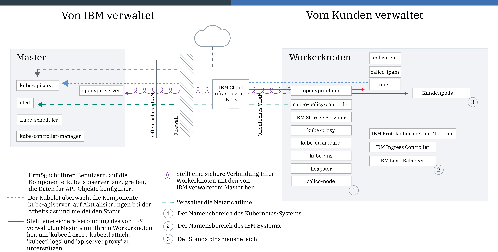

---

copyright:
  years: 2014, 2018
lastupdated: "2018-05-24"

---

{:new_window: target="_blank"}
{:shortdesc: .shortdesc}
{:screen: .screen}
{:pre: .pre}
{:table: .aria-labeledby="caption"}
{:codeblock: .codeblock}
{:tip: .tip}
{:download: .download}

# {{site.data.keyword.containerlong_notm}}-Technologie

Weitere Informationen zur Technologie hinter {{site.data.keyword.containerlong}}.
{:shortdesc}

## Docker-Container
{: #docker_containers}

Aufbauend auf der vorhandenen LXC (Linux Container)-Technologie hat sich das Open-Source-Projekt Docker zu einer Softwareplattform entwickelt, die Sie zum schnellen Testen, Bereitstellen und Skalieren von Apps einsetzen können. Docker packt Software in standardisierten Einheiten, die als Container bezeichnet werden und alle Elemente enthalten, die eine App für die Ausführung benötigt.
{:shortdesc}

Erfahren Sie mehr über einige grundlegende Docker-Konzepte:

<dl>
<dt>Image</dt>
<dd>Ein Docker-Image wird auf der Grundlage einer Dockerfile erstellt. Hierbei handelt es sich  um eine Textdatei, die definiert, wie das Image erstellt wird und welche Buildartefakte darin enthalten sein sollen, z. B. die App, die Konfiguration der App und ihre Abhängigkeiten. Images werden immer auf der Grundlage anderer Images erstellt, wodurch sie schneller konfiguriert werden können. So wird die Hauptarbeit für ein Image von jemand anderem ausgeführt und Sie müssen das Image nur noch für Ihre Nutzung optimieren.</dd>
<dt>Registry</dt>
<dd>Eine Image-Registry ist ein Ort, an dem Docker-Images gespeichert, abgerufen und von gemeinsam genutzt werden können. Die in einer Registry gespeicherten Images können öffentlich verfügbar sein (öffentliche Registry) oder aber für eine kleine Gruppe von Benutzern zugänglich sein (private Registry). {{site.data.keyword.containershort_notm}} bietet öffentliches Images, z. B. 'ibmliberty', mit denen Sie Ihre erste containerisierte App erstellen können. Was Unternehmensanwendungen betrifft, so sollten Sie jedoch eine private Registry (wie z. B. die von {{site.data.keyword.Bluemix_notm}} bereitgestellte Registry) verwenden, um zu verhindern, dass Ihre Images durch nicht berechtigte Benutzer verwendet werden.
</dd>
<dt>Container</dt>
<dd>Jeder Container wird auf der Grundlage eines Images erstellt. Ein Container ist eine gepackte App mit den zugehörigen Abhängigkeiten, sodass die App in eine andere Umgebungen verlagert und dort ohne Änderungen ausgeführt werden kann. Im Unterschied zu virtuellen Maschinen virtualisieren Container keine Einheiten, die zugehörigen Betriebssysteme und die zugrunde liegende Hardware. Nur App-Code, Laufzeit, Systemtools, Bibliotheken und Einstellungen werden in dem Container gepackt. Container werden als isolierte Prozesse auf Ubuntu-Rechenhosts ausgeführt und nutzen dasselbe Hostbetriebssystem und dieselben Hardwareressourcen. Dadurch ist ein Container schlanker, leichter portierbar und effizienter als eine virtuelle Maschine.</dd>
</dl>

### Die wichtigsten Vorteile der Verwendung von Containern
{: #container_benefits}

<dl>
<dt>Container sind agil</dt>
<dd>Container vereinfachen die Systemverwaltung durch die Bereitstellung standardisierter Umgebungen für Entwicklungs- und Produktionsbereitstellungen. Die schlanke Laufzeitumgebung ermöglicht schnelle Scale-up- und Scale-down-Operationen von Bereitstellungen. Reduzieren Sie die Komplexität bei der Verwaltung verschiedener Betriebssystemplattformen und ihrer zugrunde liegenden Infrastrukturen, indem Sie Container verwenden, um alle Apps in allen Infrastrukturen schnell und zuverlässig bereitstellen und ausführen zu können.</dd>
<dt>Container sind klein</dt>
<dd>Sie können in dem Speicherbereich, den eine einzelne virtuelle Maschine benötigt, viele Container unterbringen.</dd>
<dt>Container sind portierbar</dt>
<dd>
<ul>
  <li>Verwenden Sie Teile von Images wieder, um Container zu erstellen. </li>
  <li>Verschieben Sie App-Code schnell von Staging- in Produktionsumgebungen.</li>
  <li>Automatisieren Sie Ihre Prozesse mit Continuous Delivery-Tools.</li>
  </ul>
  </dd>

Erfahren Sie mehr über das [Sichern der persönliche Daten](cs_secure.html#pi) bei der Arbeit mit Container-Images.

Sind Sie bereit, mehr über Docker zu erfahren? <a href="https://developer.ibm.com/courses/all/docker-essentials-extend-your-apps-with-containers/" target="_blank">Erfahren Sie, wie Docker und {{site.data.keyword.containershort_notm}} zusammenarbeiten, indem Sie diesen Kurs absolvieren.</a>

</dl>

 

## Kubernetes-Cluster
{: #kubernetes_basics}

Das Open-Source-Projekt Kubernetes vereint die Ausführung einer containerisierten Infrastruktur mit Produktionsarbeitslasten, Open-Source-Beiträgen und Managementtools für Docker-Container. Die Kubernetes-Infrastruktur bietet eine isolierte und sichere App-Plattform für die Verwaltung von Containern, die portierbar, erweiterbar und bei Auftreten von Failover-Situationen selbstheilend ist.
{:shortdesc}

Im folgenden Diagramm sind einige grundlegende Kubernetes-Konzepte veranschaulicht.

<dl>
<dt>Konto</dt>
<dd>Das Konto bezieht sich auf Ihr {{site.data.keyword.Bluemix_notm}}-Konto.</dd>

<dt>Cluster</dt>
<dd>Ein Kubernetes-Cluster besteht aus einem oder mehreren Rechenhosts, die als Workerknoten bezeichnet werden. Workerknoten werden von einem Kubernetes-Master verwaltet, der alle Kubernetes-Ressourcen im Cluster zentral steuert und überwacht. Wenn Sie also die Ressourcen für eine containerisierte App bereitstellen, entscheidet der Kubernetes-Master, auf welchen Workerknoten diese Ressourcen bereitgestellt werden sollen, und zwar unter Berücksichtigung der Bereitstellungsanforderungen und der im Cluster verfügbaren Kapazität. Kubernetes-Ressourcen sind Services, Bereitstellungen und Pods.</dd>

<dt>Service</dt>
<dd>Ein Service ist eine Kubernetes-Ressource, die eine Gruppe von Pods zusammenfasst und diesen Pods eine Netzverbindung bereitstellt, ohne hierbei die tatsächlichen IP-Adressen der einzelnen Pods preiszugeben. Mithilfe von Services können Sie Ihre App innerhalb Ihres Clusters oder im öffentlichen Internet zugänglich machen.
</dd>

<dt>Bereitstellung</dt>
<dd>Eine Bereitstellung ist eine Kubernetes-Ressource, in der Sie Informationen zu anderen Ressourcen oder Funktionalitäten angeben, die für die Ausführung Ihrer App erforderlich sind, z. B. Services, persistenter Speicher oder Annotationen. Sie dokumentieren eine Bereitstellung in einer YAML-Konfigurationsdatei und wenden diese dann auf den Cluster an. Der Kubernetes-Master konfiguriert die Ressourcen und stellt Container in Pods auf den Workerknoten mit verfügbarer Kapazität bereit.
  
Definieren Sie Aktualisierungsstrategien für Ihre App. Dabei können Sie unter anderem die Anzahl von Pods angeben, die Sie bei einer rollierenden Aktualisierung hinzufügen wollen, und festlegen, wie viele Pods zur gleichen Zeit nicht verfügbar sein dürfen. Wenn Sie eine rollierende Aktualisierung durchführen, prüft die Bereitstellung, ob die Aktualisierung funktioniert, und stoppt den Rollout, wenn Fehler erkannt werden.</dd>

<dt>Pod</dt>
<dd>Jede containerisierte App, die in einem Cluster bereitgestellt wird, wird von einer Kubernetes-Ressource namens Pod bereitgestellt, ausgeführt und verwaltet. Pods stellen kleine bereitstellbare Einheiten in einem Kubernetes-Cluster dar und werden verwendet, um Container zu gruppieren, die als einzelne Einheit verarbeitet werden müssen. In den meisten Fällen wird ein Container in einem eigenen Pod bereitgestellt. Es kann jedoch erforderlich sein, dass für eine App ein Container und weitere Hilfscontainer in einem Pod bereitgestellt werden, damit diese Container mit derselben privaten IP-Adresse referenziert werden können.</dd>

<dt>App</dt>
<dd>Eine App kann sich auf eine gesamte App oder eine Komponente einer App beziehen. Sie können Komponenten einer App in verschiedenen Pods oder Workerknoten bereitstellen.</dd>

Erfahren Sie mehr über das [Sichern der persönliche Daten](cs_secure.html#pi) bei der Arbeit mit Kubernetes-Ressourcen.

Sind Sie bereit, mehr über Kubernetes zu erfahren?

<ul><li><a href="cs_tutorials.html#cs_cluster_tutorial" target="_blank">Erweitern Sie Ihr terminologisches Wissen mithilfe des Lernprogramms "Cluster erstellen"</a>.</li>
<li><a href="https://developer.ibm.com/courses/all/get-started-kubernetes-ibm-cloud-container-service/" target="_blank">Erfahren Sie, wie Kubernetes und {{site.data.keyword.containershort_notm}} zusammenarbeiten, indem Sie diesen Kurs absolvieren.</a></li></ul>

</dl>

 

## Servicearchitektur
{: #architecture}

In einem Kubernetes-Cluster, der auf {{site.data.keyword.containershort_notm}} ausgeführt wird, sind Ihre containerisierten Apps auf Rechenhosts gehostet, die als Workerknoten bezeichnet werden. Ganz genau genommen, werden die Apps auf Pods ausgeführt, die wiederum auf Workerknoten gehostet werden. Workerknoten werden vom Kubernetes-Master verwaltet. Der Kubernetes Master und die Arbeitsknoten kommunizieren über sichere TLS-Zertifikate und eine openVPN-Verbindung miteinander, um Ihre Clusterkonfigurationen zu koordinieren.
{: shortdesc}

Worin besteht der Unterschied zwischen dem Kubernetes-Master und einem Workerknoten? Gut, dass Sie das fragen.

<dl>
  <dt>Kubernetes-Master</dt>
    <dd>Der Kubernetes-Master hat die Aufgabe, alle Rechen-, Netz- und Speicherressourcen im Cluster zu verwalten. Der Kubernetes-Master stellt sicher, dass Ihre containerisierten Apps und Services auf den Workerknoten im Cluster gleichmäßig bereitgestellt werden. Abhängig davon, wie Sie Ihre App und Services konfigurieren, bestimmt der Master den Workerknoten, der über ausreichend Ressourcen verfügt, um die Anforderungen einer App zu erfüllen.</dd>
  <dt>Workerknoten</dt>
    <dd>Jeder Workerknoten ist eine physische Maschine (Bare-Metal) oder eine virtuelle Maschine, die auf physischer Hardware in der Cloudumgebung ausgeführt wird. Wenn Sie einen Workerknoten bereitstellen, legen Sie die Ressourcen fest, die den auf diesem Workerknoten gehosteten Containern zur Verfügung stehen. Ohne Vorbereitungen sind Ihre Workerknoten mit einer von {{site.data.keyword.IBM_notm}} verwalteten Docker Engine, getrennten Rechenressourcen, Netzbetrieb und einem Datenträgerservice eingerichtet. Die integrierten Sicherheitsfeatures stellen die Isolation, die Funktionalität für die Verwaltung von Ressourcen und die Einhaltung der Sicherheitsbestimmungen für die Workerknoten sicher.</dd>
</dl>

<figure>
 
 <figcaption>{{site.data.keyword.containershort_notm}}-Architektur</figcaption>
</figure>

Möchten Sie sehen, wie {{site.data.keyword.containerlong_notm}} mit anderen Produkten und Services verwendet werden kann? Werfen Sie einen Blick auf einige [Integrationen](cs_integrations.html#integrations).

 

